# Opinion Poll by Peil.nl, 9–10 April 2021

<a href="#voting-intentions">Voting Intentions</a> | <a href="#seats">Seats</a> | <a href="#coalitions">Coalitions</a> | <a href="#technical-information">Technical Information</a>

## Voting Intentions

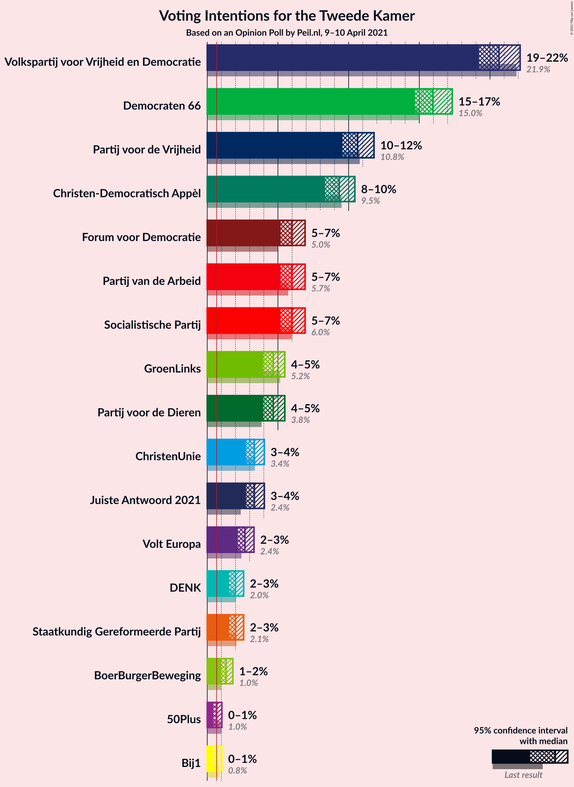

### Confidence Intervals

| Party | Last Result | Poll Result | 80% Confidence Interval | 90% Confidence Interval | 95% Confidence Interval | 99% Confidence Interval |
|:-----:|:-----------:|:-----------:|:-----------------------:|:-----------------------:|:-----------------------:|:-----------------------:|
| Volkspartij voor Vrijheid en Democratie | 21.9% | 20.6% | 19.7–21.6% |19.4–21.9% |19.2–22.1% |18.8–22.6% |
| Democraten 66 | 15.0% | 16.0% | 15.1–16.9% |14.9–17.1% |14.7–17.3% |14.3–17.8% |
| Partij voor de Vrijheid | 10.8% | 10.6% | 9.9–11.4% |9.7–11.6% |9.6–11.8% |9.3–12.2% |
| Christen-Democratisch Appèl | 9.5% | 9.3% | 8.7–10.1% |8.5–10.3% |8.3–10.4% |8.0–10.8% |
| Socialistische Partij | 6.0% | 6.0% | 5.5–6.6% |5.3–6.8% |5.2–6.9% |5.0–7.2% |
| Partij van de Arbeid | 5.7% | 6.0% | 5.5–6.6% |5.3–6.8% |5.2–6.9% |5.0–7.2% |
| Forum voor Democratie | 5.0% | 6.0% | 5.5–6.6% |5.3–6.8% |5.2–6.9% |5.0–7.2% |
| GroenLinks | 5.2% | 4.7% | 4.2–5.2% |4.1–5.3% |4.0–5.5% |3.7–5.8% |
| Partij voor de Dieren | 3.8% | 4.7% | 4.2–5.2% |4.1–5.3% |4.0–5.5% |3.7–5.8% |
| ChristenUnie | 3.4% | 3.3% | 2.9–3.8% |2.8–3.9% |2.7–4.0% |2.6–4.3% |
| Juiste Antwoord 2021 | 2.4% | 3.3% | 2.9–3.8% |2.8–3.9% |2.7–4.0% |2.6–4.3% |
| Volt Europa | 2.4% | 2.7% | 2.3–3.1% |2.2–3.2% |2.1–3.3% |2.0–3.5% |
| Staatkundig Gereformeerde Partij | 2.1% | 2.0% | 1.7–2.4% |1.6–2.5% |1.6–2.6% |1.4–2.8% |
| DENK | 2.0% | 2.0% | 1.7–2.4% |1.6–2.5% |1.6–2.6% |1.4–2.8% |
| BoerBurgerBeweging | 1.0% | 1.3% | 1.1–1.6% |1.0–1.7% |1.0–1.8% |0.9–2.0% |
| 50Plus | 1.0% | 0.7% | 0.5–0.9% |0.5–1.0% |0.4–1.0% |0.4–1.2% |
| Bij1 | 0.8% | 0.7% | 0.5–0.9% |0.5–1.0% |0.4–1.0% |0.4–1.2% |

*Note:* The poll result column reflects the actual value used in the calculations. Published results may vary slightly, and in addition be rounded to fewer digits.

## Seats

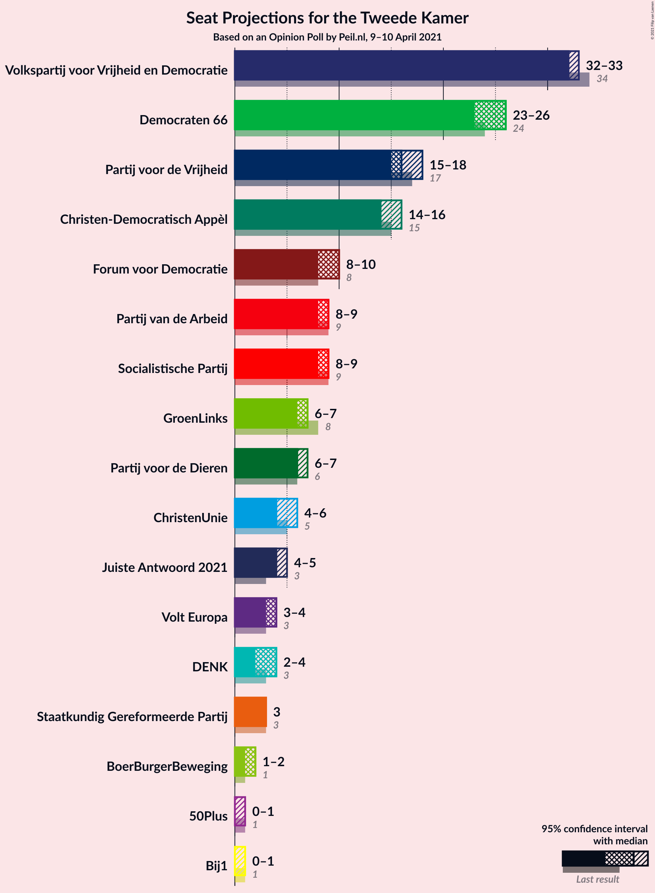

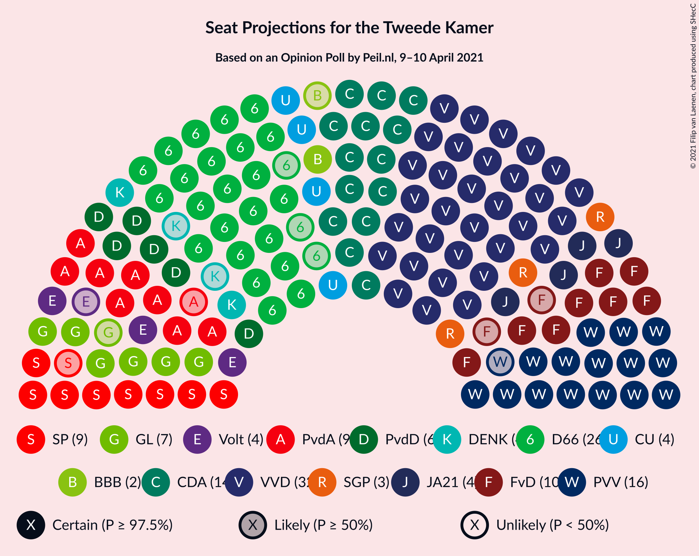

### Confidence Intervals

| Party | Last Result | Median | 80% Confidence Interval | 90% Confidence Interval | 95% Confidence Interval | 99% Confidence Interval |
|:-----:|:-----------:|:------:|:-----------------------:|:-----------------------:|:-----------------------:|:-----------------------:|
| <a href="#volkspartij-voor-vrijheid-en-democratie">Volkspartij voor Vrijheid en Democratie</a> | 34 | 32 | 32 |32–33 |32–33 |28–34 |
| <a href="#democraten-66">Democraten 66</a> | 24 | 26 | 24–26 |24–26 |23–26 |22–27 |
| <a href="#partij-voor-de-vrijheid">Partij voor de Vrijheid</a> | 17 | 16 | 16–17 |15–17 |15–18 |15–18 |
| <a href="#christen-democratisch-appèl">Christen-Democratisch Appèl</a> | 15 | 14 | 14–16 |14–16 |14–16 |13–16 |
| <a href="#socialistische-partij">Socialistische Partij</a> | 9 | 9 | 8–9 |8–9 |8–9 |8–10 |
| <a href="#partij-van-de-arbeid">Partij van de Arbeid</a> | 9 | 9 | 9 |9 |8–9 |8–10 |
| <a href="#forum-voor-democratie">Forum voor Democratie</a> | 8 | 10 | 10 |9–10 |8–10 |7–10 |
| <a href="#groenlinks">GroenLinks</a> | 8 | 7 | 6–7 |6–7 |6–7 |6–8 |
| <a href="#partij-voor-de-dieren">Partij voor de Dieren</a> | 6 | 6 | 6–7 |6–7 |6–7 |6–8 |
| <a href="#christenunie">ChristenUnie</a> | 5 | 4 | 4–6 |4–6 |4–6 |4–6 |
| <a href="#juiste-antwoord-2021">Juiste Antwoord 2021</a> | 3 | 4 | 4 |4 |4–5 |4–6 |
| <a href="#volt-europa">Volt Europa</a> | 3 | 4 | 3–4 |3–4 |3–4 |3–5 |
| <a href="#staatkundig-gereformeerde-partij">Staatkundig Gereformeerde Partij</a> | 3 | 3 | 3 |3 |3 |2–4 |
| <a href="#denk">DENK</a> | 3 | 4 | 2–4 |2–4 |2–4 |2–4 |
| <a href="#boerburgerbeweging">BoerBurgerBeweging</a> | 1 | 2 | 1–2 |1–2 |1–2 |1–2 |
| <a href="#50plus">50Plus</a> | 1 | 0 | 0–1 |0–1 |0–1 |0–1 |
| <a href="#bij1">Bij1</a> | 1 | 0 | 0–1 |0–1 |0–1 |0–1 |

### Volkspartij voor Vrijheid en Democratie

*For a full overview of the results for this party, see the [Volkspartij voor Vrijheid en Democratie](party-volkspartijvoorvrijheidendemocratie.html) page.*

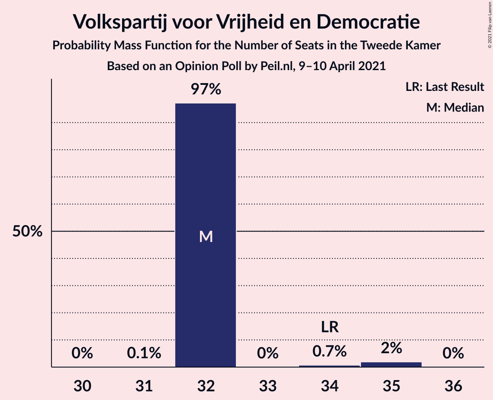

| Number of Seats | Probability | Accumulated | Special Marks |
|:---------------:|:-----------:|:-----------:|:-------------:|
| 28 | 0.7% | 100% |  |
| 29 | 0.2% | 99.3% |  |
| 30 | 0.5% | 99.1% |  |
| 31 | 0.4% | 98.5% |  |
| 32 | 93% | 98% | Median |
| 33 | 5% | 6% |  |
| 34 | 0.5% | 0.8% | Last Result |
| 35 | 0.3% | 0.3% |  |
| 36 | 0% | 0% |  |

### Democraten 66

*For a full overview of the results for this party, see the [Democraten 66](party-democraten66.html) page.*

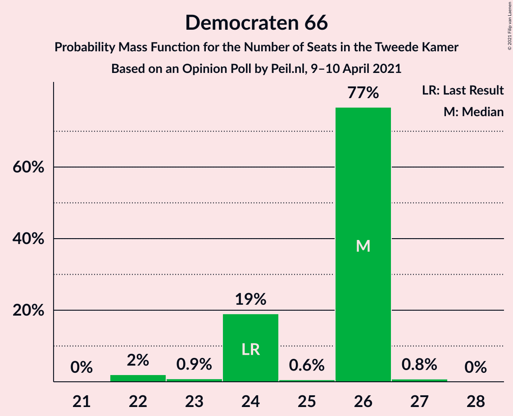

| Number of Seats | Probability | Accumulated | Special Marks |
|:---------------:|:-----------:|:-----------:|:-------------:|
| 22 | 2% | 100% |  |
| 23 | 0.9% | 98% |  |
| 24 | 19% | 97% | Last Result |
| 25 | 0.6% | 78% |  |
| 26 | 77% | 78% | Median |
| 27 | 0.8% | 0.8% |  |
| 28 | 0% | 0% |  |

### Partij voor de Vrijheid

*For a full overview of the results for this party, see the [Partij voor de Vrijheid](party-partijvoordevrijheid.html) page.*

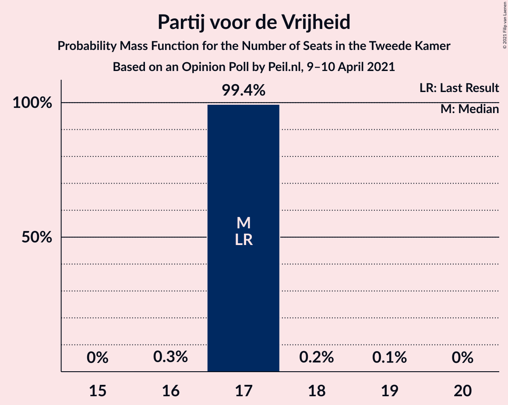

| Number of Seats | Probability | Accumulated | Special Marks |
|:---------------:|:-----------:|:-----------:|:-------------:|
| 15 | 10% | 100% |  |
| 16 | 70% | 90% | Median |
| 17 | 15% | 20% | Last Result |
| 18 | 4% | 4% |  |
| 19 | 0% | 0.1% |  |
| 20 | 0% | 0% |  |

### Christen-Democratisch Appèl

*For a full overview of the results for this party, see the [Christen-Democratisch Appèl](party-christen-democratischappèl.html) page.*

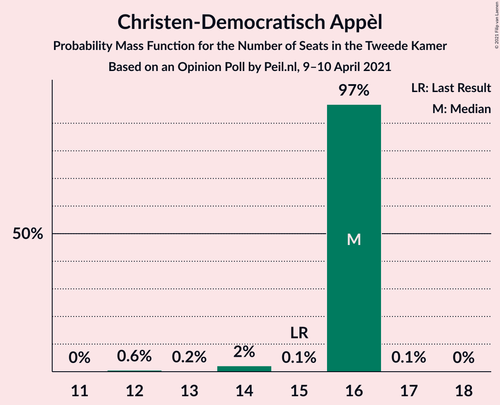

| Number of Seats | Probability | Accumulated | Special Marks |
|:---------------:|:-----------:|:-----------:|:-------------:|
| 11 | 0.1% | 100% |  |
| 12 | 0.1% | 99.9% |  |
| 13 | 0.9% | 99.7% |  |
| 14 | 63% | 98.8% | Median |
| 15 | 22% | 36% | Last Result |
| 16 | 14% | 14% |  |
| 17 | 0% | 0% |  |

### Socialistische Partij

*For a full overview of the results for this party, see the [Socialistische Partij](party-socialistischepartij.html) page.*

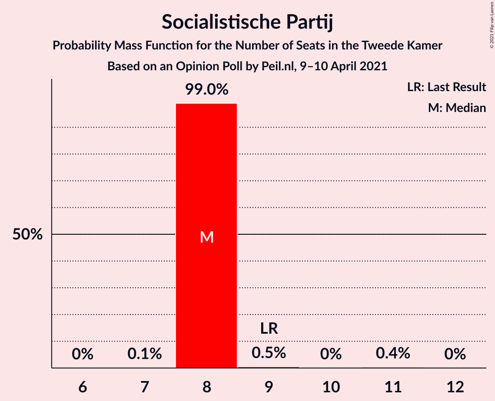

| Number of Seats | Probability | Accumulated | Special Marks |
|:---------------:|:-----------:|:-----------:|:-------------:|
| 7 | 0.2% | 100% |  |
| 8 | 19% | 99.8% |  |
| 9 | 79% | 80% | Last Result, Median |
| 10 | 1.2% | 1.2% |  |
| 11 | 0.1% | 0.1% |  |
| 12 | 0% | 0% |  |

### Partij van de Arbeid

*For a full overview of the results for this party, see the [Partij van de Arbeid](party-partijvandearbeid.html) page.*

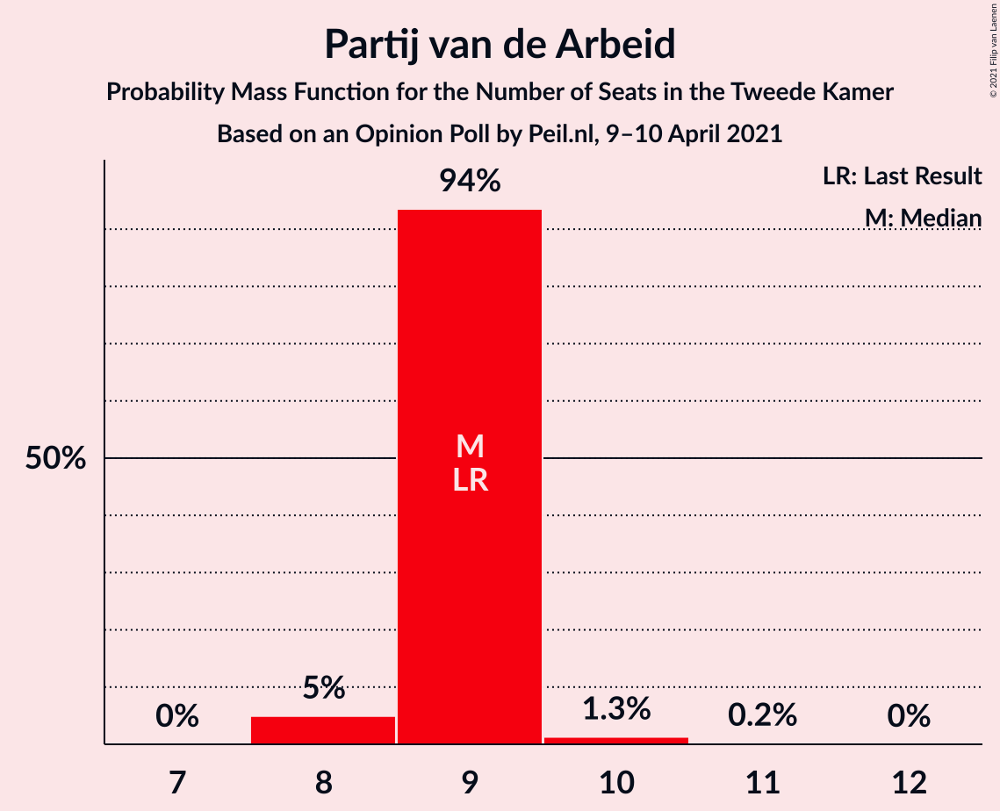

| Number of Seats | Probability | Accumulated | Special Marks |
|:---------------:|:-----------:|:-----------:|:-------------:|
| 8 | 5% | 100% |  |
| 9 | 94% | 95% | Last Result, Median |
| 10 | 1.3% | 1.5% |  |
| 11 | 0.2% | 0.2% |  |
| 12 | 0% | 0% |  |

### Forum voor Democratie

*For a full overview of the results for this party, see the [Forum voor Democratie](party-forumvoordemocratie.html) page.*

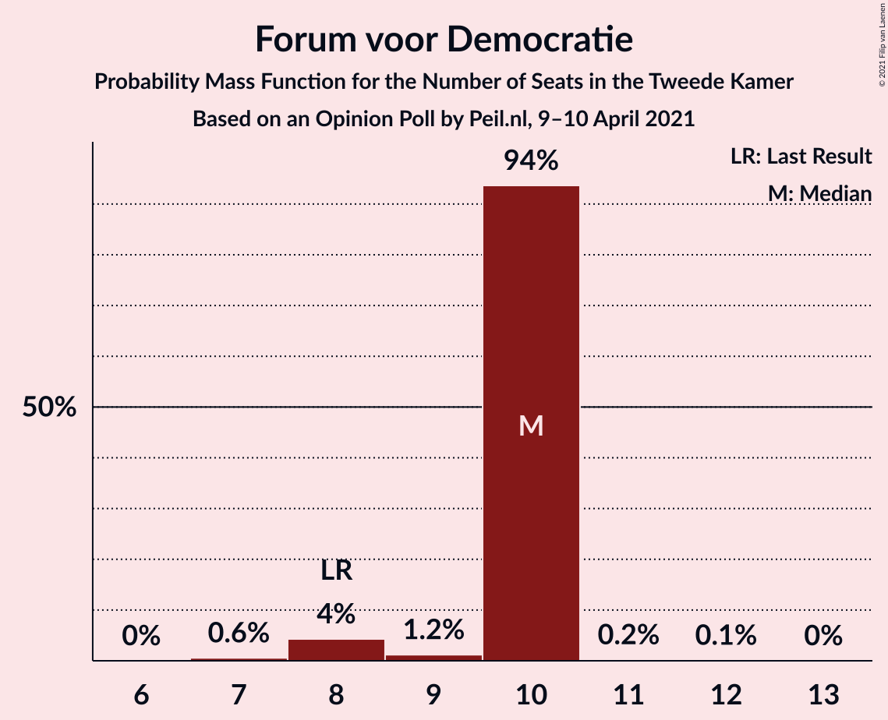

| Number of Seats | Probability | Accumulated | Special Marks |
|:---------------:|:-----------:|:-----------:|:-------------:|
| 7 | 0.6% | 100% |  |
| 8 | 4% | 99.4% | Last Result |
| 9 | 1.2% | 95% |  |
| 10 | 94% | 94% | Median |
| 11 | 0.2% | 0.3% |  |
| 12 | 0.1% | 0.1% |  |
| 13 | 0% | 0% |  |

### GroenLinks

*For a full overview of the results for this party, see the [GroenLinks](party-groenlinks.html) page.*

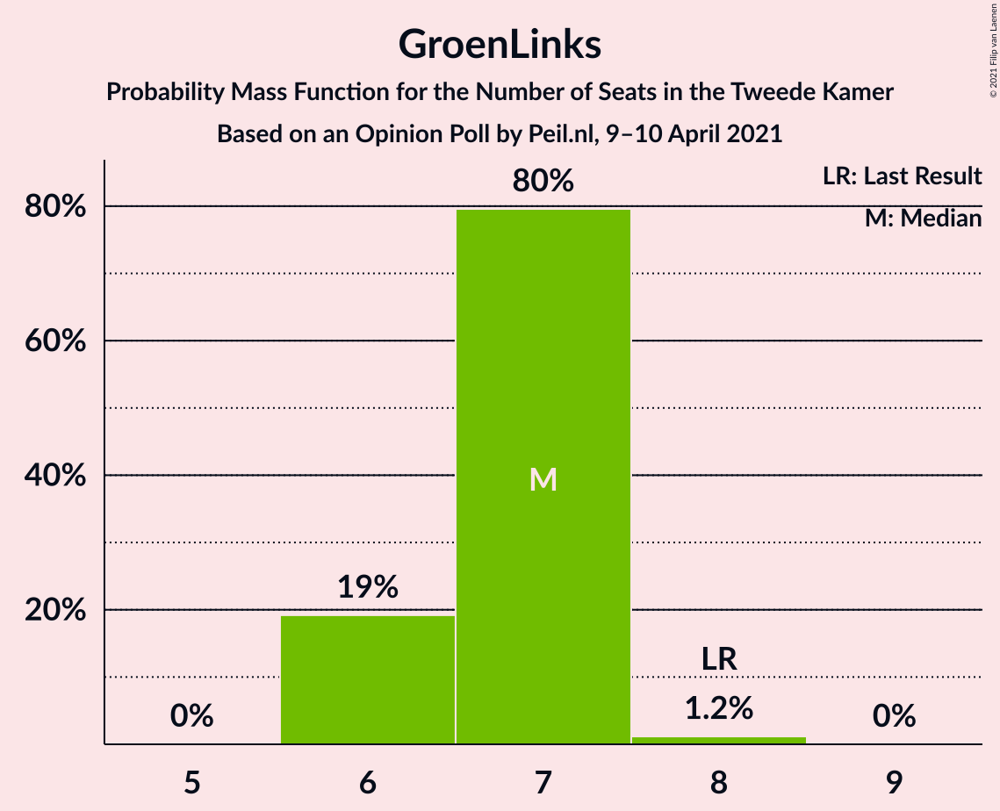

| Number of Seats | Probability | Accumulated | Special Marks |
|:---------------:|:-----------:|:-----------:|:-------------:|
| 6 | 19% | 100% |  |
| 7 | 80% | 81% | Median |
| 8 | 1.2% | 1.2% | Last Result |
| 9 | 0% | 0% |  |

### Partij voor de Dieren

*For a full overview of the results for this party, see the [Partij voor de Dieren](party-partijvoordedieren.html) page.*

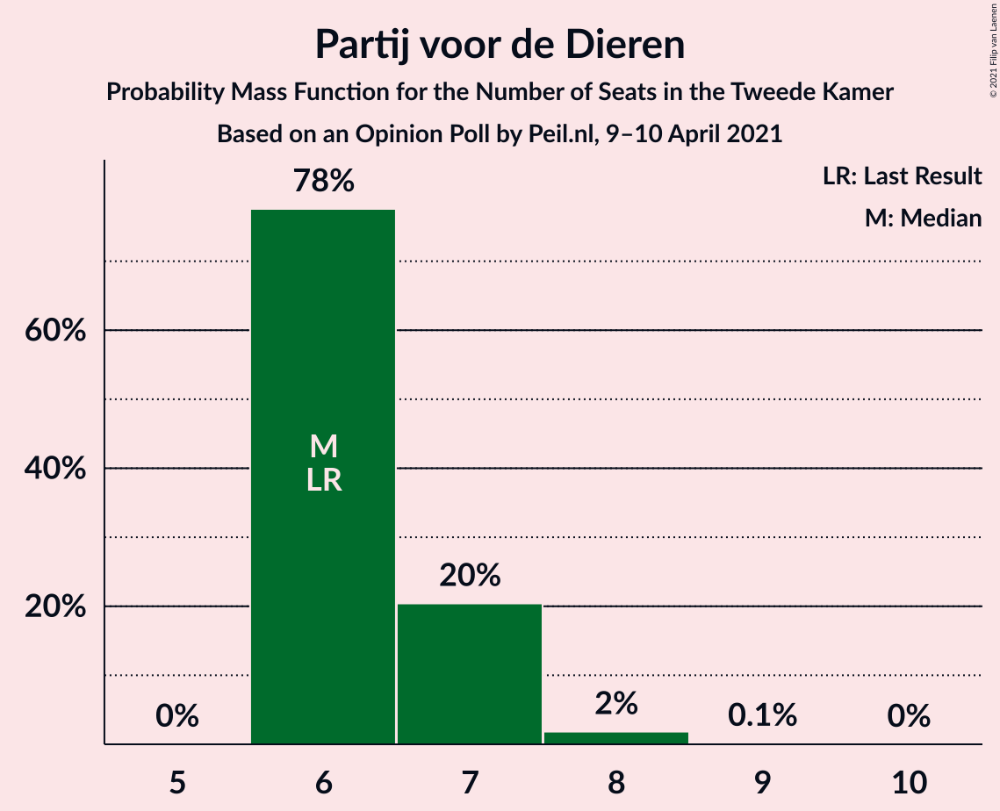

| Number of Seats | Probability | Accumulated | Special Marks |
|:---------------:|:-----------:|:-----------:|:-------------:|
| 6 | 78% | 100% | Last Result, Median |
| 7 | 20% | 22% |  |
| 8 | 2% | 2% |  |
| 9 | 0.1% | 0.1% |  |
| 10 | 0% | 0% |  |

### ChristenUnie

*For a full overview of the results for this party, see the [ChristenUnie](party-christenunie.html) page.*

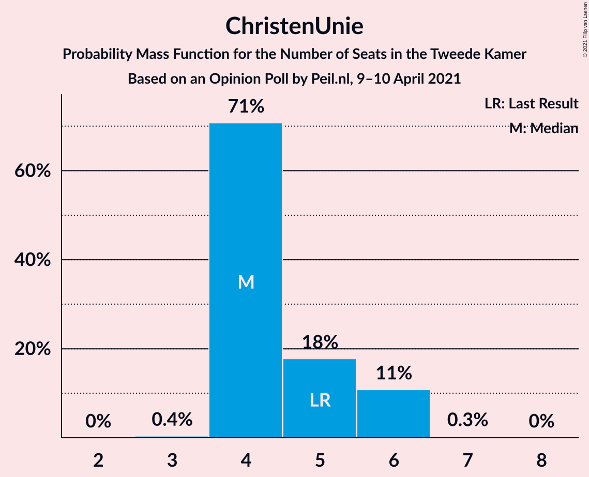

| Number of Seats | Probability | Accumulated | Special Marks |
|:---------------:|:-----------:|:-----------:|:-------------:|
| 3 | 0.4% | 100% |  |
| 4 | 71% | 99.6% | Median |
| 5 | 18% | 29% | Last Result |
| 6 | 11% | 11% |  |
| 7 | 0.3% | 0.3% |  |
| 8 | 0% | 0% |  |

### Juiste Antwoord 2021

*For a full overview of the results for this party, see the [Juiste Antwoord 2021](party-juisteantwoord2021.html) page.*

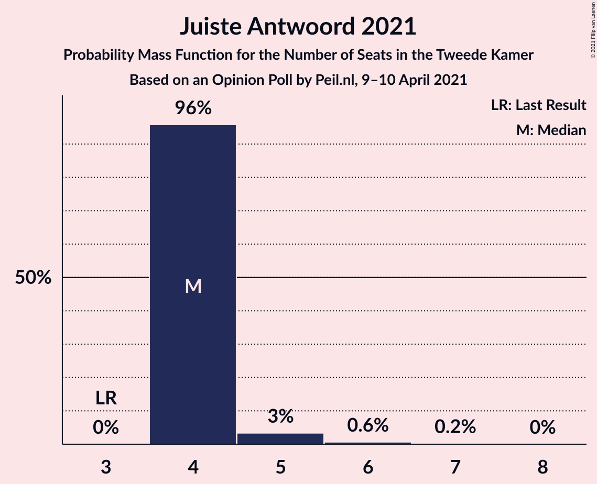

| Number of Seats | Probability | Accumulated | Special Marks |
|:---------------:|:-----------:|:-----------:|:-------------:|
| 3 | 0% | 100% | Last Result |
| 4 | 96% | 100% | Median |
| 5 | 3% | 4% |  |
| 6 | 0.6% | 0.8% |  |
| 7 | 0.2% | 0.2% |  |
| 8 | 0% | 0% |  |

### Volt Europa

*For a full overview of the results for this party, see the [Volt Europa](party-volteuropa.html) page.*

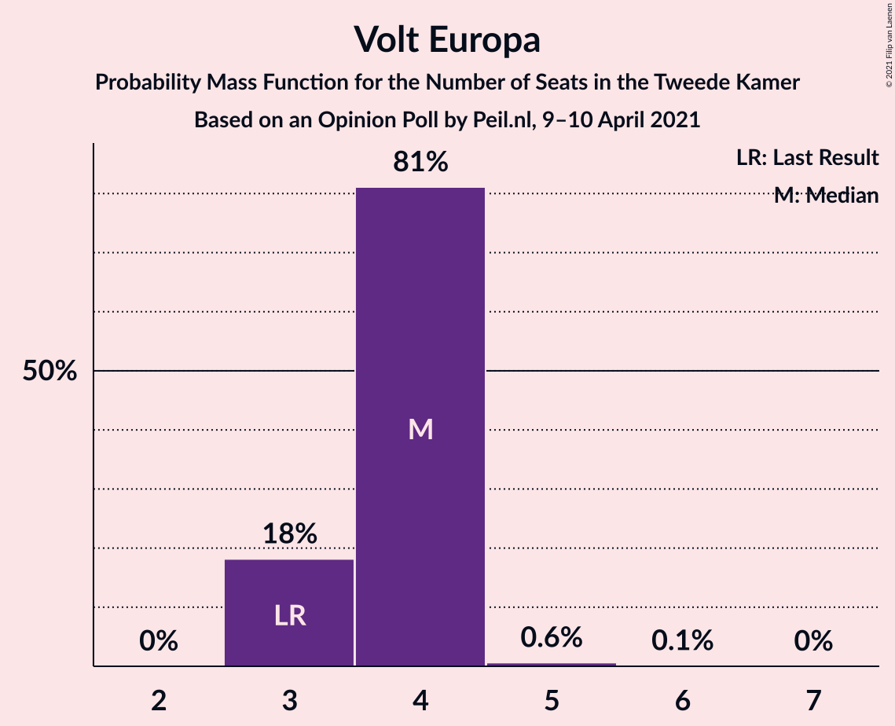

| Number of Seats | Probability | Accumulated | Special Marks |
|:---------------:|:-----------:|:-----------:|:-------------:|
| 3 | 18% | 100% | Last Result |
| 4 | 81% | 82% | Median |
| 5 | 0.6% | 0.7% |  |
| 6 | 0.1% | 0.1% |  |
| 7 | 0% | 0% |  |

### Staatkundig Gereformeerde Partij

*For a full overview of the results for this party, see the [Staatkundig Gereformeerde Partij](party-staatkundiggereformeerdepartij.html) page.*

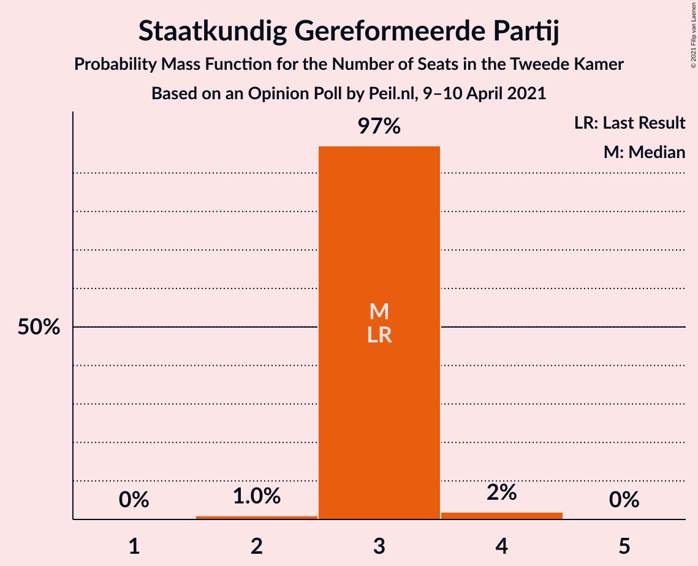

| Number of Seats | Probability | Accumulated | Special Marks |
|:---------------:|:-----------:|:-----------:|:-------------:|
| 2 | 1.0% | 100% |  |
| 3 | 97% | 99.0% | Last Result, Median |
| 4 | 2% | 2% |  |
| 5 | 0% | 0% |  |

### DENK

*For a full overview of the results for this party, see the [DENK](party-denk.html) page.*

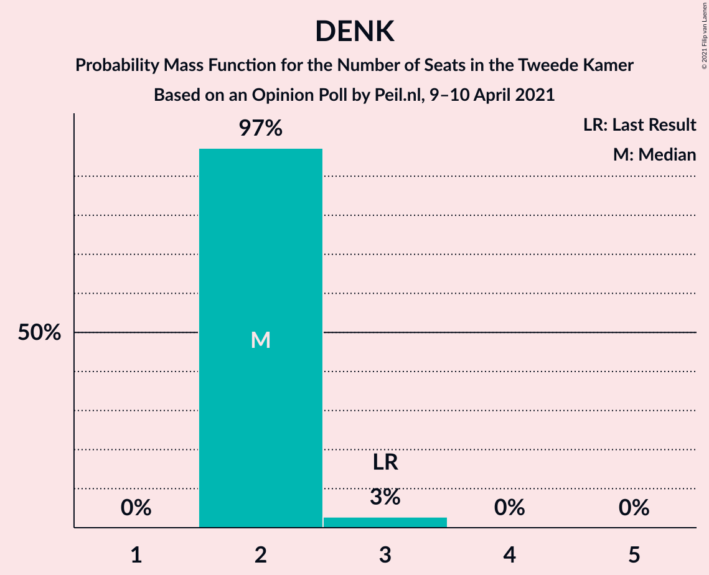

| Number of Seats | Probability | Accumulated | Special Marks |
|:---------------:|:-----------:|:-----------:|:-------------:|
| 2 | 21% | 100% |  |
| 3 | 26% | 79% | Last Result |
| 4 | 53% | 53% | Median |
| 5 | 0% | 0% |  |

### BoerBurgerBeweging

*For a full overview of the results for this party, see the [BoerBurgerBeweging](party-boerburgerbeweging.html) page.*

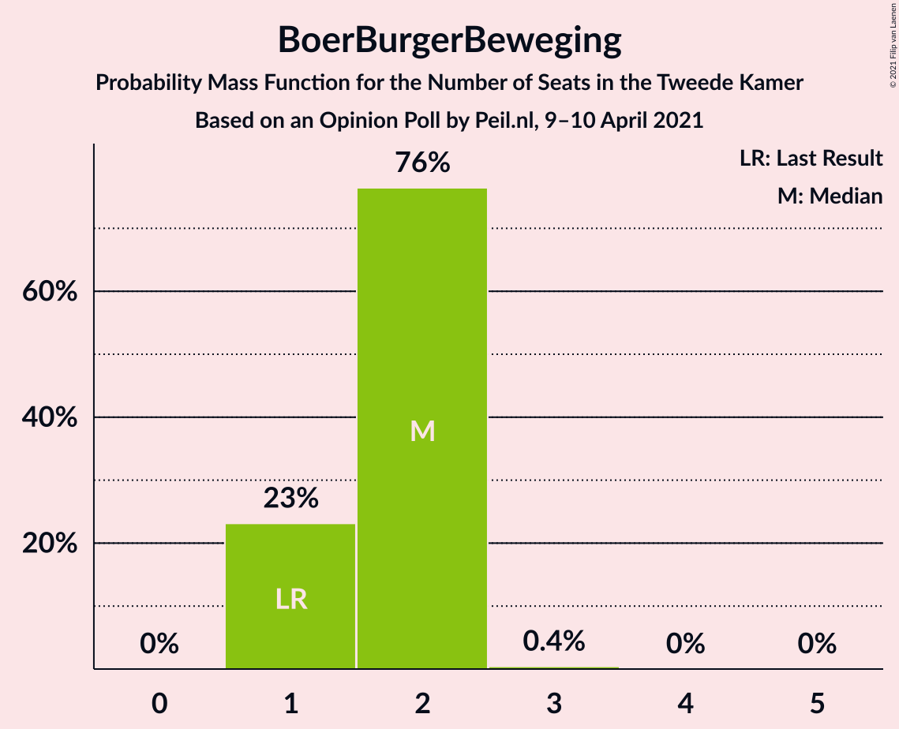

| Number of Seats | Probability | Accumulated | Special Marks |
|:---------------:|:-----------:|:-----------:|:-------------:|
| 1 | 23% | 100% | Last Result |
| 2 | 76% | 77% | Median |
| 3 | 0.4% | 0.4% |  |
| 4 | 0% | 0% |  |

### 50Plus

*For a full overview of the results for this party, see the [50Plus](party-50plus.html) page.*

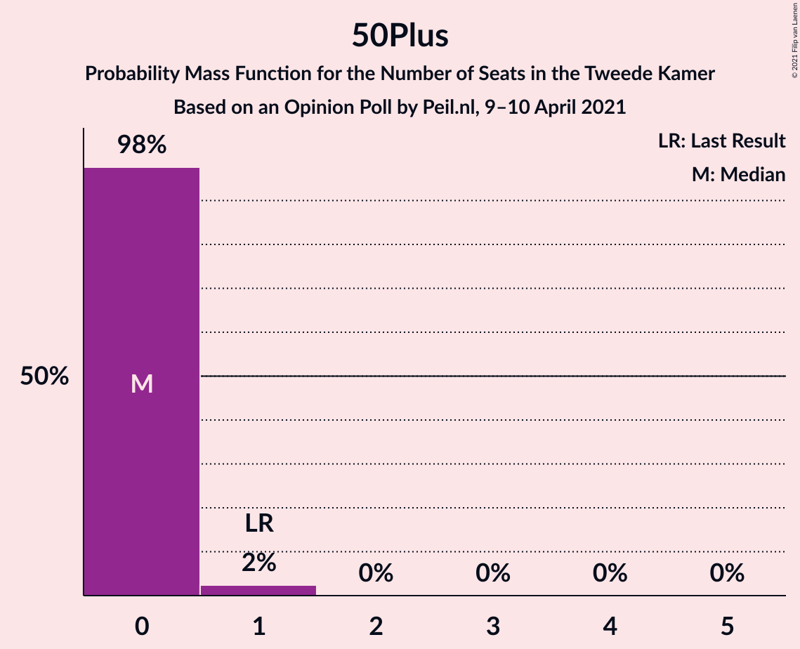

| Number of Seats | Probability | Accumulated | Special Marks |
|:---------------:|:-----------:|:-----------:|:-------------:|
| 0 | 68% | 100% | Median |
| 1 | 32% | 32% | Last Result |
| 2 | 0% | 0% |  |

### Bij1

*For a full overview of the results for this party, see the [Bij1](party-bij1.html) page.*

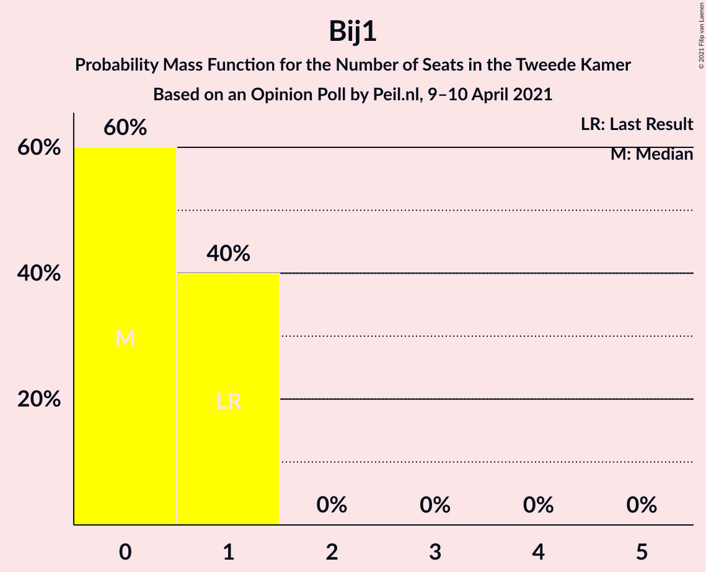

| Number of Seats | Probability | Accumulated | Special Marks |
|:---------------:|:-----------:|:-----------:|:-------------:|
| 0 | 60% | 100% | Median |
| 1 | 40% | 40% | Last Result |
| 2 | 0% | 0% |  |

## Coalitions

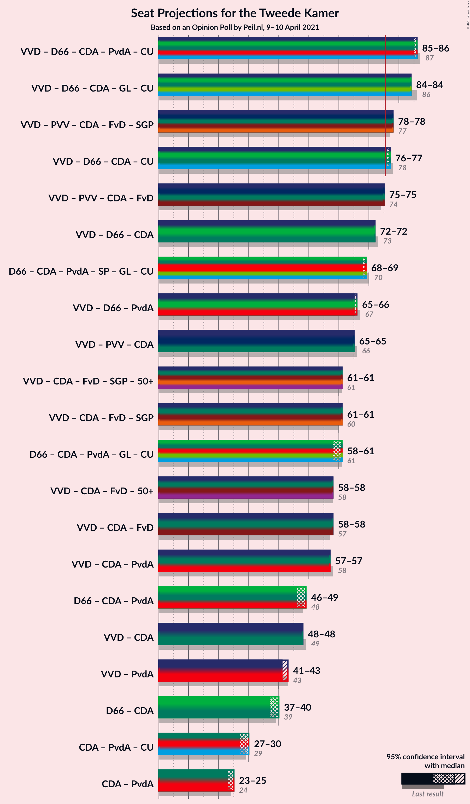

### Confidence Intervals

| Coalition | Last Result | Median | Majority? | 80% Confidence Interval | 90% Confidence Interval | 95% Confidence Interval | 99% Confidence Interval |
|:---------:|:-----------:|:------:|:---------:|:-----------------------:|:-----------------------:|:-----------------------:|:-----------------------:|
| Volkspartij voor Vrijheid en Democratie – Democraten 66 – Christen-Democratisch Appèl – Partij van de Arbeid – ChristenUnie | 87 | 85 | 100% | 85–86 | 85–87 | 82–87 | 82–87 |
| Volkspartij voor Vrijheid en Democratie – Democraten 66 – Christen-Democratisch Appèl – GroenLinks – ChristenUnie | 86 | 83 | 100% | 83–85 | 83–85 | 80–85 | 80–85 |
| Volkspartij voor Vrijheid en Democratie – Partij voor de Vrijheid – Christen-Democratisch Appèl – Forum voor Democratie – Staatkundig Gereformeerde Partij | 77 | 75 | 36% | 75–78 | 74–78 | 74–78 | 69–78 |
| Volkspartij voor Vrijheid en Democratie – Democraten 66 – Christen-Democratisch Appèl – ChristenUnie | 78 | 76 | 96% | 76–78 | 76–78 | 73–78 | 73–78 |
| Volkspartij voor Vrijheid en Democratie – Partij voor de Vrijheid – Christen-Democratisch Appèl – Forum voor Democratie | 74 | 72 | 0.7% | 71–75 | 71–75 | 71–75 | 66–76 |
| Volkspartij voor Vrijheid en Democratie – Democraten 66 – Christen-Democratisch Appèl | 73 | 72 | 0% | 72–73 | 72–73 | 68–73 | 68–73 |
| Democraten 66 – Christen-Democratisch Appèl – Partij van de Arbeid – Socialistische Partij – GroenLinks – ChristenUnie | 70 | 69 | 0% | 69 | 68–71 | 66–71 | 65–74 |
| Volkspartij voor Vrijheid en Democratie – Democraten 66 – Partij van de Arbeid | 67 | 67 | 0% | 65–67 | 65–67 | 64–67 | 63–67 |
| Volkspartij voor Vrijheid en Democratie – Partij voor de Vrijheid – Christen-Democratisch Appèl | 66 | 62 | 0% | 61–65 | 61–65 | 61–66 | 57–66 |
| Democraten 66 – Christen-Democratisch Appèl – Partij van de Arbeid – GroenLinks – ChristenUnie | 61 | 60 | 0% | 60–61 | 60–62 | 57–62 | 56–64 |
| Volkspartij voor Vrijheid en Democratie – Christen-Democratisch Appèl – Forum voor Democratie – Staatkundig Gereformeerde Partij – 50Plus | 61 | 59 | 0% | 59–61 | 59–61 | 59–61 | 55–62 |
| Volkspartij voor Vrijheid en Democratie – Christen-Democratisch Appèl – Forum voor Democratie – Staatkundig Gereformeerde Partij | 60 | 59 | 0% | 59–61 | 59–61 | 58–61 | 54–61 |
| Volkspartij voor Vrijheid en Democratie – Christen-Democratisch Appèl – Forum voor Democratie – 50Plus | 58 | 56 | 0% | 56–58 | 56–58 | 56–58 | 52–60 |
| Volkspartij voor Vrijheid en Democratie – Christen-Democratisch Appèl – Forum voor Democratie | 57 | 56 | 0% | 56–58 | 56–58 | 55–58 | 51–59 |
| Volkspartij voor Vrijheid en Democratie – Christen-Democratisch Appèl – Partij van de Arbeid | 58 | 55 | 0% | 55–57 | 55–57 | 55–57 | 52–58 |
| Democraten 66 – Christen-Democratisch Appèl – Partij van de Arbeid | 48 | 49 | 0% | 49–50 | 47–50 | 46–50 | 45–51 |
| Volkspartij voor Vrijheid en Democratie – Christen-Democratisch Appèl | 49 | 46 | 0% | 46–48 | 46–48 | 46–48 | 42–49 |
| Volkspartij voor Vrijheid en Democratie – Partij van de Arbeid | 43 | 41 | 0% | 41 | 41 | 41 | 38–43 |
| Democraten 66 – Christen-Democratisch Appèl | 39 | 40 | 0% | 40–41 | 39–41 | 37–41 | 36–41 |
| Christen-Democratisch Appèl – Partij van de Arbeid – ChristenUnie | 29 | 27 | 0% | 27–30 | 27–30 | 27–30 | 26–30 |
| Christen-Democratisch Appèl – Partij van de Arbeid | 24 | 23 | 0% | 23–25 | 23–25 | 23–25 | 22–25 |

### Volkspartij voor Vrijheid en Democratie – Democraten 66 – Christen-Democratisch Appèl – Partij van de Arbeid – ChristenUnie

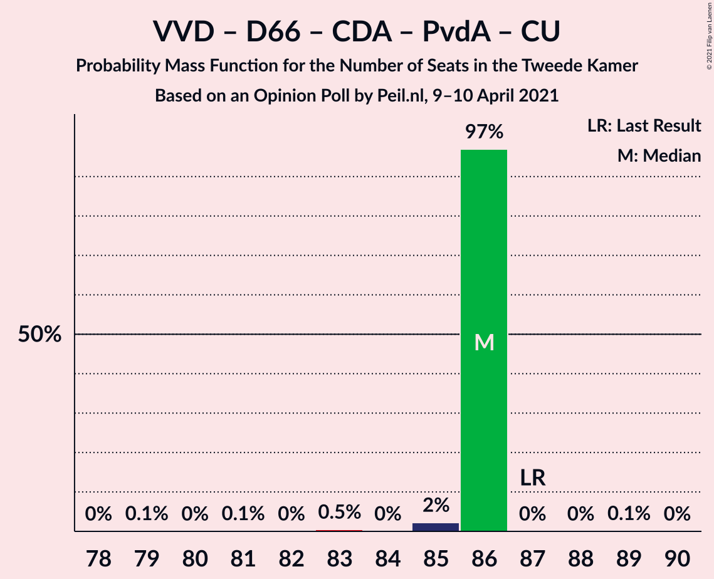

| Number of Seats | Probability | Accumulated | Special Marks |
|:---------------:|:-----------:|:-----------:|:-------------:|
| 80 | 0.1% | 100% |  |
| 81 | 0.2% | 99.9% |  |
| 82 | 2% | 99.7% |  |
| 83 | 0.2% | 97% |  |
| 84 | 1.5% | 97% |  |
| 85 | 53% | 96% | Median |
| 86 | 36% | 42% |  |
| 87 | 6% | 6% | Last Result |
| 88 | 0% | 0% |  |

### Volkspartij voor Vrijheid en Democratie – Democraten 66 – Christen-Democratisch Appèl – GroenLinks – ChristenUnie

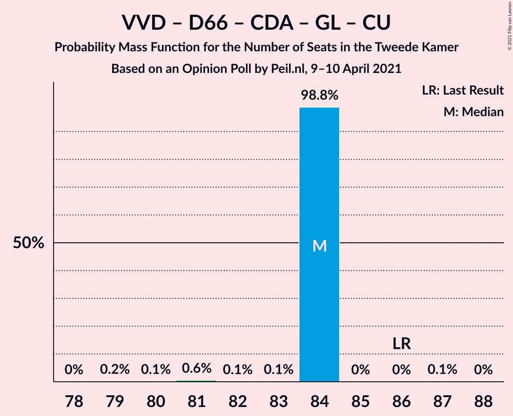

| Number of Seats | Probability | Accumulated | Special Marks |
|:---------------:|:-----------:|:-----------:|:-------------:|
| 78 | 0.3% | 100% |  |
| 79 | 0.2% | 99.7% |  |
| 80 | 2% | 99.5% |  |
| 81 | 0.5% | 97% |  |
| 82 | 1.1% | 97% |  |
| 83 | 71% | 96% | Median |
| 84 | 15% | 25% |  |
| 85 | 10% | 10% |  |
| 86 | 0% | 0.1% | Last Result |
| 87 | 0% | 0% |  |

### Volkspartij voor Vrijheid en Democratie – Partij voor de Vrijheid – Christen-Democratisch Appèl – Forum voor Democratie – Staatkundig Gereformeerde Partij

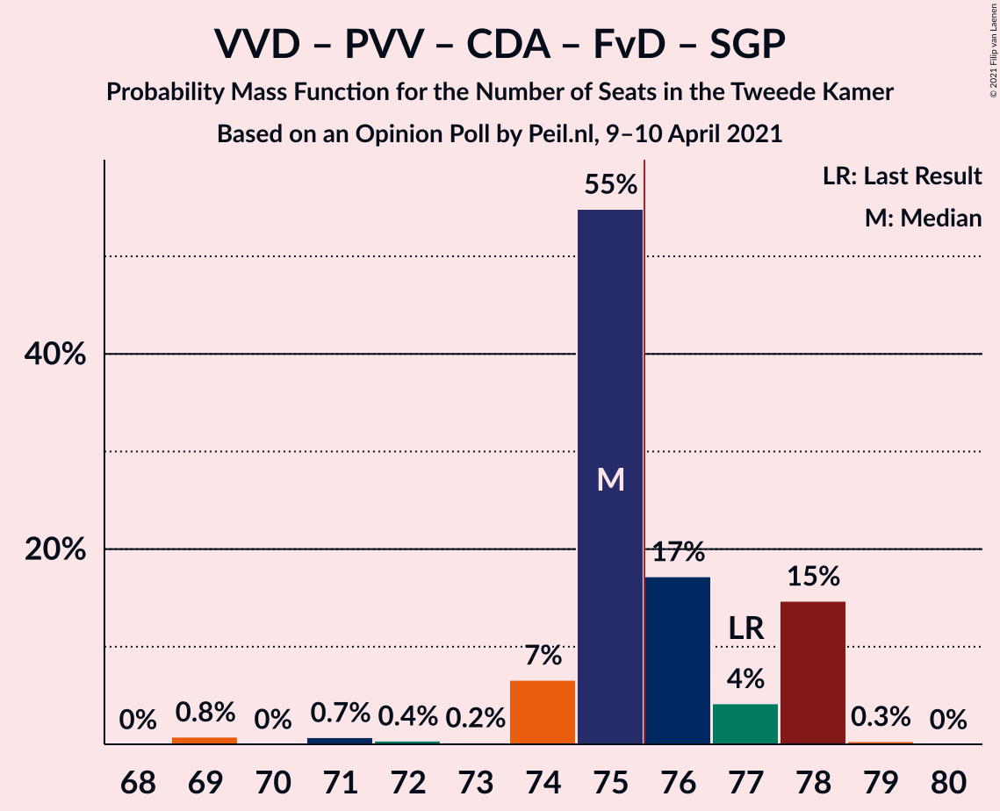

| Number of Seats | Probability | Accumulated | Special Marks |
|:---------------:|:-----------:|:-----------:|:-------------:|
| 69 | 0.8% | 100% |  |
| 70 | 0% | 99.2% |  |
| 71 | 0.7% | 99.2% |  |
| 72 | 0.4% | 98% |  |
| 73 | 0.2% | 98% |  |
| 74 | 7% | 98% |  |
| 75 | 55% | 91% | Median |
| 76 | 17% | 36% | Majority |
| 77 | 4% | 19% | Last Result |
| 78 | 15% | 15% |  |
| 79 | 0.3% | 0.3% |  |
| 80 | 0% | 0% |  |

### Volkspartij voor Vrijheid en Democratie – Democraten 66 – Christen-Democratisch Appèl – ChristenUnie

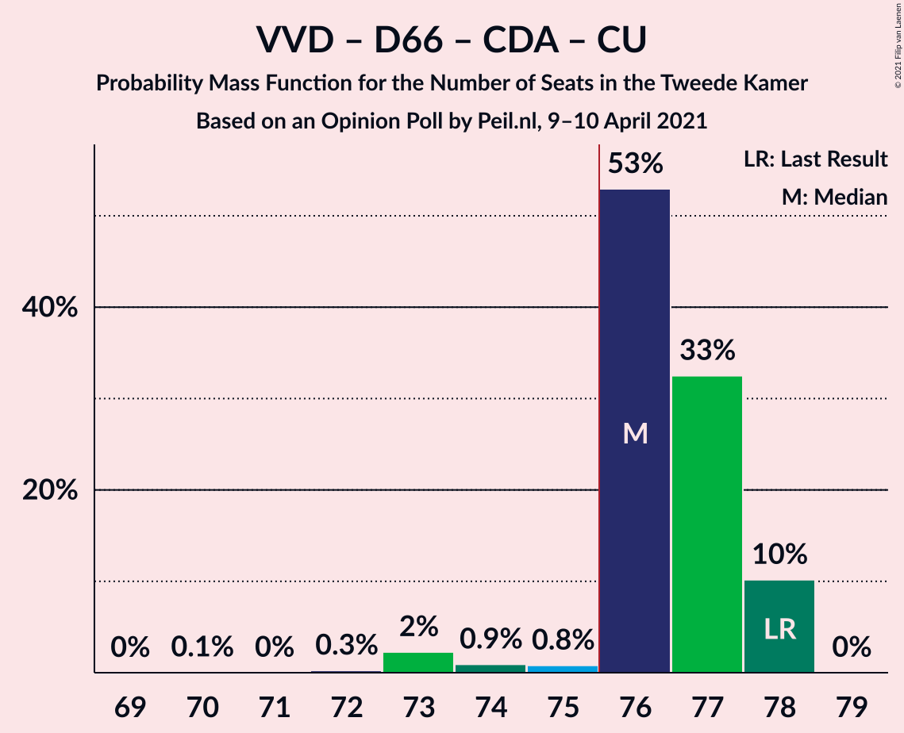

| Number of Seats | Probability | Accumulated | Special Marks |
|:---------------:|:-----------:|:-----------:|:-------------:|
| 70 | 0.1% | 100% |  |
| 71 | 0% | 99.9% |  |
| 72 | 0.3% | 99.9% |  |
| 73 | 2% | 99.7% |  |
| 74 | 0.9% | 97% |  |
| 75 | 0.8% | 96% |  |
| 76 | 53% | 96% | Median, Majority |
| 77 | 33% | 43% |  |
| 78 | 10% | 10% | Last Result |
| 79 | 0% | 0% |  |

### Volkspartij voor Vrijheid en Democratie – Partij voor de Vrijheid – Christen-Democratisch Appèl – Forum voor Democratie

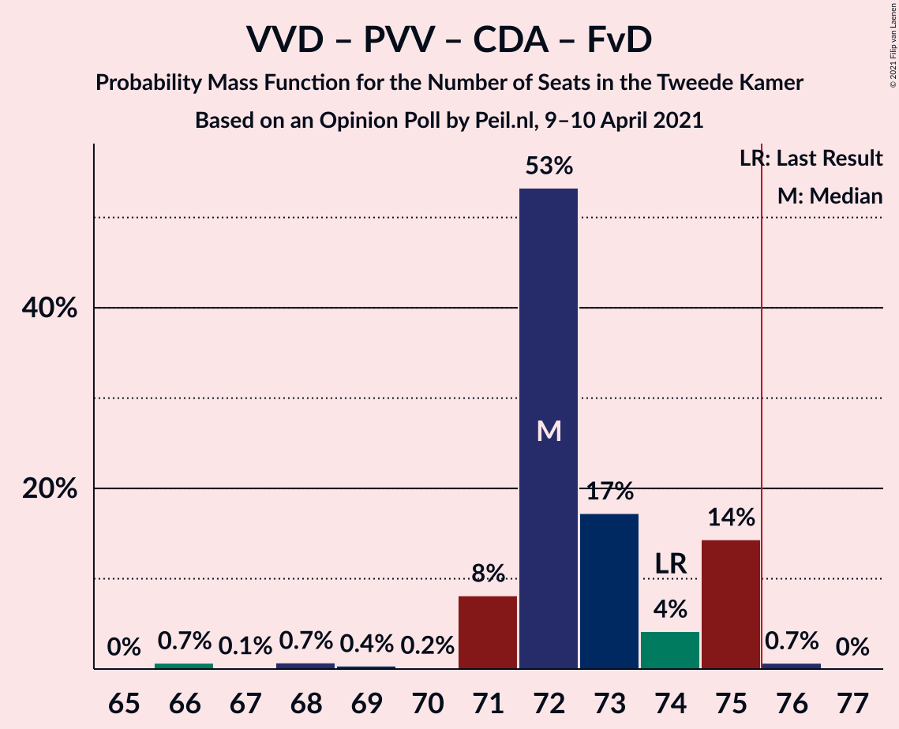

| Number of Seats | Probability | Accumulated | Special Marks |
|:---------------:|:-----------:|:-----------:|:-------------:|
| 66 | 0.7% | 100% |  |
| 67 | 0.1% | 99.3% |  |
| 68 | 0.7% | 99.2% |  |
| 69 | 0.4% | 98% |  |
| 70 | 0.2% | 98% |  |
| 71 | 8% | 98% |  |
| 72 | 53% | 90% | Median |
| 73 | 17% | 36% |  |
| 74 | 4% | 19% | Last Result |
| 75 | 14% | 15% |  |
| 76 | 0.7% | 0.7% | Majority |
| 77 | 0% | 0% |  |

### Volkspartij voor Vrijheid en Democratie – Democraten 66 – Christen-Democratisch Appèl

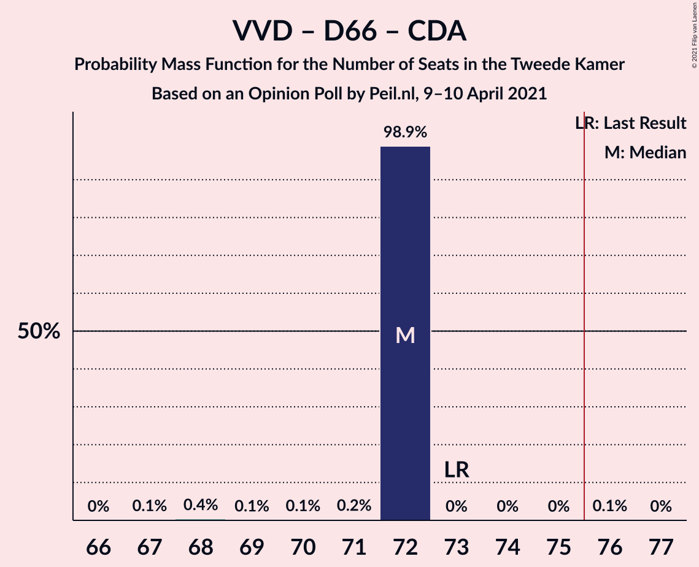

| Number of Seats | Probability | Accumulated | Special Marks |
|:---------------:|:-----------:|:-----------:|:-------------:|
| 66 | 0.1% | 100% |  |
| 67 | 0.1% | 99.9% |  |
| 68 | 3% | 99.8% |  |
| 69 | 0.8% | 97% |  |
| 70 | 0.3% | 96% |  |
| 71 | 0.5% | 96% |  |
| 72 | 78% | 96% | Median |
| 73 | 17% | 17% | Last Result |
| 74 | 0% | 0% |  |

### Democraten 66 – Christen-Democratisch Appèl – Partij van de Arbeid – Socialistische Partij – GroenLinks – ChristenUnie

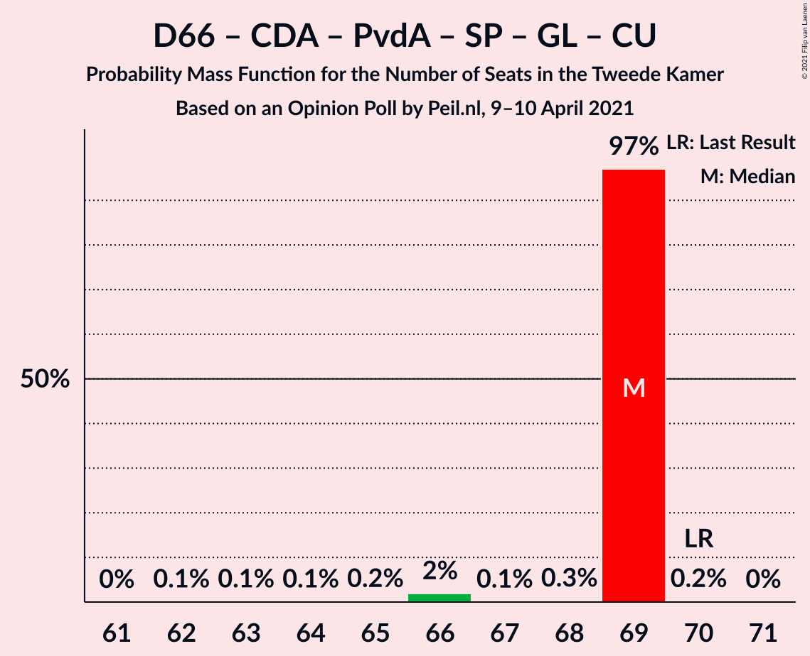

| Number of Seats | Probability | Accumulated | Special Marks |
|:---------------:|:-----------:|:-----------:|:-------------:|
| 64 | 0.1% | 100% |  |
| 65 | 0.4% | 99.8% |  |
| 66 | 2% | 99.4% |  |
| 67 | 0.4% | 97% |  |
| 68 | 5% | 97% |  |
| 69 | 85% | 92% | Median |
| 70 | 0.3% | 7% | Last Result |
| 71 | 6% | 7% |  |
| 72 | 0% | 0.7% |  |
| 73 | 0% | 0.7% |  |
| 74 | 0.7% | 0.7% |  |
| 75 | 0% | 0% |  |

### Volkspartij voor Vrijheid en Democratie – Democraten 66 – Partij van de Arbeid

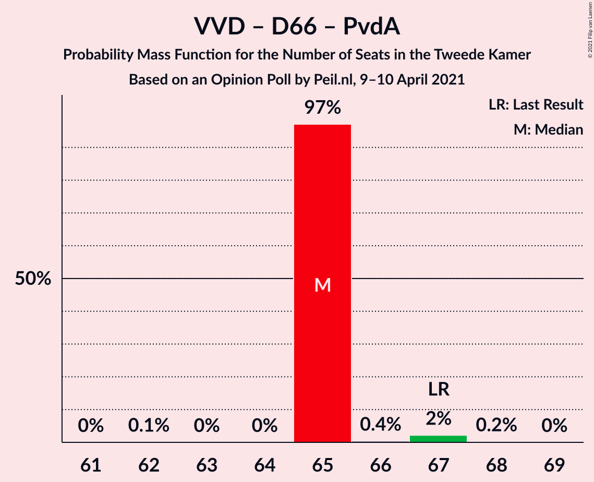

| Number of Seats | Probability | Accumulated | Special Marks |
|:---------------:|:-----------:|:-----------:|:-------------:|
| 62 | 0.1% | 100% |  |
| 63 | 2% | 99.9% |  |
| 64 | 0.6% | 98% |  |
| 65 | 20% | 97% |  |
| 66 | 1.1% | 78% |  |
| 67 | 77% | 77% | Last Result, Median |
| 68 | 0.1% | 0.1% |  |
| 69 | 0% | 0.1% |  |
| 70 | 0% | 0% |  |

### Volkspartij voor Vrijheid en Democratie – Partij voor de Vrijheid – Christen-Democratisch Appèl

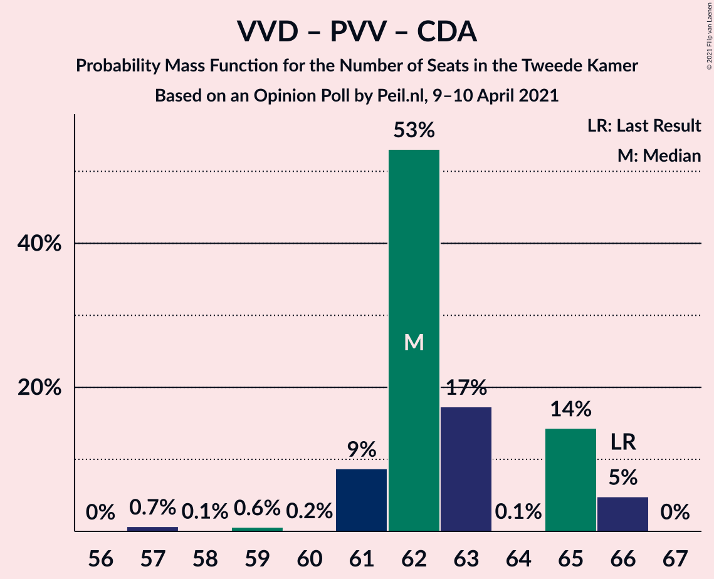

| Number of Seats | Probability | Accumulated | Special Marks |
|:---------------:|:-----------:|:-----------:|:-------------:|
| 57 | 0.7% | 100% |  |
| 58 | 0.1% | 99.3% |  |
| 59 | 0.6% | 99.2% |  |
| 60 | 0.2% | 98.6% |  |
| 61 | 9% | 98% |  |
| 62 | 53% | 90% | Median |
| 63 | 17% | 37% |  |
| 64 | 0.1% | 19% |  |
| 65 | 14% | 19% |  |
| 66 | 5% | 5% | Last Result |
| 67 | 0% | 0% |  |

### Democraten 66 – Christen-Democratisch Appèl – Partij van de Arbeid – GroenLinks – ChristenUnie

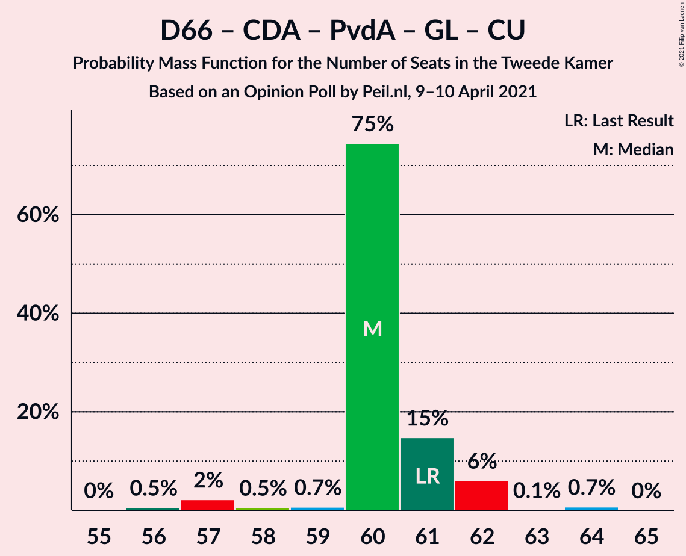

| Number of Seats | Probability | Accumulated | Special Marks |
|:---------------:|:-----------:|:-----------:|:-------------:|
| 56 | 0.5% | 100% |  |
| 57 | 2% | 99.4% |  |
| 58 | 0.5% | 97% |  |
| 59 | 0.7% | 97% |  |
| 60 | 75% | 96% | Median |
| 61 | 15% | 22% | Last Result |
| 62 | 6% | 7% |  |
| 63 | 0.1% | 0.8% |  |
| 64 | 0.7% | 0.7% |  |
| 65 | 0% | 0% |  |

### Volkspartij voor Vrijheid en Democratie – Christen-Democratisch Appèl – Forum voor Democratie – Staatkundig Gereformeerde Partij – 50Plus

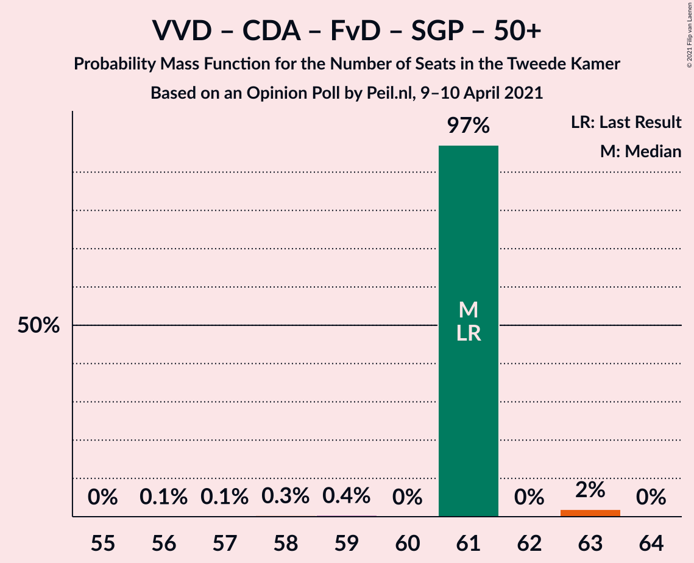

| Number of Seats | Probability | Accumulated | Special Marks |
|:---------------:|:-----------:|:-----------:|:-------------:|
| 54 | 0.3% | 100% |  |
| 55 | 0.8% | 99.7% |  |
| 56 | 0.3% | 98.9% |  |
| 57 | 0.7% | 98.6% |  |
| 58 | 0.5% | 98% |  |
| 59 | 53% | 98% | Median |
| 60 | 11% | 45% |  |
| 61 | 33% | 34% | Last Result |
| 62 | 0.4% | 0.7% |  |
| 63 | 0.3% | 0.3% |  |
| 64 | 0% | 0% |  |

### Volkspartij voor Vrijheid en Democratie – Christen-Democratisch Appèl – Forum voor Democratie – Staatkundig Gereformeerde Partij

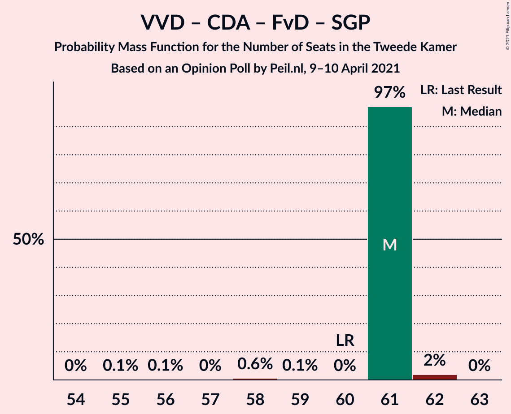

| Number of Seats | Probability | Accumulated | Special Marks |
|:---------------:|:-----------:|:-----------:|:-------------:|
| 54 | 1.0% | 100% |  |
| 55 | 0% | 98.9% |  |
| 56 | 0.9% | 98.9% |  |
| 57 | 0.2% | 98% |  |
| 58 | 0.4% | 98% |  |
| 59 | 63% | 97% | Median |
| 60 | 19% | 34% | Last Result |
| 61 | 15% | 15% |  |
| 62 | 0.3% | 0.3% |  |
| 63 | 0% | 0% |  |

### Volkspartij voor Vrijheid en Democratie – Christen-Democratisch Appèl – Forum voor Democratie – 50Plus

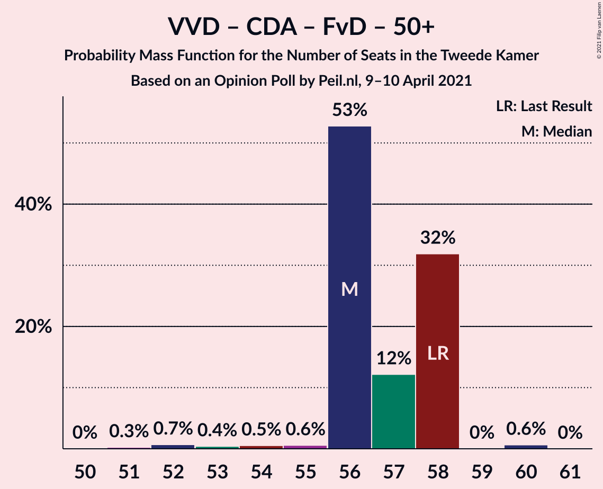

| Number of Seats | Probability | Accumulated | Special Marks |
|:---------------:|:-----------:|:-----------:|:-------------:|
| 51 | 0.3% | 100% |  |
| 52 | 0.7% | 99.7% |  |
| 53 | 0.4% | 99.0% |  |
| 54 | 0.5% | 98.6% |  |
| 55 | 0.6% | 98% |  |
| 56 | 53% | 98% | Median |
| 57 | 12% | 45% |  |
| 58 | 32% | 33% | Last Result |
| 59 | 0% | 0.7% |  |
| 60 | 0.6% | 0.6% |  |
| 61 | 0% | 0% |  |

### Volkspartij voor Vrijheid en Democratie – Christen-Democratisch Appèl – Forum voor Democratie

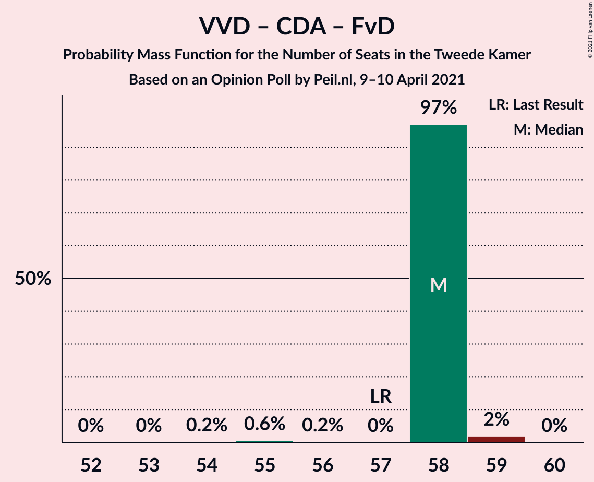

| Number of Seats | Probability | Accumulated | Special Marks |
|:---------------:|:-----------:|:-----------:|:-------------:|
| 51 | 0.9% | 100% |  |
| 52 | 0.1% | 99.0% |  |
| 53 | 0.8% | 98.9% |  |
| 54 | 0.2% | 98% |  |
| 55 | 0.4% | 98% |  |
| 56 | 65% | 97% | Median |
| 57 | 18% | 33% | Last Result |
| 58 | 14% | 15% |  |
| 59 | 0.7% | 0.7% |  |
| 60 | 0% | 0% |  |

### Volkspartij voor Vrijheid en Democratie – Christen-Democratisch Appèl – Partij van de Arbeid

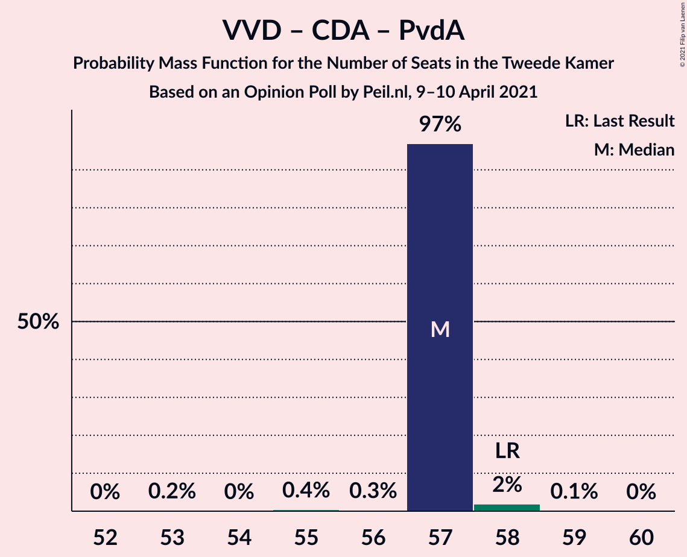

| Number of Seats | Probability | Accumulated | Special Marks |
|:---------------:|:-----------:|:-----------:|:-------------:|
| 51 | 0.2% | 100% |  |
| 52 | 1.2% | 99.8% |  |
| 53 | 0.3% | 98.5% |  |
| 54 | 0.6% | 98% |  |
| 55 | 61% | 98% | Median |
| 56 | 21% | 37% |  |
| 57 | 15% | 15% |  |
| 58 | 0.7% | 0.7% | Last Result |
| 59 | 0% | 0% |  |

### Democraten 66 – Christen-Democratisch Appèl – Partij van de Arbeid

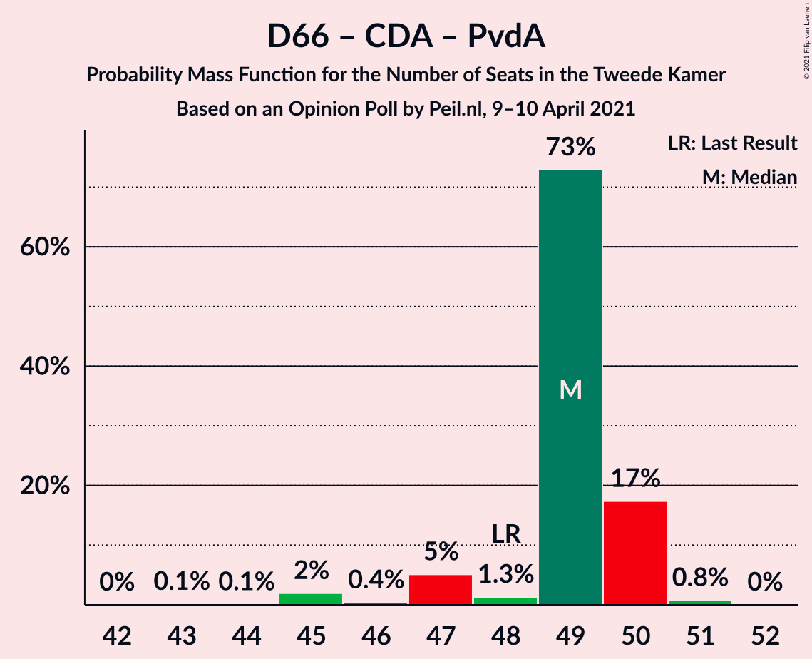

| Number of Seats | Probability | Accumulated | Special Marks |
|:---------------:|:-----------:|:-----------:|:-------------:|
| 43 | 0.1% | 100% |  |
| 44 | 0.1% | 99.9% |  |
| 45 | 2% | 99.8% |  |
| 46 | 0.4% | 98% |  |
| 47 | 5% | 97% |  |
| 48 | 1.3% | 92% | Last Result |
| 49 | 73% | 91% | Median |
| 50 | 17% | 18% |  |
| 51 | 0.8% | 0.8% |  |
| 52 | 0% | 0% |  |

### Volkspartij voor Vrijheid en Democratie – Christen-Democratisch Appèl

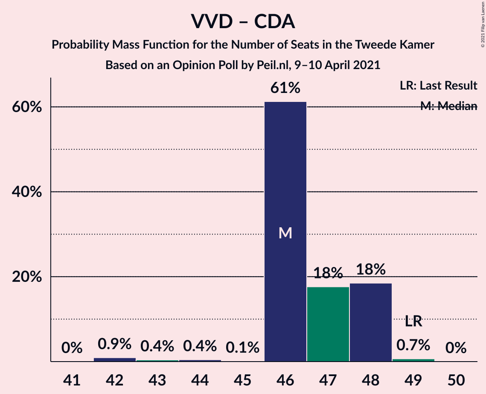

| Number of Seats | Probability | Accumulated | Special Marks |
|:---------------:|:-----------:|:-----------:|:-------------:|
| 42 | 0.9% | 100% |  |
| 43 | 0.4% | 99.0% |  |
| 44 | 0.4% | 98.6% |  |
| 45 | 0.1% | 98% |  |
| 46 | 61% | 98% | Median |
| 47 | 18% | 37% |  |
| 48 | 18% | 19% |  |
| 49 | 0.7% | 0.7% | Last Result |
| 50 | 0% | 0% |  |

### Volkspartij voor Vrijheid en Democratie – Partij van de Arbeid

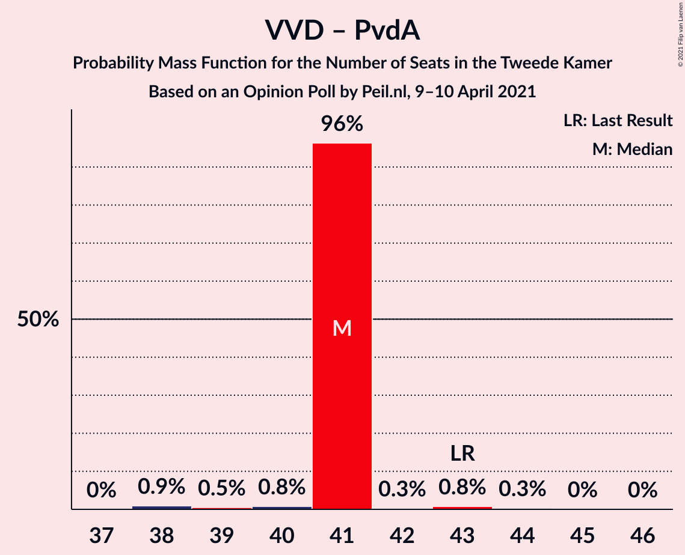

| Number of Seats | Probability | Accumulated | Special Marks |
|:---------------:|:-----------:|:-----------:|:-------------:|
| 38 | 0.9% | 100% |  |
| 39 | 0.5% | 99.1% |  |
| 40 | 0.8% | 98.5% |  |
| 41 | 96% | 98% | Median |
| 42 | 0.3% | 1.4% |  |
| 43 | 0.8% | 1.2% | Last Result |
| 44 | 0.3% | 0.4% |  |
| 45 | 0% | 0.1% |  |
| 46 | 0% | 0% |  |

### Democraten 66 – Christen-Democratisch Appèl

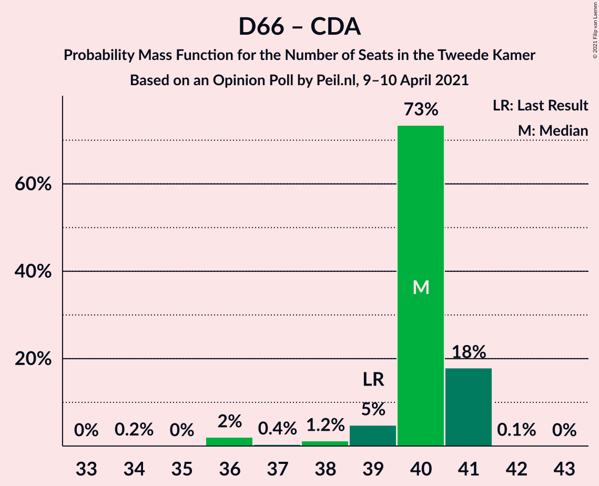

| Number of Seats | Probability | Accumulated | Special Marks |
|:---------------:|:-----------:|:-----------:|:-------------:|
| 34 | 0.2% | 100% |  |
| 35 | 0% | 99.8% |  |
| 36 | 2% | 99.8% |  |
| 37 | 0.4% | 98% |  |
| 38 | 1.2% | 97% |  |
| 39 | 5% | 96% | Last Result |
| 40 | 73% | 91% | Median |
| 41 | 18% | 18% |  |
| 42 | 0.1% | 0.1% |  |
| 43 | 0% | 0% |  |

### Christen-Democratisch Appèl – Partij van de Arbeid – ChristenUnie

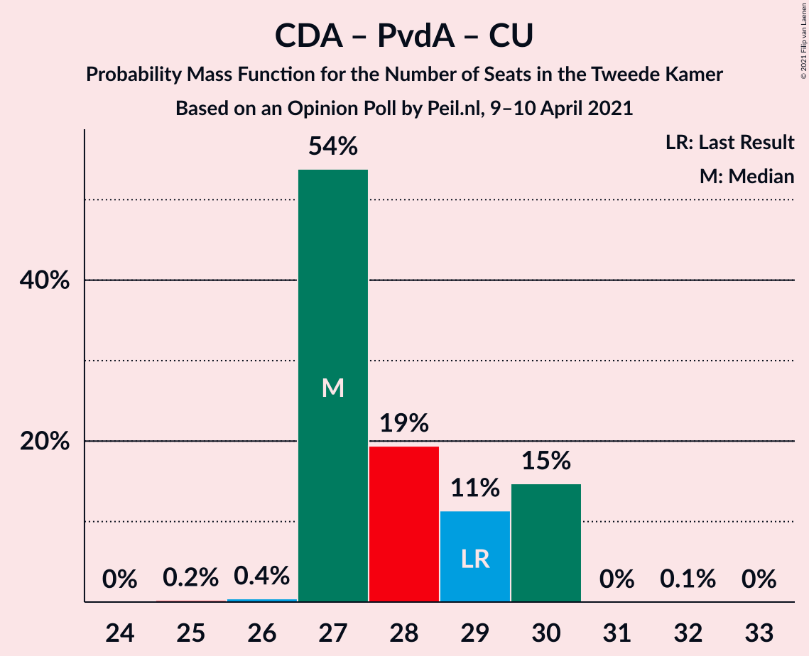

| Number of Seats | Probability | Accumulated | Special Marks |
|:---------------:|:-----------:|:-----------:|:-------------:|
| 25 | 0.2% | 100% |  |
| 26 | 0.4% | 99.8% |  |
| 27 | 54% | 99.4% | Median |
| 28 | 19% | 46% |  |
| 29 | 11% | 26% | Last Result |
| 30 | 15% | 15% |  |
| 31 | 0% | 0.1% |  |
| 32 | 0.1% | 0.1% |  |
| 33 | 0% | 0% |  |

### Christen-Democratisch Appèl – Partij van de Arbeid

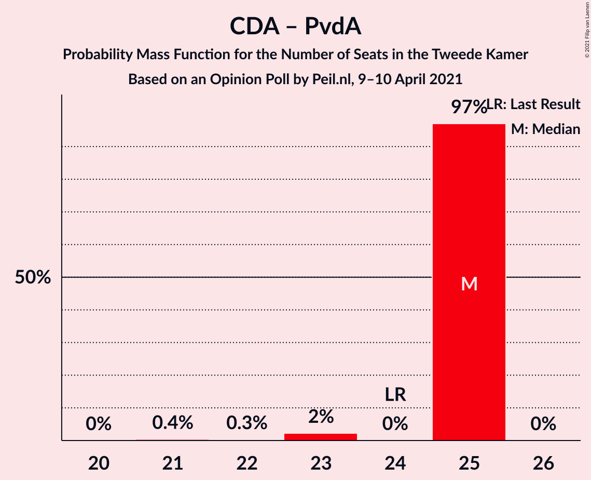

| Number of Seats | Probability | Accumulated | Special Marks |
|:---------------:|:-----------:|:-----------:|:-------------:|
| 20 | 0.1% | 100% |  |
| 21 | 0.3% | 99.9% |  |
| 22 | 1.2% | 99.6% |  |
| 23 | 65% | 98% | Median |
| 24 | 19% | 33% | Last Result |
| 25 | 14% | 15% |  |
| 26 | 0% | 0.1% |  |
| 27 | 0.1% | 0.1% |  |
| 28 | 0% | 0% |  |

## Technical Information

### Opinion Poll

+ **Polling firm:** Peil.nl
+ **Commissioner(s):** —
+ **Fieldwork period:** 9–10 April 2021

### Calculations

+ **Sample size:** 3000
+ **Simulations done:** 1,048,576
+ **Error estimate:** 1.19%

