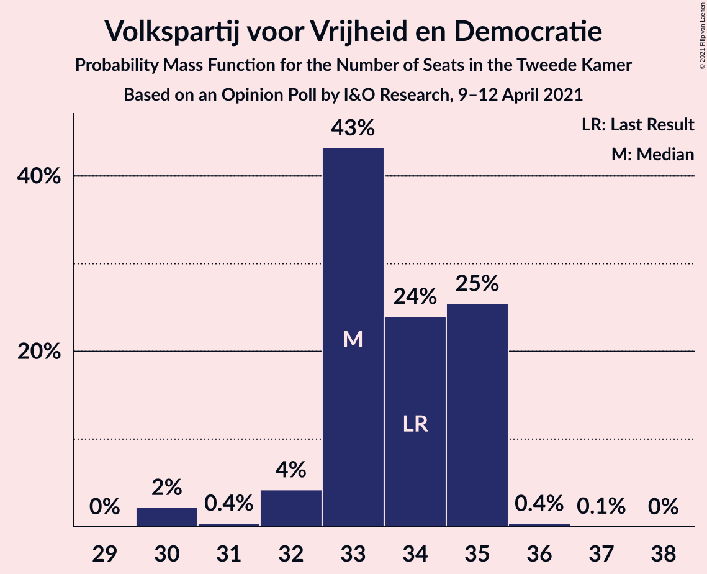
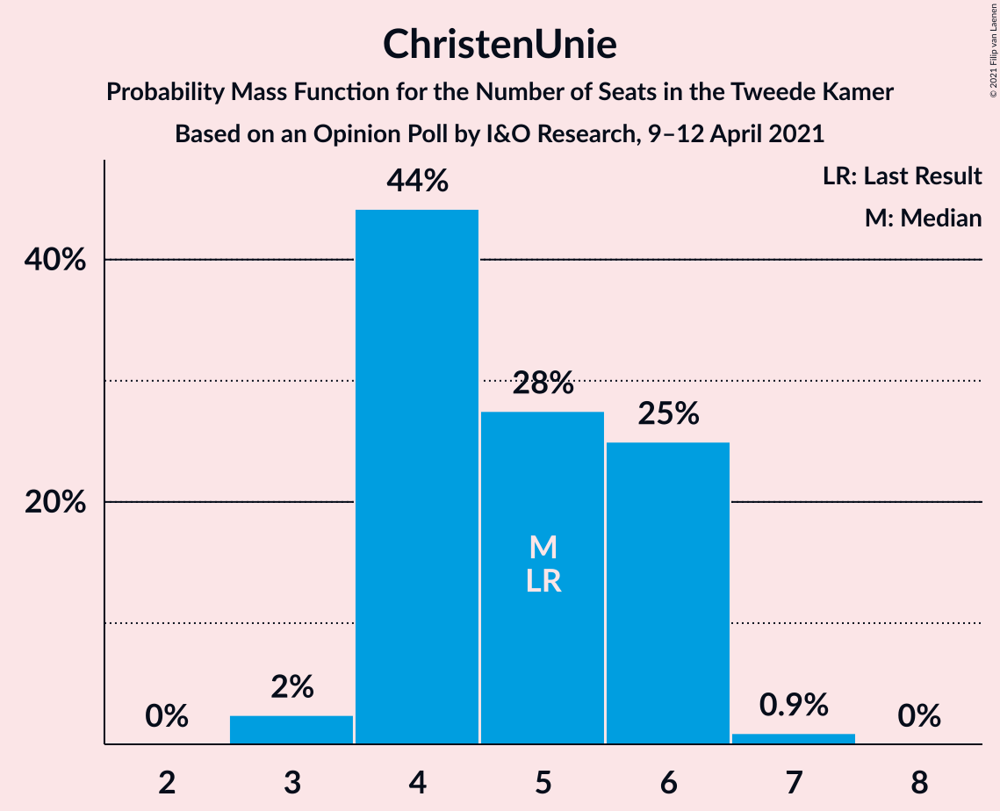
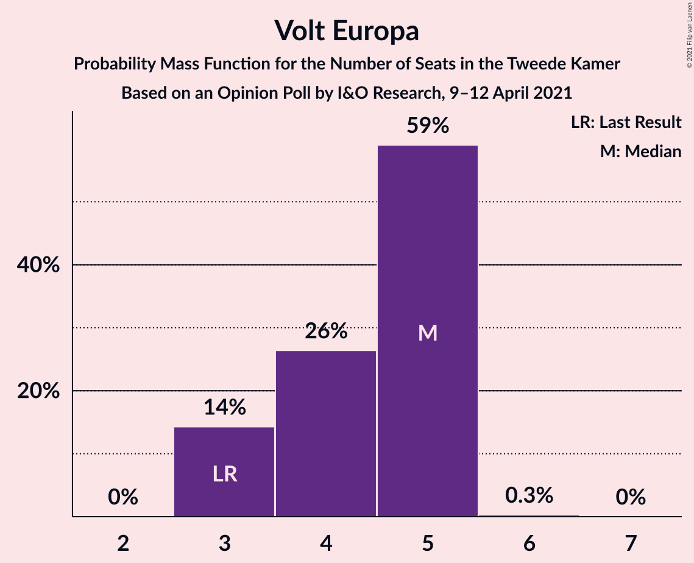
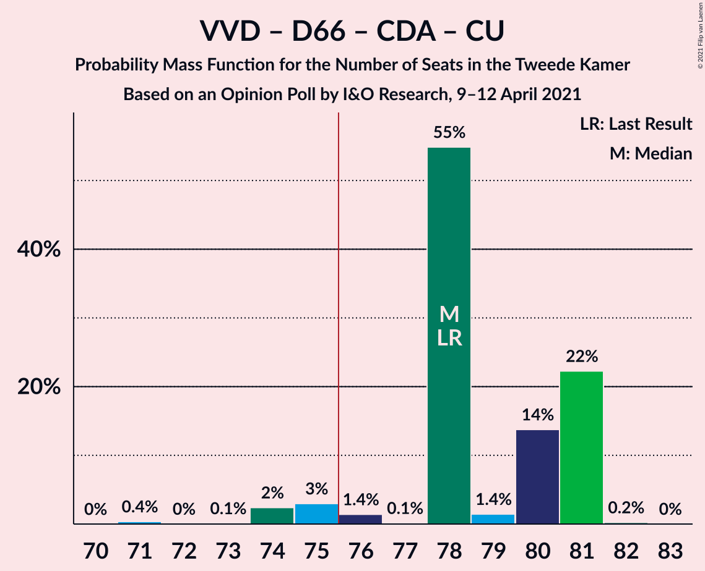
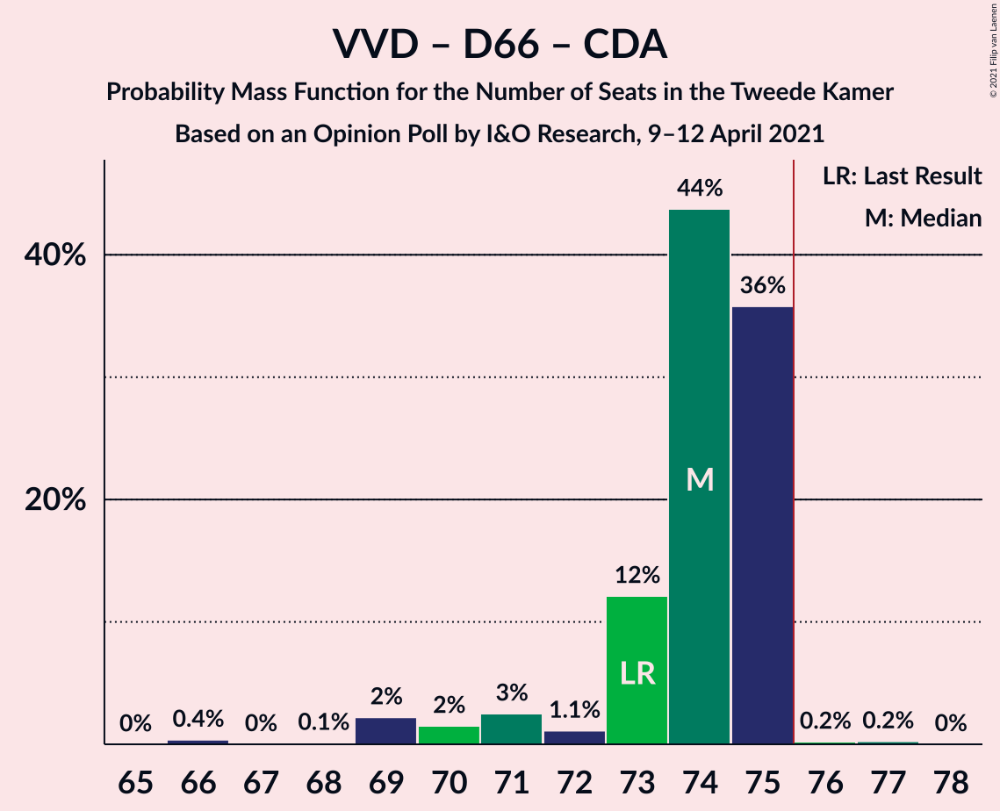
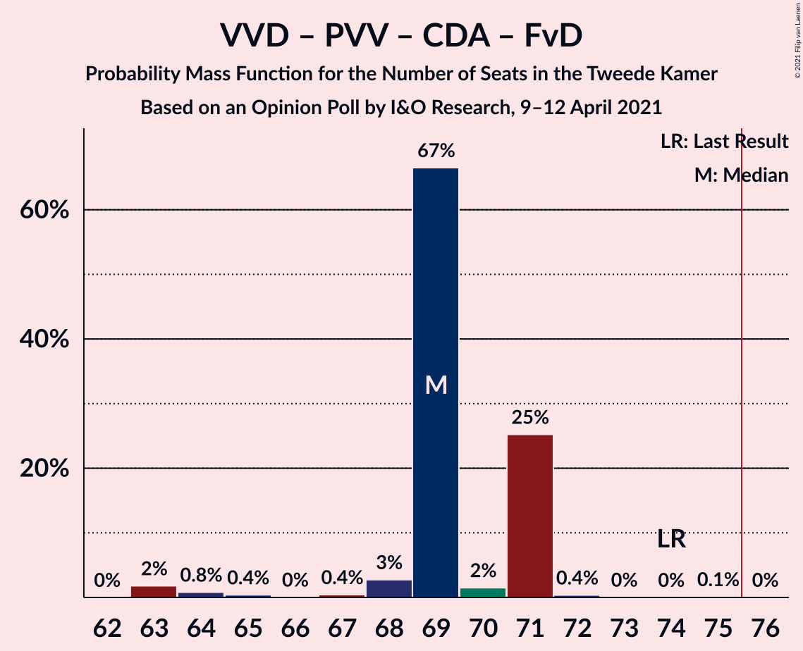
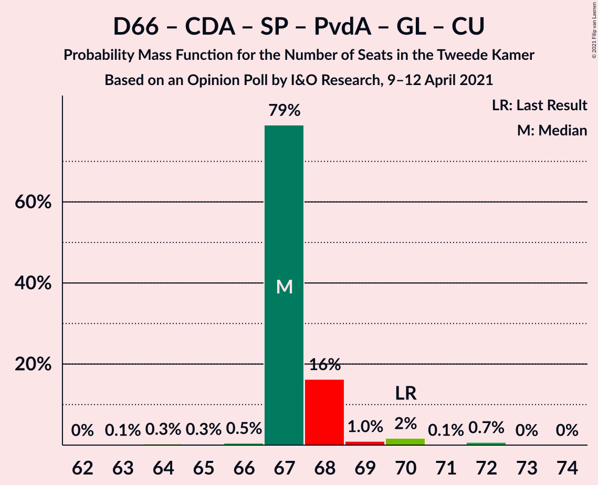
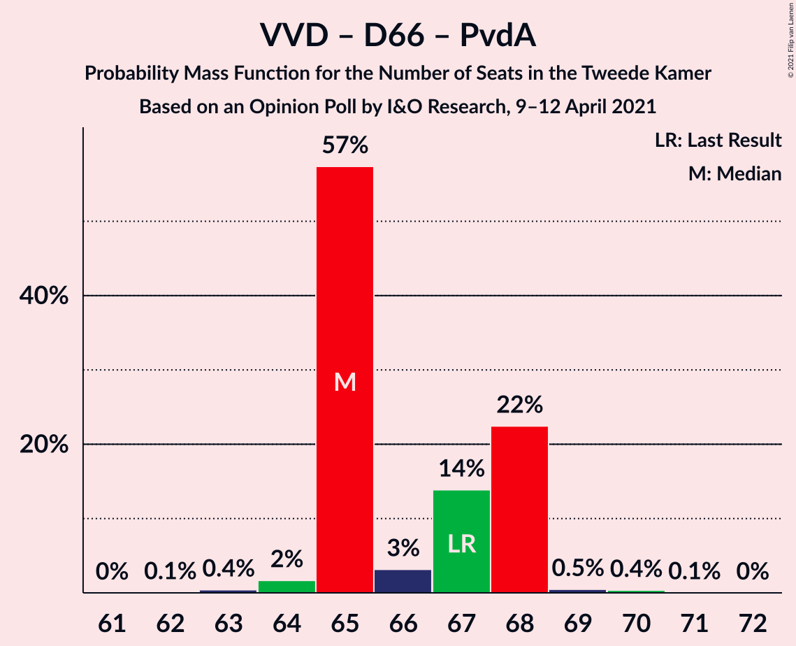
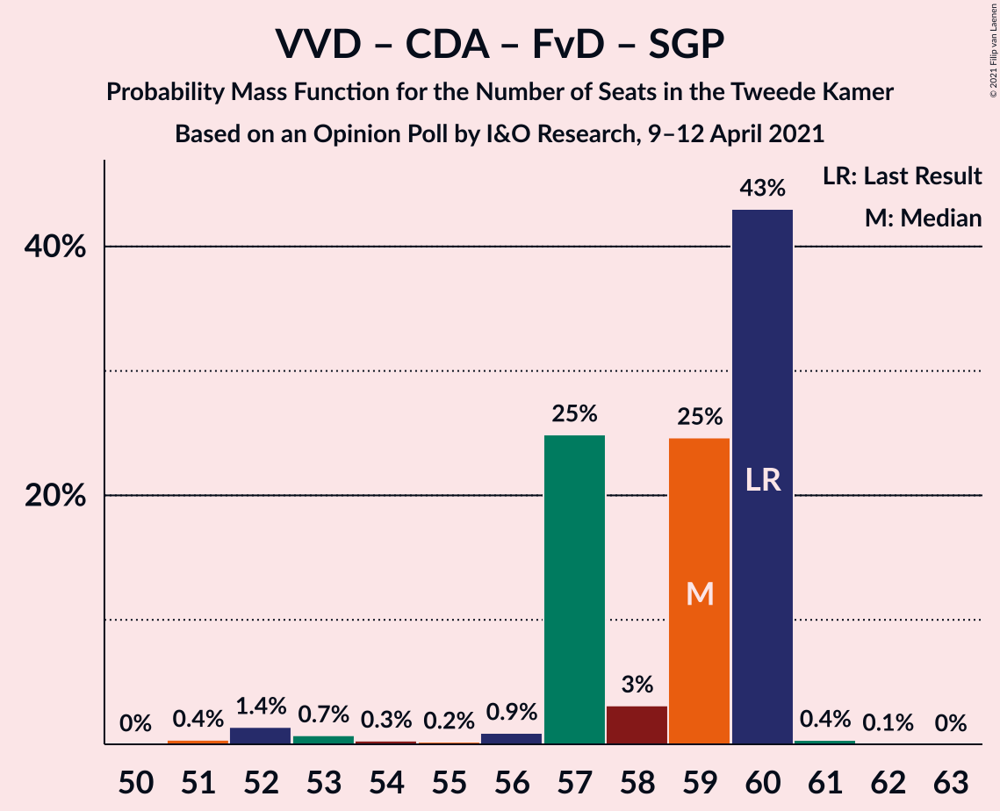

# Opinion Poll by I&O Research, 9–12 April 2021

<a href="#voting-intentions">Voting Intentions</a> | <a href="#seats">Seats</a> | <a href="#coalitions">Coalitions</a> | <a href="#technical-information">Technical Information</a>

## Voting Intentions

### Confidence Intervals

| Party | Last Result | Poll Result | 80% Confidence Interval | 90% Confidence Interval | 95% Confidence Interval | 99% Confidence Interval |
|:-----:|:-----------:|:-----------:|:-----------------------:|:-----------------------:|:-----------------------:|:-----------------------:|
| Volkspartij voor Vrijheid en Democratie | 21.9% | 21.6% | 20.5–22.8% |20.1–23.2% |19.9–23.5% |19.3–24.1% |
| Democraten 66 | 15.0% | 16.5% | 15.5–17.6% |15.2–17.9% |15.0–18.2% |14.5–18.7% |
| Partij voor de Vrijheid | 10.8% | 9.5% | 8.7–10.4% |8.5–10.6% |8.3–10.9% |7.9–11.3% |
| Christen-Democratisch Appèl | 9.5% | 8.8% | 8.0–9.7% |7.8–9.9% |7.6–10.1% |7.3–10.5% |
| Socialistische Partij | 6.0% | 6.4% | 5.8–7.2% |5.6–7.4% |5.4–7.6% |5.1–8.0% |
| Partij van de Arbeid | 5.7% | 5.3% | 4.7–6.0% |4.5–6.2% |4.4–6.4% |4.1–6.7% |
| Forum voor Democratie | 5.0% | 4.7% | 4.1–5.4% |4.0–5.5% |3.9–5.7% |3.6–6.1% |
| Partij voor de Dieren | 3.8% | 4.3% | 3.8–4.9% |3.6–5.1% |3.5–5.3% |3.3–5.6% |
| GroenLinks | 5.2% | 4.2% | 3.7–4.8% |3.5–5.0% |3.4–5.2% |3.2–5.5% |
| Juiste Antwoord 2021 | 2.4% | 3.8% | 3.3–4.4% |3.2–4.6% |3.0–4.7% |2.8–5.0% |
| ChristenUnie | 3.4% | 3.4% | 2.9–4.0% |2.8–4.2% |2.7–4.3% |2.5–4.6% |
| Volt Europa | 2.4% | 3.0% | 2.6–3.6% |2.5–3.7% |2.3–3.9% |2.1–4.1% |
| Staatkundig Gereformeerde Partij | 2.1% | 2.1% | 1.8–2.6% |1.7–2.7% |1.6–2.9% |1.4–3.1% |
| DENK | 2.0% | 1.9% | 1.5–2.3% |1.4–2.5% |1.4–2.6% |1.2–2.8% |
| Bij1 | 0.8% | 1.1% | 0.8–1.4% |0.8–1.6% |0.7–1.6% |0.6–1.8% |
| BoerBurgerBeweging | 1.0% | 1.0% | 0.7–1.3% |0.7–1.4% |0.6–1.5% |0.5–1.7% |
| 50Plus | 1.0% | 0.8% | 0.6–1.1% |0.5–1.2% |0.5–1.3% |0.4–1.5% |

*Note:* The poll result column reflects the actual value used in the calculations. Published results may vary slightly, and in addition be rounded to fewer digits.

## Seats

### Confidence Intervals

| Party | Last Result | Median | 80% Confidence Interval | 90% Confidence Interval | 95% Confidence Interval | 99% Confidence Interval |
|:-----:|:-----------:|:------:|:-----------------------:|:-----------------------:|:-----------------------:|:-----------------------:|
| <a href="#volkspartij-voor-vrijheid-en-democratie">Volkspartij voor Vrijheid en Democratie</a> | 34 | 33 | 33–35 |32–35 |31–35 |30–35 |
| <a href="#democraten-66">Democraten 66</a> | 24 | 25 | 24–27 |24–27 |24–27 |22–27 |
| <a href="#partij-voor-de-vrijheid">Partij voor de Vrijheid</a> | 17 | 15 | 13–16 |13–16 |13–16 |13–17 |
| <a href="#christen-democratisch-appèl">Christen-Democratisch Appèl</a> | 15 | 15 | 14–16 |14–16 |13–16 |12–16 |
| <a href="#socialistische-partij">Socialistische Partij</a> | 9 | 9 | 8–11 |8–11 |8–11 |8–12 |
| <a href="#partij-van-de-arbeid">Partij van de Arbeid</a> | 9 | 7 | 6–7 |6–8 |6–9 |6–9 |
| <a href="#forum-voor-democratie">Forum voor Democratie</a> | 8 | 7 | 5–7 |5–7 |5–8 |5–8 |
| <a href="#partij-voor-de-dieren">Partij voor de Dieren</a> | 6 | 6 | 5–8 |5–8 |5–8 |5–8 |
| <a href="#groenlinks">GroenLinks</a> | 8 | 6 | 5–7 |5–7 |5–7 |5–8 |
| <a href="#juiste-antwoord-2021">Juiste Antwoord 2021</a> | 3 | 5 | 4–6 |4–6 |4–6 |4–7 |
| <a href="#christenunie">ChristenUnie</a> | 5 | 5 | 4–6 |4–6 |4–6 |3–7 |
| <a href="#volt-europa">Volt Europa</a> | 3 | 5 | 3–5 |3–5 |3–5 |3–5 |
| <a href="#staatkundig-gereformeerde-partij">Staatkundig Gereformeerde Partij</a> | 3 | 4 | 3–4 |3–4 |3–4 |2–4 |
| <a href="#denk">DENK</a> | 3 | 2 | 2–3 |2–3 |2–3 |2–4 |
| <a href="#bij1">Bij1</a> | 1 | 1 | 1–2 |1–2 |1–2 |1–2 |
| <a href="#boerburgerbeweging">BoerBurgerBeweging</a> | 1 | 1 | 0–2 |0–2 |0–2 |0–2 |
| <a href="#50plus">50Plus</a> | 1 | 1 | 1 |1 |0–1 |0–1 |

### Volkspartij voor Vrijheid en Democratie

*For a full overview of the results for this party, see the [Volkspartij voor Vrijheid en Democratie](party-volkspartijvoorvrijheidendemocratie.html) page.*

| Number of Seats | Probability | Accumulated | Special Marks |
|:---------------:|:-----------:|:-----------:|:-------------:|
| 30 | 2% | 100% |  |
| 31 | 0.4% | 98% |  |
| 32 | 4% | 97% |  |
| 33 | 43% | 93% | Median |
| 34 | 24% | 50% | Last Result |
| 35 | 25% | 26% |  |
| 36 | 0.4% | 0.5% |  |
| 37 | 0.1% | 0.1% |  |
| 38 | 0% | 0% |  |

### Democraten 66

*For a full overview of the results for this party, see the [Democraten 66](party-democraten66.html) page.*

| Number of Seats | Probability | Accumulated | Special Marks |
|:---------------:|:-----------:|:-----------:|:-------------:|
| 22 | 0.6% | 100% |  |
| 23 | 0.6% | 99.4% |  |
| 24 | 14% | 98.8% | Last Result |
| 25 | 59% | 85% | Median |
| 26 | 2% | 26% |  |
| 27 | 24% | 24% |  |
| 28 | 0% | 0.4% |  |
| 29 | 0.3% | 0.4% |  |
| 30 | 0% | 0% |  |

### Partij voor de Vrijheid

*For a full overview of the results for this party, see the [Partij voor de Vrijheid](party-partijvoordevrijheid.html) page.*

| Number of Seats | Probability | Accumulated | Special Marks |
|:---------------:|:-----------:|:-----------:|:-------------:|
| 12 | 0.1% | 100% |  |
| 13 | 44% | 99.9% |  |
| 14 | 5% | 56% |  |
| 15 | 36% | 51% | Median |
| 16 | 14% | 15% |  |
| 17 | 0.7% | 0.7% | Last Result |
| 18 | 0% | 0% |  |

### Christen-Democratisch Appèl

*For a full overview of the results for this party, see the [Christen-Democratisch Appèl](party-christen-democratischappèl.html) page.*

| Number of Seats | Probability | Accumulated | Special Marks |
|:---------------:|:-----------:|:-----------:|:-------------:|
| 11 | 0.1% | 100% |  |
| 12 | 2% | 99.9% |  |
| 13 | 1.3% | 98% |  |
| 14 | 38% | 96% |  |
| 15 | 16% | 58% | Last Result, Median |
| 16 | 43% | 43% |  |
| 17 | 0% | 0% |  |

### Socialistische Partij

*For a full overview of the results for this party, see the [Socialistische Partij](party-socialistischepartij.html) page.*

| Number of Seats | Probability | Accumulated | Special Marks |
|:---------------:|:-----------:|:-----------:|:-------------:|
| 8 | 24% | 100% |  |
| 9 | 45% | 76% | Last Result, Median |
| 10 | 20% | 32% |  |
| 11 | 12% | 12% |  |
| 12 | 0.2% | 0.6% |  |
| 13 | 0.3% | 0.3% |  |
| 14 | 0% | 0% |  |

### Partij van de Arbeid

*For a full overview of the results for this party, see the [Partij van de Arbeid](party-partijvandearbeid.html) page.*

| Number of Seats | Probability | Accumulated | Special Marks |
|:---------------:|:-----------:|:-----------:|:-------------:|
| 6 | 12% | 100% |  |
| 7 | 79% | 88% | Median |
| 8 | 6% | 9% |  |
| 9 | 3% | 3% | Last Result |
| 10 | 0.2% | 0.2% |  |
| 11 | 0% | 0% |  |

### Forum voor Democratie

*For a full overview of the results for this party, see the [Forum voor Democratie](party-forumvoordemocratie.html) page.*

| Number of Seats | Probability | Accumulated | Special Marks |
|:---------------:|:-----------:|:-----------:|:-------------:|
| 5 | 14% | 100% |  |
| 6 | 24% | 86% |  |
| 7 | 57% | 62% | Median |
| 8 | 4% | 4% | Last Result |
| 9 | 0.1% | 0.1% |  |
| 10 | 0% | 0% |  |

### Partij voor de Dieren

*For a full overview of the results for this party, see the [Partij voor de Dieren](party-partijvoordedieren.html) page.*

| Number of Seats | Probability | Accumulated | Special Marks |
|:---------------:|:-----------:|:-----------:|:-------------:|
| 5 | 14% | 100% |  |
| 6 | 39% | 86% | Last Result, Median |
| 7 | 2% | 47% |  |
| 8 | 44% | 44% |  |
| 9 | 0% | 0% |  |

### GroenLinks

*For a full overview of the results for this party, see the [GroenLinks](party-groenlinks.html) page.*

| Number of Seats | Probability | Accumulated | Special Marks |
|:---------------:|:-----------:|:-----------:|:-------------:|
| 5 | 23% | 100% |  |
| 6 | 59% | 77% | Median |
| 7 | 18% | 18% |  |
| 8 | 0.5% | 0.5% | Last Result |
| 9 | 0% | 0% |  |

### Juiste Antwoord 2021

*For a full overview of the results for this party, see the [Juiste Antwoord 2021](party-juisteantwoord2021.html) page.*

| Number of Seats | Probability | Accumulated | Special Marks |
|:---------------:|:-----------:|:-----------:|:-------------:|
| 3 | 0.3% | 100% | Last Result |
| 4 | 14% | 99.7% |  |
| 5 | 46% | 86% | Median |
| 6 | 37% | 39% |  |
| 7 | 2% | 2% |  |
| 8 | 0.1% | 0.1% |  |
| 9 | 0% | 0% |  |

### ChristenUnie

*For a full overview of the results for this party, see the [ChristenUnie](party-christenunie.html) page.*

| Number of Seats | Probability | Accumulated | Special Marks |
|:---------------:|:-----------:|:-----------:|:-------------:|
| 3 | 2% | 100% |  |
| 4 | 44% | 98% |  |
| 5 | 28% | 53% | Last Result, Median |
| 6 | 25% | 26% |  |
| 7 | 0.9% | 0.9% |  |
| 8 | 0% | 0% |  |

### Volt Europa

*For a full overview of the results for this party, see the [Volt Europa](party-volteuropa.html) page.*

| Number of Seats | Probability | Accumulated | Special Marks |
|:---------------:|:-----------:|:-----------:|:-------------:|
| 3 | 14% | 100% | Last Result |
| 4 | 26% | 86% |  |
| 5 | 59% | 59% | Median |
| 6 | 0.3% | 0.3% |  |
| 7 | 0% | 0% |  |

### Staatkundig Gereformeerde Partij

*For a full overview of the results for this party, see the [Staatkundig Gereformeerde Partij](party-staatkundiggereformeerdepartij.html) page.*

| Number of Seats | Probability | Accumulated | Special Marks |
|:---------------:|:-----------:|:-----------:|:-------------:|
| 2 | 2% | 100% |  |
| 3 | 39% | 98% | Last Result |
| 4 | 59% | 59% | Median |
| 5 | 0% | 0% |  |

### DENK

*For a full overview of the results for this party, see the [DENK](party-denk.html) page.*

| Number of Seats | Probability | Accumulated | Special Marks |
|:---------------:|:-----------:|:-----------:|:-------------:|
| 2 | 60% | 100% | Median |
| 3 | 38% | 40% | Last Result |
| 4 | 2% | 2% |  |
| 5 | 0% | 0% |  |

### Bij1

*For a full overview of the results for this party, see the [Bij1](party-bij1.html) page.*

| Number of Seats | Probability | Accumulated | Special Marks |
|:---------------:|:-----------:|:-----------:|:-------------:|
| 0 | 0.5% | 100% |  |
| 1 | 81% | 99.5% | Last Result, Median |
| 2 | 19% | 19% |  |
| 3 | 0% | 0% |  |

### BoerBurgerBeweging

*For a full overview of the results for this party, see the [BoerBurgerBeweging](party-boerburgerbeweging.html) page.*

| Number of Seats | Probability | Accumulated | Special Marks |
|:---------------:|:-----------:|:-----------:|:-------------:|
| 0 | 11% | 100% |  |
| 1 | 63% | 89% | Last Result, Median |
| 2 | 26% | 26% |  |
| 3 | 0% | 0% |  |

### 50Plus

*For a full overview of the results for this party, see the [50Plus](party-50plus.html) page.*

| Number of Seats | Probability | Accumulated | Special Marks |
|:---------------:|:-----------:|:-----------:|:-------------:|
| 0 | 3% | 100% |  |
| 1 | 97% | 97% | Last Result, Median |
| 2 | 0.1% | 0.1% |  |
| 3 | 0% | 0% |  |

## Coalitions

### Confidence Intervals

| Coalition | Last Result | Median | Majority? | 80% Confidence Interval | 90% Confidence Interval | 95% Confidence Interval | 99% Confidence Interval |
|:---------:|:-----------:|:------:|:---------:|:-----------------------:|:-----------------------:|:-----------------------:|:-----------------------:|
| Volkspartij voor Vrijheid en Democratie – Democraten 66 – Christen-Democratisch Appèl – Partij van de Arbeid – ChristenUnie | 87 | 85 | 100% | 84–88 | 84–88 | 82–88 | 82–88 |
| Volkspartij voor Vrijheid en Democratie – Democraten 66 – Christen-Democratisch Appèl – GroenLinks – ChristenUnie | 86 | 84 | 100% | 84–86 | 82–86 | 81–86 | 80–86 |
| Volkspartij voor Vrijheid en Democratie – Democraten 66 – Christen-Democratisch Appèl – ChristenUnie | 78 | 78 | 94% | 78–81 | 75–81 | 74–81 | 74–81 |
| Volkspartij voor Vrijheid en Democratie – Democraten 66 – Christen-Democratisch Appèl | 73 | 74 | 0.5% | 73–75 | 71–75 | 69–75 | 68–75 |
| Volkspartij voor Vrijheid en Democratie – Partij voor de Vrijheid – Christen-Democratisch Appèl – Forum voor Democratie – Staatkundig Gereformeerde Partij | 77 | 73 | 0.1% | 72–75 | 72–75 | 67–75 | 66–75 |
| Volkspartij voor Vrijheid en Democratie – Partij voor de Vrijheid – Christen-Democratisch Appèl – Forum voor Democratie | 74 | 69 | 0% | 69–71 | 68–71 | 64–71 | 63–72 |
| Democraten 66 – Christen-Democratisch Appèl – Socialistische Partij – Partij van de Arbeid – GroenLinks – ChristenUnie | 70 | 67 | 0% | 67–68 | 67–68 | 67–70 | 65–72 |
| Volkspartij voor Vrijheid en Democratie – Democraten 66 – Partij van de Arbeid | 67 | 65 | 0% | 65–68 | 65–68 | 65–68 | 63–69 |
| Volkspartij voor Vrijheid en Democratie – Partij voor de Vrijheid – Christen-Democratisch Appèl | 66 | 62 | 0% | 62–66 | 60–66 | 58–66 | 56–66 |
| Volkspartij voor Vrijheid en Democratie – Christen-Democratisch Appèl – Forum voor Democratie – Staatkundig Gereformeerde Partij – 50Plus | 61 | 60 | 0% | 58–61 | 57–61 | 54–61 | 53–61 |
| Democraten 66 – Christen-Democratisch Appèl – Partij van de Arbeid – GroenLinks – ChristenUnie | 61 | 58 | 0% | 56–59 | 56–59 | 56–60 | 56–62 |
| Volkspartij voor Vrijheid en Democratie – Christen-Democratisch Appèl – Forum voor Democratie – Staatkundig Gereformeerde Partij | 60 | 59 | 0% | 57–60 | 57–60 | 54–60 | 52–60 |
| Volkspartij voor Vrijheid en Democratie – Christen-Democratisch Appèl – Partij van de Arbeid | 58 | 56 | 0% | 55–57 | 54–57 | 52–57 | 51–57 |
| Volkspartij voor Vrijheid en Democratie – Christen-Democratisch Appèl – Forum voor Democratie – 50Plus | 58 | 57 | 0% | 55–57 | 54–57 | 51–57 | 50–58 |
| Volkspartij voor Vrijheid en Democratie – Christen-Democratisch Appèl – Forum voor Democratie | 57 | 56 | 0% | 54–56 | 54–56 | 50–56 | 49–57 |
| Volkspartij voor Vrijheid en Democratie – Christen-Democratisch Appèl | 49 | 49 | 0% | 48–50 | 46–50 | 44–50 | 42–50 |
| Democraten 66 – Christen-Democratisch Appèl – Partij van de Arbeid | 48 | 48 | 0% | 44–48 | 44–48 | 44–48 | 44–49 |
| Volkspartij voor Vrijheid en Democratie – Partij van de Arbeid | 43 | 40 | 0% | 40–42 | 40–42 | 40–42 | 39–43 |
| Democraten 66 – Christen-Democratisch Appèl | 39 | 41 | 0% | 38–41 | 38–41 | 38–41 | 35–41 |
| Christen-Democratisch Appèl – Partij van de Arbeid – ChristenUnie | 29 | 27 | 0% | 25–27 | 25–27 | 25–27 | 25–29 |
| Christen-Democratisch Appèl – Partij van de Arbeid | 24 | 22 | 0% | 20–23 | 20–23 | 20–23 | 20–23 |

### Volkspartij voor Vrijheid en Democratie – Democraten 66 – Christen-Democratisch Appèl – Partij van de Arbeid – ChristenUnie

| Number of Seats | Probability | Accumulated | Special Marks |
|:---------------:|:-----------:|:-----------:|:-------------:|
| 80 | 0.4% | 100% |  |
| 81 | 0% | 99.6% |  |
| 82 | 2% | 99.5% |  |
| 83 | 2% | 97% |  |
| 84 | 13% | 96% |  |
| 85 | 44% | 83% | Median |
| 86 | 0.7% | 38% |  |
| 87 | 15% | 37% | Last Result |
| 88 | 23% | 23% |  |
| 89 | 0.1% | 0.1% |  |
| 90 | 0% | 0% |  |

### Volkspartij voor Vrijheid en Democratie – Democraten 66 – Christen-Democratisch Appèl – GroenLinks – ChristenUnie

| Number of Seats | Probability | Accumulated | Special Marks |
|:---------------:|:-----------:|:-----------:|:-------------:|
| 78 | 0.4% | 100% |  |
| 79 | 0.1% | 99.6% |  |
| 80 | 0.1% | 99.5% |  |
| 81 | 4% | 99.4% |  |
| 82 | 1.5% | 95% |  |
| 83 | 1.2% | 94% |  |
| 84 | 44% | 93% | Median |
| 85 | 12% | 49% |  |
| 86 | 37% | 37% | Last Result |
| 87 | 0.1% | 0.3% |  |
| 88 | 0% | 0.2% |  |
| 89 | 0% | 0.2% |  |
| 90 | 0.2% | 0.2% |  |
| 91 | 0% | 0% |  |

### Volkspartij voor Vrijheid en Democratie – Democraten 66 – Christen-Democratisch Appèl – ChristenUnie

| Number of Seats | Probability | Accumulated | Special Marks |
|:---------------:|:-----------:|:-----------:|:-------------:|
| 71 | 0.4% | 100% |  |
| 72 | 0% | 99.6% |  |
| 73 | 0.1% | 99.6% |  |
| 74 | 2% | 99.5% |  |
| 75 | 3% | 97% |  |
| 76 | 1.4% | 94% | Majority |
| 77 | 0.1% | 93% |  |
| 78 | 55% | 93% | Last Result, Median |
| 79 | 1.4% | 38% |  |
| 80 | 14% | 36% |  |
| 81 | 22% | 23% |  |
| 82 | 0.2% | 0.3% |  |
| 83 | 0% | 0% |  |

### Volkspartij voor Vrijheid en Democratie – Democraten 66 – Christen-Democratisch Appèl

| Number of Seats | Probability | Accumulated | Special Marks |
|:---------------:|:-----------:|:-----------:|:-------------:|
| 66 | 0.4% | 100% |  |
| 67 | 0% | 99.6% |  |
| 68 | 0.1% | 99.6% |  |
| 69 | 2% | 99.5% |  |
| 70 | 2% | 97% |  |
| 71 | 3% | 96% |  |
| 72 | 1.1% | 93% |  |
| 73 | 12% | 92% | Last Result, Median |
| 74 | 44% | 80% |  |
| 75 | 36% | 36% |  |
| 76 | 0.2% | 0.5% | Majority |
| 77 | 0.2% | 0.3% |  |
| 78 | 0% | 0% |  |

### Volkspartij voor Vrijheid en Democratie – Partij voor de Vrijheid – Christen-Democratisch Appèl – Forum voor Democratie – Staatkundig Gereformeerde Partij

| Number of Seats | Probability | Accumulated | Special Marks |
|:---------------:|:-----------:|:-----------:|:-------------:|
| 66 | 2% | 100% |  |
| 67 | 1.0% | 98% |  |
| 68 | 0.1% | 97% |  |
| 69 | 0.3% | 97% |  |
| 70 | 0.4% | 97% |  |
| 71 | 0.5% | 96% |  |
| 72 | 27% | 96% |  |
| 73 | 43% | 69% |  |
| 74 | 11% | 26% | Median |
| 75 | 14% | 14% |  |
| 76 | 0% | 0.1% | Majority |
| 77 | 0% | 0.1% | Last Result |
| 78 | 0.1% | 0.1% |  |
| 79 | 0% | 0% |  |

### Volkspartij voor Vrijheid en Democratie – Partij voor de Vrijheid – Christen-Democratisch Appèl – Forum voor Democratie

| Number of Seats | Probability | Accumulated | Special Marks |
|:---------------:|:-----------:|:-----------:|:-------------:|
| 63 | 2% | 100% |  |
| 64 | 0.8% | 98% |  |
| 65 | 0.4% | 97% |  |
| 66 | 0% | 97% |  |
| 67 | 0.4% | 97% |  |
| 68 | 3% | 97% |  |
| 69 | 67% | 94% |  |
| 70 | 2% | 27% | Median |
| 71 | 25% | 26% |  |
| 72 | 0.4% | 0.5% |  |
| 73 | 0% | 0.2% |  |
| 74 | 0% | 0.1% | Last Result |
| 75 | 0.1% | 0.1% |  |
| 76 | 0% | 0% | Majority |

### Democraten 66 – Christen-Democratisch Appèl – Socialistische Partij – Partij van de Arbeid – GroenLinks – ChristenUnie

| Number of Seats | Probability | Accumulated | Special Marks |
|:---------------:|:-----------:|:-----------:|:-------------:|
| 62 | 0% | 100% |  |
| 63 | 0.1% | 99.9% |  |
| 64 | 0.3% | 99.9% |  |
| 65 | 0.3% | 99.6% |  |
| 66 | 0.5% | 99.3% |  |
| 67 | 79% | 98.8% | Median |
| 68 | 16% | 20% |  |
| 69 | 1.0% | 4% |  |
| 70 | 2% | 3% | Last Result |
| 71 | 0.1% | 0.8% |  |
| 72 | 0.7% | 0.8% |  |
| 73 | 0% | 0.1% |  |
| 74 | 0% | 0% |  |

### Volkspartij voor Vrijheid en Democratie – Democraten 66 – Partij van de Arbeid

| Number of Seats | Probability | Accumulated | Special Marks |
|:---------------:|:-----------:|:-----------:|:-------------:|
| 62 | 0.1% | 100% |  |
| 63 | 0.4% | 99.9% |  |
| 64 | 2% | 99.5% |  |
| 65 | 57% | 98% | Median |
| 66 | 3% | 40% |  |
| 67 | 14% | 37% | Last Result |
| 68 | 22% | 23% |  |
| 69 | 0.5% | 0.9% |  |
| 70 | 0.4% | 0.4% |  |
| 71 | 0.1% | 0.1% |  |
| 72 | 0% | 0% |  |

### Volkspartij voor Vrijheid en Democratie – Partij voor de Vrijheid – Christen-Democratisch Appèl

| Number of Seats | Probability | Accumulated | Special Marks |
|:---------------:|:-----------:|:-----------:|:-------------:|
| 56 | 1.4% | 100% |  |
| 57 | 0.8% | 98.6% |  |
| 58 | 0.4% | 98% |  |
| 59 | 0.2% | 97% |  |
| 60 | 3% | 97% |  |
| 61 | 2% | 94% |  |
| 62 | 43% | 93% |  |
| 63 | 23% | 49% | Median |
| 64 | 13% | 27% |  |
| 65 | 0.3% | 14% |  |
| 66 | 14% | 14% | Last Result |
| 67 | 0.1% | 0.1% |  |
| 68 | 0% | 0% |  |

### Volkspartij voor Vrijheid en Democratie – Christen-Democratisch Appèl – Forum voor Democratie – Staatkundig Gereformeerde Partij – 50Plus

| Number of Seats | Probability | Accumulated | Special Marks |
|:---------------:|:-----------:|:-----------:|:-------------:|
| 52 | 0.4% | 100% |  |
| 53 | 1.4% | 99.6% |  |
| 54 | 0.7% | 98% |  |
| 55 | 0.3% | 97% |  |
| 56 | 0.6% | 97% |  |
| 57 | 2% | 97% |  |
| 58 | 24% | 95% |  |
| 59 | 3% | 71% |  |
| 60 | 25% | 68% | Median |
| 61 | 43% | 43% | Last Result |
| 62 | 0.1% | 0.1% |  |
| 63 | 0% | 0% |  |

### Democraten 66 – Christen-Democratisch Appèl – Partij van de Arbeid – GroenLinks – ChristenUnie

| Number of Seats | Probability | Accumulated | Special Marks |
|:---------------:|:-----------:|:-----------:|:-------------:|
| 53 | 0.1% | 100% |  |
| 54 | 0.1% | 99.9% |  |
| 55 | 0.1% | 99.8% |  |
| 56 | 12% | 99.7% |  |
| 57 | 3% | 88% |  |
| 58 | 58% | 85% | Median |
| 59 | 23% | 27% |  |
| 60 | 3% | 4% |  |
| 61 | 0.1% | 0.8% | Last Result |
| 62 | 0.7% | 0.8% |  |
| 63 | 0% | 0.1% |  |
| 64 | 0% | 0% |  |

### Volkspartij voor Vrijheid en Democratie – Christen-Democratisch Appèl – Forum voor Democratie – Staatkundig Gereformeerde Partij

| Number of Seats | Probability | Accumulated | Special Marks |
|:---------------:|:-----------:|:-----------:|:-------------:|
| 51 | 0.4% | 100% |  |
| 52 | 1.4% | 99.6% |  |
| 53 | 0.7% | 98% |  |
| 54 | 0.3% | 98% |  |
| 55 | 0.2% | 97% |  |
| 56 | 0.9% | 97% |  |
| 57 | 25% | 96% |  |
| 58 | 3% | 71% |  |
| 59 | 25% | 68% | Median |
| 60 | 43% | 43% | Last Result |
| 61 | 0.4% | 0.4% |  |
| 62 | 0.1% | 0.1% |  |
| 63 | 0% | 0% |  |

### Volkspartij voor Vrijheid en Democratie – Christen-Democratisch Appèl – Partij van de Arbeid

| Number of Seats | Probability | Accumulated | Special Marks |
|:---------------:|:-----------:|:-----------:|:-------------:|
| 51 | 1.4% | 100% |  |
| 52 | 1.3% | 98.6% |  |
| 53 | 0.1% | 97% |  |
| 54 | 5% | 97% |  |
| 55 | 33% | 92% | Median |
| 56 | 43% | 59% |  |
| 57 | 15% | 16% |  |
| 58 | 0.4% | 0.4% | Last Result |
| 59 | 0% | 0% |  |

### Volkspartij voor Vrijheid en Democratie – Christen-Democratisch Appèl – Forum voor Democratie – 50Plus

| Number of Seats | Probability | Accumulated | Special Marks |
|:---------------:|:-----------:|:-----------:|:-------------:|
| 49 | 0.4% | 100% |  |
| 50 | 1.4% | 99.6% |  |
| 51 | 0.8% | 98% |  |
| 52 | 0% | 97% |  |
| 53 | 1.0% | 97% |  |
| 54 | 2% | 96% |  |
| 55 | 25% | 95% |  |
| 56 | 15% | 70% | Median |
| 57 | 54% | 55% |  |
| 58 | 0.5% | 0.5% | Last Result |
| 59 | 0% | 0.1% |  |
| 60 | 0% | 0% |  |

### Volkspartij voor Vrijheid en Democratie – Christen-Democratisch Appèl – Forum voor Democratie

| Number of Seats | Probability | Accumulated | Special Marks |
|:---------------:|:-----------:|:-----------:|:-------------:|
| 48 | 0.3% | 100% |  |
| 49 | 1.4% | 99.7% |  |
| 50 | 0.8% | 98% |  |
| 51 | 0% | 97% |  |
| 52 | 0.6% | 97% |  |
| 53 | 0.7% | 97% |  |
| 54 | 26% | 96% |  |
| 55 | 15% | 70% | Median |
| 56 | 54% | 55% |  |
| 57 | 0.1% | 0.6% | Last Result |
| 58 | 0.4% | 0.4% |  |
| 59 | 0% | 0% |  |

### Volkspartij voor Vrijheid en Democratie – Christen-Democratisch Appèl

| Number of Seats | Probability | Accumulated | Special Marks |
|:---------------:|:-----------:|:-----------:|:-------------:|
| 42 | 1.4% | 100% |  |
| 43 | 1.1% | 98.6% |  |
| 44 | 0.1% | 98% |  |
| 45 | 0.2% | 97% |  |
| 46 | 5% | 97% |  |
| 47 | 0.5% | 93% |  |
| 48 | 23% | 92% | Median |
| 49 | 55% | 70% | Last Result |
| 50 | 14% | 14% |  |
| 51 | 0.2% | 0.3% |  |
| 52 | 0% | 0% |  |

### Democraten 66 – Christen-Democratisch Appèl – Partij van de Arbeid

| Number of Seats | Probability | Accumulated | Special Marks |
|:---------------:|:-----------:|:-----------:|:-------------:|
| 42 | 0.1% | 100% |  |
| 43 | 0.1% | 99.9% |  |
| 44 | 12% | 99.8% |  |
| 45 | 0.5% | 88% |  |
| 46 | 2% | 88% |  |
| 47 | 17% | 86% | Median |
| 48 | 67% | 68% | Last Result |
| 49 | 0.4% | 0.6% |  |
| 50 | 0.1% | 0.2% |  |
| 51 | 0% | 0.1% |  |
| 52 | 0% | 0% |  |

### Volkspartij voor Vrijheid en Democratie – Partij van de Arbeid

| Number of Seats | Probability | Accumulated | Special Marks |
|:---------------:|:-----------:|:-----------:|:-------------:|
| 38 | 0.1% | 100% |  |
| 39 | 2% | 99.8% |  |
| 40 | 48% | 98% | Median |
| 41 | 34% | 50% |  |
| 42 | 15% | 16% |  |
| 43 | 0.6% | 1.0% | Last Result |
| 44 | 0.4% | 0.4% |  |
| 45 | 0% | 0% |  |

### Democraten 66 – Christen-Democratisch Appèl

| Number of Seats | Probability | Accumulated | Special Marks |
|:---------------:|:-----------:|:-----------:|:-------------:|
| 34 | 0.1% | 100% |  |
| 35 | 0.5% | 99.9% |  |
| 36 | 0.1% | 99.5% |  |
| 37 | 0.9% | 99.4% |  |
| 38 | 13% | 98.5% |  |
| 39 | 6% | 86% | Last Result |
| 40 | 14% | 80% | Median |
| 41 | 65% | 66% |  |
| 42 | 0.3% | 0.4% |  |
| 43 | 0% | 0% |  |

### Christen-Democratisch Appèl – Partij van de Arbeid – ChristenUnie

| Number of Seats | Probability | Accumulated | Special Marks |
|:---------------:|:-----------:|:-----------:|:-------------:|
| 23 | 0.3% | 100% |  |
| 24 | 0.2% | 99.7% |  |
| 25 | 14% | 99.5% |  |
| 26 | 1.4% | 86% |  |
| 27 | 82% | 84% | Median |
| 28 | 0.1% | 2% |  |
| 29 | 2% | 2% | Last Result |
| 30 | 0% | 0.1% |  |
| 31 | 0% | 0% |  |

### Christen-Democratisch Appèl – Partij van de Arbeid

| Number of Seats | Probability | Accumulated | Special Marks |
|:---------------:|:-----------:|:-----------:|:-------------:|
| 19 | 0.4% | 100% |  |
| 20 | 12% | 99.5% |  |
| 21 | 24% | 88% |  |
| 22 | 19% | 64% | Median |
| 23 | 45% | 45% |  |
| 24 | 0.1% | 0.1% | Last Result |
| 25 | 0% | 0% |  |

## Technical Information

### Opinion Poll

+ **Polling firm:** I&O Research
+ **Commissioner(s):** —
+ **Fieldwork period:** 9–12 April 2021

### Calculations

+ **Sample size:** 2023
+ **Simulations done:** 1,048,576
+ **Error estimate:** 2.07%

