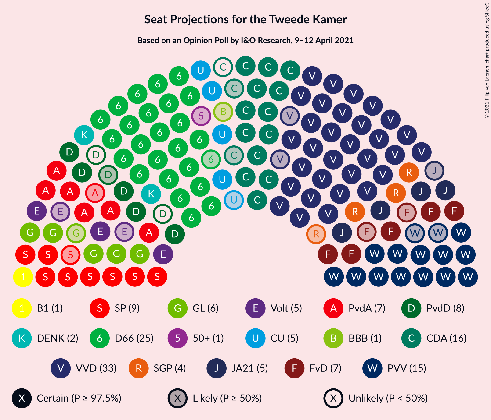
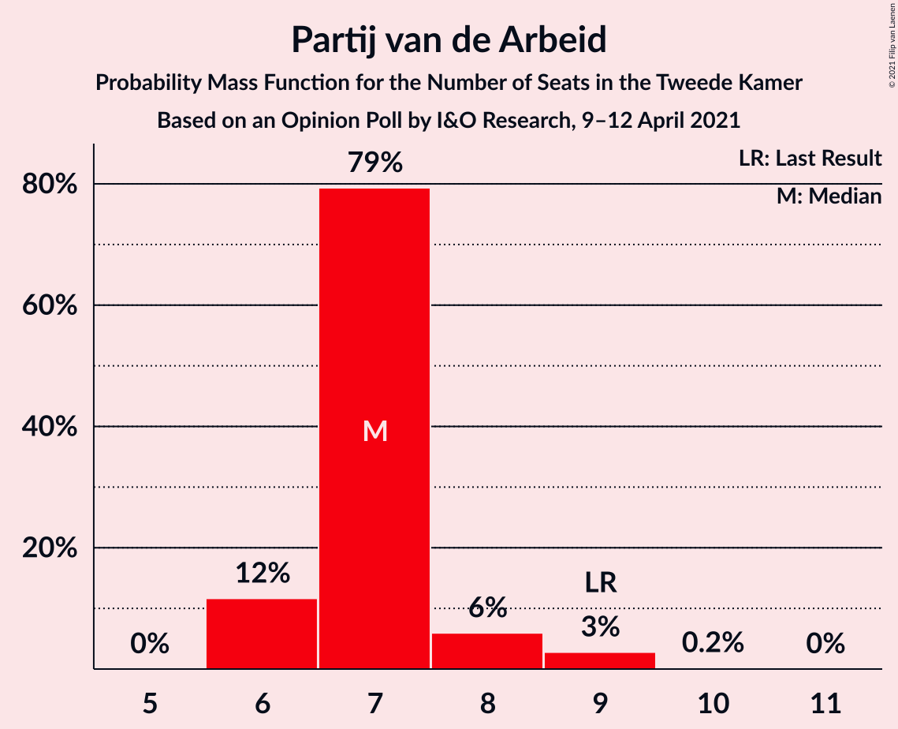
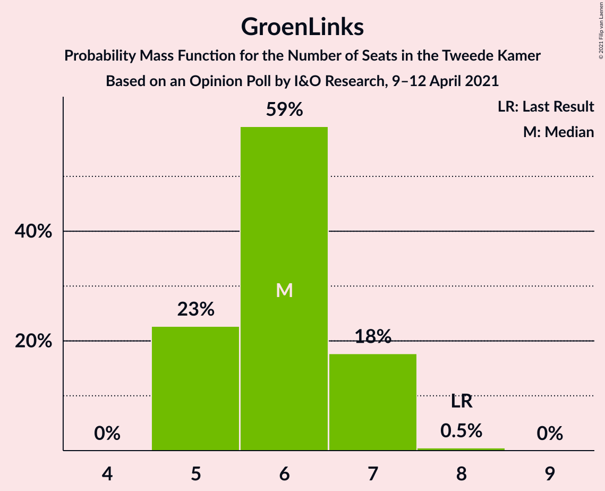
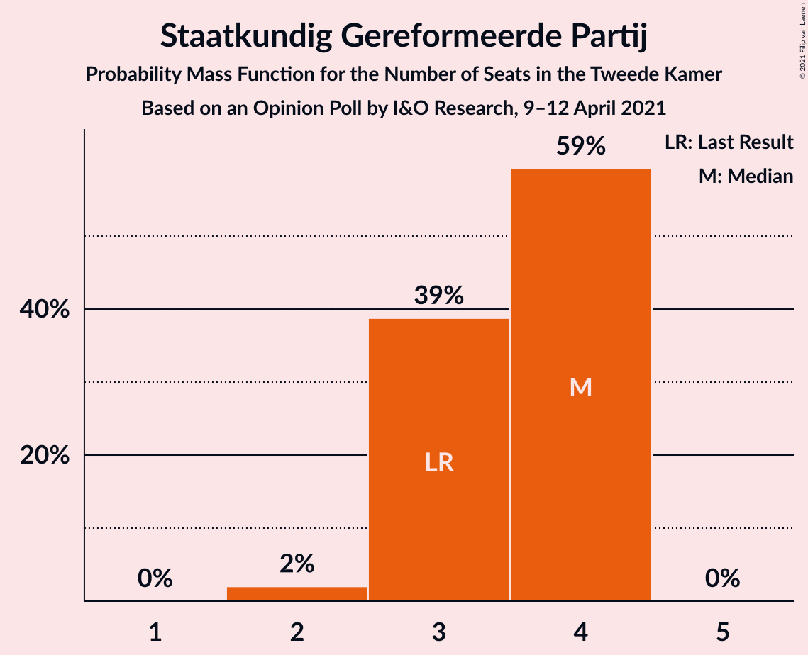
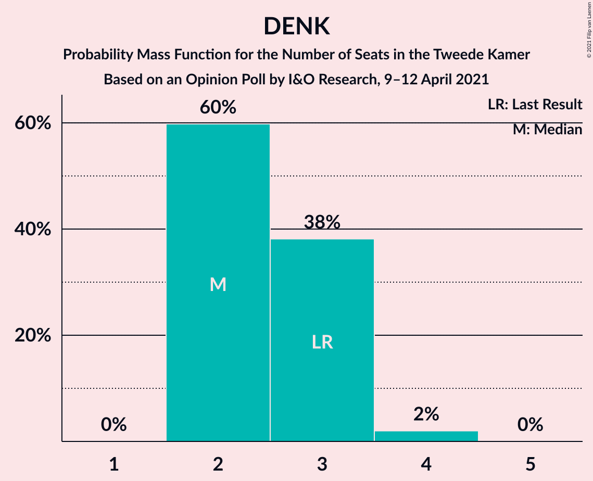
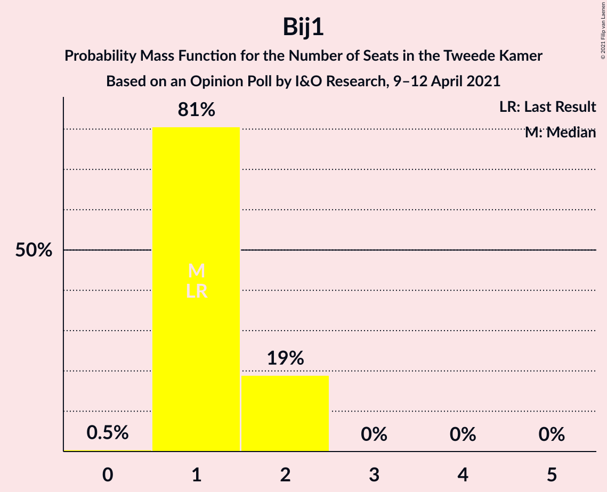
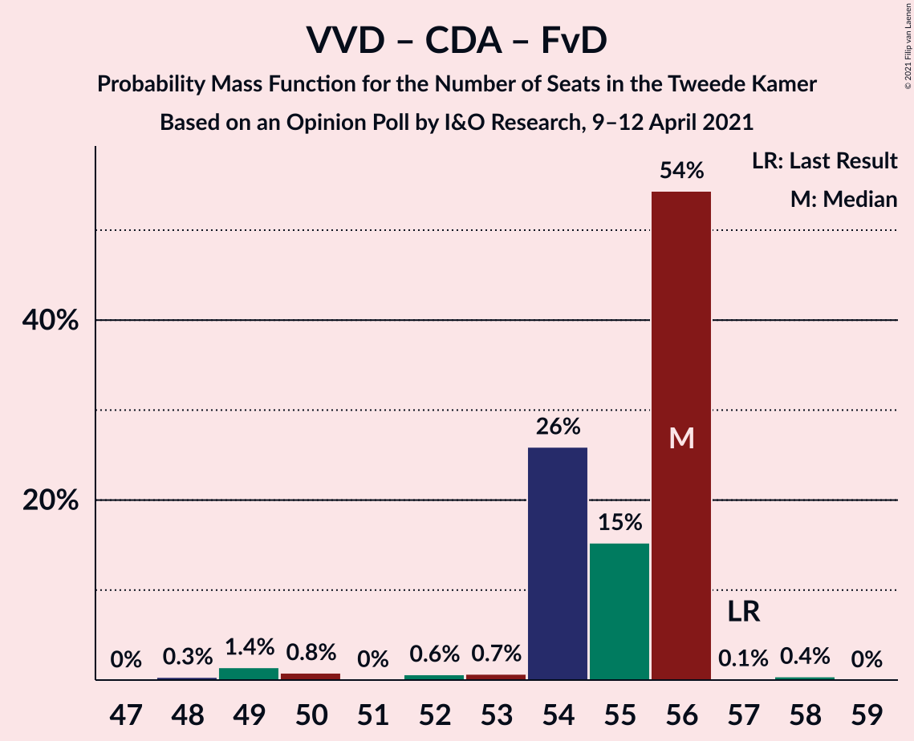

# Opinion Poll by I&O Research, 9–12 April 2021

<a href="#voting-intentions">Voting Intentions</a> | <a href="#seats">Seats</a> | <a href="#coalitions">Coalitions</a> | <a href="#technical-information">Technical Information</a>

## Voting Intentions

### Confidence Intervals

| Party | Last Result | Poll Result | 80% Confidence Interval | 90% Confidence Interval | 95% Confidence Interval | 99% Confidence Interval |
|:-----:|:-----------:|:-----------:|:-----------------------:|:-----------------------:|:-----------------------:|:-----------------------:|
| Volkspartij voor Vrijheid en Democratie | 21.9% | 22.6% | 21.5–23.9% |21.1–24.2% |20.9–24.5% |20.3–25.1% |
| Democraten 66 | 15.0% | 17.3% | 16.2–18.4% |16.0–18.7% |15.7–19.0% |15.2–19.6% |
| Partij voor de Vrijheid | 10.8% | 10.0% | 9.2–10.9% |8.9–11.2% |8.7–11.4% |8.4–11.8% |
| Christen-Democratisch Appèl | 9.5% | 9.3% | 8.5–10.2% |8.3–10.4% |8.1–10.6% |7.7–11.1% |
| Socialistische Partij | 6.0% | 6.7% | 6.0–7.4% |5.8–7.7% |5.7–7.8% |5.3–8.2% |
| Partij van de Arbeid | 5.7% | 5.3% | 4.7–6.0% |4.6–6.2% |4.4–6.4% |4.2–6.8% |
| Forum voor Democratie | 5.0% | 4.6% | 4.1–5.3% |3.9–5.5% |3.8–5.7% |3.6–6.0% |
| GroenLinks | 5.2% | 4.0% | 3.5–4.6% |3.4–4.8% |3.2–5.0% |3.0–5.3% |
| Partij voor de Dieren | 3.8% | 4.0% | 3.5–4.6% |3.4–4.8% |3.2–5.0% |3.0–5.3% |
| Juiste Antwoord 2021 | 2.4% | 4.0% | 3.5–4.6% |3.4–4.8% |3.2–5.0% |3.0–5.3% |
| ChristenUnie | 3.4% | 3.3% | 2.9–3.9% |2.7–4.1% |2.6–4.2% |2.4–4.5% |
| Volt Europa | 2.4% | 2.7% | 2.3–3.2% |2.1–3.3% |2.0–3.5% |1.9–3.7% |
| Staatkundig Gereformeerde Partij | 2.1% | 2.0% | 1.6–2.4% |1.5–2.6% |1.4–2.7% |1.3–2.9% |
| DENK | 2.0% | 2.0% | 1.6–2.4% |1.5–2.6% |1.4–2.7% |1.3–2.9% |
| 50Plus | 1.0% | 0.6% | 0.5–0.9% |0.4–1.0% |0.4–1.1% |0.3–1.3% |
| Bij1 | 0.8% | 0.6% | 0.5–0.9% |0.4–1.0% |0.4–1.1% |0.3–1.3% |
| BoerBurgerBeweging | 1.0% | 0.6% | 0.5–0.9% |0.4–1.0% |0.4–1.1% |0.3–1.3% |

*Note:* The poll result column reflects the actual value used in the calculations. Published results may vary slightly, and in addition be rounded to fewer digits.

## Seats

### Confidence Intervals

| Party | Last Result | Median | 80% Confidence Interval | 90% Confidence Interval | 95% Confidence Interval | 99% Confidence Interval |
|:-----:|:-----------:|:------:|:-----------------------:|:-----------------------:|:-----------------------:|:-----------------------:|
| <a href="#volkspartij-voor-vrijheid-en-democratie">Volkspartij voor Vrijheid en Democratie</a> | 34 | 36 | 33–38 |33–38 |33–40 |33–40 |
| <a href="#democraten-66">Democraten 66</a> | 24 | 23 | 23–28 |23–29 |23–29 |23–32 |
| <a href="#partij-voor-de-vrijheid">Partij voor de Vrijheid</a> | 17 | 16 | 13–17 |13–17 |13–17 |12–17 |
| <a href="#christen-democratisch-appèl">Christen-Democratisch Appèl</a> | 15 | 15 | 14–15 |14–15 |14–15 |12–16 |
| <a href="#socialistische-partij">Socialistische Partij</a> | 9 | 9 | 8–10 |8–10 |8–11 |8–13 |
| <a href="#partij-van-de-arbeid">Partij van de Arbeid</a> | 9 | 9 | 7–9 |7–9 |6–9 |6–10 |
| <a href="#forum-voor-democratie">Forum voor Democratie</a> | 8 | 6 | 6–8 |6–8 |6–8 |5–9 |
| <a href="#groenlinks">GroenLinks</a> | 8 | 5 | 5–8 |5–8 |5–8 |5–8 |
| <a href="#partij-voor-de-dieren">Partij voor de Dieren</a> | 6 | 6 | 4–7 |4–7 |4–7 |4–7 |
| <a href="#juiste-antwoord-2021">Juiste Antwoord 2021</a> | 3 | 7 | 6–8 |6–8 |5–8 |5–8 |
| <a href="#christenunie">ChristenUnie</a> | 5 | 4 | 4–6 |4–6 |4–6 |4–6 |
| <a href="#volt-europa">Volt Europa</a> | 3 | 5 | 4–5 |3–5 |3–5 |3–5 |
| <a href="#staatkundig-gereformeerde-partij">Staatkundig Gereformeerde Partij</a> | 3 | 3 | 2–3 |2–3 |2–3 |2–4 |
| <a href="#denk">DENK</a> | 3 | 2 | 2–4 |2–4 |2–4 |2–4 |
| <a href="#50plus">50Plus</a> | 1 | 1 | 0–1 |0–1 |0–1 |0–2 |
| <a href="#bij1">Bij1</a> | 1 | 1 | 0–1 |0–1 |0–1 |0–1 |
| <a href="#boerburgerbeweging">BoerBurgerBeweging</a> | 1 | 1 | 0–1 |0–1 |0–1 |0–1 |

### Volkspartij voor Vrijheid en Democratie

*For a full overview of the results for this party, see the [Volkspartij voor Vrijheid en Democratie](party-volkspartijvoorvrijheidendemocratie.html) page.*

| Number of Seats | Probability | Accumulated | Special Marks |
|:---------------:|:-----------:|:-----------:|:-------------:|
| 32 | 0.1% | 100% |  |
| 33 | 18% | 99.9% |  |
| 34 | 20% | 82% | Last Result |
| 35 | 4% | 62% |  |
| 36 | 41% | 58% | Median |
| 37 | 0.7% | 18% |  |
| 38 | 13% | 17% |  |
| 39 | 0.1% | 4% |  |
| 40 | 4% | 4% |  |
| 41 | 0% | 0.2% |  |
| 42 | 0% | 0.2% |  |
| 43 | 0.2% | 0.2% |  |
| 44 | 0% | 0% |  |

### Democraten 66

*For a full overview of the results for this party, see the [Democraten 66](party-democraten66.html) page.*

| Number of Seats | Probability | Accumulated | Special Marks |
|:---------------:|:-----------:|:-----------:|:-------------:|
| 23 | 53% | 100% | Median |
| 24 | 0.2% | 47% | Last Result |
| 25 | 20% | 46% |  |
| 26 | 2% | 26% |  |
| 27 | 2% | 24% |  |
| 28 | 15% | 21% |  |
| 29 | 4% | 6% |  |
| 30 | 1.3% | 2% |  |
| 31 | 0.1% | 0.9% |  |
| 32 | 0.4% | 0.8% |  |
| 33 | 0.4% | 0.4% |  |
| 34 | 0% | 0% |  |

### Partij voor de Vrijheid

*For a full overview of the results for this party, see the [Partij voor de Vrijheid](party-partijvoordevrijheid.html) page.*

| Number of Seats | Probability | Accumulated | Special Marks |
|:---------------:|:-----------:|:-----------:|:-------------:|
| 12 | 0.5% | 100% |  |
| 13 | 22% | 99.5% |  |
| 14 | 14% | 78% |  |
| 15 | 5% | 64% |  |
| 16 | 16% | 58% | Median |
| 17 | 42% | 42% | Last Result |
| 18 | 0.2% | 0.2% |  |
| 19 | 0% | 0% |  |

### Christen-Democratisch Appèl

*For a full overview of the results for this party, see the [Christen-Democratisch Appèl](party-christen-democratischappèl.html) page.*

| Number of Seats | Probability | Accumulated | Special Marks |
|:---------------:|:-----------:|:-----------:|:-------------:|
| 12 | 0.5% | 100% |  |
| 13 | 2% | 99.5% |  |
| 14 | 32% | 98% |  |
| 15 | 64% | 66% | Last Result, Median |
| 16 | 1.5% | 2% |  |
| 17 | 0.1% | 0.3% |  |
| 18 | 0.1% | 0.2% |  |
| 19 | 0.1% | 0.1% |  |
| 20 | 0% | 0% |  |

### Socialistische Partij

*For a full overview of the results for this party, see the [Socialistische Partij](party-socialistischepartij.html) page.*

| Number of Seats | Probability | Accumulated | Special Marks |
|:---------------:|:-----------:|:-----------:|:-------------:|
| 7 | 0.5% | 100% |  |
| 8 | 45% | 99.5% |  |
| 9 | 17% | 55% | Last Result, Median |
| 10 | 35% | 38% |  |
| 11 | 1.2% | 3% |  |
| 12 | 0.3% | 2% |  |
| 13 | 1.3% | 1.3% |  |
| 14 | 0% | 0% |  |

### Partij van de Arbeid

*For a full overview of the results for this party, see the [Partij van de Arbeid](party-partijvandearbeid.html) page.*

| Number of Seats | Probability | Accumulated | Special Marks |
|:---------------:|:-----------:|:-----------:|:-------------:|
| 5 | 0.2% | 100% |  |
| 6 | 4% | 99.8% |  |
| 7 | 21% | 96% |  |
| 8 | 19% | 75% |  |
| 9 | 54% | 55% | Last Result, Median |
| 10 | 1.4% | 2% |  |
| 11 | 0.4% | 0.4% |  |
| 12 | 0% | 0% |  |

### Forum voor Democratie

*For a full overview of the results for this party, see the [Forum voor Democratie](party-forumvoordemocratie.html) page.*

| Number of Seats | Probability | Accumulated | Special Marks |
|:---------------:|:-----------:|:-----------:|:-------------:|
| 4 | 0.3% | 100% |  |
| 5 | 2% | 99.7% |  |
| 6 | 52% | 98% | Median |
| 7 | 3% | 46% |  |
| 8 | 41% | 42% | Last Result |
| 9 | 1.3% | 1.3% |  |
| 10 | 0% | 0% |  |

### GroenLinks

*For a full overview of the results for this party, see the [GroenLinks](party-groenlinks.html) page.*

| Number of Seats | Probability | Accumulated | Special Marks |
|:---------------:|:-----------:|:-----------:|:-------------:|
| 4 | 0.1% | 100% |  |
| 5 | 62% | 99.9% | Median |
| 6 | 17% | 38% |  |
| 7 | 0.4% | 21% |  |
| 8 | 20% | 20% | Last Result |
| 9 | 0.5% | 0.5% |  |
| 10 | 0% | 0% |  |

### Partij voor de Dieren

*For a full overview of the results for this party, see the [Partij voor de Dieren](party-partijvoordedieren.html) page.*

| Number of Seats | Probability | Accumulated | Special Marks |
|:---------------:|:-----------:|:-----------:|:-------------:|
| 4 | 15% | 100% |  |
| 5 | 6% | 85% |  |
| 6 | 59% | 79% | Last Result, Median |
| 7 | 20% | 20% |  |
| 8 | 0.2% | 0.2% |  |
| 9 | 0% | 0% |  |

### Juiste Antwoord 2021

*For a full overview of the results for this party, see the [Juiste Antwoord 2021](party-juisteantwoord2021.html) page.*

| Number of Seats | Probability | Accumulated | Special Marks |
|:---------------:|:-----------:|:-----------:|:-------------:|
| 3 | 0% | 100% | Last Result |
| 4 | 0.4% | 100% |  |
| 5 | 3% | 99.6% |  |
| 6 | 44% | 97% |  |
| 7 | 38% | 53% | Median |
| 8 | 15% | 15% |  |
| 9 | 0% | 0% |  |

### ChristenUnie

*For a full overview of the results for this party, see the [ChristenUnie](party-christenunie.html) page.*

| Number of Seats | Probability | Accumulated | Special Marks |
|:---------------:|:-----------:|:-----------:|:-------------:|
| 3 | 0.1% | 100% |  |
| 4 | 60% | 99.9% | Median |
| 5 | 23% | 40% | Last Result |
| 6 | 17% | 17% |  |
| 7 | 0.1% | 0.1% |  |
| 8 | 0% | 0% |  |

### Volt Europa

*For a full overview of the results for this party, see the [Volt Europa](party-volteuropa.html) page.*

| Number of Seats | Probability | Accumulated | Special Marks |
|:---------------:|:-----------:|:-----------:|:-------------:|
| 2 | 0.2% | 100% |  |
| 3 | 7% | 99.8% | Last Result |
| 4 | 4% | 93% |  |
| 5 | 89% | 89% | Median |
| 6 | 0.3% | 0.3% |  |
| 7 | 0% | 0% |  |

### Staatkundig Gereformeerde Partij

*For a full overview of the results for this party, see the [Staatkundig Gereformeerde Partij](party-staatkundiggereformeerdepartij.html) page.*

| Number of Seats | Probability | Accumulated | Special Marks |
|:---------------:|:-----------:|:-----------:|:-------------:|
| 1 | 0.3% | 100% |  |
| 2 | 18% | 99.7% |  |
| 3 | 80% | 82% | Last Result, Median |
| 4 | 2% | 2% |  |
| 5 | 0% | 0% |  |

### DENK

*For a full overview of the results for this party, see the [DENK](party-denk.html) page.*

| Number of Seats | Probability | Accumulated | Special Marks |
|:---------------:|:-----------:|:-----------:|:-------------:|
| 2 | 58% | 100% | Median |
| 3 | 24% | 42% | Last Result |
| 4 | 18% | 18% |  |
| 5 | 0.1% | 0.1% |  |
| 6 | 0% | 0% |  |

### 50Plus

*For a full overview of the results for this party, see the [50Plus](party-50plus.html) page.*

| Number of Seats | Probability | Accumulated | Special Marks |
|:---------------:|:-----------:|:-----------:|:-------------:|
| 0 | 18% | 100% |  |
| 1 | 79% | 82% | Last Result, Median |
| 2 | 2% | 2% |  |
| 3 | 0% | 0% |  |

### Bij1

*For a full overview of the results for this party, see the [Bij1](party-bij1.html) page.*

| Number of Seats | Probability | Accumulated | Special Marks |
|:---------------:|:-----------:|:-----------:|:-------------:|
| 0 | 23% | 100% |  |
| 1 | 77% | 77% | Last Result, Median |
| 2 | 0.1% | 0.1% |  |
| 3 | 0% | 0% |  |

### BoerBurgerBeweging

*For a full overview of the results for this party, see the [BoerBurgerBeweging](party-boerburgerbeweging.html) page.*

| Number of Seats | Probability | Accumulated | Special Marks |
|:---------------:|:-----------:|:-----------:|:-------------:|
| 0 | 26% | 100% |  |
| 1 | 74% | 74% | Last Result, Median |
| 2 | 0.1% | 0.1% |  |
| 3 | 0% | 0% |  |

## Coalitions

### Confidence Intervals

| Coalition | Last Result | Median | Majority? | 80% Confidence Interval | 90% Confidence Interval | 95% Confidence Interval | 99% Confidence Interval |
|:---------:|:-----------:|:------:|:---------:|:-----------------------:|:-----------------------:|:-----------------------:|:-----------------------:|
| Volkspartij voor Vrijheid en Democratie – Democraten 66 – Christen-Democratisch Appèl – Partij van de Arbeid – ChristenUnie | 87 | 87 | 100% | 86–89 | 86–91 | 86–94 | 86–94 |
| Volkspartij voor Vrijheid en Democratie – Democraten 66 – Christen-Democratisch Appèl – GroenLinks – ChristenUnie | 86 | 84 | 100% | 83–87 | 83–90 | 83–93 | 83–93 |
| Volkspartij voor Vrijheid en Democratie – Democraten 66 – Christen-Democratisch Appèl – ChristenUnie | 78 | 79 | 100% | 78–81 | 78–83 | 78–88 | 78–88 |
| Volkspartij voor Vrijheid en Democratie – Democraten 66 – Christen-Democratisch Appèl | 73 | 74 | 9% | 74–75 | 74–78 | 74–84 | 74–84 |
| Volkspartij voor Vrijheid en Democratie – Partij voor de Vrijheid – Christen-Democratisch Appèl – Forum voor Democratie – Staatkundig Gereformeerde Partij | 77 | 74 | 46% | 71–79 | 71–79 | 71–79 | 69–79 |
| Volkspartij voor Vrijheid en Democratie – Partij voor de Vrijheid – Christen-Democratisch Appèl – Forum voor Democratie | 74 | 72 | 45% | 68–76 | 68–76 | 68–76 | 66–76 |
| Volkspartij voor Vrijheid en Democratie – Democraten 66 – Partij van de Arbeid | 67 | 68 | 0.5% | 66–70 | 66–73 | 66–75 | 66–75 |
| Democraten 66 – Christen-Democratisch Appèl – Socialistische Partij – Partij van de Arbeid – GroenLinks – ChristenUnie | 70 | 65 | 0% | 64–71 | 64–71 | 64–74 | 64–75 |
| Volkspartij voor Vrijheid en Democratie – Partij voor de Vrijheid – Christen-Democratisch Appèl | 66 | 66 | 0% | 62–68 | 62–68 | 61–70 | 60–70 |
| Volkspartij voor Vrijheid en Democratie – Christen-Democratisch Appèl – Forum voor Democratie – Staatkundig Gereformeerde Partij – 50Plus | 61 | 60 | 0% | 57–63 | 57–63 | 57–63 | 55–64 |
| Volkspartij voor Vrijheid en Democratie – Christen-Democratisch Appèl – Forum voor Democratie – Staatkundig Gereformeerde Partij | 60 | 60 | 0% | 56–62 | 56–62 | 56–63 | 55–63 |
| Democraten 66 – Christen-Democratisch Appèl – Partij van de Arbeid – GroenLinks – ChristenUnie | 61 | 56 | 0% | 55–62 | 55–62 | 55–62 | 55–65 |
| Volkspartij voor Vrijheid en Democratie – Christen-Democratisch Appèl – Partij van de Arbeid | 58 | 60 | 0% | 55–61 | 55–61 | 55–61 | 53–61 |
| Volkspartij voor Vrijheid en Democratie – Christen-Democratisch Appèl – Forum voor Democratie – 50Plus | 58 | 58 | 0% | 54–60 | 54–60 | 54–61 | 53–62 |
| Volkspartij voor Vrijheid en Democratie – Christen-Democratisch Appèl – Forum voor Democratie | 57 | 58 | 0% | 53–59 | 53–59 | 53–61 | 53–61 |
| Volkspartij voor Vrijheid en Democratie – Christen-Democratisch Appèl | 49 | 51 | 0% | 47–52 | 47–52 | 47–55 | 46–55 |
| Democraten 66 – Christen-Democratisch Appèl – Partij van de Arbeid | 48 | 47 | 0% | 46–50 | 46–50 | 46–51 | 45–53 |
| Volkspartij voor Vrijheid en Democratie – Partij van de Arbeid | 43 | 45 | 0% | 41–47 | 41–47 | 41–47 | 41–47 |
| Democraten 66 – Christen-Democratisch Appèl | 39 | 38 | 0% | 37–42 | 37–43 | 37–44 | 37–45 |
| Christen-Democratisch Appèl – Partij van de Arbeid – ChristenUnie | 29 | 28 | 0% | 27–28 | 26–28 | 25–28 | 25–30 |
| Christen-Democratisch Appèl – Partij van de Arbeid | 24 | 23 | 0% | 22–24 | 21–24 | 21–24 | 20–25 |

### Volkspartij voor Vrijheid en Democratie – Democraten 66 – Christen-Democratisch Appèl – Partij van de Arbeid – ChristenUnie

| Number of Seats | Probability | Accumulated | Special Marks |
|:---------------:|:-----------:|:-----------:|:-------------:|
| 84 | 0.1% | 100% |  |
| 85 | 0.4% | 99.9% |  |
| 86 | 20% | 99.6% |  |
| 87 | 41% | 80% | Last Result, Median |
| 88 | 16% | 39% |  |
| 89 | 16% | 23% |  |
| 90 | 0.8% | 7% |  |
| 91 | 2% | 7% |  |
| 92 | 0.3% | 5% |  |
| 93 | 0.4% | 4% |  |
| 94 | 4% | 4% |  |
| 95 | 0% | 0.4% |  |
| 96 | 0% | 0.4% |  |
| 97 | 0.4% | 0.4% |  |
| 98 | 0% | 0% |  |

### Volkspartij voor Vrijheid en Democratie – Democraten 66 – Christen-Democratisch Appèl – GroenLinks – ChristenUnie

| Number of Seats | Probability | Accumulated | Special Marks |
|:---------------:|:-----------:|:-----------:|:-------------:|
| 83 | 42% | 100% | Median |
| 84 | 13% | 58% |  |
| 85 | 0.1% | 45% |  |
| 86 | 3% | 45% | Last Result |
| 87 | 35% | 42% |  |
| 88 | 2% | 7% |  |
| 89 | 0.2% | 5% |  |
| 90 | 0.5% | 5% |  |
| 91 | 0.5% | 5% |  |
| 92 | 0.2% | 4% |  |
| 93 | 4% | 4% |  |
| 94 | 0.4% | 0.4% |  |
| 95 | 0% | 0% |  |

### Volkspartij voor Vrijheid en Democratie – Democraten 66 – Christen-Democratisch Appèl – ChristenUnie

| Number of Seats | Probability | Accumulated | Special Marks |
|:---------------:|:-----------:|:-----------:|:-------------:|
| 76 | 0.1% | 100% | Majority |
| 77 | 0% | 99.9% |  |
| 78 | 42% | 99.9% | Last Result, Median |
| 79 | 33% | 58% |  |
| 80 | 2% | 25% |  |
| 81 | 16% | 24% |  |
| 82 | 1.1% | 7% |  |
| 83 | 2% | 6% |  |
| 84 | 0% | 5% |  |
| 85 | 0.6% | 5% |  |
| 86 | 0.1% | 4% |  |
| 87 | 0% | 4% |  |
| 88 | 3% | 4% |  |
| 89 | 0.4% | 0.4% |  |
| 90 | 0% | 0% |  |

### Volkspartij voor Vrijheid en Democratie – Democraten 66 – Christen-Democratisch Appèl

| Number of Seats | Probability | Accumulated | Special Marks |
|:---------------:|:-----------:|:-----------:|:-------------:|
| 72 | 0.2% | 100% |  |
| 73 | 0.1% | 99.8% | Last Result |
| 74 | 63% | 99.7% | Median |
| 75 | 28% | 37% |  |
| 76 | 0.1% | 9% | Majority |
| 77 | 2% | 9% |  |
| 78 | 2% | 7% |  |
| 79 | 0.1% | 5% |  |
| 80 | 0.5% | 5% |  |
| 81 | 0.1% | 4% |  |
| 82 | 0% | 4% |  |
| 83 | 0% | 4% |  |
| 84 | 4% | 4% |  |
| 85 | 0% | 0% |  |

### Volkspartij voor Vrijheid en Democratie – Partij voor de Vrijheid – Christen-Democratisch Appèl – Forum voor Democratie – Staatkundig Gereformeerde Partij

| Number of Seats | Probability | Accumulated | Special Marks |
|:---------------:|:-----------:|:-----------:|:-------------:|
| 66 | 0.1% | 100% |  |
| 67 | 0% | 99.9% |  |
| 68 | 0% | 99.9% |  |
| 69 | 2% | 99.9% |  |
| 70 | 0.4% | 98% |  |
| 71 | 19% | 98% |  |
| 72 | 16% | 78% |  |
| 73 | 3% | 63% |  |
| 74 | 13% | 60% |  |
| 75 | 0.7% | 47% |  |
| 76 | 0.6% | 46% | Median, Majority |
| 77 | 0.1% | 46% | Last Result |
| 78 | 5% | 46% |  |
| 79 | 41% | 41% |  |
| 80 | 0% | 0% |  |

### Volkspartij voor Vrijheid en Democratie – Partij voor de Vrijheid – Christen-Democratisch Appèl – Forum voor Democratie

| Number of Seats | Probability | Accumulated | Special Marks |
|:---------------:|:-----------:|:-----------:|:-------------:|
| 65 | 0.1% | 100% |  |
| 66 | 2% | 99.9% |  |
| 67 | 0.4% | 98% |  |
| 68 | 19% | 98% |  |
| 69 | 16% | 78% |  |
| 70 | 2% | 62% |  |
| 71 | 0.9% | 60% |  |
| 72 | 13% | 59% |  |
| 73 | 0.3% | 46% | Median |
| 74 | 0.4% | 46% | Last Result |
| 75 | 1.1% | 46% |  |
| 76 | 45% | 45% | Majority |
| 77 | 0% | 0% |  |

### Volkspartij voor Vrijheid en Democratie – Democraten 66 – Partij van de Arbeid

| Number of Seats | Probability | Accumulated | Special Marks |
|:---------------:|:-----------:|:-----------:|:-------------:|
| 65 | 0.1% | 100% |  |
| 66 | 19% | 99.9% |  |
| 67 | 0.6% | 80% | Last Result |
| 68 | 43% | 80% | Median |
| 69 | 15% | 37% |  |
| 70 | 14% | 22% |  |
| 71 | 0.9% | 8% |  |
| 72 | 0.4% | 7% |  |
| 73 | 2% | 6% |  |
| 74 | 0.2% | 4% |  |
| 75 | 3% | 4% |  |
| 76 | 0% | 0.5% | Majority |
| 77 | 0% | 0.4% |  |
| 78 | 0.4% | 0.4% |  |
| 79 | 0% | 0% |  |

### Democraten 66 – Christen-Democratisch Appèl – Socialistische Partij – Partij van de Arbeid – GroenLinks – ChristenUnie

| Number of Seats | Probability | Accumulated | Special Marks |
|:---------------:|:-----------:|:-----------:|:-------------:|
| 64 | 41% | 100% |  |
| 65 | 13% | 59% | Median |
| 66 | 0.5% | 46% |  |
| 67 | 4% | 46% |  |
| 68 | 2% | 42% |  |
| 69 | 2% | 41% |  |
| 70 | 19% | 39% | Last Result |
| 71 | 16% | 19% |  |
| 72 | 0.6% | 3% |  |
| 73 | 0.1% | 3% |  |
| 74 | 2% | 3% |  |
| 75 | 0.9% | 0.9% |  |
| 76 | 0% | 0% | Majority |

### Volkspartij voor Vrijheid en Democratie – Partij voor de Vrijheid – Christen-Democratisch Appèl

| Number of Seats | Probability | Accumulated | Special Marks |
|:---------------:|:-----------:|:-----------:|:-------------:|
| 58 | 0.1% | 100% |  |
| 59 | 0% | 99.9% |  |
| 60 | 0.5% | 99.9% |  |
| 61 | 3% | 99.4% |  |
| 62 | 20% | 97% |  |
| 63 | 16% | 76% |  |
| 64 | 0.1% | 61% |  |
| 65 | 2% | 60% |  |
| 66 | 13% | 59% | Last Result |
| 67 | 0.5% | 46% | Median |
| 68 | 42% | 46% |  |
| 69 | 0.4% | 4% |  |
| 70 | 4% | 4% |  |
| 71 | 0% | 0% |  |

### Volkspartij voor Vrijheid en Democratie – Christen-Democratisch Appèl – Forum voor Democratie – Staatkundig Gereformeerde Partij – 50Plus

| Number of Seats | Probability | Accumulated | Special Marks |
|:---------------:|:-----------:|:-----------:|:-------------:|
| 55 | 0.6% | 100% |  |
| 56 | 0.4% | 99.4% |  |
| 57 | 16% | 99.0% |  |
| 58 | 0.7% | 83% |  |
| 59 | 20% | 82% |  |
| 60 | 16% | 62% |  |
| 61 | 0.3% | 46% | Last Result, Median |
| 62 | 0.1% | 46% |  |
| 63 | 45% | 46% |  |
| 64 | 0.2% | 0.5% |  |
| 65 | 0.2% | 0.3% |  |
| 66 | 0.2% | 0.2% |  |
| 67 | 0% | 0% |  |

### Volkspartij voor Vrijheid en Democratie – Christen-Democratisch Appèl – Forum voor Democratie – Staatkundig Gereformeerde Partij

| Number of Seats | Probability | Accumulated | Special Marks |
|:---------------:|:-----------:|:-----------:|:-------------:|
| 54 | 0.1% | 100% |  |
| 55 | 0.4% | 99.9% |  |
| 56 | 17% | 99.4% |  |
| 57 | 0.6% | 83% |  |
| 58 | 21% | 82% |  |
| 59 | 2% | 61% |  |
| 60 | 14% | 60% | Last Result, Median |
| 61 | 1.1% | 46% |  |
| 62 | 41% | 45% |  |
| 63 | 4% | 4% |  |
| 64 | 0.1% | 0.3% |  |
| 65 | 0% | 0.2% |  |
| 66 | 0.2% | 0.2% |  |
| 67 | 0% | 0% |  |

### Democraten 66 – Christen-Democratisch Appèl – Partij van de Arbeid – GroenLinks – ChristenUnie

| Number of Seats | Probability | Accumulated | Special Marks |
|:---------------:|:-----------:|:-----------:|:-------------:|
| 54 | 0.1% | 100% |  |
| 55 | 13% | 99.9% |  |
| 56 | 41% | 87% | Median |
| 57 | 0.3% | 46% |  |
| 58 | 1.4% | 46% |  |
| 59 | 4% | 44% |  |
| 60 | 21% | 41% |  |
| 61 | 3% | 20% | Last Result |
| 62 | 15% | 17% |  |
| 63 | 0.1% | 2% |  |
| 64 | 0.8% | 2% |  |
| 65 | 0.9% | 0.9% |  |
| 66 | 0% | 0% |  |

### Volkspartij voor Vrijheid en Democratie – Christen-Democratisch Appèl – Partij van de Arbeid

| Number of Seats | Probability | Accumulated | Special Marks |
|:---------------:|:-----------:|:-----------:|:-------------:|
| 53 | 0.5% | 100% |  |
| 54 | 0% | 99.5% |  |
| 55 | 16% | 99.4% |  |
| 56 | 21% | 83% |  |
| 57 | 2% | 62% |  |
| 58 | 2% | 60% | Last Result |
| 59 | 1.4% | 59% |  |
| 60 | 41% | 57% | Median |
| 61 | 16% | 17% |  |
| 62 | 0.2% | 0.4% |  |
| 63 | 0.2% | 0.2% |  |
| 64 | 0% | 0% |  |

### Volkspartij voor Vrijheid en Democratie – Christen-Democratisch Appèl – Forum voor Democratie – 50Plus

| Number of Seats | Probability | Accumulated | Special Marks |
|:---------------:|:-----------:|:-----------:|:-------------:|
| 51 | 0.4% | 100% |  |
| 52 | 0% | 99.6% |  |
| 53 | 0% | 99.5% |  |
| 54 | 17% | 99.5% |  |
| 55 | 0.5% | 83% |  |
| 56 | 22% | 82% |  |
| 57 | 1.1% | 61% |  |
| 58 | 13% | 60% | Last Result, Median |
| 59 | 0.1% | 46% |  |
| 60 | 42% | 46% |  |
| 61 | 4% | 4% |  |
| 62 | 0.4% | 0.6% |  |
| 63 | 0.2% | 0.2% |  |
| 64 | 0% | 0% |  |

### Volkspartij voor Vrijheid en Democratie – Christen-Democratisch Appèl – Forum voor Democratie

| Number of Seats | Probability | Accumulated | Special Marks |
|:---------------:|:-----------:|:-----------:|:-------------:|
| 51 | 0.5% | 100% |  |
| 52 | 0% | 99.5% |  |
| 53 | 16% | 99.5% |  |
| 54 | 1.4% | 83% |  |
| 55 | 21% | 82% |  |
| 56 | 1.0% | 61% |  |
| 57 | 0.3% | 60% | Last Result, Median |
| 58 | 14% | 59% |  |
| 59 | 41% | 45% |  |
| 60 | 0.3% | 4% |  |
| 61 | 4% | 4% |  |
| 62 | 0% | 0.2% |  |
| 63 | 0.2% | 0.2% |  |
| 64 | 0% | 0% |  |

### Volkspartij voor Vrijheid en Democratie – Christen-Democratisch Appèl

| Number of Seats | Probability | Accumulated | Special Marks |
|:---------------:|:-----------:|:-----------:|:-------------:|
| 45 | 0.4% | 100% |  |
| 46 | 0.2% | 99.6% |  |
| 47 | 17% | 99.4% |  |
| 48 | 2% | 82% |  |
| 49 | 20% | 80% | Last Result |
| 50 | 0% | 60% |  |
| 51 | 42% | 60% | Median |
| 52 | 14% | 17% |  |
| 53 | 0% | 4% |  |
| 54 | 0% | 4% |  |
| 55 | 4% | 4% |  |
| 56 | 0.2% | 0.2% |  |
| 57 | 0% | 0% |  |

### Democraten 66 – Christen-Democratisch Appèl – Partij van de Arbeid

| Number of Seats | Probability | Accumulated | Special Marks |
|:---------------:|:-----------:|:-----------:|:-------------:|
| 44 | 0.2% | 100% |  |
| 45 | 0.5% | 99.8% |  |
| 46 | 13% | 99.4% |  |
| 47 | 61% | 86% | Median |
| 48 | 0.1% | 26% | Last Result |
| 49 | 2% | 26% |  |
| 50 | 19% | 23% |  |
| 51 | 3% | 4% |  |
| 52 | 0.9% | 2% |  |
| 53 | 0.4% | 0.9% |  |
| 54 | 0.1% | 0.5% |  |
| 55 | 0.4% | 0.4% |  |
| 56 | 0% | 0% |  |

### Volkspartij voor Vrijheid en Democratie – Partij van de Arbeid

| Number of Seats | Probability | Accumulated | Special Marks |
|:---------------:|:-----------:|:-----------:|:-------------:|
| 39 | 0.1% | 100% |  |
| 40 | 0% | 99.9% |  |
| 41 | 36% | 99.8% |  |
| 42 | 2% | 64% |  |
| 43 | 3% | 62% | Last Result |
| 44 | 0.8% | 59% |  |
| 45 | 41% | 58% | Median |
| 46 | 4% | 17% |  |
| 47 | 13% | 13% |  |
| 48 | 0% | 0.2% |  |
| 49 | 0% | 0.2% |  |
| 50 | 0.2% | 0.2% |  |
| 51 | 0% | 0% |  |

### Democraten 66 – Christen-Democratisch Appèl

| Number of Seats | Probability | Accumulated | Special Marks |
|:---------------:|:-----------:|:-----------:|:-------------:|
| 37 | 13% | 100% |  |
| 38 | 41% | 87% | Median |
| 39 | 1.1% | 46% | Last Result |
| 40 | 20% | 45% |  |
| 41 | 3% | 25% |  |
| 42 | 16% | 23% |  |
| 43 | 1.5% | 6% |  |
| 44 | 4% | 5% |  |
| 45 | 0.5% | 0.9% |  |
| 46 | 0% | 0.4% |  |
| 47 | 0.4% | 0.4% |  |
| 48 | 0% | 0% |  |

### Christen-Democratisch Appèl – Partij van de Arbeid – ChristenUnie

| Number of Seats | Probability | Accumulated | Special Marks |
|:---------------:|:-----------:|:-----------:|:-------------:|
| 23 | 0.1% | 100% |  |
| 24 | 0.2% | 99.8% |  |
| 25 | 4% | 99.6% |  |
| 26 | 2% | 95% |  |
| 27 | 34% | 94% |  |
| 28 | 58% | 59% | Median |
| 29 | 0.5% | 1.2% | Last Result |
| 30 | 0.2% | 0.6% |  |
| 31 | 0% | 0.4% |  |
| 32 | 0.4% | 0.4% |  |
| 33 | 0% | 0% |  |

### Christen-Democratisch Appèl – Partij van de Arbeid

| Number of Seats | Probability | Accumulated | Special Marks |
|:---------------:|:-----------:|:-----------:|:-------------:|
| 19 | 0.2% | 100% |  |
| 20 | 0.9% | 99.8% |  |
| 21 | 5% | 98.9% |  |
| 22 | 36% | 93% |  |
| 23 | 14% | 57% |  |
| 24 | 42% | 43% | Last Result, Median |
| 25 | 0.1% | 0.5% |  |
| 26 | 0.5% | 0.5% |  |
| 27 | 0% | 0% |  |

## Technical Information

### Opinion Poll

+ **Polling firm:** I&O Research
+ **Commissioner(s):** —
+ **Fieldwork period:** 9–12 April 2021

### Calculations

+ **Sample size:** 2023
+ **Simulations done:** 262,144
+ **Error estimate:** 2.26%

