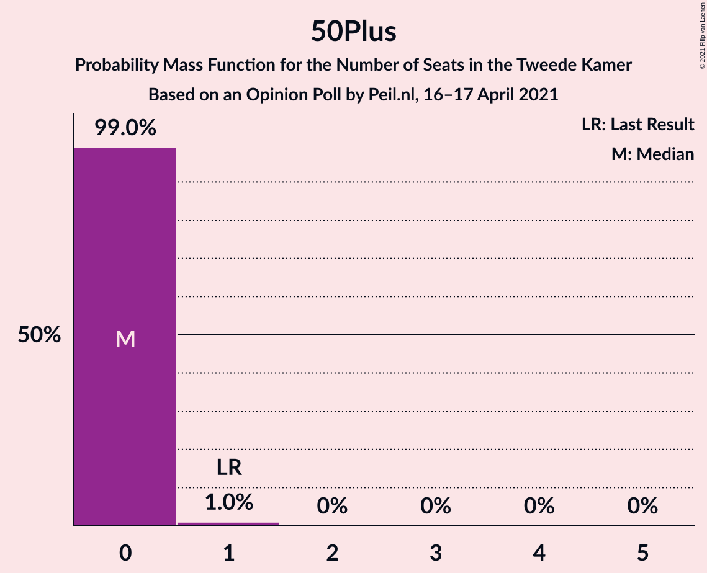
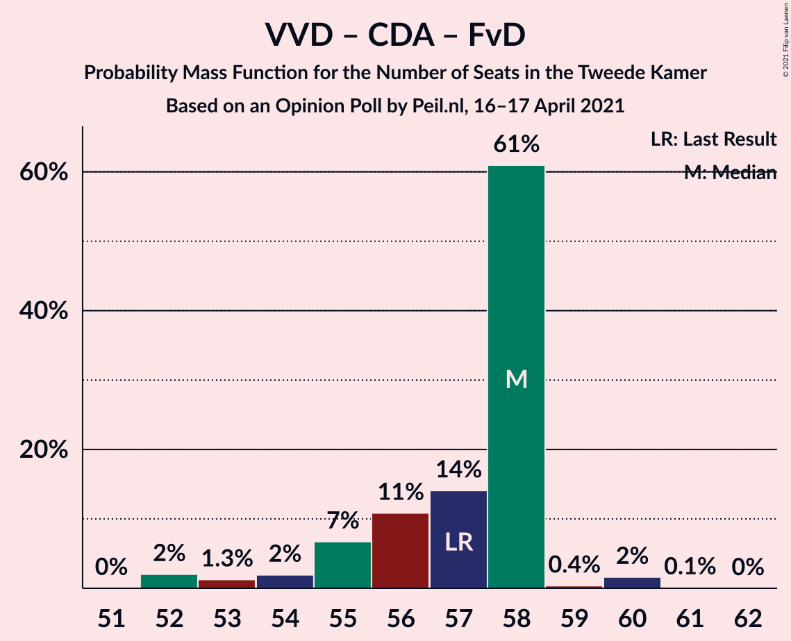

# Opinion Poll by Peil.nl, 16–17 April 2021

<a href="#voting-intentions">Voting Intentions</a> | <a href="#seats">Seats</a> | <a href="#coalitions">Coalitions</a> | <a href="#technical-information">Technical Information</a>

## Voting Intentions

### Confidence Intervals

| Party | Last Result | Poll Result | 80% Confidence Interval | 90% Confidence Interval | 95% Confidence Interval | 99% Confidence Interval |
|:-----:|:-----------:|:-----------:|:-----------------------:|:-----------------------:|:-----------------------:|:-----------------------:|
| Volkspartij voor Vrijheid en Democratie | 21.9% | 21.3% | 20.3–22.3% |20.1–22.5% |19.8–22.8% |19.4–23.3% |
| Democraten 66 | 15.0% | 15.9% | 15.1–16.8% |14.9–17.1% |14.7–17.3% |14.3–17.7% |
| Partij voor de Vrijheid | 10.8% | 11.3% | 10.6–12.1% |10.4–12.3% |10.2–12.5% |9.9–12.9% |
| Christen-Democratisch Appèl | 9.5% | 9.3% | 8.6–10.0% |8.5–10.2% |8.3–10.4% |8.0–10.7% |
| Socialistische Partij | 6.0% | 6.0% | 5.4–6.6% |5.3–6.7% |5.2–6.9% |4.9–7.2% |
| Partij van de Arbeid | 5.7% | 6.0% | 5.4–6.6% |5.3–6.7% |5.2–6.9% |4.9–7.2% |
| Forum voor Democratie | 5.0% | 6.0% | 5.4–6.6% |5.3–6.7% |5.2–6.9% |4.9–7.2% |
| GroenLinks | 5.2% | 4.7% | 4.2–5.2% |4.1–5.3% |4.0–5.5% |3.7–5.8% |
| Partij voor de Dieren | 3.8% | 4.0% | 3.6–4.5% |3.4–4.6% |3.4–4.8% |3.2–5.0% |
| ChristenUnie | 3.4% | 3.3% | 2.9–3.8% |2.8–3.9% |2.7–4.0% |2.6–4.3% |
| Juiste Antwoord 2021 | 2.4% | 3.3% | 2.9–3.8% |2.8–3.9% |2.7–4.0% |2.6–4.3% |
| Volt Europa | 2.4% | 2.7% | 2.3–3.1% |2.2–3.2% |2.1–3.3% |2.0–3.5% |
| Staatkundig Gereformeerde Partij | 2.1% | 2.0% | 1.7–2.4% |1.6–2.5% |1.6–2.6% |1.4–2.8% |
| DENK | 2.0% | 2.0% | 1.7–2.4% |1.6–2.5% |1.6–2.6% |1.4–2.8% |
| BoerBurgerBeweging | 1.0% | 1.3% | 1.1–1.6% |1.0–1.7% |1.0–1.8% |0.9–2.0% |
| Bij1 | 0.8% | 0.7% | 0.5–0.9% |0.5–1.0% |0.4–1.0% |0.4–1.2% |
| 50Plus | 1.0% | 0.2% | 0.1–0.3% |0.1–0.4% |0.1–0.4% |0.0–0.5% |

*Note:* The poll result column reflects the actual value used in the calculations. Published results may vary slightly, and in addition be rounded to fewer digits.

## Seats

### Confidence Intervals

| Party | Last Result | Median | 80% Confidence Interval | 90% Confidence Interval | 95% Confidence Interval | 99% Confidence Interval |
|:-----:|:-----------:|:------:|:-----------------------:|:-----------------------:|:-----------------------:|:-----------------------:|
| <a href="#volkspartij-voor-vrijheid-en-democratie">Volkspartij voor Vrijheid en Democratie</a> | 34 | 35 | 33–35 |32–36 |31–36 |30–36 |
| <a href="#democraten-66">Democraten 66</a> | 24 | 23 | 22–26 |22–26 |22–27 |21–28 |
| <a href="#partij-voor-de-vrijheid">Partij voor de Vrijheid</a> | 17 | 18 | 17–19 |17–20 |17–20 |16–20 |
| <a href="#christen-democratisch-appèl">Christen-Democratisch Appèl</a> | 15 | 13 | 12–14 |12–15 |12–16 |11–17 |
| <a href="#socialistische-partij">Socialistische Partij</a> | 9 | 9 | 9–10 |9–10 |8–10 |7–10 |
| <a href="#partij-van-de-arbeid">Partij van de Arbeid</a> | 9 | 10 | 9–10 |9–10 |8–10 |8–10 |
| <a href="#forum-voor-democratie">Forum voor Democratie</a> | 8 | 10 | 8–10 |8–10 |7–10 |7–11 |
| <a href="#groenlinks">GroenLinks</a> | 8 | 7 | 6–7 |6–8 |5–9 |5–9 |
| <a href="#partij-voor-de-dieren">Partij voor de Dieren</a> | 6 | 6 | 5–6 |5–7 |5–7 |4–8 |
| <a href="#christenunie">ChristenUnie</a> | 5 | 6 | 4–6 |4–6 |4–6 |4–6 |
| <a href="#juiste-antwoord-2021">Juiste Antwoord 2021</a> | 3 | 5 | 4–5 |3–5 |3–6 |3–6 |
| <a href="#volt-europa">Volt Europa</a> | 3 | 3 | 3–4 |3–5 |3–5 |2–5 |
| <a href="#staatkundig-gereformeerde-partij">Staatkundig Gereformeerde Partij</a> | 3 | 2 | 2–3 |1–3 |1–3 |1–4 |
| <a href="#denk">DENK</a> | 3 | 2 | 2–3 |2–3 |2–3 |2–4 |
| <a href="#boerburgerbeweging">BoerBurgerBeweging</a> | 1 | 1 | 1–2 |1–2 |1–2 |1–2 |
| <a href="#bij1">Bij1</a> | 1 | 0 | 0–1 |0–1 |0–1 |0–1 |
| <a href="#50plus">50Plus</a> | 1 | 0 | 0 |0 |0 |0–1 |

### Volkspartij voor Vrijheid en Democratie

*For a full overview of the results for this party, see the [Volkspartij voor Vrijheid en Democratie](party-volkspartijvoorvrijheidendemocratie.html) page.*

| Number of Seats | Probability | Accumulated | Special Marks |
|:---------------:|:-----------:|:-----------:|:-------------:|
| 30 | 0.7% | 100% |  |
| 31 | 2% | 99.2% |  |
| 32 | 4% | 97% |  |
| 33 | 8% | 94% |  |
| 34 | 16% | 86% | Last Result |
| 35 | 63% | 70% | Median |
| 36 | 7% | 7% |  |
| 37 | 0.3% | 0.3% |  |
| 38 | 0% | 0% |  |

### Democraten 66

*For a full overview of the results for this party, see the [Democraten 66](party-democraten66.html) page.*

| Number of Seats | Probability | Accumulated | Special Marks |
|:---------------:|:-----------:|:-----------:|:-------------:|
| 21 | 0.8% | 100% |  |
| 22 | 11% | 99.2% |  |
| 23 | 61% | 89% | Median |
| 24 | 7% | 28% | Last Result |
| 25 | 11% | 21% |  |
| 26 | 6% | 10% |  |
| 27 | 2% | 4% |  |
| 28 | 2% | 2% |  |
| 29 | 0.1% | 0.1% |  |
| 30 | 0% | 0% |  |

### Partij voor de Vrijheid

*For a full overview of the results for this party, see the [Partij voor de Vrijheid](party-partijvoordevrijheid.html) page.*

| Number of Seats | Probability | Accumulated | Special Marks |
|:---------------:|:-----------:|:-----------:|:-------------:|
| 15 | 0.3% | 100% |  |
| 16 | 2% | 99.7% |  |
| 17 | 14% | 98% | Last Result |
| 18 | 66% | 83% | Median |
| 19 | 11% | 18% |  |
| 20 | 7% | 7% |  |
| 21 | 0.1% | 0.1% |  |
| 22 | 0% | 0% |  |

### Christen-Democratisch Appèl

*For a full overview of the results for this party, see the [Christen-Democratisch Appèl](party-christen-democratischappèl.html) page.*

| Number of Seats | Probability | Accumulated | Special Marks |
|:---------------:|:-----------:|:-----------:|:-------------:|
| 11 | 0.8% | 100% |  |
| 12 | 13% | 99.2% |  |
| 13 | 66% | 86% | Median |
| 14 | 14% | 20% |  |
| 15 | 3% | 6% | Last Result |
| 16 | 2% | 3% |  |
| 17 | 0.9% | 1.0% |  |
| 18 | 0.1% | 0.1% |  |
| 19 | 0% | 0% |  |

### Socialistische Partij

*For a full overview of the results for this party, see the [Socialistische Partij](party-socialistischepartij.html) page.*

| Number of Seats | Probability | Accumulated | Special Marks |
|:---------------:|:-----------:|:-----------:|:-------------:|
| 7 | 0.9% | 100% |  |
| 8 | 4% | 99.0% |  |
| 9 | 72% | 95% | Last Result, Median |
| 10 | 24% | 24% |  |
| 11 | 0.1% | 0.1% |  |
| 12 | 0% | 0% |  |

### Partij van de Arbeid

*For a full overview of the results for this party, see the [Partij van de Arbeid](party-partijvandearbeid.html) page.*

| Number of Seats | Probability | Accumulated | Special Marks |
|:---------------:|:-----------:|:-----------:|:-------------:|
| 7 | 0.1% | 100% |  |
| 8 | 4% | 99.9% |  |
| 9 | 26% | 96% | Last Result |
| 10 | 69% | 70% | Median |
| 11 | 0.3% | 0.3% |  |
| 12 | 0% | 0% |  |

### Forum voor Democratie

*For a full overview of the results for this party, see the [Forum voor Democratie](party-forumvoordemocratie.html) page.*

| Number of Seats | Probability | Accumulated | Special Marks |
|:---------------:|:-----------:|:-----------:|:-------------:|
| 7 | 3% | 100% |  |
| 8 | 14% | 97% | Last Result |
| 9 | 13% | 83% |  |
| 10 | 70% | 71% | Median |
| 11 | 1.1% | 1.1% |  |
| 12 | 0% | 0% |  |

### GroenLinks

*For a full overview of the results for this party, see the [GroenLinks](party-groenlinks.html) page.*

| Number of Seats | Probability | Accumulated | Special Marks |
|:---------------:|:-----------:|:-----------:|:-------------:|
| 5 | 4% | 100% |  |
| 6 | 16% | 96% |  |
| 7 | 75% | 80% | Median |
| 8 | 2% | 5% | Last Result |
| 9 | 3% | 3% |  |
| 10 | 0% | 0% |  |

### Partij voor de Dieren

*For a full overview of the results for this party, see the [Partij voor de Dieren](party-partijvoordedieren.html) page.*

| Number of Seats | Probability | Accumulated | Special Marks |
|:---------------:|:-----------:|:-----------:|:-------------:|
| 4 | 0.7% | 100% |  |
| 5 | 17% | 99.3% |  |
| 6 | 72% | 82% | Last Result, Median |
| 7 | 9% | 10% |  |
| 8 | 0.6% | 0.6% |  |
| 9 | 0% | 0% |  |

### ChristenUnie

*For a full overview of the results for this party, see the [ChristenUnie](party-christenunie.html) page.*

| Number of Seats | Probability | Accumulated | Special Marks |
|:---------------:|:-----------:|:-----------:|:-------------:|
| 3 | 0.2% | 100% |  |
| 4 | 16% | 99.8% |  |
| 5 | 16% | 84% | Last Result |
| 6 | 67% | 67% | Median |
| 7 | 0% | 0% |  |

### Juiste Antwoord 2021

*For a full overview of the results for this party, see the [Juiste Antwoord 2021](party-juisteantwoord2021.html) page.*

| Number of Seats | Probability | Accumulated | Special Marks |
|:---------------:|:-----------:|:-----------:|:-------------:|
| 3 | 7% | 100% | Last Result |
| 4 | 10% | 93% |  |
| 5 | 80% | 84% | Median |
| 6 | 4% | 4% |  |
| 7 | 0% | 0% |  |

### Volt Europa

*For a full overview of the results for this party, see the [Volt Europa](party-volteuropa.html) page.*

| Number of Seats | Probability | Accumulated | Special Marks |
|:---------------:|:-----------:|:-----------:|:-------------:|
| 2 | 0.8% | 100% |  |
| 3 | 64% | 99.2% | Last Result, Median |
| 4 | 28% | 35% |  |
| 5 | 8% | 8% |  |
| 6 | 0% | 0% |  |

### Staatkundig Gereformeerde Partij

*For a full overview of the results for this party, see the [Staatkundig Gereformeerde Partij](party-staatkundiggereformeerdepartij.html) page.*

| Number of Seats | Probability | Accumulated | Special Marks |
|:---------------:|:-----------:|:-----------:|:-------------:|
| 1 | 6% | 100% |  |
| 2 | 80% | 94% | Median |
| 3 | 12% | 14% | Last Result |
| 4 | 2% | 2% |  |
| 5 | 0% | 0% |  |

### DENK

*For a full overview of the results for this party, see the [DENK](party-denk.html) page.*

| Number of Seats | Probability | Accumulated | Special Marks |
|:---------------:|:-----------:|:-----------:|:-------------:|
| 1 | 0.3% | 100% |  |
| 2 | 69% | 99.7% | Median |
| 3 | 29% | 31% | Last Result |
| 4 | 2% | 2% |  |
| 5 | 0% | 0% |  |

### BoerBurgerBeweging

*For a full overview of the results for this party, see the [BoerBurgerBeweging](party-boerburgerbeweging.html) page.*

| Number of Seats | Probability | Accumulated | Special Marks |
|:---------------:|:-----------:|:-----------:|:-------------:|
| 1 | 78% | 100% | Last Result, Median |
| 2 | 21% | 22% |  |
| 3 | 0.3% | 0.3% |  |
| 4 | 0% | 0% |  |

### Bij1

*For a full overview of the results for this party, see the [Bij1](party-bij1.html) page.*

| Number of Seats | Probability | Accumulated | Special Marks |
|:---------------:|:-----------:|:-----------:|:-------------:|
| 0 | 79% | 100% | Median |
| 1 | 21% | 21% | Last Result |
| 2 | 0% | 0% |  |

### 50Plus

*For a full overview of the results for this party, see the [50Plus](party-50plus.html) page.*

| Number of Seats | Probability | Accumulated | Special Marks |
|:---------------:|:-----------:|:-----------:|:-------------:|
| 0 | 99.0% | 100% | Median |
| 1 | 1.0% | 1.0% | Last Result |
| 2 | 0% | 0% |  |

## Coalitions

### Confidence Intervals

| Coalition | Last Result | Median | Majority? | 80% Confidence Interval | 90% Confidence Interval | 95% Confidence Interval | 99% Confidence Interval |
|:---------:|:-----------:|:------:|:---------:|:-----------------------:|:-----------------------:|:-----------------------:|:-----------------------:|
| Volkspartij voor Vrijheid en Democratie – Democraten 66 – Christen-Democratisch Appèl – Partij van de Arbeid – ChristenUnie | 87 | 87 | 100% | 84–87 | 83–87 | 83–87 | 82–89 |
| Volkspartij voor Vrijheid en Democratie – Democraten 66 – Christen-Democratisch Appèl – GroenLinks – ChristenUnie | 86 | 84 | 100% | 81–85 | 80–85 | 80–87 | 80–87 |
| Volkspartij voor Vrijheid en Democratie – Partij voor de Vrijheid – Christen-Democratisch Appèl – Forum voor Democratie – Staatkundig Gereformeerde Partij | 77 | 78 | 89% | 75–78 | 74–79 | 73–79 | 71–81 |
| Volkspartij voor Vrijheid en Democratie – Democraten 66 – Christen-Democratisch Appèl – ChristenUnie | 78 | 77 | 88% | 75–78 | 74–78 | 74–78 | 73–81 |
| Volkspartij voor Vrijheid en Democratie – Partij voor de Vrijheid – Christen-Democratisch Appèl – Forum voor Democratie | 74 | 76 | 68% | 72–76 | 72–77 | 70–77 | 69–79 |
| Volkspartij voor Vrijheid en Democratie – Democraten 66 – Christen-Democratisch Appèl | 73 | 71 | 1.2% | 70–73 | 70–73 | 69–73 | 68–77 |
| Democraten 66 – Christen-Democratisch Appèl – Partij van de Arbeid – Socialistische Partij – GroenLinks – ChristenUnie | 70 | 68 | 0% | 66–70 | 63–70 | 63–71 | 63–73 |
| Volkspartij voor Vrijheid en Democratie – Democraten 66 – Partij van de Arbeid | 67 | 68 | 0% | 67–68 | 66–69 | 65–69 | 64–70 |
| Volkspartij voor Vrijheid en Democratie – Partij voor de Vrijheid – Christen-Democratisch Appèl | 66 | 66 | 0% | 64–67 | 62–68 | 61–69 | 61–69 |
| Volkspartij voor Vrijheid en Democratie – Christen-Democratisch Appèl – Forum voor Democratie – Staatkundig Gereformeerde Partij – 50Plus | 61 | 60 | 0% | 57–60 | 57–61 | 57–61 | 54–62 |
| Volkspartij voor Vrijheid en Democratie – Christen-Democratisch Appèl – Forum voor Democratie – Staatkundig Gereformeerde Partij | 60 | 60 | 0% | 57–60 | 57–61 | 57–61 | 54–62 |
| Democraten 66 – Christen-Democratisch Appèl – Partij van de Arbeid – GroenLinks – ChristenUnie | 61 | 59 | 0% | 57–60 | 53–61 | 53–61 | 53–63 |
| Volkspartij voor Vrijheid en Democratie – Christen-Democratisch Appèl – Forum voor Democratie – 50Plus | 58 | 58 | 0% | 55–58 | 54–58 | 53–58 | 52–60 |
| Volkspartij voor Vrijheid en Democratie – Christen-Democratisch Appèl – Forum voor Democratie | 57 | 58 | 0% | 55–58 | 54–58 | 53–58 | 52–60 |
| Volkspartij voor Vrijheid en Democratie – Christen-Democratisch Appèl – Partij van de Arbeid | 58 | 58 | 0% | 55–58 | 54–58 | 53–58 | 53–60 |
| Volkspartij voor Vrijheid en Democratie – Christen-Democratisch Appèl | 49 | 48 | 0% | 46–48 | 45–49 | 44–50 | 43–50 |
| Democraten 66 – Christen-Democratisch Appèl – Partij van de Arbeid | 48 | 46 | 0% | 45–48 | 43–49 | 43–49 | 43–50 |
| Volkspartij voor Vrijheid en Democratie – Partij van de Arbeid | 43 | 45 | 0% | 42–45 | 41–45 | 40–45 | 40–45 |
| Democraten 66 – Christen-Democratisch Appèl | 39 | 36 | 0% | 36–39 | 34–40 | 34–40 | 34–42 |
| Christen-Democratisch Appèl – Partij van de Arbeid – ChristenUnie | 29 | 29 | 0% | 26–29 | 25–29 | 25–30 | 25–30 |
| Christen-Democratisch Appèl – Partij van de Arbeid | 24 | 23 | 0% | 21–23 | 21–24 | 21–26 | 21–26 |

### Volkspartij voor Vrijheid en Democratie – Democraten 66 – Christen-Democratisch Appèl – Partij van de Arbeid – ChristenUnie

| Number of Seats | Probability | Accumulated | Special Marks |
|:---------------:|:-----------:|:-----------:|:-------------:|
| 80 | 0.1% | 100% |  |
| 81 | 0.1% | 99.9% |  |
| 82 | 0.5% | 99.9% |  |
| 83 | 7% | 99.4% |  |
| 84 | 4% | 92% |  |
| 85 | 7% | 89% |  |
| 86 | 9% | 82% |  |
| 87 | 71% | 73% | Last Result, Median |
| 88 | 0.5% | 2% |  |
| 89 | 1.2% | 1.3% |  |
| 90 | 0% | 0% |  |

### Volkspartij voor Vrijheid en Democratie – Democraten 66 – Christen-Democratisch Appèl – GroenLinks – ChristenUnie

| Number of Seats | Probability | Accumulated | Special Marks |
|:---------------:|:-----------:|:-----------:|:-------------:|
| 78 | 0.3% | 100% |  |
| 79 | 0% | 99.7% |  |
| 80 | 7% | 99.6% |  |
| 81 | 5% | 93% |  |
| 82 | 3% | 88% |  |
| 83 | 12% | 85% |  |
| 84 | 61% | 73% | Median |
| 85 | 9% | 13% |  |
| 86 | 0.5% | 3% | Last Result |
| 87 | 3% | 3% |  |
| 88 | 0% | 0% |  |

### Volkspartij voor Vrijheid en Democratie – Partij voor de Vrijheid – Christen-Democratisch Appèl – Forum voor Democratie – Staatkundig Gereformeerde Partij

| Number of Seats | Probability | Accumulated | Special Marks |
|:---------------:|:-----------:|:-----------:|:-------------:|
| 71 | 2% | 100% |  |
| 72 | 0.2% | 98% |  |
| 73 | 0.6% | 98% |  |
| 74 | 5% | 97% |  |
| 75 | 3% | 92% |  |
| 76 | 12% | 89% | Majority |
| 77 | 6% | 77% | Last Result |
| 78 | 63% | 72% | Median |
| 79 | 7% | 9% |  |
| 80 | 0% | 2% |  |
| 81 | 2% | 2% |  |
| 82 | 0.1% | 0.1% |  |
| 83 | 0% | 0% |  |

### Volkspartij voor Vrijheid en Democratie – Democraten 66 – Christen-Democratisch Appèl – ChristenUnie

| Number of Seats | Probability | Accumulated | Special Marks |
|:---------------:|:-----------:|:-----------:|:-------------:|
| 72 | 0.4% | 100% |  |
| 73 | 0.2% | 99.6% |  |
| 74 | 7% | 99.4% |  |
| 75 | 5% | 92% |  |
| 76 | 9% | 88% | Majority |
| 77 | 67% | 79% | Median |
| 78 | 10% | 11% | Last Result |
| 79 | 0.4% | 2% |  |
| 80 | 0.1% | 1.3% |  |
| 81 | 1.1% | 1.2% |  |
| 82 | 0% | 0% |  |

### Volkspartij voor Vrijheid en Democratie – Partij voor de Vrijheid – Christen-Democratisch Appèl – Forum voor Democratie

| Number of Seats | Probability | Accumulated | Special Marks |
|:---------------:|:-----------:|:-----------:|:-------------:|
| 69 | 2% | 100% |  |
| 70 | 0.7% | 98% |  |
| 71 | 2% | 97% |  |
| 72 | 6% | 95% |  |
| 73 | 5% | 89% |  |
| 74 | 2% | 84% | Last Result |
| 75 | 15% | 83% |  |
| 76 | 60% | 68% | Median, Majority |
| 77 | 7% | 9% |  |
| 78 | 0% | 2% |  |
| 79 | 2% | 2% |  |
| 80 | 0% | 0% |  |

### Volkspartij voor Vrijheid en Democratie – Democraten 66 – Christen-Democratisch Appèl

| Number of Seats | Probability | Accumulated | Special Marks |
|:---------------:|:-----------:|:-----------:|:-------------:|
| 66 | 0.1% | 100% |  |
| 67 | 0.3% | 99.9% |  |
| 68 | 0.2% | 99.6% |  |
| 69 | 2% | 99.4% |  |
| 70 | 8% | 97% |  |
| 71 | 71% | 89% | Median |
| 72 | 5% | 19% |  |
| 73 | 12% | 13% | Last Result |
| 74 | 0.2% | 1.4% |  |
| 75 | 0% | 1.3% |  |
| 76 | 0.1% | 1.2% | Majority |
| 77 | 1.1% | 1.1% |  |
| 78 | 0% | 0% |  |

### Democraten 66 – Christen-Democratisch Appèl – Partij van de Arbeid – Socialistische Partij – GroenLinks – ChristenUnie

| Number of Seats | Probability | Accumulated | Special Marks |
|:---------------:|:-----------:|:-----------:|:-------------:|
| 63 | 7% | 100% |  |
| 64 | 0.8% | 93% |  |
| 65 | 0.4% | 92% |  |
| 66 | 5% | 92% |  |
| 67 | 4% | 87% |  |
| 68 | 61% | 83% | Median |
| 69 | 9% | 21% |  |
| 70 | 9% | 13% | Last Result |
| 71 | 2% | 4% |  |
| 72 | 0.9% | 2% |  |
| 73 | 0.9% | 0.9% |  |
| 74 | 0% | 0% |  |

### Volkspartij voor Vrijheid en Democratie – Democraten 66 – Partij van de Arbeid

| Number of Seats | Probability | Accumulated | Special Marks |
|:---------------:|:-----------:|:-----------:|:-------------:|
| 61 | 0.1% | 100% |  |
| 62 | 0% | 99.9% |  |
| 63 | 0.3% | 99.9% |  |
| 64 | 2% | 99.6% |  |
| 65 | 2% | 98% |  |
| 66 | 6% | 96% |  |
| 67 | 13% | 90% | Last Result |
| 68 | 69% | 78% | Median |
| 69 | 7% | 9% |  |
| 70 | 2% | 2% |  |
| 71 | 0.1% | 0.1% |  |
| 72 | 0% | 0% |  |

### Volkspartij voor Vrijheid en Democratie – Partij voor de Vrijheid – Christen-Democratisch Appèl

| Number of Seats | Probability | Accumulated | Special Marks |
|:---------------:|:-----------:|:-----------:|:-------------:|
| 59 | 0.4% | 100% |  |
| 60 | 0% | 99.6% |  |
| 61 | 2% | 99.5% |  |
| 62 | 6% | 97% |  |
| 63 | 1.0% | 92% |  |
| 64 | 3% | 91% |  |
| 65 | 8% | 88% |  |
| 66 | 63% | 79% | Last Result, Median |
| 67 | 7% | 17% |  |
| 68 | 7% | 10% |  |
| 69 | 3% | 3% |  |
| 70 | 0.1% | 0.1% |  |
| 71 | 0% | 0% |  |

### Volkspartij voor Vrijheid en Democratie – Christen-Democratisch Appèl – Forum voor Democratie – Staatkundig Gereformeerde Partij – 50Plus

| Number of Seats | Probability | Accumulated | Special Marks |
|:---------------:|:-----------:|:-----------:|:-------------:|
| 54 | 2% | 100% |  |
| 55 | 0.1% | 98% |  |
| 56 | 0.1% | 98% |  |
| 57 | 14% | 98% |  |
| 58 | 2% | 84% |  |
| 59 | 17% | 82% |  |
| 60 | 60% | 65% | Median |
| 61 | 3% | 5% | Last Result |
| 62 | 2% | 2% |  |
| 63 | 0.1% | 0.3% |  |
| 64 | 0.1% | 0.1% |  |
| 65 | 0% | 0% |  |

### Volkspartij voor Vrijheid en Democratie – Christen-Democratisch Appèl – Forum voor Democratie – Staatkundig Gereformeerde Partij

| Number of Seats | Probability | Accumulated | Special Marks |
|:---------------:|:-----------:|:-----------:|:-------------:|
| 54 | 2% | 100% |  |
| 55 | 0.1% | 98% |  |
| 56 | 0.1% | 98% |  |
| 57 | 14% | 98% |  |
| 58 | 2% | 84% |  |
| 59 | 18% | 82% |  |
| 60 | 59% | 64% | Last Result, Median |
| 61 | 3% | 5% |  |
| 62 | 2% | 2% |  |
| 63 | 0.1% | 0.3% |  |
| 64 | 0.1% | 0.1% |  |
| 65 | 0% | 0% |  |

### Democraten 66 – Christen-Democratisch Appèl – Partij van de Arbeid – GroenLinks – ChristenUnie

| Number of Seats | Probability | Accumulated | Special Marks |
|:---------------:|:-----------:|:-----------:|:-------------:|
| 53 | 7% | 100% |  |
| 54 | 0% | 93% |  |
| 55 | 0.4% | 93% |  |
| 56 | 0.4% | 93% |  |
| 57 | 9% | 92% |  |
| 58 | 1.0% | 84% |  |
| 59 | 61% | 83% | Median |
| 60 | 15% | 21% |  |
| 61 | 4% | 6% | Last Result |
| 62 | 0.7% | 2% |  |
| 63 | 1.4% | 2% |  |
| 64 | 0.1% | 0.1% |  |
| 65 | 0% | 0% |  |

### Volkspartij voor Vrijheid en Democratie – Christen-Democratisch Appèl – Forum voor Democratie – 50Plus

| Number of Seats | Probability | Accumulated | Special Marks |
|:---------------:|:-----------:|:-----------:|:-------------:|
| 51 | 0% | 100% |  |
| 52 | 2% | 99.9% |  |
| 53 | 1.3% | 98% |  |
| 54 | 2% | 97% |  |
| 55 | 7% | 95% |  |
| 56 | 11% | 88% |  |
| 57 | 13% | 77% |  |
| 58 | 62% | 64% | Last Result, Median |
| 59 | 0.4% | 2% |  |
| 60 | 2% | 2% |  |
| 61 | 0.1% | 0.1% |  |
| 62 | 0% | 0% |  |

### Volkspartij voor Vrijheid en Democratie – Christen-Democratisch Appèl – Forum voor Democratie

| Number of Seats | Probability | Accumulated | Special Marks |
|:---------------:|:-----------:|:-----------:|:-------------:|
| 51 | 0% | 100% |  |
| 52 | 2% | 99.9% |  |
| 53 | 1.3% | 98% |  |
| 54 | 2% | 97% |  |
| 55 | 7% | 95% |  |
| 56 | 11% | 88% |  |
| 57 | 14% | 77% | Last Result |
| 58 | 61% | 63% | Median |
| 59 | 0.4% | 2% |  |
| 60 | 2% | 2% |  |
| 61 | 0.1% | 0.1% |  |
| 62 | 0% | 0% |  |

### Volkspartij voor Vrijheid en Democratie – Christen-Democratisch Appèl – Partij van de Arbeid

| Number of Seats | Probability | Accumulated | Special Marks |
|:---------------:|:-----------:|:-----------:|:-------------:|
| 51 | 0% | 100% |  |
| 52 | 0.2% | 99.9% |  |
| 53 | 3% | 99.8% |  |
| 54 | 2% | 97% |  |
| 55 | 6% | 95% |  |
| 56 | 3% | 89% |  |
| 57 | 22% | 86% |  |
| 58 | 62% | 64% | Last Result, Median |
| 59 | 0.2% | 2% |  |
| 60 | 2% | 2% |  |
| 61 | 0% | 0% |  |

### Volkspartij voor Vrijheid en Democratie – Christen-Democratisch Appèl

| Number of Seats | Probability | Accumulated | Special Marks |
|:---------------:|:-----------:|:-----------:|:-------------:|
| 43 | 0.7% | 100% |  |
| 44 | 2% | 99.3% |  |
| 45 | 6% | 97% |  |
| 46 | 2% | 91% |  |
| 47 | 6% | 89% |  |
| 48 | 77% | 83% | Median |
| 49 | 3% | 6% | Last Result |
| 50 | 3% | 3% |  |
| 51 | 0.2% | 0.2% |  |
| 52 | 0.1% | 0.1% |  |
| 53 | 0% | 0% |  |

### Democraten 66 – Christen-Democratisch Appèl – Partij van de Arbeid

| Number of Seats | Probability | Accumulated | Special Marks |
|:---------------:|:-----------:|:-----------:|:-------------:|
| 42 | 0.2% | 100% |  |
| 43 | 7% | 99.8% |  |
| 44 | 1.4% | 93% |  |
| 45 | 3% | 91% |  |
| 46 | 60% | 88% | Median |
| 47 | 7% | 29% |  |
| 48 | 13% | 22% | Last Result |
| 49 | 6% | 9% |  |
| 50 | 2% | 2% |  |
| 51 | 0.3% | 0.4% |  |
| 52 | 0% | 0.1% |  |
| 53 | 0% | 0% |  |

### Volkspartij voor Vrijheid en Democratie – Partij van de Arbeid

| Number of Seats | Probability | Accumulated | Special Marks |
|:---------------:|:-----------:|:-----------:|:-------------:|
| 38 | 0.1% | 100% |  |
| 39 | 0.4% | 99.9% |  |
| 40 | 2% | 99.6% |  |
| 41 | 4% | 97% |  |
| 42 | 6% | 94% |  |
| 43 | 14% | 88% | Last Result |
| 44 | 8% | 74% |  |
| 45 | 66% | 66% | Median |
| 46 | 0.3% | 0.3% |  |
| 47 | 0% | 0% |  |

### Democraten 66 – Christen-Democratisch Appèl

| Number of Seats | Probability | Accumulated | Special Marks |
|:---------------:|:-----------:|:-----------:|:-------------:|
| 33 | 0.2% | 100% |  |
| 34 | 7% | 99.8% |  |
| 35 | 1.4% | 93% |  |
| 36 | 62% | 91% | Median |
| 37 | 5% | 30% |  |
| 38 | 5% | 25% |  |
| 39 | 13% | 20% | Last Result |
| 40 | 4% | 6% |  |
| 41 | 1.2% | 2% |  |
| 42 | 1.1% | 1.2% |  |
| 43 | 0.1% | 0.1% |  |
| 44 | 0% | 0% |  |

### Christen-Democratisch Appèl – Partij van de Arbeid – ChristenUnie

| Number of Seats | Probability | Accumulated | Special Marks |
|:---------------:|:-----------:|:-----------:|:-------------:|
| 25 | 10% | 100% |  |
| 26 | 2% | 90% |  |
| 27 | 4% | 88% |  |
| 28 | 17% | 84% |  |
| 29 | 63% | 66% | Last Result, Median |
| 30 | 3% | 3% |  |
| 31 | 0.1% | 0.2% |  |
| 32 | 0.1% | 0.1% |  |
| 33 | 0.1% | 0.1% |  |
| 34 | 0% | 0% |  |

### Christen-Democratisch Appèl – Partij van de Arbeid

| Number of Seats | Probability | Accumulated | Special Marks |
|:---------------:|:-----------:|:-----------:|:-------------:|
| 20 | 0.3% | 100% |  |
| 21 | 10% | 99.7% |  |
| 22 | 9% | 89% |  |
| 23 | 74% | 80% | Median |
| 24 | 3% | 6% | Last Result |
| 25 | 0.5% | 3% |  |
| 26 | 3% | 3% |  |
| 27 | 0% | 0.1% |  |
| 28 | 0% | 0% |  |

## Technical Information

### Opinion Poll

+ **Polling firm:** Peil.nl
+ **Commissioner(s):** —
+ **Fieldwork period:** 16–17 April 2021

### Calculations

+ **Sample size:** 3000
+ **Simulations done:** 1,048,576
+ **Error estimate:** 1.01%

