# Opinion Poll by Ipsos, 16–19 April 2021

<a href="#voting-intentions">Voting Intentions</a> | <a href="#seats">Seats</a> | <a href="#coalitions">Coalitions</a> | <a href="#technical-information">Technical Information</a>

## Voting Intentions

### Confidence Intervals

| Party | Last Result | Poll Result | 80% Confidence Interval | 90% Confidence Interval | 95% Confidence Interval | 99% Confidence Interval |
|:-----:|:-----------:|:-----------:|:-----------------------:|:-----------------------:|:-----------------------:|:-----------------------:|
| Volkspartij voor Vrijheid en Democratie | 21.9% | 22.5% | 20.9–24.2% |20.4–24.7% |20.0–25.2% |19.3–26.0% |
| Democraten 66 | 15.0% | 16.7% | 15.2–18.3% |14.8–18.7% |14.5–19.1% |13.8–19.9% |
| Partij voor de Vrijheid | 10.8% | 11.7% | 10.5–13.1% |10.2–13.5% |9.9–13.9% |9.3–14.6% |
| Christen-Democratisch Appèl | 9.5% | 7.7% | 6.7–8.9% |6.4–9.2% |6.2–9.5% |5.8–10.1% |
| Partij van de Arbeid | 5.7% | 6.3% | 5.4–7.4% |5.2–7.7% |5.0–8.0% |4.6–8.5% |
| Partij voor de Dieren | 3.8% | 5.2% | 4.4–6.2% |4.2–6.5% |4.0–6.8% |3.7–7.3% |
| GroenLinks | 5.2% | 4.7% | 4.0–5.7% |3.8–6.0% |3.6–6.2% |3.2–6.7% |
| Socialistische Partij | 6.0% | 4.5% | 3.8–5.5% |3.6–5.8% |3.4–6.0% |3.1–6.5% |
| Forum voor Democratie | 5.0% | 4.5% | 3.8–5.5% |3.6–5.8% |3.4–6.0% |3.1–6.5% |
| Volt Europa | 2.4% | 3.4% | 2.7–4.2% |2.5–4.4% |2.4–4.7% |2.1–5.1% |
| ChristenUnie | 3.4% | 3.2% | 2.5–4.0% |2.4–4.2% |2.2–4.4% |2.0–4.9% |
| Juiste Antwoord 2021 | 2.4% | 2.9% | 2.3–3.7% |2.1–3.9% |2.0–4.1% |1.8–4.5% |
| Staatkundig Gereformeerde Partij | 2.1% | 2.2% | 1.7–2.9% |1.5–3.1% |1.4–3.3% |1.2–3.6% |
| DENK | 2.0% | 1.5% | 1.1–2.1% |1.0–2.3% |0.9–2.4% |0.7–2.8% |
| 50Plus | 1.0% | 0.8% | 0.5–1.3% |0.5–1.4% |0.4–1.6% |0.3–1.8% |
| BoerBurgerBeweging | 1.0% | 0.8% | 0.5–1.3% |0.5–1.4% |0.4–1.6% |0.3–1.8% |
| Bij1 | 0.8% | 0.7% | 0.5–1.2% |0.4–1.3% |0.3–1.4% |0.2–1.7% |

*Note:* The poll result column reflects the actual value used in the calculations. Published results may vary slightly, and in addition be rounded to fewer digits.

## Seats

### Confidence Intervals

| Party | Last Result | Median | 80% Confidence Interval | 90% Confidence Interval | 95% Confidence Interval | 99% Confidence Interval |
|:-----:|:-----------:|:------:|:-----------------------:|:-----------------------:|:-----------------------:|:-----------------------:|
| <a href="#volkspartij-voor-vrijheid-en-democratie">Volkspartij voor Vrijheid en Democratie</a> | 34 | 35 | 30–36 |30–38 |30–38 |29–38 |
| <a href="#democraten-66">Democraten 66</a> | 24 | 24 | 24–27 |24–29 |24–30 |23–32 |
| <a href="#partij-voor-de-vrijheid">Partij voor de Vrijheid</a> | 17 | 17 | 16–19 |14–19 |14–20 |13–22 |
| <a href="#christen-democratisch-appèl">Christen-Democratisch Appèl</a> | 15 | 9 | 9–14 |9–14 |8–17 |7–17 |
| <a href="#partij-van-de-arbeid">Partij van de Arbeid</a> | 9 | 9 | 8–11 |8–11 |8–12 |8–13 |
| <a href="#partij-voor-de-dieren">Partij voor de Dieren</a> | 6 | 9 | 7–10 |7–10 |6–10 |5–10 |
| <a href="#groenlinks">GroenLinks</a> | 8 | 7 | 6–9 |5–10 |5–10 |5–10 |
| <a href="#socialistische-partij">Socialistische Partij</a> | 9 | 6 | 6–9 |5–9 |5–9 |5–9 |
| <a href="#forum-voor-democratie">Forum voor Democratie</a> | 8 | 6 | 6–7 |5–7 |5–9 |5–9 |
| <a href="#volt-europa">Volt Europa</a> | 3 | 6 | 5–7 |4–7 |3–7 |3–7 |
| <a href="#christenunie">ChristenUnie</a> | 5 | 5 | 4–5 |4–6 |3–6 |3–8 |
| <a href="#juiste-antwoord-2021">Juiste Antwoord 2021</a> | 3 | 4 | 3–4 |3–5 |3–5 |3–5 |
| <a href="#staatkundig-gereformeerde-partij">Staatkundig Gereformeerde Partij</a> | 3 | 4 | 2–4 |2–4 |2–4 |2–5 |
| <a href="#denk">DENK</a> | 3 | 3 | 1–4 |1–4 |1–4 |1–4 |
| <a href="#50plus">50Plus</a> | 1 | 1 | 0–2 |0–2 |0–2 |0–2 |
| <a href="#boerburgerbeweging">BoerBurgerBeweging</a> | 1 | 1 | 1–2 |0–2 |0–2 |0–2 |
| <a href="#bij1">Bij1</a> | 1 | 1 | 0–1 |0–1 |0–2 |0–2 |

### Volkspartij voor Vrijheid en Democratie

*For a full overview of the results for this party, see the [Volkspartij voor Vrijheid en Democratie](party-volkspartijvoorvrijheidendemocratie.html) page.*

| Number of Seats | Probability | Accumulated | Special Marks |
|:---------------:|:-----------:|:-----------:|:-------------:|
| 28 | 0.3% | 100% |  |
| 29 | 0.2% | 99.7% |  |
| 30 | 21% | 99.5% |  |
| 31 | 4% | 78% |  |
| 32 | 3% | 74% |  |
| 33 | 0.1% | 72% |  |
| 34 | 1.0% | 72% | Last Result |
| 35 | 60% | 71% | Median |
| 36 | 2% | 11% |  |
| 37 | 0.9% | 9% |  |
| 38 | 7% | 8% |  |
| 39 | 0.3% | 0.4% |  |
| 40 | 0% | 0.1% |  |
| 41 | 0% | 0.1% |  |
| 42 | 0.1% | 0.1% |  |
| 43 | 0% | 0% |  |

### Democraten 66

*For a full overview of the results for this party, see the [Democraten 66](party-democraten66.html) page.*

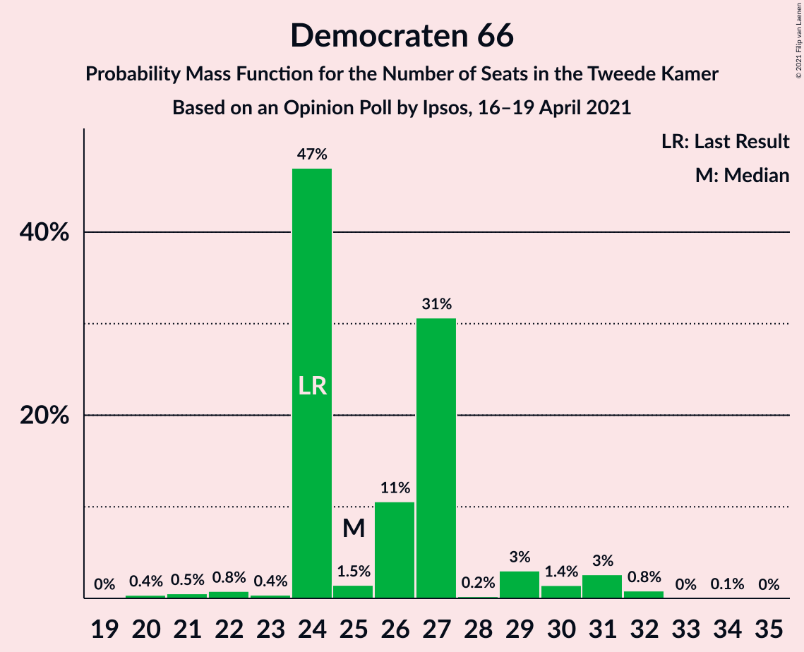

| Number of Seats | Probability | Accumulated | Special Marks |
|:---------------:|:-----------:|:-----------:|:-------------:|
| 22 | 0.3% | 100% |  |
| 23 | 0.2% | 99.6% |  |
| 24 | 67% | 99.4% | Last Result, Median |
| 25 | 1.5% | 32% |  |
| 26 | 15% | 31% |  |
| 27 | 8% | 15% |  |
| 28 | 0.1% | 8% |  |
| 29 | 4% | 8% |  |
| 30 | 2% | 3% |  |
| 31 | 0% | 1.3% |  |
| 32 | 1.2% | 1.3% |  |
| 33 | 0% | 0% |  |

### Partij voor de Vrijheid

*For a full overview of the results for this party, see the [Partij voor de Vrijheid](party-partijvoordevrijheid.html) page.*

| Number of Seats | Probability | Accumulated | Special Marks |
|:---------------:|:-----------:|:-----------:|:-------------:|
| 13 | 0.8% | 100% |  |
| 14 | 8% | 99.2% |  |
| 15 | 0.4% | 91% |  |
| 16 | 10% | 91% |  |
| 17 | 46% | 81% | Last Result, Median |
| 18 | 8% | 34% |  |
| 19 | 24% | 27% |  |
| 20 | 0.4% | 3% |  |
| 21 | 0.3% | 2% |  |
| 22 | 2% | 2% |  |
| 23 | 0.1% | 0.1% |  |
| 24 | 0% | 0% |  |

### Christen-Democratisch Appèl

*For a full overview of the results for this party, see the [Christen-Democratisch Appèl](party-christen-democratischappèl.html) page.*

| Number of Seats | Probability | Accumulated | Special Marks |
|:---------------:|:-----------:|:-----------:|:-------------:|
| 7 | 1.1% | 100% |  |
| 8 | 2% | 98.9% |  |
| 9 | 48% | 97% | Median |
| 10 | 5% | 49% |  |
| 11 | 2% | 45% |  |
| 12 | 4% | 42% |  |
| 13 | 12% | 38% |  |
| 14 | 22% | 26% |  |
| 15 | 2% | 5% | Last Result |
| 16 | 0.1% | 3% |  |
| 17 | 3% | 3% |  |
| 18 | 0% | 0% |  |

### Partij van de Arbeid

*For a full overview of the results for this party, see the [Partij van de Arbeid](party-partijvandearbeid.html) page.*

| Number of Seats | Probability | Accumulated | Special Marks |
|:---------------:|:-----------:|:-----------:|:-------------:|
| 7 | 0% | 100% |  |
| 8 | 30% | 99.9% |  |
| 9 | 53% | 70% | Last Result, Median |
| 10 | 6% | 17% |  |
| 11 | 7% | 11% |  |
| 12 | 2% | 3% |  |
| 13 | 1.4% | 1.4% |  |
| 14 | 0% | 0% |  |

### Partij voor de Dieren

*For a full overview of the results for this party, see the [Partij voor de Dieren](party-partijvoordedieren.html) page.*

| Number of Seats | Probability | Accumulated | Special Marks |
|:---------------:|:-----------:|:-----------:|:-------------:|
| 5 | 2% | 100% |  |
| 6 | 1.1% | 98% | Last Result |
| 7 | 29% | 97% |  |
| 8 | 12% | 68% |  |
| 9 | 11% | 56% | Median |
| 10 | 44% | 45% |  |
| 11 | 0.2% | 0.4% |  |
| 12 | 0.2% | 0.2% |  |
| 13 | 0% | 0% |  |

### GroenLinks

*For a full overview of the results for this party, see the [GroenLinks](party-groenlinks.html) page.*

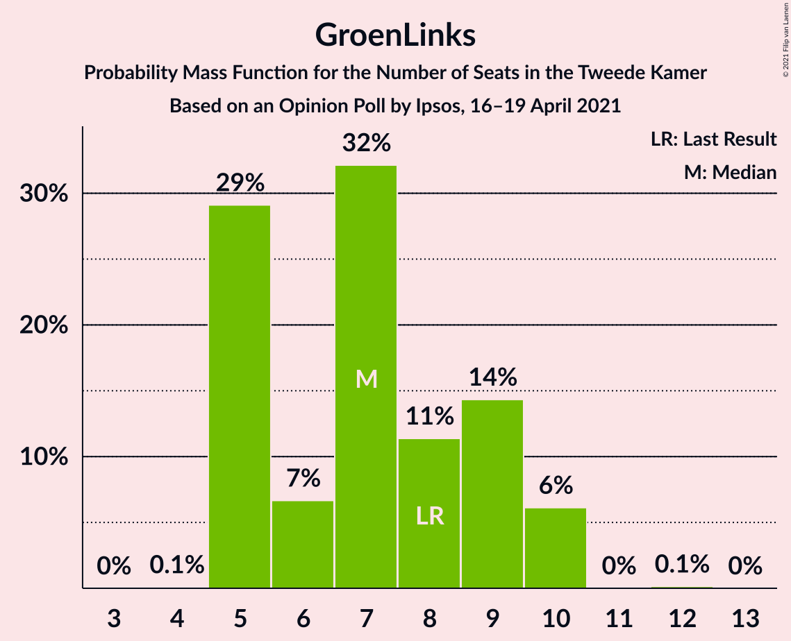

| Number of Seats | Probability | Accumulated | Special Marks |
|:---------------:|:-----------:|:-----------:|:-------------:|
| 4 | 0.1% | 100% |  |
| 5 | 5% | 99.9% |  |
| 6 | 8% | 95% |  |
| 7 | 47% | 87% | Median |
| 8 | 9% | 40% | Last Result |
| 9 | 21% | 31% |  |
| 10 | 9% | 9% |  |
| 11 | 0% | 0.1% |  |
| 12 | 0.1% | 0.1% |  |
| 13 | 0% | 0% |  |

### Socialistische Partij

*For a full overview of the results for this party, see the [Socialistische Partij](party-socialistischepartij.html) page.*

| Number of Seats | Probability | Accumulated | Special Marks |
|:---------------:|:-----------:|:-----------:|:-------------:|
| 4 | 0.2% | 100% |  |
| 5 | 9% | 99.8% |  |
| 6 | 58% | 91% | Median |
| 7 | 3% | 33% |  |
| 8 | 7% | 30% |  |
| 9 | 23% | 23% | Last Result |
| 10 | 0.1% | 0.1% |  |
| 11 | 0% | 0% |  |

### Forum voor Democratie

*For a full overview of the results for this party, see the [Forum voor Democratie](party-forumvoordemocratie.html) page.*

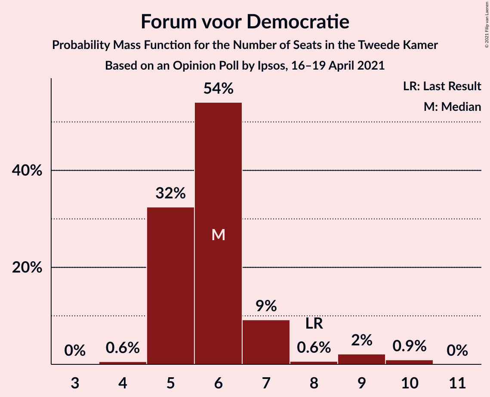

| Number of Seats | Probability | Accumulated | Special Marks |
|:---------------:|:-----------:|:-----------:|:-------------:|
| 4 | 0.4% | 100% |  |
| 5 | 6% | 99.6% |  |
| 6 | 80% | 93% | Median |
| 7 | 11% | 13% |  |
| 8 | 0.4% | 3% | Last Result |
| 9 | 2% | 3% |  |
| 10 | 0% | 0% |  |

### Volt Europa

*For a full overview of the results for this party, see the [Volt Europa](party-volteuropa.html) page.*

| Number of Seats | Probability | Accumulated | Special Marks |
|:---------------:|:-----------:|:-----------:|:-------------:|
| 3 | 3% | 100% | Last Result |
| 4 | 4% | 97% |  |
| 5 | 17% | 93% |  |
| 6 | 53% | 76% | Median |
| 7 | 23% | 23% |  |
| 8 | 0.2% | 0.2% |  |
| 9 | 0% | 0% |  |

### ChristenUnie

*For a full overview of the results for this party, see the [ChristenUnie](party-christenunie.html) page.*

| Number of Seats | Probability | Accumulated | Special Marks |
|:---------------:|:-----------:|:-----------:|:-------------:|
| 3 | 4% | 100% |  |
| 4 | 26% | 96% |  |
| 5 | 62% | 70% | Last Result, Median |
| 6 | 6% | 8% |  |
| 7 | 0.9% | 2% |  |
| 8 | 1.3% | 1.3% |  |
| 9 | 0% | 0% |  |

### Juiste Antwoord 2021

*For a full overview of the results for this party, see the [Juiste Antwoord 2021](party-juisteantwoord2021.html) page.*

| Number of Seats | Probability | Accumulated | Special Marks |
|:---------------:|:-----------:|:-----------:|:-------------:|
| 2 | 0.4% | 100% |  |
| 3 | 11% | 99.6% | Last Result |
| 4 | 79% | 88% | Median |
| 5 | 9% | 10% |  |
| 6 | 0.3% | 0.4% |  |
| 7 | 0% | 0% |  |

### Staatkundig Gereformeerde Partij

*For a full overview of the results for this party, see the [Staatkundig Gereformeerde Partij](party-staatkundiggereformeerdepartij.html) page.*

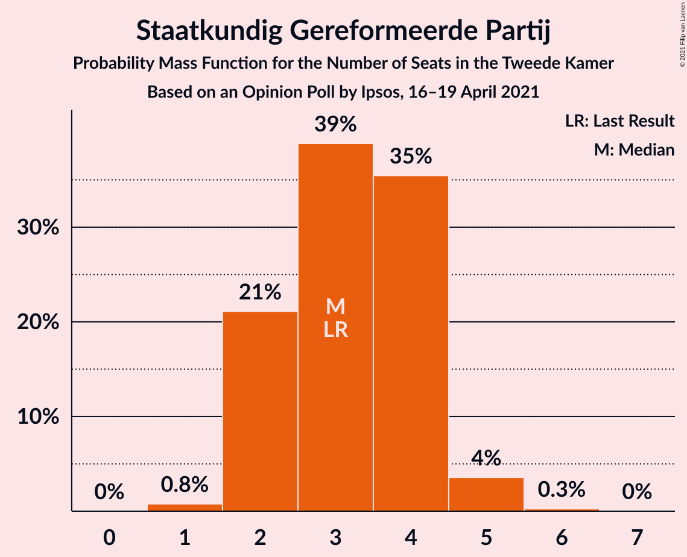

| Number of Seats | Probability | Accumulated | Special Marks |
|:---------------:|:-----------:|:-----------:|:-------------:|
| 1 | 0.3% | 100% |  |
| 2 | 31% | 99.7% |  |
| 3 | 18% | 68% | Last Result |
| 4 | 49% | 50% | Median |
| 5 | 1.3% | 1.4% |  |
| 6 | 0.1% | 0.1% |  |
| 7 | 0% | 0% |  |

### DENK

*For a full overview of the results for this party, see the [DENK](party-denk.html) page.*

| Number of Seats | Probability | Accumulated | Special Marks |
|:---------------:|:-----------:|:-----------:|:-------------:|
| 1 | 11% | 100% |  |
| 2 | 34% | 89% |  |
| 3 | 7% | 55% | Last Result, Median |
| 4 | 48% | 48% |  |
| 5 | 0% | 0% |  |

### 50Plus

*For a full overview of the results for this party, see the [50Plus](party-50plus.html) page.*

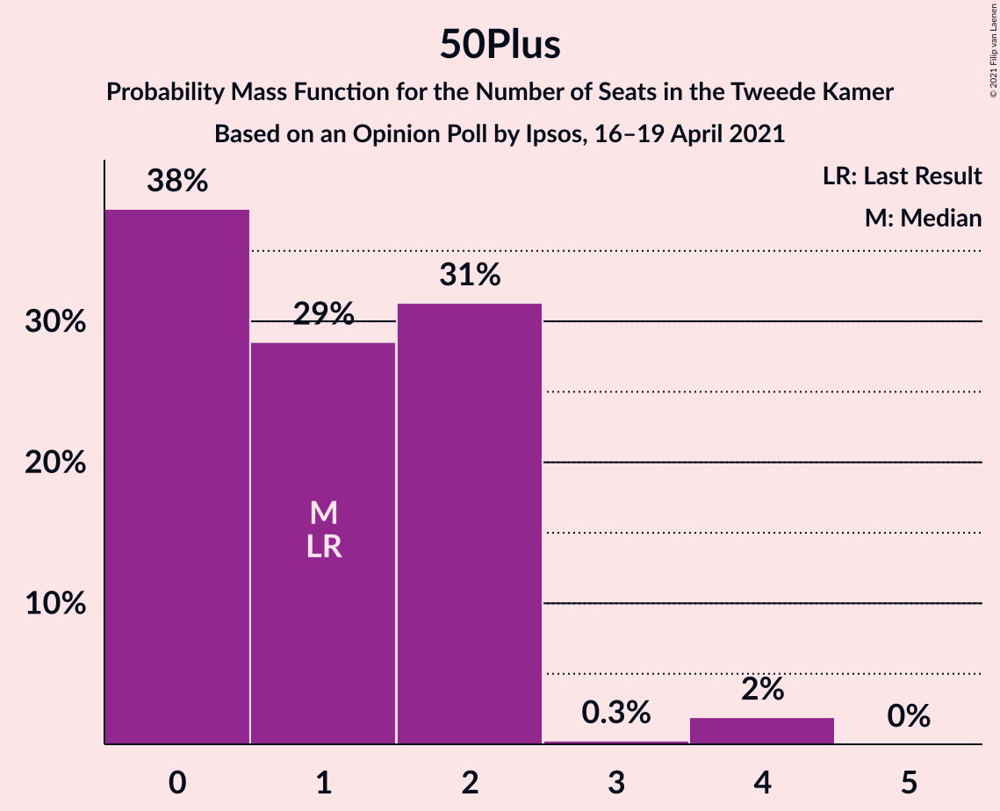

| Number of Seats | Probability | Accumulated | Special Marks |
|:---------------:|:-----------:|:-----------:|:-------------:|
| 0 | 17% | 100% |  |
| 1 | 37% | 83% | Last Result, Median |
| 2 | 47% | 47% |  |
| 3 | 0% | 0% |  |

### BoerBurgerBeweging

*For a full overview of the results for this party, see the [BoerBurgerBeweging](party-boerburgerbeweging.html) page.*

| Number of Seats | Probability | Accumulated | Special Marks |
|:---------------:|:-----------:|:-----------:|:-------------:|
| 0 | 7% | 100% |  |
| 1 | 67% | 93% | Last Result, Median |
| 2 | 26% | 26% |  |
| 3 | 0.3% | 0.3% |  |
| 4 | 0% | 0% |  |

### Bij1

*For a full overview of the results for this party, see the [Bij1](party-bij1.html) page.*

| Number of Seats | Probability | Accumulated | Special Marks |
|:---------------:|:-----------:|:-----------:|:-------------:|
| 0 | 21% | 100% |  |
| 1 | 76% | 79% | Last Result, Median |
| 2 | 3% | 3% |  |
| 3 | 0.2% | 0.2% |  |
| 4 | 0% | 0% |  |

## Coalitions

### Confidence Intervals

| Coalition | Last Result | Median | Majority? | 80% Confidence Interval | 90% Confidence Interval | 95% Confidence Interval | 99% Confidence Interval |
|:---------:|:-----------:|:------:|:---------:|:-----------------------:|:-----------------------:|:-----------------------:|:-----------------------:|
| Volkspartij voor Vrijheid en Democratie – Democraten 66 – Christen-Democratisch Appèl – Partij van de Arbeid – ChristenUnie | 87 | 82 | 100% | 80–90 | 80–92 | 80–92 | 80–94 |
| Volkspartij voor Vrijheid en Democratie – Democraten 66 – Christen-Democratisch Appèl – GroenLinks – ChristenUnie | 86 | 81 | 100% | 80–89 | 80–89 | 80–89 | 77–90 |
| Volkspartij voor Vrijheid en Democratie – Democraten 66 – Christen-Democratisch Appèl – ChristenUnie | 78 | 73 | 31% | 72–81 | 72–83 | 72–83 | 70–84 |
| Volkspartij voor Vrijheid en Democratie – Partij voor de Vrijheid – Christen-Democratisch Appèl – Forum voor Democratie – Staatkundig Gereformeerde Partij | 77 | 71 | 11% | 71–76 | 70–78 | 69–78 | 68–78 |
| Volkspartij voor Vrijheid en Democratie – Democraten 66 – Christen-Democratisch Appèl | 73 | 68 | 11% | 68–76 | 68–78 | 68–78 | 67–79 |
| Volkspartij voor Vrijheid en Democratie – Democraten 66 – Partij van de Arbeid | 67 | 68 | 3% | 62–73 | 62–74 | 62–76 | 62–76 |
| Volkspartij voor Vrijheid en Democratie – Partij voor de Vrijheid – Christen-Democratisch Appèl – Forum voor Democratie | 74 | 68 | 0.2% | 67–72 | 67–74 | 66–75 | 65–75 |
| Democraten 66 – Christen-Democratisch Appèl – Partij van de Arbeid – GroenLinks – Socialistische Partij – ChristenUnie | 70 | 65 | 0% | 60–68 | 60–70 | 60–72 | 60–74 |
| Volkspartij voor Vrijheid en Democratie – Partij voor de Vrijheid – Christen-Democratisch Appèl | 66 | 62 | 0% | 61–65 | 61–67 | 60–68 | 59–68 |
| Democraten 66 – Christen-Democratisch Appèl – Partij van de Arbeid – GroenLinks – ChristenUnie | 61 | 59 | 0% | 54–62 | 54–62 | 54–66 | 54–68 |
| Volkspartij voor Vrijheid en Democratie – Christen-Democratisch Appèl – Forum voor Democratie – Staatkundig Gereformeerde Partij – 50Plus | 61 | 56 | 0% | 53–58 | 52–62 | 52–63 | 51–63 |
| Volkspartij voor Vrijheid en Democratie – Christen-Democratisch Appèl – Partij van de Arbeid | 58 | 53 | 0% | 52–57 | 52–60 | 52–63 | 52–63 |
| Volkspartij voor Vrijheid en Democratie – Christen-Democratisch Appèl – Forum voor Democratie – Staatkundig Gereformeerde Partij | 60 | 54 | 0% | 52–58 | 51–62 | 51–62 | 51–62 |
| Volkspartij voor Vrijheid en Democratie – Christen-Democratisch Appèl – Forum voor Democratie – 50Plus | 58 | 52 | 0% | 50–56 | 50–59 | 49–59 | 48–59 |
| Volkspartij voor Vrijheid en Democratie – Christen-Democratisch Appèl – Forum voor Democratie | 57 | 50 | 0% | 50–55 | 49–58 | 48–59 | 48–59 |
| Democraten 66 – Christen-Democratisch Appèl – Partij van de Arbeid | 48 | 46 | 0% | 42–50 | 42–52 | 42–54 | 41–57 |
| Volkspartij voor Vrijheid en Democratie – Christen-Democratisch Appèl | 49 | 44 | 0% | 44–48 | 43–51 | 43–52 | 42–52 |
| Volkspartij voor Vrijheid en Democratie – Partij van de Arbeid | 43 | 44 | 0% | 38–46 | 38–47 | 38–47 | 38–48 |
| Democraten 66 – Christen-Democratisch Appèl | 39 | 36 | 0% | 33–40 | 33–42 | 32–43 | 32–47 |
| Christen-Democratisch Appèl – Partij van de Arbeid – ChristenUnie | 29 | 24 | 0% | 23–27 | 23–30 | 22–31 | 22–31 |
| Christen-Democratisch Appèl – Partij van de Arbeid | 24 | 20 | 0% | 18–22 | 18–25 | 17–28 | 17–28 |

### Volkspartij voor Vrijheid en Democratie – Democraten 66 – Christen-Democratisch Appèl – Partij van de Arbeid – ChristenUnie

| Number of Seats | Probability | Accumulated | Special Marks |
|:---------------:|:-----------:|:-----------:|:-------------:|
| 80 | 21% | 100% |  |
| 81 | 0% | 79% |  |
| 82 | 44% | 79% | Median |
| 83 | 3% | 34% |  |
| 84 | 0.5% | 31% |  |
| 85 | 0.4% | 31% |  |
| 86 | 2% | 31% |  |
| 87 | 12% | 29% | Last Result |
| 88 | 2% | 17% |  |
| 89 | 5% | 15% |  |
| 90 | 1.2% | 11% |  |
| 91 | 0.1% | 9% |  |
| 92 | 8% | 9% |  |
| 93 | 0.1% | 2% |  |
| 94 | 1.2% | 1.5% |  |
| 95 | 0.2% | 0.3% |  |
| 96 | 0.1% | 0.1% |  |
| 97 | 0% | 0% |  |

### Volkspartij voor Vrijheid en Democratie – Democraten 66 – Christen-Democratisch Appèl – GroenLinks – ChristenUnie

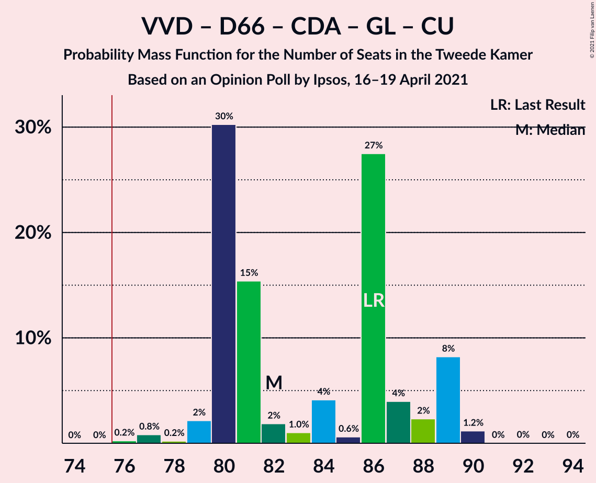

| Number of Seats | Probability | Accumulated | Special Marks |
|:---------------:|:-----------:|:-----------:|:-------------:|
| 77 | 1.2% | 100% |  |
| 78 | 0% | 98.8% |  |
| 79 | 0.2% | 98.8% |  |
| 80 | 45% | 98.5% | Median |
| 81 | 23% | 54% |  |
| 82 | 2% | 31% |  |
| 83 | 0.3% | 29% |  |
| 84 | 6% | 29% |  |
| 85 | 0.3% | 23% |  |
| 86 | 3% | 23% | Last Result |
| 87 | 2% | 20% |  |
| 88 | 3% | 18% |  |
| 89 | 12% | 14% |  |
| 90 | 2% | 2% |  |
| 91 | 0% | 0.1% |  |
| 92 | 0% | 0.1% |  |
| 93 | 0% | 0.1% |  |
| 94 | 0% | 0% |  |

### Volkspartij voor Vrijheid en Democratie – Democraten 66 – Christen-Democratisch Appèl – ChristenUnie

| Number of Seats | Probability | Accumulated | Special Marks |
|:---------------:|:-----------:|:-----------:|:-------------:|
| 70 | 1.1% | 100% |  |
| 71 | 0.3% | 98.8% |  |
| 72 | 21% | 98.6% |  |
| 73 | 44% | 77% | Median |
| 74 | 2% | 33% |  |
| 75 | 0.2% | 31% |  |
| 76 | 7% | 31% | Majority |
| 77 | 0% | 23% |  |
| 78 | 0.9% | 23% | Last Result |
| 79 | 9% | 22% |  |
| 80 | 3% | 13% |  |
| 81 | 3% | 10% |  |
| 82 | 2% | 7% |  |
| 83 | 4% | 5% |  |
| 84 | 1.2% | 1.5% |  |
| 85 | 0.2% | 0.3% |  |
| 86 | 0% | 0.1% |  |
| 87 | 0% | 0% |  |

### Volkspartij voor Vrijheid en Democratie – Partij voor de Vrijheid – Christen-Democratisch Appèl – Forum voor Democratie – Staatkundig Gereformeerde Partij

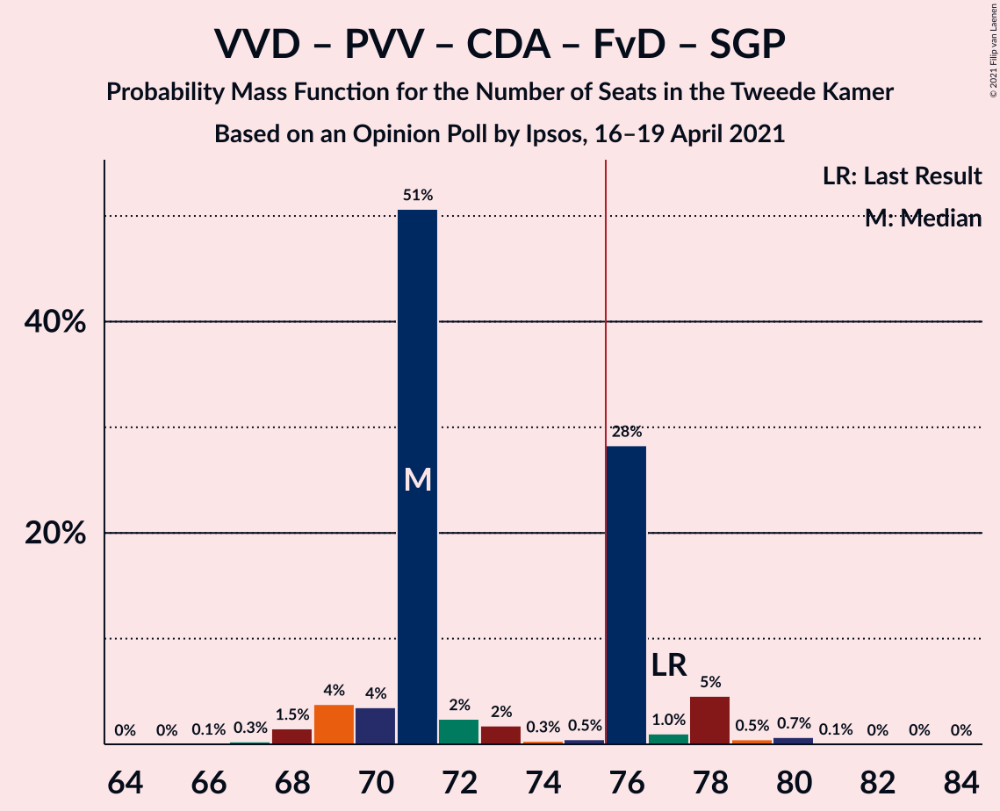

| Number of Seats | Probability | Accumulated | Special Marks |
|:---------------:|:-----------:|:-----------:|:-------------:|
| 67 | 0.1% | 100% |  |
| 68 | 2% | 99.9% |  |
| 69 | 2% | 98% |  |
| 70 | 5% | 96% |  |
| 71 | 74% | 91% | Median |
| 72 | 3% | 17% |  |
| 73 | 3% | 14% |  |
| 74 | 0.1% | 12% |  |
| 75 | 0.5% | 11% |  |
| 76 | 3% | 11% | Majority |
| 77 | 0.3% | 7% | Last Result |
| 78 | 7% | 7% |  |
| 79 | 0% | 0.2% |  |
| 80 | 0% | 0.2% |  |
| 81 | 0.1% | 0.2% |  |
| 82 | 0% | 0% |  |

### Volkspartij voor Vrijheid en Democratie – Democraten 66 – Christen-Democratisch Appèl

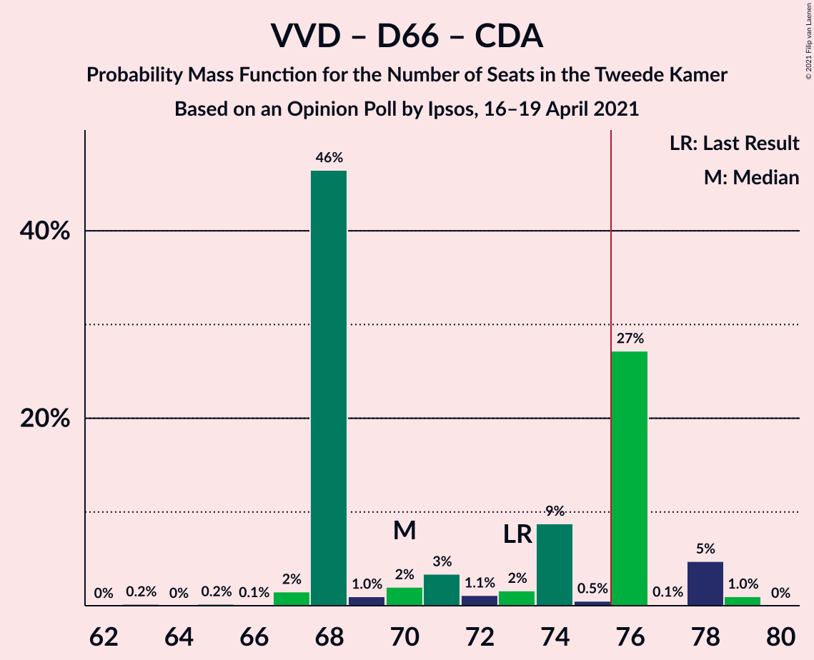

| Number of Seats | Probability | Accumulated | Special Marks |
|:---------------:|:-----------:|:-----------:|:-------------:|
| 65 | 0.2% | 100% |  |
| 66 | 0% | 99.7% |  |
| 67 | 1.2% | 99.7% |  |
| 68 | 67% | 98% | Median |
| 69 | 0.5% | 31% |  |
| 70 | 2% | 31% |  |
| 71 | 4% | 29% |  |
| 72 | 1.4% | 24% |  |
| 73 | 2% | 23% | Last Result |
| 74 | 9% | 21% |  |
| 75 | 0.7% | 12% |  |
| 76 | 3% | 11% | Majority |
| 77 | 0% | 9% |  |
| 78 | 7% | 9% |  |
| 79 | 1.5% | 1.5% |  |
| 80 | 0% | 0% |  |

### Volkspartij voor Vrijheid en Democratie – Democraten 66 – Partij van de Arbeid

| Number of Seats | Probability | Accumulated | Special Marks |
|:---------------:|:-----------:|:-----------:|:-------------:|
| 62 | 21% | 100% |  |
| 63 | 0% | 79% |  |
| 64 | 0% | 79% |  |
| 65 | 0.3% | 79% |  |
| 66 | 0.1% | 78% |  |
| 67 | 0.4% | 78% | Last Result |
| 68 | 44% | 78% | Median |
| 69 | 10% | 34% |  |
| 70 | 2% | 24% |  |
| 71 | 3% | 22% |  |
| 72 | 7% | 18% |  |
| 73 | 3% | 11% |  |
| 74 | 6% | 9% |  |
| 75 | 0% | 3% |  |
| 76 | 2% | 3% | Majority |
| 77 | 0% | 0.1% |  |
| 78 | 0.1% | 0.1% |  |
| 79 | 0% | 0% |  |

### Volkspartij voor Vrijheid en Democratie – Partij voor de Vrijheid – Christen-Democratisch Appèl – Forum voor Democratie

| Number of Seats | Probability | Accumulated | Special Marks |
|:---------------:|:-----------:|:-----------:|:-------------:|
| 64 | 0.1% | 100% |  |
| 65 | 0.5% | 99.9% |  |
| 66 | 3% | 99.4% |  |
| 67 | 45% | 96% | Median |
| 68 | 12% | 51% |  |
| 69 | 23% | 38% |  |
| 70 | 3% | 15% |  |
| 71 | 1.0% | 11% |  |
| 72 | 0.5% | 10% |  |
| 73 | 0.3% | 10% |  |
| 74 | 7% | 10% | Last Result |
| 75 | 3% | 3% |  |
| 76 | 0.2% | 0.2% | Majority |
| 77 | 0% | 0% |  |

### Democraten 66 – Christen-Democratisch Appèl – Partij van de Arbeid – GroenLinks – Socialistische Partij – ChristenUnie

| Number of Seats | Probability | Accumulated | Special Marks |
|:---------------:|:-----------:|:-----------:|:-------------:|
| 55 | 0.1% | 100% |  |
| 56 | 0% | 99.9% |  |
| 57 | 0% | 99.9% |  |
| 58 | 0% | 99.9% |  |
| 59 | 0% | 99.9% |  |
| 60 | 44% | 99.9% | Median |
| 61 | 0.1% | 56% |  |
| 62 | 3% | 55% |  |
| 63 | 0.2% | 53% |  |
| 64 | 1.4% | 52% |  |
| 65 | 7% | 51% |  |
| 66 | 0.2% | 44% |  |
| 67 | 2% | 44% |  |
| 68 | 33% | 42% |  |
| 69 | 2% | 9% |  |
| 70 | 3% | 7% | Last Result |
| 71 | 0.1% | 4% |  |
| 72 | 2% | 4% |  |
| 73 | 1.2% | 2% |  |
| 74 | 0.5% | 0.5% |  |
| 75 | 0% | 0% |  |

### Volkspartij voor Vrijheid en Democratie – Partij voor de Vrijheid – Christen-Democratisch Appèl

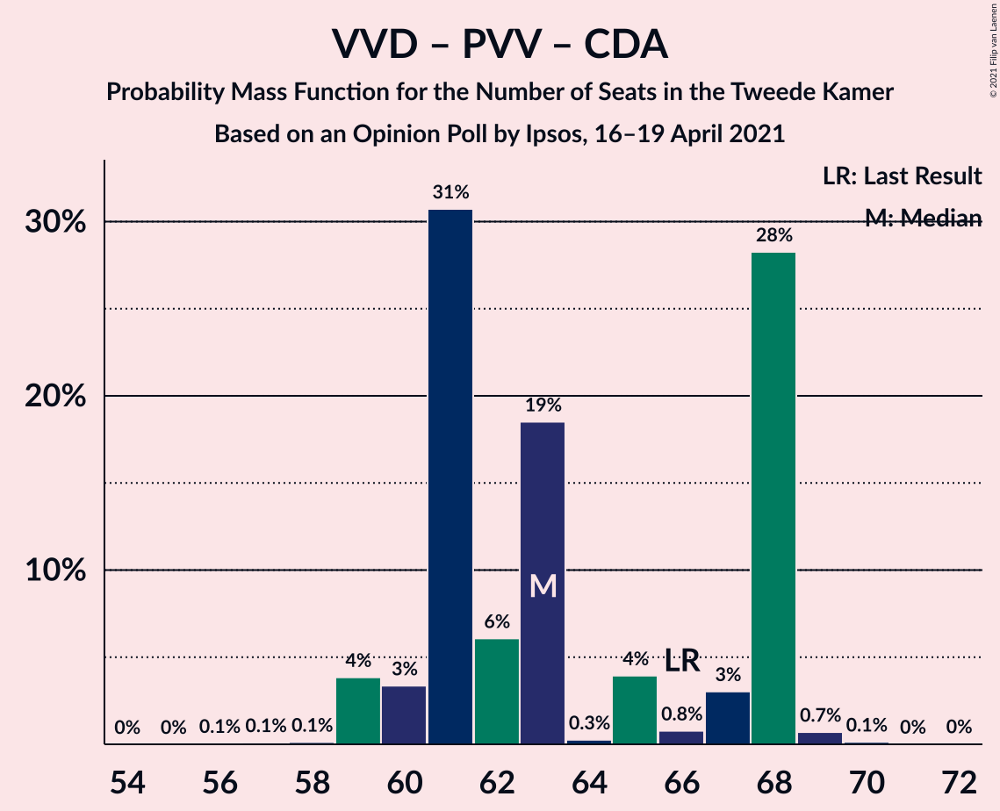

| Number of Seats | Probability | Accumulated | Special Marks |
|:---------------:|:-----------:|:-----------:|:-------------:|
| 56 | 0.1% | 100% |  |
| 57 | 0% | 99.9% |  |
| 58 | 0.1% | 99.9% |  |
| 59 | 2% | 99.8% |  |
| 60 | 2% | 98% |  |
| 61 | 46% | 96% | Median |
| 62 | 8% | 50% |  |
| 63 | 28% | 42% |  |
| 64 | 0.3% | 14% |  |
| 65 | 6% | 14% |  |
| 66 | 0.4% | 8% | Last Result |
| 67 | 4% | 7% |  |
| 68 | 3% | 3% |  |
| 69 | 0% | 0.2% |  |
| 70 | 0.1% | 0.2% |  |
| 71 | 0% | 0% |  |

### Democraten 66 – Christen-Democratisch Appèl – Partij van de Arbeid – GroenLinks – ChristenUnie

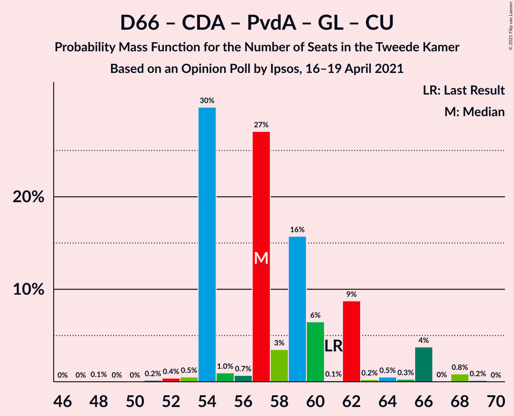

| Number of Seats | Probability | Accumulated | Special Marks |
|:---------------:|:-----------:|:-----------:|:-------------:|
| 48 | 0.1% | 100% |  |
| 49 | 0% | 99.9% |  |
| 50 | 0% | 99.9% |  |
| 51 | 0% | 99.9% |  |
| 52 | 0% | 99.9% |  |
| 53 | 0.1% | 99.9% |  |
| 54 | 44% | 99.8% | Median |
| 55 | 1.3% | 55% |  |
| 56 | 0.2% | 54% |  |
| 57 | 2% | 54% |  |
| 58 | 1.3% | 52% |  |
| 59 | 24% | 51% |  |
| 60 | 10% | 27% |  |
| 61 | 0.1% | 18% | Last Result |
| 62 | 13% | 17% |  |
| 63 | 0.2% | 4% |  |
| 64 | 0.5% | 4% |  |
| 65 | 0.4% | 4% |  |
| 66 | 2% | 3% |  |
| 67 | 0.1% | 1.5% |  |
| 68 | 1.2% | 1.4% |  |
| 69 | 0.2% | 0.2% |  |
| 70 | 0% | 0% |  |

### Volkspartij voor Vrijheid en Democratie – Christen-Democratisch Appèl – Forum voor Democratie – Staatkundig Gereformeerde Partij – 50Plus

| Number of Seats | Probability | Accumulated | Special Marks |
|:---------------:|:-----------:|:-----------:|:-------------:|
| 47 | 0.2% | 100% |  |
| 48 | 0% | 99.8% |  |
| 49 | 0% | 99.8% |  |
| 50 | 0.1% | 99.8% |  |
| 51 | 2% | 99.7% |  |
| 52 | 5% | 98% |  |
| 53 | 26% | 93% |  |
| 54 | 0.4% | 67% |  |
| 55 | 0.3% | 66% | Median |
| 56 | 46% | 66% |  |
| 57 | 0.7% | 20% |  |
| 58 | 10% | 19% |  |
| 59 | 2% | 9% |  |
| 60 | 0.4% | 8% |  |
| 61 | 0.2% | 7% | Last Result |
| 62 | 3% | 7% |  |
| 63 | 4% | 4% |  |
| 64 | 0% | 0% |  |

### Volkspartij voor Vrijheid en Democratie – Christen-Democratisch Appèl – Partij van de Arbeid

| Number of Seats | Probability | Accumulated | Special Marks |
|:---------------:|:-----------:|:-----------:|:-------------:|
| 49 | 0% | 100% |  |
| 50 | 0.1% | 99.9% |  |
| 51 | 0.2% | 99.9% |  |
| 52 | 21% | 99.7% |  |
| 53 | 49% | 78% | Median |
| 54 | 0.6% | 29% |  |
| 55 | 4% | 29% |  |
| 56 | 14% | 24% |  |
| 57 | 2% | 10% |  |
| 58 | 0.9% | 9% | Last Result |
| 59 | 0.4% | 8% |  |
| 60 | 4% | 7% |  |
| 61 | 0% | 3% |  |
| 62 | 0% | 3% |  |
| 63 | 3% | 3% |  |
| 64 | 0% | 0% |  |

### Volkspartij voor Vrijheid en Democratie – Christen-Democratisch Appèl – Forum voor Democratie – Staatkundig Gereformeerde Partij

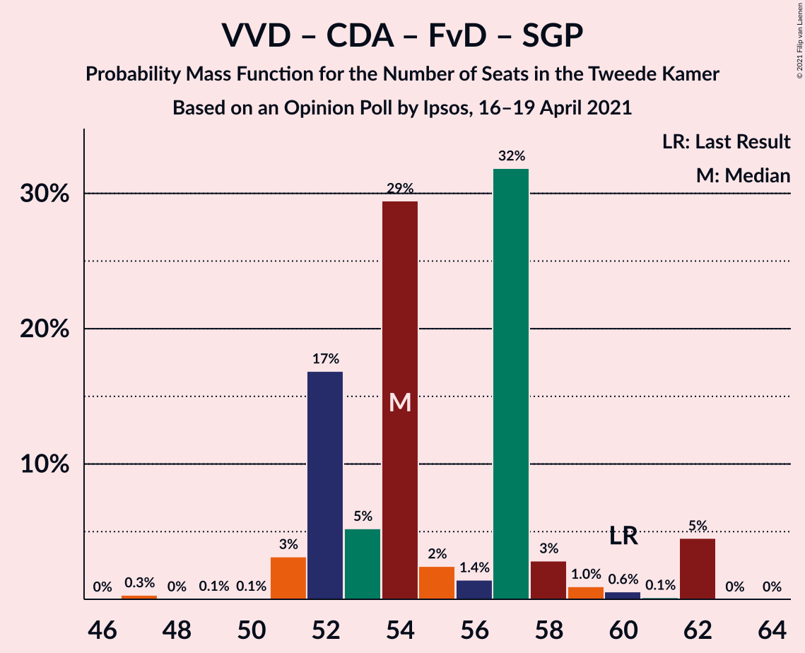

| Number of Seats | Probability | Accumulated | Special Marks |
|:---------------:|:-----------:|:-----------:|:-------------:|
| 47 | 0.2% | 100% |  |
| 48 | 0% | 99.8% |  |
| 49 | 0.1% | 99.8% |  |
| 50 | 0.1% | 99.7% |  |
| 51 | 5% | 99.6% |  |
| 52 | 25% | 95% |  |
| 53 | 3% | 70% |  |
| 54 | 44% | 66% | Median |
| 55 | 0.3% | 22% |  |
| 56 | 2% | 21% |  |
| 57 | 8% | 20% |  |
| 58 | 4% | 12% |  |
| 59 | 0.2% | 8% |  |
| 60 | 0.3% | 7% | Last Result |
| 61 | 0.2% | 7% |  |
| 62 | 7% | 7% |  |
| 63 | 0% | 0% |  |

### Volkspartij voor Vrijheid en Democratie – Christen-Democratisch Appèl – Forum voor Democratie – 50Plus

| Number of Seats | Probability | Accumulated | Special Marks |
|:---------------:|:-----------:|:-----------:|:-------------:|
| 45 | 0.2% | 100% |  |
| 46 | 0.1% | 99.8% |  |
| 47 | 0% | 99.7% |  |
| 48 | 2% | 99.7% |  |
| 49 | 1.2% | 98% |  |
| 50 | 7% | 97% |  |
| 51 | 23% | 89% | Median |
| 52 | 45% | 66% |  |
| 53 | 0.1% | 21% |  |
| 54 | 3% | 21% |  |
| 55 | 8% | 19% |  |
| 56 | 3% | 11% |  |
| 57 | 0.1% | 7% |  |
| 58 | 0.2% | 7% | Last Result |
| 59 | 7% | 7% |  |
| 60 | 0% | 0.1% |  |
| 61 | 0% | 0% |  |

### Volkspartij voor Vrijheid en Democratie – Christen-Democratisch Appèl – Forum voor Democratie

| Number of Seats | Probability | Accumulated | Special Marks |
|:---------------:|:-----------:|:-----------:|:-------------:|
| 45 | 0.3% | 100% |  |
| 46 | 0% | 99.7% |  |
| 47 | 0.1% | 99.7% |  |
| 48 | 3% | 99.6% |  |
| 49 | 2% | 97% |  |
| 50 | 72% | 95% | Median |
| 51 | 0.5% | 22% |  |
| 52 | 0.5% | 22% |  |
| 53 | 1.2% | 21% |  |
| 54 | 9% | 20% |  |
| 55 | 0.9% | 11% |  |
| 56 | 3% | 10% |  |
| 57 | 0.4% | 7% | Last Result |
| 58 | 4% | 7% |  |
| 59 | 3% | 3% |  |
| 60 | 0% | 0% |  |

### Democraten 66 – Christen-Democratisch Appèl – Partij van de Arbeid

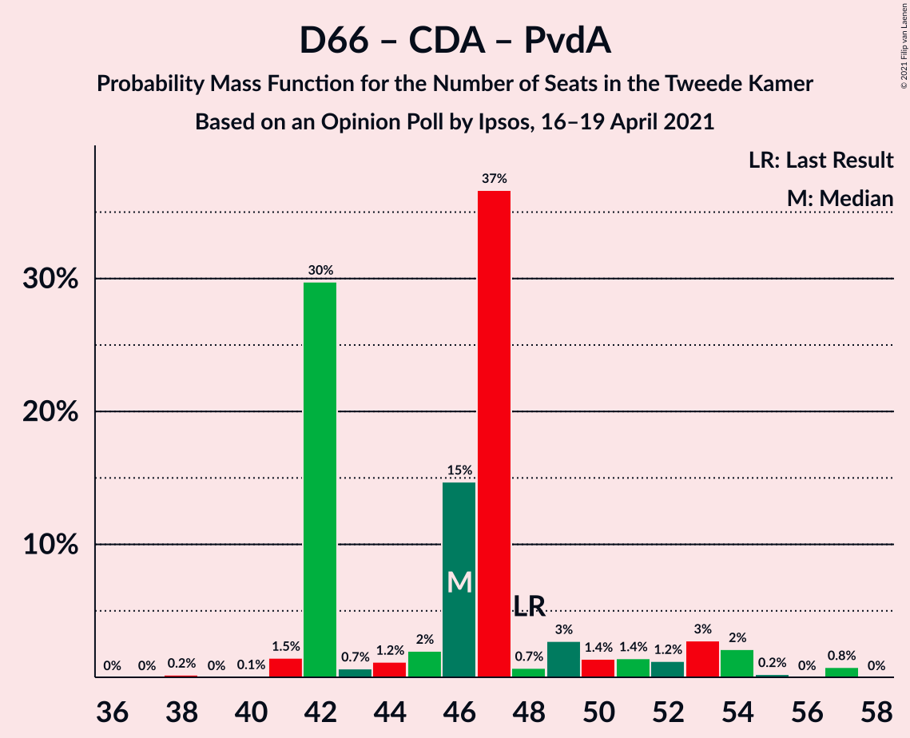

| Number of Seats | Probability | Accumulated | Special Marks |
|:---------------:|:-----------:|:-----------:|:-------------:|
| 40 | 0.1% | 100% |  |
| 41 | 2% | 99.9% |  |
| 42 | 44% | 98% | Median |
| 43 | 0.2% | 54% |  |
| 44 | 1.0% | 54% |  |
| 45 | 2% | 53% |  |
| 46 | 22% | 51% |  |
| 47 | 14% | 30% |  |
| 48 | 0.8% | 15% | Last Result |
| 49 | 4% | 14% |  |
| 50 | 2% | 11% |  |
| 51 | 2% | 9% |  |
| 52 | 2% | 7% |  |
| 53 | 0.3% | 5% |  |
| 54 | 3% | 5% |  |
| 55 | 0.2% | 1.4% |  |
| 56 | 0% | 1.2% |  |
| 57 | 1.2% | 1.2% |  |
| 58 | 0% | 0% |  |

### Volkspartij voor Vrijheid en Democratie – Christen-Democratisch Appèl

| Number of Seats | Probability | Accumulated | Special Marks |
|:---------------:|:-----------:|:-----------:|:-------------:|
| 39 | 0.2% | 100% |  |
| 40 | 0% | 99.8% |  |
| 41 | 0.2% | 99.8% |  |
| 42 | 1.2% | 99.6% |  |
| 43 | 5% | 98% |  |
| 44 | 67% | 93% | Median |
| 45 | 5% | 26% |  |
| 46 | 0.2% | 21% |  |
| 47 | 5% | 21% |  |
| 48 | 8% | 16% |  |
| 49 | 0.7% | 8% | Last Result |
| 50 | 0.1% | 7% |  |
| 51 | 4% | 7% |  |
| 52 | 3% | 3% |  |
| 53 | 0.3% | 0.3% |  |
| 54 | 0% | 0% |  |

### Volkspartij voor Vrijheid en Democratie – Partij van de Arbeid

| Number of Seats | Probability | Accumulated | Special Marks |
|:---------------:|:-----------:|:-----------:|:-------------:|
| 36 | 0.1% | 100% |  |
| 37 | 0% | 99.9% |  |
| 38 | 21% | 99.9% |  |
| 39 | 0.2% | 79% |  |
| 40 | 0.3% | 79% |  |
| 41 | 2% | 78% |  |
| 42 | 3% | 76% |  |
| 43 | 10% | 74% | Last Result |
| 44 | 45% | 64% | Median |
| 45 | 2% | 19% |  |
| 46 | 8% | 17% |  |
| 47 | 7% | 9% |  |
| 48 | 1.2% | 1.4% |  |
| 49 | 0% | 0.2% |  |
| 50 | 0.1% | 0.2% |  |
| 51 | 0% | 0% |  |

### Democraten 66 – Christen-Democratisch Appèl

| Number of Seats | Probability | Accumulated | Special Marks |
|:---------------:|:-----------:|:-----------:|:-------------:|
| 32 | 3% | 100% |  |
| 33 | 44% | 97% | Median |
| 34 | 0.1% | 53% |  |
| 35 | 0.2% | 53% |  |
| 36 | 5% | 52% |  |
| 37 | 0.8% | 47% |  |
| 38 | 24% | 46% |  |
| 39 | 9% | 22% | Last Result |
| 40 | 6% | 13% |  |
| 41 | 0.3% | 7% |  |
| 42 | 2% | 7% |  |
| 43 | 3% | 5% |  |
| 44 | 0.5% | 2% |  |
| 45 | 0% | 1.2% |  |
| 46 | 0% | 1.2% |  |
| 47 | 1.2% | 1.2% |  |
| 48 | 0% | 0% |  |

### Christen-Democratisch Appèl – Partij van de Arbeid – ChristenUnie

| Number of Seats | Probability | Accumulated | Special Marks |
|:---------------:|:-----------:|:-----------:|:-------------:|
| 20 | 0.1% | 100% |  |
| 21 | 0% | 99.9% |  |
| 22 | 3% | 99.8% |  |
| 23 | 47% | 97% | Median |
| 24 | 0.5% | 50% |  |
| 25 | 3% | 50% |  |
| 26 | 33% | 47% |  |
| 27 | 4% | 14% |  |
| 28 | 2% | 10% |  |
| 29 | 0.9% | 8% | Last Result |
| 30 | 3% | 7% |  |
| 31 | 3% | 3% |  |
| 32 | 0% | 0.4% |  |
| 33 | 0.3% | 0.3% |  |
| 34 | 0% | 0% |  |

### Christen-Democratisch Appèl – Partij van de Arbeid

| Number of Seats | Probability | Accumulated | Special Marks |
|:---------------:|:-----------:|:-----------:|:-------------:|
| 16 | 0.1% | 100% |  |
| 17 | 3% | 99.9% |  |
| 18 | 47% | 97% | Median |
| 19 | 0.1% | 50% |  |
| 20 | 1.5% | 50% |  |
| 21 | 14% | 49% |  |
| 22 | 27% | 34% |  |
| 23 | 0.1% | 7% |  |
| 24 | 2% | 7% | Last Result |
| 25 | 2% | 5% |  |
| 26 | 0.1% | 3% |  |
| 27 | 0.2% | 3% |  |
| 28 | 3% | 3% |  |
| 29 | 0% | 0% |  |

## Technical Information

### Opinion Poll

+ **Polling firm:** Ipsos
+ **Commissioner(s):** —
+ **Fieldwork period:** 16–19 April 2021

### Calculations

+ **Sample size:** 1014
+ **Simulations done:** 524,288
+ **Error estimate:** 3.25%

