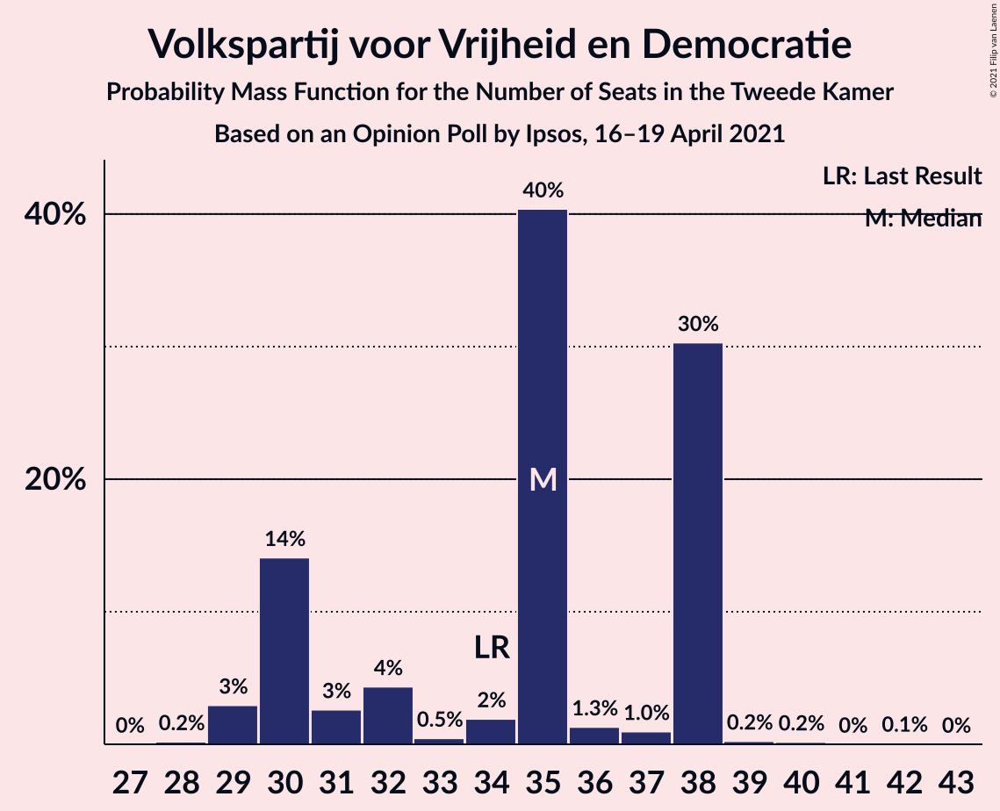
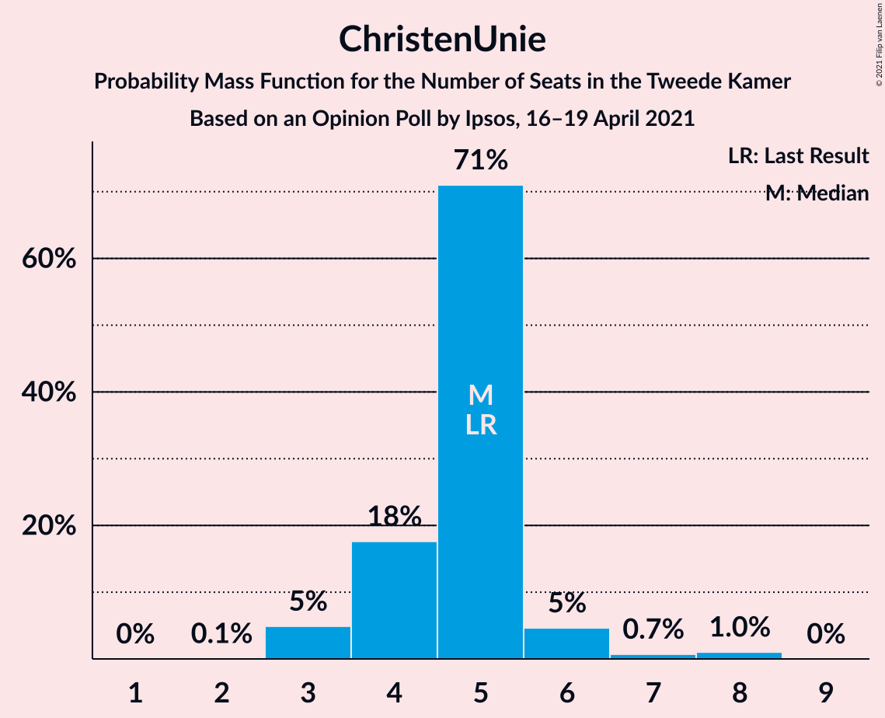
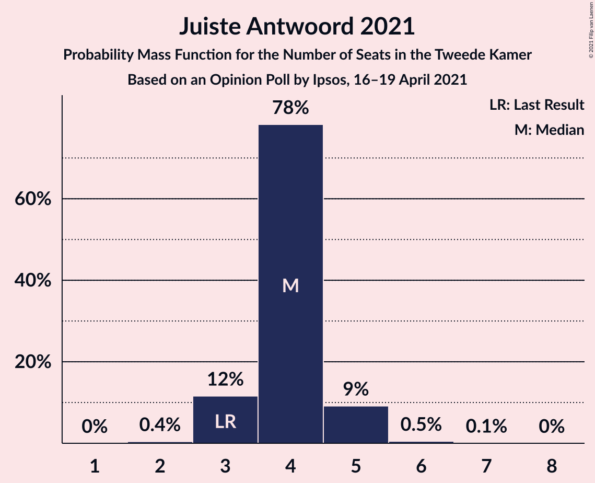
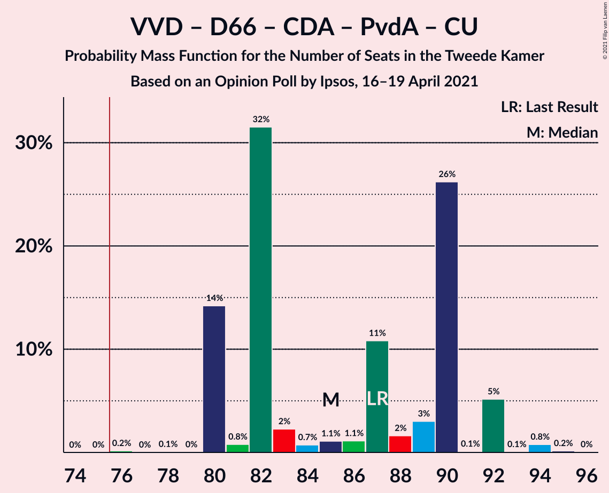
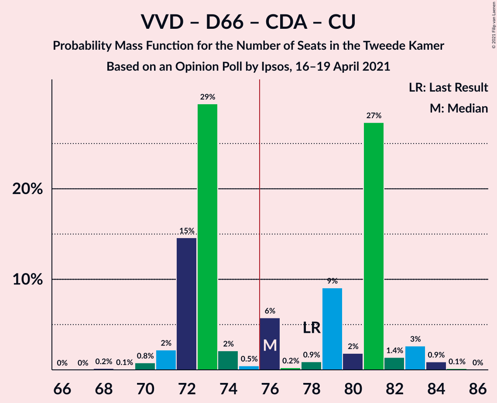
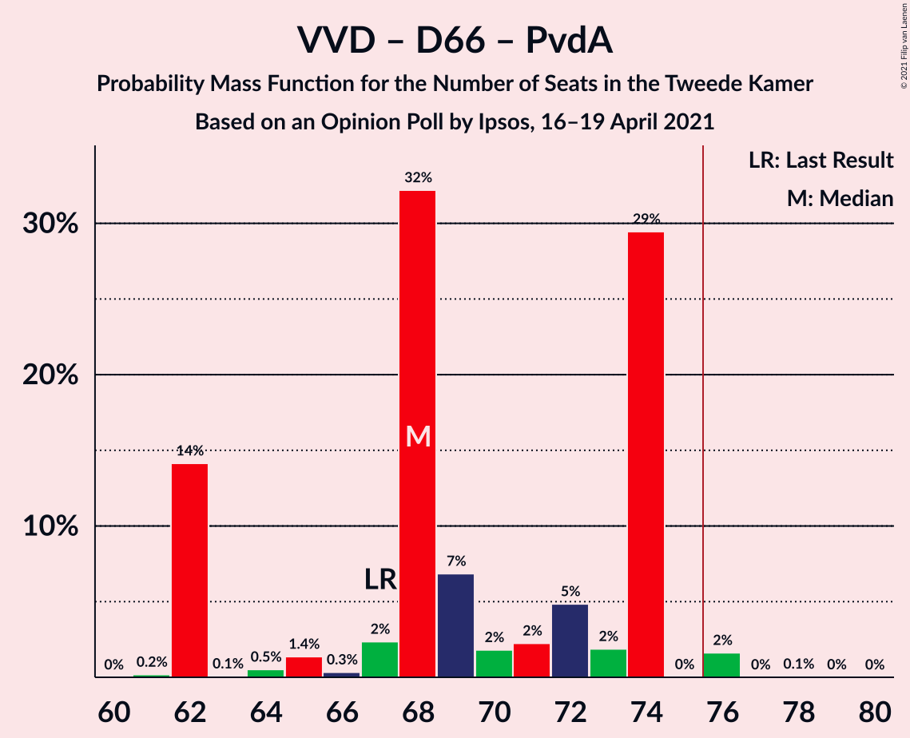
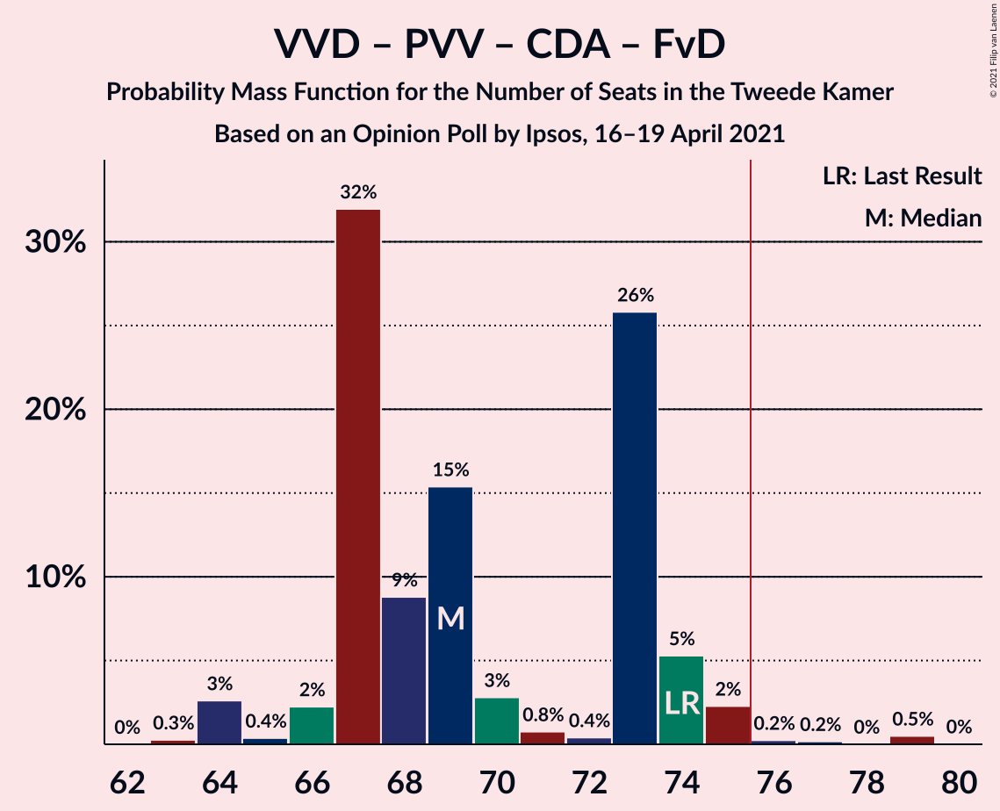
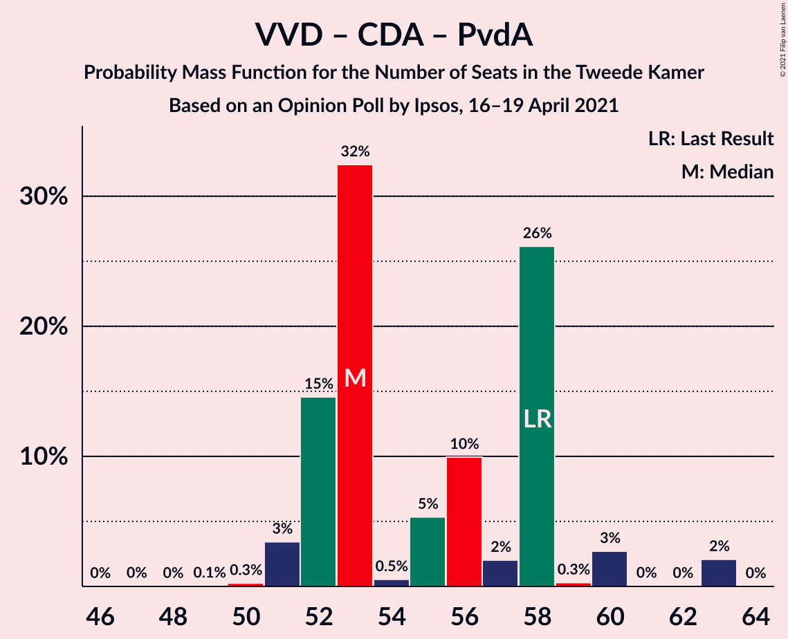

# Opinion Poll by Ipsos, 16–19 April 2021

<a href="#voting-intentions">Voting Intentions</a> | <a href="#seats">Seats</a> | <a href="#coalitions">Coalitions</a> | <a href="#technical-information">Technical Information</a>

## Voting Intentions

### Confidence Intervals

| Party | Last Result | Poll Result | 80% Confidence Interval | 90% Confidence Interval | 95% Confidence Interval | 99% Confidence Interval |
|:-----:|:-----------:|:-----------:|:-----------------------:|:-----------------------:|:-----------------------:|:-----------------------:|
| Volkspartij voor Vrijheid en Democratie | 21.9% | 22.5% | 20.9–24.2% |20.4–24.7% |20.0–25.2% |19.3–26.0% |
| Democraten 66 | 15.0% | 16.7% | 15.2–18.3% |14.8–18.7% |14.5–19.1% |13.8–19.9% |
| Partij voor de Vrijheid | 10.8% | 11.7% | 10.5–13.1% |10.2–13.5% |9.9–13.9% |9.3–14.6% |
| Christen-Democratisch Appèl | 9.5% | 7.7% | 6.7–8.9% |6.4–9.2% |6.2–9.5% |5.8–10.1% |
| Partij van de Arbeid | 5.7% | 6.3% | 5.4–7.4% |5.2–7.7% |5.0–8.0% |4.6–8.5% |
| Partij voor de Dieren | 3.8% | 5.2% | 4.4–6.2% |4.2–6.5% |4.0–6.8% |3.7–7.3% |
| GroenLinks | 5.2% | 4.7% | 4.0–5.7% |3.8–6.0% |3.6–6.2% |3.2–6.7% |
| Socialistische Partij | 6.0% | 4.5% | 3.8–5.5% |3.6–5.8% |3.4–6.0% |3.1–6.5% |
| Forum voor Democratie | 5.0% | 4.5% | 3.8–5.5% |3.6–5.8% |3.4–6.0% |3.1–6.5% |
| Volt Europa | 2.4% | 3.4% | 2.7–4.2% |2.5–4.4% |2.4–4.7% |2.1–5.1% |
| ChristenUnie | 3.4% | 3.2% | 2.5–4.0% |2.4–4.2% |2.2–4.4% |2.0–4.9% |
| Juiste Antwoord 2021 | 2.4% | 2.9% | 2.3–3.7% |2.1–3.9% |2.0–4.1% |1.8–4.5% |
| Staatkundig Gereformeerde Partij | 2.1% | 2.2% | 1.7–2.9% |1.5–3.1% |1.4–3.3% |1.2–3.6% |
| DENK | 2.0% | 1.5% | 1.1–2.1% |1.0–2.3% |0.9–2.4% |0.7–2.8% |
| 50Plus | 1.0% | 0.8% | 0.5–1.3% |0.5–1.4% |0.4–1.6% |0.3–1.8% |
| BoerBurgerBeweging | 1.0% | 0.8% | 0.5–1.3% |0.5–1.4% |0.4–1.6% |0.3–1.8% |
| Bij1 | 0.8% | 0.7% | 0.5–1.2% |0.4–1.3% |0.3–1.4% |0.2–1.7% |

*Note:* The poll result column reflects the actual value used in the calculations. Published results may vary slightly, and in addition be rounded to fewer digits.

## Seats

### Confidence Intervals

| Party | Last Result | Median | 80% Confidence Interval | 90% Confidence Interval | 95% Confidence Interval | 99% Confidence Interval |
|:-----:|:-----------:|:------:|:-----------------------:|:-----------------------:|:-----------------------:|:-----------------------:|
| <a href="#volkspartij-voor-vrijheid-en-democratie">Volkspartij voor Vrijheid en Democratie</a> | 34 | 35 | 35 |35–38 |32–38 |29–39 |
| <a href="#democraten-66">Democraten 66</a> | 24 | 24 | 24–26 |24–29 |24–30 |24–32 |
| <a href="#partij-voor-de-vrijheid">Partij voor de Vrijheid</a> | 17 | 17 | 17 |16–18 |16–19 |13–21 |
| <a href="#christen-democratisch-appèl">Christen-Democratisch Appèl</a> | 15 | 9 | 9–10 |9–17 |8–17 |8–17 |
| <a href="#partij-van-de-arbeid">Partij van de Arbeid</a> | 9 | 9 | 9 |9–11 |9–11 |8–11 |
| <a href="#partij-voor-de-dieren">Partij voor de Dieren</a> | 6 | 10 | 8–10 |7–10 |7–10 |6–10 |
| <a href="#groenlinks">GroenLinks</a> | 8 | 7 | 7 |5–8 |5–10 |5–10 |
| <a href="#socialistische-partij">Socialistische Partij</a> | 9 | 6 | 6 |5–8 |5–8 |5–8 |
| <a href="#forum-voor-democratie">Forum voor Democratie</a> | 8 | 6 | 6–7 |6–7 |6–9 |5–9 |
| <a href="#volt-europa">Volt Europa</a> | 3 | 6 | 5–6 |4–6 |3–6 |3–6 |
| <a href="#christenunie">ChristenUnie</a> | 5 | 5 | 4–5 |3–5 |3–6 |3–7 |
| <a href="#juiste-antwoord-2021">Juiste Antwoord 2021</a> | 3 | 4 | 4 |4 |4 |3–5 |
| <a href="#staatkundig-gereformeerde-partij">Staatkundig Gereformeerde Partij</a> | 3 | 4 | 3–4 |2–4 |2–4 |2–5 |
| <a href="#denk">DENK</a> | 3 | 4 | 3–4 |1–4 |1–4 |1–4 |
| <a href="#50plus">50Plus</a> | 1 | 2 | 0–2 |0–2 |0–2 |0–2 |
| <a href="#boerburgerbeweging">BoerBurgerBeweging</a> | 1 | 1 | 1 |0–1 |0–1 |0–2 |
| <a href="#bij1">Bij1</a> | 1 | 1 | 0–1 |0–1 |0–2 |0–2 |

### Volkspartij voor Vrijheid en Democratie

*For a full overview of the results for this party, see the [Volkspartij voor Vrijheid en Democratie](party-volkspartijvoorvrijheidendemocratie.html) page.*

| Number of Seats | Probability | Accumulated | Special Marks |
|:---------------:|:-----------:|:-----------:|:-------------:|
| 28 | 0.4% | 100% |  |
| 29 | 0.4% | 99.6% |  |
| 30 | 0.1% | 99.2% |  |
| 31 | 0.1% | 99.1% |  |
| 32 | 2% | 99.0% |  |
| 33 | 0.1% | 97% |  |
| 34 | 0% | 97% | Last Result |
| 35 | 88% | 97% | Median |
| 36 | 3% | 9% |  |
| 37 | 1.2% | 6% |  |
| 38 | 4% | 5% |  |
| 39 | 0.4% | 0.6% |  |
| 40 | 0% | 0.2% |  |
| 41 | 0% | 0.2% |  |
| 42 | 0.2% | 0.2% |  |
| 43 | 0% | 0% |  |

### Democraten 66

*For a full overview of the results for this party, see the [Democraten 66](party-democraten66.html) page.*

| Number of Seats | Probability | Accumulated | Special Marks |
|:---------------:|:-----------:|:-----------:|:-------------:|
| 22 | 0.2% | 100% |  |
| 23 | 0% | 99.8% |  |
| 24 | 85% | 99.7% | Last Result, Median |
| 25 | 0.1% | 15% |  |
| 26 | 6% | 15% |  |
| 27 | 1.4% | 9% |  |
| 28 | 0.1% | 8% |  |
| 29 | 5% | 7% |  |
| 30 | 0.5% | 3% |  |
| 31 | 0% | 2% |  |
| 32 | 2% | 2% |  |
| 33 | 0% | 0% |  |

### Partij voor de Vrijheid

*For a full overview of the results for this party, see the [Partij voor de Vrijheid](party-partijvoordevrijheid.html) page.*

| Number of Seats | Probability | Accumulated | Special Marks |
|:---------------:|:-----------:|:-----------:|:-------------:|
| 13 | 1.0% | 100% |  |
| 14 | 0% | 99.0% |  |
| 15 | 0.2% | 99.0% |  |
| 16 | 8% | 98.8% |  |
| 17 | 82% | 90% | Last Result, Median |
| 18 | 4% | 9% |  |
| 19 | 3% | 4% |  |
| 20 | 0.4% | 0.9% |  |
| 21 | 0.5% | 0.5% |  |
| 22 | 0% | 0% |  |

### Christen-Democratisch Appèl

*For a full overview of the results for this party, see the [Christen-Democratisch Appèl](party-christen-democratischappèl.html) page.*

| Number of Seats | Probability | Accumulated | Special Marks |
|:---------------:|:-----------:|:-----------:|:-------------:|
| 8 | 3% | 100% |  |
| 9 | 86% | 97% | Median |
| 10 | 0.7% | 11% |  |
| 11 | 1.4% | 10% |  |
| 12 | 0.5% | 8% |  |
| 13 | 0% | 8% |  |
| 14 | 0.4% | 8% |  |
| 15 | 2% | 8% | Last Result |
| 16 | 0% | 5% |  |
| 17 | 5% | 5% |  |
| 18 | 0% | 0% |  |

### Partij van de Arbeid

*For a full overview of the results for this party, see the [Partij van de Arbeid](party-partijvandearbeid.html) page.*

| Number of Seats | Probability | Accumulated | Special Marks |
|:---------------:|:-----------:|:-----------:|:-------------:|
| 8 | 0.7% | 100% |  |
| 9 | 90% | 99.3% | Last Result, Median |
| 10 | 3% | 10% |  |
| 11 | 6% | 6% |  |
| 12 | 0.1% | 0.5% |  |
| 13 | 0.4% | 0.4% |  |
| 14 | 0% | 0% |  |

### Partij voor de Dieren

*For a full overview of the results for this party, see the [Partij voor de Dieren](party-partijvoordedieren.html) page.*

| Number of Seats | Probability | Accumulated | Special Marks |
|:---------------:|:-----------:|:-----------:|:-------------:|
| 6 | 1.4% | 100% | Last Result |
| 7 | 5% | 98.6% |  |
| 8 | 11% | 94% |  |
| 9 | 0.6% | 83% |  |
| 10 | 82% | 82% | Median |
| 11 | 0.2% | 0.2% |  |
| 12 | 0.1% | 0.1% |  |
| 13 | 0% | 0% |  |

### GroenLinks

*For a full overview of the results for this party, see the [GroenLinks](party-groenlinks.html) page.*

| Number of Seats | Probability | Accumulated | Special Marks |
|:---------------:|:-----------:|:-----------:|:-------------:|
| 4 | 0.2% | 100% |  |
| 5 | 6% | 99.8% |  |
| 6 | 2% | 94% |  |
| 7 | 83% | 92% | Median |
| 8 | 5% | 9% | Last Result |
| 9 | 0.5% | 3% |  |
| 10 | 3% | 3% |  |
| 11 | 0% | 0% |  |

### Socialistische Partij

*For a full overview of the results for this party, see the [Socialistische Partij](party-socialistischepartij.html) page.*

| Number of Seats | Probability | Accumulated | Special Marks |
|:---------------:|:-----------:|:-----------:|:-------------:|
| 4 | 0.1% | 100% |  |
| 5 | 6% | 99.9% |  |
| 6 | 86% | 94% | Median |
| 7 | 2% | 8% |  |
| 8 | 6% | 6% |  |
| 9 | 0% | 0% | Last Result |

### Forum voor Democratie

*For a full overview of the results for this party, see the [Forum voor Democratie](party-forumvoordemocratie.html) page.*

| Number of Seats | Probability | Accumulated | Special Marks |
|:---------------:|:-----------:|:-----------:|:-------------:|
| 4 | 0.1% | 100% |  |
| 5 | 0.4% | 99.9% |  |
| 6 | 86% | 99.5% | Median |
| 7 | 9% | 13% |  |
| 8 | 0.1% | 4% | Last Result |
| 9 | 4% | 4% |  |
| 10 | 0% | 0% |  |

### Volt Europa

*For a full overview of the results for this party, see the [Volt Europa](party-volteuropa.html) page.*

| Number of Seats | Probability | Accumulated | Special Marks |
|:---------------:|:-----------:|:-----------:|:-------------:|
| 3 | 4% | 100% | Last Result |
| 4 | 3% | 96% |  |
| 5 | 6% | 92% |  |
| 6 | 86% | 86% | Median |
| 7 | 0% | 0.1% |  |
| 8 | 0.1% | 0.1% |  |
| 9 | 0% | 0% |  |

### ChristenUnie

*For a full overview of the results for this party, see the [ChristenUnie](party-christenunie.html) page.*

| Number of Seats | Probability | Accumulated | Special Marks |
|:---------------:|:-----------:|:-----------:|:-------------:|
| 3 | 5% | 100% |  |
| 4 | 5% | 95% |  |
| 5 | 85% | 89% | Last Result, Median |
| 6 | 4% | 5% |  |
| 7 | 1.1% | 1.1% |  |
| 8 | 0% | 0% |  |

### Juiste Antwoord 2021

*For a full overview of the results for this party, see the [Juiste Antwoord 2021](party-juisteantwoord2021.html) page.*

| Number of Seats | Probability | Accumulated | Special Marks |
|:---------------:|:-----------:|:-----------:|:-------------:|
| 3 | 2% | 100% | Last Result |
| 4 | 97% | 98% | Median |
| 5 | 0.5% | 0.6% |  |
| 6 | 0.1% | 0.1% |  |
| 7 | 0% | 0% |  |

### Staatkundig Gereformeerde Partij

*For a full overview of the results for this party, see the [Staatkundig Gereformeerde Partij](party-staatkundiggereformeerdepartij.html) page.*

| Number of Seats | Probability | Accumulated | Special Marks |
|:---------------:|:-----------:|:-----------:|:-------------:|
| 2 | 7% | 100% |  |
| 3 | 10% | 93% | Last Result |
| 4 | 82% | 83% | Median |
| 5 | 0.6% | 0.7% |  |
| 6 | 0% | 0% |  |

### DENK

*For a full overview of the results for this party, see the [DENK](party-denk.html) page.*

| Number of Seats | Probability | Accumulated | Special Marks |
|:---------------:|:-----------:|:-----------:|:-------------:|
| 1 | 9% | 100% |  |
| 2 | 1.3% | 91% |  |
| 3 | 8% | 90% | Last Result |
| 4 | 82% | 82% | Median |
| 5 | 0% | 0% |  |

### 50Plus

*For a full overview of the results for this party, see the [50Plus](party-50plus.html) page.*

| Number of Seats | Probability | Accumulated | Special Marks |
|:---------------:|:-----------:|:-----------:|:-------------:|
| 0 | 16% | 100% |  |
| 1 | 2% | 84% | Last Result |
| 2 | 82% | 82% | Median |
| 3 | 0% | 0% |  |

### BoerBurgerBeweging

*For a full overview of the results for this party, see the [BoerBurgerBeweging](party-boerburgerbeweging.html) page.*

| Number of Seats | Probability | Accumulated | Special Marks |
|:---------------:|:-----------:|:-----------:|:-------------:|
| 0 | 8% | 100% |  |
| 1 | 91% | 92% | Last Result, Median |
| 2 | 1.4% | 1.4% |  |
| 3 | 0% | 0% |  |

### Bij1

*For a full overview of the results for this party, see the [Bij1](party-bij1.html) page.*

| Number of Seats | Probability | Accumulated | Special Marks |
|:---------------:|:-----------:|:-----------:|:-------------:|
| 0 | 12% | 100% |  |
| 1 | 86% | 88% | Last Result, Median |
| 2 | 3% | 3% |  |
| 3 | 0% | 0% |  |

## Coalitions

### Confidence Intervals

| Coalition | Last Result | Median | Majority? | 80% Confidence Interval | 90% Confidence Interval | 95% Confidence Interval | 99% Confidence Interval |
|:---------:|:-----------:|:------:|:---------:|:-----------------------:|:-----------------------:|:-----------------------:|:-----------------------:|
| Volkspartij voor Vrijheid en Democratie – Democraten 66 – Christen-Democratisch Appèl – Partij van de Arbeid – ChristenUnie | 87 | 82 | 100% | 82–89 | 82–92 | 82–92 | 82–94 |
| Volkspartij voor Vrijheid en Democratie – Democraten 66 – Christen-Democratisch Appèl – GroenLinks – ChristenUnie | 86 | 80 | 100% | 80–86 | 80–88 | 80–90 | 80–90 |
| Volkspartij voor Vrijheid en Democratie – Democraten 66 – Christen-Democratisch Appèl – ChristenUnie | 78 | 73 | 14% | 73–80 | 73–81 | 73–82 | 73–84 |
| Volkspartij voor Vrijheid en Democratie – Partij voor de Vrijheid – Christen-Democratisch Appèl – Forum voor Democratie – Staatkundig Gereformeerde Partij | 77 | 71 | 11% | 71–76 | 71–78 | 71–78 | 68–78 |
| Volkspartij voor Vrijheid en Democratie – Democraten 66 – Christen-Democratisch Appèl | 73 | 68 | 13% | 68–76 | 68–78 | 68–78 | 68–79 |
| Volkspartij voor Vrijheid en Democratie – Democraten 66 – Partij van de Arbeid | 67 | 68 | 4% | 68–72 | 68–74 | 68–76 | 67–76 |
| Volkspartij voor Vrijheid en Democratie – Partij voor de Vrijheid – Christen-Democratisch Appèl – Forum voor Democratie | 74 | 67 | 0.3% | 67–74 | 67–75 | 67–75 | 65–75 |
| Democraten 66 – Christen-Democratisch Appèl – Partij van de Arbeid – GroenLinks – Socialistische Partij – ChristenUnie | 70 | 60 | 0% | 60–65 | 60–70 | 60–73 | 60–73 |
| Volkspartij voor Vrijheid en Democratie – Partij voor de Vrijheid – Christen-Democratisch Appèl | 66 | 61 | 0% | 61–65 | 61–68 | 61–68 | 59–68 |
| Democraten 66 – Christen-Democratisch Appèl – Partij van de Arbeid – GroenLinks – ChristenUnie | 61 | 54 | 0% | 54–59 | 54–62 | 54–68 | 54–68 |
| Volkspartij voor Vrijheid en Democratie – Christen-Democratisch Appèl – Partij van de Arbeid | 58 | 53 | 0% | 53–56 | 53–63 | 53–63 | 52–63 |
| Volkspartij voor Vrijheid en Democratie – Christen-Democratisch Appèl – Forum voor Democratie – Staatkundig Gereformeerde Partij – 50Plus | 61 | 56 | 0% | 56–58 | 56–62 | 53–62 | 51–62 |
| Volkspartij voor Vrijheid en Democratie – Christen-Democratisch Appèl – Forum voor Democratie – Staatkundig Gereformeerde Partij | 60 | 54 | 0% | 54–58 | 54–62 | 53–62 | 50–62 |
| Volkspartij voor Vrijheid en Democratie – Christen-Democratisch Appèl – Forum voor Democratie – 50Plus | 58 | 52 | 0% | 52–56 | 52–59 | 50–59 | 48–59 |
| Volkspartij voor Vrijheid en Democratie – Christen-Democratisch Appèl – Forum voor Democratie | 57 | 50 | 0% | 50–55 | 50–59 | 50–59 | 48–59 |
| Democraten 66 – Christen-Democratisch Appèl – Partij van de Arbeid | 48 | 42 | 0% | 42–47 | 42–54 | 41–55 | 41–57 |
| Volkspartij voor Vrijheid en Democratie – Christen-Democratisch Appèl | 49 | 44 | 0% | 44–47 | 44–52 | 44–52 | 41–52 |
| Volkspartij voor Vrijheid en Democratie – Partij van de Arbeid | 43 | 44 | 0% | 44–46 | 44–47 | 42–47 | 40–47 |
| Democraten 66 – Christen-Democratisch Appèl | 39 | 33 | 0% | 33–38 | 33–43 | 32–44 | 32–47 |
| Christen-Democratisch Appèl – Partij van de Arbeid – ChristenUnie | 29 | 23 | 0% | 23–25 | 23–31 | 22–31 | 22–31 |
| Christen-Democratisch Appèl – Partij van de Arbeid | 24 | 18 | 0% | 18–20 | 18–28 | 17–28 | 17–28 |

### Volkspartij voor Vrijheid en Democratie – Democraten 66 – Christen-Democratisch Appèl – Partij van de Arbeid – ChristenUnie

| Number of Seats | Probability | Accumulated | Special Marks |
|:---------------:|:-----------:|:-----------:|:-------------:|
| 80 | 0.1% | 100% |  |
| 81 | 0% | 99.9% |  |
| 82 | 82% | 99.9% | Median |
| 83 | 3% | 18% |  |
| 84 | 0.6% | 15% |  |
| 85 | 0.2% | 15% |  |
| 86 | 0.2% | 14% |  |
| 87 | 0% | 14% | Last Result |
| 88 | 0% | 14% |  |
| 89 | 5% | 14% |  |
| 90 | 0.4% | 9% |  |
| 91 | 0% | 9% |  |
| 92 | 6% | 9% |  |
| 93 | 0% | 2% |  |
| 94 | 2% | 2% |  |
| 95 | 0% | 0% |  |

### Volkspartij voor Vrijheid en Democratie – Democraten 66 – Christen-Democratisch Appèl – GroenLinks – ChristenUnie

| Number of Seats | Probability | Accumulated | Special Marks |
|:---------------:|:-----------:|:-----------:|:-------------:|
| 77 | 0.1% | 100% |  |
| 78 | 0% | 99.9% |  |
| 79 | 0.4% | 99.9% |  |
| 80 | 82% | 99.5% | Median |
| 81 | 0.2% | 18% |  |
| 82 | 0.3% | 17% |  |
| 83 | 0% | 17% |  |
| 84 | 3% | 17% |  |
| 85 | 0.4% | 14% |  |
| 86 | 5% | 14% | Last Result |
| 87 | 0.4% | 8% |  |
| 88 | 4% | 8% |  |
| 89 | 1.0% | 4% |  |
| 90 | 3% | 3% |  |
| 91 | 0% | 0% |  |

### Volkspartij voor Vrijheid en Democratie – Democraten 66 – Christen-Democratisch Appèl – ChristenUnie

| Number of Seats | Probability | Accumulated | Special Marks |
|:---------------:|:-----------:|:-----------:|:-------------:|
| 69 | 0.1% | 100% |  |
| 70 | 0% | 99.9% |  |
| 71 | 0.4% | 99.9% |  |
| 72 | 0% | 99.6% |  |
| 73 | 82% | 99.5% | Median |
| 74 | 3% | 18% |  |
| 75 | 0.1% | 15% |  |
| 76 | 0.1% | 14% | Majority |
| 77 | 0% | 14% |  |
| 78 | 0.7% | 14% | Last Result |
| 79 | 0% | 14% |  |
| 80 | 5% | 14% |  |
| 81 | 5% | 9% |  |
| 82 | 1.4% | 4% |  |
| 83 | 0% | 2% |  |
| 84 | 2% | 2% |  |
| 85 | 0% | 0% |  |

### Volkspartij voor Vrijheid en Democratie – Partij voor de Vrijheid – Christen-Democratisch Appèl – Forum voor Democratie – Staatkundig Gereformeerde Partij

| Number of Seats | Probability | Accumulated | Special Marks |
|:---------------:|:-----------:|:-----------:|:-------------:|
| 67 | 0.2% | 100% |  |
| 68 | 0.8% | 99.8% |  |
| 69 | 0% | 99.0% |  |
| 70 | 0.1% | 99.0% |  |
| 71 | 83% | 98.9% | Median |
| 72 | 5% | 16% |  |
| 73 | 0.5% | 11% |  |
| 74 | 0% | 11% |  |
| 75 | 0% | 11% |  |
| 76 | 4% | 11% | Majority |
| 77 | 0.6% | 6% | Last Result |
| 78 | 5% | 6% |  |
| 79 | 0% | 0.3% |  |
| 80 | 0% | 0.3% |  |
| 81 | 0.2% | 0.2% |  |
| 82 | 0% | 0% |  |

### Volkspartij voor Vrijheid en Democratie – Democraten 66 – Christen-Democratisch Appèl

| Number of Seats | Probability | Accumulated | Special Marks |
|:---------------:|:-----------:|:-----------:|:-------------:|
| 63 | 0.1% | 100% |  |
| 64 | 0% | 99.9% |  |
| 65 | 0.4% | 99.9% |  |
| 66 | 0% | 99.6% |  |
| 67 | 0% | 99.6% |  |
| 68 | 85% | 99.5% | Median |
| 69 | 0.4% | 15% |  |
| 70 | 0.1% | 14% |  |
| 71 | 0.1% | 14% |  |
| 72 | 0% | 14% |  |
| 73 | 0.5% | 14% | Last Result |
| 74 | 0.2% | 14% |  |
| 75 | 1.0% | 14% |  |
| 76 | 5% | 13% | Majority |
| 77 | 0% | 8% |  |
| 78 | 5% | 8% |  |
| 79 | 2% | 2% |  |
| 80 | 0% | 0% |  |

### Volkspartij voor Vrijheid en Democratie – Democraten 66 – Partij van de Arbeid

| Number of Seats | Probability | Accumulated | Special Marks |
|:---------------:|:-----------:|:-----------:|:-------------:|
| 64 | 0.1% | 100% |  |
| 65 | 0% | 99.9% |  |
| 66 | 0% | 99.9% |  |
| 67 | 0.4% | 99.9% | Last Result |
| 68 | 82% | 99.5% | Median |
| 69 | 3% | 18% |  |
| 70 | 0.5% | 15% |  |
| 71 | 0.1% | 14% |  |
| 72 | 5% | 14% |  |
| 73 | 0.4% | 9% |  |
| 74 | 4% | 8% |  |
| 75 | 0% | 4% |  |
| 76 | 4% | 4% | Majority |
| 77 | 0% | 0% |  |

### Volkspartij voor Vrijheid en Democratie – Partij voor de Vrijheid – Christen-Democratisch Appèl – Forum voor Democratie

| Number of Seats | Probability | Accumulated | Special Marks |
|:---------------:|:-----------:|:-----------:|:-------------:|
| 65 | 0.6% | 100% |  |
| 66 | 0.5% | 99.4% |  |
| 67 | 82% | 98.8% | Median |
| 68 | 1.0% | 17% |  |
| 69 | 3% | 16% |  |
| 70 | 3% | 13% |  |
| 71 | 0% | 11% |  |
| 72 | 0.4% | 11% |  |
| 73 | 0% | 10% |  |
| 74 | 5% | 10% | Last Result |
| 75 | 5% | 6% |  |
| 76 | 0.2% | 0.3% | Majority |
| 77 | 0% | 0% |  |

### Democraten 66 – Christen-Democratisch Appèl – Partij van de Arbeid – GroenLinks – Socialistische Partij – ChristenUnie

| Number of Seats | Probability | Accumulated | Special Marks |
|:---------------:|:-----------:|:-----------:|:-------------:|
| 55 | 0.2% | 100% |  |
| 56 | 0% | 99.8% |  |
| 57 | 0% | 99.8% |  |
| 58 | 0% | 99.8% |  |
| 59 | 0% | 99.8% |  |
| 60 | 82% | 99.8% | Median |
| 61 | 0.2% | 18% |  |
| 62 | 3% | 18% |  |
| 63 | 0.1% | 15% |  |
| 64 | 0.4% | 15% |  |
| 65 | 4% | 14% |  |
| 66 | 0.4% | 10% |  |
| 67 | 0% | 10% |  |
| 68 | 0.2% | 10% |  |
| 69 | 1.0% | 9% |  |
| 70 | 5% | 8% | Last Result |
| 71 | 0% | 3% |  |
| 72 | 0.4% | 3% |  |
| 73 | 2% | 3% |  |
| 74 | 0.4% | 0.4% |  |
| 75 | 0% | 0% |  |

### Volkspartij voor Vrijheid en Democratie – Partij voor de Vrijheid – Christen-Democratisch Appèl

| Number of Seats | Probability | Accumulated | Special Marks |
|:---------------:|:-----------:|:-----------:|:-------------:|
| 58 | 0.2% | 100% |  |
| 59 | 0.4% | 99.8% |  |
| 60 | 0.5% | 99.4% |  |
| 61 | 83% | 98.9% | Median |
| 62 | 0.1% | 16% |  |
| 63 | 5% | 16% |  |
| 64 | 0% | 11% |  |
| 65 | 5% | 11% |  |
| 66 | 0.4% | 6% | Last Result |
| 67 | 0.2% | 6% |  |
| 68 | 5% | 6% |  |
| 69 | 0% | 0.2% |  |
| 70 | 0.2% | 0.2% |  |
| 71 | 0% | 0% |  |

### Democraten 66 – Christen-Democratisch Appèl – Partij van de Arbeid – GroenLinks – ChristenUnie

| Number of Seats | Probability | Accumulated | Special Marks |
|:---------------:|:-----------:|:-----------:|:-------------:|
| 48 | 0.2% | 100% |  |
| 49 | 0% | 99.8% |  |
| 50 | 0% | 99.8% |  |
| 51 | 0% | 99.8% |  |
| 52 | 0% | 99.8% |  |
| 53 | 0.2% | 99.8% |  |
| 54 | 82% | 99.6% | Median |
| 55 | 0.1% | 18% |  |
| 56 | 0% | 18% |  |
| 57 | 3% | 18% |  |
| 58 | 0% | 15% |  |
| 59 | 5% | 15% |  |
| 60 | 0.1% | 10% |  |
| 61 | 0.1% | 9% | Last Result |
| 62 | 6% | 9% |  |
| 63 | 0% | 3% |  |
| 64 | 0.4% | 3% |  |
| 65 | 0% | 3% |  |
| 66 | 0% | 3% |  |
| 67 | 0% | 3% |  |
| 68 | 2% | 3% |  |
| 69 | 0.4% | 0.4% |  |
| 70 | 0% | 0% |  |

### Volkspartij voor Vrijheid en Democratie – Christen-Democratisch Appèl – Partij van de Arbeid

| Number of Seats | Probability | Accumulated | Special Marks |
|:---------------:|:-----------:|:-----------:|:-------------:|
| 51 | 0.1% | 100% |  |
| 52 | 0.6% | 99.9% |  |
| 53 | 85% | 99.3% | Median |
| 54 | 0.5% | 15% |  |
| 55 | 0% | 14% |  |
| 56 | 5% | 14% |  |
| 57 | 3% | 9% |  |
| 58 | 1.2% | 7% | Last Result |
| 59 | 0% | 5% |  |
| 60 | 0% | 5% |  |
| 61 | 0% | 5% |  |
| 62 | 0% | 5% |  |
| 63 | 5% | 5% |  |
| 64 | 0% | 0% |  |

### Volkspartij voor Vrijheid en Democratie – Christen-Democratisch Appèl – Forum voor Democratie – Staatkundig Gereformeerde Partij – 50Plus

| Number of Seats | Probability | Accumulated | Special Marks |
|:---------------:|:-----------:|:-----------:|:-------------:|
| 47 | 0.4% | 100% |  |
| 48 | 0% | 99.6% |  |
| 49 | 0% | 99.6% |  |
| 50 | 0.1% | 99.6% |  |
| 51 | 0.1% | 99.5% |  |
| 52 | 0% | 99.5% |  |
| 53 | 3% | 99.4% |  |
| 54 | 0% | 96% |  |
| 55 | 0% | 96% |  |
| 56 | 84% | 96% | Median |
| 57 | 0.6% | 12% |  |
| 58 | 4% | 11% |  |
| 59 | 1.0% | 7% |  |
| 60 | 0.4% | 6% |  |
| 61 | 0.2% | 6% | Last Result |
| 62 | 5% | 5% |  |
| 63 | 0% | 0% |  |

### Volkspartij voor Vrijheid en Democratie – Christen-Democratisch Appèl – Forum voor Democratie – Staatkundig Gereformeerde Partij

| Number of Seats | Probability | Accumulated | Special Marks |
|:---------------:|:-----------:|:-----------:|:-------------:|
| 47 | 0.4% | 100% |  |
| 48 | 0% | 99.6% |  |
| 49 | 0.1% | 99.6% |  |
| 50 | 0.1% | 99.5% |  |
| 51 | 0% | 99.4% |  |
| 52 | 0.5% | 99.4% |  |
| 53 | 3% | 98.9% |  |
| 54 | 82% | 96% | Median |
| 55 | 0.1% | 14% |  |
| 56 | 2% | 14% |  |
| 57 | 0.6% | 12% |  |
| 58 | 6% | 11% |  |
| 59 | 0.1% | 6% |  |
| 60 | 0% | 6% | Last Result |
| 61 | 0.2% | 6% |  |
| 62 | 5% | 5% |  |
| 63 | 0% | 0% |  |

### Volkspartij voor Vrijheid en Democratie – Christen-Democratisch Appèl – Forum voor Democratie – 50Plus

| Number of Seats | Probability | Accumulated | Special Marks |
|:---------------:|:-----------:|:-----------:|:-------------:|
| 45 | 0.4% | 100% |  |
| 46 | 0.1% | 99.6% |  |
| 47 | 0% | 99.5% |  |
| 48 | 0% | 99.5% |  |
| 49 | 0.1% | 99.5% |  |
| 50 | 3% | 99.4% |  |
| 51 | 0.1% | 96% |  |
| 52 | 82% | 96% | Median |
| 53 | 0% | 14% |  |
| 54 | 3% | 14% |  |
| 55 | 0.4% | 11% |  |
| 56 | 6% | 11% |  |
| 57 | 0% | 5% |  |
| 58 | 0% | 5% | Last Result |
| 59 | 5% | 5% |  |
| 60 | 0% | 0% |  |

### Volkspartij voor Vrijheid en Democratie – Christen-Democratisch Appèl – Forum voor Democratie

| Number of Seats | Probability | Accumulated | Special Marks |
|:---------------:|:-----------:|:-----------:|:-------------:|
| 45 | 0.5% | 100% |  |
| 46 | 0% | 99.5% |  |
| 47 | 0% | 99.5% |  |
| 48 | 0.1% | 99.5% |  |
| 49 | 0.5% | 99.4% |  |
| 50 | 85% | 98.9% | Median |
| 51 | 0% | 14% |  |
| 52 | 0% | 14% |  |
| 53 | 0.4% | 14% |  |
| 54 | 3% | 14% |  |
| 55 | 1.0% | 11% |  |
| 56 | 5% | 10% |  |
| 57 | 0% | 5% | Last Result |
| 58 | 0% | 5% |  |
| 59 | 5% | 5% |  |
| 60 | 0% | 0% |  |

### Democraten 66 – Christen-Democratisch Appèl – Partij van de Arbeid

| Number of Seats | Probability | Accumulated | Special Marks |
|:---------------:|:-----------:|:-----------:|:-------------:|
| 40 | 0.2% | 100% |  |
| 41 | 3% | 99.8% |  |
| 42 | 82% | 97% | Median |
| 43 | 0.1% | 15% |  |
| 44 | 0% | 15% |  |
| 45 | 0.5% | 15% |  |
| 46 | 0% | 14% |  |
| 47 | 4% | 14% |  |
| 48 | 1.1% | 10% | Last Result |
| 49 | 0% | 9% |  |
| 50 | 0.8% | 9% |  |
| 51 | 0% | 8% |  |
| 52 | 0% | 8% |  |
| 53 | 0% | 8% |  |
| 54 | 5% | 8% |  |
| 55 | 0.4% | 3% |  |
| 56 | 0% | 2% |  |
| 57 | 2% | 2% |  |
| 58 | 0% | 0% |  |

### Volkspartij voor Vrijheid en Democratie – Christen-Democratisch Appèl

| Number of Seats | Probability | Accumulated | Special Marks |
|:---------------:|:-----------:|:-----------:|:-------------:|
| 39 | 0.4% | 100% |  |
| 40 | 0% | 99.6% |  |
| 41 | 0.1% | 99.6% |  |
| 42 | 0.1% | 99.5% |  |
| 43 | 0.6% | 99.4% |  |
| 44 | 85% | 98.8% | Median |
| 45 | 0.1% | 14% |  |
| 46 | 0% | 14% |  |
| 47 | 7% | 14% |  |
| 48 | 1.0% | 7% |  |
| 49 | 0.4% | 6% | Last Result |
| 50 | 0.2% | 6% |  |
| 51 | 0% | 5% |  |
| 52 | 5% | 5% |  |
| 53 | 0% | 0% |  |

### Volkspartij voor Vrijheid en Democratie – Partij van de Arbeid

| Number of Seats | Probability | Accumulated | Special Marks |
|:---------------:|:-----------:|:-----------:|:-------------:|
| 39 | 0% | 100% |  |
| 40 | 0.4% | 99.9% |  |
| 41 | 0.4% | 99.5% |  |
| 42 | 2% | 99.1% |  |
| 43 | 0.1% | 97% | Last Result |
| 44 | 82% | 97% | Median |
| 45 | 3% | 15% |  |
| 46 | 5% | 12% |  |
| 47 | 6% | 6% |  |
| 48 | 0% | 0.2% |  |
| 49 | 0% | 0.2% |  |
| 50 | 0.2% | 0.2% |  |
| 51 | 0% | 0% |  |

### Democraten 66 – Christen-Democratisch Appèl

| Number of Seats | Probability | Accumulated | Special Marks |
|:---------------:|:-----------:|:-----------:|:-------------:|
| 32 | 3% | 100% |  |
| 33 | 82% | 97% | Median |
| 34 | 0.1% | 15% |  |
| 35 | 0% | 15% |  |
| 36 | 0% | 15% |  |
| 37 | 0.9% | 15% |  |
| 38 | 5% | 14% |  |
| 39 | 0% | 8% | Last Result |
| 40 | 0% | 8% |  |
| 41 | 0.4% | 8% |  |
| 42 | 0% | 8% |  |
| 43 | 5% | 8% |  |
| 44 | 0.5% | 3% |  |
| 45 | 0% | 2% |  |
| 46 | 0% | 2% |  |
| 47 | 2% | 2% |  |
| 48 | 0% | 0% |  |

### Christen-Democratisch Appèl – Partij van de Arbeid – ChristenUnie

| Number of Seats | Probability | Accumulated | Special Marks |
|:---------------:|:-----------:|:-----------:|:-------------:|
| 20 | 0.2% | 100% |  |
| 21 | 0% | 99.8% |  |
| 22 | 4% | 99.8% |  |
| 23 | 85% | 95% | Median |
| 24 | 0.5% | 11% |  |
| 25 | 0.7% | 10% |  |
| 26 | 0% | 10% |  |
| 27 | 0.1% | 9% |  |
| 28 | 1.0% | 9% |  |
| 29 | 0% | 8% | Last Result |
| 30 | 3% | 8% |  |
| 31 | 5% | 5% |  |
| 32 | 0% | 0% |  |

### Christen-Democratisch Appèl – Partij van de Arbeid

| Number of Seats | Probability | Accumulated | Special Marks |
|:---------------:|:-----------:|:-----------:|:-------------:|
| 16 | 0.2% | 100% |  |
| 17 | 3% | 99.8% |  |
| 18 | 87% | 97% | Median |
| 19 | 0% | 10% |  |
| 20 | 0.3% | 10% |  |
| 21 | 1.4% | 10% |  |
| 22 | 0% | 8% |  |
| 23 | 0% | 8% |  |
| 24 | 0.5% | 8% | Last Result |
| 25 | 3% | 8% |  |
| 26 | 0% | 5% |  |
| 27 | 0% | 5% |  |
| 28 | 5% | 5% |  |
| 29 | 0% | 0% |  |

## Technical Information

### Opinion Poll

+ **Polling firm:** Ipsos
+ **Commissioner(s):** —
+ **Fieldwork period:** 16–19 April 2021

### Calculations

+ **Sample size:** 1014
+ **Simulations done:** 131,072
+ **Error estimate:** 4.98%

