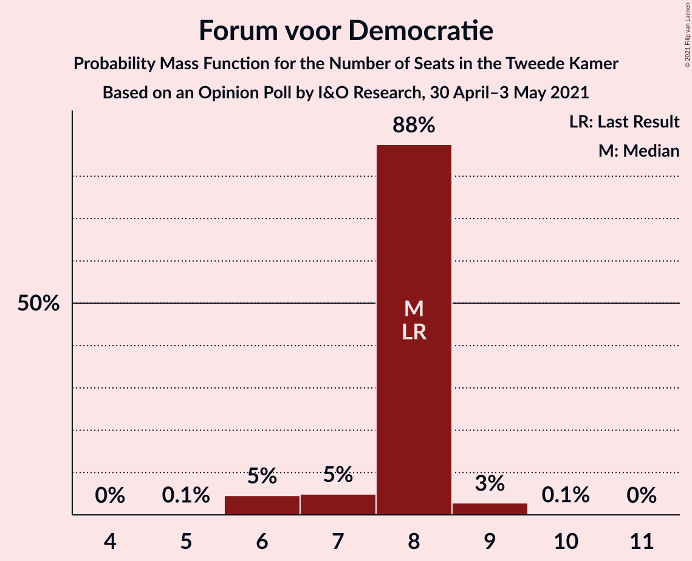
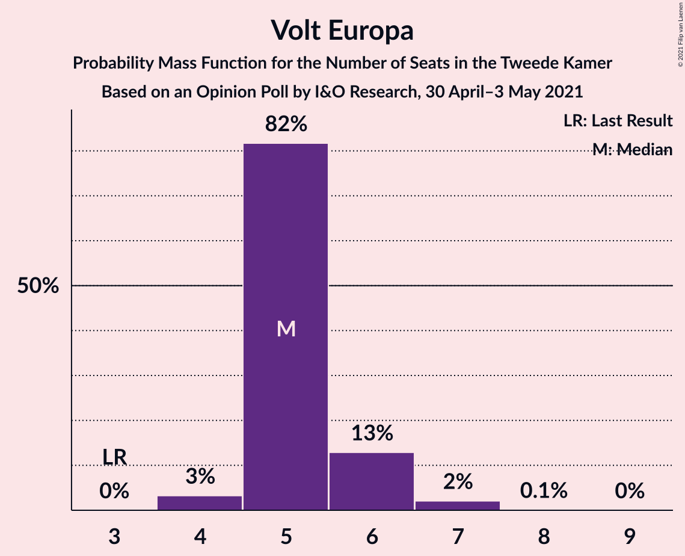
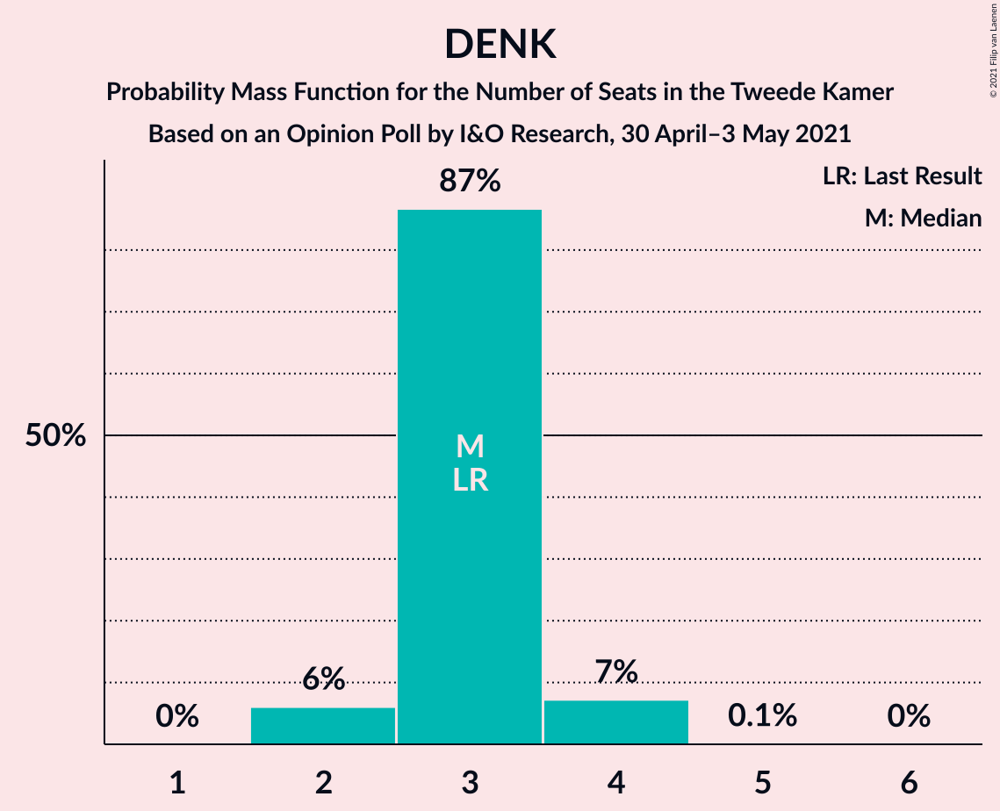
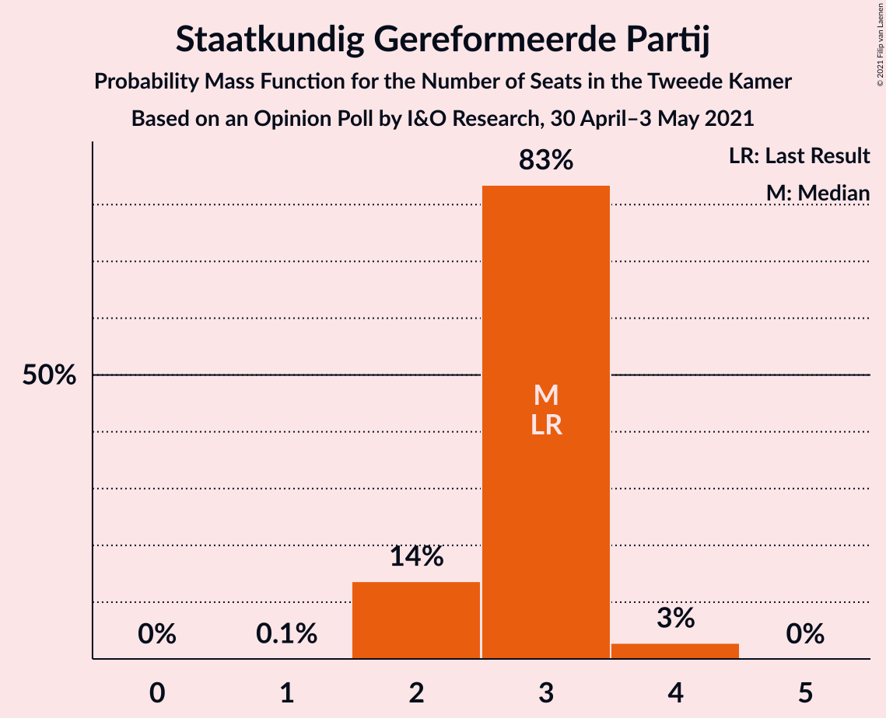
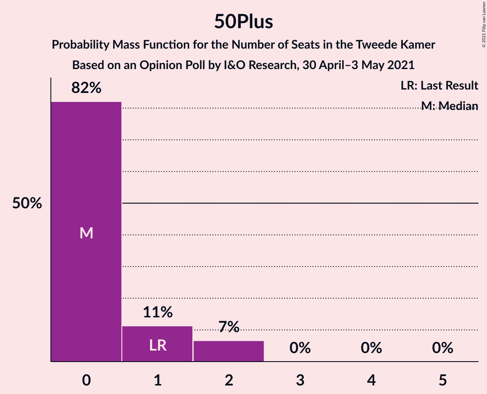
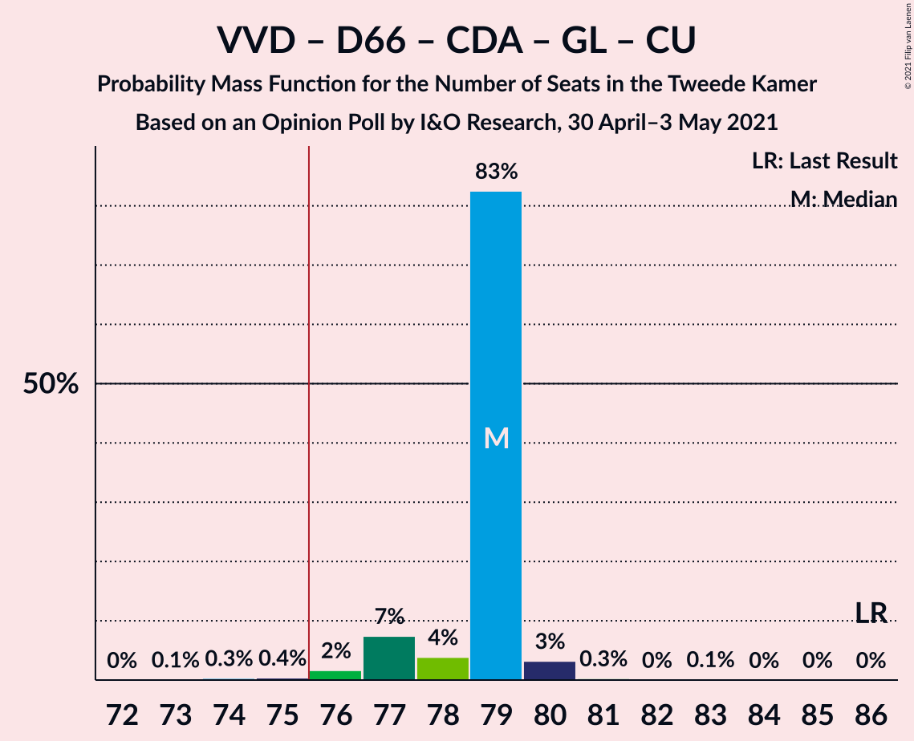
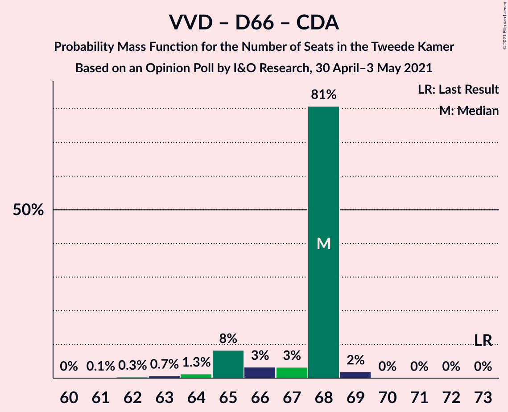
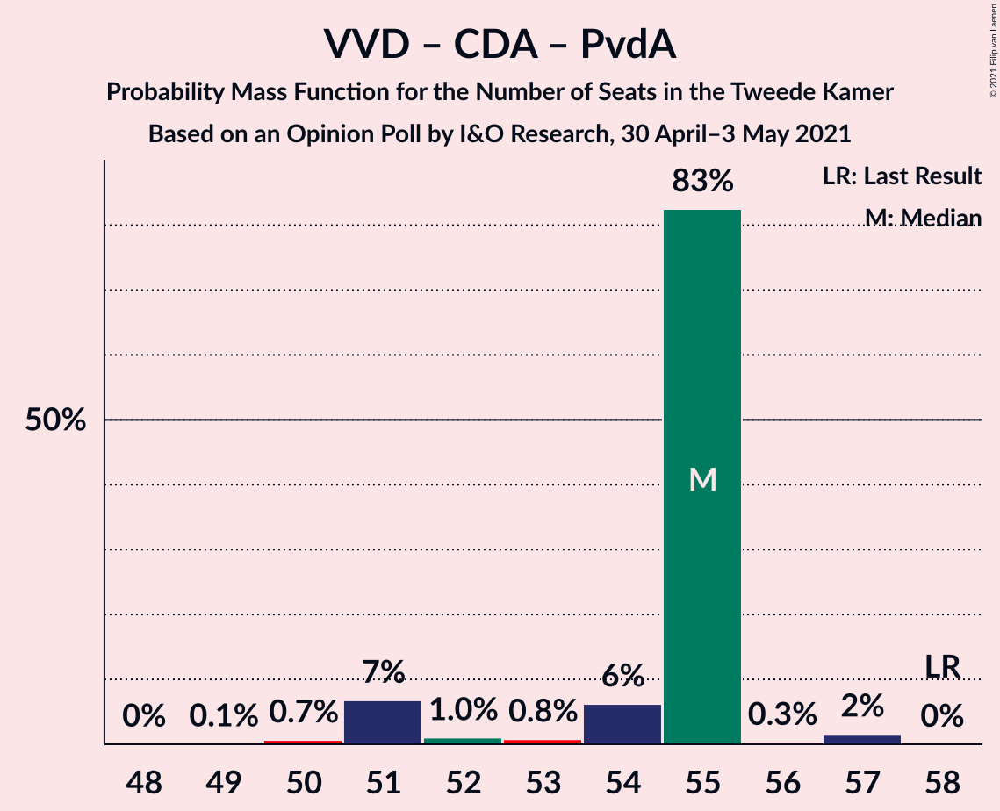

# Opinion Poll by I&O Research, 30 April–3 May 2021

<a href="#voting-intentions">Voting Intentions</a> | <a href="#seats">Seats</a> | <a href="#coalitions">Coalitions</a> | <a href="#technical-information">Technical Information</a>

## Voting Intentions

### Confidence Intervals

| Party | Last Result | Poll Result | 80% Confidence Interval | 90% Confidence Interval | 95% Confidence Interval | 99% Confidence Interval |
|:-----:|:-----------:|:-----------:|:-----------------------:|:-----------------------:|:-----------------------:|:-----------------------:|
| Volkspartij voor Vrijheid en Democratie | 21.9% | 21.6% | 20.4–22.8% |20.1–23.2% |19.8–23.5% |19.2–24.1% |
| Democraten 66 | 15.0% | 14.4% | 13.4–15.5% |13.1–15.8% |12.9–16.0% |12.4–16.6% |
| Partij voor de Vrijheid | 10.8% | 9.9% | 9.1–10.9% |8.9–11.1% |8.7–11.4% |8.3–11.8% |
| Socialistische Partij | 6.0% | 6.5% | 5.9–7.3% |5.7–7.5% |5.5–7.7% |5.2–8.1% |
| Christen-Democratisch Appèl | 9.5% | 6.4% | 5.8–7.2% |5.6–7.4% |5.4–7.6% |5.1–8.0% |
| Partij van de Arbeid | 5.7% | 6.4% | 5.8–7.2% |5.6–7.4% |5.4–7.6% |5.1–8.0% |
| GroenLinks | 5.2% | 5.0% | 4.4–5.7% |4.3–5.9% |4.1–6.1% |3.9–6.4% |
| Forum voor Democratie | 5.0% | 5.0% | 4.4–5.7% |4.3–5.9% |4.1–6.1% |3.9–6.4% |
| Partij voor de Dieren | 3.8% | 4.4% | 3.8–5.1% |3.7–5.2% |3.6–5.4% |3.3–5.7% |
| Volt Europa | 2.4% | 3.9% | 3.4–4.6% |3.3–4.7% |3.1–4.9% |2.9–5.2% |
| Juiste Antwoord 2021 | 2.4% | 3.8% | 3.3–4.5% |3.2–4.6% |3.0–4.8% |2.8–5.1% |
| ChristenUnie | 3.4% | 3.5% | 3.0–4.1% |2.9–4.3% |2.8–4.4% |2.5–4.7% |
| DENK | 2.0% | 2.2% | 1.8–2.7% |1.7–2.8% |1.6–3.0% |1.5–3.2% |
| Staatkundig Gereformeerde Partij | 2.1% | 2.0% | 1.6–2.5% |1.5–2.6% |1.4–2.7% |1.3–3.0% |
| BoerBurgerBeweging | 1.0% | 1.8% | 1.5–2.3% |1.4–2.4% |1.3–2.5% |1.2–2.8% |
| Bij1 | 0.8% | 1.3% | 1.0–1.7% |0.9–1.8% |0.9–1.9% |0.8–2.1% |
| 50Plus | 1.0% | 0.7% | 0.5–1.0% |0.4–1.1% |0.4–1.2% |0.3–1.3% |

*Note:* The poll result column reflects the actual value used in the calculations. Published results may vary slightly, and in addition be rounded to fewer digits.

## Seats

### Confidence Intervals

| Party | Last Result | Median | 80% Confidence Interval | 90% Confidence Interval | 95% Confidence Interval | 99% Confidence Interval |
|:-----:|:-----------:|:------:|:-----------------------:|:-----------------------:|:-----------------------:|:-----------------------:|
| <a href="#volkspartij-voor-vrijheid-en-democratie">Volkspartij voor Vrijheid en Democratie</a> | 34 | 33 | 33–38 |33–38 |33–38 |33–38 |
| <a href="#democraten-66">Democraten 66</a> | 24 | 23 | 21–25 |21–25 |21–25 |21–25 |
| <a href="#partij-voor-de-vrijheid">Partij voor de Vrijheid</a> | 17 | 16 | 15–17 |15–17 |15–17 |15–17 |
| <a href="#socialistische-partij">Socialistische Partij</a> | 9 | 10 | 10 |10 |10 |10 |
| <a href="#christen-democratisch-appèl">Christen-Democratisch Appèl</a> | 15 | 9 | 8–12 |8–12 |8–12 |8–12 |
| <a href="#partij-van-de-arbeid">Partij van de Arbeid</a> | 9 | 9 | 9–12 |9–12 |9–12 |9–12 |
| <a href="#groenlinks">GroenLinks</a> | 8 | 6 | 6–8 |6–8 |6–8 |6–8 |
| <a href="#forum-voor-democratie">Forum voor Democratie</a> | 8 | 7 | 6–9 |6–9 |6–9 |6–9 |
| <a href="#partij-voor-de-dieren">Partij voor de Dieren</a> | 6 | 5 | 5–8 |5–8 |5–8 |5–8 |
| <a href="#volt-europa">Volt Europa</a> | 3 | 6 | 4–6 |4–6 |4–6 |4–6 |
| <a href="#juiste-antwoord-2021">Juiste Antwoord 2021</a> | 3 | 6 | 5–6 |5–6 |5–6 |5–7 |
| <a href="#christenunie">ChristenUnie</a> | 5 | 5 | 4–6 |4–6 |4–6 |4–6 |
| <a href="#denk">DENK</a> | 3 | 2 | 2–3 |2–3 |2–3 |2–3 |
| <a href="#staatkundig-gereformeerde-partij">Staatkundig Gereformeerde Partij</a> | 3 | 2 | 2–3 |2–3 |2–3 |2–3 |
| <a href="#boerburgerbeweging">BoerBurgerBeweging</a> | 1 | 2 | 2–3 |2–3 |2–3 |2–3 |
| <a href="#bij1">Bij1</a> | 1 | 1 | 1–2 |1–2 |1–2 |1–2 |
| <a href="#50plus">50Plus</a> | 1 | 1 | 1 |1 |1 |0–1 |

### Volkspartij voor Vrijheid en Democratie

*For a full overview of the results for this party, see the [Volkspartij voor Vrijheid en Democratie](party-volkspartijvoorvrijheidendemocratie.html) page.*

| Number of Seats | Probability | Accumulated | Special Marks |
|:---------------:|:-----------:|:-----------:|:-------------:|
| 28 | 0.2% | 100% |  |
| 29 | 0% | 99.8% |  |
| 30 | 0% | 99.8% |  |
| 31 | 0% | 99.8% |  |
| 32 | 0.1% | 99.8% |  |
| 33 | 77% | 99.7% | Median |
| 34 | 0.3% | 23% | Last Result |
| 35 | 0% | 22% |  |
| 36 | 0.3% | 22% |  |
| 37 | 0% | 22% |  |
| 38 | 22% | 22% |  |
| 39 | 0% | 0% |  |

### Democraten 66

*For a full overview of the results for this party, see the [Democraten 66](party-democraten66.html) page.*

| Number of Seats | Probability | Accumulated | Special Marks |
|:---------------:|:-----------:|:-----------:|:-------------:|
| 19 | 0.1% | 100% |  |
| 20 | 0% | 99.8% |  |
| 21 | 37% | 99.8% |  |
| 22 | 0.6% | 63% |  |
| 23 | 22% | 62% | Median |
| 24 | 0% | 40% | Last Result |
| 25 | 40% | 40% |  |
| 26 | 0% | 0% |  |

### Partij voor de Vrijheid

*For a full overview of the results for this party, see the [Partij voor de Vrijheid](party-partijvoordevrijheid.html) page.*

| Number of Seats | Probability | Accumulated | Special Marks |
|:---------------:|:-----------:|:-----------:|:-------------:|
| 14 | 0.1% | 100% |  |
| 15 | 40% | 99.9% |  |
| 16 | 23% | 60% | Median |
| 17 | 37% | 37% | Last Result |
| 18 | 0.1% | 0.1% |  |
| 19 | 0% | 0% |  |

### Socialistische Partij

*For a full overview of the results for this party, see the [Socialistische Partij](party-socialistischepartij.html) page.*

| Number of Seats | Probability | Accumulated | Special Marks |
|:---------------:|:-----------:|:-----------:|:-------------:|
| 8 | 0.1% | 100% |  |
| 9 | 0.4% | 99.9% | Last Result |
| 10 | 99.2% | 99.6% | Median |
| 11 | 0.2% | 0.4% |  |
| 12 | 0% | 0.2% |  |
| 13 | 0.2% | 0.2% |  |
| 14 | 0% | 0% |  |

### Christen-Democratisch Appèl

*For a full overview of the results for this party, see the [Christen-Democratisch Appèl](party-christen-democratischappèl.html) page.*

| Number of Seats | Probability | Accumulated | Special Marks |
|:---------------:|:-----------:|:-----------:|:-------------:|
| 7 | 0.3% | 100% |  |
| 8 | 22% | 99.7% |  |
| 9 | 40% | 78% | Median |
| 10 | 0.2% | 37% |  |
| 11 | 0% | 37% |  |
| 12 | 37% | 37% |  |
| 13 | 0% | 0.1% |  |
| 14 | 0% | 0.1% |  |
| 15 | 0.1% | 0.1% | Last Result |
| 16 | 0% | 0% |  |

### Partij van de Arbeid

*For a full overview of the results for this party, see the [Partij van de Arbeid](party-partijvandearbeid.html) page.*

| Number of Seats | Probability | Accumulated | Special Marks |
|:---------------:|:-----------:|:-----------:|:-------------:|
| 8 | 0.2% | 100% |  |
| 9 | 60% | 99.8% | Last Result, Median |
| 10 | 0.1% | 40% |  |
| 11 | 0% | 40% |  |
| 12 | 40% | 40% |  |
| 13 | 0% | 0% |  |

### GroenLinks

*For a full overview of the results for this party, see the [GroenLinks](party-groenlinks.html) page.*

| Number of Seats | Probability | Accumulated | Special Marks |
|:---------------:|:-----------:|:-----------:|:-------------:|
| 5 | 0.2% | 100% |  |
| 6 | 59% | 99.8% | Median |
| 7 | 0.1% | 41% |  |
| 8 | 41% | 41% | Last Result |
| 9 | 0% | 0% |  |

### Forum voor Democratie

*For a full overview of the results for this party, see the [Forum voor Democratie](party-forumvoordemocratie.html) page.*

| Number of Seats | Probability | Accumulated | Special Marks |
|:---------------:|:-----------:|:-----------:|:-------------:|
| 6 | 37% | 100% |  |
| 7 | 40% | 63% | Median |
| 8 | 0.5% | 23% | Last Result |
| 9 | 22% | 22% |  |
| 10 | 0% | 0% |  |

### Partij voor de Dieren

*For a full overview of the results for this party, see the [Partij voor de Dieren](party-partijvoordedieren.html) page.*

| Number of Seats | Probability | Accumulated | Special Marks |
|:---------------:|:-----------:|:-----------:|:-------------:|
| 5 | 62% | 100% | Median |
| 6 | 0.5% | 38% | Last Result |
| 7 | 0.4% | 37% |  |
| 8 | 37% | 37% |  |
| 9 | 0% | 0% |  |

### Volt Europa

*For a full overview of the results for this party, see the [Volt Europa](party-volteuropa.html) page.*

| Number of Seats | Probability | Accumulated | Special Marks |
|:---------------:|:-----------:|:-----------:|:-------------:|
| 3 | 0% | 100% | Last Result |
| 4 | 40% | 100% |  |
| 5 | 0.3% | 60% |  |
| 6 | 59% | 60% | Median |
| 7 | 0.2% | 0.2% |  |
| 8 | 0% | 0% |  |

### Juiste Antwoord 2021

*For a full overview of the results for this party, see the [Juiste Antwoord 2021](party-juisteantwoord2021.html) page.*

| Number of Seats | Probability | Accumulated | Special Marks |
|:---------------:|:-----------:|:-----------:|:-------------:|
| 3 | 0% | 100% | Last Result |
| 4 | 0% | 100% |  |
| 5 | 22% | 100% |  |
| 6 | 77% | 78% | Median |
| 7 | 0.6% | 0.6% |  |
| 8 | 0.1% | 0.1% |  |
| 9 | 0% | 0% |  |

### ChristenUnie

*For a full overview of the results for this party, see the [ChristenUnie](party-christenunie.html) page.*

| Number of Seats | Probability | Accumulated | Special Marks |
|:---------------:|:-----------:|:-----------:|:-------------:|
| 4 | 23% | 100% |  |
| 5 | 40% | 77% | Last Result, Median |
| 6 | 37% | 37% |  |
| 7 | 0% | 0% |  |

### DENK

*For a full overview of the results for this party, see the [DENK](party-denk.html) page.*

| Number of Seats | Probability | Accumulated | Special Marks |
|:---------------:|:-----------:|:-----------:|:-------------:|
| 2 | 59% | 100% | Median |
| 3 | 40% | 41% | Last Result |
| 4 | 0.3% | 0.3% |  |
| 5 | 0% | 0% |  |

### Staatkundig Gereformeerde Partij

*For a full overview of the results for this party, see the [Staatkundig Gereformeerde Partij](party-staatkundiggereformeerdepartij.html) page.*

| Number of Seats | Probability | Accumulated | Special Marks |
|:---------------:|:-----------:|:-----------:|:-------------:|
| 2 | 78% | 100% | Median |
| 3 | 22% | 22% | Last Result |
| 4 | 0% | 0% |  |

### BoerBurgerBeweging

*For a full overview of the results for this party, see the [BoerBurgerBeweging](party-boerburgerbeweging.html) page.*

| Number of Seats | Probability | Accumulated | Special Marks |
|:---------------:|:-----------:|:-----------:|:-------------:|
| 1 | 0% | 100% | Last Result |
| 2 | 62% | 100% | Median |
| 3 | 37% | 38% |  |
| 4 | 0.4% | 0.4% |  |
| 5 | 0% | 0% |  |

### Bij1

*For a full overview of the results for this party, see the [Bij1](party-bij1.html) page.*

| Number of Seats | Probability | Accumulated | Special Marks |
|:---------------:|:-----------:|:-----------:|:-------------:|
| 1 | 59% | 100% | Last Result, Median |
| 2 | 40% | 41% |  |
| 3 | 0.2% | 0.2% |  |
| 4 | 0% | 0% |  |

### 50Plus

*For a full overview of the results for this party, see the [50Plus](party-50plus.html) page.*

| Number of Seats | Probability | Accumulated | Special Marks |
|:---------------:|:-----------:|:-----------:|:-------------:|
| 0 | 0.5% | 100% |  |
| 1 | 99.4% | 99.5% | Last Result, Median |
| 2 | 0% | 0% |  |

## Coalitions

### Confidence Intervals

| Coalition | Last Result | Median | Majority? | 80% Confidence Interval | 90% Confidence Interval | 95% Confidence Interval | 99% Confidence Interval |
|:---------:|:-----------:|:------:|:---------:|:-----------------------:|:-----------------------:|:-----------------------:|:-----------------------:|
| Volkspartij voor Vrijheid en Democratie – Democraten 66 – Christen-Democratisch Appèl – Partij van de Arbeid – ChristenUnie | 87 | 82 | 99.7% | 81–84 | 81–84 | 81–84 | 78–84 |
| Volkspartij voor Vrijheid en Democratie – Democraten 66 – Christen-Democratisch Appèl – GroenLinks – ChristenUnie | 86 | 79 | 99.5% | 78–80 | 78–80 | 78–80 | 76–80 |
| Volkspartij voor Vrijheid en Democratie – Partij voor de Vrijheid – Christen-Democratisch Appèl – Forum voor Democratie – Staatkundig Gereformeerde Partij | 77 | 70 | 0% | 66–74 | 66–74 | 66–74 | 66–74 |
| Volkspartij voor Vrijheid en Democratie – Democraten 66 – Christen-Democratisch Appèl – ChristenUnie | 78 | 72 | 0% | 72–73 | 72–73 | 72–73 | 69–73 |
| Volkspartij voor Vrijheid en Democratie – Partij voor de Vrijheid – Christen-Democratisch Appèl – Forum voor Democratie | 74 | 68 | 0% | 64–71 | 64–71 | 64–71 | 64–71 |
| Volkspartij voor Vrijheid en Democratie – Democraten 66 – Partij van de Arbeid | 67 | 70 | 0% | 63–70 | 63–70 | 63–70 | 63–70 |
| Volkspartij voor Vrijheid en Democratie – Democraten 66 – Christen-Democratisch Appèl | 73 | 67 | 0% | 66–69 | 66–69 | 66–69 | 65–69 |
| Democraten 66 – Socialistische Partij – Christen-Democratisch Appèl – Partij van de Arbeid – GroenLinks – ChristenUnie | 70 | 64 | 0% | 60–69 | 60–69 | 60–69 | 60–69 |
| Volkspartij voor Vrijheid en Democratie – Partij voor de Vrijheid – Christen-Democratisch Appèl | 66 | 62 | 0% | 57–62 | 57–62 | 57–62 | 57–62 |
| Volkspartij voor Vrijheid en Democratie – Christen-Democratisch Appèl – Forum voor Democratie – Staatkundig Gereformeerde Partij – 50Plus | 61 | 54 | 0% | 52–59 | 52–59 | 52–59 | 52–59 |
| Democraten 66 – Christen-Democratisch Appèl – Partij van de Arbeid – GroenLinks – ChristenUnie | 61 | 54 | 0% | 50–59 | 50–59 | 50–59 | 50–59 |
| Volkspartij voor Vrijheid en Democratie – Christen-Democratisch Appèl – Forum voor Democratie – Staatkundig Gereformeerde Partij | 60 | 53 | 0% | 51–58 | 51–58 | 51–58 | 51–58 |
| Volkspartij voor Vrijheid en Democratie – Christen-Democratisch Appèl – Forum voor Democratie – 50Plus | 58 | 52 | 0% | 50–56 | 50–56 | 50–56 | 50–56 |
| Volkspartij voor Vrijheid en Democratie – Christen-Democratisch Appèl – Partij van de Arbeid | 58 | 54 | 0% | 54–55 | 54–55 | 54–55 | 52–55 |
| Volkspartij voor Vrijheid en Democratie – Christen-Democratisch Appèl – Forum voor Democratie | 57 | 51 | 0% | 49–55 | 49–55 | 49–55 | 49–55 |
| Volkspartij voor Vrijheid en Democratie – Partij van de Arbeid | 43 | 45 | 0% | 42–47 | 42–47 | 42–47 | 42–47 |
| Volkspartij voor Vrijheid en Democratie – Christen-Democratisch Appèl | 49 | 45 | 0% | 42–46 | 42–46 | 42–46 | 42–46 |
| Democraten 66 – Christen-Democratisch Appèl – Partij van de Arbeid | 48 | 42 | 0% | 40–46 | 40–46 | 40–46 | 40–46 |
| Democraten 66 – Christen-Democratisch Appèl | 39 | 33 | 0% | 31–34 | 31–34 | 31–34 | 31–34 |
| Christen-Democratisch Appèl – Partij van de Arbeid – ChristenUnie | 29 | 26 | 0% | 21–27 | 21–27 | 21–27 | 21–27 |
| Christen-Democratisch Appèl – Partij van de Arbeid | 24 | 21 | 0% | 17–21 | 17–21 | 17–21 | 17–21 |

### Volkspartij voor Vrijheid en Democratie – Democraten 66 – Christen-Democratisch Appèl – Partij van de Arbeid – ChristenUnie

| Number of Seats | Probability | Accumulated | Special Marks |
|:---------------:|:-----------:|:-----------:|:-------------:|
| 74 | 0.3% | 100% |  |
| 75 | 0% | 99.7% |  |
| 76 | 0% | 99.7% | Majority |
| 77 | 0% | 99.7% |  |
| 78 | 0.3% | 99.6% |  |
| 79 | 0% | 99.4% | Median |
| 80 | 0% | 99.3% |  |
| 81 | 37% | 99.3% |  |
| 82 | 22% | 62% |  |
| 83 | 0.1% | 40% |  |
| 84 | 40% | 40% |  |
| 85 | 0% | 0% |  |
| 86 | 0% | 0% |  |
| 87 | 0% | 0% | Last Result |

### Volkspartij voor Vrijheid en Democratie – Democraten 66 – Christen-Democratisch Appèl – GroenLinks – ChristenUnie

| Number of Seats | Probability | Accumulated | Special Marks |
|:---------------:|:-----------:|:-----------:|:-------------:|
| 73 | 0.1% | 100% |  |
| 74 | 0.2% | 99.9% |  |
| 75 | 0.2% | 99.7% |  |
| 76 | 0% | 99.5% | Median, Majority |
| 77 | 0.3% | 99.5% |  |
| 78 | 37% | 99.2% |  |
| 79 | 22% | 62% |  |
| 80 | 40% | 40% |  |
| 81 | 0.1% | 0.1% |  |
| 82 | 0% | 0% |  |
| 83 | 0% | 0% |  |
| 84 | 0% | 0% |  |
| 85 | 0% | 0% |  |
| 86 | 0% | 0% | Last Result |

### Volkspartij voor Vrijheid en Democratie – Partij voor de Vrijheid – Christen-Democratisch Appèl – Forum voor Democratie – Staatkundig Gereformeerde Partij

| Number of Seats | Probability | Accumulated | Special Marks |
|:---------------:|:-----------:|:-----------:|:-------------:|
| 64 | 0% | 100% |  |
| 65 | 0% | 99.9% |  |
| 66 | 40% | 99.9% |  |
| 67 | 0.2% | 60% | Median |
| 68 | 0% | 60% |  |
| 69 | 0.3% | 60% |  |
| 70 | 37% | 59% |  |
| 71 | 0% | 22% |  |
| 72 | 0.1% | 22% |  |
| 73 | 0% | 22% |  |
| 74 | 22% | 22% |  |
| 75 | 0% | 0% |  |
| 76 | 0% | 0% | Majority |
| 77 | 0% | 0% | Last Result |

### Volkspartij voor Vrijheid en Democratie – Democraten 66 – Christen-Democratisch Appèl – ChristenUnie

| Number of Seats | Probability | Accumulated | Special Marks |
|:---------------:|:-----------:|:-----------:|:-------------:|
| 65 | 0.1% | 100% |  |
| 66 | 0.1% | 99.9% |  |
| 67 | 0% | 99.7% |  |
| 68 | 0% | 99.7% |  |
| 69 | 0.3% | 99.6% |  |
| 70 | 0.2% | 99.3% | Median |
| 71 | 0% | 99.2% |  |
| 72 | 77% | 99.2% |  |
| 73 | 22% | 22% |  |
| 74 | 0% | 0% |  |
| 75 | 0% | 0% |  |
| 76 | 0% | 0% | Majority |
| 77 | 0% | 0% |  |
| 78 | 0% | 0% | Last Result |

### Volkspartij voor Vrijheid en Democratie – Partij voor de Vrijheid – Christen-Democratisch Appèl – Forum voor Democratie

| Number of Seats | Probability | Accumulated | Special Marks |
|:---------------:|:-----------:|:-----------:|:-------------:|
| 62 | 0% | 100% |  |
| 63 | 0% | 99.9% |  |
| 64 | 40% | 99.9% |  |
| 65 | 0% | 60% | Median |
| 66 | 0% | 60% |  |
| 67 | 0.3% | 60% |  |
| 68 | 37% | 59% |  |
| 69 | 0.1% | 22% |  |
| 70 | 0% | 22% |  |
| 71 | 22% | 22% |  |
| 72 | 0% | 0% |  |
| 73 | 0% | 0% |  |
| 74 | 0% | 0% | Last Result |

### Volkspartij voor Vrijheid en Democratie – Democraten 66 – Partij van de Arbeid

| Number of Seats | Probability | Accumulated | Special Marks |
|:---------------:|:-----------:|:-----------:|:-------------:|
| 59 | 0.2% | 100% |  |
| 60 | 0% | 99.8% |  |
| 61 | 0.1% | 99.8% |  |
| 62 | 0% | 99.7% |  |
| 63 | 37% | 99.6% |  |
| 64 | 0% | 63% |  |
| 65 | 0% | 63% | Median |
| 66 | 0% | 63% |  |
| 67 | 0.3% | 63% | Last Result |
| 68 | 0.2% | 62% |  |
| 69 | 0% | 62% |  |
| 70 | 62% | 62% |  |
| 71 | 0% | 0% |  |

### Volkspartij voor Vrijheid en Democratie – Democraten 66 – Christen-Democratisch Appèl

| Number of Seats | Probability | Accumulated | Special Marks |
|:---------------:|:-----------:|:-----------:|:-------------:|
| 60 | 0.2% | 100% |  |
| 61 | 0% | 99.8% |  |
| 62 | 0.2% | 99.8% |  |
| 63 | 0% | 99.7% |  |
| 64 | 0% | 99.6% |  |
| 65 | 0.4% | 99.6% | Median |
| 66 | 37% | 99.2% |  |
| 67 | 40% | 62% |  |
| 68 | 0.1% | 22% |  |
| 69 | 22% | 22% |  |
| 70 | 0% | 0% |  |
| 71 | 0% | 0% |  |
| 72 | 0% | 0% |  |
| 73 | 0% | 0% | Last Result |

### Democraten 66 – Socialistische Partij – Christen-Democratisch Appèl – Partij van de Arbeid – GroenLinks – ChristenUnie

| Number of Seats | Probability | Accumulated | Special Marks |
|:---------------:|:-----------:|:-----------:|:-------------:|
| 59 | 0.4% | 100% |  |
| 60 | 22% | 99.6% |  |
| 61 | 0% | 77% |  |
| 62 | 0% | 77% | Median |
| 63 | 0% | 77% |  |
| 64 | 37% | 77% |  |
| 65 | 0% | 40% |  |
| 66 | 0.2% | 40% |  |
| 67 | 0% | 40% |  |
| 68 | 0.1% | 40% |  |
| 69 | 40% | 40% |  |
| 70 | 0% | 0% | Last Result |

### Volkspartij voor Vrijheid en Democratie – Partij voor de Vrijheid – Christen-Democratisch Appèl

| Number of Seats | Probability | Accumulated | Special Marks |
|:---------------:|:-----------:|:-----------:|:-------------:|
| 54 | 0% | 100% |  |
| 55 | 0% | 99.9% |  |
| 56 | 0.1% | 99.9% |  |
| 57 | 40% | 99.8% |  |
| 58 | 0.2% | 60% | Median |
| 59 | 0.4% | 60% |  |
| 60 | 0% | 59% |  |
| 61 | 0.1% | 59% |  |
| 62 | 59% | 59% |  |
| 63 | 0% | 0% |  |
| 64 | 0% | 0% |  |
| 65 | 0% | 0% |  |
| 66 | 0% | 0% | Last Result |

### Volkspartij voor Vrijheid en Democratie – Christen-Democratisch Appèl – Forum voor Democratie – Staatkundig Gereformeerde Partij – 50Plus

| Number of Seats | Probability | Accumulated | Special Marks |
|:---------------:|:-----------:|:-----------:|:-------------:|
| 49 | 0% | 100% |  |
| 50 | 0.1% | 99.9% |  |
| 51 | 0.2% | 99.8% |  |
| 52 | 40% | 99.6% | Median |
| 53 | 0.3% | 60% |  |
| 54 | 37% | 59% |  |
| 55 | 0.2% | 22% |  |
| 56 | 0% | 22% |  |
| 57 | 0% | 22% |  |
| 58 | 0.1% | 22% |  |
| 59 | 22% | 22% |  |
| 60 | 0% | 0% |  |
| 61 | 0% | 0% | Last Result |

### Democraten 66 – Christen-Democratisch Appèl – Partij van de Arbeid – GroenLinks – ChristenUnie

| Number of Seats | Probability | Accumulated | Special Marks |
|:---------------:|:-----------:|:-----------:|:-------------:|
| 48 | 0.1% | 100% |  |
| 49 | 0% | 99.9% |  |
| 50 | 22% | 99.9% |  |
| 51 | 0% | 77% |  |
| 52 | 0% | 77% | Median |
| 53 | 0.2% | 77% |  |
| 54 | 37% | 77% |  |
| 55 | 0.1% | 40% |  |
| 56 | 0% | 40% |  |
| 57 | 0% | 40% |  |
| 58 | 0% | 40% |  |
| 59 | 40% | 40% |  |
| 60 | 0% | 0% |  |
| 61 | 0% | 0% | Last Result |

### Volkspartij voor Vrijheid en Democratie – Christen-Democratisch Appèl – Forum voor Democratie – Staatkundig Gereformeerde Partij

| Number of Seats | Probability | Accumulated | Special Marks |
|:---------------:|:-----------:|:-----------:|:-------------:|
| 48 | 0% | 100% |  |
| 49 | 0.1% | 99.9% |  |
| 50 | 0% | 99.8% |  |
| 51 | 40% | 99.8% | Median |
| 52 | 0% | 60% |  |
| 53 | 37% | 60% |  |
| 54 | 0.2% | 22% |  |
| 55 | 0% | 22% |  |
| 56 | 0% | 22% |  |
| 57 | 0% | 22% |  |
| 58 | 22% | 22% |  |
| 59 | 0% | 0% |  |
| 60 | 0% | 0% | Last Result |

### Volkspartij voor Vrijheid en Democratie – Christen-Democratisch Appèl – Forum voor Democratie – 50Plus

| Number of Seats | Probability | Accumulated | Special Marks |
|:---------------:|:-----------:|:-----------:|:-------------:|
| 47 | 0.1% | 100% |  |
| 48 | 0% | 99.8% |  |
| 49 | 0.2% | 99.8% |  |
| 50 | 40% | 99.6% | Median |
| 51 | 0.3% | 60% |  |
| 52 | 37% | 59% |  |
| 53 | 0.2% | 22% |  |
| 54 | 0% | 22% |  |
| 55 | 0.1% | 22% |  |
| 56 | 22% | 22% |  |
| 57 | 0% | 0% |  |
| 58 | 0% | 0% | Last Result |

### Volkspartij voor Vrijheid en Democratie – Christen-Democratisch Appèl – Partij van de Arbeid

| Number of Seats | Probability | Accumulated | Special Marks |
|:---------------:|:-----------:|:-----------:|:-------------:|
| 47 | 0.2% | 100% |  |
| 48 | 0% | 99.8% |  |
| 49 | 0% | 99.8% |  |
| 50 | 0% | 99.8% |  |
| 51 | 0.2% | 99.8% | Median |
| 52 | 0.3% | 99.6% |  |
| 53 | 0% | 99.3% |  |
| 54 | 77% | 99.3% |  |
| 55 | 22% | 22% |  |
| 56 | 0% | 0.1% |  |
| 57 | 0.1% | 0.1% |  |
| 58 | 0% | 0% | Last Result |

### Volkspartij voor Vrijheid en Democratie – Christen-Democratisch Appèl – Forum voor Democratie

| Number of Seats | Probability | Accumulated | Special Marks |
|:---------------:|:-----------:|:-----------:|:-------------:|
| 46 | 0.2% | 100% |  |
| 47 | 0% | 99.8% |  |
| 48 | 0% | 99.8% |  |
| 49 | 40% | 99.8% | Median |
| 50 | 0% | 60% |  |
| 51 | 37% | 60% |  |
| 52 | 0.1% | 22% |  |
| 53 | 0% | 22% |  |
| 54 | 0% | 22% |  |
| 55 | 22% | 22% |  |
| 56 | 0% | 0% |  |
| 57 | 0% | 0% | Last Result |

### Volkspartij voor Vrijheid en Democratie – Partij van de Arbeid

| Number of Seats | Probability | Accumulated | Special Marks |
|:---------------:|:-----------:|:-----------:|:-------------:|
| 37 | 0.2% | 100% |  |
| 38 | 0% | 99.8% |  |
| 39 | 0% | 99.8% |  |
| 40 | 0% | 99.8% |  |
| 41 | 0% | 99.8% |  |
| 42 | 37% | 99.8% | Median |
| 43 | 0% | 63% | Last Result |
| 44 | 0% | 63% |  |
| 45 | 40% | 63% |  |
| 46 | 0.2% | 22% |  |
| 47 | 22% | 22% |  |
| 48 | 0% | 0% |  |

### Volkspartij voor Vrijheid en Democratie – Christen-Democratisch Appèl

| Number of Seats | Probability | Accumulated | Special Marks |
|:---------------:|:-----------:|:-----------:|:-------------:|
| 38 | 0.2% | 100% |  |
| 39 | 0% | 99.8% |  |
| 40 | 0% | 99.8% |  |
| 41 | 0% | 99.8% |  |
| 42 | 40% | 99.8% | Median |
| 43 | 0.6% | 60% |  |
| 44 | 0% | 59% |  |
| 45 | 37% | 59% |  |
| 46 | 22% | 22% |  |
| 47 | 0.1% | 0.1% |  |
| 48 | 0% | 0% |  |
| 49 | 0% | 0% | Last Result |

### Democraten 66 – Christen-Democratisch Appèl – Partij van de Arbeid

| Number of Seats | Probability | Accumulated | Special Marks |
|:---------------:|:-----------:|:-----------:|:-------------:|
| 36 | 0.1% | 100% |  |
| 37 | 0% | 99.9% |  |
| 38 | 0.3% | 99.8% |  |
| 39 | 0% | 99.6% |  |
| 40 | 22% | 99.5% |  |
| 41 | 0.2% | 77% | Median |
| 42 | 37% | 77% |  |
| 43 | 0.2% | 40% |  |
| 44 | 0% | 40% |  |
| 45 | 0% | 40% |  |
| 46 | 40% | 40% |  |
| 47 | 0% | 0% |  |
| 48 | 0% | 0% | Last Result |

### Democraten 66 – Christen-Democratisch Appèl

| Number of Seats | Probability | Accumulated | Special Marks |
|:---------------:|:-----------:|:-----------:|:-------------:|
| 28 | 0.1% | 100% |  |
| 29 | 0.3% | 99.8% |  |
| 30 | 0% | 99.6% |  |
| 31 | 22% | 99.5% |  |
| 32 | 0.2% | 77% | Median |
| 33 | 37% | 77% |  |
| 34 | 40% | 40% |  |
| 35 | 0% | 0.1% |  |
| 36 | 0.1% | 0.1% |  |
| 37 | 0% | 0% |  |
| 38 | 0% | 0% |  |
| 39 | 0% | 0% | Last Result |

### Christen-Democratisch Appèl – Partij van de Arbeid – ChristenUnie

| Number of Seats | Probability | Accumulated | Special Marks |
|:---------------:|:-----------:|:-----------:|:-------------:|
| 20 | 0.3% | 100% |  |
| 21 | 22% | 99.7% |  |
| 22 | 0.1% | 77% |  |
| 23 | 0% | 77% | Median |
| 24 | 0.2% | 77% |  |
| 25 | 0% | 77% |  |
| 26 | 40% | 77% |  |
| 27 | 37% | 37% |  |
| 28 | 0% | 0.1% |  |
| 29 | 0% | 0.1% | Last Result |
| 30 | 0.1% | 0.1% |  |
| 31 | 0% | 0% |  |

### Christen-Democratisch Appèl – Partij van de Arbeid

| Number of Seats | Probability | Accumulated | Special Marks |
|:---------------:|:-----------:|:-----------:|:-------------:|
| 16 | 0.3% | 100% |  |
| 17 | 22% | 99.7% |  |
| 18 | 0% | 77% | Median |
| 19 | 0.2% | 77% |  |
| 20 | 0% | 77% |  |
| 21 | 77% | 77% |  |
| 22 | 0% | 0.1% |  |
| 23 | 0% | 0.1% |  |
| 24 | 0% | 0.1% | Last Result |
| 25 | 0.1% | 0.1% |  |
| 26 | 0% | 0% |  |

## Technical Information

### Opinion Poll

+ **Polling firm:** I&O Research
+ **Commissioner(s):** —
+ **Fieldwork period:** 30 April–3 May 2021

### Calculations

+ **Sample size:** 1914
+ **Simulations done:** 131,072
+ **Error estimate:** 2.53%

