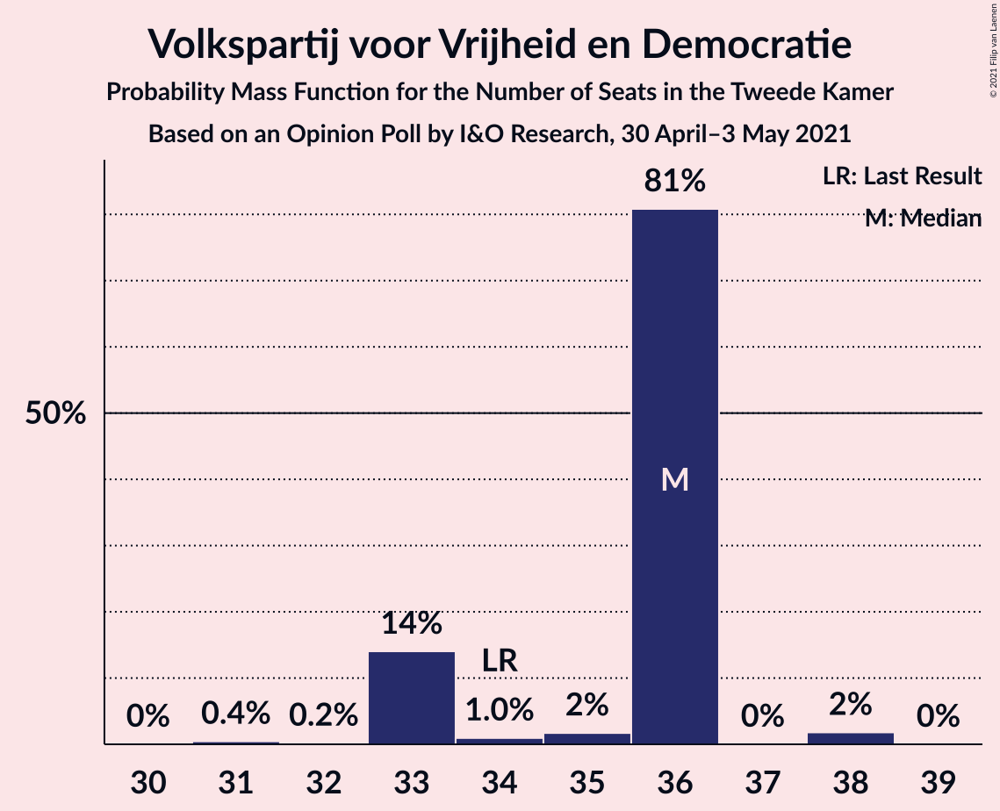
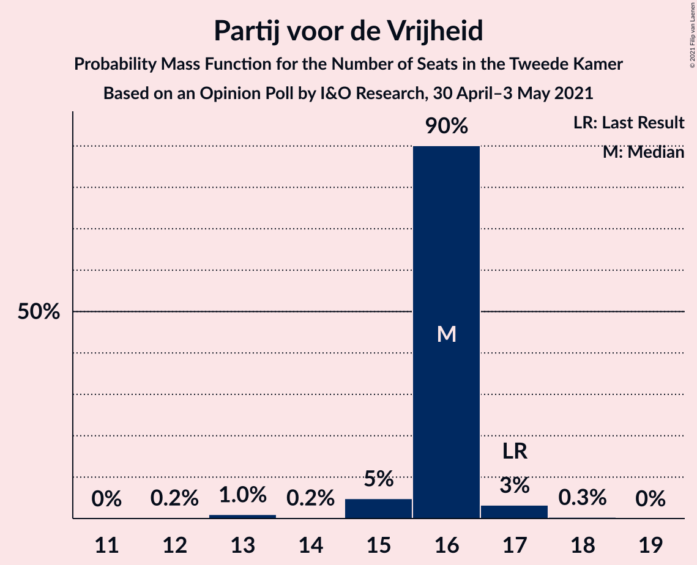
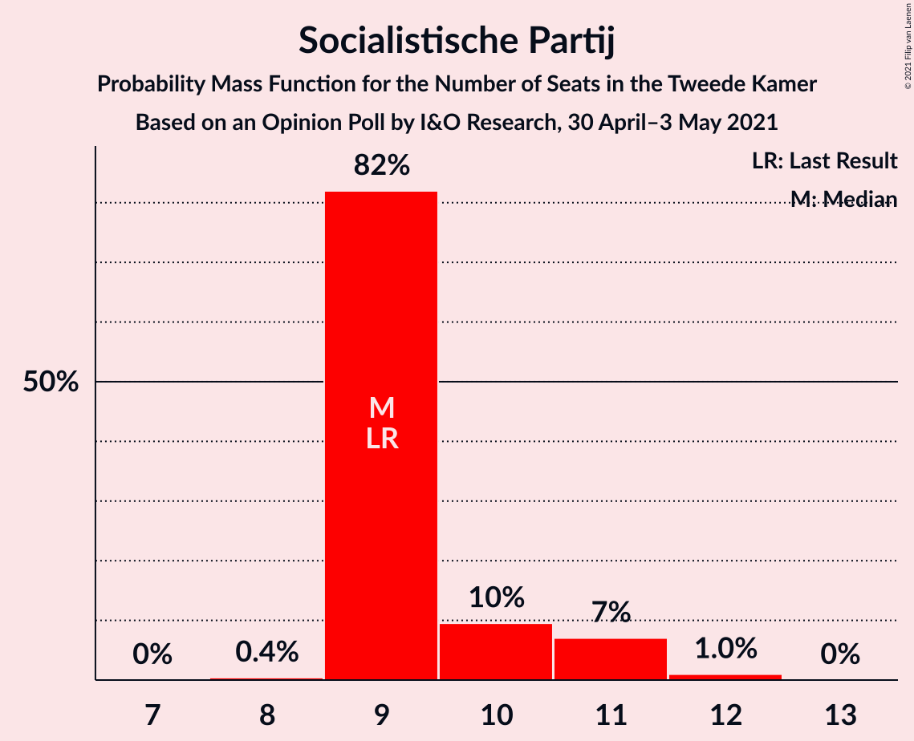
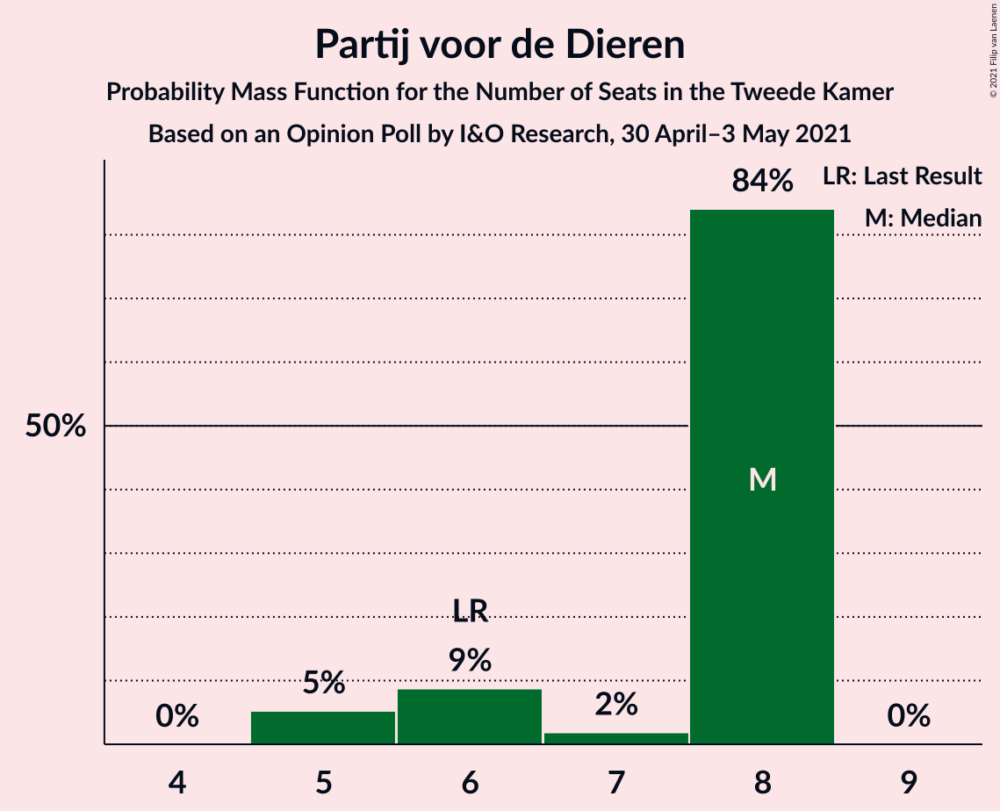
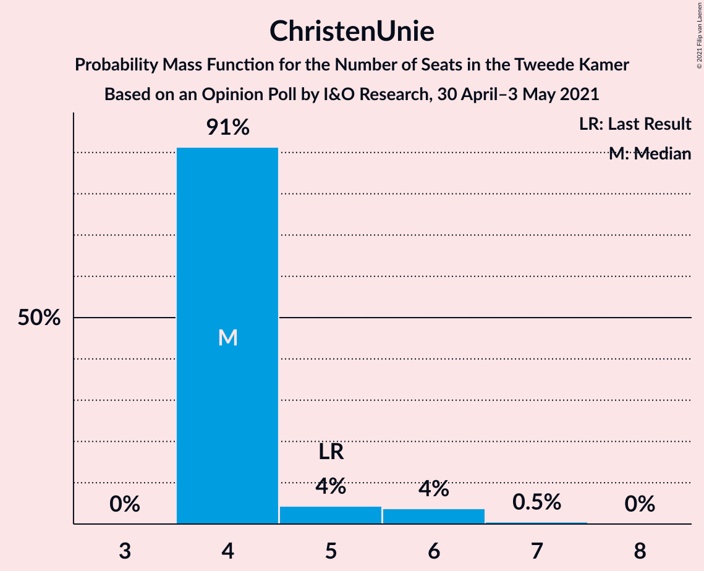
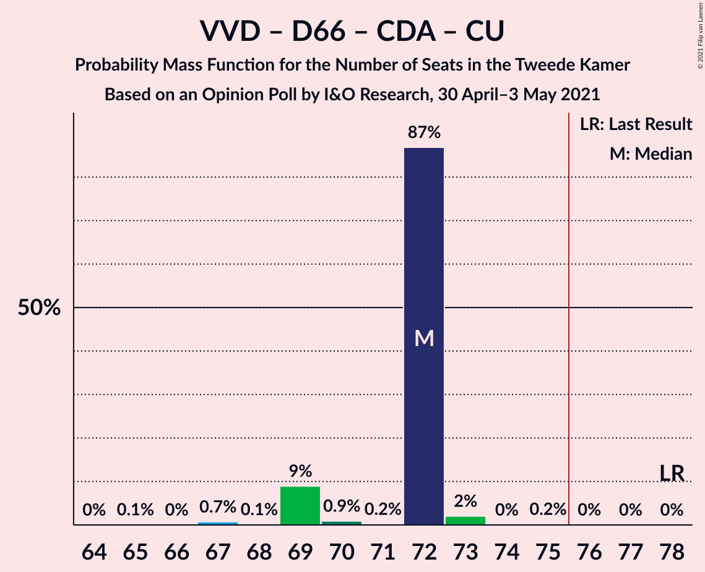
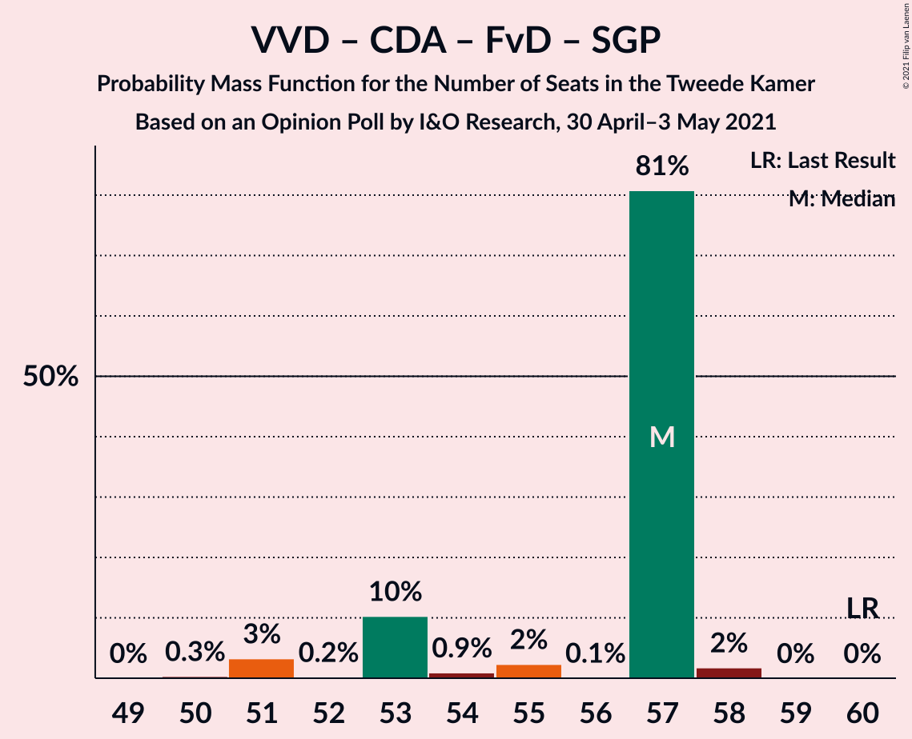
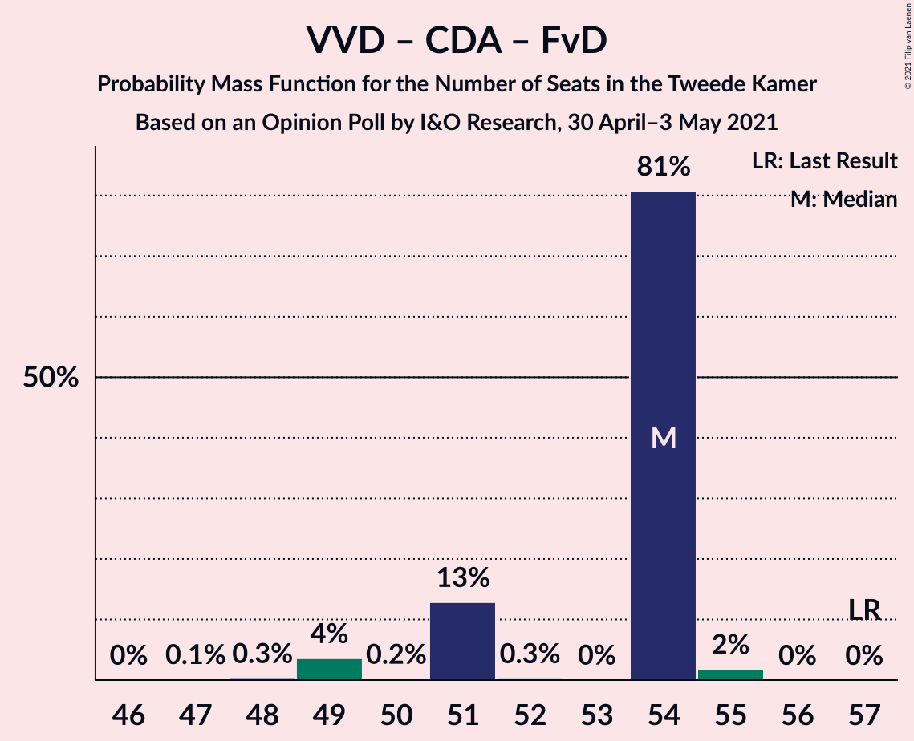

# Opinion Poll by I&O Research, 30 April–3 May 2021

<a href="#voting-intentions">Voting Intentions</a> | <a href="#seats">Seats</a> | <a href="#coalitions">Coalitions</a> | <a href="#technical-information">Technical Information</a>

## Voting Intentions

### Confidence Intervals

| Party | Last Result | Poll Result | 80% Confidence Interval | 90% Confidence Interval | 95% Confidence Interval | 99% Confidence Interval |
|:-----:|:-----------:|:-----------:|:-----------------------:|:-----------------------:|:-----------------------:|:-----------------------:|
| Volkspartij voor Vrijheid en Democratie | 21.9% | 21.6% | 20.4–22.8% |20.1–23.2% |19.8–23.5% |19.2–24.1% |
| Democraten 66 | 15.0% | 14.4% | 13.4–15.5% |13.1–15.8% |12.9–16.0% |12.4–16.6% |
| Partij voor de Vrijheid | 10.8% | 9.9% | 9.1–10.9% |8.9–11.1% |8.7–11.4% |8.3–11.8% |
| Socialistische Partij | 6.0% | 6.5% | 5.9–7.3% |5.7–7.5% |5.5–7.7% |5.2–8.1% |
| Christen-Democratisch Appèl | 9.5% | 6.4% | 5.8–7.2% |5.6–7.4% |5.4–7.6% |5.1–8.0% |
| Partij van de Arbeid | 5.7% | 6.4% | 5.8–7.2% |5.6–7.4% |5.4–7.6% |5.1–8.0% |
| GroenLinks | 5.2% | 5.0% | 4.4–5.7% |4.3–5.9% |4.1–6.1% |3.9–6.4% |
| Forum voor Democratie | 5.0% | 5.0% | 4.4–5.7% |4.3–5.9% |4.1–6.1% |3.9–6.4% |
| Partij voor de Dieren | 3.8% | 4.4% | 3.8–5.1% |3.7–5.2% |3.6–5.4% |3.3–5.7% |
| Volt Europa | 2.4% | 3.9% | 3.4–4.6% |3.3–4.7% |3.1–4.9% |2.9–5.2% |
| Juiste Antwoord 2021 | 2.4% | 3.8% | 3.3–4.5% |3.2–4.6% |3.0–4.8% |2.8–5.1% |
| ChristenUnie | 3.4% | 3.5% | 3.0–4.1% |2.9–4.3% |2.8–4.4% |2.5–4.7% |
| DENK | 2.0% | 2.2% | 1.8–2.7% |1.7–2.8% |1.6–3.0% |1.5–3.2% |
| Staatkundig Gereformeerde Partij | 2.1% | 2.0% | 1.6–2.5% |1.5–2.6% |1.4–2.7% |1.3–3.0% |
| BoerBurgerBeweging | 1.0% | 1.8% | 1.5–2.3% |1.4–2.4% |1.3–2.5% |1.2–2.8% |
| Bij1 | 0.8% | 1.3% | 1.0–1.7% |0.9–1.8% |0.9–1.9% |0.8–2.1% |
| 50Plus | 1.0% | 0.7% | 0.5–1.0% |0.4–1.1% |0.4–1.2% |0.3–1.3% |

*Note:* The poll result column reflects the actual value used in the calculations. Published results may vary slightly, and in addition be rounded to fewer digits.

## Seats

### Confidence Intervals

| Party | Last Result | Median | 80% Confidence Interval | 90% Confidence Interval | 95% Confidence Interval | 99% Confidence Interval |
|:-----:|:-----------:|:------:|:-----------------------:|:-----------------------:|:-----------------------:|:-----------------------:|
| <a href="#volkspartij-voor-vrijheid-en-democratie">Volkspartij voor Vrijheid en Democratie</a> | 34 | 36 | 33–36 |33–36 |33–36 |32–38 |
| <a href="#democraten-66">Democraten 66</a> | 24 | 22 | 22 |21–23 |21–25 |20–25 |
| <a href="#partij-voor-de-vrijheid">Partij voor de Vrijheid</a> | 17 | 16 | 16 |15–16 |15–17 |13–17 |
| <a href="#socialistische-partij">Socialistische Partij</a> | 9 | 9 | 9–10 |9–11 |9–11 |9–12 |
| <a href="#christen-democratisch-appèl">Christen-Democratisch Appèl</a> | 15 | 10 | 10 |9–10 |9–12 |8–12 |
| <a href="#partij-van-de-arbeid">Partij van de Arbeid</a> | 9 | 9 | 9 |8–12 |8–12 |8–12 |
| <a href="#groenlinks">GroenLinks</a> | 8 | 7 | 7–8 |7–8 |6–8 |6–8 |
| <a href="#forum-voor-democratie">Forum voor Democratie</a> | 8 | 8 | 8 |7–8 |6–9 |6–9 |
| <a href="#partij-voor-de-dieren">Partij voor de Dieren</a> | 6 | 8 | 6–8 |5–8 |5–8 |5–8 |
| <a href="#volt-europa">Volt Europa</a> | 3 | 5 | 5–6 |5–6 |4–6 |4–7 |
| <a href="#juiste-antwoord-2021">Juiste Antwoord 2021</a> | 3 | 6 | 6 |6 |5–6 |4–7 |
| <a href="#christenunie">ChristenUnie</a> | 5 | 4 | 4 |4–5 |4–6 |4–7 |
| <a href="#denk">DENK</a> | 3 | 3 | 3 |2–4 |2–4 |2–4 |
| <a href="#staatkundig-gereformeerde-partij">Staatkundig Gereformeerde Partij</a> | 3 | 3 | 2–3 |2–3 |2–4 |2–4 |
| <a href="#boerburgerbeweging">BoerBurgerBeweging</a> | 1 | 2 | 2 |1–2 |1–3 |1–3 |
| <a href="#bij1">Bij1</a> | 1 | 1 | 1–2 |1–2 |1–2 |1–2 |
| <a href="#50plus">50Plus</a> | 1 | 0 | 0–1 |0–2 |0–2 |0–2 |

### Volkspartij voor Vrijheid en Democratie

*For a full overview of the results for this party, see the [Volkspartij voor Vrijheid en Democratie](party-volkspartijvoorvrijheidendemocratie.html) page.*

| Number of Seats | Probability | Accumulated | Special Marks |
|:---------------:|:-----------:|:-----------:|:-------------:|
| 31 | 0.4% | 100% |  |
| 32 | 0.2% | 99.5% |  |
| 33 | 14% | 99.3% |  |
| 34 | 1.0% | 85% | Last Result |
| 35 | 2% | 84% |  |
| 36 | 81% | 83% | Median |
| 37 | 0% | 2% |  |
| 38 | 2% | 2% |  |
| 39 | 0% | 0% |  |

### Democraten 66

*For a full overview of the results for this party, see the [Democraten 66](party-democraten66.html) page.*

| Number of Seats | Probability | Accumulated | Special Marks |
|:---------------:|:-----------:|:-----------:|:-------------:|
| 19 | 0.3% | 100% |  |
| 20 | 2% | 99.7% |  |
| 21 | 3% | 98% |  |
| 22 | 88% | 94% | Median |
| 23 | 2% | 6% |  |
| 24 | 0.2% | 3% | Last Result |
| 25 | 3% | 3% |  |
| 26 | 0% | 0% |  |

### Partij voor de Vrijheid

*For a full overview of the results for this party, see the [Partij voor de Vrijheid](party-partijvoordevrijheid.html) page.*

| Number of Seats | Probability | Accumulated | Special Marks |
|:---------------:|:-----------:|:-----------:|:-------------:|
| 12 | 0.2% | 100% |  |
| 13 | 1.0% | 99.8% |  |
| 14 | 0.2% | 98.8% |  |
| 15 | 5% | 98.6% |  |
| 16 | 90% | 94% | Median |
| 17 | 3% | 4% | Last Result |
| 18 | 0.3% | 0.4% |  |
| 19 | 0% | 0% |  |

### Socialistische Partij

*For a full overview of the results for this party, see the [Socialistische Partij](party-socialistischepartij.html) page.*

| Number of Seats | Probability | Accumulated | Special Marks |
|:---------------:|:-----------:|:-----------:|:-------------:|
| 8 | 0.4% | 100% |  |
| 9 | 82% | 99.6% | Last Result, Median |
| 10 | 10% | 18% |  |
| 11 | 7% | 8% |  |
| 12 | 1.0% | 1.0% |  |
| 13 | 0% | 0% |  |

### Christen-Democratisch Appèl

*For a full overview of the results for this party, see the [Christen-Democratisch Appèl](party-christen-democratischappèl.html) page.*

| Number of Seats | Probability | Accumulated | Special Marks |
|:---------------:|:-----------:|:-----------:|:-------------:|
| 7 | 0.3% | 100% |  |
| 8 | 2% | 99.7% |  |
| 9 | 5% | 98% |  |
| 10 | 90% | 93% | Median |
| 11 | 0.7% | 4% |  |
| 12 | 3% | 3% |  |
| 13 | 0% | 0% |  |
| 14 | 0% | 0% |  |
| 15 | 0% | 0% | Last Result |

### Partij van de Arbeid

*For a full overview of the results for this party, see the [Partij van de Arbeid](party-partijvandearbeid.html) page.*

| Number of Seats | Probability | Accumulated | Special Marks |
|:---------------:|:-----------:|:-----------:|:-------------:|
| 8 | 7% | 100% |  |
| 9 | 86% | 93% | Last Result, Median |
| 10 | 1.2% | 6% |  |
| 11 | 0.2% | 5% |  |
| 12 | 5% | 5% |  |
| 13 | 0% | 0% |  |

### GroenLinks

*For a full overview of the results for this party, see the [GroenLinks](party-groenlinks.html) page.*

| Number of Seats | Probability | Accumulated | Special Marks |
|:---------------:|:-----------:|:-----------:|:-------------:|
| 6 | 5% | 100% |  |
| 7 | 83% | 95% | Median |
| 8 | 12% | 12% | Last Result |
| 9 | 0.2% | 0.2% |  |
| 10 | 0% | 0% |  |

### Forum voor Democratie

*For a full overview of the results for this party, see the [Forum voor Democratie](party-forumvoordemocratie.html) page.*

| Number of Seats | Probability | Accumulated | Special Marks |
|:---------------:|:-----------:|:-----------:|:-------------:|
| 5 | 0.1% | 100% |  |
| 6 | 5% | 99.9% |  |
| 7 | 5% | 95% |  |
| 8 | 88% | 90% | Last Result, Median |
| 9 | 3% | 3% |  |
| 10 | 0.1% | 0.1% |  |
| 11 | 0% | 0% |  |

### Partij voor de Dieren

*For a full overview of the results for this party, see the [Partij voor de Dieren](party-partijvoordedieren.html) page.*

| Number of Seats | Probability | Accumulated | Special Marks |
|:---------------:|:-----------:|:-----------:|:-------------:|
| 5 | 5% | 100% |  |
| 6 | 9% | 95% | Last Result |
| 7 | 2% | 86% |  |
| 8 | 84% | 84% | Median |
| 9 | 0% | 0% |  |

### Volt Europa

*For a full overview of the results for this party, see the [Volt Europa](party-volteuropa.html) page.*

| Number of Seats | Probability | Accumulated | Special Marks |
|:---------------:|:-----------:|:-----------:|:-------------:|
| 3 | 0% | 100% | Last Result |
| 4 | 3% | 100% |  |
| 5 | 82% | 97% | Median |
| 6 | 13% | 15% |  |
| 7 | 2% | 2% |  |
| 8 | 0.1% | 0.1% |  |
| 9 | 0% | 0% |  |

### Juiste Antwoord 2021

*For a full overview of the results for this party, see the [Juiste Antwoord 2021](party-juisteantwoord2021.html) page.*

| Number of Seats | Probability | Accumulated | Special Marks |
|:---------------:|:-----------:|:-----------:|:-------------:|
| 3 | 0% | 100% | Last Result |
| 4 | 2% | 100% |  |
| 5 | 3% | 98% |  |
| 6 | 94% | 95% | Median |
| 7 | 0.9% | 1.0% |  |
| 8 | 0.1% | 0.1% |  |
| 9 | 0% | 0% |  |

### ChristenUnie

*For a full overview of the results for this party, see the [ChristenUnie](party-christenunie.html) page.*

| Number of Seats | Probability | Accumulated | Special Marks |
|:---------------:|:-----------:|:-----------:|:-------------:|
| 4 | 91% | 100% | Median |
| 5 | 4% | 9% | Last Result |
| 6 | 4% | 4% |  |
| 7 | 0.5% | 0.6% |  |
| 8 | 0% | 0% |  |

### DENK

*For a full overview of the results for this party, see the [DENK](party-denk.html) page.*

| Number of Seats | Probability | Accumulated | Special Marks |
|:---------------:|:-----------:|:-----------:|:-------------:|
| 2 | 6% | 100% |  |
| 3 | 87% | 94% | Last Result, Median |
| 4 | 7% | 7% |  |
| 5 | 0.1% | 0.1% |  |
| 6 | 0% | 0% |  |

### Staatkundig Gereformeerde Partij

*For a full overview of the results for this party, see the [Staatkundig Gereformeerde Partij](party-staatkundiggereformeerdepartij.html) page.*

| Number of Seats | Probability | Accumulated | Special Marks |
|:---------------:|:-----------:|:-----------:|:-------------:|
| 1 | 0.1% | 100% |  |
| 2 | 14% | 99.9% |  |
| 3 | 83% | 86% | Last Result, Median |
| 4 | 3% | 3% |  |
| 5 | 0% | 0% |  |

### BoerBurgerBeweging

*For a full overview of the results for this party, see the [BoerBurgerBeweging](party-boerburgerbeweging.html) page.*

| Number of Seats | Probability | Accumulated | Special Marks |
|:---------------:|:-----------:|:-----------:|:-------------:|
| 1 | 7% | 100% | Last Result |
| 2 | 89% | 93% | Median |
| 3 | 4% | 4% |  |
| 4 | 0.2% | 0.2% |  |
| 5 | 0% | 0% |  |

### Bij1

*For a full overview of the results for this party, see the [Bij1](party-bij1.html) page.*

| Number of Seats | Probability | Accumulated | Special Marks |
|:---------------:|:-----------:|:-----------:|:-------------:|
| 1 | 87% | 100% | Last Result, Median |
| 2 | 13% | 13% |  |
| 3 | 0.2% | 0.2% |  |
| 4 | 0% | 0% |  |

### 50Plus

*For a full overview of the results for this party, see the [50Plus](party-50plus.html) page.*

| Number of Seats | Probability | Accumulated | Special Marks |
|:---------------:|:-----------:|:-----------:|:-------------:|
| 0 | 82% | 100% | Median |
| 1 | 11% | 18% | Last Result |
| 2 | 7% | 7% |  |
| 3 | 0% | 0% |  |

## Coalitions

### Confidence Intervals

| Coalition | Last Result | Median | Majority? | 80% Confidence Interval | 90% Confidence Interval | 95% Confidence Interval | 99% Confidence Interval |
|:---------:|:-----------:|:------:|:---------:|:-----------------------:|:-----------------------:|:-----------------------:|:-----------------------:|
| Volkspartij voor Vrijheid en Democratie – Democraten 66 – Christen-Democratisch Appèl – Partij van de Arbeid – ChristenUnie | 87 | 81 | 99.9% | 81 | 77–82 | 77–84 | 77–84 |
| Volkspartij voor Vrijheid en Democratie – Democraten 66 – Christen-Democratisch Appèl – GroenLinks – ChristenUnie | 86 | 79 | 99.2% | 78–79 | 77–79 | 77–80 | 75–80 |
| Volkspartij voor Vrijheid en Democratie – Partij voor de Vrijheid – Christen-Democratisch Appèl – Forum voor Democratie – Staatkundig Gereformeerde Partij | 77 | 73 | 0% | 69–73 | 68–73 | 66–73 | 66–74 |
| Volkspartij voor Vrijheid en Democratie – Democraten 66 – Christen-Democratisch Appèl – ChristenUnie | 78 | 72 | 0% | 70–72 | 69–72 | 69–72 | 67–73 |
| Volkspartij voor Vrijheid en Democratie – Partij voor de Vrijheid – Christen-Democratisch Appèl – Forum voor Democratie | 74 | 70 | 0% | 67–70 | 66–70 | 64–70 | 64–71 |
| Volkspartij voor Vrijheid en Democratie – Democraten 66 – Partij van de Arbeid | 67 | 67 | 0% | 63–67 | 63–68 | 63–70 | 62–70 |
| Democraten 66 – Socialistische Partij – Christen-Democratisch Appèl – Partij van de Arbeid – GroenLinks – ChristenUnie | 70 | 61 | 0% | 61–63 | 61–64 | 61–69 | 60–69 |
| Volkspartij voor Vrijheid en Democratie – Democraten 66 – Christen-Democratisch Appèl | 73 | 68 | 0% | 65–68 | 65–68 | 65–68 | 63–69 |
| Volkspartij voor Vrijheid en Democratie – Partij voor de Vrijheid – Christen-Democratisch Appèl | 66 | 62 | 0% | 59–62 | 58–62 | 57–62 | 55–62 |
| Democraten 66 – Christen-Democratisch Appèl – Partij van de Arbeid – GroenLinks – ChristenUnie | 61 | 52 | 0% | 52–53 | 52–54 | 52–59 | 50–59 |
| Volkspartij voor Vrijheid en Democratie – Christen-Democratisch Appèl – Forum voor Democratie – Staatkundig Gereformeerde Partij – 50Plus | 61 | 57 | 0% | 55–57 | 54–57 | 52–57 | 52–59 |
| Volkspartij voor Vrijheid en Democratie – Christen-Democratisch Appèl – Forum voor Democratie – Staatkundig Gereformeerde Partij | 60 | 57 | 0% | 53–57 | 53–57 | 51–57 | 51–58 |
| Volkspartij voor Vrijheid en Democratie – Christen-Democratisch Appèl – Partij van de Arbeid | 58 | 55 | 0% | 54–55 | 51–55 | 51–55 | 50–57 |
| Volkspartij voor Vrijheid en Democratie – Christen-Democratisch Appèl – Forum voor Democratie – 50Plus | 58 | 54 | 0% | 52–54 | 52–54 | 50–54 | 49–56 |
| Volkspartij voor Vrijheid en Democratie – Christen-Democratisch Appèl – Forum voor Democratie | 57 | 54 | 0% | 51–54 | 51–54 | 49–54 | 49–55 |
| Volkspartij voor Vrijheid en Democratie – Partij van de Arbeid | 43 | 45 | 0% | 42–45 | 41–45 | 41–47 | 41–47 |
| Volkspartij voor Vrijheid en Democratie – Christen-Democratisch Appèl | 49 | 46 | 0% | 43–46 | 43–46 | 42–46 | 40–46 |
| Democraten 66 – Christen-Democratisch Appèl – Partij van de Arbeid | 48 | 41 | 0% | 41 | 40–42 | 40–46 | 37–46 |
| Democraten 66 – Christen-Democratisch Appèl | 39 | 32 | 0% | 32 | 31–33 | 31–34 | 29–34 |
| Christen-Democratisch Appèl – Partij van de Arbeid – ChristenUnie | 29 | 23 | 0% | 23 | 22–26 | 22–27 | 21–27 |
| Christen-Democratisch Appèl – Partij van de Arbeid | 24 | 19 | 0% | 19 | 18–21 | 18–21 | 17–22 |

### Volkspartij voor Vrijheid en Democratie – Democraten 66 – Christen-Democratisch Appèl – Partij van de Arbeid – ChristenUnie

| Number of Seats | Probability | Accumulated | Special Marks |
|:---------------:|:-----------:|:-----------:|:-------------:|
| 75 | 0.1% | 100% |  |
| 76 | 0.3% | 99.9% | Majority |
| 77 | 7% | 99.6% |  |
| 78 | 0.5% | 93% |  |
| 79 | 1.3% | 92% |  |
| 80 | 0.2% | 91% |  |
| 81 | 85% | 91% | Median |
| 82 | 2% | 5% |  |
| 83 | 0.2% | 4% |  |
| 84 | 3% | 3% |  |
| 85 | 0.3% | 0.3% |  |
| 86 | 0% | 0% |  |
| 87 | 0% | 0% | Last Result |

### Volkspartij voor Vrijheid en Democratie – Democraten 66 – Christen-Democratisch Appèl – GroenLinks – ChristenUnie

| Number of Seats | Probability | Accumulated | Special Marks |
|:---------------:|:-----------:|:-----------:|:-------------:|
| 73 | 0.1% | 100% |  |
| 74 | 0.3% | 99.9% |  |
| 75 | 0.4% | 99.6% |  |
| 76 | 2% | 99.2% | Majority |
| 77 | 7% | 98% |  |
| 78 | 4% | 90% |  |
| 79 | 83% | 86% | Median |
| 80 | 3% | 4% |  |
| 81 | 0.3% | 0.5% |  |
| 82 | 0% | 0.2% |  |
| 83 | 0.1% | 0.2% |  |
| 84 | 0% | 0% |  |
| 85 | 0% | 0% |  |
| 86 | 0% | 0% | Last Result |

### Volkspartij voor Vrijheid en Democratie – Partij voor de Vrijheid – Christen-Democratisch Appèl – Forum voor Democratie – Staatkundig Gereformeerde Partij

| Number of Seats | Probability | Accumulated | Special Marks |
|:---------------:|:-----------:|:-----------:|:-------------:|
| 64 | 0% | 100% |  |
| 65 | 0.1% | 99.9% |  |
| 66 | 4% | 99.9% |  |
| 67 | 0.8% | 96% |  |
| 68 | 0.5% | 96% |  |
| 69 | 7% | 95% |  |
| 70 | 5% | 88% |  |
| 71 | 0.9% | 83% |  |
| 72 | 0.1% | 83% |  |
| 73 | 81% | 82% | Median |
| 74 | 2% | 2% |  |
| 75 | 0% | 0% |  |
| 76 | 0% | 0% | Majority |
| 77 | 0% | 0% | Last Result |

### Volkspartij voor Vrijheid en Democratie – Democraten 66 – Christen-Democratisch Appèl – ChristenUnie

| Number of Seats | Probability | Accumulated | Special Marks |
|:---------------:|:-----------:|:-----------:|:-------------:|
| 65 | 0.1% | 100% |  |
| 66 | 0% | 99.9% |  |
| 67 | 0.7% | 99.9% |  |
| 68 | 0.1% | 99.2% |  |
| 69 | 9% | 99.1% |  |
| 70 | 0.9% | 90% |  |
| 71 | 0.2% | 89% |  |
| 72 | 87% | 89% | Median |
| 73 | 2% | 2% |  |
| 74 | 0% | 0.2% |  |
| 75 | 0.2% | 0.2% |  |
| 76 | 0% | 0% | Majority |
| 77 | 0% | 0% |  |
| 78 | 0% | 0% | Last Result |

### Volkspartij voor Vrijheid en Democratie – Partij voor de Vrijheid – Christen-Democratisch Appèl – Forum voor Democratie

| Number of Seats | Probability | Accumulated | Special Marks |
|:---------------:|:-----------:|:-----------:|:-------------:|
| 61 | 0.1% | 100% |  |
| 62 | 0.1% | 99.9% |  |
| 63 | 0% | 99.9% |  |
| 64 | 5% | 99.8% |  |
| 65 | 0.2% | 95% |  |
| 66 | 2% | 95% |  |
| 67 | 8% | 93% |  |
| 68 | 3% | 86% |  |
| 69 | 0.1% | 83% |  |
| 70 | 81% | 82% | Median |
| 71 | 2% | 2% |  |
| 72 | 0% | 0% |  |
| 73 | 0% | 0% |  |
| 74 | 0% | 0% | Last Result |

### Volkspartij voor Vrijheid en Democratie – Democraten 66 – Partij van de Arbeid

| Number of Seats | Probability | Accumulated | Special Marks |
|:---------------:|:-----------:|:-----------:|:-------------:|
| 59 | 0.1% | 100% |  |
| 60 | 0% | 99.9% |  |
| 61 | 0.2% | 99.9% |  |
| 62 | 0.6% | 99.7% |  |
| 63 | 10% | 99.1% |  |
| 64 | 0.8% | 90% |  |
| 65 | 0.9% | 89% |  |
| 66 | 0.1% | 88% |  |
| 67 | 82% | 88% | Last Result, Median |
| 68 | 0.4% | 5% |  |
| 69 | 0% | 5% |  |
| 70 | 5% | 5% |  |
| 71 | 0% | 0% |  |

### Democraten 66 – Socialistische Partij – Christen-Democratisch Appèl – Partij van de Arbeid – GroenLinks – ChristenUnie

| Number of Seats | Probability | Accumulated | Special Marks |
|:---------------:|:-----------:|:-----------:|:-------------:|
| 59 | 0% | 100% |  |
| 60 | 2% | 99.9% |  |
| 61 | 81% | 98% | Median |
| 62 | 0.3% | 17% |  |
| 63 | 9% | 17% |  |
| 64 | 3% | 7% |  |
| 65 | 0.2% | 4% |  |
| 66 | 0.7% | 4% |  |
| 67 | 0.4% | 4% |  |
| 68 | 0% | 3% |  |
| 69 | 3% | 3% |  |
| 70 | 0% | 0% | Last Result |

### Volkspartij voor Vrijheid en Democratie – Democraten 66 – Christen-Democratisch Appèl

| Number of Seats | Probability | Accumulated | Special Marks |
|:---------------:|:-----------:|:-----------:|:-------------:|
| 60 | 0% | 100% |  |
| 61 | 0.1% | 99.9% |  |
| 62 | 0.3% | 99.9% |  |
| 63 | 0.7% | 99.5% |  |
| 64 | 1.3% | 98.8% |  |
| 65 | 8% | 98% |  |
| 66 | 3% | 89% |  |
| 67 | 3% | 86% |  |
| 68 | 81% | 83% | Median |
| 69 | 2% | 2% |  |
| 70 | 0% | 0% |  |
| 71 | 0% | 0% |  |
| 72 | 0% | 0% |  |
| 73 | 0% | 0% | Last Result |

### Volkspartij voor Vrijheid en Democratie – Partij voor de Vrijheid – Christen-Democratisch Appèl

| Number of Seats | Probability | Accumulated | Special Marks |
|:---------------:|:-----------:|:-----------:|:-------------:|
| 54 | 0.1% | 100% |  |
| 55 | 0.8% | 99.9% |  |
| 56 | 0% | 99.1% |  |
| 57 | 4% | 99.1% |  |
| 58 | 0.4% | 95% |  |
| 59 | 7% | 95% |  |
| 60 | 2% | 88% |  |
| 61 | 0.3% | 86% |  |
| 62 | 85% | 85% | Median |
| 63 | 0% | 0% |  |
| 64 | 0% | 0% |  |
| 65 | 0% | 0% |  |
| 66 | 0% | 0% | Last Result |

### Democraten 66 – Christen-Democratisch Appèl – Partij van de Arbeid – GroenLinks – ChristenUnie

| Number of Seats | Probability | Accumulated | Special Marks |
|:---------------:|:-----------:|:-----------:|:-------------:|
| 49 | 0.3% | 100% |  |
| 50 | 2% | 99.7% |  |
| 51 | 0.1% | 98% |  |
| 52 | 88% | 98% | Median |
| 53 | 2% | 10% |  |
| 54 | 4% | 8% |  |
| 55 | 0.1% | 4% |  |
| 56 | 0.2% | 4% |  |
| 57 | 0.1% | 4% |  |
| 58 | 0% | 3% |  |
| 59 | 3% | 3% |  |
| 60 | 0% | 0% |  |
| 61 | 0% | 0% | Last Result |

### Volkspartij voor Vrijheid en Democratie – Christen-Democratisch Appèl – Forum voor Democratie – Staatkundig Gereformeerde Partij – 50Plus

| Number of Seats | Probability | Accumulated | Special Marks |
|:---------------:|:-----------:|:-----------:|:-------------:|
| 51 | 0.4% | 100% |  |
| 52 | 3% | 99.6% |  |
| 53 | 0.5% | 96% |  |
| 54 | 4% | 96% |  |
| 55 | 7% | 92% |  |
| 56 | 2% | 85% |  |
| 57 | 81% | 83% | Median |
| 58 | 0% | 2% |  |
| 59 | 2% | 2% |  |
| 60 | 0% | 0% |  |
| 61 | 0% | 0% | Last Result |

### Volkspartij voor Vrijheid en Democratie – Christen-Democratisch Appèl – Forum voor Democratie – Staatkundig Gereformeerde Partij

| Number of Seats | Probability | Accumulated | Special Marks |
|:---------------:|:-----------:|:-----------:|:-------------:|
| 50 | 0.3% | 100% |  |
| 51 | 3% | 99.6% |  |
| 52 | 0.2% | 96% |  |
| 53 | 10% | 96% |  |
| 54 | 0.9% | 86% |  |
| 55 | 2% | 85% |  |
| 56 | 0.1% | 83% |  |
| 57 | 81% | 83% | Median |
| 58 | 2% | 2% |  |
| 59 | 0% | 0% |  |
| 60 | 0% | 0% | Last Result |

### Volkspartij voor Vrijheid en Democratie – Christen-Democratisch Appèl – Partij van de Arbeid

| Number of Seats | Probability | Accumulated | Special Marks |
|:---------------:|:-----------:|:-----------:|:-------------:|
| 48 | 0% | 100% |  |
| 49 | 0.1% | 99.9% |  |
| 50 | 0.7% | 99.9% |  |
| 51 | 7% | 99.2% |  |
| 52 | 1.0% | 92% |  |
| 53 | 0.8% | 91% |  |
| 54 | 6% | 91% |  |
| 55 | 83% | 84% | Median |
| 56 | 0.3% | 2% |  |
| 57 | 2% | 2% |  |
| 58 | 0% | 0% | Last Result |

### Volkspartij voor Vrijheid en Democratie – Christen-Democratisch Appèl – Forum voor Democratie – 50Plus

| Number of Seats | Probability | Accumulated | Special Marks |
|:---------------:|:-----------:|:-----------:|:-------------:|
| 47 | 0.1% | 100% |  |
| 48 | 0.1% | 99.9% |  |
| 49 | 0.7% | 99.8% |  |
| 50 | 3% | 99.2% |  |
| 51 | 0.8% | 96% |  |
| 52 | 6% | 95% |  |
| 53 | 7% | 89% |  |
| 54 | 81% | 83% | Median |
| 55 | 0% | 2% |  |
| 56 | 2% | 2% |  |
| 57 | 0% | 0% |  |
| 58 | 0% | 0% | Last Result |

### Volkspartij voor Vrijheid en Democratie – Christen-Democratisch Appèl – Forum voor Democratie

| Number of Seats | Probability | Accumulated | Special Marks |
|:---------------:|:-----------:|:-----------:|:-------------:|
| 47 | 0.1% | 100% |  |
| 48 | 0.3% | 99.8% |  |
| 49 | 4% | 99.5% |  |
| 50 | 0.2% | 96% |  |
| 51 | 13% | 96% |  |
| 52 | 0.3% | 83% |  |
| 53 | 0% | 83% |  |
| 54 | 81% | 83% | Median |
| 55 | 2% | 2% |  |
| 56 | 0% | 0% |  |
| 57 | 0% | 0% | Last Result |

### Volkspartij voor Vrijheid en Democratie – Partij van de Arbeid

| Number of Seats | Probability | Accumulated | Special Marks |
|:---------------:|:-----------:|:-----------:|:-------------:|
| 39 | 0% | 100% |  |
| 40 | 0% | 99.9% |  |
| 41 | 7% | 99.9% |  |
| 42 | 4% | 93% |  |
| 43 | 1.1% | 89% | Last Result |
| 44 | 0.1% | 88% |  |
| 45 | 84% | 88% | Median |
| 46 | 0.4% | 4% |  |
| 47 | 3% | 3% |  |
| 48 | 0% | 0% |  |

### Volkspartij voor Vrijheid en Democratie – Christen-Democratisch Appèl

| Number of Seats | Probability | Accumulated | Special Marks |
|:---------------:|:-----------:|:-----------:|:-------------:|
| 39 | 0.1% | 100% |  |
| 40 | 0.4% | 99.9% |  |
| 41 | 0.3% | 99.5% |  |
| 42 | 4% | 99.2% |  |
| 43 | 7% | 95% |  |
| 44 | 1.1% | 88% |  |
| 45 | 5% | 87% |  |
| 46 | 82% | 83% | Median |
| 47 | 0.1% | 0.1% |  |
| 48 | 0% | 0% |  |
| 49 | 0% | 0% | Last Result |

### Democraten 66 – Christen-Democratisch Appèl – Partij van de Arbeid

| Number of Seats | Probability | Accumulated | Special Marks |
|:---------------:|:-----------:|:-----------:|:-------------:|
| 37 | 0.5% | 100% |  |
| 38 | 0.2% | 99.4% |  |
| 39 | 0% | 99.3% |  |
| 40 | 9% | 99.2% |  |
| 41 | 82% | 90% | Median |
| 42 | 5% | 9% |  |
| 43 | 0% | 4% |  |
| 44 | 0.3% | 4% |  |
| 45 | 0.1% | 3% |  |
| 46 | 3% | 3% |  |
| 47 | 0% | 0% |  |
| 48 | 0% | 0% | Last Result |

### Democraten 66 – Christen-Democratisch Appèl

| Number of Seats | Probability | Accumulated | Special Marks |
|:---------------:|:-----------:|:-----------:|:-------------:|
| 28 | 0.3% | 100% |  |
| 29 | 0.4% | 99.7% |  |
| 30 | 2% | 99.3% |  |
| 31 | 3% | 98% |  |
| 32 | 88% | 94% | Median |
| 33 | 3% | 7% |  |
| 34 | 3% | 3% |  |
| 35 | 0% | 0.1% |  |
| 36 | 0.1% | 0.1% |  |
| 37 | 0% | 0% |  |
| 38 | 0% | 0% |  |
| 39 | 0% | 0% | Last Result |

### Christen-Democratisch Appèl – Partij van de Arbeid – ChristenUnie

| Number of Seats | Probability | Accumulated | Special Marks |
|:---------------:|:-----------:|:-----------:|:-------------:|
| 21 | 2% | 100% |  |
| 22 | 7% | 98% |  |
| 23 | 81% | 91% | Median |
| 24 | 1.0% | 10% |  |
| 25 | 0.4% | 9% |  |
| 26 | 5% | 9% |  |
| 27 | 3% | 3% |  |
| 28 | 0% | 0.3% |  |
| 29 | 0.3% | 0.3% | Last Result |
| 30 | 0% | 0% |  |

### Christen-Democratisch Appèl – Partij van de Arbeid

| Number of Seats | Probability | Accumulated | Special Marks |
|:---------------:|:-----------:|:-----------:|:-------------:|
| 16 | 0.3% | 100% |  |
| 17 | 2% | 99.7% |  |
| 18 | 7% | 98% |  |
| 19 | 82% | 91% | Median |
| 20 | 0.8% | 9% |  |
| 21 | 6% | 8% |  |
| 22 | 2% | 2% |  |
| 23 | 0.1% | 0.1% |  |
| 24 | 0% | 0% | Last Result |

## Technical Information

### Opinion Poll

+ **Polling firm:** I&O Research
+ **Commissioner(s):** —
+ **Fieldwork period:** 30 April–3 May 2021

### Calculations

+ **Sample size:** 1914
+ **Simulations done:** 1,048,576
+ **Error estimate:** 1.60%

