# Opinion Poll by Peil.nl, 7–9 May 2021

<a href="#voting-intentions">Voting Intentions</a> | <a href="#seats">Seats</a> | <a href="#coalitions">Coalitions</a> | <a href="#technical-information">Technical Information</a>

## Voting Intentions

### Confidence Intervals

| Party | Last Result | Poll Result | 80% Confidence Interval | 90% Confidence Interval | 95% Confidence Interval | 99% Confidence Interval |
|:-----:|:-----------:|:-----------:|:-----------------------:|:-----------------------:|:-----------------------:|:-----------------------:|
| Volkspartij voor Vrijheid en Democratie | 21.9% | 22.6% | 21.6–23.6% |21.4–23.9% |21.1–24.1% |20.7–24.6% |
| Democraten 66 | 15.0% | 15.3% | 14.4–16.1% |14.2–16.4% |14.0–16.6% |13.6–17.0% |
| Partij voor de Vrijheid | 10.8% | 11.3% | 10.6–12.1% |10.4–12.3% |10.2–12.5% |9.9–12.9% |
| Christen-Democratisch Appèl | 9.5% | 7.3% | 6.7–8.0% |6.6–8.1% |6.4–8.3% |6.1–8.6% |
| Socialistische Partij | 6.0% | 6.0% | 5.4–6.6% |5.3–6.7% |5.2–6.9% |4.9–7.2% |
| Partij van de Arbeid | 5.7% | 6.0% | 5.4–6.6% |5.3–6.7% |5.2–6.9% |4.9–7.2% |
| Forum voor Democratie | 5.0% | 5.3% | 4.8–5.9% |4.7–6.0% |4.5–6.2% |4.3–6.4% |
| GroenLinks | 5.2% | 4.7% | 4.2–5.2% |4.1–5.3% |4.0–5.5% |3.7–5.8% |
| Partij voor de Dieren | 3.8% | 4.7% | 4.2–5.2% |4.1–5.3% |4.0–5.5% |3.7–5.8% |
| Juiste Antwoord 2021 | 2.4% | 4.0% | 3.6–4.5% |3.4–4.6% |3.4–4.8% |3.2–5.0% |
| ChristenUnie | 3.4% | 3.3% | 2.9–3.8% |2.8–3.9% |2.7–4.0% |2.6–4.3% |
| Volt Europa | 2.4% | 3.3% | 2.9–3.8% |2.8–3.9% |2.7–4.0% |2.6–4.3% |
| Staatkundig Gereformeerde Partij | 2.1% | 2.0% | 1.7–2.4% |1.6–2.5% |1.6–2.6% |1.4–2.8% |
| DENK | 2.0% | 2.0% | 1.7–2.4% |1.6–2.5% |1.6–2.6% |1.4–2.8% |
| BoerBurgerBeweging | 1.0% | 1.3% | 1.1–1.6% |1.0–1.7% |1.0–1.8% |0.9–2.0% |
| Bij1 | 0.8% | 0.7% | 0.5–0.9% |0.5–1.0% |0.4–1.0% |0.4–1.2% |
| 50Plus | 1.0% | 0.2% | 0.1–0.3% |0.1–0.4% |0.1–0.4% |0.0–0.5% |

*Note:* The poll result column reflects the actual value used in the calculations. Published results may vary slightly, and in addition be rounded to fewer digits.

## Seats

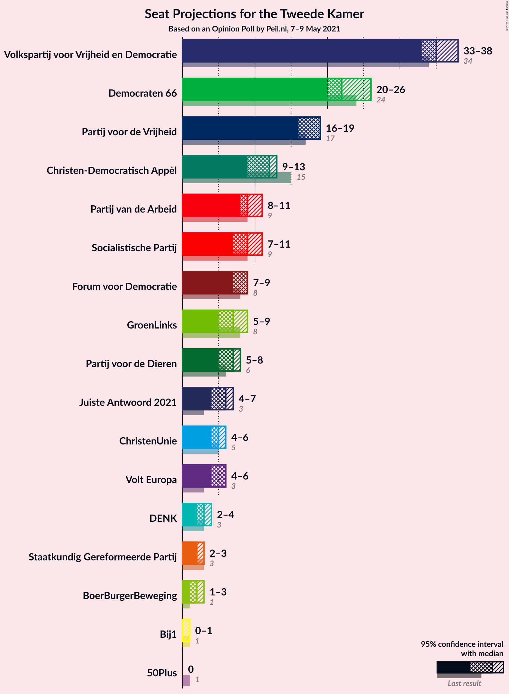

### Confidence Intervals

| Party | Last Result | Median | 80% Confidence Interval | 90% Confidence Interval | 95% Confidence Interval | 99% Confidence Interval |
|:-----:|:-----------:|:------:|:-----------------------:|:-----------------------:|:-----------------------:|:-----------------------:|
| <a href="#volkspartij-voor-vrijheid-en-democratie">Volkspartij voor Vrijheid en Democratie</a> | 34 | 36 | 33–36 |33–38 |32–39 |32–39 |
| <a href="#democraten-66">Democraten 66</a> | 24 | 22 | 21–24 |21–25 |21–26 |21–26 |
| <a href="#partij-voor-de-vrijheid">Partij voor de Vrijheid</a> | 17 | 16 | 16–19 |16–19 |15–20 |15–20 |
| <a href="#christen-democratisch-appèl">Christen-Democratisch Appèl</a> | 15 | 10 | 10–12 |10–13 |10–13 |9–14 |
| <a href="#socialistische-partij">Socialistische Partij</a> | 9 | 10 | 9–10 |8–10 |7–10 |7–10 |
| <a href="#partij-van-de-arbeid">Partij van de Arbeid</a> | 9 | 9 | 8–11 |8–11 |8–11 |7–11 |
| <a href="#forum-voor-democratie">Forum voor Democratie</a> | 8 | 8 | 7–9 |7–9 |7–10 |7–10 |
| <a href="#groenlinks">GroenLinks</a> | 8 | 7 | 7–8 |6–8 |6–8 |5–9 |
| <a href="#partij-voor-de-dieren">Partij voor de Dieren</a> | 6 | 8 | 5–8 |5–8 |5–8 |5–9 |
| <a href="#juiste-antwoord-2021">Juiste Antwoord 2021</a> | 3 | 5 | 5–6 |5–6 |5–6 |4–7 |
| <a href="#christenunie">ChristenUnie</a> | 5 | 4 | 4–5 |4–6 |4–6 |4–6 |
| <a href="#volt-europa">Volt Europa</a> | 3 | 5 | 5–6 |5–6 |4–6 |3–6 |
| <a href="#staatkundig-gereformeerde-partij">Staatkundig Gereformeerde Partij</a> | 3 | 3 | 2–4 |2–4 |2–4 |2–4 |
| <a href="#denk">DENK</a> | 3 | 4 | 3–4 |2–4 |2–4 |2–4 |
| <a href="#boerburgerbeweging">BoerBurgerBeweging</a> | 1 | 1 | 1–2 |1–3 |1–3 |1–3 |
| <a href="#bij1">Bij1</a> | 1 | 1 | 0–1 |0–1 |0–1 |0–2 |
| <a href="#50plus">50Plus</a> | 1 | 0 | 0 |0 |0 |0 |

### Volkspartij voor Vrijheid en Democratie

*For a full overview of the results for this party, see the [Volkspartij voor Vrijheid en Democratie](party-volkspartijvoorvrijheidendemocratie.html) page.*

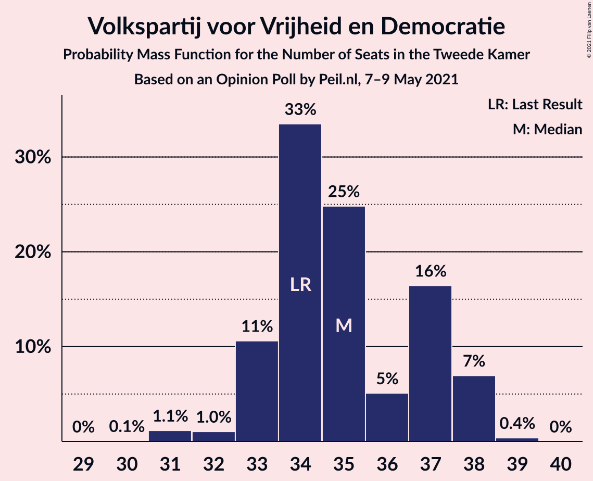

| Number of Seats | Probability | Accumulated | Special Marks |
|:---------------:|:-----------:|:-----------:|:-------------:|
| 32 | 5% | 100% |  |
| 33 | 29% | 95% |  |
| 34 | 6% | 66% | Last Result |
| 35 | 4% | 60% |  |
| 36 | 51% | 56% | Median |
| 37 | 0% | 5% |  |
| 38 | 0.1% | 5% |  |
| 39 | 5% | 5% |  |
| 40 | 0% | 0% |  |

### Democraten 66

*For a full overview of the results for this party, see the [Democraten 66](party-democraten66.html) page.*

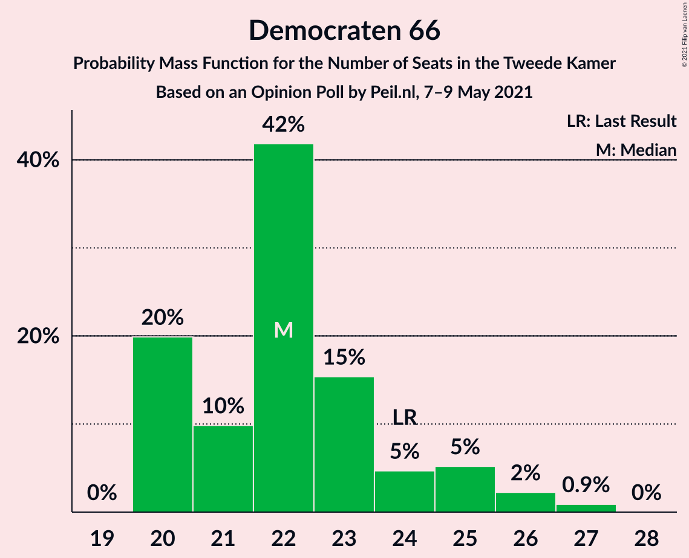

| Number of Seats | Probability | Accumulated | Special Marks |
|:---------------:|:-----------:|:-----------:|:-------------:|
| 20 | 0.1% | 100% |  |
| 21 | 26% | 99.9% |  |
| 22 | 34% | 74% | Median |
| 23 | 7% | 40% |  |
| 24 | 28% | 33% | Last Result |
| 25 | 1.1% | 6% |  |
| 26 | 4% | 4% |  |
| 27 | 0% | 0% |  |

### Partij voor de Vrijheid

*For a full overview of the results for this party, see the [Partij voor de Vrijheid](party-partijvoordevrijheid.html) page.*

| Number of Seats | Probability | Accumulated | Special Marks |
|:---------------:|:-----------:|:-----------:|:-------------:|
| 15 | 4% | 100% |  |
| 16 | 52% | 96% | Median |
| 17 | 12% | 44% | Last Result |
| 18 | 4% | 33% |  |
| 19 | 26% | 29% |  |
| 20 | 3% | 3% |  |
| 21 | 0% | 0% |  |

### Christen-Democratisch Appèl

*For a full overview of the results for this party, see the [Christen-Democratisch Appèl](party-christen-democratischappèl.html) page.*

| Number of Seats | Probability | Accumulated | Special Marks |
|:---------------:|:-----------:|:-----------:|:-------------:|
| 8 | 0.3% | 100% |  |
| 9 | 2% | 99.7% |  |
| 10 | 54% | 98% | Median |
| 11 | 33% | 44% |  |
| 12 | 6% | 11% |  |
| 13 | 4% | 6% |  |
| 14 | 2% | 2% |  |
| 15 | 0% | 0% | Last Result |

### Socialistische Partij

*For a full overview of the results for this party, see the [Socialistische Partij](party-socialistischepartij.html) page.*

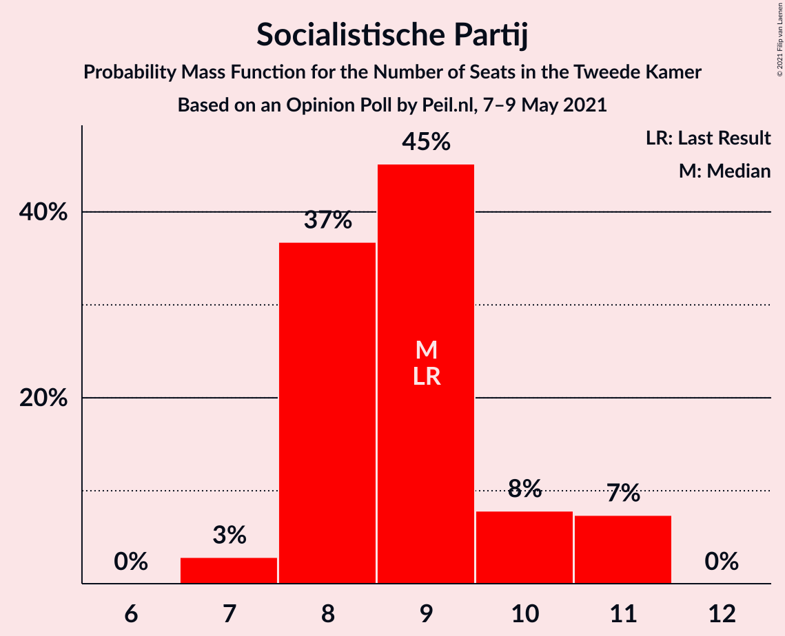

| Number of Seats | Probability | Accumulated | Special Marks |
|:---------------:|:-----------:|:-----------:|:-------------:|
| 7 | 3% | 100% |  |
| 8 | 5% | 97% |  |
| 9 | 31% | 91% | Last Result |
| 10 | 60% | 61% | Median |
| 11 | 0.3% | 0.3% |  |
| 12 | 0% | 0% |  |

### Partij van de Arbeid

*For a full overview of the results for this party, see the [Partij van de Arbeid](party-partijvandearbeid.html) page.*

| Number of Seats | Probability | Accumulated | Special Marks |
|:---------------:|:-----------:|:-----------:|:-------------:|
| 7 | 2% | 100% |  |
| 8 | 11% | 98% |  |
| 9 | 38% | 87% | Last Result, Median |
| 10 | 27% | 49% |  |
| 11 | 22% | 22% |  |
| 12 | 0% | 0% |  |

### Forum voor Democratie

*For a full overview of the results for this party, see the [Forum voor Democratie](party-forumvoordemocratie.html) page.*

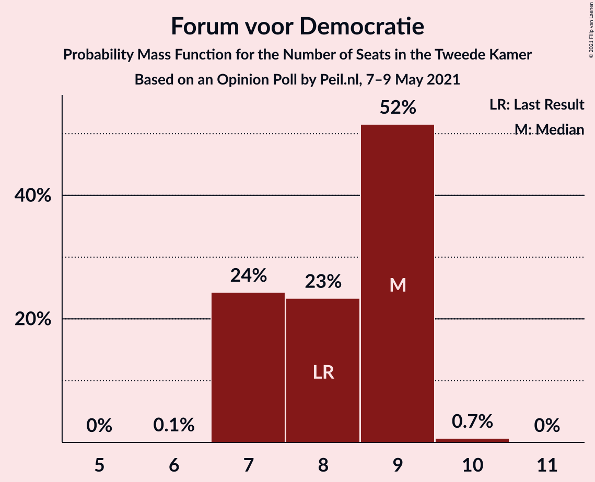

| Number of Seats | Probability | Accumulated | Special Marks |
|:---------------:|:-----------:|:-----------:|:-------------:|
| 7 | 24% | 100% |  |
| 8 | 57% | 76% | Last Result, Median |
| 9 | 16% | 19% |  |
| 10 | 3% | 3% |  |
| 11 | 0.1% | 0.1% |  |
| 12 | 0% | 0% |  |

### GroenLinks

*For a full overview of the results for this party, see the [GroenLinks](party-groenlinks.html) page.*

| Number of Seats | Probability | Accumulated | Special Marks |
|:---------------:|:-----------:|:-----------:|:-------------:|
| 5 | 1.5% | 100% |  |
| 6 | 5% | 98.5% |  |
| 7 | 66% | 93% | Median |
| 8 | 25% | 27% | Last Result |
| 9 | 1.5% | 1.5% |  |
| 10 | 0% | 0% |  |

### Partij voor de Dieren

*For a full overview of the results for this party, see the [Partij voor de Dieren](party-partijvoordedieren.html) page.*

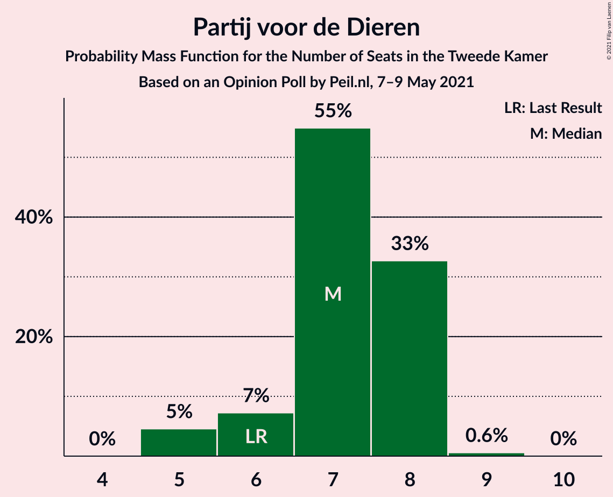

| Number of Seats | Probability | Accumulated | Special Marks |
|:---------------:|:-----------:|:-----------:|:-------------:|
| 5 | 25% | 100% |  |
| 6 | 9% | 75% | Last Result |
| 7 | 9% | 65% |  |
| 8 | 56% | 57% | Median |
| 9 | 0.1% | 0.6% |  |
| 10 | 0.5% | 0.5% |  |
| 11 | 0% | 0% |  |

### Juiste Antwoord 2021

*For a full overview of the results for this party, see the [Juiste Antwoord 2021](party-juisteantwoord2021.html) page.*

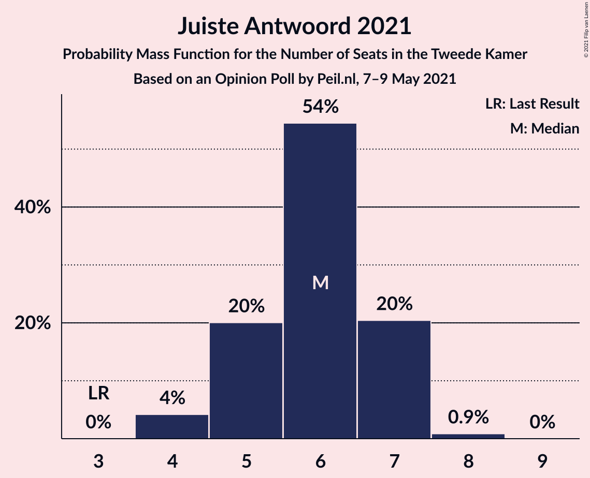

| Number of Seats | Probability | Accumulated | Special Marks |
|:---------------:|:-----------:|:-----------:|:-------------:|
| 3 | 0% | 100% | Last Result |
| 4 | 0.5% | 100% |  |
| 5 | 51% | 99.5% | Median |
| 6 | 47% | 49% |  |
| 7 | 2% | 2% |  |
| 8 | 0% | 0% |  |

### ChristenUnie

*For a full overview of the results for this party, see the [ChristenUnie](party-christenunie.html) page.*

| Number of Seats | Probability | Accumulated | Special Marks |
|:---------------:|:-----------:|:-----------:|:-------------:|
| 4 | 63% | 100% | Median |
| 5 | 31% | 37% | Last Result |
| 6 | 6% | 6% |  |
| 7 | 0.4% | 0.4% |  |
| 8 | 0% | 0% |  |

### Volt Europa

*For a full overview of the results for this party, see the [Volt Europa](party-volteuropa.html) page.*

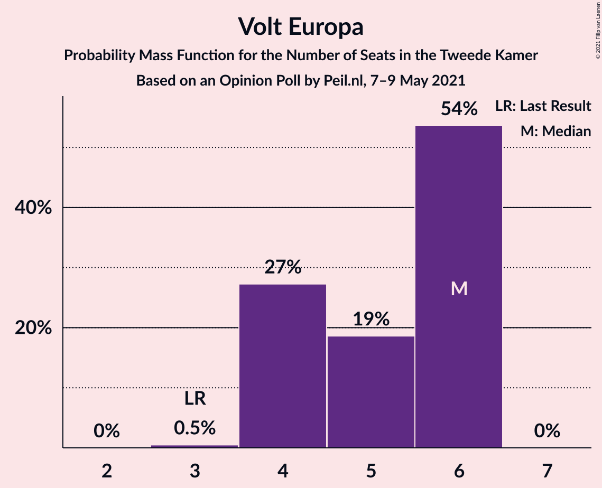

| Number of Seats | Probability | Accumulated | Special Marks |
|:---------------:|:-----------:|:-----------:|:-------------:|
| 3 | 2% | 100% | Last Result |
| 4 | 2% | 98% |  |
| 5 | 61% | 96% | Median |
| 6 | 34% | 34% |  |
| 7 | 0% | 0% |  |

### Staatkundig Gereformeerde Partij

*For a full overview of the results for this party, see the [Staatkundig Gereformeerde Partij](party-staatkundiggereformeerdepartij.html) page.*

| Number of Seats | Probability | Accumulated | Special Marks |
|:---------------:|:-----------:|:-----------:|:-------------:|
| 2 | 43% | 100% |  |
| 3 | 36% | 57% | Last Result, Median |
| 4 | 21% | 21% |  |
| 5 | 0% | 0% |  |

### DENK

*For a full overview of the results for this party, see the [DENK](party-denk.html) page.*

| Number of Seats | Probability | Accumulated | Special Marks |
|:---------------:|:-----------:|:-----------:|:-------------:|
| 1 | 0.1% | 100% |  |
| 2 | 8% | 99.9% |  |
| 3 | 41% | 92% | Last Result |
| 4 | 51% | 51% | Median |
| 5 | 0.1% | 0.1% |  |
| 6 | 0% | 0% |  |

### BoerBurgerBeweging

*For a full overview of the results for this party, see the [BoerBurgerBeweging](party-boerburgerbeweging.html) page.*

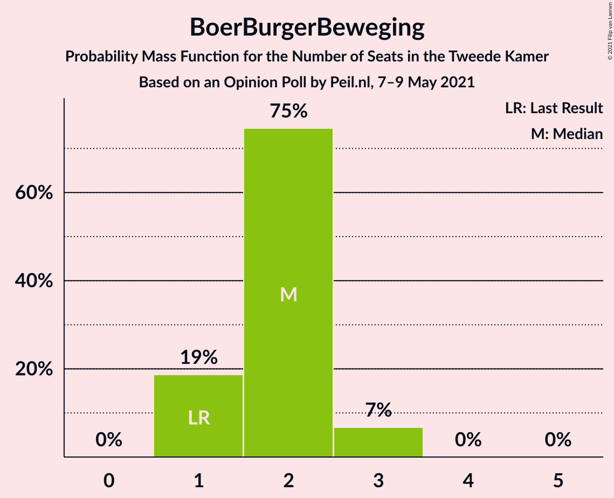

| Number of Seats | Probability | Accumulated | Special Marks |
|:---------------:|:-----------:|:-----------:|:-------------:|
| 1 | 54% | 100% | Last Result, Median |
| 2 | 40% | 46% |  |
| 3 | 6% | 6% |  |
| 4 | 0% | 0% |  |

### Bij1

*For a full overview of the results for this party, see the [Bij1](party-bij1.html) page.*

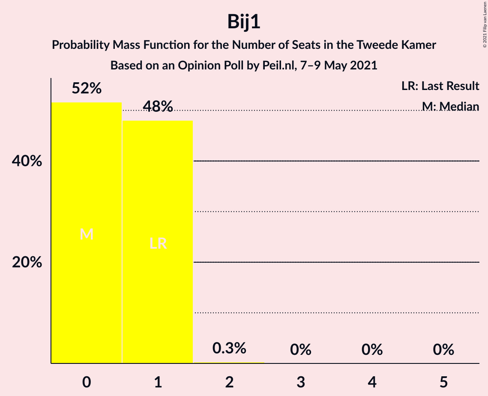

| Number of Seats | Probability | Accumulated | Special Marks |
|:---------------:|:-----------:|:-----------:|:-------------:|
| 0 | 33% | 100% |  |
| 1 | 65% | 67% | Last Result, Median |
| 2 | 2% | 2% |  |
| 3 | 0% | 0% |  |

### 50Plus

*For a full overview of the results for this party, see the [50Plus](party-50plus.html) page.*

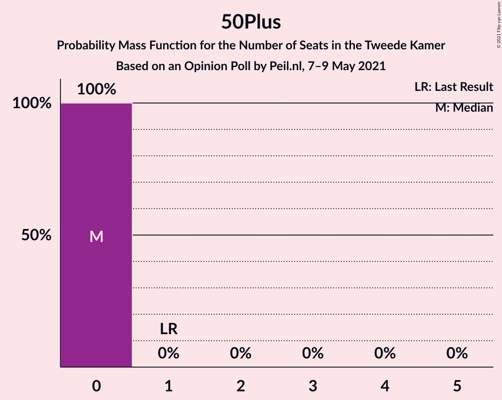

| Number of Seats | Probability | Accumulated | Special Marks |
|:---------------:|:-----------:|:-----------:|:-------------:|
| 0 | 100% | 100% | Median |
| 1 | 0% | 0% | Last Result |

## Coalitions

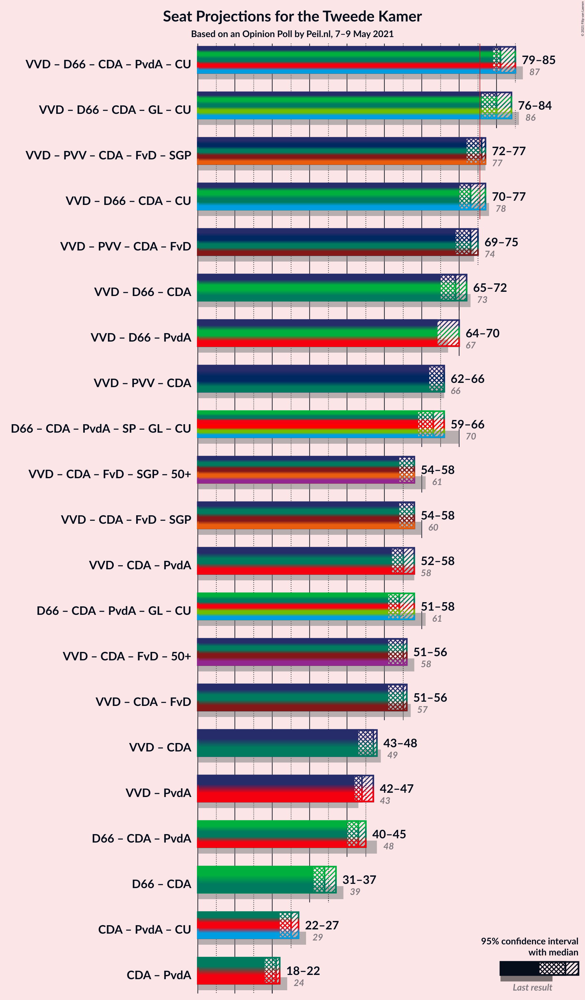

### Confidence Intervals

| Coalition | Last Result | Median | Majority? | 80% Confidence Interval | 90% Confidence Interval | 95% Confidence Interval | 99% Confidence Interval |
|:---------:|:-----------:|:------:|:---------:|:-----------------------:|:-----------------------:|:-----------------------:|:-----------------------:|
| Volkspartij voor Vrijheid en Democratie – Democraten 66 – Christen-Democratisch Appèl – Partij van de Arbeid – ChristenUnie | 87 | 82 | 100% | 81–84 | 80–85 | 77–87 | 77–89 |
| Volkspartij voor Vrijheid en Democratie – Democraten 66 – Christen-Democratisch Appèl – GroenLinks – ChristenUnie | 86 | 79 | 99.9% | 79–83 | 78–84 | 77–85 | 77–86 |
| Volkspartij voor Vrijheid en Democratie – Democraten 66 – Christen-Democratisch Appèl – ChristenUnie | 78 | 72 | 11% | 72–76 | 70–77 | 69–78 | 69–80 |
| Volkspartij voor Vrijheid en Democratie – Partij voor de Vrijheid – Christen-Democratisch Appèl – Forum voor Democratie – Staatkundig Gereformeerde Partij | 77 | 73 | 7% | 72–75 | 72–76 | 71–77 | 71–78 |
| Volkspartij voor Vrijheid en Democratie – Partij voor de Vrijheid – Christen-Democratisch Appèl – Forum voor Democratie | 74 | 70 | 0.1% | 69–73 | 69–74 | 69–74 | 68–75 |
| Volkspartij voor Vrijheid en Democratie – Democraten 66 – Christen-Democratisch Appèl | 73 | 68 | 2% | 67–71 | 65–71 | 65–73 | 65–76 |
| Volkspartij voor Vrijheid en Democratie – Democraten 66 – Partij van de Arbeid | 67 | 67 | 0% | 65–68 | 64–69 | 61–70 | 61–71 |
| Democraten 66 – Christen-Democratisch Appèl – Partij van de Arbeid – Socialistische Partij – GroenLinks – ChristenUnie | 70 | 64 | 0% | 62–66 | 62–66 | 62–67 | 59–67 |
| Volkspartij voor Vrijheid en Democratie – Partij voor de Vrijheid – Christen-Democratisch Appèl | 66 | 62 | 0% | 62–64 | 61–65 | 60–66 | 60–68 |
| Volkspartij voor Vrijheid en Democratie – Christen-Democratisch Appèl – Forum voor Democratie – Staatkundig Gereformeerde Partij – 50Plus | 61 | 56 | 0% | 55–58 | 55–60 | 54–60 | 54–60 |
| Volkspartij voor Vrijheid en Democratie – Christen-Democratisch Appèl – Forum voor Democratie – Staatkundig Gereformeerde Partij | 60 | 56 | 0% | 55–58 | 55–60 | 54–60 | 54–60 |
| Democraten 66 – Christen-Democratisch Appèl – Partij van de Arbeid – GroenLinks – ChristenUnie | 61 | 55 | 0% | 52–56 | 52–56 | 52–59 | 50–60 |
| Volkspartij voor Vrijheid en Democratie – Christen-Democratisch Appèl – Partij van de Arbeid | 58 | 55 | 0% | 53–57 | 52–57 | 52–59 | 52–59 |
| Volkspartij voor Vrijheid en Democratie – Christen-Democratisch Appèl – Forum voor Democratie – 50Plus | 58 | 53 | 0% | 52–56 | 52–58 | 52–58 | 51–58 |
| Volkspartij voor Vrijheid en Democratie – Christen-Democratisch Appèl – Forum voor Democratie | 57 | 53 | 0% | 52–56 | 52–58 | 52–58 | 51–58 |
| Volkspartij voor Vrijheid en Democratie – Christen-Democratisch Appèl | 49 | 46 | 0% | 44–47 | 44–49 | 43–50 | 43–50 |
| Democraten 66 – Christen-Democratisch Appèl – Partij van de Arbeid | 48 | 42 | 0% | 41–45 | 40–45 | 40–48 | 40–49 |
| Volkspartij voor Vrijheid en Democratie – Partij van de Arbeid | 43 | 45 | 0% | 42–47 | 42–47 | 40–47 | 40–48 |
| Democraten 66 – Christen-Democratisch Appèl | 39 | 32 | 0% | 31–35 | 31–36 | 31–39 | 31–40 |
| Christen-Democratisch Appèl – Partij van de Arbeid – ChristenUnie | 29 | 25 | 0% | 23–26 | 23–26 | 23–27 | 22–27 |
| Christen-Democratisch Appèl – Partij van de Arbeid | 24 | 21 | 0% | 19–21 | 18–21 | 18–22 | 17–23 |

### Volkspartij voor Vrijheid en Democratie – Democraten 66 – Christen-Democratisch Appèl – Partij van de Arbeid – ChristenUnie

| Number of Seats | Probability | Accumulated | Special Marks |
|:---------------:|:-----------:|:-----------:|:-------------:|
| 77 | 4% | 100% |  |
| 78 | 0.1% | 96% |  |
| 79 | 1.2% | 96% |  |
| 80 | 5% | 95% |  |
| 81 | 28% | 90% | Median |
| 82 | 27% | 62% |  |
| 83 | 23% | 36% |  |
| 84 | 5% | 13% |  |
| 85 | 5% | 8% |  |
| 86 | 0% | 4% |  |
| 87 | 2% | 4% | Last Result |
| 88 | 0% | 2% |  |
| 89 | 2% | 2% |  |
| 90 | 0% | 0% |  |

### Volkspartij voor Vrijheid en Democratie – Democraten 66 – Christen-Democratisch Appèl – GroenLinks – ChristenUnie

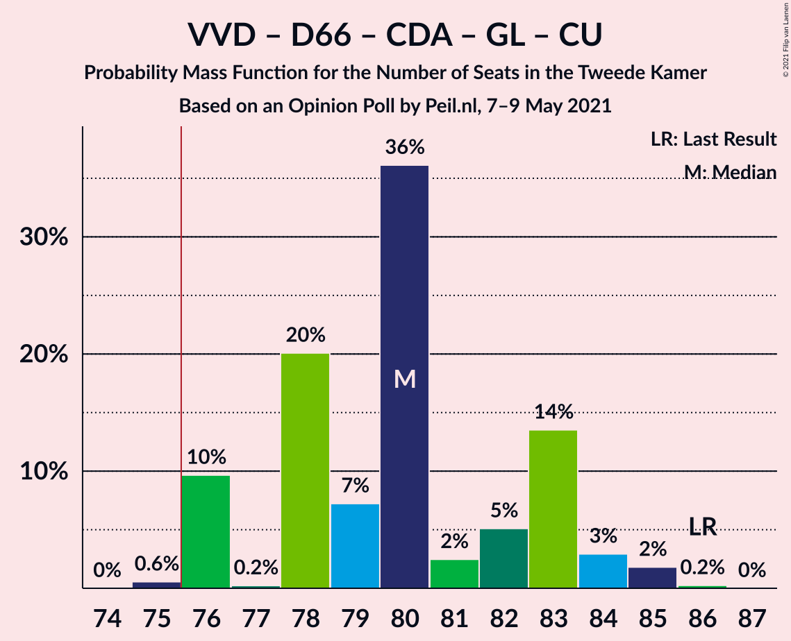

| Number of Seats | Probability | Accumulated | Special Marks |
|:---------------:|:-----------:|:-----------:|:-------------:|
| 74 | 0.1% | 100% |  |
| 75 | 0% | 99.9% |  |
| 76 | 0% | 99.9% | Majority |
| 77 | 3% | 99.9% |  |
| 78 | 3% | 96% |  |
| 79 | 57% | 93% | Median |
| 80 | 24% | 36% |  |
| 81 | 0.4% | 12% |  |
| 82 | 2% | 12% |  |
| 83 | 1.2% | 10% |  |
| 84 | 5% | 9% |  |
| 85 | 2% | 4% |  |
| 86 | 2% | 2% | Last Result |
| 87 | 0% | 0% |  |

### Volkspartij voor Vrijheid en Democratie – Democraten 66 – Christen-Democratisch Appèl – ChristenUnie

| Number of Seats | Probability | Accumulated | Special Marks |
|:---------------:|:-----------:|:-----------:|:-------------:|
| 67 | 0.1% | 100% |  |
| 68 | 0% | 99.9% |  |
| 69 | 3% | 99.9% |  |
| 70 | 2% | 96% |  |
| 71 | 2% | 94% |  |
| 72 | 77% | 92% | Median |
| 73 | 0.2% | 15% |  |
| 74 | 2% | 15% |  |
| 75 | 2% | 13% |  |
| 76 | 2% | 11% | Majority |
| 77 | 5% | 9% |  |
| 78 | 1.5% | 4% | Last Result |
| 79 | 0% | 2% |  |
| 80 | 2% | 2% |  |
| 81 | 0% | 0% |  |

### Volkspartij voor Vrijheid en Democratie – Partij voor de Vrijheid – Christen-Democratisch Appèl – Forum voor Democratie – Staatkundig Gereformeerde Partij

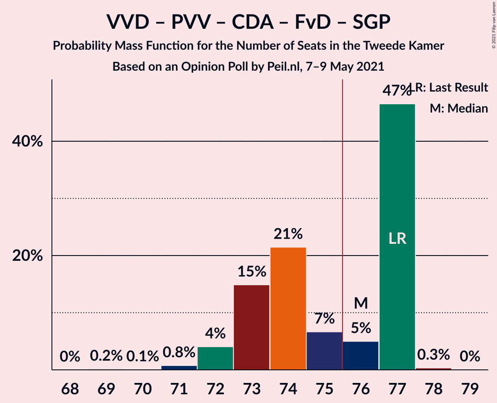

| Number of Seats | Probability | Accumulated | Special Marks |
|:---------------:|:-----------:|:-----------:|:-------------:|
| 69 | 0.2% | 100% |  |
| 70 | 0% | 99.8% |  |
| 71 | 3% | 99.8% |  |
| 72 | 28% | 97% |  |
| 73 | 29% | 69% | Median |
| 74 | 27% | 41% |  |
| 75 | 7% | 14% |  |
| 76 | 2% | 7% | Majority |
| 77 | 3% | 5% | Last Result |
| 78 | 2% | 2% |  |
| 79 | 0.1% | 0.1% |  |
| 80 | 0% | 0% |  |

### Volkspartij voor Vrijheid en Democratie – Partij voor de Vrijheid – Christen-Democratisch Appèl – Forum voor Democratie

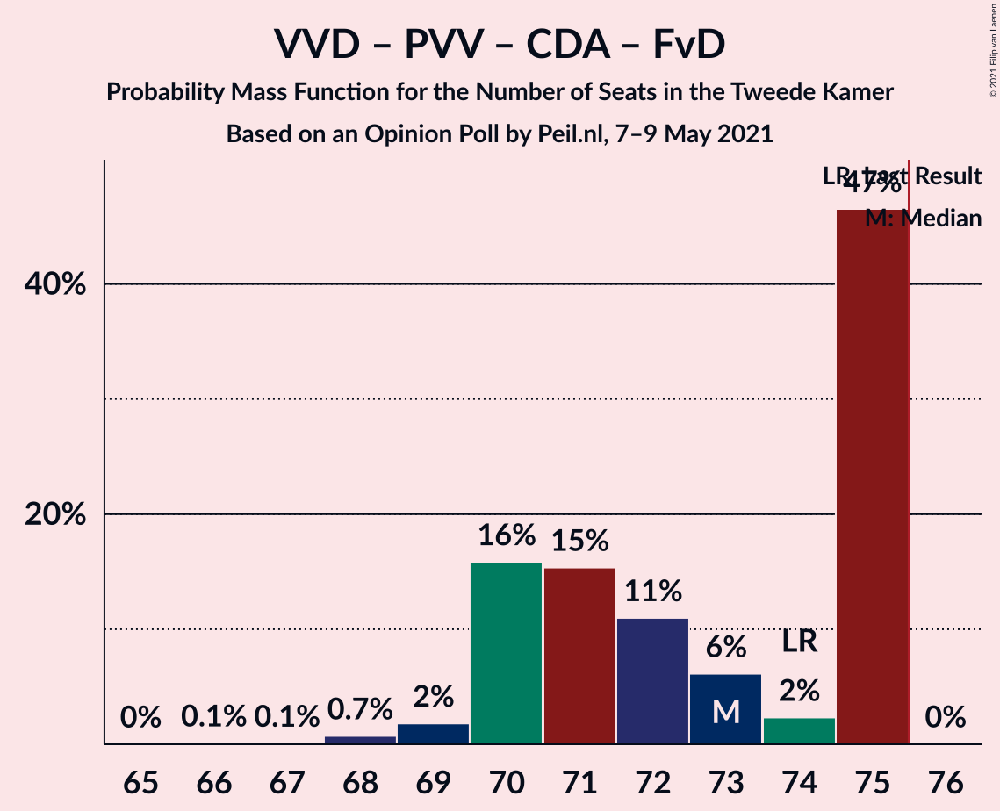

| Number of Seats | Probability | Accumulated | Special Marks |
|:---------------:|:-----------:|:-----------:|:-------------:|
| 67 | 0.2% | 100% |  |
| 68 | 1.4% | 99.8% |  |
| 69 | 22% | 98% |  |
| 70 | 31% | 76% | Median |
| 71 | 31% | 45% |  |
| 72 | 1.0% | 14% |  |
| 73 | 7% | 13% |  |
| 74 | 5% | 7% | Last Result |
| 75 | 1.5% | 2% |  |
| 76 | 0% | 0.1% | Majority |
| 77 | 0.1% | 0.1% |  |
| 78 | 0% | 0% |  |

### Volkspartij voor Vrijheid en Democratie – Democraten 66 – Christen-Democratisch Appèl

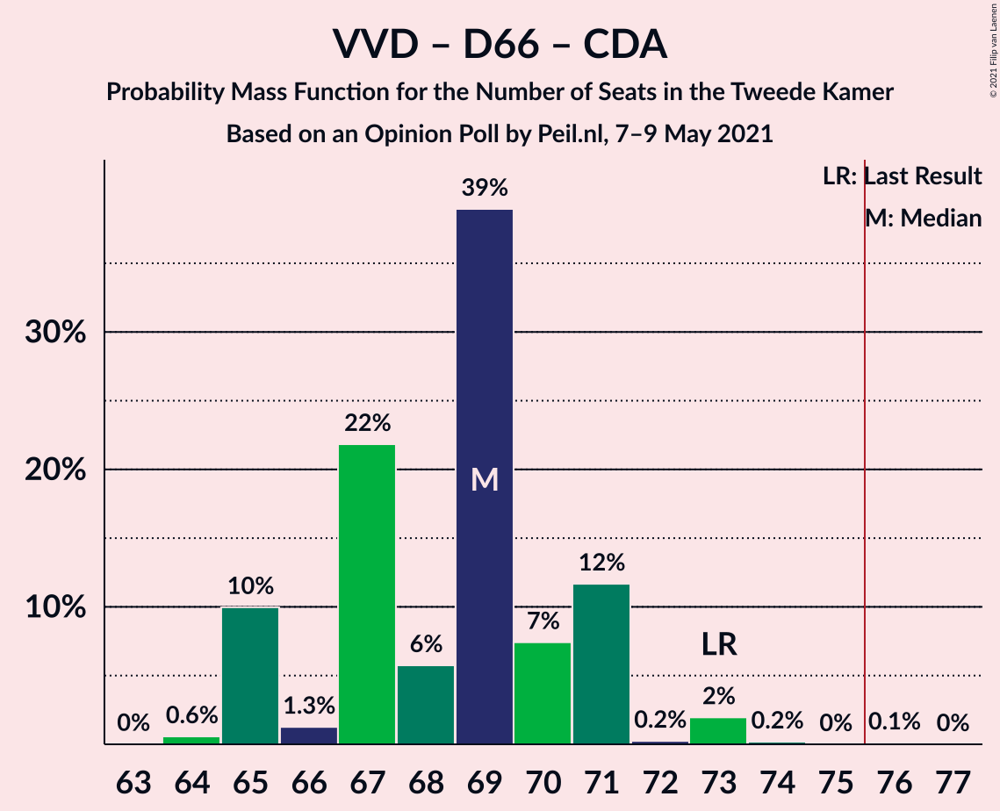

| Number of Seats | Probability | Accumulated | Special Marks |
|:---------------:|:-----------:|:-----------:|:-------------:|
| 63 | 0.1% | 100% |  |
| 64 | 0% | 99.9% |  |
| 65 | 6% | 99.9% |  |
| 66 | 2% | 94% |  |
| 67 | 21% | 92% |  |
| 68 | 56% | 71% | Median |
| 69 | 2% | 15% |  |
| 70 | 0.4% | 13% |  |
| 71 | 9% | 12% |  |
| 72 | 0.1% | 4% |  |
| 73 | 2% | 4% | Last Result |
| 74 | 0% | 2% |  |
| 75 | 0% | 2% |  |
| 76 | 2% | 2% | Majority |
| 77 | 0% | 0% |  |

### Volkspartij voor Vrijheid en Democratie – Democraten 66 – Partij van de Arbeid

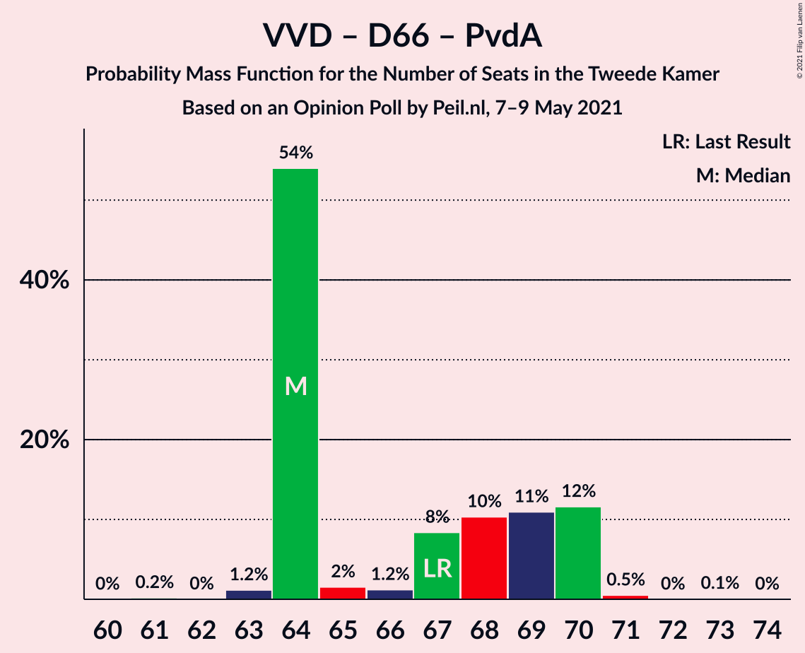

| Number of Seats | Probability | Accumulated | Special Marks |
|:---------------:|:-----------:|:-----------:|:-------------:|
| 61 | 3% | 100% |  |
| 62 | 0% | 97% |  |
| 63 | 0% | 97% |  |
| 64 | 2% | 97% |  |
| 65 | 7% | 95% |  |
| 66 | 2% | 88% |  |
| 67 | 55% | 86% | Last Result, Median |
| 68 | 22% | 32% |  |
| 69 | 7% | 10% |  |
| 70 | 0.8% | 3% |  |
| 71 | 2% | 2% |  |
| 72 | 0% | 0% |  |

### Democraten 66 – Christen-Democratisch Appèl – Partij van de Arbeid – Socialistische Partij – GroenLinks – ChristenUnie

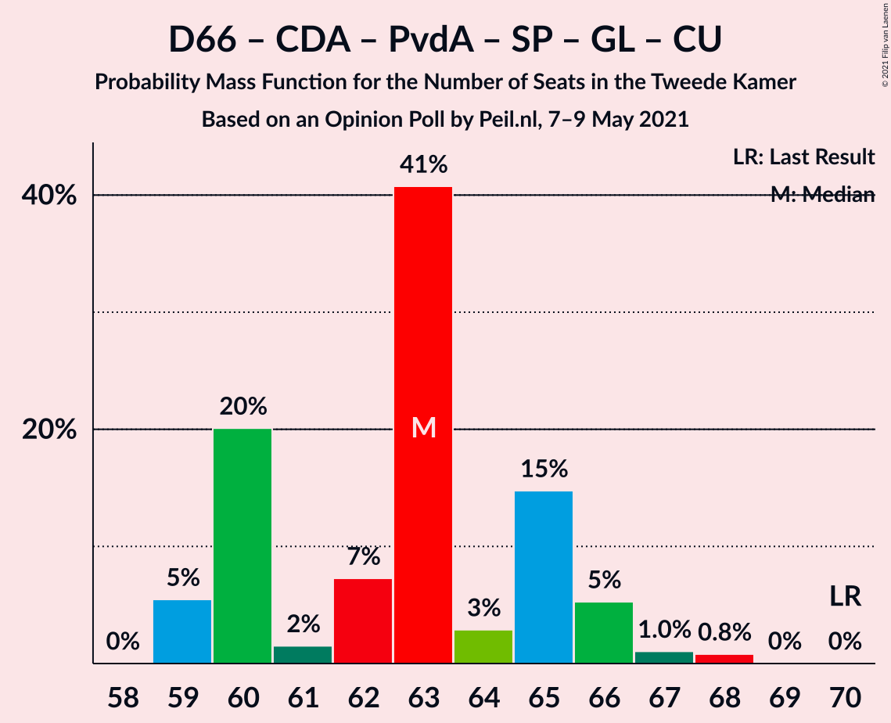

| Number of Seats | Probability | Accumulated | Special Marks |
|:---------------:|:-----------:|:-----------:|:-------------:|
| 58 | 0.3% | 100% |  |
| 59 | 2% | 99.7% |  |
| 60 | 0.1% | 98% |  |
| 61 | 0.1% | 98% |  |
| 62 | 31% | 98% | Median |
| 63 | 9% | 67% |  |
| 64 | 24% | 58% |  |
| 65 | 4% | 34% |  |
| 66 | 26% | 30% |  |
| 67 | 4% | 4% |  |
| 68 | 0.1% | 0.2% |  |
| 69 | 0% | 0% |  |
| 70 | 0% | 0% | Last Result |

### Volkspartij voor Vrijheid en Democratie – Partij voor de Vrijheid – Christen-Democratisch Appèl

| Number of Seats | Probability | Accumulated | Special Marks |
|:---------------:|:-----------:|:-----------:|:-------------:|
| 60 | 3% | 100% |  |
| 61 | 5% | 97% |  |
| 62 | 52% | 92% | Median |
| 63 | 27% | 41% |  |
| 64 | 7% | 14% |  |
| 65 | 3% | 7% |  |
| 66 | 2% | 4% | Last Result |
| 67 | 0% | 1.5% |  |
| 68 | 1.4% | 1.4% |  |
| 69 | 0% | 0% |  |

### Volkspartij voor Vrijheid en Democratie – Christen-Democratisch Appèl – Forum voor Democratie – Staatkundig Gereformeerde Partij – 50Plus

| Number of Seats | Probability | Accumulated | Special Marks |
|:---------------:|:-----------:|:-----------:|:-------------:|
| 52 | 0% | 100% |  |
| 53 | 0.3% | 99.9% |  |
| 54 | 3% | 99.7% |  |
| 55 | 25% | 97% |  |
| 56 | 37% | 71% |  |
| 57 | 24% | 34% | Median |
| 58 | 1.3% | 11% |  |
| 59 | 2% | 9% |  |
| 60 | 7% | 7% |  |
| 61 | 0.1% | 0.1% | Last Result |
| 62 | 0% | 0.1% |  |
| 63 | 0.1% | 0.1% |  |
| 64 | 0% | 0% |  |

### Volkspartij voor Vrijheid en Democratie – Christen-Democratisch Appèl – Forum voor Democratie – Staatkundig Gereformeerde Partij

| Number of Seats | Probability | Accumulated | Special Marks |
|:---------------:|:-----------:|:-----------:|:-------------:|
| 52 | 0% | 100% |  |
| 53 | 0.3% | 99.9% |  |
| 54 | 3% | 99.7% |  |
| 55 | 25% | 97% |  |
| 56 | 37% | 71% |  |
| 57 | 24% | 34% | Median |
| 58 | 1.3% | 11% |  |
| 59 | 2% | 9% |  |
| 60 | 7% | 7% | Last Result |
| 61 | 0.1% | 0.1% |  |
| 62 | 0% | 0.1% |  |
| 63 | 0.1% | 0.1% |  |
| 64 | 0% | 0% |  |

### Democraten 66 – Christen-Democratisch Appèl – Partij van de Arbeid – GroenLinks – ChristenUnie

| Number of Seats | Probability | Accumulated | Special Marks |
|:---------------:|:-----------:|:-----------:|:-------------:|
| 49 | 0.1% | 100% |  |
| 50 | 1.4% | 99.9% |  |
| 51 | 0.4% | 98% |  |
| 52 | 27% | 98% | Median |
| 53 | 10% | 71% |  |
| 54 | 1.4% | 61% |  |
| 55 | 22% | 59% |  |
| 56 | 33% | 37% |  |
| 57 | 0.6% | 4% |  |
| 58 | 0% | 4% |  |
| 59 | 2% | 4% |  |
| 60 | 1.5% | 2% |  |
| 61 | 0% | 0% | Last Result |

### Volkspartij voor Vrijheid en Democratie – Christen-Democratisch Appèl – Partij van de Arbeid

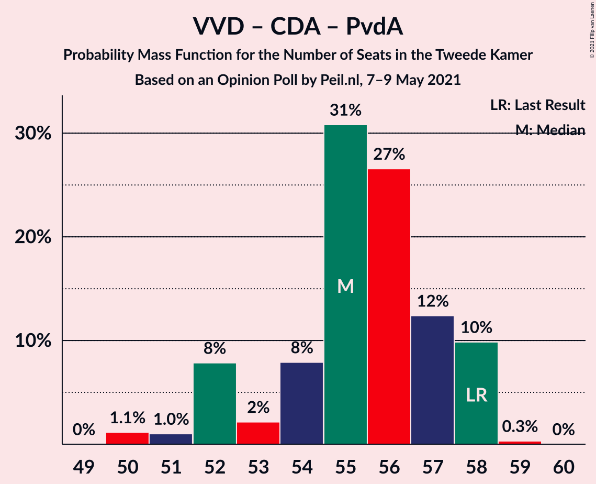

| Number of Seats | Probability | Accumulated | Special Marks |
|:---------------:|:-----------:|:-----------:|:-------------:|
| 52 | 5% | 100% |  |
| 53 | 5% | 95% |  |
| 54 | 30% | 89% |  |
| 55 | 29% | 59% | Median |
| 56 | 2% | 30% |  |
| 57 | 24% | 28% |  |
| 58 | 0.1% | 4% | Last Result |
| 59 | 4% | 4% |  |
| 60 | 0% | 0% |  |

### Volkspartij voor Vrijheid en Democratie – Christen-Democratisch Appèl – Forum voor Democratie – 50Plus

| Number of Seats | Probability | Accumulated | Special Marks |
|:---------------:|:-----------:|:-----------:|:-------------:|
| 49 | 0.1% | 100% |  |
| 50 | 0% | 99.9% |  |
| 51 | 1.4% | 99.9% |  |
| 52 | 27% | 98% |  |
| 53 | 26% | 71% |  |
| 54 | 35% | 45% | Median |
| 55 | 0.5% | 11% |  |
| 56 | 1.1% | 10% |  |
| 57 | 3% | 9% |  |
| 58 | 6% | 6% | Last Result |
| 59 | 0% | 0.1% |  |
| 60 | 0% | 0.1% |  |
| 61 | 0.1% | 0.1% |  |
| 62 | 0% | 0% |  |

### Volkspartij voor Vrijheid en Democratie – Christen-Democratisch Appèl – Forum voor Democratie

| Number of Seats | Probability | Accumulated | Special Marks |
|:---------------:|:-----------:|:-----------:|:-------------:|
| 49 | 0.1% | 100% |  |
| 50 | 0% | 99.9% |  |
| 51 | 1.4% | 99.9% |  |
| 52 | 27% | 98% |  |
| 53 | 26% | 71% |  |
| 54 | 35% | 45% | Median |
| 55 | 0.5% | 11% |  |
| 56 | 1.1% | 10% |  |
| 57 | 3% | 9% | Last Result |
| 58 | 6% | 6% |  |
| 59 | 0% | 0.1% |  |
| 60 | 0% | 0.1% |  |
| 61 | 0.1% | 0.1% |  |
| 62 | 0% | 0% |  |

### Volkspartij voor Vrijheid en Democratie – Christen-Democratisch Appèl

| Number of Seats | Probability | Accumulated | Special Marks |
|:---------------:|:-----------:|:-----------:|:-------------:|
| 42 | 0.1% | 100% |  |
| 43 | 4% | 99.9% |  |
| 44 | 30% | 96% |  |
| 45 | 6% | 66% |  |
| 46 | 49% | 60% | Median |
| 47 | 2% | 11% |  |
| 48 | 2% | 9% |  |
| 49 | 4% | 7% | Last Result |
| 50 | 4% | 4% |  |
| 51 | 0% | 0% |  |

### Democraten 66 – Christen-Democratisch Appèl – Partij van de Arbeid

| Number of Seats | Probability | Accumulated | Special Marks |
|:---------------:|:-----------:|:-----------:|:-------------:|
| 38 | 0.1% | 100% |  |
| 39 | 0.4% | 99.9% |  |
| 40 | 5% | 99.5% |  |
| 41 | 32% | 95% | Median |
| 42 | 24% | 62% |  |
| 43 | 4% | 39% |  |
| 44 | 3% | 34% |  |
| 45 | 28% | 32% |  |
| 46 | 0.1% | 4% |  |
| 47 | 0% | 4% |  |
| 48 | 1.5% | 4% | Last Result |
| 49 | 2% | 2% |  |
| 50 | 0% | 0% |  |

### Volkspartij voor Vrijheid en Democratie – Partij van de Arbeid

| Number of Seats | Probability | Accumulated | Special Marks |
|:---------------:|:-----------:|:-----------:|:-------------:|
| 40 | 3% | 100% |  |
| 41 | 0.2% | 97% |  |
| 42 | 8% | 96% |  |
| 43 | 30% | 88% | Last Result |
| 44 | 2% | 58% |  |
| 45 | 30% | 56% | Median |
| 46 | 0.1% | 26% |  |
| 47 | 24% | 26% |  |
| 48 | 2% | 2% |  |
| 49 | 0% | 0% |  |

### Democraten 66 – Christen-Democratisch Appèl

| Number of Seats | Probability | Accumulated | Special Marks |
|:---------------:|:-----------:|:-----------:|:-------------:|
| 30 | 0.4% | 100% |  |
| 31 | 22% | 99.6% |  |
| 32 | 32% | 77% | Median |
| 33 | 6% | 45% |  |
| 34 | 4% | 39% |  |
| 35 | 26% | 35% |  |
| 36 | 6% | 9% |  |
| 37 | 0.1% | 4% |  |
| 38 | 0% | 4% |  |
| 39 | 2% | 4% | Last Result |
| 40 | 2% | 2% |  |
| 41 | 0% | 0% |  |

### Christen-Democratisch Appèl – Partij van de Arbeid – ChristenUnie

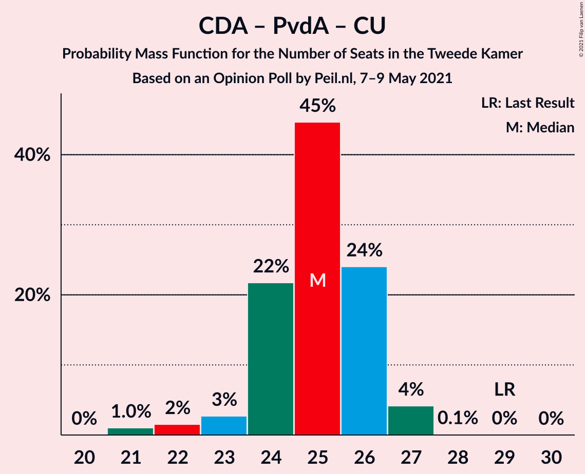

| Number of Seats | Probability | Accumulated | Special Marks |
|:---------------:|:-----------:|:-----------:|:-------------:|
| 20 | 0.1% | 100% |  |
| 21 | 0% | 99.9% |  |
| 22 | 0.4% | 99.9% |  |
| 23 | 32% | 99.5% | Median |
| 24 | 10% | 68% |  |
| 25 | 26% | 57% |  |
| 26 | 28% | 32% |  |
| 27 | 4% | 4% |  |
| 28 | 0% | 0% |  |
| 29 | 0% | 0% | Last Result |

### Christen-Democratisch Appèl – Partij van de Arbeid

| Number of Seats | Probability | Accumulated | Special Marks |
|:---------------:|:-----------:|:-----------:|:-------------:|
| 16 | 0.1% | 100% |  |
| 17 | 0.4% | 99.9% |  |
| 18 | 5% | 99.5% |  |
| 19 | 33% | 95% | Median |
| 20 | 7% | 62% |  |
| 21 | 50% | 54% |  |
| 22 | 2% | 4% |  |
| 23 | 2% | 2% |  |
| 24 | 0% | 0% | Last Result |

## Technical Information

### Opinion Poll

+ **Polling firm:** Peil.nl
+ **Commissioner(s):** —
+ **Fieldwork period:** 7–9 May 2021

### Calculations

+ **Sample size:** 3000
+ **Simulations done:** 131,072
+ **Error estimate:** 1.16%

