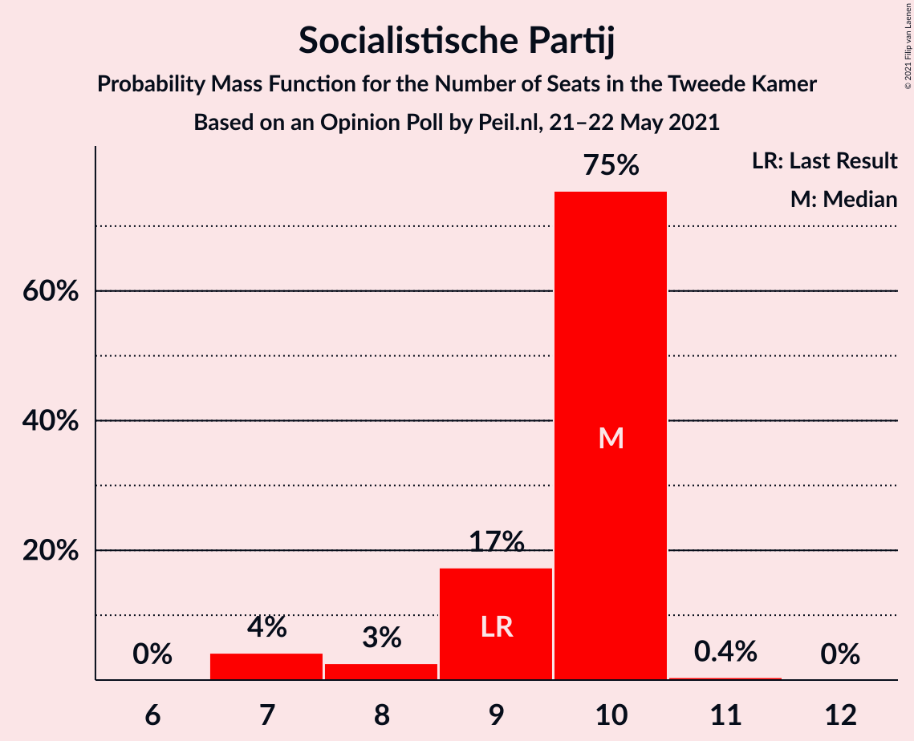
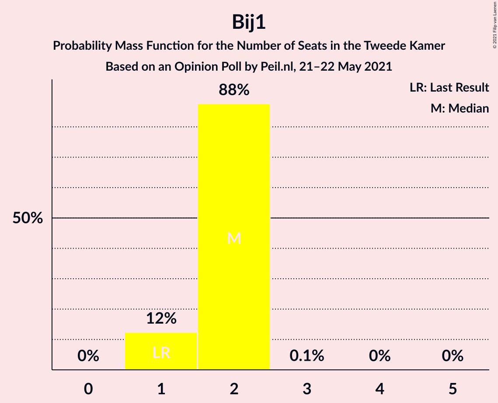
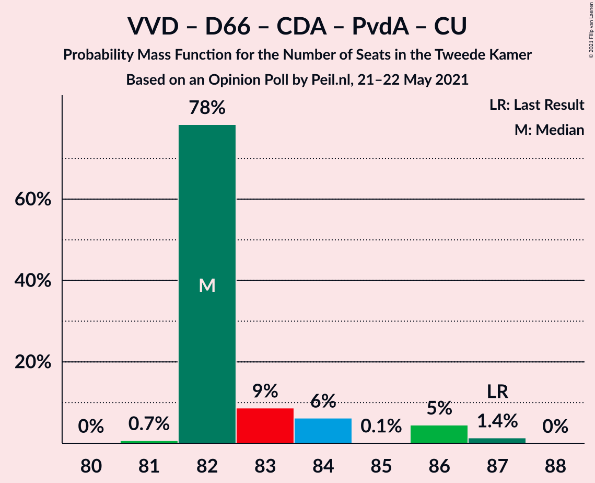
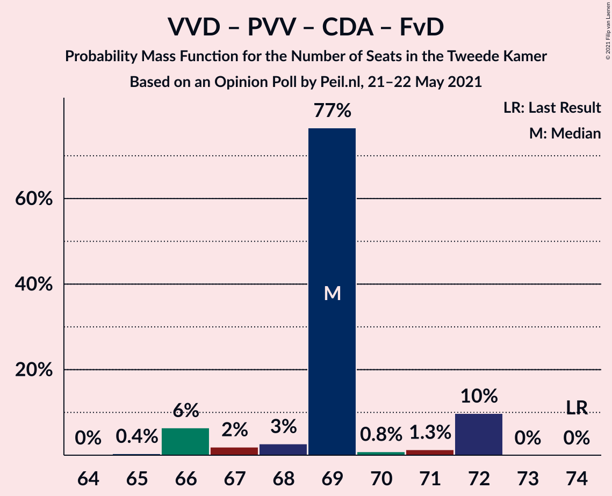
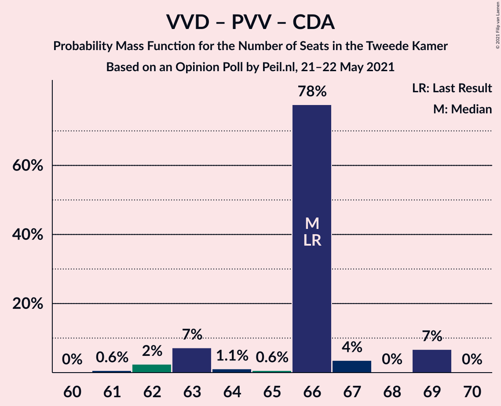
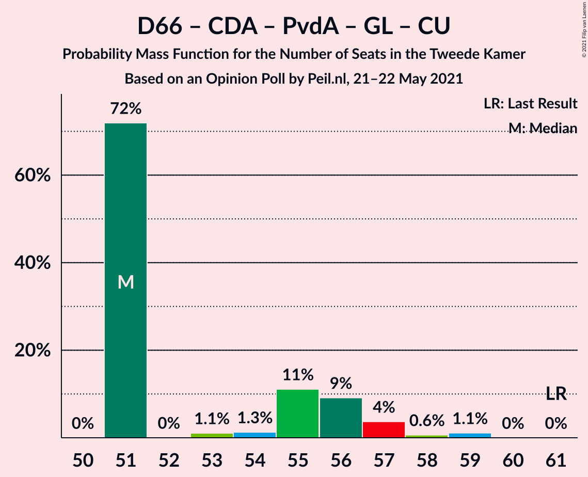
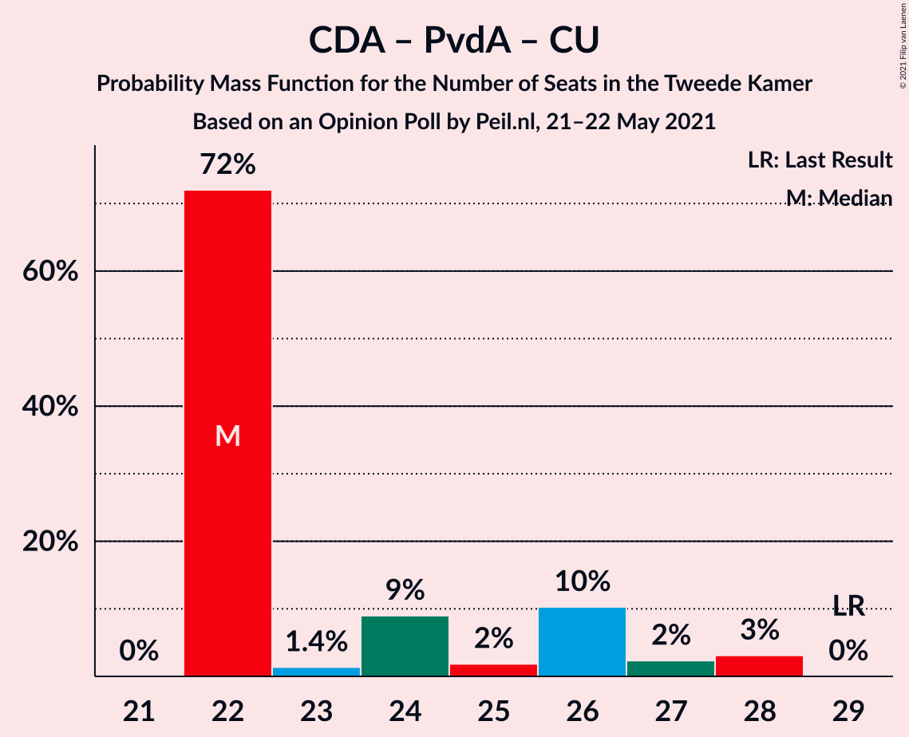

# Opinion Poll by Peil.nl, 21–22 May 2021

<a href="#voting-intentions">Voting Intentions</a> | <a href="#seats">Seats</a> | <a href="#coalitions">Coalitions</a> | <a href="#technical-information">Technical Information</a>

## Voting Intentions

### Confidence Intervals

| Party | Last Result | Poll Result | 80% Confidence Interval | 90% Confidence Interval | 95% Confidence Interval | 99% Confidence Interval |
|:-----:|:-----------:|:-----------:|:-----------------------:|:-----------------------:|:-----------------------:|:-----------------------:|
| Volkspartij voor Vrijheid en Democratie | 21.9% | 22.6% | 21.6–23.6% |21.4–23.9% |21.1–24.1% |20.7–24.6% |
| Democraten 66 | 15.0% | 15.3% | 14.4–16.1% |14.2–16.4% |14.0–16.6% |13.6–17.0% |
| Partij voor de Vrijheid | 10.8% | 12.0% | 11.2–12.8% |11.0–13.0% |10.9–13.2% |10.5–13.6% |
| Christen-Democratisch Appèl | 9.5% | 7.3% | 6.7–8.0% |6.6–8.1% |6.4–8.3% |6.1–8.6% |
| Socialistische Partij | 6.0% | 6.0% | 5.4–6.6% |5.3–6.7% |5.2–6.9% |4.9–7.2% |
| Partij van de Arbeid | 5.7% | 6.0% | 5.4–6.6% |5.3–6.7% |5.2–6.9% |4.9–7.2% |
| GroenLinks | 5.2% | 4.7% | 4.2–5.2% |4.1–5.3% |4.0–5.5% |3.7–5.8% |
| Partij voor de Dieren | 3.8% | 4.7% | 4.2–5.2% |4.1–5.3% |4.0–5.5% |3.7–5.8% |
| Juiste Antwoord 2021 | 2.4% | 4.0% | 3.6–4.5% |3.4–4.6% |3.4–4.8% |3.2–5.0% |
| Volt Europa | 2.4% | 4.0% | 3.6–4.5% |3.4–4.6% |3.4–4.8% |3.2–5.0% |
| ChristenUnie | 3.4% | 3.3% | 2.9–3.8% |2.8–3.9% |2.7–4.0% |2.6–4.3% |
| Forum voor Democratie | 5.0% | 2.7% | 2.3–3.1% |2.2–3.2% |2.1–3.3% |2.0–3.5% |
| Staatkundig Gereformeerde Partij | 2.1% | 2.0% | 1.7–2.4% |1.6–2.5% |1.6–2.6% |1.4–2.8% |
| DENK | 2.0% | 2.0% | 1.7–2.4% |1.6–2.5% |1.6–2.6% |1.4–2.8% |
| BoerBurgerBeweging | 1.0% | 2.0% | 1.7–2.4% |1.6–2.5% |1.6–2.6% |1.4–2.8% |
| Bij1 | 0.8% | 1.3% | 1.1–1.6% |1.0–1.7% |1.0–1.8% |0.9–2.0% |
| 50Plus | 1.0% | 0.2% | 0.1–0.3% |0.1–0.4% |0.1–0.4% |0.0–0.5% |

*Note:* The poll result column reflects the actual value used in the calculations. Published results may vary slightly, and in addition be rounded to fewer digits.

## Seats

### Confidence Intervals

| Party | Last Result | Median | 80% Confidence Interval | 90% Confidence Interval | 95% Confidence Interval | 99% Confidence Interval |
|:-----:|:-----------:|:------:|:-----------------------:|:-----------------------:|:-----------------------:|:-----------------------:|
| <a href="#volkspartij-voor-vrijheid-en-democratie">Volkspartij voor Vrijheid en Democratie</a> | 34 | 37 | 35–37 |33–37 |33–37 |31–38 |
| <a href="#democraten-66">Democraten 66</a> | 24 | 23 | 23–24 |21–24 |21–25 |21–27 |
| <a href="#partij-voor-de-vrijheid">Partij voor de Vrijheid</a> | 17 | 20 | 18–20 |17–23 |17–23 |16–23 |
| <a href="#christen-democratisch-appèl">Christen-Democratisch Appèl</a> | 15 | 9 | 9–11 |9–13 |9–13 |9–13 |
| <a href="#socialistische-partij">Socialistische Partij</a> | 9 | 10 | 9–10 |8–10 |7–10 |7–10 |
| <a href="#partij-van-de-arbeid">Partij van de Arbeid</a> | 9 | 8 | 8–10 |8–10 |8–11 |7–11 |
| <a href="#groenlinks">GroenLinks</a> | 8 | 6 | 6–7 |6–8 |6–8 |5–9 |
| <a href="#partij-voor-de-dieren">Partij voor de Dieren</a> | 6 | 7 | 6–7 |6–7 |6–8 |6–8 |
| <a href="#juiste-antwoord-2021">Juiste Antwoord 2021</a> | 3 | 6 | 5–6 |5–6 |5–6 |5–7 |
| <a href="#volt-europa">Volt Europa</a> | 3 | 6 | 6 |6–7 |6–7 |5–8 |
| <a href="#christenunie">ChristenUnie</a> | 5 | 5 | 5 |5 |4–5 |4–6 |
| <a href="#forum-voor-democratie">Forum voor Democratie</a> | 8 | 3 | 3–4 |3–5 |3–5 |3–5 |
| <a href="#staatkundig-gereformeerde-partij">Staatkundig Gereformeerde Partij</a> | 3 | 2 | 2–3 |2–3 |2–3 |2–4 |
| <a href="#denk">DENK</a> | 3 | 3 | 2–3 |2–3 |2–3 |2–4 |
| <a href="#boerburgerbeweging">BoerBurgerBeweging</a> | 1 | 3 | 2–3 |2–3 |2–4 |2–4 |
| <a href="#bij1">Bij1</a> | 1 | 2 | 1–2 |1–2 |1–2 |1–2 |
| <a href="#50plus">50Plus</a> | 1 | 0 | 0 |0 |0 |0 |

### Volkspartij voor Vrijheid en Democratie

*For a full overview of the results for this party, see the [Volkspartij voor Vrijheid en Democratie](party-volkspartijvoorvrijheidendemocratie.html) page.*

| Number of Seats | Probability | Accumulated | Special Marks |
|:---------------:|:-----------:|:-----------:|:-------------:|
| 31 | 1.0% | 100% |  |
| 32 | 0.7% | 99.0% |  |
| 33 | 4% | 98% |  |
| 34 | 1.2% | 95% | Last Result |
| 35 | 15% | 94% |  |
| 36 | 5% | 79% |  |
| 37 | 72% | 74% | Median |
| 38 | 2% | 2% |  |
| 39 | 0% | 0% |  |

### Democraten 66

*For a full overview of the results for this party, see the [Democraten 66](party-democraten66.html) page.*

| Number of Seats | Probability | Accumulated | Special Marks |
|:---------------:|:-----------:|:-----------:|:-------------:|
| 20 | 0.1% | 100% |  |
| 21 | 7% | 99.9% |  |
| 22 | 0.1% | 93% |  |
| 23 | 75% | 93% | Median |
| 24 | 15% | 18% | Last Result |
| 25 | 1.5% | 3% |  |
| 26 | 0.1% | 1.2% |  |
| 27 | 1.1% | 1.1% |  |
| 28 | 0% | 0% |  |

### Partij voor de Vrijheid

*For a full overview of the results for this party, see the [Partij voor de Vrijheid](party-partijvoordevrijheid.html) page.*

| Number of Seats | Probability | Accumulated | Special Marks |
|:---------------:|:-----------:|:-----------:|:-------------:|
| 16 | 2% | 100% |  |
| 17 | 7% | 98% | Last Result |
| 18 | 2% | 91% |  |
| 19 | 6% | 89% |  |
| 20 | 76% | 83% | Median |
| 21 | 0.1% | 7% |  |
| 22 | 0% | 7% |  |
| 23 | 7% | 7% |  |
| 24 | 0% | 0% |  |

### Christen-Democratisch Appèl

*For a full overview of the results for this party, see the [Christen-Democratisch Appèl](party-christen-democratischappèl.html) page.*

| Number of Seats | Probability | Accumulated | Special Marks |
|:---------------:|:-----------:|:-----------:|:-------------:|
| 9 | 72% | 100% | Median |
| 10 | 6% | 28% |  |
| 11 | 14% | 22% |  |
| 12 | 2% | 9% |  |
| 13 | 6% | 6% |  |
| 14 | 0% | 0% |  |
| 15 | 0% | 0% | Last Result |

### Socialistische Partij

*For a full overview of the results for this party, see the [Socialistische Partij](party-socialistischepartij.html) page.*

| Number of Seats | Probability | Accumulated | Special Marks |
|:---------------:|:-----------:|:-----------:|:-------------:|
| 7 | 4% | 100% |  |
| 8 | 3% | 96% |  |
| 9 | 17% | 93% | Last Result |
| 10 | 75% | 76% | Median |
| 11 | 0.4% | 0.4% |  |
| 12 | 0% | 0% |  |

### Partij van de Arbeid

*For a full overview of the results for this party, see the [Partij van de Arbeid](party-partijvandearbeid.html) page.*

| Number of Seats | Probability | Accumulated | Special Marks |
|:---------------:|:-----------:|:-----------:|:-------------:|
| 7 | 0.6% | 100% |  |
| 8 | 81% | 99.4% | Median |
| 9 | 7% | 18% | Last Result |
| 10 | 8% | 12% |  |
| 11 | 4% | 4% |  |
| 12 | 0% | 0% |  |

### GroenLinks

*For a full overview of the results for this party, see the [GroenLinks](party-groenlinks.html) page.*

| Number of Seats | Probability | Accumulated | Special Marks |
|:---------------:|:-----------:|:-----------:|:-------------:|
| 5 | 1.1% | 100% |  |
| 6 | 78% | 98.9% | Median |
| 7 | 14% | 20% |  |
| 8 | 6% | 6% | Last Result |
| 9 | 0.6% | 0.6% |  |
| 10 | 0% | 0% |  |

### Partij voor de Dieren

*For a full overview of the results for this party, see the [Partij voor de Dieren](party-partijvoordedieren.html) page.*

| Number of Seats | Probability | Accumulated | Special Marks |
|:---------------:|:-----------:|:-----------:|:-------------:|
| 5 | 0.1% | 100% |  |
| 6 | 13% | 99.9% | Last Result |
| 7 | 82% | 87% | Median |
| 8 | 4% | 4% |  |
| 9 | 0% | 0% |  |

### Juiste Antwoord 2021

*For a full overview of the results for this party, see the [Juiste Antwoord 2021](party-juisteantwoord2021.html) page.*

| Number of Seats | Probability | Accumulated | Special Marks |
|:---------------:|:-----------:|:-----------:|:-------------:|
| 3 | 0% | 100% | Last Result |
| 4 | 0.1% | 100% |  |
| 5 | 14% | 99.9% |  |
| 6 | 85% | 86% | Median |
| 7 | 0.8% | 0.9% |  |
| 8 | 0% | 0% |  |

### Volt Europa

*For a full overview of the results for this party, see the [Volt Europa](party-volteuropa.html) page.*

| Number of Seats | Probability | Accumulated | Special Marks |
|:---------------:|:-----------:|:-----------:|:-------------:|
| 3 | 0% | 100% | Last Result |
| 4 | 0% | 100% |  |
| 5 | 0.9% | 100% |  |
| 6 | 93% | 99.1% | Median |
| 7 | 6% | 7% |  |
| 8 | 0.8% | 0.8% |  |
| 9 | 0% | 0% |  |

### ChristenUnie

*For a full overview of the results for this party, see the [ChristenUnie](party-christenunie.html) page.*

| Number of Seats | Probability | Accumulated | Special Marks |
|:---------------:|:-----------:|:-----------:|:-------------:|
| 4 | 3% | 100% |  |
| 5 | 96% | 97% | Last Result, Median |
| 6 | 1.0% | 1.0% |  |
| 7 | 0% | 0% |  |

### Forum voor Democratie

*For a full overview of the results for this party, see the [Forum voor Democratie](party-forumvoordemocratie.html) page.*

| Number of Seats | Probability | Accumulated | Special Marks |
|:---------------:|:-----------:|:-----------:|:-------------:|
| 3 | 88% | 100% | Median |
| 4 | 4% | 12% |  |
| 5 | 8% | 8% |  |
| 6 | 0% | 0% |  |
| 7 | 0% | 0% |  |
| 8 | 0% | 0% | Last Result |

### Staatkundig Gereformeerde Partij

*For a full overview of the results for this party, see the [Staatkundig Gereformeerde Partij](party-staatkundiggereformeerdepartij.html) page.*

| Number of Seats | Probability | Accumulated | Special Marks |
|:---------------:|:-----------:|:-----------:|:-------------:|
| 2 | 85% | 100% | Median |
| 3 | 14% | 15% | Last Result |
| 4 | 1.3% | 1.3% |  |
| 5 | 0% | 0% |  |

### DENK

*For a full overview of the results for this party, see the [DENK](party-denk.html) page.*

| Number of Seats | Probability | Accumulated | Special Marks |
|:---------------:|:-----------:|:-----------:|:-------------:|
| 2 | 19% | 100% |  |
| 3 | 80% | 81% | Last Result, Median |
| 4 | 2% | 2% |  |
| 5 | 0% | 0% |  |

### BoerBurgerBeweging

*For a full overview of the results for this party, see the [BoerBurgerBeweging](party-boerburgerbeweging.html) page.*

| Number of Seats | Probability | Accumulated | Special Marks |
|:---------------:|:-----------:|:-----------:|:-------------:|
| 1 | 0% | 100% | Last Result |
| 2 | 13% | 100% |  |
| 3 | 83% | 87% | Median |
| 4 | 4% | 4% |  |
| 5 | 0% | 0% |  |

### Bij1

*For a full overview of the results for this party, see the [Bij1](party-bij1.html) page.*

| Number of Seats | Probability | Accumulated | Special Marks |
|:---------------:|:-----------:|:-----------:|:-------------:|
| 1 | 12% | 100% | Last Result |
| 2 | 88% | 88% | Median |
| 3 | 0.1% | 0.1% |  |
| 4 | 0% | 0% |  |

### 50Plus

*For a full overview of the results for this party, see the [50Plus](party-50plus.html) page.*

| Number of Seats | Probability | Accumulated | Special Marks |
|:---------------:|:-----------:|:-----------:|:-------------:|
| 0 | 100% | 100% | Median |
| 1 | 0% | 0% | Last Result |

## Coalitions

### Confidence Intervals

| Coalition | Last Result | Median | Majority? | 80% Confidence Interval | 90% Confidence Interval | 95% Confidence Interval | 99% Confidence Interval |
|:---------:|:-----------:|:------:|:---------:|:-----------------------:|:-----------------------:|:-----------------------:|:-----------------------:|
| Volkspartij voor Vrijheid en Democratie – Democraten 66 – Christen-Democratisch Appèl – Partij van de Arbeid – ChristenUnie | 87 | 82 | 100% | 82–84 | 82–86 | 82–86 | 81–87 |
| Volkspartij voor Vrijheid en Democratie – Democraten 66 – Christen-Democratisch Appèl – GroenLinks – ChristenUnie | 86 | 80 | 100% | 80–82 | 80–82 | 80–83 | 78–85 |
| Volkspartij voor Vrijheid en Democratie – Democraten 66 – Christen-Democratisch Appèl – ChristenUnie | 78 | 74 | 2% | 74–75 | 73–75 | 72–75 | 71–78 |
| Volkspartij voor Vrijheid en Democratie – Partij voor de Vrijheid – Christen-Democratisch Appèl – Forum voor Democratie – Staatkundig Gereformeerde Partij | 77 | 71 | 0% | 70–74 | 69–75 | 69–75 | 68–75 |
| Volkspartij voor Vrijheid en Democratie – Partij voor de Vrijheid – Christen-Democratisch Appèl – Forum voor Democratie | 74 | 69 | 0% | 68–71 | 66–72 | 66–72 | 66–72 |
| Volkspartij voor Vrijheid en Democratie – Democraten 66 – Christen-Democratisch Appèl | 73 | 69 | 0% | 69–70 | 68–70 | 67–71 | 66–74 |
| Volkspartij voor Vrijheid en Democratie – Democraten 66 – Partij van de Arbeid | 67 | 68 | 0% | 66–68 | 66–71 | 66–71 | 65–71 |
| Volkspartij voor Vrijheid en Democratie – Partij voor de Vrijheid – Christen-Democratisch Appèl | 66 | 66 | 0% | 63–67 | 63–69 | 62–69 | 61–69 |
| Democraten 66 – Christen-Democratisch Appèl – Partij van de Arbeid – Socialistische Partij – GroenLinks – ChristenUnie | 70 | 61 | 0% | 61–64 | 61–65 | 61–66 | 61–69 |
| Volkspartij voor Vrijheid en Democratie – Christen-Democratisch Appèl – Partij van de Arbeid | 58 | 54 | 0% | 54–56 | 54–57 | 53–58 | 52–59 |
| Democraten 66 – Christen-Democratisch Appèl – Partij van de Arbeid – GroenLinks – ChristenUnie | 61 | 51 | 0% | 51–56 | 51–57 | 51–57 | 51–59 |
| Volkspartij voor Vrijheid en Democratie – Christen-Democratisch Appèl – Forum voor Democratie – Staatkundig Gereformeerde Partij – 50Plus | 61 | 51 | 0% | 51–52 | 51–54 | 51–55 | 49–58 |
| Volkspartij voor Vrijheid en Democratie – Christen-Democratisch Appèl – Forum voor Democratie – Staatkundig Gereformeerde Partij | 60 | 51 | 0% | 51–52 | 51–54 | 51–55 | 49–58 |
| Volkspartij voor Vrijheid en Democratie – Christen-Democratisch Appèl – Forum voor Democratie – 50Plus | 58 | 49 | 0% | 49 | 49–52 | 48–53 | 47–55 |
| Volkspartij voor Vrijheid en Democratie – Christen-Democratisch Appèl – Forum voor Democratie | 57 | 49 | 0% | 49 | 49–52 | 48–53 | 47–55 |
| Volkspartij voor Vrijheid en Democratie – Christen-Democratisch Appèl | 49 | 46 | 0% | 46 | 46–48 | 44–48 | 43–50 |
| Volkspartij voor Vrijheid en Democratie – Partij van de Arbeid | 43 | 45 | 0% | 43–45 | 42–47 | 42–47 | 40–47 |
| Democraten 66 – Christen-Democratisch Appèl – Partij van de Arbeid | 48 | 40 | 0% | 40–45 | 40–45 | 40–46 | 40–46 |
| Democraten 66 – Christen-Democratisch Appèl | 39 | 32 | 0% | 32–35 | 32–36 | 32–37 | 32–38 |
| Christen-Democratisch Appèl – Partij van de Arbeid – ChristenUnie | 29 | 22 | 0% | 22–26 | 22–27 | 22–28 | 22–28 |
| Christen-Democratisch Appèl – Partij van de Arbeid | 24 | 17 | 0% | 17–21 | 17–22 | 17–23 | 17–23 |

### Volkspartij voor Vrijheid en Democratie – Democraten 66 – Christen-Democratisch Appèl – Partij van de Arbeid – ChristenUnie

| Number of Seats | Probability | Accumulated | Special Marks |
|:---------------:|:-----------:|:-----------:|:-------------:|
| 80 | 0% | 100% |  |
| 81 | 0.7% | 99.9% |  |
| 82 | 78% | 99.3% | Median |
| 83 | 9% | 21% |  |
| 84 | 6% | 12% |  |
| 85 | 0.1% | 6% |  |
| 86 | 5% | 6% |  |
| 87 | 1.4% | 1.4% | Last Result |
| 88 | 0% | 0% |  |

### Volkspartij voor Vrijheid en Democratie – Democraten 66 – Christen-Democratisch Appèl – GroenLinks – ChristenUnie

| Number of Seats | Probability | Accumulated | Special Marks |
|:---------------:|:-----------:|:-----------:|:-------------:|
| 78 | 1.0% | 100% |  |
| 79 | 0.1% | 99.0% |  |
| 80 | 76% | 98.9% | Median |
| 81 | 11% | 22% |  |
| 82 | 9% | 11% |  |
| 83 | 0.4% | 3% |  |
| 84 | 0.9% | 2% |  |
| 85 | 1.4% | 1.4% |  |
| 86 | 0% | 0% | Last Result |

### Volkspartij voor Vrijheid en Democratie – Democraten 66 – Christen-Democratisch Appèl – ChristenUnie

| Number of Seats | Probability | Accumulated | Special Marks |
|:---------------:|:-----------:|:-----------:|:-------------:|
| 71 | 0.6% | 100% |  |
| 72 | 4% | 99.4% |  |
| 73 | 2% | 96% |  |
| 74 | 76% | 93% | Median |
| 75 | 15% | 18% |  |
| 76 | 0.1% | 2% | Majority |
| 77 | 0.9% | 2% |  |
| 78 | 1.3% | 1.4% | Last Result |
| 79 | 0.1% | 0.1% |  |
| 80 | 0% | 0% |  |

### Volkspartij voor Vrijheid en Democratie – Partij voor de Vrijheid – Christen-Democratisch Appèl – Forum voor Democratie – Staatkundig Gereformeerde Partij

| Number of Seats | Probability | Accumulated | Special Marks |
|:---------------:|:-----------:|:-----------:|:-------------:|
| 68 | 1.4% | 100% |  |
| 69 | 6% | 98.6% |  |
| 70 | 2% | 92% |  |
| 71 | 77% | 90% | Median |
| 72 | 1.1% | 12% |  |
| 73 | 0.1% | 11% |  |
| 74 | 4% | 11% |  |
| 75 | 7% | 7% |  |
| 76 | 0% | 0% | Majority |
| 77 | 0% | 0% | Last Result |

### Volkspartij voor Vrijheid en Democratie – Partij voor de Vrijheid – Christen-Democratisch Appèl – Forum voor Democratie

| Number of Seats | Probability | Accumulated | Special Marks |
|:---------------:|:-----------:|:-----------:|:-------------:|
| 65 | 0.4% | 100% |  |
| 66 | 6% | 99.6% |  |
| 67 | 2% | 93% |  |
| 68 | 3% | 91% |  |
| 69 | 77% | 89% | Median |
| 70 | 0.8% | 12% |  |
| 71 | 1.3% | 11% |  |
| 72 | 10% | 10% |  |
| 73 | 0% | 0% |  |
| 74 | 0% | 0% | Last Result |

### Volkspartij voor Vrijheid en Democratie – Democraten 66 – Christen-Democratisch Appèl

| Number of Seats | Probability | Accumulated | Special Marks |
|:---------------:|:-----------:|:-----------:|:-------------:|
| 66 | 0.7% | 100% |  |
| 67 | 4% | 99.3% |  |
| 68 | 2% | 96% |  |
| 69 | 75% | 93% | Median |
| 70 | 14% | 18% |  |
| 71 | 2% | 4% |  |
| 72 | 0.1% | 1.5% |  |
| 73 | 0% | 1.4% | Last Result |
| 74 | 1.3% | 1.4% |  |
| 75 | 0% | 0% |  |

### Volkspartij voor Vrijheid en Democratie – Democraten 66 – Partij van de Arbeid

| Number of Seats | Probability | Accumulated | Special Marks |
|:---------------:|:-----------:|:-----------:|:-------------:|
| 65 | 2% | 100% |  |
| 66 | 10% | 98% |  |
| 67 | 9% | 88% | Last Result |
| 68 | 73% | 79% | Median |
| 69 | 0.1% | 6% |  |
| 70 | 0.5% | 6% |  |
| 71 | 5% | 5% |  |
| 72 | 0.1% | 0.1% |  |
| 73 | 0% | 0% |  |

### Volkspartij voor Vrijheid en Democratie – Partij voor de Vrijheid – Christen-Democratisch Appèl

| Number of Seats | Probability | Accumulated | Special Marks |
|:---------------:|:-----------:|:-----------:|:-------------:|
| 61 | 0.6% | 100% |  |
| 62 | 2% | 99.4% |  |
| 63 | 7% | 97% |  |
| 64 | 1.1% | 90% |  |
| 65 | 0.6% | 89% |  |
| 66 | 78% | 88% | Last Result, Median |
| 67 | 4% | 10% |  |
| 68 | 0% | 7% |  |
| 69 | 7% | 7% |  |
| 70 | 0% | 0% |  |

### Democraten 66 – Christen-Democratisch Appèl – Partij van de Arbeid – Socialistische Partij – GroenLinks – ChristenUnie

| Number of Seats | Probability | Accumulated | Special Marks |
|:---------------:|:-----------:|:-----------:|:-------------:|
| 61 | 72% | 100% | Median |
| 62 | 0.2% | 28% |  |
| 63 | 6% | 28% |  |
| 64 | 12% | 22% |  |
| 65 | 6% | 10% |  |
| 66 | 2% | 4% |  |
| 67 | 0.3% | 2% |  |
| 68 | 0.6% | 2% |  |
| 69 | 1.1% | 1.1% |  |
| 70 | 0% | 0% | Last Result |

### Volkspartij voor Vrijheid en Democratie – Christen-Democratisch Appèl – Partij van de Arbeid

| Number of Seats | Probability | Accumulated | Special Marks |
|:---------------:|:-----------:|:-----------:|:-------------:|
| 51 | 0.1% | 100% |  |
| 52 | 2% | 99.9% |  |
| 53 | 2% | 98% |  |
| 54 | 79% | 96% | Median |
| 55 | 4% | 17% |  |
| 56 | 4% | 13% |  |
| 57 | 5% | 9% |  |
| 58 | 3% | 4% | Last Result |
| 59 | 1.3% | 1.3% |  |
| 60 | 0% | 0.1% |  |
| 61 | 0% | 0% |  |

### Democraten 66 – Christen-Democratisch Appèl – Partij van de Arbeid – GroenLinks – ChristenUnie

| Number of Seats | Probability | Accumulated | Special Marks |
|:---------------:|:-----------:|:-----------:|:-------------:|
| 51 | 72% | 100% | Median |
| 52 | 0% | 28% |  |
| 53 | 1.1% | 28% |  |
| 54 | 1.3% | 27% |  |
| 55 | 11% | 26% |  |
| 56 | 9% | 15% |  |
| 57 | 4% | 5% |  |
| 58 | 0.6% | 2% |  |
| 59 | 1.1% | 1.1% |  |
| 60 | 0% | 0% |  |
| 61 | 0% | 0% | Last Result |

### Volkspartij voor Vrijheid en Democratie – Christen-Democratisch Appèl – Forum voor Democratie – Staatkundig Gereformeerde Partij – 50Plus

| Number of Seats | Probability | Accumulated | Special Marks |
|:---------------:|:-----------:|:-----------:|:-------------:|
| 49 | 1.1% | 100% |  |
| 50 | 0.1% | 98.9% |  |
| 51 | 78% | 98.8% | Median |
| 52 | 13% | 21% |  |
| 53 | 3% | 8% |  |
| 54 | 1.0% | 5% |  |
| 55 | 3% | 4% |  |
| 56 | 0% | 1.3% |  |
| 57 | 0% | 1.3% |  |
| 58 | 1.3% | 1.3% |  |
| 59 | 0% | 0% |  |
| 60 | 0% | 0% |  |
| 61 | 0% | 0% | Last Result |

### Volkspartij voor Vrijheid en Democratie – Christen-Democratisch Appèl – Forum voor Democratie – Staatkundig Gereformeerde Partij

| Number of Seats | Probability | Accumulated | Special Marks |
|:---------------:|:-----------:|:-----------:|:-------------:|
| 49 | 1.1% | 100% |  |
| 50 | 0.1% | 98.9% |  |
| 51 | 78% | 98.8% | Median |
| 52 | 13% | 21% |  |
| 53 | 3% | 8% |  |
| 54 | 1.0% | 5% |  |
| 55 | 3% | 4% |  |
| 56 | 0% | 1.3% |  |
| 57 | 0% | 1.3% |  |
| 58 | 1.3% | 1.3% |  |
| 59 | 0% | 0% |  |
| 60 | 0% | 0% | Last Result |

### Volkspartij voor Vrijheid en Democratie – Christen-Democratisch Appèl – Forum voor Democratie – 50Plus

| Number of Seats | Probability | Accumulated | Special Marks |
|:---------------:|:-----------:|:-----------:|:-------------:|
| 47 | 1.1% | 100% |  |
| 48 | 3% | 98.9% |  |
| 49 | 87% | 96% | Median |
| 50 | 1.2% | 9% |  |
| 51 | 3% | 8% |  |
| 52 | 0.8% | 5% |  |
| 53 | 3% | 4% |  |
| 54 | 0% | 1.3% |  |
| 55 | 1.3% | 1.3% |  |
| 56 | 0% | 0% |  |
| 57 | 0% | 0% |  |
| 58 | 0% | 0% | Last Result |

### Volkspartij voor Vrijheid en Democratie – Christen-Democratisch Appèl – Forum voor Democratie

| Number of Seats | Probability | Accumulated | Special Marks |
|:---------------:|:-----------:|:-----------:|:-------------:|
| 47 | 1.1% | 100% |  |
| 48 | 3% | 98.9% |  |
| 49 | 87% | 96% | Median |
| 50 | 1.2% | 9% |  |
| 51 | 3% | 8% |  |
| 52 | 0.8% | 5% |  |
| 53 | 3% | 4% |  |
| 54 | 0% | 1.3% |  |
| 55 | 1.3% | 1.3% |  |
| 56 | 0% | 0% |  |
| 57 | 0% | 0% | Last Result |

### Volkspartij voor Vrijheid en Democratie – Christen-Democratisch Appèl

| Number of Seats | Probability | Accumulated | Special Marks |
|:---------------:|:-----------:|:-----------:|:-------------:|
| 43 | 2% | 100% |  |
| 44 | 2% | 98% |  |
| 45 | 0.4% | 96% |  |
| 46 | 89% | 96% | Median |
| 47 | 1.0% | 7% |  |
| 48 | 4% | 6% |  |
| 49 | 0.1% | 1.4% | Last Result |
| 50 | 1.3% | 1.3% |  |
| 51 | 0% | 0% |  |

### Volkspartij voor Vrijheid en Democratie – Partij van de Arbeid

| Number of Seats | Probability | Accumulated | Special Marks |
|:---------------:|:-----------:|:-----------:|:-------------:|
| 40 | 1.1% | 100% |  |
| 41 | 1.1% | 98.9% |  |
| 42 | 4% | 98% |  |
| 43 | 8% | 94% | Last Result |
| 44 | 1.2% | 86% |  |
| 45 | 79% | 85% | Median |
| 46 | 0.1% | 6% |  |
| 47 | 6% | 6% |  |
| 48 | 0.1% | 0.1% |  |
| 49 | 0% | 0% |  |

### Democraten 66 – Christen-Democratisch Appèl – Partij van de Arbeid

| Number of Seats | Probability | Accumulated | Special Marks |
|:---------------:|:-----------:|:-----------:|:-------------:|
| 40 | 72% | 100% | Median |
| 41 | 0.1% | 28% |  |
| 42 | 5% | 28% |  |
| 43 | 8% | 23% |  |
| 44 | 4% | 14% |  |
| 45 | 6% | 10% |  |
| 46 | 4% | 4% |  |
| 47 | 0% | 0.1% |  |
| 48 | 0% | 0.1% | Last Result |
| 49 | 0% | 0% |  |

### Democraten 66 – Christen-Democratisch Appèl

| Number of Seats | Probability | Accumulated | Special Marks |
|:---------------:|:-----------:|:-----------:|:-------------:|
| 31 | 0.1% | 100% |  |
| 32 | 76% | 99.9% | Median |
| 33 | 0.6% | 24% |  |
| 34 | 10% | 24% |  |
| 35 | 7% | 14% |  |
| 36 | 2% | 7% |  |
| 37 | 4% | 5% |  |
| 38 | 1.0% | 1.0% |  |
| 39 | 0% | 0% | Last Result |

### Christen-Democratisch Appèl – Partij van de Arbeid – ChristenUnie

| Number of Seats | Probability | Accumulated | Special Marks |
|:---------------:|:-----------:|:-----------:|:-------------:|
| 22 | 72% | 100% | Median |
| 23 | 1.4% | 28% |  |
| 24 | 9% | 27% |  |
| 25 | 2% | 18% |  |
| 26 | 10% | 16% |  |
| 27 | 2% | 5% |  |
| 28 | 3% | 3% |  |
| 29 | 0% | 0% | Last Result |

### Christen-Democratisch Appèl – Partij van de Arbeid

| Number of Seats | Probability | Accumulated | Special Marks |
|:---------------:|:-----------:|:-----------:|:-------------:|
| 17 | 72% | 100% | Median |
| 18 | 0.2% | 28% |  |
| 19 | 11% | 28% |  |
| 20 | 0.5% | 17% |  |
| 21 | 11% | 17% |  |
| 22 | 3% | 6% |  |
| 23 | 3% | 3% |  |
| 24 | 0% | 0% | Last Result |

## Technical Information

### Opinion Poll

+ **Polling firm:** Peil.nl
+ **Commissioner(s):** —
+ **Fieldwork period:** 21–22 May 2021

### Calculations

+ **Sample size:** 3000
+ **Simulations done:** 1,048,576
+ **Error estimate:** 1.92%

