# Opinion Poll by Ipsos for EenVandaag, 21–23 May 2021

<a href="#voting-intentions">Voting Intentions</a> | <a href="#seats">Seats</a> | <a href="#coalitions">Coalitions</a> | <a href="#technical-information">Technical Information</a>

## Voting Intentions

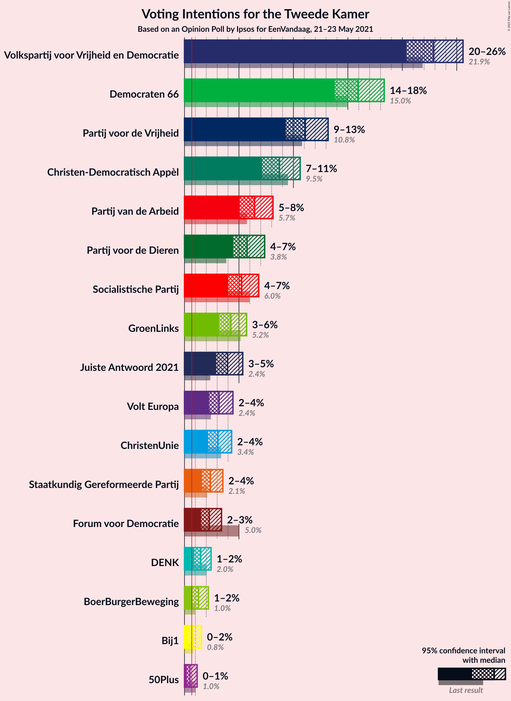

### Confidence Intervals

| Party | Last Result | Poll Result | 80% Confidence Interval | 90% Confidence Interval | 95% Confidence Interval | 99% Confidence Interval |
|:-----:|:-----------:|:-----------:|:-----------------------:|:-----------------------:|:-----------------------:|:-----------------------:|
| Volkspartij voor Vrijheid en Democratie | 21.9% | 22.9% | 21.2–24.6% |20.8–25.1% |20.4–25.6% |19.6–26.4% |
| Democraten 66 | 15.0% | 15.9% | 14.5–17.5% |14.1–18.0% |13.8–18.3% |13.2–19.1% |
| Partij voor de Vrijheid | 10.8% | 11.1% | 9.9–12.5% |9.6–12.8% |9.3–13.2% |8.7–13.9% |
| Christen-Democratisch Appèl | 9.5% | 8.7% | 7.7–10.0% |7.4–10.3% |7.1–10.6% |6.6–11.2% |
| Partij van de Arbeid | 5.7% | 6.4% | 5.5–7.5% |5.3–7.8% |5.1–8.1% |4.7–8.7% |
| Partij voor de Dieren | 3.8% | 5.7% | 4.9–6.8% |4.7–7.1% |4.5–7.4% |4.1–7.9% |
| Socialistische Partij | 6.0% | 5.2% | 4.5–6.3% |4.2–6.6% |4.0–6.8% |3.7–7.3% |
| GroenLinks | 5.2% | 4.3% | 3.5–5.2% |3.3–5.5% |3.2–5.7% |2.9–6.2% |
| Juiste Antwoord 2021 | 2.4% | 4.0% | 3.3–4.9% |3.1–5.1% |2.9–5.3% |2.6–5.8% |
| Volt Europa | 2.4% | 3.2% | 2.6–4.0% |2.4–4.2% |2.3–4.5% |2.0–4.9% |
| ChristenUnie | 3.4% | 3.1% | 2.5–3.9% |2.3–4.1% |2.2–4.3% |1.9–4.8% |
| Staatkundig Gereformeerde Partij | 2.1% | 2.4% | 1.9–3.1% |1.7–3.3% |1.6–3.5% |1.4–3.9% |
| Forum voor Democratie | 5.0% | 2.3% | 1.8–3.0% |1.6–3.2% |1.5–3.4% |1.3–3.8% |
| DENK | 2.0% | 1.5% | 1.1–2.1% |1.0–2.3% |0.9–2.4% |0.7–2.8% |
| BoerBurgerBeweging | 1.0% | 1.3% | 0.9–1.9% |0.8–2.0% |0.7–2.2% |0.6–2.5% |
| Bij1 | 0.8% | 0.8% | 0.5–1.3% |0.5–1.4% |0.4–1.6% |0.3–1.8% |
| 50Plus | 1.0% | 0.5% | 0.3–0.9% |0.2–1.1% |0.2–1.2% |0.2–1.4% |

*Note:* The poll result column reflects the actual value used in the calculations. Published results may vary slightly, and in addition be rounded to fewer digits.

## Seats

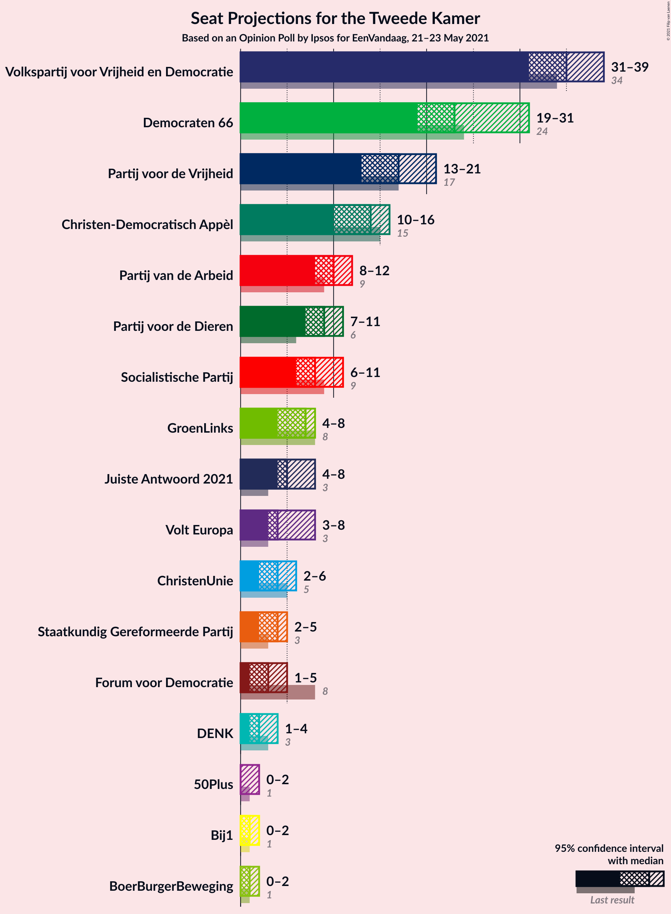

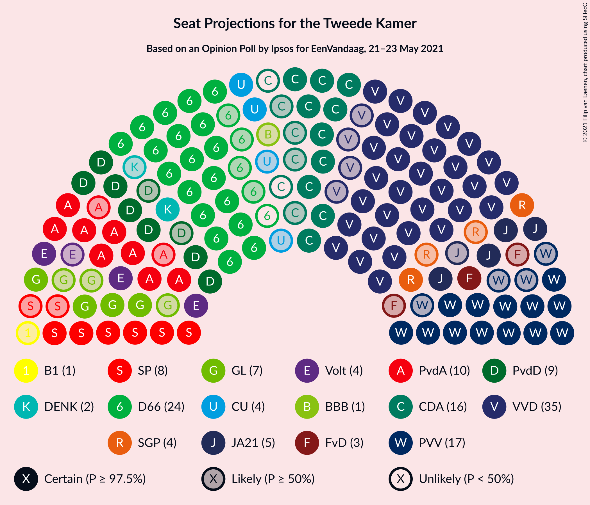

### Confidence Intervals

| Party | Last Result | Median | 80% Confidence Interval | 90% Confidence Interval | 95% Confidence Interval | 99% Confidence Interval |
|:-----:|:-----------:|:------:|:-----------------------:|:-----------------------:|:-----------------------:|:-----------------------:|
| <a href="#volkspartij-voor-vrijheid-en-democratie">Volkspartij voor Vrijheid en Democratie</a> | 34 | 35 | 31–39 |31–39 |31–39 |30–39 |
| <a href="#democraten-66">Democraten 66</a> | 24 | 23 | 19–27 |19–29 |19–31 |19–31 |
| <a href="#partij-voor-de-vrijheid">Partij voor de Vrijheid</a> | 17 | 17 | 15–20 |13–20 |13–21 |12–21 |
| <a href="#christen-democratisch-appèl">Christen-Democratisch Appèl</a> | 15 | 14 | 11–16 |11–16 |10–16 |10–16 |
| <a href="#partij-van-de-arbeid">Partij van de Arbeid</a> | 9 | 10 | 9–12 |9–12 |8–12 |8–14 |
| <a href="#partij-voor-de-dieren">Partij voor de Dieren</a> | 6 | 9 | 8–10 |7–11 |7–11 |6–11 |
| <a href="#socialistische-partij">Socialistische Partij</a> | 9 | 8 | 7–11 |7–11 |6–11 |5–11 |
| <a href="#groenlinks">GroenLinks</a> | 8 | 7 | 6–8 |5–8 |4–8 |4–10 |
| <a href="#juiste-antwoord-2021">Juiste Antwoord 2021</a> | 3 | 5 | 4–7 |4–7 |4–8 |3–10 |
| <a href="#volt-europa">Volt Europa</a> | 3 | 4 | 3–7 |3–8 |3–8 |2–8 |
| <a href="#christenunie">ChristenUnie</a> | 5 | 4 | 4–6 |3–6 |2–6 |2–6 |
| <a href="#staatkundig-gereformeerde-partij">Staatkundig Gereformeerde Partij</a> | 3 | 4 | 3–4 |2–5 |2–5 |2–6 |
| <a href="#forum-voor-democratie">Forum voor Democratie</a> | 8 | 3 | 1–5 |1–5 |1–5 |1–5 |
| <a href="#denk">DENK</a> | 3 | 2 | 1–4 |1–4 |1–4 |1–4 |
| <a href="#boerburgerbeweging">BoerBurgerBeweging</a> | 1 | 1 | 0–2 |0–2 |0–2 |0–4 |
| <a href="#bij1">Bij1</a> | 1 | 1 | 1–2 |0–2 |0–2 |0–2 |
| <a href="#50plus">50Plus</a> | 1 | 0 | 0–1 |0–1 |0–2 |0–2 |

### Volkspartij voor Vrijheid en Democratie

*For a full overview of the results for this party, see the [Volkspartij voor Vrijheid en Democratie](party-volkspartijvoorvrijheidendemocratie.html) page.*

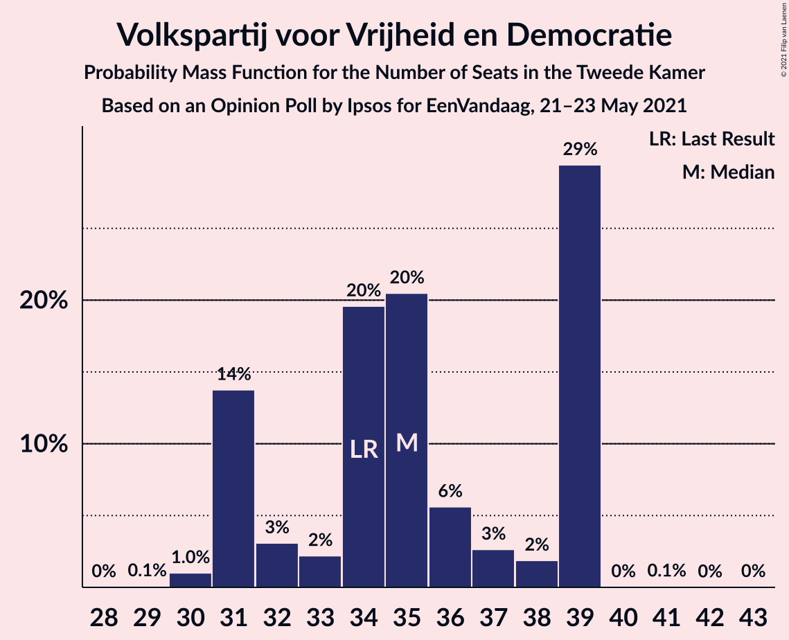

| Number of Seats | Probability | Accumulated | Special Marks |
|:---------------:|:-----------:|:-----------:|:-------------:|
| 28 | 0% | 100% |  |
| 29 | 0.1% | 99.9% |  |
| 30 | 1.0% | 99.8% |  |
| 31 | 14% | 98.8% |  |
| 32 | 3% | 85% |  |
| 33 | 2% | 82% |  |
| 34 | 20% | 80% | Last Result |
| 35 | 20% | 60% | Median |
| 36 | 6% | 40% |  |
| 37 | 3% | 34% |  |
| 38 | 2% | 31% |  |
| 39 | 29% | 30% |  |
| 40 | 0% | 0.2% |  |
| 41 | 0.1% | 0.1% |  |
| 42 | 0% | 0.1% |  |
| 43 | 0% | 0% |  |

### Democraten 66

*For a full overview of the results for this party, see the [Democraten 66](party-democraten66.html) page.*

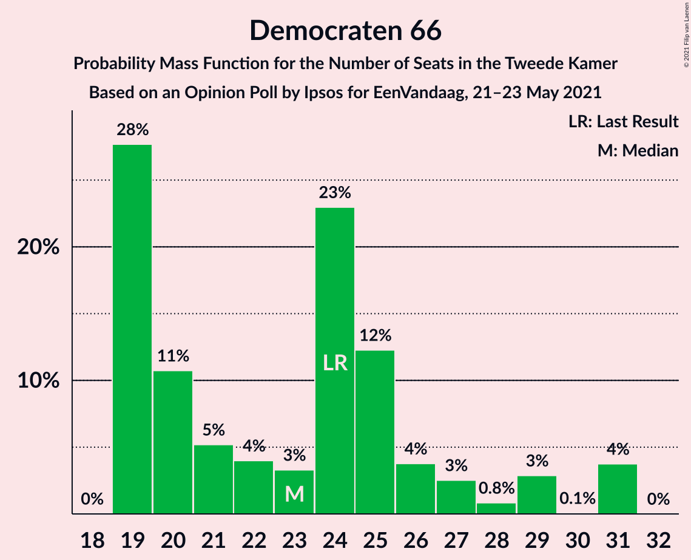

| Number of Seats | Probability | Accumulated | Special Marks |
|:---------------:|:-----------:|:-----------:|:-------------:|
| 19 | 28% | 100% |  |
| 20 | 11% | 72% |  |
| 21 | 5% | 62% |  |
| 22 | 4% | 56% |  |
| 23 | 3% | 52% | Median |
| 24 | 23% | 49% | Last Result |
| 25 | 12% | 26% |  |
| 26 | 4% | 14% |  |
| 27 | 3% | 10% |  |
| 28 | 0.8% | 8% |  |
| 29 | 3% | 7% |  |
| 30 | 0.1% | 4% |  |
| 31 | 4% | 4% |  |
| 32 | 0% | 0% |  |

### Partij voor de Vrijheid

*For a full overview of the results for this party, see the [Partij voor de Vrijheid](party-partijvoordevrijheid.html) page.*

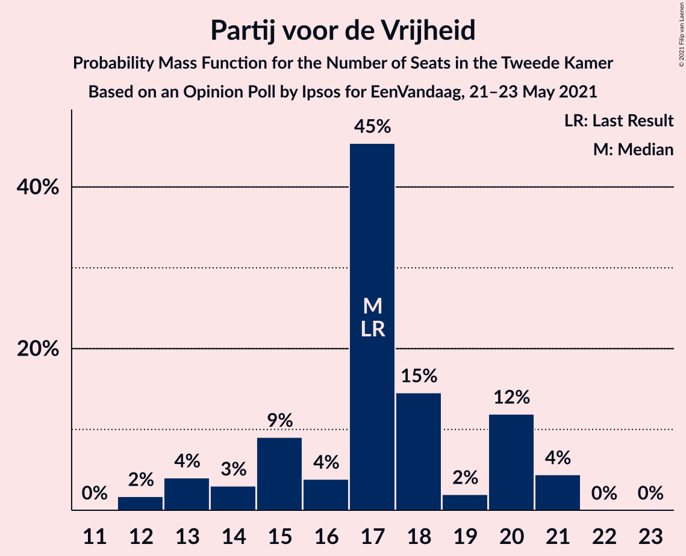

| Number of Seats | Probability | Accumulated | Special Marks |
|:---------------:|:-----------:|:-----------:|:-------------:|
| 12 | 2% | 100% |  |
| 13 | 4% | 98% |  |
| 14 | 3% | 94% |  |
| 15 | 9% | 91% |  |
| 16 | 4% | 82% |  |
| 17 | 45% | 78% | Last Result, Median |
| 18 | 15% | 33% |  |
| 19 | 2% | 18% |  |
| 20 | 12% | 16% |  |
| 21 | 4% | 4% |  |
| 22 | 0% | 0.1% |  |
| 23 | 0% | 0% |  |

### Christen-Democratisch Appèl

*For a full overview of the results for this party, see the [Christen-Democratisch Appèl](party-christen-democratischappèl.html) page.*

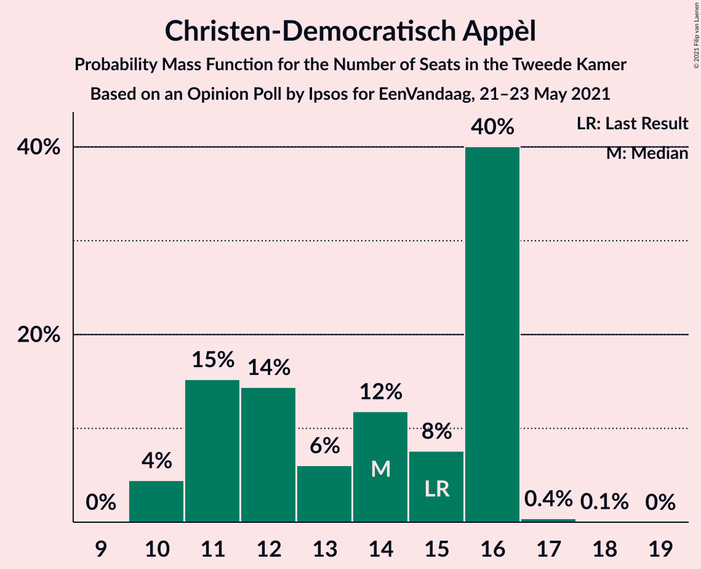

| Number of Seats | Probability | Accumulated | Special Marks |
|:---------------:|:-----------:|:-----------:|:-------------:|
| 10 | 4% | 100% |  |
| 11 | 15% | 96% |  |
| 12 | 14% | 80% |  |
| 13 | 6% | 66% |  |
| 14 | 12% | 60% | Median |
| 15 | 8% | 48% | Last Result |
| 16 | 40% | 41% |  |
| 17 | 0.4% | 0.5% |  |
| 18 | 0.1% | 0.1% |  |
| 19 | 0% | 0% |  |

### Partij van de Arbeid

*For a full overview of the results for this party, see the [Partij van de Arbeid](party-partijvandearbeid.html) page.*

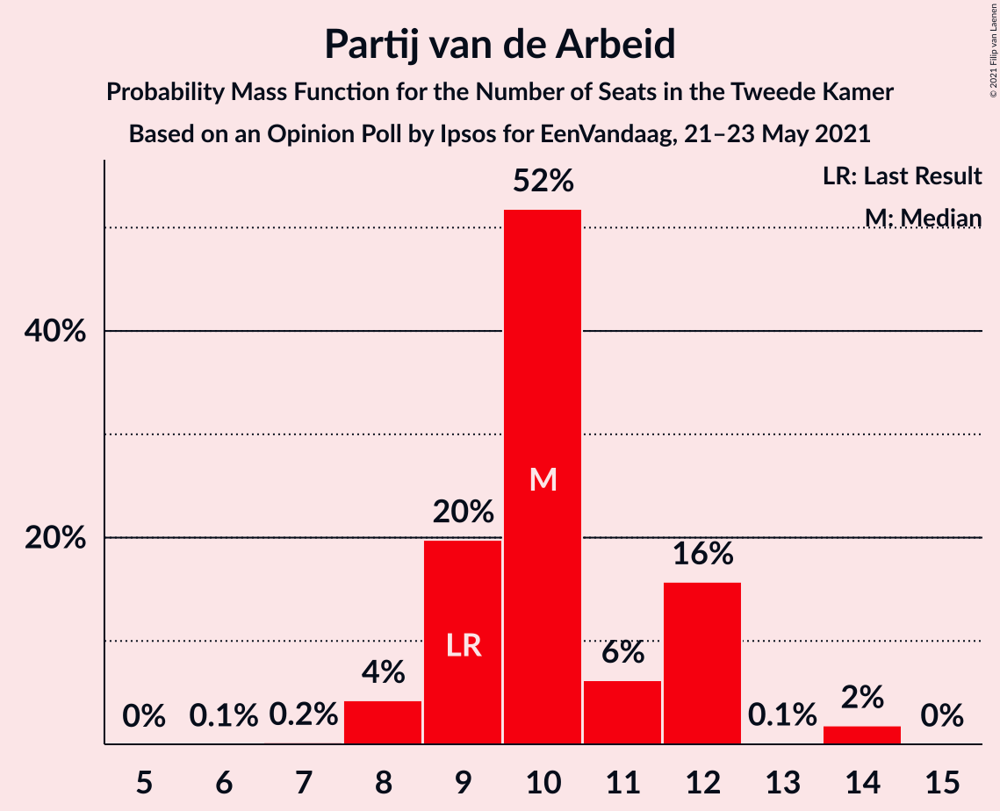

| Number of Seats | Probability | Accumulated | Special Marks |
|:---------------:|:-----------:|:-----------:|:-------------:|
| 6 | 0.1% | 100% |  |
| 7 | 0.2% | 99.9% |  |
| 8 | 4% | 99.8% |  |
| 9 | 20% | 96% | Last Result |
| 10 | 52% | 76% | Median |
| 11 | 6% | 24% |  |
| 12 | 16% | 18% |  |
| 13 | 0.1% | 2% |  |
| 14 | 2% | 2% |  |
| 15 | 0% | 0% |  |

### Partij voor de Dieren

*For a full overview of the results for this party, see the [Partij voor de Dieren](party-partijvoordedieren.html) page.*

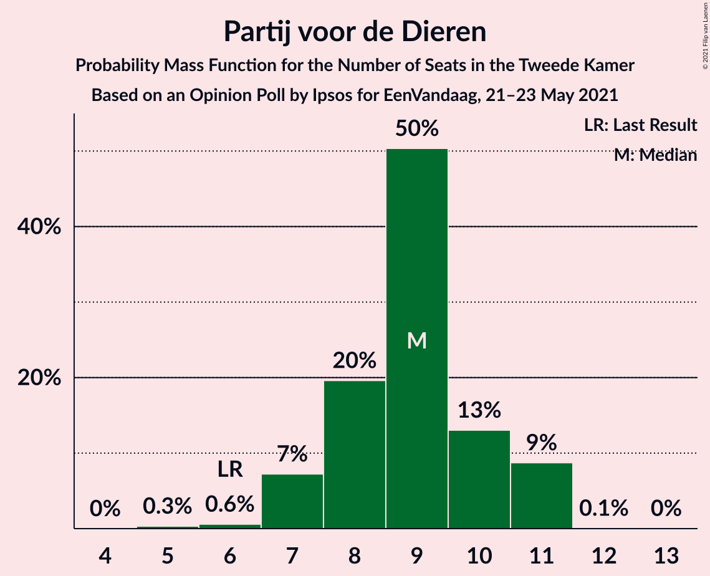

| Number of Seats | Probability | Accumulated | Special Marks |
|:---------------:|:-----------:|:-----------:|:-------------:|
| 5 | 0.3% | 100% |  |
| 6 | 0.6% | 99.7% | Last Result |
| 7 | 7% | 99.1% |  |
| 8 | 20% | 92% |  |
| 9 | 50% | 72% | Median |
| 10 | 13% | 22% |  |
| 11 | 9% | 9% |  |
| 12 | 0.1% | 0.1% |  |
| 13 | 0% | 0% |  |

### Socialistische Partij

*For a full overview of the results for this party, see the [Socialistische Partij](party-socialistischepartij.html) page.*

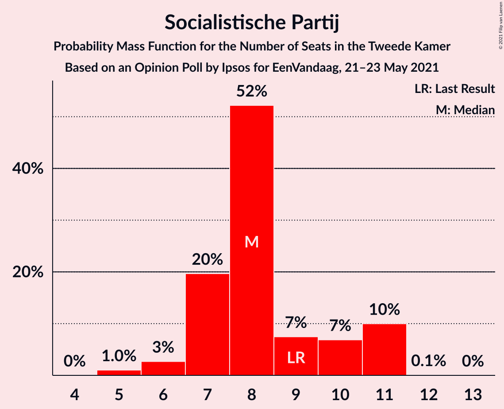

| Number of Seats | Probability | Accumulated | Special Marks |
|:---------------:|:-----------:|:-----------:|:-------------:|
| 5 | 1.0% | 100% |  |
| 6 | 3% | 99.0% |  |
| 7 | 20% | 96% |  |
| 8 | 52% | 77% | Median |
| 9 | 7% | 24% | Last Result |
| 10 | 7% | 17% |  |
| 11 | 10% | 10% |  |
| 12 | 0.1% | 0.1% |  |
| 13 | 0% | 0% |  |

### GroenLinks

*For a full overview of the results for this party, see the [GroenLinks](party-groenlinks.html) page.*

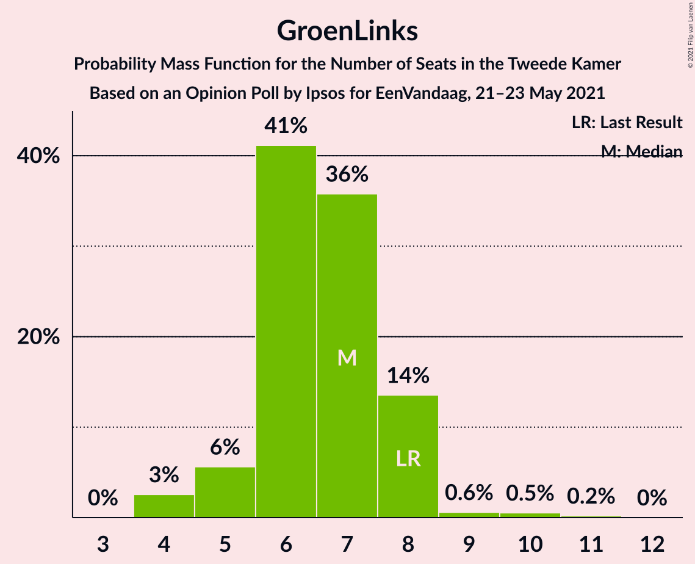

| Number of Seats | Probability | Accumulated | Special Marks |
|:---------------:|:-----------:|:-----------:|:-------------:|
| 4 | 3% | 100% |  |
| 5 | 6% | 97% |  |
| 6 | 41% | 92% |  |
| 7 | 36% | 51% | Median |
| 8 | 14% | 15% | Last Result |
| 9 | 0.6% | 1.3% |  |
| 10 | 0.5% | 0.7% |  |
| 11 | 0.2% | 0.2% |  |
| 12 | 0% | 0% |  |

### Juiste Antwoord 2021

*For a full overview of the results for this party, see the [Juiste Antwoord 2021](party-juisteantwoord2021.html) page.*

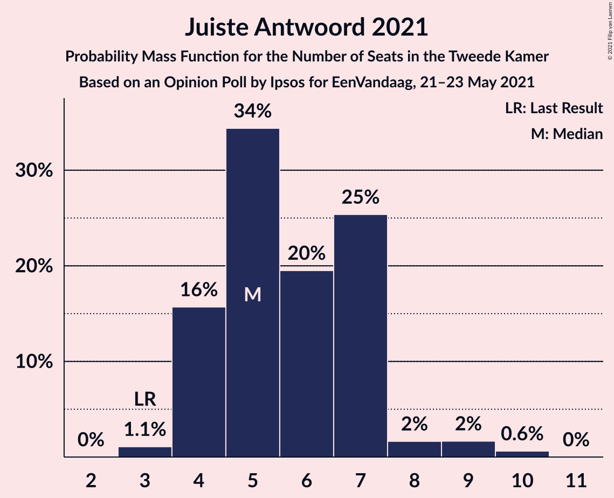

| Number of Seats | Probability | Accumulated | Special Marks |
|:---------------:|:-----------:|:-----------:|:-------------:|
| 3 | 1.1% | 100% | Last Result |
| 4 | 16% | 98.9% |  |
| 5 | 34% | 83% | Median |
| 6 | 20% | 49% |  |
| 7 | 25% | 29% |  |
| 8 | 2% | 4% |  |
| 9 | 2% | 2% |  |
| 10 | 0.6% | 0.6% |  |
| 11 | 0% | 0% |  |

### Volt Europa

*For a full overview of the results for this party, see the [Volt Europa](party-volteuropa.html) page.*

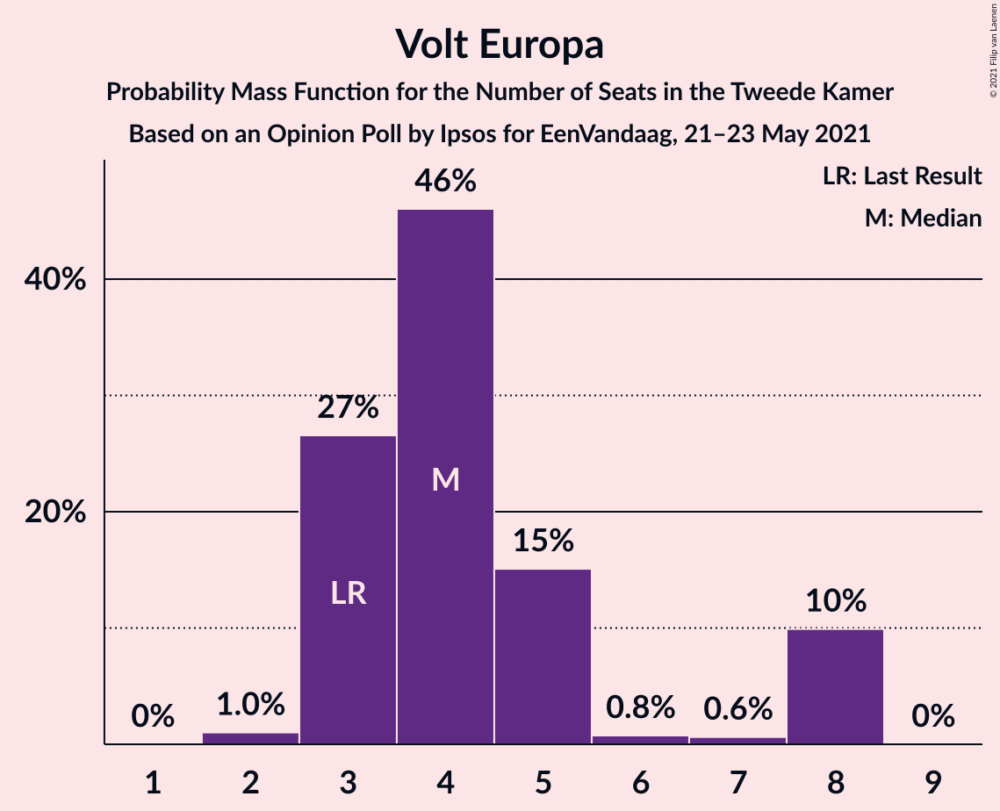

| Number of Seats | Probability | Accumulated | Special Marks |
|:---------------:|:-----------:|:-----------:|:-------------:|
| 2 | 1.0% | 100% |  |
| 3 | 27% | 99.0% | Last Result |
| 4 | 46% | 72% | Median |
| 5 | 15% | 26% |  |
| 6 | 0.8% | 11% |  |
| 7 | 0.6% | 11% |  |
| 8 | 10% | 10% |  |
| 9 | 0% | 0% |  |

### ChristenUnie

*For a full overview of the results for this party, see the [ChristenUnie](party-christenunie.html) page.*

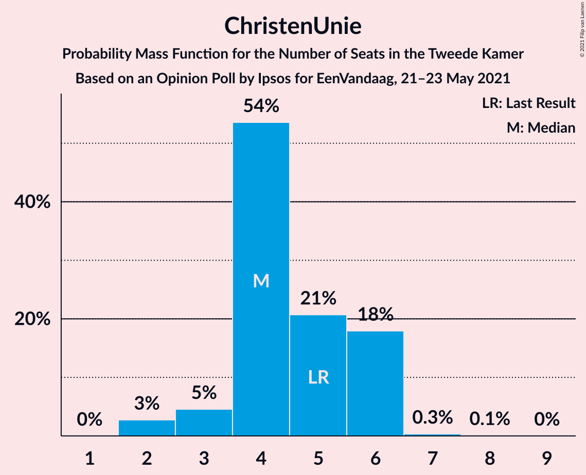

| Number of Seats | Probability | Accumulated | Special Marks |
|:---------------:|:-----------:|:-----------:|:-------------:|
| 2 | 3% | 100% |  |
| 3 | 5% | 97% |  |
| 4 | 54% | 93% | Median |
| 5 | 21% | 39% | Last Result |
| 6 | 18% | 18% |  |
| 7 | 0.3% | 0.5% |  |
| 8 | 0.1% | 0.1% |  |
| 9 | 0% | 0% |  |

### Staatkundig Gereformeerde Partij

*For a full overview of the results for this party, see the [Staatkundig Gereformeerde Partij](party-staatkundiggereformeerdepartij.html) page.*

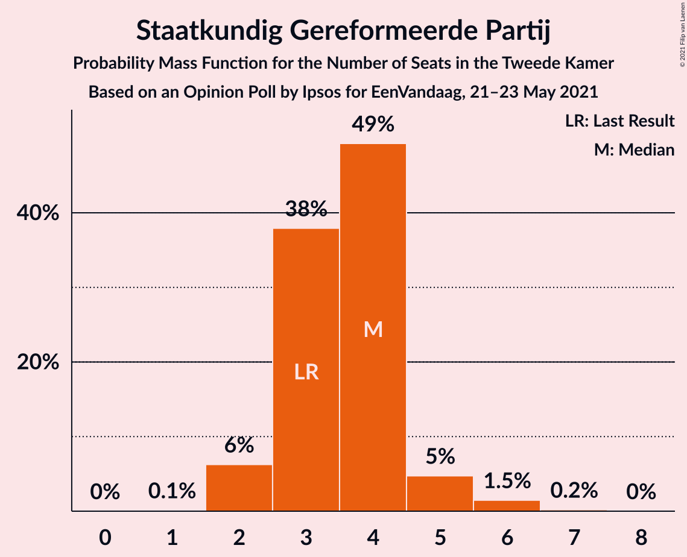

| Number of Seats | Probability | Accumulated | Special Marks |
|:---------------:|:-----------:|:-----------:|:-------------:|
| 1 | 0.1% | 100% |  |
| 2 | 6% | 99.9% |  |
| 3 | 38% | 94% | Last Result |
| 4 | 49% | 56% | Median |
| 5 | 5% | 6% |  |
| 6 | 1.5% | 2% |  |
| 7 | 0.2% | 0.2% |  |
| 8 | 0% | 0% |  |

### Forum voor Democratie

*For a full overview of the results for this party, see the [Forum voor Democratie](party-forumvoordemocratie.html) page.*

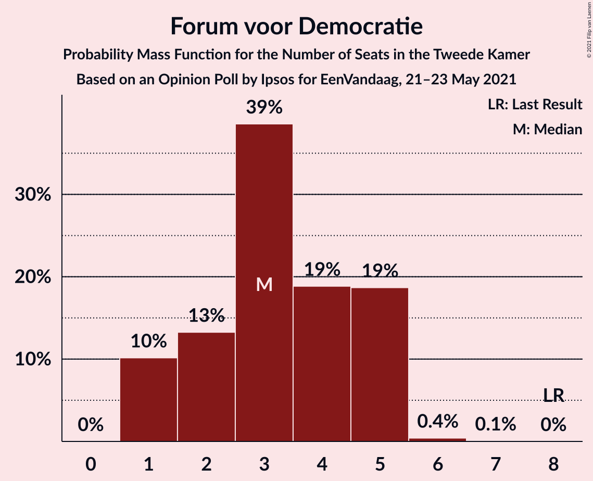

| Number of Seats | Probability | Accumulated | Special Marks |
|:---------------:|:-----------:|:-----------:|:-------------:|
| 1 | 10% | 100% |  |
| 2 | 13% | 90% |  |
| 3 | 39% | 77% | Median |
| 4 | 19% | 38% |  |
| 5 | 19% | 19% |  |
| 6 | 0.4% | 0.5% |  |
| 7 | 0.1% | 0.1% |  |
| 8 | 0% | 0% | Last Result |

### DENK

*For a full overview of the results for this party, see the [DENK](party-denk.html) page.*

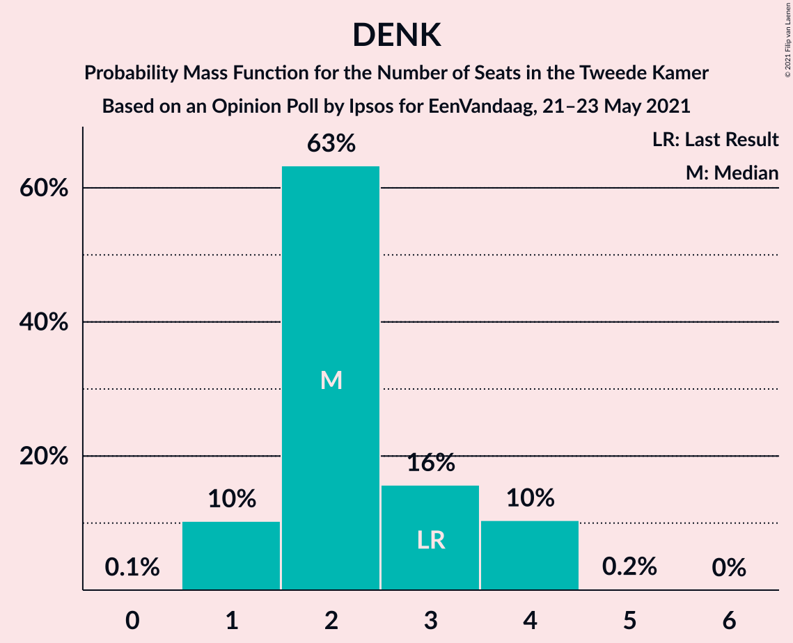

| Number of Seats | Probability | Accumulated | Special Marks |
|:---------------:|:-----------:|:-----------:|:-------------:|
| 0 | 0.1% | 100% |  |
| 1 | 10% | 99.9% |  |
| 2 | 63% | 90% | Median |
| 3 | 16% | 26% | Last Result |
| 4 | 10% | 11% |  |
| 5 | 0.2% | 0.2% |  |
| 6 | 0% | 0% |  |

### BoerBurgerBeweging

*For a full overview of the results for this party, see the [BoerBurgerBeweging](party-boerburgerbeweging.html) page.*

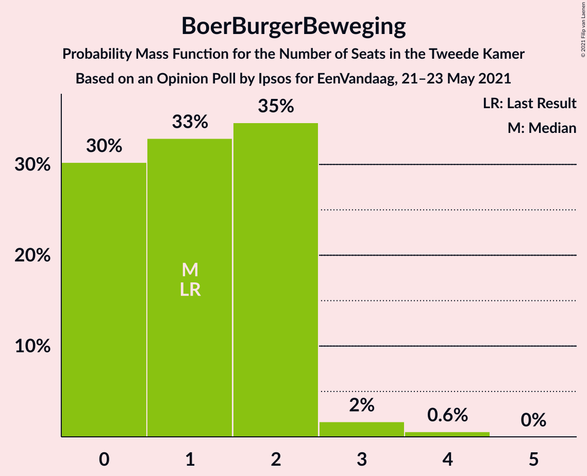

| Number of Seats | Probability | Accumulated | Special Marks |
|:---------------:|:-----------:|:-----------:|:-------------:|
| 0 | 30% | 100% |  |
| 1 | 33% | 70% | Last Result, Median |
| 2 | 35% | 37% |  |
| 3 | 2% | 2% |  |
| 4 | 0.6% | 0.6% |  |
| 5 | 0% | 0% |  |

### Bij1

*For a full overview of the results for this party, see the [Bij1](party-bij1.html) page.*

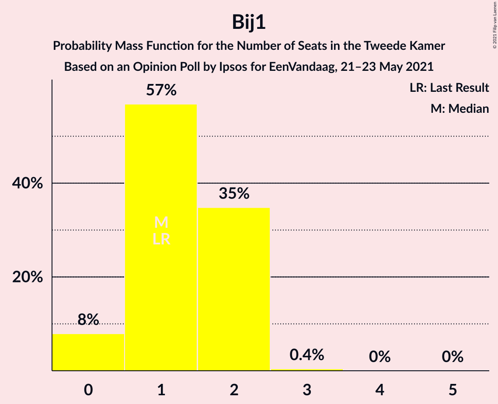

| Number of Seats | Probability | Accumulated | Special Marks |
|:---------------:|:-----------:|:-----------:|:-------------:|
| 0 | 8% | 100% |  |
| 1 | 57% | 92% | Last Result, Median |
| 2 | 35% | 35% |  |
| 3 | 0.4% | 0.4% |  |
| 4 | 0% | 0% |  |

### 50Plus

*For a full overview of the results for this party, see the [50Plus](party-50plus.html) page.*

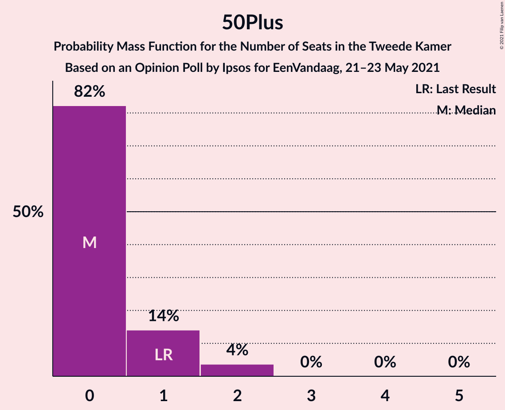

| Number of Seats | Probability | Accumulated | Special Marks |
|:---------------:|:-----------:|:-----------:|:-------------:|
| 0 | 82% | 100% | Median |
| 1 | 14% | 18% | Last Result |
| 2 | 4% | 4% |  |
| 3 | 0% | 0% |  |

## Coalitions

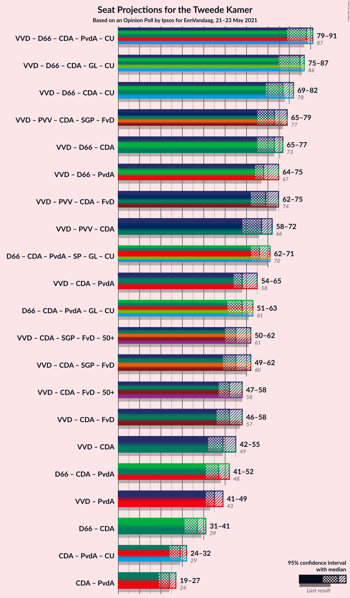

### Confidence Intervals

| Coalition | Last Result | Median | Majority? | 80% Confidence Interval | 90% Confidence Interval | 95% Confidence Interval | 99% Confidence Interval |
|:---------:|:-----------:|:------:|:---------:|:-----------------------:|:-----------------------:|:-----------------------:|:-----------------------:|
| Volkspartij voor Vrijheid en Democratie – Democraten 66 – Christen-Democratisch Appèl – Partij van de Arbeid – ChristenUnie | 87 | 88 | 100% | 80–89 | 79–90 | 79–91 | 79–92 |
| Volkspartij voor Vrijheid en Democratie – Democraten 66 – Christen-Democratisch Appèl – GroenLinks – ChristenUnie | 86 | 85 | 90% | 77–86 | 75–87 | 75–87 | 75–88 |
| Volkspartij voor Vrijheid en Democratie – Democraten 66 – Christen-Democratisch Appèl – ChristenUnie | 78 | 77 | 80% | 70–79 | 69–81 | 69–82 | 69–82 |
| Volkspartij voor Vrijheid en Democratie – Partij voor de Vrijheid – Christen-Democratisch Appèl – Staatkundig Gereformeerde Partij – Forum voor Democratie | 77 | 73 | 33% | 65–79 | 65–79 | 65–79 | 65–79 |
| Volkspartij voor Vrijheid en Democratie – Democraten 66 – Christen-Democratisch Appèl | 73 | 73 | 8% | 65–75 | 65–76 | 65–77 | 65–77 |
| Volkspartij voor Vrijheid en Democratie – Democraten 66 – Partij van de Arbeid | 67 | 68 | 0.1% | 64–72 | 64–74 | 64–75 | 63–75 |
| Volkspartij voor Vrijheid en Democratie – Partij voor de Vrijheid – Christen-Democratisch Appèl – Forum voor Democratie | 74 | 69 | 0.1% | 62–75 | 62–75 | 62–75 | 62–75 |
| Volkspartij voor Vrijheid en Democratie – Partij voor de Vrijheid – Christen-Democratisch Appèl | 66 | 67 | 0% | 61–72 | 59–72 | 58–72 | 58–72 |
| Democraten 66 – Christen-Democratisch Appèl – Partij van de Arbeid – Socialistische Partij – GroenLinks – ChristenUnie | 70 | 66 | 0% | 62–69 | 62–70 | 62–71 | 61–71 |
| Volkspartij voor Vrijheid en Democratie – Christen-Democratisch Appèl – Partij van de Arbeid | 58 | 58 | 0% | 54–65 | 54–65 | 54–65 | 53–65 |
| Democraten 66 – Christen-Democratisch Appèl – Partij van de Arbeid – GroenLinks – ChristenUnie | 61 | 58 | 0% | 53–62 | 51–62 | 51–63 | 51–65 |
| Volkspartij voor Vrijheid en Democratie – Christen-Democratisch Appèl – Staatkundig Gereformeerde Partij – Forum voor Democratie – 50Plus | 61 | 55 | 0% | 50–62 | 50–62 | 50–62 | 49–62 |
| Volkspartij voor Vrijheid en Democratie – Christen-Democratisch Appèl – Staatkundig Gereformeerde Partij – Forum voor Democratie | 60 | 55 | 0% | 50–62 | 50–62 | 49–62 | 49–62 |
| Volkspartij voor Vrijheid en Democratie – Christen-Democratisch Appèl – Forum voor Democratie – 50Plus | 58 | 52 | 0% | 47–58 | 47–58 | 47–58 | 45–58 |
| Volkspartij voor Vrijheid en Democratie – Christen-Democratisch Appèl – Forum voor Democratie | 57 | 52 | 0% | 47–58 | 47–58 | 46–58 | 44–58 |
| Volkspartij voor Vrijheid en Democratie – Christen-Democratisch Appèl | 49 | 49 | 0% | 45–55 | 45–55 | 42–55 | 42–55 |
| Democraten 66 – Christen-Democratisch Appèl – Partij van de Arbeid | 48 | 47 | 0% | 41–50 | 41–51 | 41–52 | 41–54 |
| Volkspartij voor Vrijheid en Democratie – Partij van de Arbeid | 43 | 45 | 0% | 41–49 | 41–49 | 41–49 | 40–50 |
| Democraten 66 – Christen-Democratisch Appèl | 39 | 37 | 0% | 32–40 | 31–41 | 31–41 | 31–45 |
| Christen-Democratisch Appèl – Partij van de Arbeid – ChristenUnie | 29 | 29 | 0% | 25–32 | 24–32 | 24–32 | 24–32 |
| Christen-Democratisch Appèl – Partij van de Arbeid | 24 | 24 | 0% | 21–26 | 19–26 | 19–27 | 19–27 |

### Volkspartij voor Vrijheid en Democratie – Democraten 66 – Christen-Democratisch Appèl – Partij van de Arbeid – ChristenUnie

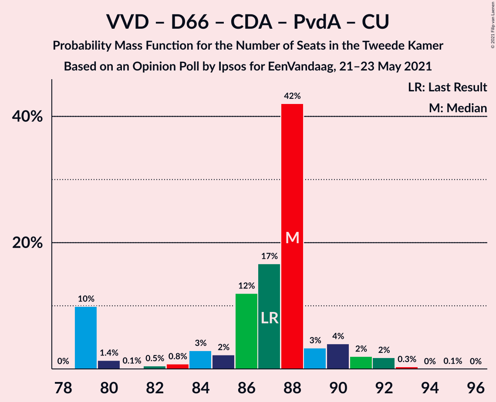

| Number of Seats | Probability | Accumulated | Special Marks |
|:---------------:|:-----------:|:-----------:|:-------------:|
| 79 | 10% | 100% |  |
| 80 | 1.4% | 90% |  |
| 81 | 0.1% | 89% |  |
| 82 | 0.5% | 89% |  |
| 83 | 0.8% | 88% |  |
| 84 | 3% | 87% |  |
| 85 | 2% | 84% |  |
| 86 | 12% | 82% | Median |
| 87 | 17% | 70% | Last Result |
| 88 | 42% | 54% |  |
| 89 | 3% | 12% |  |
| 90 | 4% | 8% |  |
| 91 | 2% | 4% |  |
| 92 | 2% | 2% |  |
| 93 | 0.3% | 0.4% |  |
| 94 | 0% | 0.1% |  |
| 95 | 0.1% | 0.1% |  |
| 96 | 0% | 0% |  |

### Volkspartij voor Vrijheid en Democratie – Democraten 66 – Christen-Democratisch Appèl – GroenLinks – ChristenUnie

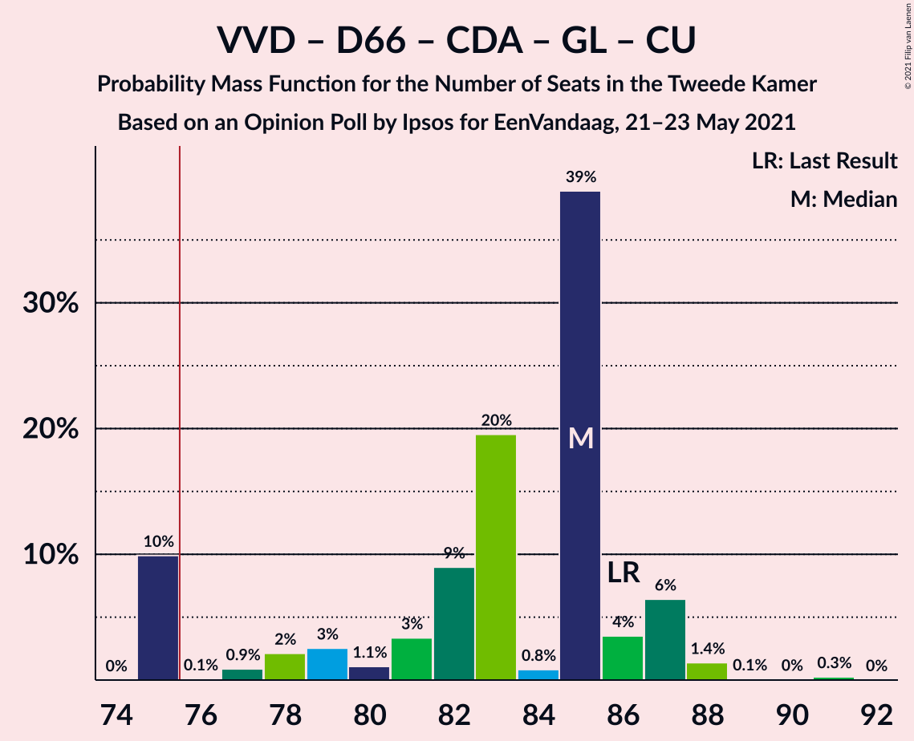

| Number of Seats | Probability | Accumulated | Special Marks |
|:---------------:|:-----------:|:-----------:|:-------------:|
| 75 | 10% | 100% |  |
| 76 | 0.1% | 90% | Majority |
| 77 | 0.9% | 90% |  |
| 78 | 2% | 89% |  |
| 79 | 3% | 87% |  |
| 80 | 1.1% | 84% |  |
| 81 | 3% | 83% |  |
| 82 | 9% | 80% |  |
| 83 | 20% | 71% | Median |
| 84 | 0.8% | 51% |  |
| 85 | 39% | 51% |  |
| 86 | 4% | 12% | Last Result |
| 87 | 6% | 8% |  |
| 88 | 1.4% | 2% |  |
| 89 | 0.1% | 0.4% |  |
| 90 | 0% | 0.3% |  |
| 91 | 0.3% | 0.3% |  |
| 92 | 0% | 0% |  |

### Volkspartij voor Vrijheid en Democratie – Democraten 66 – Christen-Democratisch Appèl – ChristenUnie

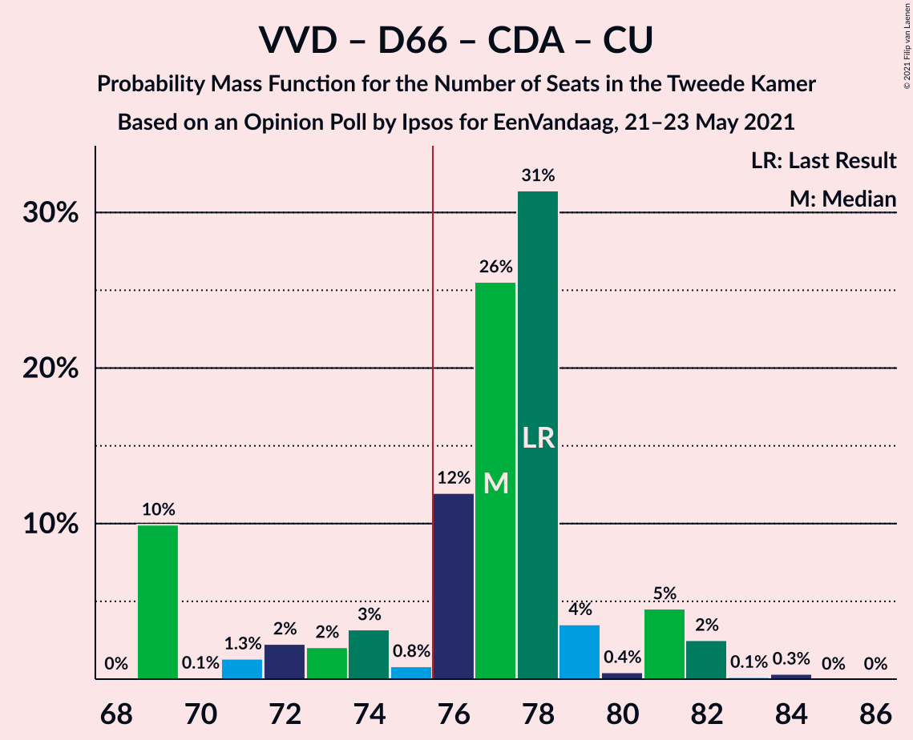

| Number of Seats | Probability | Accumulated | Special Marks |
|:---------------:|:-----------:|:-----------:|:-------------:|
| 69 | 10% | 100% |  |
| 70 | 0.1% | 90% |  |
| 71 | 1.3% | 90% |  |
| 72 | 2% | 89% |  |
| 73 | 2% | 86% |  |
| 74 | 3% | 84% |  |
| 75 | 0.8% | 81% |  |
| 76 | 12% | 80% | Median, Majority |
| 77 | 26% | 68% |  |
| 78 | 31% | 43% | Last Result |
| 79 | 4% | 11% |  |
| 80 | 0.4% | 8% |  |
| 81 | 5% | 8% |  |
| 82 | 2% | 3% |  |
| 83 | 0.1% | 0.5% |  |
| 84 | 0.3% | 0.4% |  |
| 85 | 0% | 0% |  |

### Volkspartij voor Vrijheid en Democratie – Partij voor de Vrijheid – Christen-Democratisch Appèl – Staatkundig Gereformeerde Partij – Forum voor Democratie

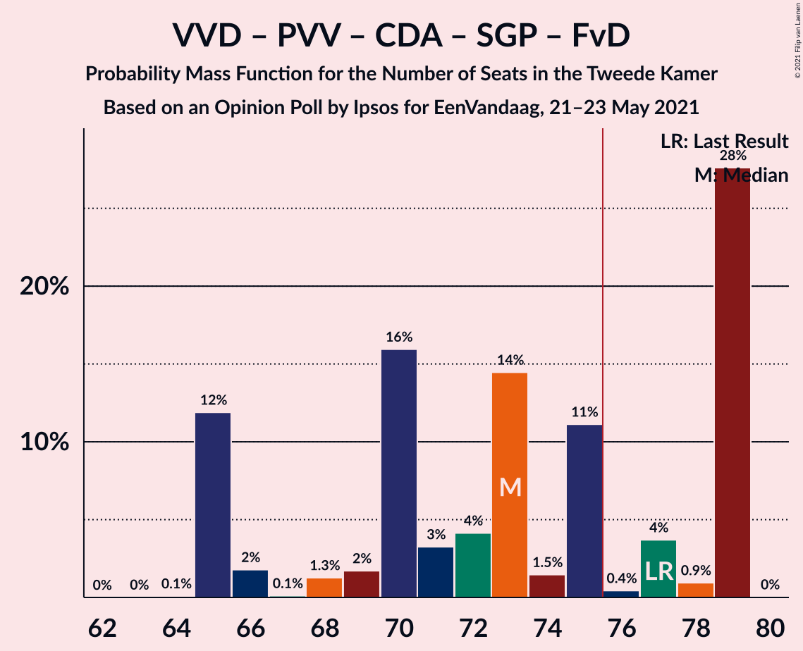

| Number of Seats | Probability | Accumulated | Special Marks |
|:---------------:|:-----------:|:-----------:|:-------------:|
| 64 | 0.1% | 100% |  |
| 65 | 12% | 99.9% |  |
| 66 | 2% | 88% |  |
| 67 | 0.1% | 86% |  |
| 68 | 1.3% | 86% |  |
| 69 | 2% | 85% |  |
| 70 | 16% | 83% |  |
| 71 | 3% | 67% |  |
| 72 | 4% | 64% |  |
| 73 | 14% | 60% | Median |
| 74 | 1.5% | 45% |  |
| 75 | 11% | 44% |  |
| 76 | 0.4% | 33% | Majority |
| 77 | 4% | 32% | Last Result |
| 78 | 0.9% | 29% |  |
| 79 | 28% | 28% |  |
| 80 | 0% | 0% |  |

### Volkspartij voor Vrijheid en Democratie – Democraten 66 – Christen-Democratisch Appèl

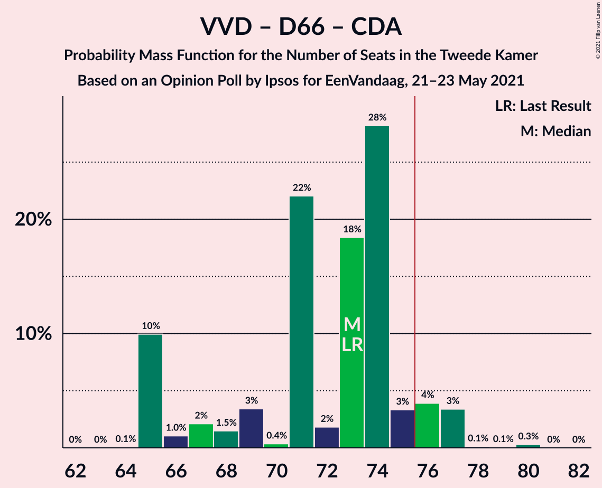

| Number of Seats | Probability | Accumulated | Special Marks |
|:---------------:|:-----------:|:-----------:|:-------------:|
| 64 | 0.1% | 100% |  |
| 65 | 10% | 99.9% |  |
| 66 | 1.0% | 90% |  |
| 67 | 2% | 89% |  |
| 68 | 1.5% | 87% |  |
| 69 | 3% | 85% |  |
| 70 | 0.4% | 82% |  |
| 71 | 22% | 82% |  |
| 72 | 2% | 60% | Median |
| 73 | 18% | 58% | Last Result |
| 74 | 28% | 39% |  |
| 75 | 3% | 11% |  |
| 76 | 4% | 8% | Majority |
| 77 | 3% | 4% |  |
| 78 | 0.1% | 0.5% |  |
| 79 | 0.1% | 0.4% |  |
| 80 | 0.3% | 0.3% |  |
| 81 | 0% | 0% |  |

### Volkspartij voor Vrijheid en Democratie – Democraten 66 – Partij van de Arbeid

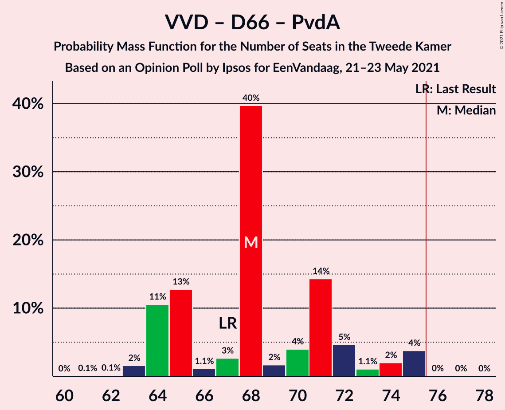

| Number of Seats | Probability | Accumulated | Special Marks |
|:---------------:|:-----------:|:-----------:|:-------------:|
| 61 | 0.1% | 100% |  |
| 62 | 0.1% | 99.9% |  |
| 63 | 2% | 99.8% |  |
| 64 | 11% | 98% |  |
| 65 | 13% | 88% |  |
| 66 | 1.1% | 75% |  |
| 67 | 3% | 74% | Last Result |
| 68 | 40% | 71% | Median |
| 69 | 2% | 31% |  |
| 70 | 4% | 30% |  |
| 71 | 14% | 26% |  |
| 72 | 5% | 12% |  |
| 73 | 1.1% | 7% |  |
| 74 | 2% | 6% |  |
| 75 | 4% | 4% |  |
| 76 | 0% | 0.1% | Majority |
| 77 | 0% | 0% |  |

### Volkspartij voor Vrijheid en Democratie – Partij voor de Vrijheid – Christen-Democratisch Appèl – Forum voor Democratie

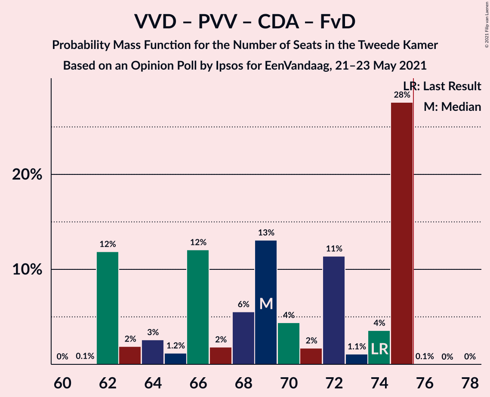

| Number of Seats | Probability | Accumulated | Special Marks |
|:---------------:|:-----------:|:-----------:|:-------------:|
| 61 | 0.1% | 100% |  |
| 62 | 12% | 99.9% |  |
| 63 | 2% | 88% |  |
| 64 | 3% | 86% |  |
| 65 | 1.2% | 84% |  |
| 66 | 12% | 82% |  |
| 67 | 2% | 70% |  |
| 68 | 6% | 68% |  |
| 69 | 13% | 63% | Median |
| 70 | 4% | 50% |  |
| 71 | 2% | 45% |  |
| 72 | 11% | 44% |  |
| 73 | 1.1% | 32% |  |
| 74 | 4% | 31% | Last Result |
| 75 | 28% | 28% |  |
| 76 | 0.1% | 0.1% | Majority |
| 77 | 0% | 0% |  |

### Volkspartij voor Vrijheid en Democratie – Partij voor de Vrijheid – Christen-Democratisch Appèl

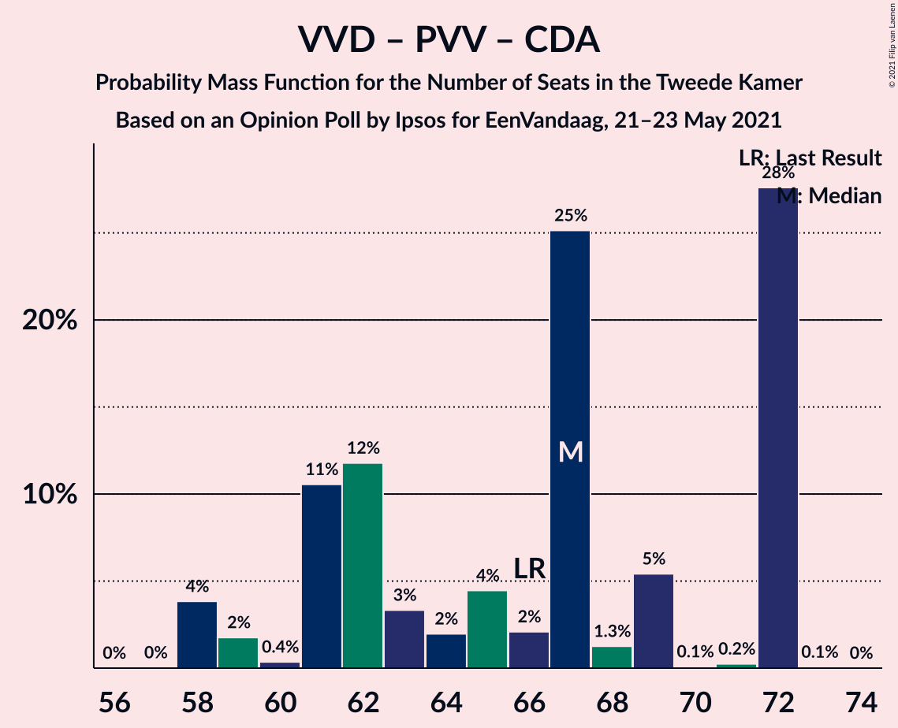

| Number of Seats | Probability | Accumulated | Special Marks |
|:---------------:|:-----------:|:-----------:|:-------------:|
| 58 | 4% | 100% |  |
| 59 | 2% | 96% |  |
| 60 | 0.4% | 94% |  |
| 61 | 11% | 94% |  |
| 62 | 12% | 83% |  |
| 63 | 3% | 72% |  |
| 64 | 2% | 68% |  |
| 65 | 4% | 66% |  |
| 66 | 2% | 62% | Last Result, Median |
| 67 | 25% | 60% |  |
| 68 | 1.3% | 35% |  |
| 69 | 5% | 33% |  |
| 70 | 0.1% | 28% |  |
| 71 | 0.2% | 28% |  |
| 72 | 28% | 28% |  |
| 73 | 0.1% | 0.1% |  |
| 74 | 0% | 0% |  |

### Democraten 66 – Christen-Democratisch Appèl – Partij van de Arbeid – Socialistische Partij – GroenLinks – ChristenUnie

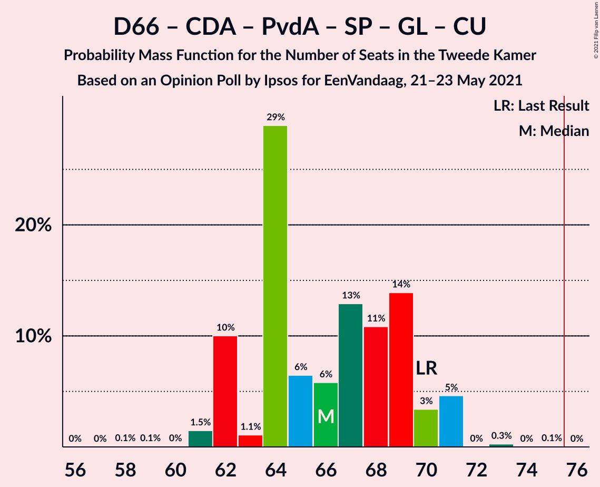

| Number of Seats | Probability | Accumulated | Special Marks |
|:---------------:|:-----------:|:-----------:|:-------------:|
| 58 | 0.1% | 100% |  |
| 59 | 0.1% | 99.9% |  |
| 60 | 0% | 99.9% |  |
| 61 | 1.5% | 99.8% |  |
| 62 | 10% | 98% |  |
| 63 | 1.1% | 88% |  |
| 64 | 29% | 87% |  |
| 65 | 6% | 58% |  |
| 66 | 6% | 52% | Median |
| 67 | 13% | 46% |  |
| 68 | 11% | 33% |  |
| 69 | 14% | 22% |  |
| 70 | 3% | 8% | Last Result |
| 71 | 5% | 5% |  |
| 72 | 0% | 0.4% |  |
| 73 | 0.3% | 0.3% |  |
| 74 | 0% | 0.1% |  |
| 75 | 0.1% | 0.1% |  |
| 76 | 0% | 0% | Majority |

### Volkspartij voor Vrijheid en Democratie – Christen-Democratisch Appèl – Partij van de Arbeid

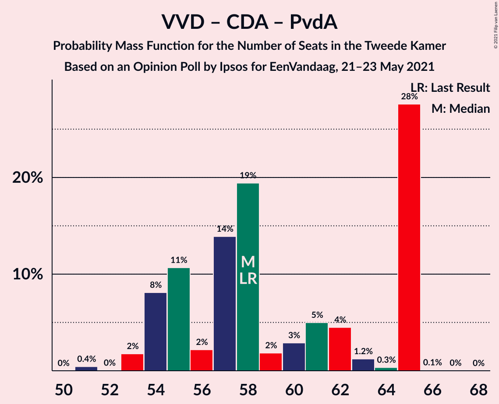

| Number of Seats | Probability | Accumulated | Special Marks |
|:---------------:|:-----------:|:-----------:|:-------------:|
| 51 | 0.4% | 100% |  |
| 52 | 0% | 99.6% |  |
| 53 | 2% | 99.5% |  |
| 54 | 8% | 98% |  |
| 55 | 11% | 90% |  |
| 56 | 2% | 79% |  |
| 57 | 14% | 77% |  |
| 58 | 19% | 63% | Last Result |
| 59 | 2% | 43% | Median |
| 60 | 3% | 42% |  |
| 61 | 5% | 39% |  |
| 62 | 4% | 34% |  |
| 63 | 1.2% | 29% |  |
| 64 | 0.3% | 28% |  |
| 65 | 28% | 28% |  |
| 66 | 0.1% | 0.1% |  |
| 67 | 0% | 0% |  |

### Democraten 66 – Christen-Democratisch Appèl – Partij van de Arbeid – GroenLinks – ChristenUnie

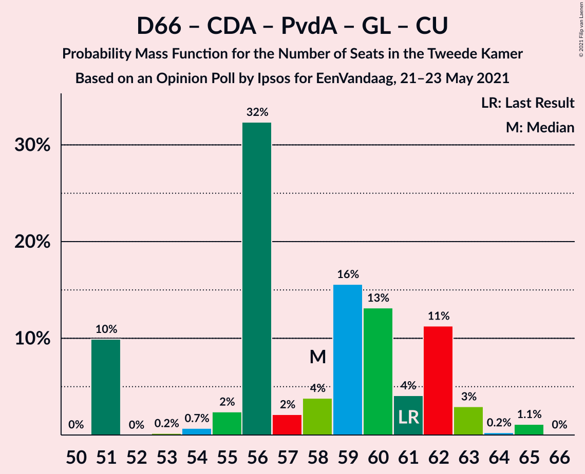

| Number of Seats | Probability | Accumulated | Special Marks |
|:---------------:|:-----------:|:-----------:|:-------------:|
| 50 | 0% | 100% |  |
| 51 | 10% | 99.9% |  |
| 52 | 0% | 90% |  |
| 53 | 0.2% | 90% |  |
| 54 | 0.7% | 90% |  |
| 55 | 2% | 89% |  |
| 56 | 32% | 87% |  |
| 57 | 2% | 54% |  |
| 58 | 4% | 52% | Median |
| 59 | 16% | 48% |  |
| 60 | 13% | 33% |  |
| 61 | 4% | 20% | Last Result |
| 62 | 11% | 16% |  |
| 63 | 3% | 4% |  |
| 64 | 0.2% | 1.4% |  |
| 65 | 1.1% | 1.2% |  |
| 66 | 0% | 0% |  |

### Volkspartij voor Vrijheid en Democratie – Christen-Democratisch Appèl – Staatkundig Gereformeerde Partij – Forum voor Democratie – 50Plus

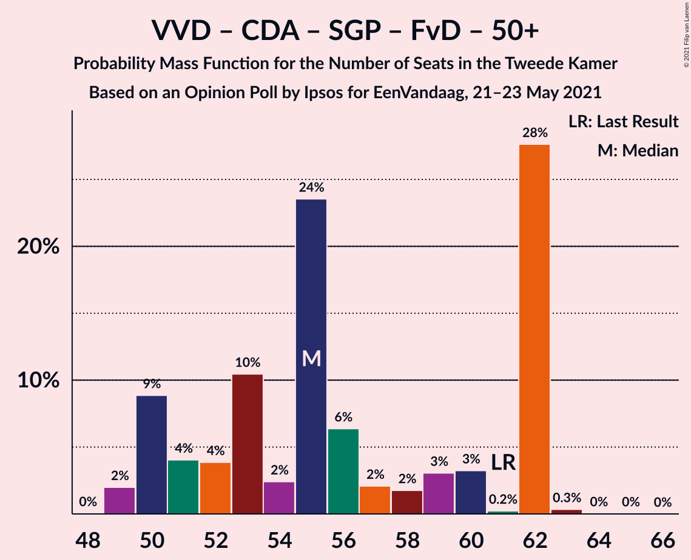

| Number of Seats | Probability | Accumulated | Special Marks |
|:---------------:|:-----------:|:-----------:|:-------------:|
| 48 | 0% | 100% |  |
| 49 | 2% | 99.9% |  |
| 50 | 9% | 98% |  |
| 51 | 4% | 89% |  |
| 52 | 4% | 85% |  |
| 53 | 10% | 81% |  |
| 54 | 2% | 71% |  |
| 55 | 24% | 68% |  |
| 56 | 6% | 45% | Median |
| 57 | 2% | 38% |  |
| 58 | 2% | 36% |  |
| 59 | 3% | 35% |  |
| 60 | 3% | 32% |  |
| 61 | 0.2% | 28% | Last Result |
| 62 | 28% | 28% |  |
| 63 | 0.3% | 0.4% |  |
| 64 | 0% | 0.1% |  |
| 65 | 0% | 0% |  |

### Volkspartij voor Vrijheid en Democratie – Christen-Democratisch Appèl – Staatkundig Gereformeerde Partij – Forum voor Democratie

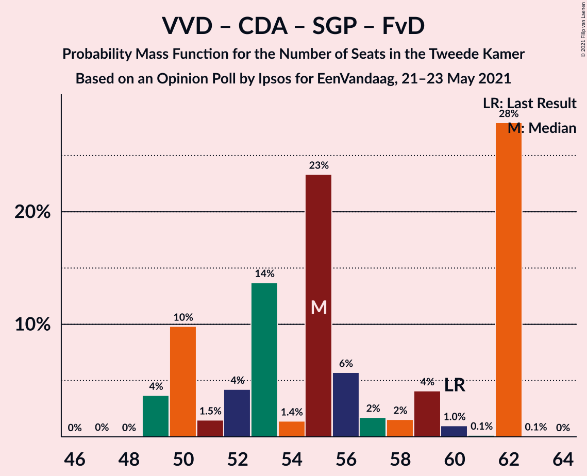

| Number of Seats | Probability | Accumulated | Special Marks |
|:---------------:|:-----------:|:-----------:|:-------------:|
| 47 | 0% | 100% |  |
| 48 | 0% | 99.9% |  |
| 49 | 4% | 99.9% |  |
| 50 | 10% | 96% |  |
| 51 | 1.5% | 86% |  |
| 52 | 4% | 85% |  |
| 53 | 14% | 81% |  |
| 54 | 1.4% | 67% |  |
| 55 | 23% | 66% |  |
| 56 | 6% | 42% | Median |
| 57 | 2% | 37% |  |
| 58 | 2% | 35% |  |
| 59 | 4% | 33% |  |
| 60 | 1.0% | 29% | Last Result |
| 61 | 0.1% | 28% |  |
| 62 | 28% | 28% |  |
| 63 | 0.1% | 0.1% |  |
| 64 | 0% | 0% |  |

### Volkspartij voor Vrijheid en Democratie – Christen-Democratisch Appèl – Forum voor Democratie – 50Plus

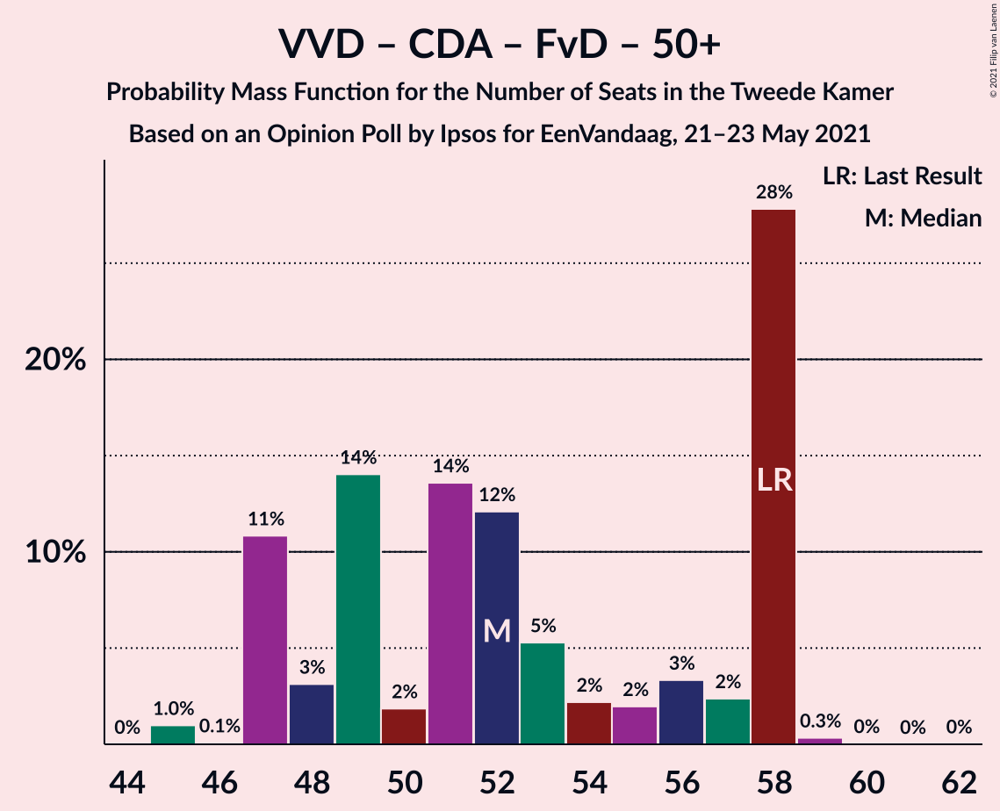

| Number of Seats | Probability | Accumulated | Special Marks |
|:---------------:|:-----------:|:-----------:|:-------------:|
| 45 | 1.0% | 100% |  |
| 46 | 0.1% | 99.0% |  |
| 47 | 11% | 98.9% |  |
| 48 | 3% | 88% |  |
| 49 | 14% | 85% |  |
| 50 | 2% | 71% |  |
| 51 | 14% | 69% |  |
| 52 | 12% | 55% | Median |
| 53 | 5% | 43% |  |
| 54 | 2% | 38% |  |
| 55 | 2% | 36% |  |
| 56 | 3% | 34% |  |
| 57 | 2% | 31% |  |
| 58 | 28% | 28% | Last Result |
| 59 | 0.3% | 0.4% |  |
| 60 | 0% | 0.1% |  |
| 61 | 0% | 0% |  |

### Volkspartij voor Vrijheid en Democratie – Christen-Democratisch Appèl – Forum voor Democratie

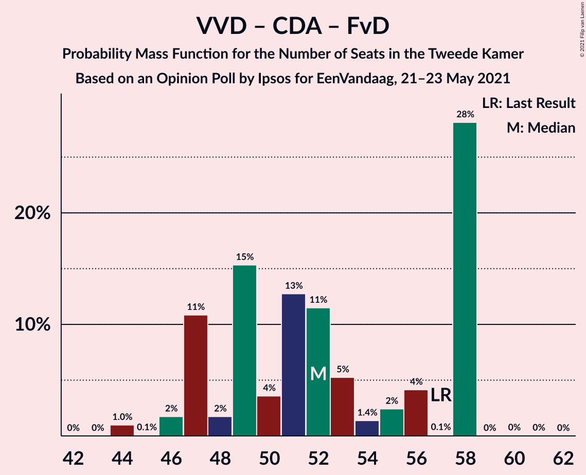

| Number of Seats | Probability | Accumulated | Special Marks |
|:---------------:|:-----------:|:-----------:|:-------------:|
| 44 | 1.0% | 100% |  |
| 45 | 0.1% | 99.0% |  |
| 46 | 2% | 99.0% |  |
| 47 | 11% | 97% |  |
| 48 | 2% | 86% |  |
| 49 | 15% | 85% |  |
| 50 | 4% | 69% |  |
| 51 | 13% | 66% |  |
| 52 | 11% | 53% | Median |
| 53 | 5% | 41% |  |
| 54 | 1.4% | 36% |  |
| 55 | 2% | 35% |  |
| 56 | 4% | 32% |  |
| 57 | 0.1% | 28% | Last Result |
| 58 | 28% | 28% |  |
| 59 | 0% | 0.1% |  |
| 60 | 0% | 0.1% |  |
| 61 | 0% | 0% |  |

### Volkspartij voor Vrijheid en Democratie – Christen-Democratisch Appèl

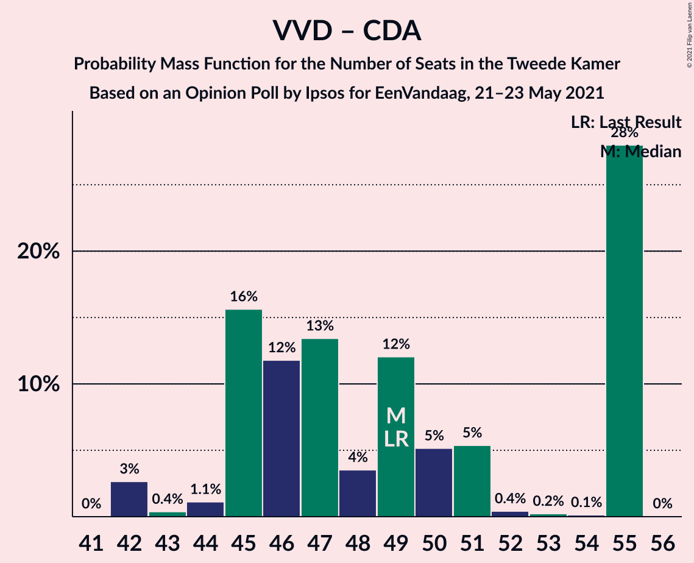

| Number of Seats | Probability | Accumulated | Special Marks |
|:---------------:|:-----------:|:-----------:|:-------------:|
| 41 | 0% | 100% |  |
| 42 | 3% | 99.9% |  |
| 43 | 0.4% | 97% |  |
| 44 | 1.1% | 97% |  |
| 45 | 16% | 96% |  |
| 46 | 12% | 80% |  |
| 47 | 13% | 68% |  |
| 48 | 4% | 55% |  |
| 49 | 12% | 51% | Last Result, Median |
| 50 | 5% | 39% |  |
| 51 | 5% | 34% |  |
| 52 | 0.4% | 29% |  |
| 53 | 0.2% | 28% |  |
| 54 | 0.1% | 28% |  |
| 55 | 28% | 28% |  |
| 56 | 0% | 0% |  |

### Democraten 66 – Christen-Democratisch Appèl – Partij van de Arbeid

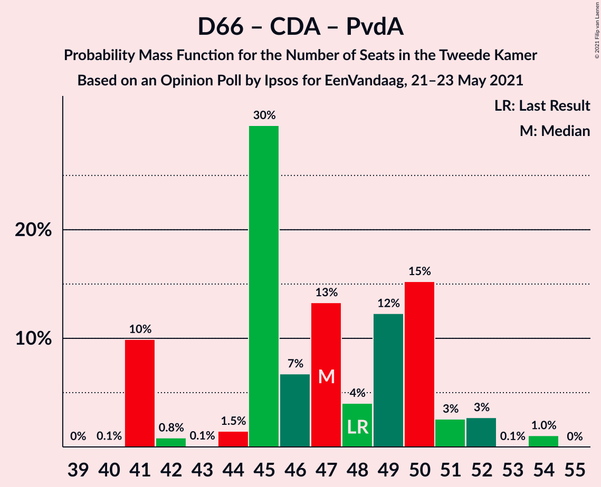

| Number of Seats | Probability | Accumulated | Special Marks |
|:---------------:|:-----------:|:-----------:|:-------------:|
| 39 | 0% | 100% |  |
| 40 | 0.1% | 99.9% |  |
| 41 | 10% | 99.9% |  |
| 42 | 0.8% | 90% |  |
| 43 | 0.1% | 89% |  |
| 44 | 1.5% | 89% |  |
| 45 | 30% | 88% |  |
| 46 | 7% | 58% |  |
| 47 | 13% | 51% | Median |
| 48 | 4% | 38% | Last Result |
| 49 | 12% | 34% |  |
| 50 | 15% | 22% |  |
| 51 | 3% | 6% |  |
| 52 | 3% | 4% |  |
| 53 | 0.1% | 1.1% |  |
| 54 | 1.0% | 1.1% |  |
| 55 | 0% | 0% |  |

### Volkspartij voor Vrijheid en Democratie – Partij van de Arbeid

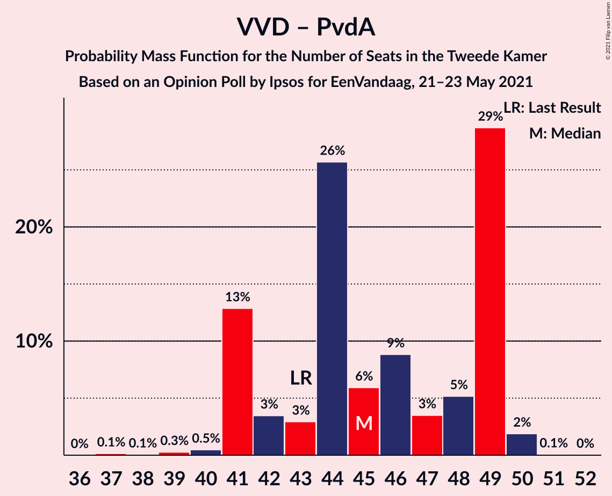

| Number of Seats | Probability | Accumulated | Special Marks |
|:---------------:|:-----------:|:-----------:|:-------------:|
| 37 | 0.1% | 100% |  |
| 38 | 0.1% | 99.8% |  |
| 39 | 0.3% | 99.8% |  |
| 40 | 0.5% | 99.5% |  |
| 41 | 13% | 99.0% |  |
| 42 | 3% | 86% |  |
| 43 | 3% | 83% | Last Result |
| 44 | 26% | 80% |  |
| 45 | 6% | 54% | Median |
| 46 | 9% | 48% |  |
| 47 | 3% | 39% |  |
| 48 | 5% | 36% |  |
| 49 | 29% | 31% |  |
| 50 | 2% | 2% |  |
| 51 | 0.1% | 0.1% |  |
| 52 | 0% | 0% |  |

### Democraten 66 – Christen-Democratisch Appèl

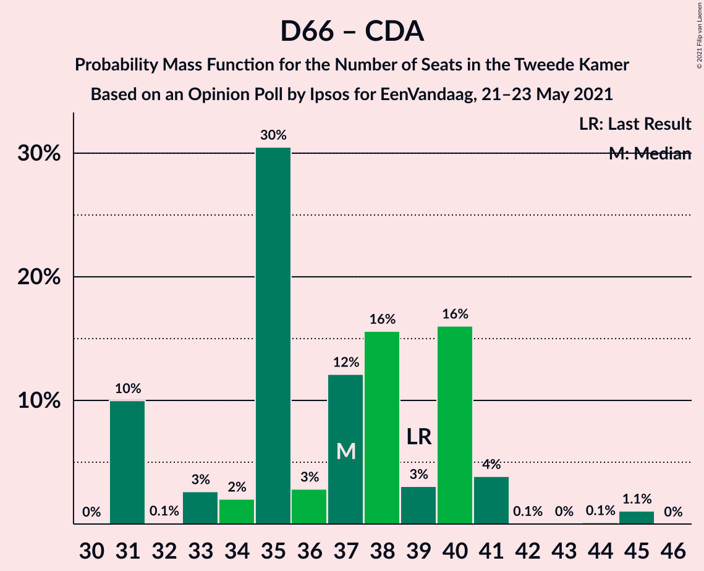

| Number of Seats | Probability | Accumulated | Special Marks |
|:---------------:|:-----------:|:-----------:|:-------------:|
| 31 | 10% | 100% |  |
| 32 | 0.1% | 90% |  |
| 33 | 3% | 90% |  |
| 34 | 2% | 87% |  |
| 35 | 30% | 85% |  |
| 36 | 3% | 55% |  |
| 37 | 12% | 52% | Median |
| 38 | 16% | 40% |  |
| 39 | 3% | 24% | Last Result |
| 40 | 16% | 21% |  |
| 41 | 4% | 5% |  |
| 42 | 0.1% | 1.3% |  |
| 43 | 0% | 1.2% |  |
| 44 | 0.1% | 1.2% |  |
| 45 | 1.1% | 1.1% |  |
| 46 | 0% | 0% |  |

### Christen-Democratisch Appèl – Partij van de Arbeid – ChristenUnie

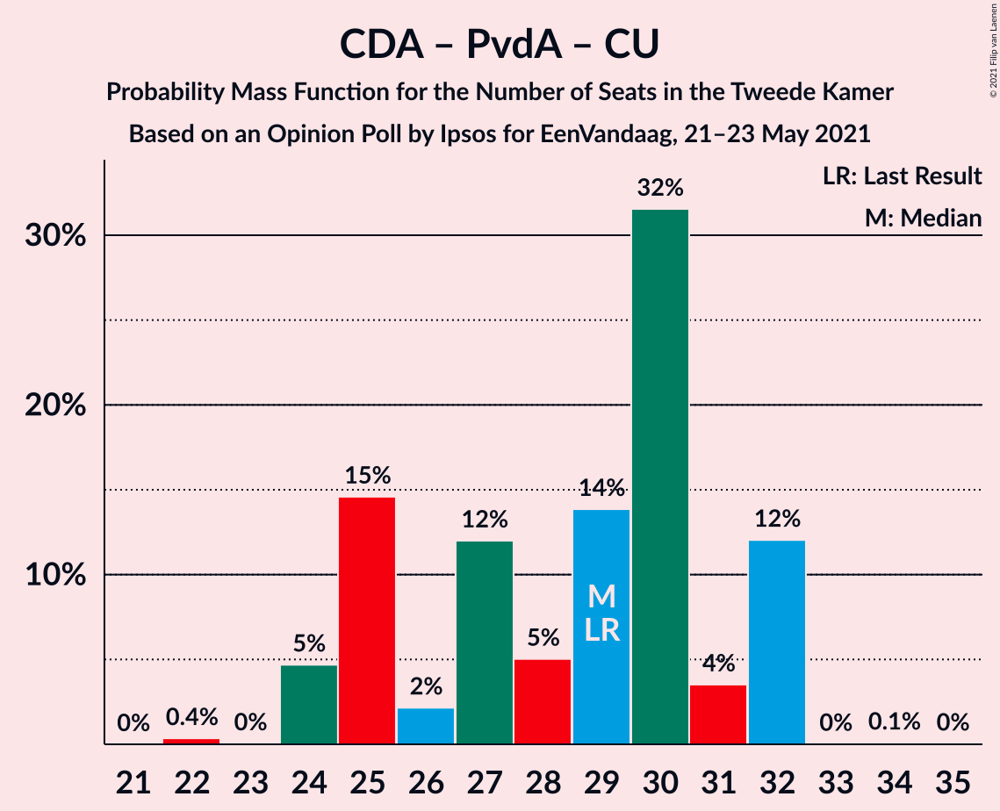

| Number of Seats | Probability | Accumulated | Special Marks |
|:---------------:|:-----------:|:-----------:|:-------------:|
| 22 | 0.4% | 100% |  |
| 23 | 0% | 99.6% |  |
| 24 | 5% | 99.6% |  |
| 25 | 15% | 95% |  |
| 26 | 2% | 80% |  |
| 27 | 12% | 78% |  |
| 28 | 5% | 66% | Median |
| 29 | 14% | 61% | Last Result |
| 30 | 32% | 47% |  |
| 31 | 4% | 16% |  |
| 32 | 12% | 12% |  |
| 33 | 0% | 0.1% |  |
| 34 | 0.1% | 0.1% |  |
| 35 | 0% | 0% |  |

### Christen-Democratisch Appèl – Partij van de Arbeid

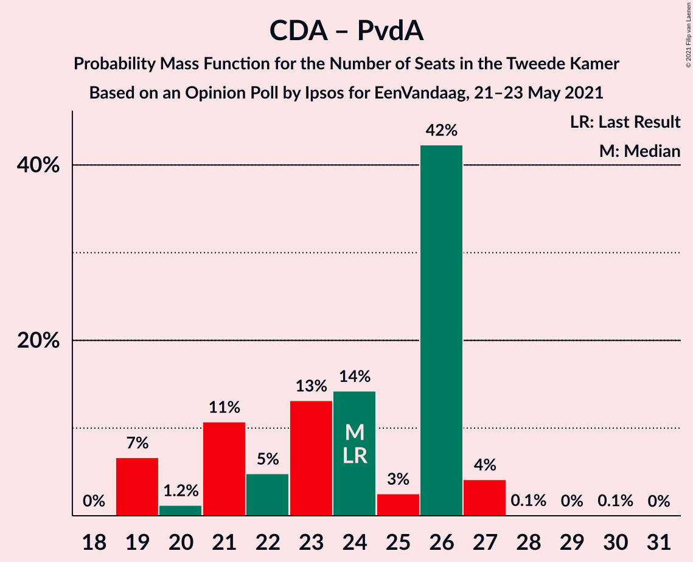

| Number of Seats | Probability | Accumulated | Special Marks |
|:---------------:|:-----------:|:-----------:|:-------------:|
| 19 | 7% | 100% |  |
| 20 | 1.2% | 93% |  |
| 21 | 11% | 92% |  |
| 22 | 5% | 81% |  |
| 23 | 13% | 77% |  |
| 24 | 14% | 63% | Last Result, Median |
| 25 | 3% | 49% |  |
| 26 | 42% | 47% |  |
| 27 | 4% | 4% |  |
| 28 | 0.1% | 0.2% |  |
| 29 | 0% | 0.1% |  |
| 30 | 0.1% | 0.1% |  |
| 31 | 0% | 0% |  |

## Technical Information

### Opinion Poll

+ **Polling firm:** Ipsos
+ **Commissioner(s):** EenVandaag
+ **Fieldwork period:** 21–23 May 2021

### Calculations

+ **Sample size:** 1010
+ **Simulations done:** 1,048,576
+ **Error estimate:** 4.59%

