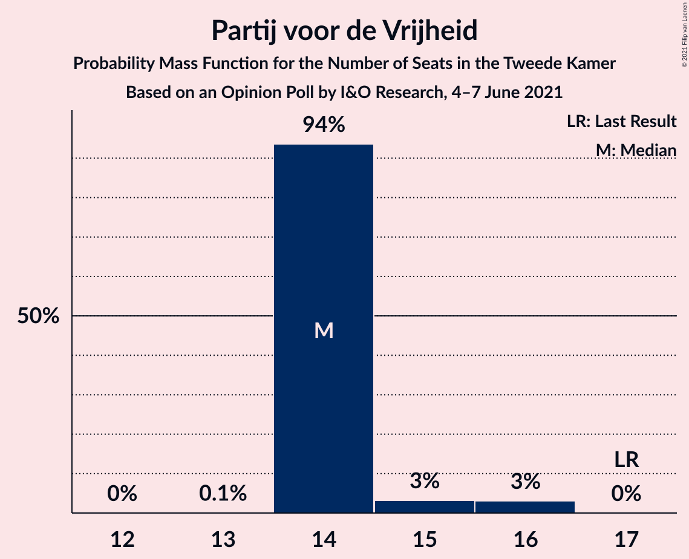
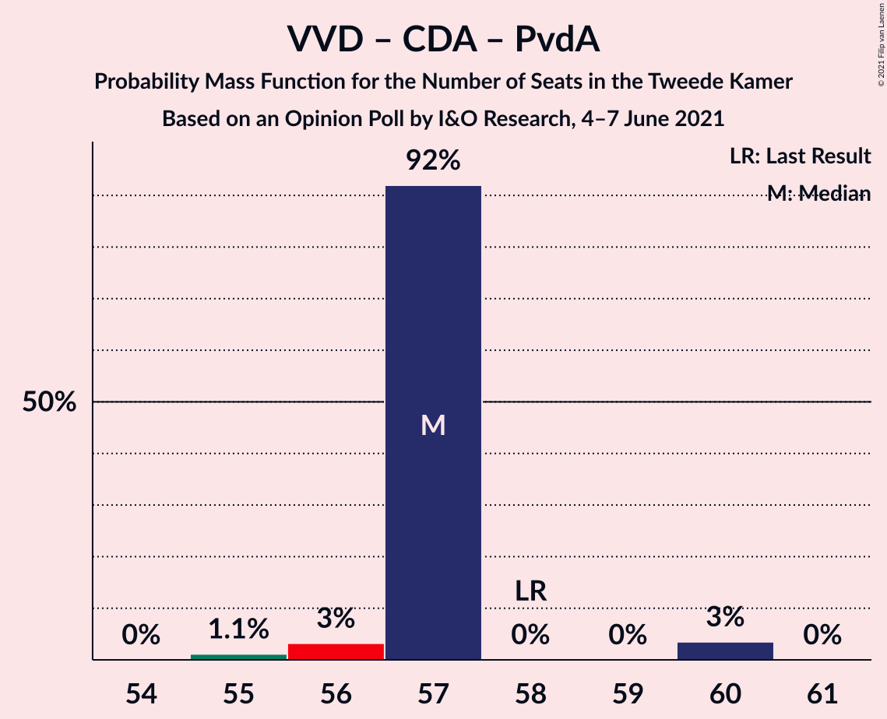
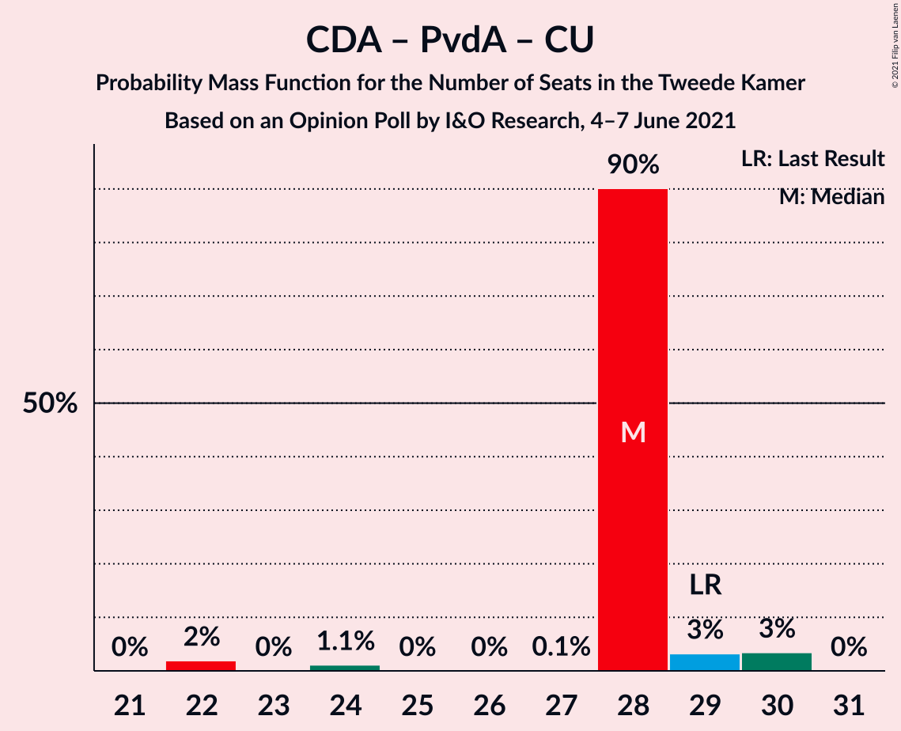

# Opinion Poll by I&O Research, 4–7 June 2021

<a href="#voting-intentions">Voting Intentions</a> | <a href="#seats">Seats</a> | <a href="#coalitions">Coalitions</a> | <a href="#technical-information">Technical Information</a>

## Voting Intentions

### Confidence Intervals

| Party | Last Result | Poll Result | 80% Confidence Interval | 90% Confidence Interval | 95% Confidence Interval | 99% Confidence Interval |
|:-----:|:-----------:|:-----------:|:-----------------------:|:-----------------------:|:-----------------------:|:-----------------------:|
| Volkspartij voor Vrijheid en Democratie | 21.9% | 22.8% | 21.5–24.1% |21.2–24.4% |20.9–24.7% |20.3–25.4% |
| Democraten 66 | 15.0% | 13.5% | 12.5–14.6% |12.2–14.9% |12.0–15.1% |11.5–15.7% |
| Partij voor de Vrijheid | 10.8% | 9.2% | 8.3–10.1% |8.1–10.3% |7.9–10.6% |7.5–11.0% |
| Christen-Democratisch Appèl | 9.5% | 7.9% | 7.1–8.8% |6.9–9.0% |6.7–9.2% |6.4–9.7% |
| Partij van de Arbeid | 5.7% | 6.5% | 5.8–7.3% |5.6–7.5% |5.4–7.7% |5.1–8.1% |
| GroenLinks | 5.2% | 5.7% | 5.1–6.5% |4.9–6.7% |4.7–6.9% |4.4–7.3% |
| Partij voor de Dieren | 3.8% | 5.0% | 4.4–5.7% |4.2–5.9% |4.1–6.1% |3.8–6.5% |
| Socialistische Partij | 6.0% | 4.8% | 4.2–5.5% |4.0–5.7% |3.9–5.9% |3.6–6.2% |
| Volt Europa | 2.4% | 4.4% | 3.8–5.1% |3.7–5.3% |3.5–5.4% |3.3–5.8% |
| Juiste Antwoord 2021 | 2.4% | 3.9% | 3.4–4.5% |3.2–4.7% |3.1–4.9% |2.9–5.2% |
| ChristenUnie | 3.4% | 3.5% | 3.0–4.1% |2.9–4.3% |2.8–4.5% |2.5–4.8% |
| Forum voor Democratie | 5.0% | 3.5% | 3.0–4.1% |2.9–4.3% |2.8–4.5% |2.5–4.8% |
| BoerBurgerBeweging | 1.0% | 2.3% | 1.9–2.8% |1.8–3.0% |1.7–3.1% |1.5–3.4% |
| Staatkundig Gereformeerde Partij | 2.1% | 2.2% | 1.8–2.7% |1.7–2.9% |1.6–3.0% |1.4–3.2% |
| DENK | 2.0% | 2.0% | 1.6–2.5% |1.5–2.6% |1.4–2.7% |1.3–3.0% |
| Bij1 | 0.8% | 1.5% | 1.2–1.9% |1.1–2.0% |1.0–2.1% |0.9–2.4% |
| 50Plus | 1.0% | 0.5% | 0.3–0.8% |0.3–0.9% |0.3–0.9% |0.2–1.1% |

*Note:* The poll result column reflects the actual value used in the calculations. Published results may vary slightly, and in addition be rounded to fewer digits.

## Seats

### Confidence Intervals

| Party | Last Result | Median | 80% Confidence Interval | 90% Confidence Interval | 95% Confidence Interval | 99% Confidence Interval |
|:-----:|:-----------:|:------:|:-----------------------:|:-----------------------:|:-----------------------:|:-----------------------:|
| <a href="#volkspartij-voor-vrijheid-en-democratie">Volkspartij voor Vrijheid en Democratie</a> | 34 | 34 | 34 |34–36 |34–36 |34–39 |
| <a href="#democraten-66">Democraten 66</a> | 24 | 21 | 21 |21 |19–22 |18–22 |
| <a href="#partij-voor-de-vrijheid">Partij voor de Vrijheid</a> | 17 | 14 | 14 |14–15 |14–16 |14–16 |
| <a href="#christen-democratisch-appèl">Christen-Democratisch Appèl</a> | 15 | 13 | 13 |11–13 |11–13 |10–13 |
| <a href="#partij-van-de-arbeid">Partij van de Arbeid</a> | 9 | 10 | 10 |10–11 |9–11 |8–11 |
| <a href="#groenlinks">GroenLinks</a> | 8 | 9 | 9 |9 |9 |9–10 |
| <a href="#partij-voor-de-dieren">Partij voor de Dieren</a> | 6 | 8 | 8 |8 |7–8 |7–9 |
| <a href="#socialistische-partij">Socialistische Partij</a> | 9 | 7 | 7 |6–7 |6–7 |6–7 |
| <a href="#volt-europa">Volt Europa</a> | 3 | 7 | 7 |6–7 |6–9 |5–9 |
| <a href="#juiste-antwoord-2021">Juiste Antwoord 2021</a> | 3 | 6 | 6 |5–6 |4–6 |4–7 |
| <a href="#christenunie">ChristenUnie</a> | 5 | 5 | 5 |5–6 |4–7 |4–7 |
| <a href="#forum-voor-democratie">Forum voor Democratie</a> | 8 | 5 | 5 |5 |4–5 |4–6 |
| <a href="#boerburgerbeweging">BoerBurgerBeweging</a> | 1 | 4 | 4 |3–4 |3–4 |3–4 |
| <a href="#staatkundig-gereformeerde-partij">Staatkundig Gereformeerde Partij</a> | 3 | 3 | 3 |2–3 |2–3 |2–4 |
| <a href="#denk">DENK</a> | 3 | 3 | 3 |3 |2–3 |2–4 |
| <a href="#bij1">Bij1</a> | 1 | 1 | 1 |1–2 |1–3 |1–3 |
| <a href="#50plus">50Plus</a> | 1 | 0 | 0 |0 |0–1 |0–1 |

### Volkspartij voor Vrijheid en Democratie

*For a full overview of the results for this party, see the [Volkspartij voor Vrijheid en Democratie](party-volkspartijvoorvrijheidendemocratie.html) page.*

| Number of Seats | Probability | Accumulated | Special Marks |
|:---------------:|:-----------:|:-----------:|:-------------:|
| 32 | 0% | 100% |  |
| 33 | 0% | 99.9% |  |
| 34 | 93% | 99.9% | Last Result, Median |
| 35 | 1.2% | 7% |  |
| 36 | 3% | 6% |  |
| 37 | 0.1% | 2% |  |
| 38 | 0% | 2% |  |
| 39 | 2% | 2% |  |
| 40 | 0% | 0% |  |

### Democraten 66

*For a full overview of the results for this party, see the [Democraten 66](party-democraten66.html) page.*

| Number of Seats | Probability | Accumulated | Special Marks |
|:---------------:|:-----------:|:-----------:|:-------------:|
| 18 | 1.2% | 100% |  |
| 19 | 3% | 98.8% |  |
| 20 | 0% | 96% |  |
| 21 | 92% | 96% | Median |
| 22 | 3% | 4% |  |
| 23 | 0.1% | 0.1% |  |
| 24 | 0% | 0% | Last Result |

### Partij voor de Vrijheid

*For a full overview of the results for this party, see the [Partij voor de Vrijheid](party-partijvoordevrijheid.html) page.*

| Number of Seats | Probability | Accumulated | Special Marks |
|:---------------:|:-----------:|:-----------:|:-------------:|
| 13 | 0.1% | 100% |  |
| 14 | 94% | 99.9% | Median |
| 15 | 3% | 6% |  |
| 16 | 3% | 3% |  |
| 17 | 0% | 0% | Last Result |

### Christen-Democratisch Appèl

*For a full overview of the results for this party, see the [Christen-Democratisch Appèl](party-christen-democratischappèl.html) page.*

| Number of Seats | Probability | Accumulated | Special Marks |
|:---------------:|:-----------:|:-----------:|:-------------:|
| 10 | 2% | 100% |  |
| 11 | 4% | 98% |  |
| 12 | 0% | 94% |  |
| 13 | 93% | 94% | Median |
| 14 | 0.1% | 0.1% |  |
| 15 | 0% | 0% | Last Result |

### Partij van de Arbeid

*For a full overview of the results for this party, see the [Partij van de Arbeid](party-partijvandearbeid.html) page.*

| Number of Seats | Probability | Accumulated | Special Marks |
|:---------------:|:-----------:|:-----------:|:-------------:|
| 8 | 2% | 100% |  |
| 9 | 1.2% | 98% | Last Result |
| 10 | 90% | 97% | Median |
| 11 | 7% | 7% |  |
| 12 | 0% | 0% |  |

### GroenLinks

*For a full overview of the results for this party, see the [GroenLinks](party-groenlinks.html) page.*

| Number of Seats | Probability | Accumulated | Special Marks |
|:---------------:|:-----------:|:-----------:|:-------------:|
| 7 | 0.1% | 100% |  |
| 8 | 0.1% | 99.9% | Last Result |
| 9 | 98% | 99.8% | Median |
| 10 | 2% | 2% |  |
| 11 | 0% | 0% |  |

### Partij voor de Dieren

*For a full overview of the results for this party, see the [Partij voor de Dieren](party-partijvoordedieren.html) page.*

| Number of Seats | Probability | Accumulated | Special Marks |
|:---------------:|:-----------:|:-----------:|:-------------:|
| 6 | 0.1% | 100% | Last Result |
| 7 | 4% | 99.9% |  |
| 8 | 94% | 96% | Median |
| 9 | 2% | 2% |  |
| 10 | 0% | 0% |  |

### Socialistische Partij

*For a full overview of the results for this party, see the [Socialistische Partij](party-socialistischepartij.html) page.*

| Number of Seats | Probability | Accumulated | Special Marks |
|:---------------:|:-----------:|:-----------:|:-------------:|
| 6 | 8% | 100% |  |
| 7 | 92% | 92% | Median |
| 8 | 0.1% | 0.1% |  |
| 9 | 0% | 0% | Last Result |

### Volt Europa

*For a full overview of the results for this party, see the [Volt Europa](party-volteuropa.html) page.*

| Number of Seats | Probability | Accumulated | Special Marks |
|:---------------:|:-----------:|:-----------:|:-------------:|
| 3 | 0% | 100% | Last Result |
| 4 | 0.1% | 100% |  |
| 5 | 2% | 99.9% |  |
| 6 | 5% | 98% |  |
| 7 | 90% | 93% | Median |
| 8 | 0% | 3% |  |
| 9 | 3% | 3% |  |
| 10 | 0% | 0% |  |

### Juiste Antwoord 2021

*For a full overview of the results for this party, see the [Juiste Antwoord 2021](party-juisteantwoord2021.html) page.*

| Number of Seats | Probability | Accumulated | Special Marks |
|:---------------:|:-----------:|:-----------:|:-------------:|
| 3 | 0% | 100% | Last Result |
| 4 | 3% | 100% |  |
| 5 | 2% | 97% |  |
| 6 | 93% | 95% | Median |
| 7 | 1.2% | 1.2% |  |
| 8 | 0% | 0% |  |

### ChristenUnie

*For a full overview of the results for this party, see the [ChristenUnie](party-christenunie.html) page.*

| Number of Seats | Probability | Accumulated | Special Marks |
|:---------------:|:-----------:|:-----------:|:-------------:|
| 4 | 3% | 100% |  |
| 5 | 90% | 97% | Last Result, Median |
| 6 | 3% | 7% |  |
| 7 | 3% | 3% |  |
| 8 | 0% | 0% |  |

### Forum voor Democratie

*For a full overview of the results for this party, see the [Forum voor Democratie](party-forumvoordemocratie.html) page.*

| Number of Seats | Probability | Accumulated | Special Marks |
|:---------------:|:-----------:|:-----------:|:-------------:|
| 4 | 3% | 100% |  |
| 5 | 95% | 97% | Median |
| 6 | 1.2% | 1.2% |  |
| 7 | 0% | 0% |  |
| 8 | 0% | 0% | Last Result |

### BoerBurgerBeweging

*For a full overview of the results for this party, see the [BoerBurgerBeweging](party-boerburgerbeweging.html) page.*

| Number of Seats | Probability | Accumulated | Special Marks |
|:---------------:|:-----------:|:-----------:|:-------------:|
| 1 | 0% | 100% | Last Result |
| 2 | 0.1% | 100% |  |
| 3 | 10% | 99.9% |  |
| 4 | 90% | 90% | Median |
| 5 | 0% | 0% |  |

### Staatkundig Gereformeerde Partij

*For a full overview of the results for this party, see the [Staatkundig Gereformeerde Partij](party-staatkundiggereformeerdepartij.html) page.*

| Number of Seats | Probability | Accumulated | Special Marks |
|:---------------:|:-----------:|:-----------:|:-------------:|
| 2 | 5% | 100% |  |
| 3 | 94% | 95% | Last Result, Median |
| 4 | 1.2% | 1.2% |  |
| 5 | 0% | 0% |  |

### DENK

*For a full overview of the results for this party, see the [DENK](party-denk.html) page.*

| Number of Seats | Probability | Accumulated | Special Marks |
|:---------------:|:-----------:|:-----------:|:-------------:|
| 2 | 3% | 100% |  |
| 3 | 95% | 97% | Last Result, Median |
| 4 | 1.2% | 1.3% |  |
| 5 | 0.1% | 0.1% |  |
| 6 | 0% | 0% |  |

### Bij1

*For a full overview of the results for this party, see the [Bij1](party-bij1.html) page.*

| Number of Seats | Probability | Accumulated | Special Marks |
|:---------------:|:-----------:|:-----------:|:-------------:|
| 1 | 90% | 100% | Last Result, Median |
| 2 | 6% | 10% |  |
| 3 | 3% | 3% |  |
| 4 | 0% | 0% |  |

### 50Plus

*For a full overview of the results for this party, see the [50Plus](party-50plus.html) page.*

| Number of Seats | Probability | Accumulated | Special Marks |
|:---------------:|:-----------:|:-----------:|:-------------:|
| 0 | 95% | 100% | Median |
| 1 | 5% | 5% | Last Result |
| 2 | 0% | 0% |  |

## Coalitions

### Confidence Intervals

| Coalition | Last Result | Median | Majority? | 80% Confidence Interval | 90% Confidence Interval | 95% Confidence Interval | 99% Confidence Interval |
|:---------:|:-----------:|:------:|:---------:|:-----------------------:|:-----------------------:|:-----------------------:|:-----------------------:|
| Volkspartij voor Vrijheid en Democratie – Democraten 66 – Christen-Democratisch Appèl – Partij van de Arbeid – ChristenUnie | 87 | 83 | 100% | 83 | 82–83 | 82–88 | 77–88 |
| Volkspartij voor Vrijheid en Democratie – Democraten 66 – Christen-Democratisch Appèl – GroenLinks – ChristenUnie | 86 | 82 | 100% | 82 | 82–84 | 80–86 | 77–86 |
| Volkspartij voor Vrijheid en Democratie – Democraten 66 – Christen-Democratisch Appèl – ChristenUnie | 78 | 73 | 4% | 73 | 73–74 | 71–77 | 68–77 |
| Volkspartij voor Vrijheid en Democratie – Partij voor de Vrijheid – Christen-Democratisch Appèl – Forum voor Democratie – Staatkundig Gereformeerde Partij | 77 | 69 | 0% | 69 | 69–70 | 67–72 | 67–72 |
| Volkspartij voor Vrijheid en Democratie – Democraten 66 – Christen-Democratisch Appèl | 73 | 68 | 0% | 68 | 68–70 | 64–71 | 64–71 |
| Volkspartij voor Vrijheid en Democratie – Democraten 66 – Partij van de Arbeid | 67 | 65 | 0% | 65 | 65–68 | 64–69 | 62–69 |
| Volkspartij voor Vrijheid en Democratie – Partij voor de Vrijheid – Christen-Democratisch Appèl – Forum voor Democratie | 74 | 66 | 0% | 66 | 66–67 | 65–68 | 65–70 |
| Democraten 66 – Christen-Democratisch Appèl – Partij van de Arbeid – GroenLinks – Socialistische Partij – ChristenUnie | 70 | 65 | 0% | 65 | 63–65 | 60–67 | 57–67 |
| Volkspartij voor Vrijheid en Democratie – Partij voor de Vrijheid – Christen-Democratisch Appèl | 66 | 61 | 0% | 61 | 61–63 | 60–63 | 60–65 |
| Democraten 66 – Christen-Democratisch Appèl – Partij van de Arbeid – GroenLinks – ChristenUnie | 61 | 58 | 0% | 58 | 57–58 | 53–61 | 51–61 |
| Volkspartij voor Vrijheid en Democratie – Christen-Democratisch Appèl – Partij van de Arbeid | 58 | 57 | 0% | 57 | 57 | 56–60 | 55–60 |
| Volkspartij voor Vrijheid en Democratie – Christen-Democratisch Appèl – Forum voor Democratie – Staatkundig Gereformeerde Partij – 50Plus | 61 | 55 | 0% | 55 | 55–56 | 52–57 | 52–57 |
| Volkspartij voor Vrijheid en Democratie – Christen-Democratisch Appèl – Forum voor Democratie – Staatkundig Gereformeerde Partij | 60 | 55 | 0% | 55 | 55–56 | 52–56 | 52–56 |
| Volkspartij voor Vrijheid en Democratie – Christen-Democratisch Appèl – Forum voor Democratie – 50Plus | 58 | 52 | 0% | 52 | 52–54 | 50–54 | 50–54 |
| Volkspartij voor Vrijheid en Democratie – Christen-Democratisch Appèl – Forum voor Democratie | 57 | 52 | 0% | 52 | 52–53 | 50–53 | 50–54 |
| Volkspartij voor Vrijheid en Democratie – Christen-Democratisch Appèl | 49 | 47 | 0% | 47 | 47–49 | 45–49 | 45–49 |
| Volkspartij voor Vrijheid en Democratie – Partij van de Arbeid | 43 | 44 | 0% | 44 | 44–47 | 44–47 | 44–47 |
| Democraten 66 – Christen-Democratisch Appèl – Partij van de Arbeid | 48 | 44 | 0% | 44 | 41–44 | 39–46 | 38–46 |
| Democraten 66 – Christen-Democratisch Appèl | 39 | 34 | 0% | 34 | 31–34 | 30–35 | 29–35 |
| Christen-Democratisch Appèl – Partij van de Arbeid – ChristenUnie | 29 | 28 | 0% | 28 | 28–29 | 24–30 | 22–30 |
| Christen-Democratisch Appèl – Partij van de Arbeid | 24 | 23 | 0% | 23 | 22–23 | 20–24 | 18–24 |

### Volkspartij voor Vrijheid en Democratie – Democraten 66 – Christen-Democratisch Appèl – Partij van de Arbeid – ChristenUnie

| Number of Seats | Probability | Accumulated | Special Marks |
|:---------------:|:-----------:|:-----------:|:-------------:|
| 77 | 1.1% | 100% |  |
| 78 | 0% | 98.9% |  |
| 79 | 0% | 98.9% |  |
| 80 | 0% | 98.8% |  |
| 81 | 0% | 98.8% |  |
| 82 | 5% | 98.8% |  |
| 83 | 90% | 94% | Median |
| 84 | 0% | 4% |  |
| 85 | 0% | 4% |  |
| 86 | 0% | 4% |  |
| 87 | 0% | 3% | Last Result |
| 88 | 3% | 3% |  |
| 89 | 0% | 0% |  |

### Volkspartij voor Vrijheid en Democratie – Democraten 66 – Christen-Democratisch Appèl – GroenLinks – ChristenUnie

| Number of Seats | Probability | Accumulated | Special Marks |
|:---------------:|:-----------:|:-----------:|:-------------:|
| 77 | 1.1% | 100% |  |
| 78 | 0% | 98.9% |  |
| 79 | 0% | 98.9% |  |
| 80 | 3% | 98.8% |  |
| 81 | 0.1% | 96% |  |
| 82 | 90% | 96% | Median |
| 83 | 0% | 5% |  |
| 84 | 2% | 5% |  |
| 85 | 0% | 3% |  |
| 86 | 3% | 3% | Last Result |
| 87 | 0.1% | 0.1% |  |
| 88 | 0% | 0% |  |

### Volkspartij voor Vrijheid en Democratie – Democraten 66 – Christen-Democratisch Appèl – ChristenUnie

| Number of Seats | Probability | Accumulated | Special Marks |
|:---------------:|:-----------:|:-----------:|:-------------:|
| 68 | 1.1% | 100% |  |
| 69 | 0% | 98.9% |  |
| 70 | 0% | 98.9% |  |
| 71 | 3% | 98.8% |  |
| 72 | 0% | 96% |  |
| 73 | 90% | 96% | Median |
| 74 | 2% | 6% |  |
| 75 | 0.1% | 4% |  |
| 76 | 0% | 4% | Majority |
| 77 | 3% | 3% |  |
| 78 | 0% | 0.1% | Last Result |
| 79 | 0.1% | 0.1% |  |
| 80 | 0% | 0% |  |

### Volkspartij voor Vrijheid en Democratie – Partij voor de Vrijheid – Christen-Democratisch Appèl – Forum voor Democratie – Staatkundig Gereformeerde Partij

| Number of Seats | Probability | Accumulated | Special Marks |
|:---------------:|:-----------:|:-----------:|:-------------:|
| 67 | 3% | 100% |  |
| 68 | 0% | 97% |  |
| 69 | 90% | 97% | Median |
| 70 | 3% | 7% |  |
| 71 | 0.1% | 3% |  |
| 72 | 3% | 3% |  |
| 73 | 0% | 0% |  |
| 74 | 0% | 0% |  |
| 75 | 0% | 0% |  |
| 76 | 0% | 0% | Majority |
| 77 | 0% | 0% | Last Result |

### Volkspartij voor Vrijheid en Democratie – Democraten 66 – Christen-Democratisch Appèl

| Number of Seats | Probability | Accumulated | Special Marks |
|:---------------:|:-----------:|:-----------:|:-------------:|
| 64 | 4% | 100% |  |
| 65 | 0% | 96% |  |
| 66 | 0% | 96% |  |
| 67 | 0% | 96% |  |
| 68 | 90% | 96% | Median |
| 69 | 0% | 5% |  |
| 70 | 2% | 5% |  |
| 71 | 3% | 4% |  |
| 72 | 0% | 0.1% |  |
| 73 | 0% | 0.1% | Last Result |
| 74 | 0.1% | 0.1% |  |
| 75 | 0% | 0% |  |

### Volkspartij voor Vrijheid en Democratie – Democraten 66 – Partij van de Arbeid

| Number of Seats | Probability | Accumulated | Special Marks |
|:---------------:|:-----------:|:-----------:|:-------------:|
| 62 | 1.2% | 100% |  |
| 63 | 0% | 98.8% |  |
| 64 | 3% | 98.8% |  |
| 65 | 90% | 96% | Median |
| 66 | 0% | 6% |  |
| 67 | 0% | 5% | Last Result |
| 68 | 2% | 5% |  |
| 69 | 3% | 4% |  |
| 70 | 0.1% | 0.1% |  |
| 71 | 0% | 0% |  |

### Volkspartij voor Vrijheid en Democratie – Partij voor de Vrijheid – Christen-Democratisch Appèl – Forum voor Democratie

| Number of Seats | Probability | Accumulated | Special Marks |
|:---------------:|:-----------:|:-----------:|:-------------:|
| 64 | 0% | 100% |  |
| 65 | 3% | 99.9% |  |
| 66 | 90% | 97% | Median |
| 67 | 3% | 7% |  |
| 68 | 1.2% | 3% |  |
| 69 | 0.1% | 2% |  |
| 70 | 2% | 2% |  |
| 71 | 0% | 0% |  |
| 72 | 0% | 0% |  |
| 73 | 0% | 0% |  |
| 74 | 0% | 0% | Last Result |

### Democraten 66 – Christen-Democratisch Appèl – Partij van de Arbeid – GroenLinks – Socialistische Partij – ChristenUnie

| Number of Seats | Probability | Accumulated | Special Marks |
|:---------------:|:-----------:|:-----------:|:-------------:|
| 57 | 1.1% | 100% |  |
| 58 | 0% | 98.8% |  |
| 59 | 0% | 98.8% |  |
| 60 | 2% | 98.8% |  |
| 61 | 0% | 97% |  |
| 62 | 0% | 97% |  |
| 63 | 3% | 97% |  |
| 64 | 0% | 94% |  |
| 65 | 90% | 94% | Median |
| 66 | 0.1% | 4% |  |
| 67 | 3% | 3% |  |
| 68 | 0% | 0% |  |
| 69 | 0% | 0% |  |
| 70 | 0% | 0% | Last Result |

### Volkspartij voor Vrijheid en Democratie – Partij voor de Vrijheid – Christen-Democratisch Appèl

| Number of Seats | Probability | Accumulated | Special Marks |
|:---------------:|:-----------:|:-----------:|:-------------:|
| 58 | 0% | 100% |  |
| 59 | 0% | 99.9% |  |
| 60 | 3% | 99.9% |  |
| 61 | 90% | 97% | Median |
| 62 | 1.1% | 7% |  |
| 63 | 3% | 6% |  |
| 64 | 0.1% | 2% |  |
| 65 | 2% | 2% |  |
| 66 | 0% | 0% | Last Result |

### Democraten 66 – Christen-Democratisch Appèl – Partij van de Arbeid – GroenLinks – ChristenUnie

| Number of Seats | Probability | Accumulated | Special Marks |
|:---------------:|:-----------:|:-----------:|:-------------:|
| 51 | 1.2% | 100% |  |
| 52 | 0% | 98.8% |  |
| 53 | 2% | 98.8% |  |
| 54 | 0% | 97% |  |
| 55 | 0% | 97% |  |
| 56 | 0% | 97% |  |
| 57 | 3% | 97% |  |
| 58 | 90% | 94% | Median |
| 59 | 0.1% | 4% |  |
| 60 | 0% | 3% |  |
| 61 | 3% | 3% | Last Result |
| 62 | 0% | 0% |  |

### Volkspartij voor Vrijheid en Democratie – Christen-Democratisch Appèl – Partij van de Arbeid

| Number of Seats | Probability | Accumulated | Special Marks |
|:---------------:|:-----------:|:-----------:|:-------------:|
| 54 | 0% | 100% |  |
| 55 | 1.1% | 99.9% |  |
| 56 | 3% | 98.8% |  |
| 57 | 92% | 96% | Median |
| 58 | 0% | 4% | Last Result |
| 59 | 0% | 4% |  |
| 60 | 3% | 4% |  |
| 61 | 0% | 0% |  |

### Volkspartij voor Vrijheid en Democratie – Christen-Democratisch Appèl – Forum voor Democratie – Staatkundig Gereformeerde Partij – 50Plus

| Number of Seats | Probability | Accumulated | Special Marks |
|:---------------:|:-----------:|:-----------:|:-------------:|
| 52 | 3% | 100% |  |
| 53 | 0% | 97% |  |
| 54 | 0% | 97% |  |
| 55 | 90% | 97% | Median |
| 56 | 2% | 7% |  |
| 57 | 5% | 5% |  |
| 58 | 0.1% | 0.1% |  |
| 59 | 0% | 0% |  |
| 60 | 0% | 0% |  |
| 61 | 0% | 0% | Last Result |

### Volkspartij voor Vrijheid en Democratie – Christen-Democratisch Appèl – Forum voor Democratie – Staatkundig Gereformeerde Partij

| Number of Seats | Probability | Accumulated | Special Marks |
|:---------------:|:-----------:|:-----------:|:-------------:|
| 52 | 3% | 100% |  |
| 53 | 0% | 97% |  |
| 54 | 0% | 97% |  |
| 55 | 90% | 97% | Median |
| 56 | 7% | 7% |  |
| 57 | 0% | 0.1% |  |
| 58 | 0.1% | 0.1% |  |
| 59 | 0% | 0% |  |
| 60 | 0% | 0% | Last Result |

### Volkspartij voor Vrijheid en Democratie – Christen-Democratisch Appèl – Forum voor Democratie – 50Plus

| Number of Seats | Probability | Accumulated | Special Marks |
|:---------------:|:-----------:|:-----------:|:-------------:|
| 50 | 3% | 100% |  |
| 51 | 0% | 97% |  |
| 52 | 90% | 97% | Median |
| 53 | 1.2% | 7% |  |
| 54 | 5% | 5% |  |
| 55 | 0% | 0.1% |  |
| 56 | 0.1% | 0.1% |  |
| 57 | 0% | 0% |  |
| 58 | 0% | 0% | Last Result |

### Volkspartij voor Vrijheid en Democratie – Christen-Democratisch Appèl – Forum voor Democratie

| Number of Seats | Probability | Accumulated | Special Marks |
|:---------------:|:-----------:|:-----------:|:-------------:|
| 50 | 3% | 100% |  |
| 51 | 0% | 97% |  |
| 52 | 91% | 97% | Median |
| 53 | 3% | 6% |  |
| 54 | 2% | 2% |  |
| 55 | 0% | 0.1% |  |
| 56 | 0.1% | 0.1% |  |
| 57 | 0% | 0% | Last Result |

### Volkspartij voor Vrijheid en Democratie – Christen-Democratisch Appèl

| Number of Seats | Probability | Accumulated | Special Marks |
|:---------------:|:-----------:|:-----------:|:-------------:|
| 44 | 0% | 100% |  |
| 45 | 3% | 99.9% |  |
| 46 | 1.2% | 97% |  |
| 47 | 90% | 96% | Median |
| 48 | 0% | 6% |  |
| 49 | 5% | 6% | Last Result |
| 50 | 0% | 0.1% |  |
| 51 | 0.1% | 0.1% |  |
| 52 | 0% | 0% |  |

### Volkspartij voor Vrijheid en Democratie – Partij van de Arbeid

| Number of Seats | Probability | Accumulated | Special Marks |
|:---------------:|:-----------:|:-----------:|:-------------:|
| 41 | 0% | 100% |  |
| 42 | 0% | 99.9% |  |
| 43 | 0% | 99.9% | Last Result |
| 44 | 91% | 99.9% | Median |
| 45 | 3% | 9% |  |
| 46 | 0.1% | 6% |  |
| 47 | 5% | 5% |  |
| 48 | 0% | 0% |  |

### Democraten 66 – Christen-Democratisch Appèl – Partij van de Arbeid

| Number of Seats | Probability | Accumulated | Special Marks |
|:---------------:|:-----------:|:-----------:|:-------------:|
| 38 | 1.1% | 100% |  |
| 39 | 2% | 98.9% |  |
| 40 | 0.1% | 97% |  |
| 41 | 3% | 97% |  |
| 42 | 0% | 94% |  |
| 43 | 0% | 94% |  |
| 44 | 90% | 94% | Median |
| 45 | 0% | 4% |  |
| 46 | 3% | 3% |  |
| 47 | 0% | 0% |  |
| 48 | 0% | 0% | Last Result |

### Democraten 66 – Christen-Democratisch Appèl

| Number of Seats | Probability | Accumulated | Special Marks |
|:---------------:|:-----------:|:-----------:|:-------------:|
| 29 | 1.2% | 100% |  |
| 30 | 3% | 98.8% |  |
| 31 | 2% | 96% |  |
| 32 | 0% | 94% |  |
| 33 | 0% | 94% |  |
| 34 | 90% | 94% | Median |
| 35 | 3% | 4% |  |
| 36 | 0% | 0.1% |  |
| 37 | 0.1% | 0.1% |  |
| 38 | 0% | 0% |  |
| 39 | 0% | 0% | Last Result |

### Christen-Democratisch Appèl – Partij van de Arbeid – ChristenUnie

| Number of Seats | Probability | Accumulated | Special Marks |
|:---------------:|:-----------:|:-----------:|:-------------:|
| 22 | 2% | 100% |  |
| 23 | 0% | 98% |  |
| 24 | 1.1% | 98% |  |
| 25 | 0% | 97% |  |
| 26 | 0% | 97% |  |
| 27 | 0.1% | 97% |  |
| 28 | 90% | 97% | Median |
| 29 | 3% | 7% | Last Result |
| 30 | 3% | 3% |  |
| 31 | 0% | 0% |  |

### Christen-Democratisch Appèl – Partij van de Arbeid

| Number of Seats | Probability | Accumulated | Special Marks |
|:---------------:|:-----------:|:-----------:|:-------------:|
| 18 | 2% | 100% |  |
| 19 | 0% | 98% |  |
| 20 | 1.2% | 98% |  |
| 21 | 0% | 97% |  |
| 22 | 3% | 97% |  |
| 23 | 90% | 94% | Median |
| 24 | 3% | 3% | Last Result |
| 25 | 0% | 0% |  |

## Technical Information

### Opinion Poll

+ **Polling firm:** I&O Research
+ **Commissioner(s):** —
+ **Fieldwork period:** 4–7 June 2021

### Calculations

+ **Sample size:** 1824
+ **Simulations done:** 131,072
+ **Error estimate:** 1.39%

