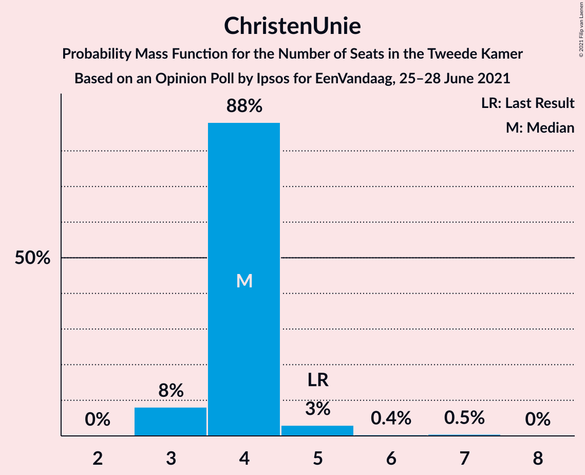

# Opinion Poll by Ipsos for EenVandaag, 25–28 June 2021

<a href="#voting-intentions">Voting Intentions</a> | <a href="#seats">Seats</a> | <a href="#coalitions">Coalitions</a> | <a href="#technical-information">Technical Information</a>

## Voting Intentions

### Confidence Intervals

| Party | Last Result | Poll Result | 80% Confidence Interval | 90% Confidence Interval | 95% Confidence Interval | 99% Confidence Interval |
|:-----:|:-----------:|:-----------:|:-----------------------:|:-----------------------:|:-----------------------:|:-----------------------:|
| Volkspartij voor Vrijheid en Democratie | 21.9% | 24.6% | 23.0–26.4% |22.5–26.9% |22.1–27.4% |21.3–28.3% |
| Democraten 66 | 15.0% | 14.2% | 12.9–15.7% |12.5–16.2% |12.2–16.5% |11.6–17.3% |
| Partij voor de Vrijheid | 10.8% | 10.8% | 9.6–12.1% |9.3–12.5% |9.0–12.8% |8.5–13.5% |
| Christen-Democratisch Appèl | 9.5% | 6.1% | 5.3–7.2% |5.0–7.5% |4.8–7.8% |4.4–8.3% |
| Partij van de Arbeid | 5.7% | 6.1% | 5.3–7.2% |5.0–7.5% |4.8–7.8% |4.4–8.3% |
| Socialistische Partij | 6.0% | 5.3% | 4.5–6.4% |4.3–6.7% |4.1–6.9% |3.7–7.4% |
| Partij voor de Dieren | 3.8% | 5.1% | 4.3–6.2% |4.1–6.4% |3.9–6.7% |3.6–7.2% |
| GroenLinks | 5.2% | 4.9% | 4.2–5.9% |3.9–6.2% |3.8–6.5% |3.4–7.0% |
| Forum voor Democratie | 5.0% | 3.5% | 2.8–4.3% |2.7–4.6% |2.5–4.8% |2.2–5.2% |
| ChristenUnie | 3.4% | 3.4% | 2.7–4.2% |2.6–4.5% |2.4–4.7% |2.1–5.1% |
| Juiste Antwoord 2021 | 2.4% | 3.2% | 2.6–4.0% |2.4–4.2% |2.2–4.4% |2.0–4.9% |
| Volt Europa | 2.4% | 3.0% | 2.4–3.8% |2.2–4.0% |2.1–4.2% |1.8–4.6% |
| BoerBurgerBeweging | 1.0% | 2.8% | 2.2–3.6% |2.0–3.8% |1.9–4.0% |1.7–4.4% |
| Staatkundig Gereformeerde Partij | 2.1% | 2.4% | 1.9–3.1% |1.7–3.3% |1.6–3.5% |1.4–3.9% |
| DENK | 2.0% | 2.4% | 1.9–3.1% |1.7–3.3% |1.6–3.5% |1.4–3.9% |
| Bij1 | 0.8% | 0.7% | 0.5–1.2% |0.4–1.3% |0.3–1.4% |0.2–1.7% |
| 50Plus | 1.0% | 0.6% | 0.4–1.1% |0.3–1.2% |0.3–1.3% |0.2–1.6% |

*Note:* The poll result column reflects the actual value used in the calculations. Published results may vary slightly, and in addition be rounded to fewer digits.

## Seats

### Confidence Intervals

| Party | Last Result | Median | 80% Confidence Interval | 90% Confidence Interval | 95% Confidence Interval | 99% Confidence Interval |
|:-----:|:-----------:|:------:|:-----------------------:|:-----------------------:|:-----------------------:|:-----------------------:|
| <a href="#volkspartij-voor-vrijheid-en-democratie">Volkspartij voor Vrijheid en Democratie</a> | 34 | 40 | 40 |40–42 |38–42 |36–42 |
| <a href="#democraten-66">Democraten 66</a> | 24 | 26 | 22–26 |21–26 |21–26 |20–26 |
| <a href="#partij-voor-de-vrijheid">Partij voor de Vrijheid</a> | 17 | 15 | 15 |15–16 |14–18 |12–19 |
| <a href="#christen-democratisch-appèl">Christen-Democratisch Appèl</a> | 15 | 7 | 7 |7–9 |7–13 |7–13 |
| <a href="#partij-van-de-arbeid">Partij van de Arbeid</a> | 9 | 7 | 7–8 |7–9 |7–10 |7–12 |
| <a href="#socialistische-partij">Socialistische Partij</a> | 9 | 8 | 8 |7–8 |6–8 |6–13 |
| <a href="#partij-voor-de-dieren">Partij voor de Dieren</a> | 6 | 9 | 9 |8–9 |8–9 |6–10 |
| <a href="#groenlinks">GroenLinks</a> | 8 | 7 | 7 |7–8 |7–8 |6–9 |
| <a href="#forum-voor-democratie">Forum voor Democratie</a> | 8 | 4 | 4 |4 |4–6 |3–6 |
| <a href="#christenunie">ChristenUnie</a> | 5 | 4 | 4 |3–4 |3–5 |3–7 |
| <a href="#juiste-antwoord-2021">Juiste Antwoord 2021</a> | 3 | 3 | 3–4 |3–6 |3–6 |3–6 |
| <a href="#volt-europa">Volt Europa</a> | 3 | 6 | 6 |4–6 |4–6 |3–7 |
| <a href="#boerburgerbeweging">BoerBurgerBeweging</a> | 1 | 3 | 3–4 |3–5 |3–6 |3–7 |
| <a href="#staatkundig-gereformeerde-partij">Staatkundig Gereformeerde Partij</a> | 3 | 4 | 4 |3–4 |3–4 |2–4 |
| <a href="#denk">DENK</a> | 3 | 4 | 4 |3–4 |3–4 |3–6 |
| <a href="#bij1">Bij1</a> | 1 | 1 | 1 |0–1 |0–1 |0–3 |
| <a href="#50plus">50Plus</a> | 1 | 0 | 0 |0–1 |0–1 |0–1 |

### Volkspartij voor Vrijheid en Democratie

*For a full overview of the results for this party, see the [Volkspartij voor Vrijheid en Democratie](party-volkspartijvoorvrijheidendemocratie.html) page.*

| Number of Seats | Probability | Accumulated | Special Marks |
|:---------------:|:-----------:|:-----------:|:-------------:|
| 29 | 0.1% | 100% |  |
| 30 | 0% | 99.9% |  |
| 31 | 0% | 99.9% |  |
| 32 | 0% | 99.9% |  |
| 33 | 0% | 99.9% |  |
| 34 | 0.2% | 99.9% | Last Result |
| 35 | 0.1% | 99.7% |  |
| 36 | 0.8% | 99.6% |  |
| 37 | 0% | 98.7% |  |
| 38 | 3% | 98.7% |  |
| 39 | 0% | 96% |  |
| 40 | 88% | 95% | Median |
| 41 | 2% | 7% |  |
| 42 | 5% | 5% |  |
| 43 | 0% | 0% |  |

### Democraten 66

*For a full overview of the results for this party, see the [Democraten 66](party-democraten66.html) page.*

| Number of Seats | Probability | Accumulated | Special Marks |
|:---------------:|:-----------:|:-----------:|:-------------:|
| 19 | 0% | 100% |  |
| 20 | 2% | 99.9% |  |
| 21 | 5% | 98% |  |
| 22 | 4% | 93% |  |
| 23 | 0.8% | 90% |  |
| 24 | 0% | 89% | Last Result |
| 25 | 1.1% | 89% |  |
| 26 | 88% | 88% | Median |
| 27 | 0.1% | 0.1% |  |
| 28 | 0% | 0% |  |

### Partij voor de Vrijheid

*For a full overview of the results for this party, see the [Partij voor de Vrijheid](party-partijvoordevrijheid.html) page.*

| Number of Seats | Probability | Accumulated | Special Marks |
|:---------------:|:-----------:|:-----------:|:-------------:|
| 12 | 2% | 100% |  |
| 13 | 0.6% | 98% |  |
| 14 | 2% | 98% |  |
| 15 | 88% | 95% | Median |
| 16 | 3% | 7% |  |
| 17 | 0.8% | 5% | Last Result |
| 18 | 3% | 4% |  |
| 19 | 0.7% | 0.8% |  |
| 20 | 0% | 0% |  |

### Christen-Democratisch Appèl

*For a full overview of the results for this party, see the [Christen-Democratisch Appèl](party-christen-democratischappèl.html) page.*

| Number of Seats | Probability | Accumulated | Special Marks |
|:---------------:|:-----------:|:-----------:|:-------------:|
| 6 | 0.2% | 100% |  |
| 7 | 94% | 99.8% | Median |
| 8 | 1.0% | 6% |  |
| 9 | 2% | 5% |  |
| 10 | 0.3% | 3% |  |
| 11 | 0.1% | 3% |  |
| 12 | 0% | 3% |  |
| 13 | 2% | 3% |  |
| 14 | 0.1% | 0.1% |  |
| 15 | 0% | 0% | Last Result |

### Partij van de Arbeid

*For a full overview of the results for this party, see the [Partij van de Arbeid](party-partijvandearbeid.html) page.*

| Number of Seats | Probability | Accumulated | Special Marks |
|:---------------:|:-----------:|:-----------:|:-------------:|
| 7 | 88% | 100% | Median |
| 8 | 6% | 12% |  |
| 9 | 3% | 6% | Last Result |
| 10 | 3% | 4% |  |
| 11 | 0.2% | 0.8% |  |
| 12 | 0.6% | 0.6% |  |
| 13 | 0% | 0% |  |

### Socialistische Partij

*For a full overview of the results for this party, see the [Socialistische Partij](party-socialistischepartij.html) page.*

| Number of Seats | Probability | Accumulated | Special Marks |
|:---------------:|:-----------:|:-----------:|:-------------:|
| 5 | 0.1% | 100% |  |
| 6 | 5% | 99.9% |  |
| 7 | 4% | 95% |  |
| 8 | 90% | 91% | Median |
| 9 | 0% | 0.9% | Last Result |
| 10 | 0.2% | 0.9% |  |
| 11 | 0.1% | 0.7% |  |
| 12 | 0% | 0.5% |  |
| 13 | 0.5% | 0.5% |  |
| 14 | 0% | 0% |  |

### Partij voor de Dieren

*For a full overview of the results for this party, see the [Partij voor de Dieren](party-partijvoordedieren.html) page.*

| Number of Seats | Probability | Accumulated | Special Marks |
|:---------------:|:-----------:|:-----------:|:-------------:|
| 5 | 0.1% | 100% |  |
| 6 | 2% | 99.9% | Last Result |
| 7 | 0.3% | 98% |  |
| 8 | 4% | 98% |  |
| 9 | 93% | 94% | Median |
| 10 | 1.0% | 1.1% |  |
| 11 | 0.1% | 0.1% |  |
| 12 | 0% | 0% |  |

### GroenLinks

*For a full overview of the results for this party, see the [GroenLinks](party-groenlinks.html) page.*

| Number of Seats | Probability | Accumulated | Special Marks |
|:---------------:|:-----------:|:-----------:|:-------------:|
| 6 | 2% | 100% |  |
| 7 | 89% | 98% | Median |
| 8 | 6% | 8% | Last Result |
| 9 | 2% | 2% |  |
| 10 | 0% | 0.1% |  |
| 11 | 0% | 0.1% |  |
| 12 | 0.1% | 0.1% |  |
| 13 | 0% | 0% |  |

### Forum voor Democratie

*For a full overview of the results for this party, see the [Forum voor Democratie](party-forumvoordemocratie.html) page.*

| Number of Seats | Probability | Accumulated | Special Marks |
|:---------------:|:-----------:|:-----------:|:-------------:|
| 3 | 0.7% | 100% |  |
| 4 | 95% | 99.3% | Median |
| 5 | 0.3% | 4% |  |
| 6 | 4% | 4% |  |
| 7 | 0.2% | 0.3% |  |
| 8 | 0% | 0% | Last Result |

### ChristenUnie

*For a full overview of the results for this party, see the [ChristenUnie](party-christenunie.html) page.*

| Number of Seats | Probability | Accumulated | Special Marks |
|:---------------:|:-----------:|:-----------:|:-------------:|
| 3 | 8% | 100% |  |
| 4 | 88% | 92% | Median |
| 5 | 3% | 4% | Last Result |
| 6 | 0.4% | 0.9% |  |
| 7 | 0.5% | 0.5% |  |
| 8 | 0% | 0% |  |

### Juiste Antwoord 2021

*For a full overview of the results for this party, see the [Juiste Antwoord 2021](party-juisteantwoord2021.html) page.*

| Number of Seats | Probability | Accumulated | Special Marks |
|:---------------:|:-----------:|:-----------:|:-------------:|
| 3 | 89% | 100% | Last Result, Median |
| 4 | 5% | 11% |  |
| 5 | 1.1% | 7% |  |
| 6 | 5% | 6% |  |
| 7 | 0% | 0.3% |  |
| 8 | 0.2% | 0.2% |  |
| 9 | 0% | 0% |  |

### Volt Europa

*For a full overview of the results for this party, see the [Volt Europa](party-volteuropa.html) page.*

| Number of Seats | Probability | Accumulated | Special Marks |
|:---------------:|:-----------:|:-----------:|:-------------:|
| 3 | 0.8% | 100% | Last Result |
| 4 | 7% | 99.2% |  |
| 5 | 0.9% | 92% |  |
| 6 | 90% | 91% | Median |
| 7 | 1.5% | 2% |  |
| 8 | 0.3% | 0.3% |  |
| 9 | 0% | 0% |  |

### BoerBurgerBeweging

*For a full overview of the results for this party, see the [BoerBurgerBeweging](party-boerburgerbeweging.html) page.*

| Number of Seats | Probability | Accumulated | Special Marks |
|:---------------:|:-----------:|:-----------:|:-------------:|
| 1 | 0% | 100% | Last Result |
| 2 | 0.3% | 100% |  |
| 3 | 89% | 99.7% | Median |
| 4 | 4% | 11% |  |
| 5 | 4% | 7% |  |
| 6 | 0.3% | 3% |  |
| 7 | 2% | 2% |  |
| 8 | 0% | 0% |  |

### Staatkundig Gereformeerde Partij

*For a full overview of the results for this party, see the [Staatkundig Gereformeerde Partij](party-staatkundiggereformeerdepartij.html) page.*

| Number of Seats | Probability | Accumulated | Special Marks |
|:---------------:|:-----------:|:-----------:|:-------------:|
| 2 | 1.1% | 100% |  |
| 3 | 9% | 98.8% | Last Result |
| 4 | 90% | 90% | Median |
| 5 | 0.2% | 0.2% |  |
| 6 | 0% | 0% |  |

### DENK

*For a full overview of the results for this party, see the [DENK](party-denk.html) page.*

| Number of Seats | Probability | Accumulated | Special Marks |
|:---------------:|:-----------:|:-----------:|:-------------:|
| 2 | 0.1% | 100% |  |
| 3 | 5% | 99.9% | Last Result |
| 4 | 92% | 94% | Median |
| 5 | 0.2% | 2% |  |
| 6 | 2% | 2% |  |
| 7 | 0% | 0% |  |

### Bij1

*For a full overview of the results for this party, see the [Bij1](party-bij1.html) page.*

| Number of Seats | Probability | Accumulated | Special Marks |
|:---------------:|:-----------:|:-----------:|:-------------:|
| 0 | 5% | 100% |  |
| 1 | 93% | 95% | Last Result, Median |
| 2 | 0% | 1.2% |  |
| 3 | 1.2% | 1.2% |  |
| 4 | 0% | 0% |  |

### 50Plus

*For a full overview of the results for this party, see the [50Plus](party-50plus.html) page.*

| Number of Seats | Probability | Accumulated | Special Marks |
|:---------------:|:-----------:|:-----------:|:-------------:|
| 0 | 94% | 100% | Median |
| 1 | 5% | 6% | Last Result |
| 2 | 0.2% | 0.3% |  |
| 3 | 0% | 0% |  |

## Coalitions

### Confidence Intervals

| Coalition | Last Result | Median | Majority? | 80% Confidence Interval | 90% Confidence Interval | 95% Confidence Interval | 99% Confidence Interval |
|:---------:|:-----------:|:------:|:---------:|:-----------------------:|:-----------------------:|:-----------------------:|:-----------------------:|
| Volkspartij voor Vrijheid en Democratie – Democraten 66 – Christen-Democratisch Appèl – Partij van de Arbeid – ChristenUnie | 87 | 84 | 100% | 84 | 81–84 | 81–85 | 79–86 |
| Volkspartij voor Vrijheid en Democratie – Democraten 66 – Christen-Democratisch Appèl – GroenLinks – ChristenUnie | 86 | 84 | 100% | 84 | 81–84 | 81–84 | 79–84 |
| Volkspartij voor Vrijheid en Democratie – Democraten 66 – Christen-Democratisch Appèl – ChristenUnie | 78 | 77 | 93% | 76–77 | 73–77 | 73–77 | 71–77 |
| Volkspartij voor Vrijheid en Democratie – Partij voor de Vrijheid – Christen-Democratisch Appèl – Forum voor Democratie – Staatkundig Gereformeerde Partij | 77 | 70 | 0% | 70–72 | 70–74 | 70–74 | 63–74 |
| Volkspartij voor Vrijheid en Democratie – Democraten 66 – Christen-Democratisch Appèl | 73 | 73 | 0% | 73 | 70–73 | 69–73 | 67–73 |
| Volkspartij voor Vrijheid en Democratie – Democraten 66 – Partij van de Arbeid | 67 | 73 | 0% | 72–73 | 71–73 | 69–73 | 66–74 |
| Volkspartij voor Vrijheid en Democratie – Partij voor de Vrijheid – Christen-Democratisch Appèl – Forum voor Democratie | 74 | 66 | 0% | 66–68 | 66–71 | 66–71 | 61–71 |
| Volkspartij voor Vrijheid en Democratie – Partij voor de Vrijheid – Christen-Democratisch Appèl | 66 | 62 | 0% | 62 | 62–67 | 62–67 | 57–67 |
| Democraten 66 – Christen-Democratisch Appèl – Partij van de Arbeid – Socialistische Partij – GroenLinks – ChristenUnie | 70 | 59 | 0% | 59 | 57–59 | 53–62 | 53–70 |
| Volkspartij voor Vrijheid en Democratie – Christen-Democratisch Appèl – Partij van de Arbeid | 58 | 54 | 0% | 54–56 | 54–57 | 54–60 | 54–61 |
| Volkspartij voor Vrijheid en Democratie – Christen-Democratisch Appèl – Forum voor Democratie – Staatkundig Gereformeerde Partij – 50Plus | 61 | 55 | 0% | 55 | 55–58 | 55–59 | 50–60 |
| Volkspartij voor Vrijheid en Democratie – Christen-Democratisch Appèl – Forum voor Democratie – Staatkundig Gereformeerde Partij | 60 | 55 | 0% | 55 | 55–58 | 55–58 | 50–60 |
| Volkspartij voor Vrijheid en Democratie – Christen-Democratisch Appèl – Forum voor Democratie – 50Plus | 58 | 51 | 0% | 51 | 51–55 | 51–55 | 48–57 |
| Volkspartij voor Vrijheid en Democratie – Christen-Democratisch Appèl – Forum voor Democratie | 57 | 51 | 0% | 51 | 51–54 | 51–55 | 48–57 |
| Democraten 66 – Christen-Democratisch Appèl – Partij van de Arbeid – GroenLinks – ChristenUnie | 61 | 51 | 0% | 51 | 50–51 | 47–55 | 47–57 |
| Volkspartij voor Vrijheid en Democratie – Christen-Democratisch Appèl | 49 | 47 | 0% | 47 | 47–49 | 47–51 | 44–51 |
| Volkspartij voor Vrijheid en Democratie – Partij van de Arbeid | 43 | 47 | 0% | 47 | 47–50 | 47–50 | 44–52 |
| Democraten 66 – Christen-Democratisch Appèl – Partij van de Arbeid | 48 | 40 | 0% | 40 | 38–40 | 36–44 | 36–45 |
| Democraten 66 – Christen-Democratisch Appèl | 39 | 33 | 0% | 33 | 29–33 | 28–35 | 28–35 |
| Christen-Democratisch Appèl – Partij van de Arbeid – ChristenUnie | 29 | 18 | 0% | 18 | 18–23 | 18–25 | 18–25 |
| Christen-Democratisch Appèl – Partij van de Arbeid | 24 | 14 | 0% | 14–15 | 14–19 | 14–22 | 14–22 |

### Volkspartij voor Vrijheid en Democratie – Democraten 66 – Christen-Democratisch Appèl – Partij van de Arbeid – ChristenUnie

| Number of Seats | Probability | Accumulated | Special Marks |
|:---------------:|:-----------:|:-----------:|:-------------:|
| 79 | 0.5% | 100% |  |
| 80 | 0.1% | 99.5% |  |
| 81 | 5% | 99.4% |  |
| 82 | 0% | 95% |  |
| 83 | 1.0% | 95% |  |
| 84 | 89% | 94% | Median |
| 85 | 3% | 5% |  |
| 86 | 2% | 2% |  |
| 87 | 0% | 0.1% | Last Result |
| 88 | 0% | 0.1% |  |
| 89 | 0% | 0.1% |  |
| 90 | 0.1% | 0.1% |  |
| 91 | 0% | 0% |  |

### Volkspartij voor Vrijheid en Democratie – Democraten 66 – Christen-Democratisch Appèl – GroenLinks – ChristenUnie

| Number of Seats | Probability | Accumulated | Special Marks |
|:---------------:|:-----------:|:-----------:|:-------------:|
| 76 | 0.1% | 100% | Majority |
| 77 | 0% | 99.9% |  |
| 78 | 0.1% | 99.8% |  |
| 79 | 0.5% | 99.7% |  |
| 80 | 1.4% | 99.2% |  |
| 81 | 4% | 98% |  |
| 82 | 3% | 94% |  |
| 83 | 0.1% | 91% |  |
| 84 | 91% | 91% | Median |
| 85 | 0.1% | 0.3% |  |
| 86 | 0% | 0.1% | Last Result |
| 87 | 0.1% | 0.1% |  |
| 88 | 0% | 0% |  |

### Volkspartij voor Vrijheid en Democratie – Democraten 66 – Christen-Democratisch Appèl – ChristenUnie

| Number of Seats | Probability | Accumulated | Special Marks |
|:---------------:|:-----------:|:-----------:|:-------------:|
| 70 | 0.5% | 100% |  |
| 71 | 0% | 99.5% |  |
| 72 | 0.8% | 99.5% |  |
| 73 | 6% | 98.7% |  |
| 74 | 0% | 93% |  |
| 75 | 0.1% | 93% |  |
| 76 | 5% | 93% | Majority |
| 77 | 88% | 88% | Median |
| 78 | 0.1% | 0.1% | Last Result |
| 79 | 0% | 0% |  |

### Volkspartij voor Vrijheid en Democratie – Partij voor de Vrijheid – Christen-Democratisch Appèl – Forum voor Democratie – Staatkundig Gereformeerde Partij

| Number of Seats | Probability | Accumulated | Special Marks |
|:---------------:|:-----------:|:-----------:|:-------------:|
| 63 | 0.6% | 100% |  |
| 64 | 0% | 99.4% |  |
| 65 | 0.2% | 99.3% |  |
| 66 | 0.4% | 99.1% |  |
| 67 | 0.1% | 98.7% |  |
| 68 | 0.3% | 98.6% |  |
| 69 | 0% | 98% |  |
| 70 | 88% | 98% | Median |
| 71 | 0% | 11% |  |
| 72 | 4% | 11% |  |
| 73 | 0.7% | 7% |  |
| 74 | 6% | 6% |  |
| 75 | 0.3% | 0.4% |  |
| 76 | 0% | 0% | Majority |
| 77 | 0% | 0% | Last Result |

### Volkspartij voor Vrijheid en Democratie – Democraten 66 – Christen-Democratisch Appèl

| Number of Seats | Probability | Accumulated | Special Marks |
|:---------------:|:-----------:|:-----------:|:-------------:|
| 64 | 0% | 100% |  |
| 65 | 0.1% | 99.9% |  |
| 66 | 0.3% | 99.9% |  |
| 67 | 0.4% | 99.5% |  |
| 68 | 0.8% | 99.1% |  |
| 69 | 1.0% | 98% |  |
| 70 | 5% | 97% |  |
| 71 | 2% | 93% |  |
| 72 | 0% | 90% |  |
| 73 | 90% | 90% | Last Result, Median |
| 74 | 0% | 0.1% |  |
| 75 | 0% | 0% |  |

### Volkspartij voor Vrijheid en Democratie – Democraten 66 – Partij van de Arbeid

| Number of Seats | Probability | Accumulated | Special Marks |
|:---------------:|:-----------:|:-----------:|:-------------:|
| 63 | 0.1% | 100% |  |
| 64 | 0.2% | 99.9% |  |
| 65 | 0% | 99.6% |  |
| 66 | 0.2% | 99.6% |  |
| 67 | 0% | 99.4% | Last Result |
| 68 | 0.3% | 99.4% |  |
| 69 | 3% | 99.1% |  |
| 70 | 0.1% | 96% |  |
| 71 | 5% | 96% |  |
| 72 | 2% | 91% |  |
| 73 | 88% | 89% | Median |
| 74 | 0.5% | 0.6% |  |
| 75 | 0% | 0.1% |  |
| 76 | 0% | 0% | Majority |

### Volkspartij voor Vrijheid en Democratie – Partij voor de Vrijheid – Christen-Democratisch Appèl – Forum voor Democratie

| Number of Seats | Probability | Accumulated | Special Marks |
|:---------------:|:-----------:|:-----------:|:-------------:|
| 60 | 0.1% | 100% |  |
| 61 | 0.7% | 99.9% |  |
| 62 | 0.2% | 99.2% |  |
| 63 | 0% | 99.0% |  |
| 64 | 0.4% | 99.0% |  |
| 65 | 0.2% | 98.6% |  |
| 66 | 88% | 98% | Median |
| 67 | 0% | 11% |  |
| 68 | 2% | 11% |  |
| 69 | 2% | 9% |  |
| 70 | 0.8% | 7% |  |
| 71 | 6% | 6% |  |
| 72 | 0.2% | 0.3% |  |
| 73 | 0.1% | 0.1% |  |
| 74 | 0% | 0% | Last Result |

### Volkspartij voor Vrijheid en Democratie – Partij voor de Vrijheid – Christen-Democratisch Appèl

| Number of Seats | Probability | Accumulated | Special Marks |
|:---------------:|:-----------:|:-----------:|:-------------:|
| 55 | 0.1% | 100% |  |
| 56 | 0.1% | 99.9% |  |
| 57 | 0.5% | 99.8% |  |
| 58 | 0.3% | 99.3% |  |
| 59 | 0.3% | 99.0% |  |
| 60 | 0.4% | 98.7% |  |
| 61 | 0% | 98% |  |
| 62 | 89% | 98% | Median |
| 63 | 2% | 9% |  |
| 64 | 0.8% | 7% |  |
| 65 | 0.4% | 7% |  |
| 66 | 0.2% | 6% | Last Result |
| 67 | 6% | 6% |  |
| 68 | 0% | 0.1% |  |
| 69 | 0% | 0% |  |

### Democraten 66 – Christen-Democratisch Appèl – Partij van de Arbeid – Socialistische Partij – GroenLinks – ChristenUnie

| Number of Seats | Probability | Accumulated | Special Marks |
|:---------------:|:-----------:|:-----------:|:-------------:|
| 53 | 3% | 100% |  |
| 54 | 1.4% | 97% |  |
| 55 | 0.1% | 95% |  |
| 56 | 0.2% | 95% |  |
| 57 | 0.7% | 95% |  |
| 58 | 3% | 94% |  |
| 59 | 88% | 92% | Median |
| 60 | 0.5% | 4% |  |
| 61 | 0% | 4% |  |
| 62 | 2% | 4% |  |
| 63 | 0.2% | 1.3% |  |
| 64 | 0.4% | 1.1% |  |
| 65 | 0% | 0.7% |  |
| 66 | 0.1% | 0.7% |  |
| 67 | 0% | 0.6% |  |
| 68 | 0.1% | 0.6% |  |
| 69 | 0% | 0.5% |  |
| 70 | 0.5% | 0.5% | Last Result |
| 71 | 0% | 0% |  |

### Volkspartij voor Vrijheid en Democratie – Christen-Democratisch Appèl – Partij van de Arbeid

| Number of Seats | Probability | Accumulated | Special Marks |
|:---------------:|:-----------:|:-----------:|:-------------:|
| 49 | 0.1% | 100% |  |
| 50 | 0% | 99.9% |  |
| 51 | 0% | 99.9% |  |
| 52 | 0% | 99.9% |  |
| 53 | 0.3% | 99.9% |  |
| 54 | 88% | 99.6% | Median |
| 55 | 0.1% | 11% |  |
| 56 | 3% | 11% |  |
| 57 | 4% | 8% |  |
| 58 | 0% | 4% | Last Result |
| 59 | 0.1% | 4% |  |
| 60 | 2% | 4% |  |
| 61 | 2% | 2% |  |
| 62 | 0% | 0.1% |  |
| 63 | 0.1% | 0.1% |  |
| 64 | 0% | 0% |  |

### Volkspartij voor Vrijheid en Democratie – Christen-Democratisch Appèl – Forum voor Democratie – Staatkundig Gereformeerde Partij – 50Plus

| Number of Seats | Probability | Accumulated | Special Marks |
|:---------------:|:-----------:|:-----------:|:-------------:|
| 48 | 0.1% | 100% |  |
| 49 | 0% | 99.9% |  |
| 50 | 0.7% | 99.9% |  |
| 51 | 0.1% | 99.2% |  |
| 52 | 0% | 99.1% |  |
| 53 | 0.4% | 99.1% |  |
| 54 | 0.8% | 98.7% |  |
| 55 | 88% | 98% | Median |
| 56 | 0.1% | 9% |  |
| 57 | 4% | 9% |  |
| 58 | 2% | 6% |  |
| 59 | 2% | 3% |  |
| 60 | 2% | 2% |  |
| 61 | 0% | 0% | Last Result |

### Volkspartij voor Vrijheid en Democratie – Christen-Democratisch Appèl – Forum voor Democratie – Staatkundig Gereformeerde Partij

| Number of Seats | Probability | Accumulated | Special Marks |
|:---------------:|:-----------:|:-----------:|:-------------:|
| 47 | 0.1% | 100% |  |
| 48 | 0% | 99.9% |  |
| 49 | 0.1% | 99.9% |  |
| 50 | 0.7% | 99.9% |  |
| 51 | 0.2% | 99.2% |  |
| 52 | 0.4% | 99.1% |  |
| 53 | 0.1% | 98.7% |  |
| 54 | 0.8% | 98.6% |  |
| 55 | 88% | 98% | Median |
| 56 | 4% | 9% |  |
| 57 | 0.1% | 6% |  |
| 58 | 4% | 6% |  |
| 59 | 0.1% | 2% |  |
| 60 | 2% | 2% | Last Result |
| 61 | 0% | 0% |  |

### Volkspartij voor Vrijheid en Democratie – Christen-Democratisch Appèl – Forum voor Democratie – 50Plus

| Number of Seats | Probability | Accumulated | Special Marks |
|:---------------:|:-----------:|:-----------:|:-------------:|
| 46 | 0.2% | 100% |  |
| 47 | 0% | 99.8% |  |
| 48 | 0.7% | 99.8% |  |
| 49 | 0% | 99.1% |  |
| 50 | 0.1% | 99.1% |  |
| 51 | 89% | 98.9% | Median |
| 52 | 0% | 9% |  |
| 53 | 0.1% | 9% |  |
| 54 | 4% | 9% |  |
| 55 | 4% | 6% |  |
| 56 | 0% | 2% |  |
| 57 | 2% | 2% |  |
| 58 | 0% | 0% | Last Result |

### Volkspartij voor Vrijheid en Democratie – Christen-Democratisch Appèl – Forum voor Democratie

| Number of Seats | Probability | Accumulated | Special Marks |
|:---------------:|:-----------:|:-----------:|:-------------:|
| 45 | 0.1% | 100% |  |
| 46 | 0.1% | 99.9% |  |
| 47 | 0% | 99.8% |  |
| 48 | 0.8% | 99.8% |  |
| 49 | 0% | 99.0% |  |
| 50 | 0.4% | 99.0% |  |
| 51 | 89% | 98.5% | Median |
| 52 | 0.1% | 9% |  |
| 53 | 4% | 9% |  |
| 54 | 1.5% | 6% |  |
| 55 | 2% | 4% |  |
| 56 | 0% | 2% |  |
| 57 | 2% | 2% | Last Result |
| 58 | 0% | 0% |  |

### Democraten 66 – Christen-Democratisch Appèl – Partij van de Arbeid – GroenLinks – ChristenUnie

| Number of Seats | Probability | Accumulated | Special Marks |
|:---------------:|:-----------:|:-----------:|:-------------:|
| 47 | 5% | 100% |  |
| 48 | 0% | 95% |  |
| 49 | 0% | 95% |  |
| 50 | 2% | 95% |  |
| 51 | 88% | 93% | Median |
| 52 | 1.2% | 5% |  |
| 53 | 0.2% | 4% |  |
| 54 | 0% | 3% |  |
| 55 | 2% | 3% |  |
| 56 | 0.1% | 1.0% |  |
| 57 | 0.7% | 0.9% |  |
| 58 | 0.2% | 0.2% |  |
| 59 | 0% | 0% |  |
| 60 | 0% | 0% |  |
| 61 | 0% | 0% | Last Result |

### Volkspartij voor Vrijheid en Democratie – Christen-Democratisch Appèl

| Number of Seats | Probability | Accumulated | Special Marks |
|:---------------:|:-----------:|:-----------:|:-------------:|
| 40 | 0.1% | 100% |  |
| 41 | 0% | 99.9% |  |
| 42 | 0.1% | 99.9% |  |
| 43 | 0.1% | 99.8% |  |
| 44 | 0.7% | 99.7% |  |
| 45 | 0.3% | 99.0% |  |
| 46 | 0.6% | 98.7% |  |
| 47 | 88% | 98% | Median |
| 48 | 2% | 10% |  |
| 49 | 3% | 8% | Last Result |
| 50 | 0% | 4% |  |
| 51 | 4% | 4% |  |
| 52 | 0% | 0% |  |

### Volkspartij voor Vrijheid en Democratie – Partij van de Arbeid

| Number of Seats | Probability | Accumulated | Special Marks |
|:---------------:|:-----------:|:-----------:|:-------------:|
| 38 | 0.1% | 100% |  |
| 39 | 0% | 99.9% |  |
| 40 | 0% | 99.9% |  |
| 41 | 0% | 99.9% |  |
| 42 | 0.1% | 99.9% |  |
| 43 | 0.3% | 99.9% | Last Result |
| 44 | 0.1% | 99.5% |  |
| 45 | 0.1% | 99.5% |  |
| 46 | 0.4% | 99.3% |  |
| 47 | 90% | 98.9% | Median |
| 48 | 0.8% | 9% |  |
| 49 | 2% | 8% |  |
| 50 | 4% | 6% |  |
| 51 | 0% | 2% |  |
| 52 | 2% | 2% |  |
| 53 | 0.1% | 0.1% |  |
| 54 | 0% | 0% |  |

### Democraten 66 – Christen-Democratisch Appèl – Partij van de Arbeid

| Number of Seats | Probability | Accumulated | Special Marks |
|:---------------:|:-----------:|:-----------:|:-------------:|
| 36 | 3% | 100% |  |
| 37 | 2% | 97% |  |
| 38 | 1.0% | 95% |  |
| 39 | 2% | 94% |  |
| 40 | 88% | 92% | Median |
| 41 | 0% | 4% |  |
| 42 | 0.2% | 3% |  |
| 43 | 0.2% | 3% |  |
| 44 | 2% | 3% |  |
| 45 | 0.6% | 0.6% |  |
| 46 | 0% | 0% |  |
| 47 | 0% | 0% |  |
| 48 | 0% | 0% | Last Result |

### Democraten 66 – Christen-Democratisch Appèl

| Number of Seats | Probability | Accumulated | Special Marks |
|:---------------:|:-----------:|:-----------:|:-------------:|
| 28 | 4% | 100% |  |
| 29 | 3% | 96% |  |
| 30 | 0.2% | 92% |  |
| 31 | 0.6% | 92% |  |
| 32 | 0.7% | 92% |  |
| 33 | 88% | 91% | Median |
| 34 | 0.1% | 3% |  |
| 35 | 2% | 3% |  |
| 36 | 0.2% | 0.2% |  |
| 37 | 0% | 0% |  |
| 38 | 0% | 0% |  |
| 39 | 0% | 0% | Last Result |

### Christen-Democratisch Appèl – Partij van de Arbeid – ChristenUnie

| Number of Seats | Probability | Accumulated | Special Marks |
|:---------------:|:-----------:|:-----------:|:-------------:|
| 18 | 93% | 100% | Median |
| 19 | 0% | 7% |  |
| 20 | 0.4% | 7% |  |
| 21 | 0% | 7% |  |
| 22 | 1.2% | 7% |  |
| 23 | 0.9% | 6% |  |
| 24 | 2% | 5% |  |
| 25 | 2% | 3% |  |
| 26 | 0.1% | 0.4% |  |
| 27 | 0.1% | 0.3% |  |
| 28 | 0.1% | 0.2% |  |
| 29 | 0.1% | 0.1% | Last Result |
| 30 | 0% | 0% |  |

### Christen-Democratisch Appèl – Partij van de Arbeid

| Number of Seats | Probability | Accumulated | Special Marks |
|:---------------:|:-----------:|:-----------:|:-------------:|
| 14 | 88% | 100% | Median |
| 15 | 5% | 12% |  |
| 16 | 0.8% | 7% |  |
| 17 | 1.1% | 6% |  |
| 18 | 0.1% | 5% |  |
| 19 | 2% | 5% |  |
| 20 | 0.7% | 3% |  |
| 21 | 0.2% | 3% |  |
| 22 | 2% | 3% |  |
| 23 | 0% | 0% |  |
| 24 | 0% | 0% | Last Result |

## Technical Information

### Opinion Poll

+ **Polling firm:** Ipsos
+ **Commissioner(s):** EenVandaag
+ **Fieldwork period:** 25–28 June 2021

### Calculations

+ **Sample size:** 1011
+ **Simulations done:** 131,072
+ **Error estimate:** 3.05%

