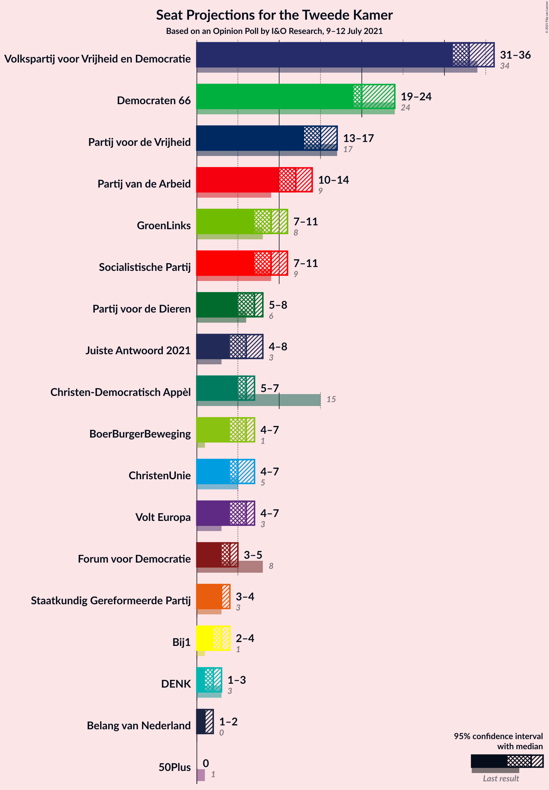
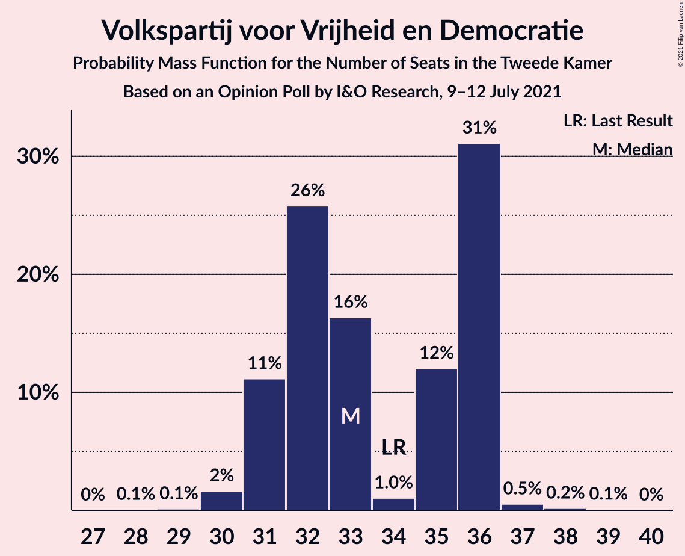
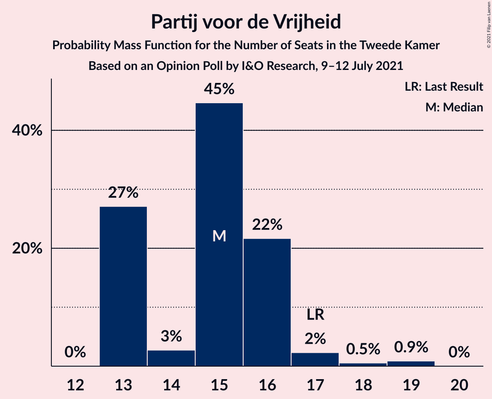
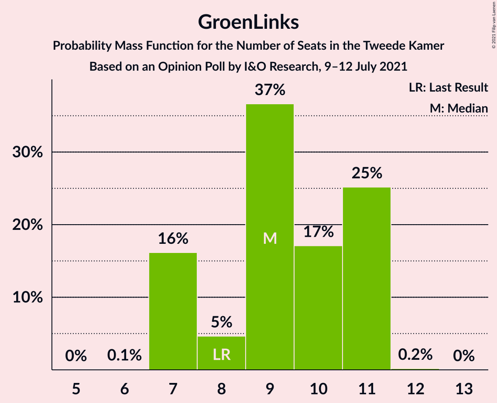
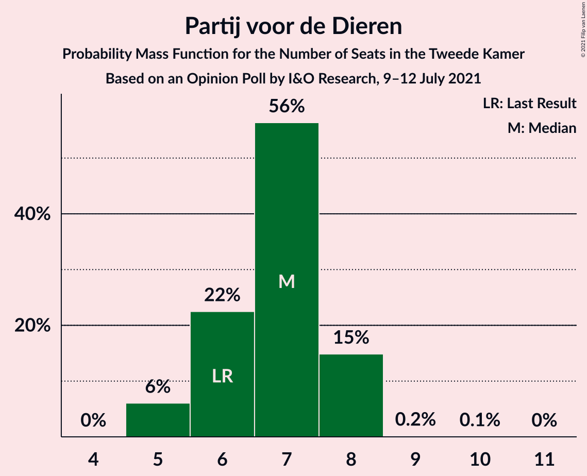
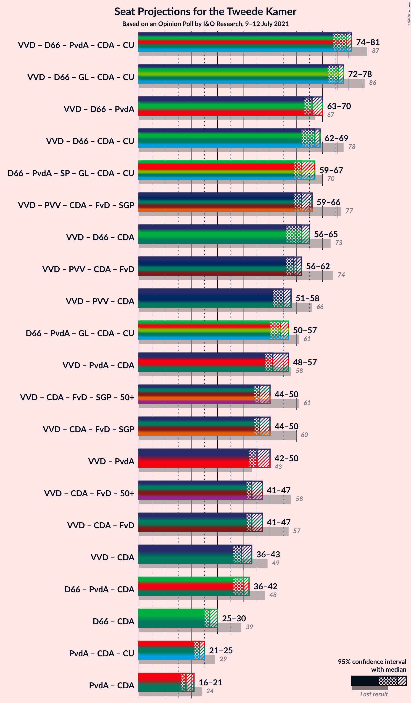
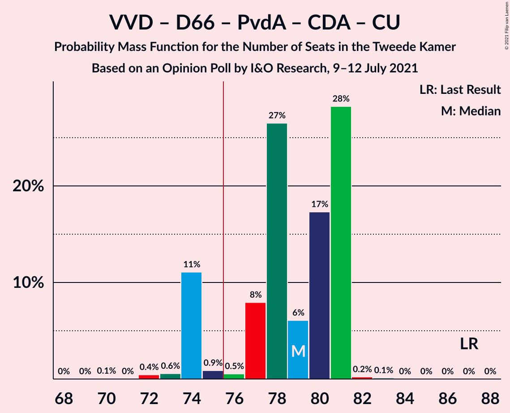
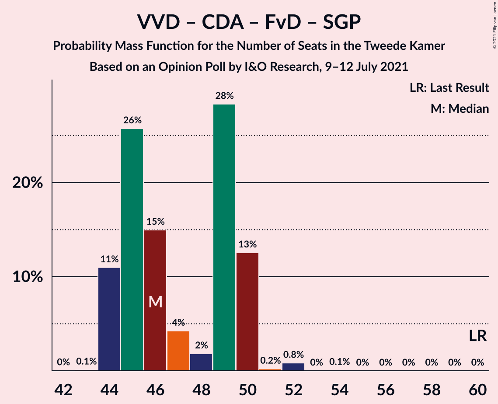

# Opinion Poll by I&O Research, 9–12 July 2021

<a href="#voting-intentions">Voting Intentions</a> | <a href="#seats">Seats</a> | <a href="#coalitions">Coalitions</a> | <a href="#technical-information">Technical Information</a>

## Voting Intentions

### Confidence Intervals

| Party | Last Result | Poll Result | 80% Confidence Interval | 90% Confidence Interval | 95% Confidence Interval | 99% Confidence Interval |
|:-----:|:-----------:|:-----------:|:-----------------------:|:-----------------------:|:-----------------------:|:-----------------------:|
| Volkspartij voor Vrijheid en Democratie | 21.9% | 21.5% | 20.4–22.7% |20.1–23.0% |19.8–23.3% |19.3–23.9% |
| Democraten 66 | 15.0% | 13.7% | 12.8–14.7% |12.5–15.0% |12.3–15.3% |11.9–15.7% |
| Partij voor de Vrijheid | 10.8% | 10.4% | 9.6–11.3% |9.4–11.6% |9.2–11.8% |8.8–12.3% |
| Partij van de Arbeid | 5.7% | 7.2% | 6.5–8.0% |6.3–8.2% |6.2–8.4% |5.9–8.7% |
| Socialistische Partij | 6.0% | 6.0% | 5.4–6.7% |5.2–6.9% |5.1–7.1% |4.8–7.5% |
| GroenLinks | 5.2% | 5.9% | 5.3–6.6% |5.1–6.8% |5.0–7.0% |4.7–7.4% |
| Partij voor de Dieren | 3.8% | 4.7% | 4.1–5.3% |4.0–5.5% |3.9–5.7% |3.6–6.0% |
| Christen-Democratisch Appèl | 9.5% | 4.1% | 3.6–4.7% |3.4–4.9% |3.3–5.0% |3.1–5.3% |
| Juiste Antwoord 2021 | 2.4% | 4.0% | 3.5–4.6% |3.4–4.8% |3.2–4.9% |3.0–5.2% |
| Volt Europa | 2.4% | 3.9% | 3.4–4.5% |3.3–4.7% |3.2–4.8% |2.9–5.1% |
| ChristenUnie | 3.4% | 3.5% | 3.0–4.1% |2.9–4.3% |2.8–4.4% |2.6–4.7% |
| BoerBurgerBeweging | 1.0% | 3.5% | 3.0–4.1% |2.9–4.3% |2.8–4.4% |2.6–4.7% |
| Forum voor Democratie | 5.0% | 3.0% | 2.6–3.5% |2.5–3.7% |2.4–3.8% |2.2–4.1% |
| Staatkundig Gereformeerde Partij | 2.1% | 2.4% | 2.0–2.9% |1.9–3.0% |1.8–3.1% |1.7–3.4% |
| Bij1 | 0.8% | 2.0% | 1.7–2.5% |1.6–2.6% |1.5–2.7% |1.3–3.0% |
| DENK | 2.0% | 1.6% | 1.3–2.0% |1.2–2.1% |1.1–2.2% |1.0–2.4% |
| 50Plus | 1.0% | 0.3% | 0.2–0.5% |0.2–0.6% |0.1–0.6% |0.1–0.7% |

*Note:* The poll result column reflects the actual value used in the calculations. Published results may vary slightly, and in addition be rounded to fewer digits.

## Seats

### Confidence Intervals

| Party | Last Result | Median | 80% Confidence Interval | 90% Confidence Interval | 95% Confidence Interval | 99% Confidence Interval |
|:-----:|:-----------:|:------:|:-----------------------:|:-----------------------:|:-----------------------:|:-----------------------:|
| <a href="#volkspartij-voor-vrijheid-en-democratie">Volkspartij voor Vrijheid en Democratie</a> | 34 | 33 | 30–36 |30–36 |30–36 |30–36 |
| <a href="#democraten-66">Democraten 66</a> | 24 | 23 | 20–24 |20–25 |20–25 |19–25 |
| <a href="#partij-voor-de-vrijheid">Partij voor de Vrijheid</a> | 17 | 17 | 15–18 |14–18 |14–19 |14–19 |
| <a href="#partij-van-de-arbeid">Partij van de Arbeid</a> | 9 | 10 | 10–12 |10–12 |10–12 |9–12 |
| <a href="#socialistische-partij">Socialistische Partij</a> | 9 | 8 | 7–11 |7–11 |7–11 |7–12 |
| <a href="#groenlinks">GroenLinks</a> | 8 | 8 | 8–9 |7–10 |7–10 |7–10 |
| <a href="#partij-voor-de-dieren">Partij voor de Dieren</a> | 6 | 7 | 6–8 |6–8 |6–8 |6–8 |
| <a href="#christen-democratisch-appèl">Christen-Democratisch Appèl</a> | 15 | 7 | 6–8 |5–8 |5–8 |5–8 |
| <a href="#juiste-antwoord-2021">Juiste Antwoord 2021</a> | 3 | 6 | 6–8 |4–8 |4–8 |4–8 |
| <a href="#volt-europa">Volt Europa</a> | 3 | 5 | 5–7 |5–7 |5–8 |4–8 |
| <a href="#christenunie">ChristenUnie</a> | 5 | 5 | 3–6 |3–6 |3–6 |3–6 |
| <a href="#boerburgerbeweging">BoerBurgerBeweging</a> | 1 | 5 | 3–7 |3–7 |3–7 |3–7 |
| <a href="#forum-voor-democratie">Forum voor Democratie</a> | 8 | 4 | 3–5 |3–5 |3–6 |3–7 |
| <a href="#staatkundig-gereformeerde-partij">Staatkundig Gereformeerde Partij</a> | 3 | 4 | 3–4 |3–4 |3–4 |3–4 |
| <a href="#bij1">Bij1</a> | 1 | 3 | 2–4 |2–4 |2–4 |2–4 |
| <a href="#denk">DENK</a> | 3 | 2 | 1–2 |1–3 |1–3 |1–4 |
| <a href="#50plus">50Plus</a> | 1 | 0 | 0 |0 |0 |0 |

### Volkspartij voor Vrijheid en Democratie

*For a full overview of the results for this party, see the [Volkspartij voor Vrijheid en Democratie](party-volkspartijvoorvrijheidendemocratie.html) page.*

| Number of Seats | Probability | Accumulated | Special Marks |
|:---------------:|:-----------:|:-----------:|:-------------:|
| 28 | 0.1% | 100% |  |
| 29 | 0% | 99.9% |  |
| 30 | 20% | 99.9% |  |
| 31 | 7% | 80% |  |
| 32 | 18% | 72% |  |
| 33 | 21% | 54% | Median |
| 34 | 13% | 33% | Last Result |
| 35 | 3% | 21% |  |
| 36 | 18% | 18% |  |
| 37 | 0% | 0.1% |  |
| 38 | 0% | 0% |  |

### Democraten 66

*For a full overview of the results for this party, see the [Democraten 66](party-democraten66.html) page.*

| Number of Seats | Probability | Accumulated | Special Marks |
|:---------------:|:-----------:|:-----------:|:-------------:|
| 18 | 0.1% | 100% |  |
| 19 | 0.9% | 99.9% |  |
| 20 | 27% | 99.0% |  |
| 21 | 15% | 72% |  |
| 22 | 0.4% | 57% |  |
| 23 | 13% | 57% | Median |
| 24 | 38% | 44% | Last Result |
| 25 | 6% | 6% |  |
| 26 | 0% | 0% |  |

### Partij voor de Vrijheid

*For a full overview of the results for this party, see the [Partij voor de Vrijheid](party-partijvoordevrijheid.html) page.*

| Number of Seats | Probability | Accumulated | Special Marks |
|:---------------:|:-----------:|:-----------:|:-------------:|
| 13 | 0.1% | 100% |  |
| 14 | 7% | 99.9% |  |
| 15 | 21% | 93% |  |
| 16 | 16% | 71% |  |
| 17 | 38% | 55% | Last Result, Median |
| 18 | 13% | 18% |  |
| 19 | 5% | 5% |  |
| 20 | 0% | 0% |  |

### Partij van de Arbeid

*For a full overview of the results for this party, see the [Partij van de Arbeid](party-partijvandearbeid.html) page.*

| Number of Seats | Probability | Accumulated | Special Marks |
|:---------------:|:-----------:|:-----------:|:-------------:|
| 9 | 2% | 100% | Last Result |
| 10 | 64% | 98% | Median |
| 11 | 15% | 34% |  |
| 12 | 19% | 19% |  |
| 13 | 0.1% | 0.1% |  |
| 14 | 0% | 0% |  |

### Socialistische Partij

*For a full overview of the results for this party, see the [Socialistische Partij](party-socialistischepartij.html) page.*

| Number of Seats | Probability | Accumulated | Special Marks |
|:---------------:|:-----------:|:-----------:|:-------------:|
| 7 | 21% | 100% |  |
| 8 | 30% | 79% | Median |
| 9 | 8% | 48% | Last Result |
| 10 | 18% | 40% |  |
| 11 | 21% | 22% |  |
| 12 | 1.4% | 1.4% |  |
| 13 | 0% | 0% |  |

### GroenLinks

*For a full overview of the results for this party, see the [GroenLinks](party-groenlinks.html) page.*

| Number of Seats | Probability | Accumulated | Special Marks |
|:---------------:|:-----------:|:-----------:|:-------------:|
| 7 | 7% | 100% |  |
| 8 | 51% | 93% | Last Result, Median |
| 9 | 37% | 42% |  |
| 10 | 5% | 5% |  |
| 11 | 0.1% | 0.1% |  |
| 12 | 0% | 0% |  |

### Partij voor de Dieren

*For a full overview of the results for this party, see the [Partij voor de Dieren](party-partijvoordedieren.html) page.*

| Number of Seats | Probability | Accumulated | Special Marks |
|:---------------:|:-----------:|:-----------:|:-------------:|
| 5 | 0.2% | 100% |  |
| 6 | 43% | 99.8% | Last Result |
| 7 | 43% | 56% | Median |
| 8 | 14% | 14% |  |
| 9 | 0% | 0.1% |  |
| 10 | 0% | 0% |  |

### Christen-Democratisch Appèl

*For a full overview of the results for this party, see the [Christen-Democratisch Appèl](party-christen-democratischappèl.html) page.*

| Number of Seats | Probability | Accumulated | Special Marks |
|:---------------:|:-----------:|:-----------:|:-------------:|
| 4 | 0.2% | 100% |  |
| 5 | 9% | 99.8% |  |
| 6 | 36% | 91% |  |
| 7 | 34% | 55% | Median |
| 8 | 21% | 21% |  |
| 9 | 0.1% | 0.1% |  |
| 10 | 0% | 0% |  |
| 11 | 0% | 0% |  |
| 12 | 0% | 0% |  |
| 13 | 0% | 0% |  |
| 14 | 0% | 0% |  |
| 15 | 0% | 0% | Last Result |

### Juiste Antwoord 2021

*For a full overview of the results for this party, see the [Juiste Antwoord 2021](party-juisteantwoord2021.html) page.*

| Number of Seats | Probability | Accumulated | Special Marks |
|:---------------:|:-----------:|:-----------:|:-------------:|
| 3 | 0% | 100% | Last Result |
| 4 | 6% | 100% |  |
| 5 | 0.6% | 94% |  |
| 6 | 52% | 93% | Median |
| 7 | 21% | 42% |  |
| 8 | 21% | 21% |  |
| 9 | 0% | 0% |  |

### Volt Europa

*For a full overview of the results for this party, see the [Volt Europa](party-volteuropa.html) page.*

| Number of Seats | Probability | Accumulated | Special Marks |
|:---------------:|:-----------:|:-----------:|:-------------:|
| 3 | 0% | 100% | Last Result |
| 4 | 0.6% | 100% |  |
| 5 | 52% | 99.3% | Median |
| 6 | 16% | 47% |  |
| 7 | 26% | 31% |  |
| 8 | 5% | 5% |  |
| 9 | 0% | 0% |  |

### ChristenUnie

*For a full overview of the results for this party, see the [ChristenUnie](party-christenunie.html) page.*

| Number of Seats | Probability | Accumulated | Special Marks |
|:---------------:|:-----------:|:-----------:|:-------------:|
| 3 | 17% | 100% |  |
| 4 | 0.4% | 83% |  |
| 5 | 68% | 82% | Last Result, Median |
| 6 | 15% | 15% |  |
| 7 | 0.1% | 0.1% |  |
| 8 | 0% | 0% |  |

### BoerBurgerBeweging

*For a full overview of the results for this party, see the [BoerBurgerBeweging](party-boerburgerbeweging.html) page.*

| Number of Seats | Probability | Accumulated | Special Marks |
|:---------------:|:-----------:|:-----------:|:-------------:|
| 1 | 0% | 100% | Last Result |
| 2 | 0% | 100% |  |
| 3 | 13% | 100% |  |
| 4 | 18% | 87% |  |
| 5 | 41% | 70% | Median |
| 6 | 1.5% | 29% |  |
| 7 | 27% | 27% |  |
| 8 | 0% | 0% |  |

### Forum voor Democratie

*For a full overview of the results for this party, see the [Forum voor Democratie](party-forumvoordemocratie.html) page.*

| Number of Seats | Probability | Accumulated | Special Marks |
|:---------------:|:-----------:|:-----------:|:-------------:|
| 3 | 22% | 100% |  |
| 4 | 57% | 78% | Median |
| 5 | 18% | 21% |  |
| 6 | 2% | 3% |  |
| 7 | 2% | 2% |  |
| 8 | 0% | 0% | Last Result |

### Staatkundig Gereformeerde Partij

*For a full overview of the results for this party, see the [Staatkundig Gereformeerde Partij](party-staatkundiggereformeerdepartij.html) page.*

| Number of Seats | Probability | Accumulated | Special Marks |
|:---------------:|:-----------:|:-----------:|:-------------:|
| 2 | 0.4% | 100% |  |
| 3 | 42% | 99.6% | Last Result |
| 4 | 57% | 58% | Median |
| 5 | 0.4% | 0.4% |  |
| 6 | 0% | 0% |  |

### Bij1

*For a full overview of the results for this party, see the [Bij1](party-bij1.html) page.*

| Number of Seats | Probability | Accumulated | Special Marks |
|:---------------:|:-----------:|:-----------:|:-------------:|
| 1 | 0.2% | 100% | Last Result |
| 2 | 42% | 99.8% |  |
| 3 | 39% | 58% | Median |
| 4 | 20% | 20% |  |
| 5 | 0.1% | 0.1% |  |
| 6 | 0% | 0% |  |

### DENK

*For a full overview of the results for this party, see the [DENK](party-denk.html) page.*

| Number of Seats | Probability | Accumulated | Special Marks |
|:---------------:|:-----------:|:-----------:|:-------------:|
| 1 | 32% | 100% |  |
| 2 | 60% | 68% | Median |
| 3 | 6% | 8% | Last Result |
| 4 | 1.4% | 1.4% |  |
| 5 | 0% | 0% |  |

### 50Plus

*For a full overview of the results for this party, see the [50Plus](party-50plus.html) page.*

| Number of Seats | Probability | Accumulated | Special Marks |
|:---------------:|:-----------:|:-----------:|:-------------:|
| 0 | 99.8% | 100% | Median |
| 1 | 0.2% | 0.2% | Last Result |
| 2 | 0% | 0% |  |

## Coalitions

### Confidence Intervals

| Coalition | Last Result | Median | Majority? | 80% Confidence Interval | 90% Confidence Interval | 95% Confidence Interval | 99% Confidence Interval |
|:---------:|:-----------:|:------:|:---------:|:-----------------------:|:-----------------------:|:-----------------------:|:-----------------------:|
| Volkspartij voor Vrijheid en Democratie – Democraten 66 – Partij van de Arbeid – Christen-Democratisch Appèl – ChristenUnie | 87 | 79 | 59% | 73–81 | 73–81 | 73–81 | 72–81 |
| Volkspartij voor Vrijheid en Democratie – Democraten 66 – GroenLinks – Christen-Democratisch Appèl – ChristenUnie | 86 | 77 | 53% | 71–78 | 71–78 | 71–78 | 69–78 |
| Volkspartij voor Vrijheid en Democratie – Democraten 66 – Partij van de Arbeid | 67 | 67 | 0% | 60–72 | 60–72 | 60–72 | 60–72 |
| Volkspartij voor Vrijheid en Democratie – Democraten 66 – Christen-Democratisch Appèl – ChristenUnie | 78 | 69 | 0% | 63–70 | 63–70 | 63–70 | 60–70 |
| Volkspartij voor Vrijheid en Democratie – Partij voor de Vrijheid – Christen-Democratisch Appèl – Forum voor Democratie – Staatkundig Gereformeerde Partij | 77 | 63 | 0% | 61–68 | 58–68 | 58–68 | 58–68 |
| Volkspartij voor Vrijheid en Democratie – Democraten 66 – Christen-Democratisch Appèl | 73 | 64 | 0% | 58–66 | 58–66 | 58–66 | 55–66 |
| Volkspartij voor Vrijheid en Democratie – Partij voor de Vrijheid – Christen-Democratisch Appèl – Forum voor Democratie | 74 | 59 | 0% | 58–64 | 54–64 | 54–64 | 54–64 |
| Democraten 66 – Partij van de Arbeid – Socialistische Partij – GroenLinks – Christen-Democratisch Appèl – ChristenUnie | 70 | 62 | 0% | 61–62 | 61–62 | 61–62 | 59–62 |
| Volkspartij voor Vrijheid en Democratie – Partij voor de Vrijheid – Christen-Democratisch Appèl | 66 | 55 | 0% | 54–59 | 50–59 | 50–59 | 50–59 |
| Democraten 66 – Partij van de Arbeid – GroenLinks – Christen-Democratisch Appèl – ChristenUnie | 61 | 53 | 0% | 51–55 | 51–55 | 50–55 | 47–55 |
| Volkspartij voor Vrijheid en Democratie – Partij van de Arbeid – Christen-Democratisch Appèl | 58 | 50 | 0% | 48–54 | 46–54 | 46–54 | 46–54 |
| Volkspartij voor Vrijheid en Democratie – Christen-Democratisch Appèl – Forum voor Democratie – Staatkundig Gereformeerde Partij – 50Plus | 61 | 46 | 0% | 45–51 | 44–51 | 44–51 | 43–51 |
| Volkspartij voor Vrijheid en Democratie – Christen-Democratisch Appèl – Forum voor Democratie – Staatkundig Gereformeerde Partij | 60 | 46 | 0% | 45–51 | 44–51 | 44–51 | 43–51 |
| Volkspartij voor Vrijheid en Democratie – Partij van de Arbeid | 43 | 43 | 0% | 40–48 | 40–48 | 40–48 | 40–48 |
| Volkspartij voor Vrijheid en Democratie – Christen-Democratisch Appèl – Forum voor Democratie – 50Plus | 58 | 43 | 0% | 42–47 | 40–47 | 40–47 | 39–48 |
| Volkspartij voor Vrijheid en Democratie – Christen-Democratisch Appèl – Forum voor Democratie | 57 | 43 | 0% | 42–47 | 40–47 | 40–47 | 39–48 |
| Democraten 66 – Partij van de Arbeid – Christen-Democratisch Appèl | 48 | 40 | 0% | 38–42 | 36–42 | 36–42 | 34–42 |
| Volkspartij voor Vrijheid en Democratie – Christen-Democratisch Appèl | 49 | 40 | 0% | 38–42 | 36–42 | 36–42 | 36–42 |
| Democraten 66 – Christen-Democratisch Appèl | 39 | 30 | 0% | 27–31 | 26–31 | 25–31 | 24–31 |
| Partij van de Arbeid – Christen-Democratisch Appèl – ChristenUnie | 29 | 22 | 0% | 21–23 | 20–23 | 20–23 | 20–24 |
| Partij van de Arbeid – Christen-Democratisch Appèl | 24 | 17 | 0% | 16–18 | 15–18 | 15–18 | 14–19 |

### Volkspartij voor Vrijheid en Democratie – Democraten 66 – Partij van de Arbeid – Christen-Democratisch Appèl – ChristenUnie

| Number of Seats | Probability | Accumulated | Special Marks |
|:---------------:|:-----------:|:-----------:|:-------------:|
| 72 | 0.9% | 100% |  |
| 73 | 25% | 99.0% |  |
| 74 | 0% | 74% |  |
| 75 | 14% | 74% |  |
| 76 | 6% | 59% | Majority |
| 77 | 0.4% | 53% |  |
| 78 | 2% | 53% | Median |
| 79 | 21% | 51% |  |
| 80 | 13% | 30% |  |
| 81 | 17% | 17% |  |
| 82 | 0% | 0% |  |
| 83 | 0% | 0% |  |
| 84 | 0% | 0% |  |
| 85 | 0% | 0% |  |
| 86 | 0% | 0% |  |
| 87 | 0% | 0% | Last Result |

### Volkspartij voor Vrijheid en Democratie – Democraten 66 – GroenLinks – Christen-Democratisch Appèl – ChristenUnie

| Number of Seats | Probability | Accumulated | Special Marks |
|:---------------:|:-----------:|:-----------:|:-------------:|
| 68 | 0.1% | 100% |  |
| 69 | 0.9% | 99.9% |  |
| 70 | 0% | 99.0% |  |
| 71 | 21% | 99.0% |  |
| 72 | 0.1% | 78% |  |
| 73 | 25% | 78% |  |
| 74 | 0.5% | 54% |  |
| 75 | 0.1% | 53% |  |
| 76 | 2% | 53% | Median, Majority |
| 77 | 17% | 51% |  |
| 78 | 34% | 34% |  |
| 79 | 0.1% | 0.1% |  |
| 80 | 0% | 0% |  |
| 81 | 0% | 0% |  |
| 82 | 0% | 0% |  |
| 83 | 0% | 0% |  |
| 84 | 0% | 0% |  |
| 85 | 0% | 0% |  |
| 86 | 0% | 0% | Last Result |

### Volkspartij voor Vrijheid en Democratie – Democraten 66 – Partij van de Arbeid

| Number of Seats | Probability | Accumulated | Special Marks |
|:---------------:|:-----------:|:-----------:|:-------------:|
| 60 | 20% | 100% |  |
| 61 | 0.1% | 80% |  |
| 62 | 5% | 80% |  |
| 63 | 0.8% | 74% |  |
| 64 | 15% | 74% |  |
| 65 | 0.2% | 59% |  |
| 66 | 6% | 59% | Median |
| 67 | 35% | 53% | Last Result |
| 68 | 0.2% | 18% |  |
| 69 | 0.1% | 17% |  |
| 70 | 0% | 17% |  |
| 71 | 0% | 17% |  |
| 72 | 17% | 17% |  |
| 73 | 0% | 0% |  |

### Volkspartij voor Vrijheid en Democratie – Democraten 66 – Christen-Democratisch Appèl – ChristenUnie

| Number of Seats | Probability | Accumulated | Special Marks |
|:---------------:|:-----------:|:-----------:|:-------------:|
| 60 | 0.9% | 100% |  |
| 61 | 0.5% | 99.0% |  |
| 62 | 0.1% | 98.6% |  |
| 63 | 25% | 98% |  |
| 64 | 13% | 74% |  |
| 65 | 0.2% | 61% |  |
| 66 | 8% | 61% |  |
| 67 | 2% | 53% |  |
| 68 | 0.1% | 51% | Median |
| 69 | 38% | 51% |  |
| 70 | 13% | 13% |  |
| 71 | 0% | 0% |  |
| 72 | 0% | 0% |  |
| 73 | 0% | 0% |  |
| 74 | 0% | 0% |  |
| 75 | 0% | 0% |  |
| 76 | 0% | 0% | Majority |
| 77 | 0% | 0% |  |
| 78 | 0% | 0% | Last Result |

### Volkspartij voor Vrijheid en Democratie – Partij voor de Vrijheid – Christen-Democratisch Appèl – Forum voor Democratie – Staatkundig Gereformeerde Partij

| Number of Seats | Probability | Accumulated | Special Marks |
|:---------------:|:-----------:|:-----------:|:-------------:|
| 57 | 0.1% | 100% |  |
| 58 | 6% | 99.9% |  |
| 59 | 0.5% | 94% |  |
| 60 | 0.9% | 94% |  |
| 61 | 34% | 93% |  |
| 62 | 0.2% | 59% |  |
| 63 | 22% | 59% |  |
| 64 | 5% | 37% |  |
| 65 | 0.5% | 32% | Median |
| 66 | 0.2% | 32% |  |
| 67 | 14% | 32% |  |
| 68 | 17% | 18% |  |
| 69 | 0.1% | 0.2% |  |
| 70 | 0.1% | 0.1% |  |
| 71 | 0% | 0% |  |
| 72 | 0% | 0% |  |
| 73 | 0% | 0% |  |
| 74 | 0% | 0% |  |
| 75 | 0% | 0% |  |
| 76 | 0% | 0% | Majority |
| 77 | 0% | 0% | Last Result |

### Volkspartij voor Vrijheid en Democratie – Democraten 66 – Christen-Democratisch Appèl

| Number of Seats | Probability | Accumulated | Special Marks |
|:---------------:|:-----------:|:-----------:|:-------------:|
| 55 | 1.0% | 100% |  |
| 56 | 0.5% | 99.0% |  |
| 57 | 0.1% | 98.6% |  |
| 58 | 25% | 98% |  |
| 59 | 13% | 74% |  |
| 60 | 2% | 61% |  |
| 61 | 6% | 59% |  |
| 62 | 2% | 53% |  |
| 63 | 0.2% | 51% | Median |
| 64 | 34% | 51% |  |
| 65 | 0.1% | 17% |  |
| 66 | 17% | 17% |  |
| 67 | 0% | 0% |  |
| 68 | 0% | 0% |  |
| 69 | 0% | 0% |  |
| 70 | 0% | 0% |  |
| 71 | 0% | 0% |  |
| 72 | 0% | 0% |  |
| 73 | 0% | 0% | Last Result |

### Volkspartij voor Vrijheid en Democratie – Partij voor de Vrijheid – Christen-Democratisch Appèl – Forum voor Democratie

| Number of Seats | Probability | Accumulated | Special Marks |
|:---------------:|:-----------:|:-----------:|:-------------:|
| 54 | 6% | 100% |  |
| 55 | 0.6% | 94% |  |
| 56 | 0.9% | 94% |  |
| 57 | 0.3% | 93% |  |
| 58 | 34% | 92% |  |
| 59 | 20% | 59% |  |
| 60 | 1.5% | 39% |  |
| 61 | 5% | 37% | Median |
| 62 | 0.4% | 32% |  |
| 63 | 13% | 32% |  |
| 64 | 19% | 19% |  |
| 65 | 0.1% | 0.1% |  |
| 66 | 0% | 0.1% |  |
| 67 | 0.1% | 0.1% |  |
| 68 | 0% | 0% |  |
| 69 | 0% | 0% |  |
| 70 | 0% | 0% |  |
| 71 | 0% | 0% |  |
| 72 | 0% | 0% |  |
| 73 | 0% | 0% |  |
| 74 | 0% | 0% | Last Result |

### Democraten 66 – Partij van de Arbeid – Socialistische Partij – GroenLinks – Christen-Democratisch Appèl – ChristenUnie

| Number of Seats | Probability | Accumulated | Special Marks |
|:---------------:|:-----------:|:-----------:|:-------------:|
| 57 | 0.1% | 100% |  |
| 58 | 0.1% | 99.8% |  |
| 59 | 2% | 99.8% |  |
| 60 | 0.4% | 98% |  |
| 61 | 30% | 98% | Median |
| 62 | 67% | 67% |  |
| 63 | 0% | 0.3% |  |
| 64 | 0% | 0.3% |  |
| 65 | 0% | 0.2% |  |
| 66 | 0.2% | 0.2% |  |
| 67 | 0% | 0% |  |
| 68 | 0% | 0% |  |
| 69 | 0% | 0% |  |
| 70 | 0% | 0% | Last Result |

### Volkspartij voor Vrijheid en Democratie – Partij voor de Vrijheid – Christen-Democratisch Appèl

| Number of Seats | Probability | Accumulated | Special Marks |
|:---------------:|:-----------:|:-----------:|:-------------:|
| 50 | 6% | 100% |  |
| 51 | 0.1% | 94% |  |
| 52 | 2% | 94% |  |
| 53 | 0.3% | 93% |  |
| 54 | 14% | 92% |  |
| 55 | 41% | 78% |  |
| 56 | 0.3% | 37% |  |
| 57 | 6% | 36% | Median |
| 58 | 0.2% | 30% |  |
| 59 | 30% | 30% |  |
| 60 | 0% | 0.2% |  |
| 61 | 0.2% | 0.2% |  |
| 62 | 0% | 0% |  |
| 63 | 0% | 0% |  |
| 64 | 0% | 0% |  |
| 65 | 0% | 0% |  |
| 66 | 0% | 0% | Last Result |

### Democraten 66 – Partij van de Arbeid – GroenLinks – Christen-Democratisch Appèl – ChristenUnie

| Number of Seats | Probability | Accumulated | Special Marks |
|:---------------:|:-----------:|:-----------:|:-------------:|
| 47 | 1.4% | 100% |  |
| 48 | 0% | 98.6% |  |
| 49 | 0% | 98.5% |  |
| 50 | 1.1% | 98.5% |  |
| 51 | 25% | 97% |  |
| 52 | 21% | 73% |  |
| 53 | 18% | 52% | Median |
| 54 | 13% | 34% |  |
| 55 | 21% | 21% |  |
| 56 | 0% | 0.2% |  |
| 57 | 0.1% | 0.1% |  |
| 58 | 0% | 0% |  |
| 59 | 0% | 0% |  |
| 60 | 0% | 0% |  |
| 61 | 0% | 0% | Last Result |

### Volkspartij voor Vrijheid en Democratie – Partij van de Arbeid – Christen-Democratisch Appèl

| Number of Seats | Probability | Accumulated | Special Marks |
|:---------------:|:-----------:|:-----------:|:-------------:|
| 45 | 0.1% | 100% |  |
| 46 | 6% | 99.9% |  |
| 47 | 0% | 94% |  |
| 48 | 26% | 94% |  |
| 49 | 15% | 68% |  |
| 50 | 21% | 53% | Median |
| 51 | 13% | 32% |  |
| 52 | 2% | 19% |  |
| 53 | 0.1% | 18% |  |
| 54 | 17% | 17% |  |
| 55 | 0.1% | 0.1% |  |
| 56 | 0% | 0% |  |
| 57 | 0% | 0% |  |
| 58 | 0% | 0% | Last Result |

### Volkspartij voor Vrijheid en Democratie – Christen-Democratisch Appèl – Forum voor Democratie – Staatkundig Gereformeerde Partij – 50Plus

| Number of Seats | Probability | Accumulated | Special Marks |
|:---------------:|:-----------:|:-----------:|:-------------:|
| 43 | 0.7% | 100% |  |
| 44 | 7% | 99.2% |  |
| 45 | 17% | 93% |  |
| 46 | 41% | 75% |  |
| 47 | 0.1% | 34% |  |
| 48 | 0.4% | 34% | Median |
| 49 | 14% | 34% |  |
| 50 | 0.4% | 20% |  |
| 51 | 19% | 19% |  |
| 52 | 0.1% | 0.2% |  |
| 53 | 0.1% | 0.2% |  |
| 54 | 0.1% | 0.1% |  |
| 55 | 0% | 0% |  |
| 56 | 0% | 0% |  |
| 57 | 0% | 0% |  |
| 58 | 0% | 0% |  |
| 59 | 0% | 0% |  |
| 60 | 0% | 0% |  |
| 61 | 0% | 0% | Last Result |

### Volkspartij voor Vrijheid en Democratie – Christen-Democratisch Appèl – Forum voor Democratie – Staatkundig Gereformeerde Partij

| Number of Seats | Probability | Accumulated | Special Marks |
|:---------------:|:-----------:|:-----------:|:-------------:|
| 43 | 0.7% | 100% |  |
| 44 | 7% | 99.2% |  |
| 45 | 17% | 92% |  |
| 46 | 41% | 75% |  |
| 47 | 0.1% | 34% |  |
| 48 | 0.3% | 34% | Median |
| 49 | 14% | 34% |  |
| 50 | 0.4% | 20% |  |
| 51 | 19% | 19% |  |
| 52 | 0.1% | 0.2% |  |
| 53 | 0.1% | 0.1% |  |
| 54 | 0.1% | 0.1% |  |
| 55 | 0% | 0% |  |
| 56 | 0% | 0% |  |
| 57 | 0% | 0% |  |
| 58 | 0% | 0% |  |
| 59 | 0% | 0% |  |
| 60 | 0% | 0% | Last Result |

### Volkspartij voor Vrijheid en Democratie – Partij van de Arbeid

| Number of Seats | Probability | Accumulated | Special Marks |
|:---------------:|:-----------:|:-----------:|:-------------:|
| 40 | 20% | 100% |  |
| 41 | 6% | 80% |  |
| 42 | 5% | 74% |  |
| 43 | 36% | 69% | Last Result, Median |
| 44 | 14% | 34% |  |
| 45 | 0.2% | 19% |  |
| 46 | 2% | 19% |  |
| 47 | 0% | 17% |  |
| 48 | 17% | 17% |  |
| 49 | 0% | 0% |  |

### Volkspartij voor Vrijheid en Democratie – Christen-Democratisch Appèl – Forum voor Democratie – 50Plus

| Number of Seats | Probability | Accumulated | Special Marks |
|:---------------:|:-----------:|:-----------:|:-------------:|
| 38 | 0.1% | 100% |  |
| 39 | 0.6% | 99.9% |  |
| 40 | 7% | 99.4% |  |
| 41 | 0.2% | 93% |  |
| 42 | 37% | 92% |  |
| 43 | 21% | 55% |  |
| 44 | 0.2% | 34% | Median |
| 45 | 13% | 34% |  |
| 46 | 2% | 21% |  |
| 47 | 18% | 19% |  |
| 48 | 1.4% | 2% |  |
| 49 | 0.1% | 0.2% |  |
| 50 | 0.1% | 0.1% |  |
| 51 | 0% | 0% |  |
| 52 | 0% | 0% |  |
| 53 | 0% | 0% |  |
| 54 | 0% | 0% |  |
| 55 | 0% | 0% |  |
| 56 | 0% | 0% |  |
| 57 | 0% | 0% |  |
| 58 | 0% | 0% | Last Result |

### Volkspartij voor Vrijheid en Democratie – Christen-Democratisch Appèl – Forum voor Democratie

| Number of Seats | Probability | Accumulated | Special Marks |
|:---------------:|:-----------:|:-----------:|:-------------:|
| 38 | 0.1% | 100% |  |
| 39 | 0.6% | 99.9% |  |
| 40 | 7% | 99.4% |  |
| 41 | 0.2% | 93% |  |
| 42 | 37% | 92% |  |
| 43 | 21% | 55% |  |
| 44 | 0.1% | 34% | Median |
| 45 | 13% | 34% |  |
| 46 | 2% | 21% |  |
| 47 | 18% | 19% |  |
| 48 | 1.5% | 2% |  |
| 49 | 0.1% | 0.1% |  |
| 50 | 0.1% | 0.1% |  |
| 51 | 0% | 0% |  |
| 52 | 0% | 0% |  |
| 53 | 0% | 0% |  |
| 54 | 0% | 0% |  |
| 55 | 0% | 0% |  |
| 56 | 0% | 0% |  |
| 57 | 0% | 0% | Last Result |

### Democraten 66 – Partij van de Arbeid – Christen-Democratisch Appèl

| Number of Seats | Probability | Accumulated | Special Marks |
|:---------------:|:-----------:|:-----------:|:-------------:|
| 34 | 1.4% | 100% |  |
| 35 | 0.1% | 98.6% |  |
| 36 | 6% | 98% |  |
| 37 | 0.9% | 93% |  |
| 38 | 34% | 92% |  |
| 39 | 0.6% | 58% |  |
| 40 | 19% | 57% | Median |
| 41 | 21% | 38% |  |
| 42 | 18% | 18% |  |
| 43 | 0% | 0% |  |
| 44 | 0% | 0% |  |
| 45 | 0% | 0% |  |
| 46 | 0% | 0% |  |
| 47 | 0% | 0% |  |
| 48 | 0% | 0% | Last Result |

### Volkspartij voor Vrijheid en Democratie – Christen-Democratisch Appèl

| Number of Seats | Probability | Accumulated | Special Marks |
|:---------------:|:-----------:|:-----------:|:-------------:|
| 33 | 0.1% | 100% |  |
| 34 | 0% | 99.9% |  |
| 35 | 0.1% | 99.9% |  |
| 36 | 7% | 99.9% |  |
| 37 | 0.1% | 93% |  |
| 38 | 38% | 93% |  |
| 39 | 0.2% | 55% |  |
| 40 | 23% | 55% | Median |
| 41 | 14% | 32% |  |
| 42 | 17% | 18% |  |
| 43 | 0.2% | 0.3% |  |
| 44 | 0.1% | 0.1% |  |
| 45 | 0% | 0% |  |
| 46 | 0% | 0% |  |
| 47 | 0% | 0% |  |
| 48 | 0% | 0% |  |
| 49 | 0% | 0% | Last Result |

### Democraten 66 – Christen-Democratisch Appèl

| Number of Seats | Probability | Accumulated | Special Marks |
|:---------------:|:-----------:|:-----------:|:-------------:|
| 24 | 0.9% | 100% |  |
| 25 | 2% | 99.1% |  |
| 26 | 5% | 97% |  |
| 27 | 15% | 92% |  |
| 28 | 21% | 78% |  |
| 29 | 0.2% | 57% |  |
| 30 | 36% | 57% | Median |
| 31 | 21% | 21% |  |
| 32 | 0% | 0% |  |
| 33 | 0% | 0% |  |
| 34 | 0% | 0% |  |
| 35 | 0% | 0% |  |
| 36 | 0% | 0% |  |
| 37 | 0% | 0% |  |
| 38 | 0% | 0% |  |
| 39 | 0% | 0% | Last Result |

### Partij van de Arbeid – Christen-Democratisch Appèl – ChristenUnie

| Number of Seats | Probability | Accumulated | Special Marks |
|:---------------:|:-----------:|:-----------:|:-------------:|
| 18 | 0.1% | 100% |  |
| 19 | 0.1% | 99.9% |  |
| 20 | 7% | 99.8% |  |
| 21 | 22% | 92% |  |
| 22 | 37% | 70% | Median |
| 23 | 33% | 33% |  |
| 24 | 0.2% | 0.7% |  |
| 25 | 0.3% | 0.4% |  |
| 26 | 0% | 0.1% |  |
| 27 | 0.1% | 0.1% |  |
| 28 | 0% | 0% |  |
| 29 | 0% | 0% | Last Result |

### Partij van de Arbeid – Christen-Democratisch Appèl

| Number of Seats | Probability | Accumulated | Special Marks |
|:---------------:|:-----------:|:-----------:|:-------------:|
| 14 | 2% | 100% |  |
| 15 | 6% | 98% |  |
| 16 | 5% | 92% |  |
| 17 | 50% | 88% | Median |
| 18 | 38% | 38% |  |
| 19 | 0.5% | 0.7% |  |
| 20 | 0% | 0.1% |  |
| 21 | 0.1% | 0.1% |  |
| 22 | 0% | 0% |  |
| 23 | 0% | 0% |  |
| 24 | 0% | 0% | Last Result |

## Technical Information

### Opinion Poll

+ **Polling firm:** I&O Research
+ **Commissioner(s):** —
+ **Fieldwork period:** 9–12 July 2021

### Calculations

+ **Sample size:** 2129
+ **Simulations done:** 131,072
+ **Error estimate:** 2.87%

