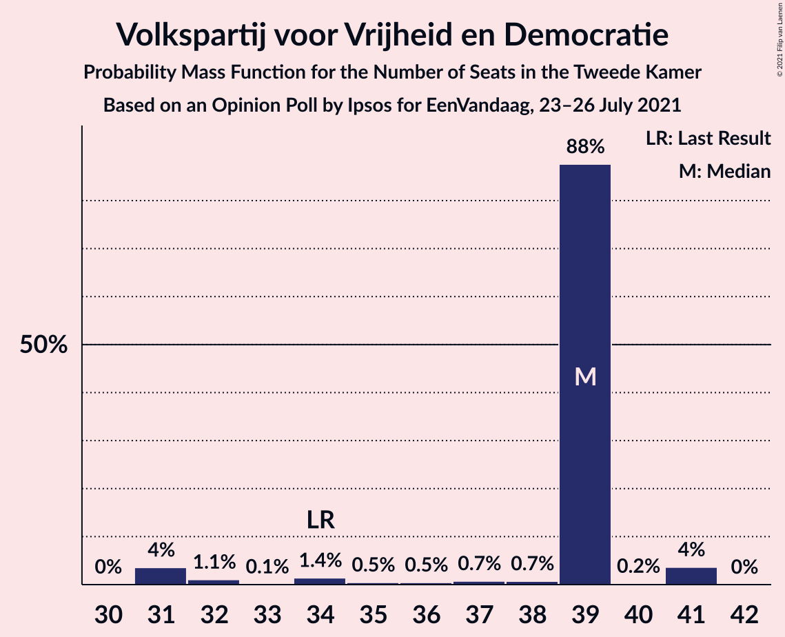
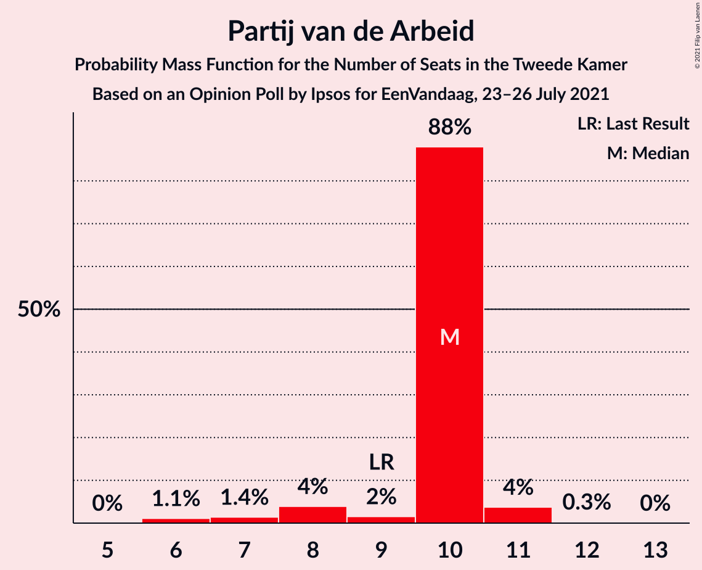
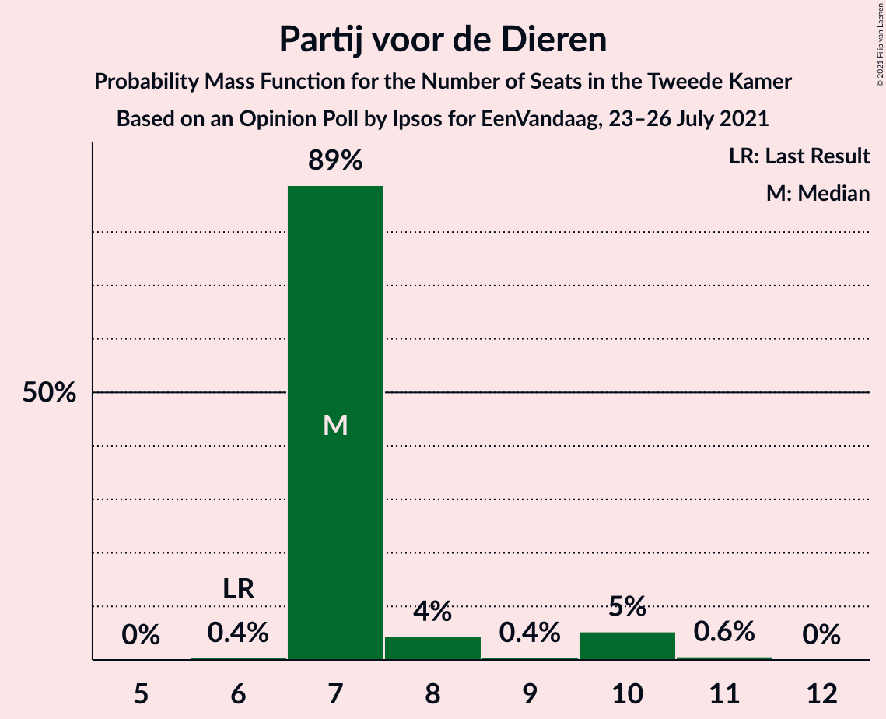
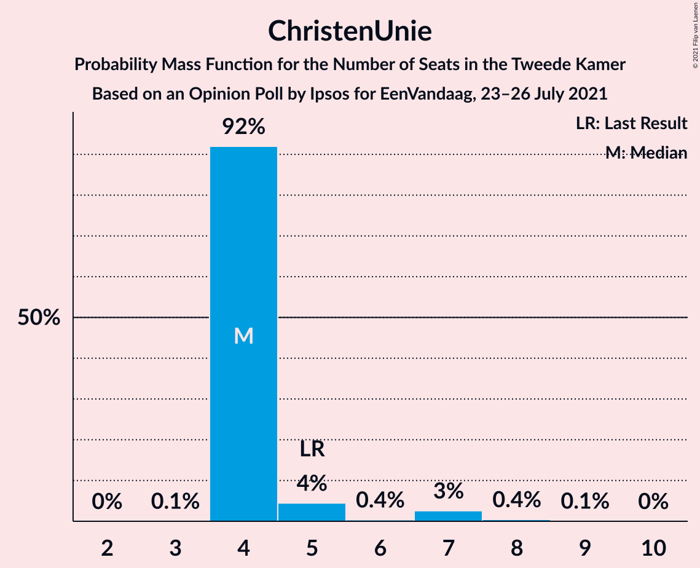
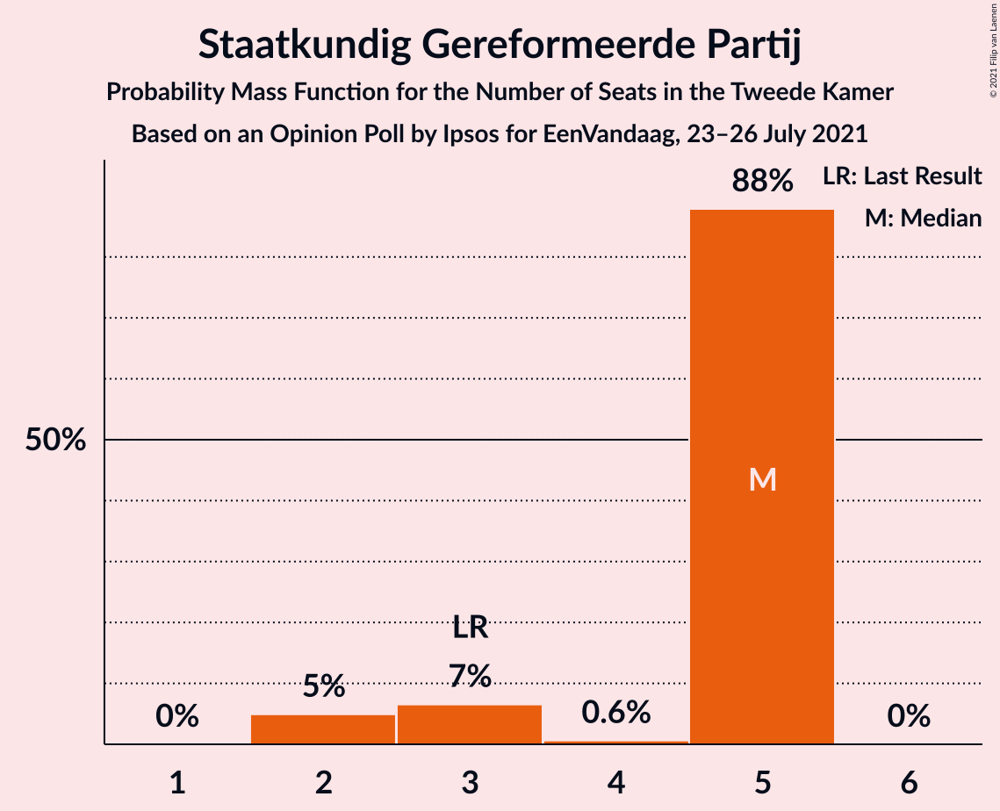

# Opinion Poll by Ipsos for EenVandaag, 23–26 July 2021

<a href="#voting-intentions">Voting Intentions</a> | <a href="#seats">Seats</a> | <a href="#coalitions">Coalitions</a> | <a href="#technical-information">Technical Information</a>

## Voting Intentions

### Confidence Intervals

| Party | Last Result | Poll Result | 80% Confidence Interval | 90% Confidence Interval | 95% Confidence Interval | 99% Confidence Interval |
|:-----:|:-----------:|:-----------:|:-----------------------:|:-----------------------:|:-----------------------:|:-----------------------:|
| Volkspartij voor Vrijheid en Democratie | 21.9% | 23.3% | 21.7–25.1% |21.2–25.6% |20.8–26.0% |20.0–26.9% |
| Democraten 66 | 15.0% | 13.7% | 12.4–15.2% |12.1–15.7% |11.8–16.0% |11.1–16.8% |
| Partij voor de Vrijheid | 10.8% | 10.5% | 9.3–11.8% |9.0–12.2% |8.7–12.5% |8.2–13.2% |
| Christen-Democratisch Appèl | 9.5% | 6.2% | 5.3–7.3% |5.0–7.6% |4.8–7.8% |4.5–8.4% |
| Socialistische Partij | 6.0% | 5.9% | 5.0–7.0% |4.8–7.2% |4.6–7.5% |4.2–8.1% |
| Partij van de Arbeid | 5.7% | 5.7% | 4.8–6.7% |4.6–7.0% |4.4–7.3% |4.0–7.8% |
| Partij voor de Dieren | 3.8% | 5.3% | 4.5–6.3% |4.2–6.6% |4.1–6.8% |3.7–7.4% |
| GroenLinks | 5.2% | 5.0% | 4.2–6.0% |4.0–6.3% |3.8–6.5% |3.4–7.0% |
| Juiste Antwoord 2021 | 2.4% | 4.5% | 3.7–5.4% |3.5–5.7% |3.4–6.0% |3.0–6.4% |
| ChristenUnie | 3.4% | 3.8% | 3.1–4.7% |2.9–4.9% |2.8–5.2% |2.5–5.6% |
| Volt Europa | 2.4% | 3.5% | 2.9–4.4% |2.7–4.6% |2.5–4.8% |2.2–5.3% |
| BoerBurgerBeweging | 1.0% | 2.8% | 2.2–3.6% |2.1–3.8% |1.9–4.0% |1.7–4.4% |
| Forum voor Democratie | 5.0% | 2.5% | 2.0–3.2% |1.8–3.5% |1.7–3.7% |1.5–4.1% |
| DENK | 2.0% | 2.4% | 1.9–3.1% |1.7–3.4% |1.6–3.5% |1.4–3.9% |
| Staatkundig Gereformeerde Partij | 2.1% | 2.3% | 1.8–3.0% |1.6–3.2% |1.5–3.4% |1.3–3.8% |
| Bij1 | 0.8% | 1.0% | 0.7–1.5% |0.6–1.7% |0.5–1.8% |0.4–2.1% |
| 50Plus | 1.0% | 0.6% | 0.4–1.1% |0.3–1.2% |0.3–1.3% |0.2–1.6% |

*Note:* The poll result column reflects the actual value used in the calculations. Published results may vary slightly, and in addition be rounded to fewer digits.

## Seats

### Confidence Intervals

| Party | Last Result | Median | 80% Confidence Interval | 90% Confidence Interval | 95% Confidence Interval | 99% Confidence Interval |
|:-----:|:-----------:|:------:|:-----------------------:|:-----------------------:|:-----------------------:|:-----------------------:|
| <a href="#volkspartij-voor-vrijheid-en-democratie">Volkspartij voor Vrijheid en Democratie</a> | 34 | 37 | 32–37 |32–37 |32–39 |30–40 |
| <a href="#democraten-66">Democraten 66</a> | 24 | 19 | 19–23 |19–23 |19–25 |17–25 |
| <a href="#partij-voor-de-vrijheid">Partij voor de Vrijheid</a> | 17 | 21 | 14–21 |14–21 |12–21 |12–21 |
| <a href="#christen-democratisch-appèl">Christen-Democratisch Appèl</a> | 15 | 11 | 10–11 |8–11 |8–11 |7–14 |
| <a href="#socialistische-partij">Socialistische Partij</a> | 9 | 11 | 8–11 |7–11 |6–11 |6–13 |
| <a href="#partij-van-de-arbeid">Partij van de Arbeid</a> | 9 | 8 | 8–9 |8–9 |7–11 |6–13 |
| <a href="#partij-voor-de-dieren">Partij voor de Dieren</a> | 6 | 6 | 6–9 |6–12 |5–12 |4–12 |
| <a href="#groenlinks">GroenLinks</a> | 8 | 7 | 6–9 |5–9 |5–10 |5–11 |
| <a href="#juiste-antwoord-2021">Juiste Antwoord 2021</a> | 3 | 5 | 5–7 |4–7 |4–11 |4–11 |
| <a href="#christenunie">ChristenUnie</a> | 5 | 4 | 4–6 |4–7 |4–7 |4–8 |
| <a href="#volt-europa">Volt Europa</a> | 3 | 7 | 4–7 |4–7 |3–7 |3–7 |
| <a href="#boerburgerbeweging">BoerBurgerBeweging</a> | 1 | 4 | 4–5 |4–5 |3–5 |2–7 |
| <a href="#forum-voor-democratie">Forum voor Democratie</a> | 8 | 2 | 2–4 |2–5 |2–6 |2–7 |
| <a href="#denk">DENK</a> | 3 | 3 | 3–4 |3–4 |2–4 |1–5 |
| <a href="#staatkundig-gereformeerde-partij">Staatkundig Gereformeerde Partij</a> | 3 | 3 | 3–4 |3–4 |2–5 |2–5 |
| <a href="#bij1">Bij1</a> | 1 | 1 | 1 |1–2 |0–2 |0–2 |
| <a href="#50plus">50Plus</a> | 1 | 0 | 0–1 |0–1 |0–2 |0–2 |

### Volkspartij voor Vrijheid en Democratie

*For a full overview of the results for this party, see the [Volkspartij voor Vrijheid en Democratie](party-volkspartijvoorvrijheidendemocratie.html) page.*

| Number of Seats | Probability | Accumulated | Special Marks |
|:---------------:|:-----------:|:-----------:|:-------------:|
| 30 | 1.3% | 100% |  |
| 31 | 0.9% | 98.7% |  |
| 32 | 9% | 98% |  |
| 33 | 5% | 89% |  |
| 34 | 0.8% | 84% | Last Result |
| 35 | 3% | 83% |  |
| 36 | 2% | 80% |  |
| 37 | 73% | 78% | Median |
| 38 | 0.6% | 5% |  |
| 39 | 3% | 4% |  |
| 40 | 0.8% | 1.0% |  |
| 41 | 0.2% | 0.2% |  |
| 42 | 0% | 0% |  |

### Democraten 66

*For a full overview of the results for this party, see the [Democraten 66](party-democraten66.html) page.*

| Number of Seats | Probability | Accumulated | Special Marks |
|:---------------:|:-----------:|:-----------:|:-------------:|
| 15 | 0.1% | 100% |  |
| 16 | 0% | 99.9% |  |
| 17 | 1.0% | 99.9% |  |
| 18 | 0.7% | 98.9% |  |
| 19 | 76% | 98% | Median |
| 20 | 0.9% | 22% |  |
| 21 | 8% | 21% |  |
| 22 | 3% | 13% |  |
| 23 | 6% | 10% |  |
| 24 | 0.7% | 4% | Last Result |
| 25 | 3% | 3% |  |
| 26 | 0.1% | 0.3% |  |
| 27 | 0.2% | 0.2% |  |
| 28 | 0% | 0% |  |

### Partij voor de Vrijheid

*For a full overview of the results for this party, see the [Partij voor de Vrijheid](party-partijvoordevrijheid.html) page.*

| Number of Seats | Probability | Accumulated | Special Marks |
|:---------------:|:-----------:|:-----------:|:-------------:|
| 12 | 3% | 100% |  |
| 13 | 0.2% | 97% |  |
| 14 | 10% | 97% |  |
| 15 | 6% | 87% |  |
| 16 | 1.0% | 81% |  |
| 17 | 0.7% | 80% | Last Result |
| 18 | 5% | 79% |  |
| 19 | 0.3% | 74% |  |
| 20 | 1.4% | 74% |  |
| 21 | 72% | 72% | Median |
| 22 | 0% | 0.1% |  |
| 23 | 0.1% | 0.1% |  |
| 24 | 0% | 0% |  |

### Christen-Democratisch Appèl

*For a full overview of the results for this party, see the [Christen-Democratisch Appèl](party-christen-democratischappèl.html) page.*

| Number of Seats | Probability | Accumulated | Special Marks |
|:---------------:|:-----------:|:-----------:|:-------------:|
| 7 | 0.6% | 100% |  |
| 8 | 5% | 99.3% |  |
| 9 | 2% | 94% |  |
| 10 | 7% | 92% |  |
| 11 | 83% | 85% | Median |
| 12 | 0.1% | 2% |  |
| 13 | 0.1% | 2% |  |
| 14 | 2% | 2% |  |
| 15 | 0% | 0% | Last Result |

### Socialistische Partij

*For a full overview of the results for this party, see the [Socialistische Partij](party-socialistischepartij.html) page.*

| Number of Seats | Probability | Accumulated | Special Marks |
|:---------------:|:-----------:|:-----------:|:-------------:|
| 5 | 0.1% | 100% |  |
| 6 | 3% | 99.9% |  |
| 7 | 6% | 97% |  |
| 8 | 6% | 91% |  |
| 9 | 2% | 85% | Last Result |
| 10 | 3% | 83% |  |
| 11 | 79% | 80% | Median |
| 12 | 0.6% | 1.1% |  |
| 13 | 0.5% | 0.5% |  |
| 14 | 0% | 0% |  |

### Partij van de Arbeid

*For a full overview of the results for this party, see the [Partij van de Arbeid](party-partijvandearbeid.html) page.*

| Number of Seats | Probability | Accumulated | Special Marks |
|:---------------:|:-----------:|:-----------:|:-------------:|
| 5 | 0.1% | 100% |  |
| 6 | 0.4% | 99.9% |  |
| 7 | 4% | 99.5% |  |
| 8 | 84% | 96% | Median |
| 9 | 8% | 11% | Last Result |
| 10 | 0.6% | 3% |  |
| 11 | 0.6% | 3% |  |
| 12 | 1.0% | 2% |  |
| 13 | 1.1% | 1.2% |  |
| 14 | 0.1% | 0.1% |  |
| 15 | 0% | 0% |  |

### Partij voor de Dieren

*For a full overview of the results for this party, see the [Partij voor de Dieren](party-partijvoordedieren.html) page.*

| Number of Seats | Probability | Accumulated | Special Marks |
|:---------------:|:-----------:|:-----------:|:-------------:|
| 4 | 1.3% | 100% |  |
| 5 | 2% | 98.7% |  |
| 6 | 75% | 97% | Last Result, Median |
| 7 | 4% | 21% |  |
| 8 | 6% | 17% |  |
| 9 | 2% | 11% |  |
| 10 | 2% | 9% |  |
| 11 | 0.8% | 7% |  |
| 12 | 6% | 6% |  |
| 13 | 0% | 0% |  |

### GroenLinks

*For a full overview of the results for this party, see the [GroenLinks](party-groenlinks.html) page.*

| Number of Seats | Probability | Accumulated | Special Marks |
|:---------------:|:-----------:|:-----------:|:-------------:|
| 5 | 9% | 100% |  |
| 6 | 3% | 91% |  |
| 7 | 76% | 89% | Median |
| 8 | 1.1% | 13% | Last Result |
| 9 | 8% | 12% |  |
| 10 | 4% | 4% |  |
| 11 | 0.5% | 0.5% |  |
| 12 | 0% | 0% |  |

### Juiste Antwoord 2021

*For a full overview of the results for this party, see the [Juiste Antwoord 2021](party-juisteantwoord2021.html) page.*

| Number of Seats | Probability | Accumulated | Special Marks |
|:---------------:|:-----------:|:-----------:|:-------------:|
| 3 | 0.3% | 100% | Last Result |
| 4 | 8% | 99.7% |  |
| 5 | 72% | 92% | Median |
| 6 | 3% | 20% |  |
| 7 | 12% | 17% |  |
| 8 | 0.6% | 5% |  |
| 9 | 0.5% | 4% |  |
| 10 | 0.1% | 4% |  |
| 11 | 3% | 3% |  |
| 12 | 0.2% | 0.2% |  |
| 13 | 0% | 0% |  |

### ChristenUnie

*For a full overview of the results for this party, see the [ChristenUnie](party-christenunie.html) page.*

| Number of Seats | Probability | Accumulated | Special Marks |
|:---------------:|:-----------:|:-----------:|:-------------:|
| 3 | 0.4% | 100% |  |
| 4 | 75% | 99.6% | Median |
| 5 | 6% | 24% | Last Result |
| 6 | 13% | 19% |  |
| 7 | 4% | 6% |  |
| 8 | 2% | 2% |  |
| 9 | 0.3% | 0.4% |  |
| 10 | 0% | 0% |  |

### Volt Europa

*For a full overview of the results for this party, see the [Volt Europa](party-volteuropa.html) page.*

| Number of Seats | Probability | Accumulated | Special Marks |
|:---------------:|:-----------:|:-----------:|:-------------:|
| 3 | 3% | 100% | Last Result |
| 4 | 11% | 97% |  |
| 5 | 7% | 86% |  |
| 6 | 3% | 79% |  |
| 7 | 76% | 76% | Median |
| 8 | 0.4% | 0.5% |  |
| 9 | 0% | 0% |  |

### BoerBurgerBeweging

*For a full overview of the results for this party, see the [BoerBurgerBeweging](party-boerburgerbeweging.html) page.*

| Number of Seats | Probability | Accumulated | Special Marks |
|:---------------:|:-----------:|:-----------:|:-------------:|
| 1 | 0% | 100% | Last Result |
| 2 | 1.1% | 100% |  |
| 3 | 3% | 98.9% |  |
| 4 | 83% | 96% | Median |
| 5 | 11% | 13% |  |
| 6 | 1.5% | 2% |  |
| 7 | 0.5% | 0.5% |  |
| 8 | 0% | 0% |  |

### Forum voor Democratie

*For a full overview of the results for this party, see the [Forum voor Democratie](party-forumvoordemocratie.html) page.*

| Number of Seats | Probability | Accumulated | Special Marks |
|:---------------:|:-----------:|:-----------:|:-------------:|
| 2 | 79% | 100% | Median |
| 3 | 10% | 21% |  |
| 4 | 4% | 11% |  |
| 5 | 2% | 7% |  |
| 6 | 4% | 5% |  |
| 7 | 0.9% | 0.9% |  |
| 8 | 0% | 0% | Last Result |

### DENK

*For a full overview of the results for this party, see the [DENK](party-denk.html) page.*

| Number of Seats | Probability | Accumulated | Special Marks |
|:---------------:|:-----------:|:-----------:|:-------------:|
| 1 | 2% | 100% |  |
| 2 | 1.1% | 98% |  |
| 3 | 85% | 97% | Last Result, Median |
| 4 | 11% | 12% |  |
| 5 | 0.7% | 0.8% |  |
| 6 | 0.1% | 0.1% |  |
| 7 | 0% | 0% |  |

### Staatkundig Gereformeerde Partij

*For a full overview of the results for this party, see the [Staatkundig Gereformeerde Partij](party-staatkundiggereformeerdepartij.html) page.*

| Number of Seats | Probability | Accumulated | Special Marks |
|:---------------:|:-----------:|:-----------:|:-------------:|
| 1 | 0.3% | 100% |  |
| 2 | 2% | 99.7% |  |
| 3 | 85% | 97% | Last Result, Median |
| 4 | 10% | 12% |  |
| 5 | 3% | 3% |  |
| 6 | 0% | 0% |  |

### Bij1

*For a full overview of the results for this party, see the [Bij1](party-bij1.html) page.*

| Number of Seats | Probability | Accumulated | Special Marks |
|:---------------:|:-----------:|:-----------:|:-------------:|
| 0 | 4% | 100% |  |
| 1 | 89% | 96% | Last Result, Median |
| 2 | 6% | 6% |  |
| 3 | 0.4% | 0.4% |  |
| 4 | 0% | 0% |  |

### 50Plus

*For a full overview of the results for this party, see the [50Plus](party-50plus.html) page.*

| Number of Seats | Probability | Accumulated | Special Marks |
|:---------------:|:-----------:|:-----------:|:-------------:|
| 0 | 77% | 100% | Median |
| 1 | 19% | 23% | Last Result |
| 2 | 4% | 4% |  |
| 3 | 0.1% | 0.1% |  |
| 4 | 0% | 0% |  |

## Coalitions

### Confidence Intervals

| Coalition | Last Result | Median | Majority? | 80% Confidence Interval | 90% Confidence Interval | 95% Confidence Interval | 99% Confidence Interval |
|:---------:|:-----------:|:------:|:---------:|:-----------------------:|:-----------------------:|:-----------------------:|:-----------------------:|
| Volkspartij voor Vrijheid en Democratie – Democraten 66 – Christen-Democratisch Appèl – Partij van de Arbeid – ChristenUnie | 87 | 79 | 98% | 78–81 | 78–83 | 77–86 | 72–87 |
| Volkspartij voor Vrijheid en Democratie – Democraten 66 – Christen-Democratisch Appèl – GroenLinks – ChristenUnie | 86 | 78 | 93% | 78–79 | 75–83 | 75–85 | 72–87 |
| Volkspartij voor Vrijheid en Democratie – Democraten 66 – Christen-Democratisch Appèl – ChristenUnie | 78 | 71 | 4% | 70–73 | 70–74 | 68–77 | 65–80 |
| Volkspartij voor Vrijheid en Democratie – Partij voor de Vrijheid – Christen-Democratisch Appèl – Forum voor Democratie – Staatkundig Gereformeerde Partij | 77 | 74 | 0% | 65–74 | 63–74 | 63–74 | 60–74 |
| Volkspartij voor Vrijheid en Democratie – Democraten 66 – Christen-Democratisch Appèl | 73 | 67 | 0% | 64–67 | 63–68 | 62–71 | 60–74 |
| Volkspartij voor Vrijheid en Democratie – Partij voor de Vrijheid – Christen-Democratisch Appèl – Forum voor Democratie | 74 | 71 | 0% | 62–71 | 59–71 | 59–71 | 56–71 |
| Volkspartij voor Vrijheid en Democratie – Partij voor de Vrijheid – Christen-Democratisch Appèl | 66 | 69 | 0% | 57–69 | 57–69 | 56–69 | 53–69 |
| Volkspartij voor Vrijheid en Democratie – Democraten 66 – Partij van de Arbeid | 67 | 64 | 0% | 63–67 | 61–67 | 61–67 | 56–70 |
| Democraten 66 – Christen-Democratisch Appèl – Socialistische Partij – Partij van de Arbeid – GroenLinks – ChristenUnie | 70 | 60 | 0% | 60–66 | 58–66 | 53–66 | 53–68 |
| Democraten 66 – Christen-Democratisch Appèl – Partij van de Arbeid – GroenLinks – ChristenUnie | 61 | 49 | 0% | 49–55 | 49–57 | 45–59 | 45–61 |
| Volkspartij voor Vrijheid en Democratie – Christen-Democratisch Appèl – Partij van de Arbeid | 58 | 56 | 0% | 51–56 | 51–56 | 49–57 | 47–57 |
| Volkspartij voor Vrijheid en Democratie – Christen-Democratisch Appèl – Forum voor Democratie – Staatkundig Gereformeerde Partij – 50Plus | 61 | 53 | 0% | 50–54 | 50–56 | 48–56 | 46–57 |
| Volkspartij voor Vrijheid en Democratie – Christen-Democratisch Appèl – Forum voor Democratie – Staatkundig Gereformeerde Partij | 60 | 53 | 0% | 50–53 | 49–55 | 47–55 | 45–56 |
| Volkspartij voor Vrijheid en Democratie – Christen-Democratisch Appèl – Forum voor Democratie – 50Plus | 58 | 50 | 0% | 46–51 | 46–53 | 45–53 | 43–53 |
| Volkspartij voor Vrijheid en Democratie – Christen-Democratisch Appèl – Forum voor Democratie | 57 | 50 | 0% | 46–50 | 45–51 | 44–52 | 42–53 |
| Volkspartij voor Vrijheid en Democratie – Christen-Democratisch Appèl | 49 | 48 | 0% | 43–48 | 42–48 | 41–49 | 39–49 |
| Volkspartij voor Vrijheid en Democratie – Partij van de Arbeid | 43 | 45 | 0% | 41–45 | 40–46 | 40–48 | 38–48 |
| Democraten 66 – Christen-Democratisch Appèl – Partij van de Arbeid | 48 | 38 | 0% | 38–41 | 36–43 | 36–45 | 35–46 |
| Democraten 66 – Christen-Democratisch Appèl | 39 | 30 | 0% | 30–32 | 28–34 | 27–36 | 27–39 |
| Christen-Democratisch Appèl – Partij van de Arbeid – ChristenUnie | 29 | 23 | 0% | 23–25 | 22–27 | 21–27 | 20–30 |
| Christen-Democratisch Appèl – Partij van de Arbeid | 24 | 19 | 0% | 19 | 17–21 | 16–21 | 14–23 |

### Volkspartij voor Vrijheid en Democratie – Democraten 66 – Christen-Democratisch Appèl – Partij van de Arbeid – ChristenUnie

| Number of Seats | Probability | Accumulated | Special Marks |
|:---------------:|:-----------:|:-----------:|:-------------:|
| 72 | 0.9% | 100% |  |
| 73 | 0.2% | 99.1% |  |
| 74 | 0% | 98.8% |  |
| 75 | 0.5% | 98.8% |  |
| 76 | 0.6% | 98% | Majority |
| 77 | 1.3% | 98% |  |
| 78 | 7% | 96% |  |
| 79 | 75% | 90% | Median |
| 80 | 2% | 15% |  |
| 81 | 4% | 13% |  |
| 82 | 3% | 9% |  |
| 83 | 1.2% | 6% |  |
| 84 | 0.1% | 5% |  |
| 85 | 2% | 5% |  |
| 86 | 0.4% | 3% |  |
| 87 | 2% | 2% | Last Result |
| 88 | 0% | 0.3% |  |
| 89 | 0.3% | 0.3% |  |
| 90 | 0% | 0% |  |

### Volkspartij voor Vrijheid en Democratie – Democraten 66 – Christen-Democratisch Appèl – GroenLinks – ChristenUnie

| Number of Seats | Probability | Accumulated | Special Marks |
|:---------------:|:-----------:|:-----------:|:-------------:|
| 72 | 1.0% | 100% |  |
| 73 | 0.1% | 99.0% |  |
| 74 | 1.2% | 98.9% |  |
| 75 | 5% | 98% |  |
| 76 | 1.1% | 93% | Majority |
| 77 | 0.2% | 92% |  |
| 78 | 76% | 91% | Median |
| 79 | 6% | 16% |  |
| 80 | 2% | 9% |  |
| 81 | 1.0% | 8% |  |
| 82 | 0.1% | 7% |  |
| 83 | 2% | 6% |  |
| 84 | 0% | 5% |  |
| 85 | 2% | 5% |  |
| 86 | 0% | 2% | Last Result |
| 87 | 2% | 2% |  |
| 88 | 0% | 0% |  |

### Volkspartij voor Vrijheid en Democratie – Democraten 66 – Christen-Democratisch Appèl – ChristenUnie

| Number of Seats | Probability | Accumulated | Special Marks |
|:---------------:|:-----------:|:-----------:|:-------------:|
| 65 | 0.9% | 100% |  |
| 66 | 0.1% | 99.1% |  |
| 67 | 0.6% | 98.9% |  |
| 68 | 1.1% | 98% |  |
| 69 | 2% | 97% |  |
| 70 | 11% | 95% |  |
| 71 | 73% | 84% | Median |
| 72 | 0.1% | 12% |  |
| 73 | 6% | 11% |  |
| 74 | 0.8% | 5% |  |
| 75 | 0% | 4% |  |
| 76 | 2% | 4% | Majority |
| 77 | 0.2% | 3% |  |
| 78 | 0% | 2% | Last Result |
| 79 | 0% | 2% |  |
| 80 | 2% | 2% |  |
| 81 | 0% | 0% |  |

### Volkspartij voor Vrijheid en Democratie – Partij voor de Vrijheid – Christen-Democratisch Appèl – Forum voor Democratie – Staatkundig Gereformeerde Partij

| Number of Seats | Probability | Accumulated | Special Marks |
|:---------------:|:-----------:|:-----------:|:-------------:|
| 60 | 0.5% | 100% |  |
| 61 | 0% | 99.5% |  |
| 62 | 0.2% | 99.5% |  |
| 63 | 7% | 99.3% |  |
| 64 | 1.5% | 92% |  |
| 65 | 3% | 91% |  |
| 66 | 2% | 87% |  |
| 67 | 0.2% | 86% |  |
| 68 | 3% | 86% |  |
| 69 | 2% | 83% |  |
| 70 | 3% | 80% |  |
| 71 | 5% | 77% |  |
| 72 | 0.1% | 72% |  |
| 73 | 0.2% | 72% |  |
| 74 | 72% | 72% | Median |
| 75 | 0% | 0% |  |
| 76 | 0% | 0% | Majority |
| 77 | 0% | 0% | Last Result |

### Volkspartij voor Vrijheid en Democratie – Democraten 66 – Christen-Democratisch Appèl

| Number of Seats | Probability | Accumulated | Special Marks |
|:---------------:|:-----------:|:-----------:|:-------------:|
| 59 | 0% | 100% |  |
| 60 | 0.9% | 99.9% |  |
| 61 | 0.2% | 99.0% |  |
| 62 | 1.5% | 98.8% |  |
| 63 | 4% | 97% |  |
| 64 | 7% | 94% |  |
| 65 | 0.2% | 87% |  |
| 66 | 5% | 86% |  |
| 67 | 74% | 81% | Median |
| 68 | 3% | 7% |  |
| 69 | 0.1% | 4% |  |
| 70 | 0.2% | 4% |  |
| 71 | 1.4% | 4% |  |
| 72 | 0% | 2% |  |
| 73 | 0% | 2% | Last Result |
| 74 | 2% | 2% |  |
| 75 | 0% | 0% |  |

### Volkspartij voor Vrijheid en Democratie – Partij voor de Vrijheid – Christen-Democratisch Appèl – Forum voor Democratie

| Number of Seats | Probability | Accumulated | Special Marks |
|:---------------:|:-----------:|:-----------:|:-------------:|
| 55 | 0.5% | 100% |  |
| 56 | 0% | 99.5% |  |
| 57 | 0% | 99.5% |  |
| 58 | 0% | 99.5% |  |
| 59 | 6% | 99.4% |  |
| 60 | 2% | 93% |  |
| 61 | 0.5% | 91% |  |
| 62 | 3% | 91% |  |
| 63 | 0.8% | 87% |  |
| 64 | 0.8% | 86% |  |
| 65 | 4% | 86% |  |
| 66 | 3% | 81% |  |
| 67 | 2% | 78% |  |
| 68 | 4% | 76% |  |
| 69 | 0.2% | 72% |  |
| 70 | 0.1% | 72% |  |
| 71 | 72% | 72% | Median |
| 72 | 0% | 0% |  |
| 73 | 0% | 0% |  |
| 74 | 0% | 0% | Last Result |

### Volkspartij voor Vrijheid en Democratie – Partij voor de Vrijheid – Christen-Democratisch Appèl

| Number of Seats | Probability | Accumulated | Special Marks |
|:---------------:|:-----------:|:-----------:|:-------------:|
| 52 | 0.5% | 100% |  |
| 53 | 0.1% | 99.5% |  |
| 54 | 0% | 99.5% |  |
| 55 | 0.2% | 99.4% |  |
| 56 | 4% | 99.3% |  |
| 57 | 6% | 95% |  |
| 58 | 3% | 89% |  |
| 59 | 2% | 87% |  |
| 60 | 3% | 85% |  |
| 61 | 0.1% | 82% |  |
| 62 | 0.2% | 82% |  |
| 63 | 4% | 82% |  |
| 64 | 3% | 78% |  |
| 65 | 3% | 75% |  |
| 66 | 0.3% | 72% | Last Result |
| 67 | 0% | 72% |  |
| 68 | 0.1% | 72% |  |
| 69 | 71% | 71% | Median |
| 70 | 0% | 0% |  |

### Volkspartij voor Vrijheid en Democratie – Democraten 66 – Partij van de Arbeid

| Number of Seats | Probability | Accumulated | Special Marks |
|:---------------:|:-----------:|:-----------:|:-------------:|
| 56 | 0.9% | 100% |  |
| 57 | 0% | 99.1% |  |
| 58 | 0% | 99.1% |  |
| 59 | 0.1% | 99.0% |  |
| 60 | 0.5% | 99.0% |  |
| 61 | 6% | 98% |  |
| 62 | 2% | 92% |  |
| 63 | 1.5% | 90% |  |
| 64 | 76% | 89% | Median |
| 65 | 2% | 13% |  |
| 66 | 1.3% | 12% |  |
| 67 | 8% | 10% | Last Result |
| 68 | 0.1% | 2% |  |
| 69 | 2% | 2% |  |
| 70 | 0.2% | 0.6% |  |
| 71 | 0% | 0.4% |  |
| 72 | 0.1% | 0.3% |  |
| 73 | 0% | 0.2% |  |
| 74 | 0.2% | 0.2% |  |
| 75 | 0% | 0% |  |

### Democraten 66 – Christen-Democratisch Appèl – Socialistische Partij – Partij van de Arbeid – GroenLinks – ChristenUnie

| Number of Seats | Probability | Accumulated | Special Marks |
|:---------------:|:-----------:|:-----------:|:-------------:|
| 52 | 0.1% | 100% |  |
| 53 | 3% | 99.8% |  |
| 54 | 0% | 97% |  |
| 55 | 0% | 96% |  |
| 56 | 0% | 96% |  |
| 57 | 1.2% | 96% |  |
| 58 | 1.2% | 95% |  |
| 59 | 0.6% | 94% |  |
| 60 | 72% | 94% | Median |
| 61 | 3% | 21% |  |
| 62 | 3% | 19% |  |
| 63 | 3% | 16% |  |
| 64 | 1.0% | 13% |  |
| 65 | 0.9% | 12% |  |
| 66 | 10% | 11% |  |
| 67 | 0% | 1.2% |  |
| 68 | 1.2% | 1.2% |  |
| 69 | 0% | 0% |  |
| 70 | 0% | 0% | Last Result |

### Democraten 66 – Christen-Democratisch Appèl – Partij van de Arbeid – GroenLinks – ChristenUnie

| Number of Seats | Probability | Accumulated | Special Marks |
|:---------------:|:-----------:|:-----------:|:-------------:|
| 44 | 0% | 100% |  |
| 45 | 3% | 99.9% |  |
| 46 | 0% | 96% |  |
| 47 | 0.9% | 96% |  |
| 48 | 0.1% | 96% |  |
| 49 | 72% | 95% | Median |
| 50 | 1.0% | 24% |  |
| 51 | 0.7% | 23% |  |
| 52 | 2% | 22% |  |
| 53 | 5% | 20% |  |
| 54 | 1.0% | 15% |  |
| 55 | 6% | 14% |  |
| 56 | 3% | 8% |  |
| 57 | 1.4% | 5% |  |
| 58 | 0.4% | 4% |  |
| 59 | 2% | 3% |  |
| 60 | 0% | 1.2% |  |
| 61 | 1.2% | 1.2% | Last Result |
| 62 | 0% | 0% |  |

### Volkspartij voor Vrijheid en Democratie – Christen-Democratisch Appèl – Partij van de Arbeid

| Number of Seats | Probability | Accumulated | Special Marks |
|:---------------:|:-----------:|:-----------:|:-------------:|
| 45 | 0.5% | 100% |  |
| 46 | 0% | 99.5% |  |
| 47 | 0.3% | 99.5% |  |
| 48 | 0.4% | 99.2% |  |
| 49 | 1.3% | 98.8% |  |
| 50 | 2% | 97% |  |
| 51 | 8% | 96% |  |
| 52 | 4% | 88% |  |
| 53 | 0% | 84% |  |
| 54 | 1.0% | 84% |  |
| 55 | 3% | 83% |  |
| 56 | 78% | 80% | Median |
| 57 | 2% | 3% |  |
| 58 | 0.3% | 0.4% | Last Result |
| 59 | 0% | 0.1% |  |
| 60 | 0.1% | 0.1% |  |
| 61 | 0% | 0.1% |  |
| 62 | 0% | 0% |  |

### Volkspartij voor Vrijheid en Democratie – Christen-Democratisch Appèl – Forum voor Democratie – Staatkundig Gereformeerde Partij – 50Plus

| Number of Seats | Probability | Accumulated | Special Marks |
|:---------------:|:-----------:|:-----------:|:-------------:|
| 46 | 1.0% | 100% |  |
| 47 | 1.4% | 99.0% |  |
| 48 | 0.3% | 98% |  |
| 49 | 0.8% | 97% |  |
| 50 | 7% | 96% |  |
| 51 | 0.7% | 89% |  |
| 52 | 2% | 88% |  |
| 53 | 74% | 86% | Median |
| 54 | 6% | 13% |  |
| 55 | 0.2% | 6% |  |
| 56 | 4% | 6% |  |
| 57 | 2% | 2% |  |
| 58 | 0.1% | 0.2% |  |
| 59 | 0% | 0% |  |
| 60 | 0% | 0% |  |
| 61 | 0% | 0% | Last Result |

### Volkspartij voor Vrijheid en Democratie – Christen-Democratisch Appèl – Forum voor Democratie – Staatkundig Gereformeerde Partij

| Number of Seats | Probability | Accumulated | Special Marks |
|:---------------:|:-----------:|:-----------:|:-------------:|
| 45 | 1.0% | 100% |  |
| 46 | 0.5% | 99.0% |  |
| 47 | 1.0% | 98% |  |
| 48 | 0.7% | 97% |  |
| 49 | 6% | 97% |  |
| 50 | 2% | 90% |  |
| 51 | 2% | 88% |  |
| 52 | 0.6% | 86% |  |
| 53 | 79% | 85% | Median |
| 54 | 0.2% | 6% |  |
| 55 | 5% | 6% |  |
| 56 | 0.8% | 1.0% |  |
| 57 | 0% | 0.1% |  |
| 58 | 0.1% | 0.1% |  |
| 59 | 0% | 0% |  |
| 60 | 0% | 0% | Last Result |

### Volkspartij voor Vrijheid en Democratie – Christen-Democratisch Appèl – Forum voor Democratie – 50Plus

| Number of Seats | Probability | Accumulated | Special Marks |
|:---------------:|:-----------:|:-----------:|:-------------:|
| 42 | 0.5% | 100% |  |
| 43 | 0.9% | 99.5% |  |
| 44 | 0.9% | 98.6% |  |
| 45 | 0.2% | 98% |  |
| 46 | 8% | 97% |  |
| 47 | 2% | 90% |  |
| 48 | 0.1% | 88% |  |
| 49 | 2% | 88% |  |
| 50 | 72% | 86% | Median |
| 51 | 9% | 14% |  |
| 52 | 0.1% | 5% |  |
| 53 | 5% | 5% |  |
| 54 | 0.1% | 0.2% |  |
| 55 | 0.1% | 0.2% |  |
| 56 | 0% | 0% |  |
| 57 | 0% | 0% |  |
| 58 | 0% | 0% | Last Result |

### Volkspartij voor Vrijheid en Democratie – Christen-Democratisch Appèl – Forum voor Democratie

| Number of Seats | Probability | Accumulated | Special Marks |
|:---------------:|:-----------:|:-----------:|:-------------:|
| 41 | 0.5% | 100% |  |
| 42 | 1.0% | 99.5% |  |
| 43 | 0% | 98.5% |  |
| 44 | 1.0% | 98.5% |  |
| 45 | 6% | 97% |  |
| 46 | 3% | 91% |  |
| 47 | 1.2% | 88% |  |
| 48 | 0.4% | 87% |  |
| 49 | 1.3% | 86% |  |
| 50 | 79% | 85% | Median |
| 51 | 3% | 7% |  |
| 52 | 3% | 3% |  |
| 53 | 0.5% | 0.7% |  |
| 54 | 0% | 0.2% |  |
| 55 | 0.1% | 0.2% |  |
| 56 | 0% | 0% |  |
| 57 | 0% | 0% | Last Result |

### Volkspartij voor Vrijheid en Democratie – Christen-Democratisch Appèl

| Number of Seats | Probability | Accumulated | Special Marks |
|:---------------:|:-----------:|:-----------:|:-------------:|
| 38 | 0.5% | 100% |  |
| 39 | 0.3% | 99.5% |  |
| 40 | 1.0% | 99.2% |  |
| 41 | 2% | 98% |  |
| 42 | 2% | 97% |  |
| 43 | 8% | 94% |  |
| 44 | 3% | 86% |  |
| 45 | 1.1% | 83% |  |
| 46 | 2% | 82% |  |
| 47 | 4% | 80% |  |
| 48 | 73% | 76% | Median |
| 49 | 3% | 3% | Last Result |
| 50 | 0% | 0% |  |

### Volkspartij voor Vrijheid en Democratie – Partij van de Arbeid

| Number of Seats | Probability | Accumulated | Special Marks |
|:---------------:|:-----------:|:-----------:|:-------------:|
| 38 | 0.9% | 100% |  |
| 39 | 1.4% | 99.0% |  |
| 40 | 6% | 98% |  |
| 41 | 5% | 91% |  |
| 42 | 4% | 86% |  |
| 43 | 0% | 82% | Last Result |
| 44 | 0.7% | 82% |  |
| 45 | 74% | 81% | Median |
| 46 | 2% | 7% |  |
| 47 | 0.1% | 5% |  |
| 48 | 4% | 5% |  |
| 49 | 0.3% | 0.4% |  |
| 50 | 0% | 0.1% |  |
| 51 | 0.1% | 0.1% |  |
| 52 | 0% | 0% |  |

### Democraten 66 – Christen-Democratisch Appèl – Partij van de Arbeid

| Number of Seats | Probability | Accumulated | Special Marks |
|:---------------:|:-----------:|:-----------:|:-------------:|
| 31 | 0.2% | 100% |  |
| 32 | 0% | 99.8% |  |
| 33 | 0% | 99.8% |  |
| 34 | 0% | 99.7% |  |
| 35 | 1.0% | 99.7% |  |
| 36 | 5% | 98.7% |  |
| 37 | 0.6% | 94% |  |
| 38 | 73% | 93% | Median |
| 39 | 0.4% | 20% |  |
| 40 | 7% | 20% |  |
| 41 | 4% | 13% |  |
| 42 | 3% | 9% |  |
| 43 | 2% | 6% |  |
| 44 | 1.4% | 5% |  |
| 45 | 0.9% | 3% |  |
| 46 | 2% | 2% |  |
| 47 | 0% | 0.1% |  |
| 48 | 0.1% | 0.1% | Last Result |
| 49 | 0% | 0% |  |

### Democraten 66 – Christen-Democratisch Appèl

| Number of Seats | Probability | Accumulated | Special Marks |
|:---------------:|:-----------:|:-----------:|:-------------:|
| 24 | 0.1% | 100% |  |
| 25 | 0.1% | 99.9% |  |
| 26 | 0.2% | 99.8% |  |
| 27 | 3% | 99.7% |  |
| 28 | 3% | 96% |  |
| 29 | 0.6% | 94% |  |
| 30 | 73% | 93% | Median |
| 31 | 2% | 20% |  |
| 32 | 8% | 18% |  |
| 33 | 2% | 9% |  |
| 34 | 4% | 7% |  |
| 35 | 0.2% | 3% |  |
| 36 | 0.2% | 3% |  |
| 37 | 0% | 2% |  |
| 38 | 0% | 2% |  |
| 39 | 2% | 2% | Last Result |
| 40 | 0% | 0% |  |

### Christen-Democratisch Appèl – Partij van de Arbeid – ChristenUnie

| Number of Seats | Probability | Accumulated | Special Marks |
|:---------------:|:-----------:|:-----------:|:-------------:|
| 18 | 0.1% | 100% |  |
| 19 | 0.2% | 99.9% |  |
| 20 | 0.5% | 99.7% |  |
| 21 | 4% | 99.2% |  |
| 22 | 1.2% | 95% |  |
| 23 | 73% | 94% | Median |
| 24 | 3% | 21% |  |
| 25 | 11% | 18% |  |
| 26 | 0.2% | 7% |  |
| 27 | 4% | 6% |  |
| 28 | 0.8% | 2% |  |
| 29 | 0% | 1.2% | Last Result |
| 30 | 1.1% | 1.1% |  |
| 31 | 0% | 0% |  |

### Christen-Democratisch Appèl – Partij van de Arbeid

| Number of Seats | Probability | Accumulated | Special Marks |
|:---------------:|:-----------:|:-----------:|:-------------:|
| 13 | 0.2% | 100% |  |
| 14 | 0.6% | 99.8% |  |
| 15 | 0.3% | 99.2% |  |
| 16 | 2% | 98.9% |  |
| 17 | 4% | 97% |  |
| 18 | 3% | 93% |  |
| 19 | 83% | 90% | Median |
| 20 | 2% | 7% |  |
| 21 | 3% | 5% |  |
| 22 | 1.0% | 2% |  |
| 23 | 1.2% | 1.3% |  |
| 24 | 0% | 0% | Last Result |

## Technical Information

### Opinion Poll

+ **Polling firm:** Ipsos
+ **Commissioner(s):** EenVandaag
+ **Fieldwork period:** 23–26 July 2021

### Calculations

+ **Sample size:** 1004
+ **Simulations done:** 131,072
+ **Error estimate:** 4.42%

