# Opinion Poll by Ipsos for EenVandaag, 27–30 August 2021

<a href="#voting-intentions">Voting Intentions</a> | <a href="#seats">Seats</a> | <a href="#coalitions">Coalitions</a> | <a href="#technical-information">Technical Information</a>

## Voting Intentions

### Confidence Intervals

| Party | Last Result | Poll Result | 80% Confidence Interval | 90% Confidence Interval | 95% Confidence Interval | 99% Confidence Interval |
|:-----:|:-----------:|:-----------:|:-----------------------:|:-----------------------:|:-----------------------:|:-----------------------:|
| Volkspartij voor Vrijheid en Democratie | 21.9% | 24.6% | 22.9–26.4% |22.5–26.9% |22.0–27.4% |21.2–28.2% |
| Democraten 66 | 15.0% | 13.5% | 12.2–15.0% |11.8–15.4% |11.5–15.7% |10.9–16.5% |
| Partij voor de Vrijheid | 10.8% | 10.9% | 9.7–12.3% |9.4–12.7% |9.1–13.0% |8.6–13.7% |
| Christen-Democratisch Appèl | 9.5% | 6.5% | 5.6–7.7% |5.4–8.0% |5.2–8.3% |4.8–8.8% |
| Partij van de Arbeid | 5.7% | 6.3% | 5.5–7.5% |5.2–7.8% |5.0–8.0% |4.6–8.6% |
| GroenLinks | 5.2% | 5.8% | 4.9–6.8% |4.7–7.1% |4.5–7.4% |4.1–7.9% |
| Partij voor de Dieren | 3.8% | 5.0% | 4.2–6.0% |4.0–6.2% |3.8–6.5% |3.4–7.0% |
| Socialistische Partij | 6.0% | 4.5% | 3.7–5.4% |3.5–5.7% |3.4–5.9% |3.0–6.4% |
| ChristenUnie | 3.4% | 3.9% | 3.2–4.8% |3.0–5.0% |2.8–5.3% |2.5–5.7% |
| Juiste Antwoord 2021 | 2.4% | 3.5% | 2.8–4.3% |2.7–4.6% |2.5–4.8% |2.2–5.2% |
| Volt Europa | 2.4% | 3.2% | 2.6–4.0% |2.4–4.2% |2.3–4.5% |2.0–4.9% |
| Forum voor Democratie | 5.0% | 2.9% | 2.3–3.7% |2.1–3.9% |2.0–4.1% |1.8–4.5% |
| Staatkundig Gereformeerde Partij | 2.1% | 2.4% | 1.9–3.1% |1.7–3.3% |1.6–3.5% |1.4–3.9% |
| DENK | 2.0% | 2.4% | 1.9–3.1% |1.7–3.3% |1.6–3.5% |1.4–3.9% |
| BoerBurgerBeweging | 1.0% | 2.4% | 1.9–3.1% |1.7–3.3% |1.6–3.5% |1.4–3.9% |
| Bij1 | 0.8% | 0.7% | 0.5–1.2% |0.4–1.3% |0.3–1.4% |0.2–1.7% |
| 50Plus | 1.0% | 0.3% | 0.2–0.7% |0.1–0.8% |0.1–0.9% |0.1–1.1% |

*Note:* The poll result column reflects the actual value used in the calculations. Published results may vary slightly, and in addition be rounded to fewer digits.

## Seats

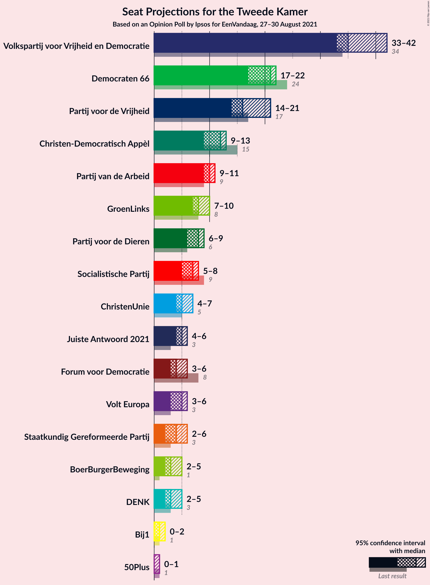

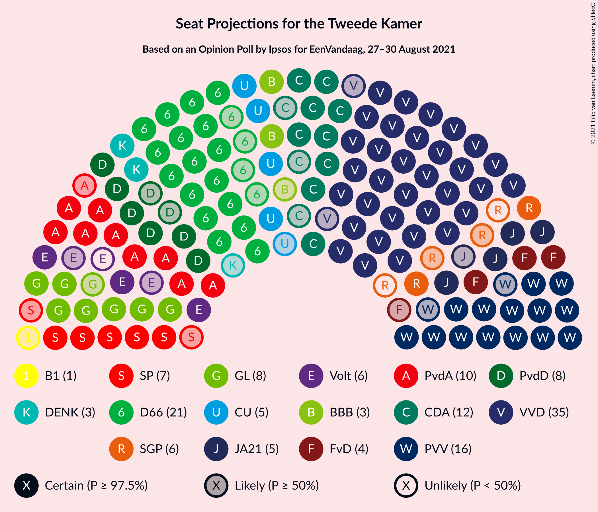

### Confidence Intervals

| Party | Last Result | Median | 80% Confidence Interval | 90% Confidence Interval | 95% Confidence Interval | 99% Confidence Interval |
|:-----:|:-----------:|:------:|:-----------------------:|:-----------------------:|:-----------------------:|:-----------------------:|
| <a href="#volkspartij-voor-vrijheid-en-democratie">Volkspartij voor Vrijheid en Democratie</a> | 34 | 35 | 35–40 |35–42 |33–42 |32–43 |
| <a href="#democraten-66">Democraten 66</a> | 24 | 21 | 19–22 |19–22 |17–22 |17–23 |
| <a href="#partij-voor-de-vrijheid">Partij voor de Vrijheid</a> | 17 | 16 | 14–21 |14–21 |14–21 |14–21 |
| <a href="#christen-democratisch-appèl">Christen-Democratisch Appèl</a> | 15 | 12 | 9–13 |9–13 |9–13 |8–13 |
| <a href="#partij-van-de-arbeid">Partij van de Arbeid</a> | 9 | 10 | 9–10 |9–10 |9–11 |7–11 |
| <a href="#groenlinks">GroenLinks</a> | 8 | 8 | 7–9 |7–9 |7–10 |6–11 |
| <a href="#partij-voor-de-dieren">Partij voor de Dieren</a> | 6 | 8 | 6–9 |6–9 |6–9 |6–10 |
| <a href="#socialistische-partij">Socialistische Partij</a> | 9 | 7 | 6–8 |6–8 |5–8 |5–8 |
| <a href="#christenunie">ChristenUnie</a> | 5 | 5 | 4–6 |4–6 |4–7 |3–8 |
| <a href="#juiste-antwoord-2021">Juiste Antwoord 2021</a> | 3 | 5 | 4–6 |4–6 |4–6 |4–7 |
| <a href="#volt-europa">Volt Europa</a> | 3 | 5 | 3–6 |3–6 |3–6 |3–7 |
| <a href="#forum-voor-democratie">Forum voor Democratie</a> | 8 | 4 | 3–6 |3–6 |3–6 |3–6 |
| <a href="#staatkundig-gereformeerde-partij">Staatkundig Gereformeerde Partij</a> | 3 | 4 | 2–6 |2–6 |2–6 |2–6 |
| <a href="#denk">DENK</a> | 3 | 3 | 3–4 |2–5 |2–5 |2–5 |
| <a href="#boerburgerbeweging">BoerBurgerBeweging</a> | 1 | 3 | 2–3 |2–5 |2–5 |2–6 |
| <a href="#bij1">Bij1</a> | 1 | 1 | 0–1 |0–2 |0–2 |0–2 |
| <a href="#50plus">50Plus</a> | 1 | 0 | 0 |0–1 |0–1 |0–1 |

### Volkspartij voor Vrijheid en Democratie

*For a full overview of the results for this party, see the [Volkspartij voor Vrijheid en Democratie](party-volkspartijvoorvrijheidendemocratie.html) page.*

| Number of Seats | Probability | Accumulated | Special Marks |
|:---------------:|:-----------:|:-----------:|:-------------:|
| 32 | 2% | 100% |  |
| 33 | 0.3% | 98% |  |
| 34 | 2% | 97% | Last Result |
| 35 | 48% | 95% | Median |
| 36 | 0.2% | 47% |  |
| 37 | 3% | 47% |  |
| 38 | 0.4% | 43% |  |
| 39 | 31% | 43% |  |
| 40 | 2% | 12% |  |
| 41 | 0.7% | 10% |  |
| 42 | 8% | 9% |  |
| 43 | 0.9% | 0.9% |  |
| 44 | 0% | 0% |  |

### Democraten 66

*For a full overview of the results for this party, see the [Democraten 66](party-democraten66.html) page.*

| Number of Seats | Probability | Accumulated | Special Marks |
|:---------------:|:-----------:|:-----------:|:-------------:|
| 17 | 4% | 100% |  |
| 18 | 0.6% | 96% |  |
| 19 | 24% | 96% |  |
| 20 | 14% | 72% |  |
| 21 | 38% | 58% | Median |
| 22 | 18% | 20% |  |
| 23 | 2% | 2% |  |
| 24 | 0% | 0.1% | Last Result |
| 25 | 0% | 0.1% |  |
| 26 | 0% | 0% |  |

### Partij voor de Vrijheid

*For a full overview of the results for this party, see the [Partij voor de Vrijheid](party-partijvoordevrijheid.html) page.*

| Number of Seats | Probability | Accumulated | Special Marks |
|:---------------:|:-----------:|:-----------:|:-------------:|
| 12 | 0.1% | 100% |  |
| 13 | 0.1% | 99.9% |  |
| 14 | 16% | 99.7% |  |
| 15 | 1.3% | 84% |  |
| 16 | 44% | 83% | Median |
| 17 | 2% | 39% | Last Result |
| 18 | 15% | 37% |  |
| 19 | 0.2% | 22% |  |
| 20 | 0.6% | 22% |  |
| 21 | 21% | 21% |  |
| 22 | 0% | 0% |  |

### Christen-Democratisch Appèl

*For a full overview of the results for this party, see the [Christen-Democratisch Appèl](party-christen-democratischappèl.html) page.*

| Number of Seats | Probability | Accumulated | Special Marks |
|:---------------:|:-----------:|:-----------:|:-------------:|
| 7 | 0.1% | 100% |  |
| 8 | 2% | 99.9% |  |
| 9 | 23% | 98% |  |
| 10 | 4% | 76% |  |
| 11 | 13% | 72% |  |
| 12 | 47% | 59% | Median |
| 13 | 12% | 12% |  |
| 14 | 0.1% | 0.2% |  |
| 15 | 0.2% | 0.2% | Last Result |
| 16 | 0% | 0% |  |

### Partij van de Arbeid

*For a full overview of the results for this party, see the [Partij van de Arbeid](party-partijvandearbeid.html) page.*

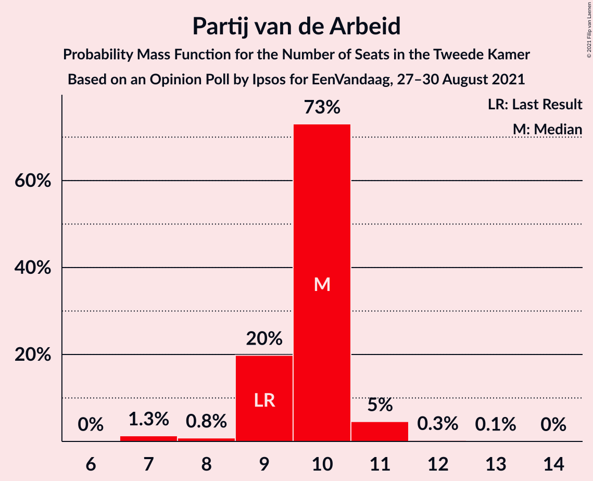

| Number of Seats | Probability | Accumulated | Special Marks |
|:---------------:|:-----------:|:-----------:|:-------------:|
| 7 | 1.3% | 100% |  |
| 8 | 0.8% | 98.6% |  |
| 9 | 20% | 98% | Last Result |
| 10 | 73% | 78% | Median |
| 11 | 5% | 5% |  |
| 12 | 0.3% | 0.4% |  |
| 13 | 0.1% | 0.1% |  |
| 14 | 0% | 0% |  |

### GroenLinks

*For a full overview of the results for this party, see the [GroenLinks](party-groenlinks.html) page.*

| Number of Seats | Probability | Accumulated | Special Marks |
|:---------------:|:-----------:|:-----------:|:-------------:|
| 5 | 0.1% | 100% |  |
| 6 | 2% | 99.9% |  |
| 7 | 22% | 98% |  |
| 8 | 60% | 76% | Last Result, Median |
| 9 | 13% | 16% |  |
| 10 | 0.8% | 3% |  |
| 11 | 2% | 2% |  |
| 12 | 0% | 0% |  |

### Partij voor de Dieren

*For a full overview of the results for this party, see the [Partij voor de Dieren](party-partijvoordedieren.html) page.*

| Number of Seats | Probability | Accumulated | Special Marks |
|:---------------:|:-----------:|:-----------:|:-------------:|
| 5 | 0.1% | 100% |  |
| 6 | 13% | 99.9% | Last Result |
| 7 | 8% | 87% |  |
| 8 | 68% | 80% | Median |
| 9 | 10% | 11% |  |
| 10 | 1.3% | 1.4% |  |
| 11 | 0.1% | 0.1% |  |
| 12 | 0% | 0% |  |

### Socialistische Partij

*For a full overview of the results for this party, see the [Socialistische Partij](party-socialistischepartij.html) page.*

| Number of Seats | Probability | Accumulated | Special Marks |
|:---------------:|:-----------:|:-----------:|:-------------:|
| 4 | 0.5% | 100% |  |
| 5 | 2% | 99.5% |  |
| 6 | 39% | 97% |  |
| 7 | 39% | 58% | Median |
| 8 | 19% | 19% |  |
| 9 | 0% | 0.2% | Last Result |
| 10 | 0.1% | 0.1% |  |
| 11 | 0% | 0% |  |

### ChristenUnie

*For a full overview of the results for this party, see the [ChristenUnie](party-christenunie.html) page.*

| Number of Seats | Probability | Accumulated | Special Marks |
|:---------------:|:-----------:|:-----------:|:-------------:|
| 3 | 2% | 100% |  |
| 4 | 26% | 98% |  |
| 5 | 55% | 72% | Last Result, Median |
| 6 | 14% | 17% |  |
| 7 | 0.6% | 3% |  |
| 8 | 2% | 2% |  |
| 9 | 0.2% | 0.2% |  |
| 10 | 0% | 0% |  |

### Juiste Antwoord 2021

*For a full overview of the results for this party, see the [Juiste Antwoord 2021](party-juisteantwoord2021.html) page.*

| Number of Seats | Probability | Accumulated | Special Marks |
|:---------------:|:-----------:|:-----------:|:-------------:|
| 3 | 0.3% | 100% | Last Result |
| 4 | 40% | 99.7% |  |
| 5 | 36% | 60% | Median |
| 6 | 23% | 24% |  |
| 7 | 2% | 2% |  |
| 8 | 0.2% | 0.2% |  |
| 9 | 0% | 0% |  |

### Volt Europa

*For a full overview of the results for this party, see the [Volt Europa](party-volteuropa.html) page.*

| Number of Seats | Probability | Accumulated | Special Marks |
|:---------------:|:-----------:|:-----------:|:-------------:|
| 3 | 11% | 100% | Last Result |
| 4 | 4% | 89% |  |
| 5 | 41% | 85% | Median |
| 6 | 43% | 44% |  |
| 7 | 0.9% | 1.0% |  |
| 8 | 0% | 0% |  |

### Forum voor Democratie

*For a full overview of the results for this party, see the [Forum voor Democratie](party-forumvoordemocratie.html) page.*

| Number of Seats | Probability | Accumulated | Special Marks |
|:---------------:|:-----------:|:-----------:|:-------------:|
| 2 | 0.1% | 100% |  |
| 3 | 11% | 99.9% |  |
| 4 | 55% | 89% | Median |
| 5 | 23% | 34% |  |
| 6 | 11% | 11% |  |
| 7 | 0.3% | 0.4% |  |
| 8 | 0% | 0% | Last Result |

### Staatkundig Gereformeerde Partij

*For a full overview of the results for this party, see the [Staatkundig Gereformeerde Partij](party-staatkundiggereformeerdepartij.html) page.*

| Number of Seats | Probability | Accumulated | Special Marks |
|:---------------:|:-----------:|:-----------:|:-------------:|
| 1 | 0.1% | 100% |  |
| 2 | 13% | 99.9% |  |
| 3 | 29% | 86% | Last Result |
| 4 | 16% | 57% | Median |
| 5 | 1.4% | 41% |  |
| 6 | 40% | 40% |  |
| 7 | 0% | 0% |  |

### DENK

*For a full overview of the results for this party, see the [DENK](party-denk.html) page.*

| Number of Seats | Probability | Accumulated | Special Marks |
|:---------------:|:-----------:|:-----------:|:-------------:|
| 2 | 7% | 100% |  |
| 3 | 82% | 93% | Last Result, Median |
| 4 | 5% | 11% |  |
| 5 | 6% | 6% |  |
| 6 | 0.1% | 0.1% |  |
| 7 | 0% | 0% |  |

### BoerBurgerBeweging

*For a full overview of the results for this party, see the [BoerBurgerBeweging](party-boerburgerbeweging.html) page.*

| Number of Seats | Probability | Accumulated | Special Marks |
|:---------------:|:-----------:|:-----------:|:-------------:|
| 1 | 0.2% | 100% | Last Result |
| 2 | 40% | 99.8% |  |
| 3 | 53% | 60% | Median |
| 4 | 3% | 8% |  |
| 5 | 4% | 5% |  |
| 6 | 1.0% | 1.0% |  |
| 7 | 0% | 0% |  |

### Bij1

*For a full overview of the results for this party, see the [Bij1](party-bij1.html) page.*

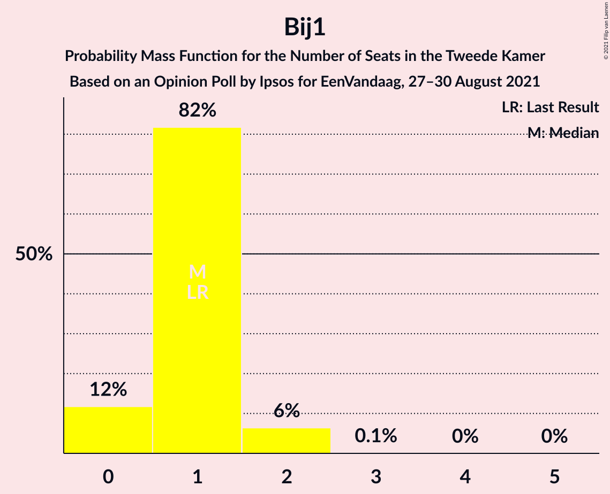

| Number of Seats | Probability | Accumulated | Special Marks |
|:---------------:|:-----------:|:-----------:|:-------------:|
| 0 | 12% | 100% |  |
| 1 | 82% | 88% | Last Result, Median |
| 2 | 6% | 7% |  |
| 3 | 0.1% | 0.1% |  |
| 4 | 0% | 0% |  |

### 50Plus

*For a full overview of the results for this party, see the [50Plus](party-50plus.html) page.*

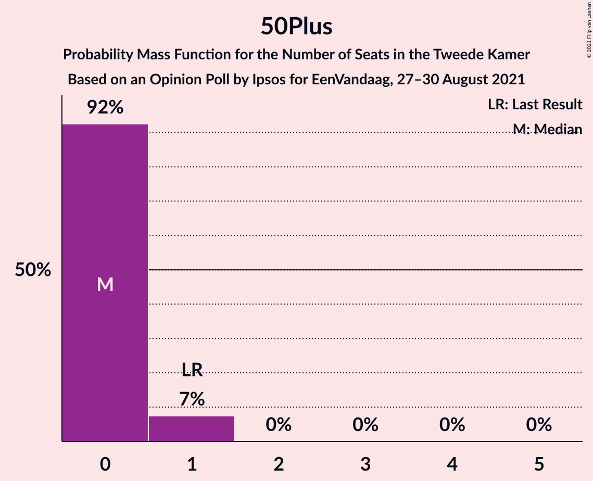

| Number of Seats | Probability | Accumulated | Special Marks |
|:---------------:|:-----------:|:-----------:|:-------------:|
| 0 | 92% | 100% | Median |
| 1 | 7% | 8% | Last Result |
| 2 | 0% | 0% |  |

## Coalitions

### Confidence Intervals

| Coalition | Last Result | Median | Majority? | 80% Confidence Interval | 90% Confidence Interval | 95% Confidence Interval | 99% Confidence Interval |
|:---------:|:-----------:|:------:|:---------:|:-----------------------:|:-----------------------:|:-----------------------:|:-----------------------:|
| Volkspartij voor Vrijheid en Democratie – Democraten 66 – Christen-Democratisch Appèl – Partij van de Arbeid – ChristenUnie | 87 | 83 | 100% | 81–86 | 81–90 | 78–90 | 78–90 |
| Volkspartij voor Vrijheid en Democratie – Democraten 66 – Christen-Democratisch Appèl – GroenLinks – ChristenUnie | 86 | 81 | 98% | 79–84 | 79–88 | 78–88 | 75–88 |
| Volkspartij voor Vrijheid en Democratie – Democraten 66 – Christen-Democratisch Appèl – ChristenUnie | 78 | 73 | 18% | 71–77 | 71–81 | 69–81 | 68–81 |
| Volkspartij voor Vrijheid en Democratie – Partij voor de Vrijheid – Christen-Democratisch Appèl – Forum voor Democratie – Staatkundig Gereformeerde Partij | 77 | 73 | 24% | 72–77 | 70–77 | 70–77 | 68–79 |
| Volkspartij voor Vrijheid en Democratie – Democraten 66 – Christen-Democratisch Appèl | 73 | 68 | 6% | 67–72 | 66–76 | 63–76 | 62–76 |
| Volkspartij voor Vrijheid en Democratie – Partij voor de Vrijheid – Christen-Democratisch Appèl – Forum voor Democratie | 74 | 70 | 0.3% | 67–74 | 66–74 | 64–74 | 64–75 |
| Volkspartij voor Vrijheid en Democratie – Democraten 66 – Partij van de Arbeid | 67 | 66 | 0% | 65–70 | 65–73 | 62–73 | 62–73 |
| Volkspartij voor Vrijheid en Democratie – Partij voor de Vrijheid – Christen-Democratisch Appèl | 66 | 64 | 0% | 63–69 | 62–69 | 60–69 | 60–69 |
| Democraten 66 – Christen-Democratisch Appèl – Partij van de Arbeid – GroenLinks – Socialistische Partij – ChristenUnie | 70 | 63 | 0% | 56–66 | 56–66 | 56–66 | 56–68 |
| Volkspartij voor Vrijheid en Democratie – Christen-Democratisch Appèl – Partij van de Arbeid | 58 | 58 | 0% | 57–61 | 55–63 | 52–64 | 52–64 |
| Volkspartij voor Vrijheid en Democratie – Christen-Democratisch Appèl – Forum voor Democratie – Staatkundig Gereformeerde Partij – 50Plus | 61 | 57 | 0% | 54–60 | 54–61 | 52–61 | 52–62 |
| Volkspartij voor Vrijheid en Democratie – Christen-Democratisch Appèl – Forum voor Democratie – Staatkundig Gereformeerde Partij | 60 | 57 | 0% | 54–60 | 54–60 | 52–60 | 52–62 |
| Democraten 66 – Christen-Democratisch Appèl – Partij van de Arbeid – GroenLinks – ChristenUnie | 61 | 56 | 0% | 50–58 | 50–58 | 50–58 | 50–60 |
| Volkspartij voor Vrijheid en Democratie – Christen-Democratisch Appèl – Forum voor Democratie – 50Plus | 58 | 52 | 0% | 51–56 | 50–58 | 47–58 | 46–58 |
| Volkspartij voor Vrijheid en Democratie – Christen-Democratisch Appèl – Forum voor Democratie | 57 | 52 | 0% | 51–56 | 50–57 | 47–57 | 46–58 |
| Volkspartij voor Vrijheid en Democratie – Christen-Democratisch Appèl | 49 | 48 | 0% | 47–52 | 46–54 | 44–54 | 42–54 |
| Volkspartij voor Vrijheid en Democratie – Partij van de Arbeid | 43 | 45 | 0% | 45–50 | 44–51 | 42–53 | 42–53 |
| Democraten 66 – Christen-Democratisch Appèl – Partij van de Arbeid | 48 | 43 | 0% | 38–43 | 38–43 | 38–43 | 36–46 |
| Democraten 66 – Christen-Democratisch Appèl | 39 | 33 | 0% | 28–33 | 28–34 | 28–34 | 27–35 |
| Christen-Democratisch Appèl – Partij van de Arbeid – ChristenUnie | 29 | 27 | 0% | 23–29 | 23–29 | 23–29 | 20–29 |
| Christen-Democratisch Appèl – Partij van de Arbeid | 24 | 22 | 0% | 19–23 | 19–23 | 19–23 | 15–24 |

### Volkspartij voor Vrijheid en Democratie – Democraten 66 – Christen-Democratisch Appèl – Partij van de Arbeid – ChristenUnie

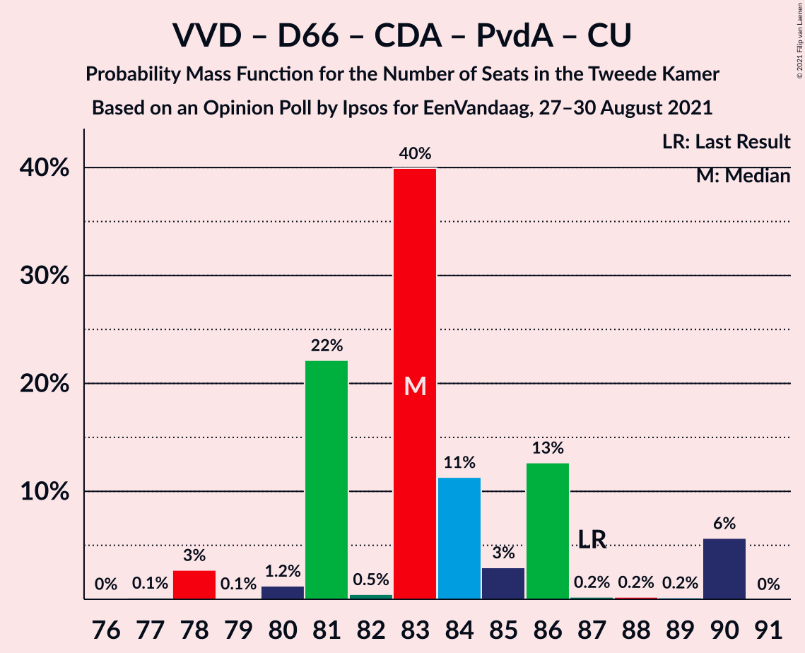

| Number of Seats | Probability | Accumulated | Special Marks |
|:---------------:|:-----------:|:-----------:|:-------------:|
| 77 | 0.1% | 100% |  |
| 78 | 3% | 99.8% |  |
| 79 | 0.1% | 97% |  |
| 80 | 1.2% | 97% |  |
| 81 | 22% | 96% |  |
| 82 | 0.5% | 74% |  |
| 83 | 40% | 73% | Median |
| 84 | 11% | 33% |  |
| 85 | 3% | 22% |  |
| 86 | 13% | 19% |  |
| 87 | 0.2% | 6% | Last Result |
| 88 | 0.2% | 6% |  |
| 89 | 0.2% | 6% |  |
| 90 | 6% | 6% |  |
| 91 | 0% | 0% |  |

### Volkspartij voor Vrijheid en Democratie – Democraten 66 – Christen-Democratisch Appèl – GroenLinks – ChristenUnie

| Number of Seats | Probability | Accumulated | Special Marks |
|:---------------:|:-----------:|:-----------:|:-------------:|
| 75 | 2% | 100% |  |
| 76 | 0% | 98% | Majority |
| 77 | 0% | 98% |  |
| 78 | 0.2% | 98% |  |
| 79 | 23% | 97% |  |
| 80 | 0.7% | 74% |  |
| 81 | 41% | 74% | Median |
| 82 | 2% | 32% |  |
| 83 | 11% | 30% |  |
| 84 | 10% | 20% |  |
| 85 | 2% | 9% |  |
| 86 | 1.1% | 7% | Last Result |
| 87 | 0.1% | 6% |  |
| 88 | 6% | 6% |  |
| 89 | 0.1% | 0.3% |  |
| 90 | 0% | 0.1% |  |
| 91 | 0.1% | 0.1% |  |
| 92 | 0% | 0% |  |

### Volkspartij voor Vrijheid en Democratie – Democraten 66 – Christen-Democratisch Appèl – ChristenUnie

| Number of Seats | Probability | Accumulated | Special Marks |
|:---------------:|:-----------:|:-----------:|:-------------:|
| 68 | 2% | 100% |  |
| 69 | 0.6% | 98% |  |
| 70 | 1.2% | 97% |  |
| 71 | 22% | 96% |  |
| 72 | 0.9% | 74% |  |
| 73 | 38% | 73% | Median |
| 74 | 15% | 35% |  |
| 75 | 3% | 21% |  |
| 76 | 0.4% | 18% | Majority |
| 77 | 10% | 17% |  |
| 78 | 0.2% | 7% | Last Result |
| 79 | 1.2% | 7% |  |
| 80 | 0.2% | 6% |  |
| 81 | 6% | 6% |  |
| 82 | 0% | 0% |  |

### Volkspartij voor Vrijheid en Democratie – Partij voor de Vrijheid – Christen-Democratisch Appèl – Forum voor Democratie – Staatkundig Gereformeerde Partij

| Number of Seats | Probability | Accumulated | Special Marks |
|:---------------:|:-----------:|:-----------:|:-------------:|
| 66 | 0% | 100% |  |
| 67 | 0.2% | 99.9% |  |
| 68 | 1.0% | 99.7% |  |
| 69 | 0.4% | 98.7% |  |
| 70 | 4% | 98% |  |
| 71 | 2% | 94% | Median |
| 72 | 11% | 92% |  |
| 73 | 38% | 81% |  |
| 74 | 18% | 44% |  |
| 75 | 2% | 26% |  |
| 76 | 2% | 24% | Majority |
| 77 | 21% | 23% | Last Result |
| 78 | 0% | 1.3% |  |
| 79 | 1.3% | 1.3% |  |
| 80 | 0% | 0% |  |

### Volkspartij voor Vrijheid en Democratie – Democraten 66 – Christen-Democratisch Appèl

| Number of Seats | Probability | Accumulated | Special Marks |
|:---------------:|:-----------:|:-----------:|:-------------:|
| 62 | 2% | 100% |  |
| 63 | 0.3% | 98% |  |
| 64 | 0.6% | 97% |  |
| 65 | 1.1% | 97% |  |
| 66 | 2% | 96% |  |
| 67 | 22% | 94% |  |
| 68 | 49% | 71% | Median |
| 69 | 0.2% | 23% |  |
| 70 | 3% | 23% |  |
| 71 | 1.4% | 20% |  |
| 72 | 11% | 18% |  |
| 73 | 0.6% | 8% | Last Result |
| 74 | 1.2% | 7% |  |
| 75 | 0.1% | 6% |  |
| 76 | 6% | 6% | Majority |
| 77 | 0% | 0% |  |

### Volkspartij voor Vrijheid en Democratie – Partij voor de Vrijheid – Christen-Democratisch Appèl – Forum voor Democratie

| Number of Seats | Probability | Accumulated | Special Marks |
|:---------------:|:-----------:|:-----------:|:-------------:|
| 62 | 0% | 100% |  |
| 63 | 0% | 99.9% |  |
| 64 | 4% | 99.9% |  |
| 65 | 0.1% | 96% |  |
| 66 | 2% | 96% |  |
| 67 | 39% | 94% | Median |
| 68 | 0.3% | 55% |  |
| 69 | 0.5% | 55% |  |
| 70 | 21% | 55% |  |
| 71 | 6% | 34% |  |
| 72 | 5% | 28% |  |
| 73 | 0.1% | 23% |  |
| 74 | 21% | 23% | Last Result |
| 75 | 1.2% | 2% |  |
| 76 | 0.3% | 0.3% | Majority |
| 77 | 0% | 0% |  |

### Volkspartij voor Vrijheid en Democratie – Democraten 66 – Partij van de Arbeid

| Number of Seats | Probability | Accumulated | Special Marks |
|:---------------:|:-----------:|:-----------:|:-------------:|
| 62 | 2% | 100% |  |
| 63 | 2% | 97% |  |
| 64 | 0.2% | 96% |  |
| 65 | 11% | 95% |  |
| 66 | 39% | 85% | Median |
| 67 | 1.1% | 45% | Last Result |
| 68 | 23% | 44% |  |
| 69 | 0.9% | 22% |  |
| 70 | 14% | 21% |  |
| 71 | 0.1% | 7% |  |
| 72 | 0% | 7% |  |
| 73 | 6% | 7% |  |
| 74 | 0% | 0.1% |  |
| 75 | 0.1% | 0.1% |  |
| 76 | 0% | 0% | Majority |

### Volkspartij voor Vrijheid en Democratie – Partij voor de Vrijheid – Christen-Democratisch Appèl

| Number of Seats | Probability | Accumulated | Special Marks |
|:---------------:|:-----------:|:-----------:|:-------------:|
| 59 | 0.1% | 100% |  |
| 60 | 2% | 99.8% |  |
| 61 | 1.4% | 97% |  |
| 62 | 2% | 96% |  |
| 63 | 38% | 94% | Median |
| 64 | 11% | 56% |  |
| 65 | 1.0% | 45% |  |
| 66 | 11% | 44% | Last Result |
| 67 | 1.3% | 34% |  |
| 68 | 7% | 32% |  |
| 69 | 25% | 25% |  |
| 70 | 0% | 0.3% |  |
| 71 | 0.2% | 0.2% |  |
| 72 | 0% | 0% |  |

### Democraten 66 – Christen-Democratisch Appèl – Partij van de Arbeid – GroenLinks – Socialistische Partij – ChristenUnie

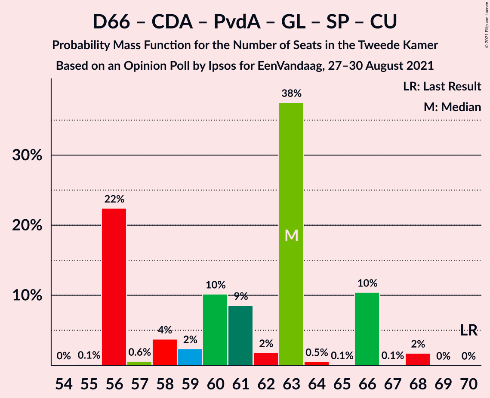

| Number of Seats | Probability | Accumulated | Special Marks |
|:---------------:|:-----------:|:-----------:|:-------------:|
| 55 | 0.1% | 100% |  |
| 56 | 22% | 99.8% |  |
| 57 | 0.6% | 77% |  |
| 58 | 4% | 77% |  |
| 59 | 2% | 73% |  |
| 60 | 10% | 71% |  |
| 61 | 9% | 61% |  |
| 62 | 2% | 52% |  |
| 63 | 38% | 50% | Median |
| 64 | 0.5% | 13% |  |
| 65 | 0.1% | 12% |  |
| 66 | 10% | 12% |  |
| 67 | 0.1% | 2% |  |
| 68 | 2% | 2% |  |
| 69 | 0% | 0% |  |
| 70 | 0% | 0% | Last Result |

### Volkspartij voor Vrijheid en Democratie – Christen-Democratisch Appèl – Partij van de Arbeid

| Number of Seats | Probability | Accumulated | Special Marks |
|:---------------:|:-----------:|:-----------:|:-------------:|
| 51 | 0.1% | 100% |  |
| 52 | 2% | 99.8% |  |
| 53 | 0.1% | 97% |  |
| 54 | 0.8% | 97% |  |
| 55 | 3% | 97% |  |
| 56 | 1.1% | 94% |  |
| 57 | 38% | 93% | Median |
| 58 | 33% | 55% | Last Result |
| 59 | 10% | 22% |  |
| 60 | 1.4% | 13% |  |
| 61 | 2% | 11% |  |
| 62 | 0.2% | 9% |  |
| 63 | 6% | 8% |  |
| 64 | 3% | 3% |  |
| 65 | 0% | 0% |  |

### Volkspartij voor Vrijheid en Democratie – Christen-Democratisch Appèl – Forum voor Democratie – Staatkundig Gereformeerde Partij – 50Plus

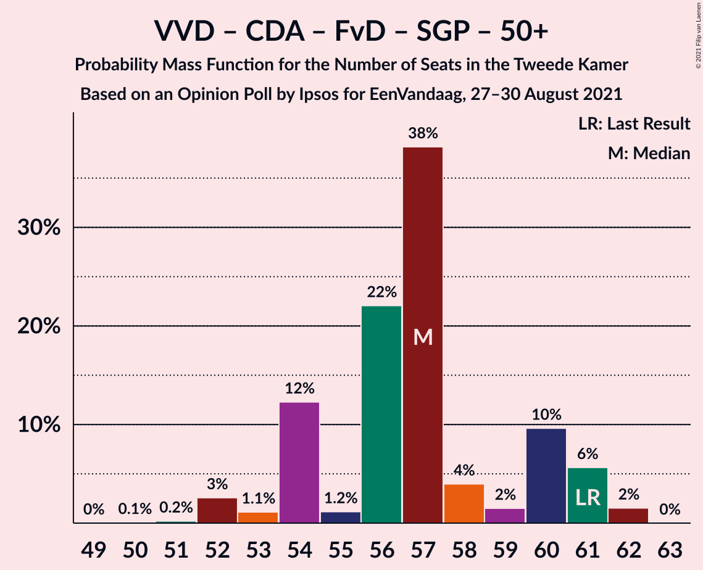

| Number of Seats | Probability | Accumulated | Special Marks |
|:---------------:|:-----------:|:-----------:|:-------------:|
| 49 | 0% | 100% |  |
| 50 | 0.1% | 99.9% |  |
| 51 | 0.2% | 99.9% |  |
| 52 | 3% | 99.7% |  |
| 53 | 1.1% | 97% |  |
| 54 | 12% | 96% |  |
| 55 | 1.2% | 84% | Median |
| 56 | 22% | 83% |  |
| 57 | 38% | 60% |  |
| 58 | 4% | 22% |  |
| 59 | 2% | 18% |  |
| 60 | 10% | 17% |  |
| 61 | 6% | 7% | Last Result |
| 62 | 2% | 2% |  |
| 63 | 0% | 0% |  |

### Volkspartij voor Vrijheid en Democratie – Christen-Democratisch Appèl – Forum voor Democratie – Staatkundig Gereformeerde Partij

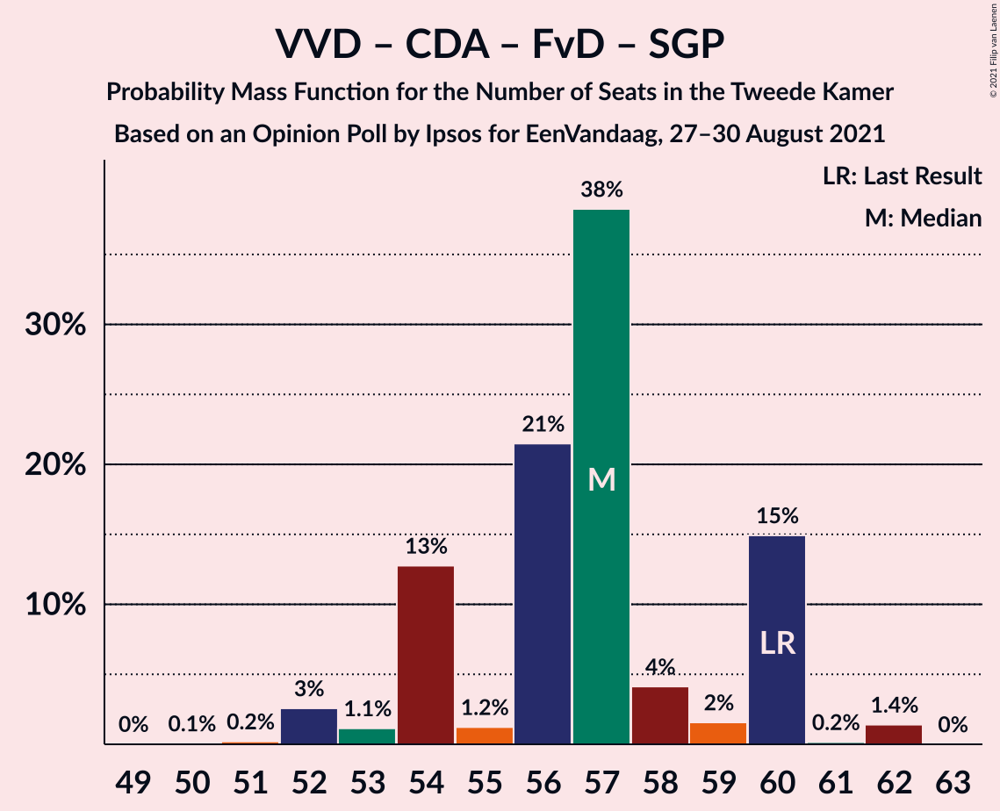

| Number of Seats | Probability | Accumulated | Special Marks |
|:---------------:|:-----------:|:-----------:|:-------------:|
| 49 | 0% | 100% |  |
| 50 | 0.1% | 99.9% |  |
| 51 | 0.2% | 99.9% |  |
| 52 | 3% | 99.7% |  |
| 53 | 1.1% | 97% |  |
| 54 | 13% | 96% |  |
| 55 | 1.2% | 83% | Median |
| 56 | 21% | 82% |  |
| 57 | 38% | 60% |  |
| 58 | 4% | 22% |  |
| 59 | 2% | 18% |  |
| 60 | 15% | 17% | Last Result |
| 61 | 0.2% | 2% |  |
| 62 | 1.4% | 1.4% |  |
| 63 | 0% | 0% |  |

### Democraten 66 – Christen-Democratisch Appèl – Partij van de Arbeid – GroenLinks – ChristenUnie

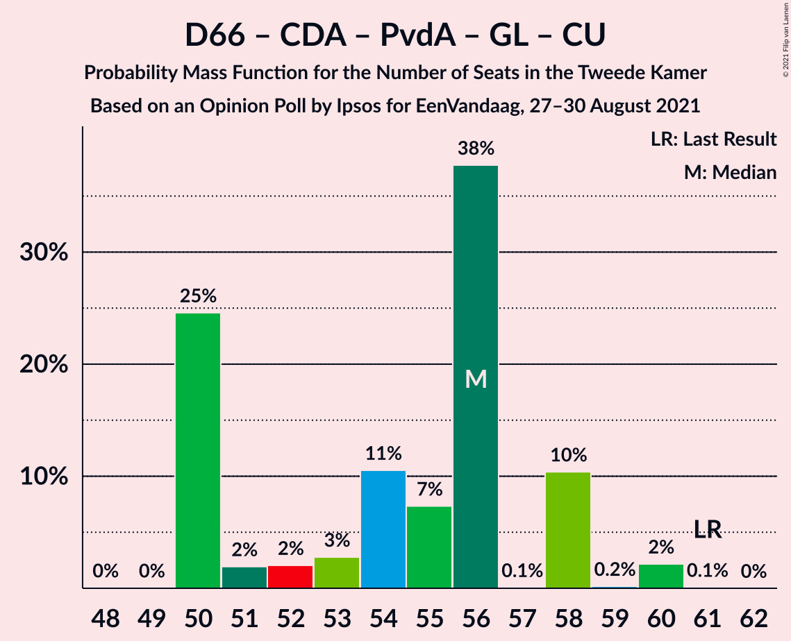

| Number of Seats | Probability | Accumulated | Special Marks |
|:---------------:|:-----------:|:-----------:|:-------------:|
| 48 | 0% | 100% |  |
| 49 | 0% | 99.9% |  |
| 50 | 25% | 99.9% |  |
| 51 | 2% | 75% |  |
| 52 | 2% | 73% |  |
| 53 | 3% | 71% |  |
| 54 | 11% | 69% |  |
| 55 | 7% | 58% |  |
| 56 | 38% | 51% | Median |
| 57 | 0.1% | 13% |  |
| 58 | 10% | 13% |  |
| 59 | 0.2% | 2% |  |
| 60 | 2% | 2% |  |
| 61 | 0.1% | 0.1% | Last Result |
| 62 | 0% | 0% |  |

### Volkspartij voor Vrijheid en Democratie – Christen-Democratisch Appèl – Forum voor Democratie – 50Plus

| Number of Seats | Probability | Accumulated | Special Marks |
|:---------------:|:-----------:|:-----------:|:-------------:|
| 46 | 2% | 100% |  |
| 47 | 0.3% | 98% |  |
| 48 | 0.2% | 97% |  |
| 49 | 1.1% | 97% |  |
| 50 | 3% | 96% |  |
| 51 | 38% | 94% | Median |
| 52 | 11% | 56% |  |
| 53 | 23% | 45% |  |
| 54 | 1.5% | 22% |  |
| 55 | 0.7% | 21% |  |
| 56 | 13% | 20% |  |
| 57 | 0.1% | 7% |  |
| 58 | 7% | 7% | Last Result |
| 59 | 0.4% | 0.4% |  |
| 60 | 0% | 0% |  |

### Volkspartij voor Vrijheid en Democratie – Christen-Democratisch Appèl – Forum voor Democratie

| Number of Seats | Probability | Accumulated | Special Marks |
|:---------------:|:-----------:|:-----------:|:-------------:|
| 46 | 2% | 100% |  |
| 47 | 0.3% | 98% |  |
| 48 | 0.2% | 97% |  |
| 49 | 1.2% | 97% |  |
| 50 | 3% | 96% |  |
| 51 | 37% | 93% | Median |
| 52 | 11% | 56% |  |
| 53 | 22% | 45% |  |
| 54 | 2% | 22% |  |
| 55 | 0.7% | 21% |  |
| 56 | 13% | 20% |  |
| 57 | 6% | 7% | Last Result |
| 58 | 1.0% | 1.4% |  |
| 59 | 0.4% | 0.4% |  |
| 60 | 0% | 0% |  |

### Volkspartij voor Vrijheid en Democratie – Christen-Democratisch Appèl

| Number of Seats | Probability | Accumulated | Special Marks |
|:---------------:|:-----------:|:-----------:|:-------------:|
| 41 | 0.1% | 100% |  |
| 42 | 2% | 99.9% |  |
| 43 | 0.1% | 98% |  |
| 44 | 0.5% | 98% |  |
| 45 | 0.7% | 97% |  |
| 46 | 4% | 96% |  |
| 47 | 38% | 93% | Median |
| 48 | 32% | 55% |  |
| 49 | 0.2% | 23% | Last Result |
| 50 | 12% | 23% |  |
| 51 | 1.3% | 11% |  |
| 52 | 2% | 10% |  |
| 53 | 3% | 8% |  |
| 54 | 6% | 6% |  |
| 55 | 0.1% | 0.1% |  |
| 56 | 0% | 0% |  |

### Volkspartij voor Vrijheid en Democratie – Partij van de Arbeid

| Number of Seats | Probability | Accumulated | Special Marks |
|:---------------:|:-----------:|:-----------:|:-------------:|
| 40 | 0.2% | 100% |  |
| 41 | 0% | 99.8% |  |
| 42 | 2% | 99.8% |  |
| 43 | 2% | 97% | Last Result |
| 44 | 0.5% | 95% |  |
| 45 | 48% | 95% | Median |
| 46 | 1.2% | 47% |  |
| 47 | 2% | 46% |  |
| 48 | 12% | 45% |  |
| 49 | 23% | 33% |  |
| 50 | 2% | 10% |  |
| 51 | 6% | 8% |  |
| 52 | 0.1% | 3% |  |
| 53 | 3% | 3% |  |
| 54 | 0% | 0% |  |

### Democraten 66 – Christen-Democratisch Appèl – Partij van de Arbeid

| Number of Seats | Probability | Accumulated | Special Marks |
|:---------------:|:-----------:|:-----------:|:-------------:|
| 33 | 0.1% | 100% |  |
| 34 | 0% | 99.9% |  |
| 35 | 0% | 99.9% |  |
| 36 | 0.8% | 99.9% |  |
| 37 | 0.9% | 99.1% |  |
| 38 | 23% | 98% |  |
| 39 | 3% | 75% |  |
| 40 | 4% | 72% |  |
| 41 | 2% | 68% |  |
| 42 | 10% | 66% |  |
| 43 | 54% | 56% | Median |
| 44 | 0.5% | 2% |  |
| 45 | 0% | 2% |  |
| 46 | 2% | 2% |  |
| 47 | 0.1% | 0.1% |  |
| 48 | 0% | 0% | Last Result |

### Democraten 66 – Christen-Democratisch Appèl

| Number of Seats | Probability | Accumulated | Special Marks |
|:---------------:|:-----------:|:-----------:|:-------------:|
| 26 | 0% | 100% |  |
| 27 | 2% | 99.9% |  |
| 28 | 25% | 98% |  |
| 29 | 0.1% | 73% |  |
| 30 | 3% | 73% |  |
| 31 | 2% | 71% |  |
| 32 | 2% | 68% |  |
| 33 | 58% | 66% | Median |
| 34 | 7% | 8% |  |
| 35 | 2% | 2% |  |
| 36 | 0.1% | 0.1% |  |
| 37 | 0% | 0% |  |
| 38 | 0% | 0% |  |
| 39 | 0% | 0% | Last Result |

### Christen-Democratisch Appèl – Partij van de Arbeid – ChristenUnie

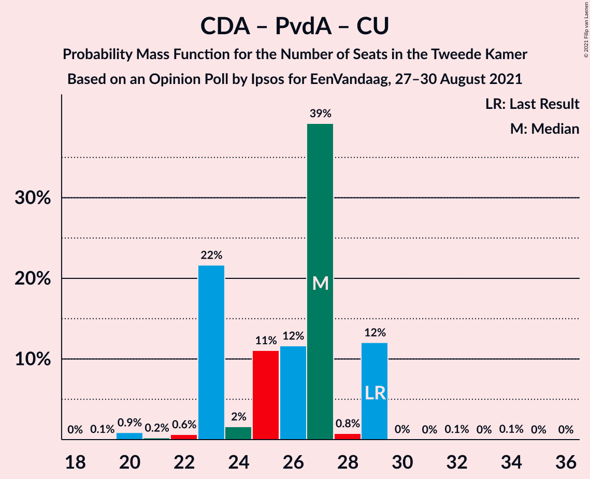

| Number of Seats | Probability | Accumulated | Special Marks |
|:---------------:|:-----------:|:-----------:|:-------------:|
| 19 | 0.1% | 100% |  |
| 20 | 0.9% | 99.9% |  |
| 21 | 0.2% | 99.1% |  |
| 22 | 0.6% | 98.8% |  |
| 23 | 22% | 98% |  |
| 24 | 2% | 77% |  |
| 25 | 11% | 75% |  |
| 26 | 12% | 64% |  |
| 27 | 39% | 52% | Median |
| 28 | 0.8% | 13% |  |
| 29 | 12% | 12% | Last Result |
| 30 | 0% | 0.2% |  |
| 31 | 0% | 0.1% |  |
| 32 | 0.1% | 0.1% |  |
| 33 | 0% | 0.1% |  |
| 34 | 0.1% | 0.1% |  |
| 35 | 0% | 0% |  |

### Christen-Democratisch Appèl – Partij van de Arbeid

| Number of Seats | Probability | Accumulated | Special Marks |
|:---------------:|:-----------:|:-----------:|:-------------:|
| 15 | 0.9% | 100% |  |
| 16 | 0.1% | 99.0% |  |
| 17 | 0.8% | 99.0% |  |
| 18 | 0.7% | 98% |  |
| 19 | 23% | 98% |  |
| 20 | 13% | 75% |  |
| 21 | 10% | 62% |  |
| 22 | 40% | 52% | Median |
| 23 | 11% | 12% |  |
| 24 | 1.4% | 2% | Last Result |
| 25 | 0% | 0.2% |  |
| 26 | 0.1% | 0.1% |  |
| 27 | 0.1% | 0.1% |  |
| 28 | 0% | 0% |  |

## Technical Information

### Opinion Poll

+ **Polling firm:** Ipsos
+ **Commissioner(s):** EenVandaag
+ **Fieldwork period:** 27–30 August 2021

### Calculations

+ **Sample size:** 1008
+ **Simulations done:** 1,048,576
+ **Error estimate:** 3.34%

