# Opinion Poll by Ipsos for EenVandaag, 27–30 August 2021

<a href="#voting-intentions">Voting Intentions</a> | <a href="#seats">Seats</a> | <a href="#coalitions">Coalitions</a> | <a href="#technical-information">Technical Information</a>

## Voting Intentions

### Confidence Intervals

| Party | Last Result | Poll Result | 80% Confidence Interval | 90% Confidence Interval | 95% Confidence Interval | 99% Confidence Interval |
|:-----:|:-----------:|:-----------:|:-----------------------:|:-----------------------:|:-----------------------:|:-----------------------:|
| Volkspartij voor Vrijheid en Democratie | 21.9% | 24.6% | 22.9–26.4% |22.5–26.9% |22.0–27.4% |21.2–28.2% |
| Democraten 66 | 15.0% | 13.5% | 12.2–15.0% |11.8–15.4% |11.5–15.7% |10.9–16.5% |
| Partij voor de Vrijheid | 10.8% | 10.9% | 9.7–12.3% |9.4–12.7% |9.1–13.0% |8.6–13.7% |
| Christen-Democratisch Appèl | 9.5% | 6.5% | 5.6–7.7% |5.4–8.0% |5.2–8.3% |4.8–8.8% |
| Partij van de Arbeid | 5.7% | 6.3% | 5.5–7.5% |5.2–7.8% |5.0–8.0% |4.6–8.6% |
| GroenLinks | 5.2% | 5.8% | 4.9–6.8% |4.7–7.1% |4.5–7.4% |4.1–7.9% |
| Partij voor de Dieren | 3.8% | 5.0% | 4.2–6.0% |4.0–6.2% |3.8–6.5% |3.4–7.0% |
| Socialistische Partij | 6.0% | 4.5% | 3.7–5.4% |3.5–5.7% |3.4–5.9% |3.0–6.4% |
| ChristenUnie | 3.4% | 3.9% | 3.2–4.8% |3.0–5.0% |2.8–5.3% |2.5–5.7% |
| Juiste Antwoord 2021 | 2.4% | 3.5% | 2.8–4.3% |2.7–4.6% |2.5–4.8% |2.2–5.2% |
| Volt Europa | 2.4% | 3.2% | 2.6–4.0% |2.4–4.2% |2.3–4.5% |2.0–4.9% |
| Forum voor Democratie | 5.0% | 2.9% | 2.3–3.7% |2.1–3.9% |2.0–4.1% |1.8–4.5% |
| Staatkundig Gereformeerde Partij | 2.1% | 2.4% | 1.9–3.1% |1.7–3.3% |1.6–3.5% |1.4–3.9% |
| DENK | 2.0% | 2.4% | 1.9–3.1% |1.7–3.3% |1.6–3.5% |1.4–3.9% |
| BoerBurgerBeweging | 1.0% | 2.4% | 1.9–3.1% |1.7–3.3% |1.6–3.5% |1.4–3.9% |
| Bij1 | 0.8% | 0.7% | 0.5–1.2% |0.4–1.3% |0.3–1.4% |0.2–1.7% |
| 50Plus | 1.0% | 0.3% | 0.2–0.7% |0.1–0.8% |0.1–0.9% |0.1–1.1% |

*Note:* The poll result column reflects the actual value used in the calculations. Published results may vary slightly, and in addition be rounded to fewer digits.

## Seats

### Confidence Intervals

| Party | Last Result | Median | 80% Confidence Interval | 90% Confidence Interval | 95% Confidence Interval | 99% Confidence Interval |
|:-----:|:-----------:|:------:|:-----------------------:|:-----------------------:|:-----------------------:|:-----------------------:|
| <a href="#volkspartij-voor-vrijheid-en-democratie">Volkspartij voor Vrijheid en Democratie</a> | 34 | 42 | 42 |42 |37–42 |32–42 |
| <a href="#democraten-66">Democraten 66</a> | 24 | 22 | 22 |22 |21–22 |18–22 |
| <a href="#partij-voor-de-vrijheid">Partij voor de Vrijheid</a> | 17 | 14 | 14 |14 |14 |13–19 |
| <a href="#christen-democratisch-appèl">Christen-Democratisch Appèl</a> | 15 | 12 | 12 |12 |10–12 |9–15 |
| <a href="#partij-van-de-arbeid">Partij van de Arbeid</a> | 9 | 9 | 9 |9 |9–10 |7–13 |
| <a href="#groenlinks">GroenLinks</a> | 8 | 7 | 7 |7 |7–8 |7–9 |
| <a href="#partij-voor-de-dieren">Partij voor de Dieren</a> | 6 | 7 | 7 |7 |7 |5–11 |
| <a href="#socialistische-partij">Socialistische Partij</a> | 9 | 6 | 6 |6 |6 |5–7 |
| <a href="#christenunie">ChristenUnie</a> | 5 | 5 | 5 |5 |5–6 |4–8 |
| <a href="#juiste-antwoord-2021">Juiste Antwoord 2021</a> | 3 | 5 | 5 |5 |5 |3–8 |
| <a href="#volt-europa">Volt Europa</a> | 3 | 5 | 5 |5 |5 |3–5 |
| <a href="#forum-voor-democratie">Forum voor Democratie</a> | 8 | 3 | 3 |3 |3 |3–5 |
| <a href="#staatkundig-gereformeerde-partij">Staatkundig Gereformeerde Partij</a> | 3 | 3 | 3 |3 |3–4 |2–5 |
| <a href="#denk">DENK</a> | 3 | 5 | 5 |5 |4–5 |3–5 |
| <a href="#boerburgerbeweging">BoerBurgerBeweging</a> | 1 | 3 | 3 |3 |3 |3–5 |
| <a href="#bij1">Bij1</a> | 1 | 0 | 0 |0 |0–1 |0–2 |
| <a href="#50plus">50Plus</a> | 1 | 1 | 1 |1 |0–1 |0–2 |

### Volkspartij voor Vrijheid en Democratie

*For a full overview of the results for this party, see the [Volkspartij voor Vrijheid en Democratie](party-volkspartijvoorvrijheidendemocratie.html) page.*

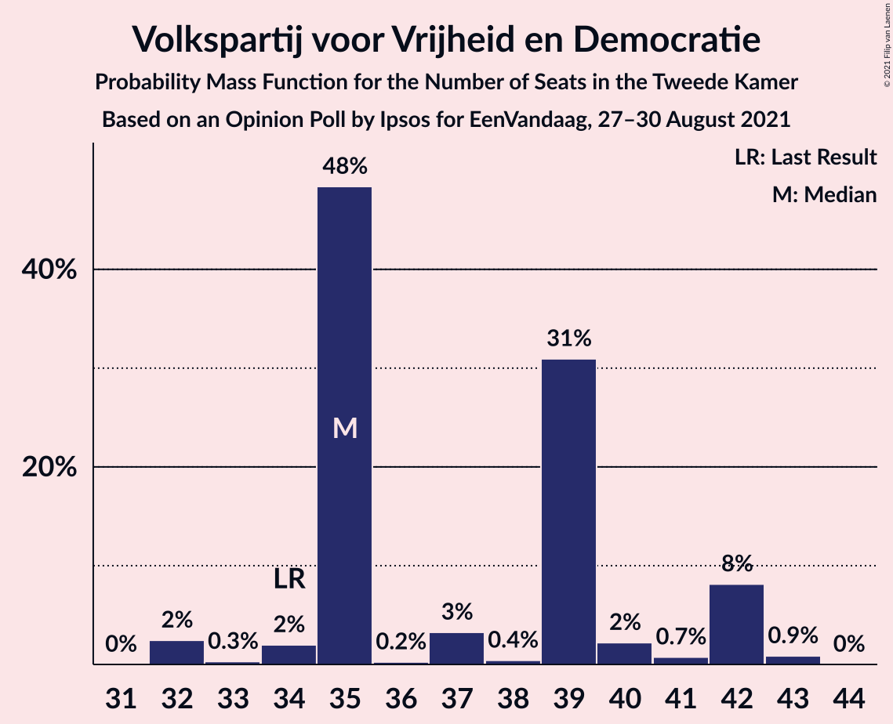

| Number of Seats | Probability | Accumulated | Special Marks |
|:---------------:|:-----------:|:-----------:|:-------------:|
| 32 | 0.9% | 100% |  |
| 33 | 0.3% | 99.1% |  |
| 34 | 0% | 98.8% | Last Result |
| 35 | 0.1% | 98.8% |  |
| 36 | 0% | 98.6% |  |
| 37 | 2% | 98.6% |  |
| 38 | 0.9% | 97% |  |
| 39 | 0.1% | 96% |  |
| 40 | 0.6% | 96% |  |
| 41 | 0% | 95% |  |
| 42 | 95% | 95% | Median |
| 43 | 0% | 0% |  |

### Democraten 66

*For a full overview of the results for this party, see the [Democraten 66](party-democraten66.html) page.*

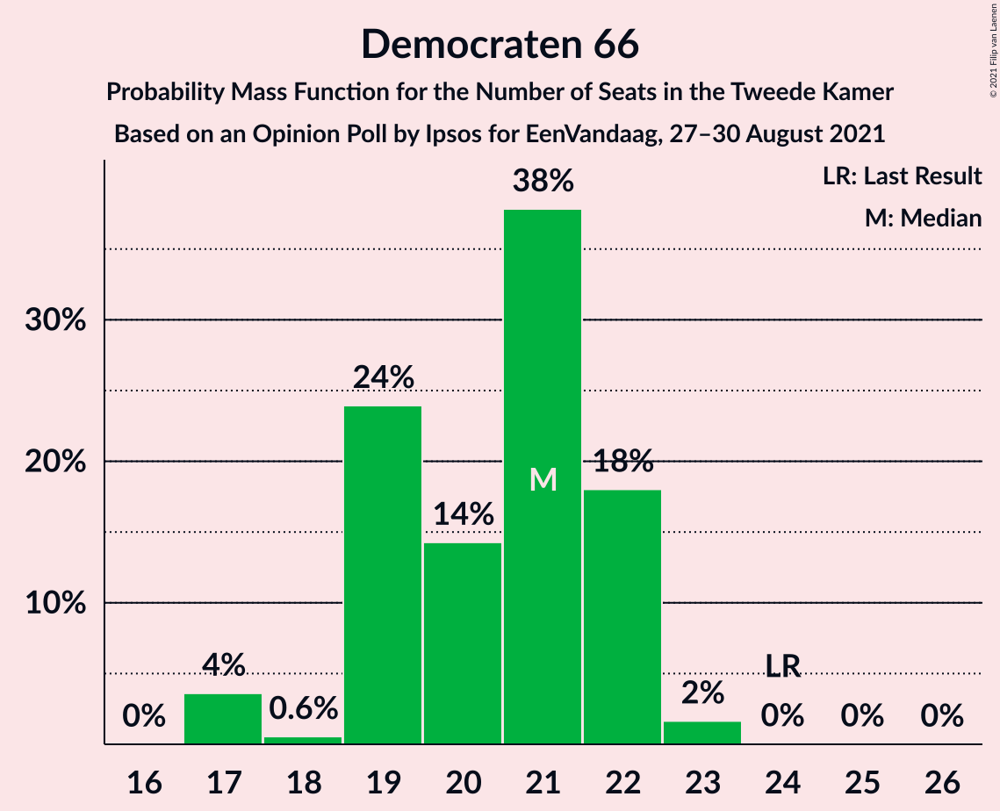

| Number of Seats | Probability | Accumulated | Special Marks |
|:---------------:|:-----------:|:-----------:|:-------------:|
| 18 | 0.7% | 100% |  |
| 19 | 0.1% | 99.2% |  |
| 20 | 0.2% | 99.1% |  |
| 21 | 2% | 98.9% |  |
| 22 | 96% | 96% | Median |
| 23 | 0.1% | 0.4% |  |
| 24 | 0.1% | 0.3% | Last Result |
| 25 | 0% | 0.3% |  |
| 26 | 0.2% | 0.2% |  |
| 27 | 0% | 0% |  |

### Partij voor de Vrijheid

*For a full overview of the results for this party, see the [Partij voor de Vrijheid](party-partijvoordevrijheid.html) page.*

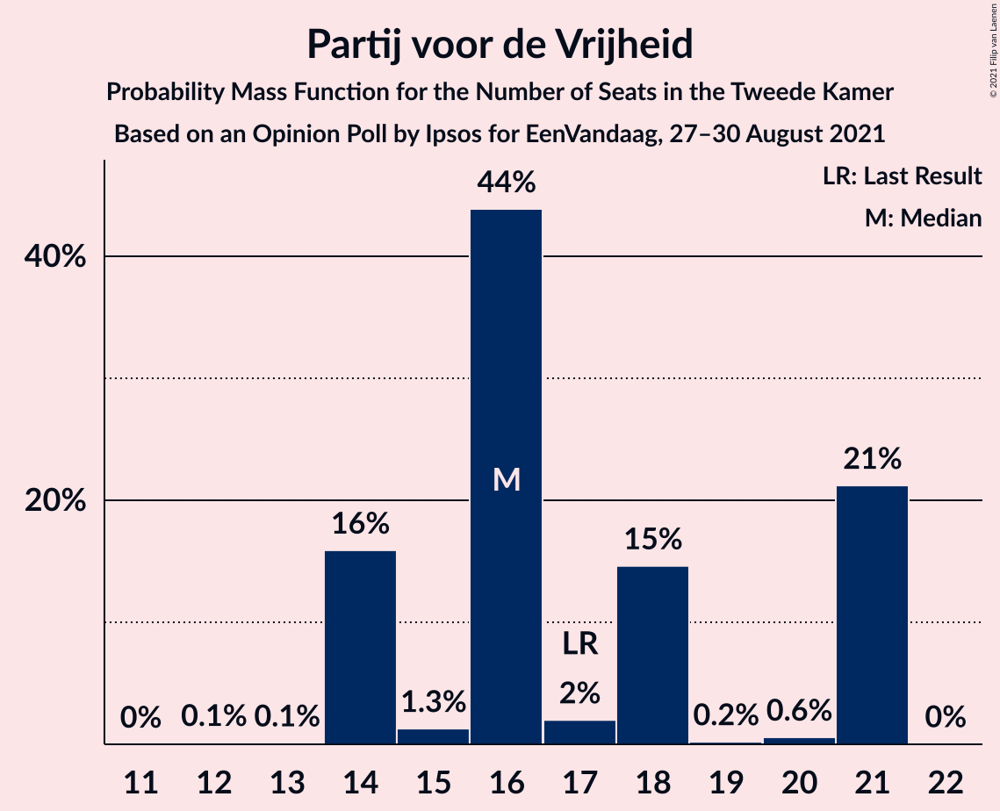

| Number of Seats | Probability | Accumulated | Special Marks |
|:---------------:|:-----------:|:-----------:|:-------------:|
| 13 | 1.0% | 100% |  |
| 14 | 97% | 99.0% | Median |
| 15 | 0% | 2% |  |
| 16 | 0% | 2% |  |
| 17 | 0.2% | 2% | Last Result |
| 18 | 0.9% | 2% |  |
| 19 | 0.8% | 1.0% |  |
| 20 | 0.1% | 0.2% |  |
| 21 | 0.1% | 0.1% |  |
| 22 | 0% | 0% |  |

### Christen-Democratisch Appèl

*For a full overview of the results for this party, see the [Christen-Democratisch Appèl](party-christen-democratischappèl.html) page.*

| Number of Seats | Probability | Accumulated | Special Marks |
|:---------------:|:-----------:|:-----------:|:-------------:|
| 7 | 0.1% | 100% |  |
| 8 | 0.4% | 99.9% |  |
| 9 | 2% | 99.5% |  |
| 10 | 1.4% | 98% |  |
| 11 | 0% | 96% |  |
| 12 | 95% | 96% | Median |
| 13 | 0.2% | 1.1% |  |
| 14 | 0% | 1.0% |  |
| 15 | 1.0% | 1.0% | Last Result |
| 16 | 0% | 0% |  |

### Partij van de Arbeid

*For a full overview of the results for this party, see the [Partij van de Arbeid](party-partijvandearbeid.html) page.*

| Number of Seats | Probability | Accumulated | Special Marks |
|:---------------:|:-----------:|:-----------:|:-------------:|
| 7 | 0.6% | 100% |  |
| 8 | 0% | 99.4% |  |
| 9 | 97% | 99.4% | Last Result, Median |
| 10 | 1.0% | 3% |  |
| 11 | 1.1% | 2% |  |
| 12 | 0.1% | 0.8% |  |
| 13 | 0.6% | 0.6% |  |
| 14 | 0.1% | 0.1% |  |
| 15 | 0% | 0% |  |

### GroenLinks

*For a full overview of the results for this party, see the [GroenLinks](party-groenlinks.html) page.*

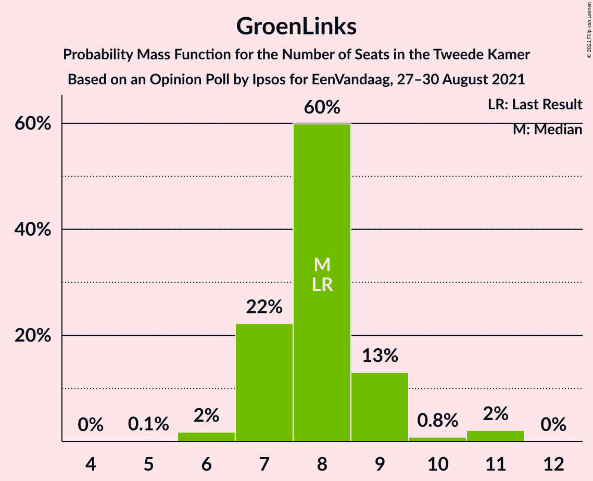

| Number of Seats | Probability | Accumulated | Special Marks |
|:---------------:|:-----------:|:-----------:|:-------------:|
| 5 | 0.1% | 100% |  |
| 6 | 0.1% | 99.9% |  |
| 7 | 97% | 99.8% | Median |
| 8 | 2% | 3% | Last Result |
| 9 | 0.1% | 0.6% |  |
| 10 | 0.3% | 0.5% |  |
| 11 | 0.1% | 0.2% |  |
| 12 | 0% | 0% |  |

### Partij voor de Dieren

*For a full overview of the results for this party, see the [Partij voor de Dieren](party-partijvoordedieren.html) page.*

| Number of Seats | Probability | Accumulated | Special Marks |
|:---------------:|:-----------:|:-----------:|:-------------:|
| 4 | 0.1% | 100% |  |
| 5 | 0.6% | 99.9% |  |
| 6 | 1.0% | 99.3% | Last Result |
| 7 | 97% | 98% | Median |
| 8 | 0.3% | 1.0% |  |
| 9 | 0.1% | 0.6% |  |
| 10 | 0% | 0.6% |  |
| 11 | 0.5% | 0.6% |  |
| 12 | 0% | 0% |  |

### Socialistische Partij

*For a full overview of the results for this party, see the [Socialistische Partij](party-socialistischepartij.html) page.*

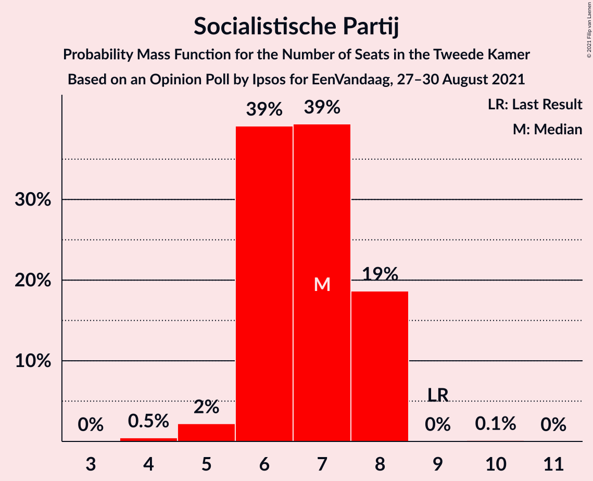

| Number of Seats | Probability | Accumulated | Special Marks |
|:---------------:|:-----------:|:-----------:|:-------------:|
| 4 | 0.1% | 100% |  |
| 5 | 0.6% | 99.9% |  |
| 6 | 98% | 99.3% | Median |
| 7 | 0.7% | 0.9% |  |
| 8 | 0.1% | 0.2% |  |
| 9 | 0% | 0% | Last Result |

### ChristenUnie

*For a full overview of the results for this party, see the [ChristenUnie](party-christenunie.html) page.*

| Number of Seats | Probability | Accumulated | Special Marks |
|:---------------:|:-----------:|:-----------:|:-------------:|
| 4 | 0.7% | 100% |  |
| 5 | 96% | 99.3% | Last Result, Median |
| 6 | 2% | 3% |  |
| 7 | 0.4% | 1.4% |  |
| 8 | 0.9% | 1.0% |  |
| 9 | 0% | 0% |  |

### Juiste Antwoord 2021

*For a full overview of the results for this party, see the [Juiste Antwoord 2021](party-juisteantwoord2021.html) page.*

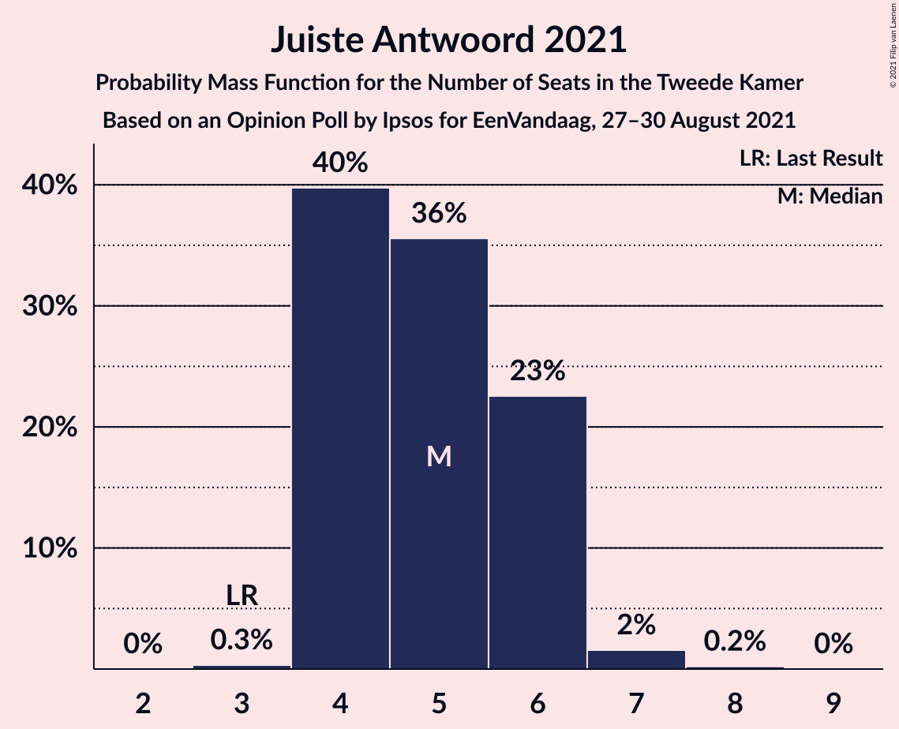

| Number of Seats | Probability | Accumulated | Special Marks |
|:---------------:|:-----------:|:-----------:|:-------------:|
| 3 | 0.6% | 100% | Last Result |
| 4 | 0% | 99.4% |  |
| 5 | 98% | 99.3% | Median |
| 6 | 0.2% | 1.2% |  |
| 7 | 0.2% | 0.9% |  |
| 8 | 0.8% | 0.8% |  |
| 9 | 0% | 0% |  |

### Volt Europa

*For a full overview of the results for this party, see the [Volt Europa](party-volteuropa.html) page.*

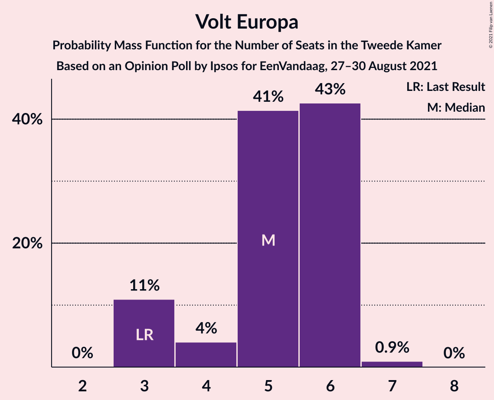

| Number of Seats | Probability | Accumulated | Special Marks |
|:---------------:|:-----------:|:-----------:|:-------------:|
| 3 | 2% | 100% | Last Result |
| 4 | 0.4% | 98% |  |
| 5 | 98% | 98% | Median |
| 6 | 0% | 0% |  |

### Forum voor Democratie

*For a full overview of the results for this party, see the [Forum voor Democratie](party-forumvoordemocratie.html) page.*

| Number of Seats | Probability | Accumulated | Special Marks |
|:---------------:|:-----------:|:-----------:|:-------------:|
| 2 | 0.3% | 100% |  |
| 3 | 98% | 99.7% | Median |
| 4 | 0.6% | 2% |  |
| 5 | 1.2% | 1.3% |  |
| 6 | 0.1% | 0.1% |  |
| 7 | 0% | 0% |  |
| 8 | 0% | 0% | Last Result |

### Staatkundig Gereformeerde Partij

*For a full overview of the results for this party, see the [Staatkundig Gereformeerde Partij](party-staatkundiggereformeerdepartij.html) page.*

| Number of Seats | Probability | Accumulated | Special Marks |
|:---------------:|:-----------:|:-----------:|:-------------:|
| 2 | 1.1% | 100% |  |
| 3 | 96% | 98.9% | Last Result, Median |
| 4 | 2% | 3% |  |
| 5 | 1.2% | 1.2% |  |
| 6 | 0% | 0% |  |

### DENK

*For a full overview of the results for this party, see the [DENK](party-denk.html) page.*

| Number of Seats | Probability | Accumulated | Special Marks |
|:---------------:|:-----------:|:-----------:|:-------------:|
| 2 | 0.1% | 100% |  |
| 3 | 2% | 99.9% | Last Result |
| 4 | 2% | 98% |  |
| 5 | 96% | 96% | Median |
| 6 | 0.1% | 0.2% |  |
| 7 | 0.1% | 0.1% |  |
| 8 | 0% | 0% |  |

### BoerBurgerBeweging

*For a full overview of the results for this party, see the [BoerBurgerBeweging](party-boerburgerbeweging.html) page.*

| Number of Seats | Probability | Accumulated | Special Marks |
|:---------------:|:-----------:|:-----------:|:-------------:|
| 1 | 0% | 100% | Last Result |
| 2 | 0.1% | 100% |  |
| 3 | 97% | 99.8% | Median |
| 4 | 0.9% | 2% |  |
| 5 | 1.4% | 1.5% |  |
| 6 | 0.1% | 0.1% |  |
| 7 | 0% | 0% |  |

### Bij1

*For a full overview of the results for this party, see the [Bij1](party-bij1.html) page.*

| Number of Seats | Probability | Accumulated | Special Marks |
|:---------------:|:-----------:|:-----------:|:-------------:|
| 0 | 96% | 100% | Median |
| 1 | 3% | 4% | Last Result |
| 2 | 1.1% | 1.1% |  |
| 3 | 0% | 0% |  |

### 50Plus

*For a full overview of the results for this party, see the [50Plus](party-50plus.html) page.*

| Number of Seats | Probability | Accumulated | Special Marks |
|:---------------:|:-----------:|:-----------:|:-------------:|
| 0 | 3% | 100% |  |
| 1 | 96% | 97% | Last Result, Median |
| 2 | 0.6% | 0.6% |  |
| 3 | 0% | 0% |  |

## Coalitions

### Confidence Intervals

| Coalition | Last Result | Median | Majority? | 80% Confidence Interval | 90% Confidence Interval | 95% Confidence Interval | 99% Confidence Interval |
|:---------:|:-----------:|:------:|:---------:|:-----------------------:|:-----------------------:|:-----------------------:|:-----------------------:|
| Volkspartij voor Vrijheid en Democratie – Democraten 66 – Christen-Democratisch Appèl – Partij van de Arbeid – ChristenUnie | 87 | 90 | 100% | 90 | 90 | 85–90 | 78–90 |
| Volkspartij voor Vrijheid en Democratie – Democraten 66 – Christen-Democratisch Appèl – GroenLinks – ChristenUnie | 86 | 88 | 99.2% | 88 | 88 | 84–88 | 75–88 |
| Volkspartij voor Vrijheid en Democratie – Democraten 66 – Christen-Democratisch Appèl – ChristenUnie | 78 | 81 | 97% | 81 | 81 | 74–81 | 68–81 |
| Volkspartij voor Vrijheid en Democratie – Democraten 66 – Christen-Democratisch Appèl | 73 | 76 | 95% | 76 | 76 | 68–76 | 63–76 |
| Volkspartij voor Vrijheid en Democratie – Partij voor de Vrijheid – Christen-Democratisch Appèl – Forum voor Democratie – Staatkundig Gereformeerde Partij | 77 | 74 | 0.1% | 74 | 74 | 70–74 | 68–74 |
| Volkspartij voor Vrijheid en Democratie – Democraten 66 – Partij van de Arbeid | 67 | 73 | 0% | 73 | 73 | 68–73 | 64–73 |
| Volkspartij voor Vrijheid en Democratie – Partij voor de Vrijheid – Christen-Democratisch Appèl – Forum voor Democratie | 74 | 71 | 0% | 71 | 71 | 68–71 | 64–71 |
| Volkspartij voor Vrijheid en Democratie – Partij voor de Vrijheid – Christen-Democratisch Appèl | 66 | 68 | 0% | 68 | 68 | 64–68 | 59–68 |
| Volkspartij voor Vrijheid en Democratie – Christen-Democratisch Appèl – Partij van de Arbeid | 58 | 63 | 0% | 63 | 63 | 56–63 | 51–63 |
| Democraten 66 – Christen-Democratisch Appèl – Partij van de Arbeid – GroenLinks – Socialistische Partij – ChristenUnie | 70 | 61 | 0% | 61 | 61 | 61 | 57–67 |
| Volkspartij voor Vrijheid en Democratie – Christen-Democratisch Appèl – Forum voor Democratie – Staatkundig Gereformeerde Partij – 50Plus | 61 | 61 | 0% | 61 | 61 | 55–61 | 50–61 |
| Volkspartij voor Vrijheid en Democratie – Christen-Democratisch Appèl – Forum voor Democratie – Staatkundig Gereformeerde Partij | 60 | 60 | 0% | 60 | 60 | 55–60 | 50–60 |
| Volkspartij voor Vrijheid en Democratie – Christen-Democratisch Appèl – Forum voor Democratie – 50Plus | 58 | 58 | 0% | 58 | 58 | 50–58 | 46–58 |
| Volkspartij voor Vrijheid en Democratie – Christen-Democratisch Appèl – Forum voor Democratie | 57 | 57 | 0% | 57 | 57 | 50–57 | 46–57 |
| Democraten 66 – Christen-Democratisch Appèl – Partij van de Arbeid – GroenLinks – ChristenUnie | 61 | 55 | 0% | 55 | 55 | 55 | 51–61 |
| Volkspartij voor Vrijheid en Democratie – Christen-Democratisch Appèl | 49 | 54 | 0% | 54 | 54 | 47–54 | 41–54 |
| Volkspartij voor Vrijheid en Democratie – Partij van de Arbeid | 43 | 51 | 0% | 51 | 51 | 47–51 | 42–53 |
| Democraten 66 – Christen-Democratisch Appèl – Partij van de Arbeid | 48 | 43 | 0% | 43 | 43 | 41–43 | 38–47 |
| Democraten 66 – Christen-Democratisch Appèl | 39 | 34 | 0% | 34 | 34 | 31–34 | 28–36 |
| Christen-Democratisch Appèl – Partij van de Arbeid – ChristenUnie | 29 | 26 | 0% | 26 | 26 | 26 | 23–32 |
| Christen-Democratisch Appèl – Partij van de Arbeid | 24 | 21 | 0% | 21 | 21 | 19–21 | 17–26 |

### Volkspartij voor Vrijheid en Democratie – Democraten 66 – Christen-Democratisch Appèl – Partij van de Arbeid – ChristenUnie

| Number of Seats | Probability | Accumulated | Special Marks |
|:---------------:|:-----------:|:-----------:|:-------------:|
| 78 | 0.8% | 100% |  |
| 79 | 0% | 99.2% |  |
| 80 | 0.1% | 99.2% |  |
| 81 | 0.7% | 99.1% |  |
| 82 | 0% | 98% |  |
| 83 | 0.4% | 98% |  |
| 84 | 0.1% | 98% |  |
| 85 | 2% | 98% |  |
| 86 | 0% | 96% |  |
| 87 | 0% | 96% | Last Result |
| 88 | 0% | 96% |  |
| 89 | 0% | 96% |  |
| 90 | 96% | 96% | Median |
| 91 | 0% | 0% |  |

### Volkspartij voor Vrijheid en Democratie – Democraten 66 – Christen-Democratisch Appèl – GroenLinks – ChristenUnie

| Number of Seats | Probability | Accumulated | Special Marks |
|:---------------:|:-----------:|:-----------:|:-------------:|
| 75 | 0.8% | 100% |  |
| 76 | 0.1% | 99.2% | Majority |
| 77 | 0.1% | 99.1% |  |
| 78 | 0.1% | 99.0% |  |
| 79 | 0.1% | 98.9% |  |
| 80 | 0.6% | 98.8% |  |
| 81 | 0.6% | 98% |  |
| 82 | 0% | 98% |  |
| 83 | 0% | 98% |  |
| 84 | 1.1% | 98% |  |
| 85 | 0% | 96% |  |
| 86 | 0% | 96% | Last Result |
| 87 | 1.1% | 96% |  |
| 88 | 95% | 95% | Median |
| 89 | 0% | 0% |  |

### Volkspartij voor Vrijheid en Democratie – Democraten 66 – Christen-Democratisch Appèl – ChristenUnie

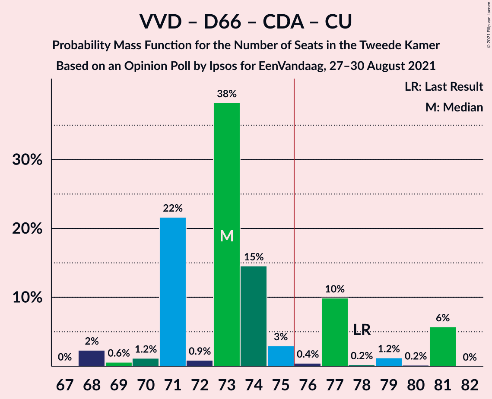

| Number of Seats | Probability | Accumulated | Special Marks |
|:---------------:|:-----------:|:-----------:|:-------------:|
| 67 | 0.1% | 100% |  |
| 68 | 0.8% | 99.9% |  |
| 69 | 0.1% | 99.2% |  |
| 70 | 0.2% | 99.1% |  |
| 71 | 0.1% | 98.9% |  |
| 72 | 0.6% | 98.8% |  |
| 73 | 0% | 98% |  |
| 74 | 0.9% | 98% |  |
| 75 | 0% | 97% |  |
| 76 | 1.0% | 97% | Majority |
| 77 | 0% | 96% |  |
| 78 | 0% | 96% | Last Result |
| 79 | 1.0% | 96% |  |
| 80 | 0% | 95% |  |
| 81 | 95% | 95% | Median |
| 82 | 0% | 0% |  |

### Volkspartij voor Vrijheid en Democratie – Democraten 66 – Christen-Democratisch Appèl

| Number of Seats | Probability | Accumulated | Special Marks |
|:---------------:|:-----------:|:-----------:|:-------------:|
| 62 | 0.1% | 100% |  |
| 63 | 0.8% | 99.9% |  |
| 64 | 0.1% | 99.1% |  |
| 65 | 0.2% | 99.1% |  |
| 66 | 0% | 98.8% |  |
| 67 | 0.4% | 98.8% |  |
| 68 | 2% | 98% |  |
| 69 | 0.2% | 96% |  |
| 70 | 0% | 96% |  |
| 71 | 0% | 96% |  |
| 72 | 0% | 96% |  |
| 73 | 1.0% | 96% | Last Result |
| 74 | 0% | 95% |  |
| 75 | 0% | 95% |  |
| 76 | 95% | 95% | Median, Majority |
| 77 | 0% | 0% |  |

### Volkspartij voor Vrijheid en Democratie – Partij voor de Vrijheid – Christen-Democratisch Appèl – Forum voor Democratie – Staatkundig Gereformeerde Partij

| Number of Seats | Probability | Accumulated | Special Marks |
|:---------------:|:-----------:|:-----------:|:-------------:|
| 66 | 0.3% | 100% |  |
| 67 | 0% | 99.7% |  |
| 68 | 0.8% | 99.7% |  |
| 69 | 0.9% | 98.9% |  |
| 70 | 1.1% | 98% |  |
| 71 | 0% | 97% |  |
| 72 | 0.8% | 97% |  |
| 73 | 0.6% | 96% |  |
| 74 | 95% | 96% | Median |
| 75 | 0.1% | 0.2% |  |
| 76 | 0% | 0.1% | Majority |
| 77 | 0.1% | 0.1% | Last Result |
| 78 | 0% | 0% |  |

### Volkspartij voor Vrijheid en Democratie – Democraten 66 – Partij van de Arbeid

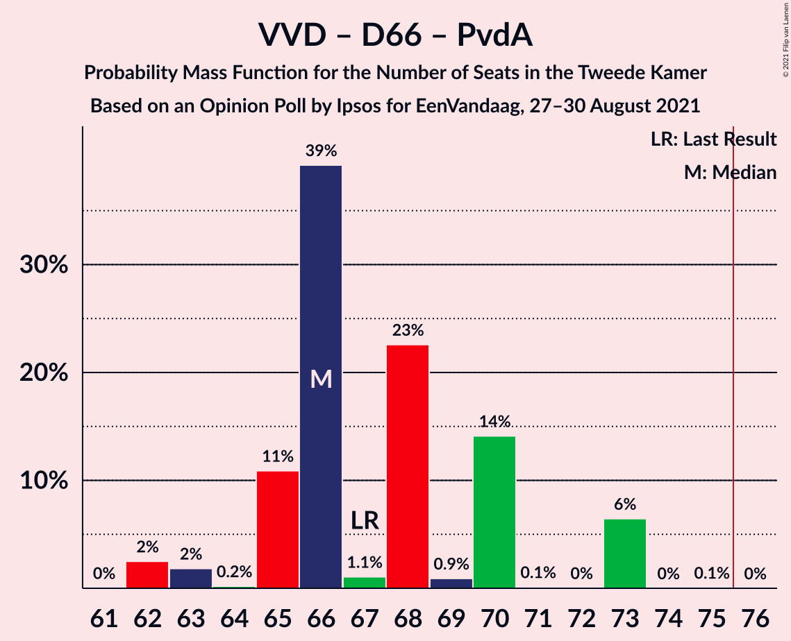

| Number of Seats | Probability | Accumulated | Special Marks |
|:---------------:|:-----------:|:-----------:|:-------------:|
| 62 | 0.1% | 100% |  |
| 63 | 0% | 99.9% |  |
| 64 | 0.8% | 99.9% |  |
| 65 | 0.8% | 99.1% |  |
| 66 | 0% | 98% |  |
| 67 | 0.1% | 98% | Last Result |
| 68 | 1.2% | 98% |  |
| 69 | 1.1% | 97% |  |
| 70 | 0.1% | 96% |  |
| 71 | 0.6% | 96% |  |
| 72 | 0% | 95% |  |
| 73 | 95% | 95% | Median |
| 74 | 0% | 0% |  |

### Volkspartij voor Vrijheid en Democratie – Partij voor de Vrijheid – Christen-Democratisch Appèl – Forum voor Democratie

| Number of Seats | Probability | Accumulated | Special Marks |
|:---------------:|:-----------:|:-----------:|:-------------:|
| 62 | 0.3% | 100% |  |
| 63 | 0.1% | 99.7% |  |
| 64 | 2% | 99.7% |  |
| 65 | 0% | 98% |  |
| 66 | 0% | 98% |  |
| 67 | 0.1% | 98% |  |
| 68 | 2% | 98% |  |
| 69 | 0.7% | 96% |  |
| 70 | 0.1% | 96% |  |
| 71 | 95% | 95% | Median |
| 72 | 0.1% | 0.2% |  |
| 73 | 0% | 0.1% |  |
| 74 | 0% | 0% | Last Result |

### Volkspartij voor Vrijheid en Democratie – Partij voor de Vrijheid – Christen-Democratisch Appèl

| Number of Seats | Probability | Accumulated | Special Marks |
|:---------------:|:-----------:|:-----------:|:-------------:|
| 59 | 0.8% | 100% |  |
| 60 | 0.3% | 99.2% |  |
| 61 | 0.9% | 98.9% |  |
| 62 | 0.2% | 98% |  |
| 63 | 0% | 98% |  |
| 64 | 0.7% | 98% |  |
| 65 | 1.0% | 97% |  |
| 66 | 0.6% | 96% | Last Result |
| 67 | 0.2% | 96% |  |
| 68 | 95% | 95% | Median |
| 69 | 0% | 0.1% |  |
| 70 | 0% | 0% |  |

### Volkspartij voor Vrijheid en Democratie – Christen-Democratisch Appèl – Partij van de Arbeid

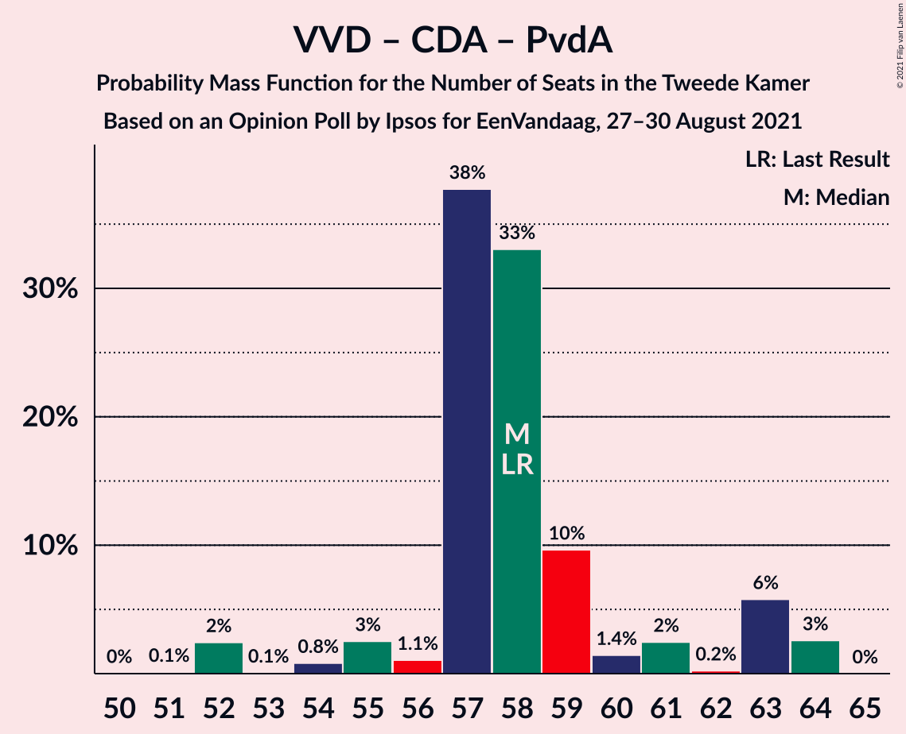

| Number of Seats | Probability | Accumulated | Special Marks |
|:---------------:|:-----------:|:-----------:|:-------------:|
| 50 | 0.3% | 100% |  |
| 51 | 0.8% | 99.7% |  |
| 52 | 0% | 99.0% |  |
| 53 | 0.1% | 99.0% |  |
| 54 | 0.6% | 98.9% |  |
| 55 | 0.1% | 98% |  |
| 56 | 0.9% | 98% |  |
| 57 | 0.1% | 97% |  |
| 58 | 0% | 97% | Last Result |
| 59 | 0.2% | 97% |  |
| 60 | 0% | 97% |  |
| 61 | 0% | 97% |  |
| 62 | 0% | 97% |  |
| 63 | 97% | 97% | Median |
| 64 | 0% | 0% |  |

### Democraten 66 – Christen-Democratisch Appèl – Partij van de Arbeid – GroenLinks – Socialistische Partij – ChristenUnie

| Number of Seats | Probability | Accumulated | Special Marks |
|:---------------:|:-----------:|:-----------:|:-------------:|
| 54 | 0.1% | 100% |  |
| 55 | 0.1% | 99.9% |  |
| 56 | 0% | 99.8% |  |
| 57 | 0.6% | 99.8% |  |
| 58 | 0% | 99.2% |  |
| 59 | 0.8% | 99.2% |  |
| 60 | 0.7% | 98% |  |
| 61 | 96% | 98% | Median |
| 62 | 0.1% | 2% |  |
| 63 | 0.1% | 1.5% |  |
| 64 | 0% | 1.4% |  |
| 65 | 0.3% | 1.4% |  |
| 66 | 0.1% | 1.1% |  |
| 67 | 1.0% | 1.0% |  |
| 68 | 0% | 0% |  |
| 69 | 0% | 0% |  |
| 70 | 0% | 0% | Last Result |

### Volkspartij voor Vrijheid en Democratie – Christen-Democratisch Appèl – Forum voor Democratie – Staatkundig Gereformeerde Partij – 50Plus

| Number of Seats | Probability | Accumulated | Special Marks |
|:---------------:|:-----------:|:-----------:|:-------------:|
| 47 | 0.3% | 100% |  |
| 48 | 0% | 99.7% |  |
| 49 | 0% | 99.7% |  |
| 50 | 0.8% | 99.7% |  |
| 51 | 0% | 98.9% |  |
| 52 | 0% | 98.8% |  |
| 53 | 0.1% | 98.8% |  |
| 54 | 0.6% | 98.7% |  |
| 55 | 1.0% | 98% |  |
| 56 | 0.1% | 97% |  |
| 57 | 0% | 97% |  |
| 58 | 1.0% | 97% |  |
| 59 | 0.1% | 96% |  |
| 60 | 0.6% | 96% |  |
| 61 | 95% | 95% | Last Result, Median |
| 62 | 0% | 0% |  |

### Volkspartij voor Vrijheid en Democratie – Christen-Democratisch Appèl – Forum voor Democratie – Staatkundig Gereformeerde Partij

| Number of Seats | Probability | Accumulated | Special Marks |
|:---------------:|:-----------:|:-----------:|:-------------:|
| 46 | 0.1% | 100% |  |
| 47 | 0.2% | 99.9% |  |
| 48 | 0% | 99.7% |  |
| 49 | 0% | 99.7% |  |
| 50 | 0.9% | 99.7% |  |
| 51 | 0% | 98.8% |  |
| 52 | 0% | 98.8% |  |
| 53 | 0.1% | 98.8% |  |
| 54 | 0.6% | 98.7% |  |
| 55 | 1.0% | 98% |  |
| 56 | 0.1% | 97% |  |
| 57 | 1.0% | 97% |  |
| 58 | 0.6% | 96% |  |
| 59 | 0.1% | 95% |  |
| 60 | 95% | 95% | Last Result, Median |
| 61 | 0% | 0% |  |

### Volkspartij voor Vrijheid en Democratie – Christen-Democratisch Appèl – Forum voor Democratie – 50Plus

| Number of Seats | Probability | Accumulated | Special Marks |
|:---------------:|:-----------:|:-----------:|:-------------:|
| 43 | 0.2% | 100% |  |
| 44 | 0.1% | 99.8% |  |
| 45 | 0% | 99.7% |  |
| 46 | 0.8% | 99.7% |  |
| 47 | 0% | 98.9% |  |
| 48 | 0.1% | 98.9% |  |
| 49 | 0% | 98.8% |  |
| 50 | 2% | 98.8% |  |
| 51 | 0% | 97% |  |
| 52 | 0% | 97% |  |
| 53 | 0.1% | 97% |  |
| 54 | 0.1% | 97% |  |
| 55 | 0% | 97% |  |
| 56 | 2% | 97% |  |
| 57 | 0% | 95% |  |
| 58 | 95% | 95% | Last Result, Median |
| 59 | 0% | 0% |  |

### Volkspartij voor Vrijheid en Democratie – Christen-Democratisch Appèl – Forum voor Democratie

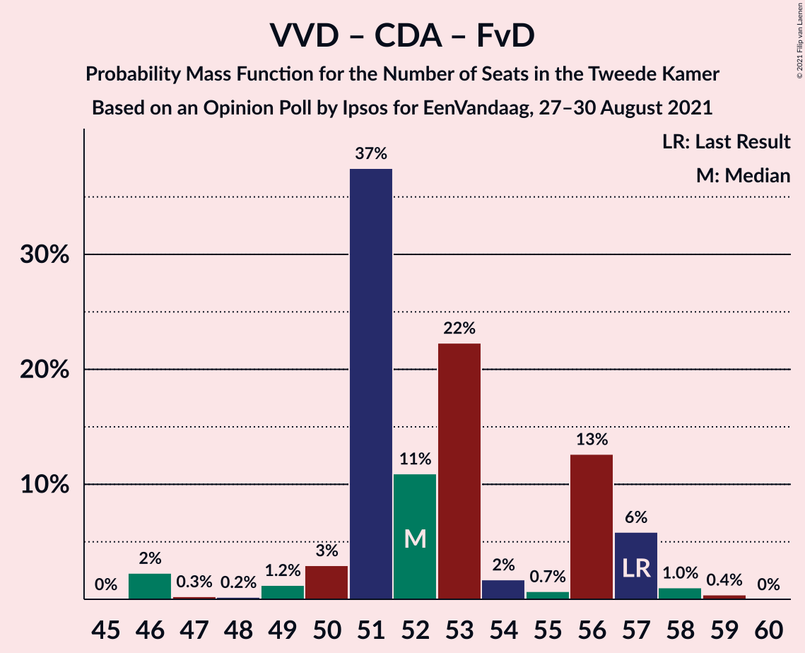

| Number of Seats | Probability | Accumulated | Special Marks |
|:---------------:|:-----------:|:-----------:|:-------------:|
| 43 | 0.3% | 100% |  |
| 44 | 0% | 99.7% |  |
| 45 | 0% | 99.7% |  |
| 46 | 0.8% | 99.7% |  |
| 47 | 0% | 98.9% |  |
| 48 | 0.1% | 98.9% |  |
| 49 | 0% | 98.8% |  |
| 50 | 2% | 98.8% |  |
| 51 | 0% | 97% |  |
| 52 | 0.1% | 97% |  |
| 53 | 0.1% | 97% |  |
| 54 | 0.7% | 97% |  |
| 55 | 1.0% | 96% |  |
| 56 | 0% | 95% |  |
| 57 | 95% | 95% | Last Result, Median |
| 58 | 0% | 0% |  |

### Democraten 66 – Christen-Democratisch Appèl – Partij van de Arbeid – GroenLinks – ChristenUnie

| Number of Seats | Probability | Accumulated | Special Marks |
|:---------------:|:-----------:|:-----------:|:-------------:|
| 50 | 0.2% | 100% |  |
| 51 | 0.5% | 99.8% |  |
| 52 | 0.1% | 99.3% |  |
| 53 | 1.4% | 99.2% |  |
| 54 | 0% | 98% |  |
| 55 | 96% | 98% | Median |
| 56 | 0.1% | 2% |  |
| 57 | 0.1% | 2% |  |
| 58 | 0.1% | 1.4% |  |
| 59 | 0.1% | 1.3% |  |
| 60 | 0.2% | 1.2% |  |
| 61 | 1.0% | 1.0% | Last Result |
| 62 | 0% | 0% |  |

### Volkspartij voor Vrijheid en Democratie – Christen-Democratisch Appèl

| Number of Seats | Probability | Accumulated | Special Marks |
|:---------------:|:-----------:|:-----------:|:-------------:|
| 39 | 0.1% | 100% |  |
| 40 | 0% | 99.9% |  |
| 41 | 1.0% | 99.9% |  |
| 42 | 0.1% | 98.9% |  |
| 43 | 0% | 98.9% |  |
| 44 | 0% | 98.9% |  |
| 45 | 0.3% | 98.8% |  |
| 46 | 0.1% | 98.6% |  |
| 47 | 1.5% | 98.5% |  |
| 48 | 0% | 97% |  |
| 49 | 0.1% | 97% | Last Result |
| 50 | 0.7% | 97% |  |
| 51 | 0% | 96% |  |
| 52 | 1.0% | 96% |  |
| 53 | 0% | 95% |  |
| 54 | 95% | 95% | Median |
| 55 | 0% | 0% |  |

### Volkspartij voor Vrijheid en Democratie – Partij van de Arbeid

| Number of Seats | Probability | Accumulated | Special Marks |
|:---------------:|:-----------:|:-----------:|:-------------:|
| 42 | 1.0% | 100% |  |
| 43 | 0.1% | 99.0% | Last Result |
| 44 | 0.5% | 98.9% |  |
| 45 | 0.2% | 98% |  |
| 46 | 0.2% | 98% |  |
| 47 | 0.9% | 98% |  |
| 48 | 1.0% | 97% |  |
| 49 | 0.2% | 96% |  |
| 50 | 0% | 96% |  |
| 51 | 95% | 96% | Median |
| 52 | 0% | 0.6% |  |
| 53 | 0.6% | 0.6% |  |
| 54 | 0% | 0% |  |

### Democraten 66 – Christen-Democratisch Appèl – Partij van de Arbeid

| Number of Seats | Probability | Accumulated | Special Marks |
|:---------------:|:-----------:|:-----------:|:-------------:|
| 38 | 0.6% | 100% |  |
| 39 | 1.0% | 99.3% |  |
| 40 | 0.2% | 98% |  |
| 41 | 1.4% | 98% |  |
| 42 | 0.1% | 97% |  |
| 43 | 96% | 97% | Median |
| 44 | 0.1% | 1.1% |  |
| 45 | 0% | 1.0% |  |
| 46 | 0% | 1.0% |  |
| 47 | 1.0% | 1.0% |  |
| 48 | 0% | 0% | Last Result |

### Democraten 66 – Christen-Democratisch Appèl

| Number of Seats | Probability | Accumulated | Special Marks |
|:---------------:|:-----------:|:-----------:|:-------------:|
| 28 | 0.7% | 100% |  |
| 29 | 0% | 99.2% |  |
| 30 | 1.1% | 99.2% |  |
| 31 | 1.3% | 98% |  |
| 32 | 0.2% | 97% |  |
| 33 | 0.1% | 97% |  |
| 34 | 95% | 96% | Median |
| 35 | 0% | 1.0% |  |
| 36 | 1.0% | 1.0% |  |
| 37 | 0% | 0% |  |
| 38 | 0% | 0% |  |
| 39 | 0% | 0% | Last Result |

### Christen-Democratisch Appèl – Partij van de Arbeid – ChristenUnie

| Number of Seats | Probability | Accumulated | Special Marks |
|:---------------:|:-----------:|:-----------:|:-------------:|
| 22 | 0.1% | 100% |  |
| 23 | 0.5% | 99.9% |  |
| 24 | 1.1% | 99.4% |  |
| 25 | 0.1% | 98% |  |
| 26 | 96% | 98% | Median |
| 27 | 0.7% | 2% |  |
| 28 | 0% | 1.2% |  |
| 29 | 0.1% | 1.1% | Last Result |
| 30 | 0% | 1.0% |  |
| 31 | 0% | 1.0% |  |
| 32 | 1.0% | 1.0% |  |
| 33 | 0% | 0% |  |

### Christen-Democratisch Appèl – Partij van de Arbeid

| Number of Seats | Probability | Accumulated | Special Marks |
|:---------------:|:-----------:|:-----------:|:-------------:|
| 17 | 0.8% | 100% |  |
| 18 | 0.9% | 99.1% |  |
| 19 | 0.8% | 98% |  |
| 20 | 0.3% | 97% |  |
| 21 | 95% | 97% | Median |
| 22 | 0.1% | 2% |  |
| 23 | 0.6% | 2% |  |
| 24 | 0% | 1.0% | Last Result |
| 25 | 0% | 1.0% |  |
| 26 | 1.0% | 1.0% |  |
| 27 | 0% | 0% |  |

## Technical Information

### Opinion Poll

+ **Polling firm:** Ipsos
+ **Commissioner(s):** EenVandaag
+ **Fieldwork period:** 27–30 August 2021

### Calculations

+ **Sample size:** 1008
+ **Simulations done:** 131,072
+ **Error estimate:** 2.71%

