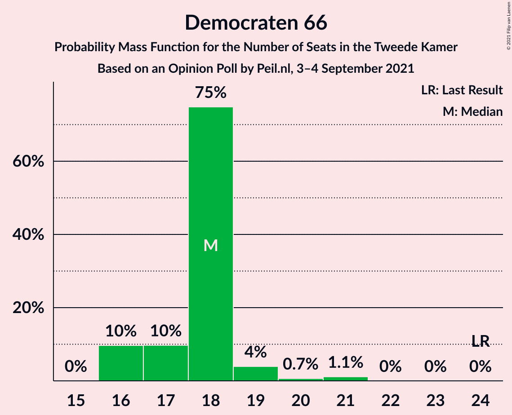
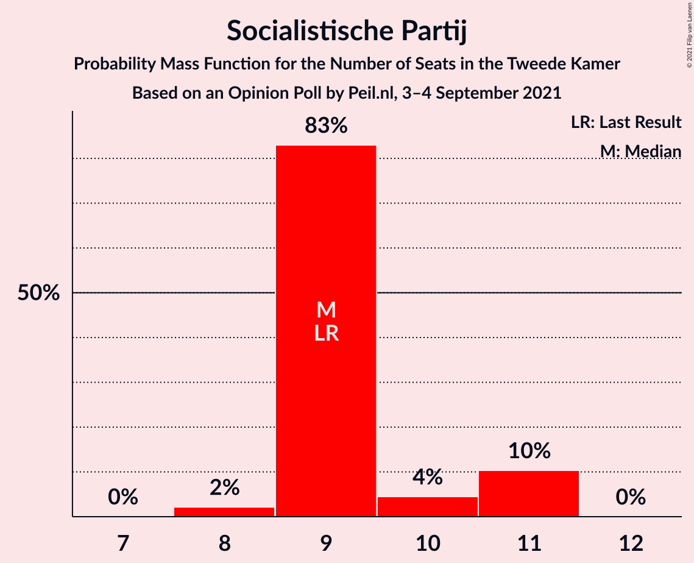
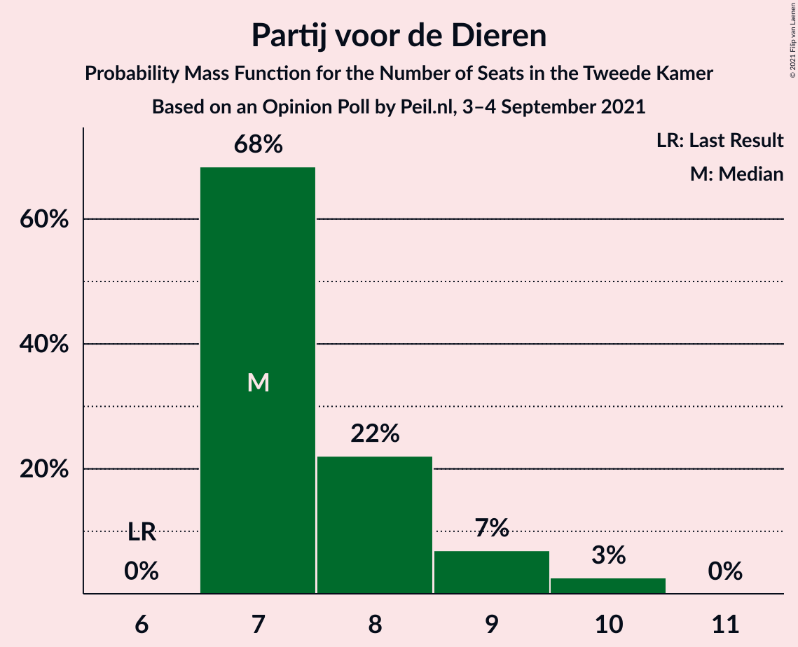
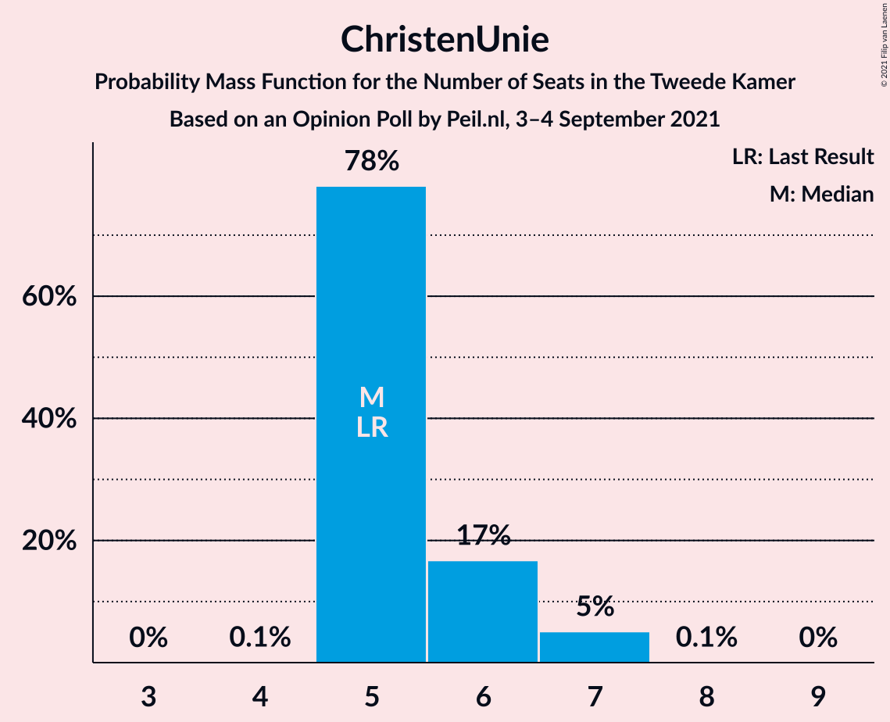
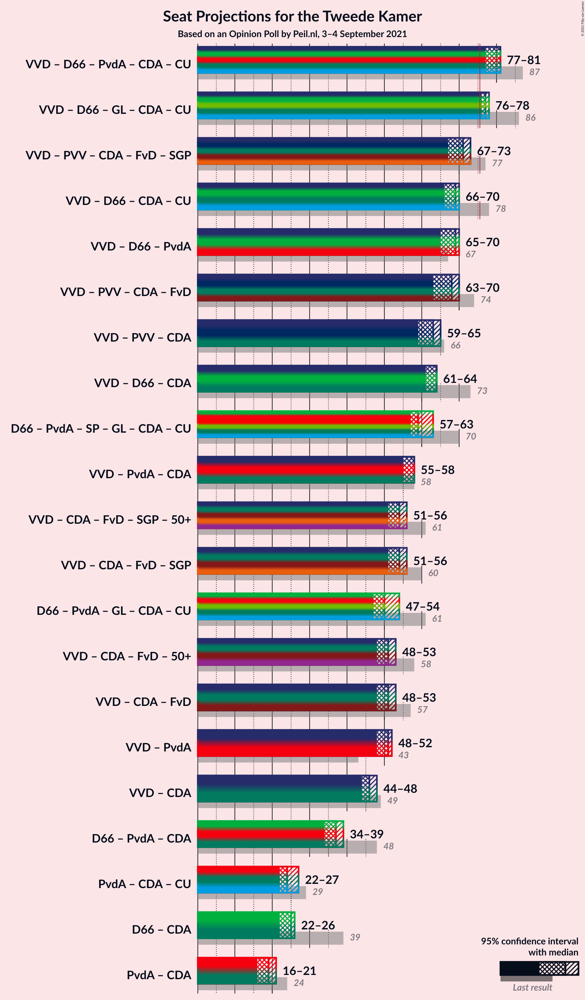
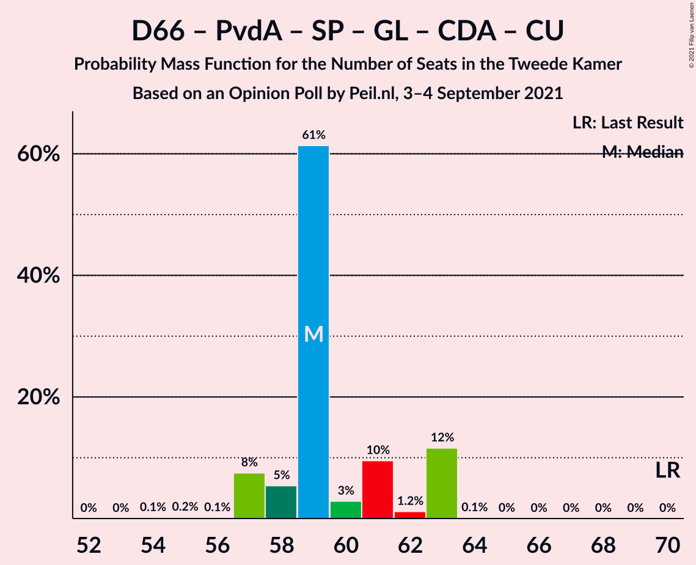
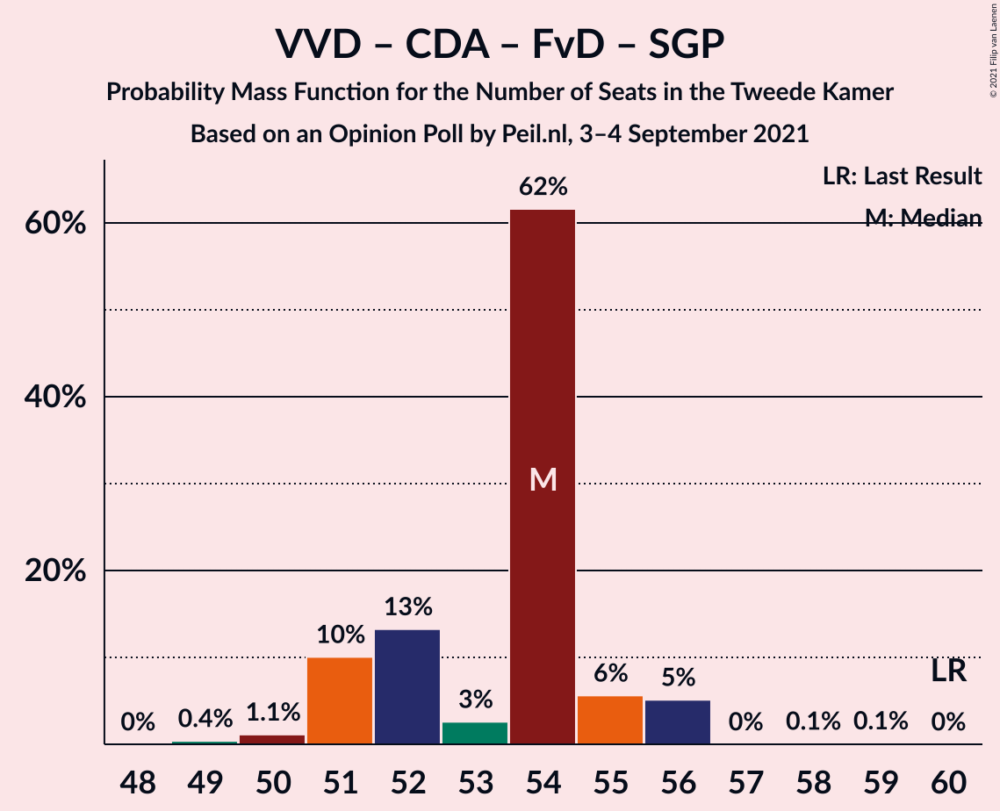
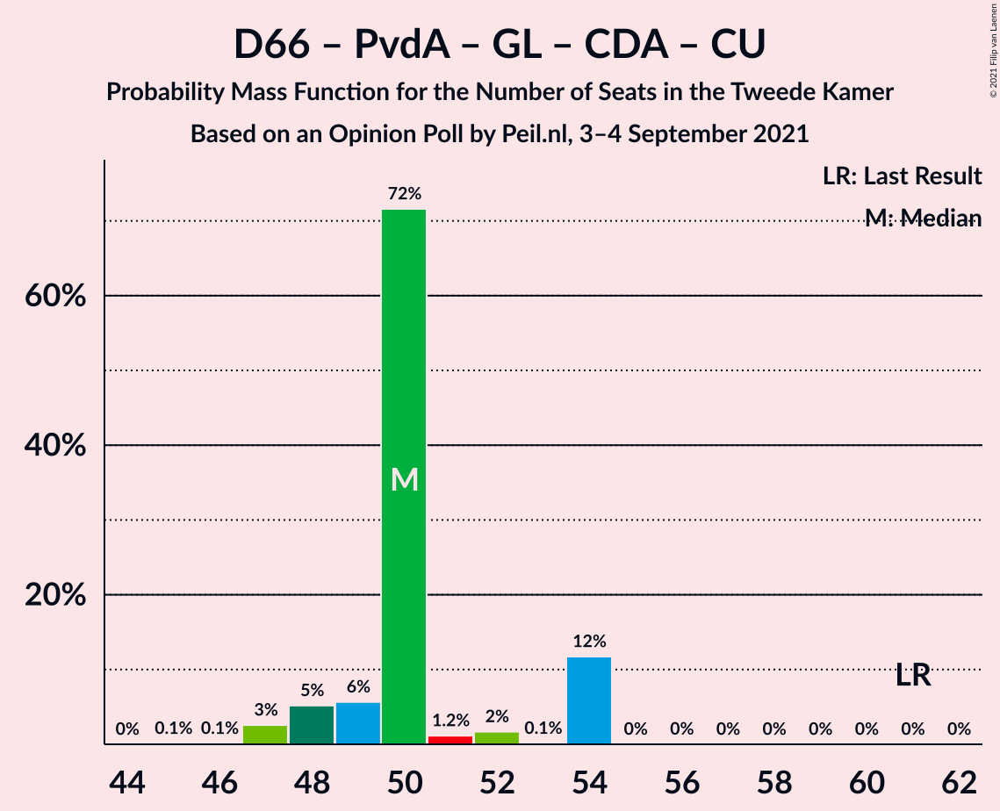
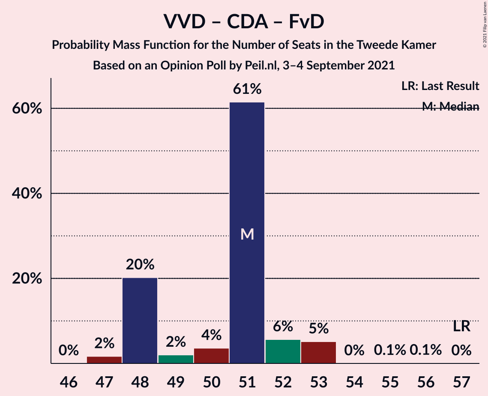
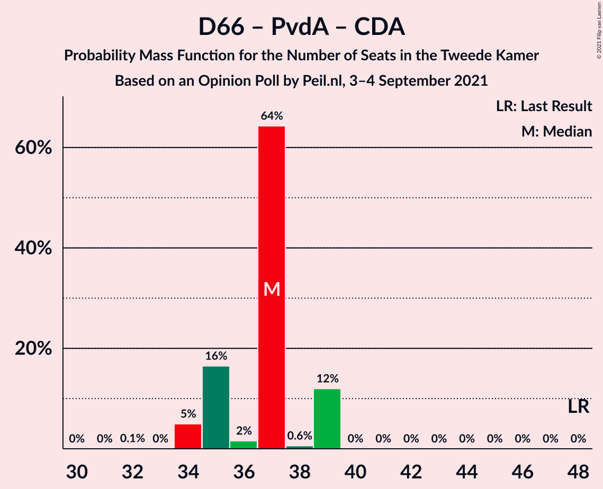

# Opinion Poll by Peil.nl, 3–4 September 2021

<a href="#voting-intentions">Voting Intentions</a> | <a href="#seats">Seats</a> | <a href="#coalitions">Coalitions</a> | <a href="#technical-information">Technical Information</a>

## Voting Intentions

### Confidence Intervals

| Party | Last Result | Poll Result | 80% Confidence Interval | 90% Confidence Interval | 95% Confidence Interval | 99% Confidence Interval |
|:-----:|:-----------:|:-----------:|:-----------------------:|:-----------------------:|:-----------------------:|:-----------------------:|
| Volkspartij voor Vrijheid en Democratie | 21.9% | 24.6% | 23.6–25.6% |23.3–25.9% |23.1–26.2% |22.6–26.7% |
| Democraten 66 | 15.0% | 12.0% | 11.2–12.8% |11.0–13.0% |10.9–13.2% |10.5–13.6% |
| Partij voor de Vrijheid | 10.8% | 10.6% | 9.9–11.4% |9.7–11.6% |9.6–11.8% |9.3–12.2% |
| Partij van de Arbeid | 5.7% | 7.3% | 6.7–8.0% |6.6–8.1% |6.4–8.3% |6.1–8.6% |
| Socialistische Partij | 6.0% | 6.0% | 5.4–6.6% |5.3–6.7% |5.2–6.9% |4.9–7.2% |
| GroenLinks | 5.2% | 5.3% | 4.8–5.9% |4.7–6.0% |4.5–6.2% |4.3–6.4% |
| Partij voor de Dieren | 3.8% | 5.3% | 4.8–5.9% |4.7–6.0% |4.5–6.2% |4.3–6.4% |
| Christen-Democratisch Appèl | 9.5% | 4.7% | 4.2–5.2% |4.1–5.3% |4.0–5.5% |3.7–5.8% |
| BoerBurgerBeweging | 1.0% | 4.7% | 4.2–5.2% |4.1–5.3% |4.0–5.5% |3.7–5.8% |
| ChristenUnie | 3.4% | 4.0% | 3.6–4.5% |3.4–4.6% |3.4–4.8% |3.2–5.0% |
| Forum voor Democratie | 5.0% | 3.3% | 2.9–3.8% |2.8–3.9% |2.7–4.0% |2.6–4.3% |
| Juiste Antwoord 2021 | 2.4% | 3.3% | 2.9–3.8% |2.8–3.9% |2.7–4.0% |2.6–4.3% |
| Volt Europa | 2.4% | 3.3% | 2.9–3.8% |2.8–3.9% |2.7–4.0% |2.6–4.3% |
| Staatkundig Gereformeerde Partij | 2.1% | 2.0% | 1.7–2.4% |1.6–2.5% |1.6–2.6% |1.4–2.8% |
| DENK | 2.0% | 2.0% | 1.7–2.4% |1.6–2.5% |1.6–2.6% |1.4–2.8% |
| Bij1 | 0.8% | 0.7% | 0.5–0.9% |0.5–1.0% |0.4–1.0% |0.4–1.2% |
| Belang van Nederland | 0.0% | 0.7% | 0.5–0.9% |0.5–1.0% |0.4–1.0% |0.4–1.2% |
| 50Plus | 1.0% | 0.2% | 0.1–0.3% |0.1–0.4% |0.1–0.4% |0.0–0.5% |

*Note:* The poll result column reflects the actual value used in the calculations. Published results may vary slightly, and in addition be rounded to fewer digits.

## Seats

### Confidence Intervals

| Party | Last Result | Median | 80% Confidence Interval | 90% Confidence Interval | 95% Confidence Interval | 99% Confidence Interval |
|:-----:|:-----------:|:------:|:-----------------------:|:-----------------------:|:-----------------------:|:-----------------------:|
| <a href="#volkspartij-voor-vrijheid-en-democratie">Volkspartij voor Vrijheid en Democratie</a> | 34 | 39 | 36–39 |36–40 |36–40 |36–41 |
| <a href="#democraten-66">Democraten 66</a> | 24 | 18 | 17–18 |16–19 |16–19 |16–21 |
| <a href="#partij-voor-de-vrijheid">Partij voor de Vrijheid</a> | 17 | 17 | 15–17 |15–17 |15–17 |14–19 |
| <a href="#partij-van-de-arbeid">Partij van de Arbeid</a> | 9 | 12 | 11–13 |10–13 |10–13 |9–13 |
| <a href="#socialistische-partij">Socialistische Partij</a> | 9 | 9 | 9–11 |9–11 |9–11 |8–11 |
| <a href="#groenlinks">GroenLinks</a> | 8 | 8 | 8–10 |8–10 |6–10 |6–10 |
| <a href="#partij-voor-de-dieren">Partij voor de Dieren</a> | 6 | 7 | 7–8 |7–9 |7–10 |7–10 |
| <a href="#christen-democratisch-appèl">Christen-Democratisch Appèl</a> | 15 | 7 | 7–8 |6–9 |5–9 |5–9 |
| <a href="#boerburgerbeweging">BoerBurgerBeweging</a> | 1 | 6 | 6–7 |6–7 |6–7 |5–8 |
| <a href="#christenunie">ChristenUnie</a> | 5 | 5 | 5–6 |5–7 |5–7 |5–7 |
| <a href="#forum-voor-democratie">Forum voor Democratie</a> | 8 | 5 | 4–5 |4–6 |4–6 |3–6 |
| <a href="#juiste-antwoord-2021">Juiste Antwoord 2021</a> | 3 | 4 | 4–5 |4–5 |4–5 |3–6 |
| <a href="#volt-europa">Volt Europa</a> | 3 | 6 | 5–6 |5–6 |5–6 |5–6 |
| <a href="#staatkundig-gereformeerde-partij">Staatkundig Gereformeerde Partij</a> | 3 | 3 | 3–4 |3–4 |2–4 |2–4 |
| <a href="#denk">DENK</a> | 3 | 3 | 3 |2–4 |2–4 |2–4 |
| <a href="#bij1">Bij1</a> | 1 | 0 | 0–1 |0–1 |0–1 |0–1 |
| <a href="#belang-van-nederland">Belang van Nederland</a> | 0 | 1 | 0–1 |0–1 |0–1 |0–1 |
| <a href="#50plus">50Plus</a> | 1 | 0 | 0 |0 |0 |0 |

### Volkspartij voor Vrijheid en Democratie

*For a full overview of the results for this party, see the [Volkspartij voor Vrijheid en Democratie](party-volkspartijvoorvrijheidendemocratie.html) page.*

| Number of Seats | Probability | Accumulated | Special Marks |
|:---------------:|:-----------:|:-----------:|:-------------:|
| 34 | 0% | 100% | Last Result |
| 35 | 0.3% | 100% |  |
| 36 | 13% | 99.7% |  |
| 37 | 11% | 87% |  |
| 38 | 0.6% | 76% |  |
| 39 | 67% | 75% | Median |
| 40 | 7% | 8% |  |
| 41 | 1.0% | 1.2% |  |
| 42 | 0.1% | 0.2% |  |
| 43 | 0.1% | 0.1% |  |
| 44 | 0% | 0% |  |

### Democraten 66

*For a full overview of the results for this party, see the [Democraten 66](party-democraten66.html) page.*

| Number of Seats | Probability | Accumulated | Special Marks |
|:---------------:|:-----------:|:-----------:|:-------------:|
| 16 | 10% | 100% |  |
| 17 | 10% | 90% |  |
| 18 | 75% | 81% | Median |
| 19 | 4% | 6% |  |
| 20 | 0.7% | 2% |  |
| 21 | 1.1% | 1.1% |  |
| 22 | 0% | 0% |  |
| 23 | 0% | 0% |  |
| 24 | 0% | 0% | Last Result |

### Partij voor de Vrijheid

*For a full overview of the results for this party, see the [Partij voor de Vrijheid](party-partijvoordevrijheid.html) page.*

| Number of Seats | Probability | Accumulated | Special Marks |
|:---------------:|:-----------:|:-----------:|:-------------:|
| 14 | 1.1% | 100% |  |
| 15 | 12% | 98.9% |  |
| 16 | 8% | 86% |  |
| 17 | 76% | 78% | Last Result, Median |
| 18 | 1.3% | 2% |  |
| 19 | 0.7% | 0.7% |  |
| 20 | 0% | 0% |  |

### Partij van de Arbeid

*For a full overview of the results for this party, see the [Partij van de Arbeid](party-partijvandearbeid.html) page.*

| Number of Seats | Probability | Accumulated | Special Marks |
|:---------------:|:-----------:|:-----------:|:-------------:|
| 9 | 2% | 100% | Last Result |
| 10 | 6% | 98% |  |
| 11 | 14% | 93% |  |
| 12 | 67% | 79% | Median |
| 13 | 12% | 12% |  |
| 14 | 0% | 0% |  |

### Socialistische Partij

*For a full overview of the results for this party, see the [Socialistische Partij](party-socialistischepartij.html) page.*

| Number of Seats | Probability | Accumulated | Special Marks |
|:---------------:|:-----------:|:-----------:|:-------------:|
| 8 | 2% | 100% |  |
| 9 | 83% | 98% | Last Result, Median |
| 10 | 4% | 15% |  |
| 11 | 10% | 10% |  |
| 12 | 0% | 0% |  |

### GroenLinks

*For a full overview of the results for this party, see the [GroenLinks](party-groenlinks.html) page.*

| Number of Seats | Probability | Accumulated | Special Marks |
|:---------------:|:-----------:|:-----------:|:-------------:|
| 6 | 3% | 100% |  |
| 7 | 1.3% | 97% |  |
| 8 | 74% | 96% | Last Result, Median |
| 9 | 12% | 22% |  |
| 10 | 10% | 10% |  |
| 11 | 0% | 0% |  |

### Partij voor de Dieren

*For a full overview of the results for this party, see the [Partij voor de Dieren](party-partijvoordedieren.html) page.*

| Number of Seats | Probability | Accumulated | Special Marks |
|:---------------:|:-----------:|:-----------:|:-------------:|
| 6 | 0% | 100% | Last Result |
| 7 | 68% | 100% | Median |
| 8 | 22% | 32% |  |
| 9 | 7% | 10% |  |
| 10 | 3% | 3% |  |
| 11 | 0% | 0% |  |

### Christen-Democratisch Appèl

*For a full overview of the results for this party, see the [Christen-Democratisch Appèl](party-christen-democratischappèl.html) page.*

| Number of Seats | Probability | Accumulated | Special Marks |
|:---------------:|:-----------:|:-----------:|:-------------:|
| 5 | 3% | 100% |  |
| 6 | 6% | 97% |  |
| 7 | 72% | 91% | Median |
| 8 | 14% | 19% |  |
| 9 | 5% | 5% |  |
| 10 | 0.1% | 0.1% |  |
| 11 | 0% | 0% |  |
| 12 | 0% | 0% |  |
| 13 | 0% | 0% |  |
| 14 | 0% | 0% |  |
| 15 | 0% | 0% | Last Result |

### BoerBurgerBeweging

*For a full overview of the results for this party, see the [BoerBurgerBeweging](party-boerburgerbeweging.html) page.*

| Number of Seats | Probability | Accumulated | Special Marks |
|:---------------:|:-----------:|:-----------:|:-------------:|
| 1 | 0% | 100% | Last Result |
| 2 | 0% | 100% |  |
| 3 | 0% | 100% |  |
| 4 | 0% | 100% |  |
| 5 | 2% | 100% |  |
| 6 | 81% | 98% | Median |
| 7 | 15% | 17% |  |
| 8 | 1.0% | 1.4% |  |
| 9 | 0.4% | 0.4% |  |
| 10 | 0% | 0% |  |

### ChristenUnie

*For a full overview of the results for this party, see the [ChristenUnie](party-christenunie.html) page.*

| Number of Seats | Probability | Accumulated | Special Marks |
|:---------------:|:-----------:|:-----------:|:-------------:|
| 4 | 0.1% | 100% |  |
| 5 | 78% | 99.9% | Last Result, Median |
| 6 | 17% | 22% |  |
| 7 | 5% | 5% |  |
| 8 | 0.1% | 0.1% |  |
| 9 | 0% | 0% |  |

### Forum voor Democratie

*For a full overview of the results for this party, see the [Forum voor Democratie](party-forumvoordemocratie.html) page.*

| Number of Seats | Probability | Accumulated | Special Marks |
|:---------------:|:-----------:|:-----------:|:-------------:|
| 3 | 1.0% | 100% |  |
| 4 | 22% | 99.0% |  |
| 5 | 72% | 77% | Median |
| 6 | 5% | 5% |  |
| 7 | 0.1% | 0.1% |  |
| 8 | 0% | 0% | Last Result |

### Juiste Antwoord 2021

*For a full overview of the results for this party, see the [Juiste Antwoord 2021](party-juisteantwoord2021.html) page.*

| Number of Seats | Probability | Accumulated | Special Marks |
|:---------------:|:-----------:|:-----------:|:-------------:|
| 3 | 0.6% | 100% | Last Result |
| 4 | 76% | 99.4% | Median |
| 5 | 22% | 24% |  |
| 6 | 1.1% | 1.1% |  |
| 7 | 0% | 0% |  |

### Volt Europa

*For a full overview of the results for this party, see the [Volt Europa](party-volteuropa.html) page.*

| Number of Seats | Probability | Accumulated | Special Marks |
|:---------------:|:-----------:|:-----------:|:-------------:|
| 3 | 0.2% | 100% | Last Result |
| 4 | 0.2% | 99.8% |  |
| 5 | 37% | 99.6% |  |
| 6 | 63% | 63% | Median |
| 7 | 0% | 0% |  |

### Staatkundig Gereformeerde Partij

*For a full overview of the results for this party, see the [Staatkundig Gereformeerde Partij](party-staatkundiggereformeerdepartij.html) page.*

| Number of Seats | Probability | Accumulated | Special Marks |
|:---------------:|:-----------:|:-----------:|:-------------:|
| 2 | 3% | 100% |  |
| 3 | 85% | 97% | Last Result, Median |
| 4 | 12% | 12% |  |
| 5 | 0% | 0% |  |

### DENK

*For a full overview of the results for this party, see the [DENK](party-denk.html) page.*

| Number of Seats | Probability | Accumulated | Special Marks |
|:---------------:|:-----------:|:-----------:|:-------------:|
| 2 | 8% | 100% |  |
| 3 | 87% | 92% | Last Result, Median |
| 4 | 5% | 5% |  |
| 5 | 0% | 0% |  |

### Bij1

*For a full overview of the results for this party, see the [Bij1](party-bij1.html) page.*

| Number of Seats | Probability | Accumulated | Special Marks |
|:---------------:|:-----------:|:-----------:|:-------------:|
| 0 | 63% | 100% | Median |
| 1 | 37% | 37% | Last Result |
| 2 | 0% | 0% |  |

### Belang van Nederland

*For a full overview of the results for this party, see the [Belang van Nederland](party-belangvannederland.html) page.*

| Number of Seats | Probability | Accumulated | Special Marks |
|:---------------:|:-----------:|:-----------:|:-------------:|
| 0 | 35% | 100% | Last Result |
| 1 | 65% | 65% | Median |
| 2 | 0.1% | 0.1% |  |
| 3 | 0% | 0% |  |

### 50Plus

*For a full overview of the results for this party, see the [50Plus](party-50plus.html) page.*

| Number of Seats | Probability | Accumulated | Special Marks |
|:---------------:|:-----------:|:-----------:|:-------------:|
| 0 | 100% | 100% | Median |
| 1 | 0% | 0% | Last Result |

## Coalitions

### Confidence Intervals

| Coalition | Last Result | Median | Majority? | 80% Confidence Interval | 90% Confidence Interval | 95% Confidence Interval | 99% Confidence Interval |
|:---------:|:-----------:|:------:|:---------:|:-----------------------:|:-----------------------:|:-----------------------:|:-----------------------:|
| Volkspartij voor Vrijheid en Democratie – Democraten 66 – Partij van de Arbeid – Christen-Democratisch Appèl – ChristenUnie | 87 | 81 | 100% | 79–81 | 77–81 | 77–81 | 77–83 |
| Volkspartij voor Vrijheid en Democratie – Democraten 66 – GroenLinks – Christen-Democratisch Appèl – ChristenUnie | 86 | 77 | 99.6% | 76–77 | 76–77 | 76–78 | 76–80 |
| Volkspartij voor Vrijheid en Democratie – Partij voor de Vrijheid – Christen-Democratisch Appèl – Forum voor Democratie – Staatkundig Gereformeerde Partij | 77 | 71 | 0% | 67–71 | 67–73 | 67–73 | 67–73 |
| Volkspartij voor Vrijheid en Democratie – Democraten 66 – Christen-Democratisch Appèl – ChristenUnie | 78 | 69 | 0% | 68–69 | 66–69 | 66–70 | 66–72 |
| Volkspartij voor Vrijheid en Democratie – Democraten 66 – Partij van de Arbeid | 67 | 69 | 0% | 65–69 | 65–69 | 65–70 | 65–70 |
| Volkspartij voor Vrijheid en Democratie – Partij voor de Vrijheid – Christen-Democratisch Appèl – Forum voor Democratie | 74 | 68 | 0% | 63–68 | 63–70 | 63–70 | 63–70 |
| Volkspartij voor Vrijheid en Democratie – Partij voor de Vrijheid – Christen-Democratisch Appèl | 66 | 63 | 0% | 59–63 | 59–65 | 59–65 | 59–65 |
| Volkspartij voor Vrijheid en Democratie – Democraten 66 – Christen-Democratisch Appèl | 73 | 64 | 0% | 62–64 | 61–64 | 61–64 | 61–67 |
| Democraten 66 – Partij van de Arbeid – Socialistische Partij – GroenLinks – Christen-Democratisch Appèl – ChristenUnie | 70 | 59 | 0% | 58–63 | 57–63 | 57–63 | 57–63 |
| Volkspartij voor Vrijheid en Democratie – Partij van de Arbeid – Christen-Democratisch Appèl | 58 | 58 | 0% | 55–58 | 55–58 | 55–58 | 51–60 |
| Volkspartij voor Vrijheid en Democratie – Christen-Democratisch Appèl – Forum voor Democratie – Staatkundig Gereformeerde Partij – 50Plus | 61 | 54 | 0% | 51–55 | 51–56 | 51–56 | 50–56 |
| Volkspartij voor Vrijheid en Democratie – Christen-Democratisch Appèl – Forum voor Democratie – Staatkundig Gereformeerde Partij | 60 | 54 | 0% | 51–55 | 51–56 | 51–56 | 50–56 |
| Democraten 66 – Partij van de Arbeid – GroenLinks – Christen-Democratisch Appèl – ChristenUnie | 61 | 50 | 0% | 49–54 | 48–54 | 47–54 | 47–54 |
| Volkspartij voor Vrijheid en Democratie – Christen-Democratisch Appèl – Forum voor Democratie – 50Plus | 58 | 51 | 0% | 48–52 | 48–53 | 48–53 | 47–53 |
| Volkspartij voor Vrijheid en Democratie – Christen-Democratisch Appèl – Forum voor Democratie | 57 | 51 | 0% | 48–52 | 48–53 | 48–53 | 47–53 |
| Volkspartij voor Vrijheid en Democratie – Partij van de Arbeid | 43 | 51 | 0% | 48–51 | 48–52 | 48–52 | 45–52 |
| Volkspartij voor Vrijheid en Democratie – Christen-Democratisch Appèl | 49 | 46 | 0% | 44–46 | 44–48 | 44–48 | 42–49 |
| Democraten 66 – Partij van de Arbeid – Christen-Democratisch Appèl | 48 | 37 | 0% | 35–39 | 34–39 | 34–39 | 34–39 |
| Partij van de Arbeid – Christen-Democratisch Appèl – ChristenUnie | 29 | 24 | 0% | 23–27 | 23–27 | 22–27 | 20–27 |
| Democraten 66 – Christen-Democratisch Appèl | 39 | 25 | 0% | 24–26 | 24–26 | 22–26 | 22–27 |
| Partij van de Arbeid – Christen-Democratisch Appèl | 24 | 19 | 0% | 18–21 | 18–21 | 16–21 | 15–21 |

### Volkspartij voor Vrijheid en Democratie – Democraten 66 – Partij van de Arbeid – Christen-Democratisch Appèl – ChristenUnie

| Number of Seats | Probability | Accumulated | Special Marks |
|:---------------:|:-----------:|:-----------:|:-------------:|
| 77 | 10% | 100% |  |
| 78 | 0.1% | 90% |  |
| 79 | 7% | 90% |  |
| 80 | 1.3% | 83% |  |
| 81 | 80% | 82% | Median |
| 82 | 1.0% | 2% |  |
| 83 | 1.1% | 1.2% |  |
| 84 | 0.1% | 0.1% |  |
| 85 | 0% | 0% |  |
| 86 | 0% | 0% |  |
| 87 | 0% | 0% | Last Result |

### Volkspartij voor Vrijheid en Democratie – Democraten 66 – GroenLinks – Christen-Democratisch Appèl – ChristenUnie

| Number of Seats | Probability | Accumulated | Special Marks |
|:---------------:|:-----------:|:-----------:|:-------------:|
| 73 | 0.2% | 100% |  |
| 74 | 0.2% | 99.8% |  |
| 75 | 0.1% | 99.6% |  |
| 76 | 13% | 99.6% | Majority |
| 77 | 83% | 87% | Median |
| 78 | 2% | 3% |  |
| 79 | 0.3% | 2% |  |
| 80 | 1.3% | 1.4% |  |
| 81 | 0.1% | 0.1% |  |
| 82 | 0% | 0% |  |
| 83 | 0% | 0% |  |
| 84 | 0% | 0% |  |
| 85 | 0% | 0% |  |
| 86 | 0% | 0% | Last Result |

### Volkspartij voor Vrijheid en Democratie – Partij voor de Vrijheid – Christen-Democratisch Appèl – Forum voor Democratie – Staatkundig Gereformeerde Partij

| Number of Seats | Probability | Accumulated | Special Marks |
|:---------------:|:-----------:|:-----------:|:-------------:|
| 65 | 0.1% | 100% |  |
| 66 | 0.2% | 99.9% |  |
| 67 | 14% | 99.7% |  |
| 68 | 9% | 86% |  |
| 69 | 4% | 77% |  |
| 70 | 0.6% | 72% |  |
| 71 | 66% | 72% | Median |
| 72 | 0.1% | 5% |  |
| 73 | 5% | 5% |  |
| 74 | 0% | 0.2% |  |
| 75 | 0.2% | 0.2% |  |
| 76 | 0% | 0% | Majority |
| 77 | 0% | 0% | Last Result |

### Volkspartij voor Vrijheid en Democratie – Democraten 66 – Christen-Democratisch Appèl – ChristenUnie

| Number of Seats | Probability | Accumulated | Special Marks |
|:---------------:|:-----------:|:-----------:|:-------------:|
| 65 | 0.1% | 100% |  |
| 66 | 8% | 99.9% |  |
| 67 | 0.4% | 91% |  |
| 68 | 15% | 91% |  |
| 69 | 71% | 76% | Median |
| 70 | 3% | 5% |  |
| 71 | 0.4% | 2% |  |
| 72 | 1.3% | 2% |  |
| 73 | 0.2% | 0.2% |  |
| 74 | 0% | 0% |  |
| 75 | 0% | 0% |  |
| 76 | 0% | 0% | Majority |
| 77 | 0% | 0% |  |
| 78 | 0% | 0% | Last Result |

### Volkspartij voor Vrijheid en Democratie – Democraten 66 – Partij van de Arbeid

| Number of Seats | Probability | Accumulated | Special Marks |
|:---------------:|:-----------:|:-----------:|:-------------:|
| 64 | 0.3% | 100% |  |
| 65 | 14% | 99.7% |  |
| 66 | 2% | 86% |  |
| 67 | 13% | 84% | Last Result |
| 68 | 5% | 71% |  |
| 69 | 62% | 66% | Median |
| 70 | 3% | 3% |  |
| 71 | 0.1% | 0.2% |  |
| 72 | 0% | 0% |  |

### Volkspartij voor Vrijheid en Democratie – Partij voor de Vrijheid – Christen-Democratisch Appèl – Forum voor Democratie

| Number of Seats | Probability | Accumulated | Special Marks |
|:---------------:|:-----------:|:-----------:|:-------------:|
| 62 | 0.1% | 100% |  |
| 63 | 12% | 99.9% |  |
| 64 | 2% | 88% |  |
| 65 | 9% | 86% |  |
| 66 | 4% | 77% |  |
| 67 | 1.2% | 73% |  |
| 68 | 66% | 72% | Median |
| 69 | 0.6% | 6% |  |
| 70 | 5% | 5% |  |
| 71 | 0% | 0.2% |  |
| 72 | 0.2% | 0.2% |  |
| 73 | 0% | 0% |  |
| 74 | 0% | 0% | Last Result |

### Volkspartij voor Vrijheid en Democratie – Partij voor de Vrijheid – Christen-Democratisch Appèl

| Number of Seats | Probability | Accumulated | Special Marks |
|:---------------:|:-----------:|:-----------:|:-------------:|
| 58 | 0.3% | 100% |  |
| 59 | 13% | 99.7% |  |
| 60 | 1.4% | 87% |  |
| 61 | 11% | 85% |  |
| 62 | 6% | 74% |  |
| 63 | 62% | 68% | Median |
| 64 | 0% | 6% |  |
| 65 | 6% | 6% |  |
| 66 | 0% | 0.2% | Last Result |
| 67 | 0.1% | 0.1% |  |
| 68 | 0% | 0% |  |

### Volkspartij voor Vrijheid en Democratie – Democraten 66 – Christen-Democratisch Appèl

| Number of Seats | Probability | Accumulated | Special Marks |
|:---------------:|:-----------:|:-----------:|:-------------:|
| 60 | 0.1% | 100% |  |
| 61 | 9% | 99.9% |  |
| 62 | 18% | 91% |  |
| 63 | 2% | 73% |  |
| 64 | 69% | 71% | Median |
| 65 | 0.2% | 2% |  |
| 66 | 0.3% | 2% |  |
| 67 | 1.1% | 1.2% |  |
| 68 | 0.1% | 0.1% |  |
| 69 | 0% | 0% |  |
| 70 | 0% | 0% |  |
| 71 | 0% | 0% |  |
| 72 | 0% | 0% |  |
| 73 | 0% | 0% | Last Result |

### Democraten 66 – Partij van de Arbeid – Socialistische Partij – GroenLinks – Christen-Democratisch Appèl – ChristenUnie

| Number of Seats | Probability | Accumulated | Special Marks |
|:---------------:|:-----------:|:-----------:|:-------------:|
| 54 | 0.1% | 100% |  |
| 55 | 0.2% | 99.9% |  |
| 56 | 0.1% | 99.7% |  |
| 57 | 8% | 99.5% |  |
| 58 | 5% | 92% |  |
| 59 | 61% | 87% | Median |
| 60 | 3% | 25% |  |
| 61 | 10% | 22% |  |
| 62 | 1.2% | 13% |  |
| 63 | 12% | 12% |  |
| 64 | 0.1% | 0.1% |  |
| 65 | 0% | 0% |  |
| 66 | 0% | 0% |  |
| 67 | 0% | 0% |  |
| 68 | 0% | 0% |  |
| 69 | 0% | 0% |  |
| 70 | 0% | 0% | Last Result |

### Volkspartij voor Vrijheid en Democratie – Partij van de Arbeid – Christen-Democratisch Appèl

| Number of Seats | Probability | Accumulated | Special Marks |
|:---------------:|:-----------:|:-----------:|:-------------:|
| 51 | 1.2% | 100% |  |
| 52 | 0% | 98.8% |  |
| 53 | 0.3% | 98.8% |  |
| 54 | 0.2% | 98% |  |
| 55 | 10% | 98% |  |
| 56 | 3% | 88% |  |
| 57 | 13% | 85% |  |
| 58 | 71% | 73% | Last Result, Median |
| 59 | 0.2% | 1.2% |  |
| 60 | 1.1% | 1.1% |  |
| 61 | 0% | 0% |  |

### Volkspartij voor Vrijheid en Democratie – Christen-Democratisch Appèl – Forum voor Democratie – Staatkundig Gereformeerde Partij – 50Plus

| Number of Seats | Probability | Accumulated | Special Marks |
|:---------------:|:-----------:|:-----------:|:-------------:|
| 49 | 0.4% | 100% |  |
| 50 | 1.1% | 99.6% |  |
| 51 | 10% | 98% |  |
| 52 | 13% | 88% |  |
| 53 | 3% | 75% |  |
| 54 | 62% | 73% | Median |
| 55 | 6% | 11% |  |
| 56 | 5% | 5% |  |
| 57 | 0% | 0.2% |  |
| 58 | 0.1% | 0.2% |  |
| 59 | 0.1% | 0.1% |  |
| 60 | 0% | 0% |  |
| 61 | 0% | 0% | Last Result |

### Volkspartij voor Vrijheid en Democratie – Christen-Democratisch Appèl – Forum voor Democratie – Staatkundig Gereformeerde Partij

| Number of Seats | Probability | Accumulated | Special Marks |
|:---------------:|:-----------:|:-----------:|:-------------:|
| 49 | 0.4% | 100% |  |
| 50 | 1.1% | 99.6% |  |
| 51 | 10% | 98% |  |
| 52 | 13% | 88% |  |
| 53 | 3% | 75% |  |
| 54 | 62% | 73% | Median |
| 55 | 6% | 11% |  |
| 56 | 5% | 5% |  |
| 57 | 0% | 0.2% |  |
| 58 | 0.1% | 0.2% |  |
| 59 | 0.1% | 0.1% |  |
| 60 | 0% | 0% | Last Result |

### Democraten 66 – Partij van de Arbeid – GroenLinks – Christen-Democratisch Appèl – ChristenUnie

| Number of Seats | Probability | Accumulated | Special Marks |
|:---------------:|:-----------:|:-----------:|:-------------:|
| 45 | 0.1% | 100% |  |
| 46 | 0.1% | 99.9% |  |
| 47 | 3% | 99.8% |  |
| 48 | 5% | 97% |  |
| 49 | 6% | 92% |  |
| 50 | 72% | 86% | Median |
| 51 | 1.2% | 15% |  |
| 52 | 2% | 14% |  |
| 53 | 0.1% | 12% |  |
| 54 | 12% | 12% |  |
| 55 | 0% | 0% |  |
| 56 | 0% | 0% |  |
| 57 | 0% | 0% |  |
| 58 | 0% | 0% |  |
| 59 | 0% | 0% |  |
| 60 | 0% | 0% |  |
| 61 | 0% | 0% | Last Result |

### Volkspartij voor Vrijheid en Democratie – Christen-Democratisch Appèl – Forum voor Democratie – 50Plus

| Number of Seats | Probability | Accumulated | Special Marks |
|:---------------:|:-----------:|:-----------:|:-------------:|
| 47 | 2% | 100% |  |
| 48 | 20% | 98% |  |
| 49 | 2% | 78% |  |
| 50 | 4% | 76% |  |
| 51 | 61% | 72% | Median |
| 52 | 6% | 11% |  |
| 53 | 5% | 5% |  |
| 54 | 0% | 0.2% |  |
| 55 | 0.1% | 0.2% |  |
| 56 | 0.1% | 0.1% |  |
| 57 | 0% | 0% |  |
| 58 | 0% | 0% | Last Result |

### Volkspartij voor Vrijheid en Democratie – Christen-Democratisch Appèl – Forum voor Democratie

| Number of Seats | Probability | Accumulated | Special Marks |
|:---------------:|:-----------:|:-----------:|:-------------:|
| 47 | 2% | 100% |  |
| 48 | 20% | 98% |  |
| 49 | 2% | 78% |  |
| 50 | 4% | 76% |  |
| 51 | 61% | 72% | Median |
| 52 | 6% | 11% |  |
| 53 | 5% | 5% |  |
| 54 | 0% | 0.2% |  |
| 55 | 0.1% | 0.2% |  |
| 56 | 0.1% | 0.1% |  |
| 57 | 0% | 0% | Last Result |

### Volkspartij voor Vrijheid en Democratie – Partij van de Arbeid

| Number of Seats | Probability | Accumulated | Special Marks |
|:---------------:|:-----------:|:-----------:|:-------------:|
| 43 | 0% | 100% | Last Result |
| 44 | 0% | 100% |  |
| 45 | 1.2% | 100% |  |
| 46 | 0.4% | 98.7% |  |
| 47 | 0.1% | 98% |  |
| 48 | 10% | 98% |  |
| 49 | 18% | 88% |  |
| 50 | 0.6% | 71% |  |
| 51 | 64% | 70% | Median |
| 52 | 6% | 6% |  |
| 53 | 0.1% | 0.1% |  |
| 54 | 0% | 0% |  |

### Volkspartij voor Vrijheid en Democratie – Christen-Democratisch Appèl

| Number of Seats | Probability | Accumulated | Special Marks |
|:---------------:|:-----------:|:-----------:|:-------------:|
| 42 | 1.4% | 100% |  |
| 43 | 0.6% | 98.6% |  |
| 44 | 21% | 98% |  |
| 45 | 4% | 77% |  |
| 46 | 67% | 73% | Median |
| 47 | 0.2% | 6% |  |
| 48 | 5% | 6% |  |
| 49 | 1.0% | 1.1% | Last Result |
| 50 | 0% | 0.1% |  |
| 51 | 0.1% | 0.1% |  |
| 52 | 0% | 0% |  |

### Democraten 66 – Partij van de Arbeid – Christen-Democratisch Appèl

| Number of Seats | Probability | Accumulated | Special Marks |
|:---------------:|:-----------:|:-----------:|:-------------:|
| 32 | 0.1% | 100% |  |
| 33 | 0% | 99.9% |  |
| 34 | 5% | 99.9% |  |
| 35 | 16% | 95% |  |
| 36 | 2% | 78% |  |
| 37 | 64% | 77% | Median |
| 38 | 0.6% | 13% |  |
| 39 | 12% | 12% |  |
| 40 | 0% | 0% |  |
| 41 | 0% | 0% |  |
| 42 | 0% | 0% |  |
| 43 | 0% | 0% |  |
| 44 | 0% | 0% |  |
| 45 | 0% | 0% |  |
| 46 | 0% | 0% |  |
| 47 | 0% | 0% |  |
| 48 | 0% | 0% | Last Result |

### Partij van de Arbeid – Christen-Democratisch Appèl – ChristenUnie

| Number of Seats | Probability | Accumulated | Special Marks |
|:---------------:|:-----------:|:-----------:|:-------------:|
| 20 | 0.8% | 100% |  |
| 21 | 0.4% | 99.2% |  |
| 22 | 3% | 98.8% |  |
| 23 | 10% | 96% |  |
| 24 | 68% | 86% | Median |
| 25 | 6% | 18% |  |
| 26 | 0.8% | 12% |  |
| 27 | 12% | 12% |  |
| 28 | 0% | 0% |  |
| 29 | 0% | 0% | Last Result |

### Democraten 66 – Christen-Democratisch Appèl

| Number of Seats | Probability | Accumulated | Special Marks |
|:---------------:|:-----------:|:-----------:|:-------------:|
| 22 | 5% | 100% |  |
| 23 | 0.4% | 95% |  |
| 24 | 11% | 95% |  |
| 25 | 68% | 84% | Median |
| 26 | 14% | 16% |  |
| 27 | 1.3% | 2% |  |
| 28 | 0.3% | 0.5% |  |
| 29 | 0.1% | 0.1% |  |
| 30 | 0% | 0% |  |
| 31 | 0% | 0% |  |
| 32 | 0% | 0% |  |
| 33 | 0% | 0% |  |
| 34 | 0% | 0% |  |
| 35 | 0% | 0% |  |
| 36 | 0% | 0% |  |
| 37 | 0% | 0% |  |
| 38 | 0% | 0% |  |
| 39 | 0% | 0% | Last Result |

### Partij van de Arbeid – Christen-Democratisch Appèl

| Number of Seats | Probability | Accumulated | Special Marks |
|:---------------:|:-----------:|:-----------:|:-------------:|
| 15 | 1.3% | 100% |  |
| 16 | 2% | 98.7% |  |
| 17 | 1.2% | 96% |  |
| 18 | 14% | 95% |  |
| 19 | 68% | 81% | Median |
| 20 | 0.8% | 13% |  |
| 21 | 12% | 12% |  |
| 22 | 0% | 0% |  |
| 23 | 0% | 0% |  |
| 24 | 0% | 0% | Last Result |

## Technical Information

### Opinion Poll

+ **Polling firm:** Peil.nl
+ **Commissioner(s):** —
+ **Fieldwork period:** 3–4 September 2021

### Calculations

+ **Sample size:** 3000
+ **Simulations done:** 1,048,576
+ **Error estimate:** 1.68%

