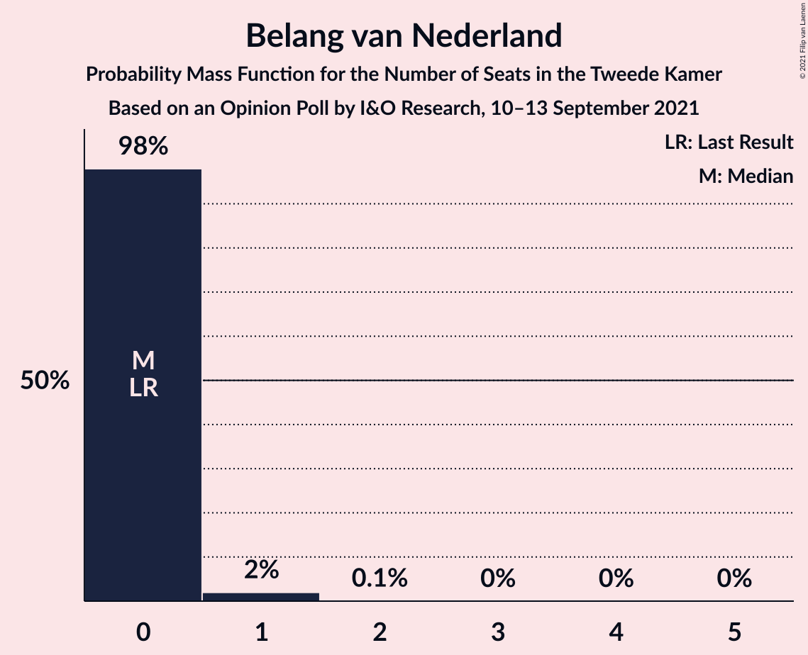

# Opinion Poll by I&O Research, 10–13 September 2021

<a href="#voting-intentions">Voting Intentions</a> | <a href="#seats">Seats</a> | <a href="#coalitions">Coalitions</a> | <a href="#technical-information">Technical Information</a>

## Voting Intentions

### Confidence Intervals

| Party | Last Result | Poll Result | 80% Confidence Interval | 90% Confidence Interval | 95% Confidence Interval | 99% Confidence Interval |
|:-----:|:-----------:|:-----------:|:-----------------------:|:-----------------------:|:-----------------------:|:-----------------------:|
| Volkspartij voor Vrijheid en Democratie | 21.9% | 20.4% | 19.4–21.6% |19.1–21.9% |18.8–22.2% |18.3–22.7% |
| Democraten 66 | 15.0% | 11.8% | 11.0–12.8% |10.7–13.0% |10.5–13.2% |10.2–13.7% |
| Partij voor de Vrijheid | 10.8% | 10.3% | 9.5–11.2% |9.3–11.5% |9.1–11.7% |8.8–12.1% |
| Partij van de Arbeid | 5.7% | 7.7% | 7.0–8.5% |6.8–8.7% |6.7–8.9% |6.3–9.3% |
| GroenLinks | 5.2% | 6.8% | 6.1–7.5% |6.0–7.7% |5.8–7.9% |5.5–8.3% |
| Socialistische Partij | 6.0% | 6.1% | 5.5–6.8% |5.3–7.0% |5.2–7.2% |4.9–7.6% |
| Partij voor de Dieren | 3.8% | 5.2% | 4.6–5.9% |4.5–6.1% |4.4–6.2% |4.1–6.6% |
| ChristenUnie | 3.4% | 4.8% | 4.3–5.4% |4.1–5.6% |4.0–5.8% |3.7–6.1% |
| Christen-Democratisch Appèl | 9.5% | 4.7% | 4.2–5.3% |4.0–5.5% |3.9–5.7% |3.7–6.0% |
| BoerBurgerBeweging | 1.0% | 4.3% | 3.8–4.9% |3.6–5.1% |3.5–5.2% |3.3–5.5% |
| Volt Europa | 2.4% | 3.9% | 3.4–4.5% |3.3–4.6% |3.2–4.8% |2.9–5.1% |
| Juiste Antwoord 2021 | 2.4% | 3.5% | 3.0–4.1% |2.9–4.2% |2.8–4.3% |2.6–4.6% |
| Forum voor Democratie | 5.0% | 3.0% | 2.6–3.5% |2.5–3.7% |2.3–3.8% |2.2–4.1% |
| Staatkundig Gereformeerde Partij | 2.1% | 2.2% | 1.9–2.7% |1.8–2.8% |1.7–2.9% |1.5–3.2% |
| Bij1 | 0.8% | 1.6% | 1.3–2.0% |1.2–2.1% |1.1–2.2% |1.0–2.4% |
| DENK | 2.0% | 1.0% | 0.8–1.3% |0.7–1.4% |0.7–1.5% |0.6–1.7% |
| Belang van Nederland | 0.0% | 0.6% | 0.4–0.9% |0.4–0.9% |0.3–1.0% |0.3–1.2% |
| 50Plus | 1.0% | 0.4% | 0.3–0.7% |0.2–0.7% |0.2–0.8% |0.2–0.9% |

*Note:* The poll result column reflects the actual value used in the calculations. Published results may vary slightly, and in addition be rounded to fewer digits.

## Seats

### Confidence Intervals

| Party | Last Result | Median | 80% Confidence Interval | 90% Confidence Interval | 95% Confidence Interval | 99% Confidence Interval |
|:-----:|:-----------:|:------:|:-----------------------:|:-----------------------:|:-----------------------:|:-----------------------:|
| <a href="#volkspartij-voor-vrijheid-en-democratie">Volkspartij voor Vrijheid en Democratie</a> | 34 | 31 | 31 |31 |31 |29–32 |
| <a href="#democraten-66">Democraten 66</a> | 24 | 22 | 22 |22 |21–22 |16–22 |
| <a href="#partij-voor-de-vrijheid">Partij voor de Vrijheid</a> | 17 | 18 | 18 |18 |17–18 |15–18 |
| <a href="#partij-van-de-arbeid">Partij van de Arbeid</a> | 9 | 11 | 11 |11 |11 |10–12 |
| <a href="#groenlinks">GroenLinks</a> | 8 | 11 | 11 |11 |11 |9–11 |
| <a href="#socialistische-partij">Socialistische Partij</a> | 9 | 8 | 8 |8 |8 |8–10 |
| <a href="#partij-voor-de-dieren">Partij voor de Dieren</a> | 6 | 8 | 8 |8 |8 |8–9 |
| <a href="#christenunie">ChristenUnie</a> | 5 | 7 | 7 |7 |7 |7–9 |
| <a href="#christen-democratisch-appèl">Christen-Democratisch Appèl</a> | 15 | 6 | 6 |6 |6 |6–8 |
| <a href="#boerburgerbeweging">BoerBurgerBeweging</a> | 1 | 6 | 6 |6 |6 |6–7 |
| <a href="#volt-europa">Volt Europa</a> | 3 | 5 | 5 |5 |5 |5–7 |
| <a href="#juiste-antwoord-2021">Juiste Antwoord 2021</a> | 3 | 6 | 6 |6 |6 |5–6 |
| <a href="#forum-voor-democratie">Forum voor Democratie</a> | 8 | 4 | 4 |4 |4 |3–5 |
| <a href="#staatkundig-gereformeerde-partij">Staatkundig Gereformeerde Partij</a> | 3 | 2 | 2 |2 |2 |2–3 |
| <a href="#bij1">Bij1</a> | 1 | 2 | 2 |2 |2 |1–2 |
| <a href="#denk">DENK</a> | 3 | 1 | 1 |1 |1 |1–2 |
| <a href="#belang-van-nederland">Belang van Nederland</a> | 0 | 0 | 0 |0 |0 |0–1 |
| <a href="#50plus">50Plus</a> | 1 | 0 | 0 |0 |0 |0 |

### Volkspartij voor Vrijheid en Democratie

*For a full overview of the results for this party, see the [Volkspartij voor Vrijheid en Democratie](party-volkspartijvoorvrijheidendemocratie.html) page.*

| Number of Seats | Probability | Accumulated | Special Marks |
|:---------------:|:-----------:|:-----------:|:-------------:|
| 28 | 0.4% | 100% |  |
| 29 | 0.2% | 99.6% |  |
| 30 | 0.1% | 99.4% |  |
| 31 | 97% | 99.3% | Median |
| 32 | 2% | 2% |  |
| 33 | 0% | 0.1% |  |
| 34 | 0.1% | 0.1% | Last Result |
| 35 | 0% | 0% |  |

### Democraten 66

*For a full overview of the results for this party, see the [Democraten 66](party-democraten66.html) page.*

| Number of Seats | Probability | Accumulated | Special Marks |
|:---------------:|:-----------:|:-----------:|:-------------:|
| 15 | 0.5% | 100% |  |
| 16 | 0.2% | 99.5% |  |
| 17 | 1.3% | 99.3% |  |
| 18 | 0.4% | 98% |  |
| 19 | 0% | 98% |  |
| 20 | 0% | 98% |  |
| 21 | 0.3% | 98% |  |
| 22 | 97% | 97% | Median |
| 23 | 0% | 0% |  |
| 24 | 0% | 0% | Last Result |

### Partij voor de Vrijheid

*For a full overview of the results for this party, see the [Partij voor de Vrijheid](party-partijvoordevrijheid.html) page.*

| Number of Seats | Probability | Accumulated | Special Marks |
|:---------------:|:-----------:|:-----------:|:-------------:|
| 14 | 0.3% | 100% |  |
| 15 | 0.4% | 99.7% |  |
| 16 | 0.5% | 99.3% |  |
| 17 | 1.5% | 98.8% | Last Result |
| 18 | 97% | 97% | Median |
| 19 | 0.1% | 0.1% |  |
| 20 | 0% | 0% |  |

### Partij van de Arbeid

*For a full overview of the results for this party, see the [Partij van de Arbeid](party-partijvandearbeid.html) page.*

| Number of Seats | Probability | Accumulated | Special Marks |
|:---------------:|:-----------:|:-----------:|:-------------:|
| 9 | 0.1% | 100% | Last Result |
| 10 | 0.5% | 99.9% |  |
| 11 | 98.7% | 99.4% | Median |
| 12 | 0.6% | 0.7% |  |
| 13 | 0% | 0.1% |  |
| 14 | 0.1% | 0.1% |  |
| 15 | 0% | 0% |  |

### GroenLinks

*For a full overview of the results for this party, see the [GroenLinks](party-groenlinks.html) page.*

| Number of Seats | Probability | Accumulated | Special Marks |
|:---------------:|:-----------:|:-----------:|:-------------:|
| 8 | 0% | 100% | Last Result |
| 9 | 1.2% | 100% |  |
| 10 | 0.7% | 98.8% |  |
| 11 | 98% | 98% | Median |
| 12 | 0.1% | 0.1% |  |
| 13 | 0.1% | 0.1% |  |
| 14 | 0% | 0% |  |

### Socialistische Partij

*For a full overview of the results for this party, see the [Socialistische Partij](party-socialistischepartij.html) page.*

| Number of Seats | Probability | Accumulated | Special Marks |
|:---------------:|:-----------:|:-----------:|:-------------:|
| 8 | 99.2% | 100% | Median |
| 9 | 0.1% | 0.8% | Last Result |
| 10 | 0.6% | 0.6% |  |
| 11 | 0% | 0% |  |

### Partij voor de Dieren

*For a full overview of the results for this party, see the [Partij voor de Dieren](party-partijvoordedieren.html) page.*

| Number of Seats | Probability | Accumulated | Special Marks |
|:---------------:|:-----------:|:-----------:|:-------------:|
| 6 | 0% | 100% | Last Result |
| 7 | 0.3% | 100% |  |
| 8 | 98% | 99.7% | Median |
| 9 | 2% | 2% |  |
| 10 | 0.3% | 0.3% |  |
| 11 | 0% | 0% |  |

### ChristenUnie

*For a full overview of the results for this party, see the [ChristenUnie](party-christenunie.html) page.*

| Number of Seats | Probability | Accumulated | Special Marks |
|:---------------:|:-----------:|:-----------:|:-------------:|
| 5 | 0% | 100% | Last Result |
| 6 | 0% | 100% |  |
| 7 | 98% | 100% | Median |
| 8 | 1.0% | 2% |  |
| 9 | 1.3% | 1.3% |  |
| 10 | 0% | 0% |  |

### Christen-Democratisch Appèl

*For a full overview of the results for this party, see the [Christen-Democratisch Appèl](party-christen-democratischappèl.html) page.*

| Number of Seats | Probability | Accumulated | Special Marks |
|:---------------:|:-----------:|:-----------:|:-------------:|
| 5 | 0.2% | 100% |  |
| 6 | 97% | 99.8% | Median |
| 7 | 0.8% | 2% |  |
| 8 | 2% | 2% |  |
| 9 | 0.1% | 0.1% |  |
| 10 | 0% | 0% |  |
| 11 | 0% | 0% |  |
| 12 | 0% | 0% |  |
| 13 | 0% | 0% |  |
| 14 | 0% | 0% |  |
| 15 | 0% | 0% | Last Result |

### BoerBurgerBeweging

*For a full overview of the results for this party, see the [BoerBurgerBeweging](party-boerburgerbeweging.html) page.*

| Number of Seats | Probability | Accumulated | Special Marks |
|:---------------:|:-----------:|:-----------:|:-------------:|
| 1 | 0% | 100% | Last Result |
| 2 | 0% | 100% |  |
| 3 | 0% | 100% |  |
| 4 | 0% | 100% |  |
| 5 | 0.1% | 100% |  |
| 6 | 99.0% | 99.9% | Median |
| 7 | 0.6% | 0.9% |  |
| 8 | 0% | 0.3% |  |
| 9 | 0.2% | 0.2% |  |
| 10 | 0% | 0% |  |

### Volt Europa

*For a full overview of the results for this party, see the [Volt Europa](party-volteuropa.html) page.*

| Number of Seats | Probability | Accumulated | Special Marks |
|:---------------:|:-----------:|:-----------:|:-------------:|
| 3 | 0% | 100% | Last Result |
| 4 | 0% | 100% |  |
| 5 | 98% | 100% | Median |
| 6 | 1.4% | 2% |  |
| 7 | 0.7% | 1.0% |  |
| 8 | 0.3% | 0.3% |  |
| 9 | 0% | 0% |  |

### Juiste Antwoord 2021

*For a full overview of the results for this party, see the [Juiste Antwoord 2021](party-juisteantwoord2021.html) page.*

| Number of Seats | Probability | Accumulated | Special Marks |
|:---------------:|:-----------:|:-----------:|:-------------:|
| 3 | 0% | 100% | Last Result |
| 4 | 0.4% | 100% |  |
| 5 | 2% | 99.6% |  |
| 6 | 98% | 98% | Median |
| 7 | 0.3% | 0.3% |  |
| 8 | 0% | 0% |  |

### Forum voor Democratie

*For a full overview of the results for this party, see the [Forum voor Democratie](party-forumvoordemocratie.html) page.*

| Number of Seats | Probability | Accumulated | Special Marks |
|:---------------:|:-----------:|:-----------:|:-------------:|
| 3 | 2% | 100% |  |
| 4 | 98% | 98% | Median |
| 5 | 0.4% | 0.8% |  |
| 6 | 0.4% | 0.4% |  |
| 7 | 0% | 0% |  |
| 8 | 0% | 0% | Last Result |

### Staatkundig Gereformeerde Partij

*For a full overview of the results for this party, see the [Staatkundig Gereformeerde Partij](party-staatkundiggereformeerdepartij.html) page.*

| Number of Seats | Probability | Accumulated | Special Marks |
|:---------------:|:-----------:|:-----------:|:-------------:|
| 2 | 98% | 100% | Median |
| 3 | 2% | 2% | Last Result |
| 4 | 0.2% | 0.3% |  |
| 5 | 0.1% | 0.1% |  |
| 6 | 0% | 0% |  |

### Bij1

*For a full overview of the results for this party, see the [Bij1](party-bij1.html) page.*

| Number of Seats | Probability | Accumulated | Special Marks |
|:---------------:|:-----------:|:-----------:|:-------------:|
| 1 | 2% | 100% | Last Result |
| 2 | 97% | 98% | Median |
| 3 | 0.5% | 0.5% |  |
| 4 | 0% | 0% |  |

### DENK

*For a full overview of the results for this party, see the [DENK](party-denk.html) page.*

| Number of Seats | Probability | Accumulated | Special Marks |
|:---------------:|:-----------:|:-----------:|:-------------:|
| 0 | 0.1% | 100% |  |
| 1 | 98% | 99.9% | Median |
| 2 | 2% | 2% |  |
| 3 | 0% | 0% | Last Result |

### Belang van Nederland

*For a full overview of the results for this party, see the [Belang van Nederland](party-belangvannederland.html) page.*

| Number of Seats | Probability | Accumulated | Special Marks |
|:---------------:|:-----------:|:-----------:|:-------------:|
| 0 | 98% | 100% | Last Result, Median |
| 1 | 2% | 2% |  |
| 2 | 0.1% | 0.1% |  |
| 3 | 0% | 0% |  |

### 50Plus

*For a full overview of the results for this party, see the [50Plus](party-50plus.html) page.*

| Number of Seats | Probability | Accumulated | Special Marks |
|:---------------:|:-----------:|:-----------:|:-------------:|
| 0 | 99.6% | 100% | Median |
| 1 | 0.4% | 0.4% | Last Result |
| 2 | 0% | 0% |  |

## Coalitions

### Confidence Intervals

| Coalition | Last Result | Median | Majority? | 80% Confidence Interval | 90% Confidence Interval | 95% Confidence Interval | 99% Confidence Interval |
|:---------:|:-----------:|:------:|:---------:|:-----------------------:|:-----------------------:|:-----------------------:|:-----------------------:|
| Volkspartij voor Vrijheid en Democratie – Democraten 66 – GroenLinks – ChristenUnie – Christen-Democratisch Appèl | 86 | 77 | 98% | 77 | 77 | 77 | 71–77 |
| Volkspartij voor Vrijheid en Democratie – Democraten 66 – Partij van de Arbeid – ChristenUnie – Christen-Democratisch Appèl | 87 | 77 | 98.8% | 77 | 77 | 77 | 72–77 |
| Volkspartij voor Vrijheid en Democratie – Democraten 66 – ChristenUnie – Christen-Democratisch Appèl | 78 | 66 | 0% | 66 | 66 | 66 | 61–66 |
| Democraten 66 – Partij van de Arbeid – GroenLinks – Socialistische Partij – ChristenUnie – Christen-Democratisch Appèl | 70 | 65 | 0% | 65 | 65 | 65 | 60–65 |
| Volkspartij voor Vrijheid en Democratie – Democraten 66 – Partij van de Arbeid | 67 | 64 | 0% | 64 | 64 | 64 | 57–64 |
| Volkspartij voor Vrijheid en Democratie – Partij voor de Vrijheid – Christen-Democratisch Appèl – Forum voor Democratie – Staatkundig Gereformeerde Partij | 77 | 61 | 0% | 61 | 61 | 61 | 60–63 |
| Volkspartij voor Vrijheid en Democratie – Democraten 66 – Christen-Democratisch Appèl | 73 | 59 | 0% | 59 | 59 | 59 | 53–59 |
| Volkspartij voor Vrijheid en Democratie – Partij voor de Vrijheid – Christen-Democratisch Appèl – Forum voor Democratie | 74 | 59 | 0% | 59 | 59 | 59 | 56–60 |
| Democraten 66 – Partij van de Arbeid – GroenLinks – ChristenUnie – Christen-Democratisch Appèl | 61 | 57 | 0% | 57 | 57 | 57 | 51–57 |
| Volkspartij voor Vrijheid en Democratie – Partij voor de Vrijheid – Christen-Democratisch Appèl | 66 | 55 | 0% | 55 | 55 | 55 | 51–57 |
| Volkspartij voor Vrijheid en Democratie – Partij van de Arbeid – Christen-Democratisch Appèl | 58 | 48 | 0% | 48 | 48 | 48 | 47–51 |
| Volkspartij voor Vrijheid en Democratie – Christen-Democratisch Appèl – Forum voor Democratie – Staatkundig Gereformeerde Partij – 50Plus | 61 | 43 | 0% | 43 | 43 | 43 | 43–47 |
| Volkspartij voor Vrijheid en Democratie – Christen-Democratisch Appèl – Forum voor Democratie – Staatkundig Gereformeerde Partij | 60 | 43 | 0% | 43 | 43 | 43 | 43–47 |
| Volkspartij voor Vrijheid en Democratie – Partij van de Arbeid | 43 | 42 | 0% | 42 | 42 | 42 | 40–43 |
| Volkspartij voor Vrijheid en Democratie – Christen-Democratisch Appèl – Forum voor Democratie – 50Plus | 58 | 41 | 0% | 41 | 41 | 41 | 39–44 |
| Volkspartij voor Vrijheid en Democratie – Christen-Democratisch Appèl – Forum voor Democratie | 57 | 41 | 0% | 41 | 41 | 41 | 39–44 |
| Democraten 66 – Partij van de Arbeid – Christen-Democratisch Appèl | 48 | 39 | 0% | 39 | 39 | 39 | 32–39 |
| Volkspartij voor Vrijheid en Democratie – Christen-Democratisch Appèl | 49 | 37 | 0% | 37 | 37 | 37 | 35–40 |
| Democraten 66 – Christen-Democratisch Appèl | 39 | 28 | 0% | 28 | 28 | 28 | 22–28 |
| Partij van de Arbeid – ChristenUnie – Christen-Democratisch Appèl | 29 | 24 | 0% | 24 | 24 | 24 | 24–28 |
| Partij van de Arbeid – Christen-Democratisch Appèl | 24 | 17 | 0% | 17 | 17 | 17 | 17–19 |

### Volkspartij voor Vrijheid en Democratie – Democraten 66 – GroenLinks – ChristenUnie – Christen-Democratisch Appèl

| Number of Seats | Probability | Accumulated | Special Marks |
|:---------------:|:-----------:|:-----------:|:-------------:|
| 68 | 0.2% | 100% |  |
| 69 | 0% | 99.8% |  |
| 70 | 0% | 99.8% |  |
| 71 | 0.3% | 99.8% |  |
| 72 | 0.1% | 99.5% |  |
| 73 | 0.4% | 99.4% |  |
| 74 | 0.1% | 99.0% |  |
| 75 | 1.2% | 98.9% |  |
| 76 | 0.1% | 98% | Majority |
| 77 | 97% | 98% | Median |
| 78 | 0% | 0.3% |  |
| 79 | 0.3% | 0.3% |  |
| 80 | 0% | 0% |  |
| 81 | 0% | 0% |  |
| 82 | 0% | 0% |  |
| 83 | 0% | 0% |  |
| 84 | 0% | 0% |  |
| 85 | 0% | 0% |  |
| 86 | 0% | 0% | Last Result |

### Volkspartij voor Vrijheid en Democratie – Democraten 66 – Partij van de Arbeid – ChristenUnie – Christen-Democratisch Appèl

| Number of Seats | Probability | Accumulated | Special Marks |
|:---------------:|:-----------:|:-----------:|:-------------:|
| 68 | 0.2% | 100% |  |
| 69 | 0% | 99.8% |  |
| 70 | 0% | 99.8% |  |
| 71 | 0% | 99.8% |  |
| 72 | 0.5% | 99.8% |  |
| 73 | 0.3% | 99.3% |  |
| 74 | 0% | 98.9% |  |
| 75 | 0.1% | 98.9% |  |
| 76 | 0% | 98.8% | Majority |
| 77 | 98% | 98.8% | Median |
| 78 | 0% | 0.3% |  |
| 79 | 0% | 0.3% |  |
| 80 | 0% | 0.3% |  |
| 81 | 0.3% | 0.3% |  |
| 82 | 0% | 0% |  |
| 83 | 0% | 0% |  |
| 84 | 0% | 0% |  |
| 85 | 0% | 0% |  |
| 86 | 0% | 0% |  |
| 87 | 0% | 0% | Last Result |

### Volkspartij voor Vrijheid en Democratie – Democraten 66 – ChristenUnie – Christen-Democratisch Appèl

| Number of Seats | Probability | Accumulated | Special Marks |
|:---------------:|:-----------:|:-----------:|:-------------:|
| 57 | 0.2% | 100% |  |
| 58 | 0% | 99.8% |  |
| 59 | 0.1% | 99.8% |  |
| 60 | 0% | 99.7% |  |
| 61 | 0.3% | 99.7% |  |
| 62 | 0.5% | 99.4% |  |
| 63 | 0% | 98.9% |  |
| 64 | 0% | 98.9% |  |
| 65 | 0% | 98.9% |  |
| 66 | 98.5% | 98.9% | Median |
| 67 | 0% | 0.3% |  |
| 68 | 0% | 0.3% |  |
| 69 | 0.3% | 0.3% |  |
| 70 | 0% | 0% |  |
| 71 | 0% | 0% |  |
| 72 | 0% | 0% |  |
| 73 | 0% | 0% |  |
| 74 | 0% | 0% |  |
| 75 | 0% | 0% |  |
| 76 | 0% | 0% | Majority |
| 77 | 0% | 0% |  |
| 78 | 0% | 0% | Last Result |

### Democraten 66 – Partij van de Arbeid – GroenLinks – Socialistische Partij – ChristenUnie – Christen-Democratisch Appèl

| Number of Seats | Probability | Accumulated | Special Marks |
|:---------------:|:-----------:|:-----------:|:-------------:|
| 59 | 0.4% | 100% |  |
| 60 | 0.3% | 99.6% |  |
| 61 | 0% | 99.3% |  |
| 62 | 1.2% | 99.3% |  |
| 63 | 0% | 98% |  |
| 64 | 0% | 98% |  |
| 65 | 98% | 98% | Median |
| 66 | 0.1% | 0.4% |  |
| 67 | 0.3% | 0.3% |  |
| 68 | 0% | 0% |  |
| 69 | 0% | 0% |  |
| 70 | 0% | 0% | Last Result |

### Volkspartij voor Vrijheid en Democratie – Democraten 66 – Partij van de Arbeid

| Number of Seats | Probability | Accumulated | Special Marks |
|:---------------:|:-----------:|:-----------:|:-------------:|
| 56 | 0.3% | 100% |  |
| 57 | 0.4% | 99.7% |  |
| 58 | 0.3% | 99.3% |  |
| 59 | 0.1% | 99.0% |  |
| 60 | 1.3% | 98.9% |  |
| 61 | 0% | 98% |  |
| 62 | 0% | 98% |  |
| 63 | 0% | 98% |  |
| 64 | 97% | 98% | Median |
| 65 | 0.3% | 0.3% |  |
| 66 | 0% | 0% |  |
| 67 | 0% | 0% | Last Result |

### Volkspartij voor Vrijheid en Democratie – Partij voor de Vrijheid – Christen-Democratisch Appèl – Forum voor Democratie – Staatkundig Gereformeerde Partij

| Number of Seats | Probability | Accumulated | Special Marks |
|:---------------:|:-----------:|:-----------:|:-------------:|
| 56 | 0.3% | 100% |  |
| 57 | 0% | 99.7% |  |
| 58 | 0% | 99.7% |  |
| 59 | 0.1% | 99.7% |  |
| 60 | 0.6% | 99.7% |  |
| 61 | 97% | 99.1% | Median |
| 62 | 0% | 2% |  |
| 63 | 1.2% | 2% |  |
| 64 | 0.4% | 0.5% |  |
| 65 | 0% | 0.1% |  |
| 66 | 0% | 0.1% |  |
| 67 | 0% | 0.1% |  |
| 68 | 0.1% | 0.1% |  |
| 69 | 0% | 0% |  |
| 70 | 0% | 0% |  |
| 71 | 0% | 0% |  |
| 72 | 0% | 0% |  |
| 73 | 0% | 0% |  |
| 74 | 0% | 0% |  |
| 75 | 0% | 0% |  |
| 76 | 0% | 0% | Majority |
| 77 | 0% | 0% | Last Result |

### Volkspartij voor Vrijheid en Democratie – Democraten 66 – Christen-Democratisch Appèl

| Number of Seats | Probability | Accumulated | Special Marks |
|:---------------:|:-----------:|:-----------:|:-------------:|
| 50 | 0.2% | 100% |  |
| 51 | 0% | 99.8% |  |
| 52 | 0.1% | 99.8% |  |
| 53 | 0.3% | 99.7% |  |
| 54 | 0.4% | 99.4% |  |
| 55 | 0.1% | 99.0% |  |
| 56 | 0% | 98.9% |  |
| 57 | 1.3% | 98.9% |  |
| 58 | 0% | 98% |  |
| 59 | 97% | 98% | Median |
| 60 | 0% | 0.3% |  |
| 61 | 0.3% | 0.3% |  |
| 62 | 0% | 0% |  |
| 63 | 0% | 0% |  |
| 64 | 0% | 0% |  |
| 65 | 0% | 0% |  |
| 66 | 0% | 0% |  |
| 67 | 0% | 0% |  |
| 68 | 0% | 0% |  |
| 69 | 0% | 0% |  |
| 70 | 0% | 0% |  |
| 71 | 0% | 0% |  |
| 72 | 0% | 0% |  |
| 73 | 0% | 0% | Last Result |

### Volkspartij voor Vrijheid en Democratie – Partij voor de Vrijheid – Christen-Democratisch Appèl – Forum voor Democratie

| Number of Seats | Probability | Accumulated | Special Marks |
|:---------------:|:-----------:|:-----------:|:-------------:|
| 53 | 0.3% | 100% |  |
| 54 | 0% | 99.7% |  |
| 55 | 0% | 99.7% |  |
| 56 | 0.3% | 99.7% |  |
| 57 | 0% | 99.4% |  |
| 58 | 0.4% | 99.4% |  |
| 59 | 97% | 99.0% | Median |
| 60 | 1.2% | 2% |  |
| 61 | 0.4% | 0.5% |  |
| 62 | 0% | 0.1% |  |
| 63 | 0.1% | 0.1% |  |
| 64 | 0% | 0% |  |
| 65 | 0% | 0% |  |
| 66 | 0% | 0% |  |
| 67 | 0% | 0% |  |
| 68 | 0% | 0% |  |
| 69 | 0% | 0% |  |
| 70 | 0% | 0% |  |
| 71 | 0% | 0% |  |
| 72 | 0% | 0% |  |
| 73 | 0% | 0% |  |
| 74 | 0% | 0% | Last Result |

### Democraten 66 – Partij van de Arbeid – GroenLinks – ChristenUnie – Christen-Democratisch Appèl

| Number of Seats | Probability | Accumulated | Special Marks |
|:---------------:|:-----------:|:-----------:|:-------------:|
| 50 | 0.3% | 100% |  |
| 51 | 0.5% | 99.7% |  |
| 52 | 0% | 99.3% |  |
| 53 | 0% | 99.3% |  |
| 54 | 1.2% | 99.3% |  |
| 55 | 0.3% | 98% |  |
| 56 | 0.1% | 98% |  |
| 57 | 97% | 98% | Median |
| 58 | 0% | 0.3% |  |
| 59 | 0.3% | 0.3% |  |
| 60 | 0% | 0% |  |
| 61 | 0% | 0% | Last Result |

### Volkspartij voor Vrijheid en Democratie – Partij voor de Vrijheid – Christen-Democratisch Appèl

| Number of Seats | Probability | Accumulated | Special Marks |
|:---------------:|:-----------:|:-----------:|:-------------:|
| 50 | 0.3% | 100% |  |
| 51 | 0.2% | 99.7% |  |
| 52 | 0.1% | 99.5% |  |
| 53 | 0.1% | 99.4% |  |
| 54 | 0.3% | 99.3% |  |
| 55 | 98% | 99.0% | Median |
| 56 | 0% | 1.3% |  |
| 57 | 1.2% | 1.3% |  |
| 58 | 0% | 0.1% |  |
| 59 | 0.1% | 0.1% |  |
| 60 | 0% | 0% |  |
| 61 | 0% | 0% |  |
| 62 | 0% | 0% |  |
| 63 | 0% | 0% |  |
| 64 | 0% | 0% |  |
| 65 | 0% | 0% |  |
| 66 | 0% | 0% | Last Result |

### Volkspartij voor Vrijheid en Democratie – Partij van de Arbeid – Christen-Democratisch Appèl

| Number of Seats | Probability | Accumulated | Special Marks |
|:---------------:|:-----------:|:-----------:|:-------------:|
| 45 | 0.2% | 100% |  |
| 46 | 0% | 99.8% |  |
| 47 | 0.4% | 99.8% |  |
| 48 | 97% | 99.4% | Median |
| 49 | 0.5% | 2% |  |
| 50 | 0% | 2% |  |
| 51 | 1.3% | 2% |  |
| 52 | 0.3% | 0.3% |  |
| 53 | 0% | 0% |  |
| 54 | 0% | 0% |  |
| 55 | 0% | 0% |  |
| 56 | 0% | 0% |  |
| 57 | 0% | 0% |  |
| 58 | 0% | 0% | Last Result |

### Volkspartij voor Vrijheid en Democratie – Christen-Democratisch Appèl – Forum voor Democratie – Staatkundig Gereformeerde Partij – 50Plus

| Number of Seats | Probability | Accumulated | Special Marks |
|:---------------:|:-----------:|:-----------:|:-------------:|
| 42 | 0.3% | 100% |  |
| 43 | 97% | 99.7% | Median |
| 44 | 0.1% | 2% |  |
| 45 | 0% | 2% |  |
| 46 | 2% | 2% |  |
| 47 | 0% | 0.5% |  |
| 48 | 0.4% | 0.5% |  |
| 49 | 0.1% | 0.1% |  |
| 50 | 0% | 0% |  |
| 51 | 0% | 0% |  |
| 52 | 0% | 0% |  |
| 53 | 0% | 0% |  |
| 54 | 0% | 0% |  |
| 55 | 0% | 0% |  |
| 56 | 0% | 0% |  |
| 57 | 0% | 0% |  |
| 58 | 0% | 0% |  |
| 59 | 0% | 0% |  |
| 60 | 0% | 0% |  |
| 61 | 0% | 0% | Last Result |

### Volkspartij voor Vrijheid en Democratie – Christen-Democratisch Appèl – Forum voor Democratie – Staatkundig Gereformeerde Partij

| Number of Seats | Probability | Accumulated | Special Marks |
|:---------------:|:-----------:|:-----------:|:-------------:|
| 41 | 0.3% | 100% |  |
| 42 | 0% | 99.7% |  |
| 43 | 97% | 99.7% | Median |
| 44 | 0.1% | 2% |  |
| 45 | 0.1% | 2% |  |
| 46 | 2% | 2% |  |
| 47 | 0% | 0.5% |  |
| 48 | 0.4% | 0.5% |  |
| 49 | 0.1% | 0.1% |  |
| 50 | 0% | 0% |  |
| 51 | 0% | 0% |  |
| 52 | 0% | 0% |  |
| 53 | 0% | 0% |  |
| 54 | 0% | 0% |  |
| 55 | 0% | 0% |  |
| 56 | 0% | 0% |  |
| 57 | 0% | 0% |  |
| 58 | 0% | 0% |  |
| 59 | 0% | 0% |  |
| 60 | 0% | 0% | Last Result |

### Volkspartij voor Vrijheid en Democratie – Partij van de Arbeid

| Number of Seats | Probability | Accumulated | Special Marks |
|:---------------:|:-----------:|:-----------:|:-------------:|
| 38 | 0.1% | 100% |  |
| 39 | 0% | 99.9% |  |
| 40 | 0.5% | 99.9% |  |
| 41 | 0% | 99.4% |  |
| 42 | 98% | 99.4% | Median |
| 43 | 1.3% | 2% | Last Result |
| 44 | 0.4% | 0.4% |  |
| 45 | 0% | 0% |  |

### Volkspartij voor Vrijheid en Democratie – Christen-Democratisch Appèl – Forum voor Democratie – 50Plus

| Number of Seats | Probability | Accumulated | Special Marks |
|:---------------:|:-----------:|:-----------:|:-------------:|
| 39 | 0.5% | 100% |  |
| 40 | 0% | 99.5% |  |
| 41 | 97% | 99.5% | Median |
| 42 | 0% | 2% |  |
| 43 | 1.3% | 2% |  |
| 44 | 0.4% | 0.8% |  |
| 45 | 0.4% | 0.5% |  |
| 46 | 0% | 0% |  |
| 47 | 0% | 0% |  |
| 48 | 0% | 0% |  |
| 49 | 0% | 0% |  |
| 50 | 0% | 0% |  |
| 51 | 0% | 0% |  |
| 52 | 0% | 0% |  |
| 53 | 0% | 0% |  |
| 54 | 0% | 0% |  |
| 55 | 0% | 0% |  |
| 56 | 0% | 0% |  |
| 57 | 0% | 0% |  |
| 58 | 0% | 0% | Last Result |

### Volkspartij voor Vrijheid en Democratie – Christen-Democratisch Appèl – Forum voor Democratie

| Number of Seats | Probability | Accumulated | Special Marks |
|:---------------:|:-----------:|:-----------:|:-------------:|
| 38 | 0.3% | 100% |  |
| 39 | 0.2% | 99.7% |  |
| 40 | 0% | 99.5% |  |
| 41 | 97% | 99.5% | Median |
| 42 | 0.1% | 2% |  |
| 43 | 1.2% | 2% |  |
| 44 | 0.4% | 0.8% |  |
| 45 | 0.4% | 0.4% |  |
| 46 | 0% | 0% |  |
| 47 | 0% | 0% |  |
| 48 | 0% | 0% |  |
| 49 | 0% | 0% |  |
| 50 | 0% | 0% |  |
| 51 | 0% | 0% |  |
| 52 | 0% | 0% |  |
| 53 | 0% | 0% |  |
| 54 | 0% | 0% |  |
| 55 | 0% | 0% |  |
| 56 | 0% | 0% |  |
| 57 | 0% | 0% | Last Result |

### Democraten 66 – Partij van de Arbeid – Christen-Democratisch Appèl

| Number of Seats | Probability | Accumulated | Special Marks |
|:---------------:|:-----------:|:-----------:|:-------------:|
| 32 | 0.7% | 100% |  |
| 33 | 0% | 99.3% |  |
| 34 | 0% | 99.3% |  |
| 35 | 0% | 99.3% |  |
| 36 | 1.3% | 99.3% |  |
| 37 | 0.4% | 98% |  |
| 38 | 0% | 98% |  |
| 39 | 97% | 98% | Median |
| 40 | 0% | 0.3% |  |
| 41 | 0.3% | 0.3% |  |
| 42 | 0% | 0% |  |
| 43 | 0% | 0% |  |
| 44 | 0% | 0% |  |
| 45 | 0% | 0% |  |
| 46 | 0% | 0% |  |
| 47 | 0% | 0% |  |
| 48 | 0% | 0% | Last Result |

### Volkspartij voor Vrijheid en Democratie – Christen-Democratisch Appèl

| Number of Seats | Probability | Accumulated | Special Marks |
|:---------------:|:-----------:|:-----------:|:-------------:|
| 34 | 0.2% | 100% |  |
| 35 | 0.3% | 99.8% |  |
| 36 | 0% | 99.5% |  |
| 37 | 97% | 99.5% | Median |
| 38 | 0% | 2% |  |
| 39 | 0.4% | 2% |  |
| 40 | 2% | 2% |  |
| 41 | 0% | 0% |  |
| 42 | 0% | 0% |  |
| 43 | 0% | 0% |  |
| 44 | 0% | 0% |  |
| 45 | 0% | 0% |  |
| 46 | 0% | 0% |  |
| 47 | 0% | 0% |  |
| 48 | 0% | 0% |  |
| 49 | 0% | 0% | Last Result |

### Democraten 66 – Christen-Democratisch Appèl

| Number of Seats | Probability | Accumulated | Special Marks |
|:---------------:|:-----------:|:-----------:|:-------------:|
| 21 | 0.2% | 100% |  |
| 22 | 0.5% | 99.8% |  |
| 23 | 0.1% | 99.3% |  |
| 24 | 0% | 99.2% |  |
| 25 | 2% | 99.2% |  |
| 26 | 0% | 98% |  |
| 27 | 0.1% | 98% |  |
| 28 | 97% | 98% | Median |
| 29 | 0.3% | 0.3% |  |
| 30 | 0% | 0% |  |
| 31 | 0% | 0% |  |
| 32 | 0% | 0% |  |
| 33 | 0% | 0% |  |
| 34 | 0% | 0% |  |
| 35 | 0% | 0% |  |
| 36 | 0% | 0% |  |
| 37 | 0% | 0% |  |
| 38 | 0% | 0% |  |
| 39 | 0% | 0% | Last Result |

### Partij van de Arbeid – ChristenUnie – Christen-Democratisch Appèl

| Number of Seats | Probability | Accumulated | Special Marks |
|:---------------:|:-----------:|:-----------:|:-------------:|
| 23 | 0.3% | 100% |  |
| 24 | 97% | 99.7% | Median |
| 25 | 0.4% | 2% |  |
| 26 | 0.1% | 2% |  |
| 27 | 0.3% | 2% |  |
| 28 | 2% | 2% |  |
| 29 | 0% | 0% | Last Result |

### Partij van de Arbeid – Christen-Democratisch Appèl

| Number of Seats | Probability | Accumulated | Special Marks |
|:---------------:|:-----------:|:-----------:|:-------------:|
| 15 | 0.1% | 100% |  |
| 16 | 0.2% | 99.9% |  |
| 17 | 98% | 99.7% | Median |
| 18 | 0% | 2% |  |
| 19 | 2% | 2% |  |
| 20 | 0.3% | 0.4% |  |
| 21 | 0.1% | 0.1% |  |
| 22 | 0% | 0% |  |
| 23 | 0% | 0% |  |
| 24 | 0% | 0% | Last Result |

## Technical Information

### Opinion Poll

+ **Polling firm:** I&O Research
+ **Commissioner(s):** —
+ **Fieldwork period:** 10–13 September 2021

### Calculations

+ **Sample size:** 2207
+ **Simulations done:** 65,536
+ **Error estimate:** 4.28%

