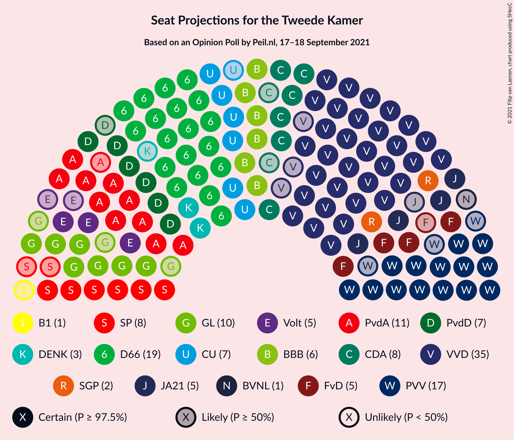
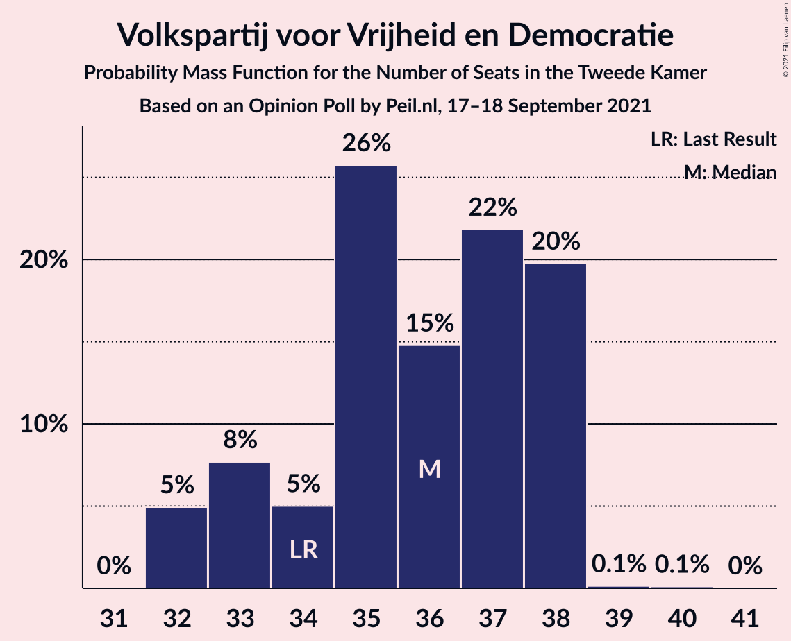
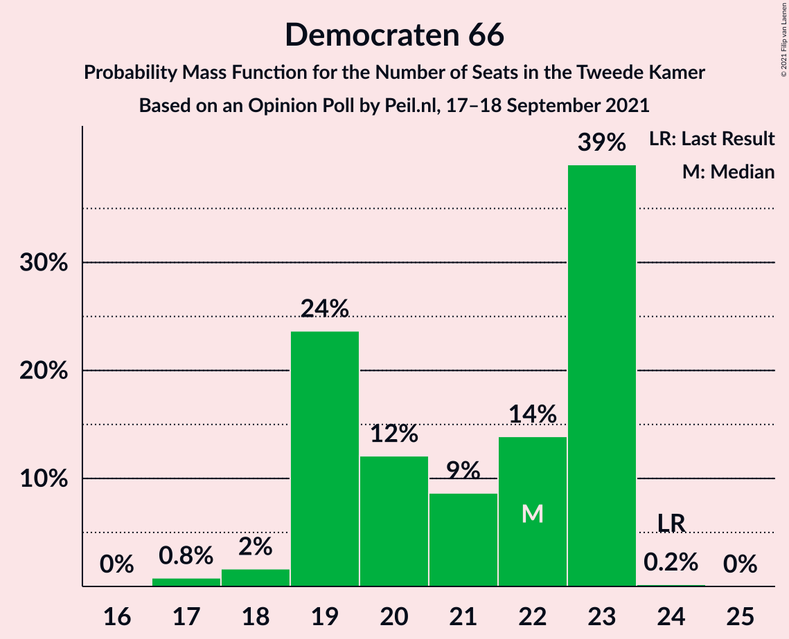
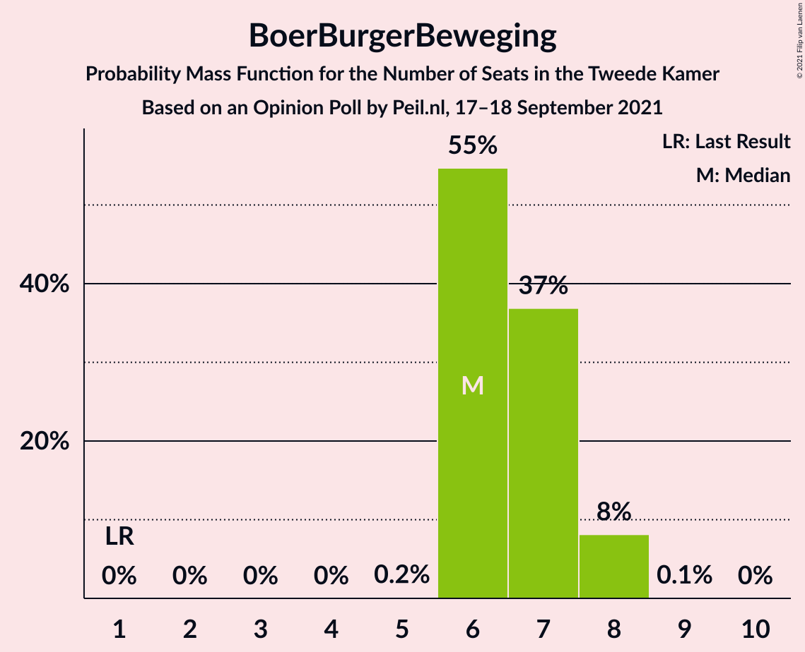
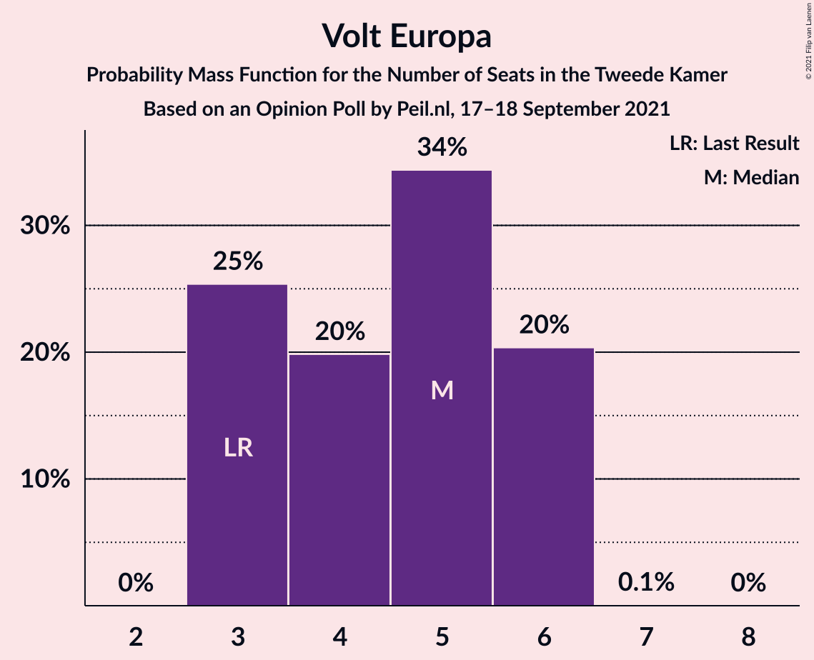
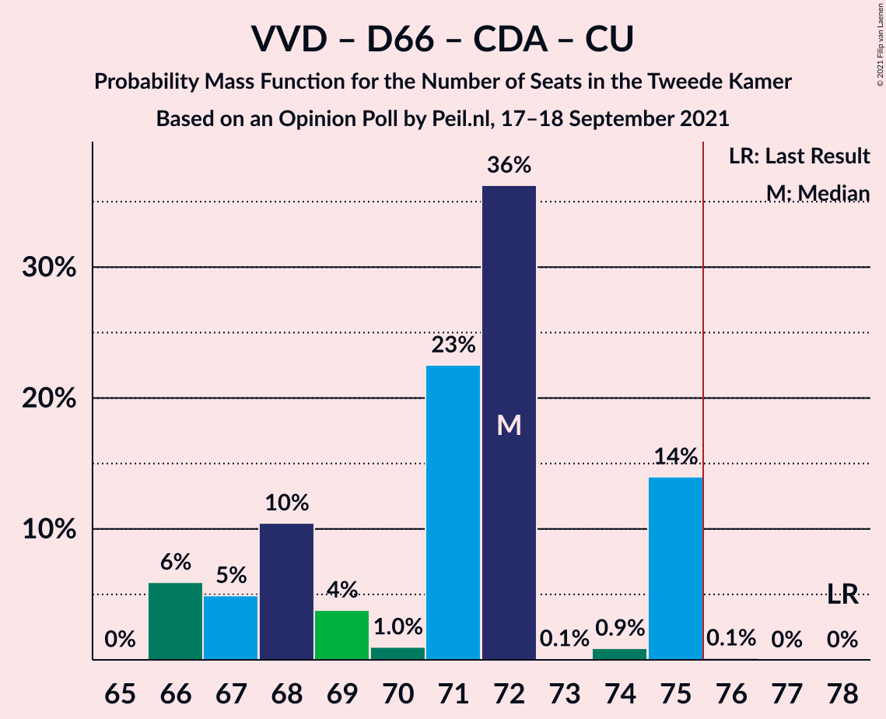
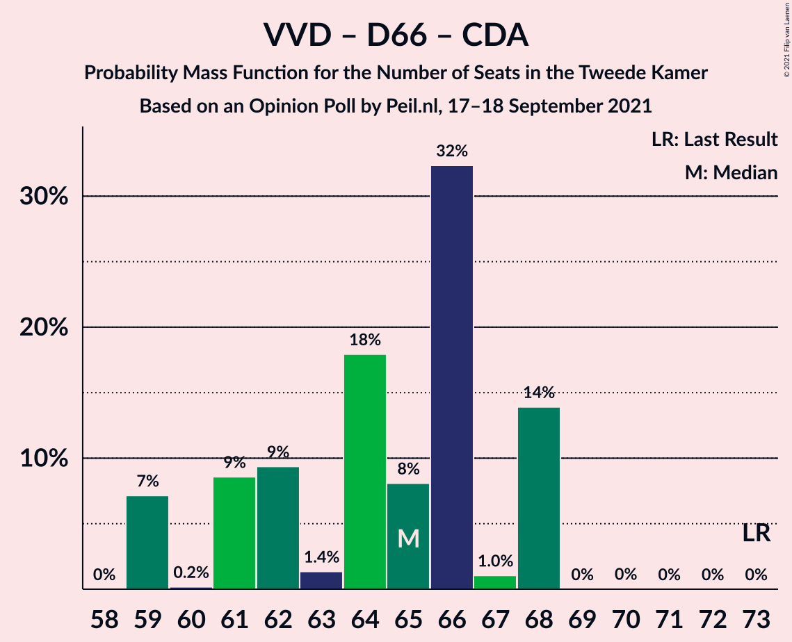
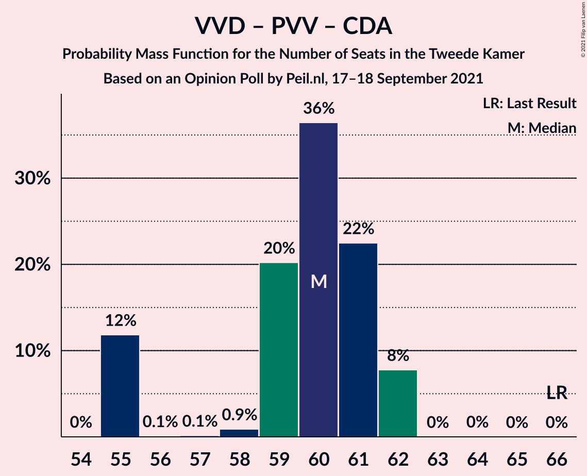
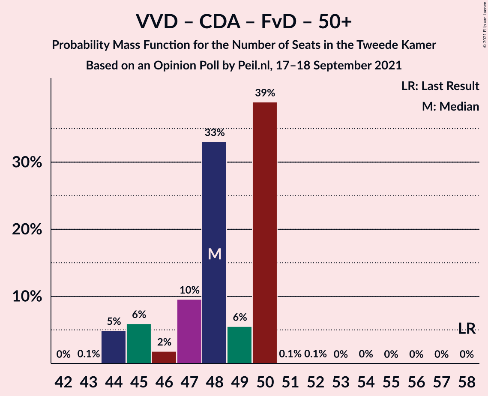

# Opinion Poll by Peil.nl, 17–18 September 2021

<a href="#voting-intentions">Voting Intentions</a> | <a href="#seats">Seats</a> | <a href="#coalitions">Coalitions</a> | <a href="#technical-information">Technical Information</a>

## Voting Intentions

### Confidence Intervals

| Party | Last Result | Poll Result | 80% Confidence Interval | 90% Confidence Interval | 95% Confidence Interval | 99% Confidence Interval |
|:-----:|:-----------:|:-----------:|:-----------------------:|:-----------------------:|:-----------------------:|:-----------------------:|
| Volkspartij voor Vrijheid en Democratie | 21.9% | 23.3% | 22.3–24.3% |22.0–24.6% |21.8–24.8% |21.3–25.3% |
| Democraten 66 | 15.0% | 13.3% | 12.5–14.1% |12.3–14.4% |12.1–14.6% |11.8–15.0% |
| Partij voor de Vrijheid | 10.8% | 10.6% | 9.9–11.4% |9.7–11.6% |9.6–11.8% |9.3–12.2% |
| Partij van de Arbeid | 5.7% | 7.3% | 6.7–8.0% |6.6–8.1% |6.4–8.3% |6.1–8.6% |
| GroenLinks | 5.2% | 6.0% | 5.4–6.6% |5.3–6.7% |5.2–6.9% |4.9–7.2% |
| Socialistische Partij | 6.0% | 5.3% | 4.8–5.9% |4.7–6.0% |4.5–6.2% |4.3–6.4% |
| Christen-Democratisch Appèl | 9.5% | 4.7% | 4.2–5.2% |4.1–5.3% |4.0–5.5% |3.7–5.8% |
| ChristenUnie | 3.4% | 4.7% | 4.2–5.2% |4.1–5.3% |4.0–5.5% |3.7–5.8% |
| Partij voor de Dieren | 3.8% | 4.7% | 4.2–5.2% |4.1–5.3% |4.0–5.5% |3.7–5.8% |
| BoerBurgerBeweging | 1.0% | 4.7% | 4.2–5.2% |4.1–5.3% |4.0–5.5% |3.7–5.8% |
| Forum voor Democratie | 5.0% | 3.3% | 2.9–3.8% |2.8–3.9% |2.7–4.0% |2.6–4.3% |
| Juiste Antwoord 2021 | 2.4% | 3.3% | 2.9–3.8% |2.8–3.9% |2.7–4.0% |2.6–4.3% |
| Volt Europa | 2.4% | 3.3% | 2.9–3.8% |2.8–3.9% |2.7–4.0% |2.6–4.3% |
| Staatkundig Gereformeerde Partij | 2.1% | 2.0% | 1.7–2.4% |1.6–2.5% |1.6–2.6% |1.4–2.8% |
| DENK | 2.0% | 2.0% | 1.7–2.4% |1.6–2.5% |1.6–2.6% |1.4–2.8% |
| Bij1 | 0.8% | 0.7% | 0.5–0.9% |0.5–1.0% |0.4–1.0% |0.4–1.2% |
| Belang van Nederland | 0.0% | 0.7% | 0.5–0.9% |0.5–1.0% |0.4–1.0% |0.4–1.2% |
| 50Plus | 1.0% | 0.2% | 0.1–0.3% |0.1–0.4% |0.1–0.4% |0.0–0.5% |

*Note:* The poll result column reflects the actual value used in the calculations. Published results may vary slightly, and in addition be rounded to fewer digits.

## Seats

### Confidence Intervals

| Party | Last Result | Median | 80% Confidence Interval | 90% Confidence Interval | 95% Confidence Interval | 99% Confidence Interval |
|:-----:|:-----------:|:------:|:-----------------------:|:-----------------------:|:-----------------------:|:-----------------------:|
| <a href="#volkspartij-voor-vrijheid-en-democratie">Volkspartij voor Vrijheid en Democratie</a> | 34 | 36 | 33–38 |33–38 |32–38 |32–38 |
| <a href="#democraten-66">Democraten 66</a> | 24 | 22 | 19–23 |19–23 |19–23 |17–23 |
| <a href="#partij-voor-de-vrijheid">Partij voor de Vrijheid</a> | 17 | 17 | 14–18 |14–18 |14–18 |14–18 |
| <a href="#partij-van-de-arbeid">Partij van de Arbeid</a> | 9 | 11 | 10–13 |10–13 |10–14 |10–14 |
| <a href="#groenlinks">GroenLinks</a> | 8 | 10 | 8–10 |7–11 |7–11 |7–11 |
| <a href="#socialistische-partij">Socialistische Partij</a> | 9 | 8 | 6–9 |6–9 |6–9 |6–9 |
| <a href="#christen-democratisch-appèl">Christen-Democratisch Appèl</a> | 15 | 8 | 6–8 |6–8 |6–8 |5–8 |
| <a href="#christenunie">ChristenUnie</a> | 5 | 7 | 6–7 |6–7 |6–8 |6–9 |
| <a href="#partij-voor-de-dieren">Partij voor de Dieren</a> | 6 | 7 | 6–7 |6–7 |6–7 |6–8 |
| <a href="#boerburgerbeweging">BoerBurgerBeweging</a> | 1 | 6 | 6–7 |6–8 |6–8 |6–8 |
| <a href="#forum-voor-democratie">Forum voor Democratie</a> | 8 | 5 | 5–6 |4–6 |4–6 |4–6 |
| <a href="#juiste-antwoord-2021">Juiste Antwoord 2021</a> | 3 | 5 | 5 |4–6 |4–6 |4–6 |
| <a href="#volt-europa">Volt Europa</a> | 3 | 5 | 3–6 |3–6 |3–6 |3–6 |
| <a href="#staatkundig-gereformeerde-partij">Staatkundig Gereformeerde Partij</a> | 3 | 2 | 2–3 |2–3 |2–3 |1–4 |
| <a href="#denk">DENK</a> | 3 | 3 | 2–3 |2–4 |2–4 |2–4 |
| <a href="#bij1">Bij1</a> | 1 | 1 | 0–1 |0–2 |0–2 |0–2 |
| <a href="#belang-van-nederland">Belang van Nederland</a> | 0 | 1 | 0–1 |0–1 |0–1 |0–1 |
| <a href="#50plus">50Plus</a> | 1 | 0 | 0 |0 |0 |0 |

### Volkspartij voor Vrijheid en Democratie

*For a full overview of the results for this party, see the [Volkspartij voor Vrijheid en Democratie](party-volkspartijvoorvrijheidendemocratie.html) page.*

| Number of Seats | Probability | Accumulated | Special Marks |
|:---------------:|:-----------:|:-----------:|:-------------:|
| 32 | 5% | 100% |  |
| 33 | 8% | 95% |  |
| 34 | 5% | 87% | Last Result |
| 35 | 26% | 82% |  |
| 36 | 15% | 57% | Median |
| 37 | 22% | 42% |  |
| 38 | 20% | 20% |  |
| 39 | 0.1% | 0.3% |  |
| 40 | 0.1% | 0.1% |  |
| 41 | 0% | 0% |  |

### Democraten 66

*For a full overview of the results for this party, see the [Democraten 66](party-democraten66.html) page.*

| Number of Seats | Probability | Accumulated | Special Marks |
|:---------------:|:-----------:|:-----------:|:-------------:|
| 17 | 0.8% | 100% |  |
| 18 | 2% | 99.2% |  |
| 19 | 24% | 98% |  |
| 20 | 12% | 74% |  |
| 21 | 9% | 62% |  |
| 22 | 14% | 53% | Median |
| 23 | 39% | 39% |  |
| 24 | 0.2% | 0.2% | Last Result |
| 25 | 0% | 0% |  |

### Partij voor de Vrijheid

*For a full overview of the results for this party, see the [Partij voor de Vrijheid](party-partijvoordevrijheid.html) page.*

| Number of Seats | Probability | Accumulated | Special Marks |
|:---------------:|:-----------:|:-----------:|:-------------:|
| 14 | 14% | 100% |  |
| 15 | 6% | 86% |  |
| 16 | 27% | 80% |  |
| 17 | 39% | 53% | Last Result, Median |
| 18 | 13% | 13% |  |
| 19 | 0.1% | 0.1% |  |
| 20 | 0% | 0% |  |

### Partij van de Arbeid

*For a full overview of the results for this party, see the [Partij van de Arbeid](party-partijvandearbeid.html) page.*

| Number of Seats | Probability | Accumulated | Special Marks |
|:---------------:|:-----------:|:-----------:|:-------------:|
| 9 | 0.4% | 100% | Last Result |
| 10 | 34% | 99.6% |  |
| 11 | 26% | 66% | Median |
| 12 | 27% | 40% |  |
| 13 | 9% | 12% |  |
| 14 | 4% | 4% |  |
| 15 | 0.2% | 0.2% |  |
| 16 | 0% | 0% |  |

### GroenLinks

*For a full overview of the results for this party, see the [GroenLinks](party-groenlinks.html) page.*

| Number of Seats | Probability | Accumulated | Special Marks |
|:---------------:|:-----------:|:-----------:|:-------------:|
| 7 | 8% | 100% |  |
| 8 | 15% | 92% | Last Result |
| 9 | 6% | 77% |  |
| 10 | 65% | 71% | Median |
| 11 | 6% | 6% |  |
| 12 | 0% | 0% |  |

### Socialistische Partij

*For a full overview of the results for this party, see the [Socialistische Partij](party-socialistischepartij.html) page.*

| Number of Seats | Probability | Accumulated | Special Marks |
|:---------------:|:-----------:|:-----------:|:-------------:|
| 6 | 21% | 100% |  |
| 7 | 26% | 79% |  |
| 8 | 22% | 53% | Median |
| 9 | 31% | 31% | Last Result |
| 10 | 0.2% | 0.4% |  |
| 11 | 0.2% | 0.2% |  |
| 12 | 0% | 0% |  |

### Christen-Democratisch Appèl

*For a full overview of the results for this party, see the [Christen-Democratisch Appèl](party-christen-democratischappèl.html) page.*

| Number of Seats | Probability | Accumulated | Special Marks |
|:---------------:|:-----------:|:-----------:|:-------------:|
| 5 | 0.6% | 100% |  |
| 6 | 16% | 99.4% |  |
| 7 | 26% | 83% |  |
| 8 | 57% | 57% | Median |
| 9 | 0.5% | 0.5% |  |
| 10 | 0% | 0% |  |
| 11 | 0% | 0% |  |
| 12 | 0% | 0% |  |
| 13 | 0% | 0% |  |
| 14 | 0% | 0% |  |
| 15 | 0% | 0% | Last Result |

### ChristenUnie

*For a full overview of the results for this party, see the [ChristenUnie](party-christenunie.html) page.*

| Number of Seats | Probability | Accumulated | Special Marks |
|:---------------:|:-----------:|:-----------:|:-------------:|
| 5 | 0.1% | 100% | Last Result |
| 6 | 46% | 99.9% |  |
| 7 | 51% | 54% | Median |
| 8 | 2% | 3% |  |
| 9 | 0.6% | 0.6% |  |
| 10 | 0% | 0% |  |

### Partij voor de Dieren

*For a full overview of the results for this party, see the [Partij voor de Dieren](party-partijvoordedieren.html) page.*

| Number of Seats | Probability | Accumulated | Special Marks |
|:---------------:|:-----------:|:-----------:|:-------------:|
| 6 | 36% | 100% | Last Result |
| 7 | 62% | 64% | Median |
| 8 | 2% | 2% |  |
| 9 | 0.1% | 0.1% |  |
| 10 | 0% | 0% |  |

### BoerBurgerBeweging

*For a full overview of the results for this party, see the [BoerBurgerBeweging](party-boerburgerbeweging.html) page.*

| Number of Seats | Probability | Accumulated | Special Marks |
|:---------------:|:-----------:|:-----------:|:-------------:|
| 1 | 0% | 100% | Last Result |
| 2 | 0% | 100% |  |
| 3 | 0% | 100% |  |
| 4 | 0% | 100% |  |
| 5 | 0.2% | 100% |  |
| 6 | 55% | 99.8% | Median |
| 7 | 37% | 45% |  |
| 8 | 8% | 8% |  |
| 9 | 0.1% | 0.1% |  |
| 10 | 0% | 0% |  |

### Forum voor Democratie

*For a full overview of the results for this party, see the [Forum voor Democratie](party-forumvoordemocratie.html) page.*

| Number of Seats | Probability | Accumulated | Special Marks |
|:---------------:|:-----------:|:-----------:|:-------------:|
| 3 | 0.1% | 100% |  |
| 4 | 7% | 99.9% |  |
| 5 | 78% | 93% | Median |
| 6 | 15% | 16% |  |
| 7 | 0.3% | 0.3% |  |
| 8 | 0% | 0% | Last Result |

### Juiste Antwoord 2021

*For a full overview of the results for this party, see the [Juiste Antwoord 2021](party-juisteantwoord2021.html) page.*

| Number of Seats | Probability | Accumulated | Special Marks |
|:---------------:|:-----------:|:-----------:|:-------------:|
| 3 | 0.2% | 100% | Last Result |
| 4 | 7% | 99.8% |  |
| 5 | 84% | 92% | Median |
| 6 | 9% | 9% |  |
| 7 | 0% | 0% |  |

### Volt Europa

*For a full overview of the results for this party, see the [Volt Europa](party-volteuropa.html) page.*

| Number of Seats | Probability | Accumulated | Special Marks |
|:---------------:|:-----------:|:-----------:|:-------------:|
| 3 | 25% | 100% | Last Result |
| 4 | 20% | 75% |  |
| 5 | 34% | 55% | Median |
| 6 | 20% | 20% |  |
| 7 | 0.1% | 0.1% |  |
| 8 | 0% | 0% |  |

### Staatkundig Gereformeerde Partij

*For a full overview of the results for this party, see the [Staatkundig Gereformeerde Partij](party-staatkundiggereformeerdepartij.html) page.*

| Number of Seats | Probability | Accumulated | Special Marks |
|:---------------:|:-----------:|:-----------:|:-------------:|
| 1 | 1.0% | 100% |  |
| 2 | 74% | 99.0% | Median |
| 3 | 25% | 25% | Last Result |
| 4 | 0.6% | 0.9% |  |
| 5 | 0.2% | 0.2% |  |
| 6 | 0% | 0% |  |

### DENK

*For a full overview of the results for this party, see the [DENK](party-denk.html) page.*

| Number of Seats | Probability | Accumulated | Special Marks |
|:---------------:|:-----------:|:-----------:|:-------------:|
| 1 | 0.1% | 100% |  |
| 2 | 32% | 99.9% |  |
| 3 | 61% | 68% | Last Result, Median |
| 4 | 7% | 7% |  |
| 5 | 0.3% | 0.3% |  |
| 6 | 0% | 0% |  |

### Bij1

*For a full overview of the results for this party, see the [Bij1](party-bij1.html) page.*

| Number of Seats | Probability | Accumulated | Special Marks |
|:---------------:|:-----------:|:-----------:|:-------------:|
| 0 | 34% | 100% |  |
| 1 | 60% | 66% | Last Result, Median |
| 2 | 6% | 6% |  |
| 3 | 0% | 0% |  |

### Belang van Nederland

*For a full overview of the results for this party, see the [Belang van Nederland](party-belangvannederland.html) page.*

| Number of Seats | Probability | Accumulated | Special Marks |
|:---------------:|:-----------:|:-----------:|:-------------:|
| 0 | 21% | 100% | Last Result |
| 1 | 79% | 79% | Median |
| 2 | 0.1% | 0.1% |  |
| 3 | 0% | 0% |  |

### 50Plus

*For a full overview of the results for this party, see the [50Plus](party-50plus.html) page.*

| Number of Seats | Probability | Accumulated | Special Marks |
|:---------------:|:-----------:|:-----------:|:-------------:|
| 0 | 100% | 100% | Median |
| 1 | 0% | 0% | Last Result |

## Coalitions

### Confidence Intervals

| Coalition | Last Result | Median | Majority? | 80% Confidence Interval | 90% Confidence Interval | 95% Confidence Interval | 99% Confidence Interval |
|:---------:|:-----------:|:------:|:---------:|:-----------------------:|:-----------------------:|:-----------------------:|:-----------------------:|
| Volkspartij voor Vrijheid en Democratie – Democraten 66 – Partij van de Arbeid – Christen-Democratisch Appèl – ChristenUnie | 87 | 82 | 100% | 80–86 | 77–86 | 77–86 | 77–86 |
| Volkspartij voor Vrijheid en Democratie – Democraten 66 – GroenLinks – Christen-Democratisch Appèl – ChristenUnie | 86 | 81 | 99.9% | 77–85 | 76–85 | 76–85 | 76–85 |
| Volkspartij voor Vrijheid en Democratie – Democraten 66 – Christen-Democratisch Appèl – ChristenUnie | 78 | 72 | 0.1% | 67–75 | 66–75 | 66–75 | 66–75 |
| Volkspartij voor Vrijheid en Democratie – Democraten 66 – Partij van de Arbeid | 67 | 68 | 0% | 65–71 | 64–71 | 64–71 | 63–71 |
| Volkspartij voor Vrijheid en Democratie – Partij voor de Vrijheid – Christen-Democratisch Appèl – Forum voor Democratie – Staatkundig Gereformeerde Partij | 77 | 67 | 0% | 63–69 | 63–71 | 61–71 | 61–71 |
| Volkspartij voor Vrijheid en Democratie – Democraten 66 – Christen-Democratisch Appèl | 73 | 65 | 0% | 61–68 | 59–68 | 59–68 | 59–68 |
| Volkspartij voor Vrijheid en Democratie – Partij voor de Vrijheid – Christen-Democratisch Appèl – Forum voor Democratie | 74 | 65 | 0% | 61–66 | 61–68 | 59–68 | 59–68 |
| Democraten 66 – Partij van de Arbeid – GroenLinks – Socialistische Partij – Christen-Democratisch Appèl – ChristenUnie | 70 | 63 | 0% | 61–66 | 61–66 | 61–67 | 59–67 |
| Volkspartij voor Vrijheid en Democratie – Partij voor de Vrijheid – Christen-Democratisch Appèl | 66 | 60 | 0% | 55–61 | 55–62 | 55–62 | 55–62 |
| Democraten 66 – Partij van de Arbeid – GroenLinks – Christen-Democratisch Appèl – ChristenUnie | 61 | 55 | 0% | 54–59 | 53–59 | 53–59 | 51–59 |
| Volkspartij voor Vrijheid en Democratie – Partij van de Arbeid – Christen-Democratisch Appèl | 58 | 55 | 0% | 52–57 | 50–57 | 50–57 | 50–57 |
| Volkspartij voor Vrijheid en Democratie – Christen-Democratisch Appèl – Forum voor Democratie – Staatkundig Gereformeerde Partij – 50Plus | 61 | 51 | 0% | 47–52 | 47–53 | 46–53 | 46–53 |
| Volkspartij voor Vrijheid en Democratie – Christen-Democratisch Appèl – Forum voor Democratie – Staatkundig Gereformeerde Partij | 60 | 51 | 0% | 47–52 | 47–53 | 46–53 | 46–53 |
| Volkspartij voor Vrijheid en Democratie – Christen-Democratisch Appèl – Forum voor Democratie – 50Plus | 58 | 48 | 0% | 45–50 | 45–50 | 44–50 | 44–50 |
| Volkspartij voor Vrijheid en Democratie – Christen-Democratisch Appèl – Forum voor Democratie | 57 | 48 | 0% | 45–50 | 45–50 | 44–50 | 44–50 |
| Volkspartij voor Vrijheid en Democratie – Partij van de Arbeid | 43 | 47 | 0% | 44–50 | 44–50 | 44–50 | 43–51 |
| Volkspartij voor Vrijheid en Democratie – Christen-Democratisch Appèl | 49 | 43 | 0% | 40–45 | 39–45 | 39–45 | 39–45 |
| Democraten 66 – Partij van de Arbeid – Christen-Democratisch Appèl | 48 | 40 | 0% | 38–42 | 37–42 | 37–42 | 34–42 |
| Democraten 66 – Christen-Democratisch Appèl | 39 | 29 | 0% | 26–31 | 25–31 | 25–31 | 23–31 |
| Partij van de Arbeid – Christen-Democratisch Appèl – ChristenUnie | 29 | 25 | 0% | 24–27 | 24–27 | 24–27 | 24–29 |
| Partij van de Arbeid – Christen-Democratisch Appèl | 24 | 18 | 0% | 18–20 | 17–20 | 17–21 | 17–21 |

### Volkspartij voor Vrijheid en Democratie – Democraten 66 – Partij van de Arbeid – Christen-Democratisch Appèl – ChristenUnie

| Number of Seats | Probability | Accumulated | Special Marks |
|:---------------:|:-----------:|:-----------:|:-------------:|
| 77 | 6% | 100% |  |
| 78 | 2% | 94% |  |
| 79 | 1.2% | 92% |  |
| 80 | 6% | 91% |  |
| 81 | 9% | 86% |  |
| 82 | 35% | 76% |  |
| 83 | 26% | 42% |  |
| 84 | 0.3% | 16% | Median |
| 85 | 2% | 16% |  |
| 86 | 14% | 14% |  |
| 87 | 0.1% | 0.1% | Last Result |
| 88 | 0% | 0% |  |

### Volkspartij voor Vrijheid en Democratie – Democraten 66 – GroenLinks – Christen-Democratisch Appèl – ChristenUnie

| Number of Seats | Probability | Accumulated | Special Marks |
|:---------------:|:-----------:|:-----------:|:-------------:|
| 75 | 0.1% | 100% |  |
| 76 | 9% | 99.9% | Majority |
| 77 | 8% | 91% |  |
| 78 | 6% | 83% |  |
| 79 | 15% | 77% |  |
| 80 | 4% | 62% |  |
| 81 | 18% | 58% |  |
| 82 | 26% | 40% |  |
| 83 | 0.3% | 14% | Median |
| 84 | 0.1% | 14% |  |
| 85 | 14% | 14% |  |
| 86 | 0.1% | 0.1% | Last Result |
| 87 | 0% | 0% |  |

### Volkspartij voor Vrijheid en Democratie – Democraten 66 – Christen-Democratisch Appèl – ChristenUnie

| Number of Seats | Probability | Accumulated | Special Marks |
|:---------------:|:-----------:|:-----------:|:-------------:|
| 66 | 6% | 100% |  |
| 67 | 5% | 94% |  |
| 68 | 10% | 89% |  |
| 69 | 4% | 79% |  |
| 70 | 1.0% | 75% |  |
| 71 | 23% | 74% |  |
| 72 | 36% | 51% |  |
| 73 | 0.1% | 15% | Median |
| 74 | 0.9% | 15% |  |
| 75 | 14% | 14% |  |
| 76 | 0.1% | 0.1% | Majority |
| 77 | 0% | 0% |  |
| 78 | 0% | 0% | Last Result |

### Volkspartij voor Vrijheid en Democratie – Democraten 66 – Partij van de Arbeid

| Number of Seats | Probability | Accumulated | Special Marks |
|:---------------:|:-----------:|:-----------:|:-------------:|
| 62 | 0.5% | 100% |  |
| 63 | 0.4% | 99.5% |  |
| 64 | 7% | 99.2% |  |
| 65 | 6% | 92% |  |
| 66 | 0.4% | 86% |  |
| 67 | 5% | 86% | Last Result |
| 68 | 35% | 80% |  |
| 69 | 26% | 46% | Median |
| 70 | 0.1% | 20% |  |
| 71 | 20% | 20% |  |
| 72 | 0.2% | 0.5% |  |
| 73 | 0.3% | 0.3% |  |
| 74 | 0% | 0% |  |

### Volkspartij voor Vrijheid en Democratie – Partij voor de Vrijheid – Christen-Democratisch Appèl – Forum voor Democratie – Staatkundig Gereformeerde Partij

| Number of Seats | Probability | Accumulated | Special Marks |
|:---------------:|:-----------:|:-----------:|:-------------:|
| 61 | 5% | 100% |  |
| 62 | 0% | 95% |  |
| 63 | 7% | 95% |  |
| 64 | 0.1% | 88% |  |
| 65 | 0.1% | 88% |  |
| 66 | 19% | 88% |  |
| 67 | 28% | 68% |  |
| 68 | 28% | 40% | Median |
| 69 | 5% | 12% |  |
| 70 | 0.1% | 8% |  |
| 71 | 8% | 8% |  |
| 72 | 0% | 0% |  |
| 73 | 0% | 0% |  |
| 74 | 0% | 0% |  |
| 75 | 0% | 0% |  |
| 76 | 0% | 0% | Majority |
| 77 | 0% | 0% | Last Result |

### Volkspartij voor Vrijheid en Democratie – Democraten 66 – Christen-Democratisch Appèl

| Number of Seats | Probability | Accumulated | Special Marks |
|:---------------:|:-----------:|:-----------:|:-------------:|
| 59 | 7% | 100% |  |
| 60 | 0.2% | 93% |  |
| 61 | 9% | 93% |  |
| 62 | 9% | 84% |  |
| 63 | 1.4% | 75% |  |
| 64 | 18% | 73% |  |
| 65 | 8% | 55% |  |
| 66 | 32% | 47% | Median |
| 67 | 1.0% | 15% |  |
| 68 | 14% | 14% |  |
| 69 | 0% | 0% |  |
| 70 | 0% | 0% |  |
| 71 | 0% | 0% |  |
| 72 | 0% | 0% |  |
| 73 | 0% | 0% | Last Result |

### Volkspartij voor Vrijheid en Democratie – Partij voor de Vrijheid – Christen-Democratisch Appèl – Forum voor Democratie

| Number of Seats | Probability | Accumulated | Special Marks |
|:---------------:|:-----------:|:-----------:|:-------------:|
| 58 | 0.1% | 100% |  |
| 59 | 5% | 99.9% |  |
| 60 | 0% | 95% |  |
| 61 | 7% | 95% |  |
| 62 | 0.2% | 88% |  |
| 63 | 0.8% | 88% |  |
| 64 | 21% | 87% |  |
| 65 | 36% | 66% |  |
| 66 | 23% | 30% | Median |
| 67 | 0.6% | 8% |  |
| 68 | 7% | 7% |  |
| 69 | 0% | 0% |  |
| 70 | 0% | 0% |  |
| 71 | 0% | 0% |  |
| 72 | 0% | 0% |  |
| 73 | 0% | 0% |  |
| 74 | 0% | 0% | Last Result |

### Democraten 66 – Partij van de Arbeid – GroenLinks – Socialistische Partij – Christen-Democratisch Appèl – ChristenUnie

| Number of Seats | Probability | Accumulated | Special Marks |
|:---------------:|:-----------:|:-----------:|:-------------:|
| 59 | 2% | 100% |  |
| 60 | 0.2% | 98% |  |
| 61 | 30% | 98% |  |
| 62 | 17% | 68% |  |
| 63 | 6% | 51% |  |
| 64 | 1.0% | 45% |  |
| 65 | 0.3% | 44% |  |
| 66 | 39% | 44% | Median |
| 67 | 5% | 5% |  |
| 68 | 0% | 0% |  |
| 69 | 0% | 0% |  |
| 70 | 0% | 0% | Last Result |

### Volkspartij voor Vrijheid en Democratie – Partij voor de Vrijheid – Christen-Democratisch Appèl

| Number of Seats | Probability | Accumulated | Special Marks |
|:---------------:|:-----------:|:-----------:|:-------------:|
| 54 | 0% | 100% |  |
| 55 | 12% | 99.9% |  |
| 56 | 0.1% | 88% |  |
| 57 | 0.1% | 88% |  |
| 58 | 0.9% | 88% |  |
| 59 | 20% | 87% |  |
| 60 | 36% | 67% |  |
| 61 | 22% | 30% | Median |
| 62 | 8% | 8% |  |
| 63 | 0% | 0.1% |  |
| 64 | 0% | 0.1% |  |
| 65 | 0% | 0% |  |
| 66 | 0% | 0% | Last Result |

### Democraten 66 – Partij van de Arbeid – GroenLinks – Christen-Democratisch Appèl – ChristenUnie

| Number of Seats | Probability | Accumulated | Special Marks |
|:---------------:|:-----------:|:-----------:|:-------------:|
| 50 | 0.1% | 100% |  |
| 51 | 0.6% | 99.9% |  |
| 52 | 1.1% | 99.3% |  |
| 53 | 8% | 98% |  |
| 54 | 12% | 90% |  |
| 55 | 32% | 79% |  |
| 56 | 3% | 47% |  |
| 57 | 26% | 44% |  |
| 58 | 5% | 19% | Median |
| 59 | 14% | 14% |  |
| 60 | 0% | 0% |  |
| 61 | 0% | 0% | Last Result |

### Volkspartij voor Vrijheid en Democratie – Partij van de Arbeid – Christen-Democratisch Appèl

| Number of Seats | Probability | Accumulated | Special Marks |
|:---------------:|:-----------:|:-----------:|:-------------:|
| 50 | 7% | 100% |  |
| 51 | 0.1% | 93% |  |
| 52 | 6% | 93% |  |
| 53 | 26% | 87% |  |
| 54 | 8% | 61% |  |
| 55 | 13% | 53% | Median |
| 56 | 22% | 40% |  |
| 57 | 18% | 19% |  |
| 58 | 0.2% | 0.3% | Last Result |
| 59 | 0.1% | 0.1% |  |
| 60 | 0% | 0% |  |

### Volkspartij voor Vrijheid en Democratie – Christen-Democratisch Appèl – Forum voor Democratie – Staatkundig Gereformeerde Partij – 50Plus

| Number of Seats | Probability | Accumulated | Special Marks |
|:---------------:|:-----------:|:-----------:|:-------------:|
| 46 | 5% | 100% |  |
| 47 | 6% | 95% |  |
| 48 | 1.1% | 89% |  |
| 49 | 5% | 88% |  |
| 50 | 31% | 82% |  |
| 51 | 8% | 52% | Median |
| 52 | 36% | 44% |  |
| 53 | 8% | 8% |  |
| 54 | 0.1% | 0.2% |  |
| 55 | 0% | 0.1% |  |
| 56 | 0% | 0% |  |
| 57 | 0% | 0% |  |
| 58 | 0% | 0% |  |
| 59 | 0% | 0% |  |
| 60 | 0% | 0% |  |
| 61 | 0% | 0% | Last Result |

### Volkspartij voor Vrijheid en Democratie – Christen-Democratisch Appèl – Forum voor Democratie – Staatkundig Gereformeerde Partij

| Number of Seats | Probability | Accumulated | Special Marks |
|:---------------:|:-----------:|:-----------:|:-------------:|
| 46 | 5% | 100% |  |
| 47 | 6% | 95% |  |
| 48 | 1.1% | 89% |  |
| 49 | 5% | 88% |  |
| 50 | 31% | 82% |  |
| 51 | 8% | 52% | Median |
| 52 | 36% | 44% |  |
| 53 | 8% | 8% |  |
| 54 | 0.1% | 0.2% |  |
| 55 | 0% | 0.1% |  |
| 56 | 0% | 0% |  |
| 57 | 0% | 0% |  |
| 58 | 0% | 0% |  |
| 59 | 0% | 0% |  |
| 60 | 0% | 0% | Last Result |

### Volkspartij voor Vrijheid en Democratie – Christen-Democratisch Appèl – Forum voor Democratie – 50Plus

| Number of Seats | Probability | Accumulated | Special Marks |
|:---------------:|:-----------:|:-----------:|:-------------:|
| 43 | 0.1% | 100% |  |
| 44 | 5% | 99.9% |  |
| 45 | 6% | 95% |  |
| 46 | 2% | 89% |  |
| 47 | 10% | 87% |  |
| 48 | 33% | 78% |  |
| 49 | 6% | 45% | Median |
| 50 | 39% | 39% |  |
| 51 | 0.1% | 0.2% |  |
| 52 | 0.1% | 0.1% |  |
| 53 | 0% | 0% |  |
| 54 | 0% | 0% |  |
| 55 | 0% | 0% |  |
| 56 | 0% | 0% |  |
| 57 | 0% | 0% |  |
| 58 | 0% | 0% | Last Result |

### Volkspartij voor Vrijheid en Democratie – Christen-Democratisch Appèl – Forum voor Democratie

| Number of Seats | Probability | Accumulated | Special Marks |
|:---------------:|:-----------:|:-----------:|:-------------:|
| 43 | 0.1% | 100% |  |
| 44 | 5% | 99.9% |  |
| 45 | 6% | 95% |  |
| 46 | 2% | 89% |  |
| 47 | 10% | 87% |  |
| 48 | 33% | 78% |  |
| 49 | 6% | 45% | Median |
| 50 | 39% | 39% |  |
| 51 | 0.1% | 0.2% |  |
| 52 | 0.1% | 0.1% |  |
| 53 | 0% | 0% |  |
| 54 | 0% | 0% |  |
| 55 | 0% | 0% |  |
| 56 | 0% | 0% |  |
| 57 | 0% | 0% | Last Result |

### Volkspartij voor Vrijheid en Democratie – Partij van de Arbeid

| Number of Seats | Probability | Accumulated | Special Marks |
|:---------------:|:-----------:|:-----------:|:-------------:|
| 42 | 0.3% | 100% |  |
| 43 | 1.0% | 99.7% | Last Result |
| 44 | 11% | 98.7% |  |
| 45 | 25% | 87% |  |
| 46 | 8% | 62% |  |
| 47 | 6% | 54% | Median |
| 48 | 17% | 48% |  |
| 49 | 8% | 31% |  |
| 50 | 21% | 23% |  |
| 51 | 0.9% | 1.2% |  |
| 52 | 0.1% | 0.2% |  |
| 53 | 0.2% | 0.2% |  |
| 54 | 0% | 0% |  |

### Volkspartij voor Vrijheid en Democratie – Christen-Democratisch Appèl

| Number of Seats | Probability | Accumulated | Special Marks |
|:---------------:|:-----------:|:-----------:|:-------------:|
| 38 | 0.1% | 100% |  |
| 39 | 6% | 99.9% |  |
| 40 | 6% | 94% |  |
| 41 | 0.7% | 88% |  |
| 42 | 10% | 87% |  |
| 43 | 33% | 78% |  |
| 44 | 12% | 44% | Median |
| 45 | 32% | 33% |  |
| 46 | 0.1% | 0.2% |  |
| 47 | 0.1% | 0.1% |  |
| 48 | 0% | 0% |  |
| 49 | 0% | 0% | Last Result |

### Democraten 66 – Partij van de Arbeid – Christen-Democratisch Appèl

| Number of Seats | Probability | Accumulated | Special Marks |
|:---------------:|:-----------:|:-----------:|:-------------:|
| 34 | 0.8% | 100% |  |
| 35 | 0.1% | 99.2% |  |
| 36 | 0.3% | 99.1% |  |
| 37 | 7% | 98.8% |  |
| 38 | 19% | 92% |  |
| 39 | 10% | 73% |  |
| 40 | 13% | 63% |  |
| 41 | 35% | 49% | Median |
| 42 | 14% | 14% |  |
| 43 | 0% | 0% |  |
| 44 | 0% | 0% |  |
| 45 | 0% | 0% |  |
| 46 | 0% | 0% |  |
| 47 | 0% | 0% |  |
| 48 | 0% | 0% | Last Result |

### Democraten 66 – Christen-Democratisch Appèl

| Number of Seats | Probability | Accumulated | Special Marks |
|:---------------:|:-----------:|:-----------:|:-------------:|
| 23 | 0.8% | 100% |  |
| 24 | 0.6% | 99.2% |  |
| 25 | 4% | 98.7% |  |
| 26 | 27% | 94% |  |
| 27 | 1.2% | 68% |  |
| 28 | 13% | 67% |  |
| 29 | 7% | 54% |  |
| 30 | 8% | 46% | Median |
| 31 | 39% | 39% |  |
| 32 | 0% | 0% |  |
| 33 | 0% | 0% |  |
| 34 | 0% | 0% |  |
| 35 | 0% | 0% |  |
| 36 | 0% | 0% |  |
| 37 | 0% | 0% |  |
| 38 | 0% | 0% |  |
| 39 | 0% | 0% | Last Result |

### Partij van de Arbeid – Christen-Democratisch Appèl – ChristenUnie

| Number of Seats | Probability | Accumulated | Special Marks |
|:---------------:|:-----------:|:-----------:|:-------------:|
| 21 | 0% | 100% |  |
| 22 | 0.1% | 99.9% |  |
| 23 | 0.1% | 99.9% |  |
| 24 | 44% | 99.8% |  |
| 25 | 7% | 56% |  |
| 26 | 35% | 49% | Median |
| 27 | 13% | 14% |  |
| 28 | 0.1% | 0.6% |  |
| 29 | 0.5% | 0.5% | Last Result |
| 30 | 0% | 0% |  |

### Partij van de Arbeid – Christen-Democratisch Appèl

| Number of Seats | Probability | Accumulated | Special Marks |
|:---------------:|:-----------:|:-----------:|:-------------:|
| 16 | 0.3% | 100% |  |
| 17 | 9% | 99.7% |  |
| 18 | 42% | 91% |  |
| 19 | 33% | 50% | Median |
| 20 | 12% | 17% |  |
| 21 | 5% | 5% |  |
| 22 | 0% | 0% |  |
| 23 | 0% | 0% |  |
| 24 | 0% | 0% | Last Result |

## Technical Information

### Opinion Poll

+ **Polling firm:** Peil.nl
+ **Commissioner(s):** —
+ **Fieldwork period:** 17–18 September 2021

### Calculations

+ **Sample size:** 3000
+ **Simulations done:** 1,048,576
+ **Error estimate:** 1.71%

