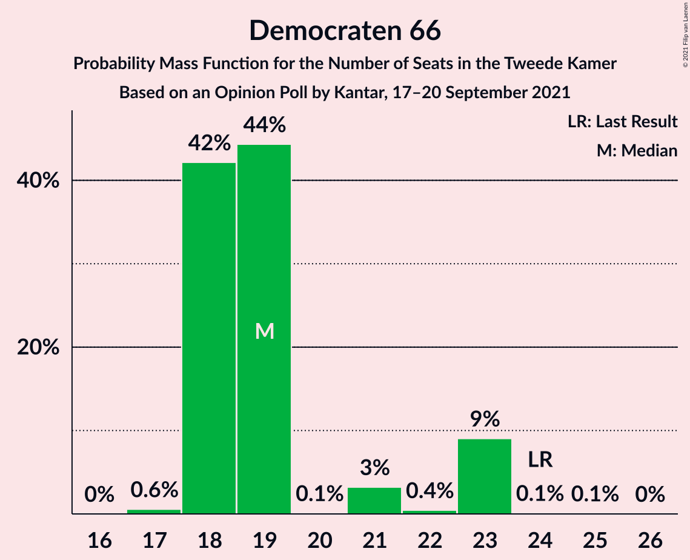
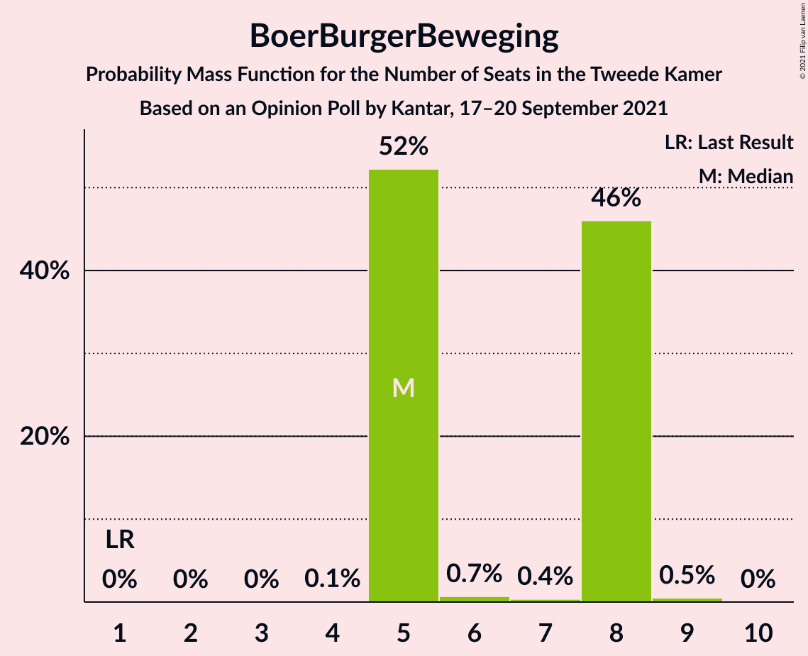
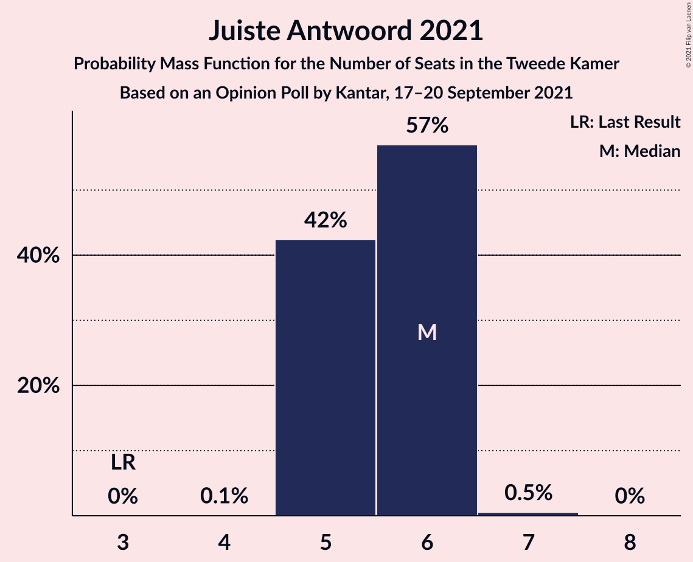
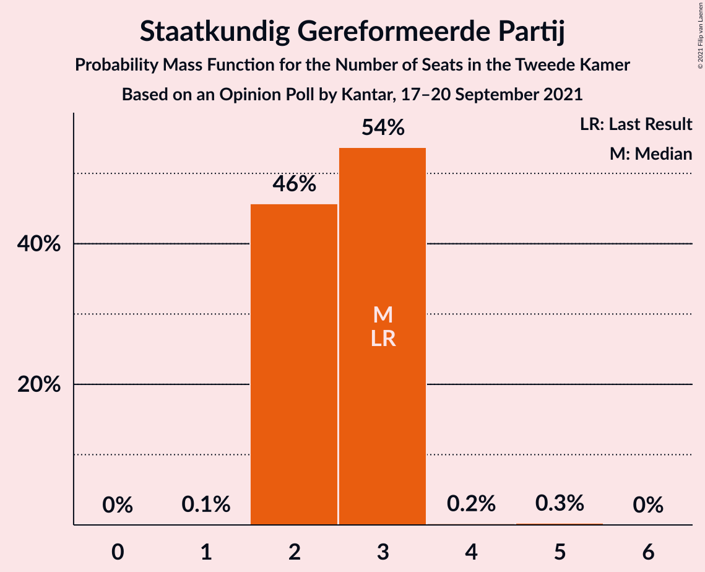
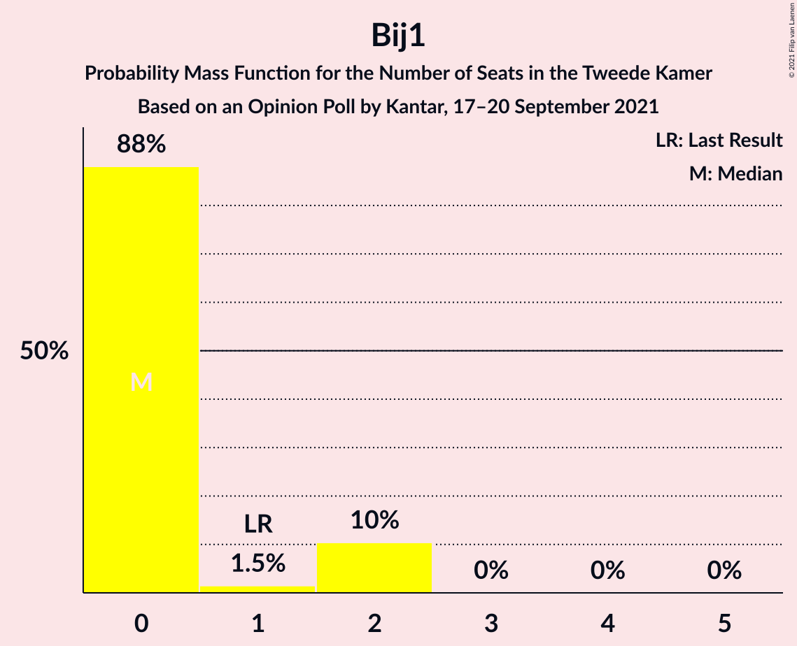
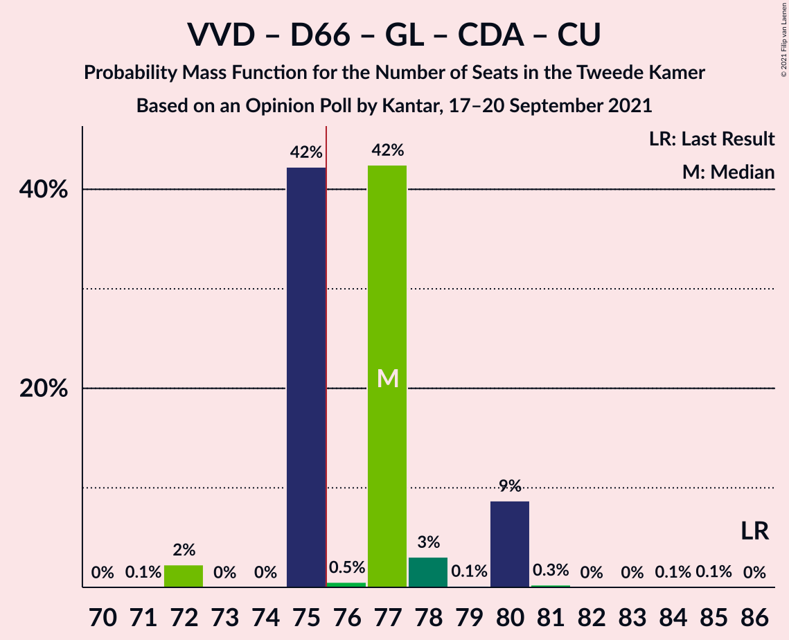
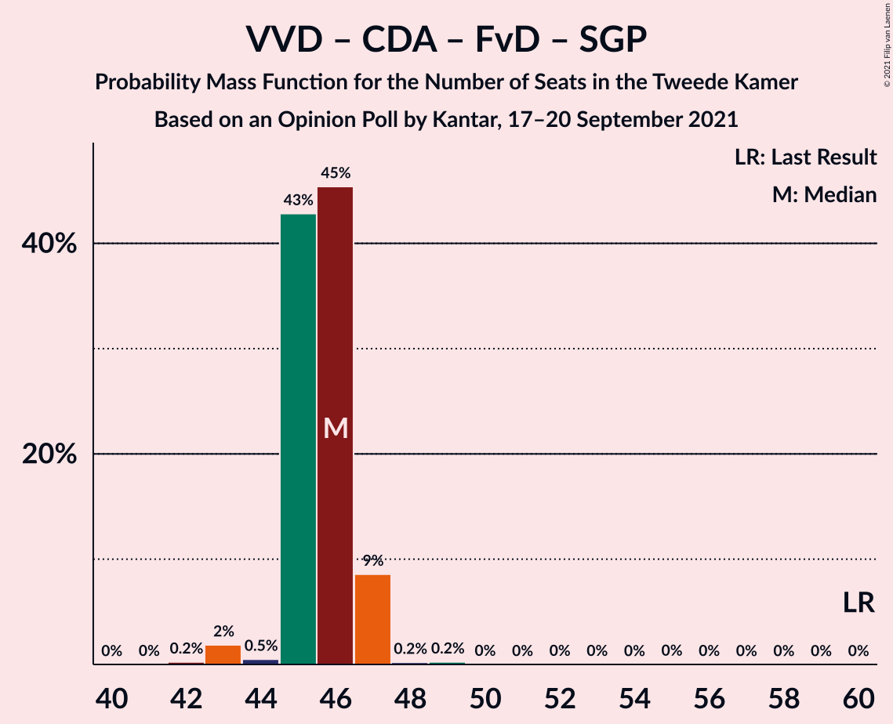
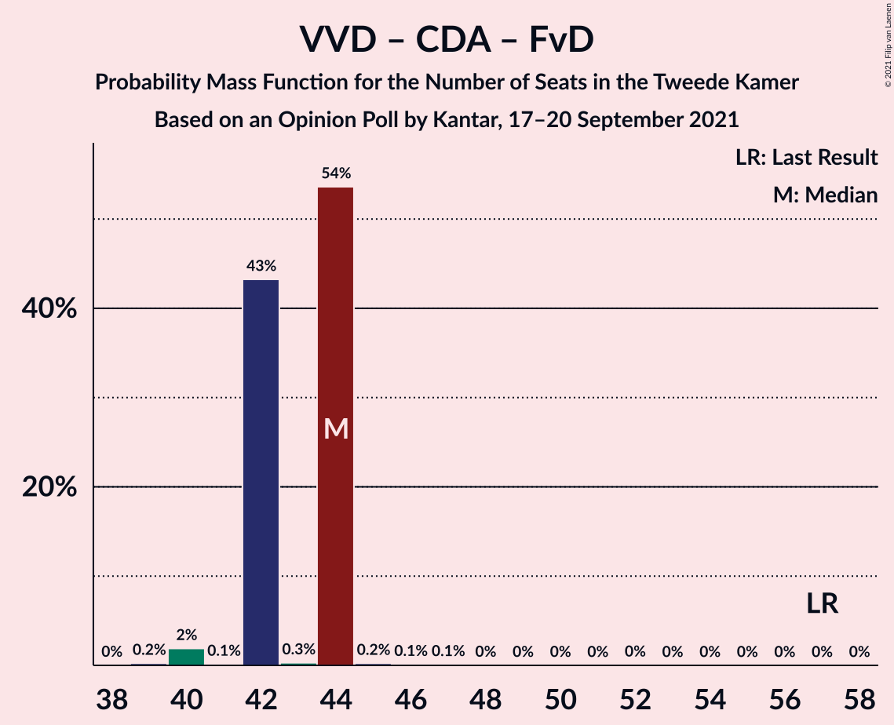
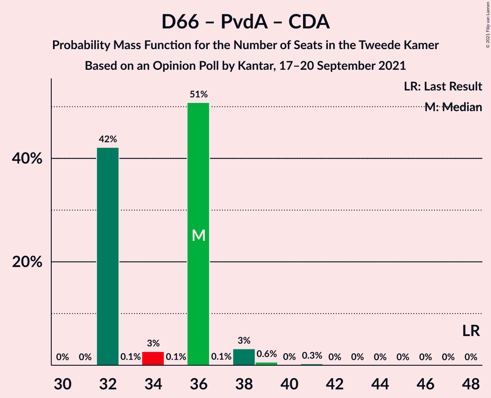
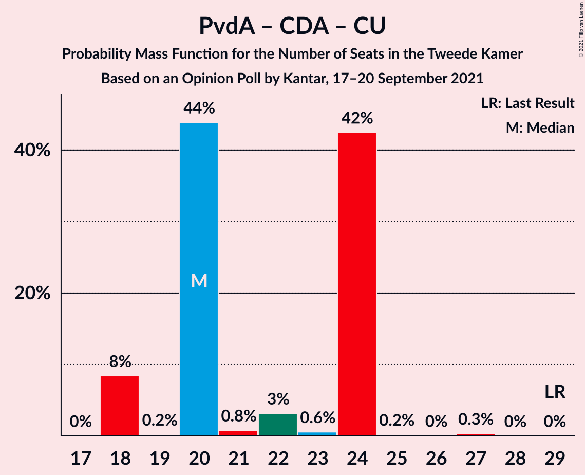

# Opinion Poll by Kantar, 17–20 September 2021

<a href="#voting-intentions">Voting Intentions</a> | <a href="#seats">Seats</a> | <a href="#coalitions">Coalitions</a> | <a href="#technical-information">Technical Information</a>

## Voting Intentions

### Confidence Intervals

| Party | Last Result | Poll Result | 80% Confidence Interval | 90% Confidence Interval | 95% Confidence Interval | 99% Confidence Interval |
|:-----:|:-----------:|:-----------:|:-----------------------:|:-----------------------:|:-----------------------:|:-----------------------:|
| Volkspartij voor Vrijheid en Democratie | 21.9% | 22.0% | 20.4–23.7% |20.0–24.2% |19.6–24.6% |18.8–25.5% |
| Partij voor de Vrijheid | 10.8% | 13.3% | 12.0–14.8% |11.7–15.2% |11.4–15.5% |10.8–16.2% |
| Democraten 66 | 15.0% | 13.3% | 12.0–14.8% |11.7–15.2% |11.4–15.5% |10.8–16.2% |
| GroenLinks | 5.2% | 7.3% | 6.4–8.5% |6.1–8.8% |5.9–9.1% |5.5–9.7% |
| Partij van de Arbeid | 5.7% | 6.0% | 5.1–7.0% |4.9–7.3% |4.7–7.6% |4.3–8.1% |
| Christen-Democratisch Appèl | 9.5% | 4.6% | 3.9–5.6% |3.7–5.9% |3.5–6.1% |3.2–6.6% |
| Socialistische Partij | 6.0% | 4.6% | 3.9–5.6% |3.7–5.9% |3.5–6.1% |3.2–6.6% |
| BoerBurgerBeweging | 1.0% | 4.6% | 3.9–5.6% |3.7–5.9% |3.5–6.1% |3.2–6.6% |
| ChristenUnie | 3.4% | 4.0% | 3.3–4.8% |3.1–5.1% |2.9–5.3% |2.6–5.8% |
| Partij voor de Dieren | 3.8% | 4.0% | 3.3–4.8% |3.1–5.1% |2.9–5.3% |2.6–5.8% |
| Juiste Antwoord 2021 | 2.4% | 4.0% | 3.3–4.8% |3.1–5.1% |2.9–5.3% |2.6–5.8% |
| Volt Europa | 2.4% | 4.0% | 3.3–4.8% |3.1–5.1% |2.9–5.3% |2.6–5.8% |
| Forum voor Democratie | 5.0% | 2.7% | 2.1–3.5% |2.0–3.7% |1.9–3.9% |1.6–4.3% |
| Staatkundig Gereformeerde Partij | 2.1% | 2.0% | 1.6–2.7% |1.4–2.9% |1.3–3.1% |1.1–3.4% |
| DENK | 2.0% | 2.0% | 1.6–2.7% |1.4–2.9% |1.3–3.1% |1.1–3.4% |
| 50Plus | 1.0% | 0.7% | 0.4–1.1% |0.4–1.3% |0.3–1.4% |0.2–1.6% |
| Bij1 | 0.8% | 0.7% | 0.4–1.1% |0.4–1.3% |0.3–1.4% |0.2–1.6% |

*Note:* The poll result column reflects the actual value used in the calculations. Published results may vary slightly, and in addition be rounded to fewer digits.

## Seats

### Confidence Intervals

| Party | Last Result | Median | 80% Confidence Interval | 90% Confidence Interval | 95% Confidence Interval | 99% Confidence Interval |
|:-----:|:-----------:|:------:|:-----------------------:|:-----------------------:|:-----------------------:|:-----------------------:|
| <a href="#volkspartij-voor-vrijheid-en-democratie">Volkspartij voor Vrijheid en Democratie</a> | 34 | 33 | 30–33 |29–33 |29–33 |29–33 |
| <a href="#partij-voor-de-vrijheid">Partij voor de Vrijheid</a> | 17 | 20 | 20–21 |20–22 |20–22 |17–22 |
| <a href="#democraten-66">Democraten 66</a> | 24 | 21 | 17–21 |17–21 |17–22 |17–23 |
| <a href="#groenlinks">GroenLinks</a> | 8 | 12 | 10–12 |10–12 |10–12 |9–13 |
| <a href="#partij-van-de-arbeid">Partij van de Arbeid</a> | 9 | 10 | 8–10 |8–10 |8–10 |8–10 |
| <a href="#christen-democratisch-appèl">Christen-Democratisch Appèl</a> | 15 | 7 | 7–8 |7–9 |7–9 |6–9 |
| <a href="#socialistische-partij">Socialistische Partij</a> | 9 | 7 | 7–9 |7–9 |7–9 |7–9 |
| <a href="#boerburgerbeweging">BoerBurgerBeweging</a> | 1 | 8 | 8 |8–9 |8–9 |5–9 |
| <a href="#christenunie">ChristenUnie</a> | 5 | 5 | 5–7 |5–7 |5–7 |5–7 |
| <a href="#partij-voor-de-dieren">Partij voor de Dieren</a> | 6 | 5 | 5–7 |5–7 |5–7 |4–8 |
| <a href="#juiste-antwoord-2021">Juiste Antwoord 2021</a> | 3 | 6 | 6 |6 |6 |5–6 |
| <a href="#volt-europa">Volt Europa</a> | 3 | 6 | 5–6 |4–6 |4–6 |4–8 |
| <a href="#forum-voor-democratie">Forum voor Democratie</a> | 8 | 4 | 4 |4 |4–5 |2–7 |
| <a href="#staatkundig-gereformeerde-partij">Staatkundig Gereformeerde Partij</a> | 3 | 2 | 2–3 |2–3 |2–3 |2–4 |
| <a href="#denk">DENK</a> | 3 | 3 | 3 |3 |2–3 |2–4 |
| <a href="#50plus">50Plus</a> | 1 | 0 | 0–1 |0–1 |0–1 |0–1 |
| <a href="#bij1">Bij1</a> | 1 | 0 | 0–1 |0–1 |0–1 |0–1 |

### Volkspartij voor Vrijheid en Democratie

*For a full overview of the results for this party, see the [Volkspartij voor Vrijheid en Democratie](party-volkspartijvoorvrijheidendemocratie.html) page.*

| Number of Seats | Probability | Accumulated | Special Marks |
|:---------------:|:-----------:|:-----------:|:-------------:|
| 28 | 0.2% | 100% |  |
| 29 | 10% | 99.8% |  |
| 30 | 1.3% | 90% |  |
| 31 | 0.7% | 89% |  |
| 32 | 0.1% | 88% |  |
| 33 | 88% | 88% | Median |
| 34 | 0% | 0.2% | Last Result |
| 35 | 0% | 0.2% |  |
| 36 | 0.1% | 0.2% |  |
| 37 | 0% | 0.1% |  |
| 38 | 0% | 0% |  |

### Partij voor de Vrijheid

*For a full overview of the results for this party, see the [Partij voor de Vrijheid](party-partijvoordevrijheid.html) page.*

| Number of Seats | Probability | Accumulated | Special Marks |
|:---------------:|:-----------:|:-----------:|:-------------:|
| 17 | 2% | 100% | Last Result |
| 18 | 0.1% | 98% |  |
| 19 | 0.1% | 98% |  |
| 20 | 87% | 98% | Median |
| 21 | 1.1% | 11% |  |
| 22 | 10% | 10% |  |
| 23 | 0% | 0% |  |

### Democraten 66

*For a full overview of the results for this party, see the [Democraten 66](party-democraten66.html) page.*

| Number of Seats | Probability | Accumulated | Special Marks |
|:---------------:|:-----------:|:-----------:|:-------------:|
| 17 | 10% | 100% |  |
| 18 | 0.1% | 90% |  |
| 19 | 0% | 90% |  |
| 20 | 0.2% | 90% |  |
| 21 | 86% | 89% | Median |
| 22 | 2% | 3% |  |
| 23 | 1.2% | 1.2% |  |
| 24 | 0% | 0% | Last Result |

### GroenLinks

*For a full overview of the results for this party, see the [GroenLinks](party-groenlinks.html) page.*

| Number of Seats | Probability | Accumulated | Special Marks |
|:---------------:|:-----------:|:-----------:|:-------------:|
| 8 | 0% | 100% | Last Result |
| 9 | 2% | 100% |  |
| 10 | 10% | 98% |  |
| 11 | 0.3% | 88% |  |
| 12 | 86% | 88% | Median |
| 13 | 2% | 2% |  |
| 14 | 0% | 0% |  |

### Partij van de Arbeid

*For a full overview of the results for this party, see the [Partij van de Arbeid](party-partijvandearbeid.html) page.*

| Number of Seats | Probability | Accumulated | Special Marks |
|:---------------:|:-----------:|:-----------:|:-------------:|
| 7 | 0.2% | 100% |  |
| 8 | 12% | 99.7% |  |
| 9 | 0.6% | 88% | Last Result |
| 10 | 87% | 87% | Median |
| 11 | 0.1% | 0.3% |  |
| 12 | 0.1% | 0.2% |  |
| 13 | 0.1% | 0.1% |  |
| 14 | 0% | 0% |  |

### Christen-Democratisch Appèl

*For a full overview of the results for this party, see the [Christen-Democratisch Appèl](party-christen-democratischappèl.html) page.*

| Number of Seats | Probability | Accumulated | Special Marks |
|:---------------:|:-----------:|:-----------:|:-------------:|
| 5 | 0.1% | 100% |  |
| 6 | 2% | 99.9% |  |
| 7 | 87% | 98% | Median |
| 8 | 1.4% | 11% |  |
| 9 | 10% | 10% |  |
| 10 | 0.1% | 0.1% |  |
| 11 | 0% | 0% |  |
| 12 | 0% | 0% |  |
| 13 | 0% | 0% |  |
| 14 | 0% | 0% |  |
| 15 | 0% | 0% | Last Result |

### Socialistische Partij

*For a full overview of the results for this party, see the [Socialistische Partij](party-socialistischepartij.html) page.*

| Number of Seats | Probability | Accumulated | Special Marks |
|:---------------:|:-----------:|:-----------:|:-------------:|
| 5 | 0.1% | 100% |  |
| 6 | 0% | 99.8% |  |
| 7 | 88% | 99.8% | Median |
| 8 | 0.1% | 12% |  |
| 9 | 12% | 12% | Last Result |
| 10 | 0% | 0% |  |

### BoerBurgerBeweging

*For a full overview of the results for this party, see the [BoerBurgerBeweging](party-boerburgerbeweging.html) page.*

| Number of Seats | Probability | Accumulated | Special Marks |
|:---------------:|:-----------:|:-----------:|:-------------:|
| 1 | 0% | 100% | Last Result |
| 2 | 0% | 100% |  |
| 3 | 0% | 100% |  |
| 4 | 0% | 100% |  |
| 5 | 1.2% | 100% |  |
| 6 | 0.4% | 98.8% |  |
| 7 | 0.2% | 98% |  |
| 8 | 88% | 98% | Median |
| 9 | 10% | 10% |  |
| 10 | 0% | 0% |  |

### ChristenUnie

*For a full overview of the results for this party, see the [ChristenUnie](party-christenunie.html) page.*

| Number of Seats | Probability | Accumulated | Special Marks |
|:---------------:|:-----------:|:-----------:|:-------------:|
| 4 | 0.2% | 100% |  |
| 5 | 89% | 99.8% | Last Result, Median |
| 6 | 0.1% | 11% |  |
| 7 | 11% | 11% |  |
| 8 | 0.1% | 0.2% |  |
| 9 | 0.1% | 0.1% |  |
| 10 | 0% | 0% |  |

### Partij voor de Dieren

*For a full overview of the results for this party, see the [Partij voor de Dieren](party-partijvoordedieren.html) page.*

| Number of Seats | Probability | Accumulated | Special Marks |
|:---------------:|:-----------:|:-----------:|:-------------:|
| 4 | 0.7% | 100% |  |
| 5 | 87% | 99.3% | Median |
| 6 | 0% | 12% | Last Result |
| 7 | 10% | 12% |  |
| 8 | 2% | 2% |  |
| 9 | 0% | 0% |  |

### Juiste Antwoord 2021

*For a full overview of the results for this party, see the [Juiste Antwoord 2021](party-juisteantwoord2021.html) page.*

| Number of Seats | Probability | Accumulated | Special Marks |
|:---------------:|:-----------:|:-----------:|:-------------:|
| 3 | 0% | 100% | Last Result |
| 4 | 0% | 100% |  |
| 5 | 2% | 100% |  |
| 6 | 98% | 98% | Median |
| 7 | 0.3% | 0.4% |  |
| 8 | 0% | 0% |  |

### Volt Europa

*For a full overview of the results for this party, see the [Volt Europa](party-volteuropa.html) page.*

| Number of Seats | Probability | Accumulated | Special Marks |
|:---------------:|:-----------:|:-----------:|:-------------:|
| 3 | 0% | 100% | Last Result |
| 4 | 10% | 100% |  |
| 5 | 0.4% | 90% |  |
| 6 | 89% | 90% | Median |
| 7 | 0.1% | 1.3% |  |
| 8 | 1.1% | 1.2% |  |
| 9 | 0% | 0.1% |  |
| 10 | 0.1% | 0.1% |  |
| 11 | 0% | 0% |  |

### Forum voor Democratie

*For a full overview of the results for this party, see the [Forum voor Democratie](party-forumvoordemocratie.html) page.*

| Number of Seats | Probability | Accumulated | Special Marks |
|:---------------:|:-----------:|:-----------:|:-------------:|
| 1 | 0.1% | 100% |  |
| 2 | 1.2% | 99.9% |  |
| 3 | 0.2% | 98.7% |  |
| 4 | 96% | 98% | Median |
| 5 | 0.6% | 3% |  |
| 6 | 0.1% | 2% |  |
| 7 | 2% | 2% |  |
| 8 | 0% | 0% | Last Result |

### Staatkundig Gereformeerde Partij

*For a full overview of the results for this party, see the [Staatkundig Gereformeerde Partij](party-staatkundiggereformeerdepartij.html) page.*

| Number of Seats | Probability | Accumulated | Special Marks |
|:---------------:|:-----------:|:-----------:|:-------------:|
| 2 | 86% | 100% | Median |
| 3 | 12% | 14% | Last Result |
| 4 | 1.3% | 1.4% |  |
| 5 | 0.1% | 0.1% |  |
| 6 | 0% | 0% |  |

### DENK

*For a full overview of the results for this party, see the [DENK](party-denk.html) page.*

| Number of Seats | Probability | Accumulated | Special Marks |
|:---------------:|:-----------:|:-----------:|:-------------:|
| 1 | 0.1% | 100% |  |
| 2 | 3% | 99.9% |  |
| 3 | 96% | 97% | Last Result, Median |
| 4 | 0.8% | 0.9% |  |
| 5 | 0% | 0% |  |

### 50Plus

*For a full overview of the results for this party, see the [50Plus](party-50plus.html) page.*

| Number of Seats | Probability | Accumulated | Special Marks |
|:---------------:|:-----------:|:-----------:|:-------------:|
| 0 | 86% | 100% | Median |
| 1 | 14% | 14% | Last Result |
| 2 | 0.2% | 0.2% |  |
| 3 | 0% | 0% |  |

### Bij1

*For a full overview of the results for this party, see the [Bij1](party-bij1.html) page.*

| Number of Seats | Probability | Accumulated | Special Marks |
|:---------------:|:-----------:|:-----------:|:-------------:|
| 0 | 87% | 100% | Median |
| 1 | 12% | 13% | Last Result |
| 2 | 0% | 0.1% |  |
| 3 | 0% | 0% |  |

## Coalitions

### Confidence Intervals

| Coalition | Last Result | Median | Majority? | 80% Confidence Interval | 90% Confidence Interval | 95% Confidence Interval | 99% Confidence Interval |
|:---------:|:-----------:|:------:|:---------:|:-----------------------:|:-----------------------:|:-----------------------:|:-----------------------:|
| Volkspartij voor Vrijheid en Democratie – Democraten 66 – GroenLinks – Christen-Democratisch Appèl – ChristenUnie | 86 | 78 | 88% | 75–78 | 72–78 | 72–78 | 72–79 |
| Volkspartij voor Vrijheid en Democratie – Democraten 66 – Partij van de Arbeid – Christen-Democratisch Appèl – ChristenUnie | 87 | 76 | 88% | 71–76 | 70–76 | 70–76 | 70–76 |
| Volkspartij voor Vrijheid en Democratie – Partij voor de Vrijheid – Christen-Democratisch Appèl – Forum voor Democratie – Staatkundig Gereformeerde Partij | 77 | 66 | 0% | 66 | 66–67 | 66–67 | 64–67 |
| Volkspartij voor Vrijheid en Democratie – Democraten 66 – Christen-Democratisch Appèl – ChristenUnie | 78 | 66 | 0% | 62–66 | 62–66 | 62–66 | 62–66 |
| Volkspartij voor Vrijheid en Democratie – Partij voor de Vrijheid – Christen-Democratisch Appèl – Forum voor Democratie | 74 | 64 | 0% | 64 | 64 | 63–64 | 61–64 |
| Volkspartij voor Vrijheid en Democratie – Democraten 66 – Partij van de Arbeid | 67 | 64 | 0% | 57–64 | 54–64 | 54–64 | 54–64 |
| Democraten 66 – GroenLinks – Partij van de Arbeid – Christen-Democratisch Appèl – Socialistische Partij – ChristenUnie | 70 | 62 | 0% | 60–62 | 60–62 | 60–62 | 59–66 |
| Volkspartij voor Vrijheid en Democratie – Democraten 66 – Christen-Democratisch Appèl | 73 | 61 | 0% | 55–61 | 55–61 | 55–61 | 55–61 |
| Volkspartij voor Vrijheid en Democratie – Partij voor de Vrijheid – Christen-Democratisch Appèl | 66 | 60 | 0% | 60 | 60 | 58–60 | 56–60 |
| Democraten 66 – GroenLinks – Partij van de Arbeid – Christen-Democratisch Appèl – ChristenUnie | 61 | 55 | 0% | 51–55 | 51–55 | 51–55 | 50–59 |
| Volkspartij voor Vrijheid en Democratie – Partij van de Arbeid – Christen-Democratisch Appèl | 58 | 50 | 0% | 47–50 | 46–50 | 46–50 | 46–50 |
| Volkspartij voor Vrijheid en Democratie – Christen-Democratisch Appèl – Forum voor Democratie – Staatkundig Gereformeerde Partij – 50Plus | 61 | 46 | 0% | 46 | 46 | 46–47 | 45–50 |
| Volkspartij voor Vrijheid en Democratie – Christen-Democratisch Appèl – Forum voor Democratie – Staatkundig Gereformeerde Partij | 60 | 46 | 0% | 45–46 | 45–46 | 45–46 | 44–49 |
| Volkspartij voor Vrijheid en Democratie – Christen-Democratisch Appèl – Forum voor Democratie – 50Plus | 58 | 44 | 0% | 43–44 | 43–44 | 43–44 | 41–47 |
| Volkspartij voor Vrijheid en Democratie – Christen-Democratisch Appèl – Forum voor Democratie | 57 | 44 | 0% | 42–44 | 42–44 | 42–44 | 40–46 |
| Volkspartij voor Vrijheid en Democratie – Partij van de Arbeid | 43 | 43 | 0% | 40–43 | 37–43 | 37–43 | 37–43 |
| Volkspartij voor Vrijheid en Democratie – Christen-Democratisch Appèl | 49 | 40 | 0% | 38–40 | 38–40 | 38–40 | 38–40 |
| Democraten 66 – Partij van de Arbeid – Christen-Democratisch Appèl | 48 | 38 | 0% | 34–38 | 34–38 | 34–38 | 33–41 |
| Democraten 66 – Christen-Democratisch Appèl | 39 | 28 | 0% | 26–28 | 26–28 | 26–28 | 24–31 |
| Partij van de Arbeid – Christen-Democratisch Appèl – ChristenUnie | 29 | 22 | 0% | 22–23 | 22–24 | 22–24 | 19–24 |
| Partij van de Arbeid – Christen-Democratisch Appèl | 24 | 17 | 0% | 17 | 17 | 16–17 | 14–18 |

### Volkspartij voor Vrijheid en Democratie – Democraten 66 – GroenLinks – Christen-Democratisch Appèl – ChristenUnie

| Number of Seats | Probability | Accumulated | Special Marks |
|:---------------:|:-----------:|:-----------:|:-------------:|
| 72 | 10% | 100% |  |
| 73 | 0% | 90% |  |
| 74 | 0% | 90% |  |
| 75 | 3% | 90% |  |
| 76 | 0.1% | 88% | Majority |
| 77 | 0% | 87% |  |
| 78 | 86% | 87% | Median |
| 79 | 1.1% | 1.4% |  |
| 80 | 0.1% | 0.3% |  |
| 81 | 0.2% | 0.2% |  |
| 82 | 0% | 0% |  |
| 83 | 0% | 0% |  |
| 84 | 0% | 0% |  |
| 85 | 0% | 0% |  |
| 86 | 0% | 0% | Last Result |

### Volkspartij voor Vrijheid en Democratie – Democraten 66 – Partij van de Arbeid – Christen-Democratisch Appèl – ChristenUnie

| Number of Seats | Probability | Accumulated | Special Marks |
|:---------------:|:-----------:|:-----------:|:-------------:|
| 70 | 10% | 100% |  |
| 71 | 0.6% | 90% |  |
| 72 | 0.1% | 90% |  |
| 73 | 0.3% | 90% |  |
| 74 | 2% | 89% |  |
| 75 | 0% | 88% |  |
| 76 | 87% | 88% | Median, Majority |
| 77 | 0.1% | 0.3% |  |
| 78 | 0% | 0.2% |  |
| 79 | 0% | 0.2% |  |
| 80 | 0.1% | 0.1% |  |
| 81 | 0% | 0% |  |
| 82 | 0% | 0% |  |
| 83 | 0% | 0% |  |
| 84 | 0% | 0% |  |
| 85 | 0% | 0% |  |
| 86 | 0% | 0% |  |
| 87 | 0% | 0% | Last Result |

### Volkspartij voor Vrijheid en Democratie – Partij voor de Vrijheid – Christen-Democratisch Appèl – Forum voor Democratie – Staatkundig Gereformeerde Partij

| Number of Seats | Probability | Accumulated | Special Marks |
|:---------------:|:-----------:|:-----------:|:-------------:|
| 62 | 0.1% | 100% |  |
| 63 | 0.1% | 99.8% |  |
| 64 | 0.3% | 99.7% |  |
| 65 | 1.1% | 99.5% |  |
| 66 | 88% | 98% | Median |
| 67 | 10% | 10% |  |
| 68 | 0.1% | 0.2% |  |
| 69 | 0.1% | 0.1% |  |
| 70 | 0% | 0.1% |  |
| 71 | 0% | 0.1% |  |
| 72 | 0% | 0% |  |
| 73 | 0% | 0% |  |
| 74 | 0% | 0% |  |
| 75 | 0% | 0% |  |
| 76 | 0% | 0% | Majority |
| 77 | 0% | 0% | Last Result |

### Volkspartij voor Vrijheid en Democratie – Democraten 66 – Christen-Democratisch Appèl – ChristenUnie

| Number of Seats | Probability | Accumulated | Special Marks |
|:---------------:|:-----------:|:-----------:|:-------------:|
| 62 | 10% | 100% |  |
| 63 | 0.1% | 90% |  |
| 64 | 0.1% | 90% |  |
| 65 | 0.4% | 90% |  |
| 66 | 89% | 89% | Median |
| 67 | 0.1% | 0.3% |  |
| 68 | 0% | 0.2% |  |
| 69 | 0.2% | 0.2% |  |
| 70 | 0% | 0% |  |
| 71 | 0% | 0% |  |
| 72 | 0% | 0% |  |
| 73 | 0% | 0% |  |
| 74 | 0% | 0% |  |
| 75 | 0% | 0% |  |
| 76 | 0% | 0% | Majority |
| 77 | 0% | 0% |  |
| 78 | 0% | 0% | Last Result |

### Volkspartij voor Vrijheid en Democratie – Partij voor de Vrijheid – Christen-Democratisch Appèl – Forum voor Democratie

| Number of Seats | Probability | Accumulated | Special Marks |
|:---------------:|:-----------:|:-----------:|:-------------:|
| 59 | 0.3% | 100% |  |
| 60 | 0% | 99.7% |  |
| 61 | 1.1% | 99.7% |  |
| 62 | 0.2% | 98.6% |  |
| 63 | 2% | 98% |  |
| 64 | 96% | 96% | Median |
| 65 | 0% | 0.2% |  |
| 66 | 0.1% | 0.2% |  |
| 67 | 0% | 0.1% |  |
| 68 | 0% | 0.1% |  |
| 69 | 0% | 0% |  |
| 70 | 0% | 0% |  |
| 71 | 0% | 0% |  |
| 72 | 0% | 0% |  |
| 73 | 0% | 0% |  |
| 74 | 0% | 0% | Last Result |

### Volkspartij voor Vrijheid en Democratie – Democraten 66 – Partij van de Arbeid

| Number of Seats | Probability | Accumulated | Special Marks |
|:---------------:|:-----------:|:-----------:|:-------------:|
| 54 | 10% | 100% |  |
| 55 | 0% | 90% |  |
| 56 | 0% | 90% |  |
| 57 | 0.6% | 90% |  |
| 58 | 0.3% | 90% |  |
| 59 | 0% | 90% |  |
| 60 | 0% | 90% |  |
| 61 | 0.2% | 89% |  |
| 62 | 0.1% | 89% |  |
| 63 | 3% | 89% |  |
| 64 | 86% | 86% | Median |
| 65 | 0% | 0.1% |  |
| 66 | 0% | 0% |  |
| 67 | 0% | 0% | Last Result |

### Democraten 66 – GroenLinks – Partij van de Arbeid – Christen-Democratisch Appèl – Socialistische Partij – ChristenUnie

| Number of Seats | Probability | Accumulated | Special Marks |
|:---------------:|:-----------:|:-----------:|:-------------:|
| 56 | 0% | 100% |  |
| 57 | 0% | 99.9% |  |
| 58 | 0.1% | 99.9% |  |
| 59 | 2% | 99.8% |  |
| 60 | 10% | 98% |  |
| 61 | 0% | 88% |  |
| 62 | 86% | 88% | Median |
| 63 | 0% | 1.4% |  |
| 64 | 0% | 1.4% |  |
| 65 | 0% | 1.4% |  |
| 66 | 1.1% | 1.4% |  |
| 67 | 0.2% | 0.2% |  |
| 68 | 0% | 0% |  |
| 69 | 0% | 0% |  |
| 70 | 0% | 0% | Last Result |

### Volkspartij voor Vrijheid en Democratie – Democraten 66 – Christen-Democratisch Appèl

| Number of Seats | Probability | Accumulated | Special Marks |
|:---------------:|:-----------:|:-----------:|:-------------:|
| 55 | 10% | 100% |  |
| 56 | 0% | 90% |  |
| 57 | 0% | 90% |  |
| 58 | 0.3% | 90% |  |
| 59 | 0.1% | 89% |  |
| 60 | 0.1% | 89% |  |
| 61 | 89% | 89% | Median |
| 62 | 0.1% | 0.2% |  |
| 63 | 0% | 0% |  |
| 64 | 0% | 0% |  |
| 65 | 0% | 0% |  |
| 66 | 0% | 0% |  |
| 67 | 0% | 0% |  |
| 68 | 0% | 0% |  |
| 69 | 0% | 0% |  |
| 70 | 0% | 0% |  |
| 71 | 0% | 0% |  |
| 72 | 0% | 0% |  |
| 73 | 0% | 0% | Last Result |

### Volkspartij voor Vrijheid en Democratie – Partij voor de Vrijheid – Christen-Democratisch Appèl

| Number of Seats | Probability | Accumulated | Special Marks |
|:---------------:|:-----------:|:-----------:|:-------------:|
| 55 | 0.1% | 100% |  |
| 56 | 2% | 99.9% |  |
| 57 | 0% | 98% |  |
| 58 | 0.9% | 98% |  |
| 59 | 1.1% | 97% |  |
| 60 | 96% | 96% | Median |
| 61 | 0.2% | 0.3% |  |
| 62 | 0% | 0.1% |  |
| 63 | 0% | 0.1% |  |
| 64 | 0% | 0.1% |  |
| 65 | 0% | 0% |  |
| 66 | 0% | 0% | Last Result |

### Democraten 66 – GroenLinks – Partij van de Arbeid – Christen-Democratisch Appèl – ChristenUnie

| Number of Seats | Probability | Accumulated | Special Marks |
|:---------------:|:-----------:|:-----------:|:-------------:|
| 48 | 0% | 100% |  |
| 49 | 0% | 99.9% |  |
| 50 | 2% | 99.9% |  |
| 51 | 10% | 98% |  |
| 52 | 0% | 88% |  |
| 53 | 0.6% | 88% |  |
| 54 | 0% | 88% |  |
| 55 | 86% | 88% | Median |
| 56 | 0% | 1.4% |  |
| 57 | 0% | 1.4% |  |
| 58 | 0.1% | 1.4% |  |
| 59 | 1.1% | 1.3% |  |
| 60 | 0% | 0.2% |  |
| 61 | 0% | 0.1% | Last Result |
| 62 | 0.1% | 0.1% |  |
| 63 | 0% | 0% |  |

### Volkspartij voor Vrijheid en Democratie – Partij van de Arbeid – Christen-Democratisch Appèl

| Number of Seats | Probability | Accumulated | Special Marks |
|:---------------:|:-----------:|:-----------:|:-------------:|
| 44 | 0.3% | 100% |  |
| 45 | 0% | 99.7% |  |
| 46 | 10% | 99.7% |  |
| 47 | 2% | 90% |  |
| 48 | 1.3% | 88% |  |
| 49 | 0% | 86% |  |
| 50 | 86% | 86% | Median |
| 51 | 0% | 0.2% |  |
| 52 | 0% | 0.1% |  |
| 53 | 0% | 0.1% |  |
| 54 | 0% | 0% |  |
| 55 | 0% | 0% |  |
| 56 | 0% | 0% |  |
| 57 | 0% | 0% |  |
| 58 | 0% | 0% | Last Result |

### Volkspartij voor Vrijheid en Democratie – Christen-Democratisch Appèl – Forum voor Democratie – Staatkundig Gereformeerde Partij – 50Plus

| Number of Seats | Probability | Accumulated | Special Marks |
|:---------------:|:-----------:|:-----------:|:-------------:|
| 44 | 0.4% | 100% |  |
| 45 | 1.1% | 99.6% |  |
| 46 | 96% | 98.5% | Median |
| 47 | 0.6% | 3% |  |
| 48 | 0.2% | 2% |  |
| 49 | 0% | 2% |  |
| 50 | 2% | 2% |  |
| 51 | 0% | 0.1% |  |
| 52 | 0% | 0% |  |
| 53 | 0% | 0% |  |
| 54 | 0% | 0% |  |
| 55 | 0% | 0% |  |
| 56 | 0% | 0% |  |
| 57 | 0% | 0% |  |
| 58 | 0% | 0% |  |
| 59 | 0% | 0% |  |
| 60 | 0% | 0% |  |
| 61 | 0% | 0% | Last Result |

### Volkspartij voor Vrijheid en Democratie – Christen-Democratisch Appèl – Forum voor Democratie – Staatkundig Gereformeerde Partij

| Number of Seats | Probability | Accumulated | Special Marks |
|:---------------:|:-----------:|:-----------:|:-------------:|
| 42 | 0.2% | 100% |  |
| 43 | 0.1% | 99.8% |  |
| 44 | 1.1% | 99.6% |  |
| 45 | 10% | 98.5% |  |
| 46 | 87% | 89% | Median |
| 47 | 0.2% | 2% |  |
| 48 | 0.1% | 2% |  |
| 49 | 2% | 2% |  |
| 50 | 0% | 0.1% |  |
| 51 | 0% | 0% |  |
| 52 | 0% | 0% |  |
| 53 | 0% | 0% |  |
| 54 | 0% | 0% |  |
| 55 | 0% | 0% |  |
| 56 | 0% | 0% |  |
| 57 | 0% | 0% |  |
| 58 | 0% | 0% |  |
| 59 | 0% | 0% |  |
| 60 | 0% | 0% | Last Result |

### Volkspartij voor Vrijheid en Democratie – Christen-Democratisch Appèl – Forum voor Democratie – 50Plus

| Number of Seats | Probability | Accumulated | Special Marks |
|:---------------:|:-----------:|:-----------:|:-------------:|
| 41 | 1.2% | 100% |  |
| 42 | 0.4% | 98.8% |  |
| 43 | 10% | 98% |  |
| 44 | 87% | 89% | Median |
| 45 | 0.1% | 2% |  |
| 46 | 0% | 2% |  |
| 47 | 2% | 2% |  |
| 48 | 0% | 0% |  |
| 49 | 0% | 0% |  |
| 50 | 0% | 0% |  |
| 51 | 0% | 0% |  |
| 52 | 0% | 0% |  |
| 53 | 0% | 0% |  |
| 54 | 0% | 0% |  |
| 55 | 0% | 0% |  |
| 56 | 0% | 0% |  |
| 57 | 0% | 0% |  |
| 58 | 0% | 0% | Last Result |

### Volkspartij voor Vrijheid en Democratie – Christen-Democratisch Appèl – Forum voor Democratie

| Number of Seats | Probability | Accumulated | Special Marks |
|:---------------:|:-----------:|:-----------:|:-------------:|
| 40 | 1.4% | 100% |  |
| 41 | 0.1% | 98.6% |  |
| 42 | 10% | 98% |  |
| 43 | 0.7% | 89% |  |
| 44 | 86% | 88% | Median |
| 45 | 0% | 2% |  |
| 46 | 2% | 2% |  |
| 47 | 0% | 0% |  |
| 48 | 0% | 0% |  |
| 49 | 0% | 0% |  |
| 50 | 0% | 0% |  |
| 51 | 0% | 0% |  |
| 52 | 0% | 0% |  |
| 53 | 0% | 0% |  |
| 54 | 0% | 0% |  |
| 55 | 0% | 0% |  |
| 56 | 0% | 0% |  |
| 57 | 0% | 0% | Last Result |

### Volkspartij voor Vrijheid en Democratie – Partij van de Arbeid

| Number of Seats | Probability | Accumulated | Special Marks |
|:---------------:|:-----------:|:-----------:|:-------------:|
| 36 | 0.3% | 100% |  |
| 37 | 10% | 99.7% |  |
| 38 | 0.1% | 90% |  |
| 39 | 0% | 90% |  |
| 40 | 2% | 90% |  |
| 41 | 2% | 88% |  |
| 42 | 0% | 86% |  |
| 43 | 86% | 86% | Last Result, Median |
| 44 | 0% | 0.2% |  |
| 45 | 0.1% | 0.1% |  |
| 46 | 0% | 0% |  |

### Volkspartij voor Vrijheid en Democratie – Christen-Democratisch Appèl

| Number of Seats | Probability | Accumulated | Special Marks |
|:---------------:|:-----------:|:-----------:|:-------------:|
| 36 | 0.2% | 100% |  |
| 37 | 0.1% | 99.8% |  |
| 38 | 11% | 99.6% |  |
| 39 | 2% | 88% |  |
| 40 | 86% | 86% | Median |
| 41 | 0.2% | 0.3% |  |
| 42 | 0% | 0.1% |  |
| 43 | 0% | 0.1% |  |
| 44 | 0% | 0% |  |
| 45 | 0% | 0% |  |
| 46 | 0% | 0% |  |
| 47 | 0% | 0% |  |
| 48 | 0% | 0% |  |
| 49 | 0% | 0% | Last Result |

### Democraten 66 – Partij van de Arbeid – Christen-Democratisch Appèl

| Number of Seats | Probability | Accumulated | Special Marks |
|:---------------:|:-----------:|:-----------:|:-------------:|
| 31 | 0% | 100% |  |
| 32 | 0.1% | 99.9% |  |
| 33 | 0.6% | 99.8% |  |
| 34 | 10% | 99.3% |  |
| 35 | 0% | 90% |  |
| 36 | 2% | 90% |  |
| 37 | 0.1% | 88% |  |
| 38 | 86% | 88% | Median |
| 39 | 0% | 1.2% |  |
| 40 | 0% | 1.2% |  |
| 41 | 1.1% | 1.2% |  |
| 42 | 0% | 0.1% |  |
| 43 | 0.1% | 0.1% |  |
| 44 | 0% | 0% |  |
| 45 | 0% | 0% |  |
| 46 | 0% | 0% |  |
| 47 | 0% | 0% |  |
| 48 | 0% | 0% | Last Result |

### Democraten 66 – Christen-Democratisch Appèl

| Number of Seats | Probability | Accumulated | Special Marks |
|:---------------:|:-----------:|:-----------:|:-------------:|
| 23 | 0.1% | 100% |  |
| 24 | 0.6% | 99.9% |  |
| 25 | 0.2% | 99.4% |  |
| 26 | 10% | 99.2% |  |
| 27 | 0.1% | 90% |  |
| 28 | 88% | 89% | Median |
| 29 | 0% | 2% |  |
| 30 | 0.3% | 2% |  |
| 31 | 1.1% | 1.2% |  |
| 32 | 0.1% | 0.1% |  |
| 33 | 0% | 0% |  |
| 34 | 0% | 0% |  |
| 35 | 0% | 0% |  |
| 36 | 0% | 0% |  |
| 37 | 0% | 0% |  |
| 38 | 0% | 0% |  |
| 39 | 0% | 0% | Last Result |

### Partij van de Arbeid – Christen-Democratisch Appèl – ChristenUnie

| Number of Seats | Probability | Accumulated | Special Marks |
|:---------------:|:-----------:|:-----------:|:-------------:|
| 19 | 2% | 100% |  |
| 20 | 0.2% | 98% |  |
| 21 | 0.1% | 98% |  |
| 22 | 86% | 98% | Median |
| 23 | 2% | 12% |  |
| 24 | 10% | 10% |  |
| 25 | 0% | 0.3% |  |
| 26 | 0.1% | 0.3% |  |
| 27 | 0.1% | 0.3% |  |
| 28 | 0% | 0.1% |  |
| 29 | 0.1% | 0.1% | Last Result |
| 30 | 0% | 0% |  |

### Partij van de Arbeid – Christen-Democratisch Appèl

| Number of Seats | Probability | Accumulated | Special Marks |
|:---------------:|:-----------:|:-----------:|:-------------:|
| 12 | 0.1% | 100% |  |
| 13 | 0% | 99.9% |  |
| 14 | 2% | 99.9% |  |
| 15 | 0% | 98% |  |
| 16 | 0.8% | 98% |  |
| 17 | 96% | 97% | Median |
| 18 | 1.1% | 1.4% |  |
| 19 | 0% | 0.3% |  |
| 20 | 0.3% | 0.3% |  |
| 21 | 0% | 0% |  |
| 22 | 0% | 0% |  |
| 23 | 0% | 0% |  |
| 24 | 0% | 0% | Last Result |

## Technical Information

### Opinion Poll

+ **Polling firm:** Kantar
+ **Commissioner(s):** —
+ **Fieldwork period:** 17–20 September 2021

### Calculations

+ **Sample size:** 1037
+ **Simulations done:** 131,072
+ **Error estimate:** 2.01%

