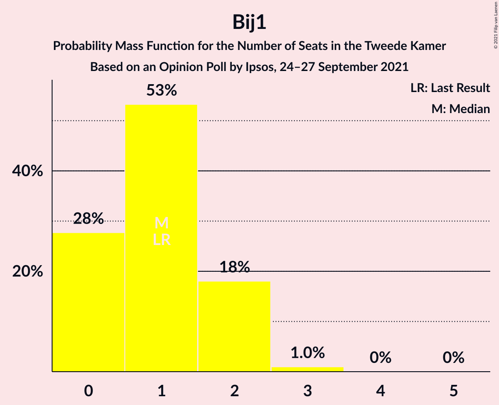
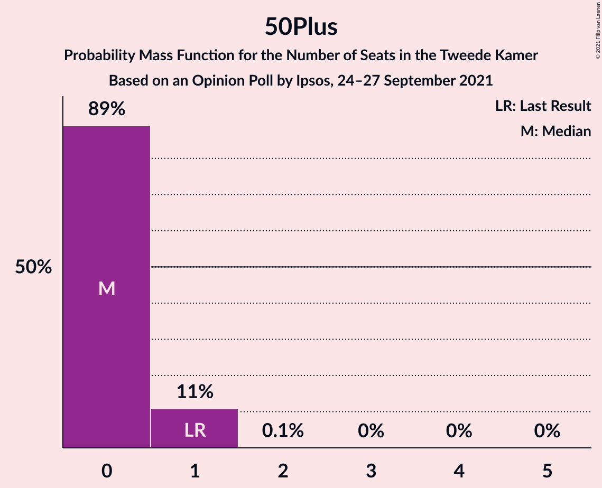

# Opinion Poll by Ipsos, 24–27 September 2021

<a href="#voting-intentions">Voting Intentions</a> | <a href="#seats">Seats</a> | <a href="#coalitions">Coalitions</a> | <a href="#technical-information">Technical Information</a>

## Voting Intentions

### Confidence Intervals

| Party | Last Result | Poll Result | 80% Confidence Interval | 90% Confidence Interval | 95% Confidence Interval | 99% Confidence Interval |
|:-----:|:-----------:|:-----------:|:-----------------------:|:-----------------------:|:-----------------------:|:-----------------------:|
| Volkspartij voor Vrijheid en Democratie | 21.9% | 23.3% | 21.7–25.1% |21.2–25.6% |20.8–26.1% |20.0–26.9% |
| Democraten 66 | 15.0% | 12.1% | 10.8–13.5% |10.5–13.9% |10.2–14.3% |9.6–15.0% |
| Partij voor de Vrijheid | 10.8% | 11.3% | 10.1–12.7% |9.7–13.0% |9.4–13.4% |8.9–14.1% |
| Partij van de Arbeid | 5.7% | 5.9% | 5.1–7.0% |4.8–7.3% |4.6–7.6% |4.2–8.1% |
| Partij voor de Dieren | 3.8% | 5.9% | 5.1–7.0% |4.8–7.3% |4.6–7.6% |4.2–8.1% |
| GroenLinks | 5.2% | 5.7% | 4.9–6.8% |4.6–7.1% |4.5–7.4% |4.1–7.9% |
| Christen-Democratisch Appèl | 9.5% | 5.5% | 4.7–6.6% |4.5–6.9% |4.3–7.1% |3.9–7.7% |
| Socialistische Partij | 6.0% | 5.3% | 4.5–6.4% |4.3–6.7% |4.1–6.9% |3.7–7.4% |
| Volt Europa | 2.4% | 3.9% | 3.2–4.8% |3.0–5.1% |2.9–5.3% |2.6–5.8% |
| Juiste Antwoord 2021 | 2.4% | 3.7% | 3.0–4.6% |2.9–4.9% |2.7–5.1% |2.4–5.6% |
| BoerBurgerBeweging | 1.0% | 3.5% | 2.9–4.4% |2.7–4.6% |2.5–4.9% |2.3–5.3% |
| ChristenUnie | 3.4% | 3.4% | 2.8–4.3% |2.6–4.5% |2.5–4.8% |2.2–5.2% |
| Forum voor Democratie | 5.0% | 3.0% | 2.4–3.8% |2.3–4.1% |2.1–4.3% |1.9–4.7% |
| DENK | 2.0% | 2.5% | 2.0–3.3% |1.8–3.5% |1.7–3.7% |1.5–4.1% |
| Staatkundig Gereformeerde Partij | 2.1% | 1.9% | 1.4–2.6% |1.3–2.8% |1.2–3.0% |1.0–3.3% |
| Bij1 | 0.8% | 1.0% | 0.7–1.6% |0.6–1.7% |0.5–1.8% |0.4–2.1% |
| 50Plus | 1.0% | 0.4% | 0.2–0.8% |0.2–0.9% |0.2–1.0% |0.1–1.3% |

*Note:* The poll result column reflects the actual value used in the calculations. Published results may vary slightly, and in addition be rounded to fewer digits.

## Seats

### Confidence Intervals

| Party | Last Result | Median | 80% Confidence Interval | 90% Confidence Interval | 95% Confidence Interval | 99% Confidence Interval |
|:-----:|:-----------:|:------:|:-----------------------:|:-----------------------:|:-----------------------:|:-----------------------:|
| <a href="#volkspartij-voor-vrijheid-en-democratie">Volkspartij voor Vrijheid en Democratie</a> | 34 | 35 | 31–37 |31–38 |31–38 |31–42 |
| <a href="#democraten-66">Democraten 66</a> | 24 | 20 | 16–23 |15–23 |15–23 |15–23 |
| <a href="#partij-voor-de-vrijheid">Partij voor de Vrijheid</a> | 17 | 17 | 16–19 |16–20 |15–20 |13–21 |
| <a href="#partij-van-de-arbeid">Partij van de Arbeid</a> | 9 | 9 | 7–11 |7–11 |7–12 |7–12 |
| <a href="#partij-voor-de-dieren">Partij voor de Dieren</a> | 6 | 8 | 7–11 |7–12 |7–13 |6–13 |
| <a href="#groenlinks">GroenLinks</a> | 8 | 9 | 7–10 |6–10 |6–11 |6–12 |
| <a href="#christen-democratisch-appèl">Christen-Democratisch Appèl</a> | 15 | 8 | 7–10 |7–10 |5–10 |5–10 |
| <a href="#socialistische-partij">Socialistische Partij</a> | 9 | 8 | 7–10 |6–10 |5–10 |5–11 |
| <a href="#volt-europa">Volt Europa</a> | 3 | 6 | 4–7 |4–8 |4–8 |4–8 |
| <a href="#juiste-antwoord-2021">Juiste Antwoord 2021</a> | 3 | 5 | 4–7 |4–7 |4–8 |4–8 |
| <a href="#boerburgerbeweging">BoerBurgerBeweging</a> | 1 | 5 | 4–7 |4–7 |3–7 |3–8 |
| <a href="#christenunie">ChristenUnie</a> | 5 | 5 | 4–7 |4–7 |3–7 |3–7 |
| <a href="#forum-voor-democratie">Forum voor Democratie</a> | 8 | 4 | 3–5 |3–6 |3–6 |3–6 |
| <a href="#denk">DENK</a> | 3 | 4 | 2–5 |2–6 |2–6 |2–6 |
| <a href="#staatkundig-gereformeerde-partij">Staatkundig Gereformeerde Partij</a> | 3 | 4 | 2–4 |2–4 |2–4 |2–5 |
| <a href="#bij1">Bij1</a> | 1 | 1 | 0–2 |0–2 |0–2 |0–3 |
| <a href="#50plus">50Plus</a> | 1 | 0 | 0–1 |0–1 |0–1 |0–1 |

### Volkspartij voor Vrijheid en Democratie

*For a full overview of the results for this party, see the [Volkspartij voor Vrijheid en Democratie](party-volkspartijvoorvrijheidendemocratie.html) page.*

| Number of Seats | Probability | Accumulated | Special Marks |
|:---------------:|:-----------:|:-----------:|:-------------:|
| 27 | 0.1% | 100% |  |
| 28 | 0% | 99.9% |  |
| 29 | 0.1% | 99.9% |  |
| 30 | 0% | 99.8% |  |
| 31 | 23% | 99.8% |  |
| 32 | 9% | 77% |  |
| 33 | 0.4% | 67% |  |
| 34 | 3% | 67% | Last Result |
| 35 | 36% | 64% | Median |
| 36 | 10% | 28% |  |
| 37 | 12% | 18% |  |
| 38 | 5% | 6% |  |
| 39 | 0.4% | 2% |  |
| 40 | 0.3% | 1.2% |  |
| 41 | 0% | 0.9% |  |
| 42 | 0.9% | 0.9% |  |
| 43 | 0% | 0% |  |

### Democraten 66

*For a full overview of the results for this party, see the [Democraten 66](party-democraten66.html) page.*

| Number of Seats | Probability | Accumulated | Special Marks |
|:---------------:|:-----------:|:-----------:|:-------------:|
| 13 | 0.1% | 100% |  |
| 14 | 0.2% | 99.9% |  |
| 15 | 6% | 99.7% |  |
| 16 | 5% | 94% |  |
| 17 | 10% | 89% |  |
| 18 | 8% | 79% |  |
| 19 | 4% | 72% |  |
| 20 | 23% | 68% | Median |
| 21 | 17% | 45% |  |
| 22 | 0.5% | 28% |  |
| 23 | 27% | 27% |  |
| 24 | 0.1% | 0.1% | Last Result |
| 25 | 0% | 0% |  |

### Partij voor de Vrijheid

*For a full overview of the results for this party, see the [Partij voor de Vrijheid](party-partijvoordevrijheid.html) page.*

| Number of Seats | Probability | Accumulated | Special Marks |
|:---------------:|:-----------:|:-----------:|:-------------:|
| 12 | 0.1% | 100% |  |
| 13 | 0.7% | 99.9% |  |
| 14 | 0.2% | 99.2% |  |
| 15 | 3% | 99.0% |  |
| 16 | 31% | 96% |  |
| 17 | 30% | 65% | Last Result, Median |
| 18 | 19% | 35% |  |
| 19 | 6% | 16% |  |
| 20 | 8% | 10% |  |
| 21 | 1.3% | 2% |  |
| 22 | 0.4% | 0.5% |  |
| 23 | 0% | 0% |  |

### Partij van de Arbeid

*For a full overview of the results for this party, see the [Partij van de Arbeid](party-partijvandearbeid.html) page.*

| Number of Seats | Probability | Accumulated | Special Marks |
|:---------------:|:-----------:|:-----------:|:-------------:|
| 5 | 0.1% | 100% |  |
| 6 | 0.3% | 99.9% |  |
| 7 | 13% | 99.6% |  |
| 8 | 11% | 87% |  |
| 9 | 38% | 76% | Last Result, Median |
| 10 | 25% | 38% |  |
| 11 | 10% | 13% |  |
| 12 | 3% | 3% |  |
| 13 | 0.1% | 0.1% |  |
| 14 | 0% | 0% |  |

### Partij voor de Dieren

*For a full overview of the results for this party, see the [Partij voor de Dieren](party-partijvoordedieren.html) page.*

| Number of Seats | Probability | Accumulated | Special Marks |
|:---------------:|:-----------:|:-----------:|:-------------:|
| 6 | 2% | 100% | Last Result |
| 7 | 31% | 98% |  |
| 8 | 29% | 67% | Median |
| 9 | 23% | 38% |  |
| 10 | 3% | 15% |  |
| 11 | 5% | 12% |  |
| 12 | 2% | 6% |  |
| 13 | 5% | 5% |  |
| 14 | 0% | 0% |  |

### GroenLinks

*For a full overview of the results for this party, see the [GroenLinks](party-groenlinks.html) page.*

| Number of Seats | Probability | Accumulated | Special Marks |
|:---------------:|:-----------:|:-----------:|:-------------:|
| 6 | 9% | 100% |  |
| 7 | 15% | 91% |  |
| 8 | 9% | 76% | Last Result |
| 9 | 57% | 67% | Median |
| 10 | 7% | 11% |  |
| 11 | 1.0% | 3% |  |
| 12 | 2% | 2% |  |
| 13 | 0% | 0% |  |

### Christen-Democratisch Appèl

*For a full overview of the results for this party, see the [Christen-Democratisch Appèl](party-christen-democratischappèl.html) page.*

| Number of Seats | Probability | Accumulated | Special Marks |
|:---------------:|:-----------:|:-----------:|:-------------:|
| 5 | 3% | 100% |  |
| 6 | 1.4% | 97% |  |
| 7 | 34% | 96% |  |
| 8 | 40% | 62% | Median |
| 9 | 1.1% | 22% |  |
| 10 | 21% | 21% |  |
| 11 | 0.2% | 0.4% |  |
| 12 | 0.2% | 0.2% |  |
| 13 | 0% | 0.1% |  |
| 14 | 0% | 0% |  |
| 15 | 0% | 0% | Last Result |

### Socialistische Partij

*For a full overview of the results for this party, see the [Socialistische Partij](party-socialistischepartij.html) page.*

| Number of Seats | Probability | Accumulated | Special Marks |
|:---------------:|:-----------:|:-----------:|:-------------:|
| 5 | 3% | 100% |  |
| 6 | 6% | 97% |  |
| 7 | 15% | 92% |  |
| 8 | 48% | 77% | Median |
| 9 | 0.8% | 29% | Last Result |
| 10 | 26% | 28% |  |
| 11 | 2% | 2% |  |
| 12 | 0% | 0% |  |

### Volt Europa

*For a full overview of the results for this party, see the [Volt Europa](party-volteuropa.html) page.*

| Number of Seats | Probability | Accumulated | Special Marks |
|:---------------:|:-----------:|:-----------:|:-------------:|
| 3 | 0.2% | 100% | Last Result |
| 4 | 13% | 99.8% |  |
| 5 | 34% | 87% |  |
| 6 | 14% | 52% | Median |
| 7 | 32% | 38% |  |
| 8 | 6% | 6% |  |
| 9 | 0.1% | 0.1% |  |
| 10 | 0% | 0% |  |

### Juiste Antwoord 2021

*For a full overview of the results for this party, see the [Juiste Antwoord 2021](party-juisteantwoord2021.html) page.*

| Number of Seats | Probability | Accumulated | Special Marks |
|:---------------:|:-----------:|:-----------:|:-------------:|
| 3 | 0.5% | 100% | Last Result |
| 4 | 37% | 99.5% |  |
| 5 | 14% | 63% | Median |
| 6 | 38% | 49% |  |
| 7 | 7% | 10% |  |
| 8 | 3% | 3% |  |
| 9 | 0% | 0% |  |

### BoerBurgerBeweging

*For a full overview of the results for this party, see the [BoerBurgerBeweging](party-boerburgerbeweging.html) page.*

| Number of Seats | Probability | Accumulated | Special Marks |
|:---------------:|:-----------:|:-----------:|:-------------:|
| 1 | 0% | 100% | Last Result |
| 2 | 0% | 100% |  |
| 3 | 4% | 100% |  |
| 4 | 7% | 96% |  |
| 5 | 47% | 89% | Median |
| 6 | 12% | 42% |  |
| 7 | 30% | 31% |  |
| 8 | 0.2% | 0.5% |  |
| 9 | 0.3% | 0.3% |  |
| 10 | 0% | 0% |  |

### ChristenUnie

*For a full overview of the results for this party, see the [ChristenUnie](party-christenunie.html) page.*

| Number of Seats | Probability | Accumulated | Special Marks |
|:---------------:|:-----------:|:-----------:|:-------------:|
| 3 | 3% | 100% |  |
| 4 | 43% | 96% |  |
| 5 | 9% | 54% | Last Result, Median |
| 6 | 34% | 45% |  |
| 7 | 10% | 11% |  |
| 8 | 0.1% | 0.2% |  |
| 9 | 0% | 0% |  |

### Forum voor Democratie

*For a full overview of the results for this party, see the [Forum voor Democratie](party-forumvoordemocratie.html) page.*

| Number of Seats | Probability | Accumulated | Special Marks |
|:---------------:|:-----------:|:-----------:|:-------------:|
| 2 | 0.3% | 100% |  |
| 3 | 13% | 99.7% |  |
| 4 | 65% | 87% | Median |
| 5 | 17% | 22% |  |
| 6 | 5% | 5% |  |
| 7 | 0.2% | 0.2% |  |
| 8 | 0% | 0% | Last Result |

### DENK

*For a full overview of the results for this party, see the [DENK](party-denk.html) page.*

| Number of Seats | Probability | Accumulated | Special Marks |
|:---------------:|:-----------:|:-----------:|:-------------:|
| 1 | 0.1% | 100% |  |
| 2 | 13% | 99.9% |  |
| 3 | 14% | 87% | Last Result |
| 4 | 61% | 73% | Median |
| 5 | 5% | 12% |  |
| 6 | 7% | 7% |  |
| 7 | 0.1% | 0.1% |  |
| 8 | 0% | 0% |  |

### Staatkundig Gereformeerde Partij

*For a full overview of the results for this party, see the [Staatkundig Gereformeerde Partij](party-staatkundiggereformeerdepartij.html) page.*

| Number of Seats | Probability | Accumulated | Special Marks |
|:---------------:|:-----------:|:-----------:|:-------------:|
| 1 | 0.2% | 100% |  |
| 2 | 19% | 99.8% |  |
| 3 | 13% | 81% | Last Result |
| 4 | 66% | 69% | Median |
| 5 | 2% | 2% |  |
| 6 | 0% | 0% |  |

### Bij1

*For a full overview of the results for this party, see the [Bij1](party-bij1.html) page.*

| Number of Seats | Probability | Accumulated | Special Marks |
|:---------------:|:-----------:|:-----------:|:-------------:|
| 0 | 28% | 100% |  |
| 1 | 53% | 72% | Last Result, Median |
| 2 | 18% | 19% |  |
| 3 | 1.0% | 1.0% |  |
| 4 | 0% | 0% |  |

### 50Plus

*For a full overview of the results for this party, see the [50Plus](party-50plus.html) page.*

| Number of Seats | Probability | Accumulated | Special Marks |
|:---------------:|:-----------:|:-----------:|:-------------:|
| 0 | 89% | 100% | Median |
| 1 | 11% | 11% | Last Result |
| 2 | 0.1% | 0.1% |  |
| 3 | 0% | 0% |  |

## Coalitions

### Confidence Intervals

| Coalition | Last Result | Median | Majority? | 80% Confidence Interval | 90% Confidence Interval | 95% Confidence Interval | 99% Confidence Interval |
|:---------:|:-----------:|:------:|:---------:|:-----------------------:|:-----------------------:|:-----------------------:|:-----------------------:|
| Volkspartij voor Vrijheid en Democratie – Democraten 66 – Partij van de Arbeid – Christen-Democratisch Appèl – ChristenUnie | 87 | 77 | 56% | 72–81 | 72–81 | 72–82 | 70–83 |
| Volkspartij voor Vrijheid en Democratie – Democraten 66 – GroenLinks – Christen-Democratisch Appèl – ChristenUnie | 86 | 75 | 49% | 71–81 | 71–81 | 71–81 | 69–81 |
| Volkspartij voor Vrijheid en Democratie – Partij voor de Vrijheid – Christen-Democratisch Appèl – Forum voor Democratie – Staatkundig Gereformeerde Partij | 77 | 67 | 0% | 63–72 | 63–72 | 63–72 | 62–74 |
| Volkspartij voor Vrijheid en Democratie – Democraten 66 – Christen-Democratisch Appèl – ChristenUnie | 78 | 68 | 0% | 62–72 | 62–72 | 62–72 | 62–73 |
| Volkspartij voor Vrijheid en Democratie – Democraten 66 – Partij van de Arbeid | 67 | 62 | 0% | 61–67 | 60–67 | 60–69 | 57–70 |
| Volkspartij voor Vrijheid en Democratie – Partij voor de Vrijheid – Christen-Democratisch Appèl – Forum voor Democratie | 74 | 63 | 0% | 59–68 | 59–69 | 59–69 | 59–70 |
| Volkspartij voor Vrijheid en Democratie – Democraten 66 – Christen-Democratisch Appèl | 73 | 63 | 0% | 58–66 | 58–66 | 57–67 | 56–67 |
| Volkspartij voor Vrijheid en Democratie – Partij voor de Vrijheid – Christen-Democratisch Appèl | 66 | 59 | 0% | 55–64 | 55–64 | 55–65 | 55–67 |
| Democraten 66 – Partij van de Arbeid – GroenLinks – Christen-Democratisch Appèl – Socialistische Partij – ChristenUnie | 70 | 60 | 0% | 53–63 | 52–63 | 51–63 | 51–63 |
| Volkspartij voor Vrijheid en Democratie – Partij van de Arbeid – Christen-Democratisch Appèl | 58 | 52 | 0% | 48–55 | 48–56 | 48–56 | 47–57 |
| Volkspartij voor Vrijheid en Democratie – Christen-Democratisch Appèl – Forum voor Democratie – Staatkundig Gereformeerde Partij – 50Plus | 61 | 51 | 0% | 46–54 | 46–56 | 46–56 | 46–57 |
| Volkspartij voor Vrijheid en Democratie – Christen-Democratisch Appèl – Forum voor Democratie – Staatkundig Gereformeerde Partij | 60 | 51 | 0% | 46–54 | 46–56 | 46–56 | 46–57 |
| Democraten 66 – Partij van de Arbeid – GroenLinks – Christen-Democratisch Appèl – ChristenUnie | 61 | 50 | 0% | 46–55 | 44–55 | 44–55 | 43–55 |
| Volkspartij voor Vrijheid en Democratie – Christen-Democratisch Appèl – Forum voor Democratie – 50Plus | 58 | 47 | 0% | 42–50 | 42–53 | 42–53 | 42–53 |
| Volkspartij voor Vrijheid en Democratie – Christen-Democratisch Appèl – Forum voor Democratie | 57 | 47 | 0% | 42–50 | 42–52 | 42–53 | 42–53 |
| Volkspartij voor Vrijheid en Democratie – Partij van de Arbeid | 43 | 44 | 0% | 41–46 | 40–47 | 40–48 | 40–51 |
| Volkspartij voor Vrijheid en Democratie – Christen-Democratisch Appèl | 49 | 43 | 0% | 38–46 | 38–47 | 38–47 | 38–48 |
| Democraten 66 – Partij van de Arbeid – Christen-Democratisch Appèl | 48 | 37 | 0% | 32–40 | 32–40 | 31–40 | 31–42 |
| Democraten 66 – Christen-Democratisch Appèl | 39 | 27 | 0% | 25–31 | 23–31 | 23–31 | 23–31 |
| Partij van de Arbeid – Christen-Democratisch Appèl – ChristenUnie | 29 | 23 | 0% | 21–24 | 19–25 | 18–26 | 18–26 |
| Partij van de Arbeid – Christen-Democratisch Appèl | 24 | 17 | 0% | 16–19 | 14–19 | 14–19 | 12–20 |

### Volkspartij voor Vrijheid en Democratie – Democraten 66 – Partij van de Arbeid – Christen-Democratisch Appèl – ChristenUnie

| Number of Seats | Probability | Accumulated | Special Marks |
|:---------------:|:-----------:|:-----------:|:-------------:|
| 67 | 0.2% | 100% |  |
| 68 | 0.1% | 99.8% |  |
| 69 | 0% | 99.7% |  |
| 70 | 2% | 99.7% |  |
| 71 | 0.1% | 98% |  |
| 72 | 24% | 98% |  |
| 73 | 4% | 74% |  |
| 74 | 3% | 70% |  |
| 75 | 12% | 68% |  |
| 76 | 5% | 56% | Majority |
| 77 | 14% | 51% | Median |
| 78 | 0.4% | 37% |  |
| 79 | 7% | 37% |  |
| 80 | 0.1% | 30% |  |
| 81 | 27% | 30% |  |
| 82 | 0.9% | 3% |  |
| 83 | 2% | 2% |  |
| 84 | 0% | 0% |  |
| 85 | 0% | 0% |  |
| 86 | 0% | 0% |  |
| 87 | 0% | 0% | Last Result |

### Volkspartij voor Vrijheid en Democratie – Democraten 66 – GroenLinks – Christen-Democratisch Appèl – ChristenUnie

| Number of Seats | Probability | Accumulated | Special Marks |
|:---------------:|:-----------:|:-----------:|:-------------:|
| 68 | 0% | 100% |  |
| 69 | 0.5% | 99.9% |  |
| 70 | 0.1% | 99.5% |  |
| 71 | 24% | 99.4% |  |
| 72 | 0.9% | 75% |  |
| 73 | 6% | 74% |  |
| 74 | 6% | 69% |  |
| 75 | 13% | 62% |  |
| 76 | 8% | 49% | Majority |
| 77 | 10% | 41% | Median |
| 78 | 0.7% | 31% |  |
| 79 | 0.6% | 30% |  |
| 80 | 0.8% | 30% |  |
| 81 | 29% | 29% |  |
| 82 | 0.1% | 0.2% |  |
| 83 | 0.1% | 0.1% |  |
| 84 | 0% | 0.1% |  |
| 85 | 0% | 0% |  |
| 86 | 0% | 0% | Last Result |

### Volkspartij voor Vrijheid en Democratie – Partij voor de Vrijheid – Christen-Democratisch Appèl – Forum voor Democratie – Staatkundig Gereformeerde Partij

| Number of Seats | Probability | Accumulated | Special Marks |
|:---------------:|:-----------:|:-----------:|:-------------:|
| 59 | 0.1% | 100% |  |
| 60 | 0% | 99.9% |  |
| 61 | 0% | 99.9% |  |
| 62 | 0.6% | 99.9% |  |
| 63 | 26% | 99.3% |  |
| 64 | 0.2% | 74% |  |
| 65 | 3% | 74% |  |
| 66 | 0.6% | 70% |  |
| 67 | 27% | 70% |  |
| 68 | 9% | 42% | Median |
| 69 | 11% | 34% |  |
| 70 | 5% | 22% |  |
| 71 | 3% | 17% |  |
| 72 | 13% | 14% |  |
| 73 | 0.2% | 1.3% |  |
| 74 | 0.9% | 1.1% |  |
| 75 | 0.1% | 0.1% |  |
| 76 | 0% | 0% | Majority |
| 77 | 0% | 0% | Last Result |

### Volkspartij voor Vrijheid en Democratie – Democraten 66 – Christen-Democratisch Appèl – ChristenUnie

| Number of Seats | Probability | Accumulated | Special Marks |
|:---------------:|:-----------:|:-----------:|:-------------:|
| 60 | 0.2% | 100% |  |
| 61 | 0.3% | 99.8% |  |
| 62 | 24% | 99.5% |  |
| 63 | 0.3% | 75% |  |
| 64 | 3% | 75% |  |
| 65 | 5% | 72% |  |
| 66 | 8% | 67% |  |
| 67 | 7% | 59% |  |
| 68 | 12% | 52% | Median |
| 69 | 2% | 39% |  |
| 70 | 7% | 37% |  |
| 71 | 0.2% | 30% |  |
| 72 | 27% | 30% |  |
| 73 | 2% | 2% |  |
| 74 | 0% | 0.1% |  |
| 75 | 0% | 0% |  |
| 76 | 0% | 0% | Majority |
| 77 | 0% | 0% |  |
| 78 | 0% | 0% | Last Result |

### Volkspartij voor Vrijheid en Democratie – Democraten 66 – Partij van de Arbeid

| Number of Seats | Probability | Accumulated | Special Marks |
|:---------------:|:-----------:|:-----------:|:-------------:|
| 55 | 0.3% | 100% |  |
| 56 | 0.1% | 99.6% |  |
| 57 | 0.1% | 99.6% |  |
| 58 | 0.3% | 99.5% |  |
| 59 | 2% | 99.2% |  |
| 60 | 7% | 98% |  |
| 61 | 36% | 90% |  |
| 62 | 8% | 54% |  |
| 63 | 3% | 46% |  |
| 64 | 3% | 43% | Median |
| 65 | 3% | 40% |  |
| 66 | 0.3% | 37% |  |
| 67 | 33% | 36% | Last Result |
| 68 | 0.1% | 3% |  |
| 69 | 2% | 3% |  |
| 70 | 2% | 2% |  |
| 71 | 0.1% | 0.1% |  |
| 72 | 0% | 0% |  |

### Volkspartij voor Vrijheid en Democratie – Partij voor de Vrijheid – Christen-Democratisch Appèl – Forum voor Democratie

| Number of Seats | Probability | Accumulated | Special Marks |
|:---------------:|:-----------:|:-----------:|:-------------:|
| 55 | 0.1% | 100% |  |
| 56 | 0% | 99.9% |  |
| 57 | 0% | 99.9% |  |
| 58 | 0% | 99.9% |  |
| 59 | 23% | 99.9% |  |
| 60 | 3% | 77% |  |
| 61 | 3% | 74% |  |
| 62 | 0.5% | 71% |  |
| 63 | 27% | 70% |  |
| 64 | 0.5% | 44% | Median |
| 65 | 9% | 43% |  |
| 66 | 12% | 34% |  |
| 67 | 1.1% | 22% |  |
| 68 | 12% | 21% |  |
| 69 | 6% | 9% |  |
| 70 | 2% | 2% |  |
| 71 | 0.1% | 0.4% |  |
| 72 | 0.3% | 0.3% |  |
| 73 | 0% | 0% |  |
| 74 | 0% | 0% | Last Result |

### Volkspartij voor Vrijheid en Democratie – Democraten 66 – Christen-Democratisch Appèl

| Number of Seats | Probability | Accumulated | Special Marks |
|:---------------:|:-----------:|:-----------:|:-------------:|
| 55 | 0.2% | 100% |  |
| 56 | 0.3% | 99.8% |  |
| 57 | 3% | 99.5% |  |
| 58 | 23% | 97% |  |
| 59 | 2% | 74% |  |
| 60 | 3% | 71% |  |
| 61 | 4% | 69% |  |
| 62 | 11% | 64% |  |
| 63 | 15% | 54% | Median |
| 64 | 9% | 39% |  |
| 65 | 0.4% | 30% |  |
| 66 | 27% | 30% |  |
| 67 | 3% | 3% |  |
| 68 | 0% | 0.1% |  |
| 69 | 0% | 0.1% |  |
| 70 | 0% | 0% |  |
| 71 | 0% | 0% |  |
| 72 | 0% | 0% |  |
| 73 | 0% | 0% | Last Result |

### Volkspartij voor Vrijheid en Democratie – Partij voor de Vrijheid – Christen-Democratisch Appèl

| Number of Seats | Probability | Accumulated | Special Marks |
|:---------------:|:-----------:|:-----------:|:-------------:|
| 51 | 0.1% | 100% |  |
| 52 | 0% | 99.9% |  |
| 53 | 0% | 99.9% |  |
| 54 | 0% | 99.9% |  |
| 55 | 23% | 99.9% |  |
| 56 | 5% | 77% |  |
| 57 | 0.8% | 72% |  |
| 58 | 0.9% | 71% |  |
| 59 | 27% | 70% |  |
| 60 | 0.2% | 44% | Median |
| 61 | 10% | 43% |  |
| 62 | 9% | 34% |  |
| 63 | 12% | 25% |  |
| 64 | 9% | 12% |  |
| 65 | 3% | 3% |  |
| 66 | 0.2% | 0.7% | Last Result |
| 67 | 0.4% | 0.5% |  |
| 68 | 0.1% | 0.1% |  |
| 69 | 0% | 0% |  |

### Democraten 66 – Partij van de Arbeid – GroenLinks – Christen-Democratisch Appèl – Socialistische Partij – ChristenUnie

| Number of Seats | Probability | Accumulated | Special Marks |
|:---------------:|:-----------:|:-----------:|:-------------:|
| 50 | 0% | 100% |  |
| 51 | 4% | 99.9% |  |
| 52 | 4% | 96% |  |
| 53 | 7% | 92% |  |
| 54 | 0.9% | 85% |  |
| 55 | 9% | 84% |  |
| 56 | 0.5% | 76% |  |
| 57 | 3% | 75% |  |
| 58 | 8% | 73% |  |
| 59 | 3% | 64% | Median |
| 60 | 25% | 62% |  |
| 61 | 9% | 37% |  |
| 62 | 0.4% | 27% |  |
| 63 | 27% | 27% |  |
| 64 | 0.1% | 0.2% |  |
| 65 | 0% | 0.1% |  |
| 66 | 0% | 0.1% |  |
| 67 | 0.1% | 0.1% |  |
| 68 | 0% | 0% |  |
| 69 | 0% | 0% |  |
| 70 | 0% | 0% | Last Result |

### Volkspartij voor Vrijheid en Democratie – Partij van de Arbeid – Christen-Democratisch Appèl

| Number of Seats | Probability | Accumulated | Special Marks |
|:---------------:|:-----------:|:-----------:|:-------------:|
| 45 | 0% | 100% |  |
| 46 | 0.2% | 99.9% |  |
| 47 | 0.6% | 99.7% |  |
| 48 | 25% | 99.1% |  |
| 49 | 0.4% | 74% |  |
| 50 | 7% | 73% |  |
| 51 | 7% | 66% |  |
| 52 | 28% | 59% | Median |
| 53 | 8% | 31% |  |
| 54 | 12% | 24% |  |
| 55 | 4% | 11% |  |
| 56 | 6% | 8% |  |
| 57 | 1.0% | 1.2% |  |
| 58 | 0.2% | 0.2% | Last Result |
| 59 | 0.1% | 0.1% |  |
| 60 | 0% | 0% |  |

### Volkspartij voor Vrijheid en Democratie – Christen-Democratisch Appèl – Forum voor Democratie – Staatkundig Gereformeerde Partij – 50Plus

| Number of Seats | Probability | Accumulated | Special Marks |
|:---------------:|:-----------:|:-----------:|:-------------:|
| 44 | 0.1% | 100% |  |
| 45 | 0% | 99.9% |  |
| 46 | 23% | 99.9% |  |
| 47 | 4% | 77% |  |
| 48 | 0.5% | 73% |  |
| 49 | 12% | 73% |  |
| 50 | 9% | 61% |  |
| 51 | 30% | 53% | Median |
| 52 | 5% | 23% |  |
| 53 | 0.6% | 18% |  |
| 54 | 10% | 17% |  |
| 55 | 2% | 7% |  |
| 56 | 5% | 6% |  |
| 57 | 0.9% | 1.0% |  |
| 58 | 0.1% | 0.1% |  |
| 59 | 0% | 0% |  |
| 60 | 0% | 0% |  |
| 61 | 0% | 0% | Last Result |

### Volkspartij voor Vrijheid en Democratie – Christen-Democratisch Appèl – Forum voor Democratie – Staatkundig Gereformeerde Partij

| Number of Seats | Probability | Accumulated | Special Marks |
|:---------------:|:-----------:|:-----------:|:-------------:|
| 44 | 0.1% | 100% |  |
| 45 | 0% | 99.9% |  |
| 46 | 25% | 99.9% |  |
| 47 | 1.2% | 74% |  |
| 48 | 3% | 73% |  |
| 49 | 9% | 70% |  |
| 50 | 9% | 61% |  |
| 51 | 35% | 52% | Median |
| 52 | 0.4% | 18% |  |
| 53 | 0.7% | 17% |  |
| 54 | 9% | 17% |  |
| 55 | 2% | 7% |  |
| 56 | 5% | 5% |  |
| 57 | 0.7% | 0.8% |  |
| 58 | 0.1% | 0.1% |  |
| 59 | 0% | 0% |  |
| 60 | 0% | 0% | Last Result |

### Democraten 66 – Partij van de Arbeid – GroenLinks – Christen-Democratisch Appèl – ChristenUnie

| Number of Seats | Probability | Accumulated | Special Marks |
|:---------------:|:-----------:|:-----------:|:-------------:|
| 42 | 0.1% | 100% |  |
| 43 | 1.2% | 99.9% |  |
| 44 | 7% | 98.7% |  |
| 45 | 0.5% | 91% |  |
| 46 | 4% | 91% |  |
| 47 | 12% | 87% |  |
| 48 | 1.4% | 75% |  |
| 49 | 0.3% | 74% |  |
| 50 | 25% | 74% |  |
| 51 | 7% | 49% | Median |
| 52 | 3% | 42% |  |
| 53 | 11% | 38% |  |
| 54 | 0.4% | 27% |  |
| 55 | 27% | 27% |  |
| 56 | 0% | 0.2% |  |
| 57 | 0.1% | 0.1% |  |
| 58 | 0.1% | 0.1% |  |
| 59 | 0% | 0% |  |
| 60 | 0% | 0% |  |
| 61 | 0% | 0% | Last Result |

### Volkspartij voor Vrijheid en Democratie – Christen-Democratisch Appèl – Forum voor Democratie – 50Plus

| Number of Seats | Probability | Accumulated | Special Marks |
|:---------------:|:-----------:|:-----------:|:-------------:|
| 40 | 0.1% | 100% |  |
| 41 | 0% | 99.9% |  |
| 42 | 23% | 99.9% |  |
| 43 | 0.6% | 77% |  |
| 44 | 3% | 76% |  |
| 45 | 10% | 73% |  |
| 46 | 0.2% | 64% |  |
| 47 | 30% | 64% | Median |
| 48 | 11% | 34% |  |
| 49 | 0.2% | 23% |  |
| 50 | 14% | 23% |  |
| 51 | 0.6% | 9% |  |
| 52 | 3% | 8% |  |
| 53 | 5% | 5% |  |
| 54 | 0.1% | 0.3% |  |
| 55 | 0.2% | 0.3% |  |
| 56 | 0.1% | 0.1% |  |
| 57 | 0% | 0% |  |
| 58 | 0% | 0% | Last Result |

### Volkspartij voor Vrijheid en Democratie – Christen-Democratisch Appèl – Forum voor Democratie

| Number of Seats | Probability | Accumulated | Special Marks |
|:---------------:|:-----------:|:-----------:|:-------------:|
| 40 | 0.1% | 100% |  |
| 41 | 0% | 99.9% |  |
| 42 | 23% | 99.9% |  |
| 43 | 3% | 77% |  |
| 44 | 3% | 74% |  |
| 45 | 7% | 71% |  |
| 46 | 0.3% | 64% |  |
| 47 | 30% | 63% | Median |
| 48 | 11% | 34% |  |
| 49 | 5% | 23% |  |
| 50 | 9% | 17% |  |
| 51 | 0.3% | 8% |  |
| 52 | 3% | 8% |  |
| 53 | 4% | 5% |  |
| 54 | 0.2% | 0.3% |  |
| 55 | 0% | 0.1% |  |
| 56 | 0.1% | 0.1% |  |
| 57 | 0% | 0% | Last Result |

### Volkspartij voor Vrijheid en Democratie – Partij van de Arbeid

| Number of Seats | Probability | Accumulated | Special Marks |
|:---------------:|:-----------:|:-----------:|:-------------:|
| 38 | 0.2% | 100% |  |
| 39 | 0.2% | 99.8% |  |
| 40 | 7% | 99.6% |  |
| 41 | 23% | 93% |  |
| 42 | 0.9% | 69% |  |
| 43 | 10% | 69% | Last Result |
| 44 | 35% | 59% | Median |
| 45 | 3% | 24% |  |
| 46 | 14% | 21% |  |
| 47 | 5% | 8% |  |
| 48 | 2% | 3% |  |
| 49 | 0.1% | 1.0% |  |
| 50 | 0% | 0.9% |  |
| 51 | 0.9% | 0.9% |  |
| 52 | 0% | 0% |  |

### Volkspartij voor Vrijheid en Democratie – Christen-Democratisch Appèl

| Number of Seats | Probability | Accumulated | Special Marks |
|:---------------:|:-----------:|:-----------:|:-------------:|
| 36 | 0.1% | 100% |  |
| 37 | 0% | 99.9% |  |
| 38 | 23% | 99.9% |  |
| 39 | 5% | 77% |  |
| 40 | 0.9% | 72% |  |
| 41 | 0.4% | 71% |  |
| 42 | 7% | 71% |  |
| 43 | 35% | 63% | Median |
| 44 | 7% | 28% |  |
| 45 | 3% | 21% |  |
| 46 | 9% | 17% |  |
| 47 | 7% | 8% |  |
| 48 | 1.1% | 1.4% |  |
| 49 | 0.2% | 0.3% | Last Result |
| 50 | 0.1% | 0.1% |  |
| 51 | 0% | 0.1% |  |
| 52 | 0% | 0% |  |

### Democraten 66 – Partij van de Arbeid – Christen-Democratisch Appèl

| Number of Seats | Probability | Accumulated | Special Marks |
|:---------------:|:-----------:|:-----------:|:-------------:|
| 30 | 0.4% | 100% |  |
| 31 | 3% | 99.6% |  |
| 32 | 7% | 97% |  |
| 33 | 0.5% | 89% |  |
| 34 | 14% | 89% |  |
| 35 | 4% | 75% |  |
| 36 | 0.3% | 72% |  |
| 37 | 26% | 71% | Median |
| 38 | 2% | 45% |  |
| 39 | 9% | 43% |  |
| 40 | 33% | 34% |  |
| 41 | 0.1% | 0.7% |  |
| 42 | 0.6% | 0.6% |  |
| 43 | 0.1% | 0.1% |  |
| 44 | 0% | 0% |  |
| 45 | 0% | 0% |  |
| 46 | 0% | 0% |  |
| 47 | 0% | 0% |  |
| 48 | 0% | 0% | Last Result |

### Democraten 66 – Christen-Democratisch Appèl

| Number of Seats | Probability | Accumulated | Special Marks |
|:---------------:|:-----------:|:-----------:|:-------------:|
| 21 | 0% | 100% |  |
| 22 | 0.3% | 99.9% |  |
| 23 | 5% | 99.6% |  |
| 24 | 2% | 95% |  |
| 25 | 12% | 93% |  |
| 26 | 4% | 81% |  |
| 27 | 34% | 77% |  |
| 28 | 0.7% | 43% | Median |
| 29 | 8% | 42% |  |
| 30 | 0.3% | 34% |  |
| 31 | 34% | 34% |  |
| 32 | 0.2% | 0.3% |  |
| 33 | 0% | 0.1% |  |
| 34 | 0% | 0% |  |
| 35 | 0% | 0% |  |
| 36 | 0% | 0% |  |
| 37 | 0% | 0% |  |
| 38 | 0% | 0% |  |
| 39 | 0% | 0% | Last Result |

### Partij van de Arbeid – Christen-Democratisch Appèl – ChristenUnie

| Number of Seats | Probability | Accumulated | Special Marks |
|:---------------:|:-----------:|:-----------:|:-------------:|
| 17 | 0.1% | 100% |  |
| 18 | 4% | 99.9% |  |
| 19 | 4% | 96% |  |
| 20 | 0.4% | 92% |  |
| 21 | 29% | 91% |  |
| 22 | 10% | 62% | Median |
| 23 | 36% | 52% |  |
| 24 | 9% | 17% |  |
| 25 | 5% | 8% |  |
| 26 | 3% | 3% |  |
| 27 | 0.2% | 0.3% |  |
| 28 | 0.1% | 0.2% |  |
| 29 | 0% | 0% | Last Result |

### Partij van de Arbeid – Christen-Democratisch Appèl

| Number of Seats | Probability | Accumulated | Special Marks |
|:---------------:|:-----------:|:-----------:|:-------------:|
| 12 | 0.6% | 100% |  |
| 13 | 0.2% | 99.4% |  |
| 14 | 7% | 99.2% |  |
| 15 | 1.1% | 92% |  |
| 16 | 5% | 91% |  |
| 17 | 57% | 86% | Median |
| 18 | 11% | 29% |  |
| 19 | 17% | 17% |  |
| 20 | 0.2% | 0.6% |  |
| 21 | 0.3% | 0.4% |  |
| 22 | 0.1% | 0.1% |  |
| 23 | 0% | 0% |  |
| 24 | 0% | 0% | Last Result |

## Technical Information

### Opinion Poll

+ **Polling firm:** Ipsos
+ **Commissioner(s):** —
+ **Fieldwork period:** 24–27 September 2021

### Calculations

+ **Sample size:** 994
+ **Simulations done:** 1,048,576
+ **Error estimate:** 2.39%

