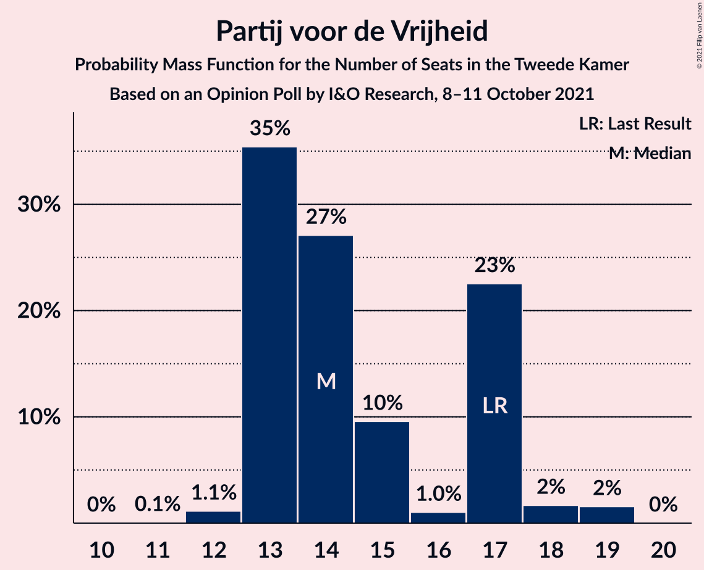
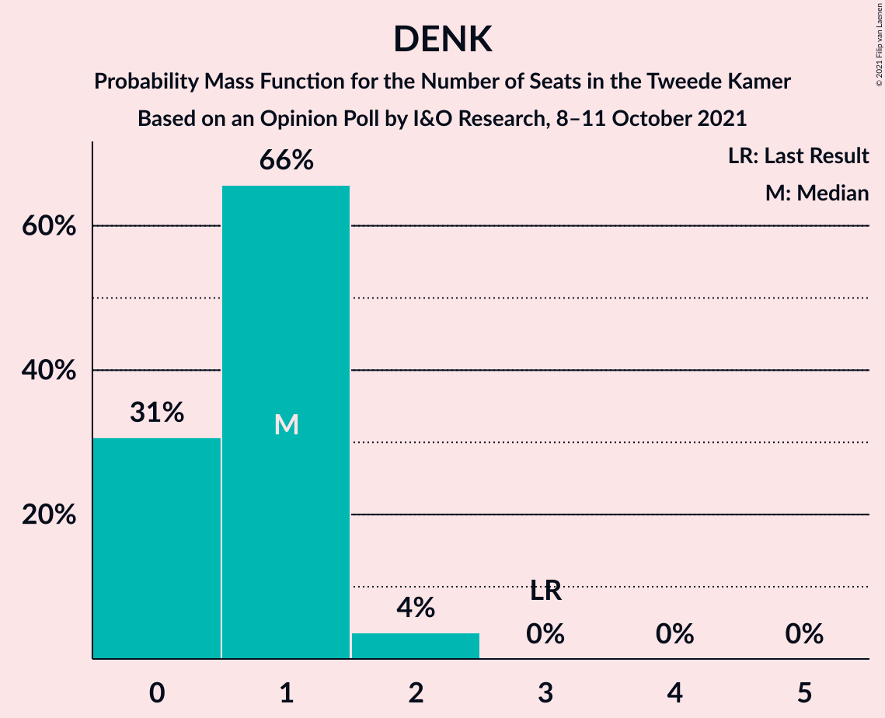
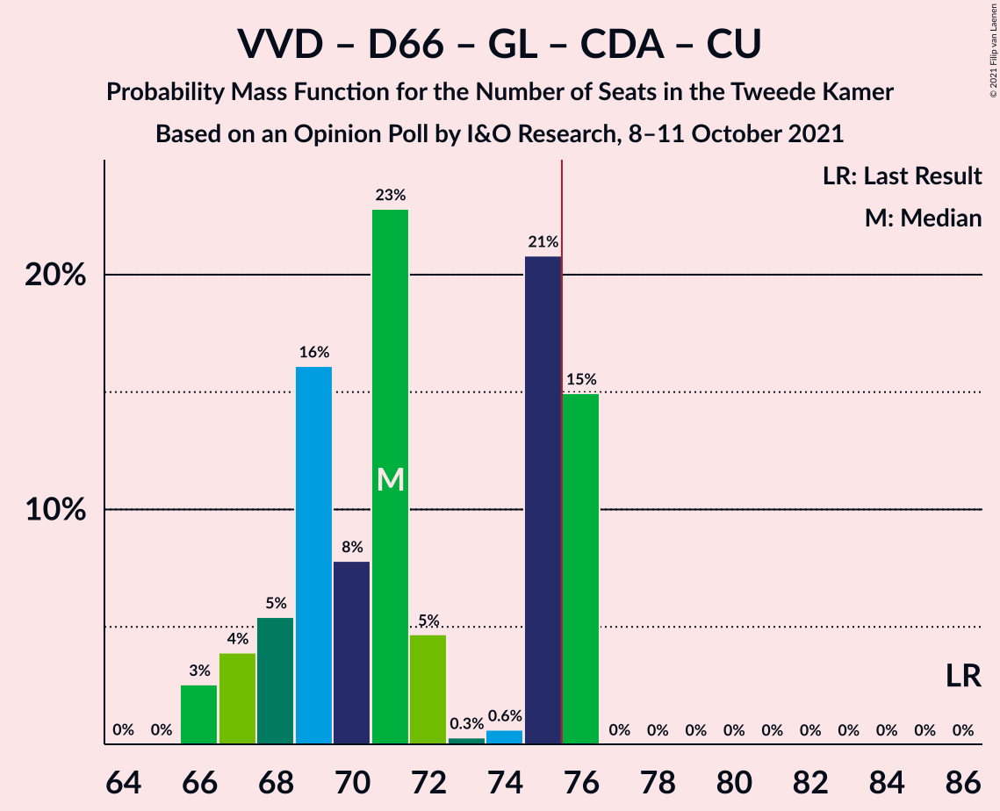
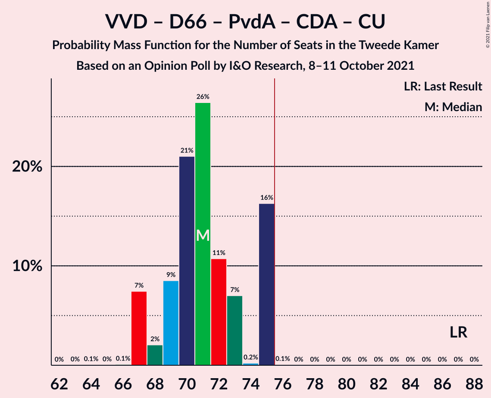
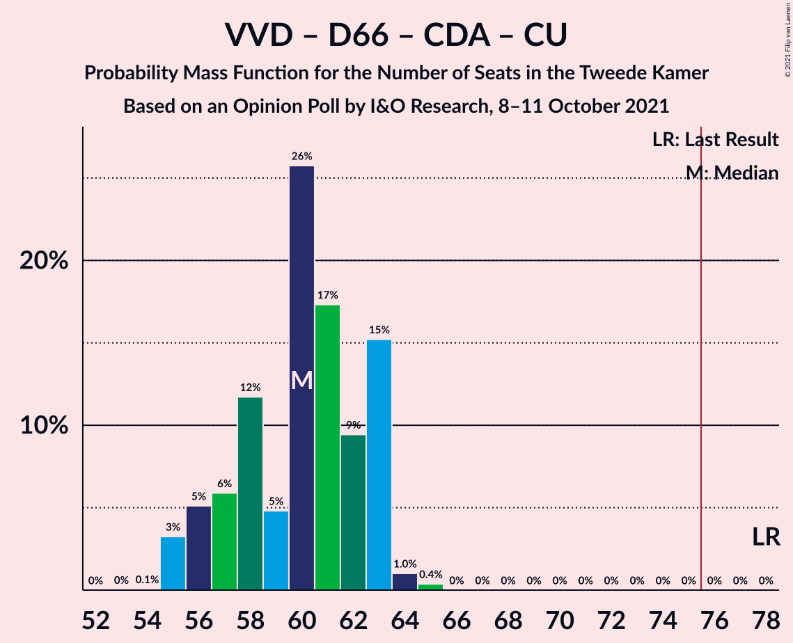
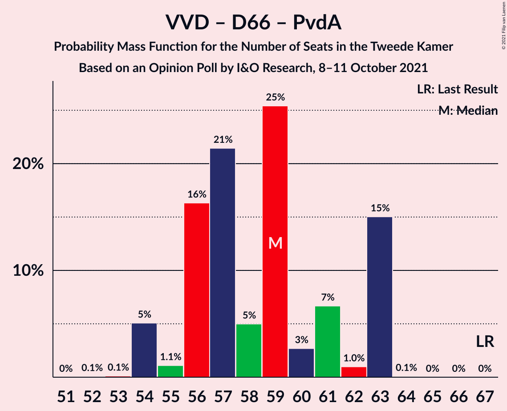
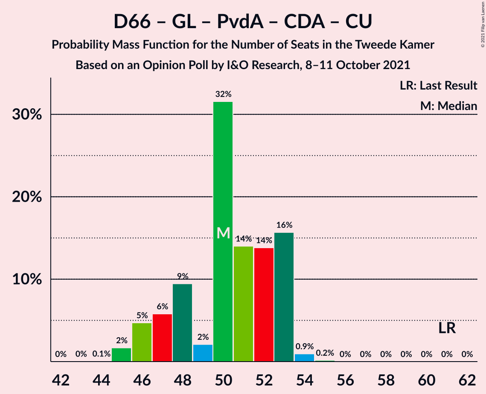

# Opinion Poll by I&O Research, 8–11 October 2021

<a href="#voting-intentions">Voting Intentions</a> | <a href="#seats">Seats</a> | <a href="#coalitions">Coalitions</a> | <a href="#technical-information">Technical Information</a>

## Voting Intentions

### Confidence Intervals

| Party | Last Result | Poll Result | 80% Confidence Interval | 90% Confidence Interval | 95% Confidence Interval | 99% Confidence Interval |
|:-----:|:-----------:|:-----------:|:-----------------------:|:-----------------------:|:-----------------------:|:-----------------------:|
| Volkspartij voor Vrijheid en Democratie | 21.9% | 21.2% | 20.1–22.4% |19.8–22.7% |19.5–23.0% |18.9–23.6% |
| Partij voor de Vrijheid | 10.8% | 9.7% | 8.9–10.6% |8.7–10.8% |8.5–11.1% |8.1–11.5% |
| Democraten 66 | 15.0% | 9.3% | 8.5–10.2% |8.3–10.4% |8.1–10.7% |7.8–11.1% |
| GroenLinks | 5.2% | 7.3% | 6.6–8.1% |6.4–8.3% |6.2–8.5% |5.9–8.9% |
| Partij van de Arbeid | 5.7% | 7.1% | 6.4–7.9% |6.2–8.1% |6.1–8.3% |5.8–8.7% |
| Socialistische Partij | 6.0% | 6.0% | 5.4–6.7% |5.2–6.9% |5.0–7.1% |4.8–7.5% |
| Volt Europa | 2.4% | 5.0% | 4.4–5.7% |4.2–5.8% |4.1–6.0% |3.9–6.3% |
| Partij voor de Dieren | 3.8% | 4.8% | 4.2–5.4% |4.1–5.6% |3.9–5.8% |3.7–6.1% |
| Christen-Democratisch Appèl | 9.5% | 4.2% | 3.7–4.8% |3.5–5.0% |3.4–5.2% |3.2–5.5% |
| ChristenUnie | 3.4% | 4.2% | 3.7–4.8% |3.5–5.0% |3.4–5.2% |3.2–5.5% |
| Juiste Antwoord 2021 | 2.4% | 4.2% | 3.7–4.8% |3.5–5.0% |3.4–5.2% |3.2–5.5% |
| BoerBurgerBeweging | 1.0% | 3.8% | 3.3–4.4% |3.2–4.6% |3.0–4.7% |2.8–5.0% |
| Forum voor Democratie | 5.0% | 3.3% | 2.9–3.9% |2.7–4.0% |2.6–4.2% |2.4–4.5% |
| Staatkundig Gereformeerde Partij | 2.1% | 2.8% | 2.4–3.3% |2.2–3.5% |2.1–3.6% |2.0–3.9% |
| Bij1 | 0.8% | 1.1% | 0.9–1.5% |0.8–1.6% |0.7–1.7% |0.6–1.9% |
| DENK | 2.0% | 0.7% | 0.5–1.0% |0.4–1.1% |0.4–1.1% |0.3–1.3% |
| Belang van Nederland | 0.0% | 0.6% | 0.4–0.9% |0.4–1.0% |0.3–1.0% |0.3–1.2% |
| 50Plus | 1.0% | 0.5% | 0.3–0.8% |0.3–0.8% |0.3–0.9% |0.2–1.1% |

*Note:* The poll result column reflects the actual value used in the calculations. Published results may vary slightly, and in addition be rounded to fewer digits.

## Seats

### Confidence Intervals

| Party | Last Result | Median | 80% Confidence Interval | 90% Confidence Interval | 95% Confidence Interval | 99% Confidence Interval |
|:-----:|:-----------:|:------:|:-----------------------:|:-----------------------:|:-----------------------:|:-----------------------:|
| <a href="#volkspartij-voor-vrijheid-en-democratie">Volkspartij voor Vrijheid en Democratie</a> | 34 | 34 | 31–34 |31–34 |31–34 |30–35 |
| <a href="#partij-voor-de-vrijheid">Partij voor de Vrijheid</a> | 17 | 17 | 12–17 |12–19 |12–19 |12–19 |
| <a href="#democraten-66">Democraten 66</a> | 24 | 14 | 14–15 |14–15 |13–15 |12–17 |
| <a href="#groenlinks">GroenLinks</a> | 8 | 11 | 11–12 |10–12 |10–13 |10–13 |
| <a href="#partij-van-de-arbeid">Partij van de Arbeid</a> | 9 | 12 | 12–13 |10–13 |8–13 |8–13 |
| <a href="#socialistische-partij">Socialistische Partij</a> | 9 | 8 | 8–10 |8–10 |8–10 |8–11 |
| <a href="#volt-europa">Volt Europa</a> | 3 | 7 | 6–8 |5–8 |5–9 |5–10 |
| <a href="#partij-voor-de-dieren">Partij voor de Dieren</a> | 6 | 6 | 6–10 |6–10 |6–10 |6–10 |
| <a href="#christen-democratisch-appèl">Christen-Democratisch Appèl</a> | 15 | 7 | 6–8 |6–8 |5–8 |4–8 |
| <a href="#christenunie">ChristenUnie</a> | 5 | 4 | 4–6 |4–6 |4–8 |4–9 |
| <a href="#juiste-antwoord-2021">Juiste Antwoord 2021</a> | 3 | 6 | 6–7 |6–7 |6–7 |6–8 |
| <a href="#boerburgerbeweging">BoerBurgerBeweging</a> | 1 | 7 | 5–7 |5–7 |5–7 |4–7 |
| <a href="#forum-voor-democratie">Forum voor Democratie</a> | 8 | 6 | 4–6 |4–6 |4–6 |3–7 |
| <a href="#staatkundig-gereformeerde-partij">Staatkundig Gereformeerde Partij</a> | 3 | 4 | 4 |3–4 |3–4 |2–4 |
| <a href="#bij1">Bij1</a> | 1 | 1 | 1–2 |1–2 |1–2 |1–2 |
| <a href="#denk">DENK</a> | 3 | 0 | 0 |0–1 |0–1 |0–1 |
| <a href="#belang-van-nederland">Belang van Nederland</a> | 0 | 0 | 0–1 |0–2 |0–2 |0–2 |
| <a href="#50plus">50Plus</a> | 1 | 0 | 0–1 |0–1 |0–1 |0–1 |

### Volkspartij voor Vrijheid en Democratie

*For a full overview of the results for this party, see the [Volkspartij voor Vrijheid en Democratie](party-volkspartijvoorvrijheidendemocratie.html) page.*

| Number of Seats | Probability | Accumulated | Special Marks |
|:---------------:|:-----------:|:-----------:|:-------------:|
| 28 | 0.1% | 100% |  |
| 29 | 0.1% | 99.9% |  |
| 30 | 0.9% | 99.9% |  |
| 31 | 23% | 98.9% |  |
| 32 | 9% | 76% |  |
| 33 | 0.1% | 67% |  |
| 34 | 66% | 67% | Last Result, Median |
| 35 | 0.3% | 0.5% |  |
| 36 | 0.1% | 0.2% |  |
| 37 | 0% | 0.1% |  |
| 38 | 0.1% | 0.1% |  |
| 39 | 0% | 0% |  |

### Partij voor de Vrijheid

*For a full overview of the results for this party, see the [Partij voor de Vrijheid](party-partijvoordevrijheid.html) page.*

| Number of Seats | Probability | Accumulated | Special Marks |
|:---------------:|:-----------:|:-----------:|:-------------:|
| 12 | 22% | 100% |  |
| 13 | 1.0% | 78% |  |
| 14 | 6% | 77% |  |
| 15 | 3% | 71% |  |
| 16 | 2% | 68% |  |
| 17 | 60% | 66% | Last Result, Median |
| 18 | 0.1% | 7% |  |
| 19 | 6% | 6% |  |
| 20 | 0% | 0% |  |

### Democraten 66

*For a full overview of the results for this party, see the [Democraten 66](party-democraten66.html) page.*

| Number of Seats | Probability | Accumulated | Special Marks |
|:---------------:|:-----------:|:-----------:|:-------------:|
| 11 | 0.1% | 100% |  |
| 12 | 1.5% | 99.9% |  |
| 13 | 2% | 98% |  |
| 14 | 72% | 96% | Median |
| 15 | 22% | 24% |  |
| 16 | 0.5% | 2% |  |
| 17 | 1.3% | 1.3% |  |
| 18 | 0% | 0% |  |
| 19 | 0% | 0% |  |
| 20 | 0% | 0% |  |
| 21 | 0% | 0% |  |
| 22 | 0% | 0% |  |
| 23 | 0% | 0% |  |
| 24 | 0% | 0% | Last Result |

### GroenLinks

*For a full overview of the results for this party, see the [GroenLinks](party-groenlinks.html) page.*

| Number of Seats | Probability | Accumulated | Special Marks |
|:---------------:|:-----------:|:-----------:|:-------------:|
| 8 | 0% | 100% | Last Result |
| 9 | 0.2% | 100% |  |
| 10 | 7% | 99.8% |  |
| 11 | 60% | 93% | Median |
| 12 | 29% | 33% |  |
| 13 | 4% | 4% |  |
| 14 | 0.4% | 0.5% |  |
| 15 | 0% | 0% |  |

### Partij van de Arbeid

*For a full overview of the results for this party, see the [Partij van de Arbeid](party-partijvandearbeid.html) page.*

| Number of Seats | Probability | Accumulated | Special Marks |
|:---------------:|:-----------:|:-----------:|:-------------:|
| 8 | 3% | 100% |  |
| 9 | 0.4% | 97% | Last Result |
| 10 | 2% | 97% |  |
| 11 | 1.3% | 94% |  |
| 12 | 71% | 93% | Median |
| 13 | 22% | 22% |  |
| 14 | 0% | 0% |  |

### Socialistische Partij

*For a full overview of the results for this party, see the [Socialistische Partij](party-socialistischepartij.html) page.*

| Number of Seats | Probability | Accumulated | Special Marks |
|:---------------:|:-----------:|:-----------:|:-------------:|
| 7 | 0.2% | 100% |  |
| 8 | 83% | 99.7% | Median |
| 9 | 6% | 17% | Last Result |
| 10 | 9% | 10% |  |
| 11 | 2% | 2% |  |
| 12 | 0.1% | 0.2% |  |
| 13 | 0% | 0.2% |  |
| 14 | 0.2% | 0.2% |  |
| 15 | 0% | 0% |  |

### Volt Europa

*For a full overview of the results for this party, see the [Volt Europa](party-volteuropa.html) page.*

| Number of Seats | Probability | Accumulated | Special Marks |
|:---------------:|:-----------:|:-----------:|:-------------:|
| 3 | 0% | 100% | Last Result |
| 4 | 0% | 100% |  |
| 5 | 7% | 100% |  |
| 6 | 22% | 93% |  |
| 7 | 61% | 71% | Median |
| 8 | 7% | 10% |  |
| 9 | 3% | 3% |  |
| 10 | 0.5% | 0.5% |  |
| 11 | 0% | 0% |  |

### Partij voor de Dieren

*For a full overview of the results for this party, see the [Partij voor de Dieren](party-partijvoordedieren.html) page.*

| Number of Seats | Probability | Accumulated | Special Marks |
|:---------------:|:-----------:|:-----------:|:-------------:|
| 4 | 0.1% | 100% |  |
| 5 | 0.1% | 99.9% |  |
| 6 | 61% | 99.8% | Last Result, Median |
| 7 | 2% | 38% |  |
| 8 | 14% | 37% |  |
| 9 | 0.5% | 22% |  |
| 10 | 22% | 22% |  |
| 11 | 0% | 0% |  |

### Christen-Democratisch Appèl

*For a full overview of the results for this party, see the [Christen-Democratisch Appèl](party-christen-democratischappèl.html) page.*

| Number of Seats | Probability | Accumulated | Special Marks |
|:---------------:|:-----------:|:-----------:|:-------------:|
| 4 | 2% | 100% |  |
| 5 | 2% | 98% |  |
| 6 | 14% | 97% |  |
| 7 | 60% | 83% | Median |
| 8 | 23% | 23% |  |
| 9 | 0.1% | 0.1% |  |
| 10 | 0% | 0% |  |
| 11 | 0% | 0% |  |
| 12 | 0% | 0% |  |
| 13 | 0% | 0% |  |
| 14 | 0% | 0% |  |
| 15 | 0% | 0% | Last Result |

### ChristenUnie

*For a full overview of the results for this party, see the [ChristenUnie](party-christenunie.html) page.*

| Number of Seats | Probability | Accumulated | Special Marks |
|:---------------:|:-----------:|:-----------:|:-------------:|
| 4 | 59% | 100% | Median |
| 5 | 12% | 41% | Last Result |
| 6 | 25% | 28% |  |
| 7 | 1.1% | 4% |  |
| 8 | 2% | 3% |  |
| 9 | 1.2% | 1.2% |  |
| 10 | 0% | 0% |  |

### Juiste Antwoord 2021

*For a full overview of the results for this party, see the [Juiste Antwoord 2021](party-juisteantwoord2021.html) page.*

| Number of Seats | Probability | Accumulated | Special Marks |
|:---------------:|:-----------:|:-----------:|:-------------:|
| 3 | 0% | 100% | Last Result |
| 4 | 0.1% | 100% |  |
| 5 | 0.2% | 99.9% |  |
| 6 | 72% | 99.7% | Median |
| 7 | 27% | 27% |  |
| 8 | 0.8% | 0.8% |  |
| 9 | 0.1% | 0.1% |  |
| 10 | 0% | 0% |  |

### BoerBurgerBeweging

*For a full overview of the results for this party, see the [BoerBurgerBeweging](party-boerburgerbeweging.html) page.*

| Number of Seats | Probability | Accumulated | Special Marks |
|:---------------:|:-----------:|:-----------:|:-------------:|
| 1 | 0% | 100% | Last Result |
| 2 | 0% | 100% |  |
| 3 | 0% | 100% |  |
| 4 | 1.0% | 100% |  |
| 5 | 38% | 99.0% |  |
| 6 | 0.9% | 61% |  |
| 7 | 60% | 60% | Median |
| 8 | 0.1% | 0.2% |  |
| 9 | 0% | 0% |  |

### Forum voor Democratie

*For a full overview of the results for this party, see the [Forum voor Democratie](party-forumvoordemocratie.html) page.*

| Number of Seats | Probability | Accumulated | Special Marks |
|:---------------:|:-----------:|:-----------:|:-------------:|
| 3 | 1.1% | 100% |  |
| 4 | 35% | 98.9% |  |
| 5 | 3% | 64% |  |
| 6 | 59% | 61% | Median |
| 7 | 1.4% | 2% |  |
| 8 | 0.1% | 0.1% | Last Result |
| 9 | 0% | 0% |  |

### Staatkundig Gereformeerde Partij

*For a full overview of the results for this party, see the [Staatkundig Gereformeerde Partij](party-staatkundiggereformeerdepartij.html) page.*

| Number of Seats | Probability | Accumulated | Special Marks |
|:---------------:|:-----------:|:-----------:|:-------------:|
| 2 | 0.6% | 100% |  |
| 3 | 9% | 99.4% | Last Result |
| 4 | 90% | 91% | Median |
| 5 | 0.2% | 0.4% |  |
| 6 | 0.1% | 0.1% |  |
| 7 | 0.1% | 0.1% |  |
| 8 | 0% | 0% |  |

### Bij1

*For a full overview of the results for this party, see the [Bij1](party-bij1.html) page.*

| Number of Seats | Probability | Accumulated | Special Marks |
|:---------------:|:-----------:|:-----------:|:-------------:|
| 0 | 0.1% | 100% |  |
| 1 | 63% | 99.9% | Last Result, Median |
| 2 | 37% | 37% |  |
| 3 | 0.1% | 0.1% |  |
| 4 | 0% | 0% |  |

### DENK

*For a full overview of the results for this party, see the [DENK](party-denk.html) page.*

| Number of Seats | Probability | Accumulated | Special Marks |
|:---------------:|:-----------:|:-----------:|:-------------:|
| 0 | 92% | 100% | Median |
| 1 | 8% | 8% |  |
| 2 | 0.2% | 0.2% |  |
| 3 | 0% | 0% | Last Result |

### Belang van Nederland

*For a full overview of the results for this party, see the [Belang van Nederland](party-belangvannederland.html) page.*

| Number of Seats | Probability | Accumulated | Special Marks |
|:---------------:|:-----------:|:-----------:|:-------------:|
| 0 | 69% | 100% | Last Result, Median |
| 1 | 25% | 31% |  |
| 2 | 6% | 6% |  |
| 3 | 0% | 0% |  |

### 50Plus

*For a full overview of the results for this party, see the [50Plus](party-50plus.html) page.*

| Number of Seats | Probability | Accumulated | Special Marks |
|:---------------:|:-----------:|:-----------:|:-------------:|
| 0 | 70% | 100% | Median |
| 1 | 30% | 30% | Last Result |
| 2 | 0% | 0% |  |

## Coalitions

### Confidence Intervals

| Coalition | Last Result | Median | Majority? | 80% Confidence Interval | 90% Confidence Interval | 95% Confidence Interval | 99% Confidence Interval |
|:---------:|:-----------:|:------:|:---------:|:-----------------------:|:-----------------------:|:-----------------------:|:-----------------------:|
| Volkspartij voor Vrijheid en Democratie – Democraten 66 – GroenLinks – Christen-Democratisch Appèl – ChristenUnie | 86 | 70 | 0% | 70–72 | 67–72 | 67–74 | 67–74 |
| Volkspartij voor Vrijheid en Democratie – Democraten 66 – Partij van de Arbeid – Christen-Democratisch Appèl – ChristenUnie | 87 | 71 | 0% | 69–73 | 69–73 | 68–73 | 64–73 |
| Volkspartij voor Vrijheid en Democratie – Partij voor de Vrijheid – Christen-Democratisch Appèl – Forum voor Democratie – Staatkundig Gereformeerde Partij | 77 | 68 | 0% | 59–68 | 59–68 | 59–68 | 58–68 |
| Volkspartij voor Vrijheid en Democratie – Partij voor de Vrijheid – Christen-Democratisch Appèl – Forum voor Democratie | 74 | 64 | 0% | 55–64 | 55–64 | 55–64 | 55–64 |
| Democraten 66 – GroenLinks – Partij van de Arbeid – Socialistische Partij – Christen-Democratisch Appèl – ChristenUnie | 70 | 56 | 0% | 56–62 | 56–62 | 56–62 | 55–64 |
| Volkspartij voor Vrijheid en Democratie – Democraten 66 – Christen-Democratisch Appèl – ChristenUnie | 78 | 59 | 0% | 59–60 | 57–60 | 57–61 | 54–62 |
| Volkspartij voor Vrijheid en Democratie – Democraten 66 – Partij van de Arbeid | 67 | 60 | 0% | 58–60 | 56–60 | 55–60 | 53–60 |
| Volkspartij voor Vrijheid en Democratie – Partij voor de Vrijheid – Christen-Democratisch Appèl | 66 | 58 | 0% | 51–58 | 51–58 | 51–58 | 51–58 |
| Volkspartij voor Vrijheid en Democratie – Democraten 66 – Christen-Democratisch Appèl | 73 | 55 | 0% | 52–55 | 52–55 | 52–55 | 48–55 |
| Democraten 66 – GroenLinks – Partij van de Arbeid – Christen-Democratisch Appèl – ChristenUnie | 61 | 48 | 0% | 48–54 | 47–54 | 47–54 | 45–54 |
| Volkspartij voor Vrijheid en Democratie – Partij van de Arbeid – Christen-Democratisch Appèl | 58 | 53 | 0% | 50–53 | 48–53 | 46–53 | 45–53 |
| Volkspartij voor Vrijheid en Democratie – Christen-Democratisch Appèl – Forum voor Democratie – Staatkundig Gereformeerde Partij – 50Plus | 61 | 51 | 0% | 48–51 | 45–51 | 45–51 | 44–51 |
| Volkspartij voor Vrijheid en Democratie – Christen-Democratisch Appèl – Forum voor Democratie – Staatkundig Gereformeerde Partij | 60 | 51 | 0% | 47–51 | 45–51 | 45–51 | 44–51 |
| Volkspartij voor Vrijheid en Democratie – Christen-Democratisch Appèl – Forum voor Democratie – 50Plus | 58 | 47 | 0% | 44–47 | 42–47 | 42–47 | 41–47 |
| Volkspartij voor Vrijheid en Democratie – Christen-Democratisch Appèl – Forum voor Democratie | 57 | 47 | 0% | 43–47 | 42–47 | 42–47 | 41–47 |
| Volkspartij voor Vrijheid en Democratie – Partij van de Arbeid | 43 | 46 | 0% | 44–46 | 42–46 | 42–46 | 39–46 |
| Volkspartij voor Vrijheid en Democratie – Christen-Democratisch Appèl | 49 | 41 | 0% | 38–41 | 38–41 | 37–41 | 36–41 |
| Democraten 66 – Partij van de Arbeid – Christen-Democratisch Appèl | 48 | 33 | 0% | 32–36 | 31–36 | 26–36 | 26–36 |
| Partij van de Arbeid – Christen-Democratisch Appèl – ChristenUnie | 29 | 23 | 0% | 23–27 | 22–27 | 22–27 | 20–27 |
| Democraten 66 – Christen-Democratisch Appèl | 39 | 21 | 0% | 20–23 | 20–23 | 18–23 | 16–23 |
| Partij van de Arbeid – Christen-Democratisch Appèl | 24 | 19 | 0% | 18–21 | 16–21 | 14–21 | 13–21 |

### Volkspartij voor Vrijheid en Democratie – Democraten 66 – GroenLinks – Christen-Democratisch Appèl – ChristenUnie

| Number of Seats | Probability | Accumulated | Special Marks |
|:---------------:|:-----------:|:-----------:|:-------------:|
| 67 | 8% | 100% |  |
| 68 | 0.4% | 92% |  |
| 69 | 0.1% | 92% |  |
| 70 | 59% | 92% | Median |
| 71 | 6% | 32% |  |
| 72 | 23% | 26% |  |
| 73 | 0.2% | 3% |  |
| 74 | 3% | 3% |  |
| 75 | 0.1% | 0.2% |  |
| 76 | 0% | 0% | Majority |
| 77 | 0% | 0% |  |
| 78 | 0% | 0% |  |
| 79 | 0% | 0% |  |
| 80 | 0% | 0% |  |
| 81 | 0% | 0% |  |
| 82 | 0% | 0% |  |
| 83 | 0% | 0% |  |
| 84 | 0% | 0% |  |
| 85 | 0% | 0% |  |
| 86 | 0% | 0% | Last Result |

### Volkspartij voor Vrijheid en Democratie – Democraten 66 – Partij van de Arbeid – Christen-Democratisch Appèl – ChristenUnie

| Number of Seats | Probability | Accumulated | Special Marks |
|:---------------:|:-----------:|:-----------:|:-------------:|
| 64 | 1.3% | 100% |  |
| 65 | 0.2% | 98.7% |  |
| 66 | 0% | 98% |  |
| 67 | 0.3% | 98% |  |
| 68 | 0.7% | 98% |  |
| 69 | 8% | 97% |  |
| 70 | 2% | 89% |  |
| 71 | 66% | 88% | Median |
| 72 | 0.1% | 22% |  |
| 73 | 22% | 22% |  |
| 74 | 0% | 0.1% |  |
| 75 | 0.1% | 0.1% |  |
| 76 | 0% | 0% | Majority |
| 77 | 0% | 0% |  |
| 78 | 0% | 0% |  |
| 79 | 0% | 0% |  |
| 80 | 0% | 0% |  |
| 81 | 0% | 0% |  |
| 82 | 0% | 0% |  |
| 83 | 0% | 0% |  |
| 84 | 0% | 0% |  |
| 85 | 0% | 0% |  |
| 86 | 0% | 0% |  |
| 87 | 0% | 0% | Last Result |

### Volkspartij voor Vrijheid en Democratie – Partij voor de Vrijheid – Christen-Democratisch Appèl – Forum voor Democratie – Staatkundig Gereformeerde Partij

| Number of Seats | Probability | Accumulated | Special Marks |
|:---------------:|:-----------:|:-----------:|:-------------:|
| 57 | 0% | 100% |  |
| 58 | 0.5% | 99.9% |  |
| 59 | 23% | 99.4% |  |
| 60 | 0.5% | 76% |  |
| 61 | 0.5% | 76% |  |
| 62 | 7% | 75% |  |
| 63 | 0.2% | 68% |  |
| 64 | 8% | 68% |  |
| 65 | 0.1% | 60% |  |
| 66 | 0.3% | 60% |  |
| 67 | 0.1% | 59% |  |
| 68 | 59% | 59% | Median |
| 69 | 0% | 0.1% |  |
| 70 | 0% | 0% |  |
| 71 | 0% | 0% |  |
| 72 | 0% | 0% |  |
| 73 | 0% | 0% |  |
| 74 | 0% | 0% |  |
| 75 | 0% | 0% |  |
| 76 | 0% | 0% | Majority |
| 77 | 0% | 0% | Last Result |

### Volkspartij voor Vrijheid en Democratie – Partij voor de Vrijheid – Christen-Democratisch Appèl – Forum voor Democratie

| Number of Seats | Probability | Accumulated | Special Marks |
|:---------------:|:-----------:|:-----------:|:-------------:|
| 53 | 0% | 100% |  |
| 54 | 0% | 99.9% |  |
| 55 | 22% | 99.9% |  |
| 56 | 2% | 78% |  |
| 57 | 0.2% | 76% |  |
| 58 | 7% | 76% |  |
| 59 | 0.8% | 69% |  |
| 60 | 2% | 68% |  |
| 61 | 7% | 66% |  |
| 62 | 0.2% | 60% |  |
| 63 | 0.1% | 59% |  |
| 64 | 59% | 59% | Median |
| 65 | 0% | 0% |  |
| 66 | 0% | 0% |  |
| 67 | 0% | 0% |  |
| 68 | 0% | 0% |  |
| 69 | 0% | 0% |  |
| 70 | 0% | 0% |  |
| 71 | 0% | 0% |  |
| 72 | 0% | 0% |  |
| 73 | 0% | 0% |  |
| 74 | 0% | 0% | Last Result |

### Democraten 66 – GroenLinks – Partij van de Arbeid – Socialistische Partij – Christen-Democratisch Appèl – ChristenUnie

| Number of Seats | Probability | Accumulated | Special Marks |
|:---------------:|:-----------:|:-----------:|:-------------:|
| 53 | 0.1% | 100% |  |
| 54 | 0.3% | 99.9% |  |
| 55 | 1.4% | 99.6% |  |
| 56 | 59% | 98% | Median |
| 57 | 7% | 39% |  |
| 58 | 5% | 31% |  |
| 59 | 3% | 26% |  |
| 60 | 0.1% | 23% |  |
| 61 | 0.3% | 23% |  |
| 62 | 22% | 22% |  |
| 63 | 0.1% | 0.6% |  |
| 64 | 0.5% | 0.5% |  |
| 65 | 0% | 0% |  |
| 66 | 0% | 0% |  |
| 67 | 0% | 0% |  |
| 68 | 0% | 0% |  |
| 69 | 0% | 0% |  |
| 70 | 0% | 0% | Last Result |

### Volkspartij voor Vrijheid en Democratie – Democraten 66 – Christen-Democratisch Appèl – ChristenUnie

| Number of Seats | Probability | Accumulated | Special Marks |
|:---------------:|:-----------:|:-----------:|:-------------:|
| 54 | 1.3% | 100% |  |
| 55 | 0% | 98.7% |  |
| 56 | 0.1% | 98.6% |  |
| 57 | 7% | 98.5% |  |
| 58 | 0.8% | 92% |  |
| 59 | 65% | 91% | Median |
| 60 | 23% | 26% |  |
| 61 | 1.5% | 3% |  |
| 62 | 1.4% | 2% |  |
| 63 | 0.1% | 0.2% |  |
| 64 | 0.1% | 0.1% |  |
| 65 | 0% | 0% |  |
| 66 | 0% | 0% |  |
| 67 | 0% | 0% |  |
| 68 | 0% | 0% |  |
| 69 | 0% | 0% |  |
| 70 | 0% | 0% |  |
| 71 | 0% | 0% |  |
| 72 | 0% | 0% |  |
| 73 | 0% | 0% |  |
| 74 | 0% | 0% |  |
| 75 | 0% | 0% |  |
| 76 | 0% | 0% | Majority |
| 77 | 0% | 0% |  |
| 78 | 0% | 0% | Last Result |

### Volkspartij voor Vrijheid en Democratie – Democraten 66 – Partij van de Arbeid

| Number of Seats | Probability | Accumulated | Special Marks |
|:---------------:|:-----------:|:-----------:|:-------------:|
| 52 | 0.2% | 100% |  |
| 53 | 0.3% | 99.8% |  |
| 54 | 1.4% | 99.4% |  |
| 55 | 2% | 98% |  |
| 56 | 2% | 96% |  |
| 57 | 0.5% | 95% |  |
| 58 | 7% | 94% |  |
| 59 | 22% | 87% |  |
| 60 | 65% | 65% | Median |
| 61 | 0.1% | 0.2% |  |
| 62 | 0.1% | 0.1% |  |
| 63 | 0% | 0% |  |
| 64 | 0% | 0% |  |
| 65 | 0% | 0% |  |
| 66 | 0% | 0% |  |
| 67 | 0% | 0% | Last Result |

### Volkspartij voor Vrijheid en Democratie – Partij voor de Vrijheid – Christen-Democratisch Appèl

| Number of Seats | Probability | Accumulated | Special Marks |
|:---------------:|:-----------:|:-----------:|:-------------:|
| 49 | 0% | 100% |  |
| 50 | 0.1% | 99.9% |  |
| 51 | 24% | 99.8% |  |
| 52 | 2% | 76% |  |
| 53 | 0.4% | 74% |  |
| 54 | 6% | 74% |  |
| 55 | 2% | 68% |  |
| 56 | 0.5% | 67% |  |
| 57 | 7% | 66% |  |
| 58 | 59% | 59% | Median |
| 59 | 0% | 0.1% |  |
| 60 | 0.1% | 0.1% |  |
| 61 | 0% | 0% |  |
| 62 | 0% | 0% |  |
| 63 | 0% | 0% |  |
| 64 | 0% | 0% |  |
| 65 | 0% | 0% |  |
| 66 | 0% | 0% | Last Result |

### Volkspartij voor Vrijheid en Democratie – Democraten 66 – Christen-Democratisch Appèl

| Number of Seats | Probability | Accumulated | Special Marks |
|:---------------:|:-----------:|:-----------:|:-------------:|
| 48 | 1.3% | 100% |  |
| 49 | 0.1% | 98.7% |  |
| 50 | 0.2% | 98.6% |  |
| 51 | 0.5% | 98% |  |
| 52 | 9% | 98% |  |
| 53 | 0.6% | 89% |  |
| 54 | 29% | 89% |  |
| 55 | 59% | 60% | Median |
| 56 | 0.1% | 0.3% |  |
| 57 | 0.1% | 0.2% |  |
| 58 | 0.1% | 0.1% |  |
| 59 | 0% | 0% |  |
| 60 | 0% | 0% |  |
| 61 | 0% | 0% |  |
| 62 | 0% | 0% |  |
| 63 | 0% | 0% |  |
| 64 | 0% | 0% |  |
| 65 | 0% | 0% |  |
| 66 | 0% | 0% |  |
| 67 | 0% | 0% |  |
| 68 | 0% | 0% |  |
| 69 | 0% | 0% |  |
| 70 | 0% | 0% |  |
| 71 | 0% | 0% |  |
| 72 | 0% | 0% |  |
| 73 | 0% | 0% | Last Result |

### Democraten 66 – GroenLinks – Partij van de Arbeid – Christen-Democratisch Appèl – ChristenUnie

| Number of Seats | Probability | Accumulated | Special Marks |
|:---------------:|:-----------:|:-----------:|:-------------:|
| 44 | 0.1% | 100% |  |
| 45 | 1.5% | 99.9% |  |
| 46 | 0.2% | 98% |  |
| 47 | 7% | 98% |  |
| 48 | 61% | 91% | Median |
| 49 | 6% | 30% |  |
| 50 | 0.7% | 25% |  |
| 51 | 2% | 24% |  |
| 52 | 0.1% | 22% |  |
| 53 | 0% | 22% |  |
| 54 | 22% | 22% |  |
| 55 | 0.4% | 0.4% |  |
| 56 | 0% | 0% |  |
| 57 | 0% | 0% |  |
| 58 | 0% | 0% |  |
| 59 | 0% | 0% |  |
| 60 | 0% | 0% |  |
| 61 | 0% | 0% | Last Result |

### Volkspartij voor Vrijheid en Democratie – Partij van de Arbeid – Christen-Democratisch Appèl

| Number of Seats | Probability | Accumulated | Special Marks |
|:---------------:|:-----------:|:-----------:|:-------------:|
| 44 | 0.3% | 100% |  |
| 45 | 1.3% | 99.7% |  |
| 46 | 2% | 98% |  |
| 47 | 1.5% | 97% |  |
| 48 | 0.7% | 95% |  |
| 49 | 0.9% | 95% |  |
| 50 | 7% | 94% |  |
| 51 | 0.8% | 87% |  |
| 52 | 27% | 87% |  |
| 53 | 59% | 59% | Median |
| 54 | 0.1% | 0.1% |  |
| 55 | 0% | 0% |  |
| 56 | 0% | 0% |  |
| 57 | 0% | 0% |  |
| 58 | 0% | 0% | Last Result |

### Volkspartij voor Vrijheid en Democratie – Christen-Democratisch Appèl – Forum voor Democratie – Staatkundig Gereformeerde Partij – 50Plus

| Number of Seats | Probability | Accumulated | Special Marks |
|:---------------:|:-----------:|:-----------:|:-------------:|
| 42 | 0.1% | 100% |  |
| 43 | 0% | 99.9% |  |
| 44 | 1.2% | 99.9% |  |
| 45 | 7% | 98.7% |  |
| 46 | 0.7% | 91% |  |
| 47 | 0.1% | 91% |  |
| 48 | 25% | 91% |  |
| 49 | 6% | 65% |  |
| 50 | 0.1% | 60% |  |
| 51 | 59% | 60% | Median |
| 52 | 0.1% | 0.2% |  |
| 53 | 0% | 0.1% |  |
| 54 | 0% | 0.1% |  |
| 55 | 0% | 0% |  |
| 56 | 0% | 0% |  |
| 57 | 0% | 0% |  |
| 58 | 0% | 0% |  |
| 59 | 0% | 0% |  |
| 60 | 0% | 0% |  |
| 61 | 0% | 0% | Last Result |

### Volkspartij voor Vrijheid en Democratie – Christen-Democratisch Appèl – Forum voor Democratie – Staatkundig Gereformeerde Partij

| Number of Seats | Probability | Accumulated | Special Marks |
|:---------------:|:-----------:|:-----------:|:-------------:|
| 42 | 0.1% | 100% |  |
| 43 | 0% | 99.9% |  |
| 44 | 2% | 99.9% |  |
| 45 | 8% | 98% |  |
| 46 | 0.2% | 91% |  |
| 47 | 24% | 91% |  |
| 48 | 7% | 67% |  |
| 49 | 0.3% | 60% |  |
| 50 | 0.2% | 60% |  |
| 51 | 59% | 59% | Median |
| 52 | 0% | 0.1% |  |
| 53 | 0% | 0.1% |  |
| 54 | 0% | 0% |  |
| 55 | 0% | 0% |  |
| 56 | 0% | 0% |  |
| 57 | 0% | 0% |  |
| 58 | 0% | 0% |  |
| 59 | 0% | 0% |  |
| 60 | 0% | 0% | Last Result |

### Volkspartij voor Vrijheid en Democratie – Christen-Democratisch Appèl – Forum voor Democratie – 50Plus

| Number of Seats | Probability | Accumulated | Special Marks |
|:---------------:|:-----------:|:-----------:|:-------------:|
| 39 | 0% | 100% |  |
| 40 | 0% | 99.9% |  |
| 41 | 2% | 99.9% |  |
| 42 | 7% | 98% |  |
| 43 | 0.1% | 91% |  |
| 44 | 26% | 91% |  |
| 45 | 5% | 65% |  |
| 46 | 0.3% | 60% |  |
| 47 | 59% | 60% | Median |
| 48 | 0.1% | 0.2% |  |
| 49 | 0% | 0.1% |  |
| 50 | 0.1% | 0.1% |  |
| 51 | 0% | 0% |  |
| 52 | 0% | 0% |  |
| 53 | 0% | 0% |  |
| 54 | 0% | 0% |  |
| 55 | 0% | 0% |  |
| 56 | 0% | 0% |  |
| 57 | 0% | 0% |  |
| 58 | 0% | 0% | Last Result |

### Volkspartij voor Vrijheid en Democratie – Christen-Democratisch Appèl – Forum voor Democratie

| Number of Seats | Probability | Accumulated | Special Marks |
|:---------------:|:-----------:|:-----------:|:-------------:|
| 39 | 0% | 100% |  |
| 40 | 0% | 99.9% |  |
| 41 | 2% | 99.9% |  |
| 42 | 7% | 98% |  |
| 43 | 24% | 91% |  |
| 44 | 7% | 67% |  |
| 45 | 0.1% | 60% |  |
| 46 | 0.3% | 60% |  |
| 47 | 59% | 60% | Median |
| 48 | 0% | 0.1% |  |
| 49 | 0.1% | 0.1% |  |
| 50 | 0% | 0% |  |
| 51 | 0% | 0% |  |
| 52 | 0% | 0% |  |
| 53 | 0% | 0% |  |
| 54 | 0% | 0% |  |
| 55 | 0% | 0% |  |
| 56 | 0% | 0% |  |
| 57 | 0% | 0% | Last Result |

### Volkspartij voor Vrijheid en Democratie – Partij van de Arbeid

| Number of Seats | Probability | Accumulated | Special Marks |
|:---------------:|:-----------:|:-----------:|:-------------:|
| 38 | 0.4% | 100% |  |
| 39 | 1.3% | 99.6% |  |
| 40 | 0.1% | 98% |  |
| 41 | 0.6% | 98% |  |
| 42 | 3% | 98% |  |
| 43 | 0.7% | 95% | Last Result |
| 44 | 29% | 94% |  |
| 45 | 0.2% | 65% |  |
| 46 | 65% | 65% | Median |
| 47 | 0.1% | 0.1% |  |
| 48 | 0% | 0.1% |  |
| 49 | 0.1% | 0.1% |  |
| 50 | 0% | 0% |  |

### Volkspartij voor Vrijheid en Democratie – Christen-Democratisch Appèl

| Number of Seats | Probability | Accumulated | Special Marks |
|:---------------:|:-----------:|:-----------:|:-------------:|
| 35 | 0% | 100% |  |
| 36 | 2% | 99.9% |  |
| 37 | 2% | 98% |  |
| 38 | 8% | 97% |  |
| 39 | 23% | 89% |  |
| 40 | 6% | 66% |  |
| 41 | 59% | 60% | Median |
| 42 | 0.1% | 0.4% |  |
| 43 | 0.2% | 0.2% |  |
| 44 | 0% | 0% |  |
| 45 | 0% | 0% |  |
| 46 | 0% | 0% |  |
| 47 | 0% | 0% |  |
| 48 | 0% | 0% |  |
| 49 | 0% | 0% | Last Result |

### Democraten 66 – Partij van de Arbeid – Christen-Democratisch Appèl

| Number of Seats | Probability | Accumulated | Special Marks |
|:---------------:|:-----------:|:-----------:|:-------------:|
| 26 | 3% | 100% |  |
| 27 | 0% | 97% |  |
| 28 | 0.6% | 97% |  |
| 29 | 0.8% | 97% |  |
| 30 | 0.5% | 96% |  |
| 31 | 1.4% | 96% |  |
| 32 | 12% | 94% |  |
| 33 | 60% | 82% | Median |
| 34 | 0.1% | 22% |  |
| 35 | 0.4% | 22% |  |
| 36 | 22% | 22% |  |
| 37 | 0% | 0% |  |
| 38 | 0% | 0% |  |
| 39 | 0% | 0% |  |
| 40 | 0% | 0% |  |
| 41 | 0% | 0% |  |
| 42 | 0% | 0% |  |
| 43 | 0% | 0% |  |
| 44 | 0% | 0% |  |
| 45 | 0% | 0% |  |
| 46 | 0% | 0% |  |
| 47 | 0% | 0% |  |
| 48 | 0% | 0% | Last Result |

### Partij van de Arbeid – Christen-Democratisch Appèl – ChristenUnie

| Number of Seats | Probability | Accumulated | Special Marks |
|:---------------:|:-----------:|:-----------:|:-------------:|
| 20 | 2% | 100% |  |
| 21 | 0.3% | 98% |  |
| 22 | 3% | 98% |  |
| 23 | 71% | 95% | Median |
| 24 | 0.5% | 23% |  |
| 25 | 0.7% | 23% |  |
| 26 | 0.5% | 22% |  |
| 27 | 22% | 22% |  |
| 28 | 0% | 0% |  |
| 29 | 0% | 0% | Last Result |

### Democraten 66 – Christen-Democratisch Appèl

| Number of Seats | Probability | Accumulated | Special Marks |
|:---------------:|:-----------:|:-----------:|:-------------:|
| 16 | 1.3% | 100% |  |
| 17 | 0% | 98.7% |  |
| 18 | 2% | 98.7% |  |
| 19 | 0.6% | 97% |  |
| 20 | 12% | 96% |  |
| 21 | 60% | 84% | Median |
| 22 | 0.4% | 24% |  |
| 23 | 23% | 24% |  |
| 24 | 0.4% | 0.5% |  |
| 25 | 0% | 0% |  |
| 26 | 0% | 0% |  |
| 27 | 0% | 0% |  |
| 28 | 0% | 0% |  |
| 29 | 0% | 0% |  |
| 30 | 0% | 0% |  |
| 31 | 0% | 0% |  |
| 32 | 0% | 0% |  |
| 33 | 0% | 0% |  |
| 34 | 0% | 0% |  |
| 35 | 0% | 0% |  |
| 36 | 0% | 0% |  |
| 37 | 0% | 0% |  |
| 38 | 0% | 0% |  |
| 39 | 0% | 0% | Last Result |

### Partij van de Arbeid – Christen-Democratisch Appèl

| Number of Seats | Probability | Accumulated | Special Marks |
|:---------------:|:-----------:|:-----------:|:-------------:|
| 13 | 1.2% | 100% |  |
| 14 | 3% | 98.8% |  |
| 15 | 0.1% | 95% |  |
| 16 | 0.6% | 95% |  |
| 17 | 0.8% | 95% |  |
| 18 | 12% | 94% |  |
| 19 | 60% | 82% | Median |
| 20 | 0% | 22% |  |
| 21 | 22% | 22% |  |
| 22 | 0% | 0% |  |
| 23 | 0% | 0% |  |
| 24 | 0% | 0% | Last Result |

## Technical Information

### Opinion Poll

+ **Polling firm:** I&O Research
+ **Commissioner(s):** —
+ **Fieldwork period:** 8–11 October 2021

### Calculations

+ **Sample size:** 2052
+ **Simulations done:** 131,072
+ **Error estimate:** 1.55%

