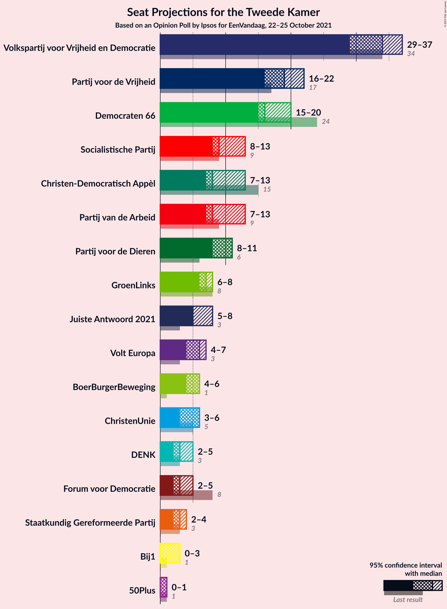
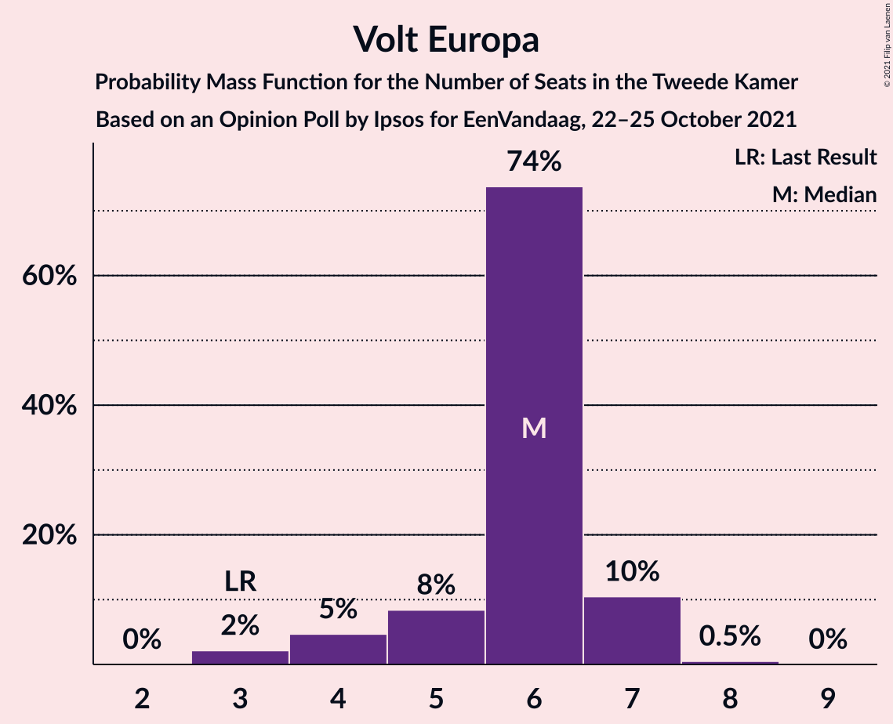
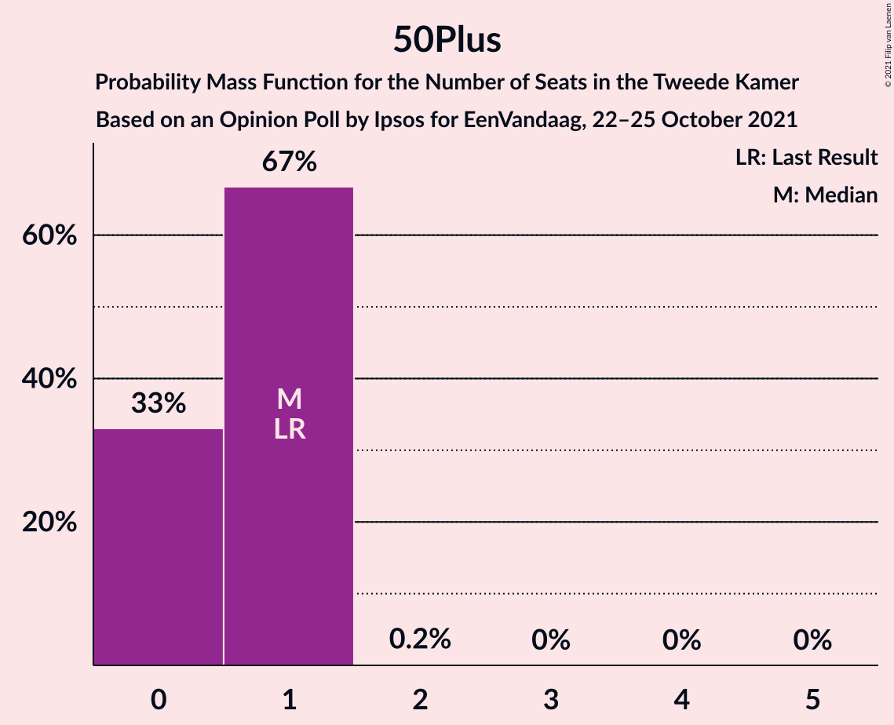
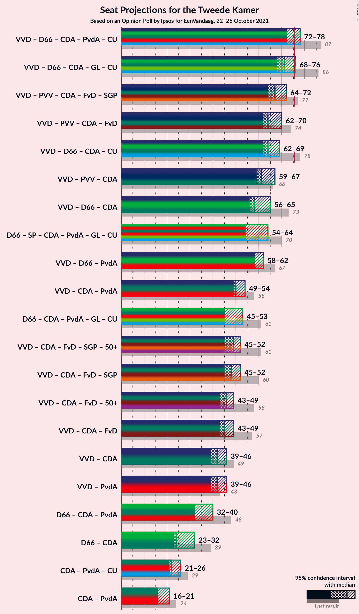
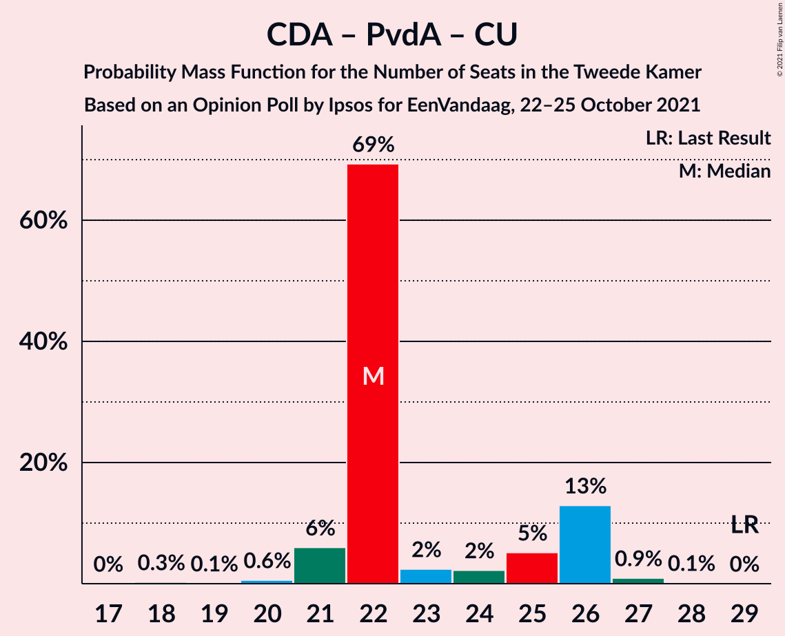

# Opinion Poll by Ipsos for EenVandaag, 22–25 October 2021

<a href="#voting-intentions">Voting Intentions</a> | <a href="#seats">Seats</a> | <a href="#coalitions">Coalitions</a> | <a href="#technical-information">Technical Information</a>

## Voting Intentions

### Confidence Intervals

| Party | Last Result | Poll Result | 80% Confidence Interval | 90% Confidence Interval | 95% Confidence Interval | 99% Confidence Interval |
|:-----:|:-----------:|:-----------:|:-----------------------:|:-----------------------:|:-----------------------:|:-----------------------:|
| Volkspartij voor Vrijheid en Democratie | 21.9% | 21.6% | 20.0–23.4% |19.6–23.8% |19.2–24.3% |18.5–25.1% |
| Partij voor de Vrijheid | 10.8% | 12.0% | 10.8–13.4% |10.4–13.8% |10.1–14.1% |9.6–14.8% |
| Democraten 66 | 15.0% | 12.0% | 10.8–13.4% |10.4–13.8% |10.1–14.1% |9.6–14.8% |
| Socialistische Partij | 6.0% | 6.3% | 5.5–7.4% |5.2–7.7% |5.0–8.0% |4.6–8.6% |
| Christen-Democratisch Appèl | 9.5% | 6.0% | 5.2–7.1% |4.9–7.4% |4.7–7.7% |4.4–8.2% |
| Partij voor de Dieren | 3.8% | 6.0% | 5.2–7.1% |4.9–7.4% |4.7–7.7% |4.4–8.2% |
| Partij van de Arbeid | 5.7% | 5.9% | 5.1–7.0% |4.8–7.3% |4.6–7.6% |4.3–8.1% |
| GroenLinks | 5.2% | 4.8% | 4.0–5.7% |3.8–6.0% |3.6–6.3% |3.3–6.8% |
| Juiste Antwoord 2021 | 2.4% | 4.0% | 3.3–4.9% |3.1–5.2% |3.0–5.4% |2.7–5.9% |
| Volt Europa | 2.4% | 4.0% | 3.3–4.9% |3.1–5.2% |3.0–5.4% |2.7–5.9% |
| ChristenUnie | 3.4% | 3.6% | 3.0–4.5% |2.8–4.7% |2.6–4.9% |2.3–5.4% |
| BoerBurgerBeweging | 1.0% | 3.5% | 2.9–4.4% |2.7–4.6% |2.5–4.8% |2.3–5.3% |
| DENK | 2.0% | 2.4% | 1.9–3.2% |1.8–3.4% |1.6–3.6% |1.4–4.0% |
| Forum voor Democratie | 5.0% | 2.4% | 1.9–3.2% |1.8–3.4% |1.6–3.6% |1.4–4.0% |
| Staatkundig Gereformeerde Partij | 2.1% | 2.0% | 1.6–2.7% |1.4–2.9% |1.3–3.1% |1.1–3.5% |
| Bij1 | 0.8% | 1.1% | 0.8–1.6% |0.7–1.8% |0.6–1.9% |0.5–2.2% |
| 50Plus | 1.0% | 0.5% | 0.3–0.9% |0.2–1.0% |0.2–1.1% |0.1–1.4% |

*Note:* The poll result column reflects the actual value used in the calculations. Published results may vary slightly, and in addition be rounded to fewer digits.

## Seats

### Confidence Intervals

| Party | Last Result | Median | 80% Confidence Interval | 90% Confidence Interval | 95% Confidence Interval | 99% Confidence Interval |
|:-----:|:-----------:|:------:|:-----------------------:|:-----------------------:|:-----------------------:|:-----------------------:|
| <a href="#volkspartij-voor-vrijheid-en-democratie">Volkspartij voor Vrijheid en Democratie</a> | 34 | 32 | 32–38 |31–38 |28–38 |28–39 |
| <a href="#partij-voor-de-vrijheid">Partij voor de Vrijheid</a> | 17 | 18 | 17–21 |16–21 |16–21 |14–22 |
| <a href="#democraten-66">Democraten 66</a> | 24 | 19 | 18–22 |16–22 |16–22 |15–22 |
| <a href="#socialistische-partij">Socialistische Partij</a> | 9 | 8 | 7–9 |7–11 |7–11 |7–12 |
| <a href="#christen-democratisch-appèl">Christen-Democratisch Appèl</a> | 15 | 9 | 7–13 |7–13 |7–13 |7–13 |
| <a href="#partij-voor-de-dieren">Partij voor de Dieren</a> | 6 | 11 | 7–11 |7–11 |7–11 |7–11 |
| <a href="#partij-van-de-arbeid">Partij van de Arbeid</a> | 9 | 9 | 8–12 |8–12 |6–12 |5–12 |
| <a href="#groenlinks">GroenLinks</a> | 8 | 8 | 6–11 |6–11 |6–11 |5–11 |
| <a href="#juiste-antwoord-2021">Juiste Antwoord 2021</a> | 3 | 6 | 5–8 |5–8 |4–8 |4–8 |
| <a href="#volt-europa">Volt Europa</a> | 3 | 5 | 4–6 |4–7 |3–8 |3–8 |
| <a href="#christenunie">ChristenUnie</a> | 5 | 4 | 3–5 |3–5 |3–6 |3–8 |
| <a href="#boerburgerbeweging">BoerBurgerBeweging</a> | 1 | 5 | 3–6 |3–6 |3–6 |3–7 |
| <a href="#denk">DENK</a> | 3 | 2 | 2–3 |2–5 |2–5 |2–5 |
| <a href="#forum-voor-democratie">Forum voor Democratie</a> | 8 | 4 | 3–5 |3–5 |2–7 |2–7 |
| <a href="#staatkundig-gereformeerde-partij">Staatkundig Gereformeerde Partij</a> | 3 | 3 | 2–4 |2–4 |2–4 |2–5 |
| <a href="#bij1">Bij1</a> | 1 | 1 | 1–2 |1–2 |0–2 |0–2 |
| <a href="#50plus">50Plus</a> | 1 | 0 | 0–1 |0–1 |0–1 |0–1 |

### Volkspartij voor Vrijheid en Democratie

*For a full overview of the results for this party, see the [Volkspartij voor Vrijheid en Democratie](party-volkspartijvoorvrijheidendemocratie.html) page.*

| Number of Seats | Probability | Accumulated | Special Marks |
|:---------------:|:-----------:|:-----------:|:-------------:|
| 26 | 0.1% | 100% |  |
| 27 | 0% | 99.9% |  |
| 28 | 4% | 99.8% |  |
| 29 | 0.7% | 96% |  |
| 30 | 0.1% | 96% |  |
| 31 | 4% | 95% |  |
| 32 | 55% | 91% | Median |
| 33 | 11% | 36% |  |
| 34 | 4% | 24% | Last Result |
| 35 | 3% | 20% |  |
| 36 | 0.4% | 18% |  |
| 37 | 0.1% | 17% |  |
| 38 | 16% | 17% |  |
| 39 | 0.7% | 0.7% |  |
| 40 | 0% | 0% |  |

### Partij voor de Vrijheid

*For a full overview of the results for this party, see the [Partij voor de Vrijheid](party-partijvoordevrijheid.html) page.*

| Number of Seats | Probability | Accumulated | Special Marks |
|:---------------:|:-----------:|:-----------:|:-------------:|
| 13 | 0.1% | 100% |  |
| 14 | 0.5% | 99.9% |  |
| 15 | 0.8% | 99.4% |  |
| 16 | 4% | 98.7% |  |
| 17 | 40% | 95% | Last Result |
| 18 | 28% | 55% | Median |
| 19 | 10% | 28% |  |
| 20 | 0.3% | 18% |  |
| 21 | 15% | 17% |  |
| 22 | 2% | 2% |  |
| 23 | 0% | 0% |  |

### Democraten 66

*For a full overview of the results for this party, see the [Democraten 66](party-democraten66.html) page.*

| Number of Seats | Probability | Accumulated | Special Marks |
|:---------------:|:-----------:|:-----------:|:-------------:|
| 14 | 0.2% | 100% |  |
| 15 | 0.5% | 99.8% |  |
| 16 | 7% | 99.3% |  |
| 17 | 0.2% | 93% |  |
| 18 | 33% | 92% |  |
| 19 | 28% | 60% | Median |
| 20 | 3% | 32% |  |
| 21 | 1.1% | 29% |  |
| 22 | 27% | 28% |  |
| 23 | 0% | 0.4% |  |
| 24 | 0.4% | 0.4% | Last Result |
| 25 | 0% | 0% |  |

### Socialistische Partij

*For a full overview of the results for this party, see the [Socialistische Partij](party-socialistischepartij.html) page.*

| Number of Seats | Probability | Accumulated | Special Marks |
|:---------------:|:-----------:|:-----------:|:-------------:|
| 7 | 18% | 100% |  |
| 8 | 36% | 82% | Median |
| 9 | 41% | 46% | Last Result |
| 10 | 0.3% | 6% |  |
| 11 | 5% | 5% |  |
| 12 | 0.8% | 0.9% |  |
| 13 | 0% | 0.1% |  |
| 14 | 0.1% | 0.1% |  |
| 15 | 0% | 0% |  |

### Christen-Democratisch Appèl

*For a full overview of the results for this party, see the [Christen-Democratisch Appèl](party-christen-democratischappèl.html) page.*

| Number of Seats | Probability | Accumulated | Special Marks |
|:---------------:|:-----------:|:-----------:|:-------------:|
| 6 | 0.1% | 100% |  |
| 7 | 33% | 99.8% |  |
| 8 | 0% | 67% |  |
| 9 | 40% | 67% | Median |
| 10 | 0% | 26% |  |
| 11 | 14% | 26% |  |
| 12 | 0% | 12% |  |
| 13 | 12% | 12% |  |
| 14 | 0% | 0% |  |
| 15 | 0% | 0% | Last Result |

### Partij voor de Dieren

*For a full overview of the results for this party, see the [Partij voor de Dieren](party-partijvoordedieren.html) page.*

| Number of Seats | Probability | Accumulated | Special Marks |
|:---------------:|:-----------:|:-----------:|:-------------:|
| 6 | 0.1% | 100% | Last Result |
| 7 | 12% | 99.9% |  |
| 8 | 11% | 88% |  |
| 9 | 18% | 77% |  |
| 10 | 4% | 59% |  |
| 11 | 55% | 55% | Median |
| 12 | 0% | 0.2% |  |
| 13 | 0% | 0.1% |  |
| 14 | 0% | 0.1% |  |
| 15 | 0% | 0.1% |  |
| 16 | 0.1% | 0.1% |  |
| 17 | 0% | 0% |  |

### Partij van de Arbeid

*For a full overview of the results for this party, see the [Partij van de Arbeid](party-partijvandearbeid.html) page.*

| Number of Seats | Probability | Accumulated | Special Marks |
|:---------------:|:-----------:|:-----------:|:-------------:|
| 5 | 0.5% | 100% |  |
| 6 | 3% | 99.5% |  |
| 7 | 0.2% | 96% |  |
| 8 | 22% | 96% |  |
| 9 | 33% | 74% | Last Result, Median |
| 10 | 29% | 41% |  |
| 11 | 1.0% | 12% |  |
| 12 | 11% | 11% |  |
| 13 | 0.2% | 0.4% |  |
| 14 | 0.2% | 0.2% |  |
| 15 | 0% | 0% |  |

### GroenLinks

*For a full overview of the results for this party, see the [GroenLinks](party-groenlinks.html) page.*

| Number of Seats | Probability | Accumulated | Special Marks |
|:---------------:|:-----------:|:-----------:|:-------------:|
| 4 | 0.2% | 100% |  |
| 5 | 0.9% | 99.8% |  |
| 6 | 12% | 98.9% |  |
| 7 | 30% | 87% |  |
| 8 | 16% | 57% | Last Result, Median |
| 9 | 9% | 41% |  |
| 10 | 0.6% | 33% |  |
| 11 | 32% | 32% |  |
| 12 | 0% | 0% |  |

### Juiste Antwoord 2021

*For a full overview of the results for this party, see the [Juiste Antwoord 2021](party-juisteantwoord2021.html) page.*

| Number of Seats | Probability | Accumulated | Special Marks |
|:---------------:|:-----------:|:-----------:|:-------------:|
| 3 | 0.1% | 100% | Last Result |
| 4 | 5% | 99.9% |  |
| 5 | 35% | 95% |  |
| 6 | 24% | 60% | Median |
| 7 | 5% | 36% |  |
| 8 | 30% | 30% |  |
| 9 | 0.3% | 0.4% |  |
| 10 | 0% | 0% |  |

### Volt Europa

*For a full overview of the results for this party, see the [Volt Europa](party-volteuropa.html) page.*

| Number of Seats | Probability | Accumulated | Special Marks |
|:---------------:|:-----------:|:-----------:|:-------------:|
| 3 | 4% | 100% | Last Result |
| 4 | 15% | 96% |  |
| 5 | 66% | 81% | Median |
| 6 | 9% | 14% |  |
| 7 | 2% | 5% |  |
| 8 | 3% | 3% |  |
| 9 | 0.1% | 0.1% |  |
| 10 | 0% | 0% |  |

### ChristenUnie

*For a full overview of the results for this party, see the [ChristenUnie](party-christenunie.html) page.*

| Number of Seats | Probability | Accumulated | Special Marks |
|:---------------:|:-----------:|:-----------:|:-------------:|
| 2 | 0.1% | 100% |  |
| 3 | 38% | 99.9% |  |
| 4 | 36% | 62% | Median |
| 5 | 23% | 25% | Last Result |
| 6 | 2% | 3% |  |
| 7 | 0.6% | 1.2% |  |
| 8 | 0.5% | 0.6% |  |
| 9 | 0.1% | 0.1% |  |
| 10 | 0% | 0% |  |

### BoerBurgerBeweging

*For a full overview of the results for this party, see the [BoerBurgerBeweging](party-boerburgerbeweging.html) page.*

| Number of Seats | Probability | Accumulated | Special Marks |
|:---------------:|:-----------:|:-----------:|:-------------:|
| 1 | 0% | 100% | Last Result |
| 2 | 0.2% | 100% |  |
| 3 | 11% | 99.8% |  |
| 4 | 7% | 89% |  |
| 5 | 70% | 82% | Median |
| 6 | 10% | 12% |  |
| 7 | 2% | 2% |  |
| 8 | 0.2% | 0.2% |  |
| 9 | 0% | 0% |  |

### DENK

*For a full overview of the results for this party, see the [DENK](party-denk.html) page.*

| Number of Seats | Probability | Accumulated | Special Marks |
|:---------------:|:-----------:|:-----------:|:-------------:|
| 2 | 77% | 100% | Median |
| 3 | 15% | 23% | Last Result |
| 4 | 2% | 9% |  |
| 5 | 6% | 7% |  |
| 6 | 0.2% | 0.2% |  |
| 7 | 0% | 0% |  |

### Forum voor Democratie

*For a full overview of the results for this party, see the [Forum voor Democratie](party-forumvoordemocratie.html) page.*

| Number of Seats | Probability | Accumulated | Special Marks |
|:---------------:|:-----------:|:-----------:|:-------------:|
| 2 | 4% | 100% |  |
| 3 | 16% | 96% |  |
| 4 | 43% | 80% | Median |
| 5 | 34% | 37% |  |
| 6 | 0% | 3% |  |
| 7 | 3% | 3% |  |
| 8 | 0% | 0% | Last Result |

### Staatkundig Gereformeerde Partij

*For a full overview of the results for this party, see the [Staatkundig Gereformeerde Partij](party-staatkundiggereformeerdepartij.html) page.*

| Number of Seats | Probability | Accumulated | Special Marks |
|:---------------:|:-----------:|:-----------:|:-------------:|
| 1 | 0.1% | 100% |  |
| 2 | 24% | 99.9% |  |
| 3 | 40% | 76% | Last Result, Median |
| 4 | 35% | 36% |  |
| 5 | 0.8% | 0.8% |  |
| 6 | 0% | 0% |  |

### Bij1

*For a full overview of the results for this party, see the [Bij1](party-bij1.html) page.*

| Number of Seats | Probability | Accumulated | Special Marks |
|:---------------:|:-----------:|:-----------:|:-------------:|
| 0 | 3% | 100% |  |
| 1 | 81% | 97% | Last Result, Median |
| 2 | 15% | 15% |  |
| 3 | 0.2% | 0.2% |  |
| 4 | 0% | 0% |  |

### 50Plus

*For a full overview of the results for this party, see the [50Plus](party-50plus.html) page.*

| Number of Seats | Probability | Accumulated | Special Marks |
|:---------------:|:-----------:|:-----------:|:-------------:|
| 0 | 50% | 100% | Median |
| 1 | 49% | 50% | Last Result |
| 2 | 0.4% | 0.4% |  |
| 3 | 0% | 0% |  |

## Coalitions

### Confidence Intervals

| Coalition | Last Result | Median | Majority? | 80% Confidence Interval | 90% Confidence Interval | 95% Confidence Interval | 99% Confidence Interval |
|:---------:|:-----------:|:------:|:---------:|:-----------------------:|:-----------------------:|:-----------------------:|:-----------------------:|
| Volkspartij voor Vrijheid en Democratie – Democraten 66 – Christen-Democratisch Appèl – GroenLinks – ChristenUnie | 86 | 74 | 16% | 71–81 | 71–81 | 70–81 | 69–83 |
| Volkspartij voor Vrijheid en Democratie – Democraten 66 – Christen-Democratisch Appèl – Partij van de Arbeid – ChristenUnie | 87 | 74 | 27% | 72–81 | 72–81 | 69–81 | 69–85 |
| Volkspartij voor Vrijheid en Democratie – Partij voor de Vrijheid – Christen-Democratisch Appèl – Forum voor Democratie – Staatkundig Gereformeerde Partij | 77 | 67 | 0% | 64–75 | 64–75 | 64–75 | 63–75 |
| Volkspartij voor Vrijheid en Democratie – Democraten 66 – Christen-Democratisch Appèl – ChristenUnie | 78 | 64 | 0.1% | 63–73 | 63–73 | 61–73 | 61–75 |
| Volkspartij voor Vrijheid en Democratie – Partij voor de Vrijheid – Christen-Democratisch Appèl – Forum voor Democratie | 74 | 63 | 0% | 61–72 | 61–72 | 61–72 | 59–72 |
| Volkspartij voor Vrijheid en Democratie – Democraten 66 – Christen-Democratisch Appèl | 73 | 61 | 0% | 59–70 | 58–70 | 57–70 | 57–70 |
| Volkspartij voor Vrijheid en Democratie – Partij voor de Vrijheid – Christen-Democratisch Appèl | 66 | 58 | 0% | 57–68 | 57–68 | 57–68 | 55–68 |
| Volkspartij voor Vrijheid en Democratie – Democraten 66 – Partij van de Arbeid | 67 | 64 | 0% | 59–65 | 58–65 | 56–65 | 54–70 |
| Democraten 66 – Socialistische Partij – Christen-Democratisch Appèl – Partij van de Arbeid – GroenLinks – ChristenUnie | 70 | 59 | 0% | 58–60 | 52–63 | 52–63 | 52–64 |
| Volkspartij voor Vrijheid en Democratie – Christen-Democratisch Appèl – Partij van de Arbeid | 58 | 50 | 0% | 49–59 | 49–59 | 45–59 | 44–59 |
| Volkspartij voor Vrijheid en Democratie – Christen-Democratisch Appèl – Forum voor Democratie – Staatkundig Gereformeerde Partij – 50Plus | 61 | 50 | 0% | 46–58 | 46–58 | 44–58 | 43–58 |
| Volkspartij voor Vrijheid en Democratie – Christen-Democratisch Appèl – Forum voor Democratie – Staatkundig Gereformeerde Partij | 60 | 50 | 0% | 46–58 | 46–58 | 43–58 | 43–58 |
| Volkspartij voor Vrijheid en Democratie – Christen-Democratisch Appèl – Forum voor Democratie – 50Plus | 58 | 47 | 0% | 43–55 | 43–55 | 40–55 | 40–55 |
| Volkspartij voor Vrijheid en Democratie – Christen-Democratisch Appèl – Forum voor Democratie | 57 | 46 | 0% | 43–55 | 43–55 | 40–55 | 40–55 |
| Democraten 66 – Christen-Democratisch Appèl – Partij van de Arbeid – GroenLinks – ChristenUnie | 61 | 51 | 0% | 49–53 | 45–53 | 45–53 | 45–56 |
| Volkspartij voor Vrijheid en Democratie – Christen-Democratisch Appèl | 49 | 41 | 0% | 39–51 | 39–51 | 37–51 | 37–51 |
| Volkspartij voor Vrijheid en Democratie – Partij van de Arbeid | 43 | 42 | 0% | 40–46 | 40–46 | 37–46 | 36–49 |
| Democraten 66 – Christen-Democratisch Appèl – Partij van de Arbeid | 48 | 39 | 0% | 35–42 | 31–42 | 31–42 | 31–42 |
| Democraten 66 – Christen-Democratisch Appèl | 39 | 29 | 0% | 27–32 | 23–32 | 23–32 | 23–32 |
| Christen-Democratisch Appèl – Partij van de Arbeid – ChristenUnie | 29 | 22 | 0% | 20–28 | 20–28 | 19–28 | 19–28 |
| Christen-Democratisch Appèl – Partij van de Arbeid | 24 | 18 | 0% | 17–23 | 15–23 | 15–23 | 12–23 |

### Volkspartij voor Vrijheid en Democratie – Democraten 66 – Christen-Democratisch Appèl – GroenLinks – ChristenUnie

| Number of Seats | Probability | Accumulated | Special Marks |
|:---------------:|:-----------:|:-----------:|:-------------:|
| 66 | 0.1% | 100% |  |
| 67 | 0.2% | 99.9% |  |
| 68 | 0.2% | 99.7% |  |
| 69 | 0.6% | 99.5% |  |
| 70 | 4% | 98.9% |  |
| 71 | 27% | 95% |  |
| 72 | 0.4% | 68% | Median |
| 73 | 0.1% | 68% |  |
| 74 | 47% | 68% |  |
| 75 | 5% | 21% |  |
| 76 | 4% | 16% | Majority |
| 77 | 0% | 12% |  |
| 78 | 0.1% | 12% |  |
| 79 | 0% | 12% |  |
| 80 | 0.7% | 12% |  |
| 81 | 11% | 12% |  |
| 82 | 0% | 0.5% |  |
| 83 | 0.4% | 0.5% |  |
| 84 | 0% | 0.1% |  |
| 85 | 0% | 0.1% |  |
| 86 | 0.1% | 0.1% | Last Result |
| 87 | 0% | 0% |  |

### Volkspartij voor Vrijheid en Democratie – Democraten 66 – Christen-Democratisch Appèl – Partij van de Arbeid – ChristenUnie

| Number of Seats | Probability | Accumulated | Special Marks |
|:---------------:|:-----------:|:-----------:|:-------------:|
| 69 | 2% | 100% |  |
| 70 | 0.3% | 97% |  |
| 71 | 0.8% | 97% |  |
| 72 | 37% | 96% |  |
| 73 | 0.3% | 60% | Median |
| 74 | 32% | 60% |  |
| 75 | 0.1% | 27% |  |
| 76 | 1.0% | 27% | Majority |
| 77 | 3% | 26% |  |
| 78 | 0.3% | 24% |  |
| 79 | 0% | 23% |  |
| 80 | 11% | 23% |  |
| 81 | 11% | 13% |  |
| 82 | 0% | 1.2% |  |
| 83 | 0.4% | 1.2% |  |
| 84 | 0% | 0.8% |  |
| 85 | 0.7% | 0.8% |  |
| 86 | 0.1% | 0.1% |  |
| 87 | 0% | 0% | Last Result |

### Volkspartij voor Vrijheid en Democratie – Partij voor de Vrijheid – Christen-Democratisch Appèl – Forum voor Democratie – Staatkundig Gereformeerde Partij

| Number of Seats | Probability | Accumulated | Special Marks |
|:---------------:|:-----------:|:-----------:|:-------------:|
| 59 | 0.2% | 100% |  |
| 60 | 0% | 99.8% |  |
| 61 | 0% | 99.8% |  |
| 62 | 0% | 99.8% |  |
| 63 | 1.1% | 99.8% |  |
| 64 | 27% | 98.7% |  |
| 65 | 3% | 72% |  |
| 66 | 0.2% | 68% | Median |
| 67 | 33% | 68% |  |
| 68 | 4% | 35% |  |
| 69 | 2% | 32% |  |
| 70 | 11% | 30% |  |
| 71 | 8% | 19% |  |
| 72 | 0% | 11% |  |
| 73 | 0.1% | 11% |  |
| 74 | 0.1% | 11% |  |
| 75 | 11% | 11% |  |
| 76 | 0% | 0% | Majority |
| 77 | 0% | 0% | Last Result |

### Volkspartij voor Vrijheid en Democratie – Democraten 66 – Christen-Democratisch Appèl – ChristenUnie

| Number of Seats | Probability | Accumulated | Special Marks |
|:---------------:|:-----------:|:-----------:|:-------------:|
| 60 | 0.2% | 100% |  |
| 61 | 2% | 99.8% |  |
| 62 | 2% | 97% |  |
| 63 | 32% | 96% |  |
| 64 | 27% | 63% | Median |
| 65 | 0.6% | 36% |  |
| 66 | 9% | 36% |  |
| 67 | 0.2% | 26% |  |
| 68 | 11% | 26% |  |
| 69 | 3% | 15% |  |
| 70 | 0% | 12% |  |
| 71 | 0% | 12% |  |
| 72 | 0.2% | 12% |  |
| 73 | 11% | 12% |  |
| 74 | 0.4% | 1.2% |  |
| 75 | 0.7% | 0.8% |  |
| 76 | 0% | 0.1% | Majority |
| 77 | 0% | 0.1% |  |
| 78 | 0.1% | 0.1% | Last Result |
| 79 | 0% | 0% |  |

### Volkspartij voor Vrijheid en Democratie – Partij voor de Vrijheid – Christen-Democratisch Appèl – Forum voor Democratie

| Number of Seats | Probability | Accumulated | Special Marks |
|:---------------:|:-----------:|:-----------:|:-------------:|
| 54 | 0.1% | 100% |  |
| 55 | 0% | 99.9% |  |
| 56 | 0% | 99.8% |  |
| 57 | 0% | 99.8% |  |
| 58 | 0% | 99.8% |  |
| 59 | 0.7% | 99.8% |  |
| 60 | 0.6% | 99.1% |  |
| 61 | 27% | 98% |  |
| 62 | 3% | 71% |  |
| 63 | 32% | 69% | Median |
| 64 | 0.3% | 36% |  |
| 65 | 2% | 36% |  |
| 66 | 3% | 34% |  |
| 67 | 0.2% | 30% |  |
| 68 | 11% | 30% |  |
| 69 | 8% | 19% |  |
| 70 | 0.1% | 11% |  |
| 71 | 0% | 11% |  |
| 72 | 11% | 11% |  |
| 73 | 0% | 0% |  |
| 74 | 0% | 0% | Last Result |

### Volkspartij voor Vrijheid en Democratie – Democraten 66 – Christen-Democratisch Appèl

| Number of Seats | Probability | Accumulated | Special Marks |
|:---------------:|:-----------:|:-----------:|:-------------:|
| 54 | 0.3% | 100% |  |
| 55 | 0% | 99.7% |  |
| 56 | 0% | 99.7% |  |
| 57 | 4% | 99.6% |  |
| 58 | 4% | 96% |  |
| 59 | 29% | 91% |  |
| 60 | 1.0% | 63% | Median |
| 61 | 32% | 62% |  |
| 62 | 3% | 30% |  |
| 63 | 11% | 26% |  |
| 64 | 0.3% | 15% |  |
| 65 | 3% | 15% |  |
| 66 | 0% | 12% |  |
| 67 | 0% | 12% |  |
| 68 | 0.4% | 12% |  |
| 69 | 0.8% | 12% |  |
| 70 | 11% | 11% |  |
| 71 | 0% | 0% |  |
| 72 | 0% | 0% |  |
| 73 | 0% | 0% | Last Result |

### Volkspartij voor Vrijheid en Democratie – Partij voor de Vrijheid – Christen-Democratisch Appèl

| Number of Seats | Probability | Accumulated | Special Marks |
|:---------------:|:-----------:|:-----------:|:-------------:|
| 51 | 0.2% | 100% |  |
| 52 | 0% | 99.8% |  |
| 53 | 0% | 99.8% |  |
| 54 | 0.1% | 99.8% |  |
| 55 | 0.6% | 99.8% |  |
| 56 | 0.1% | 99.2% |  |
| 57 | 27% | 99.1% |  |
| 58 | 29% | 72% |  |
| 59 | 10% | 43% | Median |
| 60 | 0.2% | 33% |  |
| 61 | 0.5% | 33% |  |
| 62 | 1.3% | 32% |  |
| 63 | 1.0% | 31% |  |
| 64 | 5% | 30% |  |
| 65 | 11% | 25% |  |
| 66 | 0.1% | 14% | Last Result |
| 67 | 3% | 14% |  |
| 68 | 11% | 11% |  |
| 69 | 0% | 0% |  |

### Volkspartij voor Vrijheid en Democratie – Democraten 66 – Partij van de Arbeid

| Number of Seats | Probability | Accumulated | Special Marks |
|:---------------:|:-----------:|:-----------:|:-------------:|
| 54 | 1.4% | 100% |  |
| 55 | 0.2% | 98.6% |  |
| 56 | 2% | 98% |  |
| 57 | 0.5% | 96% |  |
| 58 | 4% | 95% |  |
| 59 | 31% | 91% |  |
| 60 | 0.2% | 60% | Median |
| 61 | 0.4% | 60% |  |
| 62 | 9% | 59% |  |
| 63 | 0.3% | 51% |  |
| 64 | 38% | 50% |  |
| 65 | 11% | 13% |  |
| 66 | 0.7% | 2% |  |
| 67 | 0% | 0.8% | Last Result |
| 68 | 0.1% | 0.8% |  |
| 69 | 0% | 0.7% |  |
| 70 | 0.7% | 0.7% |  |
| 71 | 0% | 0% |  |

### Democraten 66 – Socialistische Partij – Christen-Democratisch Appèl – Partij van de Arbeid – GroenLinks – ChristenUnie

| Number of Seats | Probability | Accumulated | Special Marks |
|:---------------:|:-----------:|:-----------:|:-------------:|
| 51 | 0.2% | 100% |  |
| 52 | 5% | 99.8% |  |
| 53 | 0% | 94% |  |
| 54 | 3% | 94% |  |
| 55 | 0.5% | 91% |  |
| 56 | 0.2% | 91% |  |
| 57 | 0.1% | 90% | Median |
| 58 | 32% | 90% |  |
| 59 | 29% | 59% |  |
| 60 | 23% | 30% |  |
| 61 | 0.7% | 6% |  |
| 62 | 0.1% | 6% |  |
| 63 | 5% | 5% |  |
| 64 | 0.2% | 0.6% |  |
| 65 | 0% | 0.4% |  |
| 66 | 0.4% | 0.4% |  |
| 67 | 0% | 0% |  |
| 68 | 0% | 0% |  |
| 69 | 0% | 0% |  |
| 70 | 0% | 0% | Last Result |

### Volkspartij voor Vrijheid en Democratie – Christen-Democratisch Appèl – Partij van de Arbeid

| Number of Seats | Probability | Accumulated | Special Marks |
|:---------------:|:-----------:|:-----------:|:-------------:|
| 44 | 0.7% | 100% |  |
| 45 | 2% | 99.3% |  |
| 46 | 0.1% | 97% |  |
| 47 | 0.2% | 97% |  |
| 48 | 0% | 97% |  |
| 49 | 35% | 97% |  |
| 50 | 28% | 62% | Median |
| 51 | 1.4% | 34% |  |
| 52 | 0.4% | 32% |  |
| 53 | 6% | 32% |  |
| 54 | 3% | 26% |  |
| 55 | 0.3% | 23% |  |
| 56 | 11% | 23% |  |
| 57 | 0.2% | 12% |  |
| 58 | 0.7% | 12% | Last Result |
| 59 | 11% | 11% |  |
| 60 | 0.1% | 0.1% |  |
| 61 | 0% | 0% |  |

### Volkspartij voor Vrijheid en Democratie – Christen-Democratisch Appèl – Forum voor Democratie – Staatkundig Gereformeerde Partij – 50Plus

| Number of Seats | Probability | Accumulated | Special Marks |
|:---------------:|:-----------:|:-----------:|:-------------:|
| 43 | 2% | 100% |  |
| 44 | 0.3% | 98% |  |
| 45 | 0.1% | 97% |  |
| 46 | 27% | 97% |  |
| 47 | 0.7% | 70% |  |
| 48 | 1.3% | 69% | Median |
| 49 | 5% | 68% |  |
| 50 | 14% | 63% |  |
| 51 | 28% | 49% |  |
| 52 | 4% | 21% |  |
| 53 | 6% | 17% |  |
| 54 | 0.2% | 11% |  |
| 55 | 0% | 11% |  |
| 56 | 0% | 11% |  |
| 57 | 0% | 11% |  |
| 58 | 11% | 11% |  |
| 59 | 0% | 0% |  |
| 60 | 0% | 0% |  |
| 61 | 0% | 0% | Last Result |

### Volkspartij voor Vrijheid en Democratie – Christen-Democratisch Appèl – Forum voor Democratie – Staatkundig Gereformeerde Partij

| Number of Seats | Probability | Accumulated | Special Marks |
|:---------------:|:-----------:|:-----------:|:-------------:|
| 43 | 3% | 100% |  |
| 44 | 0.2% | 97% |  |
| 45 | 0.1% | 97% |  |
| 46 | 27% | 97% |  |
| 47 | 0.6% | 70% |  |
| 48 | 6% | 69% | Median |
| 49 | 12% | 64% |  |
| 50 | 31% | 52% |  |
| 51 | 0.1% | 21% |  |
| 52 | 10% | 21% |  |
| 53 | 0.1% | 11% |  |
| 54 | 0.1% | 11% |  |
| 55 | 0% | 11% |  |
| 56 | 0% | 11% |  |
| 57 | 0% | 11% |  |
| 58 | 11% | 11% |  |
| 59 | 0% | 0% |  |
| 60 | 0% | 0% | Last Result |

### Volkspartij voor Vrijheid en Democratie – Christen-Democratisch Appèl – Forum voor Democratie – 50Plus

| Number of Seats | Probability | Accumulated | Special Marks |
|:---------------:|:-----------:|:-----------:|:-------------:|
| 39 | 0.2% | 100% |  |
| 40 | 2% | 99.8% |  |
| 41 | 0% | 97% |  |
| 42 | 1.4% | 97% |  |
| 43 | 27% | 96% |  |
| 44 | 1.3% | 69% |  |
| 45 | 5% | 68% | Median |
| 46 | 0.3% | 63% |  |
| 47 | 28% | 63% |  |
| 48 | 13% | 35% |  |
| 49 | 0.4% | 21% |  |
| 50 | 4% | 21% |  |
| 51 | 5% | 17% |  |
| 52 | 0.1% | 11% |  |
| 53 | 0% | 11% |  |
| 54 | 0% | 11% |  |
| 55 | 11% | 11% |  |
| 56 | 0% | 0% |  |
| 57 | 0% | 0% |  |
| 58 | 0% | 0% | Last Result |

### Volkspartij voor Vrijheid en Democratie – Christen-Democratisch Appèl – Forum voor Democratie

| Number of Seats | Probability | Accumulated | Special Marks |
|:---------------:|:-----------:|:-----------:|:-------------:|
| 38 | 0.1% | 100% |  |
| 39 | 0% | 99.9% |  |
| 40 | 2% | 99.8% |  |
| 41 | 0.1% | 97% |  |
| 42 | 1.3% | 97% |  |
| 43 | 27% | 96% |  |
| 44 | 6% | 69% |  |
| 45 | 0.2% | 64% | Median |
| 46 | 28% | 63% |  |
| 47 | 12% | 35% |  |
| 48 | 3% | 24% |  |
| 49 | 0.1% | 21% |  |
| 50 | 9% | 21% |  |
| 51 | 0.2% | 11% |  |
| 52 | 0% | 11% |  |
| 53 | 0% | 11% |  |
| 54 | 0% | 11% |  |
| 55 | 11% | 11% |  |
| 56 | 0% | 0% |  |
| 57 | 0% | 0% | Last Result |

### Democraten 66 – Christen-Democratisch Appèl – Partij van de Arbeid – GroenLinks – ChristenUnie

| Number of Seats | Probability | Accumulated | Special Marks |
|:---------------:|:-----------:|:-----------:|:-------------:|
| 41 | 0.1% | 100% |  |
| 42 | 0% | 99.9% |  |
| 43 | 0.1% | 99.9% |  |
| 44 | 0.2% | 99.7% |  |
| 45 | 5% | 99.5% |  |
| 46 | 4% | 94% |  |
| 47 | 0.5% | 91% |  |
| 48 | 0.1% | 90% |  |
| 49 | 30% | 90% | Median |
| 50 | 3% | 60% |  |
| 51 | 40% | 58% |  |
| 52 | 6% | 18% |  |
| 53 | 11% | 12% |  |
| 54 | 0% | 1.2% |  |
| 55 | 0% | 1.1% |  |
| 56 | 0.7% | 1.1% |  |
| 57 | 0% | 0.4% |  |
| 58 | 0% | 0.4% |  |
| 59 | 0.4% | 0.4% |  |
| 60 | 0% | 0% |  |
| 61 | 0% | 0% | Last Result |

### Volkspartij voor Vrijheid en Democratie – Christen-Democratisch Appèl

| Number of Seats | Probability | Accumulated | Special Marks |
|:---------------:|:-----------:|:-----------:|:-------------:|
| 35 | 0.1% | 100% |  |
| 36 | 0% | 99.9% |  |
| 37 | 2% | 99.8% |  |
| 38 | 0.7% | 97% |  |
| 39 | 27% | 97% |  |
| 40 | 5% | 69% |  |
| 41 | 29% | 65% | Median |
| 42 | 0.3% | 36% |  |
| 43 | 4% | 36% |  |
| 44 | 11% | 32% |  |
| 45 | 5% | 20% |  |
| 46 | 3% | 15% |  |
| 47 | 0.2% | 12% |  |
| 48 | 0.7% | 12% |  |
| 49 | 0% | 11% | Last Result |
| 50 | 0% | 11% |  |
| 51 | 11% | 11% |  |
| 52 | 0% | 0% |  |

### Volkspartij voor Vrijheid en Democratie – Partij van de Arbeid

| Number of Seats | Probability | Accumulated | Special Marks |
|:---------------:|:-----------:|:-----------:|:-------------:|
| 35 | 0.2% | 100% |  |
| 36 | 2% | 99.8% |  |
| 37 | 0.5% | 98% |  |
| 38 | 1.3% | 97% |  |
| 39 | 0.1% | 96% |  |
| 40 | 8% | 96% |  |
| 41 | 28% | 87% | Median |
| 42 | 27% | 59% |  |
| 43 | 3% | 32% | Last Result |
| 44 | 0.3% | 29% |  |
| 45 | 11% | 29% |  |
| 46 | 17% | 18% |  |
| 47 | 0.2% | 1.3% |  |
| 48 | 0.2% | 1.0% |  |
| 49 | 0.8% | 0.8% |  |
| 50 | 0% | 0% |  |

### Democraten 66 – Christen-Democratisch Appèl – Partij van de Arbeid

| Number of Seats | Probability | Accumulated | Special Marks |
|:---------------:|:-----------:|:-----------:|:-------------:|
| 31 | 5% | 100% |  |
| 32 | 0.7% | 95% |  |
| 33 | 0.1% | 94% |  |
| 34 | 3% | 94% |  |
| 35 | 0.4% | 90% |  |
| 36 | 32% | 90% |  |
| 37 | 3% | 58% | Median |
| 38 | 3% | 55% |  |
| 39 | 28% | 52% |  |
| 40 | 12% | 24% |  |
| 41 | 0.2% | 12% |  |
| 42 | 11% | 12% |  |
| 43 | 0% | 0.4% |  |
| 44 | 0.4% | 0.4% |  |
| 45 | 0% | 0% |  |
| 46 | 0% | 0% |  |
| 47 | 0% | 0% |  |
| 48 | 0% | 0% | Last Result |

### Democraten 66 – Christen-Democratisch Appèl

| Number of Seats | Probability | Accumulated | Special Marks |
|:---------------:|:-----------:|:-----------:|:-------------:|
| 23 | 5% | 100% |  |
| 24 | 0.7% | 95% |  |
| 25 | 0.5% | 94% |  |
| 26 | 0% | 93% |  |
| 27 | 33% | 93% |  |
| 28 | 4% | 61% | Median |
| 29 | 30% | 57% |  |
| 30 | 14% | 27% |  |
| 31 | 0.7% | 12% |  |
| 32 | 11% | 11% |  |
| 33 | 0% | 0.4% |  |
| 34 | 0% | 0.4% |  |
| 35 | 0.4% | 0.4% |  |
| 36 | 0% | 0% |  |
| 37 | 0% | 0% |  |
| 38 | 0% | 0% |  |
| 39 | 0% | 0% | Last Result |

### Christen-Democratisch Appèl – Partij van de Arbeid – ChristenUnie

| Number of Seats | Probability | Accumulated | Special Marks |
|:---------------:|:-----------:|:-----------:|:-------------:|
| 17 | 0.1% | 100% |  |
| 18 | 0.1% | 99.9% |  |
| 19 | 4% | 99.7% |  |
| 20 | 32% | 96% |  |
| 21 | 3% | 64% |  |
| 22 | 28% | 61% | Median |
| 23 | 7% | 34% |  |
| 24 | 11% | 26% |  |
| 25 | 2% | 15% |  |
| 26 | 1.0% | 13% |  |
| 27 | 0% | 12% |  |
| 28 | 12% | 12% |  |
| 29 | 0% | 0.2% | Last Result |
| 30 | 0.1% | 0.2% |  |
| 31 | 0.1% | 0.1% |  |
| 32 | 0% | 0% |  |

### Christen-Democratisch Appèl – Partij van de Arbeid

| Number of Seats | Probability | Accumulated | Special Marks |
|:---------------:|:-----------:|:-----------:|:-------------:|
| 12 | 0.5% | 100% |  |
| 13 | 0% | 99.5% |  |
| 14 | 0.1% | 99.5% |  |
| 15 | 9% | 99.4% |  |
| 16 | 0% | 90% |  |
| 17 | 29% | 90% |  |
| 18 | 33% | 61% | Median |
| 19 | 4% | 29% |  |
| 20 | 1.3% | 25% |  |
| 21 | 11% | 24% |  |
| 22 | 0.1% | 12% |  |
| 23 | 12% | 12% |  |
| 24 | 0.1% | 0.1% | Last Result |
| 25 | 0% | 0% |  |

## Technical Information

### Opinion Poll

+ **Polling firm:** Ipsos
+ **Commissioner(s):** EenVandaag
+ **Fieldwork period:** 22–25 October 2021

### Calculations

+ **Sample size:** 1026
+ **Simulations done:** 131,072
+ **Error estimate:** 2.55%

