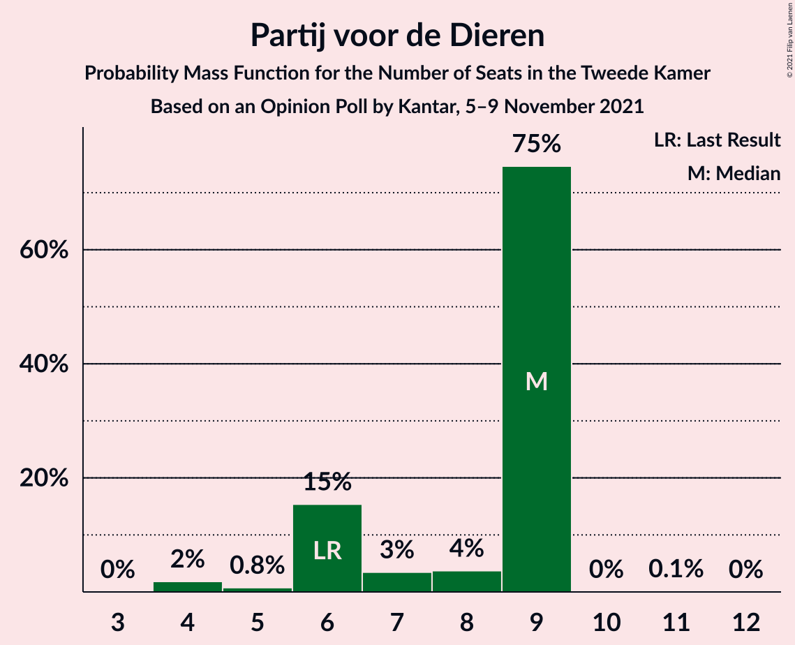
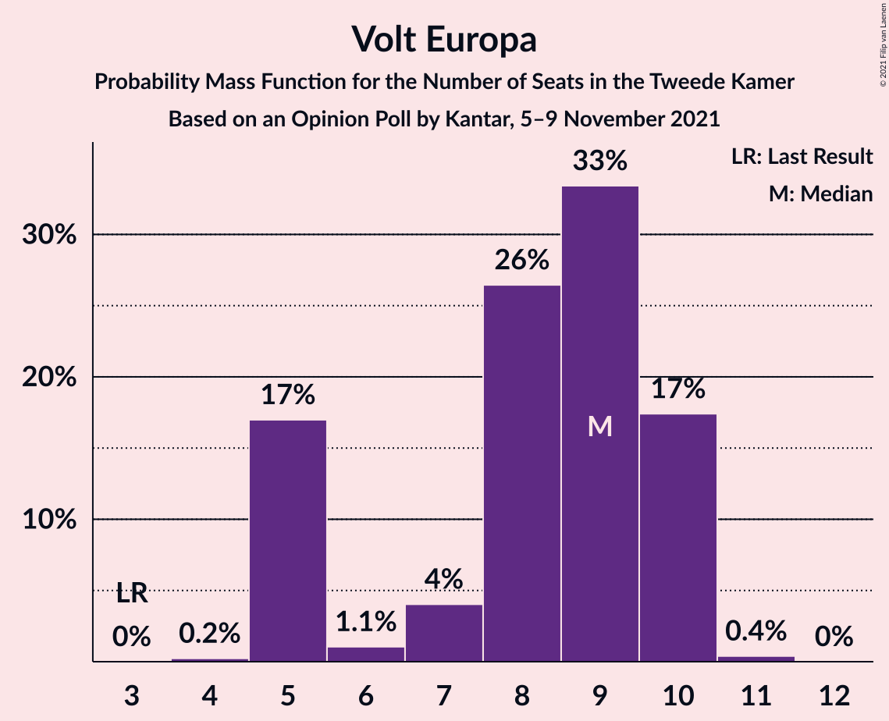
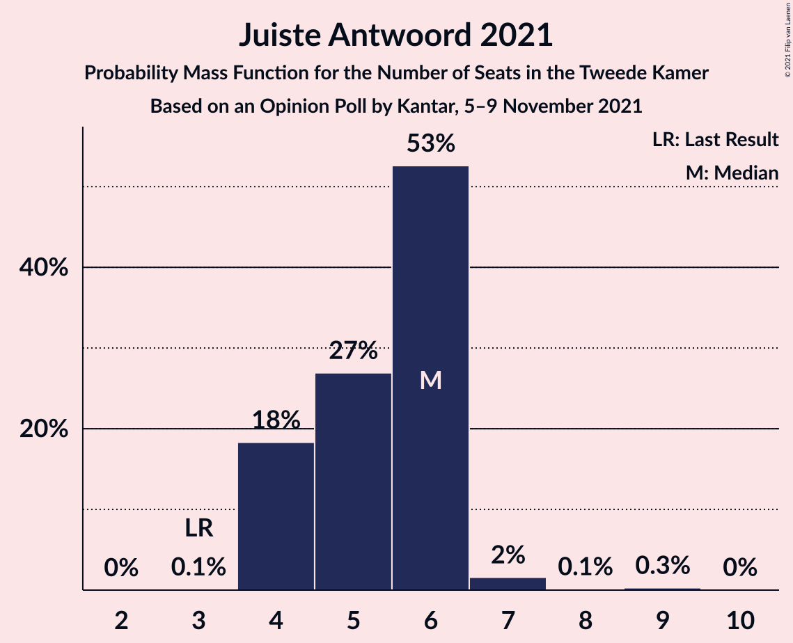
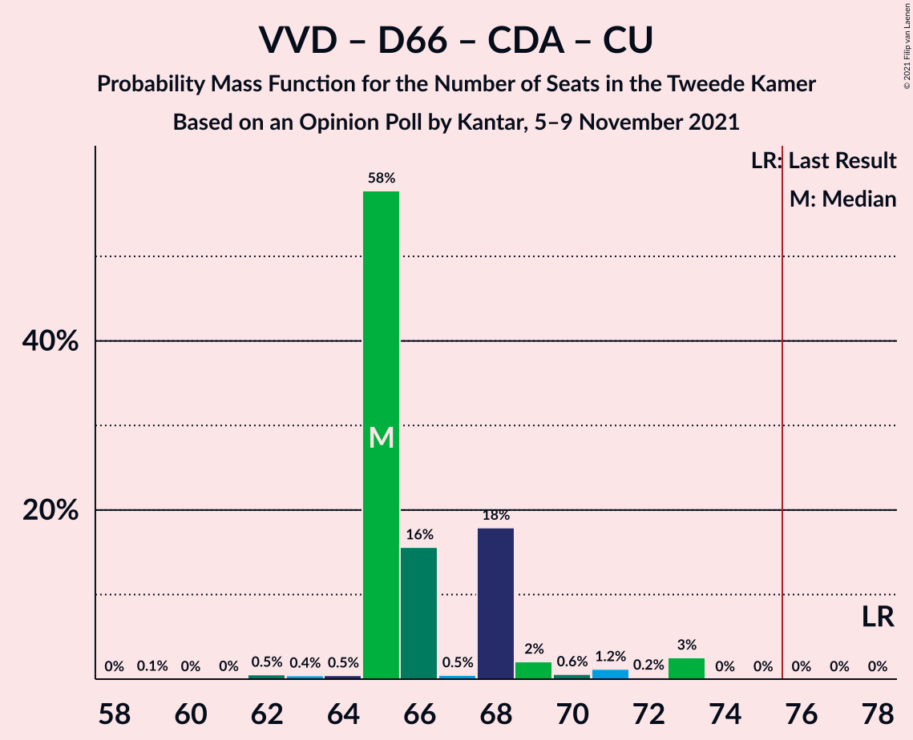
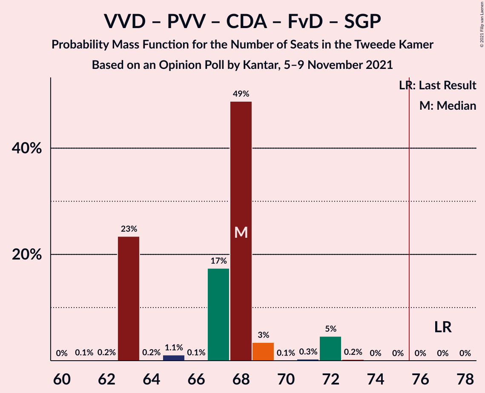
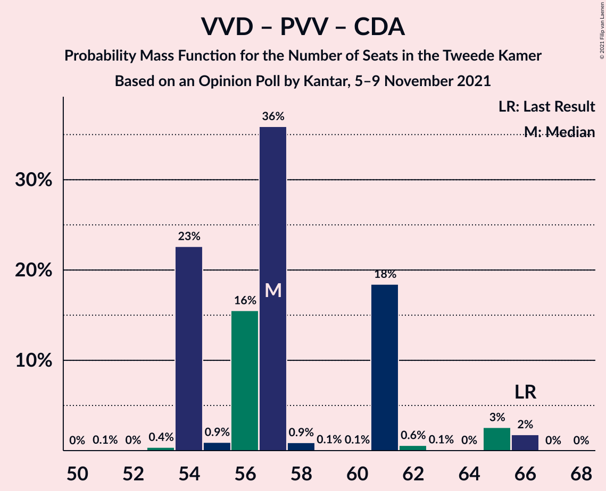

# Opinion Poll by Kantar, 5–9 November 2021

<a href="#voting-intentions">Voting Intentions</a> | <a href="#seats">Seats</a> | <a href="#coalitions">Coalitions</a> | <a href="#technical-information">Technical Information</a>

## Voting Intentions

### Confidence Intervals

| Party | Last Result | Poll Result | 80% Confidence Interval | 90% Confidence Interval | 95% Confidence Interval | 99% Confidence Interval |
|:-----:|:-----------:|:-----------:|:-----------------------:|:-----------------------:|:-----------------------:|:-----------------------:|
| Volkspartij voor Vrijheid en Democratie | 21.9% | 21.1% | 19.5–22.8% |19.0–23.3% |18.7–23.8% |17.9–24.6% |
| Democraten 66 | 15.0% | 13.1% | 11.8–14.6% |11.4–15.0% |11.1–15.3% |10.5–16.1% |
| Partij voor de Vrijheid | 10.8% | 11.1% | 9.9–12.4% |9.5–12.8% |9.2–13.2% |8.7–13.9% |
| Christen-Democratisch Appèl | 9.5% | 6.1% | 5.2–7.2% |5.0–7.5% |4.8–7.8% |4.4–8.3% |
| GroenLinks | 5.2% | 6.1% | 5.2–7.2% |5.0–7.5% |4.8–7.8% |4.4–8.3% |
| Partij van de Arbeid | 5.7% | 6.1% | 5.2–7.2% |5.0–7.5% |4.8–7.8% |4.4–8.3% |
| Socialistische Partij | 6.0% | 5.1% | 4.3–6.1% |4.1–6.4% |3.9–6.6% |3.5–7.1% |
| Partij voor de Dieren | 3.8% | 5.1% | 4.3–6.1% |4.1–6.4% |3.9–6.6% |3.5–7.1% |
| Volt Europa | 2.4% | 5.1% | 4.3–6.1% |4.1–6.4% |3.9–6.6% |3.5–7.1% |
| Forum voor Democratie | 5.0% | 4.1% | 3.4–5.0% |3.2–5.2% |3.0–5.5% |2.7–6.0% |
| Juiste Antwoord 2021 | 2.4% | 4.1% | 3.4–5.0% |3.2–5.2% |3.0–5.5% |2.7–6.0% |
| BoerBurgerBeweging | 1.0% | 4.1% | 3.4–5.0% |3.2–5.2% |3.0–5.5% |2.7–6.0% |
| ChristenUnie | 3.4% | 3.0% | 2.4–3.9% |2.3–4.1% |2.1–4.3% |1.9–4.8% |
| Staatkundig Gereformeerde Partij | 2.1% | 2.0% | 1.6–2.7% |1.4–2.9% |1.3–3.1% |1.1–3.5% |
| DENK | 2.0% | 2.0% | 1.6–2.7% |1.4–2.9% |1.3–3.1% |1.1–3.5% |
| 50Plus | 1.0% | 1.0% | 0.7–1.6% |0.6–1.7% |0.5–1.9% |0.4–2.2% |
| Bij1 | 0.8% | 1.0% | 0.7–1.6% |0.6–1.7% |0.5–1.9% |0.4–2.2% |

*Note:* The poll result column reflects the actual value used in the calculations. Published results may vary slightly, and in addition be rounded to fewer digits.

## Seats

### Confidence Intervals

| Party | Last Result | Median | 80% Confidence Interval | 90% Confidence Interval | 95% Confidence Interval | 99% Confidence Interval |
|:-----:|:-----------:|:------:|:-----------------------:|:-----------------------:|:-----------------------:|:-----------------------:|
| <a href="#volkspartij-voor-vrijheid-en-democratie">Volkspartij voor Vrijheid en Democratie</a> | 34 | 33 | 30–36 |30–36 |30–37 |28–39 |
| <a href="#democraten-66">Democraten 66</a> | 24 | 20 | 17–23 |17–23 |17–23 |17–25 |
| <a href="#partij-voor-de-vrijheid">Partij voor de Vrijheid</a> | 17 | 16 | 15–16 |15–18 |15–19 |12–20 |
| <a href="#christen-democratisch-appèl">Christen-Democratisch Appèl</a> | 15 | 8 | 8–9 |8–9 |8–12 |8–12 |
| <a href="#groenlinks">GroenLinks</a> | 8 | 9 | 7–11 |7–11 |7–11 |7–13 |
| <a href="#partij-van-de-arbeid">Partij van de Arbeid</a> | 9 | 10 | 9–13 |9–13 |7–13 |7–13 |
| <a href="#socialistische-partij">Socialistische Partij</a> | 9 | 6 | 6–9 |6–9 |6–9 |6–9 |
| <a href="#partij-voor-de-dieren">Partij voor de Dieren</a> | 6 | 9 | 6–9 |6–9 |5–9 |4–9 |
| <a href="#volt-europa">Volt Europa</a> | 3 | 9 | 5–10 |5–10 |5–10 |5–10 |
| <a href="#forum-voor-democratie">Forum voor Democratie</a> | 8 | 7 | 4–9 |4–9 |4–9 |4–9 |
| <a href="#juiste-antwoord-2021">Juiste Antwoord 2021</a> | 3 | 6 | 4–6 |4–6 |4–6 |4–7 |
| <a href="#boerburgerbeweging">BoerBurgerBeweging</a> | 1 | 5 | 5–7 |5–7 |4–7 |4–8 |
| <a href="#christenunie">ChristenUnie</a> | 5 | 4 | 4–6 |4–6 |4–6 |3–7 |
| <a href="#staatkundig-gereformeerde-partij">Staatkundig Gereformeerde Partij</a> | 3 | 4 | 2–4 |2–4 |2–4 |2–5 |
| <a href="#denk">DENK</a> | 3 | 3 | 2–3 |2–3 |2–3 |2–4 |
| <a href="#50plus">50Plus</a> | 1 | 1 | 1–2 |1–2 |0–2 |0–3 |
| <a href="#bij1">Bij1</a> | 1 | 1 | 1–2 |1–2 |1–2 |0–3 |

### Volkspartij voor Vrijheid en Democratie

*For a full overview of the results for this party, see the [Volkspartij voor Vrijheid en Democratie](party-volkspartijvoorvrijheidendemocratie.html) page.*

| Number of Seats | Probability | Accumulated | Special Marks |
|:---------------:|:-----------:|:-----------:|:-------------:|
| 25 | 0.1% | 100% |  |
| 26 | 0% | 99.9% |  |
| 27 | 0.4% | 99.9% |  |
| 28 | 0.1% | 99.5% |  |
| 29 | 0.3% | 99.5% |  |
| 30 | 25% | 99.2% |  |
| 31 | 2% | 74% |  |
| 32 | 0.4% | 72% |  |
| 33 | 48% | 72% | Median |
| 34 | 1.0% | 23% | Last Result |
| 35 | 2% | 22% |  |
| 36 | 18% | 20% |  |
| 37 | 0% | 3% |  |
| 38 | 2% | 2% |  |
| 39 | 0.7% | 0.7% |  |
| 40 | 0% | 0% |  |

### Democraten 66

*For a full overview of the results for this party, see the [Democraten 66](party-democraten66.html) page.*

| Number of Seats | Probability | Accumulated | Special Marks |
|:---------------:|:-----------:|:-----------:|:-------------:|
| 17 | 17% | 100% |  |
| 18 | 3% | 83% |  |
| 19 | 0.7% | 80% |  |
| 20 | 34% | 79% | Median |
| 21 | 17% | 46% |  |
| 22 | 5% | 28% |  |
| 23 | 23% | 24% |  |
| 24 | 0.4% | 1.0% | Last Result |
| 25 | 0.7% | 0.7% |  |
| 26 | 0% | 0% |  |

### Partij voor de Vrijheid

*For a full overview of the results for this party, see the [Partij voor de Vrijheid](party-partijvoordevrijheid.html) page.*

| Number of Seats | Probability | Accumulated | Special Marks |
|:---------------:|:-----------:|:-----------:|:-------------:|
| 12 | 0.6% | 100% |  |
| 13 | 0% | 99.4% |  |
| 14 | 0.4% | 99.3% |  |
| 15 | 16% | 99.0% |  |
| 16 | 74% | 83% | Median |
| 17 | 0.8% | 9% | Last Result |
| 18 | 5% | 8% |  |
| 19 | 3% | 4% |  |
| 20 | 0.5% | 0.6% |  |
| 21 | 0% | 0.1% |  |
| 22 | 0% | 0% |  |

### Christen-Democratisch Appèl

*For a full overview of the results for this party, see the [Christen-Democratisch Appèl](party-christen-democratischappèl.html) page.*

| Number of Seats | Probability | Accumulated | Special Marks |
|:---------------:|:-----------:|:-----------:|:-------------:|
| 6 | 0.2% | 100% |  |
| 7 | 0.1% | 99.8% |  |
| 8 | 72% | 99.7% | Median |
| 9 | 23% | 28% |  |
| 10 | 1.2% | 5% |  |
| 11 | 0.5% | 4% |  |
| 12 | 3% | 3% |  |
| 13 | 0% | 0% |  |
| 14 | 0% | 0% |  |
| 15 | 0% | 0% | Last Result |

### GroenLinks

*For a full overview of the results for this party, see the [GroenLinks](party-groenlinks.html) page.*

| Number of Seats | Probability | Accumulated | Special Marks |
|:---------------:|:-----------:|:-----------:|:-------------:|
| 7 | 37% | 100% |  |
| 8 | 0.7% | 63% | Last Result |
| 9 | 42% | 62% | Median |
| 10 | 3% | 20% |  |
| 11 | 15% | 17% |  |
| 12 | 0.7% | 2% |  |
| 13 | 0.4% | 0.8% |  |
| 14 | 0.4% | 0.4% |  |
| 15 | 0% | 0% |  |

### Partij van de Arbeid

*For a full overview of the results for this party, see the [Partij van de Arbeid](party-partijvandearbeid.html) page.*

| Number of Seats | Probability | Accumulated | Special Marks |
|:---------------:|:-----------:|:-----------:|:-------------:|
| 7 | 3% | 100% |  |
| 8 | 1.2% | 97% |  |
| 9 | 19% | 96% | Last Result |
| 10 | 53% | 77% | Median |
| 11 | 1.1% | 24% |  |
| 12 | 0.3% | 22% |  |
| 13 | 22% | 22% |  |
| 14 | 0% | 0% |  |

### Socialistische Partij

*For a full overview of the results for this party, see the [Socialistische Partij](party-socialistischepartij.html) page.*

| Number of Seats | Probability | Accumulated | Special Marks |
|:---------------:|:-----------:|:-----------:|:-------------:|
| 5 | 0.2% | 100% |  |
| 6 | 59% | 99.8% | Median |
| 7 | 18% | 41% |  |
| 8 | 4% | 23% |  |
| 9 | 18% | 19% | Last Result |
| 10 | 0% | 0.3% |  |
| 11 | 0.3% | 0.3% |  |
| 12 | 0% | 0% |  |

### Partij voor de Dieren

*For a full overview of the results for this party, see the [Partij voor de Dieren](party-partijvoordedieren.html) page.*

| Number of Seats | Probability | Accumulated | Special Marks |
|:---------------:|:-----------:|:-----------:|:-------------:|
| 4 | 2% | 100% |  |
| 5 | 0.8% | 98% |  |
| 6 | 15% | 97% | Last Result |
| 7 | 3% | 82% |  |
| 8 | 4% | 79% |  |
| 9 | 75% | 75% | Median |
| 10 | 0% | 0.2% |  |
| 11 | 0.1% | 0.1% |  |
| 12 | 0% | 0% |  |

### Volt Europa

*For a full overview of the results for this party, see the [Volt Europa](party-volteuropa.html) page.*

| Number of Seats | Probability | Accumulated | Special Marks |
|:---------------:|:-----------:|:-----------:|:-------------:|
| 3 | 0% | 100% | Last Result |
| 4 | 0.2% | 100% |  |
| 5 | 17% | 99.8% |  |
| 6 | 1.1% | 83% |  |
| 7 | 4% | 82% |  |
| 8 | 26% | 78% |  |
| 9 | 33% | 51% | Median |
| 10 | 17% | 18% |  |
| 11 | 0.4% | 0.4% |  |
| 12 | 0% | 0% |  |

### Forum voor Democratie

*For a full overview of the results for this party, see the [Forum voor Democratie](party-forumvoordemocratie.html) page.*

| Number of Seats | Probability | Accumulated | Special Marks |
|:---------------:|:-----------:|:-----------:|:-------------:|
| 4 | 21% | 100% |  |
| 5 | 25% | 79% |  |
| 6 | 0.6% | 54% |  |
| 7 | 35% | 53% | Median |
| 8 | 2% | 18% | Last Result |
| 9 | 15% | 15% |  |
| 10 | 0% | 0% |  |

### Juiste Antwoord 2021

*For a full overview of the results for this party, see the [Juiste Antwoord 2021](party-juisteantwoord2021.html) page.*

| Number of Seats | Probability | Accumulated | Special Marks |
|:---------------:|:-----------:|:-----------:|:-------------:|
| 3 | 0.1% | 100% | Last Result |
| 4 | 18% | 99.9% |  |
| 5 | 27% | 82% |  |
| 6 | 53% | 55% | Median |
| 7 | 2% | 2% |  |
| 8 | 0.1% | 0.5% |  |
| 9 | 0.3% | 0.3% |  |
| 10 | 0% | 0% |  |

### BoerBurgerBeweging

*For a full overview of the results for this party, see the [BoerBurgerBeweging](party-boerburgerbeweging.html) page.*

| Number of Seats | Probability | Accumulated | Special Marks |
|:---------------:|:-----------:|:-----------:|:-------------:|
| 1 | 0% | 100% | Last Result |
| 2 | 0% | 100% |  |
| 3 | 0.2% | 100% |  |
| 4 | 3% | 99.8% |  |
| 5 | 55% | 97% | Median |
| 6 | 23% | 42% |  |
| 7 | 18% | 19% |  |
| 8 | 0.7% | 0.7% |  |
| 9 | 0% | 0% |  |

### ChristenUnie

*For a full overview of the results for this party, see the [ChristenUnie](party-christenunie.html) page.*

| Number of Seats | Probability | Accumulated | Special Marks |
|:---------------:|:-----------:|:-----------:|:-------------:|
| 3 | 1.5% | 100% |  |
| 4 | 78% | 98.5% | Median |
| 5 | 1.2% | 21% | Last Result |
| 6 | 18% | 20% |  |
| 7 | 1.1% | 1.2% |  |
| 8 | 0.1% | 0.1% |  |
| 9 | 0% | 0% |  |

### Staatkundig Gereformeerde Partij

*For a full overview of the results for this party, see the [Staatkundig Gereformeerde Partij](party-staatkundiggereformeerdepartij.html) page.*

| Number of Seats | Probability | Accumulated | Special Marks |
|:---------------:|:-----------:|:-----------:|:-------------:|
| 1 | 0.5% | 100% |  |
| 2 | 23% | 99.5% |  |
| 3 | 17% | 77% | Last Result |
| 4 | 59% | 59% | Median |
| 5 | 0.6% | 0.6% |  |
| 6 | 0% | 0% |  |

### DENK

*For a full overview of the results for this party, see the [DENK](party-denk.html) page.*

| Number of Seats | Probability | Accumulated | Special Marks |
|:---------------:|:-----------:|:-----------:|:-------------:|
| 1 | 0.3% | 100% |  |
| 2 | 46% | 99.7% |  |
| 3 | 53% | 54% | Last Result, Median |
| 4 | 0.9% | 1.2% |  |
| 5 | 0.2% | 0.2% |  |
| 6 | 0% | 0% |  |

### 50Plus

*For a full overview of the results for this party, see the [50Plus](party-50plus.html) page.*

| Number of Seats | Probability | Accumulated | Special Marks |
|:---------------:|:-----------:|:-----------:|:-------------:|
| 0 | 4% | 100% |  |
| 1 | 77% | 96% | Last Result, Median |
| 2 | 17% | 19% |  |
| 3 | 2% | 2% |  |
| 4 | 0% | 0% |  |

### Bij1

*For a full overview of the results for this party, see the [Bij1](party-bij1.html) page.*

| Number of Seats | Probability | Accumulated | Special Marks |
|:---------------:|:-----------:|:-----------:|:-------------:|
| 0 | 2% | 100% |  |
| 1 | 59% | 98% | Last Result, Median |
| 2 | 39% | 40% |  |
| 3 | 0.9% | 0.9% |  |
| 4 | 0% | 0% |  |

## Coalitions

### Confidence Intervals

| Coalition | Last Result | Median | Majority? | 80% Confidence Interval | 90% Confidence Interval | 95% Confidence Interval | 99% Confidence Interval |
|:---------:|:-----------:|:------:|:---------:|:-----------------------:|:-----------------------:|:-----------------------:|:-----------------------:|
| Volkspartij voor Vrijheid en Democratie – Democraten 66 – Christen-Democratisch Appèl – Partij van de Arbeid – ChristenUnie | 87 | 75 | 47% | 75–78 | 75–79 | 72–82 | 72–82 |
| Volkspartij voor Vrijheid en Democratie – Democraten 66 – Christen-Democratisch Appèl – GroenLinks – ChristenUnie | 86 | 74 | 41% | 72–77 | 72–78 | 72–80 | 72–80 |
| Volkspartij voor Vrijheid en Democratie – Democraten 66 – Christen-Democratisch Appèl – ChristenUnie | 78 | 65 | 0% | 65–68 | 65–69 | 65–73 | 62–73 |
| Volkspartij voor Vrijheid en Democratie – Partij voor de Vrijheid – Christen-Democratisch Appèl – Forum voor Democratie – Staatkundig Gereformeerde Partij | 77 | 68 | 0% | 63–68 | 63–71 | 63–72 | 63–72 |
| Volkspartij voor Vrijheid en Democratie – Partij voor de Vrijheid – Christen-Democratisch Appèl – Forum voor Democratie | 74 | 64 | 0% | 59–65 | 59–68 | 59–70 | 59–70 |
| Volkspartij voor Vrijheid en Democratie – Democraten 66 – Christen-Democratisch Appèl | 73 | 61 | 0% | 61–62 | 61–65 | 61–69 | 58–70 |
| Volkspartij voor Vrijheid en Democratie – Democraten 66 – Partij van de Arbeid | 67 | 63 | 0% | 63–66 | 62–66 | 59–66 | 58–68 |
| Volkspartij voor Vrijheid en Democratie – Partij voor de Vrijheid – Christen-Democratisch Appèl | 66 | 57 | 0% | 54–61 | 54–62 | 54–65 | 54–66 |
| Democraten 66 – Christen-Democratisch Appèl – GroenLinks – Partij van de Arbeid – Socialistische Partij – ChristenUnie | 70 | 60 | 0% | 55–63 | 55–63 | 55–63 | 55–67 |
| Democraten 66 – Christen-Democratisch Appèl – GroenLinks – Partij van de Arbeid – ChristenUnie | 61 | 51 | 0% | 49–57 | 49–57 | 49–57 | 49–59 |
| Volkspartij voor Vrijheid en Democratie – Christen-Democratisch Appèl – Forum voor Democratie – Staatkundig Gereformeerde Partij – 50Plus | 61 | 53 | 0% | 48–55 | 48–55 | 48–56 | 46–58 |
| Volkspartij voor Vrijheid en Democratie – Christen-Democratisch Appèl – Partij van de Arbeid | 58 | 51 | 0% | 50–55 | 50–55 | 46–56 | 46–57 |
| Volkspartij voor Vrijheid en Democratie – Christen-Democratisch Appèl – Forum voor Democratie – Staatkundig Gereformeerde Partij | 60 | 52 | 0% | 47–53 | 47–53 | 47–54 | 46–56 |
| Volkspartij voor Vrijheid en Democratie – Christen-Democratisch Appèl – Forum voor Democratie – 50Plus | 58 | 49 | 0% | 44–52 | 44–52 | 44–54 | 44–55 |
| Volkspartij voor Vrijheid en Democratie – Christen-Democratisch Appèl – Forum voor Democratie | 57 | 48 | 0% | 43–50 | 43–50 | 43–52 | 43–53 |
| Volkspartij voor Vrijheid en Democratie – Christen-Democratisch Appèl | 49 | 41 | 0% | 38–45 | 38–45 | 38–47 | 38–49 |
| Volkspartij voor Vrijheid en Democratie – Partij van de Arbeid | 43 | 43 | 0% | 42–46 | 42–46 | 37–46 | 37–48 |
| Democraten 66 – Christen-Democratisch Appèl – Partij van de Arbeid | 48 | 38 | 0% | 36–44 | 36–44 | 36–44 | 36–44 |
| Democraten 66 – Christen-Democratisch Appèl | 39 | 28 | 0% | 26–31 | 26–31 | 26–33 | 26–35 |
| Christen-Democratisch Appèl – Partij van de Arbeid – ChristenUnie | 29 | 22 | 0% | 21–25 | 21–25 | 20–25 | 20–27 |
| Christen-Democratisch Appèl – Partij van de Arbeid | 24 | 18 | 0% | 17–21 | 17–21 | 16–21 | 16–21 |

### Volkspartij voor Vrijheid en Democratie – Democraten 66 – Christen-Democratisch Appèl – Partij van de Arbeid – ChristenUnie

| Number of Seats | Probability | Accumulated | Special Marks |
|:---------------:|:-----------:|:-----------:|:-------------:|
| 68 | 0.1% | 100% |  |
| 69 | 0% | 99.9% |  |
| 70 | 0.1% | 99.9% |  |
| 71 | 0% | 99.9% |  |
| 72 | 3% | 99.8% |  |
| 73 | 1.0% | 97% |  |
| 74 | 0.2% | 96% |  |
| 75 | 48% | 96% | Median |
| 76 | 0.7% | 47% | Majority |
| 77 | 0.5% | 47% |  |
| 78 | 40% | 46% |  |
| 79 | 2% | 6% |  |
| 80 | 0.8% | 4% |  |
| 81 | 0.9% | 3% |  |
| 82 | 2% | 3% |  |
| 83 | 0% | 0% |  |
| 84 | 0% | 0% |  |
| 85 | 0% | 0% |  |
| 86 | 0% | 0% |  |
| 87 | 0% | 0% | Last Result |

### Volkspartij voor Vrijheid en Democratie – Democraten 66 – Christen-Democratisch Appèl – GroenLinks – ChristenUnie

| Number of Seats | Probability | Accumulated | Special Marks |
|:---------------:|:-----------:|:-----------:|:-------------:|
| 70 | 0.1% | 100% |  |
| 71 | 0.1% | 99.9% |  |
| 72 | 33% | 99.8% |  |
| 73 | 0.2% | 67% |  |
| 74 | 23% | 67% | Median |
| 75 | 3% | 44% |  |
| 76 | 0.5% | 41% | Majority |
| 77 | 33% | 40% |  |
| 78 | 4% | 7% |  |
| 79 | 0.4% | 3% |  |
| 80 | 3% | 3% |  |
| 81 | 0% | 0.1% |  |
| 82 | 0% | 0.1% |  |
| 83 | 0.1% | 0.1% |  |
| 84 | 0% | 0% |  |
| 85 | 0% | 0% |  |
| 86 | 0% | 0% | Last Result |

### Volkspartij voor Vrijheid en Democratie – Democraten 66 – Christen-Democratisch Appèl – ChristenUnie

| Number of Seats | Probability | Accumulated | Special Marks |
|:---------------:|:-----------:|:-----------:|:-------------:|
| 59 | 0.1% | 100% |  |
| 60 | 0% | 99.9% |  |
| 61 | 0% | 99.9% |  |
| 62 | 0.5% | 99.9% |  |
| 63 | 0.4% | 99.3% |  |
| 64 | 0.5% | 98.9% |  |
| 65 | 58% | 98% | Median |
| 66 | 16% | 41% |  |
| 67 | 0.5% | 25% |  |
| 68 | 18% | 25% |  |
| 69 | 2% | 7% |  |
| 70 | 0.6% | 5% |  |
| 71 | 1.2% | 4% |  |
| 72 | 0.2% | 3% |  |
| 73 | 3% | 3% |  |
| 74 | 0% | 0% |  |
| 75 | 0% | 0% |  |
| 76 | 0% | 0% | Majority |
| 77 | 0% | 0% |  |
| 78 | 0% | 0% | Last Result |

### Volkspartij voor Vrijheid en Democratie – Partij voor de Vrijheid – Christen-Democratisch Appèl – Forum voor Democratie – Staatkundig Gereformeerde Partij

| Number of Seats | Probability | Accumulated | Special Marks |
|:---------------:|:-----------:|:-----------:|:-------------:|
| 61 | 0.1% | 100% |  |
| 62 | 0.2% | 99.9% |  |
| 63 | 23% | 99.7% |  |
| 64 | 0.2% | 76% |  |
| 65 | 1.1% | 76% |  |
| 66 | 0.1% | 75% |  |
| 67 | 17% | 75% |  |
| 68 | 49% | 57% | Median |
| 69 | 3% | 9% |  |
| 70 | 0.1% | 5% |  |
| 71 | 0.3% | 5% |  |
| 72 | 5% | 5% |  |
| 73 | 0.2% | 0.3% |  |
| 74 | 0% | 0% |  |
| 75 | 0% | 0% |  |
| 76 | 0% | 0% | Majority |
| 77 | 0% | 0% | Last Result |

### Volkspartij voor Vrijheid en Democratie – Partij voor de Vrijheid – Christen-Democratisch Appèl – Forum voor Democratie

| Number of Seats | Probability | Accumulated | Special Marks |
|:---------------:|:-----------:|:-----------:|:-------------:|
| 57 | 0.1% | 100% |  |
| 58 | 0.4% | 99.9% |  |
| 59 | 22% | 99.5% |  |
| 60 | 0.5% | 77% |  |
| 61 | 1.0% | 77% |  |
| 62 | 0.9% | 76% |  |
| 63 | 0.1% | 75% |  |
| 64 | 33% | 75% | Median |
| 65 | 36% | 42% |  |
| 66 | 0.8% | 6% |  |
| 67 | 0.1% | 6% |  |
| 68 | 0.8% | 5% |  |
| 69 | 1.0% | 5% |  |
| 70 | 4% | 4% |  |
| 71 | 0% | 0% |  |
| 72 | 0% | 0% |  |
| 73 | 0% | 0% |  |
| 74 | 0% | 0% | Last Result |

### Volkspartij voor Vrijheid en Democratie – Democraten 66 – Christen-Democratisch Appèl

| Number of Seats | Probability | Accumulated | Special Marks |
|:---------------:|:-----------:|:-----------:|:-------------:|
| 53 | 0.1% | 100% |  |
| 54 | 0% | 99.9% |  |
| 55 | 0% | 99.9% |  |
| 56 | 0% | 99.9% |  |
| 57 | 0% | 99.9% |  |
| 58 | 0.6% | 99.8% |  |
| 59 | 0.9% | 99.3% |  |
| 60 | 0.6% | 98% |  |
| 61 | 58% | 98% | Median |
| 62 | 33% | 40% |  |
| 63 | 0.1% | 7% |  |
| 64 | 1.2% | 7% |  |
| 65 | 2% | 6% |  |
| 66 | 0.3% | 3% |  |
| 67 | 0.5% | 3% |  |
| 68 | 0% | 3% |  |
| 69 | 2% | 3% |  |
| 70 | 0.7% | 0.7% |  |
| 71 | 0% | 0% |  |
| 72 | 0% | 0% |  |
| 73 | 0% | 0% | Last Result |

### Volkspartij voor Vrijheid en Democratie – Democraten 66 – Partij van de Arbeid

| Number of Seats | Probability | Accumulated | Special Marks |
|:---------------:|:-----------:|:-----------:|:-------------:|
| 53 | 0.1% | 100% |  |
| 54 | 0% | 99.9% |  |
| 55 | 0% | 99.9% |  |
| 56 | 0.3% | 99.9% |  |
| 57 | 0% | 99.6% |  |
| 58 | 0.5% | 99.5% |  |
| 59 | 2% | 99.1% |  |
| 60 | 0.9% | 97% |  |
| 61 | 0.1% | 96% |  |
| 62 | 1.4% | 96% |  |
| 63 | 66% | 94% | Median |
| 64 | 0.1% | 28% |  |
| 65 | 0.3% | 28% |  |
| 66 | 26% | 28% |  |
| 67 | 1.0% | 2% | Last Result |
| 68 | 0.7% | 0.8% |  |
| 69 | 0% | 0% |  |

### Volkspartij voor Vrijheid en Democratie – Partij voor de Vrijheid – Christen-Democratisch Appèl

| Number of Seats | Probability | Accumulated | Special Marks |
|:---------------:|:-----------:|:-----------:|:-------------:|
| 51 | 0.1% | 100% |  |
| 52 | 0% | 99.9% |  |
| 53 | 0.4% | 99.9% |  |
| 54 | 23% | 99.5% |  |
| 55 | 0.9% | 77% |  |
| 56 | 16% | 76% |  |
| 57 | 36% | 60% | Median |
| 58 | 0.9% | 25% |  |
| 59 | 0.1% | 24% |  |
| 60 | 0.1% | 24% |  |
| 61 | 18% | 23% |  |
| 62 | 0.6% | 5% |  |
| 63 | 0.1% | 4% |  |
| 64 | 0% | 4% |  |
| 65 | 3% | 4% |  |
| 66 | 2% | 2% | Last Result |
| 67 | 0% | 0% |  |

### Democraten 66 – Christen-Democratisch Appèl – GroenLinks – Partij van de Arbeid – Socialistische Partij – ChristenUnie

| Number of Seats | Probability | Accumulated | Special Marks |
|:---------------:|:-----------:|:-----------:|:-------------:|
| 54 | 0% | 100% |  |
| 55 | 33% | 99.9% |  |
| 56 | 3% | 67% |  |
| 57 | 0.2% | 64% | Median |
| 58 | 0.1% | 64% |  |
| 59 | 0.2% | 64% |  |
| 60 | 35% | 64% |  |
| 61 | 3% | 28% |  |
| 62 | 0.7% | 25% |  |
| 63 | 23% | 24% |  |
| 64 | 0.7% | 1.5% |  |
| 65 | 0% | 0.8% |  |
| 66 | 0.2% | 0.8% |  |
| 67 | 0.3% | 0.7% |  |
| 68 | 0.3% | 0.3% |  |
| 69 | 0% | 0% |  |
| 70 | 0% | 0% | Last Result |

### Democraten 66 – Christen-Democratisch Appèl – GroenLinks – Partij van de Arbeid – ChristenUnie

| Number of Seats | Probability | Accumulated | Special Marks |
|:---------------:|:-----------:|:-----------:|:-------------:|
| 47 | 0.1% | 100% |  |
| 48 | 0.1% | 99.9% |  |
| 49 | 34% | 99.8% |  |
| 50 | 2% | 66% |  |
| 51 | 18% | 64% | Median |
| 52 | 3% | 46% |  |
| 53 | 16% | 44% |  |
| 54 | 3% | 28% |  |
| 55 | 0.6% | 25% |  |
| 56 | 0.1% | 24% |  |
| 57 | 23% | 24% |  |
| 58 | 0.7% | 1.3% |  |
| 59 | 0.6% | 0.6% |  |
| 60 | 0% | 0% |  |
| 61 | 0% | 0% | Last Result |

### Volkspartij voor Vrijheid en Democratie – Christen-Democratisch Appèl – Forum voor Democratie – Staatkundig Gereformeerde Partij – 50Plus

| Number of Seats | Probability | Accumulated | Special Marks |
|:---------------:|:-----------:|:-----------:|:-------------:|
| 45 | 0.1% | 100% |  |
| 46 | 0.5% | 99.9% |  |
| 47 | 0% | 99.4% |  |
| 48 | 22% | 99.4% |  |
| 49 | 0.6% | 77% |  |
| 50 | 0.8% | 76% |  |
| 51 | 4% | 76% |  |
| 52 | 17% | 71% |  |
| 53 | 33% | 54% | Median |
| 54 | 0.3% | 20% |  |
| 55 | 17% | 20% |  |
| 56 | 2% | 3% |  |
| 57 | 0.5% | 1.2% |  |
| 58 | 0.7% | 0.7% |  |
| 59 | 0% | 0% |  |
| 60 | 0% | 0% |  |
| 61 | 0% | 0% | Last Result |

### Volkspartij voor Vrijheid en Democratie – Christen-Democratisch Appèl – Partij van de Arbeid

| Number of Seats | Probability | Accumulated | Special Marks |
|:---------------:|:-----------:|:-----------:|:-------------:|
| 43 | 0.1% | 100% |  |
| 44 | 0% | 99.9% |  |
| 45 | 0% | 99.9% |  |
| 46 | 2% | 99.9% |  |
| 47 | 0.3% | 97% |  |
| 48 | 0.4% | 97% |  |
| 49 | 0.9% | 97% |  |
| 50 | 16% | 96% |  |
| 51 | 56% | 79% | Median |
| 52 | 0.5% | 23% |  |
| 53 | 0.7% | 23% |  |
| 54 | 0.3% | 22% |  |
| 55 | 18% | 22% |  |
| 56 | 2% | 4% |  |
| 57 | 2% | 2% |  |
| 58 | 0% | 0% | Last Result |

### Volkspartij voor Vrijheid en Democratie – Christen-Democratisch Appèl – Forum voor Democratie – Staatkundig Gereformeerde Partij

| Number of Seats | Probability | Accumulated | Special Marks |
|:---------------:|:-----------:|:-----------:|:-------------:|
| 44 | 0.1% | 100% |  |
| 45 | 0.2% | 99.9% |  |
| 46 | 0.4% | 99.8% |  |
| 47 | 22% | 99.4% |  |
| 48 | 0.1% | 77% |  |
| 49 | 2% | 77% |  |
| 50 | 1.4% | 75% |  |
| 51 | 20% | 74% |  |
| 52 | 33% | 53% | Median |
| 53 | 17% | 21% |  |
| 54 | 2% | 3% |  |
| 55 | 0.3% | 1.3% |  |
| 56 | 0.7% | 1.0% |  |
| 57 | 0.3% | 0.3% |  |
| 58 | 0% | 0% |  |
| 59 | 0% | 0% |  |
| 60 | 0% | 0% | Last Result |

### Volkspartij voor Vrijheid en Democratie – Christen-Democratisch Appèl – Forum voor Democratie – 50Plus

| Number of Seats | Probability | Accumulated | Special Marks |
|:---------------:|:-----------:|:-----------:|:-------------:|
| 42 | 0.1% | 100% |  |
| 43 | 0% | 99.9% |  |
| 44 | 22% | 99.9% |  |
| 45 | 0.5% | 77% |  |
| 46 | 0.4% | 77% |  |
| 47 | 4% | 76% |  |
| 48 | 0.7% | 73% |  |
| 49 | 33% | 72% | Median |
| 50 | 18% | 38% |  |
| 51 | 0.1% | 20% |  |
| 52 | 16% | 20% |  |
| 53 | 2% | 5% |  |
| 54 | 2% | 3% |  |
| 55 | 0.7% | 0.7% |  |
| 56 | 0% | 0% |  |
| 57 | 0% | 0% |  |
| 58 | 0% | 0% | Last Result |

### Volkspartij voor Vrijheid en Democratie – Christen-Democratisch Appèl – Forum voor Democratie

| Number of Seats | Probability | Accumulated | Special Marks |
|:---------------:|:-----------:|:-----------:|:-------------:|
| 40 | 0.1% | 100% |  |
| 41 | 0% | 99.9% |  |
| 42 | 0.1% | 99.9% |  |
| 43 | 22% | 99.9% |  |
| 44 | 0.8% | 78% |  |
| 45 | 0.3% | 77% |  |
| 46 | 2% | 77% |  |
| 47 | 3% | 75% |  |
| 48 | 34% | 72% | Median |
| 49 | 17% | 38% |  |
| 50 | 16% | 21% |  |
| 51 | 2% | 5% |  |
| 52 | 2% | 3% |  |
| 53 | 1.0% | 1.0% |  |
| 54 | 0% | 0% |  |
| 55 | 0% | 0% |  |
| 56 | 0% | 0% |  |
| 57 | 0% | 0% | Last Result |

### Volkspartij voor Vrijheid en Democratie – Christen-Democratisch Appèl

| Number of Seats | Probability | Accumulated | Special Marks |
|:---------------:|:-----------:|:-----------:|:-------------:|
| 34 | 0.1% | 100% |  |
| 35 | 0% | 99.9% |  |
| 36 | 0% | 99.9% |  |
| 37 | 0.2% | 99.9% |  |
| 38 | 22% | 99.7% |  |
| 39 | 4% | 78% |  |
| 40 | 0.6% | 73% |  |
| 41 | 49% | 73% | Median |
| 42 | 0.6% | 24% |  |
| 43 | 0.6% | 23% |  |
| 44 | 0.4% | 23% |  |
| 45 | 18% | 22% |  |
| 46 | 0.4% | 5% |  |
| 47 | 4% | 4% |  |
| 48 | 0% | 0.7% |  |
| 49 | 0.7% | 0.7% | Last Result |
| 50 | 0% | 0% |  |

### Volkspartij voor Vrijheid en Democratie – Partij van de Arbeid

| Number of Seats | Probability | Accumulated | Special Marks |
|:---------------:|:-----------:|:-----------:|:-------------:|
| 34 | 0.1% | 100% |  |
| 35 | 0% | 99.9% |  |
| 36 | 0.3% | 99.9% |  |
| 37 | 3% | 99.6% |  |
| 38 | 0.2% | 97% |  |
| 39 | 0.6% | 97% |  |
| 40 | 0.2% | 96% |  |
| 41 | 0.7% | 96% |  |
| 42 | 17% | 95% |  |
| 43 | 56% | 78% | Last Result, Median |
| 44 | 2% | 22% |  |
| 45 | 0.2% | 20% |  |
| 46 | 17% | 20% |  |
| 47 | 0.7% | 2% |  |
| 48 | 2% | 2% |  |
| 49 | 0% | 0% |  |

### Democraten 66 – Christen-Democratisch Appèl – Partij van de Arbeid

| Number of Seats | Probability | Accumulated | Special Marks |
|:---------------:|:-----------:|:-----------:|:-------------:|
| 34 | 0.2% | 100% |  |
| 35 | 0.3% | 99.8% |  |
| 36 | 17% | 99.5% |  |
| 37 | 3% | 82% |  |
| 38 | 51% | 79% | Median |
| 39 | 0.8% | 28% |  |
| 40 | 0.8% | 27% |  |
| 41 | 0.6% | 26% |  |
| 42 | 0.3% | 26% |  |
| 43 | 2% | 26% |  |
| 44 | 23% | 24% |  |
| 45 | 0.3% | 0.3% |  |
| 46 | 0% | 0% |  |
| 47 | 0% | 0% |  |
| 48 | 0% | 0% | Last Result |

### Democraten 66 – Christen-Democratisch Appèl

| Number of Seats | Probability | Accumulated | Special Marks |
|:---------------:|:-----------:|:-----------:|:-------------:|
| 25 | 0.1% | 100% |  |
| 26 | 17% | 99.9% |  |
| 27 | 3% | 82% |  |
| 28 | 33% | 80% | Median |
| 29 | 16% | 46% |  |
| 30 | 0.5% | 30% |  |
| 31 | 26% | 30% |  |
| 32 | 0.4% | 4% |  |
| 33 | 2% | 4% |  |
| 34 | 2% | 2% |  |
| 35 | 0.5% | 0.5% |  |
| 36 | 0% | 0% |  |
| 37 | 0% | 0% |  |
| 38 | 0% | 0% |  |
| 39 | 0% | 0% | Last Result |

### Christen-Democratisch Appèl – Partij van de Arbeid – ChristenUnie

| Number of Seats | Probability | Accumulated | Special Marks |
|:---------------:|:-----------:|:-----------:|:-------------:|
| 19 | 0.1% | 100% |  |
| 20 | 3% | 99.8% |  |
| 21 | 16% | 97% |  |
| 22 | 34% | 81% | Median |
| 23 | 3% | 47% |  |
| 24 | 0.9% | 45% |  |
| 25 | 42% | 44% |  |
| 26 | 1.5% | 2% |  |
| 27 | 0.6% | 0.6% |  |
| 28 | 0% | 0% |  |
| 29 | 0% | 0% | Last Result |

### Christen-Democratisch Appèl – Partij van de Arbeid

| Number of Seats | Probability | Accumulated | Special Marks |
|:---------------:|:-----------:|:-----------:|:-------------:|
| 13 | 0.1% | 100% |  |
| 14 | 0% | 99.9% |  |
| 15 | 0.2% | 99.9% |  |
| 16 | 3% | 99.7% |  |
| 17 | 15% | 97% |  |
| 18 | 35% | 82% | Median |
| 19 | 21% | 47% |  |
| 20 | 0.6% | 26% |  |
| 21 | 25% | 25% |  |
| 22 | 0.1% | 0.1% |  |
| 23 | 0% | 0% |  |
| 24 | 0% | 0% | Last Result |

## Technical Information

### Opinion Poll

+ **Polling firm:** Kantar
+ **Commissioner(s):** —
+ **Fieldwork period:** 5–9 November 2021

### Calculations

+ **Sample size:** 986
+ **Simulations done:** 1,048,576
+ **Error estimate:** 1.59%

