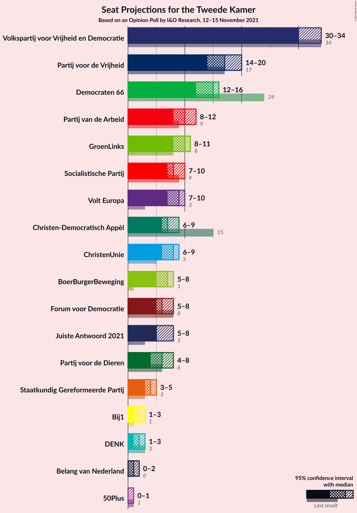
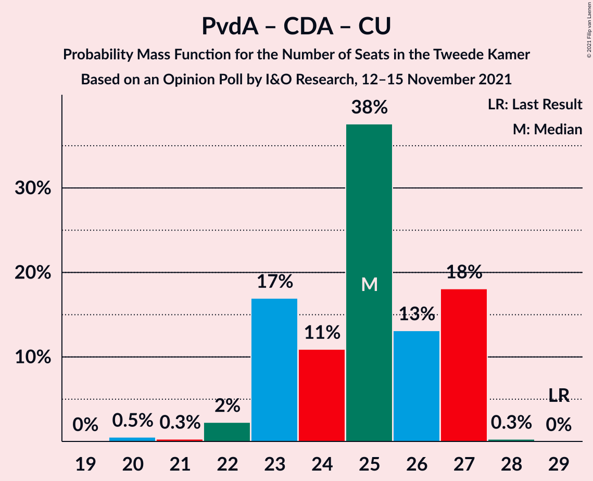

# Opinion Poll by I&O Research, 12–15 November 2021

<a href="#voting-intentions">Voting Intentions</a> | <a href="#seats">Seats</a> | <a href="#coalitions">Coalitions</a> | <a href="#technical-information">Technical Information</a>

## Voting Intentions

### Confidence Intervals

| Party | Last Result | Poll Result | 80% Confidence Interval | 90% Confidence Interval | 95% Confidence Interval | 99% Confidence Interval |
|:-----:|:-----------:|:-----------:|:-----------------------:|:-----------------------:|:-----------------------:|:-----------------------:|
| Volkspartij voor Vrijheid en Democratie | 21.9% | 20.1% | 19.0–21.3% |18.7–21.7% |18.4–21.9% |17.9–22.5% |
| Partij voor de Vrijheid | 10.8% | 10.7% | 9.9–11.7% |9.7–11.9% |9.4–12.2% |9.1–12.6% |
| Democraten 66 | 15.0% | 9.3% | 8.5–10.2% |8.3–10.4% |8.1–10.7% |7.7–11.1% |
| GroenLinks | 5.2% | 6.3% | 5.7–7.1% |5.5–7.3% |5.3–7.5% |5.0–7.9% |
| Partij van de Arbeid | 5.7% | 6.1% | 5.5–6.9% |5.3–7.1% |5.2–7.3% |4.9–7.7% |
| Socialistische Partij | 6.0% | 5.4% | 4.8–6.1% |4.6–6.3% |4.5–6.5% |4.2–6.8% |
| Volt Europa | 2.4% | 5.4% | 4.8–6.1% |4.6–6.3% |4.5–6.5% |4.2–6.8% |
| Christen-Democratisch Appèl | 9.5% | 4.9% | 4.3–5.6% |4.2–5.8% |4.0–5.9% |3.8–6.3% |
| ChristenUnie | 3.4% | 4.9% | 4.3–5.6% |4.2–5.8% |4.0–5.9% |3.8–6.3% |
| BoerBurgerBeweging | 1.0% | 4.5% | 4.0–5.2% |3.8–5.3% |3.7–5.5% |3.4–5.8% |
| Partij voor de Dieren | 3.8% | 4.4% | 3.9–5.1% |3.7–5.2% |3.6–5.4% |3.4–5.7% |
| Forum voor Democratie | 5.0% | 4.2% | 3.7–4.8% |3.5–5.0% |3.4–5.2% |3.2–5.5% |
| Juiste Antwoord 2021 | 2.4% | 4.1% | 3.6–4.7% |3.4–4.9% |3.3–5.1% |3.1–5.4% |
| Staatkundig Gereformeerde Partij | 2.1% | 2.8% | 2.4–3.4% |2.3–3.5% |2.2–3.6% |2.0–3.9% |
| DENK | 2.0% | 1.6% | 1.3–2.0% |1.2–2.1% |1.1–2.2% |1.0–2.5% |
| Bij1 | 0.8% | 1.3% | 1.0–1.7% |0.9–1.8% |0.9–1.9% |0.8–2.1% |
| Belang van Nederland | 0.0% | 0.7% | 0.5–1.0% |0.5–1.1% |0.4–1.2% |0.3–1.3% |
| 50Plus | 1.0% | 0.6% | 0.4–0.9% |0.4–1.0% |0.3–1.0% |0.3–1.2% |

*Note:* The poll result column reflects the actual value used in the calculations. Published results may vary slightly, and in addition be rounded to fewer digits.

## Seats

### Confidence Intervals

| Party | Last Result | Median | 80% Confidence Interval | 90% Confidence Interval | 95% Confidence Interval | 99% Confidence Interval |
|:-----:|:-----------:|:------:|:-----------------------:|:-----------------------:|:-----------------------:|:-----------------------:|
| <a href="#volkspartij-voor-vrijheid-en-democratie">Volkspartij voor Vrijheid en Democratie</a> | 34 | 30 | 30–34 |30–34 |30–34 |28–34 |
| <a href="#partij-voor-de-vrijheid">Partij voor de Vrijheid</a> | 17 | 17 | 15–17 |14–19 |14–20 |14–20 |
| <a href="#democraten-66">Democraten 66</a> | 24 | 15 | 12–16 |12–16 |12–16 |12–16 |
| <a href="#groenlinks">GroenLinks</a> | 8 | 10 | 8–11 |8–11 |8–11 |7–12 |
| <a href="#partij-van-de-arbeid">Partij van de Arbeid</a> | 9 | 10 | 9–12 |8–12 |8–12 |7–12 |
| <a href="#socialistische-partij">Socialistische Partij</a> | 9 | 8 | 7–10 |7–10 |7–10 |6–10 |
| <a href="#volt-europa">Volt Europa</a> | 3 | 9 | 7–9 |7–10 |7–10 |6–11 |
| <a href="#christen-democratisch-appèl">Christen-Democratisch Appèl</a> | 15 | 7 | 7–9 |6–9 |6–9 |6–9 |
| <a href="#christenunie">ChristenUnie</a> | 5 | 8 | 6–9 |6–9 |6–9 |6–9 |
| <a href="#boerburgerbeweging">BoerBurgerBeweging</a> | 1 | 7 | 6–8 |5–8 |5–8 |5–8 |
| <a href="#partij-voor-de-dieren">Partij voor de Dieren</a> | 6 | 6 | 4–7 |4–7 |4–8 |4–8 |
| <a href="#forum-voor-democratie">Forum voor Democratie</a> | 8 | 6 | 5–8 |5–8 |5–8 |4–9 |
| <a href="#juiste-antwoord-2021">Juiste Antwoord 2021</a> | 3 | 5 | 5–7 |5–8 |5–8 |5–8 |
| <a href="#staatkundig-gereformeerde-partij">Staatkundig Gereformeerde Partij</a> | 3 | 4 | 3–5 |3–5 |3–5 |3–5 |
| <a href="#denk">DENK</a> | 3 | 2 | 2 |1–3 |1–3 |1–3 |
| <a href="#bij1">Bij1</a> | 1 | 2 | 1–3 |1–3 |1–3 |1–3 |
| <a href="#belang-van-nederland">Belang van Nederland</a> | 0 | 1 | 0–1 |0–2 |0–2 |0–2 |
| <a href="#50plus">50Plus</a> | 1 | 0 | 0–1 |0–1 |0–1 |0–1 |

### Volkspartij voor Vrijheid en Democratie

*For a full overview of the results for this party, see the [Volkspartij voor Vrijheid en Democratie](party-volkspartijvoorvrijheidendemocratie.html) page.*

| Number of Seats | Probability | Accumulated | Special Marks |
|:---------------:|:-----------:|:-----------:|:-------------:|
| 27 | 0.2% | 100% |  |
| 28 | 0.7% | 99.8% |  |
| 29 | 0.5% | 99.1% |  |
| 30 | 49% | 98.6% | Median |
| 31 | 20% | 50% |  |
| 32 | 10% | 30% |  |
| 33 | 9% | 20% |  |
| 34 | 11% | 11% | Last Result |
| 35 | 0% | 0.1% |  |
| 36 | 0% | 0.1% |  |
| 37 | 0% | 0% |  |

### Partij voor de Vrijheid

*For a full overview of the results for this party, see the [Partij voor de Vrijheid](party-partijvoordevrijheid.html) page.*

| Number of Seats | Probability | Accumulated | Special Marks |
|:---------------:|:-----------:|:-----------:|:-------------:|
| 14 | 7% | 100% |  |
| 15 | 31% | 93% |  |
| 16 | 4% | 62% |  |
| 17 | 50% | 57% | Last Result, Median |
| 18 | 1.1% | 7% |  |
| 19 | 3% | 6% |  |
| 20 | 3% | 3% |  |
| 21 | 0% | 0% |  |

### Democraten 66

*For a full overview of the results for this party, see the [Democraten 66](party-democraten66.html) page.*

| Number of Seats | Probability | Accumulated | Special Marks |
|:---------------:|:-----------:|:-----------:|:-------------:|
| 11 | 0.2% | 100% |  |
| 12 | 11% | 99.8% |  |
| 13 | 20% | 89% |  |
| 14 | 13% | 70% |  |
| 15 | 36% | 57% | Median |
| 16 | 21% | 21% |  |
| 17 | 0.2% | 0.3% |  |
| 18 | 0.1% | 0.1% |  |
| 19 | 0% | 0% |  |
| 20 | 0% | 0% |  |
| 21 | 0% | 0% |  |
| 22 | 0% | 0% |  |
| 23 | 0% | 0% |  |
| 24 | 0% | 0% | Last Result |

### GroenLinks

*For a full overview of the results for this party, see the [GroenLinks](party-groenlinks.html) page.*

| Number of Seats | Probability | Accumulated | Special Marks |
|:---------------:|:-----------:|:-----------:|:-------------:|
| 7 | 2% | 100% |  |
| 8 | 13% | 98% | Last Result |
| 9 | 12% | 85% |  |
| 10 | 37% | 74% | Median |
| 11 | 35% | 37% |  |
| 12 | 2% | 2% |  |
| 13 | 0% | 0% |  |

### Partij van de Arbeid

*For a full overview of the results for this party, see the [Partij van de Arbeid](party-partijvandearbeid.html) page.*

| Number of Seats | Probability | Accumulated | Special Marks |
|:---------------:|:-----------:|:-----------:|:-------------:|
| 7 | 0.7% | 100% |  |
| 8 | 9% | 99.3% |  |
| 9 | 30% | 91% | Last Result |
| 10 | 48% | 60% | Median |
| 11 | 2% | 13% |  |
| 12 | 10% | 10% |  |
| 13 | 0.1% | 0.1% |  |
| 14 | 0% | 0% |  |

### Socialistische Partij

*For a full overview of the results for this party, see the [Socialistische Partij](party-socialistischepartij.html) page.*

| Number of Seats | Probability | Accumulated | Special Marks |
|:---------------:|:-----------:|:-----------:|:-------------:|
| 6 | 2% | 100% |  |
| 7 | 23% | 98% |  |
| 8 | 36% | 75% | Median |
| 9 | 28% | 39% | Last Result |
| 10 | 10% | 10% |  |
| 11 | 0.2% | 0.2% |  |
| 12 | 0% | 0% |  |

### Volt Europa

*For a full overview of the results for this party, see the [Volt Europa](party-volteuropa.html) page.*

| Number of Seats | Probability | Accumulated | Special Marks |
|:---------------:|:-----------:|:-----------:|:-------------:|
| 3 | 0% | 100% | Last Result |
| 4 | 0% | 100% |  |
| 5 | 0% | 100% |  |
| 6 | 2% | 100% |  |
| 7 | 30% | 98% |  |
| 8 | 4% | 67% |  |
| 9 | 54% | 63% | Median |
| 10 | 7% | 9% |  |
| 11 | 2% | 2% |  |
| 12 | 0.3% | 0.3% |  |
| 13 | 0% | 0% |  |

### Christen-Democratisch Appèl

*For a full overview of the results for this party, see the [Christen-Democratisch Appèl](party-christen-democratischappèl.html) page.*

| Number of Seats | Probability | Accumulated | Special Marks |
|:---------------:|:-----------:|:-----------:|:-------------:|
| 5 | 0.2% | 100% |  |
| 6 | 9% | 99.8% |  |
| 7 | 44% | 91% | Median |
| 8 | 36% | 47% |  |
| 9 | 11% | 11% |  |
| 10 | 0% | 0.1% |  |
| 11 | 0% | 0% |  |
| 12 | 0% | 0% |  |
| 13 | 0% | 0% |  |
| 14 | 0% | 0% |  |
| 15 | 0% | 0% | Last Result |

### ChristenUnie

*For a full overview of the results for this party, see the [ChristenUnie](party-christenunie.html) page.*

| Number of Seats | Probability | Accumulated | Special Marks |
|:---------------:|:-----------:|:-----------:|:-------------:|
| 5 | 0.1% | 100% | Last Result |
| 6 | 14% | 99.9% |  |
| 7 | 20% | 86% |  |
| 8 | 45% | 66% | Median |
| 9 | 21% | 21% |  |
| 10 | 0.1% | 0.1% |  |
| 11 | 0% | 0% |  |

### BoerBurgerBeweging

*For a full overview of the results for this party, see the [BoerBurgerBeweging](party-boerburgerbeweging.html) page.*

| Number of Seats | Probability | Accumulated | Special Marks |
|:---------------:|:-----------:|:-----------:|:-------------:|
| 1 | 0% | 100% | Last Result |
| 2 | 0% | 100% |  |
| 3 | 0% | 100% |  |
| 4 | 0% | 100% |  |
| 5 | 9% | 100% |  |
| 6 | 31% | 91% |  |
| 7 | 45% | 60% | Median |
| 8 | 15% | 15% |  |
| 9 | 0.1% | 0.1% |  |
| 10 | 0% | 0% |  |

### Partij voor de Dieren

*For a full overview of the results for this party, see the [Partij voor de Dieren](party-partijvoordedieren.html) page.*

| Number of Seats | Probability | Accumulated | Special Marks |
|:---------------:|:-----------:|:-----------:|:-------------:|
| 4 | 10% | 100% |  |
| 5 | 3% | 90% |  |
| 6 | 71% | 87% | Last Result, Median |
| 7 | 13% | 16% |  |
| 8 | 3% | 3% |  |
| 9 | 0% | 0% |  |

### Forum voor Democratie

*For a full overview of the results for this party, see the [Forum voor Democratie](party-forumvoordemocratie.html) page.*

| Number of Seats | Probability | Accumulated | Special Marks |
|:---------------:|:-----------:|:-----------:|:-------------:|
| 4 | 0.6% | 100% |  |
| 5 | 13% | 99.4% |  |
| 6 | 59% | 87% | Median |
| 7 | 16% | 27% |  |
| 8 | 10% | 11% | Last Result |
| 9 | 0.6% | 0.6% |  |
| 10 | 0% | 0% |  |

### Juiste Antwoord 2021

*For a full overview of the results for this party, see the [Juiste Antwoord 2021](party-juisteantwoord2021.html) page.*

| Number of Seats | Probability | Accumulated | Special Marks |
|:---------------:|:-----------:|:-----------:|:-------------:|
| 3 | 0% | 100% | Last Result |
| 4 | 0.1% | 100% |  |
| 5 | 54% | 99.9% | Median |
| 6 | 29% | 46% |  |
| 7 | 9% | 17% |  |
| 8 | 7% | 7% |  |
| 9 | 0% | 0% |  |

### Staatkundig Gereformeerde Partij

*For a full overview of the results for this party, see the [Staatkundig Gereformeerde Partij](party-staatkundiggereformeerdepartij.html) page.*

| Number of Seats | Probability | Accumulated | Special Marks |
|:---------------:|:-----------:|:-----------:|:-------------:|
| 2 | 0.4% | 100% |  |
| 3 | 14% | 99.6% | Last Result |
| 4 | 62% | 85% | Median |
| 5 | 23% | 23% |  |
| 6 | 0.3% | 0.3% |  |
| 7 | 0% | 0% |  |

### DENK

*For a full overview of the results for this party, see the [DENK](party-denk.html) page.*

| Number of Seats | Probability | Accumulated | Special Marks |
|:---------------:|:-----------:|:-----------:|:-------------:|
| 1 | 7% | 100% |  |
| 2 | 84% | 93% | Median |
| 3 | 9% | 9% | Last Result |
| 4 | 0% | 0% |  |

### Bij1

*For a full overview of the results for this party, see the [Bij1](party-bij1.html) page.*

| Number of Seats | Probability | Accumulated | Special Marks |
|:---------------:|:-----------:|:-----------:|:-------------:|
| 1 | 38% | 100% | Last Result |
| 2 | 50% | 62% | Median |
| 3 | 11% | 11% |  |
| 4 | 0% | 0% |  |

### Belang van Nederland

*For a full overview of the results for this party, see the [Belang van Nederland](party-belangvannederland.html) page.*

| Number of Seats | Probability | Accumulated | Special Marks |
|:---------------:|:-----------:|:-----------:|:-------------:|
| 0 | 24% | 100% | Last Result |
| 1 | 70% | 76% | Median |
| 2 | 6% | 6% |  |
| 3 | 0% | 0% |  |

### 50Plus

*For a full overview of the results for this party, see the [50Plus](party-50plus.html) page.*

| Number of Seats | Probability | Accumulated | Special Marks |
|:---------------:|:-----------:|:-----------:|:-------------:|
| 0 | 72% | 100% | Median |
| 1 | 28% | 28% | Last Result |
| 2 | 0.1% | 0.1% |  |
| 3 | 0% | 0% |  |

## Coalitions

### Confidence Intervals

| Coalition | Last Result | Median | Majority? | 80% Confidence Interval | 90% Confidence Interval | 95% Confidence Interval | 99% Confidence Interval |
|:---------:|:-----------:|:------:|:---------:|:-----------------------:|:-----------------------:|:-----------------------:|:-----------------------:|
| Volkspartij voor Vrijheid en Democratie – Democraten 66 – Partij van de Arbeid – Christen-Democratisch Appèl – ChristenUnie | 87 | 70 | 0% | 69–73 | 68–74 | 68–74 | 66–74 |
| Volkspartij voor Vrijheid en Democratie – Democraten 66 – GroenLinks – Christen-Democratisch Appèl – ChristenUnie | 86 | 71 | 0% | 67–73 | 67–73 | 67–73 | 66–75 |
| Volkspartij voor Vrijheid en Democratie – Partij voor de Vrijheid – Christen-Democratisch Appèl – Forum voor Democratie – Staatkundig Gereformeerde Partij | 77 | 64 | 0% | 63–67 | 63–69 | 63–70 | 63–70 |
| Volkspartij voor Vrijheid en Democratie – Partij voor de Vrijheid – Christen-Democratisch Appèl – Forum voor Democratie | 74 | 60 | 0% | 59–64 | 59–65 | 59–66 | 58–66 |
| Volkspartij voor Vrijheid en Democratie – Democraten 66 – Christen-Democratisch Appèl – ChristenUnie | 78 | 60 | 0% | 57–64 | 57–64 | 57–64 | 56–65 |
| Democraten 66 – GroenLinks – Partij van de Arbeid – Socialistische Partij – Christen-Democratisch Appèl – ChristenUnie | 70 | 58 | 0% | 54–59 | 54–60 | 53–60 | 52–60 |
| Volkspartij voor Vrijheid en Democratie – Partij voor de Vrijheid – Christen-Democratisch Appèl | 66 | 54 | 0% | 54–57 | 53–59 | 53–60 | 52–60 |
| Volkspartij voor Vrijheid en Democratie – Democraten 66 – Partij van de Arbeid | 67 | 55 | 0% | 54–57 | 53–57 | 53–57 | 51–58 |
| Volkspartij voor Vrijheid en Democratie – Democraten 66 – Christen-Democratisch Appèl | 73 | 53 | 0% | 51–55 | 51–55 | 50–55 | 49–57 |
| Volkspartij voor Vrijheid en Democratie – Christen-Democratisch Appèl – Forum voor Democratie – Staatkundig Gereformeerde Partij – 50Plus | 61 | 49 | 0% | 47–52 | 47–53 | 47–53 | 46–53 |
| Volkspartij voor Vrijheid en Democratie – Christen-Democratisch Appèl – Forum voor Democratie – Staatkundig Gereformeerde Partij | 60 | 48 | 0% | 47–52 | 47–52 | 47–52 | 46–52 |
| Volkspartij voor Vrijheid en Democratie – Partij van de Arbeid – Christen-Democratisch Appèl | 58 | 48 | 0% | 47–51 | 47–52 | 47–52 | 44–52 |
| Democraten 66 – GroenLinks – Partij van de Arbeid – Christen-Democratisch Appèl – ChristenUnie | 61 | 49 | 0% | 47–51 | 46–51 | 46–51 | 43–51 |
| Volkspartij voor Vrijheid en Democratie – Christen-Democratisch Appèl – Forum voor Democratie – 50Plus | 58 | 45 | 0% | 43–48 | 43–50 | 43–50 | 43–50 |
| Volkspartij voor Vrijheid en Democratie – Christen-Democratisch Appèl – Forum voor Democratie | 57 | 45 | 0% | 43–48 | 43–49 | 43–49 | 42–49 |
| Volkspartij voor Vrijheid en Democratie – Partij van de Arbeid | 43 | 40 | 0% | 39–43 | 39–44 | 39–44 | 36–44 |
| Volkspartij voor Vrijheid en Democratie – Christen-Democratisch Appèl | 49 | 39 | 0% | 37–41 | 37–42 | 37–42 | 36–42 |
| Democraten 66 – Partij van de Arbeid – Christen-Democratisch Appèl | 48 | 32 | 0% | 30–33 | 29–34 | 29–34 | 27–34 |
| Partij van de Arbeid – Christen-Democratisch Appèl – ChristenUnie | 29 | 25 | 0% | 23–27 | 23–27 | 22–27 | 20–27 |
| Democraten 66 – Christen-Democratisch Appèl | 39 | 22 | 0% | 20–24 | 20–25 | 20–25 | 19–25 |
| Partij van de Arbeid – Christen-Democratisch Appèl | 24 | 17 | 0% | 16–20 | 15–20 | 15–20 | 13–20 |

### Volkspartij voor Vrijheid en Democratie – Democraten 66 – Partij van de Arbeid – Christen-Democratisch Appèl – ChristenUnie

| Number of Seats | Probability | Accumulated | Special Marks |
|:---------------:|:-----------:|:-----------:|:-------------:|
| 64 | 0.2% | 100% |  |
| 65 | 0.1% | 99.7% |  |
| 66 | 0.1% | 99.6% |  |
| 67 | 1.4% | 99.5% |  |
| 68 | 7% | 98% |  |
| 69 | 14% | 91% |  |
| 70 | 49% | 77% | Median |
| 71 | 9% | 28% |  |
| 72 | 0.2% | 19% |  |
| 73 | 10% | 19% |  |
| 74 | 9% | 9% |  |
| 75 | 0.2% | 0.2% |  |
| 76 | 0% | 0% | Majority |
| 77 | 0% | 0% |  |
| 78 | 0% | 0% |  |
| 79 | 0% | 0% |  |
| 80 | 0% | 0% |  |
| 81 | 0% | 0% |  |
| 82 | 0% | 0% |  |
| 83 | 0% | 0% |  |
| 84 | 0% | 0% |  |
| 85 | 0% | 0% |  |
| 86 | 0% | 0% |  |
| 87 | 0% | 0% | Last Result |

### Volkspartij voor Vrijheid en Democratie – Democraten 66 – GroenLinks – Christen-Democratisch Appèl – ChristenUnie

| Number of Seats | Probability | Accumulated | Special Marks |
|:---------------:|:-----------:|:-----------:|:-------------:|
| 65 | 0.3% | 100% |  |
| 66 | 0.3% | 99.7% |  |
| 67 | 12% | 99.4% |  |
| 68 | 3% | 87% |  |
| 69 | 2% | 85% |  |
| 70 | 19% | 82% | Median |
| 71 | 35% | 63% |  |
| 72 | 10% | 28% |  |
| 73 | 17% | 18% |  |
| 74 | 0.1% | 1.0% |  |
| 75 | 0.9% | 0.9% |  |
| 76 | 0% | 0% | Majority |
| 77 | 0% | 0% |  |
| 78 | 0% | 0% |  |
| 79 | 0% | 0% |  |
| 80 | 0% | 0% |  |
| 81 | 0% | 0% |  |
| 82 | 0% | 0% |  |
| 83 | 0% | 0% |  |
| 84 | 0% | 0% |  |
| 85 | 0% | 0% |  |
| 86 | 0% | 0% | Last Result |

### Volkspartij voor Vrijheid en Democratie – Partij voor de Vrijheid – Christen-Democratisch Appèl – Forum voor Democratie – Staatkundig Gereformeerde Partij

| Number of Seats | Probability | Accumulated | Special Marks |
|:---------------:|:-----------:|:-----------:|:-------------:|
| 59 | 0% | 100% |  |
| 60 | 0% | 99.9% |  |
| 61 | 0.1% | 99.9% |  |
| 62 | 0.1% | 99.9% |  |
| 63 | 10% | 99.7% |  |
| 64 | 43% | 89% | Median |
| 65 | 9% | 46% |  |
| 66 | 5% | 37% |  |
| 67 | 25% | 32% |  |
| 68 | 1.1% | 7% |  |
| 69 | 2% | 5% |  |
| 70 | 3% | 3% |  |
| 71 | 0.4% | 0.4% |  |
| 72 | 0% | 0% |  |
| 73 | 0% | 0% |  |
| 74 | 0% | 0% |  |
| 75 | 0% | 0% |  |
| 76 | 0% | 0% | Majority |
| 77 | 0% | 0% | Last Result |

### Volkspartij voor Vrijheid en Democratie – Partij voor de Vrijheid – Christen-Democratisch Appèl – Forum voor Democratie

| Number of Seats | Probability | Accumulated | Special Marks |
|:---------------:|:-----------:|:-----------:|:-------------:|
| 56 | 0% | 100% |  |
| 57 | 0.1% | 99.9% |  |
| 58 | 0.5% | 99.9% |  |
| 59 | 10% | 99.3% |  |
| 60 | 51% | 90% | Median |
| 61 | 2% | 39% |  |
| 62 | 14% | 36% |  |
| 63 | 7% | 22% |  |
| 64 | 9% | 15% |  |
| 65 | 3% | 6% |  |
| 66 | 3% | 3% |  |
| 67 | 0.1% | 0.1% |  |
| 68 | 0% | 0% |  |
| 69 | 0% | 0% |  |
| 70 | 0% | 0% |  |
| 71 | 0% | 0% |  |
| 72 | 0% | 0% |  |
| 73 | 0% | 0% |  |
| 74 | 0% | 0% | Last Result |

### Volkspartij voor Vrijheid en Democratie – Democraten 66 – Christen-Democratisch Appèl – ChristenUnie

| Number of Seats | Probability | Accumulated | Special Marks |
|:---------------:|:-----------:|:-----------:|:-------------:|
| 55 | 0.3% | 100% |  |
| 56 | 0.3% | 99.7% |  |
| 57 | 10% | 99.4% |  |
| 58 | 2% | 89% |  |
| 59 | 3% | 87% |  |
| 60 | 44% | 84% | Median |
| 61 | 11% | 40% |  |
| 62 | 10% | 29% |  |
| 63 | 0.2% | 19% |  |
| 64 | 18% | 19% |  |
| 65 | 0.8% | 0.8% |  |
| 66 | 0% | 0% |  |
| 67 | 0% | 0% |  |
| 68 | 0% | 0% |  |
| 69 | 0% | 0% |  |
| 70 | 0% | 0% |  |
| 71 | 0% | 0% |  |
| 72 | 0% | 0% |  |
| 73 | 0% | 0% |  |
| 74 | 0% | 0% |  |
| 75 | 0% | 0% |  |
| 76 | 0% | 0% | Majority |
| 77 | 0% | 0% |  |
| 78 | 0% | 0% | Last Result |

### Democraten 66 – GroenLinks – Partij van de Arbeid – Socialistische Partij – Christen-Democratisch Appèl – ChristenUnie

| Number of Seats | Probability | Accumulated | Special Marks |
|:---------------:|:-----------:|:-----------:|:-------------:|
| 52 | 2% | 100% |  |
| 53 | 2% | 98% |  |
| 54 | 7% | 96% |  |
| 55 | 11% | 89% |  |
| 56 | 4% | 78% |  |
| 57 | 12% | 74% |  |
| 58 | 17% | 62% | Median |
| 59 | 35% | 45% |  |
| 60 | 10% | 10% |  |
| 61 | 0.1% | 0.1% |  |
| 62 | 0% | 0% |  |
| 63 | 0% | 0% |  |
| 64 | 0% | 0% |  |
| 65 | 0% | 0% |  |
| 66 | 0% | 0% |  |
| 67 | 0% | 0% |  |
| 68 | 0% | 0% |  |
| 69 | 0% | 0% |  |
| 70 | 0% | 0% | Last Result |

### Volkspartij voor Vrijheid en Democratie – Partij voor de Vrijheid – Christen-Democratisch Appèl

| Number of Seats | Probability | Accumulated | Special Marks |
|:---------------:|:-----------:|:-----------:|:-------------:|
| 50 | 0.1% | 100% |  |
| 51 | 0.1% | 99.9% |  |
| 52 | 0.5% | 99.8% |  |
| 53 | 9% | 99.3% |  |
| 54 | 55% | 90% | Median |
| 55 | 8% | 35% |  |
| 56 | 10% | 27% |  |
| 57 | 11% | 17% |  |
| 58 | 0.1% | 6% |  |
| 59 | 3% | 6% |  |
| 60 | 3% | 3% |  |
| 61 | 0% | 0% |  |
| 62 | 0% | 0% |  |
| 63 | 0% | 0% |  |
| 64 | 0% | 0% |  |
| 65 | 0% | 0% |  |
| 66 | 0% | 0% | Last Result |

### Volkspartij voor Vrijheid en Democratie – Democraten 66 – Partij van de Arbeid

| Number of Seats | Probability | Accumulated | Special Marks |
|:---------------:|:-----------:|:-----------:|:-------------:|
| 47 | 0.2% | 100% |  |
| 48 | 0% | 99.8% |  |
| 49 | 0% | 99.8% |  |
| 50 | 0.1% | 99.8% |  |
| 51 | 0.6% | 99.7% |  |
| 52 | 0.4% | 99.1% |  |
| 53 | 7% | 98.6% |  |
| 54 | 11% | 92% |  |
| 55 | 50% | 81% | Median |
| 56 | 13% | 31% |  |
| 57 | 17% | 18% |  |
| 58 | 0.3% | 0.6% |  |
| 59 | 0.1% | 0.3% |  |
| 60 | 0.2% | 0.2% |  |
| 61 | 0% | 0% |  |
| 62 | 0% | 0% |  |
| 63 | 0% | 0% |  |
| 64 | 0% | 0% |  |
| 65 | 0% | 0% |  |
| 66 | 0% | 0% |  |
| 67 | 0% | 0% | Last Result |

### Volkspartij voor Vrijheid en Democratie – Democraten 66 – Christen-Democratisch Appèl

| Number of Seats | Probability | Accumulated | Special Marks |
|:---------------:|:-----------:|:-----------:|:-------------:|
| 46 | 0.2% | 100% |  |
| 47 | 0% | 99.8% |  |
| 48 | 0% | 99.8% |  |
| 49 | 0.4% | 99.7% |  |
| 50 | 2% | 99.3% |  |
| 51 | 10% | 97% |  |
| 52 | 29% | 87% | Median |
| 53 | 27% | 58% |  |
| 54 | 9% | 30% |  |
| 55 | 20% | 22% |  |
| 56 | 0.5% | 1.2% |  |
| 57 | 0.6% | 0.7% |  |
| 58 | 0% | 0% |  |
| 59 | 0% | 0% |  |
| 60 | 0% | 0% |  |
| 61 | 0% | 0% |  |
| 62 | 0% | 0% |  |
| 63 | 0% | 0% |  |
| 64 | 0% | 0% |  |
| 65 | 0% | 0% |  |
| 66 | 0% | 0% |  |
| 67 | 0% | 0% |  |
| 68 | 0% | 0% |  |
| 69 | 0% | 0% |  |
| 70 | 0% | 0% |  |
| 71 | 0% | 0% |  |
| 72 | 0% | 0% |  |
| 73 | 0% | 0% | Last Result |

### Volkspartij voor Vrijheid en Democratie – Christen-Democratisch Appèl – Forum voor Democratie – Staatkundig Gereformeerde Partij – 50Plus

| Number of Seats | Probability | Accumulated | Special Marks |
|:---------------:|:-----------:|:-----------:|:-------------:|
| 45 | 0% | 100% |  |
| 46 | 1.2% | 99.9% |  |
| 47 | 28% | 98.8% | Median |
| 48 | 21% | 71% |  |
| 49 | 12% | 50% |  |
| 50 | 3% | 38% |  |
| 51 | 20% | 36% |  |
| 52 | 7% | 16% |  |
| 53 | 8% | 9% |  |
| 54 | 0.4% | 0.4% |  |
| 55 | 0% | 0% |  |
| 56 | 0% | 0% |  |
| 57 | 0% | 0% |  |
| 58 | 0% | 0% |  |
| 59 | 0% | 0% |  |
| 60 | 0% | 0% |  |
| 61 | 0% | 0% | Last Result |

### Volkspartij voor Vrijheid en Democratie – Christen-Democratisch Appèl – Forum voor Democratie – Staatkundig Gereformeerde Partij

| Number of Seats | Probability | Accumulated | Special Marks |
|:---------------:|:-----------:|:-----------:|:-------------:|
| 44 | 0.1% | 100% |  |
| 45 | 0.1% | 99.9% |  |
| 46 | 1.1% | 99.8% |  |
| 47 | 28% | 98.6% | Median |
| 48 | 21% | 71% |  |
| 49 | 11% | 49% |  |
| 50 | 20% | 38% |  |
| 51 | 3% | 18% |  |
| 52 | 15% | 15% |  |
| 53 | 0.4% | 0.4% |  |
| 54 | 0.1% | 0.1% |  |
| 55 | 0% | 0% |  |
| 56 | 0% | 0% |  |
| 57 | 0% | 0% |  |
| 58 | 0% | 0% |  |
| 59 | 0% | 0% |  |
| 60 | 0% | 0% | Last Result |

### Volkspartij voor Vrijheid en Democratie – Partij van de Arbeid – Christen-Democratisch Appèl

| Number of Seats | Probability | Accumulated | Special Marks |
|:---------------:|:-----------:|:-----------:|:-------------:|
| 43 | 0.1% | 100% |  |
| 44 | 0.5% | 99.9% |  |
| 45 | 0.8% | 99.3% |  |
| 46 | 0.8% | 98.6% |  |
| 47 | 39% | 98% | Median |
| 48 | 31% | 59% |  |
| 49 | 6% | 27% |  |
| 50 | 3% | 21% |  |
| 51 | 10% | 18% |  |
| 52 | 8% | 8% |  |
| 53 | 0% | 0.1% |  |
| 54 | 0.1% | 0.1% |  |
| 55 | 0% | 0% |  |
| 56 | 0% | 0% |  |
| 57 | 0% | 0% |  |
| 58 | 0% | 0% | Last Result |

### Democraten 66 – GroenLinks – Partij van de Arbeid – Christen-Democratisch Appèl – ChristenUnie

| Number of Seats | Probability | Accumulated | Special Marks |
|:---------------:|:-----------:|:-----------:|:-------------:|
| 43 | 2% | 100% |  |
| 44 | 0.4% | 98% |  |
| 45 | 0.4% | 98% |  |
| 46 | 7% | 98% |  |
| 47 | 5% | 90% |  |
| 48 | 11% | 85% |  |
| 49 | 27% | 74% |  |
| 50 | 9% | 47% | Median |
| 51 | 38% | 38% |  |
| 52 | 0.1% | 0.2% |  |
| 53 | 0% | 0.1% |  |
| 54 | 0.1% | 0.1% |  |
| 55 | 0% | 0% |  |
| 56 | 0% | 0% |  |
| 57 | 0% | 0% |  |
| 58 | 0% | 0% |  |
| 59 | 0% | 0% |  |
| 60 | 0% | 0% |  |
| 61 | 0% | 0% | Last Result |

### Volkspartij voor Vrijheid en Democratie – Christen-Democratisch Appèl – Forum voor Democratie – 50Plus

| Number of Seats | Probability | Accumulated | Special Marks |
|:---------------:|:-----------:|:-----------:|:-------------:|
| 41 | 0.3% | 100% |  |
| 42 | 0.1% | 99.7% |  |
| 43 | 38% | 99.7% | Median |
| 44 | 10% | 62% |  |
| 45 | 11% | 52% |  |
| 46 | 17% | 41% |  |
| 47 | 8% | 24% |  |
| 48 | 7% | 16% |  |
| 49 | 0.7% | 9% |  |
| 50 | 8% | 8% |  |
| 51 | 0% | 0% |  |
| 52 | 0% | 0% |  |
| 53 | 0% | 0% |  |
| 54 | 0% | 0% |  |
| 55 | 0% | 0% |  |
| 56 | 0% | 0% |  |
| 57 | 0% | 0% |  |
| 58 | 0% | 0% | Last Result |

### Volkspartij voor Vrijheid en Democratie – Christen-Democratisch Appèl – Forum voor Democratie

| Number of Seats | Probability | Accumulated | Special Marks |
|:---------------:|:-----------:|:-----------:|:-------------:|
| 40 | 0% | 100% |  |
| 41 | 0.3% | 99.9% |  |
| 42 | 0.2% | 99.7% |  |
| 43 | 38% | 99.5% | Median |
| 44 | 10% | 61% |  |
| 45 | 21% | 51% |  |
| 46 | 14% | 31% |  |
| 47 | 0.8% | 16% |  |
| 48 | 7% | 15% |  |
| 49 | 8% | 8% |  |
| 50 | 0.1% | 0.1% |  |
| 51 | 0% | 0% |  |
| 52 | 0% | 0% |  |
| 53 | 0% | 0% |  |
| 54 | 0% | 0% |  |
| 55 | 0% | 0% |  |
| 56 | 0% | 0% |  |
| 57 | 0% | 0% | Last Result |

### Volkspartij voor Vrijheid en Democratie – Partij van de Arbeid

| Number of Seats | Probability | Accumulated | Special Marks |
|:---------------:|:-----------:|:-----------:|:-------------:|
| 36 | 0.9% | 100% |  |
| 37 | 0% | 99.1% |  |
| 38 | 0.6% | 99.1% |  |
| 39 | 10% | 98% |  |
| 40 | 53% | 88% | Median |
| 41 | 3% | 35% |  |
| 42 | 11% | 32% |  |
| 43 | 12% | 21% | Last Result |
| 44 | 9% | 9% |  |
| 45 | 0% | 0.1% |  |
| 46 | 0% | 0.1% |  |
| 47 | 0% | 0% |  |

### Volkspartij voor Vrijheid en Democratie – Christen-Democratisch Appèl

| Number of Seats | Probability | Accumulated | Special Marks |
|:---------------:|:-----------:|:-----------:|:-------------:|
| 35 | 0.5% | 100% |  |
| 36 | 0.3% | 99.5% |  |
| 37 | 42% | 99.2% | Median |
| 38 | 0.6% | 58% |  |
| 39 | 34% | 57% |  |
| 40 | 12% | 23% |  |
| 41 | 2% | 11% |  |
| 42 | 9% | 9% |  |
| 43 | 0% | 0.1% |  |
| 44 | 0% | 0% |  |
| 45 | 0% | 0% |  |
| 46 | 0% | 0% |  |
| 47 | 0% | 0% |  |
| 48 | 0% | 0% |  |
| 49 | 0% | 0% | Last Result |

### Democraten 66 – Partij van de Arbeid – Christen-Democratisch Appèl

| Number of Seats | Probability | Accumulated | Special Marks |
|:---------------:|:-----------:|:-----------:|:-------------:|
| 27 | 0.6% | 100% |  |
| 28 | 0.4% | 99.4% |  |
| 29 | 7% | 99.1% |  |
| 30 | 15% | 92% |  |
| 31 | 17% | 77% |  |
| 32 | 40% | 60% | Median |
| 33 | 11% | 21% |  |
| 34 | 10% | 10% |  |
| 35 | 0.1% | 0.1% |  |
| 36 | 0% | 0% |  |
| 37 | 0% | 0% |  |
| 38 | 0% | 0% |  |
| 39 | 0% | 0% |  |
| 40 | 0% | 0% |  |
| 41 | 0% | 0% |  |
| 42 | 0% | 0% |  |
| 43 | 0% | 0% |  |
| 44 | 0% | 0% |  |
| 45 | 0% | 0% |  |
| 46 | 0% | 0% |  |
| 47 | 0% | 0% |  |
| 48 | 0% | 0% | Last Result |

### Partij van de Arbeid – Christen-Democratisch Appèl – ChristenUnie

| Number of Seats | Probability | Accumulated | Special Marks |
|:---------------:|:-----------:|:-----------:|:-------------:|
| 20 | 0.5% | 100% |  |
| 21 | 0.3% | 99.5% |  |
| 22 | 2% | 99.2% |  |
| 23 | 17% | 97% |  |
| 24 | 11% | 80% |  |
| 25 | 38% | 69% | Median |
| 26 | 13% | 31% |  |
| 27 | 18% | 18% |  |
| 28 | 0.3% | 0.3% |  |
| 29 | 0% | 0% | Last Result |

### Democraten 66 – Christen-Democratisch Appèl

| Number of Seats | Probability | Accumulated | Special Marks |
|:---------------:|:-----------:|:-----------:|:-------------:|
| 18 | 0.1% | 100% |  |
| 19 | 2% | 99.9% |  |
| 20 | 11% | 98% |  |
| 21 | 28% | 87% |  |
| 22 | 36% | 58% | Median |
| 23 | 12% | 23% |  |
| 24 | 1.1% | 11% |  |
| 25 | 10% | 10% |  |
| 26 | 0% | 0% |  |
| 27 | 0% | 0% |  |
| 28 | 0% | 0% |  |
| 29 | 0% | 0% |  |
| 30 | 0% | 0% |  |
| 31 | 0% | 0% |  |
| 32 | 0% | 0% |  |
| 33 | 0% | 0% |  |
| 34 | 0% | 0% |  |
| 35 | 0% | 0% |  |
| 36 | 0% | 0% |  |
| 37 | 0% | 0% |  |
| 38 | 0% | 0% |  |
| 39 | 0% | 0% | Last Result |

### Partij van de Arbeid – Christen-Democratisch Appèl

| Number of Seats | Probability | Accumulated | Special Marks |
|:---------------:|:-----------:|:-----------:|:-------------:|
| 12 | 0.2% | 100% |  |
| 13 | 0.4% | 99.8% |  |
| 14 | 0.1% | 99.5% |  |
| 15 | 7% | 99.4% |  |
| 16 | 12% | 93% |  |
| 17 | 52% | 81% | Median |
| 18 | 18% | 29% |  |
| 19 | 0.4% | 11% |  |
| 20 | 10% | 10% |  |
| 21 | 0% | 0% |  |
| 22 | 0% | 0% |  |
| 23 | 0% | 0% |  |
| 24 | 0% | 0% | Last Result |

## Technical Information

### Opinion Poll

+ **Polling firm:** I&O Research
+ **Commissioner(s):** —
+ **Fieldwork period:** 12–15 November 2021

### Calculations

+ **Sample size:** 2021
+ **Simulations done:** 1,048,576
+ **Error estimate:** 1.59%

