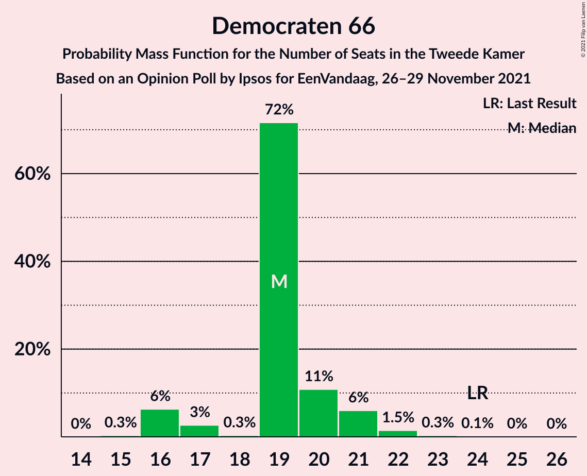

# Opinion Poll by Ipsos for EenVandaag, 26–29 November 2021

<a href="#voting-intentions">Voting Intentions</a> | <a href="#seats">Seats</a> | <a href="#coalitions">Coalitions</a> | <a href="#technical-information">Technical Information</a>

## Voting Intentions

### Confidence Intervals

| Party | Last Result | Poll Result | 80% Confidence Interval | 90% Confidence Interval | 95% Confidence Interval | 99% Confidence Interval |
|:-----:|:-----------:|:-----------:|:-----------------------:|:-----------------------:|:-----------------------:|:-----------------------:|
| Volkspartij voor Vrijheid en Democratie | 21.9% | 21.4% | 19.8–23.2% |19.4–23.7% |19.0–24.1% |18.3–24.9% |
| Democraten 66 | 15.0% | 12.8% | 11.5–14.3% |11.2–14.6% |10.9–15.0% |10.3–15.7% |
| Partij voor de Vrijheid | 10.8% | 12.5% | 11.2–13.9% |10.9–14.3% |10.6–14.7% |10.0–15.4% |
| Christen-Democratisch Appèl | 9.5% | 6.7% | 5.8–7.9% |5.6–8.2% |5.3–8.5% |4.9–9.0% |
| Socialistische Partij | 6.0% | 5.7% | 4.8–6.7% |4.6–7.0% |4.4–7.3% |4.0–7.8% |
| GroenLinks | 5.2% | 5.4% | 4.5–6.4% |4.3–6.7% |4.1–6.9% |3.8–7.5% |
| Partij voor de Dieren | 3.8% | 5.4% | 4.5–6.4% |4.3–6.7% |4.1–6.9% |3.8–7.5% |
| Partij van de Arbeid | 5.7% | 5.2% | 4.4–6.2% |4.1–6.5% |3.9–6.7% |3.6–7.2% |
| BoerBurgerBeweging | 1.0% | 4.2% | 3.5–5.1% |3.3–5.4% |3.1–5.6% |2.8–6.1% |
| Juiste Antwoord 2021 | 2.4% | 3.6% | 2.9–4.5% |2.7–4.7% |2.6–4.9% |2.3–5.4% |
| ChristenUnie | 3.4% | 3.5% | 2.8–4.3% |2.7–4.6% |2.5–4.8% |2.2–5.2% |
| Volt Europa | 2.4% | 3.5% | 2.8–4.3% |2.7–4.6% |2.5–4.8% |2.2–5.2% |
| Forum voor Democratie | 5.0% | 2.8% | 2.2–3.6% |2.1–3.8% |1.9–4.0% |1.7–4.4% |
| Staatkundig Gereformeerde Partij | 2.1% | 2.5% | 2.0–3.2% |1.8–3.4% |1.7–3.6% |1.5–4.0% |
| DENK | 2.0% | 2.3% | 1.8–3.0% |1.6–3.2% |1.5–3.4% |1.3–3.8% |
| Bij1 | 0.8% | 0.7% | 0.5–1.2% |0.4–1.3% |0.3–1.4% |0.2–1.7% |
| 50Plus | 1.0% | 0.5% | 0.3–0.9% |0.3–1.1% |0.2–1.2% |0.2–1.4% |

*Note:* The poll result column reflects the actual value used in the calculations. Published results may vary slightly, and in addition be rounded to fewer digits.

## Seats

### Confidence Intervals

| Party | Last Result | Median | 80% Confidence Interval | 90% Confidence Interval | 95% Confidence Interval | 99% Confidence Interval |
|:-----:|:-----------:|:------:|:-----------------------:|:-----------------------:|:-----------------------:|:-----------------------:|
| <a href="#volkspartij-voor-vrijheid-en-democratie">Volkspartij voor Vrijheid en Democratie</a> | 34 | 32 | 31–34 |31–36 |29–36 |29–41 |
| <a href="#democraten-66">Democraten 66</a> | 24 | 19 | 19–20 |16–21 |16–21 |16–22 |
| <a href="#partij-voor-de-vrijheid">Partij voor de Vrijheid</a> | 17 | 21 | 19–22 |19–22 |17–22 |16–23 |
| <a href="#christen-democratisch-appèl">Christen-Democratisch Appèl</a> | 15 | 10 | 9–11 |9–11 |8–12 |8–13 |
| <a href="#socialistische-partij">Socialistische Partij</a> | 9 | 9 | 8–10 |8–12 |6–12 |6–12 |
| <a href="#groenlinks">GroenLinks</a> | 8 | 8 | 6–8 |6–9 |6–9 |6–10 |
| <a href="#partij-voor-de-dieren">Partij voor de Dieren</a> | 6 | 8 | 7–9 |6–9 |6–9 |6–10 |
| <a href="#partij-van-de-arbeid">Partij van de Arbeid</a> | 9 | 8 | 6–8 |6–8 |6–9 |6–10 |
| <a href="#boerburgerbeweging">BoerBurgerBeweging</a> | 1 | 7 | 5–8 |5–8 |5–8 |4–8 |
| <a href="#juiste-antwoord-2021">Juiste Antwoord 2021</a> | 3 | 6 | 5–7 |4–7 |4–7 |4–7 |
| <a href="#christenunie">ChristenUnie</a> | 5 | 5 | 4–5 |4–5 |4–6 |3–8 |
| <a href="#volt-europa">Volt Europa</a> | 3 | 5 | 4–5 |4–6 |4–6 |4–8 |
| <a href="#forum-voor-democratie">Forum voor Democratie</a> | 8 | 4 | 4–6 |4–6 |3–6 |3–6 |
| <a href="#staatkundig-gereformeerde-partij">Staatkundig Gereformeerde Partij</a> | 3 | 3 | 3–4 |3–5 |3–5 |2–5 |
| <a href="#denk">DENK</a> | 3 | 2 | 2–3 |2–5 |2–5 |2–6 |
| <a href="#bij1">Bij1</a> | 1 | 1 | 0–2 |0–2 |0–2 |0–2 |
| <a href="#50plus">50Plus</a> | 1 | 0 | 0 |0 |0 |0–2 |

### Volkspartij voor Vrijheid en Democratie

*For a full overview of the results for this party, see the [Volkspartij voor Vrijheid en Democratie](party-volkspartijvoorvrijheidendemocratie.html) page.*

| Number of Seats | Probability | Accumulated | Special Marks |
|:---------------:|:-----------:|:-----------:|:-------------:|
| 27 | 0.1% | 100% |  |
| 28 | 0.2% | 99.9% |  |
| 29 | 4% | 99.7% |  |
| 30 | 0.4% | 96% |  |
| 31 | 39% | 96% |  |
| 32 | 32% | 56% | Median |
| 33 | 12% | 24% |  |
| 34 | 6% | 12% | Last Result |
| 35 | 1.0% | 6% |  |
| 36 | 4% | 5% |  |
| 37 | 0.1% | 2% |  |
| 38 | 0% | 1.5% |  |
| 39 | 0.3% | 1.4% |  |
| 40 | 0% | 1.1% |  |
| 41 | 1.1% | 1.1% |  |
| 42 | 0% | 0% |  |

### Democraten 66

*For a full overview of the results for this party, see the [Democraten 66](party-democraten66.html) page.*

| Number of Seats | Probability | Accumulated | Special Marks |
|:---------------:|:-----------:|:-----------:|:-------------:|
| 15 | 0.3% | 100% |  |
| 16 | 6% | 99.7% |  |
| 17 | 3% | 93% |  |
| 18 | 0.3% | 91% |  |
| 19 | 72% | 90% | Median |
| 20 | 11% | 19% |  |
| 21 | 6% | 8% |  |
| 22 | 1.5% | 2% |  |
| 23 | 0.3% | 0.5% |  |
| 24 | 0.1% | 0.2% | Last Result |
| 25 | 0% | 0.1% |  |
| 26 | 0% | 0% |  |

### Partij voor de Vrijheid

*For a full overview of the results for this party, see the [Partij voor de Vrijheid](party-partijvoordevrijheid.html) page.*

| Number of Seats | Probability | Accumulated | Special Marks |
|:---------------:|:-----------:|:-----------:|:-------------:|
| 15 | 0% | 100% |  |
| 16 | 2% | 99.9% |  |
| 17 | 0.4% | 98% | Last Result |
| 18 | 1.4% | 97% |  |
| 19 | 42% | 96% |  |
| 20 | 1.3% | 54% |  |
| 21 | 14% | 52% | Median |
| 22 | 37% | 39% |  |
| 23 | 1.3% | 1.5% |  |
| 24 | 0.2% | 0.2% |  |
| 25 | 0% | 0% |  |

### Christen-Democratisch Appèl

*For a full overview of the results for this party, see the [Christen-Democratisch Appèl](party-christen-democratischappèl.html) page.*

| Number of Seats | Probability | Accumulated | Special Marks |
|:---------------:|:-----------:|:-----------:|:-------------:|
| 7 | 0.1% | 100% |  |
| 8 | 3% | 99.9% |  |
| 9 | 41% | 97% |  |
| 10 | 11% | 56% | Median |
| 11 | 40% | 45% |  |
| 12 | 4% | 5% |  |
| 13 | 0.4% | 0.5% |  |
| 14 | 0.1% | 0.1% |  |
| 15 | 0% | 0% | Last Result |

### Socialistische Partij

*For a full overview of the results for this party, see the [Socialistische Partij](party-socialistischepartij.html) page.*

| Number of Seats | Probability | Accumulated | Special Marks |
|:---------------:|:-----------:|:-----------:|:-------------:|
| 6 | 3% | 100% |  |
| 7 | 0.9% | 97% |  |
| 8 | 6% | 96% |  |
| 9 | 43% | 90% | Last Result, Median |
| 10 | 40% | 46% |  |
| 11 | 0.8% | 6% |  |
| 12 | 5% | 5% |  |
| 13 | 0% | 0% |  |

### GroenLinks

*For a full overview of the results for this party, see the [GroenLinks](party-groenlinks.html) page.*

| Number of Seats | Probability | Accumulated | Special Marks |
|:---------------:|:-----------:|:-----------:|:-------------:|
| 6 | 11% | 100% |  |
| 7 | 3% | 89% |  |
| 8 | 78% | 86% | Last Result, Median |
| 9 | 7% | 7% |  |
| 10 | 0.7% | 0.7% |  |
| 11 | 0.1% | 0.1% |  |
| 12 | 0% | 0% |  |

### Partij voor de Dieren

*For a full overview of the results for this party, see the [Partij voor de Dieren](party-partijvoordedieren.html) page.*

| Number of Seats | Probability | Accumulated | Special Marks |
|:---------------:|:-----------:|:-----------:|:-------------:|
| 5 | 0.1% | 100% |  |
| 6 | 6% | 99.9% | Last Result |
| 7 | 5% | 94% |  |
| 8 | 44% | 89% | Median |
| 9 | 44% | 45% |  |
| 10 | 1.2% | 1.3% |  |
| 11 | 0.1% | 0.1% |  |
| 12 | 0% | 0% |  |

### Partij van de Arbeid

*For a full overview of the results for this party, see the [Partij van de Arbeid](party-partijvandearbeid.html) page.*

| Number of Seats | Probability | Accumulated | Special Marks |
|:---------------:|:-----------:|:-----------:|:-------------:|
| 5 | 0.3% | 100% |  |
| 6 | 12% | 99.7% |  |
| 7 | 11% | 88% |  |
| 8 | 73% | 77% | Median |
| 9 | 2% | 4% | Last Result |
| 10 | 2% | 2% |  |
| 11 | 0% | 0% |  |

### BoerBurgerBeweging

*For a full overview of the results for this party, see the [BoerBurgerBeweging](party-boerburgerbeweging.html) page.*

| Number of Seats | Probability | Accumulated | Special Marks |
|:---------------:|:-----------:|:-----------:|:-------------:|
| 1 | 0% | 100% | Last Result |
| 2 | 0% | 100% |  |
| 3 | 0% | 100% |  |
| 4 | 2% | 100% |  |
| 5 | 33% | 98% |  |
| 6 | 9% | 64% |  |
| 7 | 43% | 56% | Median |
| 8 | 12% | 12% |  |
| 9 | 0.4% | 0.4% |  |
| 10 | 0.1% | 0.1% |  |
| 11 | 0% | 0% |  |

### Juiste Antwoord 2021

*For a full overview of the results for this party, see the [Juiste Antwoord 2021](party-juisteantwoord2021.html) page.*

| Number of Seats | Probability | Accumulated | Special Marks |
|:---------------:|:-----------:|:-----------:|:-------------:|
| 3 | 0.2% | 100% | Last Result |
| 4 | 7% | 99.8% |  |
| 5 | 5% | 93% |  |
| 6 | 54% | 88% | Median |
| 7 | 34% | 34% |  |
| 8 | 0.2% | 0.3% |  |
| 9 | 0.1% | 0.1% |  |
| 10 | 0% | 0% |  |

### ChristenUnie

*For a full overview of the results for this party, see the [ChristenUnie](party-christenunie.html) page.*

| Number of Seats | Probability | Accumulated | Special Marks |
|:---------------:|:-----------:|:-----------:|:-------------:|
| 3 | 1.5% | 100% |  |
| 4 | 43% | 98.5% |  |
| 5 | 51% | 55% | Last Result, Median |
| 6 | 3% | 4% |  |
| 7 | 0.9% | 2% |  |
| 8 | 0.7% | 0.8% |  |
| 9 | 0.1% | 0.1% |  |
| 10 | 0% | 0% |  |

### Volt Europa

*For a full overview of the results for this party, see the [Volt Europa](party-volteuropa.html) page.*

| Number of Seats | Probability | Accumulated | Special Marks |
|:---------------:|:-----------:|:-----------:|:-------------:|
| 3 | 0.3% | 100% | Last Result |
| 4 | 16% | 99.7% |  |
| 5 | 78% | 84% | Median |
| 6 | 4% | 6% |  |
| 7 | 0.3% | 2% |  |
| 8 | 1.3% | 1.3% |  |
| 9 | 0% | 0% |  |

### Forum voor Democratie

*For a full overview of the results for this party, see the [Forum voor Democratie](party-forumvoordemocratie.html) page.*

| Number of Seats | Probability | Accumulated | Special Marks |
|:---------------:|:-----------:|:-----------:|:-------------:|
| 2 | 0.2% | 100% |  |
| 3 | 3% | 99.8% |  |
| 4 | 59% | 97% | Median |
| 5 | 5% | 38% |  |
| 6 | 32% | 32% |  |
| 7 | 0.1% | 0.1% |  |
| 8 | 0% | 0% | Last Result |

### Staatkundig Gereformeerde Partij

*For a full overview of the results for this party, see the [Staatkundig Gereformeerde Partij](party-staatkundiggereformeerdepartij.html) page.*

| Number of Seats | Probability | Accumulated | Special Marks |
|:---------------:|:-----------:|:-----------:|:-------------:|
| 1 | 0.1% | 100% |  |
| 2 | 1.1% | 99.9% |  |
| 3 | 83% | 98.8% | Last Result, Median |
| 4 | 10% | 16% |  |
| 5 | 6% | 6% |  |
| 6 | 0% | 0% |  |

### DENK

*For a full overview of the results for this party, see the [DENK](party-denk.html) page.*

| Number of Seats | Probability | Accumulated | Special Marks |
|:---------------:|:-----------:|:-----------:|:-------------:|
| 2 | 51% | 100% | Median |
| 3 | 40% | 49% | Last Result |
| 4 | 4% | 9% |  |
| 5 | 5% | 5% |  |
| 6 | 0.6% | 0.6% |  |
| 7 | 0% | 0% |  |

### Bij1

*For a full overview of the results for this party, see the [Bij1](party-bij1.html) page.*

| Number of Seats | Probability | Accumulated | Special Marks |
|:---------------:|:-----------:|:-----------:|:-------------:|
| 0 | 48% | 100% |  |
| 1 | 42% | 52% | Last Result, Median |
| 2 | 11% | 11% |  |
| 3 | 0% | 0% |  |

### 50Plus

*For a full overview of the results for this party, see the [50Plus](party-50plus.html) page.*

| Number of Seats | Probability | Accumulated | Special Marks |
|:---------------:|:-----------:|:-----------:|:-------------:|
| 0 | 98% | 100% | Median |
| 1 | 2% | 2% | Last Result |
| 2 | 0.8% | 0.8% |  |
| 3 | 0% | 0% |  |

## Coalitions

### Confidence Intervals

| Coalition | Last Result | Median | Majority? | 80% Confidence Interval | 90% Confidence Interval | 95% Confidence Interval | 99% Confidence Interval |
|:---------:|:-----------:|:------:|:---------:|:-----------------------:|:-----------------------:|:-----------------------:|:-----------------------:|
| Volkspartij voor Vrijheid en Democratie – Democraten 66 – Christen-Democratisch Appèl – Partij van de Arbeid – ChristenUnie | 87 | 74 | 7% | 72–74 | 70–77 | 70–81 | 70–82 |
| Volkspartij voor Vrijheid en Democratie – Democraten 66 – Christen-Democratisch Appèl – GroenLinks – ChristenUnie | 86 | 74 | 7% | 72–75 | 71–77 | 71–80 | 70–82 |
| Volkspartij voor Vrijheid en Democratie – Partij voor de Vrijheid – Christen-Democratisch Appèl – Forum voor Democratie – Staatkundig Gereformeerde Partij | 77 | 71 | 0.1% | 68–72 | 68–74 | 68–74 | 67–75 |
| Volkspartij voor Vrijheid en Democratie – Democraten 66 – Christen-Democratisch Appèl – ChristenUnie | 78 | 66 | 0% | 64–68 | 63–70 | 63–71 | 62–74 |
| Volkspartij voor Vrijheid en Democratie – Partij voor de Vrijheid – Christen-Democratisch Appèl – Forum voor Democratie | 74 | 68 | 0% | 65–69 | 65–69 | 65–70 | 63–71 |
| Volkspartij voor Vrijheid en Democratie – Democraten 66 – Partij van de Arbeid | 67 | 59 | 0% | 57–59 | 57–61 | 57–67 | 55–71 |
| Volkspartij voor Vrijheid en Democratie – Partij voor de Vrijheid – Christen-Democratisch Appèl | 66 | 63 | 0% | 61–64 | 61–65 | 61–66 | 58–68 |
| Volkspartij voor Vrijheid en Democratie – Democraten 66 – Christen-Democratisch Appèl | 73 | 61 | 0% | 60–63 | 59–64 | 58–66 | 58–71 |
| Democraten 66 – Christen-Democratisch Appèl – Socialistische Partij – GroenLinks – Partij van de Arbeid – ChristenUnie | 70 | 57 | 0% | 56–61 | 56–61 | 55–61 | 53–62 |
| Volkspartij voor Vrijheid en Democratie – Christen-Democratisch Appèl – Partij van de Arbeid | 58 | 50 | 0% | 49–50 | 48–54 | 48–55 | 47–57 |
| Volkspartij voor Vrijheid en Democratie – Christen-Democratisch Appèl – Forum voor Democratie – Staatkundig Gereformeerde Partij – 50Plus | 61 | 50 | 0% | 49–52 | 49–53 | 49–54 | 46–56 |
| Volkspartij voor Vrijheid en Democratie – Christen-Democratisch Appèl – Forum voor Democratie – Staatkundig Gereformeerde Partij | 60 | 50 | 0% | 49–52 | 49–53 | 49–54 | 46–56 |
| Democraten 66 – Christen-Democratisch Appèl – GroenLinks – Partij van de Arbeid – ChristenUnie | 61 | 48 | 0% | 47–51 | 44–53 | 44–54 | 44–55 |
| Volkspartij voor Vrijheid en Democratie – Christen-Democratisch Appèl – Forum voor Democratie – 50Plus | 58 | 47 | 0% | 46–47 | 46–49 | 46–51 | 42–52 |
| Volkspartij voor Vrijheid en Democratie – Christen-Democratisch Appèl – Forum voor Democratie | 57 | 47 | 0% | 46–47 | 46–49 | 46–51 | 42–52 |
| Volkspartij voor Vrijheid en Democratie – Christen-Democratisch Appèl | 49 | 42 | 0% | 41–43 | 41–45 | 41–47 | 39–49 |
| Volkspartij voor Vrijheid en Democratie – Partij van de Arbeid | 43 | 39 | 0% | 39–41 | 39–43 | 36–46 | 36–49 |
| Democraten 66 – Christen-Democratisch Appèl – Partij van de Arbeid | 48 | 36 | 0% | 35–38 | 32–40 | 32–40 | 31–42 |
| Democraten 66 – Christen-Democratisch Appèl | 39 | 30 | 0% | 28–30 | 25–32 | 25–33 | 25–34 |
| Christen-Democratisch Appèl – Partij van de Arbeid – ChristenUnie | 29 | 21 | 0% | 21–24 | 20–24 | 20–24 | 19–26 |
| Christen-Democratisch Appèl – Partij van de Arbeid | 24 | 17 | 0% | 16–19 | 16–19 | 16–19 | 15–20 |

### Volkspartij voor Vrijheid en Democratie – Democraten 66 – Christen-Democratisch Appèl – Partij van de Arbeid – ChristenUnie

| Number of Seats | Probability | Accumulated | Special Marks |
|:---------------:|:-----------:|:-----------:|:-------------:|
| 69 | 0.1% | 100% |  |
| 70 | 7% | 99.9% |  |
| 71 | 0.1% | 93% |  |
| 72 | 32% | 93% |  |
| 73 | 4% | 61% |  |
| 74 | 49% | 57% | Median |
| 75 | 0.8% | 7% |  |
| 76 | 0.2% | 7% | Majority |
| 77 | 2% | 6% |  |
| 78 | 0.3% | 4% |  |
| 79 | 0.7% | 4% |  |
| 80 | 0% | 3% |  |
| 81 | 2% | 3% |  |
| 82 | 1.2% | 1.3% |  |
| 83 | 0.1% | 0.1% |  |
| 84 | 0% | 0% |  |
| 85 | 0% | 0% |  |
| 86 | 0% | 0% |  |
| 87 | 0% | 0% | Last Result |

### Volkspartij voor Vrijheid en Democratie – Democraten 66 – Christen-Democratisch Appèl – GroenLinks – ChristenUnie

| Number of Seats | Probability | Accumulated | Special Marks |
|:---------------:|:-----------:|:-----------:|:-------------:|
| 70 | 1.2% | 100% |  |
| 71 | 6% | 98.7% |  |
| 72 | 32% | 93% |  |
| 73 | 0.5% | 61% |  |
| 74 | 49% | 60% | Median |
| 75 | 4% | 11% |  |
| 76 | 0.3% | 7% | Majority |
| 77 | 2% | 6% |  |
| 78 | 0.3% | 4% |  |
| 79 | 0.4% | 4% |  |
| 80 | 2% | 4% |  |
| 81 | 0.7% | 2% |  |
| 82 | 1.2% | 1.3% |  |
| 83 | 0% | 0.1% |  |
| 84 | 0% | 0% |  |
| 85 | 0% | 0% |  |
| 86 | 0% | 0% | Last Result |

### Volkspartij voor Vrijheid en Democratie – Partij voor de Vrijheid – Christen-Democratisch Appèl – Forum voor Democratie – Staatkundig Gereformeerde Partij

| Number of Seats | Probability | Accumulated | Special Marks |
|:---------------:|:-----------:|:-----------:|:-------------:|
| 63 | 0% | 100% |  |
| 64 | 0.2% | 99.9% |  |
| 65 | 0.2% | 99.8% |  |
| 66 | 0.1% | 99.6% |  |
| 67 | 0.3% | 99.5% |  |
| 68 | 39% | 99.2% |  |
| 69 | 4% | 61% |  |
| 70 | 2% | 57% | Median |
| 71 | 14% | 55% |  |
| 72 | 33% | 42% |  |
| 73 | 2% | 9% |  |
| 74 | 5% | 7% |  |
| 75 | 1.2% | 1.2% |  |
| 76 | 0% | 0.1% | Majority |
| 77 | 0% | 0% | Last Result |

### Volkspartij voor Vrijheid en Democratie – Democraten 66 – Christen-Democratisch Appèl – ChristenUnie

| Number of Seats | Probability | Accumulated | Special Marks |
|:---------------:|:-----------:|:-----------:|:-------------:|
| 60 | 0% | 100% |  |
| 61 | 0% | 99.9% |  |
| 62 | 1.0% | 99.9% |  |
| 63 | 5% | 98.9% |  |
| 64 | 33% | 93% |  |
| 65 | 1.2% | 61% |  |
| 66 | 42% | 60% | Median |
| 67 | 0.4% | 17% |  |
| 68 | 11% | 17% |  |
| 69 | 0.5% | 6% |  |
| 70 | 2% | 6% |  |
| 71 | 2% | 4% |  |
| 72 | 0.3% | 2% |  |
| 73 | 0.7% | 2% |  |
| 74 | 1.2% | 1.2% |  |
| 75 | 0.1% | 0.1% |  |
| 76 | 0% | 0% | Majority |
| 77 | 0% | 0% |  |
| 78 | 0% | 0% | Last Result |

### Volkspartij voor Vrijheid en Democratie – Partij voor de Vrijheid – Christen-Democratisch Appèl – Forum voor Democratie

| Number of Seats | Probability | Accumulated | Special Marks |
|:---------------:|:-----------:|:-----------:|:-------------:|
| 61 | 0.2% | 100% |  |
| 62 | 0.2% | 99.8% |  |
| 63 | 0.1% | 99.6% |  |
| 64 | 0.6% | 99.4% |  |
| 65 | 42% | 98.9% |  |
| 66 | 0.5% | 57% |  |
| 67 | 4% | 56% | Median |
| 68 | 12% | 53% |  |
| 69 | 37% | 41% |  |
| 70 | 2% | 3% |  |
| 71 | 1.5% | 2% |  |
| 72 | 0% | 0.1% |  |
| 73 | 0% | 0% |  |
| 74 | 0% | 0% | Last Result |

### Volkspartij voor Vrijheid en Democratie – Democraten 66 – Partij van de Arbeid

| Number of Seats | Probability | Accumulated | Special Marks |
|:---------------:|:-----------:|:-----------:|:-------------:|
| 55 | 0.9% | 100% |  |
| 56 | 0.3% | 99.1% |  |
| 57 | 9% | 98.8% |  |
| 58 | 40% | 90% |  |
| 59 | 42% | 50% | Median |
| 60 | 3% | 8% |  |
| 61 | 1.1% | 5% |  |
| 62 | 0.3% | 4% |  |
| 63 | 0.4% | 4% |  |
| 64 | 0.4% | 4% |  |
| 65 | 0.2% | 3% |  |
| 66 | 0.1% | 3% |  |
| 67 | 2% | 3% | Last Result |
| 68 | 0% | 1.1% |  |
| 69 | 0% | 1.1% |  |
| 70 | 0% | 1.1% |  |
| 71 | 1.1% | 1.1% |  |
| 72 | 0% | 0% |  |

### Volkspartij voor Vrijheid en Democratie – Partij voor de Vrijheid – Christen-Democratisch Appèl

| Number of Seats | Probability | Accumulated | Special Marks |
|:---------------:|:-----------:|:-----------:|:-------------:|
| 56 | 0.2% | 100% |  |
| 57 | 0.1% | 99.8% |  |
| 58 | 0.2% | 99.7% |  |
| 59 | 0.2% | 99.5% |  |
| 60 | 1.4% | 99.2% |  |
| 61 | 40% | 98% |  |
| 62 | 5% | 58% |  |
| 63 | 32% | 53% | Median |
| 64 | 12% | 21% |  |
| 65 | 6% | 9% |  |
| 66 | 2% | 3% | Last Result |
| 67 | 0.1% | 1.3% |  |
| 68 | 1.2% | 1.2% |  |
| 69 | 0% | 0.1% |  |
| 70 | 0% | 0% |  |

### Volkspartij voor Vrijheid en Democratie – Democraten 66 – Christen-Democratisch Appèl

| Number of Seats | Probability | Accumulated | Special Marks |
|:---------------:|:-----------:|:-----------:|:-------------:|
| 55 | 0% | 100% |  |
| 56 | 0% | 99.9% |  |
| 57 | 0.2% | 99.9% |  |
| 58 | 2% | 99.7% |  |
| 59 | 5% | 97% |  |
| 60 | 32% | 92% |  |
| 61 | 39% | 60% | Median |
| 62 | 4% | 21% |  |
| 63 | 11% | 17% |  |
| 64 | 2% | 6% |  |
| 65 | 0.5% | 5% |  |
| 66 | 2% | 4% |  |
| 67 | 0% | 2% |  |
| 68 | 0.3% | 2% |  |
| 69 | 0.1% | 1.3% |  |
| 70 | 0% | 1.2% |  |
| 71 | 1.1% | 1.1% |  |
| 72 | 0% | 0% |  |
| 73 | 0% | 0% | Last Result |

### Democraten 66 – Christen-Democratisch Appèl – Socialistische Partij – GroenLinks – Partij van de Arbeid – ChristenUnie

| Number of Seats | Probability | Accumulated | Special Marks |
|:---------------:|:-----------:|:-----------:|:-------------:|
| 49 | 0.1% | 100% |  |
| 50 | 0% | 99.9% |  |
| 51 | 0% | 99.9% |  |
| 52 | 0% | 99.9% |  |
| 53 | 2% | 99.9% |  |
| 54 | 0.4% | 98% |  |
| 55 | 0.4% | 98% |  |
| 56 | 16% | 97% |  |
| 57 | 33% | 81% |  |
| 58 | 2% | 48% |  |
| 59 | 0.4% | 46% | Median |
| 60 | 2% | 46% |  |
| 61 | 42% | 44% |  |
| 62 | 2% | 2% |  |
| 63 | 0.1% | 0.3% |  |
| 64 | 0.1% | 0.2% |  |
| 65 | 0% | 0.1% |  |
| 66 | 0% | 0.1% |  |
| 67 | 0% | 0.1% |  |
| 68 | 0.1% | 0.1% |  |
| 69 | 0% | 0% |  |
| 70 | 0% | 0% | Last Result |

### Volkspartij voor Vrijheid en Democratie – Christen-Democratisch Appèl – Partij van de Arbeid

| Number of Seats | Probability | Accumulated | Special Marks |
|:---------------:|:-----------:|:-----------:|:-------------:|
| 44 | 0.2% | 100% |  |
| 45 | 0.1% | 99.8% |  |
| 46 | 0.2% | 99.7% |  |
| 47 | 1.3% | 99.5% |  |
| 48 | 4% | 98% |  |
| 49 | 43% | 94% |  |
| 50 | 43% | 52% | Median |
| 51 | 2% | 8% |  |
| 52 | 0.3% | 6% |  |
| 53 | 0.9% | 6% |  |
| 54 | 2% | 5% |  |
| 55 | 2% | 4% |  |
| 56 | 0.3% | 2% |  |
| 57 | 1.2% | 1.3% |  |
| 58 | 0.1% | 0.1% | Last Result |
| 59 | 0% | 0% |  |

### Volkspartij voor Vrijheid en Democratie – Christen-Democratisch Appèl – Forum voor Democratie – Staatkundig Gereformeerde Partij – 50Plus

| Number of Seats | Probability | Accumulated | Special Marks |
|:---------------:|:-----------:|:-----------:|:-------------:|
| 44 | 0.2% | 100% |  |
| 45 | 0.1% | 99.8% |  |
| 46 | 1.1% | 99.7% |  |
| 47 | 0.1% | 98.6% |  |
| 48 | 0.4% | 98.5% |  |
| 49 | 38% | 98% | Median |
| 50 | 45% | 60% |  |
| 51 | 1.0% | 14% |  |
| 52 | 6% | 13% |  |
| 53 | 3% | 7% |  |
| 54 | 2% | 4% |  |
| 55 | 0.2% | 1.4% |  |
| 56 | 1.2% | 1.2% |  |
| 57 | 0% | 0% |  |
| 58 | 0% | 0% |  |
| 59 | 0% | 0% |  |
| 60 | 0% | 0% |  |
| 61 | 0% | 0% | Last Result |

### Volkspartij voor Vrijheid en Democratie – Christen-Democratisch Appèl – Forum voor Democratie – Staatkundig Gereformeerde Partij

| Number of Seats | Probability | Accumulated | Special Marks |
|:---------------:|:-----------:|:-----------:|:-------------:|
| 44 | 0.2% | 100% |  |
| 45 | 0.1% | 99.8% |  |
| 46 | 1.1% | 99.7% |  |
| 47 | 0.3% | 98.6% |  |
| 48 | 0.2% | 98% |  |
| 49 | 38% | 98% | Median |
| 50 | 46% | 60% |  |
| 51 | 2% | 14% |  |
| 52 | 7% | 12% |  |
| 53 | 2% | 6% |  |
| 54 | 2% | 4% |  |
| 55 | 0.1% | 1.3% |  |
| 56 | 1.2% | 1.2% |  |
| 57 | 0% | 0% |  |
| 58 | 0% | 0% |  |
| 59 | 0% | 0% |  |
| 60 | 0% | 0% | Last Result |

### Democraten 66 – Christen-Democratisch Appèl – GroenLinks – Partij van de Arbeid – ChristenUnie

| Number of Seats | Probability | Accumulated | Special Marks |
|:---------------:|:-----------:|:-----------:|:-------------:|
| 42 | 0.1% | 100% |  |
| 43 | 0% | 99.9% |  |
| 44 | 5% | 99.9% |  |
| 45 | 1.2% | 95% |  |
| 46 | 0.4% | 93% |  |
| 47 | 12% | 93% |  |
| 48 | 34% | 81% |  |
| 49 | 2% | 48% |  |
| 50 | 0.3% | 46% | Median |
| 51 | 39% | 46% |  |
| 52 | 0.2% | 7% |  |
| 53 | 4% | 7% |  |
| 54 | 2% | 3% |  |
| 55 | 0.5% | 0.6% |  |
| 56 | 0.1% | 0.2% |  |
| 57 | 0% | 0.1% |  |
| 58 | 0% | 0.1% |  |
| 59 | 0.1% | 0.1% |  |
| 60 | 0% | 0% |  |
| 61 | 0% | 0% | Last Result |

### Volkspartij voor Vrijheid en Democratie – Christen-Democratisch Appèl – Forum voor Democratie – 50Plus

| Number of Seats | Probability | Accumulated | Special Marks |
|:---------------:|:-----------:|:-----------:|:-------------:|
| 40 | 0.2% | 100% |  |
| 41 | 0% | 99.8% |  |
| 42 | 1.0% | 99.8% |  |
| 43 | 0.1% | 98.7% |  |
| 44 | 0.2% | 98.6% |  |
| 45 | 0.5% | 98% |  |
| 46 | 42% | 98% | Median |
| 47 | 48% | 56% |  |
| 48 | 2% | 8% |  |
| 49 | 2% | 7% |  |
| 50 | 0.8% | 5% |  |
| 51 | 2% | 4% |  |
| 52 | 1.4% | 1.4% |  |
| 53 | 0% | 0% |  |
| 54 | 0% | 0% |  |
| 55 | 0% | 0% |  |
| 56 | 0% | 0% |  |
| 57 | 0% | 0% |  |
| 58 | 0% | 0% | Last Result |

### Volkspartij voor Vrijheid en Democratie – Christen-Democratisch Appèl – Forum voor Democratie

| Number of Seats | Probability | Accumulated | Special Marks |
|:---------------:|:-----------:|:-----------:|:-------------:|
| 40 | 0.2% | 100% |  |
| 41 | 0% | 99.8% |  |
| 42 | 1.1% | 99.8% |  |
| 43 | 0.1% | 98.7% |  |
| 44 | 0.3% | 98.6% |  |
| 45 | 0.3% | 98% |  |
| 46 | 42% | 98% | Median |
| 47 | 49% | 56% |  |
| 48 | 1.2% | 8% |  |
| 49 | 3% | 6% |  |
| 50 | 0.6% | 4% |  |
| 51 | 2% | 3% |  |
| 52 | 1.4% | 1.4% |  |
| 53 | 0% | 0% |  |
| 54 | 0% | 0% |  |
| 55 | 0% | 0% |  |
| 56 | 0% | 0% |  |
| 57 | 0% | 0% | Last Result |

### Volkspartij voor Vrijheid en Democratie – Christen-Democratisch Appèl

| Number of Seats | Probability | Accumulated | Special Marks |
|:---------------:|:-----------:|:-----------:|:-------------:|
| 37 | 0.2% | 100% |  |
| 38 | 0.1% | 99.8% |  |
| 39 | 1.4% | 99.7% |  |
| 40 | 0.1% | 98% |  |
| 41 | 36% | 98% |  |
| 42 | 40% | 63% | Median |
| 43 | 16% | 23% |  |
| 44 | 1.2% | 7% |  |
| 45 | 3% | 6% |  |
| 46 | 0.4% | 4% |  |
| 47 | 2% | 3% |  |
| 48 | 0.1% | 1.3% |  |
| 49 | 1.2% | 1.2% | Last Result |
| 50 | 0.1% | 0.1% |  |
| 51 | 0% | 0% |  |

### Volkspartij voor Vrijheid en Democratie – Partij van de Arbeid

| Number of Seats | Probability | Accumulated | Special Marks |
|:---------------:|:-----------:|:-----------:|:-------------:|
| 34 | 0.1% | 100% |  |
| 35 | 0.3% | 99.9% |  |
| 36 | 4% | 99.7% |  |
| 37 | 0.3% | 96% |  |
| 38 | 0.2% | 96% |  |
| 39 | 50% | 96% |  |
| 40 | 32% | 45% | Median |
| 41 | 6% | 13% |  |
| 42 | 1.0% | 7% |  |
| 43 | 2% | 6% | Last Result |
| 44 | 0.9% | 4% |  |
| 45 | 0.3% | 3% |  |
| 46 | 2% | 3% |  |
| 47 | 0% | 1.3% |  |
| 48 | 0.2% | 1.3% |  |
| 49 | 1.1% | 1.1% |  |
| 50 | 0% | 0% |  |

### Democraten 66 – Christen-Democratisch Appèl – Partij van de Arbeid

| Number of Seats | Probability | Accumulated | Special Marks |
|:---------------:|:-----------:|:-----------:|:-------------:|
| 30 | 0.1% | 100% |  |
| 31 | 0.5% | 99.9% |  |
| 32 | 6% | 99.4% |  |
| 33 | 0.2% | 94% |  |
| 34 | 0.7% | 94% |  |
| 35 | 4% | 93% |  |
| 36 | 42% | 89% |  |
| 37 | 0.3% | 46% | Median |
| 38 | 39% | 46% |  |
| 39 | 0.7% | 7% |  |
| 40 | 5% | 6% |  |
| 41 | 0.4% | 0.9% |  |
| 42 | 0.1% | 0.5% |  |
| 43 | 0% | 0.4% |  |
| 44 | 0.4% | 0.4% |  |
| 45 | 0% | 0.1% |  |
| 46 | 0.1% | 0.1% |  |
| 47 | 0% | 0% |  |
| 48 | 0% | 0% | Last Result |

### Democraten 66 – Christen-Democratisch Appèl

| Number of Seats | Probability | Accumulated | Special Marks |
|:---------------:|:-----------:|:-----------:|:-------------:|
| 23 | 0.3% | 100% |  |
| 24 | 0.1% | 99.7% |  |
| 25 | 6% | 99.6% |  |
| 26 | 1.0% | 93% |  |
| 27 | 1.5% | 92% |  |
| 28 | 34% | 91% |  |
| 29 | 0.3% | 57% | Median |
| 30 | 51% | 57% |  |
| 31 | 0.3% | 5% |  |
| 32 | 0.2% | 5% |  |
| 33 | 4% | 5% |  |
| 34 | 0.1% | 0.6% |  |
| 35 | 0.4% | 0.5% |  |
| 36 | 0.1% | 0.1% |  |
| 37 | 0% | 0% |  |
| 38 | 0% | 0% |  |
| 39 | 0% | 0% | Last Result |

### Christen-Democratisch Appèl – Partij van de Arbeid – ChristenUnie

| Number of Seats | Probability | Accumulated | Special Marks |
|:---------------:|:-----------:|:-----------:|:-------------:|
| 18 | 0.5% | 100% |  |
| 19 | 1.2% | 99.5% |  |
| 20 | 6% | 98% |  |
| 21 | 43% | 92% |  |
| 22 | 2% | 49% |  |
| 23 | 4% | 48% | Median |
| 24 | 42% | 44% |  |
| 25 | 0.9% | 2% |  |
| 26 | 1.0% | 1.1% |  |
| 27 | 0.1% | 0.2% |  |
| 28 | 0.1% | 0.1% |  |
| 29 | 0% | 0% | Last Result |

### Christen-Democratisch Appèl – Partij van de Arbeid

| Number of Seats | Probability | Accumulated | Special Marks |
|:---------------:|:-----------:|:-----------:|:-------------:|
| 13 | 0.3% | 100% |  |
| 14 | 0% | 99.7% |  |
| 15 | 0.9% | 99.7% |  |
| 16 | 18% | 98.8% |  |
| 17 | 32% | 81% |  |
| 18 | 4% | 48% | Median |
| 19 | 43% | 44% |  |
| 20 | 0.2% | 0.7% |  |
| 21 | 0.1% | 0.5% |  |
| 22 | 0.3% | 0.4% |  |
| 23 | 0.1% | 0.1% |  |
| 24 | 0% | 0.1% | Last Result |
| 25 | 0% | 0% |  |

## Technical Information

### Opinion Poll

+ **Polling firm:** Ipsos
+ **Commissioner(s):** EenVandaag
+ **Fieldwork period:** 26–29 November 2021

### Calculations

+ **Sample size:** 1008
+ **Simulations done:** 1,048,576
+ **Error estimate:** 1.78%

