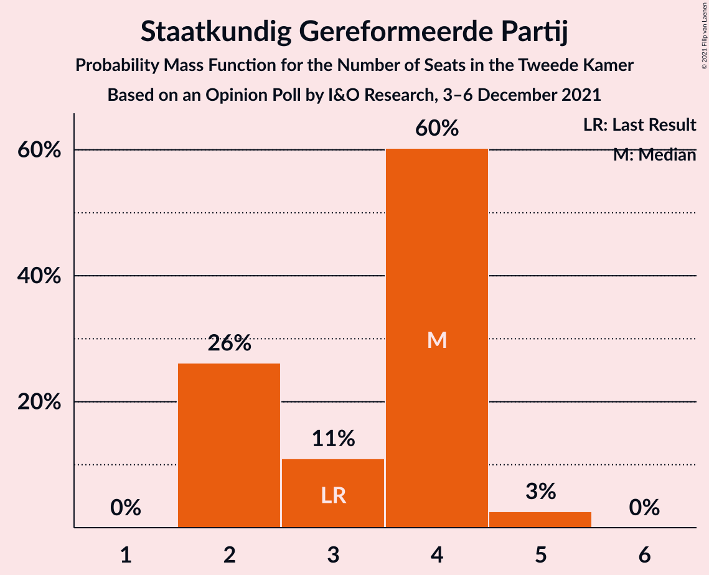
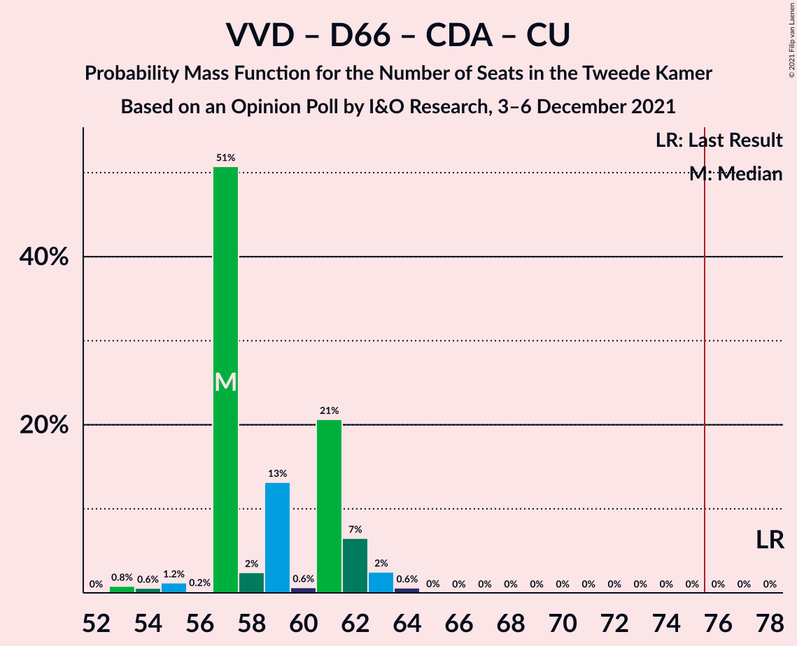

# Opinion Poll by I&O Research, 3–6 December 2021

<a href="#voting-intentions">Voting Intentions</a> | <a href="#seats">Seats</a> | <a href="#coalitions">Coalitions</a> | <a href="#technical-information">Technical Information</a>

## Voting Intentions

### Confidence Intervals

| Party | Last Result | Poll Result | 80% Confidence Interval | 90% Confidence Interval | 95% Confidence Interval | 99% Confidence Interval |
|:-----:|:-----------:|:-----------:|:-----------------------:|:-----------------------:|:-----------------------:|:-----------------------:|
| Volkspartij voor Vrijheid en Democratie | 21.9% | 18.2% | 17.2–19.4% |16.9–19.7% |16.6–20.0% |16.1–20.5% |
| Democraten 66 | 15.0% | 11.3% | 10.4–12.3% |10.2–12.5% |10.0–12.8% |9.6–13.2% |
| Partij voor de Vrijheid | 10.8% | 10.0% | 9.2–10.9% |9.0–11.2% |8.8–11.4% |8.4–11.9% |
| Volt Europa | 2.4% | 6.1% | 5.5–6.8% |5.3–7.0% |5.1–7.2% |4.8–7.6% |
| BoerBurgerBeweging | 1.0% | 6.1% | 5.5–6.8% |5.3–7.0% |5.1–7.2% |4.8–7.6% |
| Partij van de Arbeid | 5.7% | 6.0% | 5.4–6.7% |5.2–6.9% |5.0–7.1% |4.8–7.5% |
| GroenLinks | 5.2% | 5.8% | 5.2–6.5% |5.0–6.7% |4.9–6.9% |4.6–7.3% |
| Christen-Democratisch Appèl | 9.5% | 5.6% | 5.0–6.3% |4.8–6.5% |4.7–6.7% |4.4–7.0% |
| Socialistische Partij | 6.0% | 5.2% | 4.6–5.9% |4.5–6.1% |4.3–6.3% |4.1–6.6% |
| Partij voor de Dieren | 3.8% | 5.0% | 4.5–5.7% |4.3–5.9% |4.1–6.1% |3.9–6.4% |
| Juiste Antwoord 2021 | 2.4% | 5.0% | 4.5–5.7% |4.3–5.9% |4.1–6.1% |3.9–6.4% |
| ChristenUnie | 3.4% | 3.3% | 2.9–3.9% |2.7–4.0% |2.6–4.2% |2.4–4.5% |
| Forum voor Democratie | 5.0% | 2.6% | 2.2–3.1% |2.1–3.2% |2.0–3.4% |1.8–3.6% |
| Staatkundig Gereformeerde Partij | 2.1% | 2.4% | 2.0–2.9% |1.9–3.0% |1.8–3.2% |1.6–3.4% |
| Bij1 | 0.8% | 1.4% | 1.1–1.8% |1.1–1.9% |1.0–2.0% |0.9–2.2% |
| 50Plus | 1.0% | 1.1% | 0.9–1.5% |0.8–1.6% |0.7–1.7% |0.6–1.9% |
| DENK | 2.0% | 1.0% | 0.8–1.4% |0.7–1.5% |0.7–1.6% |0.6–1.8% |
| Belang van Nederland | 0.0% | 0.8% | 0.6–1.1% |0.5–1.2% |0.5–1.3% |0.4–1.4% |

*Note:* The poll result column reflects the actual value used in the calculations. Published results may vary slightly, and in addition be rounded to fewer digits.

## Seats

### Confidence Intervals

| Party | Last Result | Median | 80% Confidence Interval | 90% Confidence Interval | 95% Confidence Interval | 99% Confidence Interval |
|:-----:|:-----------:|:------:|:-----------------------:|:-----------------------:|:-----------------------:|:-----------------------:|
| <a href="#volkspartij-voor-vrijheid-en-democratie">Volkspartij voor Vrijheid en Democratie</a> | 34 | 29 | 27–30 |26–30 |25–30 |24–30 |
| <a href="#democraten-66">Democraten 66</a> | 24 | 16 | 16–18 |16–20 |15–20 |14–21 |
| <a href="#partij-voor-de-vrijheid">Partij voor de Vrijheid</a> | 17 | 15 | 14–15 |14–16 |13–17 |13–18 |
| <a href="#volt-europa">Volt Europa</a> | 3 | 10 | 8–10 |8–10 |8–11 |7–11 |
| <a href="#boerburgerbeweging">BoerBurgerBeweging</a> | 1 | 10 | 8–10 |8–10 |8–10 |8–11 |
| <a href="#partij-van-de-arbeid">Partij van de Arbeid</a> | 9 | 9 | 8–9 |8–10 |8–11 |7–12 |
| <a href="#groenlinks">GroenLinks</a> | 8 | 8 | 7–11 |7–11 |7–11 |7–12 |
| <a href="#christen-democratisch-appèl">Christen-Democratisch Appèl</a> | 15 | 8 | 7–11 |7–11 |7–11 |6–11 |
| <a href="#socialistische-partij">Socialistische Partij</a> | 9 | 8 | 8–9 |7–9 |6–9 |6–9 |
| <a href="#partij-voor-de-dieren">Partij voor de Dieren</a> | 6 | 9 | 7–10 |7–10 |6–10 |6–10 |
| <a href="#juiste-antwoord-2021">Juiste Antwoord 2021</a> | 3 | 7 | 6–8 |6–9 |6–9 |6–10 |
| <a href="#christenunie">ChristenUnie</a> | 5 | 4 | 4–6 |4–6 |4–6 |4–7 |
| <a href="#forum-voor-democratie">Forum voor Democratie</a> | 8 | 3 | 2–4 |2–4 |2–4 |2–5 |
| <a href="#staatkundig-gereformeerde-partij">Staatkundig Gereformeerde Partij</a> | 3 | 4 | 2–4 |2–4 |2–5 |2–5 |
| <a href="#bij1">Bij1</a> | 1 | 2 | 2 |2 |1–2 |1–3 |
| <a href="#50plus">50Plus</a> | 1 | 2 | 1–2 |1–2 |1–2 |0–3 |
| <a href="#denk">DENK</a> | 3 | 2 | 1–2 |1–2 |1–2 |1–2 |
| <a href="#belang-van-nederland">Belang van Nederland</a> | 0 | 1 | 0–1 |0–1 |0–1 |0–2 |

### Volkspartij voor Vrijheid en Democratie

*For a full overview of the results for this party, see the [Volkspartij voor Vrijheid en Democratie](party-volkspartijvoorvrijheidendemocratie.html) page.*

| Number of Seats | Probability | Accumulated | Special Marks |
|:---------------:|:-----------:|:-----------:|:-------------:|
| 24 | 2% | 100% |  |
| 25 | 2% | 98% |  |
| 26 | 4% | 97% |  |
| 27 | 17% | 93% |  |
| 28 | 22% | 75% |  |
| 29 | 5% | 54% | Median |
| 30 | 48% | 49% |  |
| 31 | 0.1% | 0.5% |  |
| 32 | 0.3% | 0.4% |  |
| 33 | 0% | 0% |  |
| 34 | 0% | 0% | Last Result |

### Democraten 66

*For a full overview of the results for this party, see the [Democraten 66](party-democraten66.html) page.*

| Number of Seats | Probability | Accumulated | Special Marks |
|:---------------:|:-----------:|:-----------:|:-------------:|
| 14 | 1.2% | 100% |  |
| 15 | 3% | 98.7% |  |
| 16 | 69% | 96% | Median |
| 17 | 12% | 27% |  |
| 18 | 6% | 15% |  |
| 19 | 2% | 9% |  |
| 20 | 4% | 7% |  |
| 21 | 2% | 2% |  |
| 22 | 0% | 0% |  |
| 23 | 0% | 0% |  |
| 24 | 0% | 0% | Last Result |

### Partij voor de Vrijheid

*For a full overview of the results for this party, see the [Partij voor de Vrijheid](party-partijvoordevrijheid.html) page.*

| Number of Seats | Probability | Accumulated | Special Marks |
|:---------------:|:-----------:|:-----------:|:-------------:|
| 12 | 0.2% | 100% |  |
| 13 | 3% | 99.8% |  |
| 14 | 14% | 97% |  |
| 15 | 75% | 82% | Median |
| 16 | 4% | 8% |  |
| 17 | 3% | 3% | Last Result |
| 18 | 0.5% | 0.6% |  |
| 19 | 0.1% | 0.1% |  |
| 20 | 0% | 0% |  |

### Volt Europa

*For a full overview of the results for this party, see the [Volt Europa](party-volteuropa.html) page.*

| Number of Seats | Probability | Accumulated | Special Marks |
|:---------------:|:-----------:|:-----------:|:-------------:|
| 3 | 0% | 100% | Last Result |
| 4 | 0% | 100% |  |
| 5 | 0% | 100% |  |
| 6 | 0% | 100% |  |
| 7 | 0.5% | 100% |  |
| 8 | 24% | 99.5% |  |
| 9 | 12% | 76% |  |
| 10 | 60% | 64% | Median |
| 11 | 3% | 4% |  |
| 12 | 0.4% | 0.4% |  |
| 13 | 0% | 0% |  |

### BoerBurgerBeweging

*For a full overview of the results for this party, see the [BoerBurgerBeweging](party-boerburgerbeweging.html) page.*

| Number of Seats | Probability | Accumulated | Special Marks |
|:---------------:|:-----------:|:-----------:|:-------------:|
| 1 | 0% | 100% | Last Result |
| 2 | 0% | 100% |  |
| 3 | 0% | 100% |  |
| 4 | 0% | 100% |  |
| 5 | 0% | 100% |  |
| 6 | 0% | 100% |  |
| 7 | 0.3% | 100% |  |
| 8 | 10% | 99.7% |  |
| 9 | 25% | 89% |  |
| 10 | 63% | 65% | Median |
| 11 | 1.3% | 1.4% |  |
| 12 | 0% | 0% |  |

### Partij van de Arbeid

*For a full overview of the results for this party, see the [Partij van de Arbeid](party-partijvandearbeid.html) page.*

| Number of Seats | Probability | Accumulated | Special Marks |
|:---------------:|:-----------:|:-----------:|:-------------:|
| 7 | 1.3% | 100% |  |
| 8 | 20% | 98.7% |  |
| 9 | 73% | 79% | Last Result, Median |
| 10 | 0.9% | 6% |  |
| 11 | 4% | 5% |  |
| 12 | 1.1% | 1.1% |  |
| 13 | 0% | 0% |  |

### GroenLinks

*For a full overview of the results for this party, see the [GroenLinks](party-groenlinks.html) page.*

| Number of Seats | Probability | Accumulated | Special Marks |
|:---------------:|:-----------:|:-----------:|:-------------:|
| 6 | 0.1% | 100% |  |
| 7 | 46% | 99.9% |  |
| 8 | 17% | 54% | Last Result, Median |
| 9 | 7% | 37% |  |
| 10 | 2% | 31% |  |
| 11 | 28% | 28% |  |
| 12 | 0.7% | 0.7% |  |
| 13 | 0% | 0% |  |

### Christen-Democratisch Appèl

*For a full overview of the results for this party, see the [Christen-Democratisch Appèl](party-christen-democratischappèl.html) page.*

| Number of Seats | Probability | Accumulated | Special Marks |
|:---------------:|:-----------:|:-----------:|:-------------:|
| 6 | 1.1% | 100% |  |
| 7 | 48% | 98.9% |  |
| 8 | 5% | 51% | Median |
| 9 | 8% | 46% |  |
| 10 | 6% | 38% |  |
| 11 | 32% | 32% |  |
| 12 | 0% | 0% |  |
| 13 | 0% | 0% |  |
| 14 | 0% | 0% |  |
| 15 | 0% | 0% | Last Result |

### Socialistische Partij

*For a full overview of the results for this party, see the [Socialistische Partij](party-socialistischepartij.html) page.*

| Number of Seats | Probability | Accumulated | Special Marks |
|:---------------:|:-----------:|:-----------:|:-------------:|
| 6 | 5% | 100% |  |
| 7 | 4% | 95% |  |
| 8 | 78% | 91% | Median |
| 9 | 13% | 13% | Last Result |
| 10 | 0.1% | 0.1% |  |
| 11 | 0% | 0% |  |

### Partij voor de Dieren

*For a full overview of the results for this party, see the [Partij voor de Dieren](party-partijvoordedieren.html) page.*

| Number of Seats | Probability | Accumulated | Special Marks |
|:---------------:|:-----------:|:-----------:|:-------------:|
| 6 | 3% | 100% | Last Result |
| 7 | 26% | 97% |  |
| 8 | 9% | 71% |  |
| 9 | 17% | 62% | Median |
| 10 | 45% | 45% |  |
| 11 | 0% | 0% |  |

### Juiste Antwoord 2021

*For a full overview of the results for this party, see the [Juiste Antwoord 2021](party-juisteantwoord2021.html) page.*

| Number of Seats | Probability | Accumulated | Special Marks |
|:---------------:|:-----------:|:-----------:|:-------------:|
| 3 | 0% | 100% | Last Result |
| 4 | 0% | 100% |  |
| 5 | 0.1% | 100% |  |
| 6 | 48% | 99.9% |  |
| 7 | 10% | 52% | Median |
| 8 | 37% | 43% |  |
| 9 | 4% | 6% |  |
| 10 | 2% | 2% |  |
| 11 | 0% | 0% |  |

### ChristenUnie

*For a full overview of the results for this party, see the [ChristenUnie](party-christenunie.html) page.*

| Number of Seats | Probability | Accumulated | Special Marks |
|:---------------:|:-----------:|:-----------:|:-------------:|
| 3 | 0.2% | 100% |  |
| 4 | 58% | 99.8% | Median |
| 5 | 13% | 41% | Last Result |
| 6 | 28% | 29% |  |
| 7 | 0.6% | 0.6% |  |
| 8 | 0% | 0% |  |

### Forum voor Democratie

*For a full overview of the results for this party, see the [Forum voor Democratie](party-forumvoordemocratie.html) page.*

| Number of Seats | Probability | Accumulated | Special Marks |
|:---------------:|:-----------:|:-----------:|:-------------:|
| 2 | 12% | 100% |  |
| 3 | 75% | 88% | Median |
| 4 | 11% | 13% |  |
| 5 | 2% | 2% |  |
| 6 | 0.3% | 0.3% |  |
| 7 | 0% | 0% |  |
| 8 | 0% | 0% | Last Result |

### Staatkundig Gereformeerde Partij

*For a full overview of the results for this party, see the [Staatkundig Gereformeerde Partij](party-staatkundiggereformeerdepartij.html) page.*

| Number of Seats | Probability | Accumulated | Special Marks |
|:---------------:|:-----------:|:-----------:|:-------------:|
| 2 | 26% | 100% |  |
| 3 | 11% | 74% | Last Result |
| 4 | 60% | 63% | Median |
| 5 | 3% | 3% |  |
| 6 | 0% | 0% |  |

### Bij1

*For a full overview of the results for this party, see the [Bij1](party-bij1.html) page.*

| Number of Seats | Probability | Accumulated | Special Marks |
|:---------------:|:-----------:|:-----------:|:-------------:|
| 0 | 0.2% | 100% |  |
| 1 | 4% | 99.8% | Last Result |
| 2 | 94% | 96% | Median |
| 3 | 2% | 2% |  |
| 4 | 0% | 0% |  |

### 50Plus

*For a full overview of the results for this party, see the [50Plus](party-50plus.html) page.*

| Number of Seats | Probability | Accumulated | Special Marks |
|:---------------:|:-----------:|:-----------:|:-------------:|
| 0 | 2% | 100% |  |
| 1 | 33% | 98% | Last Result |
| 2 | 65% | 66% | Median |
| 3 | 0.7% | 0.7% |  |
| 4 | 0% | 0% |  |

### DENK

*For a full overview of the results for this party, see the [DENK](party-denk.html) page.*

| Number of Seats | Probability | Accumulated | Special Marks |
|:---------------:|:-----------:|:-----------:|:-------------:|
| 0 | 0.4% | 100% |  |
| 1 | 47% | 99.6% |  |
| 2 | 53% | 53% | Median |
| 3 | 0.1% | 0.1% | Last Result |
| 4 | 0% | 0% |  |

### Belang van Nederland

*For a full overview of the results for this party, see the [Belang van Nederland](party-belangvannederland.html) page.*

| Number of Seats | Probability | Accumulated | Special Marks |
|:---------------:|:-----------:|:-----------:|:-------------:|
| 0 | 24% | 100% | Last Result |
| 1 | 75% | 76% | Median |
| 2 | 0.8% | 0.8% |  |
| 3 | 0% | 0% |  |

## Coalitions

### Confidence Intervals

| Coalition | Last Result | Median | Majority? | 80% Confidence Interval | 90% Confidence Interval | 95% Confidence Interval | 99% Confidence Interval |
|:---------:|:-----------:|:------:|:---------:|:-----------------------:|:-----------------------:|:-----------------------:|:-----------------------:|
| Volkspartij voor Vrijheid en Democratie – Democraten 66 – GroenLinks – Christen-Democratisch Appèl – ChristenUnie | 86 | 66 | 0% | 64–72 | 64–72 | 64–73 | 62–73 |
| Volkspartij voor Vrijheid en Democratie – Democraten 66 – Partij van de Arbeid – Christen-Democratisch Appèl – ChristenUnie | 87 | 66 | 0% | 66–70 | 66–71 | 65–71 | 62–72 |
| Volkspartij voor Vrijheid en Democratie – Democraten 66 – Christen-Democratisch Appèl – ChristenUnie | 78 | 57 | 0% | 57–61 | 57–62 | 55–63 | 53–64 |
| Volkspartij voor Vrijheid en Democratie – Partij voor de Vrijheid – Christen-Democratisch Appèl – Forum voor Democratie – Staatkundig Gereformeerde Partij | 77 | 59 | 0% | 58–59 | 56–60 | 55–61 | 53–63 |
| Democraten 66 – Partij van de Arbeid – GroenLinks – Christen-Democratisch Appèl – Socialistische Partij – ChristenUnie | 70 | 55 | 0% | 51–61 | 51–61 | 51–61 | 51–61 |
| Volkspartij voor Vrijheid en Democratie – Democraten 66 – Christen-Democratisch Appèl | 73 | 53 | 0% | 53–55 | 52–56 | 51–58 | 48–58 |
| Volkspartij voor Vrijheid en Democratie – Partij voor de Vrijheid – Christen-Democratisch Appèl – Forum voor Democratie | 74 | 55 | 0% | 54–57 | 53–57 | 52–57 | 50–60 |
| Volkspartij voor Vrijheid en Democratie – Democraten 66 – Partij van de Arbeid | 67 | 55 | 0% | 52–55 | 52–56 | 51–56 | 50–58 |
| Volkspartij voor Vrijheid en Democratie – Partij voor de Vrijheid – Christen-Democratisch Appèl | 66 | 52 | 0% | 51–54 | 50–54 | 48–54 | 46–55 |
| Democraten 66 – Partij van de Arbeid – GroenLinks – Christen-Democratisch Appèl – ChristenUnie | 61 | 47 | 0% | 43–53 | 43–53 | 43–53 | 43–54 |
| Volkspartij voor Vrijheid en Democratie – Partij van de Arbeid – Christen-Democratisch Appèl | 58 | 46 | 0% | 45–48 | 43–48 | 41–48 | 39–52 |
| Volkspartij voor Vrijheid en Democratie – Christen-Democratisch Appèl – Forum voor Democratie – Staatkundig Gereformeerde Partij – 50Plus | 61 | 46 | 0% | 44–46 | 42–46 | 41–47 | 38–49 |
| Volkspartij voor Vrijheid en Democratie – Christen-Democratisch Appèl – Forum voor Democratie – Staatkundig Gereformeerde Partij | 60 | 44 | 0% | 43–44 | 41–44 | 39–46 | 37–47 |
| Volkspartij voor Vrijheid en Democratie – Christen-Democratisch Appèl – Forum voor Democratie – 50Plus | 58 | 42 | 0% | 41–43 | 39–43 | 38–43 | 36–45 |
| Volkspartij voor Vrijheid en Democratie – Christen-Democratisch Appèl – Forum voor Democratie | 57 | 40 | 0% | 40–42 | 38–42 | 36–42 | 35–43 |
| Volkspartij voor Vrijheid en Democratie – Partij van de Arbeid | 43 | 38 | 0% | 35–39 | 35–39 | 33–41 | 33–42 |
| Democraten 66 – Partij van de Arbeid – Christen-Democratisch Appèl | 48 | 33 | 0% | 32–36 | 32–37 | 32–39 | 31–39 |
| Volkspartij voor Vrijheid en Democratie – Christen-Democratisch Appèl | 49 | 37 | 0% | 36–39 | 35–39 | 32–39 | 32–40 |
| Democraten 66 – Christen-Democratisch Appèl | 39 | 24 | 0% | 23–28 | 23–28 | 23–30 | 22–31 |
| Partij van de Arbeid – Christen-Democratisch Appèl – ChristenUnie | 29 | 22 | 0% | 20–26 | 20–26 | 20–26 | 18–27 |
| Partij van de Arbeid – Christen-Democratisch Appèl | 24 | 17 | 0% | 16–20 | 16–20 | 16–20 | 13–22 |

### Volkspartij voor Vrijheid en Democratie – Democraten 66 – GroenLinks – Christen-Democratisch Appèl – ChristenUnie

| Number of Seats | Probability | Accumulated | Special Marks |
|:---------------:|:-----------:|:-----------:|:-------------:|
| 62 | 0.6% | 100% |  |
| 63 | 0.1% | 99.4% |  |
| 64 | 45% | 99.2% |  |
| 65 | 4% | 54% | Median |
| 66 | 3% | 50% |  |
| 67 | 13% | 47% |  |
| 68 | 3% | 34% |  |
| 69 | 0.3% | 31% |  |
| 70 | 0.5% | 31% |  |
| 71 | 2% | 30% |  |
| 72 | 23% | 28% |  |
| 73 | 4% | 5% |  |
| 74 | 0.3% | 0.3% |  |
| 75 | 0% | 0% |  |
| 76 | 0% | 0% | Majority |
| 77 | 0% | 0% |  |
| 78 | 0% | 0% |  |
| 79 | 0% | 0% |  |
| 80 | 0% | 0% |  |
| 81 | 0% | 0% |  |
| 82 | 0% | 0% |  |
| 83 | 0% | 0% |  |
| 84 | 0% | 0% |  |
| 85 | 0% | 0% |  |
| 86 | 0% | 0% | Last Result |

### Volkspartij voor Vrijheid en Democratie – Democraten 66 – Partij van de Arbeid – Christen-Democratisch Appèl – ChristenUnie

| Number of Seats | Probability | Accumulated | Special Marks |
|:---------------:|:-----------:|:-----------:|:-------------:|
| 62 | 2% | 100% |  |
| 63 | 0.6% | 98% |  |
| 64 | 0.2% | 98% |  |
| 65 | 0.4% | 98% |  |
| 66 | 47% | 97% | Median |
| 67 | 14% | 50% |  |
| 68 | 4% | 36% |  |
| 69 | 0.7% | 32% |  |
| 70 | 25% | 31% |  |
| 71 | 5% | 6% |  |
| 72 | 0.4% | 0.7% |  |
| 73 | 0.3% | 0.4% |  |
| 74 | 0% | 0% |  |
| 75 | 0% | 0% |  |
| 76 | 0% | 0% | Majority |
| 77 | 0% | 0% |  |
| 78 | 0% | 0% |  |
| 79 | 0% | 0% |  |
| 80 | 0% | 0% |  |
| 81 | 0% | 0% |  |
| 82 | 0% | 0% |  |
| 83 | 0% | 0% |  |
| 84 | 0% | 0% |  |
| 85 | 0% | 0% |  |
| 86 | 0% | 0% |  |
| 87 | 0% | 0% | Last Result |

### Volkspartij voor Vrijheid en Democratie – Democraten 66 – Christen-Democratisch Appèl – ChristenUnie

| Number of Seats | Probability | Accumulated | Special Marks |
|:---------------:|:-----------:|:-----------:|:-------------:|
| 53 | 0.8% | 100% |  |
| 54 | 0.6% | 99.2% |  |
| 55 | 1.2% | 98.6% |  |
| 56 | 0.2% | 97% |  |
| 57 | 51% | 97% | Median |
| 58 | 2% | 47% |  |
| 59 | 13% | 44% |  |
| 60 | 0.6% | 31% |  |
| 61 | 21% | 30% |  |
| 62 | 7% | 10% |  |
| 63 | 2% | 3% |  |
| 64 | 0.6% | 0.6% |  |
| 65 | 0% | 0% |  |
| 66 | 0% | 0% |  |
| 67 | 0% | 0% |  |
| 68 | 0% | 0% |  |
| 69 | 0% | 0% |  |
| 70 | 0% | 0% |  |
| 71 | 0% | 0% |  |
| 72 | 0% | 0% |  |
| 73 | 0% | 0% |  |
| 74 | 0% | 0% |  |
| 75 | 0% | 0% |  |
| 76 | 0% | 0% | Majority |
| 77 | 0% | 0% |  |
| 78 | 0% | 0% | Last Result |

### Volkspartij voor Vrijheid en Democratie – Partij voor de Vrijheid – Christen-Democratisch Appèl – Forum voor Democratie – Staatkundig Gereformeerde Partij

| Number of Seats | Probability | Accumulated | Special Marks |
|:---------------:|:-----------:|:-----------:|:-------------:|
| 53 | 2% | 100% |  |
| 54 | 0.2% | 98% |  |
| 55 | 0.8% | 98% |  |
| 56 | 3% | 97% |  |
| 57 | 3% | 94% |  |
| 58 | 12% | 91% |  |
| 59 | 73% | 78% | Median |
| 60 | 3% | 6% |  |
| 61 | 2% | 3% |  |
| 62 | 0.1% | 1.2% |  |
| 63 | 1.1% | 1.1% |  |
| 64 | 0% | 0% |  |
| 65 | 0% | 0% |  |
| 66 | 0% | 0% |  |
| 67 | 0% | 0% |  |
| 68 | 0% | 0% |  |
| 69 | 0% | 0% |  |
| 70 | 0% | 0% |  |
| 71 | 0% | 0% |  |
| 72 | 0% | 0% |  |
| 73 | 0% | 0% |  |
| 74 | 0% | 0% |  |
| 75 | 0% | 0% |  |
| 76 | 0% | 0% | Majority |
| 77 | 0% | 0% | Last Result |

### Democraten 66 – Partij van de Arbeid – GroenLinks – Christen-Democratisch Appèl – Socialistische Partij – ChristenUnie

| Number of Seats | Probability | Accumulated | Special Marks |
|:---------------:|:-----------:|:-----------:|:-------------:|
| 51 | 45% | 100% |  |
| 52 | 0.5% | 55% |  |
| 53 | 2% | 55% | Median |
| 54 | 2% | 53% |  |
| 55 | 1.1% | 50% |  |
| 56 | 1.0% | 49% |  |
| 57 | 14% | 48% |  |
| 58 | 1.4% | 34% |  |
| 59 | 3% | 33% |  |
| 60 | 6% | 30% |  |
| 61 | 23% | 24% |  |
| 62 | 0.3% | 0.3% |  |
| 63 | 0% | 0% |  |
| 64 | 0% | 0% |  |
| 65 | 0% | 0% |  |
| 66 | 0% | 0% |  |
| 67 | 0% | 0% |  |
| 68 | 0% | 0% |  |
| 69 | 0% | 0% |  |
| 70 | 0% | 0% | Last Result |

### Volkspartij voor Vrijheid en Democratie – Democraten 66 – Christen-Democratisch Appèl

| Number of Seats | Probability | Accumulated | Special Marks |
|:---------------:|:-----------:|:-----------:|:-------------:|
| 48 | 0.8% | 100% |  |
| 49 | 0.5% | 99.2% |  |
| 50 | 1.2% | 98.8% |  |
| 51 | 0.2% | 98% |  |
| 52 | 6% | 97% |  |
| 53 | 47% | 91% | Median |
| 54 | 1.0% | 44% |  |
| 55 | 33% | 43% |  |
| 56 | 6% | 10% |  |
| 57 | 0.3% | 3% |  |
| 58 | 3% | 3% |  |
| 59 | 0% | 0.3% |  |
| 60 | 0.3% | 0.3% |  |
| 61 | 0% | 0% |  |
| 62 | 0% | 0% |  |
| 63 | 0% | 0% |  |
| 64 | 0% | 0% |  |
| 65 | 0% | 0% |  |
| 66 | 0% | 0% |  |
| 67 | 0% | 0% |  |
| 68 | 0% | 0% |  |
| 69 | 0% | 0% |  |
| 70 | 0% | 0% |  |
| 71 | 0% | 0% |  |
| 72 | 0% | 0% |  |
| 73 | 0% | 0% | Last Result |

### Volkspartij voor Vrijheid en Democratie – Partij voor de Vrijheid – Christen-Democratisch Appèl – Forum voor Democratie

| Number of Seats | Probability | Accumulated | Special Marks |
|:---------------:|:-----------:|:-----------:|:-------------:|
| 50 | 1.4% | 100% |  |
| 51 | 0.9% | 98.6% |  |
| 52 | 0.8% | 98% |  |
| 53 | 4% | 97% |  |
| 54 | 15% | 93% |  |
| 55 | 47% | 78% | Median |
| 56 | 3% | 31% |  |
| 57 | 26% | 27% |  |
| 58 | 0.1% | 1.3% |  |
| 59 | 0.1% | 1.2% |  |
| 60 | 1.0% | 1.1% |  |
| 61 | 0% | 0% |  |
| 62 | 0% | 0% |  |
| 63 | 0% | 0% |  |
| 64 | 0% | 0% |  |
| 65 | 0% | 0% |  |
| 66 | 0% | 0% |  |
| 67 | 0% | 0% |  |
| 68 | 0% | 0% |  |
| 69 | 0% | 0% |  |
| 70 | 0% | 0% |  |
| 71 | 0% | 0% |  |
| 72 | 0% | 0% |  |
| 73 | 0% | 0% |  |
| 74 | 0% | 0% | Last Result |

### Volkspartij voor Vrijheid en Democratie – Democraten 66 – Partij van de Arbeid

| Number of Seats | Probability | Accumulated | Special Marks |
|:---------------:|:-----------:|:-----------:|:-------------:|
| 50 | 0.8% | 100% |  |
| 51 | 2% | 99.2% |  |
| 52 | 12% | 97% |  |
| 53 | 23% | 85% |  |
| 54 | 4% | 62% | Median |
| 55 | 51% | 58% |  |
| 56 | 6% | 7% |  |
| 57 | 0.6% | 1.2% |  |
| 58 | 0.2% | 0.6% |  |
| 59 | 0.1% | 0.4% |  |
| 60 | 0.3% | 0.3% |  |
| 61 | 0% | 0% |  |
| 62 | 0% | 0% |  |
| 63 | 0% | 0% |  |
| 64 | 0% | 0% |  |
| 65 | 0% | 0% |  |
| 66 | 0% | 0% |  |
| 67 | 0% | 0% | Last Result |

### Volkspartij voor Vrijheid en Democratie – Partij voor de Vrijheid – Christen-Democratisch Appèl

| Number of Seats | Probability | Accumulated | Special Marks |
|:---------------:|:-----------:|:-----------:|:-------------:|
| 46 | 1.4% | 100% |  |
| 47 | 0.2% | 98.6% |  |
| 48 | 0.9% | 98% |  |
| 49 | 1.1% | 97% |  |
| 50 | 4% | 96% |  |
| 51 | 3% | 92% |  |
| 52 | 61% | 89% | Median |
| 53 | 5% | 28% |  |
| 54 | 22% | 23% |  |
| 55 | 1.1% | 1.2% |  |
| 56 | 0% | 0.1% |  |
| 57 | 0% | 0% |  |
| 58 | 0% | 0% |  |
| 59 | 0% | 0% |  |
| 60 | 0% | 0% |  |
| 61 | 0% | 0% |  |
| 62 | 0% | 0% |  |
| 63 | 0% | 0% |  |
| 64 | 0% | 0% |  |
| 65 | 0% | 0% |  |
| 66 | 0% | 0% | Last Result |

### Democraten 66 – Partij van de Arbeid – GroenLinks – Christen-Democratisch Appèl – ChristenUnie

| Number of Seats | Probability | Accumulated | Special Marks |
|:---------------:|:-----------:|:-----------:|:-------------:|
| 43 | 45% | 100% |  |
| 44 | 0.1% | 55% |  |
| 45 | 1.3% | 55% | Median |
| 46 | 1.3% | 54% |  |
| 47 | 2% | 52% |  |
| 48 | 12% | 50% |  |
| 49 | 4% | 38% |  |
| 50 | 0.8% | 34% |  |
| 51 | 2% | 34% |  |
| 52 | 5% | 32% |  |
| 53 | 25% | 27% |  |
| 54 | 2% | 2% |  |
| 55 | 0% | 0% |  |
| 56 | 0% | 0% |  |
| 57 | 0% | 0% |  |
| 58 | 0% | 0% |  |
| 59 | 0% | 0% |  |
| 60 | 0% | 0% |  |
| 61 | 0% | 0% | Last Result |

### Volkspartij voor Vrijheid en Democratie – Partij van de Arbeid – Christen-Democratisch Appèl

| Number of Seats | Probability | Accumulated | Special Marks |
|:---------------:|:-----------:|:-----------:|:-------------:|
| 39 | 0.8% | 100% |  |
| 40 | 0% | 99.2% |  |
| 41 | 3% | 99.1% |  |
| 42 | 0.7% | 96% |  |
| 43 | 1.0% | 96% |  |
| 44 | 1.2% | 95% |  |
| 45 | 5% | 94% |  |
| 46 | 61% | 88% | Median |
| 47 | 3% | 27% |  |
| 48 | 23% | 24% |  |
| 49 | 0.1% | 1.3% |  |
| 50 | 0.6% | 1.3% |  |
| 51 | 0.1% | 0.7% |  |
| 52 | 0.7% | 0.7% |  |
| 53 | 0% | 0% |  |
| 54 | 0% | 0% |  |
| 55 | 0% | 0% |  |
| 56 | 0% | 0% |  |
| 57 | 0% | 0% |  |
| 58 | 0% | 0% | Last Result |

### Volkspartij voor Vrijheid en Democratie – Christen-Democratisch Appèl – Forum voor Democratie – Staatkundig Gereformeerde Partij – 50Plus

| Number of Seats | Probability | Accumulated | Special Marks |
|:---------------:|:-----------:|:-----------:|:-------------:|
| 38 | 0.7% | 100% |  |
| 39 | 0% | 99.3% |  |
| 40 | 0% | 99.3% |  |
| 41 | 2% | 99.3% |  |
| 42 | 4% | 97% |  |
| 43 | 0.8% | 94% |  |
| 44 | 3% | 93% |  |
| 45 | 28% | 89% |  |
| 46 | 57% | 61% | Median |
| 47 | 4% | 5% |  |
| 48 | 0.7% | 1.3% |  |
| 49 | 0.5% | 0.5% |  |
| 50 | 0.1% | 0.1% |  |
| 51 | 0% | 0% |  |
| 52 | 0% | 0% |  |
| 53 | 0% | 0% |  |
| 54 | 0% | 0% |  |
| 55 | 0% | 0% |  |
| 56 | 0% | 0% |  |
| 57 | 0% | 0% |  |
| 58 | 0% | 0% |  |
| 59 | 0% | 0% |  |
| 60 | 0% | 0% |  |
| 61 | 0% | 0% | Last Result |

### Volkspartij voor Vrijheid en Democratie – Christen-Democratisch Appèl – Forum voor Democratie – Staatkundig Gereformeerde Partij

| Number of Seats | Probability | Accumulated | Special Marks |
|:---------------:|:-----------:|:-----------:|:-------------:|
| 37 | 0.7% | 100% |  |
| 38 | 0% | 99.3% |  |
| 39 | 2% | 99.3% |  |
| 40 | 1.1% | 97% |  |
| 41 | 1.5% | 96% |  |
| 42 | 3% | 95% |  |
| 43 | 5% | 92% |  |
| 44 | 82% | 87% | Median |
| 45 | 2% | 5% |  |
| 46 | 2% | 3% |  |
| 47 | 0.7% | 1.2% |  |
| 48 | 0.4% | 0.5% |  |
| 49 | 0% | 0% |  |
| 50 | 0% | 0% |  |
| 51 | 0% | 0% |  |
| 52 | 0% | 0% |  |
| 53 | 0% | 0% |  |
| 54 | 0% | 0% |  |
| 55 | 0% | 0% |  |
| 56 | 0% | 0% |  |
| 57 | 0% | 0% |  |
| 58 | 0% | 0% |  |
| 59 | 0% | 0% |  |
| 60 | 0% | 0% | Last Result |

### Volkspartij voor Vrijheid en Democratie – Christen-Democratisch Appèl – Forum voor Democratie – 50Plus

| Number of Seats | Probability | Accumulated | Special Marks |
|:---------------:|:-----------:|:-----------:|:-------------:|
| 36 | 0.7% | 100% |  |
| 37 | 0.1% | 99.3% |  |
| 38 | 3% | 99.2% |  |
| 39 | 3% | 96% |  |
| 40 | 1.0% | 93% |  |
| 41 | 3% | 92% |  |
| 42 | 61% | 89% | Median |
| 43 | 26% | 28% |  |
| 44 | 2% | 2% |  |
| 45 | 0.4% | 0.5% |  |
| 46 | 0.1% | 0.1% |  |
| 47 | 0% | 0% |  |
| 48 | 0% | 0% |  |
| 49 | 0% | 0% |  |
| 50 | 0% | 0% |  |
| 51 | 0% | 0% |  |
| 52 | 0% | 0% |  |
| 53 | 0% | 0% |  |
| 54 | 0% | 0% |  |
| 55 | 0% | 0% |  |
| 56 | 0% | 0% |  |
| 57 | 0% | 0% |  |
| 58 | 0% | 0% | Last Result |

### Volkspartij voor Vrijheid en Democratie – Christen-Democratisch Appèl – Forum voor Democratie

| Number of Seats | Probability | Accumulated | Special Marks |
|:---------------:|:-----------:|:-----------:|:-------------:|
| 35 | 0.7% | 100% |  |
| 36 | 3% | 99.3% |  |
| 37 | 0.7% | 96% |  |
| 38 | 2% | 96% |  |
| 39 | 2% | 94% |  |
| 40 | 64% | 92% | Median |
| 41 | 0.5% | 28% |  |
| 42 | 25% | 28% |  |
| 43 | 2% | 2% |  |
| 44 | 0.3% | 0.4% |  |
| 45 | 0.1% | 0.1% |  |
| 46 | 0% | 0% |  |
| 47 | 0% | 0% |  |
| 48 | 0% | 0% |  |
| 49 | 0% | 0% |  |
| 50 | 0% | 0% |  |
| 51 | 0% | 0% |  |
| 52 | 0% | 0% |  |
| 53 | 0% | 0% |  |
| 54 | 0% | 0% |  |
| 55 | 0% | 0% |  |
| 56 | 0% | 0% |  |
| 57 | 0% | 0% | Last Result |

### Volkspartij voor Vrijheid en Democratie – Partij van de Arbeid

| Number of Seats | Probability | Accumulated | Special Marks |
|:---------------:|:-----------:|:-----------:|:-------------:|
| 32 | 0.1% | 100% |  |
| 33 | 3% | 99.9% |  |
| 34 | 1.4% | 97% |  |
| 35 | 17% | 95% |  |
| 36 | 0.8% | 79% |  |
| 37 | 27% | 78% |  |
| 38 | 2% | 51% | Median |
| 39 | 46% | 49% |  |
| 40 | 0.1% | 3% |  |
| 41 | 2% | 3% |  |
| 42 | 0.9% | 0.9% |  |
| 43 | 0% | 0% | Last Result |

### Democraten 66 – Partij van de Arbeid – Christen-Democratisch Appèl

| Number of Seats | Probability | Accumulated | Special Marks |
|:---------------:|:-----------:|:-----------:|:-------------:|
| 30 | 0.4% | 100% |  |
| 31 | 0.9% | 99.6% |  |
| 32 | 47% | 98.6% |  |
| 33 | 2% | 52% | Median |
| 34 | 0.5% | 50% |  |
| 35 | 5% | 49% |  |
| 36 | 36% | 44% |  |
| 37 | 3% | 8% |  |
| 38 | 0.2% | 5% |  |
| 39 | 5% | 5% |  |
| 40 | 0% | 0% |  |
| 41 | 0% | 0% |  |
| 42 | 0% | 0% |  |
| 43 | 0% | 0% |  |
| 44 | 0% | 0% |  |
| 45 | 0% | 0% |  |
| 46 | 0% | 0% |  |
| 47 | 0% | 0% |  |
| 48 | 0% | 0% | Last Result |

### Volkspartij voor Vrijheid en Democratie – Christen-Democratisch Appèl

| Number of Seats | Probability | Accumulated | Special Marks |
|:---------------:|:-----------:|:-----------:|:-------------:|
| 32 | 3% | 100% |  |
| 33 | 0.8% | 97% |  |
| 34 | 1.1% | 96% |  |
| 35 | 2% | 95% |  |
| 36 | 5% | 94% |  |
| 37 | 50% | 89% | Median |
| 38 | 17% | 39% |  |
| 39 | 21% | 22% |  |
| 40 | 0.7% | 1.1% |  |
| 41 | 0.3% | 0.4% |  |
| 42 | 0% | 0% |  |
| 43 | 0% | 0% |  |
| 44 | 0% | 0% |  |
| 45 | 0% | 0% |  |
| 46 | 0% | 0% |  |
| 47 | 0% | 0% |  |
| 48 | 0% | 0% |  |
| 49 | 0% | 0% | Last Result |

### Democraten 66 – Christen-Democratisch Appèl

| Number of Seats | Probability | Accumulated | Special Marks |
|:---------------:|:-----------:|:-----------:|:-------------:|
| 21 | 0.4% | 100% |  |
| 22 | 2% | 99.6% |  |
| 23 | 47% | 98% |  |
| 24 | 2% | 51% | Median |
| 25 | 2% | 49% |  |
| 26 | 1.3% | 47% |  |
| 27 | 27% | 46% |  |
| 28 | 14% | 19% |  |
| 29 | 0.5% | 5% |  |
| 30 | 2% | 4% |  |
| 31 | 2% | 2% |  |
| 32 | 0% | 0% |  |
| 33 | 0% | 0% |  |
| 34 | 0% | 0% |  |
| 35 | 0% | 0% |  |
| 36 | 0% | 0% |  |
| 37 | 0% | 0% |  |
| 38 | 0% | 0% |  |
| 39 | 0% | 0% | Last Result |

### Partij van de Arbeid – Christen-Democratisch Appèl – ChristenUnie

| Number of Seats | Probability | Accumulated | Special Marks |
|:---------------:|:-----------:|:-----------:|:-------------:|
| 18 | 0.9% | 100% |  |
| 19 | 0.1% | 99.1% |  |
| 20 | 45% | 99.1% |  |
| 21 | 3% | 54% | Median |
| 22 | 4% | 51% |  |
| 23 | 21% | 48% |  |
| 24 | 0.8% | 27% |  |
| 25 | 4% | 26% |  |
| 26 | 21% | 22% |  |
| 27 | 0.6% | 0.7% |  |
| 28 | 0% | 0% |  |
| 29 | 0% | 0% | Last Result |

### Partij van de Arbeid – Christen-Democratisch Appèl

| Number of Seats | Probability | Accumulated | Special Marks |
|:---------------:|:-----------:|:-----------:|:-------------:|
| 13 | 0.9% | 100% |  |
| 14 | 0.1% | 99.1% |  |
| 15 | 0.2% | 99.1% |  |
| 16 | 47% | 98.8% |  |
| 17 | 9% | 52% | Median |
| 18 | 5% | 43% |  |
| 19 | 14% | 38% |  |
| 20 | 23% | 24% |  |
| 21 | 0.2% | 0.9% |  |
| 22 | 0.7% | 0.7% |  |
| 23 | 0% | 0% |  |
| 24 | 0% | 0% | Last Result |

## Technical Information

### Opinion Poll

+ **Polling firm:** I&O Research
+ **Commissioner(s):** —
+ **Fieldwork period:** 3–6 December 2021

### Calculations

+ **Sample size:** 2053
+ **Simulations done:** 1,048,576
+ **Error estimate:** 2.33%

