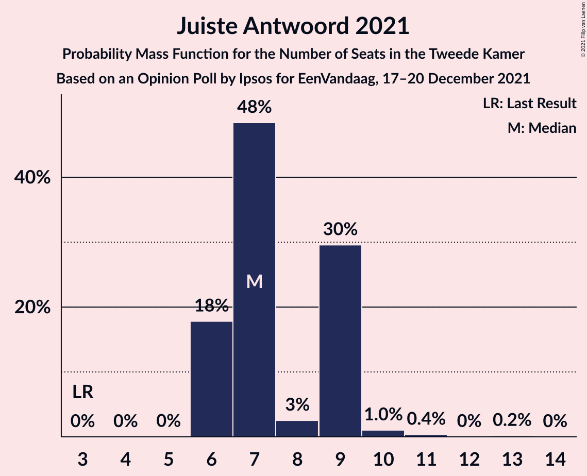

# Opinion Poll by Ipsos for EenVandaag, 17–20 December 2021

<a href="#voting-intentions">Voting Intentions</a> | <a href="#seats">Seats</a> | <a href="#coalitions">Coalitions</a> | <a href="#technical-information">Technical Information</a>

## Voting Intentions

### Confidence Intervals

| Party | Last Result | Poll Result | 80% Confidence Interval | 90% Confidence Interval | 95% Confidence Interval | 99% Confidence Interval |
|:-----:|:-----------:|:-----------:|:-----------------------:|:-----------------------:|:-----------------------:|:-----------------------:|
| Volkspartij voor Vrijheid en Democratie | 21.9% | 19.6% | 18.1–21.3% |17.7–21.8% |17.3–22.2% |16.6–23.0% |
| Democraten 66 | 15.0% | 13.1% | 11.8–14.6% |11.5–15.0% |11.2–15.3% |10.6–16.1% |
| Partij voor de Vrijheid | 10.8% | 11.5% | 10.3–12.9% |10.0–13.3% |9.7–13.7% |9.2–14.3% |
| Partij van de Arbeid | 5.7% | 6.8% | 5.9–7.9% |5.6–8.2% |5.4–8.5% |5.0–9.1% |
| Partij voor de Dieren | 3.8% | 5.7% | 4.9–6.8% |4.6–7.1% |4.5–7.3% |4.1–7.9% |
| Christen-Democratisch Appèl | 9.5% | 5.5% | 4.7–6.6% |4.5–6.9% |4.3–7.1% |3.9–7.6% |
| Juiste Antwoord 2021 | 2.4% | 5.4% | 4.6–6.4% |4.4–6.7% |4.2–7.0% |3.8–7.5% |
| GroenLinks | 5.2% | 5.3% | 4.5–6.3% |4.3–6.6% |4.1–6.9% |3.7–7.4% |
| Socialistische Partij | 6.0% | 5.1% | 4.3–6.1% |4.1–6.4% |3.9–6.7% |3.6–7.2% |
| Forum voor Democratie | 5.0% | 4.0% | 3.4–5.0% |3.2–5.2% |3.0–5.4% |2.7–5.9% |
| BoerBurgerBeweging | 1.0% | 3.8% | 3.2–4.7% |3.0–5.0% |2.8–5.2% |2.5–5.7% |
| ChristenUnie | 3.4% | 3.7% | 3.1–4.6% |2.9–4.9% |2.7–5.1% |2.5–5.6% |
| Volt Europa | 2.4% | 3.2% | 2.5–4.0% |2.4–4.2% |2.2–4.4% |2.0–4.9% |
| DENK | 2.0% | 2.4% | 1.9–3.1% |1.7–3.3% |1.6–3.5% |1.4–3.9% |
| Staatkundig Gereformeerde Partij | 2.1% | 2.3% | 1.8–3.0% |1.6–3.2% |1.5–3.4% |1.3–3.8% |
| Bij1 | 0.8% | 0.9% | 0.6–1.4% |0.5–1.6% |0.5–1.7% |0.4–2.0% |
| 50Plus | 1.0% | 0.5% | 0.3–0.9% |0.2–1.0% |0.2–1.2% |0.1–1.4% |

*Note:* The poll result column reflects the actual value used in the calculations. Published results may vary slightly, and in addition be rounded to fewer digits.

## Seats

### Confidence Intervals

| Party | Last Result | Median | 80% Confidence Interval | 90% Confidence Interval | 95% Confidence Interval | 99% Confidence Interval |
|:-----:|:-----------:|:------:|:-----------------------:|:-----------------------:|:-----------------------:|:-----------------------:|
| <a href="#volkspartij-voor-vrijheid-en-democratie">Volkspartij voor Vrijheid en Democratie</a> | 34 | 30 | 29–34 |29–34 |28–34 |26–34 |
| <a href="#democraten-66">Democraten 66</a> | 24 | 18 | 17–22 |17–22 |17–22 |17–23 |
| <a href="#partij-voor-de-vrijheid">Partij voor de Vrijheid</a> | 17 | 18 | 16–18 |16–19 |15–20 |14–20 |
| <a href="#partij-van-de-arbeid">Partij van de Arbeid</a> | 9 | 11 | 11–12 |9–12 |9–12 |8–15 |
| <a href="#partij-voor-de-dieren">Partij voor de Dieren</a> | 6 | 11 | 8–11 |8–11 |8–11 |6–12 |
| <a href="#christen-democratisch-appèl">Christen-Democratisch Appèl</a> | 15 | 7 | 5–9 |5–9 |5–9 |5–11 |
| <a href="#juiste-antwoord-2021">Juiste Antwoord 2021</a> | 3 | 7 | 6–9 |6–9 |6–9 |6–11 |
| <a href="#groenlinks">GroenLinks</a> | 8 | 9 | 7–9 |6–9 |6–9 |6–10 |
| <a href="#socialistische-partij">Socialistische Partij</a> | 9 | 8 | 6–9 |6–9 |6–9 |5–10 |
| <a href="#forum-voor-democratie">Forum voor Democratie</a> | 8 | 5 | 4–6 |4–6 |4–7 |4–8 |
| <a href="#boerburgerbeweging">BoerBurgerBeweging</a> | 1 | 6 | 5–7 |3–7 |3–7 |3–7 |
| <a href="#christenunie">ChristenUnie</a> | 5 | 5 | 4–6 |4–7 |4–7 |4–8 |
| <a href="#volt-europa">Volt Europa</a> | 3 | 5 | 4–6 |4–6 |4–6 |3–7 |
| <a href="#denk">DENK</a> | 3 | 3 | 3–4 |3–4 |2–4 |2–6 |
| <a href="#staatkundig-gereformeerde-partij">Staatkundig Gereformeerde Partij</a> | 3 | 3 | 3–5 |2–5 |2–5 |2–5 |
| <a href="#bij1">Bij1</a> | 1 | 1 | 1–2 |1–2 |1–2 |0–3 |
| <a href="#50plus">50Plus</a> | 1 | 0 | 0–1 |0–1 |0–1 |0–1 |

### Volkspartij voor Vrijheid en Democratie

*For a full overview of the results for this party, see the [Volkspartij voor Vrijheid en Democratie](party-volkspartijvoorvrijheidendemocratie.html) page.*

| Number of Seats | Probability | Accumulated | Special Marks |
|:---------------:|:-----------:|:-----------:|:-------------:|
| 24 | 0.1% | 100% |  |
| 25 | 0% | 99.9% |  |
| 26 | 0.7% | 99.9% |  |
| 27 | 0.4% | 99.2% |  |
| 28 | 1.4% | 98.8% |  |
| 29 | 19% | 97% |  |
| 30 | 48% | 79% | Median |
| 31 | 5% | 31% |  |
| 32 | 0.4% | 26% |  |
| 33 | 9% | 26% |  |
| 34 | 17% | 17% | Last Result |
| 35 | 0% | 0.1% |  |
| 36 | 0% | 0.1% |  |
| 37 | 0% | 0.1% |  |
| 38 | 0% | 0% |  |

### Democraten 66

*For a full overview of the results for this party, see the [Democraten 66](party-democraten66.html) page.*

| Number of Seats | Probability | Accumulated | Special Marks |
|:---------------:|:-----------:|:-----------:|:-------------:|
| 14 | 0.1% | 100% |  |
| 15 | 0% | 99.9% |  |
| 16 | 0.1% | 99.9% |  |
| 17 | 46% | 99.8% |  |
| 18 | 21% | 54% | Median |
| 19 | 1.3% | 33% |  |
| 20 | 19% | 32% |  |
| 21 | 2% | 12% |  |
| 22 | 10% | 10% |  |
| 23 | 0.4% | 0.6% |  |
| 24 | 0.2% | 0.3% | Last Result |
| 25 | 0.1% | 0.1% |  |
| 26 | 0% | 0% |  |

### Partij voor de Vrijheid

*For a full overview of the results for this party, see the [Partij voor de Vrijheid](party-partijvoordevrijheid.html) page.*

| Number of Seats | Probability | Accumulated | Special Marks |
|:---------------:|:-----------:|:-----------:|:-------------:|
| 13 | 0.3% | 100% |  |
| 14 | 2% | 99.7% |  |
| 15 | 0.8% | 98% |  |
| 16 | 9% | 97% |  |
| 17 | 18% | 89% | Last Result |
| 18 | 65% | 70% | Median |
| 19 | 0.9% | 5% |  |
| 20 | 4% | 4% |  |
| 21 | 0.2% | 0.3% |  |
| 22 | 0% | 0.1% |  |
| 23 | 0% | 0% |  |

### Partij van de Arbeid

*For a full overview of the results for this party, see the [Partij van de Arbeid](party-partijvandearbeid.html) page.*

| Number of Seats | Probability | Accumulated | Special Marks |
|:---------------:|:-----------:|:-----------:|:-------------:|
| 7 | 0.3% | 100% |  |
| 8 | 1.0% | 99.7% |  |
| 9 | 4% | 98.6% | Last Result |
| 10 | 2% | 94% |  |
| 11 | 64% | 93% | Median |
| 12 | 27% | 28% |  |
| 13 | 0.3% | 1.4% |  |
| 14 | 0% | 1.1% |  |
| 15 | 1.0% | 1.0% |  |
| 16 | 0% | 0% |  |

### Partij voor de Dieren

*For a full overview of the results for this party, see the [Partij voor de Dieren](party-partijvoordedieren.html) page.*

| Number of Seats | Probability | Accumulated | Special Marks |
|:---------------:|:-----------:|:-----------:|:-------------:|
| 5 | 0.1% | 100% |  |
| 6 | 0.5% | 99.9% | Last Result |
| 7 | 1.4% | 99.4% |  |
| 8 | 26% | 98% |  |
| 9 | 18% | 72% |  |
| 10 | 2% | 54% |  |
| 11 | 50% | 52% | Median |
| 12 | 2% | 2% |  |
| 13 | 0% | 0% |  |

### Christen-Democratisch Appèl

*For a full overview of the results for this party, see the [Christen-Democratisch Appèl](party-christen-democratischappèl.html) page.*

| Number of Seats | Probability | Accumulated | Special Marks |
|:---------------:|:-----------:|:-----------:|:-------------:|
| 5 | 17% | 100% |  |
| 6 | 0.6% | 83% |  |
| 7 | 47% | 82% | Median |
| 8 | 5% | 35% |  |
| 9 | 28% | 30% |  |
| 10 | 1.0% | 2% |  |
| 11 | 1.1% | 1.3% |  |
| 12 | 0.1% | 0.1% |  |
| 13 | 0% | 0% |  |
| 14 | 0% | 0% |  |
| 15 | 0% | 0% | Last Result |

### Juiste Antwoord 2021

*For a full overview of the results for this party, see the [Juiste Antwoord 2021](party-juisteantwoord2021.html) page.*

| Number of Seats | Probability | Accumulated | Special Marks |
|:---------------:|:-----------:|:-----------:|:-------------:|
| 3 | 0% | 100% | Last Result |
| 4 | 0% | 100% |  |
| 5 | 0% | 100% |  |
| 6 | 18% | 100% |  |
| 7 | 48% | 82% | Median |
| 8 | 3% | 34% |  |
| 9 | 30% | 31% |  |
| 10 | 1.0% | 2% |  |
| 11 | 0.4% | 0.6% |  |
| 12 | 0% | 0.2% |  |
| 13 | 0.2% | 0.2% |  |
| 14 | 0% | 0% |  |

### GroenLinks

*For a full overview of the results for this party, see the [GroenLinks](party-groenlinks.html) page.*

| Number of Seats | Probability | Accumulated | Special Marks |
|:---------------:|:-----------:|:-----------:|:-------------:|
| 5 | 0.2% | 100% |  |
| 6 | 9% | 99.8% |  |
| 7 | 19% | 91% |  |
| 8 | 5% | 72% | Last Result |
| 9 | 66% | 67% | Median |
| 10 | 0.4% | 0.7% |  |
| 11 | 0.2% | 0.3% |  |
| 12 | 0% | 0% |  |

### Socialistische Partij

*For a full overview of the results for this party, see the [Socialistische Partij](party-socialistischepartij.html) page.*

| Number of Seats | Probability | Accumulated | Special Marks |
|:---------------:|:-----------:|:-----------:|:-------------:|
| 5 | 0.9% | 100% |  |
| 6 | 10% | 99.1% |  |
| 7 | 18% | 89% |  |
| 8 | 52% | 71% | Median |
| 9 | 18% | 19% | Last Result |
| 10 | 0.4% | 0.6% |  |
| 11 | 0.1% | 0.1% |  |
| 12 | 0.1% | 0.1% |  |
| 13 | 0% | 0% |  |

### Forum voor Democratie

*For a full overview of the results for this party, see the [Forum voor Democratie](party-forumvoordemocratie.html) page.*

| Number of Seats | Probability | Accumulated | Special Marks |
|:---------------:|:-----------:|:-----------:|:-------------:|
| 3 | 0.1% | 100% |  |
| 4 | 18% | 99.9% |  |
| 5 | 32% | 82% | Median |
| 6 | 47% | 50% |  |
| 7 | 1.1% | 3% |  |
| 8 | 1.2% | 1.5% | Last Result |
| 9 | 0.3% | 0.3% |  |
| 10 | 0% | 0% |  |

### BoerBurgerBeweging

*For a full overview of the results for this party, see the [BoerBurgerBeweging](party-boerburgerbeweging.html) page.*

| Number of Seats | Probability | Accumulated | Special Marks |
|:---------------:|:-----------:|:-----------:|:-------------:|
| 1 | 0% | 100% | Last Result |
| 2 | 0% | 100% |  |
| 3 | 9% | 100% |  |
| 4 | 1.4% | 91% |  |
| 5 | 22% | 90% |  |
| 6 | 21% | 68% | Median |
| 7 | 47% | 47% |  |
| 8 | 0.3% | 0.4% |  |
| 9 | 0% | 0% |  |

### ChristenUnie

*For a full overview of the results for this party, see the [ChristenUnie](party-christenunie.html) page.*

| Number of Seats | Probability | Accumulated | Special Marks |
|:---------------:|:-----------:|:-----------:|:-------------:|
| 3 | 0.3% | 100% |  |
| 4 | 48% | 99.7% |  |
| 5 | 26% | 52% | Last Result, Median |
| 6 | 19% | 25% |  |
| 7 | 6% | 6% |  |
| 8 | 0.2% | 0.5% |  |
| 9 | 0.3% | 0.3% |  |
| 10 | 0% | 0% |  |

### Volt Europa

*For a full overview of the results for this party, see the [Volt Europa](party-volteuropa.html) page.*

| Number of Seats | Probability | Accumulated | Special Marks |
|:---------------:|:-----------:|:-----------:|:-------------:|
| 2 | 0.1% | 100% |  |
| 3 | 2% | 99.9% | Last Result |
| 4 | 14% | 98% |  |
| 5 | 47% | 84% | Median |
| 6 | 36% | 36% |  |
| 7 | 0.8% | 0.8% |  |
| 8 | 0% | 0% |  |

### DENK

*For a full overview of the results for this party, see the [DENK](party-denk.html) page.*

| Number of Seats | Probability | Accumulated | Special Marks |
|:---------------:|:-----------:|:-----------:|:-------------:|
| 2 | 4% | 100% |  |
| 3 | 84% | 96% | Last Result, Median |
| 4 | 10% | 11% |  |
| 5 | 0.4% | 1.2% |  |
| 6 | 0.8% | 0.8% |  |
| 7 | 0% | 0% |  |

### Staatkundig Gereformeerde Partij

*For a full overview of the results for this party, see the [Staatkundig Gereformeerde Partij](party-staatkundiggereformeerdepartij.html) page.*

| Number of Seats | Probability | Accumulated | Special Marks |
|:---------------:|:-----------:|:-----------:|:-------------:|
| 1 | 0.1% | 100% |  |
| 2 | 6% | 99.9% |  |
| 3 | 67% | 94% | Last Result, Median |
| 4 | 9% | 27% |  |
| 5 | 18% | 18% |  |
| 6 | 0.1% | 0.1% |  |
| 7 | 0% | 0% |  |

### Bij1

*For a full overview of the results for this party, see the [Bij1](party-bij1.html) page.*

| Number of Seats | Probability | Accumulated | Special Marks |
|:---------------:|:-----------:|:-----------:|:-------------:|
| 0 | 1.2% | 100% |  |
| 1 | 50% | 98.8% | Last Result, Median |
| 2 | 48% | 49% |  |
| 3 | 0.8% | 0.9% |  |
| 4 | 0% | 0% |  |

### 50Plus

*For a full overview of the results for this party, see the [50Plus](party-50plus.html) page.*

| Number of Seats | Probability | Accumulated | Special Marks |
|:---------------:|:-----------:|:-----------:|:-------------:|
| 0 | 52% | 100% | Median |
| 1 | 48% | 48% | Last Result |
| 2 | 0.2% | 0.2% |  |
| 3 | 0% | 0% |  |

## Coalitions

### Confidence Intervals

| Coalition | Last Result | Median | Majority? | 80% Confidence Interval | 90% Confidence Interval | 95% Confidence Interval | 99% Confidence Interval |
|:---------:|:-----------:|:------:|:---------:|:-----------------------:|:-----------------------:|:-----------------------:|:-----------------------:|
| Volkspartij voor Vrijheid en Democratie – Democraten 66 – Partij van de Arbeid – Christen-Democratisch Appèl – ChristenUnie | 87 | 73 | 13% | 69–78 | 69–81 | 69–81 | 69–81 |
| Volkspartij voor Vrijheid en Democratie – Democraten 66 – Christen-Democratisch Appèl – GroenLinks – ChristenUnie | 86 | 70 | 1.2% | 67–75 | 67–75 | 67–75 | 67–76 |
| Volkspartij voor Vrijheid en Democratie – Democraten 66 – Christen-Democratisch Appèl – ChristenUnie | 78 | 63 | 0% | 58–66 | 58–69 | 58–69 | 58–69 |
| Volkspartij voor Vrijheid en Democratie – Partij voor de Vrijheid – Christen-Democratisch Appèl – Forum voor Democratie – Staatkundig Gereformeerde Partij | 77 | 64 | 0% | 64–66 | 64–67 | 61–67 | 59–69 |
| Volkspartij voor Vrijheid en Democratie – Democraten 66 – Partij van de Arbeid | 67 | 58 | 0% | 58–63 | 58–67 | 58–67 | 55–67 |
| Democraten 66 – Partij van de Arbeid – Christen-Democratisch Appèl – GroenLinks – Socialistische Partij – ChristenUnie | 70 | 56 | 0% | 56–62 | 56–62 | 56–65 | 55–66 |
| Volkspartij voor Vrijheid en Democratie – Partij voor de Vrijheid – Christen-Democratisch Appèl – Forum voor Democratie | 74 | 61 | 0% | 59–63 | 59–64 | 59–64 | 56–67 |
| Volkspartij voor Vrijheid en Democratie – Democraten 66 – Christen-Democratisch Appèl | 73 | 57 | 0% | 54–61 | 54–64 | 54–64 | 54–64 |
| Volkspartij voor Vrijheid en Democratie – Partij voor de Vrijheid – Christen-Democratisch Appèl | 66 | 55 | 0% | 55–58 | 55–58 | 53–59 | 51–60 |
| Democraten 66 – Partij van de Arbeid – Christen-Democratisch Appèl – GroenLinks – ChristenUnie | 61 | 49 | 0% | 48–54 | 48–55 | 48–56 | 48–58 |
| Volkspartij voor Vrijheid en Democratie – Partij van de Arbeid – Christen-Democratisch Appèl | 58 | 48 | 0% | 48–51 | 48–54 | 47–54 | 43–54 |
| Volkspartij voor Vrijheid en Democratie – Christen-Democratisch Appèl – Forum voor Democratie – Staatkundig Gereformeerde Partij – 50Plus | 61 | 47 | 0% | 46–49 | 46–52 | 46–52 | 44–53 |
| Volkspartij voor Vrijheid en Democratie – Christen-Democratisch Appèl – Forum voor Democratie – Staatkundig Gereformeerde Partij | 60 | 46 | 0% | 46–49 | 46–51 | 45–51 | 43–52 |
| Volkspartij voor Vrijheid en Democratie – Christen-Democratisch Appèl – Forum voor Democratie – 50Plus | 58 | 43 | 0% | 43–47 | 43–48 | 43–48 | 40–49 |
| Volkspartij voor Vrijheid en Democratie – Christen-Democratisch Appèl – Forum voor Democratie | 57 | 43 | 0% | 42–47 | 42–47 | 42–47 | 39–49 |
| Volkspartij voor Vrijheid en Democratie – Partij van de Arbeid | 43 | 41 | 0% | 41–45 | 40–45 | 40–45 | 35–45 |
| Democraten 66 – Partij van de Arbeid – Christen-Democratisch Appèl | 48 | 35 | 0% | 34–41 | 34–43 | 34–43 | 34–45 |
| Volkspartij voor Vrijheid en Democratie – Christen-Democratisch Appèl | 49 | 38 | 0% | 37–39 | 37–42 | 37–42 | 34–42 |
| Democraten 66 – Christen-Democratisch Appèl | 39 | 24 | 0% | 23–30 | 23–31 | 23–31 | 23–32 |
| Partij van de Arbeid – Christen-Democratisch Appèl – ChristenUnie | 29 | 22 | 0% | 22–26 | 22–26 | 22–28 | 21–28 |
| Partij van de Arbeid – Christen-Democratisch Appèl | 24 | 18 | 0% | 16–21 | 16–21 | 16–21 | 15–24 |

### Volkspartij voor Vrijheid en Democratie – Democraten 66 – Partij van de Arbeid – Christen-Democratisch Appèl – ChristenUnie

| Number of Seats | Probability | Accumulated | Special Marks |
|:---------------:|:-----------:|:-----------:|:-------------:|
| 68 | 0.1% | 100% |  |
| 69 | 46% | 99.8% |  |
| 70 | 0.4% | 54% |  |
| 71 | 0.4% | 53% | Median |
| 72 | 0.3% | 53% |  |
| 73 | 5% | 52% |  |
| 74 | 17% | 48% |  |
| 75 | 17% | 30% |  |
| 76 | 0.5% | 13% | Majority |
| 77 | 2% | 13% |  |
| 78 | 2% | 11% |  |
| 79 | 0.1% | 9% |  |
| 80 | 0.3% | 9% |  |
| 81 | 8% | 8% |  |
| 82 | 0% | 0% |  |
| 83 | 0% | 0% |  |
| 84 | 0% | 0% |  |
| 85 | 0% | 0% |  |
| 86 | 0% | 0% |  |
| 87 | 0% | 0% | Last Result |

### Volkspartij voor Vrijheid en Democratie – Democraten 66 – Christen-Democratisch Appèl – GroenLinks – ChristenUnie

| Number of Seats | Probability | Accumulated | Special Marks |
|:---------------:|:-----------:|:-----------:|:-------------:|
| 65 | 0.1% | 100% |  |
| 66 | 0% | 99.9% |  |
| 67 | 46% | 99.9% |  |
| 68 | 0.3% | 54% |  |
| 69 | 0.9% | 53% | Median |
| 70 | 18% | 52% |  |
| 71 | 0.3% | 34% |  |
| 72 | 21% | 34% |  |
| 73 | 0.5% | 13% |  |
| 74 | 1.2% | 12% |  |
| 75 | 10% | 11% |  |
| 76 | 0.9% | 1.2% | Majority |
| 77 | 0.2% | 0.3% |  |
| 78 | 0.1% | 0.1% |  |
| 79 | 0% | 0% |  |
| 80 | 0% | 0% |  |
| 81 | 0% | 0% |  |
| 82 | 0% | 0% |  |
| 83 | 0% | 0% |  |
| 84 | 0% | 0% |  |
| 85 | 0% | 0% |  |
| 86 | 0% | 0% | Last Result |

### Volkspartij voor Vrijheid en Democratie – Democraten 66 – Christen-Democratisch Appèl – ChristenUnie

| Number of Seats | Probability | Accumulated | Special Marks |
|:---------------:|:-----------:|:-----------:|:-------------:|
| 57 | 0% | 100% |  |
| 58 | 46% | 99.9% |  |
| 59 | 0.2% | 54% |  |
| 60 | 0.3% | 54% | Median |
| 61 | 0.8% | 53% |  |
| 62 | 0.5% | 53% |  |
| 63 | 36% | 52% |  |
| 64 | 4% | 16% |  |
| 65 | 0.7% | 13% |  |
| 66 | 2% | 12% |  |
| 67 | 0.7% | 10% |  |
| 68 | 0.1% | 9% |  |
| 69 | 8% | 9% |  |
| 70 | 0.2% | 0.4% |  |
| 71 | 0.2% | 0.2% |  |
| 72 | 0% | 0% |  |
| 73 | 0% | 0% |  |
| 74 | 0% | 0% |  |
| 75 | 0% | 0% |  |
| 76 | 0% | 0% | Majority |
| 77 | 0% | 0% |  |
| 78 | 0% | 0% | Last Result |

### Volkspartij voor Vrijheid en Democratie – Partij voor de Vrijheid – Christen-Democratisch Appèl – Forum voor Democratie – Staatkundig Gereformeerde Partij

| Number of Seats | Probability | Accumulated | Special Marks |
|:---------------:|:-----------:|:-----------:|:-------------:|
| 56 | 0% | 100% |  |
| 57 | 0% | 99.9% |  |
| 58 | 0.1% | 99.9% |  |
| 59 | 0.8% | 99.8% |  |
| 60 | 0% | 99.1% |  |
| 61 | 2% | 99.0% |  |
| 62 | 0.7% | 97% |  |
| 63 | 1.0% | 97% | Median |
| 64 | 64% | 96% |  |
| 65 | 18% | 32% |  |
| 66 | 5% | 15% |  |
| 67 | 9% | 10% |  |
| 68 | 0.5% | 1.1% |  |
| 69 | 0.2% | 0.7% |  |
| 70 | 0.1% | 0.5% |  |
| 71 | 0.3% | 0.4% |  |
| 72 | 0% | 0.1% |  |
| 73 | 0% | 0% |  |
| 74 | 0% | 0% |  |
| 75 | 0% | 0% |  |
| 76 | 0% | 0% | Majority |
| 77 | 0% | 0% | Last Result |

### Volkspartij voor Vrijheid en Democratie – Democraten 66 – Partij van de Arbeid

| Number of Seats | Probability | Accumulated | Special Marks |
|:---------------:|:-----------:|:-----------:|:-------------:|
| 52 | 0.1% | 100% |  |
| 53 | 0.2% | 99.9% |  |
| 54 | 0.2% | 99.7% |  |
| 55 | 0.1% | 99.5% |  |
| 56 | 0.3% | 99.5% |  |
| 57 | 0.2% | 99.1% |  |
| 58 | 50% | 99.0% |  |
| 59 | 0.3% | 49% | Median |
| 60 | 2% | 49% |  |
| 61 | 18% | 47% |  |
| 62 | 2% | 29% |  |
| 63 | 18% | 27% |  |
| 64 | 0.1% | 9% |  |
| 65 | 0.6% | 9% |  |
| 66 | 0% | 8% |  |
| 67 | 8% | 8% | Last Result |
| 68 | 0% | 0.1% |  |
| 69 | 0% | 0% |  |

### Democraten 66 – Partij van de Arbeid – Christen-Democratisch Appèl – GroenLinks – Socialistische Partij – ChristenUnie

| Number of Seats | Probability | Accumulated | Special Marks |
|:---------------:|:-----------:|:-----------:|:-------------:|
| 53 | 0.1% | 100% |  |
| 54 | 0.4% | 99.9% |  |
| 55 | 0.2% | 99.5% |  |
| 56 | 64% | 99.3% |  |
| 57 | 0.3% | 36% |  |
| 58 | 4% | 35% | Median |
| 59 | 0.3% | 31% |  |
| 60 | 8% | 31% |  |
| 61 | 2% | 23% |  |
| 62 | 18% | 21% |  |
| 63 | 0.3% | 3% |  |
| 64 | 0.1% | 3% |  |
| 65 | 2% | 3% |  |
| 66 | 0.6% | 0.6% |  |
| 67 | 0% | 0.1% |  |
| 68 | 0% | 0% |  |
| 69 | 0% | 0% |  |
| 70 | 0% | 0% | Last Result |

### Volkspartij voor Vrijheid en Democratie – Partij voor de Vrijheid – Christen-Democratisch Appèl – Forum voor Democratie

| Number of Seats | Probability | Accumulated | Special Marks |
|:---------------:|:-----------:|:-----------:|:-------------:|
| 53 | 0% | 100% |  |
| 54 | 0% | 99.9% |  |
| 55 | 0.1% | 99.9% |  |
| 56 | 0.6% | 99.8% |  |
| 57 | 0.3% | 99.3% |  |
| 58 | 1.4% | 98.9% |  |
| 59 | 18% | 98% |  |
| 60 | 0.9% | 80% | Median |
| 61 | 47% | 79% |  |
| 62 | 18% | 32% |  |
| 63 | 9% | 15% |  |
| 64 | 4% | 5% |  |
| 65 | 0.1% | 0.8% |  |
| 66 | 0.1% | 0.7% |  |
| 67 | 0.3% | 0.6% |  |
| 68 | 0.2% | 0.3% |  |
| 69 | 0% | 0% |  |
| 70 | 0% | 0% |  |
| 71 | 0% | 0% |  |
| 72 | 0% | 0% |  |
| 73 | 0% | 0% |  |
| 74 | 0% | 0% | Last Result |

### Volkspartij voor Vrijheid en Democratie – Democraten 66 – Christen-Democratisch Appèl

| Number of Seats | Probability | Accumulated | Special Marks |
|:---------------:|:-----------:|:-----------:|:-------------:|
| 51 | 0% | 100% |  |
| 52 | 0% | 99.9% |  |
| 53 | 0.1% | 99.9% |  |
| 54 | 46% | 99.7% |  |
| 55 | 0.6% | 54% | Median |
| 56 | 0.8% | 53% |  |
| 57 | 21% | 52% |  |
| 58 | 18% | 31% |  |
| 59 | 3% | 13% |  |
| 60 | 0.4% | 10% |  |
| 61 | 1.0% | 10% |  |
| 62 | 0.2% | 9% |  |
| 63 | 0.3% | 9% |  |
| 64 | 8% | 8% |  |
| 65 | 0% | 0.2% |  |
| 66 | 0.2% | 0.2% |  |
| 67 | 0% | 0% |  |
| 68 | 0% | 0% |  |
| 69 | 0% | 0% |  |
| 70 | 0% | 0% |  |
| 71 | 0% | 0% |  |
| 72 | 0% | 0% |  |
| 73 | 0% | 0% | Last Result |

### Volkspartij voor Vrijheid en Democratie – Partij voor de Vrijheid – Christen-Democratisch Appèl

| Number of Seats | Probability | Accumulated | Special Marks |
|:---------------:|:-----------:|:-----------:|:-------------:|
| 48 | 0% | 100% |  |
| 49 | 0.1% | 99.9% |  |
| 50 | 0% | 99.8% |  |
| 51 | 0.6% | 99.8% |  |
| 52 | 0.6% | 99.2% |  |
| 53 | 2% | 98.6% |  |
| 54 | 0.3% | 97% |  |
| 55 | 64% | 97% | Median |
| 56 | 1.4% | 32% |  |
| 57 | 18% | 31% |  |
| 58 | 9% | 13% |  |
| 59 | 3% | 4% |  |
| 60 | 0.2% | 0.5% |  |
| 61 | 0.1% | 0.3% |  |
| 62 | 0.2% | 0.2% |  |
| 63 | 0% | 0% |  |
| 64 | 0% | 0% |  |
| 65 | 0% | 0% |  |
| 66 | 0% | 0% | Last Result |

### Democraten 66 – Partij van de Arbeid – Christen-Democratisch Appèl – GroenLinks – ChristenUnie

| Number of Seats | Probability | Accumulated | Special Marks |
|:---------------:|:-----------:|:-----------:|:-------------:|
| 45 | 0.2% | 100% |  |
| 46 | 0% | 99.8% |  |
| 47 | 0.2% | 99.8% |  |
| 48 | 46% | 99.6% |  |
| 49 | 17% | 53% |  |
| 50 | 4% | 36% | Median |
| 51 | 0.4% | 32% |  |
| 52 | 1.1% | 32% |  |
| 53 | 17% | 30% |  |
| 54 | 8% | 13% |  |
| 55 | 2% | 5% |  |
| 56 | 1.4% | 3% |  |
| 57 | 1.4% | 2% |  |
| 58 | 0.6% | 0.7% |  |
| 59 | 0.1% | 0.1% |  |
| 60 | 0% | 0% |  |
| 61 | 0% | 0% | Last Result |

### Volkspartij voor Vrijheid en Democratie – Partij van de Arbeid – Christen-Democratisch Appèl

| Number of Seats | Probability | Accumulated | Special Marks |
|:---------------:|:-----------:|:-----------:|:-------------:|
| 42 | 0.2% | 100% |  |
| 43 | 0.3% | 99.8% |  |
| 44 | 0.1% | 99.5% |  |
| 45 | 0.6% | 99.4% |  |
| 46 | 0.5% | 98.8% |  |
| 47 | 0.8% | 98% |  |
| 48 | 50% | 97% | Median |
| 49 | 1.2% | 48% |  |
| 50 | 35% | 47% |  |
| 51 | 2% | 11% |  |
| 52 | 0.2% | 9% |  |
| 53 | 0% | 9% |  |
| 54 | 9% | 9% |  |
| 55 | 0% | 0.1% |  |
| 56 | 0.1% | 0.1% |  |
| 57 | 0% | 0% |  |
| 58 | 0% | 0% | Last Result |

### Volkspartij voor Vrijheid en Democratie – Christen-Democratisch Appèl – Forum voor Democratie – Staatkundig Gereformeerde Partij – 50Plus

| Number of Seats | Probability | Accumulated | Special Marks |
|:---------------:|:-----------:|:-----------:|:-------------:|
| 41 | 0.1% | 100% |  |
| 42 | 0.3% | 99.9% |  |
| 43 | 0% | 99.6% |  |
| 44 | 0.7% | 99.5% |  |
| 45 | 1.3% | 98.8% | Median |
| 46 | 46% | 98% |  |
| 47 | 6% | 51% |  |
| 48 | 35% | 46% |  |
| 49 | 1.4% | 11% |  |
| 50 | 0.4% | 10% |  |
| 51 | 0.3% | 9% |  |
| 52 | 8% | 9% |  |
| 53 | 0.5% | 0.6% |  |
| 54 | 0% | 0.1% |  |
| 55 | 0% | 0.1% |  |
| 56 | 0% | 0% |  |
| 57 | 0% | 0% |  |
| 58 | 0% | 0% |  |
| 59 | 0% | 0% |  |
| 60 | 0% | 0% |  |
| 61 | 0% | 0% | Last Result |

### Volkspartij voor Vrijheid en Democratie – Christen-Democratisch Appèl – Forum voor Democratie – Staatkundig Gereformeerde Partij

| Number of Seats | Probability | Accumulated | Special Marks |
|:---------------:|:-----------:|:-----------:|:-------------:|
| 41 | 0.4% | 100% |  |
| 42 | 0% | 99.6% |  |
| 43 | 0.1% | 99.6% |  |
| 44 | 1.2% | 99.5% |  |
| 45 | 0.9% | 98% | Median |
| 46 | 50% | 97% |  |
| 47 | 36% | 47% |  |
| 48 | 0.2% | 11% |  |
| 49 | 1.4% | 11% |  |
| 50 | 0.5% | 9% |  |
| 51 | 8% | 9% |  |
| 52 | 0.1% | 0.6% |  |
| 53 | 0.4% | 0.5% |  |
| 54 | 0% | 0.1% |  |
| 55 | 0% | 0% |  |
| 56 | 0% | 0% |  |
| 57 | 0% | 0% |  |
| 58 | 0% | 0% |  |
| 59 | 0% | 0% |  |
| 60 | 0% | 0% | Last Result |

### Volkspartij voor Vrijheid en Democratie – Christen-Democratisch Appèl – Forum voor Democratie – 50Plus

| Number of Seats | Probability | Accumulated | Special Marks |
|:---------------:|:-----------:|:-----------:|:-------------:|
| 39 | 0.2% | 100% |  |
| 40 | 0.4% | 99.8% |  |
| 41 | 0.2% | 99.4% |  |
| 42 | 1.3% | 99.3% | Median |
| 43 | 64% | 98% |  |
| 44 | 2% | 34% |  |
| 45 | 21% | 32% |  |
| 46 | 0.4% | 11% |  |
| 47 | 1.1% | 10% |  |
| 48 | 9% | 9% |  |
| 49 | 0.1% | 0.6% |  |
| 50 | 0.3% | 0.5% |  |
| 51 | 0.2% | 0.2% |  |
| 52 | 0% | 0% |  |
| 53 | 0% | 0% |  |
| 54 | 0% | 0% |  |
| 55 | 0% | 0% |  |
| 56 | 0% | 0% |  |
| 57 | 0% | 0% |  |
| 58 | 0% | 0% | Last Result |

### Volkspartij voor Vrijheid en Democratie – Christen-Democratisch Appèl – Forum voor Democratie

| Number of Seats | Probability | Accumulated | Special Marks |
|:---------------:|:-----------:|:-----------:|:-------------:|
| 38 | 0.1% | 100% |  |
| 39 | 0.4% | 99.9% |  |
| 40 | 0.1% | 99.5% |  |
| 41 | 0.7% | 99.4% |  |
| 42 | 18% | 98.7% | Median |
| 43 | 47% | 81% |  |
| 44 | 23% | 34% |  |
| 45 | 0.3% | 11% |  |
| 46 | 0.3% | 10% |  |
| 47 | 9% | 10% |  |
| 48 | 0.1% | 0.7% |  |
| 49 | 0.1% | 0.5% |  |
| 50 | 0.2% | 0.4% |  |
| 51 | 0.2% | 0.2% |  |
| 52 | 0% | 0% |  |
| 53 | 0% | 0% |  |
| 54 | 0% | 0% |  |
| 55 | 0% | 0% |  |
| 56 | 0% | 0% |  |
| 57 | 0% | 0% | Last Result |

### Volkspartij voor Vrijheid en Democratie – Partij van de Arbeid

| Number of Seats | Probability | Accumulated | Special Marks |
|:---------------:|:-----------:|:-----------:|:-------------:|
| 34 | 0.2% | 100% |  |
| 35 | 0.5% | 99.8% |  |
| 36 | 0.1% | 99.3% |  |
| 37 | 0.2% | 99.1% |  |
| 38 | 0.9% | 98.9% |  |
| 39 | 0.4% | 98% |  |
| 40 | 5% | 98% |  |
| 41 | 65% | 93% | Median |
| 42 | 2% | 28% |  |
| 43 | 0.4% | 26% | Last Result |
| 44 | 0.6% | 26% |  |
| 45 | 25% | 25% |  |
| 46 | 0% | 0.1% |  |
| 47 | 0% | 0.1% |  |
| 48 | 0% | 0% |  |

### Democraten 66 – Partij van de Arbeid – Christen-Democratisch Appèl

| Number of Seats | Probability | Accumulated | Special Marks |
|:---------------:|:-----------:|:-----------:|:-------------:|
| 33 | 0.2% | 100% |  |
| 34 | 17% | 99.8% |  |
| 35 | 50% | 82% |  |
| 36 | 0.2% | 33% | Median |
| 37 | 0.5% | 32% |  |
| 38 | 0.9% | 32% |  |
| 39 | 0.2% | 31% |  |
| 40 | 0.9% | 31% |  |
| 41 | 20% | 30% |  |
| 42 | 0.1% | 10% |  |
| 43 | 9% | 10% |  |
| 44 | 0.3% | 0.9% |  |
| 45 | 0.6% | 0.6% |  |
| 46 | 0.1% | 0.1% |  |
| 47 | 0% | 0% |  |
| 48 | 0% | 0% | Last Result |

### Volkspartij voor Vrijheid en Democratie – Christen-Democratisch Appèl

| Number of Seats | Probability | Accumulated | Special Marks |
|:---------------:|:-----------:|:-----------:|:-------------:|
| 32 | 0.1% | 100% |  |
| 33 | 0.2% | 99.9% |  |
| 34 | 0.3% | 99.7% |  |
| 35 | 0.6% | 99.4% |  |
| 36 | 0.8% | 98.9% |  |
| 37 | 47% | 98% | Median |
| 38 | 17% | 51% |  |
| 39 | 24% | 34% |  |
| 40 | 0.4% | 10% |  |
| 41 | 0.3% | 9% |  |
| 42 | 9% | 9% |  |
| 43 | 0.2% | 0.3% |  |
| 44 | 0% | 0.1% |  |
| 45 | 0.1% | 0.1% |  |
| 46 | 0% | 0% |  |
| 47 | 0% | 0% |  |
| 48 | 0% | 0% |  |
| 49 | 0% | 0% | Last Result |

### Democraten 66 – Christen-Democratisch Appèl

| Number of Seats | Probability | Accumulated | Special Marks |
|:---------------:|:-----------:|:-----------:|:-------------:|
| 23 | 17% | 100% |  |
| 24 | 46% | 83% |  |
| 25 | 0% | 37% | Median |
| 26 | 4% | 37% |  |
| 27 | 0.8% | 33% |  |
| 28 | 0.8% | 32% |  |
| 29 | 19% | 31% |  |
| 30 | 3% | 12% |  |
| 31 | 9% | 10% |  |
| 32 | 0.4% | 0.7% |  |
| 33 | 0.1% | 0.3% |  |
| 34 | 0.1% | 0.2% |  |
| 35 | 0% | 0.1% |  |
| 36 | 0.1% | 0.1% |  |
| 37 | 0% | 0% |  |
| 38 | 0% | 0% |  |
| 39 | 0% | 0% | Last Result |

### Partij van de Arbeid – Christen-Democratisch Appèl – ChristenUnie

| Number of Seats | Probability | Accumulated | Special Marks |
|:---------------:|:-----------:|:-----------:|:-------------:|
| 17 | 0.2% | 100% |  |
| 18 | 0% | 99.8% |  |
| 19 | 0% | 99.8% |  |
| 20 | 0.2% | 99.8% |  |
| 21 | 0.9% | 99.5% |  |
| 22 | 63% | 98.6% |  |
| 23 | 1.2% | 35% | Median |
| 24 | 5% | 34% |  |
| 25 | 0.1% | 30% |  |
| 26 | 25% | 29% |  |
| 27 | 0.3% | 4% |  |
| 28 | 3% | 4% |  |
| 29 | 0.1% | 0.5% | Last Result |
| 30 | 0.4% | 0.4% |  |
| 31 | 0% | 0% |  |

### Partij van de Arbeid – Christen-Democratisch Appèl

| Number of Seats | Probability | Accumulated | Special Marks |
|:---------------:|:-----------:|:-----------:|:-------------:|
| 13 | 0.2% | 100% |  |
| 14 | 0.1% | 99.8% |  |
| 15 | 0.3% | 99.8% |  |
| 16 | 18% | 99.5% |  |
| 17 | 4% | 82% |  |
| 18 | 47% | 78% | Median |
| 19 | 1.2% | 31% |  |
| 20 | 0.5% | 29% |  |
| 21 | 27% | 29% |  |
| 22 | 0.6% | 1.4% |  |
| 23 | 0.2% | 0.8% |  |
| 24 | 0.2% | 0.6% | Last Result |
| 25 | 0% | 0.4% |  |
| 26 | 0.3% | 0.3% |  |
| 27 | 0% | 0% |  |

## Technical Information

### Opinion Poll

+ **Polling firm:** Ipsos
+ **Commissioner(s):** EenVandaag
+ **Fieldwork period:** 17–20 December 2021

### Calculations

+ **Sample size:** 1014
+ **Simulations done:** 1,048,576
+ **Error estimate:** 2.62%

