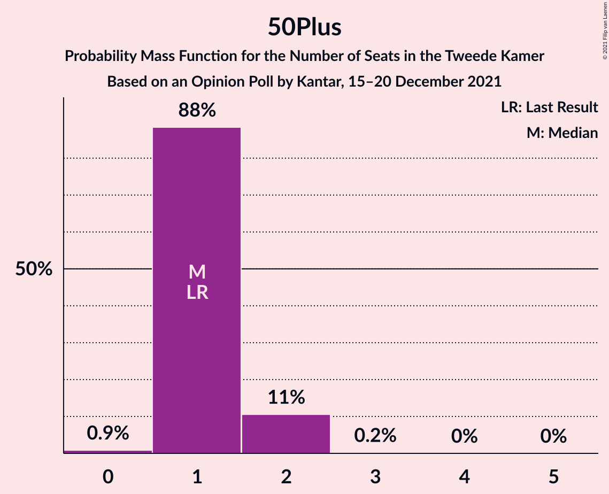

# Opinion Poll by Kantar, 15–20 December 2021

<a href="#voting-intentions">Voting Intentions</a> | <a href="#seats">Seats</a> | <a href="#coalitions">Coalitions</a> | <a href="#technical-information">Technical Information</a>

## Voting Intentions

### Confidence Intervals

| Party | Last Result | Poll Result | 80% Confidence Interval | 90% Confidence Interval | 95% Confidence Interval | 99% Confidence Interval |
|:-----:|:-----------:|:-----------:|:-----------------------:|:-----------------------:|:-----------------------:|:-----------------------:|
| Volkspartij voor Vrijheid en Democratie | 21.9% | 20.5% | 18.9–22.2% |18.5–22.7% |18.1–23.1% |17.4–24.0% |
| Partij voor de Vrijheid | 10.8% | 11.8% | 10.5–13.2% |10.2–13.5% |9.9–13.9% |9.3–14.6% |
| Democraten 66 | 15.0% | 9.8% | 8.6–11.1% |8.3–11.4% |8.1–11.8% |7.6–12.4% |
| Socialistische Partij | 6.0% | 7.9% | 6.9–9.1% |6.6–9.4% |6.4–9.7% |5.9–10.3% |
| Christen-Democratisch Appèl | 9.5% | 6.9% | 5.9–8.0% |5.7–8.3% |5.5–8.6% |5.0–9.2% |
| Partij van de Arbeid | 5.7% | 6.9% | 5.9–8.0% |5.7–8.3% |5.5–8.6% |5.0–9.2% |
| GroenLinks | 5.2% | 5.9% | 5.0–7.0% |4.8–7.2% |4.6–7.5% |4.2–8.1% |
| ChristenUnie | 3.4% | 5.9% | 5.0–7.0% |4.8–7.2% |4.6–7.5% |4.2–8.1% |
| Partij voor de Dieren | 3.8% | 4.9% | 4.1–5.9% |3.9–6.2% |3.7–6.4% |3.4–6.9% |
| Volt Europa | 2.4% | 4.9% | 4.1–5.9% |3.9–6.2% |3.7–6.4% |3.4–6.9% |
| Juiste Antwoord 2021 | 2.4% | 3.9% | 3.2–4.8% |3.0–5.0% |2.9–5.3% |2.6–5.7% |
| Forum voor Democratie | 5.0% | 2.9% | 2.3–3.7% |2.1–3.9% |2.0–4.1% |1.8–4.5% |
| BoerBurgerBeweging | 1.0% | 2.9% | 2.3–3.7% |2.1–3.9% |2.0–4.1% |1.8–4.5% |
| Staatkundig Gereformeerde Partij | 2.1% | 2.0% | 1.5–2.7% |1.4–2.9% |1.3–3.1% |1.1–3.4% |
| 50Plus | 1.0% | 1.0% | 0.7–1.5% |0.6–1.7% |0.5–1.8% |0.4–2.1% |
| DENK | 2.0% | 1.0% | 0.7–1.5% |0.6–1.7% |0.5–1.8% |0.4–2.1% |
| Bij1 | 0.8% | 1.0% | 0.7–1.5% |0.6–1.7% |0.5–1.8% |0.4–2.1% |

*Note:* The poll result column reflects the actual value used in the calculations. Published results may vary slightly, and in addition be rounded to fewer digits.

## Seats

### Confidence Intervals

| Party | Last Result | Median | 80% Confidence Interval | 90% Confidence Interval | 95% Confidence Interval | 99% Confidence Interval |
|:-----:|:-----------:|:------:|:-----------------------:|:-----------------------:|:-----------------------:|:-----------------------:|
| <a href="#volkspartij-voor-vrijheid-en-democratie">Volkspartij voor Vrijheid en Democratie</a> | 34 | 30 | 29–30 |29–30 |29–31 |28–35 |
| <a href="#partij-voor-de-vrijheid">Partij voor de Vrijheid</a> | 17 | 19 | 18–23 |18–23 |18–23 |15–23 |
| <a href="#democraten-66">Democraten 66</a> | 24 | 17 | 14–17 |14–19 |14–19 |12–19 |
| <a href="#socialistische-partij">Socialistische Partij</a> | 9 | 10 | 10–12 |10–12 |10–12 |9–13 |
| <a href="#christen-democratisch-appèl">Christen-Democratisch Appèl</a> | 15 | 10 | 10–11 |10–11 |10–11 |9–12 |
| <a href="#partij-van-de-arbeid">Partij van de Arbeid</a> | 9 | 11 | 9–11 |8–11 |8–11 |8–13 |
| <a href="#groenlinks">GroenLinks</a> | 8 | 9 | 7–9 |7–10 |7–10 |7–12 |
| <a href="#christenunie">ChristenUnie</a> | 5 | 8 | 8–9 |8–9 |8–10 |8–12 |
| <a href="#partij-voor-de-dieren">Partij voor de Dieren</a> | 6 | 6 | 6–8 |6–8 |6–8 |5–10 |
| <a href="#volt-europa">Volt Europa</a> | 3 | 8 | 8 |8–9 |7–9 |5–9 |
| <a href="#juiste-antwoord-2021">Juiste Antwoord 2021</a> | 3 | 7 | 7 |7 |5–7 |4–8 |
| <a href="#forum-voor-democratie">Forum voor Democratie</a> | 8 | 4 | 3–4 |2–4 |2–4 |2–6 |
| <a href="#boerburgerbeweging">BoerBurgerBeweging</a> | 1 | 3 | 3–4 |3–4 |3–4 |3–5 |
| <a href="#staatkundig-gereformeerde-partij">Staatkundig Gereformeerde Partij</a> | 3 | 3 | 2–3 |2–3 |2–3 |1–4 |
| <a href="#50plus">50Plus</a> | 1 | 1 | 1–2 |1–2 |1–2 |0–2 |
| <a href="#denk">DENK</a> | 3 | 1 | 0–1 |0–1 |0–2 |0–2 |
| <a href="#bij1">Bij1</a> | 1 | 3 | 1–3 |1–3 |1–3 |0–3 |

### Volkspartij voor Vrijheid en Democratie

*For a full overview of the results for this party, see the [Volkspartij voor Vrijheid en Democratie](party-volkspartijvoorvrijheidendemocratie.html) page.*

| Number of Seats | Probability | Accumulated | Special Marks |
|:---------------:|:-----------:|:-----------:|:-------------:|
| 25 | 0.1% | 100% |  |
| 26 | 0% | 99.9% |  |
| 27 | 0.2% | 99.9% |  |
| 28 | 1.2% | 99.7% |  |
| 29 | 19% | 98.5% |  |
| 30 | 77% | 80% | Median |
| 31 | 0.5% | 3% |  |
| 32 | 0.2% | 2% |  |
| 33 | 0.4% | 2% |  |
| 34 | 0.1% | 1.4% | Last Result |
| 35 | 0.9% | 1.4% |  |
| 36 | 0.2% | 0.5% |  |
| 37 | 0% | 0.3% |  |
| 38 | 0.2% | 0.2% |  |
| 39 | 0% | 0% |  |

### Partij voor de Vrijheid

*For a full overview of the results for this party, see the [Partij voor de Vrijheid](party-partijvoordevrijheid.html) page.*

| Number of Seats | Probability | Accumulated | Special Marks |
|:---------------:|:-----------:|:-----------:|:-------------:|
| 14 | 0.1% | 100% |  |
| 15 | 0.6% | 99.9% |  |
| 16 | 1.4% | 99.3% |  |
| 17 | 0.4% | 98% | Last Result |
| 18 | 9% | 98% |  |
| 19 | 77% | 88% | Median |
| 20 | 0.5% | 11% |  |
| 21 | 0.2% | 11% |  |
| 22 | 0% | 11% |  |
| 23 | 11% | 11% |  |
| 24 | 0% | 0% |  |

### Democraten 66

*For a full overview of the results for this party, see the [Democraten 66](party-democraten66.html) page.*

| Number of Seats | Probability | Accumulated | Special Marks |
|:---------------:|:-----------:|:-----------:|:-------------:|
| 12 | 0.5% | 100% |  |
| 13 | 0.1% | 99.4% |  |
| 14 | 11% | 99.3% |  |
| 15 | 2% | 88% |  |
| 16 | 1.1% | 87% |  |
| 17 | 78% | 85% | Median |
| 18 | 0.2% | 8% |  |
| 19 | 8% | 8% |  |
| 20 | 0% | 0% |  |
| 21 | 0% | 0% |  |
| 22 | 0% | 0% |  |
| 23 | 0% | 0% |  |
| 24 | 0% | 0% | Last Result |

### Socialistische Partij

*For a full overview of the results for this party, see the [Socialistische Partij](party-socialistischepartij.html) page.*

| Number of Seats | Probability | Accumulated | Special Marks |
|:---------------:|:-----------:|:-----------:|:-------------:|
| 8 | 0.5% | 100% |  |
| 9 | 0.1% | 99.5% | Last Result |
| 10 | 78% | 99.4% | Median |
| 11 | 8% | 21% |  |
| 12 | 12% | 13% |  |
| 13 | 1.0% | 1.3% |  |
| 14 | 0.2% | 0.3% |  |
| 15 | 0% | 0.1% |  |
| 16 | 0% | 0.1% |  |
| 17 | 0% | 0% |  |

### Christen-Democratisch Appèl

*For a full overview of the results for this party, see the [Christen-Democratisch Appèl](party-christen-democratischappèl.html) page.*

| Number of Seats | Probability | Accumulated | Special Marks |
|:---------------:|:-----------:|:-----------:|:-------------:|
| 7 | 0% | 100% |  |
| 8 | 0.1% | 99.9% |  |
| 9 | 1.0% | 99.9% |  |
| 10 | 85% | 98.9% | Median |
| 11 | 12% | 14% |  |
| 12 | 1.4% | 2% |  |
| 13 | 0.2% | 0.3% |  |
| 14 | 0.1% | 0.1% |  |
| 15 | 0% | 0% | Last Result |

### Partij van de Arbeid

*For a full overview of the results for this party, see the [Partij van de Arbeid](party-partijvandearbeid.html) page.*

| Number of Seats | Probability | Accumulated | Special Marks |
|:---------------:|:-----------:|:-----------:|:-------------:|
| 8 | 8% | 100% |  |
| 9 | 2% | 92% | Last Result |
| 10 | 0.5% | 90% |  |
| 11 | 89% | 89% | Median |
| 12 | 0.1% | 0.7% |  |
| 13 | 0.2% | 0.6% |  |
| 14 | 0.4% | 0.4% |  |
| 15 | 0% | 0% |  |

### GroenLinks

*For a full overview of the results for this party, see the [GroenLinks](party-groenlinks.html) page.*

| Number of Seats | Probability | Accumulated | Special Marks |
|:---------------:|:-----------:|:-----------:|:-------------:|
| 5 | 0.1% | 100% |  |
| 6 | 0% | 99.9% |  |
| 7 | 11% | 99.9% |  |
| 8 | 1.1% | 89% | Last Result |
| 9 | 79% | 88% | Median |
| 10 | 8% | 9% |  |
| 11 | 0.1% | 1.4% |  |
| 12 | 1.0% | 1.3% |  |
| 13 | 0.3% | 0.3% |  |
| 14 | 0% | 0% |  |

### ChristenUnie

*For a full overview of the results for this party, see the [ChristenUnie](party-christenunie.html) page.*

| Number of Seats | Probability | Accumulated | Special Marks |
|:---------------:|:-----------:|:-----------:|:-------------:|
| 5 | 0% | 100% | Last Result |
| 6 | 0.1% | 100% |  |
| 7 | 0.2% | 99.9% |  |
| 8 | 86% | 99.7% | Median |
| 9 | 11% | 14% |  |
| 10 | 2% | 3% |  |
| 11 | 0.9% | 2% |  |
| 12 | 0.6% | 0.6% |  |
| 13 | 0% | 0% |  |

### Partij voor de Dieren

*For a full overview of the results for this party, see the [Partij voor de Dieren](party-partijvoordedieren.html) page.*

| Number of Seats | Probability | Accumulated | Special Marks |
|:---------------:|:-----------:|:-----------:|:-------------:|
| 5 | 0.7% | 100% |  |
| 6 | 77% | 99.3% | Last Result, Median |
| 7 | 2% | 22% |  |
| 8 | 19% | 20% |  |
| 9 | 0.4% | 1.2% |  |
| 10 | 0.5% | 0.8% |  |
| 11 | 0.3% | 0.3% |  |
| 12 | 0% | 0% |  |

### Volt Europa

*For a full overview of the results for this party, see the [Volt Europa](party-volteuropa.html) page.*

| Number of Seats | Probability | Accumulated | Special Marks |
|:---------------:|:-----------:|:-----------:|:-------------:|
| 3 | 0% | 100% | Last Result |
| 4 | 0.1% | 100% |  |
| 5 | 2% | 99.9% |  |
| 6 | 0.7% | 98% |  |
| 7 | 0.8% | 98% |  |
| 8 | 88% | 97% | Median |
| 9 | 8% | 8% |  |
| 10 | 0.1% | 0.2% |  |
| 11 | 0.1% | 0.1% |  |
| 12 | 0% | 0% |  |

### Juiste Antwoord 2021

*For a full overview of the results for this party, see the [Juiste Antwoord 2021](party-juisteantwoord2021.html) page.*

| Number of Seats | Probability | Accumulated | Special Marks |
|:---------------:|:-----------:|:-----------:|:-------------:|
| 3 | 0% | 100% | Last Result |
| 4 | 0.7% | 100% |  |
| 5 | 2% | 99.2% |  |
| 6 | 0.3% | 97% |  |
| 7 | 96% | 97% | Median |
| 8 | 0.4% | 0.5% |  |
| 9 | 0.1% | 0.1% |  |
| 10 | 0% | 0% |  |

### Forum voor Democratie

*For a full overview of the results for this party, see the [Forum voor Democratie](party-forumvoordemocratie.html) page.*

| Number of Seats | Probability | Accumulated | Special Marks |
|:---------------:|:-----------:|:-----------:|:-------------:|
| 2 | 8% | 100% |  |
| 3 | 12% | 92% |  |
| 4 | 79% | 80% | Median |
| 5 | 0.4% | 2% |  |
| 6 | 1.3% | 1.3% |  |
| 7 | 0% | 0% |  |
| 8 | 0% | 0% | Last Result |

### BoerBurgerBeweging

*For a full overview of the results for this party, see the [BoerBurgerBeweging](party-boerburgerbeweging.html) page.*

| Number of Seats | Probability | Accumulated | Special Marks |
|:---------------:|:-----------:|:-----------:|:-------------:|
| 1 | 0% | 100% | Last Result |
| 2 | 0.4% | 100% |  |
| 3 | 88% | 99.6% | Median |
| 4 | 9% | 11% |  |
| 5 | 2% | 2% |  |
| 6 | 0.1% | 0.2% |  |
| 7 | 0% | 0% |  |

### Staatkundig Gereformeerde Partij

*For a full overview of the results for this party, see the [Staatkundig Gereformeerde Partij](party-staatkundiggereformeerdepartij.html) page.*

| Number of Seats | Probability | Accumulated | Special Marks |
|:---------------:|:-----------:|:-----------:|:-------------:|
| 1 | 1.1% | 100% |  |
| 2 | 13% | 98.9% |  |
| 3 | 85% | 86% | Last Result, Median |
| 4 | 0.6% | 1.1% |  |
| 5 | 0.4% | 0.5% |  |
| 6 | 0% | 0% |  |

### 50Plus

*For a full overview of the results for this party, see the [50Plus](party-50plus.html) page.*

| Number of Seats | Probability | Accumulated | Special Marks |
|:---------------:|:-----------:|:-----------:|:-------------:|
| 0 | 0.9% | 100% |  |
| 1 | 88% | 99.1% | Last Result, Median |
| 2 | 11% | 11% |  |
| 3 | 0.2% | 0.2% |  |
| 4 | 0% | 0% |  |

### DENK

*For a full overview of the results for this party, see the [DENK](party-denk.html) page.*

| Number of Seats | Probability | Accumulated | Special Marks |
|:---------------:|:-----------:|:-----------:|:-------------:|
| 0 | 11% | 100% |  |
| 1 | 86% | 89% | Median |
| 2 | 2% | 3% |  |
| 3 | 0.4% | 0.4% | Last Result |
| 4 | 0% | 0% |  |

### Bij1

*For a full overview of the results for this party, see the [Bij1](party-bij1.html) page.*

| Number of Seats | Probability | Accumulated | Special Marks |
|:---------------:|:-----------:|:-----------:|:-------------:|
| 0 | 0.9% | 100% |  |
| 1 | 11% | 99.1% | Last Result |
| 2 | 11% | 88% |  |
| 3 | 77% | 77% | Median |
| 4 | 0.1% | 0.1% |  |
| 5 | 0% | 0% |  |

## Coalitions

### Confidence Intervals

| Coalition | Last Result | Median | Majority? | 80% Confidence Interval | 90% Confidence Interval | 95% Confidence Interval | 99% Confidence Interval |
|:---------:|:-----------:|:------:|:---------:|:-----------------------:|:-----------------------:|:-----------------------:|:-----------------------:|
| Volkspartij voor Vrijheid en Democratie – Democraten 66 – Christen-Democratisch Appèl – Partij van de Arbeid – ChristenUnie | 87 | 76 | 80% | 74–76 | 74–76 | 74–76 | 72–83 |
| Volkspartij voor Vrijheid en Democratie – Democraten 66 – Christen-Democratisch Appèl – ChristenUnie – GroenLinks | 86 | 74 | 10% | 70–76 | 70–76 | 70–76 | 70–81 |
| Volkspartij voor Vrijheid en Democratie – Partij voor de Vrijheid – Christen-Democratisch Appèl – Forum voor Democratie – Staatkundig Gereformeerde Partij | 77 | 66 | 0% | 66–68 | 62–68 | 62–68 | 62–71 |
| Democraten 66 – Socialistische Partij – Christen-Democratisch Appèl – Partij van de Arbeid – ChristenUnie – GroenLinks | 70 | 65 | 0% | 64–66 | 64–66 | 64–67 | 61–69 |
| Volkspartij voor Vrijheid en Democratie – Democraten 66 – Christen-Democratisch Appèl – ChristenUnie | 78 | 65 | 0% | 63–66 | 63–66 | 63–66 | 62–72 |
| Volkspartij voor Vrijheid en Democratie – Partij voor de Vrijheid – Christen-Democratisch Appèl – Forum voor Democratie | 74 | 63 | 0% | 63–66 | 59–66 | 59–66 | 59–68 |
| Volkspartij voor Vrijheid en Democratie – Partij voor de Vrijheid – Christen-Democratisch Appèl | 66 | 59 | 0% | 59–63 | 57–63 | 57–63 | 55–65 |
| Volkspartij voor Vrijheid en Democratie – Democraten 66 – Christen-Democratisch Appèl | 73 | 57 | 0% | 54–57 | 54–58 | 54–58 | 54–62 |
| Volkspartij voor Vrijheid en Democratie – Democraten 66 – Partij van de Arbeid | 67 | 58 | 0% | 54–58 | 54–58 | 54–58 | 52–63 |
| Democraten 66 – Christen-Democratisch Appèl – Partij van de Arbeid – ChristenUnie – GroenLinks | 61 | 55 | 0% | 52–55 | 52–55 | 52–55 | 52–59 |
| Volkspartij voor Vrijheid en Democratie – Christen-Democratisch Appèl – Partij van de Arbeid | 58 | 51 | 0% | 51 | 47–51 | 47–51 | 47–57 |
| Volkspartij voor Vrijheid en Democratie – Christen-Democratisch Appèl – Forum voor Democratie – Staatkundig Gereformeerde Partij – 50Plus | 61 | 48 | 0% | 46–48 | 46–48 | 46–50 | 46–55 |
| Volkspartij voor Vrijheid en Democratie – Christen-Democratisch Appèl – Forum voor Democratie – Staatkundig Gereformeerde Partij | 60 | 47 | 0% | 45–47 | 44–47 | 44–49 | 44–53 |
| Volkspartij voor Vrijheid en Democratie – Christen-Democratisch Appèl – Forum voor Democratie – 50Plus | 58 | 45 | 0% | 44–45 | 43–45 | 43–48 | 43–52 |
| Volkspartij voor Vrijheid en Democratie – Christen-Democratisch Appèl – Forum voor Democratie | 57 | 44 | 0% | 43–44 | 41–44 | 41–46 | 41–50 |
| Volkspartij voor Vrijheid en Democratie – Christen-Democratisch Appèl | 49 | 40 | 0% | 40 | 39–40 | 39–42 | 39–46 |
| Volkspartij voor Vrijheid en Democratie – Partij van de Arbeid | 43 | 41 | 0% | 40–41 | 37–41 | 37–41 | 37–47 |
| Democraten 66 – Christen-Democratisch Appèl – Partij van de Arbeid | 48 | 38 | 0% | 36–38 | 36–38 | 36–38 | 33–39 |
| Christen-Democratisch Appèl – Partij van de Arbeid – ChristenUnie | 29 | 29 | 0% | 29–31 | 26–31 | 26–31 | 26–35 |
| Democraten 66 – Christen-Democratisch Appèl | 39 | 27 | 0% | 25–27 | 25–29 | 25–29 | 23–29 |
| Christen-Democratisch Appèl – Partij van de Arbeid | 24 | 21 | 0% | 21–22 | 18–22 | 18–22 | 18–25 |

### Volkspartij voor Vrijheid en Democratie – Democraten 66 – Christen-Democratisch Appèl – Partij van de Arbeid – ChristenUnie

| Number of Seats | Probability | Accumulated | Special Marks |
|:---------------:|:-----------:|:-----------:|:-------------:|
| 69 | 0.2% | 100% |  |
| 70 | 0.1% | 99.8% |  |
| 71 | 0.1% | 99.7% |  |
| 72 | 0.2% | 99.6% |  |
| 73 | 0.1% | 99.5% |  |
| 74 | 18% | 99.4% |  |
| 75 | 1.3% | 81% |  |
| 76 | 77% | 80% | Median, Majority |
| 77 | 0.2% | 2% |  |
| 78 | 0.5% | 2% |  |
| 79 | 0.3% | 2% |  |
| 80 | 0.4% | 1.3% |  |
| 81 | 0.2% | 0.9% |  |
| 82 | 0.1% | 0.7% |  |
| 83 | 0.2% | 0.7% |  |
| 84 | 0.4% | 0.5% |  |
| 85 | 0% | 0% |  |
| 86 | 0% | 0% |  |
| 87 | 0% | 0% | Last Result |

### Volkspartij voor Vrijheid en Democratie – Democraten 66 – Christen-Democratisch Appèl – ChristenUnie – GroenLinks

| Number of Seats | Probability | Accumulated | Special Marks |
|:---------------:|:-----------:|:-----------:|:-------------:|
| 67 | 0.1% | 100% |  |
| 68 | 0.1% | 99.9% |  |
| 69 | 0.2% | 99.8% |  |
| 70 | 11% | 99.6% |  |
| 71 | 0.1% | 89% |  |
| 72 | 0.2% | 89% |  |
| 73 | 0.1% | 89% |  |
| 74 | 77% | 88% | Median |
| 75 | 0.8% | 11% |  |
| 76 | 8% | 10% | Majority |
| 77 | 0.1% | 2% |  |
| 78 | 0.9% | 2% |  |
| 79 | 0.4% | 1.4% |  |
| 80 | 0.2% | 1.0% |  |
| 81 | 0.3% | 0.7% |  |
| 82 | 0.4% | 0.5% |  |
| 83 | 0% | 0% |  |
| 84 | 0% | 0% |  |
| 85 | 0% | 0% |  |
| 86 | 0% | 0% | Last Result |

### Volkspartij voor Vrijheid en Democratie – Partij voor de Vrijheid – Christen-Democratisch Appèl – Forum voor Democratie – Staatkundig Gereformeerde Partij

| Number of Seats | Probability | Accumulated | Special Marks |
|:---------------:|:-----------:|:-----------:|:-------------:|
| 58 | 0.1% | 100% |  |
| 59 | 0% | 99.9% |  |
| 60 | 0% | 99.9% |  |
| 61 | 0.4% | 99.9% |  |
| 62 | 8% | 99.5% |  |
| 63 | 0.4% | 92% |  |
| 64 | 0.1% | 91% |  |
| 65 | 1.1% | 91% |  |
| 66 | 78% | 90% | Median |
| 67 | 0.3% | 12% |  |
| 68 | 11% | 12% |  |
| 69 | 0.6% | 1.3% |  |
| 70 | 0.2% | 0.7% |  |
| 71 | 0.1% | 0.5% |  |
| 72 | 0.1% | 0.4% |  |
| 73 | 0.3% | 0.3% |  |
| 74 | 0% | 0% |  |
| 75 | 0% | 0% |  |
| 76 | 0% | 0% | Majority |
| 77 | 0% | 0% | Last Result |

### Democraten 66 – Socialistische Partij – Christen-Democratisch Appèl – Partij van de Arbeid – ChristenUnie – GroenLinks

| Number of Seats | Probability | Accumulated | Special Marks |
|:---------------:|:-----------:|:-----------:|:-------------:|
| 56 | 0.1% | 100% |  |
| 57 | 0% | 99.9% |  |
| 58 | 0% | 99.9% |  |
| 59 | 0% | 99.9% |  |
| 60 | 0% | 99.9% |  |
| 61 | 0.5% | 99.9% |  |
| 62 | 0.1% | 99.4% |  |
| 63 | 0.1% | 99.3% |  |
| 64 | 11% | 99.2% |  |
| 65 | 78% | 88% | Median |
| 66 | 8% | 10% |  |
| 67 | 0.6% | 3% |  |
| 68 | 0.6% | 2% |  |
| 69 | 0.9% | 1.4% |  |
| 70 | 0.1% | 0.4% | Last Result |
| 71 | 0% | 0.4% |  |
| 72 | 0% | 0.4% |  |
| 73 | 0.3% | 0.3% |  |
| 74 | 0% | 0% |  |

### Volkspartij voor Vrijheid en Democratie – Democraten 66 – Christen-Democratisch Appèl – ChristenUnie

| Number of Seats | Probability | Accumulated | Special Marks |
|:---------------:|:-----------:|:-----------:|:-------------:|
| 58 | 0% | 100% |  |
| 59 | 0.1% | 99.9% |  |
| 60 | 0.1% | 99.8% |  |
| 61 | 0.1% | 99.7% |  |
| 62 | 0.1% | 99.6% |  |
| 63 | 11% | 99.5% |  |
| 64 | 0.1% | 89% |  |
| 65 | 77% | 88% | Median |
| 66 | 9% | 12% |  |
| 67 | 0.8% | 2% |  |
| 68 | 0.5% | 2% |  |
| 69 | 0% | 1.1% |  |
| 70 | 0.3% | 1.1% |  |
| 71 | 0.1% | 0.8% |  |
| 72 | 0.2% | 0.7% |  |
| 73 | 0.4% | 0.5% |  |
| 74 | 0% | 0% |  |
| 75 | 0% | 0% |  |
| 76 | 0% | 0% | Majority |
| 77 | 0% | 0% |  |
| 78 | 0% | 0% | Last Result |

### Volkspartij voor Vrijheid en Democratie – Partij voor de Vrijheid – Christen-Democratisch Appèl – Forum voor Democratie

| Number of Seats | Probability | Accumulated | Special Marks |
|:---------------:|:-----------:|:-----------:|:-------------:|
| 56 | 0.1% | 100% |  |
| 57 | 0% | 99.9% |  |
| 58 | 0% | 99.9% |  |
| 59 | 8% | 99.9% |  |
| 60 | 0.6% | 92% |  |
| 61 | 0.1% | 91% |  |
| 62 | 0.2% | 91% |  |
| 63 | 77% | 91% | Median |
| 64 | 2% | 14% |  |
| 65 | 0.1% | 12% |  |
| 66 | 11% | 12% |  |
| 67 | 0.2% | 0.9% |  |
| 68 | 0.2% | 0.7% |  |
| 69 | 0.1% | 0.4% |  |
| 70 | 0% | 0.3% |  |
| 71 | 0.3% | 0.3% |  |
| 72 | 0% | 0% |  |
| 73 | 0% | 0% |  |
| 74 | 0% | 0% | Last Result |

### Volkspartij voor Vrijheid en Democratie – Partij voor de Vrijheid – Christen-Democratisch Appèl

| Number of Seats | Probability | Accumulated | Special Marks |
|:---------------:|:-----------:|:-----------:|:-------------:|
| 52 | 0.1% | 100% |  |
| 53 | 0% | 99.9% |  |
| 54 | 0% | 99.9% |  |
| 55 | 0.4% | 99.9% |  |
| 56 | 0.4% | 99.4% |  |
| 57 | 8% | 99.0% |  |
| 58 | 1.3% | 91% |  |
| 59 | 77% | 90% | Median |
| 60 | 0.4% | 13% |  |
| 61 | 0.7% | 13% |  |
| 62 | 0.3% | 12% |  |
| 63 | 11% | 12% |  |
| 64 | 0.1% | 0.7% |  |
| 65 | 0.5% | 0.5% |  |
| 66 | 0% | 0% | Last Result |

### Volkspartij voor Vrijheid en Democratie – Democraten 66 – Christen-Democratisch Appèl

| Number of Seats | Probability | Accumulated | Special Marks |
|:---------------:|:-----------:|:-----------:|:-------------:|
| 50 | 0.1% | 100% |  |
| 51 | 0% | 99.9% |  |
| 52 | 0.1% | 99.9% |  |
| 53 | 0.2% | 99.8% |  |
| 54 | 11% | 99.5% |  |
| 55 | 2% | 89% |  |
| 56 | 0.4% | 87% |  |
| 57 | 77% | 87% | Median |
| 58 | 8% | 10% |  |
| 59 | 0.4% | 2% |  |
| 60 | 0.2% | 1.3% |  |
| 61 | 0.1% | 1.0% |  |
| 62 | 0.5% | 1.0% |  |
| 63 | 0.4% | 0.5% |  |
| 64 | 0% | 0% |  |
| 65 | 0% | 0% |  |
| 66 | 0% | 0% |  |
| 67 | 0% | 0% |  |
| 68 | 0% | 0% |  |
| 69 | 0% | 0% |  |
| 70 | 0% | 0% |  |
| 71 | 0% | 0% |  |
| 72 | 0% | 0% |  |
| 73 | 0% | 0% | Last Result |

### Volkspartij voor Vrijheid en Democratie – Democraten 66 – Partij van de Arbeid

| Number of Seats | Probability | Accumulated | Special Marks |
|:---------------:|:-----------:|:-----------:|:-------------:|
| 50 | 0% | 100% |  |
| 51 | 0.2% | 99.9% |  |
| 52 | 1.0% | 99.8% |  |
| 53 | 0.3% | 98.8% |  |
| 54 | 11% | 98.5% |  |
| 55 | 0.4% | 87% |  |
| 56 | 8% | 87% |  |
| 57 | 0% | 79% |  |
| 58 | 77% | 79% | Median |
| 59 | 0.5% | 2% |  |
| 60 | 0.2% | 1.5% |  |
| 61 | 0.5% | 1.3% |  |
| 62 | 0.1% | 0.8% |  |
| 63 | 0.5% | 0.7% |  |
| 64 | 0.2% | 0.2% |  |
| 65 | 0% | 0% |  |
| 66 | 0% | 0% |  |
| 67 | 0% | 0% | Last Result |

### Democraten 66 – Christen-Democratisch Appèl – Partij van de Arbeid – ChristenUnie – GroenLinks

| Number of Seats | Probability | Accumulated | Special Marks |
|:---------------:|:-----------:|:-----------:|:-------------:|
| 45 | 0.1% | 100% |  |
| 46 | 0% | 99.9% |  |
| 47 | 0% | 99.9% |  |
| 48 | 0% | 99.9% |  |
| 49 | 0.1% | 99.9% |  |
| 50 | 0% | 99.8% |  |
| 51 | 0.2% | 99.7% |  |
| 52 | 11% | 99.5% |  |
| 53 | 1.1% | 88% |  |
| 54 | 0.5% | 87% |  |
| 55 | 85% | 87% | Median |
| 56 | 0.4% | 2% |  |
| 57 | 0.1% | 2% |  |
| 58 | 0.4% | 2% |  |
| 59 | 0.9% | 1.3% |  |
| 60 | 0.4% | 0.4% |  |
| 61 | 0% | 0% | Last Result |

### Volkspartij voor Vrijheid en Democratie – Christen-Democratisch Appèl – Partij van de Arbeid

| Number of Seats | Probability | Accumulated | Special Marks |
|:---------------:|:-----------:|:-----------:|:-------------:|
| 44 | 0% | 100% |  |
| 45 | 0% | 99.9% |  |
| 46 | 0.1% | 99.9% |  |
| 47 | 8% | 99.8% |  |
| 48 | 0.5% | 92% |  |
| 49 | 1.1% | 92% |  |
| 50 | 0% | 91% |  |
| 51 | 88% | 91% | Median |
| 52 | 0.1% | 2% |  |
| 53 | 0.3% | 2% |  |
| 54 | 0.9% | 2% |  |
| 55 | 0.1% | 1.2% |  |
| 56 | 0.2% | 1.1% |  |
| 57 | 0.5% | 0.8% |  |
| 58 | 0.3% | 0.4% | Last Result |
| 59 | 0% | 0.1% |  |
| 60 | 0% | 0.1% |  |
| 61 | 0.1% | 0.1% |  |
| 62 | 0% | 0% |  |

### Volkspartij voor Vrijheid en Democratie – Christen-Democratisch Appèl – Forum voor Democratie – Staatkundig Gereformeerde Partij – 50Plus

| Number of Seats | Probability | Accumulated | Special Marks |
|:---------------:|:-----------:|:-----------:|:-------------:|
| 44 | 0.1% | 100% |  |
| 45 | 0.1% | 99.9% |  |
| 46 | 19% | 99.8% |  |
| 47 | 0.1% | 81% |  |
| 48 | 77% | 81% | Median |
| 49 | 0.7% | 4% |  |
| 50 | 1.3% | 3% |  |
| 51 | 0.5% | 2% |  |
| 52 | 1.0% | 2% |  |
| 53 | 0% | 0.6% |  |
| 54 | 0.1% | 0.6% |  |
| 55 | 0.4% | 0.5% |  |
| 56 | 0.1% | 0.2% |  |
| 57 | 0% | 0% |  |
| 58 | 0% | 0% |  |
| 59 | 0% | 0% |  |
| 60 | 0% | 0% |  |
| 61 | 0% | 0% | Last Result |

### Volkspartij voor Vrijheid en Democratie – Christen-Democratisch Appèl – Forum voor Democratie – Staatkundig Gereformeerde Partij

| Number of Seats | Probability | Accumulated | Special Marks |
|:---------------:|:-----------:|:-----------:|:-------------:|
| 42 | 0.1% | 100% |  |
| 43 | 0.1% | 99.9% |  |
| 44 | 8% | 99.8% |  |
| 45 | 11% | 92% |  |
| 46 | 0.1% | 81% |  |
| 47 | 77% | 81% | Median |
| 48 | 1.1% | 4% |  |
| 49 | 1.0% | 3% |  |
| 50 | 0.5% | 2% |  |
| 51 | 0.3% | 1.2% |  |
| 52 | 0.4% | 0.9% |  |
| 53 | 0.3% | 0.5% |  |
| 54 | 0% | 0.2% |  |
| 55 | 0% | 0.2% |  |
| 56 | 0.1% | 0.1% |  |
| 57 | 0% | 0% |  |
| 58 | 0% | 0% |  |
| 59 | 0% | 0% |  |
| 60 | 0% | 0% | Last Result |

### Volkspartij voor Vrijheid en Democratie – Christen-Democratisch Appèl – Forum voor Democratie – 50Plus

| Number of Seats | Probability | Accumulated | Special Marks |
|:---------------:|:-----------:|:-----------:|:-------------:|
| 42 | 0.1% | 100% |  |
| 43 | 8% | 99.9% |  |
| 44 | 11% | 92% |  |
| 45 | 77% | 81% | Median |
| 46 | 0.4% | 4% |  |
| 47 | 0.7% | 3% |  |
| 48 | 1.2% | 3% |  |
| 49 | 0.3% | 2% |  |
| 50 | 0% | 1.3% |  |
| 51 | 0.7% | 1.2% |  |
| 52 | 0.2% | 0.5% |  |
| 53 | 0.3% | 0.3% |  |
| 54 | 0% | 0.1% |  |
| 55 | 0% | 0% |  |
| 56 | 0% | 0% |  |
| 57 | 0% | 0% |  |
| 58 | 0% | 0% | Last Result |

### Volkspartij voor Vrijheid en Democratie – Christen-Democratisch Appèl – Forum voor Democratie

| Number of Seats | Probability | Accumulated | Special Marks |
|:---------------:|:-----------:|:-----------:|:-------------:|
| 40 | 0.1% | 100% |  |
| 41 | 8% | 99.9% |  |
| 42 | 0.3% | 92% |  |
| 43 | 11% | 92% |  |
| 44 | 77% | 81% | Median |
| 45 | 0.1% | 3% |  |
| 46 | 1.4% | 3% |  |
| 47 | 0.5% | 2% |  |
| 48 | 0% | 1.5% |  |
| 49 | 0.7% | 1.4% |  |
| 50 | 0.3% | 0.7% |  |
| 51 | 0.3% | 0.5% |  |
| 52 | 0.1% | 0.2% |  |
| 53 | 0% | 0% |  |
| 54 | 0% | 0% |  |
| 55 | 0% | 0% |  |
| 56 | 0% | 0% |  |
| 57 | 0% | 0% | Last Result |

### Volkspartij voor Vrijheid en Democratie – Christen-Democratisch Appèl

| Number of Seats | Probability | Accumulated | Special Marks |
|:---------------:|:-----------:|:-----------:|:-------------:|
| 35 | 0.1% | 100% |  |
| 36 | 0.1% | 99.9% |  |
| 37 | 0% | 99.8% |  |
| 38 | 0.1% | 99.8% |  |
| 39 | 8% | 99.7% |  |
| 40 | 89% | 92% | Median |
| 41 | 0.1% | 3% |  |
| 42 | 0.6% | 3% |  |
| 43 | 0.6% | 2% |  |
| 44 | 0% | 1.5% |  |
| 45 | 0.5% | 1.4% |  |
| 46 | 0.5% | 0.9% |  |
| 47 | 0.2% | 0.4% |  |
| 48 | 0.1% | 0.1% |  |
| 49 | 0% | 0% | Last Result |

### Volkspartij voor Vrijheid en Democratie – Partij van de Arbeid

| Number of Seats | Probability | Accumulated | Special Marks |
|:---------------:|:-----------:|:-----------:|:-------------:|
| 34 | 0.1% | 100% |  |
| 35 | 0% | 99.9% |  |
| 36 | 0.1% | 99.9% |  |
| 37 | 9% | 99.9% |  |
| 38 | 0.1% | 91% |  |
| 39 | 0.5% | 91% |  |
| 40 | 11% | 91% |  |
| 41 | 77% | 80% | Median |
| 42 | 0.5% | 2% |  |
| 43 | 0.4% | 2% | Last Result |
| 44 | 0.4% | 2% |  |
| 45 | 0.1% | 1.1% |  |
| 46 | 0.5% | 1.0% |  |
| 47 | 0.2% | 0.6% |  |
| 48 | 0.1% | 0.3% |  |
| 49 | 0.2% | 0.2% |  |
| 50 | 0% | 0% |  |

### Democraten 66 – Christen-Democratisch Appèl – Partij van de Arbeid

| Number of Seats | Probability | Accumulated | Special Marks |
|:---------------:|:-----------:|:-----------:|:-------------:|
| 31 | 0.1% | 100% |  |
| 32 | 0.1% | 99.9% |  |
| 33 | 0.4% | 99.7% |  |
| 34 | 0.6% | 99.3% |  |
| 35 | 0.5% | 98.8% |  |
| 36 | 13% | 98% |  |
| 37 | 8% | 86% |  |
| 38 | 77% | 78% | Median |
| 39 | 0.5% | 1.0% |  |
| 40 | 0.1% | 0.5% |  |
| 41 | 0.4% | 0.4% |  |
| 42 | 0% | 0.1% |  |
| 43 | 0% | 0% |  |
| 44 | 0% | 0% |  |
| 45 | 0% | 0% |  |
| 46 | 0% | 0% |  |
| 47 | 0% | 0% |  |
| 48 | 0% | 0% | Last Result |

### Christen-Democratisch Appèl – Partij van de Arbeid – ChristenUnie

| Number of Seats | Probability | Accumulated | Special Marks |
|:---------------:|:-----------:|:-----------:|:-------------:|
| 25 | 0.1% | 100% |  |
| 26 | 8% | 99.9% |  |
| 27 | 0.5% | 92% |  |
| 28 | 1.0% | 92% |  |
| 29 | 77% | 91% | Last Result, Median |
| 30 | 0.7% | 14% |  |
| 31 | 11% | 13% |  |
| 32 | 1.4% | 2% |  |
| 33 | 0.2% | 0.9% |  |
| 34 | 0.2% | 0.7% |  |
| 35 | 0.6% | 0.6% |  |
| 36 | 0% | 0% |  |

### Democraten 66 – Christen-Democratisch Appèl

| Number of Seats | Probability | Accumulated | Special Marks |
|:---------------:|:-----------:|:-----------:|:-------------:|
| 21 | 0.2% | 100% |  |
| 22 | 0.1% | 99.8% |  |
| 23 | 0.2% | 99.7% |  |
| 24 | 0.6% | 99.5% |  |
| 25 | 12% | 98.9% |  |
| 26 | 0.3% | 87% |  |
| 27 | 79% | 87% | Median |
| 28 | 0.5% | 8% |  |
| 29 | 8% | 8% |  |
| 30 | 0.1% | 0.1% |  |
| 31 | 0% | 0% |  |
| 32 | 0% | 0% |  |
| 33 | 0% | 0% |  |
| 34 | 0% | 0% |  |
| 35 | 0% | 0% |  |
| 36 | 0% | 0% |  |
| 37 | 0% | 0% |  |
| 38 | 0% | 0% |  |
| 39 | 0% | 0% | Last Result |

### Christen-Democratisch Appèl – Partij van de Arbeid

| Number of Seats | Probability | Accumulated | Special Marks |
|:---------------:|:-----------:|:-----------:|:-------------:|
| 17 | 0% | 100% |  |
| 18 | 8% | 99.9% |  |
| 19 | 0.5% | 92% |  |
| 20 | 1.1% | 91% |  |
| 21 | 78% | 90% | Median |
| 22 | 11% | 12% |  |
| 23 | 0.3% | 1.0% |  |
| 24 | 0.1% | 0.7% | Last Result |
| 25 | 0.4% | 0.5% |  |
| 26 | 0.1% | 0.1% |  |
| 27 | 0% | 0% |  |

## Technical Information

### Opinion Poll

+ **Polling firm:** Kantar
+ **Commissioner(s):** —
+ **Fieldwork period:** 15–20 December 2021

### Calculations

+ **Sample size:** 1004
+ **Simulations done:** 1,048,576
+ **Error estimate:** 2.88%

