# Opinion Poll by Ipsos, 19 May 2017

<a href="#voting-intentions">Voting Intentions</a> | <a href="#seats">Seats</a> | <a href="#coalitions">Coalitions</a> | <a href="#technical-information">Technical Information</a>

## Voting Intentions

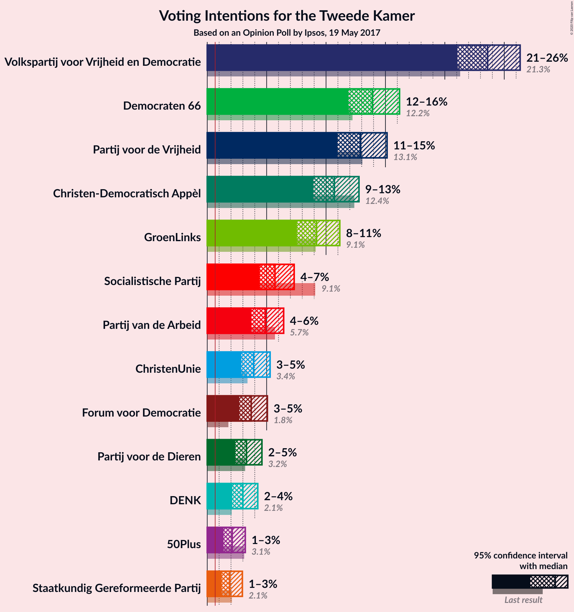

### Confidence Intervals

| Party | Last Result | Poll Result | 80% Confidence Interval | 90% Confidence Interval | 95% Confidence Interval | 99% Confidence Interval |
|:-----:|:-----------:|:-----------:|:-----------------------:|:-----------------------:|:-----------------------:|:-----------------------:|
| Volkspartij voor Vrijheid en Democratie | 21.3% | 23.6% | 21.9–25.4% |21.5–25.9% |21.1–26.3% |20.3–27.2% |
| Democraten 66 | 12.2% | 13.9% | 12.6–15.4% |12.2–15.8% |11.9–16.2% |11.3–16.9% |
| Partij voor de Vrijheid | 13.1% | 12.9% | 11.6–14.4% |11.3–14.8% |11.0–15.1% |10.4–15.9% |
| Christen-Democratisch Appèl | 12.4% | 10.7% | 9.5–12.1% |9.2–12.4% |8.9–12.8% |8.4–13.5% |
| GroenLinks | 9.1% | 9.2% | 8.1–10.5% |7.8–10.8% |7.6–11.2% |7.1–11.8% |
| Socialistische Partij | 9.1% | 5.7% | 4.9–6.8% |4.6–7.1% |4.4–7.3% |4.1–7.9% |
| Partij van de Arbeid | 5.7% | 4.9% | 4.1–5.9% |3.9–6.2% |3.7–6.4% |3.4–6.9% |
| ChristenUnie | 3.4% | 3.9% | 3.2–4.8% |3.0–5.1% |2.9–5.3% |2.6–5.8% |
| Forum voor Democratie | 1.8% | 3.7% | 3.0–4.6% |2.9–4.8% |2.7–5.1% |2.4–5.5% |
| Partij voor de Dieren | 3.2% | 3.3% | 2.7–4.1% |2.5–4.4% |2.4–4.6% |2.1–5.0% |
| DENK | 2.1% | 3.0% | 2.4–3.8% |2.2–4.1% |2.1–4.3% |1.9–4.7% |
| 50Plus | 3.1% | 2.1% | 1.6–2.8% |1.5–3.0% |1.4–3.2% |1.2–3.6% |
| Staatkundig Gereformeerde Partij | 2.1% | 1.9% | 1.4–2.6% |1.3–2.8% |1.2–3.0% |1.0–3.3% |

*Note:* The poll result column reflects the actual value used in the calculations. Published results may vary slightly, and in addition be rounded to fewer digits.

## Seats

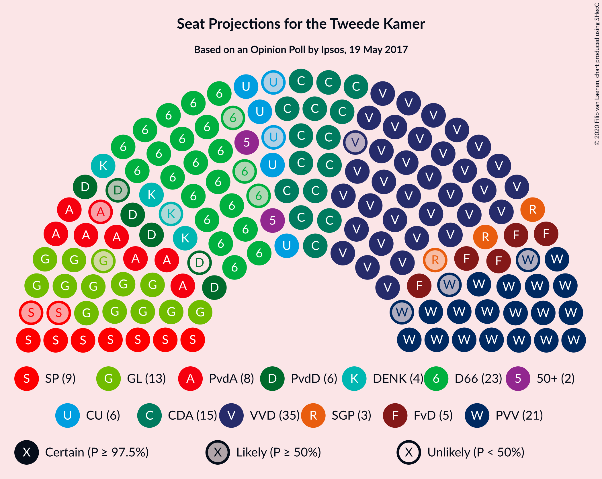

### Confidence Intervals

| Party | Last Result | Median | 80% Confidence Interval | 90% Confidence Interval | 95% Confidence Interval | 99% Confidence Interval |
|:-----:|:-----------:|:------:|:-----------------------:|:-----------------------:|:-----------------------:|:-----------------------:|
| <a href="#volkspartij-voor-vrijheid-en-democratie">Volkspartij voor Vrijheid en Democratie</a> | 33 | 35 | 35–37 |35–38 |34–39 |33–42 |
| <a href="#democraten-66">Democraten 66</a> | 19 | 23 | 23 |20–23 |20–23 |19–24 |
| <a href="#partij-voor-de-vrijheid">Partij voor de Vrijheid</a> | 20 | 21 | 21 |19–21 |18–22 |17–22 |
| <a href="#christen-democratisch-appèl">Christen-Democratisch Appèl</a> | 19 | 15 | 15 |15–16 |15–18 |14–19 |
| <a href="#groenlinks">GroenLinks</a> | 14 | 13 | 13 |13–14 |12–15 |11–16 |
| <a href="#socialistische-partij">Socialistische Partij</a> | 14 | 9 | 8–9 |8–9 |7–9 |6–10 |
| <a href="#partij-van-de-arbeid">Partij van de Arbeid</a> | 9 | 8 | 7–8 |7–8 |7–8 |6–10 |
| <a href="#christenunie">ChristenUnie</a> | 5 | 6 | 4–6 |4–6 |4–7 |4–8 |
| <a href="#forum-voor-democratie">Forum voor Democratie</a> | 2 | 5 | 5 |5 |5–6 |4–7 |
| <a href="#partij-voor-de-dieren">Partij voor de Dieren</a> | 5 | 5 | 5–6 |4–6 |4–6 |3–6 |
| <a href="#denk">DENK</a> | 3 | 4 | 4 |4–5 |3–6 |3–6 |
| <a href="#50plus">50Plus</a> | 4 | 2 | 2–4 |2–4 |2–4 |2–4 |
| <a href="#staatkundig-gereformeerde-partij">Staatkundig Gereformeerde Partij</a> | 3 | 3 | 2–3 |2–3 |2–3 |2–4 |

### Volkspartij voor Vrijheid en Democratie

*For a full overview of the results for this party, see the [Volkspartij voor Vrijheid en Democratie](party-volkspartijvoorvrijheidendemocratie.html) page.*

| Number of Seats | Probability | Accumulated | Special Marks |
|:---------------:|:-----------:|:-----------:|:-------------:|
| 31 | 0.1% | 100% |  |
| 32 | 0.3% | 99.9% |  |
| 33 | 2% | 99.6% | Last Result |
| 34 | 0.4% | 98% |  |
| 35 | 71% | 97% | Median |
| 36 | 1.0% | 26% |  |
| 37 | 19% | 25% |  |
| 38 | 2% | 6% |  |
| 39 | 3% | 4% |  |
| 40 | 0.7% | 2% |  |
| 41 | 0% | 0.8% |  |
| 42 | 0.8% | 0.8% |  |
| 43 | 0% | 0% |  |

### Democraten 66

*For a full overview of the results for this party, see the [Democraten 66](party-democraten66.html) page.*

| Number of Seats | Probability | Accumulated | Special Marks |
|:---------------:|:-----------:|:-----------:|:-------------:|
| 17 | 0.1% | 100% |  |
| 18 | 0.2% | 99.9% |  |
| 19 | 0.5% | 99.7% | Last Result |
| 20 | 5% | 99.2% |  |
| 21 | 0.7% | 94% |  |
| 22 | 3% | 94% |  |
| 23 | 90% | 91% | Median |
| 24 | 0.2% | 0.7% |  |
| 25 | 0.3% | 0.5% |  |
| 26 | 0.2% | 0.2% |  |
| 27 | 0% | 0% |  |

### Partij voor de Vrijheid

*For a full overview of the results for this party, see the [Partij voor de Vrijheid](party-partijvoordevrijheid.html) page.*

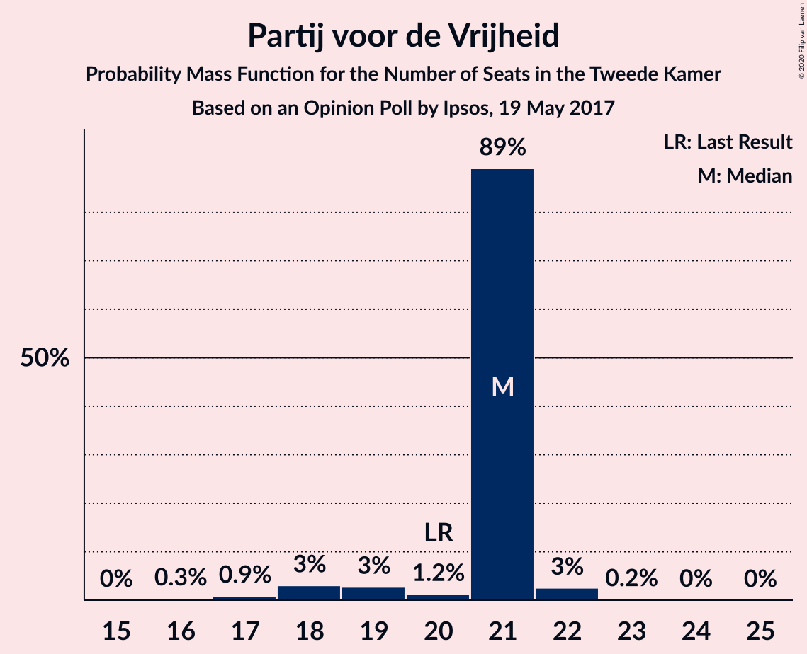

| Number of Seats | Probability | Accumulated | Special Marks |
|:---------------:|:-----------:|:-----------:|:-------------:|
| 16 | 0.3% | 100% |  |
| 17 | 0.9% | 99.6% |  |
| 18 | 3% | 98.8% |  |
| 19 | 3% | 96% |  |
| 20 | 1.2% | 93% | Last Result |
| 21 | 89% | 92% | Median |
| 22 | 3% | 3% |  |
| 23 | 0.2% | 0.2% |  |
| 24 | 0% | 0.1% |  |
| 25 | 0% | 0% |  |

### Christen-Democratisch Appèl

*For a full overview of the results for this party, see the [Christen-Democratisch Appèl](party-christen-democratischappèl.html) page.*

| Number of Seats | Probability | Accumulated | Special Marks |
|:---------------:|:-----------:|:-----------:|:-------------:|
| 13 | 0.5% | 100% |  |
| 14 | 2% | 99.5% |  |
| 15 | 92% | 98% | Median |
| 16 | 1.5% | 6% |  |
| 17 | 0.6% | 5% |  |
| 18 | 2% | 4% |  |
| 19 | 2% | 2% | Last Result |
| 20 | 0% | 0.1% |  |
| 21 | 0% | 0% |  |

### GroenLinks

*For a full overview of the results for this party, see the [GroenLinks](party-groenlinks.html) page.*

| Number of Seats | Probability | Accumulated | Special Marks |
|:---------------:|:-----------:|:-----------:|:-------------:|
| 10 | 0.2% | 100% |  |
| 11 | 1.3% | 99.8% |  |
| 12 | 1.3% | 98% |  |
| 13 | 89% | 97% | Median |
| 14 | 5% | 9% | Last Result |
| 15 | 3% | 4% |  |
| 16 | 0.9% | 1.2% |  |
| 17 | 0.2% | 0.3% |  |
| 18 | 0.1% | 0.1% |  |
| 19 | 0% | 0% |  |

### Socialistische Partij

*For a full overview of the results for this party, see the [Socialistische Partij](party-socialistischepartij.html) page.*

| Number of Seats | Probability | Accumulated | Special Marks |
|:---------------:|:-----------:|:-----------:|:-------------:|
| 6 | 0.5% | 100% |  |
| 7 | 4% | 99.4% |  |
| 8 | 19% | 96% |  |
| 9 | 76% | 77% | Median |
| 10 | 0.7% | 0.9% |  |
| 11 | 0.2% | 0.2% |  |
| 12 | 0.1% | 0.1% |  |
| 13 | 0% | 0% |  |
| 14 | 0% | 0% | Last Result |

### Partij van de Arbeid

*For a full overview of the results for this party, see the [Partij van de Arbeid](party-partijvandearbeid.html) page.*

| Number of Seats | Probability | Accumulated | Special Marks |
|:---------------:|:-----------:|:-----------:|:-------------:|
| 5 | 0.2% | 100% |  |
| 6 | 2% | 99.8% |  |
| 7 | 23% | 98% |  |
| 8 | 73% | 74% | Median |
| 9 | 0.5% | 1.2% | Last Result |
| 10 | 0.6% | 0.7% |  |
| 11 | 0.1% | 0.1% |  |
| 12 | 0% | 0% |  |

### ChristenUnie

*For a full overview of the results for this party, see the [ChristenUnie](party-christenunie.html) page.*

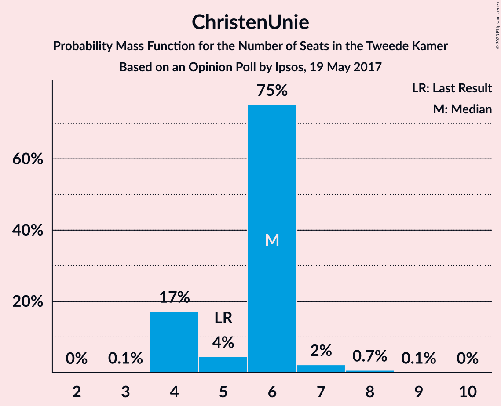

| Number of Seats | Probability | Accumulated | Special Marks |
|:---------------:|:-----------:|:-----------:|:-------------:|
| 3 | 0.1% | 100% |  |
| 4 | 17% | 99.9% |  |
| 5 | 4% | 83% | Last Result |
| 6 | 75% | 78% | Median |
| 7 | 2% | 3% |  |
| 8 | 0.7% | 0.8% |  |
| 9 | 0.1% | 0.1% |  |
| 10 | 0% | 0% |  |

### Forum voor Democratie

*For a full overview of the results for this party, see the [Forum voor Democratie](party-forumvoordemocratie.html) page.*

| Number of Seats | Probability | Accumulated | Special Marks |
|:---------------:|:-----------:|:-----------:|:-------------:|
| 2 | 0% | 100% | Last Result |
| 3 | 0% | 100% |  |
| 4 | 0.8% | 100% |  |
| 5 | 95% | 99.1% | Median |
| 6 | 3% | 4% |  |
| 7 | 0.4% | 0.7% |  |
| 8 | 0.2% | 0.3% |  |
| 9 | 0% | 0% |  |

### Partij voor de Dieren

*For a full overview of the results for this party, see the [Partij voor de Dieren](party-partijvoordedieren.html) page.*

| Number of Seats | Probability | Accumulated | Special Marks |
|:---------------:|:-----------:|:-----------:|:-------------:|
| 3 | 2% | 100% |  |
| 4 | 7% | 98% |  |
| 5 | 74% | 91% | Last Result, Median |
| 6 | 18% | 18% |  |
| 7 | 0.2% | 0.2% |  |
| 8 | 0% | 0% |  |

### DENK

*For a full overview of the results for this party, see the [DENK](party-denk.html) page.*

| Number of Seats | Probability | Accumulated | Special Marks |
|:---------------:|:-----------:|:-----------:|:-------------:|
| 2 | 0.2% | 100% |  |
| 3 | 3% | 99.8% | Last Result |
| 4 | 89% | 97% | Median |
| 5 | 4% | 8% |  |
| 6 | 3% | 3% |  |
| 7 | 0.3% | 0.4% |  |
| 8 | 0% | 0% |  |

### 50Plus

*For a full overview of the results for this party, see the [50Plus](party-50plus.html) page.*

| Number of Seats | Probability | Accumulated | Special Marks |
|:---------------:|:-----------:|:-----------:|:-------------:|
| 1 | 0.1% | 100% |  |
| 2 | 75% | 99.9% | Median |
| 3 | 4% | 25% |  |
| 4 | 21% | 21% | Last Result |
| 5 | 0.2% | 0.2% |  |
| 6 | 0% | 0% |  |

### Staatkundig Gereformeerde Partij

*For a full overview of the results for this party, see the [Staatkundig Gereformeerde Partij](party-staatkundiggereformeerdepartij.html) page.*

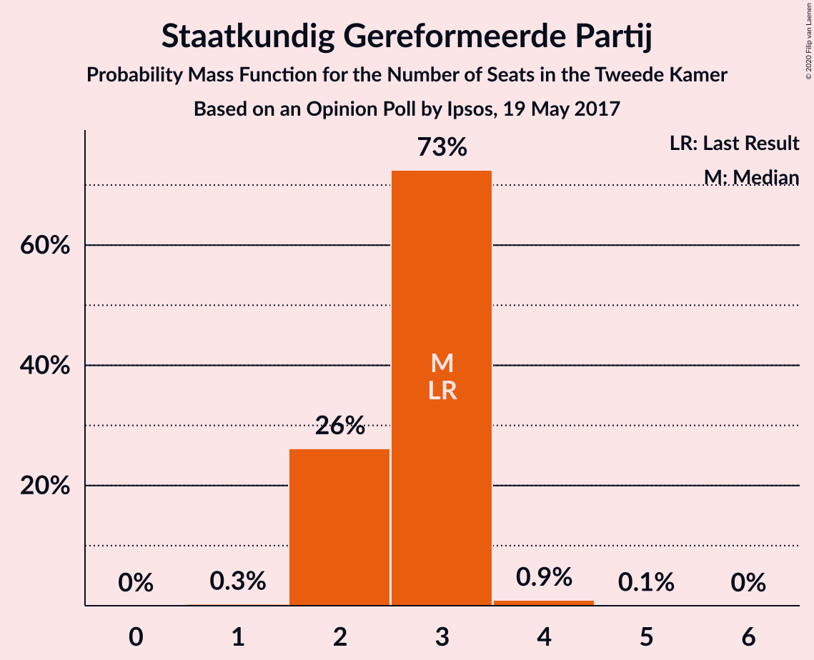

| Number of Seats | Probability | Accumulated | Special Marks |
|:---------------:|:-----------:|:-----------:|:-------------:|
| 1 | 0.3% | 100% |  |
| 2 | 26% | 99.7% |  |
| 3 | 73% | 74% | Last Result, Median |
| 4 | 0.9% | 1.0% |  |
| 5 | 0.1% | 0.1% |  |
| 6 | 0% | 0% |  |

## Coalitions

### Confidence Intervals

| Coalition | Last Result | Median | Majority? | 80% Confidence Interval | 90% Confidence Interval | 95% Confidence Interval | 99% Confidence Interval |
|:---------:|:-----------:|:------:|:---------:|:-----------------------:|:-----------------------:|:-----------------------:|:-----------------------:|
| Volkspartij voor Vrijheid en Democratie – Democraten 66 – Christen-Democratisch Appèl – GroenLinks – ChristenUnie | 90 | 92 | 100% | 92–93 | 92–95 | 92–96 | 89–97 |
| Volkspartij voor Vrijheid en Democratie – Democraten 66 – Christen-Democratisch Appèl – Partij van de Arbeid – ChristenUnie | 85 | 87 | 100% | 86–87 | 86–87 | 86–90 | 84–92 |
| Volkspartij voor Vrijheid en Democratie – Partij voor de Vrijheid – Christen-Democratisch Appèl – Forum voor Democratie – Staatkundig Gereformeerde Partij | 77 | 79 | 99.7% | 79–80 | 79–82 | 77–83 | 76–85 |
| Volkspartij voor Vrijheid en Democratie – Democraten 66 – Christen-Democratisch Appèl – ChristenUnie | 76 | 79 | 99.6% | 79 | 79–80 | 79–82 | 76–85 |
| Volkspartij voor Vrijheid en Democratie – Partij voor de Vrijheid – Christen-Democratisch Appèl – Forum voor Democratie | 74 | 76 | 96% | 76–78 | 76–79 | 74–81 | 74–83 |
| Volkspartij voor Vrijheid en Democratie – Democraten 66 – Christen-Democratisch Appèl | 71 | 73 | 3% | 73–75 | 73–75 | 72–76 | 70–80 |
| Volkspartij voor Vrijheid en Democratie – Partij voor de Vrijheid – Christen-Democratisch Appèl | 72 | 71 | 4% | 71–73 | 71–73 | 69–76 | 68–78 |
| Democraten 66 – Christen-Democratisch Appèl – GroenLinks – Socialistische Partij – Partij van de Arbeid – ChristenUnie | 80 | 74 | 3% | 70–74 | 70–74 | 68–76 | 68–77 |
| Volkspartij voor Vrijheid en Democratie – Democraten 66 – Partij van de Arbeid | 61 | 66 | 0% | 66–67 | 65–67 | 63–67 | 61–71 |
| Democraten 66 – Christen-Democratisch Appèl – GroenLinks – Partij van de Arbeid – ChristenUnie | 66 | 65 | 0% | 62–65 | 62–65 | 61–67 | 60–69 |
| Volkspartij voor Vrijheid en Democratie – Christen-Democratisch Appèl – Forum voor Democratie – 50Plus – Staatkundig Gereformeerde Partij | 61 | 60 | 0% | 60–63 | 60–64 | 60–66 | 60–68 |
| Volkspartij voor Vrijheid en Democratie – Christen-Democratisch Appèl – Forum voor Democratie – 50Plus | 58 | 57 | 0% | 57–61 | 57–62 | 57–64 | 57–66 |
| Volkspartij voor Vrijheid en Democratie – Christen-Democratisch Appèl – Forum voor Democratie – Staatkundig Gereformeerde Partij | 57 | 58 | 0% | 58–59 | 58–61 | 58–63 | 57–65 |
| Volkspartij voor Vrijheid en Democratie – Christen-Democratisch Appèl – Partij van de Arbeid | 61 | 58 | 0% | 58–59 | 58–61 | 58–63 | 56–65 |
| Volkspartij voor Vrijheid en Democratie – Christen-Democratisch Appèl – Forum voor Democratie | 54 | 55 | 0% | 55–57 | 55–59 | 55–60 | 55–63 |
| Volkspartij voor Vrijheid en Democratie – Christen-Democratisch Appèl | 52 | 50 | 0% | 50–52 | 50–54 | 50–55 | 49–58 |
| Democraten 66 – Christen-Democratisch Appèl – Partij van de Arbeid | 47 | 46 | 0% | 45–46 | 43–46 | 42–48 | 41–48 |
| Volkspartij voor Vrijheid en Democratie – Partij van de Arbeid | 42 | 43 | 0% | 43–44 | 43–45 | 41–46 | 40–49 |
| Democraten 66 – Christen-Democratisch Appèl | 38 | 38 | 0% | 38 | 36–38 | 35–41 | 34–41 |
| Christen-Democratisch Appèl – Partij van de Arbeid – ChristenUnie | 33 | 29 | 0% | 26–29 | 26–30 | 26–31 | 25–33 |
| Christen-Democratisch Appèl – Partij van de Arbeid | 28 | 23 | 0% | 22–23 | 22–24 | 22–25 | 20–27 |

### Volkspartij voor Vrijheid en Democratie – Democraten 66 – Christen-Democratisch Appèl – GroenLinks – ChristenUnie

| Number of Seats | Probability | Accumulated | Special Marks |
|:---------------:|:-----------:|:-----------:|:-------------:|
| 86 | 0.1% | 100% |  |
| 87 | 0% | 99.9% |  |
| 88 | 0.2% | 99.9% |  |
| 89 | 0.3% | 99.7% |  |
| 90 | 0.4% | 99.4% | Last Result |
| 91 | 0.3% | 98.9% |  |
| 92 | 88% | 98.6% | Median |
| 93 | 4% | 11% |  |
| 94 | 1.0% | 7% |  |
| 95 | 2% | 6% |  |
| 96 | 1.4% | 3% |  |
| 97 | 1.4% | 2% |  |
| 98 | 0.1% | 0.3% |  |
| 99 | 0.2% | 0.3% |  |
| 100 | 0% | 0.1% |  |
| 101 | 0% | 0% |  |

### Volkspartij voor Vrijheid en Democratie – Democraten 66 – Christen-Democratisch Appèl – Partij van de Arbeid – ChristenUnie

| Number of Seats | Probability | Accumulated | Special Marks |
|:---------------:|:-----------:|:-----------:|:-------------:|
| 80 | 0.1% | 100% |  |
| 81 | 0.1% | 99.9% |  |
| 82 | 0.2% | 99.8% |  |
| 83 | 0.1% | 99.6% |  |
| 84 | 0.4% | 99.5% |  |
| 85 | 0.6% | 99.1% | Last Result |
| 86 | 19% | 98% |  |
| 87 | 75% | 79% | Median |
| 88 | 0.3% | 4% |  |
| 89 | 1.4% | 4% |  |
| 90 | 0.2% | 3% |  |
| 91 | 2% | 2% |  |
| 92 | 0.7% | 0.8% |  |
| 93 | 0% | 0.1% |  |
| 94 | 0% | 0% |  |

### Volkspartij voor Vrijheid en Democratie – Partij voor de Vrijheid – Christen-Democratisch Appèl – Forum voor Democratie – Staatkundig Gereformeerde Partij

| Number of Seats | Probability | Accumulated | Special Marks |
|:---------------:|:-----------:|:-----------:|:-------------:|
| 75 | 0.3% | 100% |  |
| 76 | 2% | 99.7% | Majority |
| 77 | 1.3% | 98% | Last Result |
| 78 | 0.4% | 96% |  |
| 79 | 71% | 96% | Median |
| 80 | 19% | 25% |  |
| 81 | 1.2% | 6% |  |
| 82 | 0.5% | 5% |  |
| 83 | 4% | 5% |  |
| 84 | 0.1% | 0.7% |  |
| 85 | 0.6% | 0.7% |  |
| 86 | 0% | 0% |  |

### Volkspartij voor Vrijheid en Democratie – Democraten 66 – Christen-Democratisch Appèl – ChristenUnie

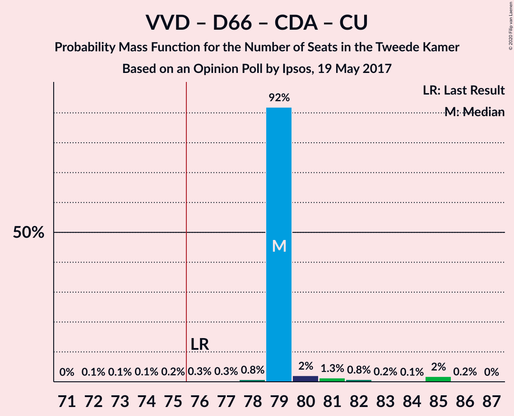

| Number of Seats | Probability | Accumulated | Special Marks |
|:---------------:|:-----------:|:-----------:|:-------------:|
| 72 | 0.1% | 100% |  |
| 73 | 0.1% | 99.9% |  |
| 74 | 0.1% | 99.9% |  |
| 75 | 0.2% | 99.7% |  |
| 76 | 0.3% | 99.6% | Last Result, Majority |
| 77 | 0.3% | 99.3% |  |
| 78 | 0.8% | 99.0% |  |
| 79 | 92% | 98% | Median |
| 80 | 2% | 6% |  |
| 81 | 1.3% | 4% |  |
| 82 | 0.8% | 3% |  |
| 83 | 0.2% | 2% |  |
| 84 | 0.1% | 2% |  |
| 85 | 2% | 2% |  |
| 86 | 0.2% | 0.2% |  |
| 87 | 0% | 0% |  |

### Volkspartij voor Vrijheid en Democratie – Partij voor de Vrijheid – Christen-Democratisch Appèl – Forum voor Democratie

| Number of Seats | Probability | Accumulated | Special Marks |
|:---------------:|:-----------:|:-----------:|:-------------:|
| 71 | 0% | 100% |  |
| 72 | 0.2% | 99.9% |  |
| 73 | 0.2% | 99.8% |  |
| 74 | 2% | 99.6% | Last Result |
| 75 | 1.0% | 97% |  |
| 76 | 71% | 96% | Median, Majority |
| 77 | 0.9% | 25% |  |
| 78 | 18% | 24% |  |
| 79 | 1.3% | 6% |  |
| 80 | 0.2% | 5% |  |
| 81 | 4% | 4% |  |
| 82 | 0.1% | 0.7% |  |
| 83 | 0.6% | 0.6% |  |
| 84 | 0% | 0% |  |

### Volkspartij voor Vrijheid en Democratie – Democraten 66 – Christen-Democratisch Appèl

| Number of Seats | Probability | Accumulated | Special Marks |
|:---------------:|:-----------:|:-----------:|:-------------:|
| 67 | 0.1% | 100% |  |
| 68 | 0.1% | 99.9% |  |
| 69 | 0.2% | 99.8% |  |
| 70 | 0.2% | 99.6% |  |
| 71 | 0.4% | 99.4% | Last Result |
| 72 | 2% | 99.0% |  |
| 73 | 71% | 97% | Median |
| 74 | 5% | 26% |  |
| 75 | 17% | 20% |  |
| 76 | 0.9% | 3% | Majority |
| 77 | 0.1% | 2% |  |
| 78 | 0.1% | 2% |  |
| 79 | 1.2% | 2% |  |
| 80 | 0.7% | 0.8% |  |
| 81 | 0.1% | 0.1% |  |
| 82 | 0% | 0% |  |

### Volkspartij voor Vrijheid en Democratie – Partij voor de Vrijheid – Christen-Democratisch Appèl

| Number of Seats | Probability | Accumulated | Special Marks |
|:---------------:|:-----------:|:-----------:|:-------------:|
| 66 | 0.2% | 100% |  |
| 67 | 0.2% | 99.7% |  |
| 68 | 0.6% | 99.5% |  |
| 69 | 3% | 99.0% |  |
| 70 | 0.3% | 96% |  |
| 71 | 72% | 96% | Median |
| 72 | 0.5% | 25% | Last Result |
| 73 | 19% | 24% |  |
| 74 | 0.4% | 5% |  |
| 75 | 0.3% | 4% |  |
| 76 | 3% | 4% | Majority |
| 77 | 0.1% | 0.7% |  |
| 78 | 0.6% | 0.6% |  |
| 79 | 0% | 0% |  |

### Democraten 66 – Christen-Democratisch Appèl – GroenLinks – Socialistische Partij – Partij van de Arbeid – ChristenUnie

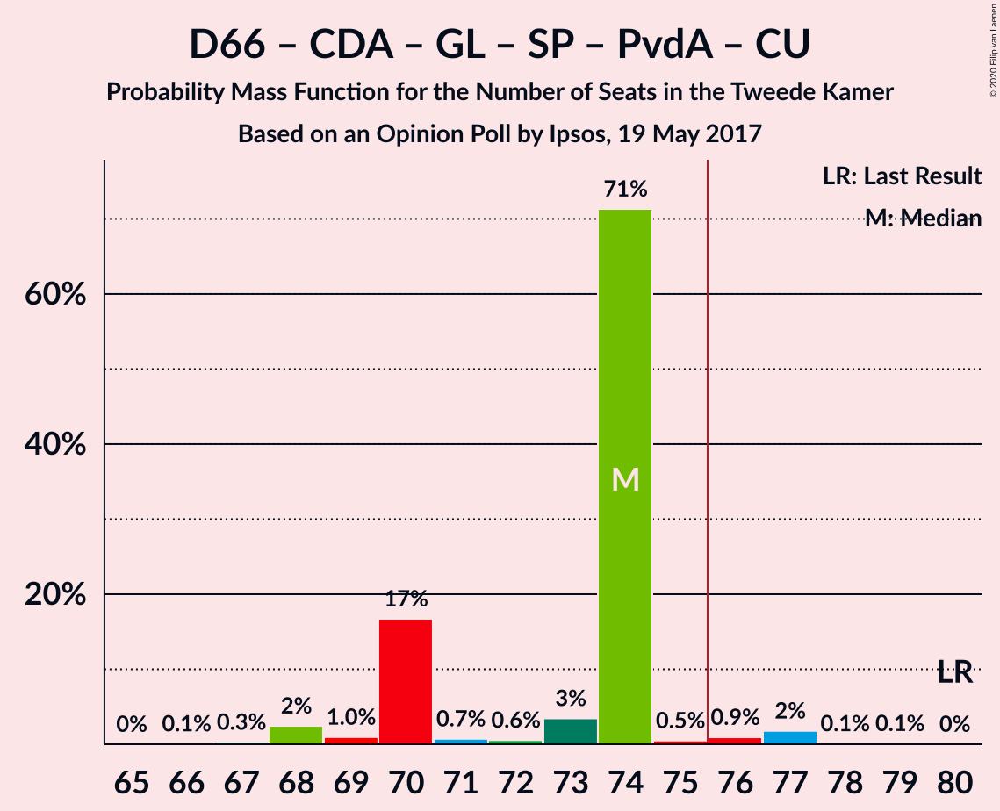

| Number of Seats | Probability | Accumulated | Special Marks |
|:---------------:|:-----------:|:-----------:|:-------------:|
| 66 | 0.1% | 100% |  |
| 67 | 0.3% | 99.9% |  |
| 68 | 2% | 99.6% |  |
| 69 | 1.0% | 97% |  |
| 70 | 17% | 96% |  |
| 71 | 0.7% | 80% |  |
| 72 | 0.6% | 79% |  |
| 73 | 3% | 78% |  |
| 74 | 71% | 75% | Median |
| 75 | 0.5% | 3% |  |
| 76 | 0.9% | 3% | Majority |
| 77 | 2% | 2% |  |
| 78 | 0.1% | 0.2% |  |
| 79 | 0.1% | 0.1% |  |
| 80 | 0% | 0% | Last Result |

### Volkspartij voor Vrijheid en Democratie – Democraten 66 – Partij van de Arbeid

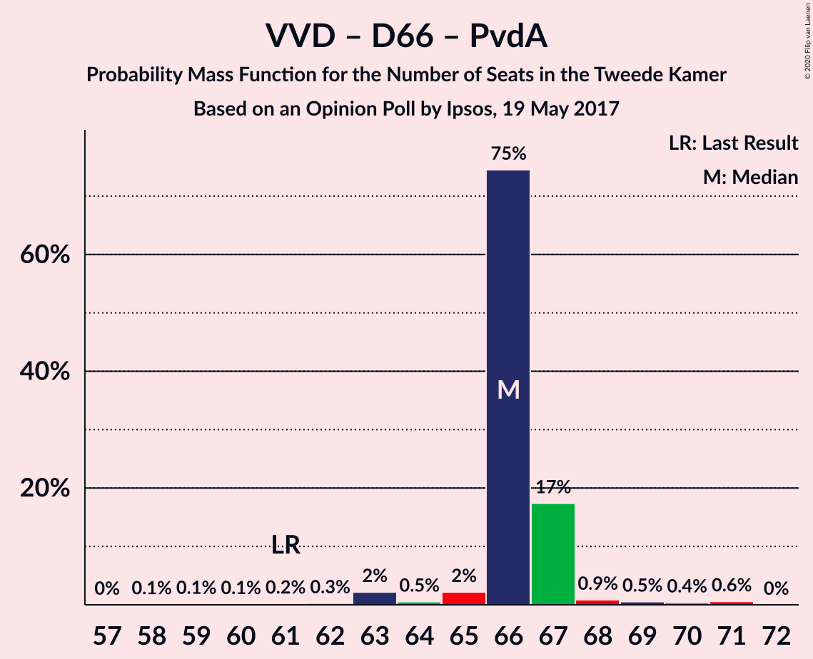

| Number of Seats | Probability | Accumulated | Special Marks |
|:---------------:|:-----------:|:-----------:|:-------------:|
| 58 | 0.1% | 100% |  |
| 59 | 0.1% | 99.9% |  |
| 60 | 0.1% | 99.8% |  |
| 61 | 0.2% | 99.6% | Last Result |
| 62 | 0.3% | 99.4% |  |
| 63 | 2% | 99.2% |  |
| 64 | 0.5% | 97% |  |
| 65 | 2% | 96% |  |
| 66 | 75% | 94% | Median |
| 67 | 17% | 20% |  |
| 68 | 0.9% | 2% |  |
| 69 | 0.5% | 2% |  |
| 70 | 0.4% | 1.0% |  |
| 71 | 0.6% | 0.6% |  |
| 72 | 0% | 0% |  |

### Democraten 66 – Christen-Democratisch Appèl – GroenLinks – Partij van de Arbeid – ChristenUnie

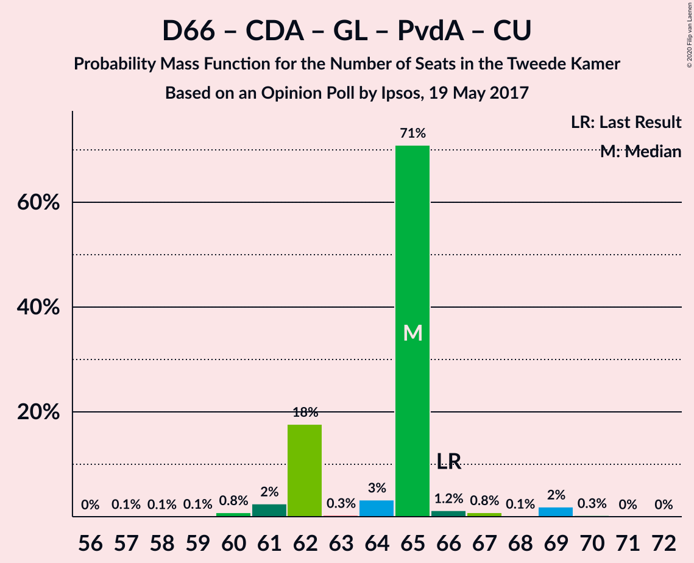

| Number of Seats | Probability | Accumulated | Special Marks |
|:---------------:|:-----------:|:-----------:|:-------------:|
| 57 | 0.1% | 100% |  |
| 58 | 0.1% | 99.9% |  |
| 59 | 0.1% | 99.9% |  |
| 60 | 0.8% | 99.7% |  |
| 61 | 2% | 98.9% |  |
| 62 | 18% | 96% |  |
| 63 | 0.3% | 79% |  |
| 64 | 3% | 79% |  |
| 65 | 71% | 75% | Median |
| 66 | 1.2% | 4% | Last Result |
| 67 | 0.8% | 3% |  |
| 68 | 0.1% | 2% |  |
| 69 | 2% | 2% |  |
| 70 | 0.3% | 0.3% |  |
| 71 | 0% | 0.1% |  |
| 72 | 0% | 0% |  |

### Volkspartij voor Vrijheid en Democratie – Christen-Democratisch Appèl – Forum voor Democratie – 50Plus – Staatkundig Gereformeerde Partij

| Number of Seats | Probability | Accumulated | Special Marks |
|:---------------:|:-----------:|:-----------:|:-------------:|
| 57 | 0.1% | 100% |  |
| 58 | 0.1% | 99.9% |  |
| 59 | 0.2% | 99.8% |  |
| 60 | 71% | 99.5% | Median |
| 61 | 2% | 29% | Last Result |
| 62 | 3% | 27% |  |
| 63 | 17% | 24% |  |
| 64 | 3% | 7% |  |
| 65 | 0.4% | 4% |  |
| 66 | 1.2% | 3% |  |
| 67 | 0.8% | 2% |  |
| 68 | 1.3% | 1.4% |  |
| 69 | 0.1% | 0.1% |  |
| 70 | 0% | 0% |  |

### Volkspartij voor Vrijheid en Democratie – Christen-Democratisch Appèl – Forum voor Democratie – 50Plus

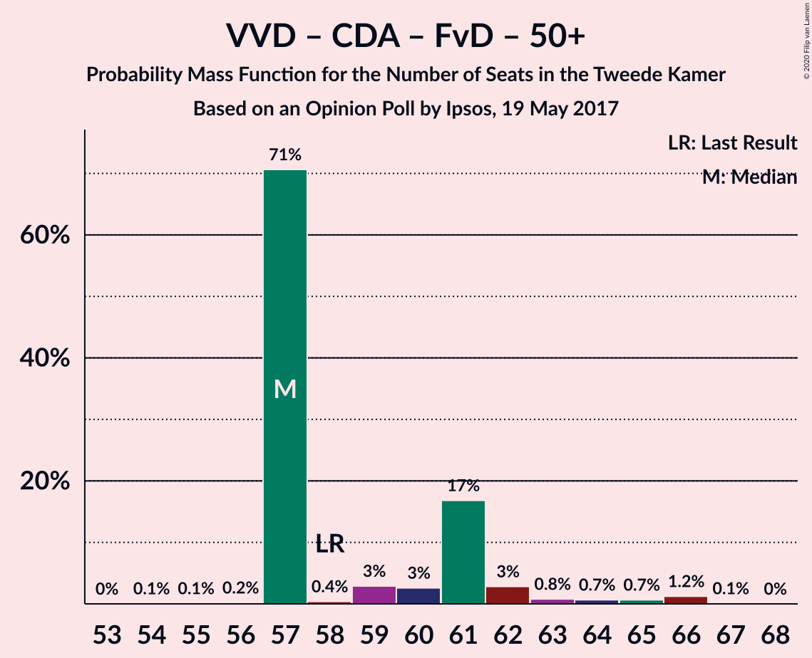

| Number of Seats | Probability | Accumulated | Special Marks |
|:---------------:|:-----------:|:-----------:|:-------------:|
| 54 | 0.1% | 100% |  |
| 55 | 0.1% | 99.9% |  |
| 56 | 0.2% | 99.8% |  |
| 57 | 71% | 99.7% | Median |
| 58 | 0.4% | 29% | Last Result |
| 59 | 3% | 29% |  |
| 60 | 3% | 26% |  |
| 61 | 17% | 23% |  |
| 62 | 3% | 6% |  |
| 63 | 0.8% | 3% |  |
| 64 | 0.7% | 3% |  |
| 65 | 0.7% | 2% |  |
| 66 | 1.2% | 1.3% |  |
| 67 | 0.1% | 0.1% |  |
| 68 | 0% | 0% |  |

### Volkspartij voor Vrijheid en Democratie – Christen-Democratisch Appèl – Forum voor Democratie – Staatkundig Gereformeerde Partij

| Number of Seats | Probability | Accumulated | Special Marks |
|:---------------:|:-----------:|:-----------:|:-------------:|
| 53 | 0.1% | 100% |  |
| 54 | 0% | 99.9% |  |
| 55 | 0% | 99.9% |  |
| 56 | 0.2% | 99.9% |  |
| 57 | 0.3% | 99.7% | Last Result |
| 58 | 73% | 99.4% | Median |
| 59 | 19% | 27% |  |
| 60 | 0.9% | 8% |  |
| 61 | 3% | 7% |  |
| 62 | 1.1% | 4% |  |
| 63 | 0.5% | 3% |  |
| 64 | 2% | 2% |  |
| 65 | 0.7% | 0.9% |  |
| 66 | 0.1% | 0.1% |  |
| 67 | 0% | 0.1% |  |
| 68 | 0% | 0% |  |

### Volkspartij voor Vrijheid en Democratie – Christen-Democratisch Appèl – Partij van de Arbeid

| Number of Seats | Probability | Accumulated | Special Marks |
|:---------------:|:-----------:|:-----------:|:-------------:|
| 53 | 0% | 100% |  |
| 54 | 0.1% | 99.9% |  |
| 55 | 0.3% | 99.8% |  |
| 56 | 0.2% | 99.6% |  |
| 57 | 0.3% | 99.4% |  |
| 58 | 74% | 99.0% | Median |
| 59 | 17% | 25% |  |
| 60 | 2% | 8% |  |
| 61 | 3% | 6% | Last Result |
| 62 | 0.2% | 3% |  |
| 63 | 2% | 3% |  |
| 64 | 0.5% | 1.2% |  |
| 65 | 0.6% | 0.7% |  |
| 66 | 0% | 0.1% |  |
| 67 | 0.1% | 0.1% |  |
| 68 | 0% | 0% |  |

### Volkspartij voor Vrijheid en Democratie – Christen-Democratisch Appèl – Forum voor Democratie

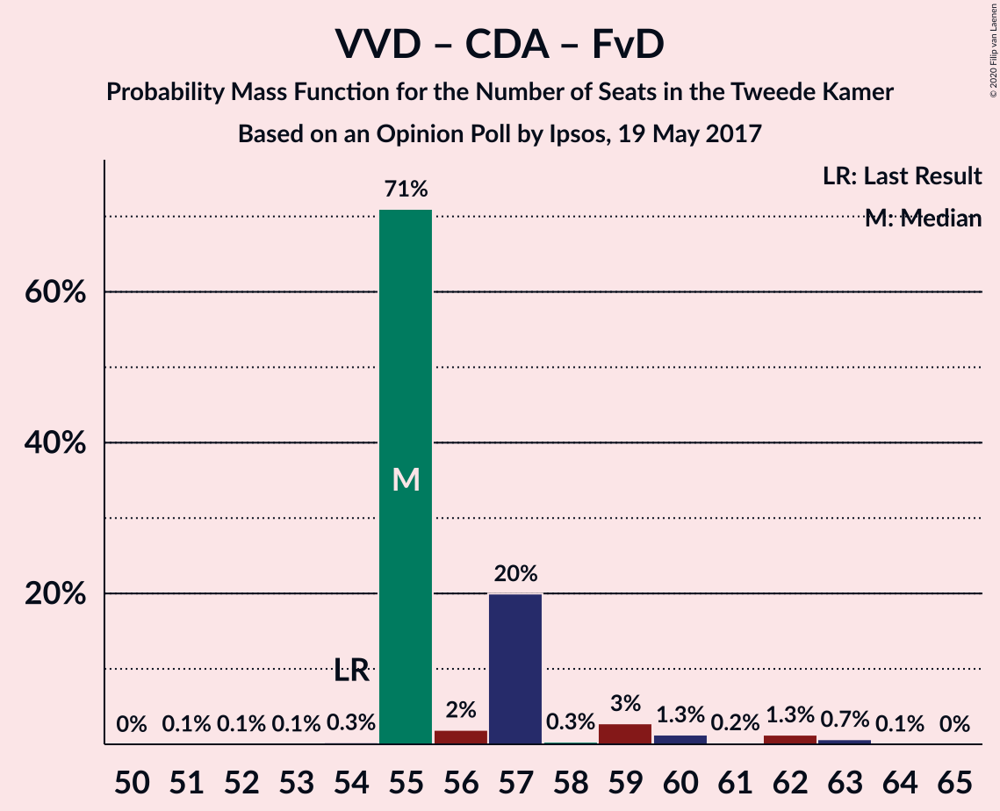

| Number of Seats | Probability | Accumulated | Special Marks |
|:---------------:|:-----------:|:-----------:|:-------------:|
| 51 | 0.1% | 100% |  |
| 52 | 0.1% | 99.9% |  |
| 53 | 0.1% | 99.9% |  |
| 54 | 0.3% | 99.8% | Last Result |
| 55 | 71% | 99.5% | Median |
| 56 | 2% | 29% |  |
| 57 | 20% | 27% |  |
| 58 | 0.3% | 7% |  |
| 59 | 3% | 6% |  |
| 60 | 1.3% | 4% |  |
| 61 | 0.2% | 2% |  |
| 62 | 1.3% | 2% |  |
| 63 | 0.7% | 0.8% |  |
| 64 | 0.1% | 0.1% |  |
| 65 | 0% | 0% |  |

### Volkspartij voor Vrijheid en Democratie – Christen-Democratisch Appèl

| Number of Seats | Probability | Accumulated | Special Marks |
|:---------------:|:-----------:|:-----------:|:-------------:|
| 46 | 0% | 100% |  |
| 47 | 0.1% | 99.9% |  |
| 48 | 0.3% | 99.8% |  |
| 49 | 0.3% | 99.5% |  |
| 50 | 71% | 99.3% | Median |
| 51 | 3% | 29% |  |
| 52 | 19% | 25% | Last Result |
| 53 | 0.6% | 7% |  |
| 54 | 3% | 6% |  |
| 55 | 0.6% | 3% |  |
| 56 | 0.1% | 2% |  |
| 57 | 1.2% | 2% |  |
| 58 | 0.6% | 0.7% |  |
| 59 | 0.1% | 0.1% |  |
| 60 | 0% | 0% |  |

### Democraten 66 – Christen-Democratisch Appèl – Partij van de Arbeid

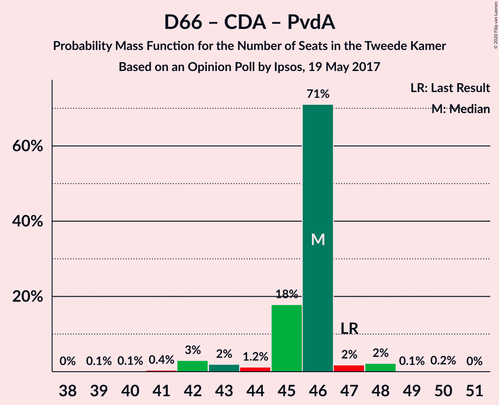

| Number of Seats | Probability | Accumulated | Special Marks |
|:---------------:|:-----------:|:-----------:|:-------------:|
| 39 | 0.1% | 100% |  |
| 40 | 0.1% | 99.9% |  |
| 41 | 0.4% | 99.8% |  |
| 42 | 3% | 99.4% |  |
| 43 | 2% | 96% |  |
| 44 | 1.2% | 94% |  |
| 45 | 18% | 93% |  |
| 46 | 71% | 75% | Median |
| 47 | 2% | 4% | Last Result |
| 48 | 2% | 3% |  |
| 49 | 0.1% | 0.3% |  |
| 50 | 0.2% | 0.2% |  |
| 51 | 0% | 0% |  |

### Volkspartij voor Vrijheid en Democratie – Partij van de Arbeid

| Number of Seats | Probability | Accumulated | Special Marks |
|:---------------:|:-----------:|:-----------:|:-------------:|
| 38 | 0.1% | 100% |  |
| 39 | 0.2% | 99.9% |  |
| 40 | 2% | 99.7% |  |
| 41 | 0.4% | 98% |  |
| 42 | 0.8% | 97% | Last Result |
| 43 | 71% | 97% | Median |
| 44 | 19% | 25% |  |
| 45 | 2% | 7% |  |
| 46 | 3% | 5% |  |
| 47 | 0.4% | 1.5% |  |
| 48 | 0.2% | 1.1% |  |
| 49 | 0.7% | 0.9% |  |
| 50 | 0.3% | 0.3% |  |
| 51 | 0% | 0% |  |

### Democraten 66 – Christen-Democratisch Appèl

| Number of Seats | Probability | Accumulated | Special Marks |
|:---------------:|:-----------:|:-----------:|:-------------:|
| 32 | 0.1% | 100% |  |
| 33 | 0.3% | 99.9% |  |
| 34 | 0.2% | 99.6% |  |
| 35 | 4% | 99.4% |  |
| 36 | 1.0% | 95% |  |
| 37 | 1.5% | 94% |  |
| 38 | 88% | 93% | Last Result, Median |
| 39 | 0.5% | 4% |  |
| 40 | 0.4% | 4% |  |
| 41 | 3% | 3% |  |
| 42 | 0.1% | 0.2% |  |
| 43 | 0.1% | 0.2% |  |
| 44 | 0.1% | 0.1% |  |
| 45 | 0% | 0% |  |

### Christen-Democratisch Appèl – Partij van de Arbeid – ChristenUnie

| Number of Seats | Probability | Accumulated | Special Marks |
|:---------------:|:-----------:|:-----------:|:-------------:|
| 24 | 0.1% | 100% |  |
| 25 | 0.7% | 99.9% |  |
| 26 | 17% | 99.2% |  |
| 27 | 3% | 82% |  |
| 28 | 1.1% | 79% |  |
| 29 | 72% | 78% | Median |
| 30 | 2% | 7% |  |
| 31 | 3% | 4% |  |
| 32 | 0.6% | 1.2% |  |
| 33 | 0.2% | 0.6% | Last Result |
| 34 | 0.3% | 0.4% |  |
| 35 | 0% | 0.1% |  |
| 36 | 0% | 0% |  |

### Christen-Democratisch Appèl – Partij van de Arbeid

| Number of Seats | Probability | Accumulated | Special Marks |
|:---------------:|:-----------:|:-----------:|:-------------:|
| 19 | 0.1% | 100% |  |
| 20 | 0.7% | 99.9% |  |
| 21 | 1.3% | 99.2% |  |
| 22 | 19% | 98% |  |
| 23 | 73% | 78% | Median |
| 24 | 0.4% | 5% |  |
| 25 | 3% | 5% |  |
| 26 | 0.8% | 1.3% |  |
| 27 | 0.2% | 0.5% |  |
| 28 | 0.3% | 0.3% | Last Result |
| 29 | 0% | 0% |  |

## Technical Information

### Opinion Poll

+ **Polling firm:** Ipsos
+ **Commissioner(s):** —
+ **Fieldwork period:** 19 May 2017

### Calculations

+ **Sample size:** 1000
+ **Simulations done:** 1,048,576
+ **Error estimate:** 2.23%

