# Opinion Poll by Ipsos, 1 June 2017

<a href="#voting-intentions">Voting Intentions</a> | <a href="#seats">Seats</a> | <a href="#coalitions">Coalitions</a> | <a href="#technical-information">Technical Information</a>

## Voting Intentions

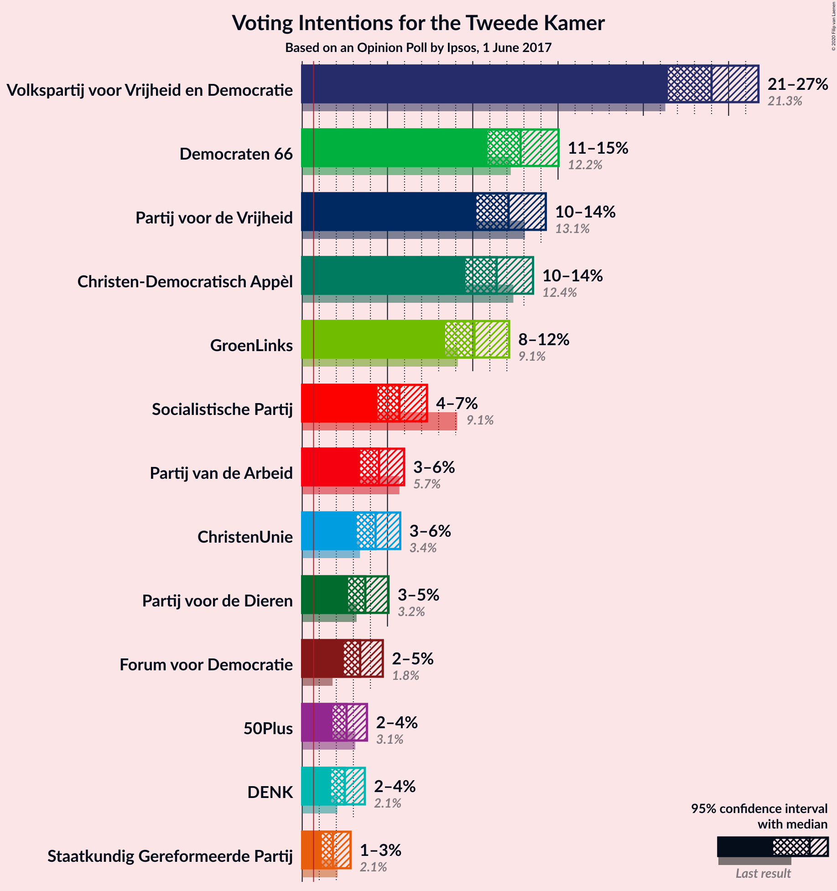

### Confidence Intervals

| Party | Last Result | Poll Result | 80% Confidence Interval | 90% Confidence Interval | 95% Confidence Interval | 99% Confidence Interval |
|:-----:|:-----------:|:-----------:|:-----------------------:|:-----------------------:|:-----------------------:|:-----------------------:|
| Volkspartij voor Vrijheid en Democratie | 21.3% | 24.0% | 22.3–25.8% |21.9–26.3% |21.4–26.7% |20.7–27.6% |
| Democraten 66 | 12.2% | 12.8% | 11.5–14.3% |11.2–14.7% |10.9–15.0% |10.3–15.7% |
| Partij voor de Vrijheid | 13.1% | 12.1% | 10.9–13.5% |10.5–13.9% |10.2–14.3% |9.6–15.0% |
| Christen-Democratisch Appèl | 12.4% | 11.4% | 10.2–12.8% |9.9–13.2% |9.6–13.5% |9.0–14.2% |
| GroenLinks | 9.1% | 10.1% | 9.0–11.4% |8.6–11.8% |8.4–12.1% |7.9–12.8% |
| Socialistische Partij | 9.1% | 5.7% | 4.9–6.8% |4.6–7.1% |4.4–7.3% |4.1–7.9% |
| Partij van de Arbeid | 5.7% | 4.5% | 3.8–5.5% |3.6–5.7% |3.4–6.0% |3.0–6.5% |
| ChristenUnie | 3.4% | 4.3% | 3.6–5.2% |3.4–5.5% |3.2–5.7% |2.9–6.2% |
| Partij voor de Dieren | 3.2% | 3.7% | 3.0–4.6% |2.9–4.8% |2.7–5.1% |2.4–5.5% |
| Forum voor Democratie | 1.8% | 3.4% | 2.8–4.3% |2.6–4.5% |2.4–4.7% |2.2–5.2% |
| 50Plus | 3.1% | 2.6% | 2.1–3.4% |1.9–3.6% |1.8–3.8% |1.6–4.2% |
| DENK | 2.1% | 2.5% | 2.0–3.3% |1.8–3.5% |1.7–3.7% |1.5–4.1% |
| Staatkundig Gereformeerde Partij | 2.1% | 1.8% | 1.4–2.5% |1.2–2.7% |1.1–2.8% |1.0–3.2% |

*Note:* The poll result column reflects the actual value used in the calculations. Published results may vary slightly, and in addition be rounded to fewer digits.

## Seats

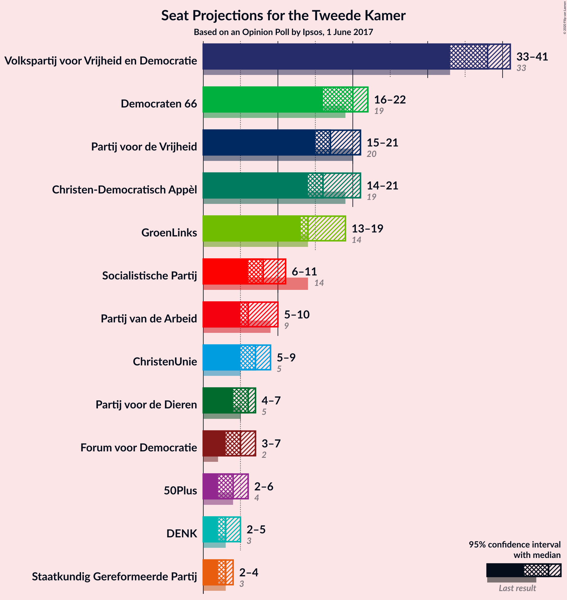

### Confidence Intervals

| Party | Last Result | Median | 80% Confidence Interval | 90% Confidence Interval | 95% Confidence Interval | 99% Confidence Interval |
|:-----:|:-----------:|:------:|:-----------------------:|:-----------------------:|:-----------------------:|:-----------------------:|
| <a href="#volkspartij-voor-vrijheid-en-democratie">Volkspartij voor Vrijheid en Democratie</a> | 33 | 38 | 33–40 |33–40 |33–41 |32–42 |
| <a href="#democraten-66">Democraten 66</a> | 19 | 20 | 17–21 |17–22 |16–22 |15–24 |
| <a href="#partij-voor-de-vrijheid">Partij voor de Vrijheid</a> | 20 | 17 | 15–20 |15–21 |15–21 |14–23 |
| <a href="#christen-democratisch-appèl">Christen-Democratisch Appèl</a> | 19 | 16 | 15–19 |14–20 |14–21 |13–22 |
| <a href="#groenlinks">GroenLinks</a> | 14 | 14 | 13–17 |13–18 |13–19 |12–19 |
| <a href="#socialistische-partij">Socialistische Partij</a> | 14 | 8 | 7–10 |7–11 |6–11 |6–12 |
| <a href="#partij-van-de-arbeid">Partij van de Arbeid</a> | 9 | 6 | 5–8 |5–10 |5–10 |4–11 |
| <a href="#christenunie">ChristenUnie</a> | 5 | 7 | 5–8 |5–8 |5–9 |4–9 |
| <a href="#partij-voor-de-dieren">Partij voor de Dieren</a> | 5 | 6 | 4–6 |4–6 |4–7 |3–8 |
| <a href="#forum-voor-democratie">Forum voor Democratie</a> | 2 | 5 | 4–6 |3–6 |3–7 |3–8 |
| <a href="#50plus">50Plus</a> | 4 | 4 | 3–5 |3–6 |2–6 |2–6 |
| <a href="#denk">DENK</a> | 3 | 3 | 3–4 |2–5 |2–5 |2–6 |
| <a href="#staatkundig-gereformeerde-partij">Staatkundig Gereformeerde Partij</a> | 3 | 3 | 2–3 |2–4 |2–4 |1–5 |

### Volkspartij voor Vrijheid en Democratie

*For a full overview of the results for this party, see the [Volkspartij voor Vrijheid en Democratie](party-volkspartijvoorvrijheidendemocratie.html) page.*

| Number of Seats | Probability | Accumulated | Special Marks |
|:---------------:|:-----------:|:-----------:|:-------------:|
| 30 | 0.1% | 100% |  |
| 31 | 0.3% | 99.9% |  |
| 32 | 2% | 99.6% |  |
| 33 | 9% | 98% | Last Result |
| 34 | 6% | 88% |  |
| 35 | 6% | 82% |  |
| 36 | 4% | 77% |  |
| 37 | 22% | 72% |  |
| 38 | 2% | 51% | Median |
| 39 | 9% | 48% |  |
| 40 | 35% | 39% |  |
| 41 | 2% | 4% |  |
| 42 | 2% | 2% |  |
| 43 | 0.1% | 0.4% |  |
| 44 | 0.2% | 0.3% |  |
| 45 | 0% | 0% |  |

### Democraten 66

*For a full overview of the results for this party, see the [Democraten 66](party-democraten66.html) page.*

| Number of Seats | Probability | Accumulated | Special Marks |
|:---------------:|:-----------:|:-----------:|:-------------:|
| 14 | 0.1% | 100% |  |
| 15 | 1.2% | 99.9% |  |
| 16 | 2% | 98.7% |  |
| 17 | 7% | 97% |  |
| 18 | 9% | 90% |  |
| 19 | 9% | 81% | Last Result |
| 20 | 44% | 72% | Median |
| 21 | 21% | 27% |  |
| 22 | 5% | 6% |  |
| 23 | 0.8% | 2% |  |
| 24 | 0.9% | 1.0% |  |
| 25 | 0.1% | 0.1% |  |
| 26 | 0% | 0% |  |

### Partij voor de Vrijheid

*For a full overview of the results for this party, see the [Partij voor de Vrijheid](party-partijvoordevrijheid.html) page.*

| Number of Seats | Probability | Accumulated | Special Marks |
|:---------------:|:-----------:|:-----------:|:-------------:|
| 13 | 0.2% | 100% |  |
| 14 | 0.4% | 99.8% |  |
| 15 | 11% | 99.4% |  |
| 16 | 4% | 89% |  |
| 17 | 43% | 85% | Median |
| 18 | 6% | 41% |  |
| 19 | 8% | 35% |  |
| 20 | 18% | 28% | Last Result |
| 21 | 7% | 9% |  |
| 22 | 2% | 2% |  |
| 23 | 0.2% | 0.5% |  |
| 24 | 0.3% | 0.3% |  |
| 25 | 0% | 0% |  |

### Christen-Democratisch Appèl

*For a full overview of the results for this party, see the [Christen-Democratisch Appèl](party-christen-democratischappèl.html) page.*

| Number of Seats | Probability | Accumulated | Special Marks |
|:---------------:|:-----------:|:-----------:|:-------------:|
| 12 | 0.1% | 100% |  |
| 13 | 0.5% | 99.9% |  |
| 14 | 5% | 99.4% |  |
| 15 | 5% | 94% |  |
| 16 | 56% | 89% | Median |
| 17 | 11% | 34% |  |
| 18 | 12% | 23% |  |
| 19 | 5% | 10% | Last Result |
| 20 | 3% | 6% |  |
| 21 | 1.2% | 3% |  |
| 22 | 1.1% | 1.4% |  |
| 23 | 0.3% | 0.3% |  |
| 24 | 0% | 0% |  |

### GroenLinks

*For a full overview of the results for this party, see the [GroenLinks](party-groenlinks.html) page.*

| Number of Seats | Probability | Accumulated | Special Marks |
|:---------------:|:-----------:|:-----------:|:-------------:|
| 11 | 0.1% | 100% |  |
| 12 | 0.7% | 99.9% |  |
| 13 | 13% | 99.1% |  |
| 14 | 48% | 86% | Last Result, Median |
| 15 | 9% | 38% |  |
| 16 | 15% | 29% |  |
| 17 | 4% | 14% |  |
| 18 | 7% | 9% |  |
| 19 | 2% | 3% |  |
| 20 | 0.3% | 0.4% |  |
| 21 | 0.1% | 0.1% |  |
| 22 | 0% | 0% |  |

### Socialistische Partij

*For a full overview of the results for this party, see the [Socialistische Partij](party-socialistischepartij.html) page.*

| Number of Seats | Probability | Accumulated | Special Marks |
|:---------------:|:-----------:|:-----------:|:-------------:|
| 5 | 0.2% | 100% |  |
| 6 | 5% | 99.8% |  |
| 7 | 8% | 95% |  |
| 8 | 45% | 87% | Median |
| 9 | 19% | 43% |  |
| 10 | 18% | 23% |  |
| 11 | 5% | 5% |  |
| 12 | 0.4% | 0.7% |  |
| 13 | 0.2% | 0.2% |  |
| 14 | 0% | 0% | Last Result |

### Partij van de Arbeid

*For a full overview of the results for this party, see the [Partij van de Arbeid](party-partijvandearbeid.html) page.*

| Number of Seats | Probability | Accumulated | Special Marks |
|:---------------:|:-----------:|:-----------:|:-------------:|
| 4 | 2% | 100% |  |
| 5 | 39% | 98% |  |
| 6 | 25% | 59% | Median |
| 7 | 13% | 34% |  |
| 8 | 14% | 20% |  |
| 9 | 2% | 7% | Last Result |
| 10 | 5% | 5% |  |
| 11 | 0.6% | 0.6% |  |
| 12 | 0% | 0% |  |

### ChristenUnie

*For a full overview of the results for this party, see the [ChristenUnie](party-christenunie.html) page.*

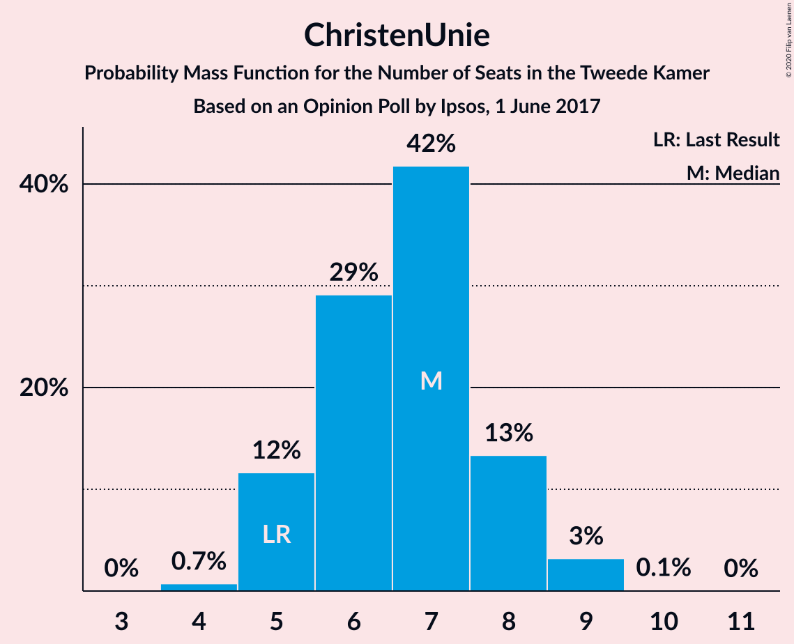

| Number of Seats | Probability | Accumulated | Special Marks |
|:---------------:|:-----------:|:-----------:|:-------------:|
| 4 | 0.7% | 100% |  |
| 5 | 12% | 99.2% | Last Result |
| 6 | 29% | 88% |  |
| 7 | 42% | 58% | Median |
| 8 | 13% | 17% |  |
| 9 | 3% | 3% |  |
| 10 | 0.1% | 0.1% |  |
| 11 | 0% | 0% |  |

### Partij voor de Dieren

*For a full overview of the results for this party, see the [Partij voor de Dieren](party-partijvoordedieren.html) page.*

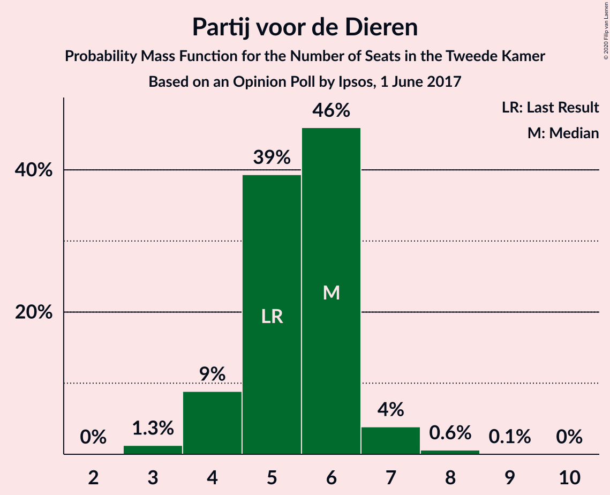

| Number of Seats | Probability | Accumulated | Special Marks |
|:---------------:|:-----------:|:-----------:|:-------------:|
| 3 | 1.3% | 100% |  |
| 4 | 9% | 98.7% |  |
| 5 | 39% | 90% | Last Result |
| 6 | 46% | 51% | Median |
| 7 | 4% | 5% |  |
| 8 | 0.6% | 0.7% |  |
| 9 | 0.1% | 0.1% |  |
| 10 | 0% | 0% |  |

### Forum voor Democratie

*For a full overview of the results for this party, see the [Forum voor Democratie](party-forumvoordemocratie.html) page.*

| Number of Seats | Probability | Accumulated | Special Marks |
|:---------------:|:-----------:|:-----------:|:-------------:|
| 2 | 0.1% | 100% | Last Result |
| 3 | 6% | 99.9% |  |
| 4 | 15% | 94% |  |
| 5 | 31% | 79% | Median |
| 6 | 44% | 48% |  |
| 7 | 3% | 4% |  |
| 8 | 1.2% | 1.3% |  |
| 9 | 0% | 0% |  |

### 50Plus

*For a full overview of the results for this party, see the [50Plus](party-50plus.html) page.*

| Number of Seats | Probability | Accumulated | Special Marks |
|:---------------:|:-----------:|:-----------:|:-------------:|
| 2 | 4% | 100% |  |
| 3 | 31% | 96% |  |
| 4 | 49% | 65% | Last Result, Median |
| 5 | 10% | 16% |  |
| 6 | 6% | 6% |  |
| 7 | 0.1% | 0.1% |  |
| 8 | 0% | 0% |  |

### DENK

*For a full overview of the results for this party, see the [DENK](party-denk.html) page.*

| Number of Seats | Probability | Accumulated | Special Marks |
|:---------------:|:-----------:|:-----------:|:-------------:|
| 1 | 0.1% | 100% |  |
| 2 | 8% | 99.9% |  |
| 3 | 56% | 91% | Last Result, Median |
| 4 | 29% | 36% |  |
| 5 | 6% | 7% |  |
| 6 | 0.8% | 0.9% |  |
| 7 | 0.1% | 0.1% |  |
| 8 | 0% | 0% |  |

### Staatkundig Gereformeerde Partij

*For a full overview of the results for this party, see the [Staatkundig Gereformeerde Partij](party-staatkundiggereformeerdepartij.html) page.*

| Number of Seats | Probability | Accumulated | Special Marks |
|:---------------:|:-----------:|:-----------:|:-------------:|
| 1 | 2% | 100% |  |
| 2 | 33% | 98% |  |
| 3 | 59% | 65% | Last Result, Median |
| 4 | 4% | 6% |  |
| 5 | 2% | 2% |  |
| 6 | 0% | 0% |  |

## Coalitions

### Confidence Intervals

| Coalition | Last Result | Median | Majority? | 80% Confidence Interval | 90% Confidence Interval | 95% Confidence Interval | 99% Confidence Interval |
|:---------:|:-----------:|:------:|:---------:|:-----------------------:|:-----------------------:|:-----------------------:|:-----------------------:|
| Volkspartij voor Vrijheid en Democratie – Democraten 66 – Christen-Democratisch Appèl – GroenLinks – ChristenUnie | 90 | 97 | 100% | 92–98 | 91–99 | 90–99 | 89–101 |
| Volkspartij voor Vrijheid en Democratie – Democraten 66 – Christen-Democratisch Appèl – Partij van de Arbeid – ChristenUnie | 85 | 88 | 100% | 82–90 | 82–92 | 82–92 | 80–93 |
| Volkspartij voor Vrijheid en Democratie – Partij voor de Vrijheid – Christen-Democratisch Appèl – Forum voor Democratie – Staatkundig Gereformeerde Partij | 77 | 82 | 95% | 76–83 | 76–84 | 75–86 | 74–86 |
| Volkspartij voor Vrijheid en Democratie – Democraten 66 – Christen-Democratisch Appèl – ChristenUnie | 76 | 81 | 98% | 76–84 | 76–84 | 76–85 | 74–86 |
| Volkspartij voor Vrijheid en Democratie – Partij voor de Vrijheid – Christen-Democratisch Appèl – Forum voor Democratie | 74 | 79 | 68% | 73–80 | 73–81 | 73–81 | 71–83 |
| Volkspartij voor Vrijheid en Democratie – Democraten 66 – Christen-Democratisch Appèl | 71 | 75 | 46% | 70–76 | 69–77 | 68–79 | 67–79 |
| Democraten 66 – Christen-Democratisch Appèl – GroenLinks – Socialistische Partij – Partij van de Arbeid – ChristenUnie | 80 | 72 | 19% | 69–77 | 68–78 | 68–78 | 66–80 |
| Volkspartij voor Vrijheid en Democratie – Partij voor de Vrijheid – Christen-Democratisch Appèl | 72 | 73 | 8% | 69–75 | 68–77 | 68–77 | 66–78 |
| Democraten 66 – Christen-Democratisch Appèl – GroenLinks – Partij van de Arbeid – ChristenUnie | 66 | 64 | 0% | 62–69 | 59–69 | 59–70 | 58–73 |
| Volkspartij voor Vrijheid en Democratie – Christen-Democratisch Appèl – Forum voor Democratie – 50Plus – Staatkundig Gereformeerde Partij | 61 | 67 | 0% | 60–69 | 59–69 | 59–69 | 59–72 |
| Volkspartij voor Vrijheid en Democratie – Democraten 66 – Partij van de Arbeid | 61 | 65 | 0% | 60–66 | 59–68 | 58–68 | 57–69 |
| Volkspartij voor Vrijheid en Democratie – Christen-Democratisch Appèl – Forum voor Democratie – 50Plus | 58 | 64 | 0% | 58–66 | 56–67 | 56–67 | 56–69 |
| Volkspartij voor Vrijheid en Democratie – Christen-Democratisch Appèl – Forum voor Democratie – Staatkundig Gereformeerde Partij | 57 | 63 | 0% | 57–65 | 56–66 | 56–66 | 55–67 |
| Volkspartij voor Vrijheid en Democratie – Christen-Democratisch Appèl – Partij van de Arbeid | 61 | 61 | 0% | 55–63 | 55–64 | 55–65 | 54–66 |
| Volkspartij voor Vrijheid en Democratie – Christen-Democratisch Appèl – Forum voor Democratie | 54 | 60 | 0% | 54–62 | 53–63 | 53–64 | 53–65 |
| Volkspartij voor Vrijheid en Democratie – Christen-Democratisch Appèl | 52 | 55 | 0% | 49–57 | 49–57 | 49–58 | 48–60 |
| Democraten 66 – Christen-Democratisch Appèl – Partij van de Arbeid | 47 | 41 | 0% | 41–47 | 40–47 | 39–48 | 38–50 |
| Volkspartij voor Vrijheid en Democratie – Partij van de Arbeid | 42 | 45 | 0% | 39–47 | 39–47 | 39–48 | 38–48 |
| Democraten 66 – Christen-Democratisch Appèl | 38 | 36 | 0% | 34–39 | 34–39 | 33–41 | 31–43 |
| Christen-Democratisch Appèl – Partij van de Arbeid – ChristenUnie | 33 | 28 | 0% | 28–33 | 26–34 | 26–35 | 25–37 |
| Christen-Democratisch Appèl – Partij van de Arbeid | 28 | 22 | 0% | 21–26 | 21–27 | 21–28 | 19–29 |

### Volkspartij voor Vrijheid en Democratie – Democraten 66 – Christen-Democratisch Appèl – GroenLinks – ChristenUnie

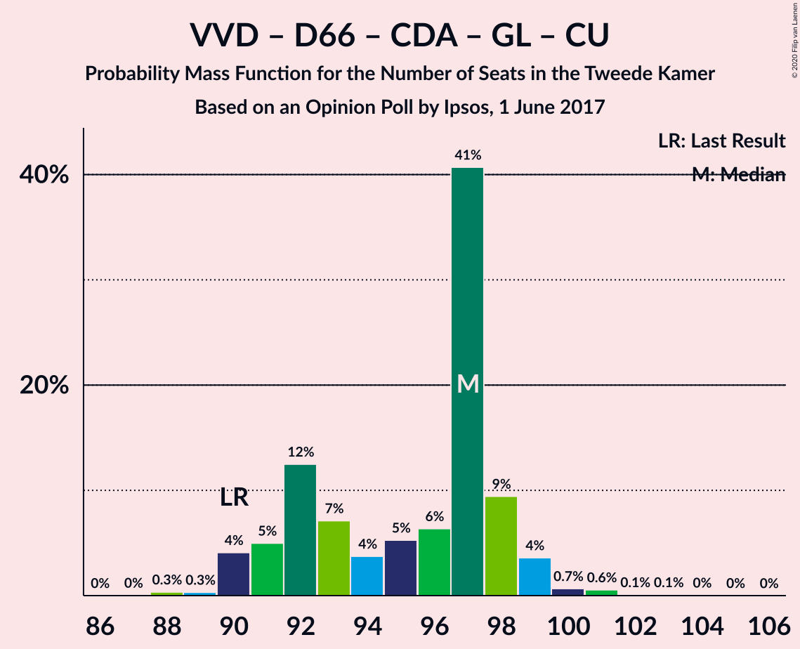

| Number of Seats | Probability | Accumulated | Special Marks |
|:---------------:|:-----------:|:-----------:|:-------------:|
| 87 | 0% | 100% |  |
| 88 | 0.3% | 99.9% |  |
| 89 | 0.3% | 99.6% |  |
| 90 | 4% | 99.3% | Last Result |
| 91 | 5% | 95% |  |
| 92 | 12% | 90% |  |
| 93 | 7% | 78% |  |
| 94 | 4% | 71% |  |
| 95 | 5% | 67% | Median |
| 96 | 6% | 62% |  |
| 97 | 41% | 55% |  |
| 98 | 9% | 15% |  |
| 99 | 4% | 5% |  |
| 100 | 0.7% | 1.5% |  |
| 101 | 0.6% | 0.8% |  |
| 102 | 0.1% | 0.2% |  |
| 103 | 0.1% | 0.1% |  |
| 104 | 0% | 0.1% |  |
| 105 | 0% | 0% |  |

### Volkspartij voor Vrijheid en Democratie – Democraten 66 – Christen-Democratisch Appèl – Partij van de Arbeid – ChristenUnie

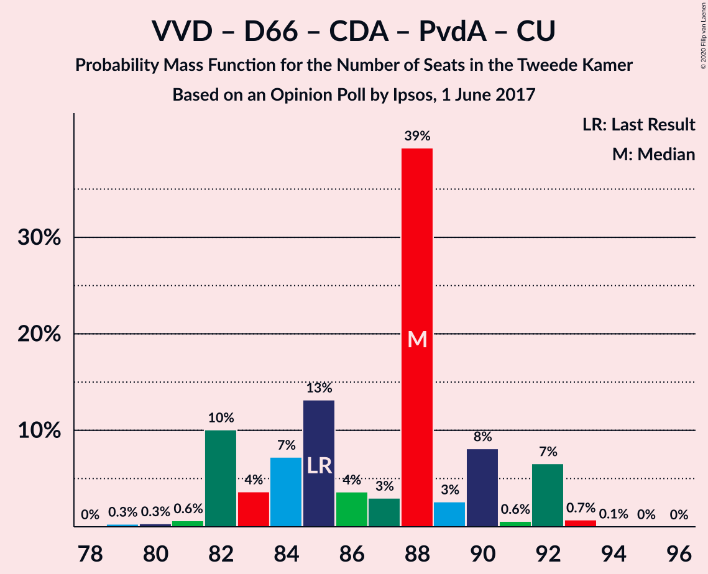

| Number of Seats | Probability | Accumulated | Special Marks |
|:---------------:|:-----------:|:-----------:|:-------------:|
| 79 | 0.3% | 100% |  |
| 80 | 0.3% | 99.7% |  |
| 81 | 0.6% | 99.3% |  |
| 82 | 10% | 98.7% |  |
| 83 | 4% | 89% |  |
| 84 | 7% | 85% |  |
| 85 | 13% | 78% | Last Result |
| 86 | 4% | 65% |  |
| 87 | 3% | 61% | Median |
| 88 | 39% | 58% |  |
| 89 | 3% | 19% |  |
| 90 | 8% | 16% |  |
| 91 | 0.6% | 8% |  |
| 92 | 7% | 7% |  |
| 93 | 0.7% | 0.9% |  |
| 94 | 0.1% | 0.1% |  |
| 95 | 0% | 0% |  |

### Volkspartij voor Vrijheid en Democratie – Partij voor de Vrijheid – Christen-Democratisch Appèl – Forum voor Democratie – Staatkundig Gereformeerde Partij

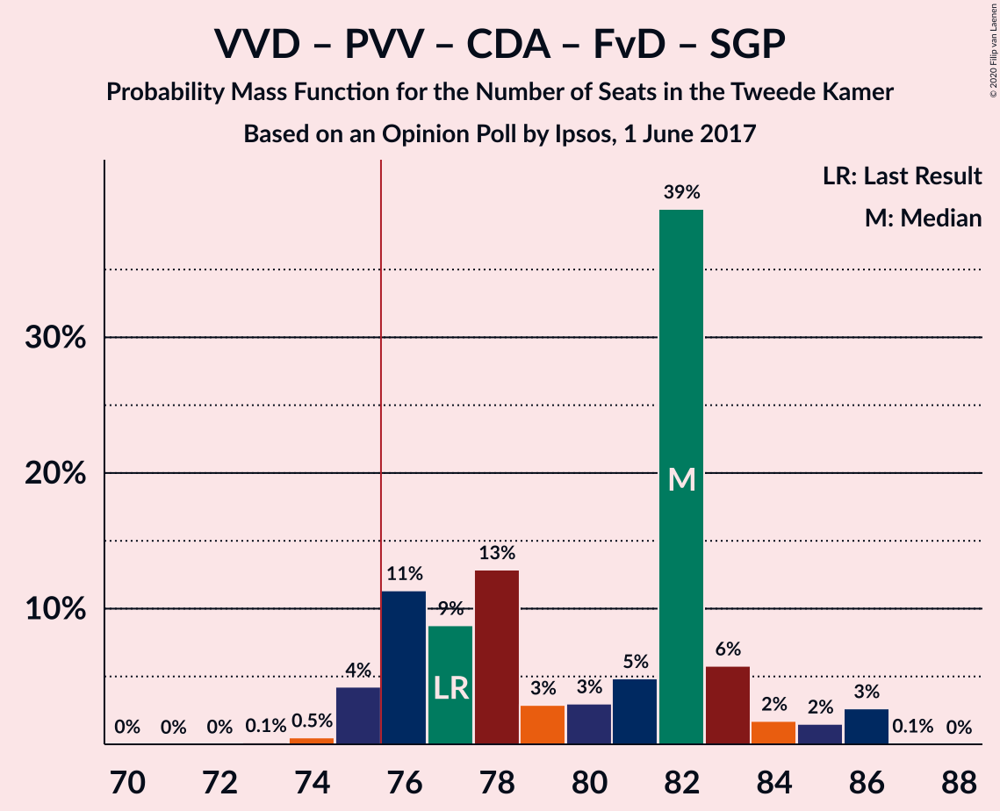

| Number of Seats | Probability | Accumulated | Special Marks |
|:---------------:|:-----------:|:-----------:|:-------------:|
| 70 | 0% | 100% |  |
| 71 | 0% | 99.9% |  |
| 72 | 0% | 99.9% |  |
| 73 | 0.1% | 99.9% |  |
| 74 | 0.5% | 99.8% |  |
| 75 | 4% | 99.3% |  |
| 76 | 11% | 95% | Majority |
| 77 | 9% | 84% | Last Result |
| 78 | 13% | 75% |  |
| 79 | 3% | 62% | Median |
| 80 | 3% | 59% |  |
| 81 | 5% | 56% |  |
| 82 | 39% | 51% |  |
| 83 | 6% | 12% |  |
| 84 | 2% | 6% |  |
| 85 | 2% | 4% |  |
| 86 | 3% | 3% |  |
| 87 | 0.1% | 0.1% |  |
| 88 | 0% | 0% |  |

### Volkspartij voor Vrijheid en Democratie – Democraten 66 – Christen-Democratisch Appèl – ChristenUnie

| Number of Seats | Probability | Accumulated | Special Marks |
|:---------------:|:-----------:|:-----------:|:-------------:|
| 71 | 0.1% | 100% |  |
| 72 | 0.2% | 99.9% |  |
| 73 | 0.2% | 99.8% |  |
| 74 | 0.8% | 99.6% |  |
| 75 | 0.8% | 98.8% |  |
| 76 | 11% | 98% | Last Result, Majority |
| 77 | 8% | 87% |  |
| 78 | 8% | 79% |  |
| 79 | 9% | 72% |  |
| 80 | 7% | 62% |  |
| 81 | 7% | 55% | Median |
| 82 | 2% | 48% |  |
| 83 | 35% | 46% |  |
| 84 | 8% | 11% |  |
| 85 | 2% | 3% |  |
| 86 | 0.6% | 0.7% |  |
| 87 | 0% | 0.1% |  |
| 88 | 0% | 0% |  |

### Volkspartij voor Vrijheid en Democratie – Partij voor de Vrijheid – Christen-Democratisch Appèl – Forum voor Democratie

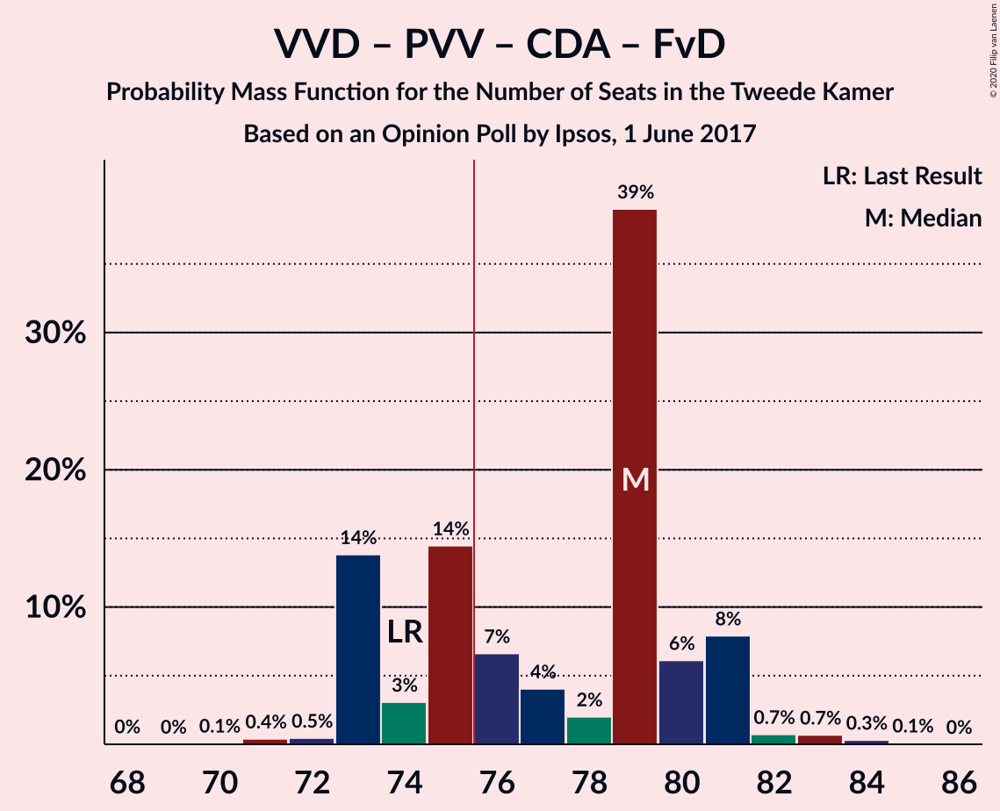

| Number of Seats | Probability | Accumulated | Special Marks |
|:---------------:|:-----------:|:-----------:|:-------------:|
| 68 | 0% | 100% |  |
| 69 | 0% | 99.9% |  |
| 70 | 0.1% | 99.9% |  |
| 71 | 0.4% | 99.8% |  |
| 72 | 0.5% | 99.4% |  |
| 73 | 14% | 99.0% |  |
| 74 | 3% | 85% | Last Result |
| 75 | 14% | 82% |  |
| 76 | 7% | 68% | Median, Majority |
| 77 | 4% | 61% |  |
| 78 | 2% | 57% |  |
| 79 | 39% | 55% |  |
| 80 | 6% | 16% |  |
| 81 | 8% | 10% |  |
| 82 | 0.7% | 2% |  |
| 83 | 0.7% | 1.1% |  |
| 84 | 0.3% | 0.4% |  |
| 85 | 0.1% | 0.1% |  |
| 86 | 0% | 0% |  |

### Volkspartij voor Vrijheid en Democratie – Democraten 66 – Christen-Democratisch Appèl

| Number of Seats | Probability | Accumulated | Special Marks |
|:---------------:|:-----------:|:-----------:|:-------------:|
| 65 | 0.1% | 100% |  |
| 66 | 0.2% | 99.8% |  |
| 67 | 0.7% | 99.7% |  |
| 68 | 2% | 99.0% |  |
| 69 | 4% | 97% |  |
| 70 | 11% | 93% |  |
| 71 | 4% | 82% | Last Result |
| 72 | 6% | 79% |  |
| 73 | 11% | 72% |  |
| 74 | 8% | 61% | Median |
| 75 | 8% | 53% |  |
| 76 | 41% | 46% | Majority |
| 77 | 1.4% | 5% |  |
| 78 | 1.2% | 4% |  |
| 79 | 2% | 3% |  |
| 80 | 0.2% | 0.4% |  |
| 81 | 0.1% | 0.1% |  |
| 82 | 0% | 0% |  |

### Democraten 66 – Christen-Democratisch Appèl – GroenLinks – Socialistische Partij – Partij van de Arbeid – ChristenUnie

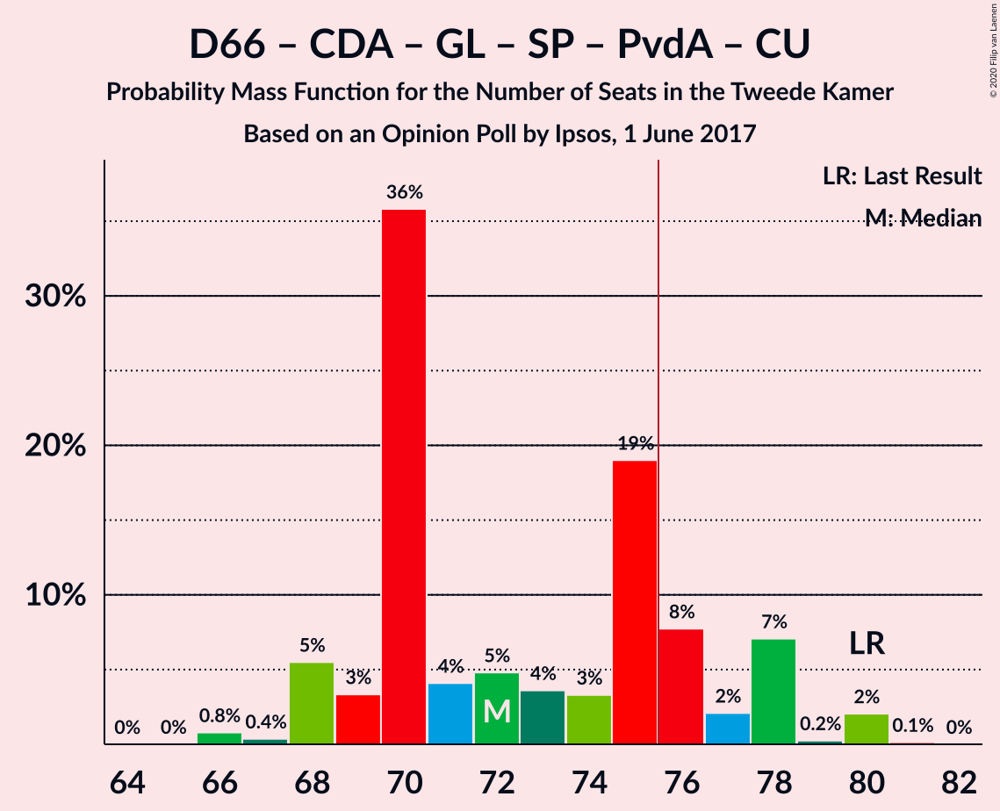

| Number of Seats | Probability | Accumulated | Special Marks |
|:---------------:|:-----------:|:-----------:|:-------------:|
| 66 | 0.8% | 100% |  |
| 67 | 0.4% | 99.2% |  |
| 68 | 5% | 98.8% |  |
| 69 | 3% | 93% |  |
| 70 | 36% | 90% |  |
| 71 | 4% | 54% | Median |
| 72 | 5% | 50% |  |
| 73 | 4% | 45% |  |
| 74 | 3% | 42% |  |
| 75 | 19% | 38% |  |
| 76 | 8% | 19% | Majority |
| 77 | 2% | 12% |  |
| 78 | 7% | 10% |  |
| 79 | 0.2% | 2% |  |
| 80 | 2% | 2% | Last Result |
| 81 | 0.1% | 0.2% |  |
| 82 | 0% | 0% |  |

### Volkspartij voor Vrijheid en Democratie – Partij voor de Vrijheid – Christen-Democratisch Appèl

| Number of Seats | Probability | Accumulated | Special Marks |
|:---------------:|:-----------:|:-----------:|:-------------:|
| 64 | 0.1% | 100% |  |
| 65 | 0.1% | 99.9% |  |
| 66 | 0.5% | 99.8% |  |
| 67 | 0.5% | 99.3% |  |
| 68 | 6% | 98.8% |  |
| 69 | 11% | 93% |  |
| 70 | 13% | 82% |  |
| 71 | 7% | 69% | Median |
| 72 | 4% | 62% | Last Result |
| 73 | 39% | 58% |  |
| 74 | 6% | 19% |  |
| 75 | 5% | 13% |  |
| 76 | 3% | 8% | Majority |
| 77 | 4% | 5% |  |
| 78 | 0.7% | 1.1% |  |
| 79 | 0% | 0.4% |  |
| 80 | 0.2% | 0.4% |  |
| 81 | 0.2% | 0.3% |  |
| 82 | 0% | 0% |  |

### Democraten 66 – Christen-Democratisch Appèl – GroenLinks – Partij van de Arbeid – ChristenUnie

| Number of Seats | Probability | Accumulated | Special Marks |
|:---------------:|:-----------:|:-----------:|:-------------:|
| 57 | 0.1% | 100% |  |
| 58 | 1.2% | 99.9% |  |
| 59 | 4% | 98.7% |  |
| 60 | 0.6% | 95% |  |
| 61 | 3% | 94% |  |
| 62 | 41% | 92% |  |
| 63 | 0.4% | 51% | Median |
| 64 | 10% | 50% |  |
| 65 | 11% | 40% |  |
| 66 | 11% | 29% | Last Result |
| 67 | 4% | 18% |  |
| 68 | 2% | 15% |  |
| 69 | 9% | 12% |  |
| 70 | 1.4% | 3% |  |
| 71 | 0.6% | 1.5% |  |
| 72 | 0% | 0.9% |  |
| 73 | 0.8% | 0.8% |  |
| 74 | 0% | 0% |  |

### Volkspartij voor Vrijheid en Democratie – Christen-Democratisch Appèl – Forum voor Democratie – 50Plus – Staatkundig Gereformeerde Partij

| Number of Seats | Probability | Accumulated | Special Marks |
|:---------------:|:-----------:|:-----------:|:-------------:|
| 58 | 0.1% | 100% |  |
| 59 | 9% | 99.9% |  |
| 60 | 3% | 91% |  |
| 61 | 8% | 89% | Last Result |
| 62 | 2% | 80% |  |
| 63 | 2% | 79% |  |
| 64 | 6% | 77% |  |
| 65 | 1.2% | 71% |  |
| 66 | 18% | 69% | Median |
| 67 | 3% | 51% |  |
| 68 | 8% | 48% |  |
| 69 | 38% | 40% |  |
| 70 | 1.1% | 2% |  |
| 71 | 0.1% | 0.8% |  |
| 72 | 0.3% | 0.7% |  |
| 73 | 0.3% | 0.4% |  |
| 74 | 0% | 0% |  |

### Volkspartij voor Vrijheid en Democratie – Democraten 66 – Partij van de Arbeid

| Number of Seats | Probability | Accumulated | Special Marks |
|:---------------:|:-----------:|:-----------:|:-------------:|
| 54 | 0.1% | 100% |  |
| 55 | 0.1% | 99.9% |  |
| 56 | 0.1% | 99.8% |  |
| 57 | 0.4% | 99.7% |  |
| 58 | 3% | 99.3% |  |
| 59 | 2% | 96% |  |
| 60 | 14% | 94% |  |
| 61 | 8% | 80% | Last Result |
| 62 | 5% | 72% |  |
| 63 | 7% | 68% |  |
| 64 | 6% | 61% | Median |
| 65 | 36% | 55% |  |
| 66 | 11% | 19% |  |
| 67 | 2% | 8% |  |
| 68 | 5% | 6% |  |
| 69 | 0.9% | 1.1% |  |
| 70 | 0.2% | 0.2% |  |
| 71 | 0% | 0% |  |

### Volkspartij voor Vrijheid en Democratie – Christen-Democratisch Appèl – Forum voor Democratie – 50Plus

| Number of Seats | Probability | Accumulated | Special Marks |
|:---------------:|:-----------:|:-----------:|:-------------:|
| 56 | 9% | 100% |  |
| 57 | 0.7% | 91% |  |
| 58 | 3% | 91% | Last Result |
| 59 | 8% | 87% |  |
| 60 | 1.4% | 80% |  |
| 61 | 1.4% | 78% |  |
| 62 | 8% | 77% |  |
| 63 | 9% | 69% | Median |
| 64 | 13% | 60% |  |
| 65 | 5% | 47% |  |
| 66 | 36% | 42% |  |
| 67 | 4% | 5% |  |
| 68 | 0.2% | 0.9% |  |
| 69 | 0.3% | 0.7% |  |
| 70 | 0.1% | 0.4% |  |
| 71 | 0.3% | 0.3% |  |
| 72 | 0% | 0% |  |

### Volkspartij voor Vrijheid en Democratie – Christen-Democratisch Appèl – Forum voor Democratie – Staatkundig Gereformeerde Partij

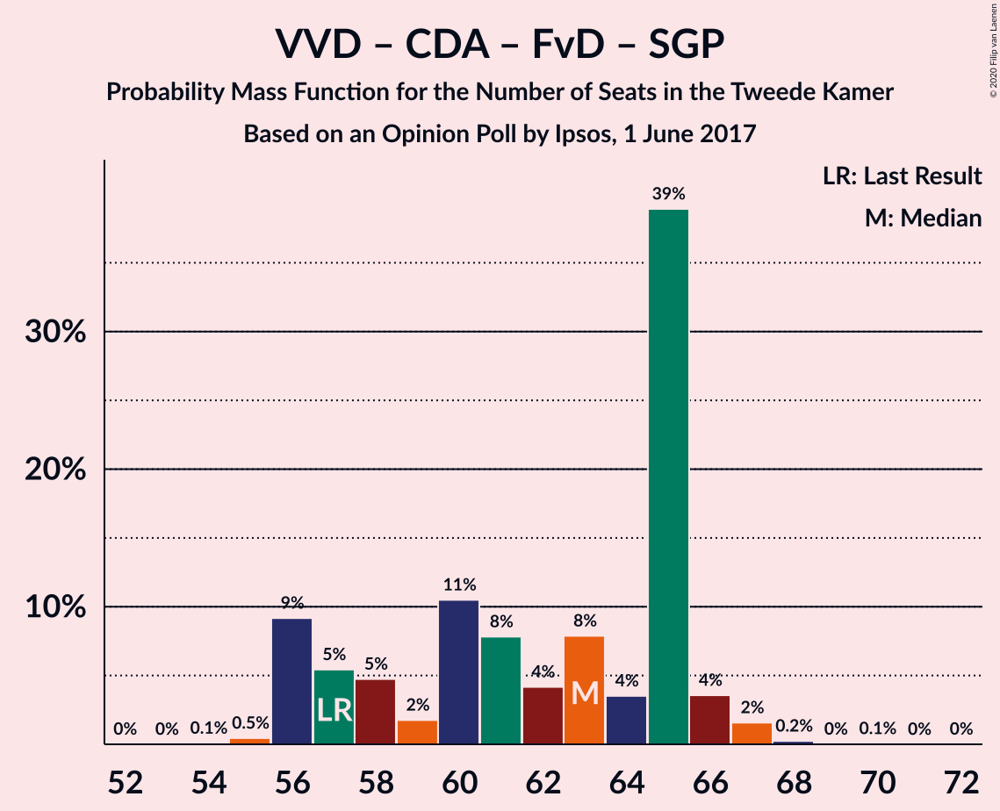

| Number of Seats | Probability | Accumulated | Special Marks |
|:---------------:|:-----------:|:-----------:|:-------------:|
| 54 | 0.1% | 100% |  |
| 55 | 0.5% | 99.9% |  |
| 56 | 9% | 99.4% |  |
| 57 | 5% | 90% | Last Result |
| 58 | 5% | 85% |  |
| 59 | 2% | 80% |  |
| 60 | 11% | 78% |  |
| 61 | 8% | 68% |  |
| 62 | 4% | 60% | Median |
| 63 | 8% | 56% |  |
| 64 | 4% | 48% |  |
| 65 | 39% | 44% |  |
| 66 | 4% | 5% |  |
| 67 | 2% | 2% |  |
| 68 | 0.2% | 0.3% |  |
| 69 | 0% | 0.1% |  |
| 70 | 0.1% | 0.1% |  |
| 71 | 0% | 0% |  |

### Volkspartij voor Vrijheid en Democratie – Christen-Democratisch Appèl – Partij van de Arbeid

| Number of Seats | Probability | Accumulated | Special Marks |
|:---------------:|:-----------:|:-----------:|:-------------:|
| 52 | 0.1% | 100% |  |
| 53 | 0.1% | 99.9% |  |
| 54 | 0.7% | 99.8% |  |
| 55 | 9% | 99.2% |  |
| 56 | 1.1% | 90% |  |
| 57 | 4% | 89% |  |
| 58 | 6% | 85% |  |
| 59 | 6% | 79% |  |
| 60 | 6% | 74% | Median |
| 61 | 39% | 67% | Last Result |
| 62 | 7% | 28% |  |
| 63 | 13% | 21% |  |
| 64 | 3% | 8% |  |
| 65 | 4% | 5% |  |
| 66 | 0.4% | 0.6% |  |
| 67 | 0.1% | 0.2% |  |
| 68 | 0% | 0.1% |  |
| 69 | 0.1% | 0.1% |  |
| 70 | 0% | 0% |  |

### Volkspartij voor Vrijheid en Democratie – Christen-Democratisch Appèl – Forum voor Democratie

| Number of Seats | Probability | Accumulated | Special Marks |
|:---------------:|:-----------:|:-----------:|:-------------:|
| 52 | 0.2% | 100% |  |
| 53 | 9% | 99.8% |  |
| 54 | 0.9% | 91% | Last Result |
| 55 | 6% | 90% |  |
| 56 | 5% | 84% |  |
| 57 | 2% | 79% |  |
| 58 | 12% | 77% |  |
| 59 | 8% | 65% | Median |
| 60 | 9% | 57% |  |
| 61 | 6% | 48% |  |
| 62 | 36% | 43% |  |
| 63 | 2% | 7% |  |
| 64 | 4% | 4% |  |
| 65 | 0.6% | 0.7% |  |
| 66 | 0% | 0.1% |  |
| 67 | 0.1% | 0.1% |  |
| 68 | 0% | 0% |  |

### Volkspartij voor Vrijheid en Democratie – Christen-Democratisch Appèl

| Number of Seats | Probability | Accumulated | Special Marks |
|:---------------:|:-----------:|:-----------:|:-------------:|
| 46 | 0.1% | 100% |  |
| 47 | 0.3% | 99.9% |  |
| 48 | 0.7% | 99.6% |  |
| 49 | 9% | 98.9% |  |
| 50 | 6% | 90% |  |
| 51 | 3% | 84% |  |
| 52 | 2% | 81% | Last Result |
| 53 | 15% | 78% |  |
| 54 | 4% | 63% | Median |
| 55 | 9% | 59% |  |
| 56 | 39% | 50% |  |
| 57 | 6% | 11% |  |
| 58 | 3% | 5% |  |
| 59 | 0.7% | 1.3% |  |
| 60 | 0.4% | 0.6% |  |
| 61 | 0.1% | 0.1% |  |
| 62 | 0% | 0% |  |

### Democraten 66 – Christen-Democratisch Appèl – Partij van de Arbeid

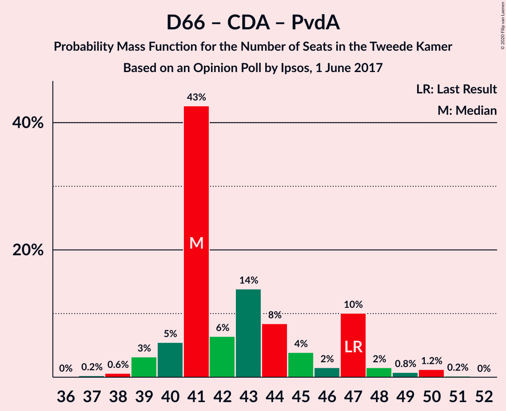

| Number of Seats | Probability | Accumulated | Special Marks |
|:---------------:|:-----------:|:-----------:|:-------------:|
| 37 | 0.2% | 100% |  |
| 38 | 0.6% | 99.7% |  |
| 39 | 3% | 99.1% |  |
| 40 | 5% | 96% |  |
| 41 | 43% | 90% |  |
| 42 | 6% | 48% | Median |
| 43 | 14% | 41% |  |
| 44 | 8% | 28% |  |
| 45 | 4% | 19% |  |
| 46 | 2% | 15% |  |
| 47 | 10% | 14% | Last Result |
| 48 | 2% | 4% |  |
| 49 | 0.8% | 2% |  |
| 50 | 1.2% | 1.4% |  |
| 51 | 0.2% | 0.2% |  |
| 52 | 0% | 0% |  |

### Volkspartij voor Vrijheid en Democratie – Partij van de Arbeid

| Number of Seats | Probability | Accumulated | Special Marks |
|:---------------:|:-----------:|:-----------:|:-------------:|
| 36 | 0.1% | 100% |  |
| 37 | 0.2% | 99.9% |  |
| 38 | 0.8% | 99.7% |  |
| 39 | 10% | 98.9% |  |
| 40 | 3% | 89% |  |
| 41 | 5% | 86% |  |
| 42 | 6% | 80% | Last Result |
| 43 | 9% | 74% |  |
| 44 | 3% | 65% | Median |
| 45 | 44% | 62% |  |
| 46 | 8% | 18% |  |
| 47 | 7% | 10% |  |
| 48 | 2% | 3% |  |
| 49 | 0.1% | 0.3% |  |
| 50 | 0.1% | 0.2% |  |
| 51 | 0.1% | 0.1% |  |
| 52 | 0% | 0% |  |

### Democraten 66 – Christen-Democratisch Appèl

| Number of Seats | Probability | Accumulated | Special Marks |
|:---------------:|:-----------:|:-----------:|:-------------:|
| 30 | 0.1% | 100% |  |
| 31 | 0.5% | 99.9% |  |
| 32 | 1.3% | 99.3% |  |
| 33 | 3% | 98% |  |
| 34 | 11% | 95% |  |
| 35 | 6% | 84% |  |
| 36 | 42% | 78% | Median |
| 37 | 19% | 36% |  |
| 38 | 2% | 17% | Last Result |
| 39 | 11% | 15% |  |
| 40 | 0.9% | 4% |  |
| 41 | 0.5% | 3% |  |
| 42 | 1.0% | 2% |  |
| 43 | 1.1% | 1.3% |  |
| 44 | 0.2% | 0.2% |  |
| 45 | 0% | 0% |  |

### Christen-Democratisch Appèl – Partij van de Arbeid – ChristenUnie

| Number of Seats | Probability | Accumulated | Special Marks |
|:---------------:|:-----------:|:-----------:|:-------------:|
| 24 | 0.1% | 100% |  |
| 25 | 1.1% | 99.9% |  |
| 26 | 5% | 98.8% |  |
| 27 | 2% | 94% |  |
| 28 | 50% | 91% |  |
| 29 | 5% | 42% | Median |
| 30 | 4% | 37% |  |
| 31 | 6% | 33% |  |
| 32 | 15% | 27% |  |
| 33 | 2% | 12% | Last Result |
| 34 | 7% | 10% |  |
| 35 | 1.4% | 3% |  |
| 36 | 0.4% | 1.2% |  |
| 37 | 0.7% | 0.8% |  |
| 38 | 0.1% | 0.1% |  |
| 39 | 0% | 0% |  |

### Christen-Democratisch Appèl – Partij van de Arbeid

| Number of Seats | Probability | Accumulated | Special Marks |
|:---------------:|:-----------:|:-----------:|:-------------:|
| 19 | 0.8% | 100% |  |
| 20 | 1.5% | 99.2% |  |
| 21 | 40% | 98% |  |
| 22 | 19% | 58% | Median |
| 23 | 4% | 39% |  |
| 24 | 10% | 35% |  |
| 25 | 6% | 25% |  |
| 26 | 13% | 19% |  |
| 27 | 3% | 6% |  |
| 28 | 2% | 3% | Last Result |
| 29 | 1.2% | 1.5% |  |
| 30 | 0.2% | 0.2% |  |
| 31 | 0.1% | 0.1% |  |
| 32 | 0% | 0% |  |

## Technical Information

### Opinion Poll

+ **Polling firm:** Ipsos
+ **Commissioner(s):** —
+ **Fieldwork period:** 1 June 2017

### Calculations

+ **Sample size:** 1000
+ **Simulations done:** 1,048,576
+ **Error estimate:** 3.69%

