# Opinion Poll by Ipsos, 15 June 2017

<a href="#voting-intentions">Voting Intentions</a> | <a href="#seats">Seats</a> | <a href="#coalitions">Coalitions</a> | <a href="#technical-information">Technical Information</a>

## Voting Intentions

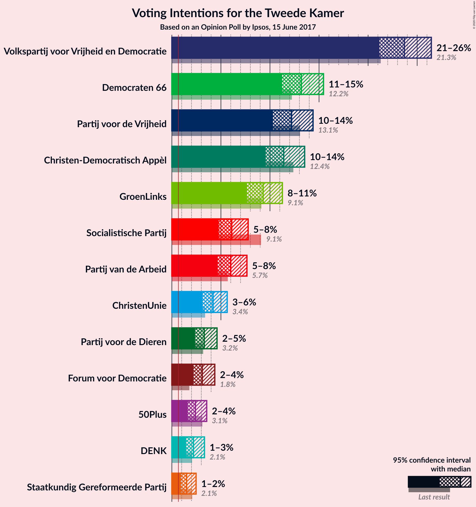

### Confidence Intervals

| Party | Last Result | Poll Result | 80% Confidence Interval | 90% Confidence Interval | 95% Confidence Interval | 99% Confidence Interval |
|:-----:|:-----------:|:-----------:|:-----------------------:|:-----------------------:|:-----------------------:|:-----------------------:|
| Volkspartij voor Vrijheid en Democratie | 21.3% | 23.7% | 22.0–25.5% |21.6–26.0% |21.2–26.4% |20.4–27.3% |
| Democraten 66 | 12.2% | 13.2% | 11.9–14.7% |11.6–15.1% |11.2–15.5% |10.7–16.2% |
| Partij voor de Vrijheid | 13.1% | 12.2% | 11.0–13.6% |10.6–14.0% |10.3–14.4% |9.7–15.1% |
| Christen-Democratisch Appèl | 12.4% | 11.4% | 10.2–12.8% |9.9–13.2% |9.6–13.5% |9.0–14.2% |
| GroenLinks | 9.1% | 9.3% | 8.2–10.6% |7.9–10.9% |7.7–11.3% |7.2–11.9% |
| Socialistische Partij | 9.1% | 6.1% | 5.2–7.2% |5.0–7.5% |4.8–7.8% |4.4–8.3% |
| Partij van de Arbeid | 5.7% | 6.0% | 5.1–7.1% |4.9–7.4% |4.7–7.7% |4.3–8.2% |
| ChristenUnie | 3.4% | 4.2% | 3.5–5.1% |3.3–5.4% |3.1–5.6% |2.8–6.1% |
| Partij voor de Dieren | 3.2% | 3.3% | 2.7–4.1% |2.5–4.4% |2.4–4.6% |2.1–5.0% |
| Forum voor Democratie | 1.8% | 3.1% | 2.5–3.9% |2.3–4.2% |2.2–4.4% |1.9–4.8% |
| 50Plus | 3.1% | 2.4% | 1.9–3.2% |1.7–3.4% |1.6–3.6% |1.4–3.9% |
| DENK | 2.1% | 2.2% | 1.7–2.9% |1.6–3.1% |1.4–3.3% |1.2–3.7% |
| Staatkundig Gereformeerde Partij | 2.1% | 1.5% | 1.1–2.1% |1.0–2.3% |0.9–2.5% |0.7–2.8% |

*Note:* The poll result column reflects the actual value used in the calculations. Published results may vary slightly, and in addition be rounded to fewer digits.

## Seats

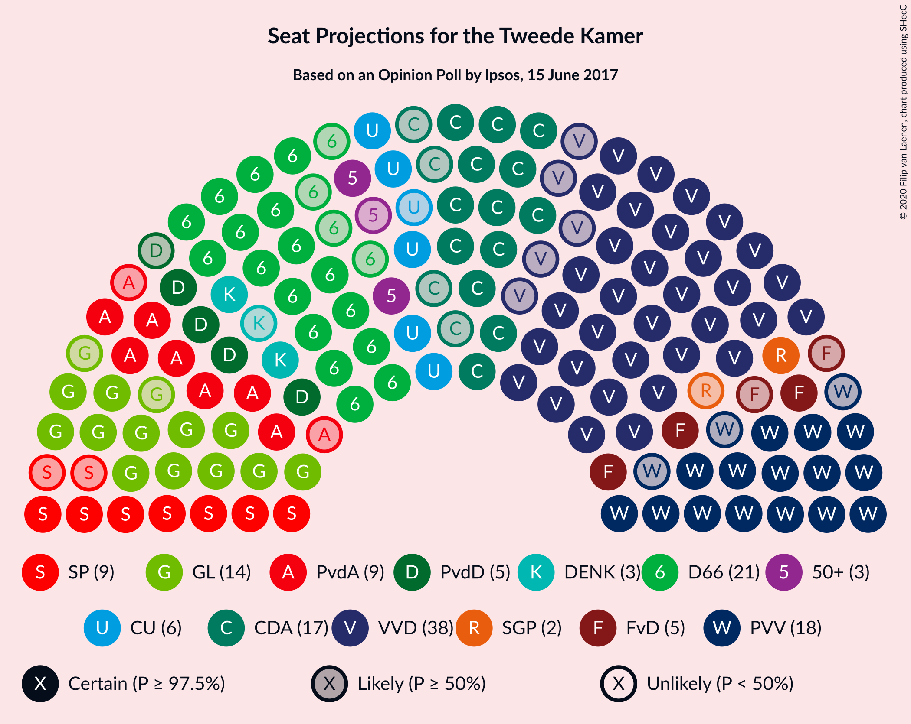

### Confidence Intervals

| Party | Last Result | Median | 80% Confidence Interval | 90% Confidence Interval | 95% Confidence Interval | 99% Confidence Interval |
|:-----:|:-----------:|:------:|:-----------------------:|:-----------------------:|:-----------------------:|:-----------------------:|
| <a href="#volkspartij-voor-vrijheid-en-democratie">Volkspartij voor Vrijheid en Democratie</a> | 33 | 38 | 34–40 |33–40 |33–40 |32–41 |
| <a href="#democraten-66">Democraten 66</a> | 19 | 21 | 17–23 |17–23 |17–23 |16–25 |
| <a href="#partij-voor-de-vrijheid">Partij voor de Vrijheid</a> | 20 | 18 | 17–19 |15–21 |15–21 |15–23 |
| <a href="#christen-democratisch-appèl">Christen-Democratisch Appèl</a> | 19 | 17 | 15–19 |14–20 |13–21 |13–21 |
| <a href="#groenlinks">GroenLinks</a> | 14 | 14 | 12–16 |12–17 |12–17 |12–18 |
| <a href="#socialistische-partij">Socialistische Partij</a> | 14 | 9 | 8–10 |8–11 |7–11 |6–12 |
| <a href="#partij-van-de-arbeid">Partij van de Arbeid</a> | 9 | 9 | 8–10 |7–10 |7–11 |6–11 |
| <a href="#christenunie">ChristenUnie</a> | 5 | 6 | 5–8 |5–9 |5–9 |4–9 |
| <a href="#partij-voor-de-dieren">Partij voor de Dieren</a> | 5 | 5 | 4–5 |4–6 |4–7 |3–7 |
| <a href="#forum-voor-democratie">Forum voor Democratie</a> | 2 | 5 | 4–5 |4–5 |3–6 |3–7 |
| <a href="#50plus">50Plus</a> | 4 | 3 | 2–4 |2–4 |2–4 |2–5 |
| <a href="#denk">DENK</a> | 3 | 3 | 2–4 |2–4 |2–4 |2–5 |
| <a href="#staatkundig-gereformeerde-partij">Staatkundig Gereformeerde Partij</a> | 3 | 2 | 1–3 |1–3 |1–3 |1–4 |

### Volkspartij voor Vrijheid en Democratie

*For a full overview of the results for this party, see the [Volkspartij voor Vrijheid en Democratie](party-volkspartijvoorvrijheidendemocratie.html) page.*

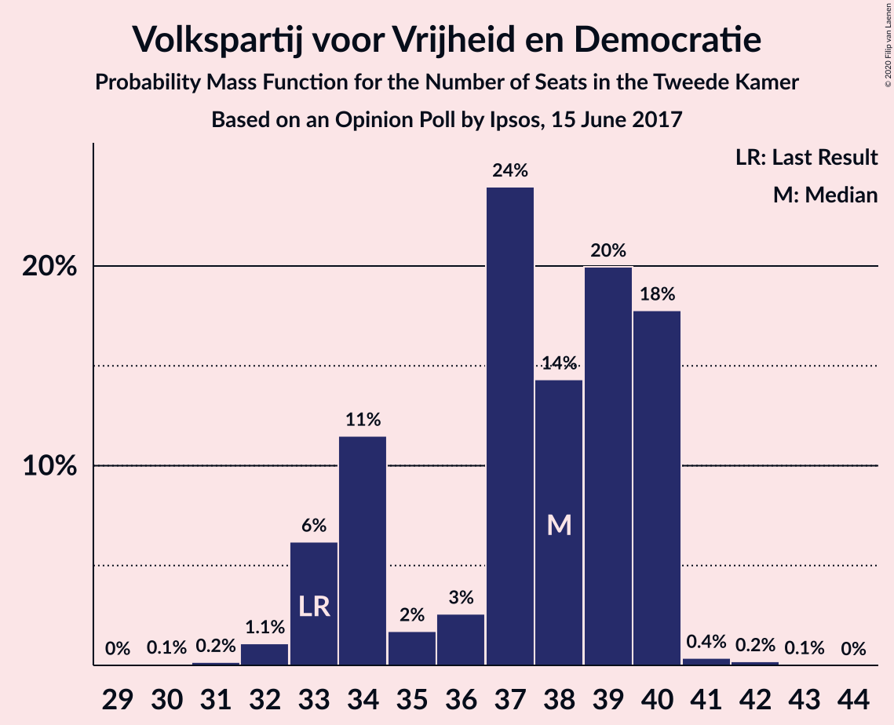

| Number of Seats | Probability | Accumulated | Special Marks |
|:---------------:|:-----------:|:-----------:|:-------------:|
| 30 | 0.1% | 100% |  |
| 31 | 0.2% | 99.9% |  |
| 32 | 1.1% | 99.7% |  |
| 33 | 6% | 98.6% | Last Result |
| 34 | 11% | 92% |  |
| 35 | 2% | 81% |  |
| 36 | 3% | 79% |  |
| 37 | 24% | 77% |  |
| 38 | 14% | 53% | Median |
| 39 | 20% | 38% |  |
| 40 | 18% | 18% |  |
| 41 | 0.4% | 0.6% |  |
| 42 | 0.2% | 0.3% |  |
| 43 | 0.1% | 0.1% |  |
| 44 | 0% | 0% |  |

### Democraten 66

*For a full overview of the results for this party, see the [Democraten 66](party-democraten66.html) page.*

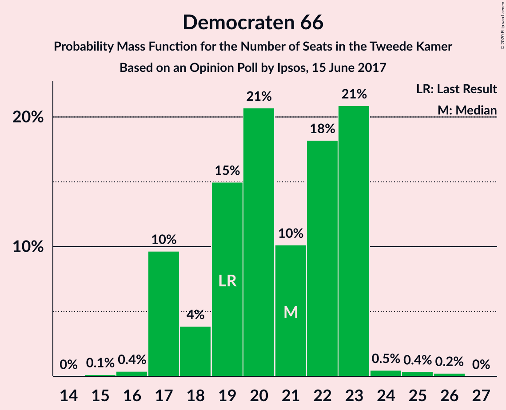

| Number of Seats | Probability | Accumulated | Special Marks |
|:---------------:|:-----------:|:-----------:|:-------------:|
| 15 | 0.1% | 100% |  |
| 16 | 0.4% | 99.9% |  |
| 17 | 10% | 99.5% |  |
| 18 | 4% | 90% |  |
| 19 | 15% | 86% | Last Result |
| 20 | 21% | 71% |  |
| 21 | 10% | 50% | Median |
| 22 | 18% | 40% |  |
| 23 | 21% | 22% |  |
| 24 | 0.5% | 1.1% |  |
| 25 | 0.4% | 0.6% |  |
| 26 | 0.2% | 0.3% |  |
| 27 | 0% | 0% |  |

### Partij voor de Vrijheid

*For a full overview of the results for this party, see the [Partij voor de Vrijheid](party-partijvoordevrijheid.html) page.*

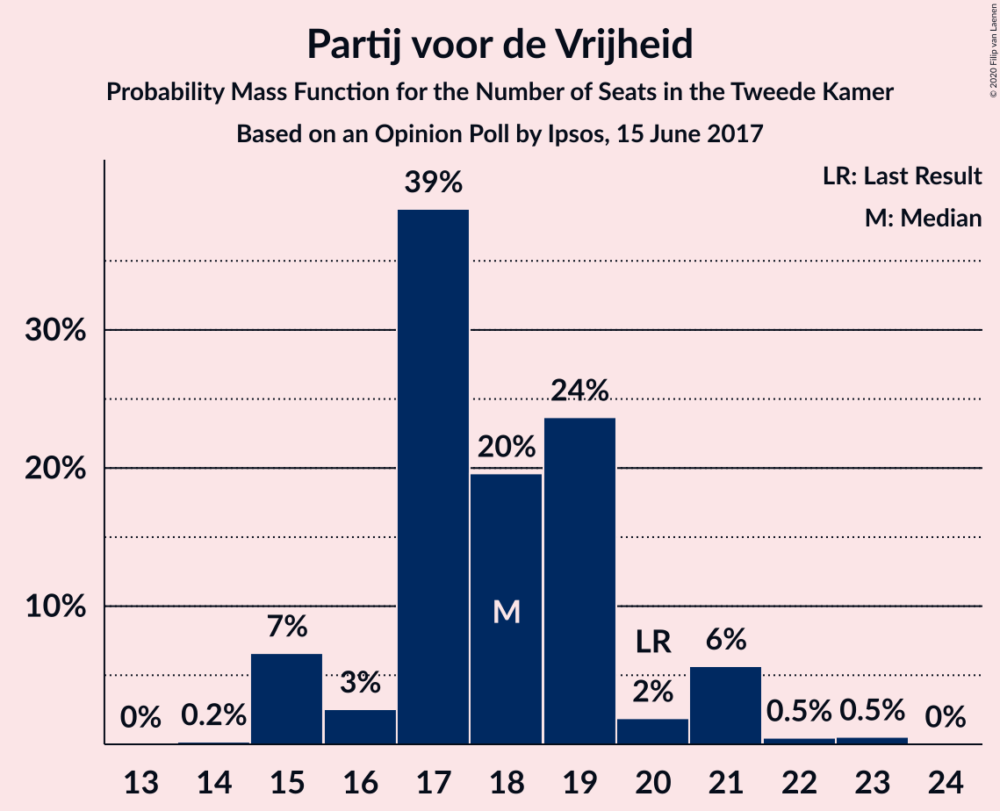

| Number of Seats | Probability | Accumulated | Special Marks |
|:---------------:|:-----------:|:-----------:|:-------------:|
| 14 | 0.2% | 100% |  |
| 15 | 7% | 99.8% |  |
| 16 | 3% | 93% |  |
| 17 | 39% | 91% |  |
| 18 | 20% | 52% | Median |
| 19 | 24% | 32% |  |
| 20 | 2% | 9% | Last Result |
| 21 | 6% | 7% |  |
| 22 | 0.5% | 1.1% |  |
| 23 | 0.5% | 0.6% |  |
| 24 | 0% | 0% |  |

### Christen-Democratisch Appèl

*For a full overview of the results for this party, see the [Christen-Democratisch Appèl](party-christen-democratischappèl.html) page.*

| Number of Seats | Probability | Accumulated | Special Marks |
|:---------------:|:-----------:|:-----------:|:-------------:|
| 13 | 5% | 100% |  |
| 14 | 3% | 95% |  |
| 15 | 7% | 92% |  |
| 16 | 24% | 85% |  |
| 17 | 29% | 61% | Median |
| 18 | 15% | 32% |  |
| 19 | 13% | 18% | Last Result |
| 20 | 2% | 5% |  |
| 21 | 3% | 3% |  |
| 22 | 0.2% | 0.3% |  |
| 23 | 0.1% | 0.1% |  |
| 24 | 0% | 0% |  |

### GroenLinks

*For a full overview of the results for this party, see the [GroenLinks](party-groenlinks.html) page.*

| Number of Seats | Probability | Accumulated | Special Marks |
|:---------------:|:-----------:|:-----------:|:-------------:|
| 10 | 0.1% | 100% |  |
| 11 | 0.3% | 99.8% |  |
| 12 | 27% | 99.5% |  |
| 13 | 22% | 73% |  |
| 14 | 18% | 51% | Last Result, Median |
| 15 | 11% | 32% |  |
| 16 | 14% | 22% |  |
| 17 | 7% | 8% |  |
| 18 | 0.3% | 0.5% |  |
| 19 | 0.3% | 0.3% |  |
| 20 | 0% | 0% |  |

### Socialistische Partij

*For a full overview of the results for this party, see the [Socialistische Partij](party-socialistischepartij.html) page.*

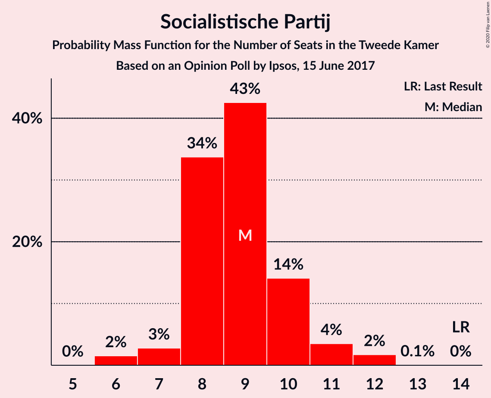

| Number of Seats | Probability | Accumulated | Special Marks |
|:---------------:|:-----------:|:-----------:|:-------------:|
| 6 | 2% | 100% |  |
| 7 | 3% | 98% |  |
| 8 | 34% | 96% |  |
| 9 | 43% | 62% | Median |
| 10 | 14% | 19% |  |
| 11 | 4% | 5% |  |
| 12 | 2% | 2% |  |
| 13 | 0.1% | 0.1% |  |
| 14 | 0% | 0% | Last Result |

### Partij van de Arbeid

*For a full overview of the results for this party, see the [Partij van de Arbeid](party-partijvandearbeid.html) page.*

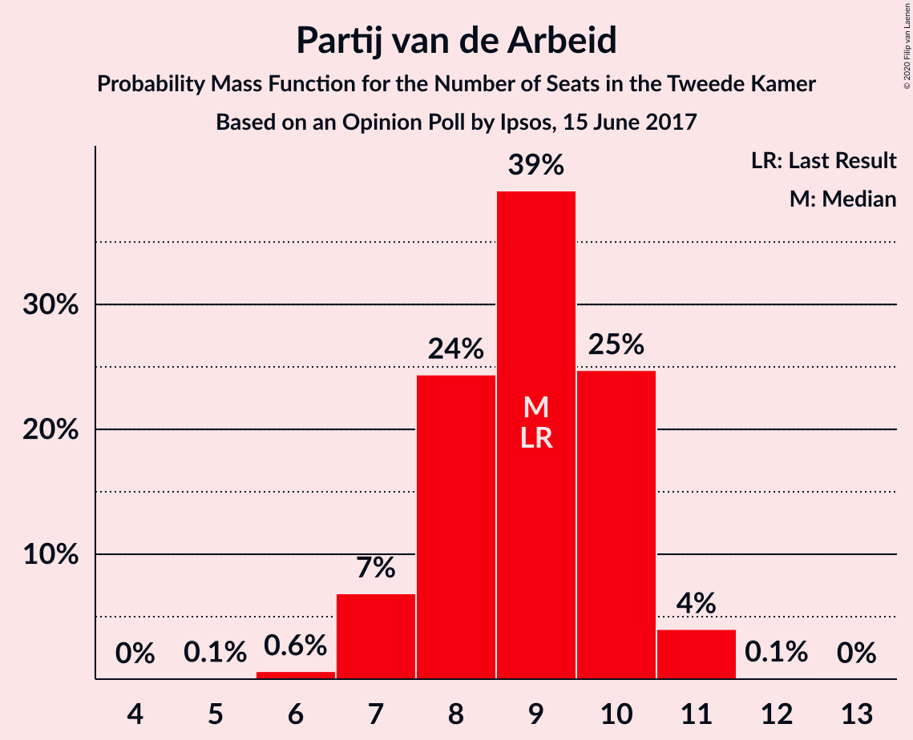

| Number of Seats | Probability | Accumulated | Special Marks |
|:---------------:|:-----------:|:-----------:|:-------------:|
| 5 | 0.1% | 100% |  |
| 6 | 0.6% | 99.9% |  |
| 7 | 7% | 99.3% |  |
| 8 | 24% | 92% |  |
| 9 | 39% | 68% | Last Result, Median |
| 10 | 25% | 29% |  |
| 11 | 4% | 4% |  |
| 12 | 0.1% | 0.2% |  |
| 13 | 0% | 0% |  |

### ChristenUnie

*For a full overview of the results for this party, see the [ChristenUnie](party-christenunie.html) page.*

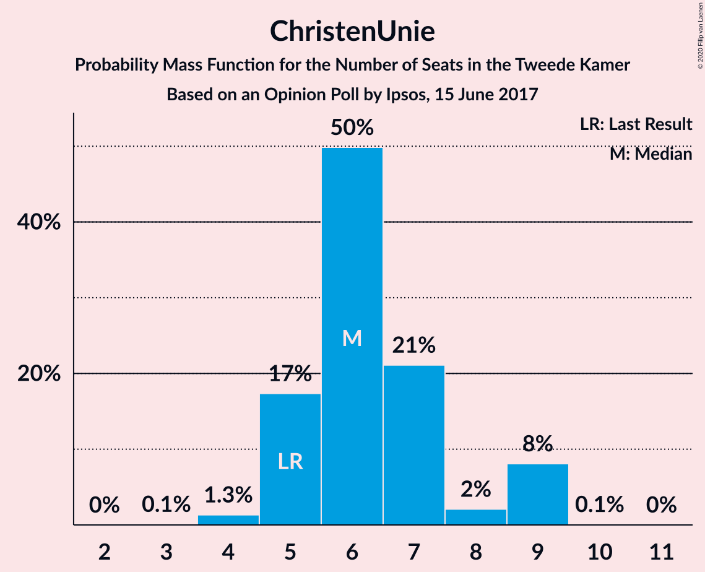

| Number of Seats | Probability | Accumulated | Special Marks |
|:---------------:|:-----------:|:-----------:|:-------------:|
| 3 | 0.1% | 100% |  |
| 4 | 1.3% | 99.9% |  |
| 5 | 17% | 98.6% | Last Result |
| 6 | 50% | 81% | Median |
| 7 | 21% | 31% |  |
| 8 | 2% | 10% |  |
| 9 | 8% | 8% |  |
| 10 | 0.1% | 0.1% |  |
| 11 | 0% | 0% |  |

### Partij voor de Dieren

*For a full overview of the results for this party, see the [Partij voor de Dieren](party-partijvoordedieren.html) page.*

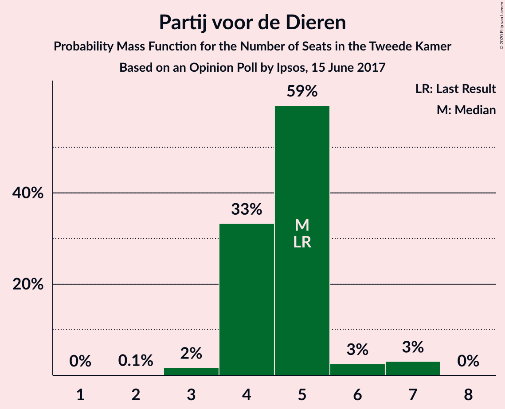

| Number of Seats | Probability | Accumulated | Special Marks |
|:---------------:|:-----------:|:-----------:|:-------------:|
| 2 | 0.1% | 100% |  |
| 3 | 2% | 99.9% |  |
| 4 | 33% | 98% |  |
| 5 | 59% | 65% | Last Result, Median |
| 6 | 3% | 6% |  |
| 7 | 3% | 3% |  |
| 8 | 0% | 0% |  |

### Forum voor Democratie

*For a full overview of the results for this party, see the [Forum voor Democratie](party-forumvoordemocratie.html) page.*

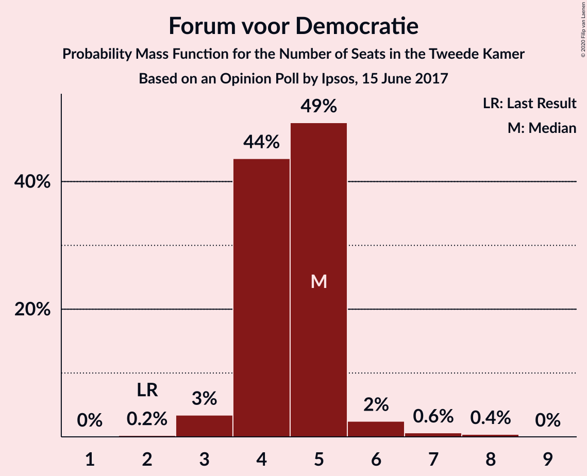

| Number of Seats | Probability | Accumulated | Special Marks |
|:---------------:|:-----------:|:-----------:|:-------------:|
| 2 | 0.2% | 100% | Last Result |
| 3 | 3% | 99.8% |  |
| 4 | 44% | 96% |  |
| 5 | 49% | 53% | Median |
| 6 | 2% | 4% |  |
| 7 | 0.6% | 1.0% |  |
| 8 | 0.4% | 0.4% |  |
| 9 | 0% | 0% |  |

### 50Plus

*For a full overview of the results for this party, see the [50Plus](party-50plus.html) page.*

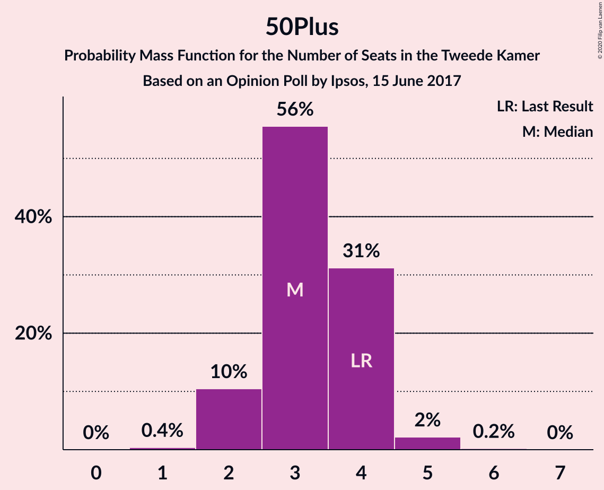

| Number of Seats | Probability | Accumulated | Special Marks |
|:---------------:|:-----------:|:-----------:|:-------------:|
| 1 | 0.4% | 100% |  |
| 2 | 10% | 99.6% |  |
| 3 | 56% | 89% | Median |
| 4 | 31% | 34% | Last Result |
| 5 | 2% | 2% |  |
| 6 | 0.2% | 0.2% |  |
| 7 | 0% | 0% |  |

### DENK

*For a full overview of the results for this party, see the [DENK](party-denk.html) page.*

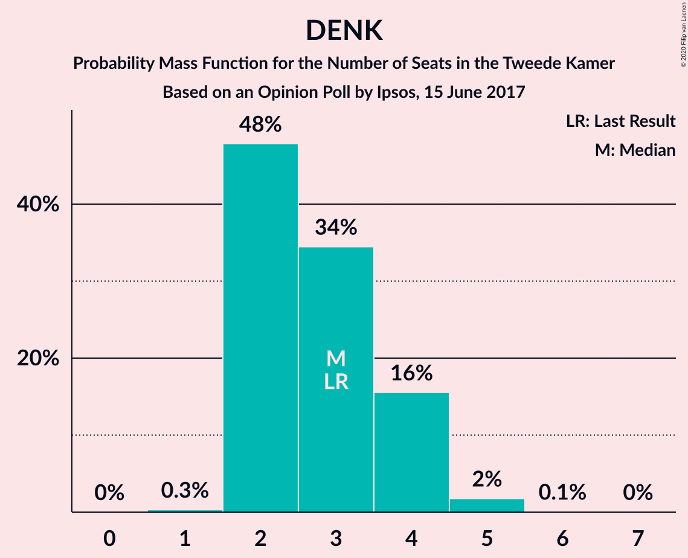

| Number of Seats | Probability | Accumulated | Special Marks |
|:---------------:|:-----------:|:-----------:|:-------------:|
| 1 | 0.3% | 100% |  |
| 2 | 48% | 99.7% |  |
| 3 | 34% | 52% | Last Result, Median |
| 4 | 16% | 17% |  |
| 5 | 2% | 2% |  |
| 6 | 0.1% | 0.1% |  |
| 7 | 0% | 0% |  |

### Staatkundig Gereformeerde Partij

*For a full overview of the results for this party, see the [Staatkundig Gereformeerde Partij](party-staatkundiggereformeerdepartij.html) page.*

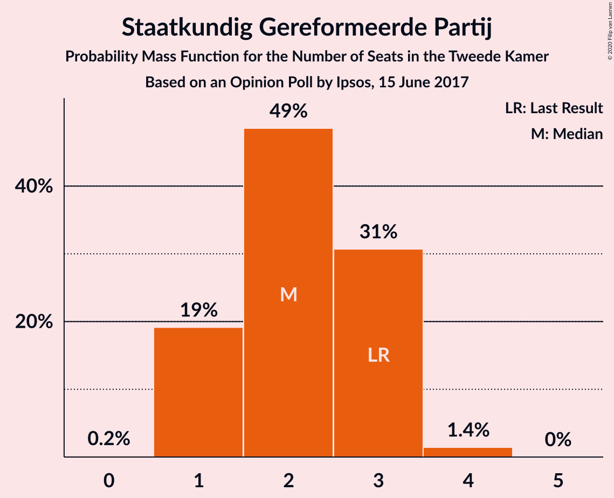

| Number of Seats | Probability | Accumulated | Special Marks |
|:---------------:|:-----------:|:-----------:|:-------------:|
| 0 | 0.2% | 100% |  |
| 1 | 19% | 99.8% |  |
| 2 | 49% | 81% | Median |
| 3 | 31% | 32% | Last Result |
| 4 | 1.4% | 1.5% |  |
| 5 | 0% | 0% |  |

## Coalitions

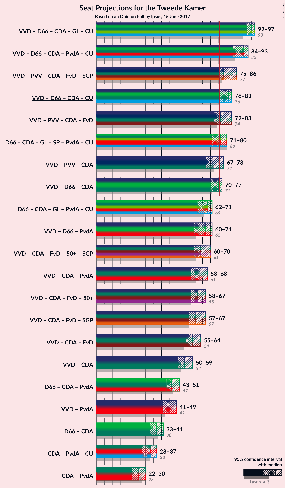

### Confidence Intervals

| Coalition | Last Result | Median | Majority? | 80% Confidence Interval | 90% Confidence Interval | 95% Confidence Interval | 99% Confidence Interval |
|:---------:|:-----------:|:------:|:---------:|:-----------------------:|:-----------------------:|:-----------------------:|:-----------------------:|
| Volkspartij voor Vrijheid en Democratie – Democraten 66 – Christen-Democratisch Appèl – GroenLinks – ChristenUnie | 90 | 95 | 100% | 93–97 | 93–97 | 92–97 | 91–97 |
| Volkspartij voor Vrijheid en Democratie – Democraten 66 – Christen-Democratisch Appèl – Partij van de Arbeid – ChristenUnie | 85 | 90 | 100% | 87–93 | 84–93 | 84–93 | 83–94 |
| Volkspartij voor Vrijheid en Democratie – Partij voor de Vrijheid – Christen-Democratisch Appèl – Forum voor Democratie – Staatkundig Gereformeerde Partij | 77 | 78 | 91% | 76–84 | 75–86 | 75–86 | 73–86 |
| Volkspartij voor Vrijheid en Democratie – Democraten 66 – Christen-Democratisch Appèl – ChristenUnie | 76 | 81 | 99.3% | 78–83 | 76–83 | 76–83 | 75–85 |
| Volkspartij voor Vrijheid en Democratie – Partij voor de Vrijheid – Christen-Democratisch Appèl – Forum voor Democratie | 74 | 76 | 73% | 73–82 | 72–83 | 72–83 | 71–83 |
| Democraten 66 – Christen-Democratisch Appèl – GroenLinks – Socialistische Partij – Partij van de Arbeid – ChristenUnie | 80 | 76 | 61% | 71–79 | 71–79 | 71–80 | 70–82 |
| Volkspartij voor Vrijheid en Democratie – Partij voor de Vrijheid – Christen-Democratisch Appèl | 72 | 71 | 15% | 69–77 | 67–78 | 67–78 | 66–78 |
| Volkspartij voor Vrijheid en Democratie – Democraten 66 – Christen-Democratisch Appèl | 71 | 75 | 48% | 72–77 | 70–77 | 70–77 | 69–80 |
| Democraten 66 – Christen-Democratisch Appèl – GroenLinks – Partij van de Arbeid – ChristenUnie | 66 | 68 | 0% | 63–70 | 63–70 | 62–71 | 62–72 |
| Volkspartij voor Vrijheid en Democratie – Democraten 66 – Partij van de Arbeid | 61 | 67 | 0% | 62–70 | 61–71 | 60–71 | 58–71 |
| Volkspartij voor Vrijheid en Democratie – Christen-Democratisch Appèl – Forum voor Democratie – 50Plus – Staatkundig Gereformeerde Partij | 61 | 64 | 0% | 62–69 | 61–70 | 60–70 | 58–70 |
| Volkspartij voor Vrijheid en Democratie – Christen-Democratisch Appèl – Partij van de Arbeid | 61 | 63 | 0% | 60–67 | 58–68 | 58–68 | 57–69 |
| Volkspartij voor Vrijheid en Democratie – Christen-Democratisch Appèl – Forum voor Democratie – 50Plus | 58 | 62 | 0% | 59–67 | 59–67 | 58–67 | 56–68 |
| Volkspartij voor Vrijheid en Democratie – Christen-Democratisch Appèl – Forum voor Democratie – Staatkundig Gereformeerde Partij | 57 | 61 | 0% | 58–65 | 57–67 | 57–67 | 55–67 |
| Volkspartij voor Vrijheid en Democratie – Christen-Democratisch Appèl – Forum voor Democratie | 54 | 59 | 0% | 56–63 | 55–64 | 55–64 | 53–64 |
| Volkspartij voor Vrijheid en Democratie – Christen-Democratisch Appèl | 52 | 54 | 0% | 52–58 | 50–59 | 50–59 | 49–60 |
| Democraten 66 – Christen-Democratisch Appèl – Partij van de Arbeid | 47 | 46 | 0% | 43–50 | 43–50 | 43–51 | 41–52 |
| Volkspartij voor Vrijheid en Democratie – Partij van de Arbeid | 42 | 47 | 0% | 42–49 | 41–49 | 41–49 | 40–50 |
| Democraten 66 – Christen-Democratisch Appèl | 38 | 37 | 0% | 35–40 | 34–40 | 33–41 | 33–42 |
| Christen-Democratisch Appèl – Partij van de Arbeid – ChristenUnie | 33 | 33 | 0% | 30–34 | 28–35 | 28–37 | 28–38 |
| Christen-Democratisch Appèl – Partij van de Arbeid | 28 | 26 | 0% | 24–28 | 22–29 | 22–30 | 22–32 |

### Volkspartij voor Vrijheid en Democratie – Democraten 66 – Christen-Democratisch Appèl – GroenLinks – ChristenUnie

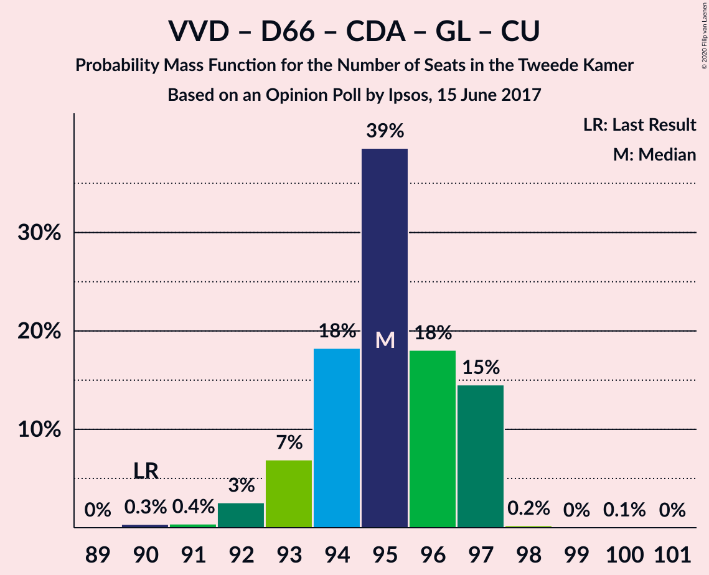

| Number of Seats | Probability | Accumulated | Special Marks |
|:---------------:|:-----------:|:-----------:|:-------------:|
| 89 | 0% | 100% |  |
| 90 | 0.3% | 99.9% | Last Result |
| 91 | 0.4% | 99.6% |  |
| 92 | 3% | 99.2% |  |
| 93 | 7% | 97% |  |
| 94 | 18% | 90% |  |
| 95 | 39% | 71% |  |
| 96 | 18% | 33% | Median |
| 97 | 15% | 15% |  |
| 98 | 0.2% | 0.3% |  |
| 99 | 0% | 0.1% |  |
| 100 | 0.1% | 0.1% |  |
| 101 | 0% | 0% |  |

### Volkspartij voor Vrijheid en Democratie – Democraten 66 – Christen-Democratisch Appèl – Partij van de Arbeid – ChristenUnie

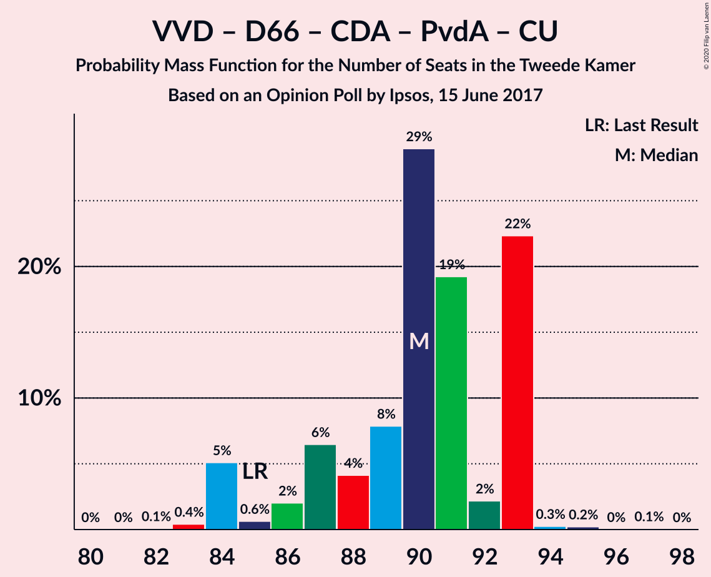

| Number of Seats | Probability | Accumulated | Special Marks |
|:---------------:|:-----------:|:-----------:|:-------------:|
| 82 | 0.1% | 100% |  |
| 83 | 0.4% | 99.9% |  |
| 84 | 5% | 99.5% |  |
| 85 | 0.6% | 94% | Last Result |
| 86 | 2% | 94% |  |
| 87 | 6% | 92% |  |
| 88 | 4% | 85% |  |
| 89 | 8% | 81% |  |
| 90 | 29% | 73% |  |
| 91 | 19% | 44% | Median |
| 92 | 2% | 25% |  |
| 93 | 22% | 23% |  |
| 94 | 0.3% | 0.6% |  |
| 95 | 0.2% | 0.3% |  |
| 96 | 0% | 0.1% |  |
| 97 | 0.1% | 0.1% |  |
| 98 | 0% | 0% |  |

### Volkspartij voor Vrijheid en Democratie – Partij voor de Vrijheid – Christen-Democratisch Appèl – Forum voor Democratie – Staatkundig Gereformeerde Partij

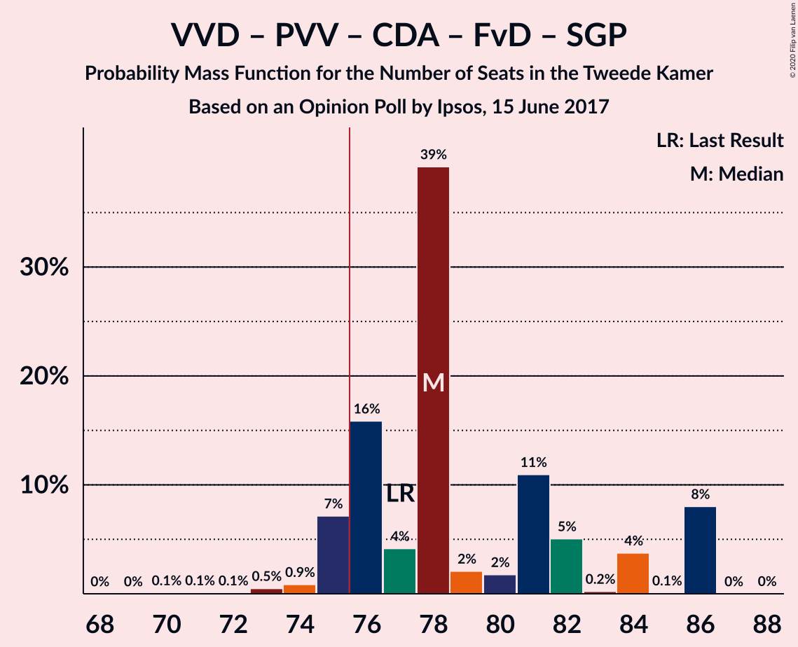

| Number of Seats | Probability | Accumulated | Special Marks |
|:---------------:|:-----------:|:-----------:|:-------------:|
| 70 | 0.1% | 100% |  |
| 71 | 0.1% | 99.9% |  |
| 72 | 0.1% | 99.8% |  |
| 73 | 0.5% | 99.7% |  |
| 74 | 0.9% | 99.2% |  |
| 75 | 7% | 98% |  |
| 76 | 16% | 91% | Majority |
| 77 | 4% | 75% | Last Result |
| 78 | 39% | 71% |  |
| 79 | 2% | 32% |  |
| 80 | 2% | 30% | Median |
| 81 | 11% | 28% |  |
| 82 | 5% | 17% |  |
| 83 | 0.2% | 12% |  |
| 84 | 4% | 12% |  |
| 85 | 0.1% | 8% |  |
| 86 | 8% | 8% |  |
| 87 | 0% | 0% |  |

### Volkspartij voor Vrijheid en Democratie – Democraten 66 – Christen-Democratisch Appèl – ChristenUnie

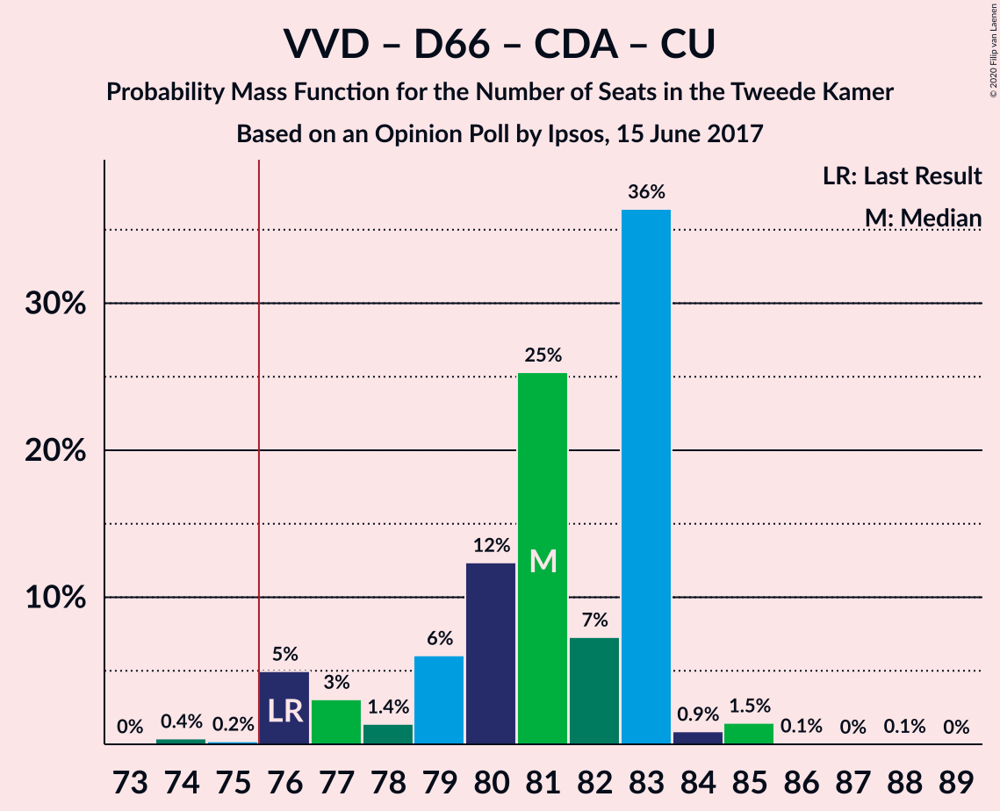

| Number of Seats | Probability | Accumulated | Special Marks |
|:---------------:|:-----------:|:-----------:|:-------------:|
| 73 | 0% | 100% |  |
| 74 | 0.4% | 99.9% |  |
| 75 | 0.2% | 99.6% |  |
| 76 | 5% | 99.3% | Last Result, Majority |
| 77 | 3% | 94% |  |
| 78 | 1.4% | 91% |  |
| 79 | 6% | 90% |  |
| 80 | 12% | 84% |  |
| 81 | 25% | 72% |  |
| 82 | 7% | 46% | Median |
| 83 | 36% | 39% |  |
| 84 | 0.9% | 2% |  |
| 85 | 1.5% | 2% |  |
| 86 | 0.1% | 0.2% |  |
| 87 | 0% | 0.1% |  |
| 88 | 0.1% | 0.1% |  |
| 89 | 0% | 0% |  |

### Volkspartij voor Vrijheid en Democratie – Partij voor de Vrijheid – Christen-Democratisch Appèl – Forum voor Democratie

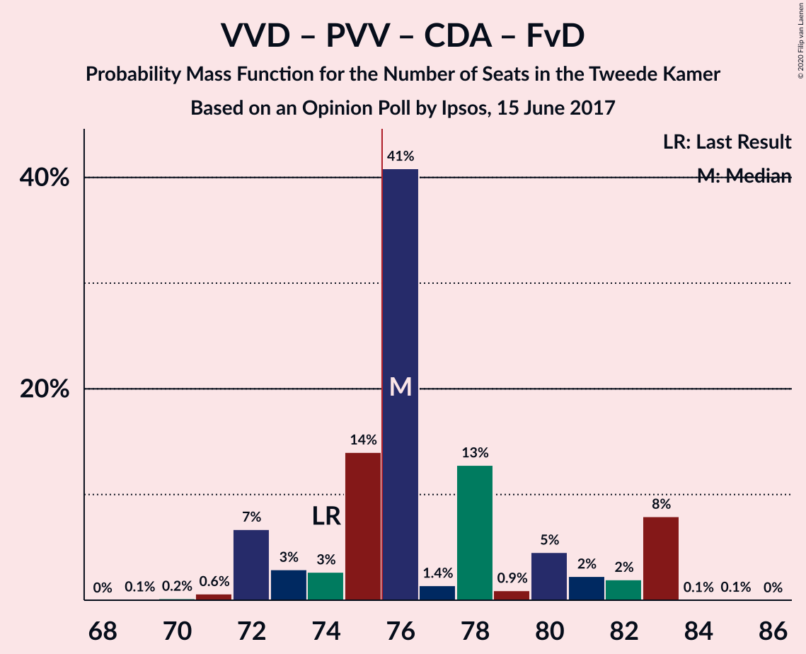

| Number of Seats | Probability | Accumulated | Special Marks |
|:---------------:|:-----------:|:-----------:|:-------------:|
| 69 | 0.1% | 100% |  |
| 70 | 0.2% | 99.9% |  |
| 71 | 0.6% | 99.7% |  |
| 72 | 7% | 99.1% |  |
| 73 | 3% | 92% |  |
| 74 | 3% | 89% | Last Result |
| 75 | 14% | 87% |  |
| 76 | 41% | 73% | Majority |
| 77 | 1.4% | 32% |  |
| 78 | 13% | 31% | Median |
| 79 | 0.9% | 18% |  |
| 80 | 5% | 17% |  |
| 81 | 2% | 12% |  |
| 82 | 2% | 10% |  |
| 83 | 8% | 8% |  |
| 84 | 0.1% | 0.2% |  |
| 85 | 0.1% | 0.1% |  |
| 86 | 0% | 0% |  |

### Democraten 66 – Christen-Democratisch Appèl – GroenLinks – Socialistische Partij – Partij van de Arbeid – ChristenUnie

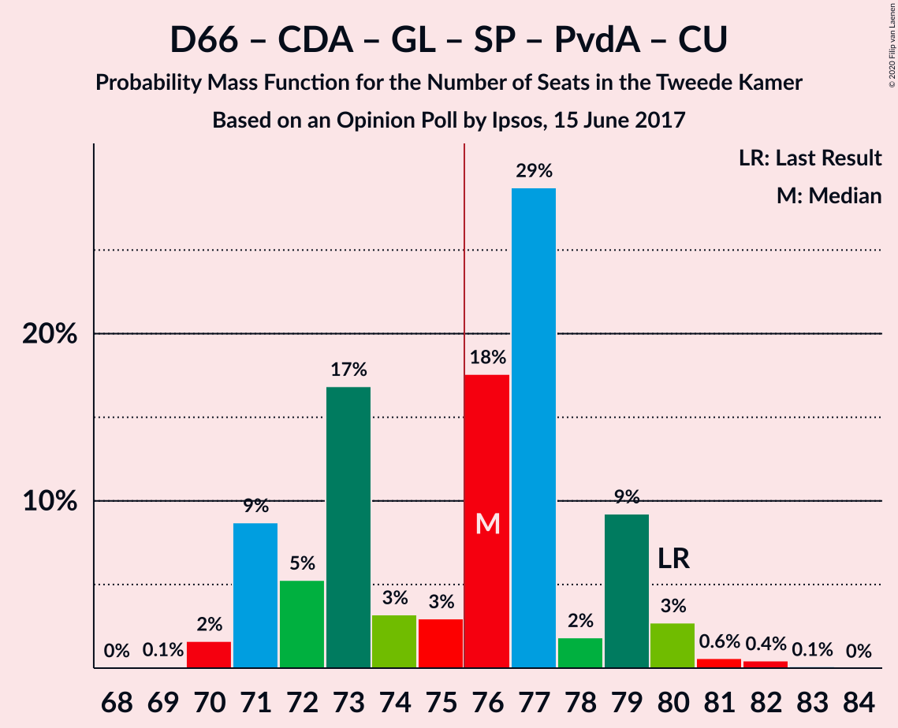

| Number of Seats | Probability | Accumulated | Special Marks |
|:---------------:|:-----------:|:-----------:|:-------------:|
| 69 | 0.1% | 100% |  |
| 70 | 2% | 99.9% |  |
| 71 | 9% | 98% |  |
| 72 | 5% | 90% |  |
| 73 | 17% | 84% |  |
| 74 | 3% | 67% |  |
| 75 | 3% | 64% |  |
| 76 | 18% | 61% | Median, Majority |
| 77 | 29% | 44% |  |
| 78 | 2% | 15% |  |
| 79 | 9% | 13% |  |
| 80 | 3% | 4% | Last Result |
| 81 | 0.6% | 1.2% |  |
| 82 | 0.4% | 0.6% |  |
| 83 | 0.1% | 0.1% |  |
| 84 | 0% | 0% |  |

### Volkspartij voor Vrijheid en Democratie – Partij voor de Vrijheid – Christen-Democratisch Appèl

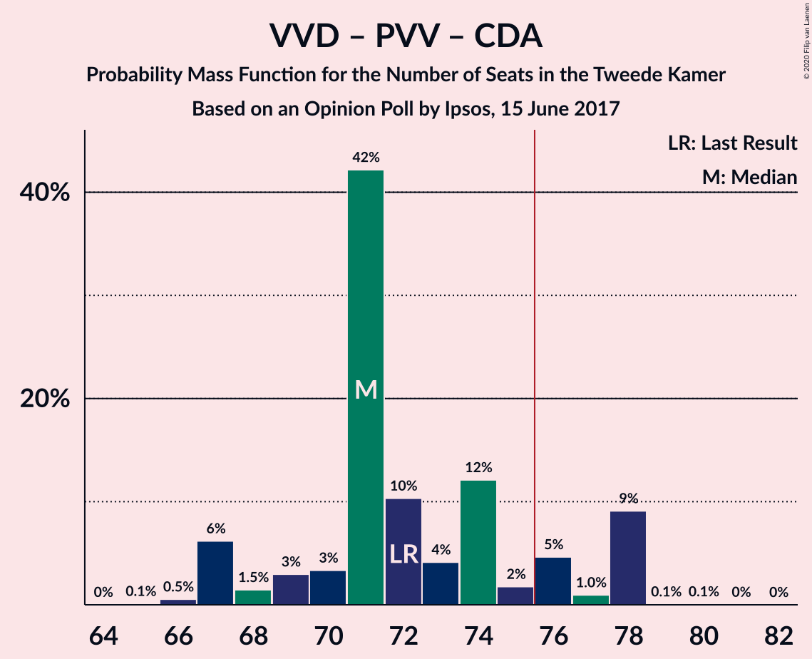

| Number of Seats | Probability | Accumulated | Special Marks |
|:---------------:|:-----------:|:-----------:|:-------------:|
| 65 | 0.1% | 100% |  |
| 66 | 0.5% | 99.9% |  |
| 67 | 6% | 99.3% |  |
| 68 | 1.5% | 93% |  |
| 69 | 3% | 92% |  |
| 70 | 3% | 89% |  |
| 71 | 42% | 85% |  |
| 72 | 10% | 43% | Last Result |
| 73 | 4% | 33% | Median |
| 74 | 12% | 29% |  |
| 75 | 2% | 17% |  |
| 76 | 5% | 15% | Majority |
| 77 | 1.0% | 10% |  |
| 78 | 9% | 9% |  |
| 79 | 0.1% | 0.2% |  |
| 80 | 0.1% | 0.1% |  |
| 81 | 0% | 0% |  |

### Volkspartij voor Vrijheid en Democratie – Democraten 66 – Christen-Democratisch Appèl

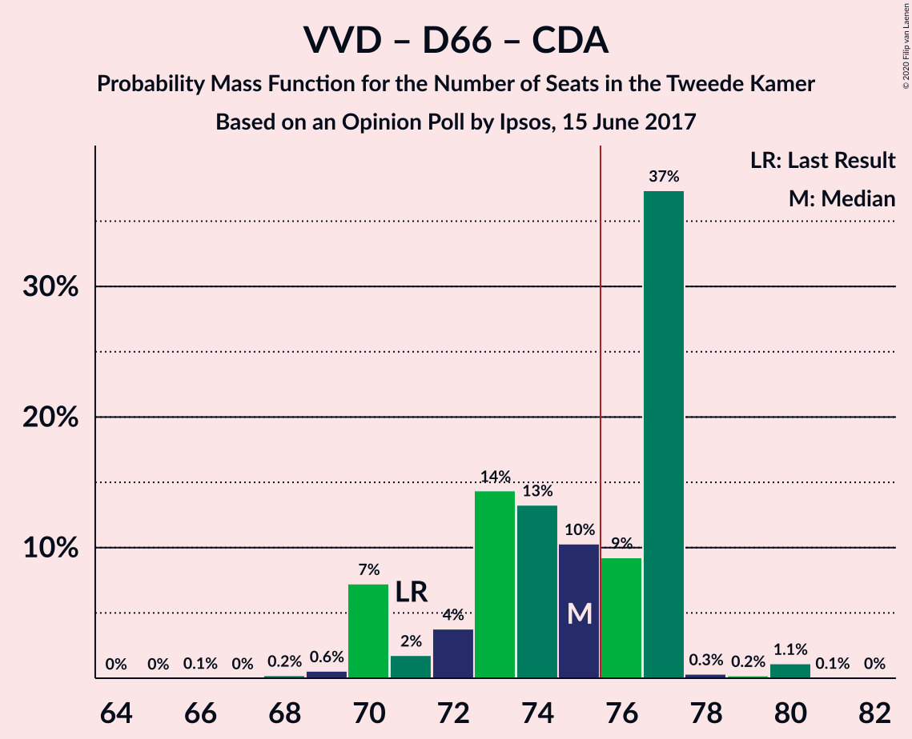

| Number of Seats | Probability | Accumulated | Special Marks |
|:---------------:|:-----------:|:-----------:|:-------------:|
| 66 | 0.1% | 100% |  |
| 67 | 0% | 99.9% |  |
| 68 | 0.2% | 99.9% |  |
| 69 | 0.6% | 99.7% |  |
| 70 | 7% | 99.1% |  |
| 71 | 2% | 92% | Last Result |
| 72 | 4% | 90% |  |
| 73 | 14% | 86% |  |
| 74 | 13% | 72% |  |
| 75 | 10% | 59% |  |
| 76 | 9% | 48% | Median, Majority |
| 77 | 37% | 39% |  |
| 78 | 0.3% | 2% |  |
| 79 | 0.2% | 1.4% |  |
| 80 | 1.1% | 1.2% |  |
| 81 | 0.1% | 0.1% |  |
| 82 | 0% | 0% |  |

### Democraten 66 – Christen-Democratisch Appèl – GroenLinks – Partij van de Arbeid – ChristenUnie

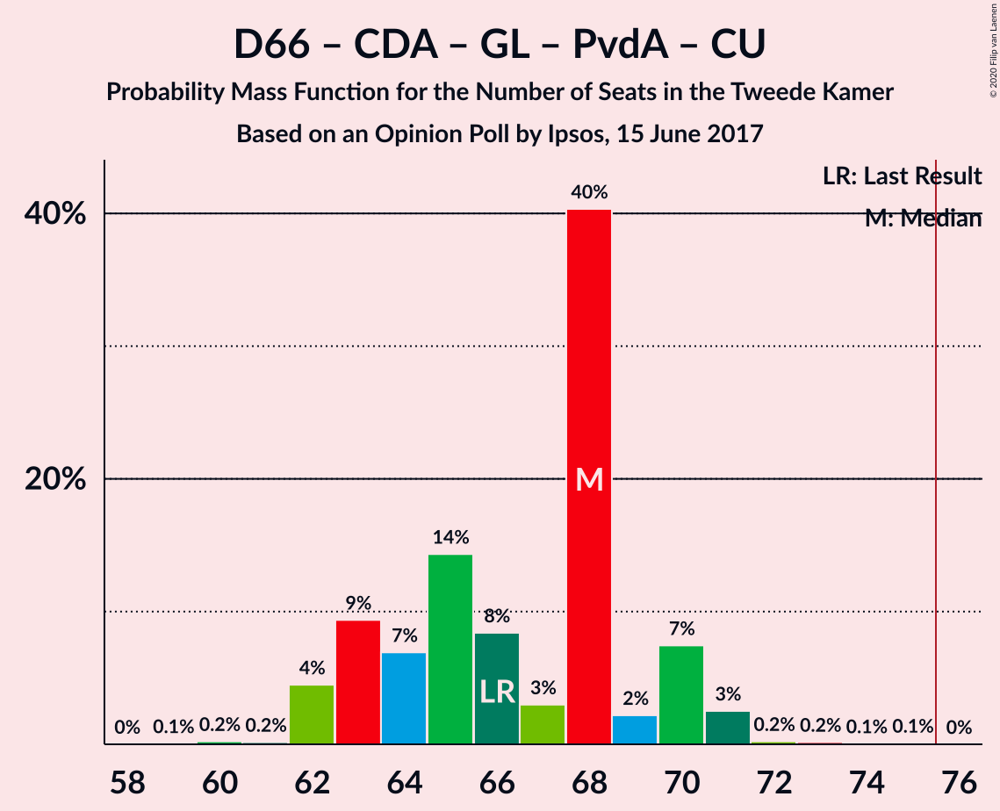

| Number of Seats | Probability | Accumulated | Special Marks |
|:---------------:|:-----------:|:-----------:|:-------------:|
| 59 | 0.1% | 100% |  |
| 60 | 0.2% | 99.9% |  |
| 61 | 0.2% | 99.7% |  |
| 62 | 4% | 99.5% |  |
| 63 | 9% | 95% |  |
| 64 | 7% | 86% |  |
| 65 | 14% | 79% |  |
| 66 | 8% | 64% | Last Result |
| 67 | 3% | 56% | Median |
| 68 | 40% | 53% |  |
| 69 | 2% | 13% |  |
| 70 | 7% | 10% |  |
| 71 | 3% | 3% |  |
| 72 | 0.2% | 0.5% |  |
| 73 | 0.2% | 0.3% |  |
| 74 | 0.1% | 0.1% |  |
| 75 | 0.1% | 0.1% |  |
| 76 | 0% | 0% | Majority |

### Volkspartij voor Vrijheid en Democratie – Democraten 66 – Partij van de Arbeid

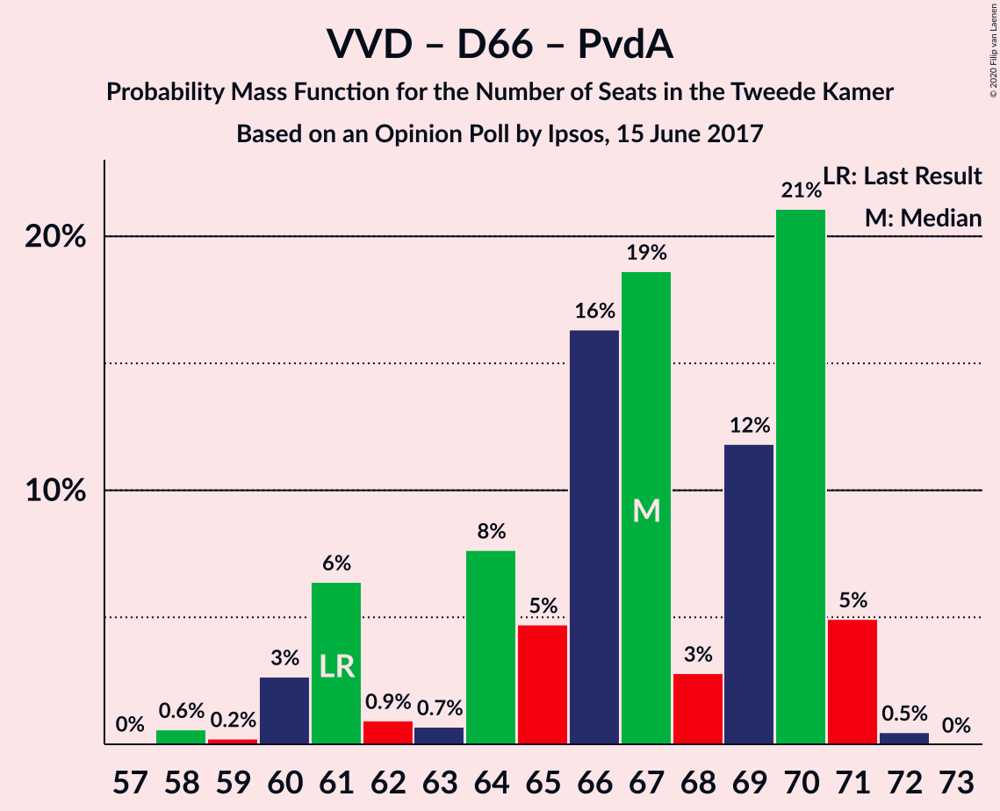

| Number of Seats | Probability | Accumulated | Special Marks |
|:---------------:|:-----------:|:-----------:|:-------------:|
| 57 | 0% | 100% |  |
| 58 | 0.6% | 99.9% |  |
| 59 | 0.2% | 99.4% |  |
| 60 | 3% | 99.1% |  |
| 61 | 6% | 96% | Last Result |
| 62 | 0.9% | 90% |  |
| 63 | 0.7% | 89% |  |
| 64 | 8% | 88% |  |
| 65 | 5% | 81% |  |
| 66 | 16% | 76% |  |
| 67 | 19% | 60% |  |
| 68 | 3% | 41% | Median |
| 69 | 12% | 38% |  |
| 70 | 21% | 27% |  |
| 71 | 5% | 5% |  |
| 72 | 0.5% | 0.5% |  |
| 73 | 0% | 0% |  |

### Volkspartij voor Vrijheid en Democratie – Christen-Democratisch Appèl – Forum voor Democratie – 50Plus – Staatkundig Gereformeerde Partij

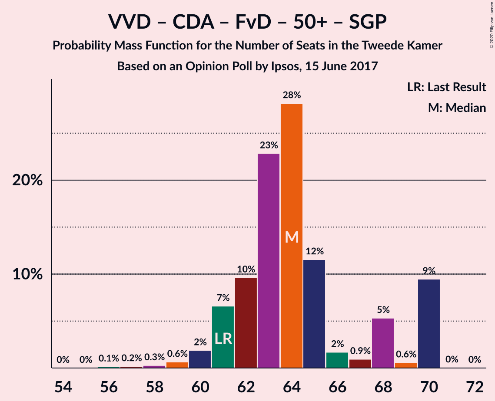

| Number of Seats | Probability | Accumulated | Special Marks |
|:---------------:|:-----------:|:-----------:|:-------------:|
| 56 | 0.1% | 100% |  |
| 57 | 0.2% | 99.8% |  |
| 58 | 0.3% | 99.7% |  |
| 59 | 0.6% | 99.4% |  |
| 60 | 2% | 98.7% |  |
| 61 | 7% | 97% | Last Result |
| 62 | 10% | 90% |  |
| 63 | 23% | 81% |  |
| 64 | 28% | 58% |  |
| 65 | 12% | 30% | Median |
| 66 | 2% | 18% |  |
| 67 | 0.9% | 16% |  |
| 68 | 5% | 15% |  |
| 69 | 0.6% | 10% |  |
| 70 | 9% | 10% |  |
| 71 | 0% | 0.1% |  |
| 72 | 0% | 0% |  |

### Volkspartij voor Vrijheid en Democratie – Christen-Democratisch Appèl – Partij van de Arbeid

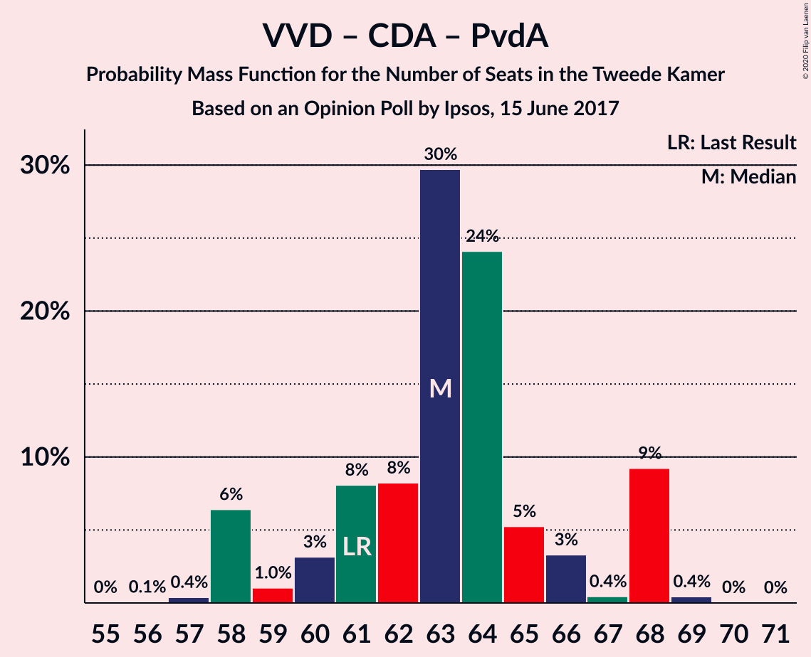

| Number of Seats | Probability | Accumulated | Special Marks |
|:---------------:|:-----------:|:-----------:|:-------------:|
| 55 | 0% | 100% |  |
| 56 | 0.1% | 99.9% |  |
| 57 | 0.4% | 99.9% |  |
| 58 | 6% | 99.5% |  |
| 59 | 1.0% | 93% |  |
| 60 | 3% | 92% |  |
| 61 | 8% | 89% | Last Result |
| 62 | 8% | 81% |  |
| 63 | 30% | 73% |  |
| 64 | 24% | 43% | Median |
| 65 | 5% | 19% |  |
| 66 | 3% | 13% |  |
| 67 | 0.4% | 10% |  |
| 68 | 9% | 10% |  |
| 69 | 0.4% | 0.5% |  |
| 70 | 0% | 0.1% |  |
| 71 | 0% | 0% |  |

### Volkspartij voor Vrijheid en Democratie – Christen-Democratisch Appèl – Forum voor Democratie – 50Plus

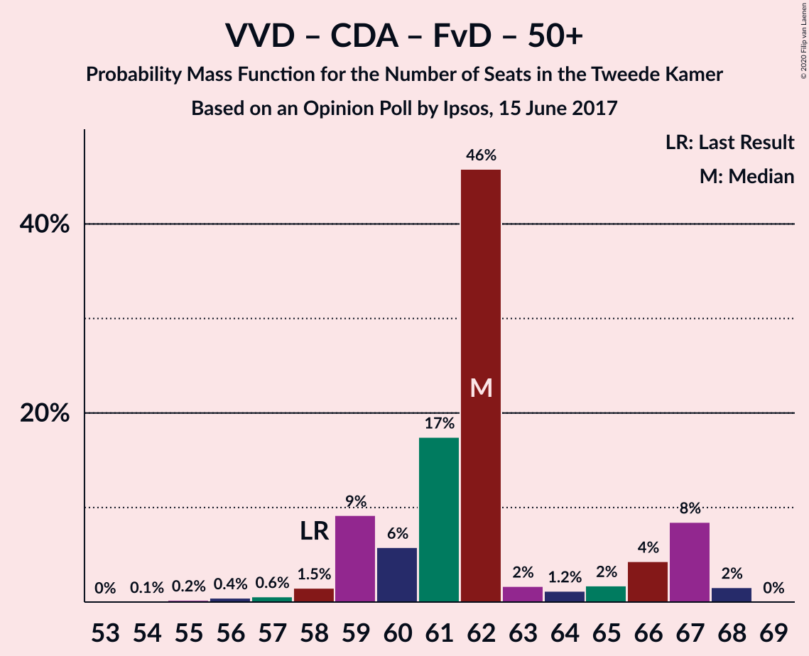

| Number of Seats | Probability | Accumulated | Special Marks |
|:---------------:|:-----------:|:-----------:|:-------------:|
| 54 | 0.1% | 100% |  |
| 55 | 0.2% | 99.9% |  |
| 56 | 0.4% | 99.7% |  |
| 57 | 0.6% | 99.3% |  |
| 58 | 1.5% | 98.7% | Last Result |
| 59 | 9% | 97% |  |
| 60 | 6% | 88% |  |
| 61 | 17% | 82% |  |
| 62 | 46% | 65% |  |
| 63 | 2% | 19% | Median |
| 64 | 1.2% | 17% |  |
| 65 | 2% | 16% |  |
| 66 | 4% | 14% |  |
| 67 | 8% | 10% |  |
| 68 | 2% | 2% |  |
| 69 | 0% | 0% |  |

### Volkspartij voor Vrijheid en Democratie – Christen-Democratisch Appèl – Forum voor Democratie – Staatkundig Gereformeerde Partij

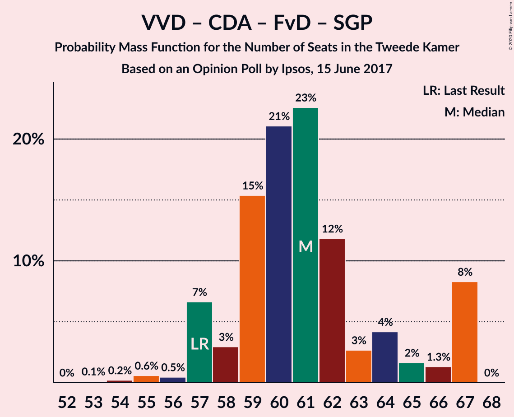

| Number of Seats | Probability | Accumulated | Special Marks |
|:---------------:|:-----------:|:-----------:|:-------------:|
| 53 | 0.1% | 100% |  |
| 54 | 0.2% | 99.9% |  |
| 55 | 0.6% | 99.7% |  |
| 56 | 0.5% | 99.1% |  |
| 57 | 7% | 98.6% | Last Result |
| 58 | 3% | 92% |  |
| 59 | 15% | 89% |  |
| 60 | 21% | 74% |  |
| 61 | 23% | 53% |  |
| 62 | 12% | 30% | Median |
| 63 | 3% | 18% |  |
| 64 | 4% | 15% |  |
| 65 | 2% | 11% |  |
| 66 | 1.3% | 10% |  |
| 67 | 8% | 8% |  |
| 68 | 0% | 0% |  |

### Volkspartij voor Vrijheid en Democratie – Christen-Democratisch Appèl – Forum voor Democratie

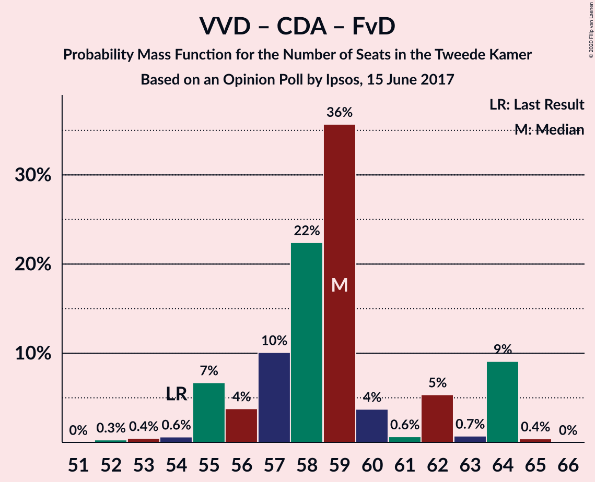

| Number of Seats | Probability | Accumulated | Special Marks |
|:---------------:|:-----------:|:-----------:|:-------------:|
| 52 | 0.3% | 100% |  |
| 53 | 0.4% | 99.7% |  |
| 54 | 0.6% | 99.2% | Last Result |
| 55 | 7% | 98.6% |  |
| 56 | 4% | 92% |  |
| 57 | 10% | 88% |  |
| 58 | 22% | 78% |  |
| 59 | 36% | 56% |  |
| 60 | 4% | 20% | Median |
| 61 | 0.6% | 16% |  |
| 62 | 5% | 16% |  |
| 63 | 0.7% | 10% |  |
| 64 | 9% | 10% |  |
| 65 | 0.4% | 0.4% |  |
| 66 | 0% | 0% |  |

### Volkspartij voor Vrijheid en Democratie – Christen-Democratisch Appèl

| Number of Seats | Probability | Accumulated | Special Marks |
|:---------------:|:-----------:|:-----------:|:-------------:|
| 47 | 0% | 100% |  |
| 48 | 0.4% | 99.9% |  |
| 49 | 0.9% | 99.5% |  |
| 50 | 6% | 98.6% |  |
| 51 | 1.3% | 93% |  |
| 52 | 9% | 92% | Last Result |
| 53 | 10% | 82% |  |
| 54 | 39% | 73% |  |
| 55 | 15% | 34% | Median |
| 56 | 5% | 19% |  |
| 57 | 0.5% | 14% |  |
| 58 | 4% | 14% |  |
| 59 | 8% | 10% |  |
| 60 | 2% | 2% |  |
| 61 | 0% | 0% |  |

### Democraten 66 – Christen-Democratisch Appèl – Partij van de Arbeid

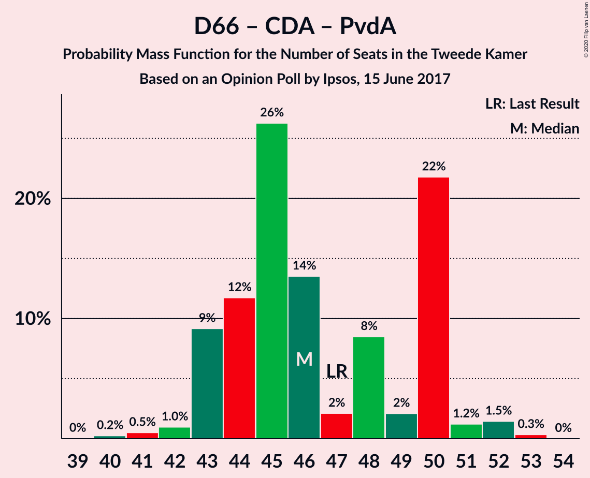

| Number of Seats | Probability | Accumulated | Special Marks |
|:---------------:|:-----------:|:-----------:|:-------------:|
| 40 | 0.2% | 100% |  |
| 41 | 0.5% | 99.7% |  |
| 42 | 1.0% | 99.2% |  |
| 43 | 9% | 98% |  |
| 44 | 12% | 89% |  |
| 45 | 26% | 77% |  |
| 46 | 14% | 51% |  |
| 47 | 2% | 38% | Last Result, Median |
| 48 | 8% | 35% |  |
| 49 | 2% | 27% |  |
| 50 | 22% | 25% |  |
| 51 | 1.2% | 3% |  |
| 52 | 1.5% | 2% |  |
| 53 | 0.3% | 0.4% |  |
| 54 | 0% | 0% |  |

### Volkspartij voor Vrijheid en Democratie – Partij van de Arbeid

| Number of Seats | Probability | Accumulated | Special Marks |
|:---------------:|:-----------:|:-----------:|:-------------:|
| 39 | 0.1% | 100% |  |
| 40 | 1.0% | 99.8% |  |
| 41 | 6% | 98.8% |  |
| 42 | 3% | 93% | Last Result |
| 43 | 7% | 90% |  |
| 44 | 3% | 82% |  |
| 45 | 6% | 80% |  |
| 46 | 3% | 74% |  |
| 47 | 48% | 71% | Median |
| 48 | 7% | 23% |  |
| 49 | 15% | 17% |  |
| 50 | 1.1% | 1.5% |  |
| 51 | 0.1% | 0.4% |  |
| 52 | 0.1% | 0.2% |  |
| 53 | 0.2% | 0.2% |  |
| 54 | 0% | 0% |  |

### Democraten 66 – Christen-Democratisch Appèl

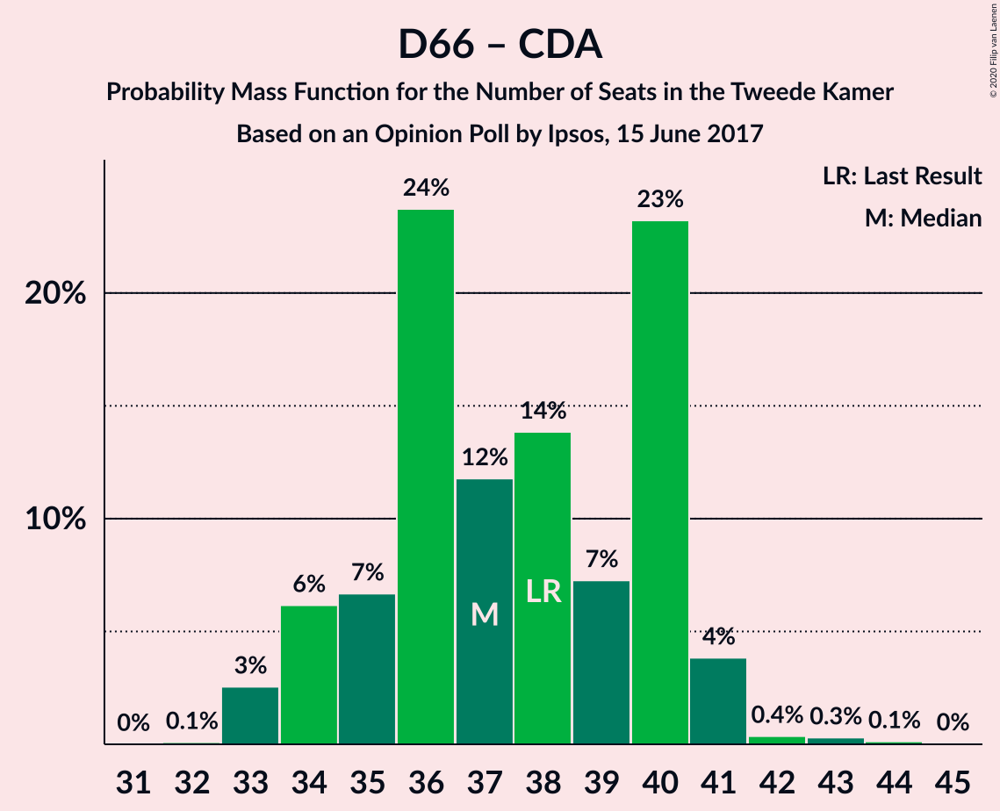

| Number of Seats | Probability | Accumulated | Special Marks |
|:---------------:|:-----------:|:-----------:|:-------------:|
| 32 | 0.1% | 100% |  |
| 33 | 3% | 99.9% |  |
| 34 | 6% | 97% |  |
| 35 | 7% | 91% |  |
| 36 | 24% | 84% |  |
| 37 | 12% | 61% |  |
| 38 | 14% | 49% | Last Result, Median |
| 39 | 7% | 35% |  |
| 40 | 23% | 28% |  |
| 41 | 4% | 5% |  |
| 42 | 0.4% | 0.8% |  |
| 43 | 0.3% | 0.5% |  |
| 44 | 0.1% | 0.2% |  |
| 45 | 0% | 0% |  |

### Christen-Democratisch Appèl – Partij van de Arbeid – ChristenUnie

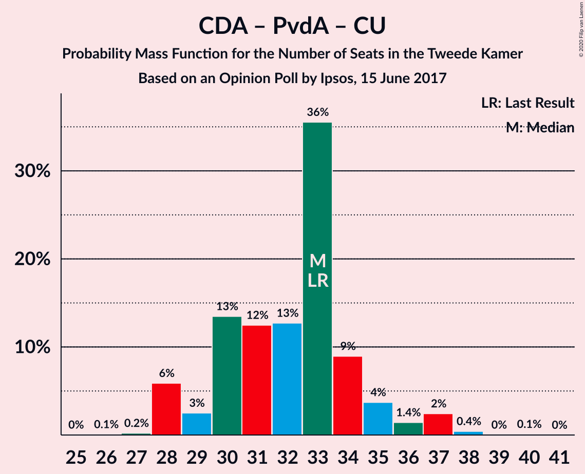

| Number of Seats | Probability | Accumulated | Special Marks |
|:---------------:|:-----------:|:-----------:|:-------------:|
| 26 | 0.1% | 100% |  |
| 27 | 0.2% | 99.9% |  |
| 28 | 6% | 99.7% |  |
| 29 | 3% | 94% |  |
| 30 | 13% | 91% |  |
| 31 | 12% | 78% |  |
| 32 | 13% | 65% | Median |
| 33 | 36% | 53% | Last Result |
| 34 | 9% | 17% |  |
| 35 | 4% | 8% |  |
| 36 | 1.4% | 4% |  |
| 37 | 2% | 3% |  |
| 38 | 0.4% | 0.5% |  |
| 39 | 0% | 0.1% |  |
| 40 | 0.1% | 0.1% |  |
| 41 | 0% | 0% |  |

### Christen-Democratisch Appèl – Partij van de Arbeid

| Number of Seats | Probability | Accumulated | Special Marks |
|:---------------:|:-----------:|:-----------:|:-------------:|
| 21 | 0.4% | 100% |  |
| 22 | 6% | 99.5% |  |
| 23 | 1.5% | 94% |  |
| 24 | 19% | 92% |  |
| 25 | 21% | 73% |  |
| 26 | 6% | 52% | Median |
| 27 | 29% | 46% |  |
| 28 | 11% | 17% | Last Result |
| 29 | 3% | 6% |  |
| 30 | 0.7% | 3% |  |
| 31 | 0.5% | 2% |  |
| 32 | 1.5% | 2% |  |
| 33 | 0.1% | 0.1% |  |
| 34 | 0% | 0% |  |

## Technical Information

### Opinion Poll

+ **Polling firm:** Ipsos
+ **Commissioner(s):** —
+ **Fieldwork period:** 15 June 2017

### Calculations

+ **Sample size:** 1000
+ **Simulations done:** 1,048,576
+ **Error estimate:** 2.70%

