# Opinion Poll by Peil.nl, 18 June 2017

<a href="#voting-intentions">Voting Intentions</a> | <a href="#seats">Seats</a> | <a href="#coalitions">Coalitions</a> | <a href="#technical-information">Technical Information</a>

## Voting Intentions

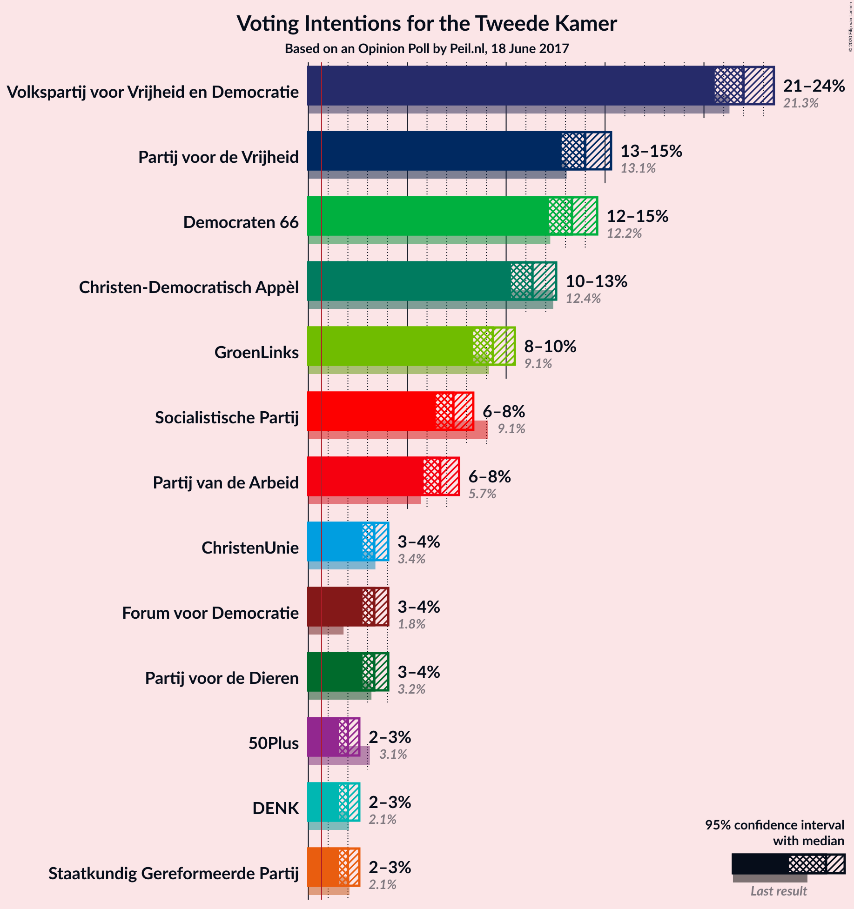

### Confidence Intervals

| Party | Last Result | Poll Result | 80% Confidence Interval | 90% Confidence Interval | 95% Confidence Interval | 99% Confidence Interval |
|:-----:|:-----------:|:-----------:|:-----------------------:|:-----------------------:|:-----------------------:|:-----------------------:|
| Volkspartij voor Vrijheid en Democratie | 21.3% | 22.0% | 21.0–23.0% |20.8–23.3% |20.5–23.5% |20.1–24.0% |
| Partij voor de Vrijheid | 13.1% | 14.0% | 13.2–14.8% |13.0–15.1% |12.8–15.3% |12.4–15.7% |
| Democraten 66 | 12.2% | 13.3% | 12.6–14.2% |12.3–14.4% |12.2–14.6% |11.8–15.0% |
| Christen-Democratisch Appèl | 12.4% | 11.3% | 10.6–12.1% |10.4–12.3% |10.2–12.5% |9.9–12.9% |
| GroenLinks | 9.1% | 9.3% | 8.7–10.1% |8.5–10.3% |8.3–10.4% |8.0–10.8% |
| Socialistische Partij | 9.1% | 7.3% | 6.8–8.0% |6.6–8.2% |6.4–8.3% |6.2–8.6% |
| Partij van de Arbeid | 5.7% | 6.7% | 6.1–7.3% |6.0–7.5% |5.8–7.6% |5.6–7.9% |
| ChristenUnie | 3.4% | 3.3% | 2.9–3.8% |2.8–3.9% |2.7–4.0% |2.6–4.3% |
| Partij voor de Dieren | 3.2% | 3.3% | 2.9–3.8% |2.8–3.9% |2.7–4.0% |2.6–4.3% |
| Forum voor Democratie | 1.8% | 3.3% | 2.9–3.8% |2.8–3.9% |2.7–4.0% |2.6–4.3% |
| 50Plus | 3.1% | 2.0% | 1.7–2.4% |1.6–2.5% |1.6–2.6% |1.4–2.8% |
| Staatkundig Gereformeerde Partij | 2.1% | 2.0% | 1.7–2.4% |1.6–2.5% |1.6–2.6% |1.4–2.8% |
| DENK | 2.1% | 2.0% | 1.7–2.4% |1.6–2.5% |1.6–2.6% |1.4–2.8% |

*Note:* The poll result column reflects the actual value used in the calculations. Published results may vary slightly, and in addition be rounded to fewer digits.

## Seats

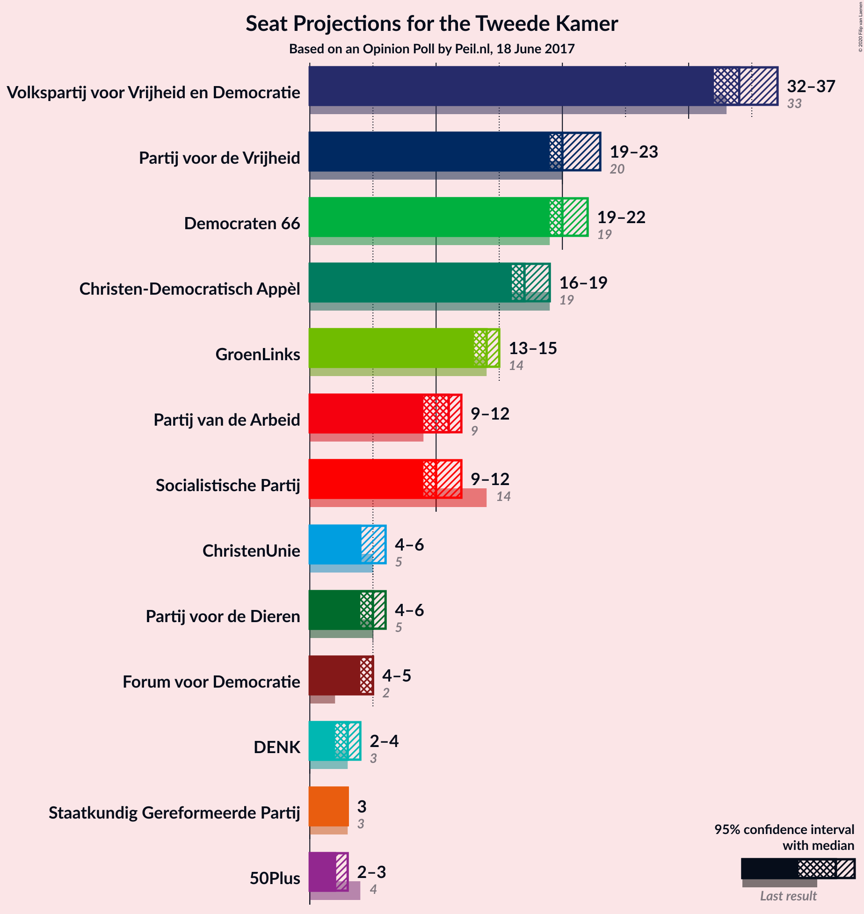

### Confidence Intervals

| Party | Last Result | Median | 80% Confidence Interval | 90% Confidence Interval | 95% Confidence Interval | 99% Confidence Interval |
|:-----:|:-----------:|:------:|:-----------------------:|:-----------------------:|:-----------------------:|:-----------------------:|
| <a href="#volkspartij-voor-vrijheid-en-democratie">Volkspartij voor Vrijheid en Democratie</a> | 33 | 34 | 33–37 |32–37 |32–37 |31–37 |
| <a href="#partij-voor-de-vrijheid">Partij voor de Vrijheid</a> | 20 | 20 | 20–22 |20–22 |19–23 |19–23 |
| <a href="#democraten-66">Democraten 66</a> | 19 | 20 | 20–21 |20–22 |19–22 |18–22 |
| <a href="#christen-democratisch-appèl">Christen-Democratisch Appèl</a> | 19 | 17 | 16–18 |16–18 |16–19 |15–19 |
| <a href="#groenlinks">GroenLinks</a> | 14 | 14 | 14–15 |14–15 |13–15 |12–16 |
| <a href="#socialistische-partij">Socialistische Partij</a> | 14 | 10 | 10–12 |9–12 |9–12 |9–12 |
| <a href="#partij-van-de-arbeid">Partij van de Arbeid</a> | 9 | 11 | 10–12 |9–12 |9–12 |8–12 |
| <a href="#christenunie">ChristenUnie</a> | 5 | 4 | 4–6 |4–6 |4–6 |4–6 |
| <a href="#partij-voor-de-dieren">Partij voor de Dieren</a> | 5 | 5 | 4–6 |4–6 |4–6 |4–6 |
| <a href="#forum-voor-democratie">Forum voor Democratie</a> | 2 | 5 | 4–5 |4–5 |4–5 |4–6 |
| <a href="#50plus">50Plus</a> | 4 | 2 | 2–3 |2–3 |2–3 |2–3 |
| <a href="#staatkundig-gereformeerde-partij">Staatkundig Gereformeerde Partij</a> | 3 | 3 | 3 |3 |3 |2–3 |
| <a href="#denk">DENK</a> | 3 | 3 | 2–3 |2–3 |2–4 |2–4 |

### Volkspartij voor Vrijheid en Democratie

*For a full overview of the results for this party, see the [Volkspartij voor Vrijheid en Democratie](party-volkspartijvoorvrijheidendemocratie.html) page.*

| Number of Seats | Probability | Accumulated | Special Marks |
|:---------------:|:-----------:|:-----------:|:-------------:|
| 30 | 0.5% | 100% |  |
| 31 | 0.2% | 99.5% |  |
| 32 | 8% | 99.3% |  |
| 33 | 20% | 92% | Last Result |
| 34 | 47% | 71% | Median |
| 35 | 6% | 24% |  |
| 36 | 3% | 18% |  |
| 37 | 16% | 16% |  |
| 38 | 0% | 0% |  |

### Partij voor de Vrijheid

*For a full overview of the results for this party, see the [Partij voor de Vrijheid](party-partijvoordevrijheid.html) page.*

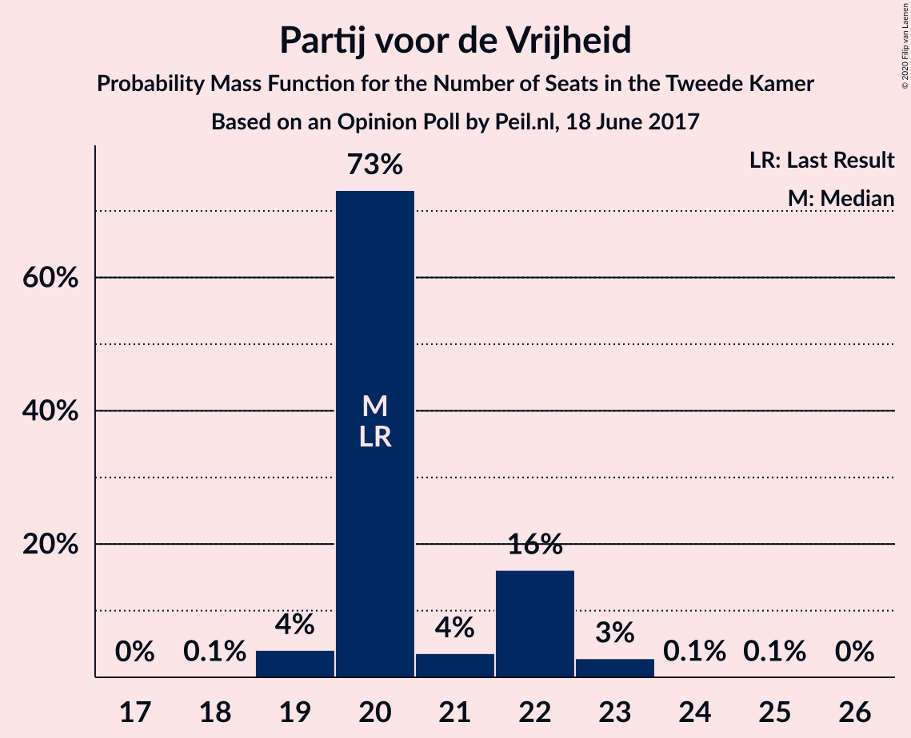

| Number of Seats | Probability | Accumulated | Special Marks |
|:---------------:|:-----------:|:-----------:|:-------------:|
| 18 | 0.1% | 100% |  |
| 19 | 4% | 99.9% |  |
| 20 | 73% | 96% | Last Result, Median |
| 21 | 4% | 23% |  |
| 22 | 16% | 19% |  |
| 23 | 3% | 3% |  |
| 24 | 0.1% | 0.2% |  |
| 25 | 0.1% | 0.1% |  |
| 26 | 0% | 0% |  |

### Democraten 66

*For a full overview of the results for this party, see the [Democraten 66](party-democraten66.html) page.*

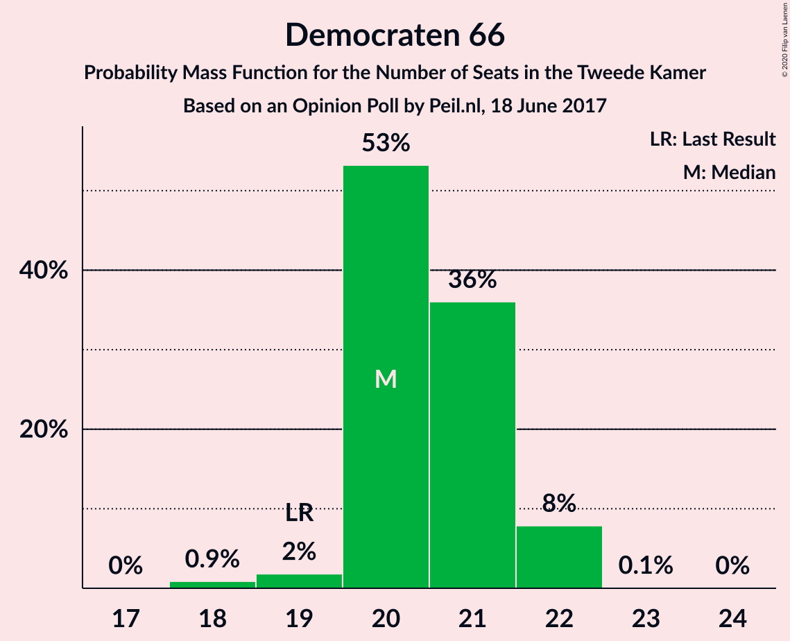

| Number of Seats | Probability | Accumulated | Special Marks |
|:---------------:|:-----------:|:-----------:|:-------------:|
| 17 | 0% | 100% |  |
| 18 | 0.9% | 99.9% |  |
| 19 | 2% | 99.1% | Last Result |
| 20 | 53% | 97% | Median |
| 21 | 36% | 44% |  |
| 22 | 8% | 8% |  |
| 23 | 0.1% | 0.1% |  |
| 24 | 0% | 0% |  |

### Christen-Democratisch Appèl

*For a full overview of the results for this party, see the [Christen-Democratisch Appèl](party-christen-democratischappèl.html) page.*

| Number of Seats | Probability | Accumulated | Special Marks |
|:---------------:|:-----------:|:-----------:|:-------------:|
| 14 | 0.1% | 100% |  |
| 15 | 2% | 99.9% |  |
| 16 | 29% | 98% |  |
| 17 | 24% | 69% | Median |
| 18 | 40% | 45% |  |
| 19 | 5% | 5% | Last Result |
| 20 | 0.1% | 0.1% |  |
| 21 | 0% | 0% |  |

### GroenLinks

*For a full overview of the results for this party, see the [GroenLinks](party-groenlinks.html) page.*

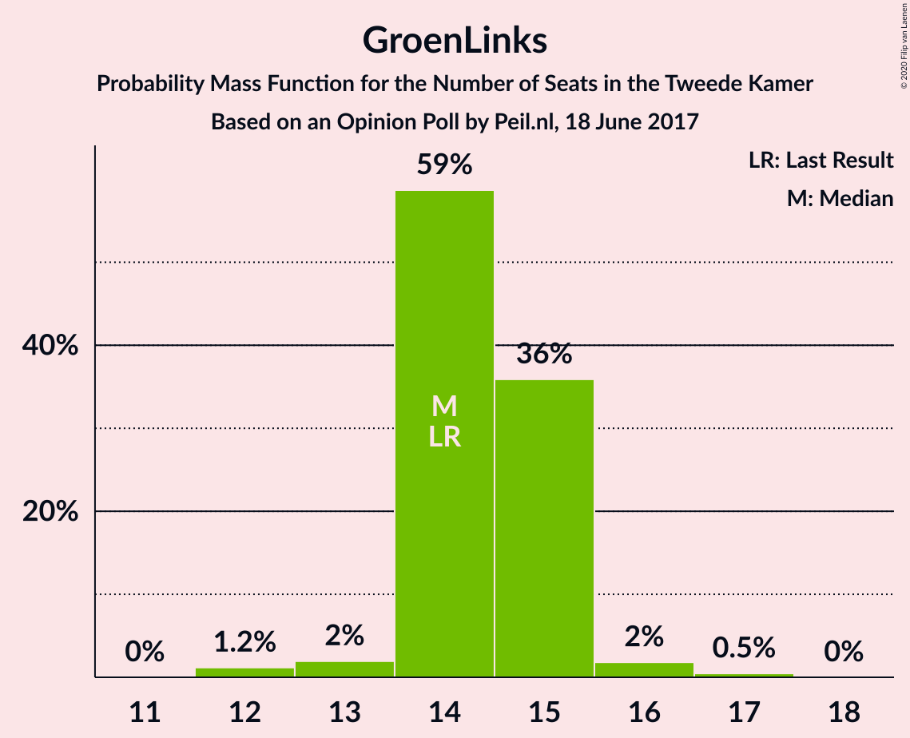

| Number of Seats | Probability | Accumulated | Special Marks |
|:---------------:|:-----------:|:-----------:|:-------------:|
| 12 | 1.2% | 100% |  |
| 13 | 2% | 98.8% |  |
| 14 | 59% | 97% | Last Result, Median |
| 15 | 36% | 38% |  |
| 16 | 2% | 2% |  |
| 17 | 0.5% | 0.5% |  |
| 18 | 0% | 0% |  |

### Socialistische Partij

*For a full overview of the results for this party, see the [Socialistische Partij](party-socialistischepartij.html) page.*

| Number of Seats | Probability | Accumulated | Special Marks |
|:---------------:|:-----------:|:-----------:|:-------------:|
| 9 | 6% | 100% |  |
| 10 | 63% | 94% | Median |
| 11 | 9% | 31% |  |
| 12 | 22% | 22% |  |
| 13 | 0.2% | 0.2% |  |
| 14 | 0% | 0% | Last Result |

### Partij van de Arbeid

*For a full overview of the results for this party, see the [Partij van de Arbeid](party-partijvandearbeid.html) page.*

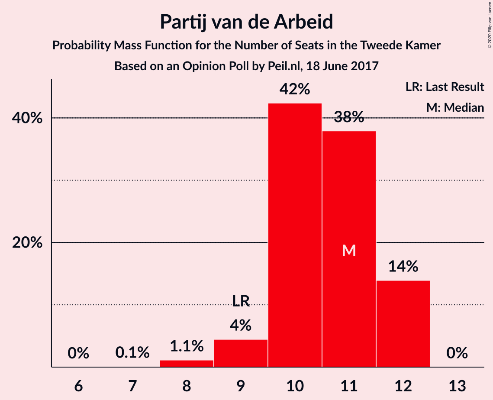

| Number of Seats | Probability | Accumulated | Special Marks |
|:---------------:|:-----------:|:-----------:|:-------------:|
| 7 | 0.1% | 100% |  |
| 8 | 1.1% | 99.9% |  |
| 9 | 4% | 98.7% | Last Result |
| 10 | 42% | 94% |  |
| 11 | 38% | 52% | Median |
| 12 | 14% | 14% |  |
| 13 | 0% | 0% |  |

### ChristenUnie

*For a full overview of the results for this party, see the [ChristenUnie](party-christenunie.html) page.*

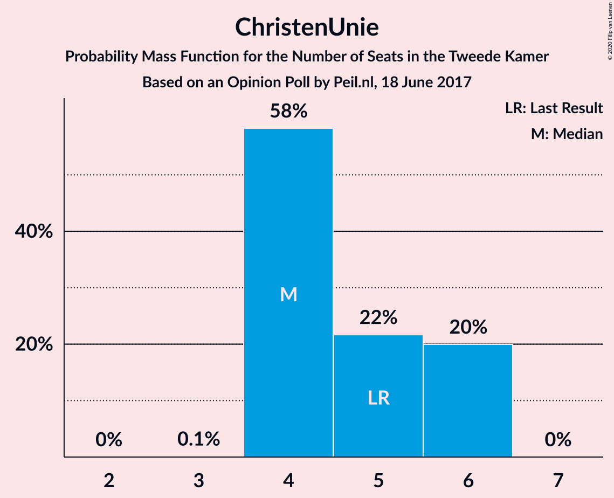

| Number of Seats | Probability | Accumulated | Special Marks |
|:---------------:|:-----------:|:-----------:|:-------------:|
| 3 | 0.1% | 100% |  |
| 4 | 58% | 99.9% | Median |
| 5 | 22% | 42% | Last Result |
| 6 | 20% | 20% |  |
| 7 | 0% | 0% |  |

### Partij voor de Dieren

*For a full overview of the results for this party, see the [Partij voor de Dieren](party-partijvoordedieren.html) page.*

| Number of Seats | Probability | Accumulated | Special Marks |
|:---------------:|:-----------:|:-----------:|:-------------:|
| 3 | 0.1% | 100% |  |
| 4 | 39% | 99.9% |  |
| 5 | 26% | 61% | Last Result, Median |
| 6 | 36% | 36% |  |
| 7 | 0% | 0% |  |

### Forum voor Democratie

*For a full overview of the results for this party, see the [Forum voor Democratie](party-forumvoordemocratie.html) page.*

| Number of Seats | Probability | Accumulated | Special Marks |
|:---------------:|:-----------:|:-----------:|:-------------:|
| 2 | 0% | 100% | Last Result |
| 3 | 0.1% | 100% |  |
| 4 | 29% | 99.9% |  |
| 5 | 69% | 71% | Median |
| 6 | 2% | 2% |  |
| 7 | 0.2% | 0.2% |  |
| 8 | 0% | 0% |  |

### 50Plus

*For a full overview of the results for this party, see the [50Plus](party-50plus.html) page.*

| Number of Seats | Probability | Accumulated | Special Marks |
|:---------------:|:-----------:|:-----------:|:-------------:|
| 2 | 54% | 100% | Median |
| 3 | 45% | 46% |  |
| 4 | 0.3% | 0.3% | Last Result |
| 5 | 0% | 0% |  |

### Staatkundig Gereformeerde Partij

*For a full overview of the results for this party, see the [Staatkundig Gereformeerde Partij](party-staatkundiggereformeerdepartij.html) page.*

| Number of Seats | Probability | Accumulated | Special Marks |
|:---------------:|:-----------:|:-----------:|:-------------:|
| 2 | 0.6% | 100% |  |
| 3 | 99.1% | 99.4% | Last Result, Median |
| 4 | 0.2% | 0.3% |  |
| 5 | 0% | 0% |  |

### DENK

*For a full overview of the results for this party, see the [DENK](party-denk.html) page.*

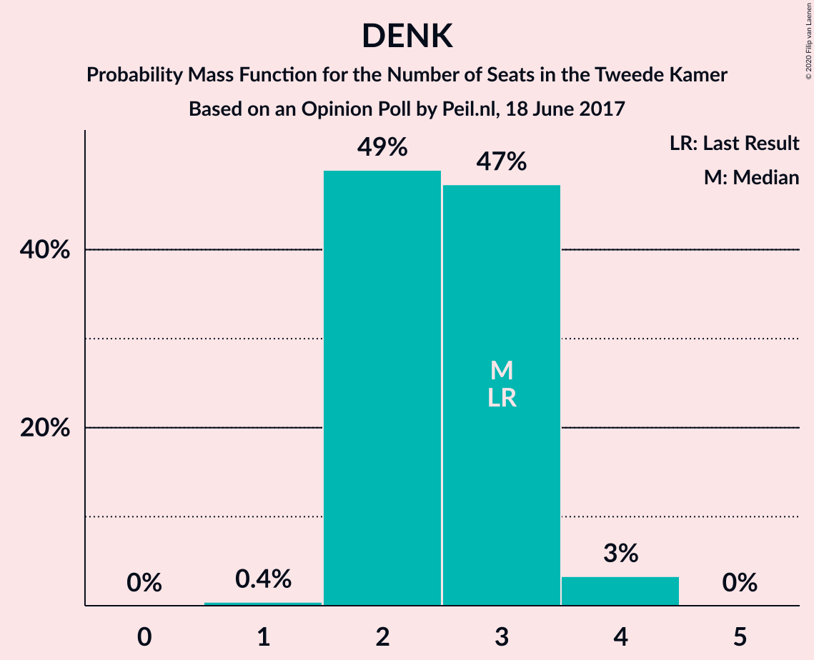

| Number of Seats | Probability | Accumulated | Special Marks |
|:---------------:|:-----------:|:-----------:|:-------------:|
| 1 | 0.4% | 100% |  |
| 2 | 49% | 99.6% |  |
| 3 | 47% | 51% | Last Result, Median |
| 4 | 3% | 3% |  |
| 5 | 0% | 0% |  |

## Coalitions

### Confidence Intervals

| Coalition | Last Result | Median | Majority? | 80% Confidence Interval | 90% Confidence Interval | 95% Confidence Interval | 99% Confidence Interval |
|:---------:|:-----------:|:------:|:---------:|:-----------------------:|:-----------------------:|:-----------------------:|:-----------------------:|
| Volkspartij voor Vrijheid en Democratie – Democraten 66 – Christen-Democratisch Appèl – GroenLinks – ChristenUnie | 90 | 91 | 100% | 89–92 | 89–92 | 88–92 | 88–93 |
| Volkspartij voor Vrijheid en Democratie – Democraten 66 – Christen-Democratisch Appèl – Partij van de Arbeid – ChristenUnie | 85 | 87 | 100% | 87–88 | 85–88 | 84–88 | 82–90 |
| Volkspartij voor Vrijheid en Democratie – Partij voor de Vrijheid – Christen-Democratisch Appèl – Forum voor Democratie – Staatkundig Gereformeerde Partij | 77 | 80 | 99.9% | 77–81 | 77–81 | 77–82 | 76–83 |
| Democraten 66 – Christen-Democratisch Appèl – GroenLinks – Socialistische Partij – Partij van de Arbeid – ChristenUnie | 80 | 78 | 80% | 75–80 | 75–80 | 75–80 | 75–81 |
| Volkspartij voor Vrijheid en Democratie – Partij voor de Vrijheid – Christen-Democratisch Appèl – Forum voor Democratie | 74 | 77 | 77% | 74–78 | 74–78 | 74–79 | 73–80 |
| Volkspartij voor Vrijheid en Democratie – Democraten 66 – Christen-Democratisch Appèl – ChristenUnie | 76 | 77 | 84% | 75–77 | 75–78 | 74–78 | 72–79 |
| Volkspartij voor Vrijheid en Democratie – Partij voor de Vrijheid – Christen-Democratisch Appèl | 72 | 72 | 0.2% | 70–73 | 70–73 | 70–74 | 69–75 |
| Volkspartij voor Vrijheid en Democratie – Democraten 66 – Christen-Democratisch Appèl | 71 | 73 | 0% | 70–73 | 70–73 | 70–73 | 68–73 |
| Democraten 66 – Christen-Democratisch Appèl – GroenLinks – Partij van de Arbeid – ChristenUnie | 66 | 68 | 0% | 65–68 | 65–69 | 65–69 | 64–69 |
| Volkspartij voor Vrijheid en Democratie – Democraten 66 – Partij van de Arbeid | 61 | 65 | 0% | 64–68 | 63–68 | 63–68 | 62–68 |
| Volkspartij voor Vrijheid en Democratie – Christen-Democratisch Appèl – Forum voor Democratie – 50Plus – Staatkundig Gereformeerde Partij | 61 | 62 | 0% | 60–63 | 60–63 | 59–64 | 58–64 |
| Volkspartij voor Vrijheid en Democratie – Christen-Democratisch Appèl – Partij van de Arbeid | 61 | 62 | 0% | 60–64 | 60–64 | 59–64 | 58–64 |
| Volkspartij voor Vrijheid en Democratie – Christen-Democratisch Appèl – Forum voor Democratie – 50Plus | 58 | 59 | 0% | 57–60 | 57–60 | 57–61 | 55–61 |
| Volkspartij voor Vrijheid en Democratie – Christen-Democratisch Appèl – Forum voor Democratie – Staatkundig Gereformeerde Partij | 57 | 60 | 0% | 57–61 | 57–61 | 57–61 | 56–61 |
| Volkspartij voor Vrijheid en Democratie – Christen-Democratisch Appèl – Forum voor Democratie | 54 | 57 | 0% | 54–58 | 54–58 | 54–58 | 53–58 |
| Volkspartij voor Vrijheid en Democratie – Christen-Democratisch Appèl | 52 | 52 | 0% | 50–53 | 50–53 | 49–53 | 48–54 |
| Democraten 66 – Christen-Democratisch Appèl – Partij van de Arbeid | 47 | 48 | 0% | 47–49 | 47–50 | 45–50 | 44–50 |
| Volkspartij voor Vrijheid en Democratie – Partij van de Arbeid | 42 | 44 | 0% | 43–48 | 42–48 | 41–48 | 41–48 |
| Democraten 66 – Christen-Democratisch Appèl | 38 | 37 | 0% | 36–39 | 36–40 | 35–41 | 34–41 |
| Christen-Democratisch Appèl – Partij van de Arbeid – ChristenUnie | 33 | 32 | 0% | 31–34 | 31–34 | 30–34 | 29–35 |
| Christen-Democratisch Appèl – Partij van de Arbeid | 28 | 28 | 0% | 27–28 | 27–28 | 25–29 | 24–30 |

### Volkspartij voor Vrijheid en Democratie – Democraten 66 – Christen-Democratisch Appèl – GroenLinks – ChristenUnie

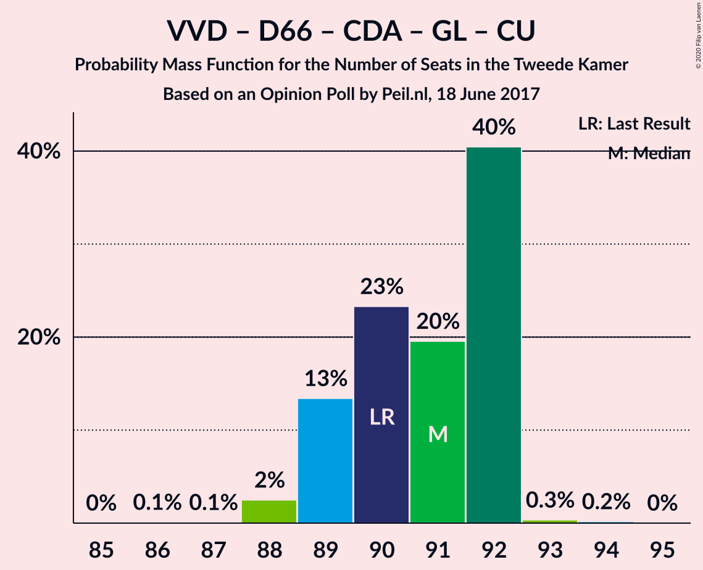

| Number of Seats | Probability | Accumulated | Special Marks |
|:---------------:|:-----------:|:-----------:|:-------------:|
| 86 | 0.1% | 100% |  |
| 87 | 0.1% | 99.9% |  |
| 88 | 2% | 99.8% |  |
| 89 | 13% | 97% | Median |
| 90 | 23% | 84% | Last Result |
| 91 | 20% | 61% |  |
| 92 | 40% | 41% |  |
| 93 | 0.3% | 0.6% |  |
| 94 | 0.2% | 0.2% |  |
| 95 | 0% | 0% |  |

### Volkspartij voor Vrijheid en Democratie – Democraten 66 – Christen-Democratisch Appèl – Partij van de Arbeid – ChristenUnie

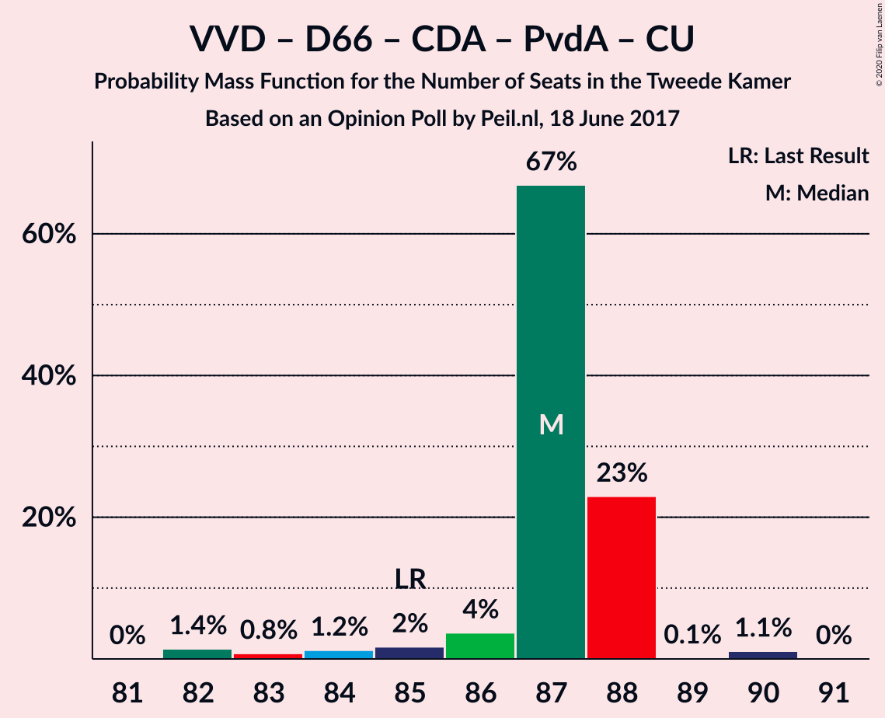

| Number of Seats | Probability | Accumulated | Special Marks |
|:---------------:|:-----------:|:-----------:|:-------------:|
| 82 | 1.4% | 100% |  |
| 83 | 0.8% | 98.5% |  |
| 84 | 1.2% | 98% |  |
| 85 | 2% | 97% | Last Result |
| 86 | 4% | 95% | Median |
| 87 | 67% | 91% |  |
| 88 | 23% | 24% |  |
| 89 | 0.1% | 1.3% |  |
| 90 | 1.1% | 1.1% |  |
| 91 | 0% | 0% |  |

### Volkspartij voor Vrijheid en Democratie – Partij voor de Vrijheid – Christen-Democratisch Appèl – Forum voor Democratie – Staatkundig Gereformeerde Partij

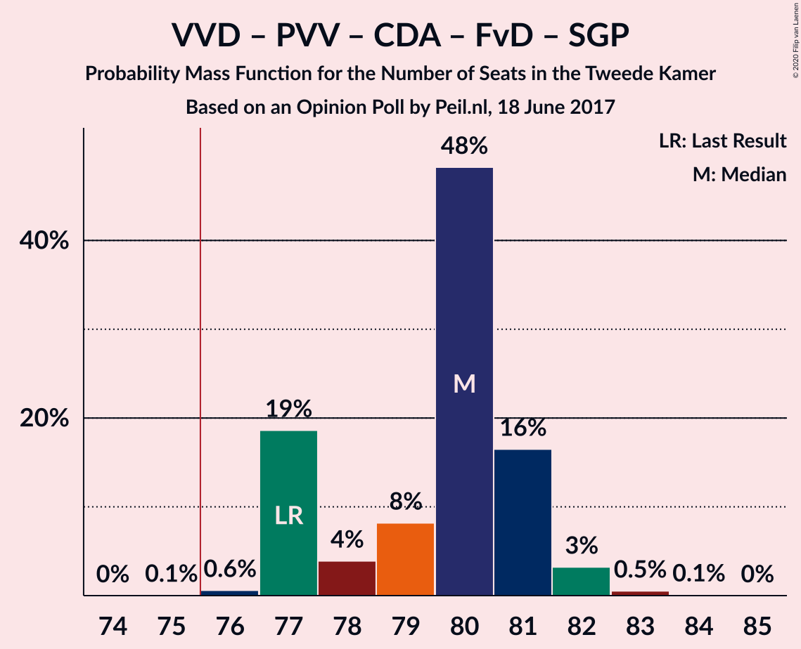

| Number of Seats | Probability | Accumulated | Special Marks |
|:---------------:|:-----------:|:-----------:|:-------------:|
| 75 | 0.1% | 100% |  |
| 76 | 0.6% | 99.9% | Majority |
| 77 | 19% | 99.3% | Last Result |
| 78 | 4% | 81% |  |
| 79 | 8% | 77% | Median |
| 80 | 48% | 69% |  |
| 81 | 16% | 20% |  |
| 82 | 3% | 4% |  |
| 83 | 0.5% | 0.6% |  |
| 84 | 0.1% | 0.1% |  |
| 85 | 0% | 0% |  |

### Democraten 66 – Christen-Democratisch Appèl – GroenLinks – Socialistische Partij – Partij van de Arbeid – ChristenUnie

| Number of Seats | Probability | Accumulated | Special Marks |
|:---------------:|:-----------:|:-----------:|:-------------:|
| 73 | 0.1% | 100% |  |
| 74 | 0.1% | 99.9% |  |
| 75 | 20% | 99.8% |  |
| 76 | 1.0% | 80% | Median, Majority |
| 77 | 16% | 78% |  |
| 78 | 37% | 63% |  |
| 79 | 3% | 26% |  |
| 80 | 22% | 22% | Last Result |
| 81 | 0.2% | 0.6% |  |
| 82 | 0% | 0.4% |  |
| 83 | 0.3% | 0.3% |  |
| 84 | 0% | 0% |  |

### Volkspartij voor Vrijheid en Democratie – Partij voor de Vrijheid – Christen-Democratisch Appèl – Forum voor Democratie

| Number of Seats | Probability | Accumulated | Special Marks |
|:---------------:|:-----------:|:-----------:|:-------------:|
| 72 | 0.1% | 100% |  |
| 73 | 0.7% | 99.9% |  |
| 74 | 18% | 99.3% | Last Result |
| 75 | 4% | 81% |  |
| 76 | 8% | 77% | Median, Majority |
| 77 | 48% | 69% |  |
| 78 | 17% | 20% |  |
| 79 | 3% | 4% |  |
| 80 | 0.5% | 0.7% |  |
| 81 | 0.1% | 0.1% |  |
| 82 | 0% | 0% |  |

### Volkspartij voor Vrijheid en Democratie – Democraten 66 – Christen-Democratisch Appèl – ChristenUnie

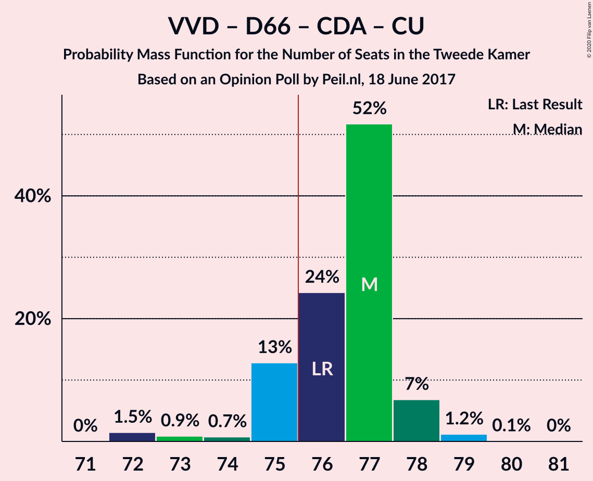

| Number of Seats | Probability | Accumulated | Special Marks |
|:---------------:|:-----------:|:-----------:|:-------------:|
| 72 | 1.5% | 100% |  |
| 73 | 0.9% | 98.5% |  |
| 74 | 0.7% | 98% |  |
| 75 | 13% | 97% | Median |
| 76 | 24% | 84% | Last Result, Majority |
| 77 | 52% | 60% |  |
| 78 | 7% | 8% |  |
| 79 | 1.2% | 1.3% |  |
| 80 | 0.1% | 0.1% |  |
| 81 | 0% | 0% |  |

### Volkspartij voor Vrijheid en Democratie – Partij voor de Vrijheid – Christen-Democratisch Appèl

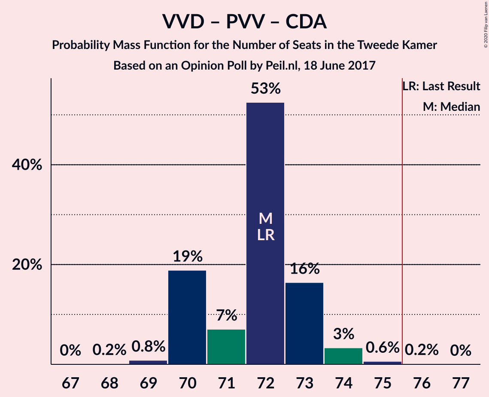

| Number of Seats | Probability | Accumulated | Special Marks |
|:---------------:|:-----------:|:-----------:|:-------------:|
| 68 | 0.2% | 100% |  |
| 69 | 0.8% | 99.8% |  |
| 70 | 19% | 99.0% |  |
| 71 | 7% | 80% | Median |
| 72 | 53% | 73% | Last Result |
| 73 | 16% | 21% |  |
| 74 | 3% | 4% |  |
| 75 | 0.6% | 0.8% |  |
| 76 | 0.2% | 0.2% | Majority |
| 77 | 0% | 0% |  |

### Volkspartij voor Vrijheid en Democratie – Democraten 66 – Christen-Democratisch Appèl

| Number of Seats | Probability | Accumulated | Special Marks |
|:---------------:|:-----------:|:-----------:|:-------------:|
| 67 | 0.1% | 100% |  |
| 68 | 2% | 99.9% |  |
| 69 | 0.2% | 98% |  |
| 70 | 31% | 98% |  |
| 71 | 3% | 67% | Last Result, Median |
| 72 | 5% | 64% |  |
| 73 | 59% | 59% |  |
| 74 | 0.1% | 0.2% |  |
| 75 | 0.1% | 0.1% |  |
| 76 | 0% | 0% | Majority |

### Democraten 66 – Christen-Democratisch Appèl – GroenLinks – Partij van de Arbeid – ChristenUnie

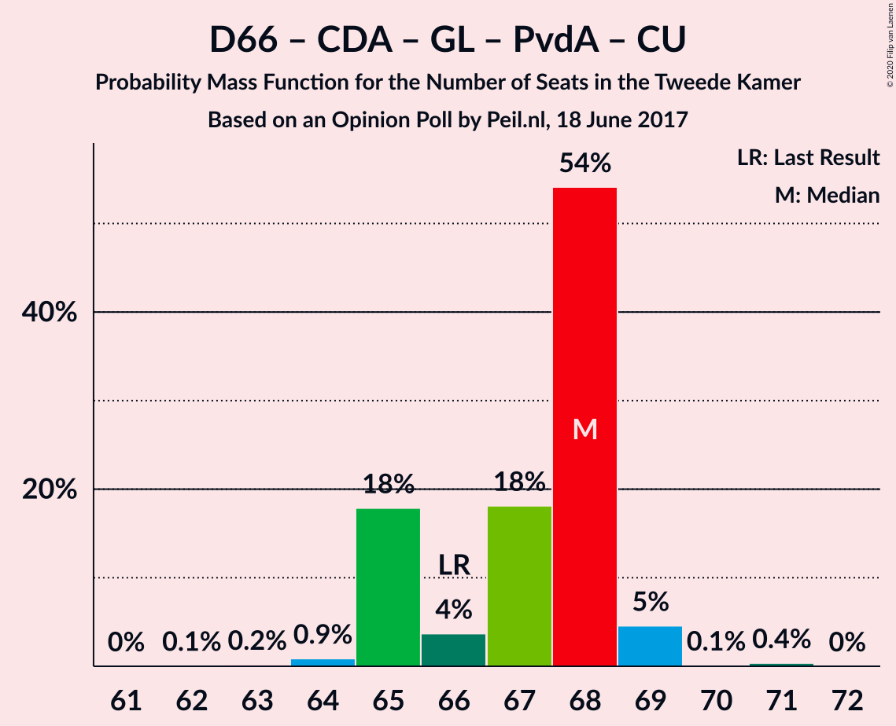

| Number of Seats | Probability | Accumulated | Special Marks |
|:---------------:|:-----------:|:-----------:|:-------------:|
| 62 | 0.1% | 100% |  |
| 63 | 0.2% | 99.9% |  |
| 64 | 0.9% | 99.7% |  |
| 65 | 18% | 98.9% |  |
| 66 | 4% | 81% | Last Result, Median |
| 67 | 18% | 77% |  |
| 68 | 54% | 59% |  |
| 69 | 5% | 5% |  |
| 70 | 0.1% | 0.5% |  |
| 71 | 0.4% | 0.4% |  |
| 72 | 0% | 0% |  |

### Volkspartij voor Vrijheid en Democratie – Democraten 66 – Partij van de Arbeid

| Number of Seats | Probability | Accumulated | Special Marks |
|:---------------:|:-----------:|:-----------:|:-------------:|
| 59 | 0% | 100% |  |
| 60 | 0% | 99.9% |  |
| 61 | 0.2% | 99.9% | Last Result |
| 62 | 2% | 99.7% |  |
| 63 | 7% | 98% |  |
| 64 | 21% | 91% |  |
| 65 | 37% | 70% | Median |
| 66 | 13% | 33% |  |
| 67 | 5% | 20% |  |
| 68 | 15% | 16% |  |
| 69 | 0.1% | 0.1% |  |
| 70 | 0% | 0% |  |

### Volkspartij voor Vrijheid en Democratie – Christen-Democratisch Appèl – Forum voor Democratie – 50Plus – Staatkundig Gereformeerde Partij

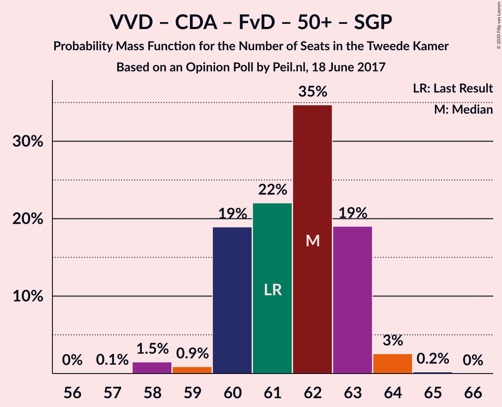

| Number of Seats | Probability | Accumulated | Special Marks |
|:---------------:|:-----------:|:-----------:|:-------------:|
| 57 | 0.1% | 100% |  |
| 58 | 1.5% | 99.9% |  |
| 59 | 0.9% | 98% |  |
| 60 | 19% | 97% |  |
| 61 | 22% | 79% | Last Result, Median |
| 62 | 35% | 57% |  |
| 63 | 19% | 22% |  |
| 64 | 3% | 3% |  |
| 65 | 0.2% | 0.2% |  |
| 66 | 0% | 0% |  |

### Volkspartij voor Vrijheid en Democratie – Christen-Democratisch Appèl – Partij van de Arbeid

| Number of Seats | Probability | Accumulated | Special Marks |
|:---------------:|:-----------:|:-----------:|:-------------:|
| 56 | 0% | 100% |  |
| 57 | 0.3% | 99.9% |  |
| 58 | 2% | 99.6% |  |
| 59 | 1.3% | 98% |  |
| 60 | 8% | 97% |  |
| 61 | 19% | 89% | Last Result |
| 62 | 45% | 70% | Median |
| 63 | 6% | 24% |  |
| 64 | 18% | 18% |  |
| 65 | 0.3% | 0.3% |  |
| 66 | 0% | 0% |  |

### Volkspartij voor Vrijheid en Democratie – Christen-Democratisch Appèl – Forum voor Democratie – 50Plus

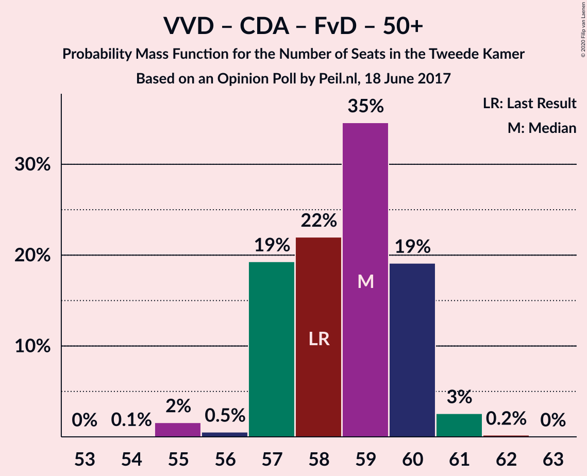

| Number of Seats | Probability | Accumulated | Special Marks |
|:---------------:|:-----------:|:-----------:|:-------------:|
| 54 | 0.1% | 100% |  |
| 55 | 2% | 99.9% |  |
| 56 | 0.5% | 98% |  |
| 57 | 19% | 98% |  |
| 58 | 22% | 79% | Last Result, Median |
| 59 | 35% | 57% |  |
| 60 | 19% | 22% |  |
| 61 | 3% | 3% |  |
| 62 | 0.2% | 0.2% |  |
| 63 | 0% | 0% |  |

### Volkspartij voor Vrijheid en Democratie – Christen-Democratisch Appèl – Forum voor Democratie – Staatkundig Gereformeerde Partij

| Number of Seats | Probability | Accumulated | Special Marks |
|:---------------:|:-----------:|:-----------:|:-------------:|
| 54 | 0% | 100% |  |
| 55 | 0.1% | 99.9% |  |
| 56 | 2% | 99.8% |  |
| 57 | 18% | 98% | Last Result |
| 58 | 21% | 79% |  |
| 59 | 3% | 59% | Median |
| 60 | 37% | 55% |  |
| 61 | 18% | 18% |  |
| 62 | 0.4% | 0.5% |  |
| 63 | 0% | 0% |  |

### Volkspartij voor Vrijheid en Democratie – Christen-Democratisch Appèl – Forum voor Democratie

| Number of Seats | Probability | Accumulated | Special Marks |
|:---------------:|:-----------:|:-----------:|:-------------:|
| 51 | 0% | 100% |  |
| 52 | 0.1% | 99.9% |  |
| 53 | 2% | 99.8% |  |
| 54 | 18% | 98% | Last Result |
| 55 | 21% | 80% |  |
| 56 | 3% | 59% | Median |
| 57 | 37% | 55% |  |
| 58 | 18% | 18% |  |
| 59 | 0.5% | 0.5% |  |
| 60 | 0% | 0% |  |

### Volkspartij voor Vrijheid en Democratie – Christen-Democratisch Appèl

| Number of Seats | Probability | Accumulated | Special Marks |
|:---------------:|:-----------:|:-----------:|:-------------:|
| 46 | 0.1% | 100% |  |
| 47 | 0.1% | 99.9% |  |
| 48 | 2% | 99.9% |  |
| 49 | 0.9% | 98% |  |
| 50 | 34% | 97% |  |
| 51 | 8% | 63% | Median |
| 52 | 34% | 56% | Last Result |
| 53 | 21% | 21% |  |
| 54 | 0.5% | 0.5% |  |
| 55 | 0% | 0% |  |

### Democraten 66 – Christen-Democratisch Appèl – Partij van de Arbeid

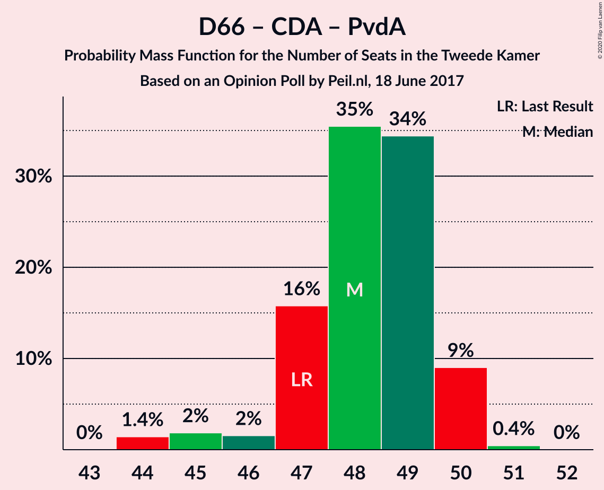

| Number of Seats | Probability | Accumulated | Special Marks |
|:---------------:|:-----------:|:-----------:|:-------------:|
| 44 | 1.4% | 100% |  |
| 45 | 2% | 98.6% |  |
| 46 | 2% | 97% |  |
| 47 | 16% | 95% | Last Result |
| 48 | 35% | 79% | Median |
| 49 | 34% | 44% |  |
| 50 | 9% | 9% |  |
| 51 | 0.4% | 0.5% |  |
| 52 | 0% | 0% |  |

### Volkspartij voor Vrijheid en Democratie – Partij van de Arbeid

| Number of Seats | Probability | Accumulated | Special Marks |
|:---------------:|:-----------:|:-----------:|:-------------:|
| 39 | 0.1% | 100% |  |
| 40 | 0.4% | 99.9% |  |
| 41 | 4% | 99.5% |  |
| 42 | 4% | 95% | Last Result |
| 43 | 2% | 91% |  |
| 44 | 52% | 89% |  |
| 45 | 4% | 37% | Median |
| 46 | 14% | 33% |  |
| 47 | 3% | 18% |  |
| 48 | 15% | 15% |  |
| 49 | 0% | 0% |  |

### Democraten 66 – Christen-Democratisch Appèl

| Number of Seats | Probability | Accumulated | Special Marks |
|:---------------:|:-----------:|:-----------:|:-------------:|
| 34 | 0.7% | 100% |  |
| 35 | 2% | 99.3% |  |
| 36 | 29% | 97% |  |
| 37 | 21% | 68% | Median |
| 38 | 7% | 47% | Last Result |
| 39 | 33% | 41% |  |
| 40 | 3% | 8% |  |
| 41 | 4% | 4% |  |
| 42 | 0% | 0% |  |

### Christen-Democratisch Appèl – Partij van de Arbeid – ChristenUnie

| Number of Seats | Probability | Accumulated | Special Marks |
|:---------------:|:-----------:|:-----------:|:-------------:|
| 27 | 0.1% | 100% |  |
| 28 | 0.1% | 99.9% |  |
| 29 | 2% | 99.8% |  |
| 30 | 1.0% | 98% |  |
| 31 | 17% | 97% |  |
| 32 | 39% | 80% | Median |
| 33 | 21% | 41% | Last Result |
| 34 | 19% | 20% |  |
| 35 | 0.9% | 1.0% |  |
| 36 | 0.1% | 0.1% |  |
| 37 | 0% | 0% |  |

### Christen-Democratisch Appèl – Partij van de Arbeid

| Number of Seats | Probability | Accumulated | Special Marks |
|:---------------:|:-----------:|:-----------:|:-------------:|
| 23 | 0.2% | 100% |  |
| 24 | 0.7% | 99.8% |  |
| 25 | 2% | 99.2% |  |
| 26 | 1.3% | 97% |  |
| 27 | 17% | 96% |  |
| 28 | 76% | 79% | Last Result, Median |
| 29 | 3% | 3% |  |
| 30 | 0.7% | 0.8% |  |
| 31 | 0% | 0% |  |

## Technical Information

### Opinion Poll

+ **Polling firm:** Peil.nl
+ **Commissioner(s):** —
+ **Fieldwork period:** 18 June 2017

### Calculations

+ **Sample size:** 3000
+ **Simulations done:** 1,048,576
+ **Error estimate:** 1.55%

