# Opinion Poll by Kantar Public, 12 July 2017

<a href="#voting-intentions">Voting Intentions</a> | <a href="#seats">Seats</a> | <a href="#coalitions">Coalitions</a> | <a href="#technical-information">Technical Information</a>

## Voting Intentions

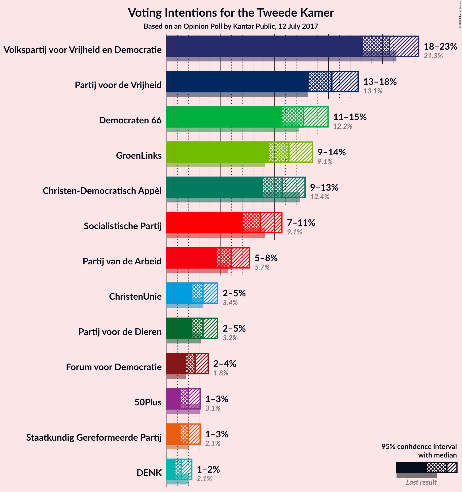

### Confidence Intervals

| Party | Last Result | Poll Result | 80% Confidence Interval | 90% Confidence Interval | 95% Confidence Interval | 99% Confidence Interval |
|:-----:|:-----------:|:-----------:|:-----------------------:|:-----------------------:|:-----------------------:|:-----------------------:|
| Volkspartij voor Vrijheid en Democratie | 21.3% | 20.6% | 19.0–22.4% |18.6–22.9% |18.2–23.4% |17.5–24.2% |
| Partij voor de Vrijheid | 13.1% | 15.3% | 13.9–16.9% |13.5–17.3% |13.2–17.7% |12.5–18.5% |
| Democraten 66 | 12.2% | 12.7% | 11.4–14.2% |11.0–14.6% |10.7–15.0% |10.1–15.7% |
| GroenLinks | 9.1% | 11.3% | 10.1–12.7% |9.8–13.1% |9.5–13.5% |8.9–14.2% |
| Christen-Democratisch Appèl | 12.4% | 10.7% | 9.5–12.1% |9.2–12.5% |8.9–12.8% |8.3–13.5% |
| Socialistische Partij | 9.1% | 8.7% | 7.6–10.0% |7.3–10.3% |7.1–10.7% |6.6–11.3% |
| Partij van de Arbeid | 5.7% | 6.0% | 5.1–7.1% |4.8–7.4% |4.6–7.7% |4.3–8.2% |
| ChristenUnie | 3.4% | 3.4% | 2.7–4.2% |2.5–4.5% |2.4–4.7% |2.1–5.2% |
| Partij voor de Dieren | 3.2% | 3.4% | 2.7–4.2% |2.5–4.5% |2.4–4.7% |2.1–5.2% |
| Forum voor Democratie | 1.8% | 2.6% | 2.1–3.4% |1.9–3.6% |1.8–3.8% |1.5–4.3% |
| 50Plus | 3.1% | 2.0% | 1.5–2.7% |1.4–2.9% |1.3–3.1% |1.1–3.5% |
| Staatkundig Gereformeerde Partij | 2.1% | 2.0% | 1.5–2.7% |1.4–2.9% |1.3–3.1% |1.1–3.5% |
| DENK | 2.1% | 1.4% | 1.0–2.0% |0.9–2.2% |0.8–2.3% |0.6–2.7% |

*Note:* The poll result column reflects the actual value used in the calculations. Published results may vary slightly, and in addition be rounded to fewer digits.

## Seats

### Confidence Intervals

| Party | Last Result | Median | 80% Confidence Interval | 90% Confidence Interval | 95% Confidence Interval | 99% Confidence Interval |
|:-----:|:-----------:|:------:|:-----------------------:|:-----------------------:|:-----------------------:|:-----------------------:|
| <a href="#volkspartij-voor-vrijheid-en-democratie">Volkspartij voor Vrijheid en Democratie</a> | 33 | 31 | 30–35 |28–35 |28–36 |25–37 |
| <a href="#partij-voor-de-vrijheid">Partij voor de Vrijheid</a> | 20 | 23 | 21–26 |21–26 |20–26 |19–27 |
| <a href="#democraten-66">Democraten 66</a> | 19 | 19 | 17–21 |17–21 |16–22 |16–23 |
| <a href="#groenlinks">GroenLinks</a> | 14 | 16 | 15–20 |15–20 |15–20 |13–22 |
| <a href="#christen-democratisch-appèl">Christen-Democratisch Appèl</a> | 19 | 16 | 13–18 |13–18 |13–19 |12–19 |
| <a href="#socialistische-partij">Socialistische Partij</a> | 14 | 13 | 12–16 |12–16 |12–16 |10–17 |
| <a href="#partij-van-de-arbeid">Partij van de Arbeid</a> | 9 | 9 | 8–11 |8–11 |7–11 |6–12 |
| <a href="#christenunie">ChristenUnie</a> | 5 | 5 | 4–6 |4–7 |4–7 |3–8 |
| <a href="#partij-voor-de-dieren">Partij voor de Dieren</a> | 5 | 5 | 3–6 |3–6 |3–6 |3–7 |
| <a href="#forum-voor-democratie">Forum voor Democratie</a> | 2 | 4 | 3–5 |2–5 |2–5 |2–5 |
| <a href="#50plus">50Plus</a> | 4 | 2 | 2–4 |1–4 |1–4 |1–5 |
| <a href="#staatkundig-gereformeerde-partij">Staatkundig Gereformeerde Partij</a> | 3 | 4 | 1–4 |1–4 |1–4 |1–5 |
| <a href="#denk">DENK</a> | 3 | 2 | 1–3 |1–3 |1–3 |1–3 |

### Volkspartij voor Vrijheid en Democratie

*For a full overview of the results for this party, see the [Volkspartij voor Vrijheid en Democratie](party-volkspartijvoorvrijheidendemocratie.html) page.*

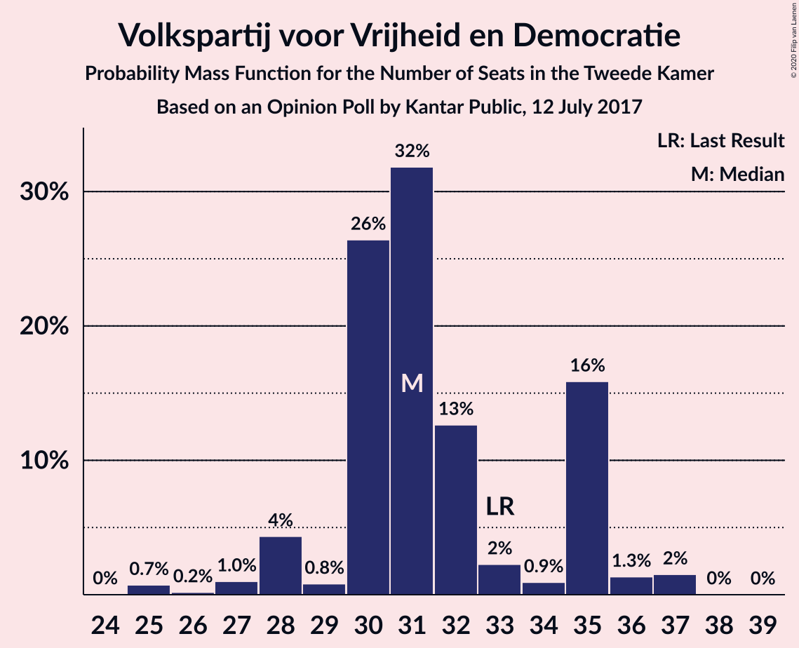

| Number of Seats | Probability | Accumulated | Special Marks |
|:---------------:|:-----------:|:-----------:|:-------------:|
| 25 | 0.7% | 100% |  |
| 26 | 0.2% | 99.2% |  |
| 27 | 1.0% | 99.0% |  |
| 28 | 4% | 98% |  |
| 29 | 0.8% | 94% |  |
| 30 | 26% | 93% |  |
| 31 | 32% | 66% | Median |
| 32 | 13% | 35% |  |
| 33 | 2% | 22% | Last Result |
| 34 | 0.9% | 20% |  |
| 35 | 16% | 19% |  |
| 36 | 1.3% | 3% |  |
| 37 | 2% | 2% |  |
| 38 | 0% | 0.1% |  |
| 39 | 0% | 0% |  |

### Partij voor de Vrijheid

*For a full overview of the results for this party, see the [Partij voor de Vrijheid](party-partijvoordevrijheid.html) page.*

| Number of Seats | Probability | Accumulated | Special Marks |
|:---------------:|:-----------:|:-----------:|:-------------:|
| 18 | 0% | 100% |  |
| 19 | 0.5% | 99.9% |  |
| 20 | 2% | 99.4% | Last Result |
| 21 | 17% | 97% |  |
| 22 | 13% | 80% |  |
| 23 | 38% | 67% | Median |
| 24 | 8% | 29% |  |
| 25 | 2% | 21% |  |
| 26 | 18% | 19% |  |
| 27 | 0.9% | 1.3% |  |
| 28 | 0.3% | 0.4% |  |
| 29 | 0.1% | 0.1% |  |
| 30 | 0% | 0% |  |

### Democraten 66

*For a full overview of the results for this party, see the [Democraten 66](party-democraten66.html) page.*

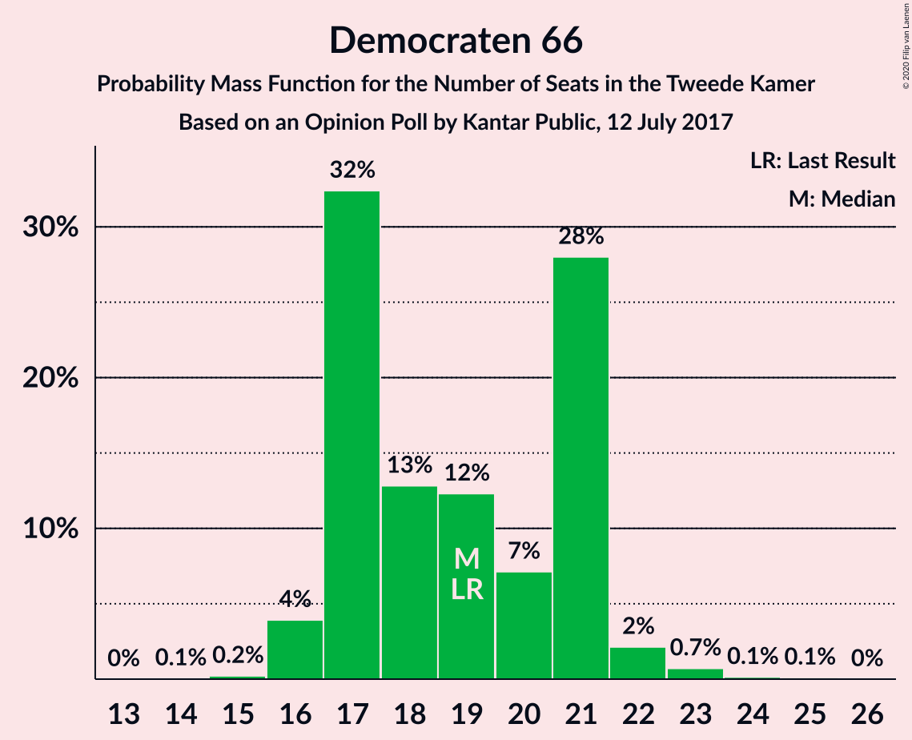

| Number of Seats | Probability | Accumulated | Special Marks |
|:---------------:|:-----------:|:-----------:|:-------------:|
| 14 | 0.1% | 100% |  |
| 15 | 0.2% | 99.9% |  |
| 16 | 4% | 99.7% |  |
| 17 | 32% | 96% |  |
| 18 | 13% | 63% |  |
| 19 | 12% | 51% | Last Result, Median |
| 20 | 7% | 38% |  |
| 21 | 28% | 31% |  |
| 22 | 2% | 3% |  |
| 23 | 0.7% | 1.0% |  |
| 24 | 0.1% | 0.3% |  |
| 25 | 0.1% | 0.1% |  |
| 26 | 0% | 0% |  |

### GroenLinks

*For a full overview of the results for this party, see the [GroenLinks](party-groenlinks.html) page.*

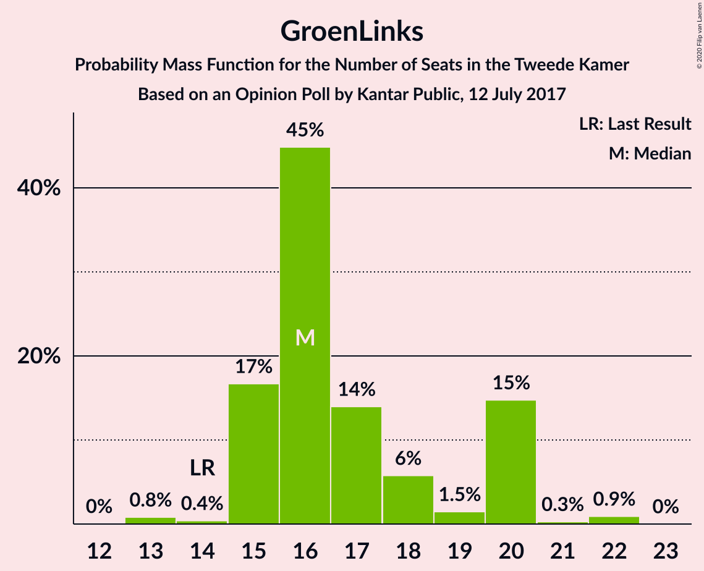

| Number of Seats | Probability | Accumulated | Special Marks |
|:---------------:|:-----------:|:-----------:|:-------------:|
| 13 | 0.8% | 100% |  |
| 14 | 0.4% | 99.1% | Last Result |
| 15 | 17% | 98.7% |  |
| 16 | 45% | 82% | Median |
| 17 | 14% | 37% |  |
| 18 | 6% | 23% |  |
| 19 | 1.5% | 17% |  |
| 20 | 15% | 16% |  |
| 21 | 0.3% | 1.2% |  |
| 22 | 0.9% | 0.9% |  |
| 23 | 0% | 0% |  |

### Christen-Democratisch Appèl

*For a full overview of the results for this party, see the [Christen-Democratisch Appèl](party-christen-democratischappèl.html) page.*

| Number of Seats | Probability | Accumulated | Special Marks |
|:---------------:|:-----------:|:-----------:|:-------------:|
| 12 | 0.8% | 100% |  |
| 13 | 13% | 99.1% |  |
| 14 | 2% | 87% |  |
| 15 | 20% | 85% |  |
| 16 | 19% | 65% | Median |
| 17 | 24% | 46% |  |
| 18 | 17% | 21% |  |
| 19 | 4% | 4% | Last Result |
| 20 | 0.1% | 0.2% |  |
| 21 | 0% | 0.1% |  |
| 22 | 0% | 0% |  |

### Socialistische Partij

*For a full overview of the results for this party, see the [Socialistische Partij](party-socialistischepartij.html) page.*

| Number of Seats | Probability | Accumulated | Special Marks |
|:---------------:|:-----------:|:-----------:|:-------------:|
| 10 | 0.8% | 100% |  |
| 11 | 2% | 99.1% |  |
| 12 | 20% | 98% |  |
| 13 | 36% | 77% | Median |
| 14 | 17% | 41% | Last Result |
| 15 | 1.0% | 23% |  |
| 16 | 20% | 22% |  |
| 17 | 2% | 2% |  |
| 18 | 0% | 0.1% |  |
| 19 | 0% | 0% |  |

### Partij van de Arbeid

*For a full overview of the results for this party, see the [Partij van de Arbeid](party-partijvandearbeid.html) page.*

| Number of Seats | Probability | Accumulated | Special Marks |
|:---------------:|:-----------:|:-----------:|:-------------:|
| 6 | 0.6% | 100% |  |
| 7 | 3% | 99.3% |  |
| 8 | 14% | 96% |  |
| 9 | 45% | 83% | Last Result, Median |
| 10 | 12% | 38% |  |
| 11 | 24% | 25% |  |
| 12 | 1.0% | 1.2% |  |
| 13 | 0.2% | 0.2% |  |
| 14 | 0% | 0% |  |

### ChristenUnie

*For a full overview of the results for this party, see the [ChristenUnie](party-christenunie.html) page.*

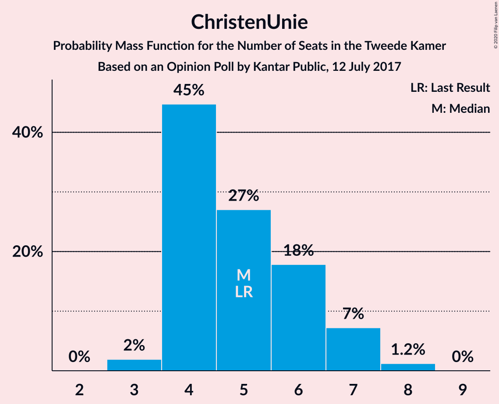

| Number of Seats | Probability | Accumulated | Special Marks |
|:---------------:|:-----------:|:-----------:|:-------------:|
| 3 | 2% | 100% |  |
| 4 | 45% | 98% |  |
| 5 | 27% | 53% | Last Result, Median |
| 6 | 18% | 26% |  |
| 7 | 7% | 8% |  |
| 8 | 1.2% | 1.2% |  |
| 9 | 0% | 0% |  |

### Partij voor de Dieren

*For a full overview of the results for this party, see the [Partij voor de Dieren](party-partijvoordedieren.html) page.*

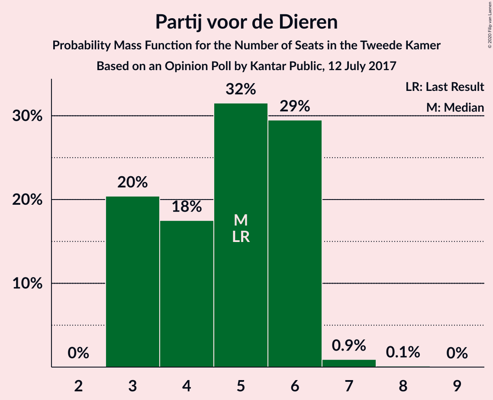

| Number of Seats | Probability | Accumulated | Special Marks |
|:---------------:|:-----------:|:-----------:|:-------------:|
| 3 | 20% | 100% |  |
| 4 | 18% | 80% |  |
| 5 | 32% | 62% | Last Result, Median |
| 6 | 29% | 31% |  |
| 7 | 0.9% | 1.1% |  |
| 8 | 0.1% | 0.1% |  |
| 9 | 0% | 0% |  |

### Forum voor Democratie

*For a full overview of the results for this party, see the [Forum voor Democratie](party-forumvoordemocratie.html) page.*

| Number of Seats | Probability | Accumulated | Special Marks |
|:---------------:|:-----------:|:-----------:|:-------------:|
| 2 | 6% | 100% | Last Result |
| 3 | 23% | 94% |  |
| 4 | 54% | 71% | Median |
| 5 | 17% | 17% |  |
| 6 | 0.2% | 0.3% |  |
| 7 | 0.1% | 0.1% |  |
| 8 | 0% | 0% |  |

### 50Plus

*For a full overview of the results for this party, see the [50Plus](party-50plus.html) page.*

| Number of Seats | Probability | Accumulated | Special Marks |
|:---------------:|:-----------:|:-----------:|:-------------:|
| 1 | 7% | 100% |  |
| 2 | 55% | 93% | Median |
| 3 | 20% | 39% |  |
| 4 | 19% | 19% | Last Result |
| 5 | 0.5% | 0.5% |  |
| 6 | 0% | 0% |  |

### Staatkundig Gereformeerde Partij

*For a full overview of the results for this party, see the [Staatkundig Gereformeerde Partij](party-staatkundiggereformeerdepartij.html) page.*

| Number of Seats | Probability | Accumulated | Special Marks |
|:---------------:|:-----------:|:-----------:|:-------------:|
| 1 | 15% | 100% |  |
| 2 | 29% | 85% |  |
| 3 | 5% | 56% | Last Result |
| 4 | 49% | 51% | Median |
| 5 | 1.4% | 2% |  |
| 6 | 0.1% | 0.1% |  |
| 7 | 0% | 0% |  |

### DENK

*For a full overview of the results for this party, see the [DENK](party-denk.html) page.*

| Number of Seats | Probability | Accumulated | Special Marks |
|:---------------:|:-----------:|:-----------:|:-------------:|
| 0 | 0.5% | 100% |  |
| 1 | 44% | 99.5% |  |
| 2 | 34% | 55% | Median |
| 3 | 21% | 22% | Last Result |
| 4 | 0.3% | 0.3% |  |
| 5 | 0% | 0% |  |

## Coalitions

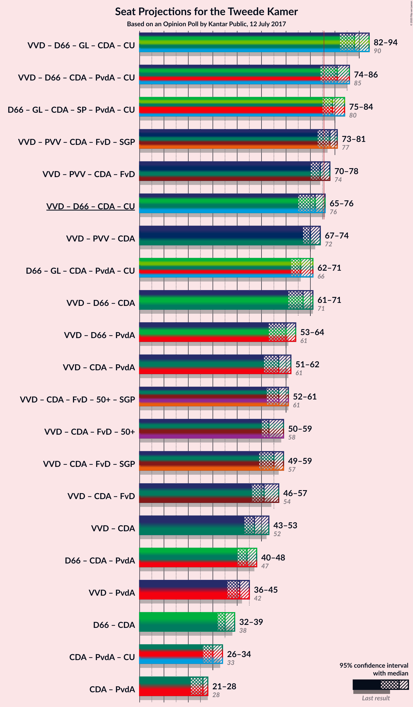

### Confidence Intervals

| Coalition | Last Result | Median | Majority? | 80% Confidence Interval | 90% Confidence Interval | 95% Confidence Interval | 99% Confidence Interval |
|:---------:|:-----------:|:------:|:---------:|:-----------------------:|:-----------------------:|:-----------------------:|:-----------------------:|
| Volkspartij voor Vrijheid en Democratie – Democraten 66 – GroenLinks – Christen-Democratisch Appèl – ChristenUnie | 90 | 88 | 100% | 82–92 | 82–92 | 82–94 | 82–95 |
| Volkspartij voor Vrijheid en Democratie – Democraten 66 – Christen-Democratisch Appèl – Partij van de Arbeid – ChristenUnie | 85 | 81 | 95% | 77–85 | 76–85 | 74–86 | 73–87 |
| Democraten 66 – GroenLinks – Christen-Democratisch Appèl – Socialistische Partij – Partij van de Arbeid – ChristenUnie | 80 | 79 | 82% | 75–83 | 75–84 | 75–84 | 74–86 |
| Volkspartij voor Vrijheid en Democratie – Partij voor de Vrijheid – Christen-Democratisch Appèl – Forum voor Democratie – Staatkundig Gereformeerde Partij | 77 | 78 | 66% | 74–81 | 73–81 | 73–81 | 71–84 |
| Volkspartij voor Vrijheid en Democratie – Partij voor de Vrijheid – Christen-Democratisch Appèl – Forum voor Democratie | 74 | 74 | 38% | 71–78 | 71–78 | 70–78 | 69–81 |
| Volkspartij voor Vrijheid en Democratie – Democraten 66 – Christen-Democratisch Appèl – ChristenUnie | 76 | 72 | 17% | 67–76 | 67–76 | 65–76 | 64–78 |
| Volkspartij voor Vrijheid en Democratie – Partij voor de Vrijheid – Christen-Democratisch Appèl | 72 | 70 | 2% | 67–74 | 67–74 | 67–74 | 65–77 |
| Democraten 66 – GroenLinks – Christen-Democratisch Appèl – Partij van de Arbeid – ChristenUnie | 66 | 66 | 0% | 62–70 | 62–71 | 62–71 | 60–72 |
| Volkspartij voor Vrijheid en Democratie – Democraten 66 – Christen-Democratisch Appèl | 71 | 67 | 0.1% | 63–70 | 62–70 | 61–71 | 59–73 |
| Volkspartij voor Vrijheid en Democratie – Democraten 66 – Partij van de Arbeid | 61 | 60 | 0% | 59–62 | 56–63 | 53–64 | 53–66 |
| Volkspartij voor Vrijheid en Democratie – Christen-Democratisch Appèl – Partij van de Arbeid | 61 | 57 | 0% | 53–62 | 53–62 | 51–62 | 48–65 |
| Volkspartij voor Vrijheid en Democratie – Christen-Democratisch Appèl – Forum voor Democratie – 50Plus – Staatkundig Gereformeerde Partij | 61 | 57 | 0% | 54–61 | 52–61 | 52–61 | 49–63 |
| Volkspartij voor Vrijheid en Democratie – Christen-Democratisch Appèl – Forum voor Democratie – 50Plus | 58 | 53 | 0% | 50–59 | 50–59 | 50–59 | 47–60 |
| Volkspartij voor Vrijheid en Democratie – Christen-Democratisch Appèl – Forum voor Democratie – Staatkundig Gereformeerde Partij | 57 | 55 | 0% | 51–59 | 50–59 | 49–59 | 46–59 |
| Volkspartij voor Vrijheid en Democratie – Christen-Democratisch Appèl – Forum voor Democratie | 54 | 51 | 0% | 49–57 | 48–57 | 46–57 | 44–57 |
| Volkspartij voor Vrijheid en Democratie – Christen-Democratisch Appèl | 52 | 47 | 0% | 45–53 | 44–53 | 43–53 | 40–54 |
| Democraten 66 – Christen-Democratisch Appèl – Partij van de Arbeid | 47 | 44 | 0% | 40–48 | 40–48 | 40–48 | 39–50 |
| Volkspartij voor Vrijheid en Democratie – Partij van de Arbeid | 42 | 41 | 0% | 39–44 | 37–44 | 36–45 | 33–48 |
| Democraten 66 – Christen-Democratisch Appèl | 38 | 35 | 0% | 32–38 | 32–39 | 32–39 | 30–39 |
| Christen-Democratisch Appèl – Partij van de Arbeid – ChristenUnie | 33 | 30 | 0% | 26–33 | 26–34 | 26–34 | 26–34 |
| Christen-Democratisch Appèl – Partij van de Arbeid | 28 | 26 | 0% | 21–27 | 21–28 | 21–28 | 20–29 |

### Volkspartij voor Vrijheid en Democratie – Democraten 66 – GroenLinks – Christen-Democratisch Appèl – ChristenUnie

| Number of Seats | Probability | Accumulated | Special Marks |
|:---------------:|:-----------:|:-----------:|:-------------:|
| 81 | 0.1% | 100% |  |
| 82 | 16% | 99.9% |  |
| 83 | 0.4% | 84% |  |
| 84 | 1.4% | 83% |  |
| 85 | 4% | 82% |  |
| 86 | 12% | 78% |  |
| 87 | 1.1% | 65% | Median |
| 88 | 21% | 64% |  |
| 89 | 0.7% | 44% |  |
| 90 | 17% | 43% | Last Result |
| 91 | 2% | 26% |  |
| 92 | 21% | 25% |  |
| 93 | 0.8% | 4% |  |
| 94 | 3% | 3% |  |
| 95 | 0.6% | 0.6% |  |
| 96 | 0% | 0.1% |  |
| 97 | 0% | 0% |  |

### Volkspartij voor Vrijheid en Democratie – Democraten 66 – Christen-Democratisch Appèl – Partij van de Arbeid – ChristenUnie

| Number of Seats | Probability | Accumulated | Special Marks |
|:---------------:|:-----------:|:-----------:|:-------------:|
| 73 | 0.5% | 100% |  |
| 74 | 3% | 99.4% |  |
| 75 | 1.1% | 96% |  |
| 76 | 0.3% | 95% | Majority |
| 77 | 13% | 95% |  |
| 78 | 16% | 82% |  |
| 79 | 2% | 66% |  |
| 80 | 11% | 64% | Median |
| 81 | 21% | 53% |  |
| 82 | 0.8% | 32% |  |
| 83 | 5% | 31% |  |
| 84 | 0.6% | 26% |  |
| 85 | 22% | 25% | Last Result |
| 86 | 2% | 3% |  |
| 87 | 0.3% | 0.6% |  |
| 88 | 0% | 0.3% |  |
| 89 | 0.2% | 0.3% |  |
| 90 | 0.1% | 0.1% |  |
| 91 | 0% | 0% |  |

### Democraten 66 – GroenLinks – Christen-Democratisch Appèl – Socialistische Partij – Partij van de Arbeid – ChristenUnie

| Number of Seats | Probability | Accumulated | Special Marks |
|:---------------:|:-----------:|:-----------:|:-------------:|
| 71 | 0% | 100% |  |
| 72 | 0.1% | 99.9% |  |
| 73 | 0.2% | 99.9% |  |
| 74 | 1.3% | 99.7% |  |
| 75 | 16% | 98% |  |
| 76 | 12% | 82% | Majority |
| 77 | 0.5% | 70% |  |
| 78 | 3% | 69% | Median |
| 79 | 19% | 67% |  |
| 80 | 0.7% | 48% | Last Result |
| 81 | 12% | 47% |  |
| 82 | 1.0% | 35% |  |
| 83 | 28% | 34% |  |
| 84 | 5% | 6% |  |
| 85 | 0.3% | 1.0% |  |
| 86 | 0.6% | 0.7% |  |
| 87 | 0.1% | 0.1% |  |
| 88 | 0% | 0% |  |

### Volkspartij voor Vrijheid en Democratie – Partij voor de Vrijheid – Christen-Democratisch Appèl – Forum voor Democratie – Staatkundig Gereformeerde Partij

| Number of Seats | Probability | Accumulated | Special Marks |
|:---------------:|:-----------:|:-----------:|:-------------:|
| 69 | 0.1% | 100% |  |
| 70 | 0.1% | 99.9% |  |
| 71 | 0.7% | 99.8% |  |
| 72 | 0.7% | 99.1% |  |
| 73 | 4% | 98% |  |
| 74 | 10% | 94% |  |
| 75 | 18% | 84% |  |
| 76 | 8% | 66% | Majority |
| 77 | 2% | 58% | Last Result |
| 78 | 20% | 56% | Median |
| 79 | 1.0% | 35% |  |
| 80 | 16% | 34% |  |
| 81 | 17% | 19% |  |
| 82 | 0.4% | 1.1% |  |
| 83 | 0.1% | 0.7% |  |
| 84 | 0.5% | 0.6% |  |
| 85 | 0.1% | 0.1% |  |
| 86 | 0% | 0% |  |

### Volkspartij voor Vrijheid en Democratie – Partij voor de Vrijheid – Christen-Democratisch Appèl – Forum voor Democratie

| Number of Seats | Probability | Accumulated | Special Marks |
|:---------------:|:-----------:|:-----------:|:-------------:|
| 66 | 0.1% | 100% |  |
| 67 | 0.1% | 99.9% |  |
| 68 | 0.1% | 99.8% |  |
| 69 | 0.8% | 99.8% |  |
| 70 | 3% | 99.0% |  |
| 71 | 14% | 96% |  |
| 72 | 3% | 82% |  |
| 73 | 17% | 79% |  |
| 74 | 19% | 62% | Last Result, Median |
| 75 | 5% | 42% |  |
| 76 | 3% | 38% | Majority |
| 77 | 16% | 34% |  |
| 78 | 16% | 18% |  |
| 79 | 1.3% | 2% |  |
| 80 | 0.3% | 0.9% |  |
| 81 | 0.6% | 0.6% |  |
| 82 | 0% | 0.1% |  |
| 83 | 0% | 0% |  |

### Volkspartij voor Vrijheid en Democratie – Democraten 66 – Christen-Democratisch Appèl – ChristenUnie

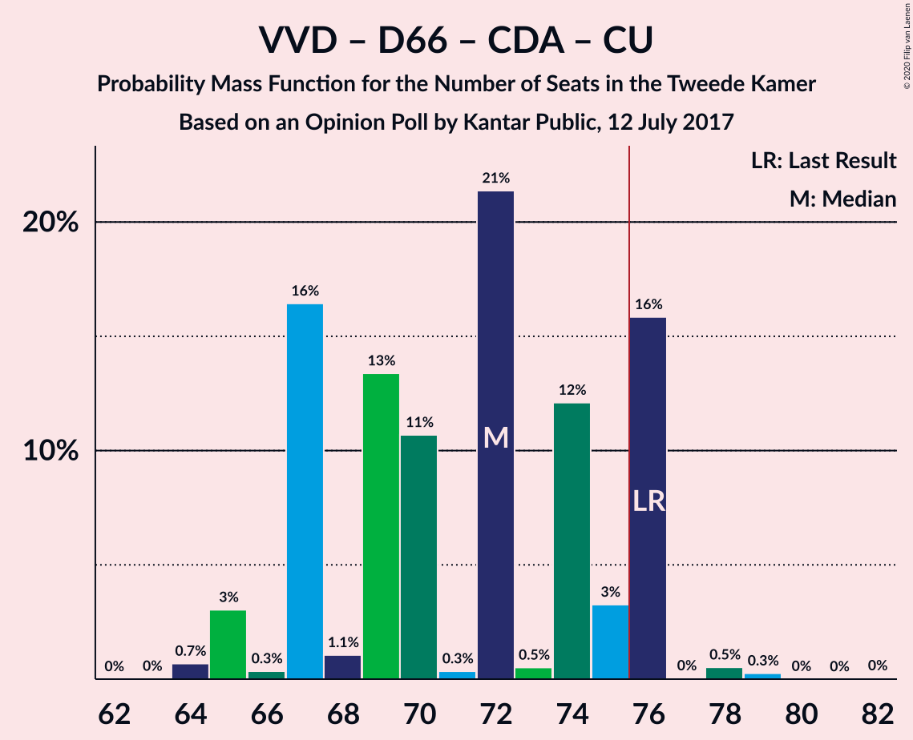

| Number of Seats | Probability | Accumulated | Special Marks |
|:---------------:|:-----------:|:-----------:|:-------------:|
| 64 | 0.7% | 100% |  |
| 65 | 3% | 99.3% |  |
| 66 | 0.3% | 96% |  |
| 67 | 16% | 96% |  |
| 68 | 1.1% | 79% |  |
| 69 | 13% | 78% |  |
| 70 | 11% | 65% |  |
| 71 | 0.3% | 54% | Median |
| 72 | 21% | 54% |  |
| 73 | 0.5% | 33% |  |
| 74 | 12% | 32% |  |
| 75 | 3% | 20% |  |
| 76 | 16% | 17% | Last Result, Majority |
| 77 | 0% | 0.9% |  |
| 78 | 0.5% | 0.8% |  |
| 79 | 0.3% | 0.3% |  |
| 80 | 0% | 0.1% |  |
| 81 | 0% | 0% |  |

### Volkspartij voor Vrijheid en Democratie – Partij voor de Vrijheid – Christen-Democratisch Appèl

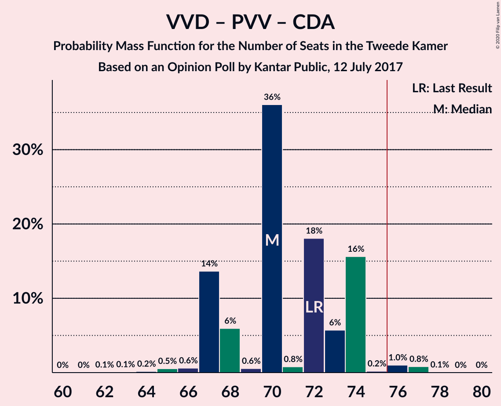

| Number of Seats | Probability | Accumulated | Special Marks |
|:---------------:|:-----------:|:-----------:|:-------------:|
| 62 | 0.1% | 100% |  |
| 63 | 0.1% | 99.9% |  |
| 64 | 0.2% | 99.8% |  |
| 65 | 0.5% | 99.7% |  |
| 66 | 0.6% | 99.1% |  |
| 67 | 14% | 98.5% |  |
| 68 | 6% | 85% |  |
| 69 | 0.6% | 79% |  |
| 70 | 36% | 78% | Median |
| 71 | 0.8% | 42% |  |
| 72 | 18% | 42% | Last Result |
| 73 | 6% | 23% |  |
| 74 | 16% | 18% |  |
| 75 | 0.2% | 2% |  |
| 76 | 1.0% | 2% | Majority |
| 77 | 0.8% | 0.9% |  |
| 78 | 0.1% | 0.1% |  |
| 79 | 0% | 0% |  |

### Democraten 66 – GroenLinks – Christen-Democratisch Appèl – Partij van de Arbeid – ChristenUnie

| Number of Seats | Probability | Accumulated | Special Marks |
|:---------------:|:-----------:|:-----------:|:-------------:|
| 59 | 0.1% | 100% |  |
| 60 | 0.6% | 99.9% |  |
| 61 | 0.6% | 99.3% |  |
| 62 | 28% | 98.7% |  |
| 63 | 1.1% | 71% |  |
| 64 | 1.5% | 70% |  |
| 65 | 1.3% | 69% | Median |
| 66 | 20% | 67% | Last Result |
| 67 | 21% | 47% |  |
| 68 | 0.9% | 26% |  |
| 69 | 11% | 25% |  |
| 70 | 5% | 14% |  |
| 71 | 7% | 8% |  |
| 72 | 0.5% | 0.8% |  |
| 73 | 0% | 0.3% |  |
| 74 | 0.1% | 0.3% |  |
| 75 | 0.2% | 0.2% |  |
| 76 | 0% | 0% | Majority |

### Volkspartij voor Vrijheid en Democratie – Democraten 66 – Christen-Democratisch Appèl

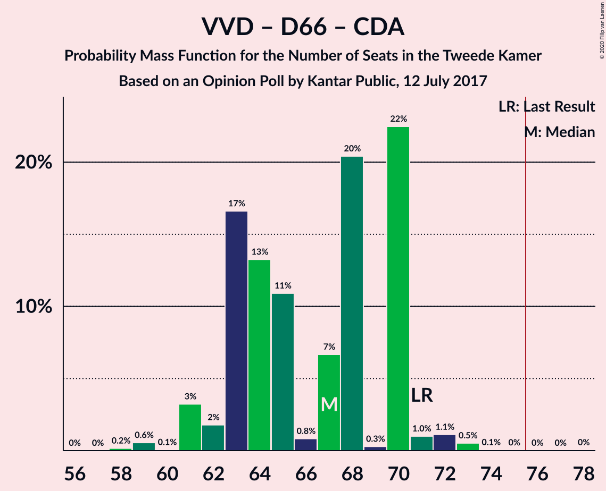

| Number of Seats | Probability | Accumulated | Special Marks |
|:---------------:|:-----------:|:-----------:|:-------------:|
| 58 | 0.2% | 100% |  |
| 59 | 0.6% | 99.8% |  |
| 60 | 0.1% | 99.3% |  |
| 61 | 3% | 99.2% |  |
| 62 | 2% | 96% |  |
| 63 | 17% | 94% |  |
| 64 | 13% | 78% |  |
| 65 | 11% | 64% |  |
| 66 | 0.8% | 53% | Median |
| 67 | 7% | 53% |  |
| 68 | 20% | 46% |  |
| 69 | 0.3% | 26% |  |
| 70 | 22% | 25% |  |
| 71 | 1.0% | 3% | Last Result |
| 72 | 1.1% | 2% |  |
| 73 | 0.5% | 0.7% |  |
| 74 | 0.1% | 0.1% |  |
| 75 | 0% | 0.1% |  |
| 76 | 0% | 0.1% | Majority |
| 77 | 0% | 0% |  |

### Volkspartij voor Vrijheid en Democratie – Democraten 66 – Partij van de Arbeid

| Number of Seats | Probability | Accumulated | Special Marks |
|:---------------:|:-----------:|:-----------:|:-------------:|
| 53 | 3% | 100% |  |
| 54 | 1.4% | 97% |  |
| 55 | 0.2% | 95% |  |
| 56 | 1.2% | 95% |  |
| 57 | 0.5% | 94% |  |
| 58 | 2% | 93% |  |
| 59 | 38% | 91% | Median |
| 60 | 23% | 53% |  |
| 61 | 16% | 30% | Last Result |
| 62 | 7% | 14% |  |
| 63 | 2% | 6% |  |
| 64 | 2% | 4% |  |
| 65 | 0.5% | 2% |  |
| 66 | 1.0% | 1.4% |  |
| 67 | 0.3% | 0.3% |  |
| 68 | 0% | 0.1% |  |
| 69 | 0% | 0% |  |

### Volkspartij voor Vrijheid en Democratie – Christen-Democratisch Appèl – Partij van de Arbeid

| Number of Seats | Probability | Accumulated | Special Marks |
|:---------------:|:-----------:|:-----------:|:-------------:|
| 48 | 0.5% | 100% |  |
| 49 | 0.1% | 99.5% |  |
| 50 | 1.3% | 99.4% |  |
| 51 | 0.6% | 98% |  |
| 52 | 2% | 97% |  |
| 53 | 12% | 96% |  |
| 54 | 4% | 84% |  |
| 55 | 1.2% | 80% |  |
| 56 | 19% | 79% | Median |
| 57 | 34% | 59% |  |
| 58 | 0.7% | 25% |  |
| 59 | 5% | 24% |  |
| 60 | 2% | 19% |  |
| 61 | 0.3% | 17% | Last Result |
| 62 | 16% | 17% |  |
| 63 | 0% | 1.3% |  |
| 64 | 0.3% | 1.3% |  |
| 65 | 1.0% | 1.0% |  |
| 66 | 0% | 0% |  |

### Volkspartij voor Vrijheid en Democratie – Christen-Democratisch Appèl – Forum voor Democratie – 50Plus – Staatkundig Gereformeerde Partij

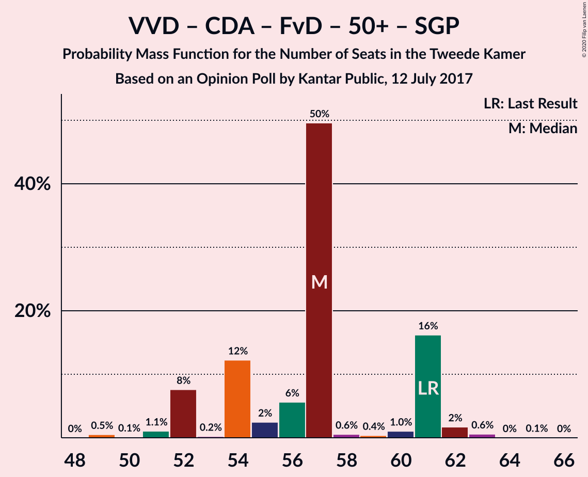

| Number of Seats | Probability | Accumulated | Special Marks |
|:---------------:|:-----------:|:-----------:|:-------------:|
| 49 | 0.5% | 100% |  |
| 50 | 0.1% | 99.4% |  |
| 51 | 1.1% | 99.3% |  |
| 52 | 8% | 98% |  |
| 53 | 0.2% | 91% |  |
| 54 | 12% | 90% |  |
| 55 | 2% | 78% |  |
| 56 | 6% | 76% |  |
| 57 | 50% | 70% | Median |
| 58 | 0.6% | 21% |  |
| 59 | 0.4% | 20% |  |
| 60 | 1.0% | 20% |  |
| 61 | 16% | 19% | Last Result |
| 62 | 2% | 2% |  |
| 63 | 0.6% | 0.7% |  |
| 64 | 0% | 0.1% |  |
| 65 | 0.1% | 0.1% |  |
| 66 | 0% | 0% |  |

### Volkspartij voor Vrijheid en Democratie – Christen-Democratisch Appèl – Forum voor Democratie – 50Plus

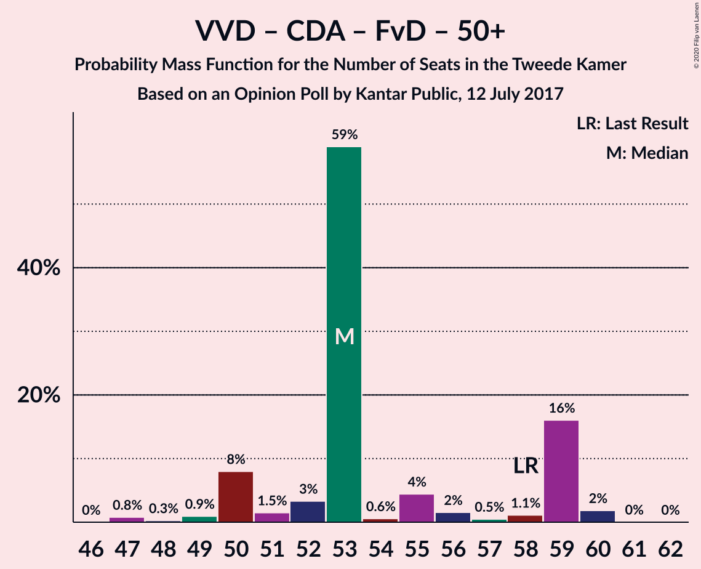

| Number of Seats | Probability | Accumulated | Special Marks |
|:---------------:|:-----------:|:-----------:|:-------------:|
| 47 | 0.8% | 100% |  |
| 48 | 0.3% | 99.2% |  |
| 49 | 0.9% | 98.9% |  |
| 50 | 8% | 98% |  |
| 51 | 1.5% | 90% |  |
| 52 | 3% | 88% |  |
| 53 | 59% | 85% | Median |
| 54 | 0.6% | 26% |  |
| 55 | 4% | 26% |  |
| 56 | 2% | 21% |  |
| 57 | 0.5% | 20% |  |
| 58 | 1.1% | 19% | Last Result |
| 59 | 16% | 18% |  |
| 60 | 2% | 2% |  |
| 61 | 0% | 0.1% |  |
| 62 | 0% | 0% |  |

### Volkspartij voor Vrijheid en Democratie – Christen-Democratisch Appèl – Forum voor Democratie – Staatkundig Gereformeerde Partij

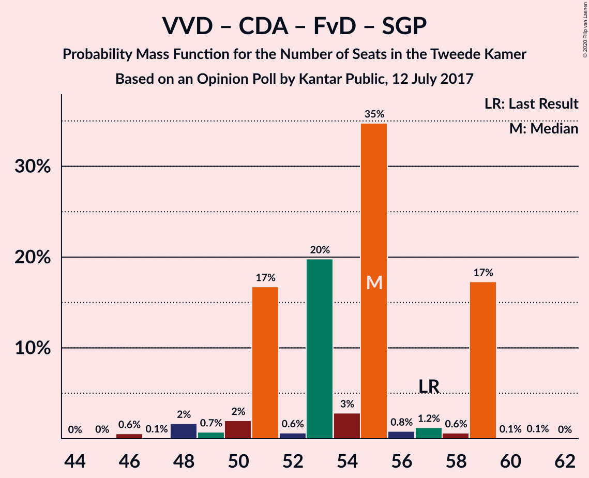

| Number of Seats | Probability | Accumulated | Special Marks |
|:---------------:|:-----------:|:-----------:|:-------------:|
| 46 | 0.6% | 100% |  |
| 47 | 0.1% | 99.4% |  |
| 48 | 2% | 99.3% |  |
| 49 | 0.7% | 98% |  |
| 50 | 2% | 97% |  |
| 51 | 17% | 95% |  |
| 52 | 0.6% | 78% |  |
| 53 | 20% | 78% |  |
| 54 | 3% | 58% |  |
| 55 | 35% | 55% | Median |
| 56 | 0.8% | 20% |  |
| 57 | 1.2% | 19% | Last Result |
| 58 | 0.6% | 18% |  |
| 59 | 17% | 17% |  |
| 60 | 0.1% | 0.2% |  |
| 61 | 0.1% | 0.1% |  |
| 62 | 0% | 0% |  |

### Volkspartij voor Vrijheid en Democratie – Christen-Democratisch Appèl – Forum voor Democratie

| Number of Seats | Probability | Accumulated | Special Marks |
|:---------------:|:-----------:|:-----------:|:-------------:|
| 44 | 0.6% | 100% |  |
| 45 | 0.2% | 99.3% |  |
| 46 | 2% | 99.1% |  |
| 47 | 0.8% | 97% |  |
| 48 | 2% | 96% |  |
| 49 | 21% | 94% |  |
| 50 | 12% | 73% |  |
| 51 | 35% | 61% | Median |
| 52 | 5% | 26% |  |
| 53 | 1.4% | 21% |  |
| 54 | 0.6% | 19% | Last Result |
| 55 | 1.4% | 19% |  |
| 56 | 0.6% | 18% |  |
| 57 | 17% | 17% |  |
| 58 | 0.1% | 0.1% |  |
| 59 | 0% | 0% |  |

### Volkspartij voor Vrijheid en Democratie – Christen-Democratisch Appèl

| Number of Seats | Probability | Accumulated | Special Marks |
|:---------------:|:-----------:|:-----------:|:-------------:|
| 40 | 0.5% | 100% |  |
| 41 | 0.5% | 99.4% |  |
| 42 | 0.3% | 99.0% |  |
| 43 | 2% | 98.7% |  |
| 44 | 2% | 97% |  |
| 45 | 15% | 95% |  |
| 46 | 23% | 80% |  |
| 47 | 30% | 57% | Median |
| 48 | 2% | 27% |  |
| 49 | 2% | 25% |  |
| 50 | 4% | 23% |  |
| 51 | 2% | 19% |  |
| 52 | 0.3% | 17% | Last Result |
| 53 | 16% | 17% |  |
| 54 | 1.0% | 1.1% |  |
| 55 | 0% | 0.1% |  |
| 56 | 0% | 0.1% |  |
| 57 | 0% | 0% |  |

### Democraten 66 – Christen-Democratisch Appèl – Partij van de Arbeid

| Number of Seats | Probability | Accumulated | Special Marks |
|:---------------:|:-----------:|:-----------:|:-------------:|
| 37 | 0.1% | 100% |  |
| 38 | 0.1% | 99.9% |  |
| 39 | 0.7% | 99.8% |  |
| 40 | 12% | 99.2% |  |
| 41 | 3% | 87% |  |
| 42 | 4% | 84% |  |
| 43 | 17% | 81% |  |
| 44 | 28% | 64% | Median |
| 45 | 0.8% | 36% |  |
| 46 | 3% | 35% |  |
| 47 | 19% | 32% | Last Result |
| 48 | 11% | 12% |  |
| 49 | 0.3% | 2% |  |
| 50 | 1.1% | 1.2% |  |
| 51 | 0% | 0.1% |  |
| 52 | 0.1% | 0.1% |  |
| 53 | 0% | 0% |  |

### Volkspartij voor Vrijheid en Democratie – Partij van de Arbeid

| Number of Seats | Probability | Accumulated | Special Marks |
|:---------------:|:-----------:|:-----------:|:-------------:|
| 33 | 0.5% | 100% |  |
| 34 | 0.4% | 99.4% |  |
| 35 | 1.0% | 99.1% |  |
| 36 | 0.5% | 98% |  |
| 37 | 4% | 97% |  |
| 38 | 2% | 94% |  |
| 39 | 20% | 92% |  |
| 40 | 16% | 72% | Median |
| 41 | 17% | 56% |  |
| 42 | 19% | 39% | Last Result |
| 43 | 0.8% | 20% |  |
| 44 | 16% | 19% |  |
| 45 | 1.4% | 3% |  |
| 46 | 0.1% | 1.5% |  |
| 47 | 0.1% | 1.4% |  |
| 48 | 1.3% | 1.3% |  |
| 49 | 0% | 0% |  |

### Democraten 66 – Christen-Democratisch Appèl

| Number of Seats | Probability | Accumulated | Special Marks |
|:---------------:|:-----------:|:-----------:|:-------------:|
| 28 | 0% | 100% |  |
| 29 | 0.1% | 99.9% |  |
| 30 | 1.3% | 99.9% |  |
| 31 | 0.6% | 98.6% |  |
| 32 | 28% | 98% |  |
| 33 | 3% | 70% |  |
| 34 | 12% | 67% |  |
| 35 | 18% | 55% | Median |
| 36 | 3% | 37% |  |
| 37 | 8% | 34% |  |
| 38 | 20% | 26% | Last Result |
| 39 | 6% | 6% |  |
| 40 | 0% | 0.3% |  |
| 41 | 0.2% | 0.3% |  |
| 42 | 0.1% | 0.1% |  |
| 43 | 0% | 0% |  |

### Christen-Democratisch Appèl – Partij van de Arbeid – ChristenUnie

| Number of Seats | Probability | Accumulated | Special Marks |
|:---------------:|:-----------:|:-----------:|:-------------:|
| 24 | 0.2% | 100% |  |
| 25 | 0.1% | 99.7% |  |
| 26 | 12% | 99.6% |  |
| 27 | 2% | 88% |  |
| 28 | 5% | 86% |  |
| 29 | 2% | 82% |  |
| 30 | 38% | 80% | Median |
| 31 | 13% | 41% |  |
| 32 | 5% | 29% |  |
| 33 | 16% | 24% | Last Result |
| 34 | 7% | 8% |  |
| 35 | 0.3% | 0.3% |  |
| 36 | 0% | 0.1% |  |
| 37 | 0% | 0% |  |

### Christen-Democratisch Appèl – Partij van de Arbeid

| Number of Seats | Probability | Accumulated | Special Marks |
|:---------------:|:-----------:|:-----------:|:-------------:|
| 20 | 1.2% | 100% |  |
| 21 | 12% | 98.7% |  |
| 22 | 1.0% | 87% |  |
| 23 | 2% | 86% |  |
| 24 | 4% | 84% |  |
| 25 | 2% | 79% | Median |
| 26 | 48% | 77% |  |
| 27 | 22% | 29% |  |
| 28 | 5% | 7% | Last Result |
| 29 | 1.3% | 1.4% |  |
| 30 | 0.1% | 0.2% |  |
| 31 | 0% | 0% |  |

## Technical Information

### Opinion Poll

+ **Polling firm:** Kantar Public
+ **Commissioner(s):** —
+ **Fieldwork period:** 12 July 2017

### Calculations

+ **Sample size:** 954
+ **Simulations done:** 1,048,576
+ **Error estimate:** 2.30%

