# Opinion Poll by Peil.nl, 27 August 2017

<a href="#voting-intentions">Voting Intentions</a> | <a href="#seats">Seats</a> | <a href="#coalitions">Coalitions</a> | <a href="#technical-information">Technical Information</a>

## Voting Intentions

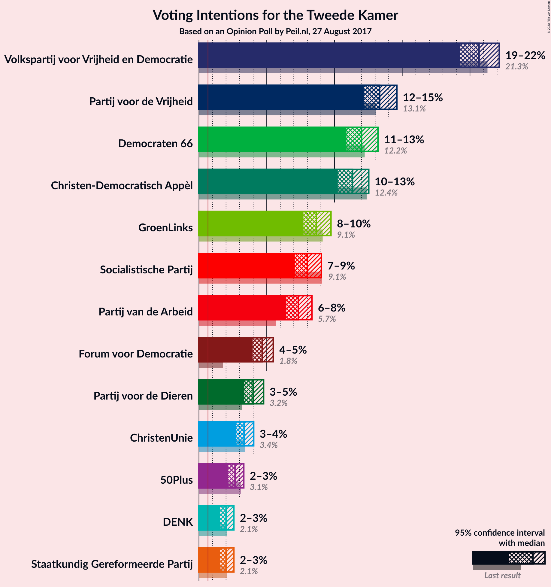

### Confidence Intervals

| Party | Last Result | Poll Result | 80% Confidence Interval | 90% Confidence Interval | 95% Confidence Interval | 99% Confidence Interval |
|:-----:|:-----------:|:-----------:|:-----------------------:|:-----------------------:|:-----------------------:|:-----------------------:|
| Volkspartij voor Vrijheid en Democratie | 21.3% | 20.7% | 19.7–21.6% |19.5–21.9% |19.3–22.2% |18.8–22.6% |
| Partij voor de Vrijheid | 13.1% | 13.3% | 12.6–14.2% |12.3–14.4% |12.2–14.6% |11.8–15.0% |
| Democraten 66 | 12.2% | 12.0% | 11.3–12.8% |11.1–13.0% |10.9–13.2% |10.5–13.6% |
| Christen-Democratisch Appèl | 12.4% | 11.3% | 10.6–12.1% |10.4–12.3% |10.2–12.5% |9.9–12.9% |
| GroenLinks | 9.1% | 8.7% | 8.0–9.4% |7.8–9.6% |7.7–9.7% |7.4–10.1% |
| Socialistische Partij | 9.1% | 8.0% | 7.4–8.7% |7.2–8.9% |7.1–9.0% |6.8–9.4% |
| Partij van de Arbeid | 5.7% | 7.3% | 6.8–8.0% |6.6–8.2% |6.4–8.3% |6.2–8.6% |
| Forum voor Democratie | 1.8% | 4.7% | 4.2–5.2% |4.1–5.3% |4.0–5.5% |3.7–5.8% |
| Partij voor de Dieren | 3.2% | 4.0% | 3.6–4.5% |3.4–4.6% |3.4–4.8% |3.2–5.0% |
| ChristenUnie | 3.4% | 3.3% | 2.9–3.8% |2.8–3.9% |2.7–4.0% |2.6–4.3% |
| 50Plus | 3.1% | 2.7% | 2.3–3.1% |2.2–3.2% |2.1–3.3% |2.0–3.5% |
| Staatkundig Gereformeerde Partij | 2.1% | 2.0% | 1.7–2.4% |1.6–2.5% |1.6–2.6% |1.4–2.8% |
| DENK | 2.1% | 2.0% | 1.7–2.4% |1.6–2.5% |1.6–2.6% |1.4–2.8% |

*Note:* The poll result column reflects the actual value used in the calculations. Published results may vary slightly, and in addition be rounded to fewer digits.

## Seats

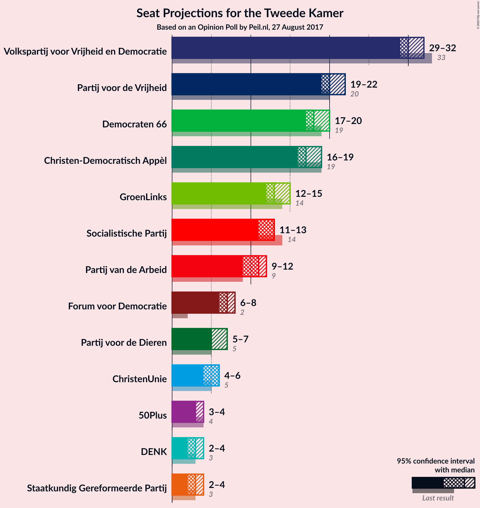

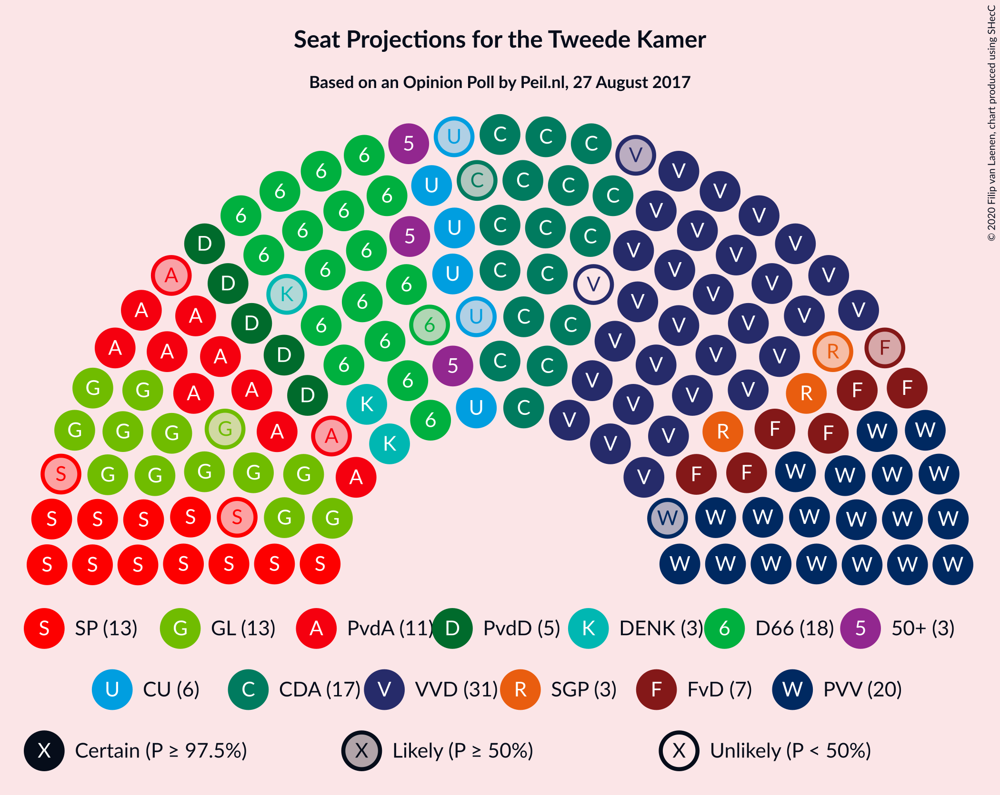

### Confidence Intervals

| Party | Last Result | Median | 80% Confidence Interval | 90% Confidence Interval | 95% Confidence Interval | 99% Confidence Interval |
|:-----:|:-----------:|:------:|:-----------------------:|:-----------------------:|:-----------------------:|:-----------------------:|
| <a href="#volkspartij-voor-vrijheid-en-democratie">Volkspartij voor Vrijheid en Democratie</a> | 33 | 30 | 29–31 |29–32 |29–32 |29–34 |
| <a href="#partij-voor-de-vrijheid">Partij voor de Vrijheid</a> | 20 | 20 | 20–22 |19–22 |19–22 |18–22 |
| <a href="#democraten-66">Democraten 66</a> | 19 | 18 | 18–20 |17–20 |17–20 |17–20 |
| <a href="#christen-democratisch-appèl">Christen-Democratisch Appèl</a> | 19 | 17 | 16–18 |16–19 |16–19 |15–19 |
| <a href="#groenlinks">GroenLinks</a> | 14 | 13 | 12–13 |12–14 |12–15 |12–15 |
| <a href="#socialistische-partij">Socialistische Partij</a> | 14 | 13 | 12–13 |11–13 |11–13 |10–15 |
| <a href="#partij-van-de-arbeid">Partij van de Arbeid</a> | 9 | 11 | 10–12 |10–12 |9–12 |9–13 |
| <a href="#forum-voor-democratie">Forum voor Democratie</a> | 2 | 7 | 7 |6–8 |6–8 |6–9 |
| <a href="#partij-voor-de-dieren">Partij voor de Dieren</a> | 5 | 5 | 5–6 |5–6 |5–7 |4–7 |
| <a href="#christenunie">ChristenUnie</a> | 5 | 6 | 5–6 |4–6 |4–6 |4–7 |
| <a href="#50plus">50Plus</a> | 4 | 3 | 3–4 |3–4 |3–4 |3–5 |
| <a href="#staatkundig-gereformeerde-partij">Staatkundig Gereformeerde Partij</a> | 3 | 3 | 2–4 |2–4 |2–4 |2–4 |
| <a href="#denk">DENK</a> | 3 | 3 | 3 |2–3 |2–4 |2–4 |

### Volkspartij voor Vrijheid en Democratie

*For a full overview of the results for this party, see the [Volkspartij voor Vrijheid en Democratie](party-volkspartijvoorvrijheidendemocratie.html) page.*

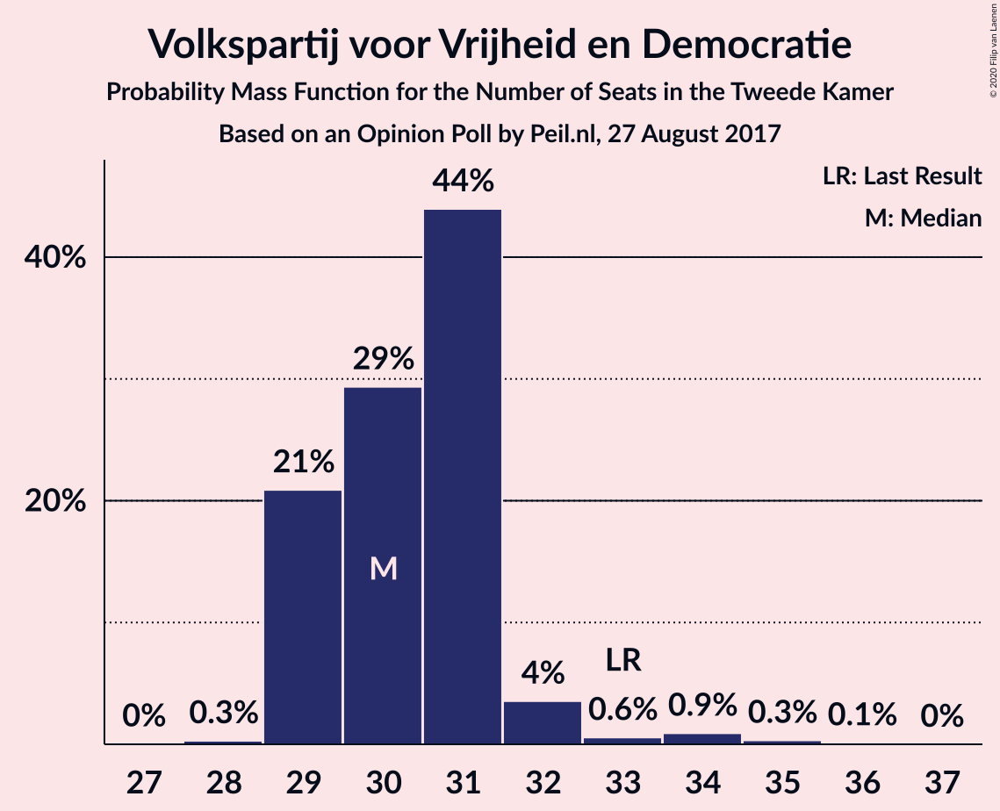

| Number of Seats | Probability | Accumulated | Special Marks |
|:---------------:|:-----------:|:-----------:|:-------------:|
| 28 | 0.3% | 100% |  |
| 29 | 21% | 99.7% |  |
| 30 | 29% | 79% | Median |
| 31 | 44% | 49% |  |
| 32 | 4% | 5% |  |
| 33 | 0.6% | 2% | Last Result |
| 34 | 0.9% | 1.4% |  |
| 35 | 0.3% | 0.5% |  |
| 36 | 0.1% | 0.1% |  |
| 37 | 0% | 0% |  |

### Partij voor de Vrijheid

*For a full overview of the results for this party, see the [Partij voor de Vrijheid](party-partijvoordevrijheid.html) page.*

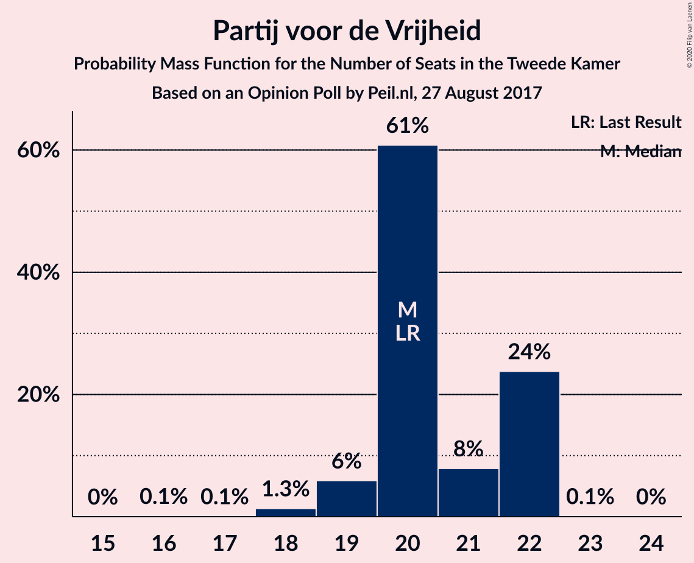

| Number of Seats | Probability | Accumulated | Special Marks |
|:---------------:|:-----------:|:-----------:|:-------------:|
| 16 | 0.1% | 100% |  |
| 17 | 0.1% | 99.9% |  |
| 18 | 1.3% | 99.8% |  |
| 19 | 6% | 98% |  |
| 20 | 61% | 93% | Last Result, Median |
| 21 | 8% | 32% |  |
| 22 | 24% | 24% |  |
| 23 | 0.1% | 0.1% |  |
| 24 | 0% | 0% |  |

### Democraten 66

*For a full overview of the results for this party, see the [Democraten 66](party-democraten66.html) page.*

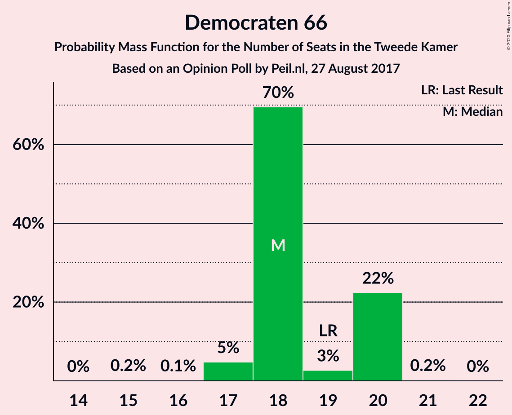

| Number of Seats | Probability | Accumulated | Special Marks |
|:---------------:|:-----------:|:-----------:|:-------------:|
| 15 | 0.2% | 100% |  |
| 16 | 0.1% | 99.8% |  |
| 17 | 5% | 99.6% |  |
| 18 | 70% | 95% | Median |
| 19 | 3% | 25% | Last Result |
| 20 | 22% | 23% |  |
| 21 | 0.2% | 0.2% |  |
| 22 | 0% | 0% |  |

### Christen-Democratisch Appèl

*For a full overview of the results for this party, see the [Christen-Democratisch Appèl](party-christen-democratischappèl.html) page.*

| Number of Seats | Probability | Accumulated | Special Marks |
|:---------------:|:-----------:|:-----------:|:-------------:|
| 14 | 0.5% | 100% |  |
| 15 | 0.2% | 99.5% |  |
| 16 | 24% | 99.4% |  |
| 17 | 56% | 75% | Median |
| 18 | 11% | 19% |  |
| 19 | 7% | 8% | Last Result |
| 20 | 0.2% | 0.4% |  |
| 21 | 0.2% | 0.2% |  |
| 22 | 0% | 0% |  |

### GroenLinks

*For a full overview of the results for this party, see the [GroenLinks](party-groenlinks.html) page.*

| Number of Seats | Probability | Accumulated | Special Marks |
|:---------------:|:-----------:|:-----------:|:-------------:|
| 11 | 0.4% | 100% |  |
| 12 | 43% | 99.5% |  |
| 13 | 49% | 57% | Median |
| 14 | 5% | 8% | Last Result |
| 15 | 3% | 3% |  |
| 16 | 0.4% | 0.4% |  |
| 17 | 0% | 0% |  |

### Socialistische Partij

*For a full overview of the results for this party, see the [Socialistische Partij](party-socialistischepartij.html) page.*

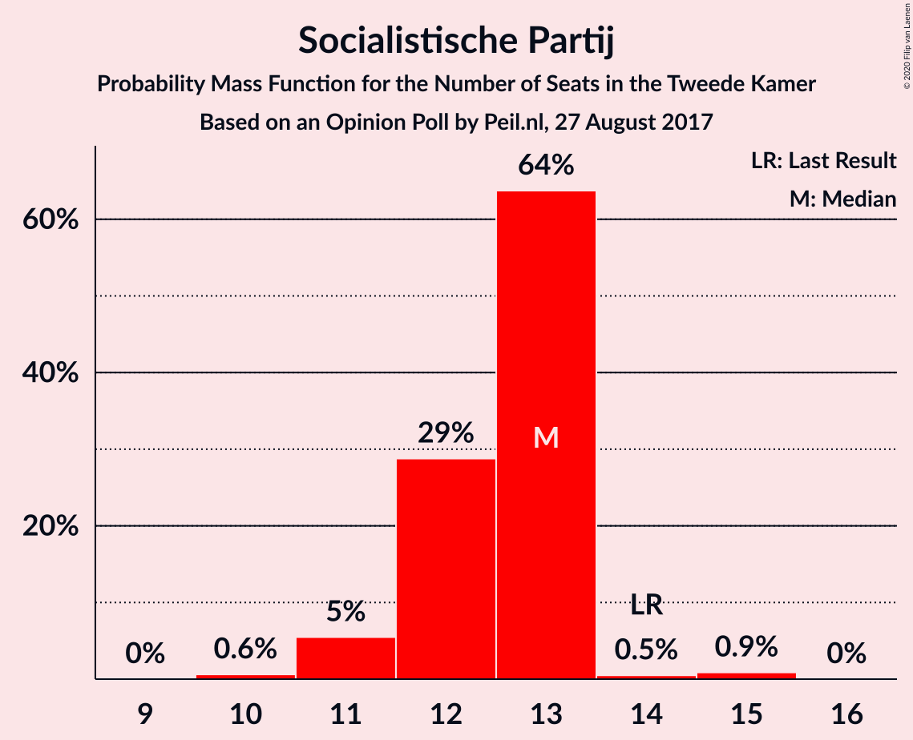

| Number of Seats | Probability | Accumulated | Special Marks |
|:---------------:|:-----------:|:-----------:|:-------------:|
| 10 | 0.6% | 100% |  |
| 11 | 5% | 99.4% |  |
| 12 | 29% | 94% |  |
| 13 | 64% | 65% | Median |
| 14 | 0.5% | 1.4% | Last Result |
| 15 | 0.9% | 0.9% |  |
| 16 | 0% | 0% |  |

### Partij van de Arbeid

*For a full overview of the results for this party, see the [Partij van de Arbeid](party-partijvandearbeid.html) page.*

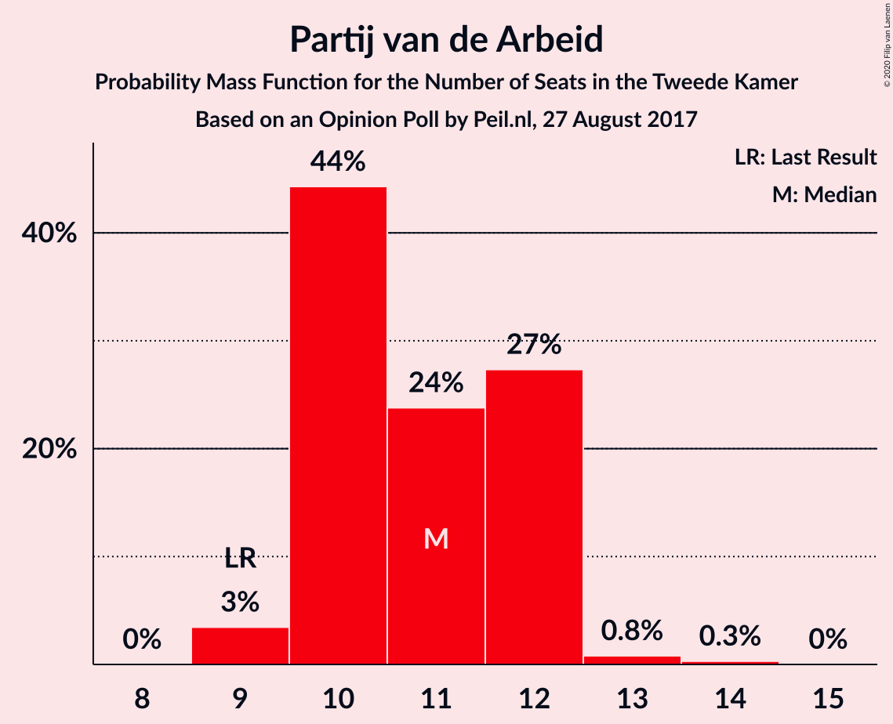

| Number of Seats | Probability | Accumulated | Special Marks |
|:---------------:|:-----------:|:-----------:|:-------------:|
| 9 | 3% | 100% | Last Result |
| 10 | 44% | 97% |  |
| 11 | 24% | 52% | Median |
| 12 | 27% | 28% |  |
| 13 | 0.8% | 1.1% |  |
| 14 | 0.3% | 0.3% |  |
| 15 | 0% | 0% |  |

### Forum voor Democratie

*For a full overview of the results for this party, see the [Forum voor Democratie](party-forumvoordemocratie.html) page.*

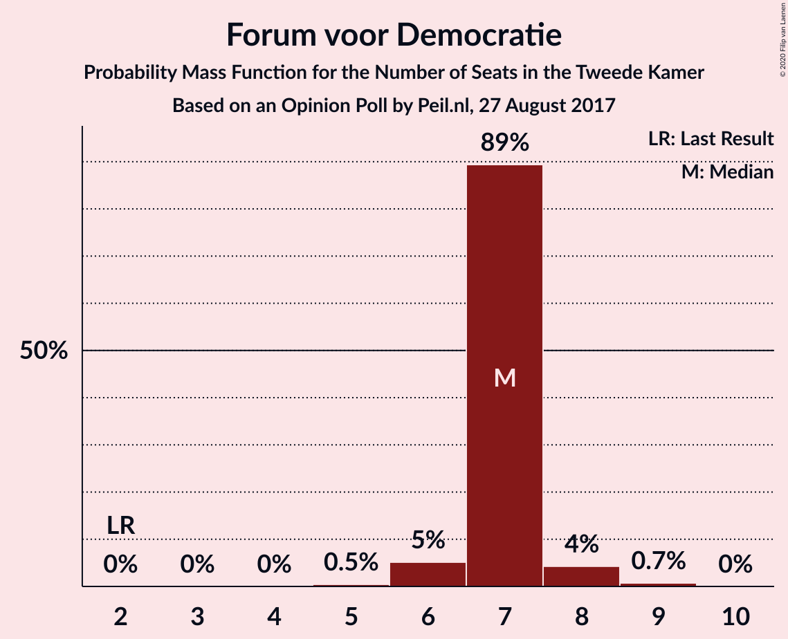

| Number of Seats | Probability | Accumulated | Special Marks |
|:---------------:|:-----------:|:-----------:|:-------------:|
| 2 | 0% | 100% | Last Result |
| 3 | 0% | 100% |  |
| 4 | 0% | 100% |  |
| 5 | 0.5% | 100% |  |
| 6 | 5% | 99.5% |  |
| 7 | 89% | 94% | Median |
| 8 | 4% | 5% |  |
| 9 | 0.7% | 0.7% |  |
| 10 | 0% | 0% |  |

### Partij voor de Dieren

*For a full overview of the results for this party, see the [Partij voor de Dieren](party-partijvoordedieren.html) page.*

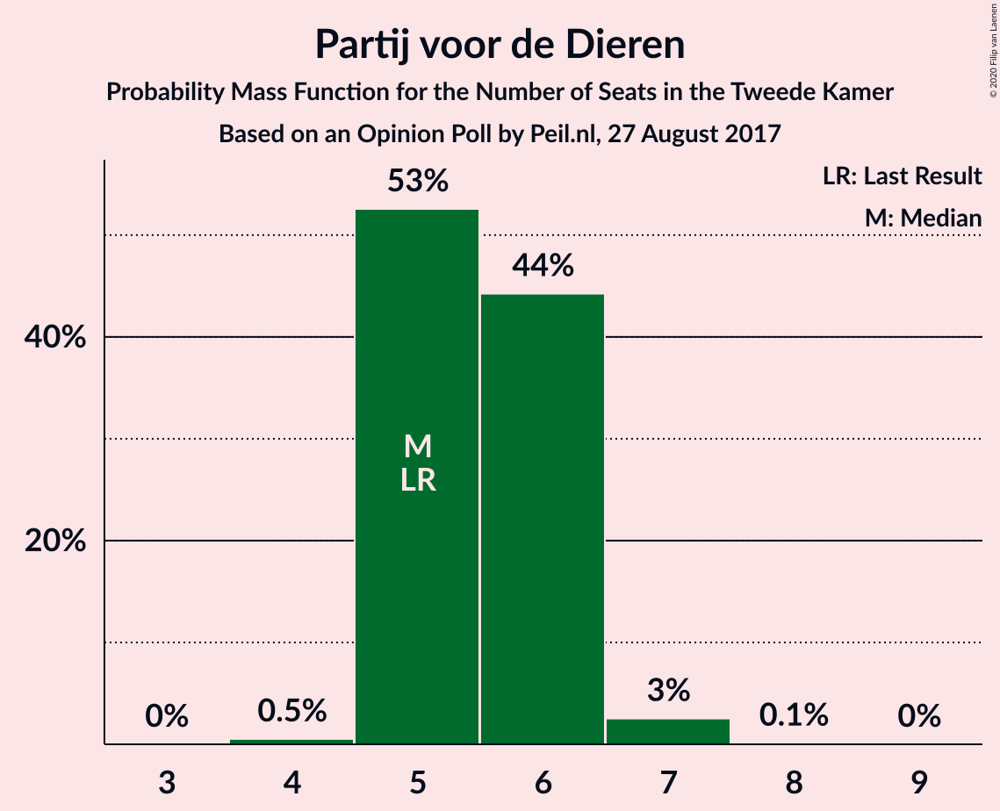

| Number of Seats | Probability | Accumulated | Special Marks |
|:---------------:|:-----------:|:-----------:|:-------------:|
| 4 | 0.5% | 100% |  |
| 5 | 53% | 99.5% | Last Result, Median |
| 6 | 44% | 47% |  |
| 7 | 3% | 3% |  |
| 8 | 0.1% | 0.1% |  |
| 9 | 0% | 0% |  |

### ChristenUnie

*For a full overview of the results for this party, see the [ChristenUnie](party-christenunie.html) page.*

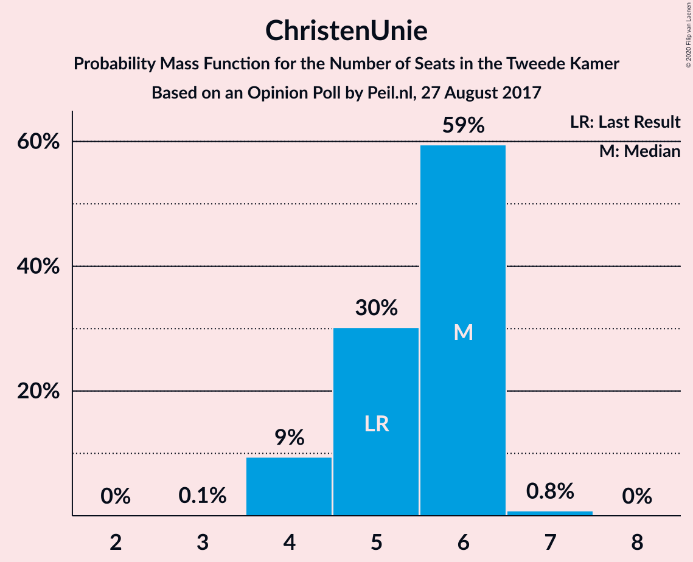

| Number of Seats | Probability | Accumulated | Special Marks |
|:---------------:|:-----------:|:-----------:|:-------------:|
| 3 | 0.1% | 100% |  |
| 4 | 9% | 99.9% |  |
| 5 | 30% | 90% | Last Result |
| 6 | 59% | 60% | Median |
| 7 | 0.8% | 0.8% |  |
| 8 | 0% | 0% |  |

### 50Plus

*For a full overview of the results for this party, see the [50Plus](party-50plus.html) page.*

| Number of Seats | Probability | Accumulated | Special Marks |
|:---------------:|:-----------:|:-----------:|:-------------:|
| 2 | 0.4% | 100% |  |
| 3 | 59% | 99.6% | Median |
| 4 | 38% | 41% | Last Result |
| 5 | 2% | 2% |  |
| 6 | 0.1% | 0.1% |  |
| 7 | 0% | 0% |  |

### Staatkundig Gereformeerde Partij

*For a full overview of the results for this party, see the [Staatkundig Gereformeerde Partij](party-staatkundiggereformeerdepartij.html) page.*

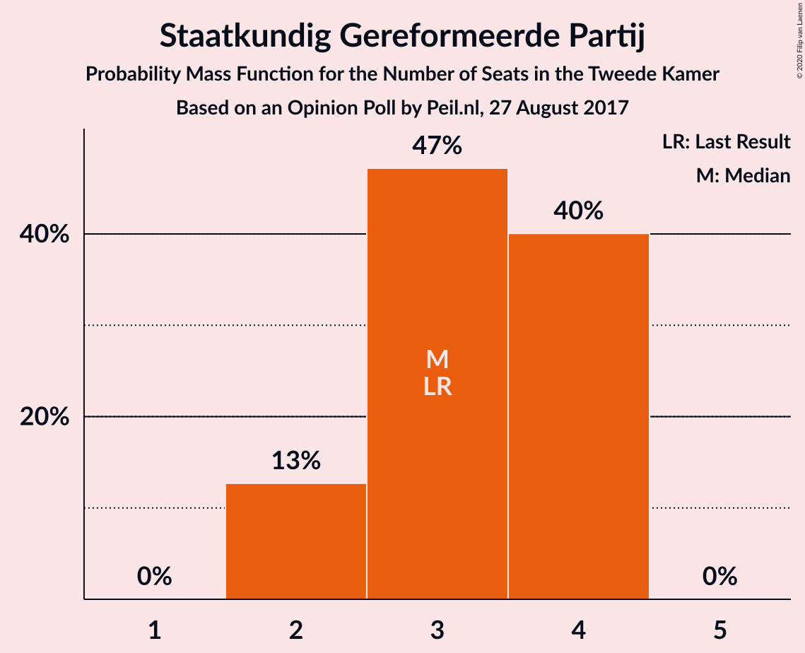

| Number of Seats | Probability | Accumulated | Special Marks |
|:---------------:|:-----------:|:-----------:|:-------------:|
| 2 | 13% | 100% |  |
| 3 | 47% | 87% | Last Result, Median |
| 4 | 40% | 40% |  |
| 5 | 0% | 0% |  |

### DENK

*For a full overview of the results for this party, see the [DENK](party-denk.html) page.*

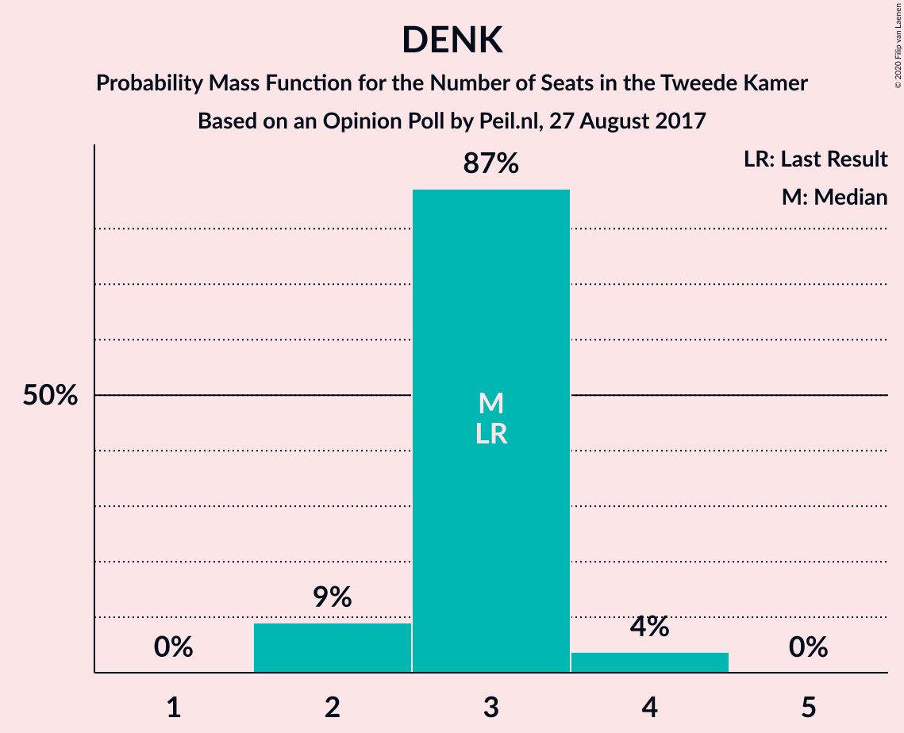

| Number of Seats | Probability | Accumulated | Special Marks |
|:---------------:|:-----------:|:-----------:|:-------------:|
| 2 | 9% | 100% |  |
| 3 | 87% | 91% | Last Result, Median |
| 4 | 4% | 4% |  |
| 5 | 0% | 0% |  |

## Coalitions

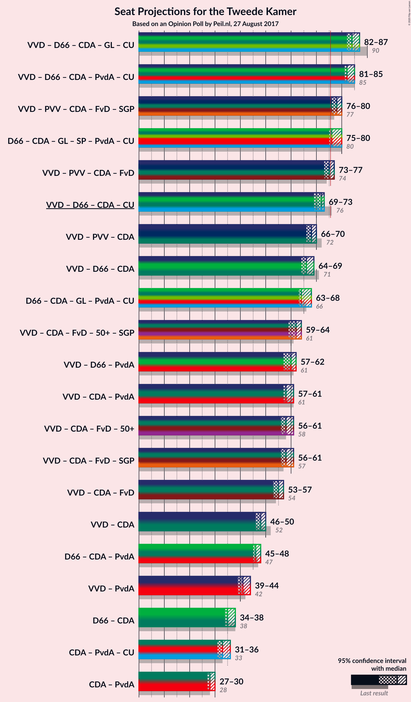

### Confidence Intervals

| Coalition | Last Result | Median | Majority? | 80% Confidence Interval | 90% Confidence Interval | 95% Confidence Interval | 99% Confidence Interval |
|:---------:|:-----------:|:------:|:---------:|:-----------------------:|:-----------------------:|:-----------------------:|:-----------------------:|
| Volkspartij voor Vrijheid en Democratie – Democraten 66 – Christen-Democratisch Appèl – GroenLinks – ChristenUnie | 90 | 84 | 100% | 82–86 | 82–87 | 82–87 | 82–88 |
| Volkspartij voor Vrijheid en Democratie – Democraten 66 – Christen-Democratisch Appèl – Partij van de Arbeid – ChristenUnie | 85 | 82 | 100% | 81–83 | 81–85 | 81–85 | 80–87 |
| Volkspartij voor Vrijheid en Democratie – Partij voor de Vrijheid – Christen-Democratisch Appèl – Forum voor Democratie – Staatkundig Gereformeerde Partij | 77 | 78 | 99.2% | 76–79 | 76–79 | 76–80 | 75–82 |
| Democraten 66 – Christen-Democratisch Appèl – GroenLinks – Socialistische Partij – Partij van de Arbeid – ChristenUnie | 80 | 76 | 97% | 76–80 | 76–80 | 75–80 | 72–80 |
| Volkspartij voor Vrijheid en Democratie – Partij voor de Vrijheid – Christen-Democratisch Appèl – Forum voor Democratie | 74 | 75 | 17% | 73–76 | 73–77 | 73–77 | 72–79 |
| Volkspartij voor Vrijheid en Democratie – Democraten 66 – Christen-Democratisch Appèl – ChristenUnie | 76 | 72 | 0.3% | 69–73 | 69–73 | 69–73 | 69–75 |
| Volkspartij voor Vrijheid en Democratie – Partij voor de Vrijheid – Christen-Democratisch Appèl | 72 | 68 | 0% | 66–69 | 66–69 | 66–70 | 66–72 |
| Volkspartij voor Vrijheid en Democratie – Democraten 66 – Christen-Democratisch Appèl | 71 | 66 | 0% | 64–67 | 64–68 | 64–69 | 64–70 |
| Democraten 66 – Christen-Democratisch Appèl – GroenLinks – Partij van de Arbeid – ChristenUnie | 66 | 64 | 0% | 63–67 | 63–67 | 63–68 | 60–68 |
| Volkspartij voor Vrijheid en Democratie – Christen-Democratisch Appèl – Forum voor Democratie – 50Plus – Staatkundig Gereformeerde Partij | 61 | 62 | 0% | 59–63 | 59–63 | 59–64 | 59–66 |
| Volkspartij voor Vrijheid en Democratie – Democraten 66 – Partij van de Arbeid | 61 | 60 | 0% | 59–60 | 58–61 | 57–62 | 56–64 |
| Volkspartij voor Vrijheid en Democratie – Christen-Democratisch Appèl – Partij van de Arbeid | 61 | 58 | 0% | 57–59 | 57–61 | 57–61 | 56–64 |
| Volkspartij voor Vrijheid en Democratie – Christen-Democratisch Appèl – Forum voor Democratie – 50Plus | 58 | 58 | 0% | 56–60 | 56–60 | 56–61 | 56–63 |
| Volkspartij voor Vrijheid en Democratie – Christen-Democratisch Appèl – Forum voor Democratie – Staatkundig Gereformeerde Partij | 57 | 58 | 0% | 56–59 | 56–59 | 56–61 | 55–62 |
| Volkspartij voor Vrijheid en Democratie – Christen-Democratisch Appèl – Forum voor Democratie | 54 | 55 | 0% | 53–56 | 53–56 | 53–57 | 52–59 |
| Volkspartij voor Vrijheid en Democratie – Christen-Democratisch Appèl | 52 | 48 | 0% | 46–49 | 46–49 | 46–50 | 46–52 |
| Democraten 66 – Christen-Democratisch Appèl – Partij van de Arbeid | 47 | 46 | 0% | 45–48 | 45–48 | 45–48 | 43–50 |
| Volkspartij voor Vrijheid en Democratie – Partij van de Arbeid | 42 | 41 | 0% | 40–42 | 40–43 | 39–44 | 39–45 |
| Democraten 66 – Christen-Democratisch Appèl | 38 | 35 | 0% | 34–37 | 34–37 | 34–38 | 33–38 |
| Christen-Democratisch Appèl – Partij van de Arbeid – ChristenUnie | 33 | 33 | 0% | 33–34 | 32–35 | 31–36 | 30–37 |
| Christen-Democratisch Appèl – Partij van de Arbeid | 28 | 28 | 0% | 27–29 | 27–30 | 27–30 | 25–32 |

### Volkspartij voor Vrijheid en Democratie – Democraten 66 – Christen-Democratisch Appèl – GroenLinks – ChristenUnie

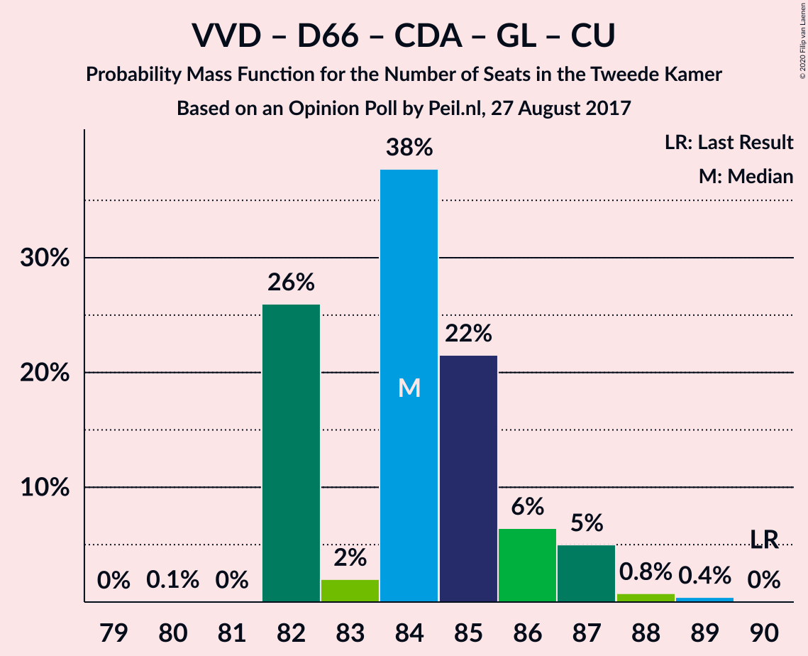

| Number of Seats | Probability | Accumulated | Special Marks |
|:---------------:|:-----------:|:-----------:|:-------------:|
| 80 | 0.1% | 100% |  |
| 81 | 0% | 99.9% |  |
| 82 | 26% | 99.9% |  |
| 83 | 2% | 74% |  |
| 84 | 38% | 72% | Median |
| 85 | 22% | 34% |  |
| 86 | 6% | 13% |  |
| 87 | 5% | 6% |  |
| 88 | 0.8% | 1.2% |  |
| 89 | 0.4% | 0.5% |  |
| 90 | 0% | 0% | Last Result |

### Volkspartij voor Vrijheid en Democratie – Democraten 66 – Christen-Democratisch Appèl – Partij van de Arbeid – ChristenUnie

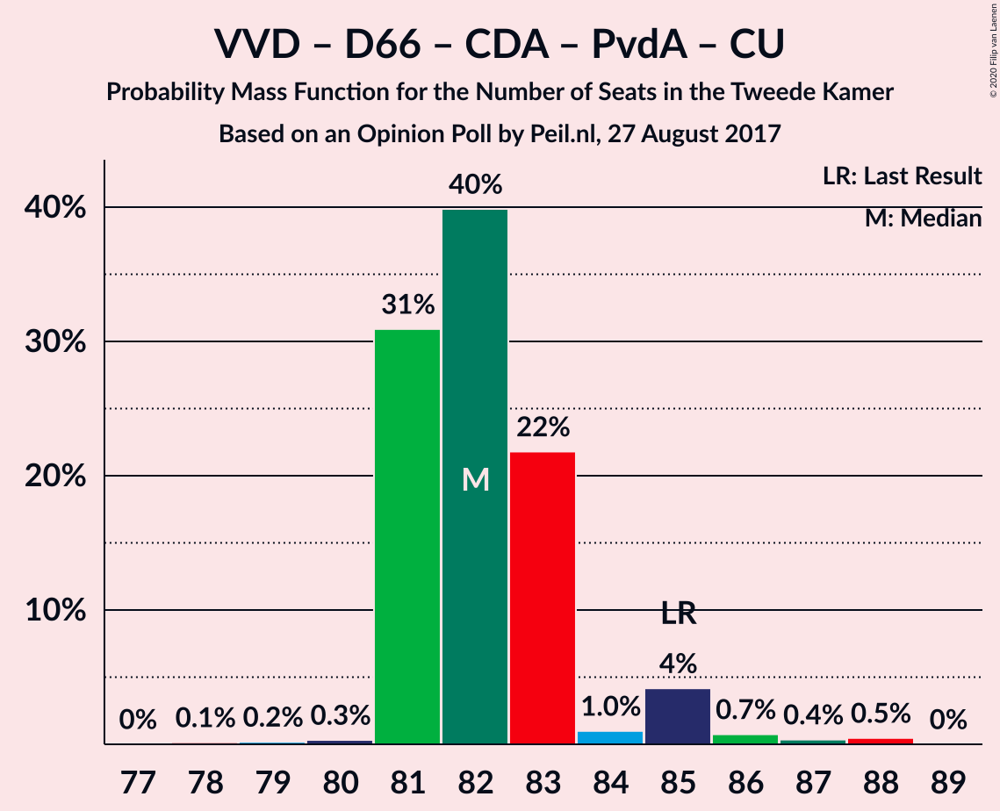

| Number of Seats | Probability | Accumulated | Special Marks |
|:---------------:|:-----------:|:-----------:|:-------------:|
| 78 | 0.1% | 100% |  |
| 79 | 0.2% | 99.8% |  |
| 80 | 0.3% | 99.7% |  |
| 81 | 31% | 99.3% |  |
| 82 | 40% | 68% | Median |
| 83 | 22% | 29% |  |
| 84 | 1.0% | 7% |  |
| 85 | 4% | 6% | Last Result |
| 86 | 0.7% | 2% |  |
| 87 | 0.4% | 0.8% |  |
| 88 | 0.5% | 0.5% |  |
| 89 | 0% | 0% |  |

### Volkspartij voor Vrijheid en Democratie – Partij voor de Vrijheid – Christen-Democratisch Appèl – Forum voor Democratie – Staatkundig Gereformeerde Partij

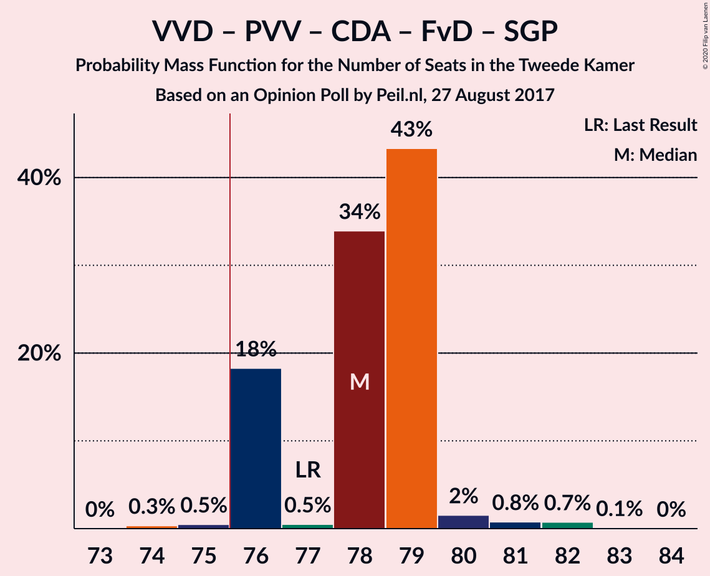

| Number of Seats | Probability | Accumulated | Special Marks |
|:---------------:|:-----------:|:-----------:|:-------------:|
| 74 | 0.3% | 100% |  |
| 75 | 0.5% | 99.7% |  |
| 76 | 18% | 99.2% | Majority |
| 77 | 0.5% | 81% | Last Result, Median |
| 78 | 34% | 80% |  |
| 79 | 43% | 46% |  |
| 80 | 2% | 3% |  |
| 81 | 0.8% | 2% |  |
| 82 | 0.7% | 0.8% |  |
| 83 | 0.1% | 0.1% |  |
| 84 | 0% | 0% |  |

### Democraten 66 – Christen-Democratisch Appèl – GroenLinks – Socialistische Partij – Partij van de Arbeid – ChristenUnie

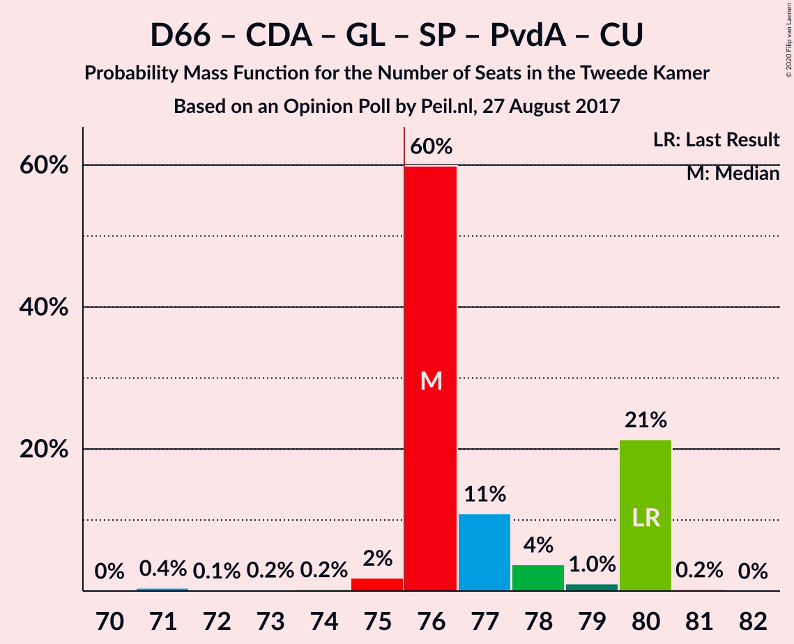

| Number of Seats | Probability | Accumulated | Special Marks |
|:---------------:|:-----------:|:-----------:|:-------------:|
| 71 | 0.4% | 100% |  |
| 72 | 0.1% | 99.5% |  |
| 73 | 0.2% | 99.5% |  |
| 74 | 0.2% | 99.3% |  |
| 75 | 2% | 99.0% |  |
| 76 | 60% | 97% | Majority |
| 77 | 11% | 37% |  |
| 78 | 4% | 26% | Median |
| 79 | 1.0% | 23% |  |
| 80 | 21% | 22% | Last Result |
| 81 | 0.2% | 0.3% |  |
| 82 | 0% | 0% |  |

### Volkspartij voor Vrijheid en Democratie – Partij voor de Vrijheid – Christen-Democratisch Appèl – Forum voor Democratie

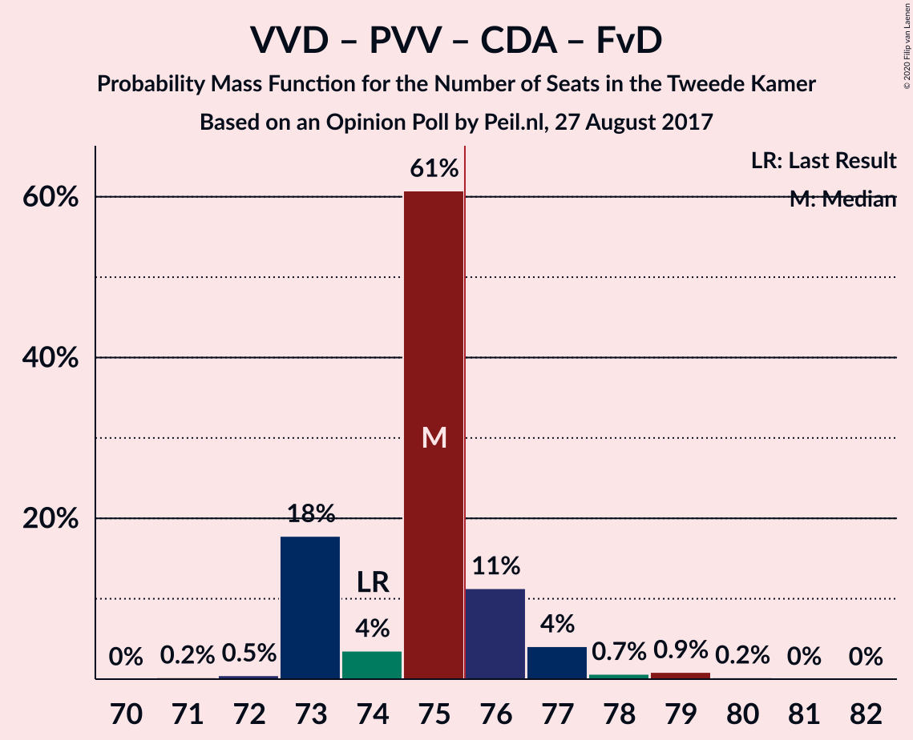

| Number of Seats | Probability | Accumulated | Special Marks |
|:---------------:|:-----------:|:-----------:|:-------------:|
| 71 | 0.2% | 100% |  |
| 72 | 0.5% | 99.8% |  |
| 73 | 18% | 99.3% |  |
| 74 | 4% | 81% | Last Result, Median |
| 75 | 61% | 78% |  |
| 76 | 11% | 17% | Majority |
| 77 | 4% | 6% |  |
| 78 | 0.7% | 2% |  |
| 79 | 0.9% | 1.2% |  |
| 80 | 0.2% | 0.3% |  |
| 81 | 0% | 0.1% |  |
| 82 | 0% | 0% |  |

### Volkspartij voor Vrijheid en Democratie – Democraten 66 – Christen-Democratisch Appèl – ChristenUnie

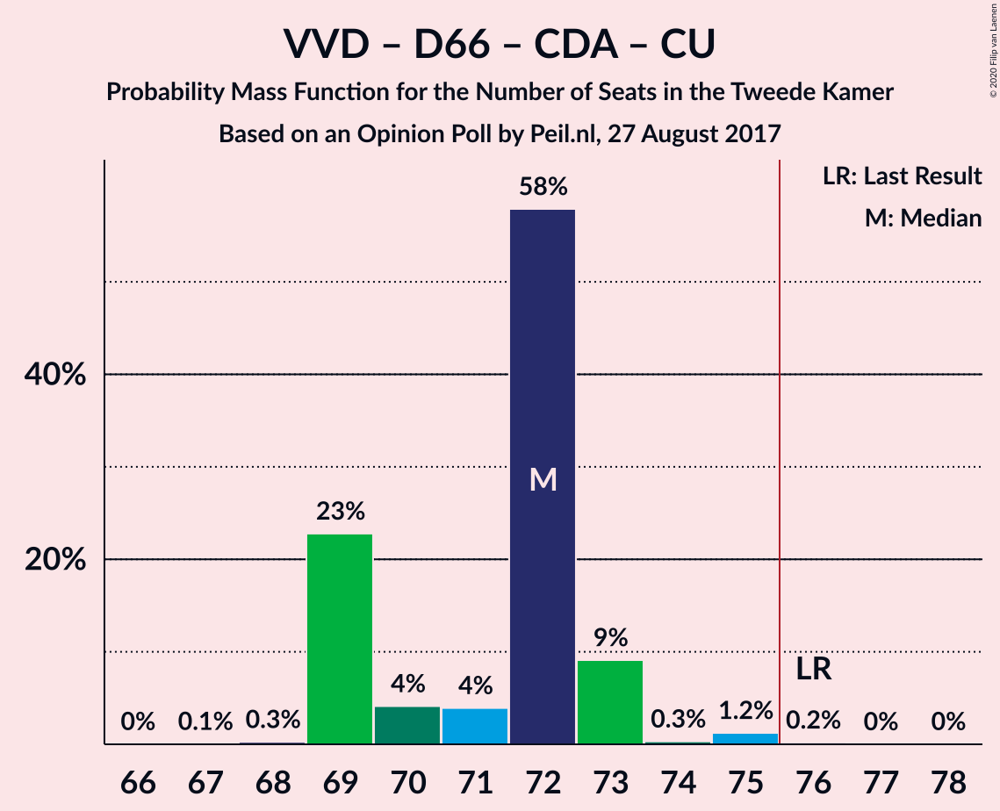

| Number of Seats | Probability | Accumulated | Special Marks |
|:---------------:|:-----------:|:-----------:|:-------------:|
| 67 | 0.1% | 100% |  |
| 68 | 0.3% | 99.9% |  |
| 69 | 23% | 99.6% |  |
| 70 | 4% | 77% |  |
| 71 | 4% | 73% | Median |
| 72 | 58% | 69% |  |
| 73 | 9% | 11% |  |
| 74 | 0.3% | 2% |  |
| 75 | 1.2% | 1.5% |  |
| 76 | 0.2% | 0.3% | Last Result, Majority |
| 77 | 0% | 0.1% |  |
| 78 | 0% | 0% |  |

### Volkspartij voor Vrijheid en Democratie – Partij voor de Vrijheid – Christen-Democratisch Appèl

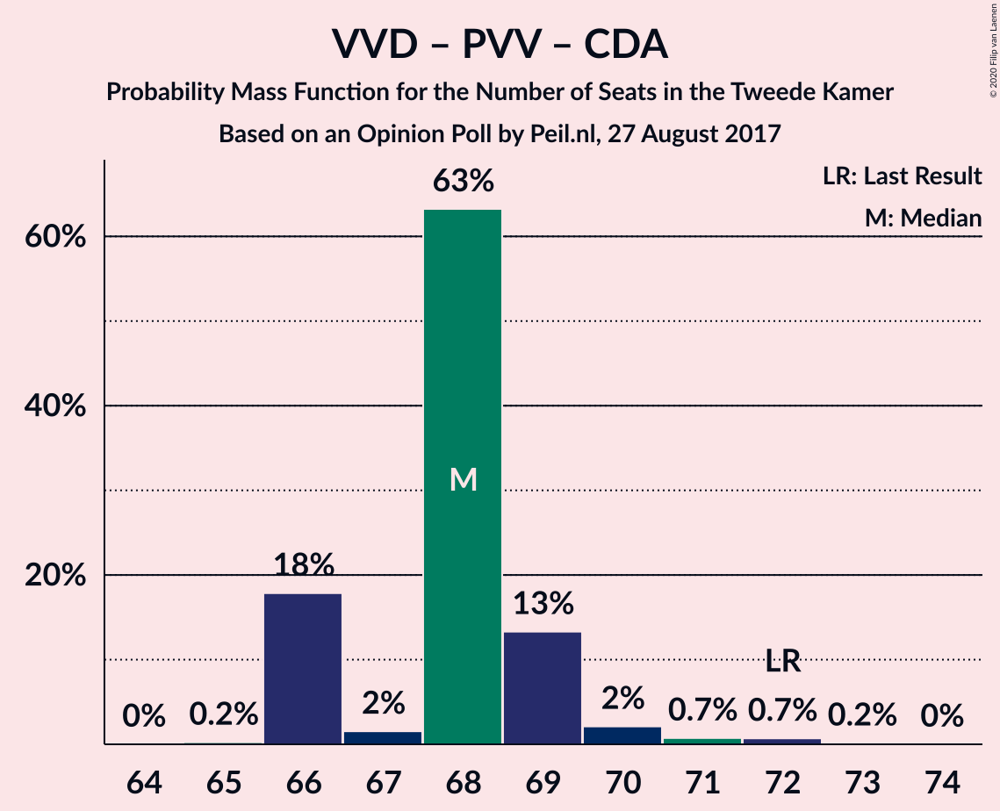

| Number of Seats | Probability | Accumulated | Special Marks |
|:---------------:|:-----------:|:-----------:|:-------------:|
| 64 | 0% | 100% |  |
| 65 | 0.2% | 99.9% |  |
| 66 | 18% | 99.7% |  |
| 67 | 2% | 82% | Median |
| 68 | 63% | 80% |  |
| 69 | 13% | 17% |  |
| 70 | 2% | 4% |  |
| 71 | 0.7% | 2% |  |
| 72 | 0.7% | 0.9% | Last Result |
| 73 | 0.2% | 0.2% |  |
| 74 | 0% | 0% |  |

### Volkspartij voor Vrijheid en Democratie – Democraten 66 – Christen-Democratisch Appèl

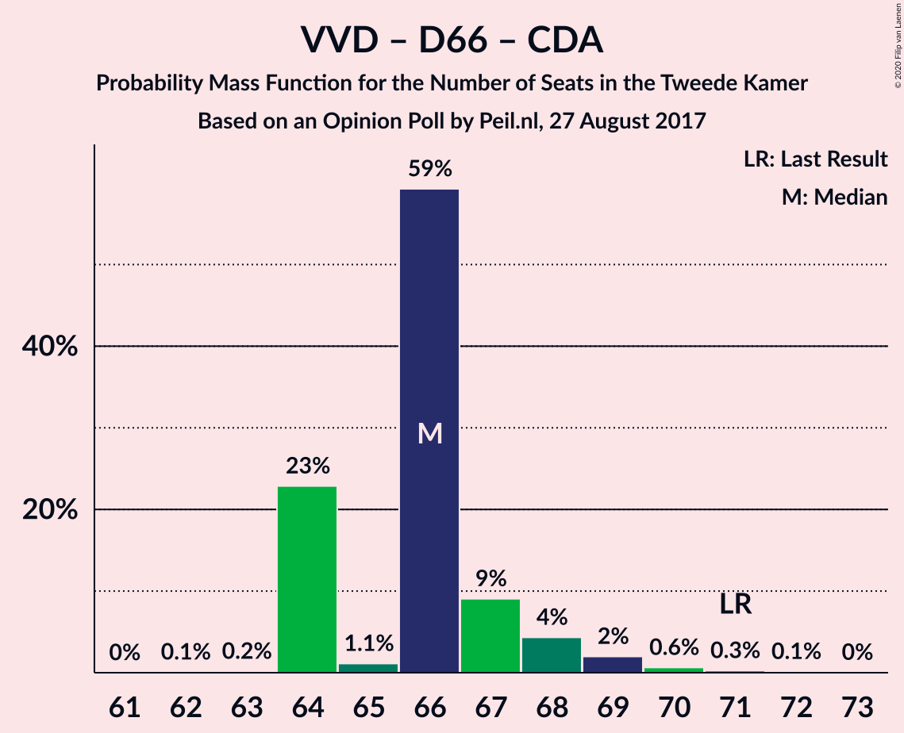

| Number of Seats | Probability | Accumulated | Special Marks |
|:---------------:|:-----------:|:-----------:|:-------------:|
| 62 | 0.1% | 100% |  |
| 63 | 0.2% | 99.9% |  |
| 64 | 23% | 99.7% |  |
| 65 | 1.1% | 77% | Median |
| 66 | 59% | 76% |  |
| 67 | 9% | 16% |  |
| 68 | 4% | 7% |  |
| 69 | 2% | 3% |  |
| 70 | 0.6% | 1.1% |  |
| 71 | 0.3% | 0.4% | Last Result |
| 72 | 0.1% | 0.2% |  |
| 73 | 0% | 0% |  |

### Democraten 66 – Christen-Democratisch Appèl – GroenLinks – Partij van de Arbeid – ChristenUnie

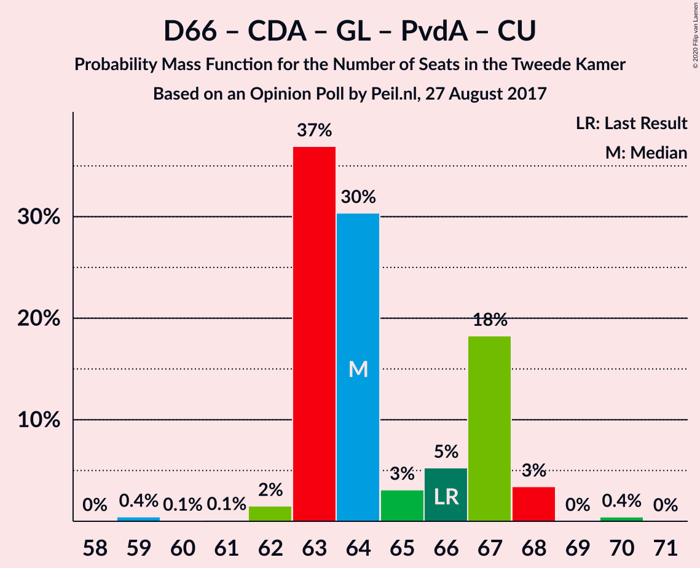

| Number of Seats | Probability | Accumulated | Special Marks |
|:---------------:|:-----------:|:-----------:|:-------------:|
| 59 | 0.4% | 100% |  |
| 60 | 0.1% | 99.5% |  |
| 61 | 0.1% | 99.5% |  |
| 62 | 2% | 99.3% |  |
| 63 | 37% | 98% |  |
| 64 | 30% | 61% |  |
| 65 | 3% | 31% | Median |
| 66 | 5% | 27% | Last Result |
| 67 | 18% | 22% |  |
| 68 | 3% | 4% |  |
| 69 | 0% | 0.5% |  |
| 70 | 0.4% | 0.4% |  |
| 71 | 0% | 0% |  |

### Volkspartij voor Vrijheid en Democratie – Christen-Democratisch Appèl – Forum voor Democratie – 50Plus – Staatkundig Gereformeerde Partij

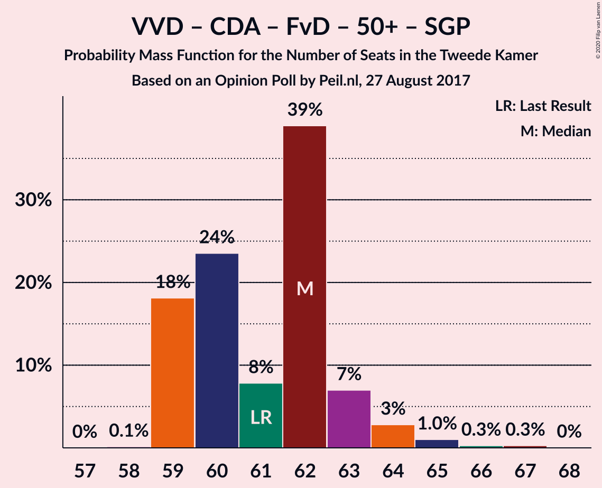

| Number of Seats | Probability | Accumulated | Special Marks |
|:---------------:|:-----------:|:-----------:|:-------------:|
| 58 | 0.1% | 100% |  |
| 59 | 18% | 99.8% |  |
| 60 | 24% | 82% | Median |
| 61 | 8% | 58% | Last Result |
| 62 | 39% | 50% |  |
| 63 | 7% | 11% |  |
| 64 | 3% | 4% |  |
| 65 | 1.0% | 2% |  |
| 66 | 0.3% | 0.6% |  |
| 67 | 0.3% | 0.3% |  |
| 68 | 0% | 0% |  |

### Volkspartij voor Vrijheid en Democratie – Democraten 66 – Partij van de Arbeid

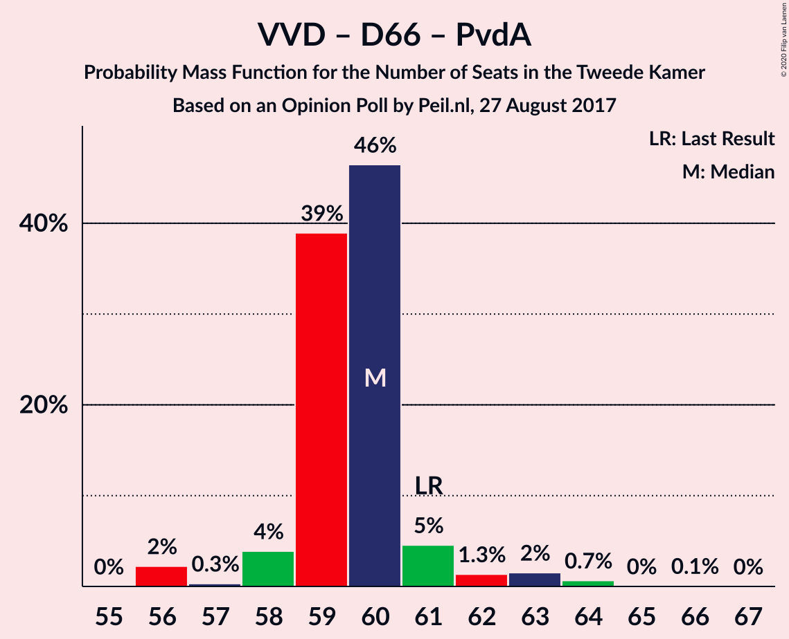

| Number of Seats | Probability | Accumulated | Special Marks |
|:---------------:|:-----------:|:-----------:|:-------------:|
| 56 | 2% | 100% |  |
| 57 | 0.3% | 98% |  |
| 58 | 4% | 97% |  |
| 59 | 39% | 94% | Median |
| 60 | 46% | 55% |  |
| 61 | 5% | 8% | Last Result |
| 62 | 1.3% | 4% |  |
| 63 | 2% | 2% |  |
| 64 | 0.7% | 0.7% |  |
| 65 | 0% | 0.1% |  |
| 66 | 0.1% | 0.1% |  |
| 67 | 0% | 0% |  |

### Volkspartij voor Vrijheid en Democratie – Christen-Democratisch Appèl – Partij van de Arbeid

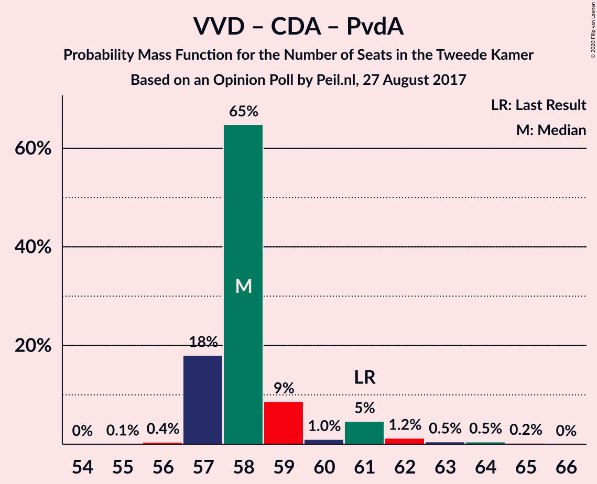

| Number of Seats | Probability | Accumulated | Special Marks |
|:---------------:|:-----------:|:-----------:|:-------------:|
| 55 | 0.1% | 100% |  |
| 56 | 0.4% | 99.9% |  |
| 57 | 18% | 99.5% |  |
| 58 | 65% | 81% | Median |
| 59 | 9% | 17% |  |
| 60 | 1.0% | 8% |  |
| 61 | 5% | 7% | Last Result |
| 62 | 1.2% | 2% |  |
| 63 | 0.5% | 1.2% |  |
| 64 | 0.5% | 0.7% |  |
| 65 | 0.2% | 0.2% |  |
| 66 | 0% | 0% |  |

### Volkspartij voor Vrijheid en Democratie – Christen-Democratisch Appèl – Forum voor Democratie – 50Plus

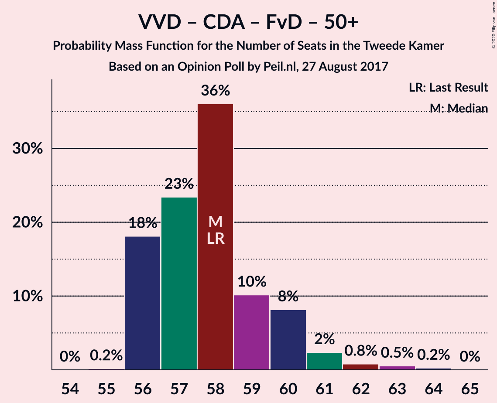

| Number of Seats | Probability | Accumulated | Special Marks |
|:---------------:|:-----------:|:-----------:|:-------------:|
| 55 | 0.2% | 100% |  |
| 56 | 18% | 99.8% |  |
| 57 | 23% | 82% | Median |
| 58 | 36% | 58% | Last Result |
| 59 | 10% | 22% |  |
| 60 | 8% | 12% |  |
| 61 | 2% | 4% |  |
| 62 | 0.8% | 2% |  |
| 63 | 0.5% | 0.8% |  |
| 64 | 0.2% | 0.3% |  |
| 65 | 0% | 0% |  |

### Volkspartij voor Vrijheid en Democratie – Christen-Democratisch Appèl – Forum voor Democratie – Staatkundig Gereformeerde Partij

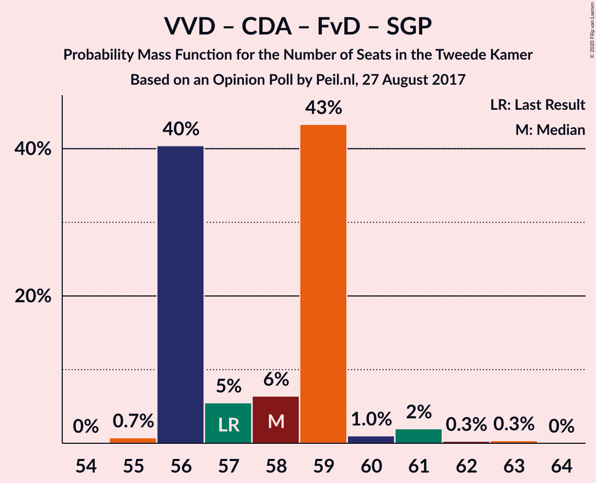

| Number of Seats | Probability | Accumulated | Special Marks |
|:---------------:|:-----------:|:-----------:|:-------------:|
| 55 | 0.7% | 100% |  |
| 56 | 40% | 99.2% |  |
| 57 | 5% | 59% | Last Result, Median |
| 58 | 6% | 53% |  |
| 59 | 43% | 47% |  |
| 60 | 1.0% | 4% |  |
| 61 | 2% | 3% |  |
| 62 | 0.3% | 0.7% |  |
| 63 | 0.3% | 0.4% |  |
| 64 | 0% | 0% |  |

### Volkspartij voor Vrijheid en Democratie – Christen-Democratisch Appèl – Forum voor Democratie

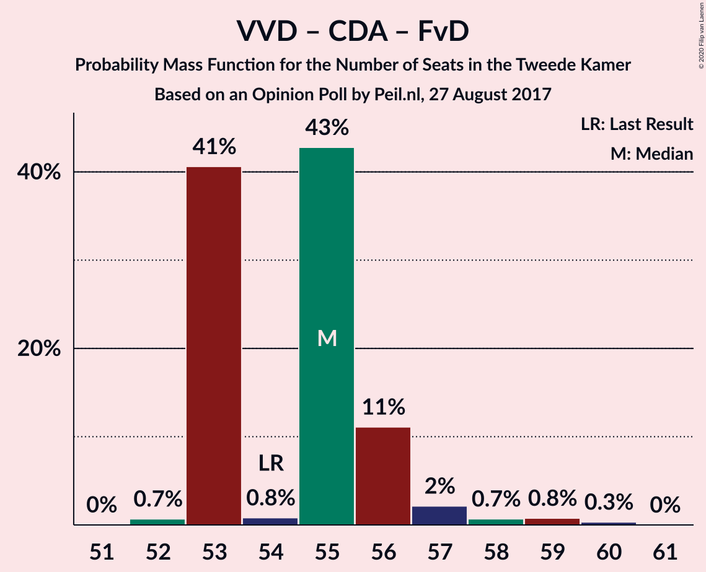

| Number of Seats | Probability | Accumulated | Special Marks |
|:---------------:|:-----------:|:-----------:|:-------------:|
| 52 | 0.7% | 100% |  |
| 53 | 41% | 99.3% |  |
| 54 | 0.8% | 59% | Last Result, Median |
| 55 | 43% | 58% |  |
| 56 | 11% | 15% |  |
| 57 | 2% | 4% |  |
| 58 | 0.7% | 2% |  |
| 59 | 0.8% | 1.1% |  |
| 60 | 0.3% | 0.4% |  |
| 61 | 0% | 0% |  |

### Volkspartij voor Vrijheid en Democratie – Christen-Democratisch Appèl

| Number of Seats | Probability | Accumulated | Special Marks |
|:---------------:|:-----------:|:-----------:|:-------------:|
| 44 | 0.1% | 100% |  |
| 45 | 0.1% | 99.9% |  |
| 46 | 41% | 99.8% |  |
| 47 | 0.7% | 59% | Median |
| 48 | 44% | 58% |  |
| 49 | 10% | 14% |  |
| 50 | 3% | 4% |  |
| 51 | 0.6% | 2% |  |
| 52 | 0.6% | 0.9% | Last Result |
| 53 | 0.3% | 0.3% |  |
| 54 | 0% | 0% |  |

### Democraten 66 – Christen-Democratisch Appèl – Partij van de Arbeid

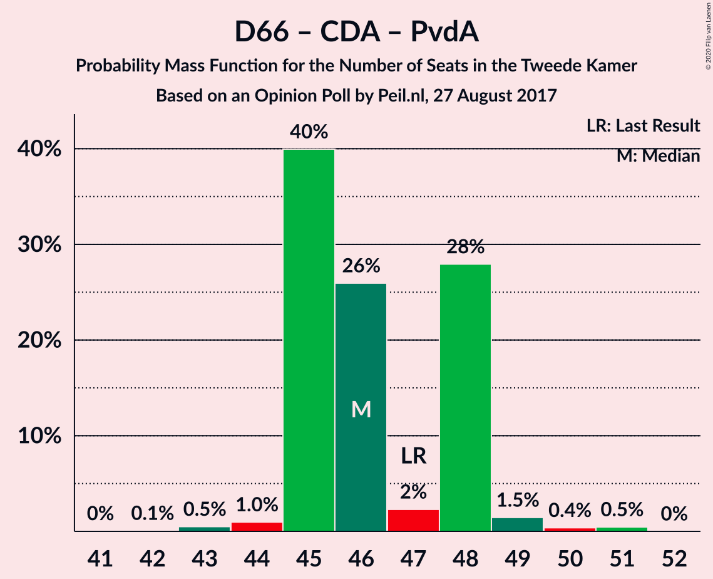

| Number of Seats | Probability | Accumulated | Special Marks |
|:---------------:|:-----------:|:-----------:|:-------------:|
| 42 | 0.1% | 100% |  |
| 43 | 0.5% | 99.9% |  |
| 44 | 1.0% | 99.4% |  |
| 45 | 40% | 98% |  |
| 46 | 26% | 58% | Median |
| 47 | 2% | 33% | Last Result |
| 48 | 28% | 30% |  |
| 49 | 1.5% | 2% |  |
| 50 | 0.4% | 0.8% |  |
| 51 | 0.5% | 0.5% |  |
| 52 | 0% | 0% |  |

### Volkspartij voor Vrijheid en Democratie – Partij van de Arbeid

| Number of Seats | Probability | Accumulated | Special Marks |
|:---------------:|:-----------:|:-----------:|:-------------:|
| 38 | 0.1% | 100% |  |
| 39 | 2% | 99.9% |  |
| 40 | 24% | 97% |  |
| 41 | 40% | 73% | Median |
| 42 | 26% | 33% | Last Result |
| 43 | 5% | 7% |  |
| 44 | 2% | 3% |  |
| 45 | 0.7% | 1.1% |  |
| 46 | 0.1% | 0.4% |  |
| 47 | 0.1% | 0.3% |  |
| 48 | 0.2% | 0.2% |  |
| 49 | 0% | 0% |  |

### Democraten 66 – Christen-Democratisch Appèl

| Number of Seats | Probability | Accumulated | Special Marks |
|:---------------:|:-----------:|:-----------:|:-------------:|
| 32 | 0.3% | 100% |  |
| 33 | 0.8% | 99.7% |  |
| 34 | 24% | 98.9% |  |
| 35 | 38% | 75% | Median |
| 36 | 10% | 37% |  |
| 37 | 23% | 28% |  |
| 38 | 5% | 5% | Last Result |
| 39 | 0.3% | 0.3% |  |
| 40 | 0% | 0% |  |

### Christen-Democratisch Appèl – Partij van de Arbeid – ChristenUnie

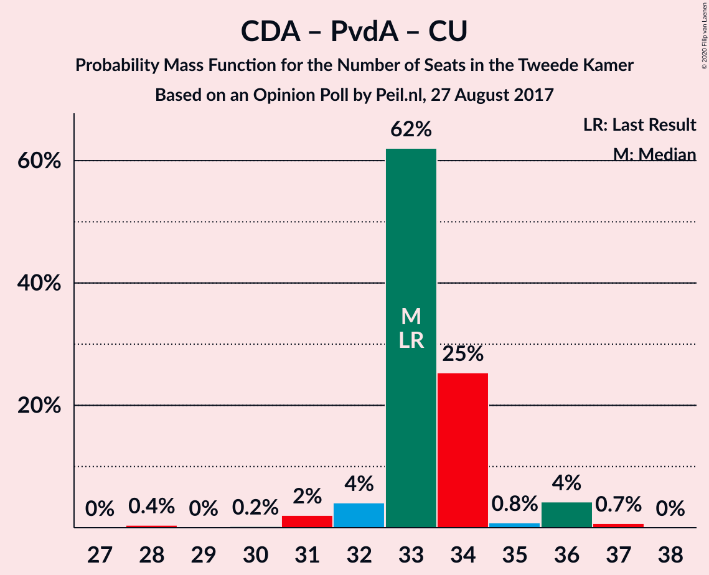

| Number of Seats | Probability | Accumulated | Special Marks |
|:---------------:|:-----------:|:-----------:|:-------------:|
| 28 | 0.4% | 100% |  |
| 29 | 0% | 99.6% |  |
| 30 | 0.2% | 99.5% |  |
| 31 | 2% | 99.3% |  |
| 32 | 4% | 97% |  |
| 33 | 62% | 93% | Last Result |
| 34 | 25% | 31% | Median |
| 35 | 0.8% | 6% |  |
| 36 | 4% | 5% |  |
| 37 | 0.7% | 0.7% |  |
| 38 | 0% | 0% |  |

### Christen-Democratisch Appèl – Partij van de Arbeid

| Number of Seats | Probability | Accumulated | Special Marks |
|:---------------:|:-----------:|:-----------:|:-------------:|
| 24 | 0.5% | 100% |  |
| 25 | 0.1% | 99.5% |  |
| 26 | 0.5% | 99.4% |  |
| 27 | 39% | 98.9% |  |
| 28 | 49% | 60% | Last Result, Median |
| 29 | 1.1% | 11% |  |
| 30 | 8% | 10% |  |
| 31 | 1.2% | 2% |  |
| 32 | 0.5% | 0.5% |  |
| 33 | 0% | 0% |  |

## Technical Information

### Opinion Poll

+ **Polling firm:** Peil.nl
+ **Commissioner(s):** —
+ **Fieldwork period:** 27 August 2017

### Calculations

+ **Sample size:** 3000
+ **Simulations done:** 1,048,576
+ **Error estimate:** 1.89%

