# Opinion Poll by Kantar Public, 31 August 2017

<a href="#voting-intentions">Voting Intentions</a> | <a href="#seats">Seats</a> | <a href="#coalitions">Coalitions</a> | <a href="#technical-information">Technical Information</a>

## Voting Intentions

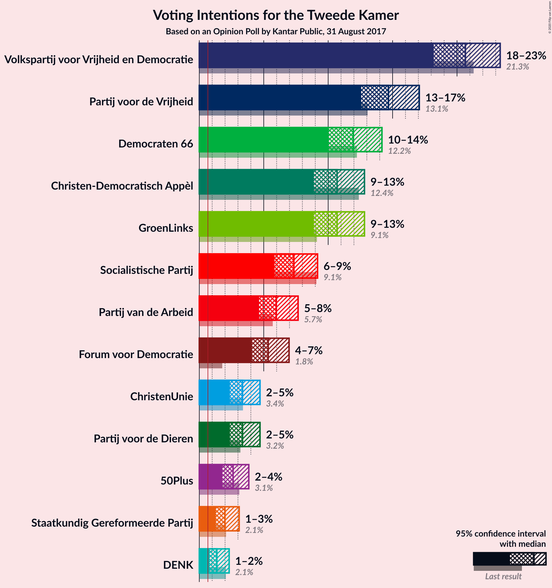

### Confidence Intervals

| Party | Last Result | Poll Result | 80% Confidence Interval | 90% Confidence Interval | 95% Confidence Interval | 99% Confidence Interval |
|:-----:|:-----------:|:-----------:|:-----------------------:|:-----------------------:|:-----------------------:|:-----------------------:|
| Volkspartij voor Vrijheid en Democratie | 21.3% | 20.6% | 19.0–22.4% |18.6–22.9% |18.2–23.4% |17.5–24.2% |
| Partij voor de Vrijheid | 13.1% | 14.7% | 13.3–16.2% |12.9–16.7% |12.6–17.1% |11.9–17.8% |
| Democraten 66 | 12.2% | 11.9% | 10.7–13.4% |10.3–13.8% |10.0–14.2% |9.5–14.9% |
| Christen-Democratisch Appèl | 12.4% | 10.7% | 9.5–12.1% |9.2–12.5% |8.9–12.8% |8.3–13.5% |
| GroenLinks | 9.1% | 10.7% | 9.5–12.1% |9.2–12.5% |8.9–12.8% |8.3–13.5% |
| Socialistische Partij | 9.1% | 7.3% | 6.4–8.5% |6.1–8.9% |5.8–9.2% |5.4–9.8% |
| Partij van de Arbeid | 5.7% | 6.0% | 5.1–7.1% |4.8–7.4% |4.6–7.7% |4.3–8.2% |
| Forum voor Democratie | 1.8% | 5.3% | 4.5–6.4% |4.3–6.7% |4.1–7.0% |3.7–7.5% |
| ChristenUnie | 3.4% | 3.4% | 2.7–4.2% |2.5–4.5% |2.4–4.7% |2.1–5.2% |
| Partij voor de Dieren | 3.2% | 3.4% | 2.7–4.2% |2.5–4.5% |2.4–4.7% |2.1–5.2% |
| 50Plus | 3.1% | 2.6% | 2.1–3.4% |1.9–3.6% |1.8–3.8% |1.5–4.3% |
| Staatkundig Gereformeerde Partij | 2.1% | 2.0% | 1.5–2.7% |1.4–2.9% |1.3–3.1% |1.1–3.5% |
| DENK | 2.1% | 1.4% | 1.0–2.0% |0.9–2.2% |0.8–2.3% |0.6–2.7% |

*Note:* The poll result column reflects the actual value used in the calculations. Published results may vary slightly, and in addition be rounded to fewer digits.

## Seats

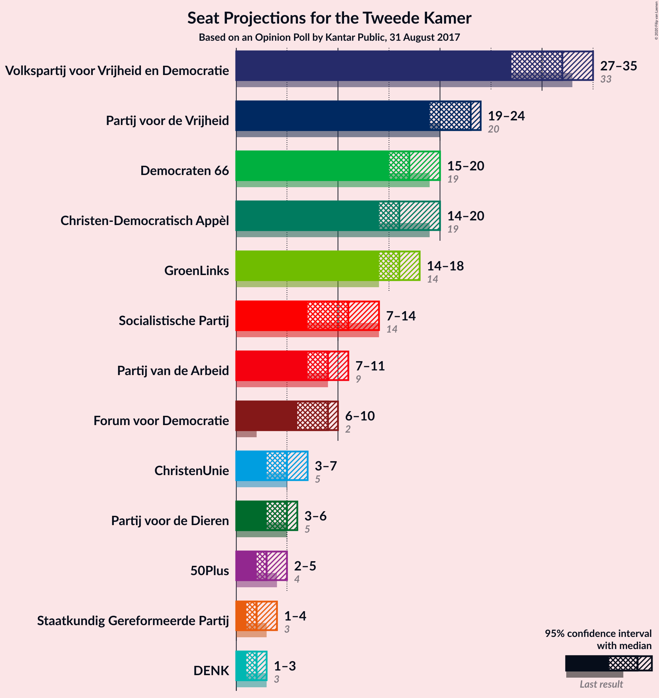

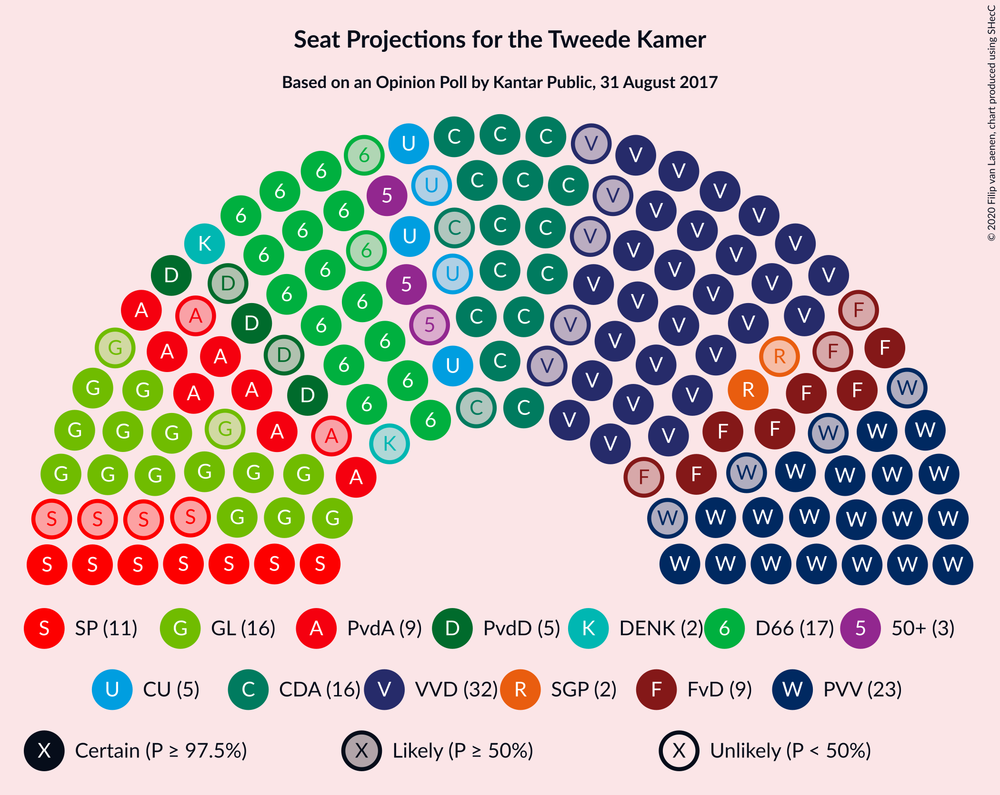

### Confidence Intervals

| Party | Last Result | Median | 80% Confidence Interval | 90% Confidence Interval | 95% Confidence Interval | 99% Confidence Interval |
|:-----:|:-----------:|:------:|:-----------------------:|:-----------------------:|:-----------------------:|:-----------------------:|
| <a href="#volkspartij-voor-vrijheid-en-democratie">Volkspartij voor Vrijheid en Democratie</a> | 33 | 32 | 28–35 |28–35 |27–35 |26–37 |
| <a href="#partij-voor-de-vrijheid">Partij voor de Vrijheid</a> | 20 | 23 | 20–24 |20–24 |19–24 |18–26 |
| <a href="#democraten-66">Democraten 66</a> | 19 | 17 | 15–20 |15–20 |15–20 |14–23 |
| <a href="#christen-democratisch-appèl">Christen-Democratisch Appèl</a> | 19 | 16 | 14–20 |14–20 |14–20 |13–20 |
| <a href="#groenlinks">GroenLinks</a> | 14 | 16 | 14–18 |14–18 |14–18 |14–19 |
| <a href="#socialistische-partij">Socialistische Partij</a> | 14 | 11 | 10–14 |8–14 |7–14 |7–14 |
| <a href="#partij-van-de-arbeid">Partij van de Arbeid</a> | 9 | 9 | 7–11 |7–11 |7–11 |6–12 |
| <a href="#forum-voor-democratie">Forum voor Democratie</a> | 2 | 9 | 6–9 |6–9 |6–10 |6–12 |
| <a href="#christenunie">ChristenUnie</a> | 5 | 5 | 3–7 |3–7 |3–7 |3–7 |
| <a href="#partij-voor-de-dieren">Partij voor de Dieren</a> | 5 | 5 | 3–6 |3–6 |3–6 |3–7 |
| <a href="#50plus">50Plus</a> | 4 | 3 | 2–4 |2–5 |2–5 |2–6 |
| <a href="#staatkundig-gereformeerde-partij">Staatkundig Gereformeerde Partij</a> | 3 | 2 | 1–4 |1–4 |1–4 |1–5 |
| <a href="#denk">DENK</a> | 3 | 2 | 1–3 |1–3 |1–3 |0–4 |

### Volkspartij voor Vrijheid en Democratie

*For a full overview of the results for this party, see the [Volkspartij voor Vrijheid en Democratie](party-volkspartijvoorvrijheidendemocratie.html) page.*

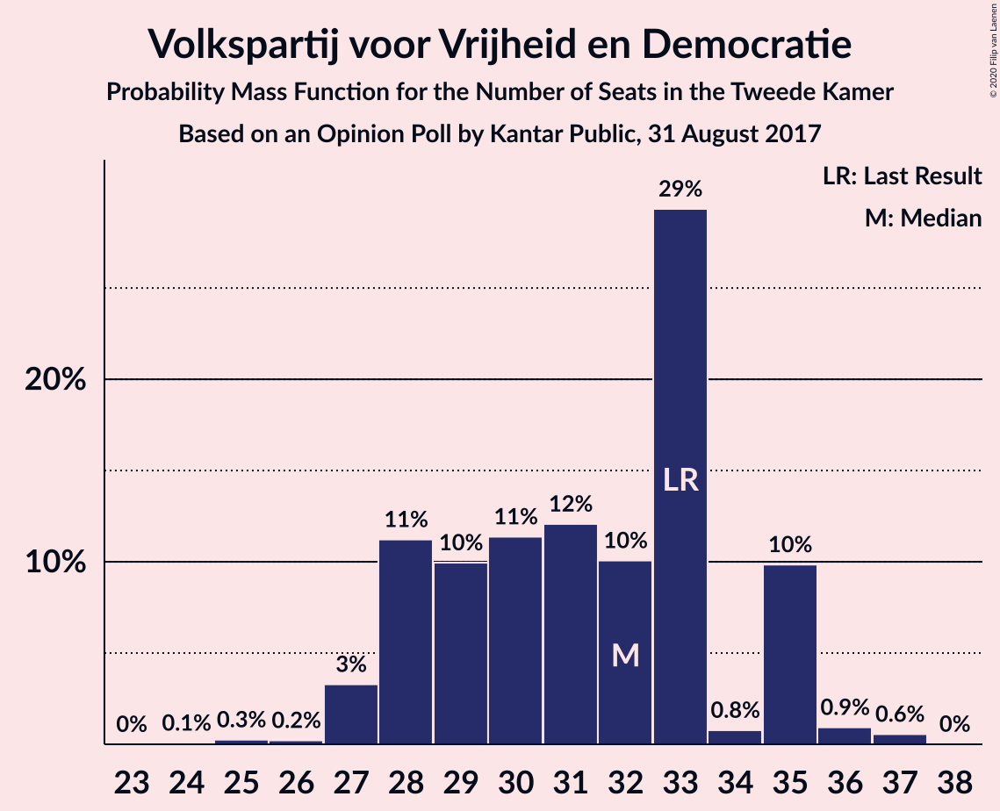

| Number of Seats | Probability | Accumulated | Special Marks |
|:---------------:|:-----------:|:-----------:|:-------------:|
| 24 | 0.1% | 100% |  |
| 25 | 0.3% | 99.9% |  |
| 26 | 0.2% | 99.7% |  |
| 27 | 3% | 99.5% |  |
| 28 | 11% | 96% |  |
| 29 | 10% | 85% |  |
| 30 | 11% | 75% |  |
| 31 | 12% | 64% |  |
| 32 | 10% | 52% | Median |
| 33 | 29% | 41% | Last Result |
| 34 | 0.8% | 12% |  |
| 35 | 10% | 11% |  |
| 36 | 0.9% | 2% |  |
| 37 | 0.6% | 0.6% |  |
| 38 | 0% | 0% |  |

### Partij voor de Vrijheid

*For a full overview of the results for this party, see the [Partij voor de Vrijheid](party-partijvoordevrijheid.html) page.*

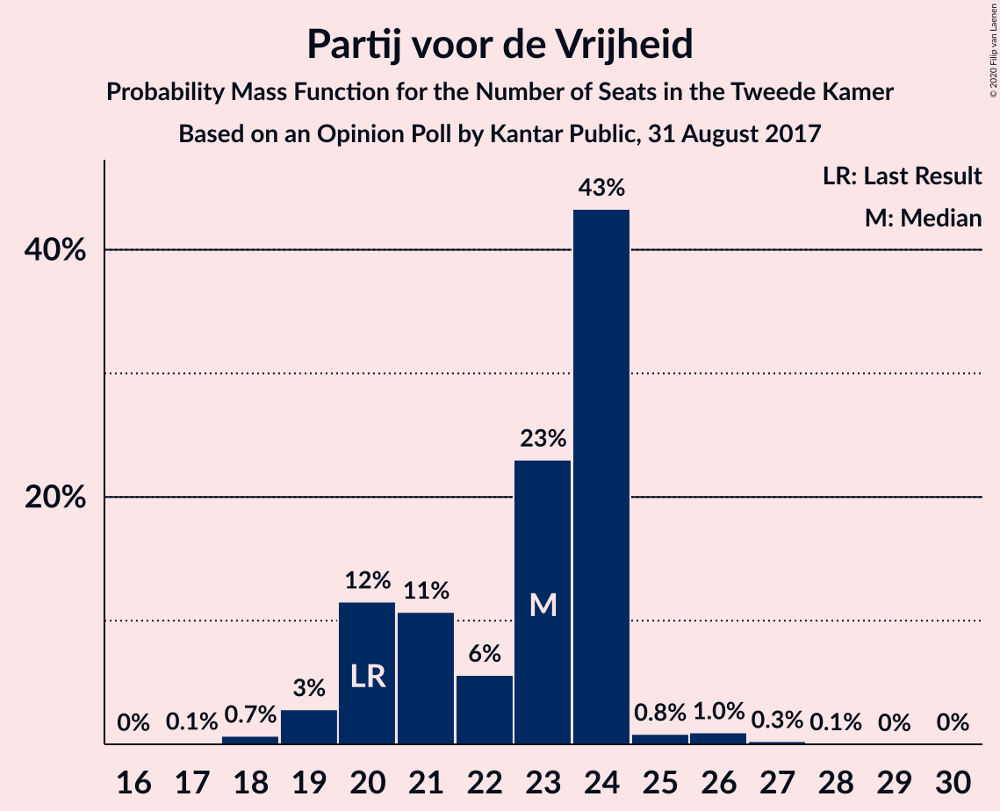

| Number of Seats | Probability | Accumulated | Special Marks |
|:---------------:|:-----------:|:-----------:|:-------------:|
| 17 | 0.1% | 100% |  |
| 18 | 0.7% | 99.9% |  |
| 19 | 3% | 99.2% |  |
| 20 | 12% | 96% | Last Result |
| 21 | 11% | 85% |  |
| 22 | 6% | 74% |  |
| 23 | 23% | 68% | Median |
| 24 | 43% | 45% |  |
| 25 | 0.8% | 2% |  |
| 26 | 1.0% | 1.3% |  |
| 27 | 0.3% | 0.4% |  |
| 28 | 0.1% | 0.1% |  |
| 29 | 0% | 0.1% |  |
| 30 | 0% | 0% |  |

### Democraten 66

*For a full overview of the results for this party, see the [Democraten 66](party-democraten66.html) page.*

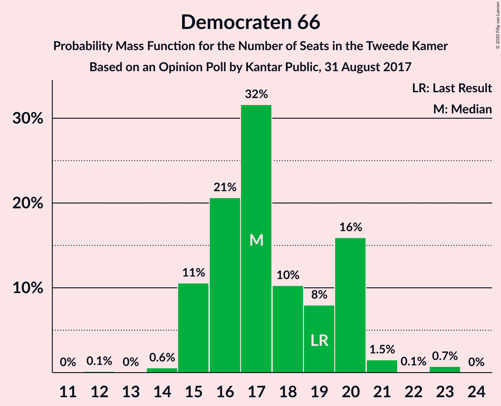

| Number of Seats | Probability | Accumulated | Special Marks |
|:---------------:|:-----------:|:-----------:|:-------------:|
| 12 | 0.1% | 100% |  |
| 13 | 0% | 99.9% |  |
| 14 | 0.6% | 99.8% |  |
| 15 | 11% | 99.3% |  |
| 16 | 21% | 89% |  |
| 17 | 32% | 68% | Median |
| 18 | 10% | 36% |  |
| 19 | 8% | 26% | Last Result |
| 20 | 16% | 18% |  |
| 21 | 1.5% | 2% |  |
| 22 | 0.1% | 0.8% |  |
| 23 | 0.7% | 0.7% |  |
| 24 | 0% | 0% |  |

### Christen-Democratisch Appèl

*For a full overview of the results for this party, see the [Christen-Democratisch Appèl](party-christen-democratischappèl.html) page.*

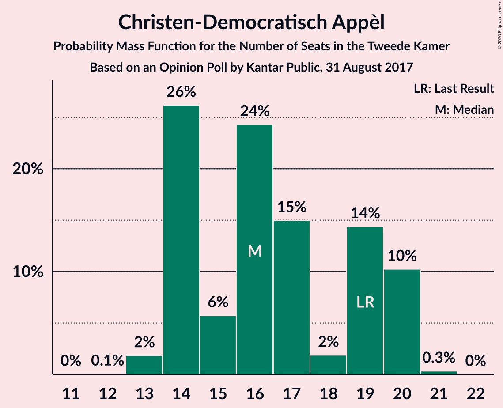

| Number of Seats | Probability | Accumulated | Special Marks |
|:---------------:|:-----------:|:-----------:|:-------------:|
| 12 | 0.1% | 100% |  |
| 13 | 2% | 99.9% |  |
| 14 | 26% | 98% |  |
| 15 | 6% | 72% |  |
| 16 | 24% | 66% | Median |
| 17 | 15% | 42% |  |
| 18 | 2% | 27% |  |
| 19 | 14% | 25% | Last Result |
| 20 | 10% | 11% |  |
| 21 | 0.3% | 0.4% |  |
| 22 | 0% | 0% |  |

### GroenLinks

*For a full overview of the results for this party, see the [GroenLinks](party-groenlinks.html) page.*

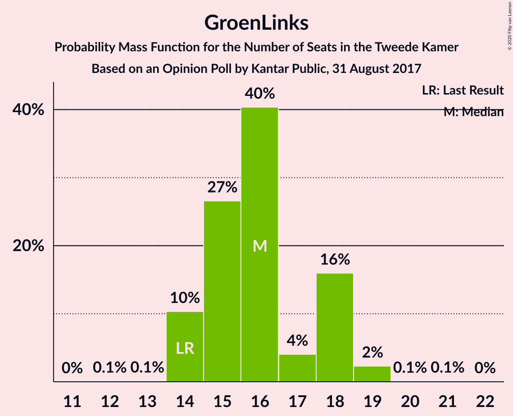

| Number of Seats | Probability | Accumulated | Special Marks |
|:---------------:|:-----------:|:-----------:|:-------------:|
| 12 | 0.1% | 100% |  |
| 13 | 0.1% | 99.9% |  |
| 14 | 10% | 99.8% | Last Result |
| 15 | 27% | 89% |  |
| 16 | 40% | 63% | Median |
| 17 | 4% | 23% |  |
| 18 | 16% | 18% |  |
| 19 | 2% | 2% |  |
| 20 | 0.1% | 0.2% |  |
| 21 | 0.1% | 0.1% |  |
| 22 | 0% | 0% |  |

### Socialistische Partij

*For a full overview of the results for this party, see the [Socialistische Partij](party-socialistischepartij.html) page.*

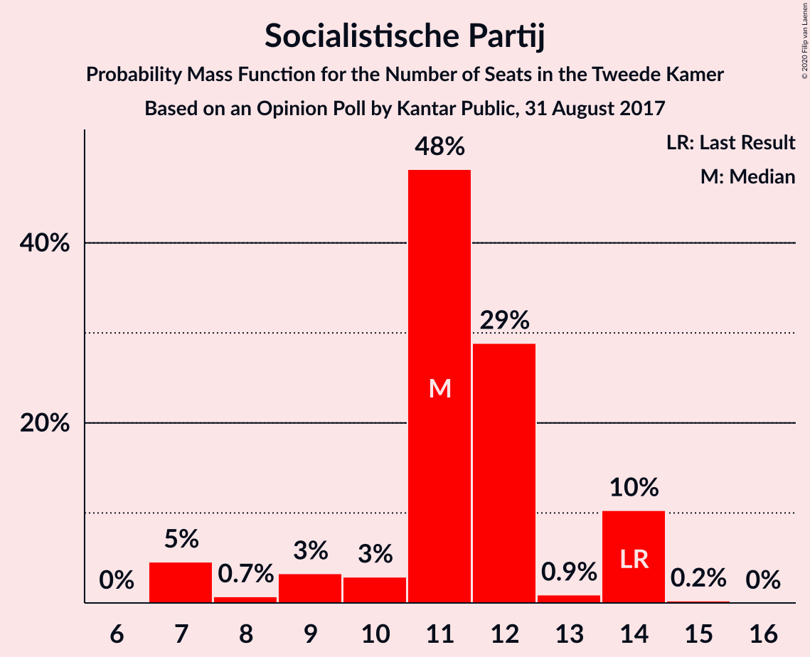

| Number of Seats | Probability | Accumulated | Special Marks |
|:---------------:|:-----------:|:-----------:|:-------------:|
| 7 | 5% | 100% |  |
| 8 | 0.7% | 95% |  |
| 9 | 3% | 95% |  |
| 10 | 3% | 91% |  |
| 11 | 48% | 89% | Median |
| 12 | 29% | 40% |  |
| 13 | 0.9% | 11% |  |
| 14 | 10% | 11% | Last Result |
| 15 | 0.2% | 0.3% |  |
| 16 | 0% | 0% |  |

### Partij van de Arbeid

*For a full overview of the results for this party, see the [Partij van de Arbeid](party-partijvandearbeid.html) page.*

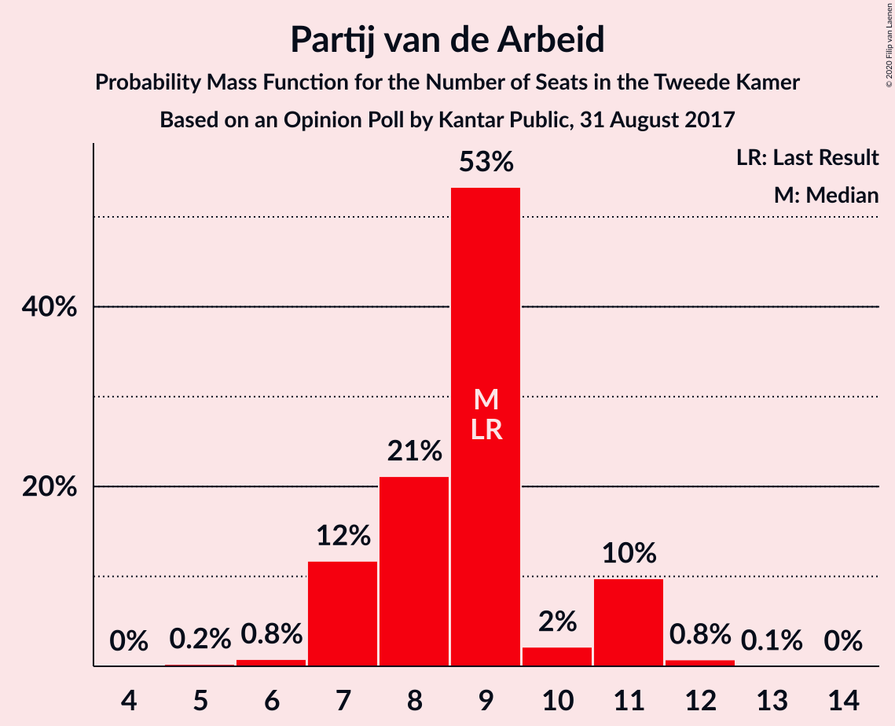

| Number of Seats | Probability | Accumulated | Special Marks |
|:---------------:|:-----------:|:-----------:|:-------------:|
| 5 | 0.2% | 100% |  |
| 6 | 0.8% | 99.8% |  |
| 7 | 12% | 99.0% |  |
| 8 | 21% | 87% |  |
| 9 | 53% | 66% | Last Result, Median |
| 10 | 2% | 13% |  |
| 11 | 10% | 11% |  |
| 12 | 0.8% | 0.8% |  |
| 13 | 0.1% | 0.1% |  |
| 14 | 0% | 0% |  |

### Forum voor Democratie

*For a full overview of the results for this party, see the [Forum voor Democratie](party-forumvoordemocratie.html) page.*

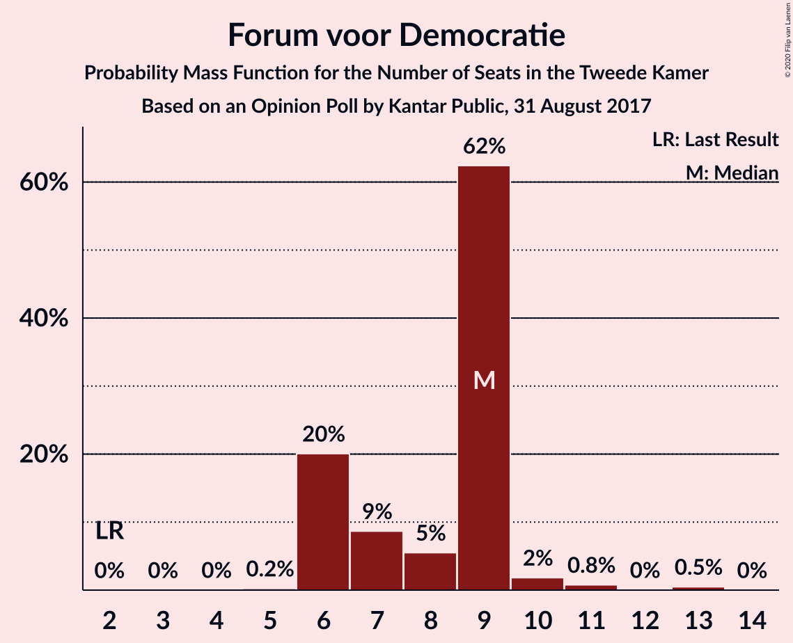

| Number of Seats | Probability | Accumulated | Special Marks |
|:---------------:|:-----------:|:-----------:|:-------------:|
| 2 | 0% | 100% | Last Result |
| 3 | 0% | 100% |  |
| 4 | 0% | 100% |  |
| 5 | 0.2% | 100% |  |
| 6 | 20% | 99.7% |  |
| 7 | 9% | 80% |  |
| 8 | 5% | 71% |  |
| 9 | 62% | 66% | Median |
| 10 | 2% | 3% |  |
| 11 | 0.8% | 1.3% |  |
| 12 | 0% | 0.5% |  |
| 13 | 0.5% | 0.5% |  |
| 14 | 0% | 0% |  |

### ChristenUnie

*For a full overview of the results for this party, see the [ChristenUnie](party-christenunie.html) page.*

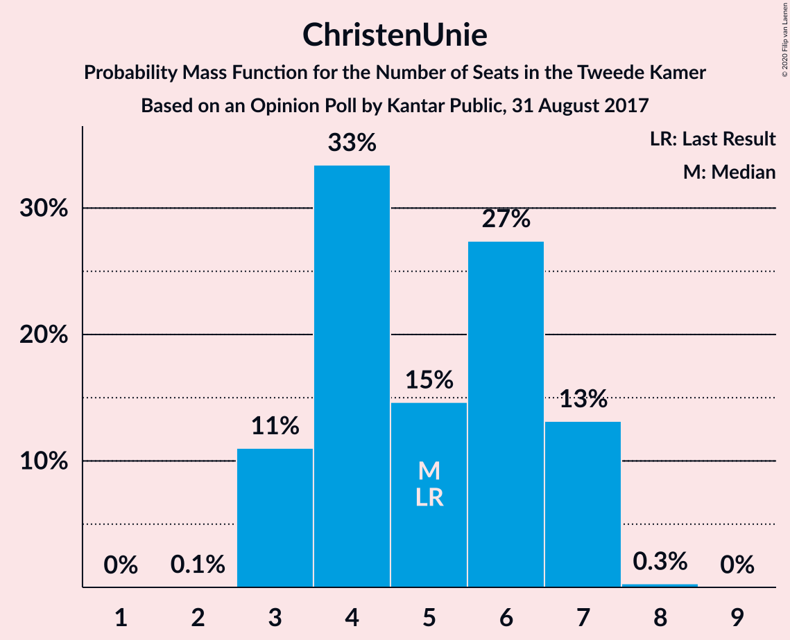

| Number of Seats | Probability | Accumulated | Special Marks |
|:---------------:|:-----------:|:-----------:|:-------------:|
| 2 | 0.1% | 100% |  |
| 3 | 11% | 99.9% |  |
| 4 | 33% | 89% |  |
| 5 | 15% | 56% | Last Result, Median |
| 6 | 27% | 41% |  |
| 7 | 13% | 13% |  |
| 8 | 0.3% | 0.3% |  |
| 9 | 0% | 0% |  |

### Partij voor de Dieren

*For a full overview of the results for this party, see the [Partij voor de Dieren](party-partijvoordedieren.html) page.*

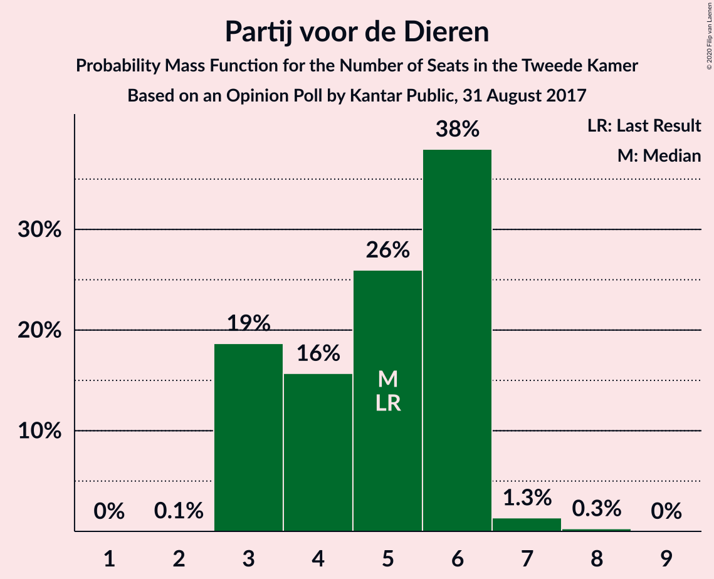

| Number of Seats | Probability | Accumulated | Special Marks |
|:---------------:|:-----------:|:-----------:|:-------------:|
| 2 | 0.1% | 100% |  |
| 3 | 19% | 99.9% |  |
| 4 | 16% | 81% |  |
| 5 | 26% | 66% | Last Result, Median |
| 6 | 38% | 40% |  |
| 7 | 1.3% | 2% |  |
| 8 | 0.3% | 0.3% |  |
| 9 | 0% | 0% |  |

### 50Plus

*For a full overview of the results for this party, see the [50Plus](party-50plus.html) page.*

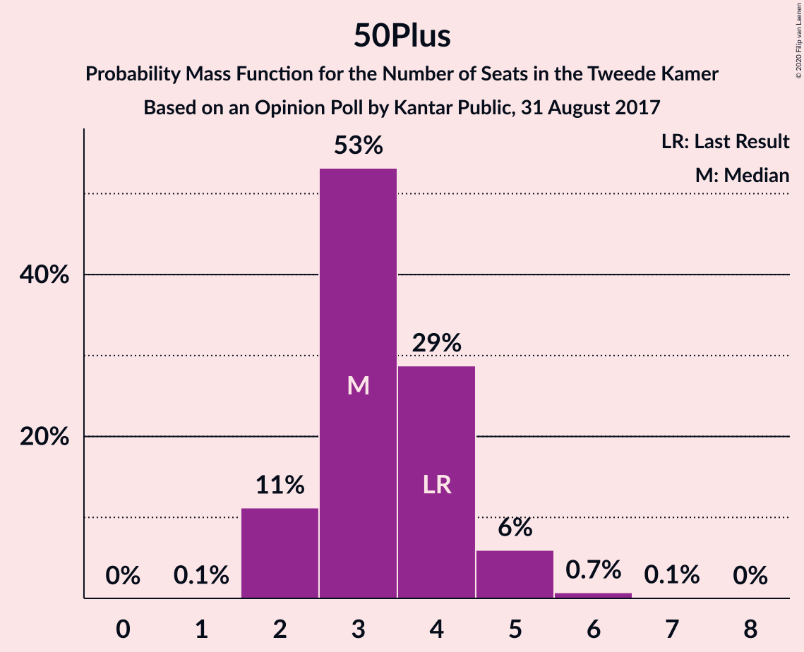

| Number of Seats | Probability | Accumulated | Special Marks |
|:---------------:|:-----------:|:-----------:|:-------------:|
| 1 | 0.1% | 100% |  |
| 2 | 11% | 99.9% |  |
| 3 | 53% | 89% | Median |
| 4 | 29% | 36% | Last Result |
| 5 | 6% | 7% |  |
| 6 | 0.7% | 0.8% |  |
| 7 | 0.1% | 0.1% |  |
| 8 | 0% | 0% |  |

### Staatkundig Gereformeerde Partij

*For a full overview of the results for this party, see the [Staatkundig Gereformeerde Partij](party-staatkundiggereformeerdepartij.html) page.*

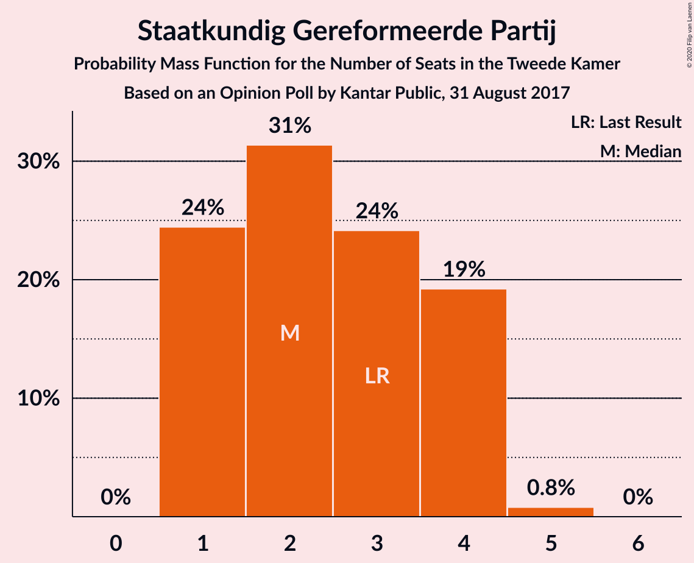

| Number of Seats | Probability | Accumulated | Special Marks |
|:---------------:|:-----------:|:-----------:|:-------------:|
| 1 | 24% | 100% |  |
| 2 | 31% | 76% | Median |
| 3 | 24% | 44% | Last Result |
| 4 | 19% | 20% |  |
| 5 | 0.8% | 0.8% |  |
| 6 | 0% | 0% |  |

### DENK

*For a full overview of the results for this party, see the [DENK](party-denk.html) page.*

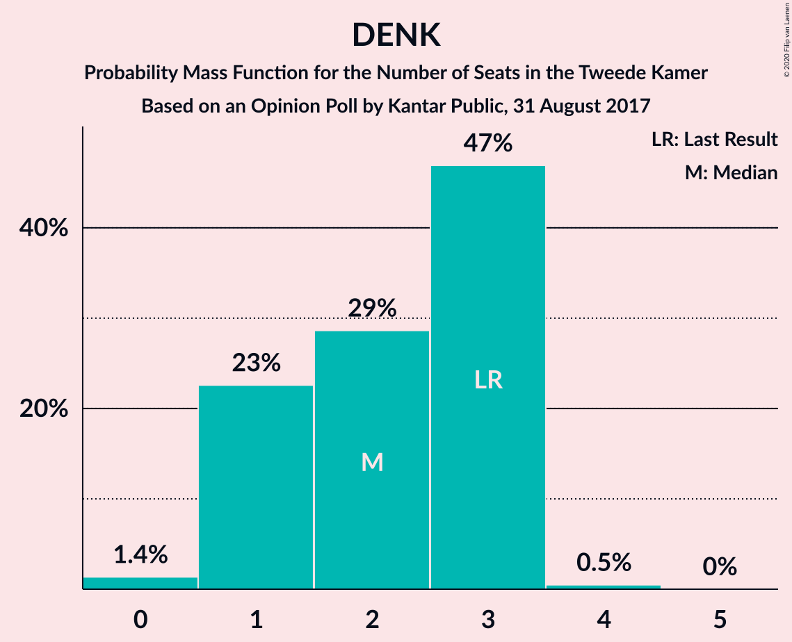

| Number of Seats | Probability | Accumulated | Special Marks |
|:---------------:|:-----------:|:-----------:|:-------------:|
| 0 | 1.4% | 100% |  |
| 1 | 23% | 98.6% |  |
| 2 | 29% | 76% | Median |
| 3 | 47% | 47% | Last Result |
| 4 | 0.5% | 0.5% |  |
| 5 | 0% | 0% |  |

## Coalitions

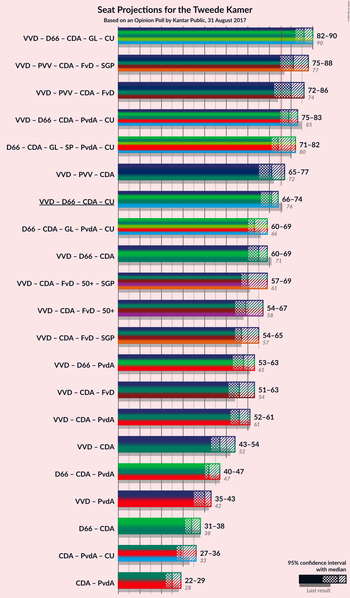

### Confidence Intervals

| Coalition | Last Result | Median | Majority? | 80% Confidence Interval | 90% Confidence Interval | 95% Confidence Interval | 99% Confidence Interval |
|:---------:|:-----------:|:------:|:---------:|:-----------------------:|:-----------------------:|:-----------------------:|:-----------------------:|
| Volkspartij voor Vrijheid en Democratie – Democraten 66 – Christen-Democratisch Appèl – GroenLinks – ChristenUnie | 90 | 86 | 100% | 82–89 | 82–90 | 82–90 | 81–92 |
| Volkspartij voor Vrijheid en Democratie – Partij voor de Vrijheid – Christen-Democratisch Appèl – Forum voor Democratie – Staatkundig Gereformeerde Partij | 77 | 81 | 91% | 76–85 | 75–88 | 75–88 | 75–88 |
| Volkspartij voor Vrijheid en Democratie – Partij voor de Vrijheid – Christen-Democratisch Appèl – Forum voor Democratie | 74 | 80 | 83% | 74–82 | 72–86 | 72–86 | 72–86 |
| Volkspartij voor Vrijheid en Democratie – Democraten 66 – Christen-Democratisch Appèl – Partij van de Arbeid – ChristenUnie | 85 | 79 | 97% | 76–83 | 76–83 | 75–83 | 73–83 |
| Democraten 66 – Christen-Democratisch Appèl – GroenLinks – Socialistische Partij – Partij van de Arbeid – ChristenUnie | 80 | 74 | 39% | 71–81 | 71–82 | 71–82 | 68–82 |
| Volkspartij voor Vrijheid en Democratie – Partij voor de Vrijheid – Christen-Democratisch Appèl | 72 | 71 | 10% | 66–75 | 66–77 | 65–77 | 62–77 |
| Volkspartij voor Vrijheid en Democratie – Democraten 66 – Christen-Democratisch Appèl – ChristenUnie | 76 | 71 | 0.4% | 67–74 | 67–74 | 66–74 | 64–75 |
| Democraten 66 – Christen-Democratisch Appèl – GroenLinks – Partij van de Arbeid – ChristenUnie | 66 | 63 | 0% | 60–68 | 60–68 | 60–69 | 58–71 |
| Volkspartij voor Vrijheid en Democratie – Democraten 66 – Christen-Democratisch Appèl | 71 | 65 | 0% | 61–69 | 61–69 | 60–69 | 59–70 |
| Volkspartij voor Vrijheid en Democratie – Christen-Democratisch Appèl – Forum voor Democratie – 50Plus – Staatkundig Gereformeerde Partij | 61 | 60 | 0% | 57–67 | 57–69 | 57–69 | 54–69 |
| Volkspartij voor Vrijheid en Democratie – Christen-Democratisch Appèl – Forum voor Democratie – 50Plus | 58 | 59 | 0% | 55–64 | 54–67 | 54–67 | 52–67 |
| Volkspartij voor Vrijheid en Democratie – Christen-Democratisch Appèl – Forum voor Democratie – Staatkundig Gereformeerde Partij | 57 | 57 | 0% | 54–64 | 54–65 | 54–65 | 50–65 |
| Volkspartij voor Vrijheid en Democratie – Democraten 66 – Partij van de Arbeid | 61 | 58 | 0% | 54–60 | 53–60 | 53–63 | 53–63 |
| Volkspartij voor Vrijheid en Democratie – Christen-Democratisch Appèl – Forum voor Democratie | 54 | 56 | 0% | 51–60 | 51–63 | 51–63 | 48–63 |
| Volkspartij voor Vrijheid en Democratie – Christen-Democratisch Appèl – Partij van de Arbeid | 61 | 56 | 0% | 54–61 | 52–61 | 52–61 | 50–61 |
| Volkspartij voor Vrijheid en Democratie – Christen-Democratisch Appèl | 52 | 47 | 0% | 45–52 | 44–54 | 43–54 | 42–54 |
| Democraten 66 – Christen-Democratisch Appèl – Partij van de Arbeid | 47 | 42 | 0% | 40–46 | 40–47 | 40–47 | 37–48 |
| Volkspartij voor Vrijheid en Democratie – Partij van de Arbeid | 42 | 40 | 0% | 37–42 | 37–42 | 35–43 | 35–45 |
| Democraten 66 – Christen-Democratisch Appèl | 38 | 34 | 0% | 31–37 | 31–38 | 31–38 | 28–39 |
| Christen-Democratisch Appèl – Partij van de Arbeid – ChristenUnie | 33 | 29 | 0% | 27–35 | 27–36 | 27–36 | 23–36 |
| Christen-Democratisch Appèl – Partij van de Arbeid | 28 | 25 | 0% | 23–29 | 23–29 | 22–29 | 19–29 |

### Volkspartij voor Vrijheid en Democratie – Democraten 66 – Christen-Democratisch Appèl – GroenLinks – ChristenUnie

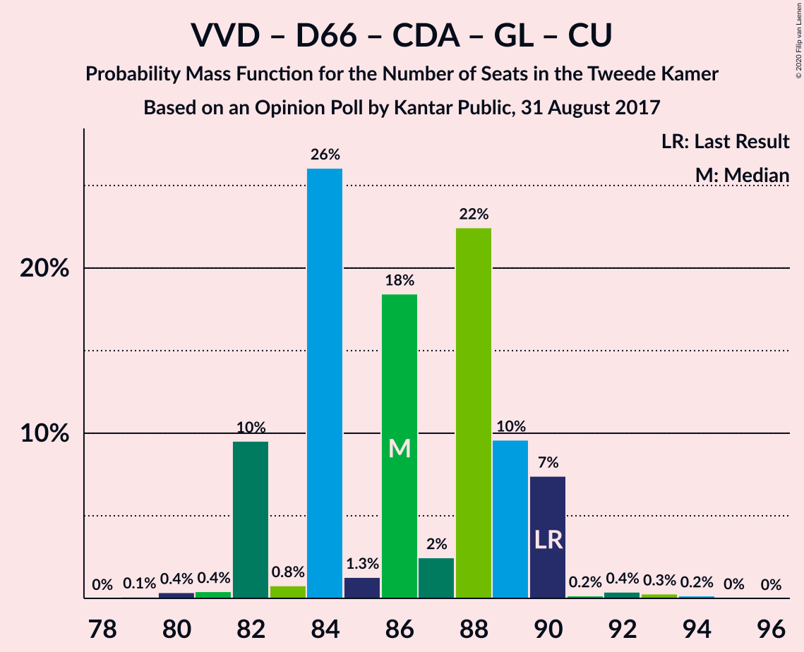

| Number of Seats | Probability | Accumulated | Special Marks |
|:---------------:|:-----------:|:-----------:|:-------------:|
| 79 | 0.1% | 100% |  |
| 80 | 0.4% | 99.9% |  |
| 81 | 0.4% | 99.5% |  |
| 82 | 10% | 99.1% |  |
| 83 | 0.8% | 90% |  |
| 84 | 26% | 89% |  |
| 85 | 1.3% | 63% |  |
| 86 | 18% | 61% | Median |
| 87 | 2% | 43% |  |
| 88 | 22% | 41% |  |
| 89 | 10% | 18% |  |
| 90 | 7% | 8% | Last Result |
| 91 | 0.2% | 1.1% |  |
| 92 | 0.4% | 0.9% |  |
| 93 | 0.3% | 0.5% |  |
| 94 | 0.2% | 0.2% |  |
| 95 | 0% | 0.1% |  |
| 96 | 0% | 0% |  |

### Volkspartij voor Vrijheid en Democratie – Partij voor de Vrijheid – Christen-Democratisch Appèl – Forum voor Democratie – Staatkundig Gereformeerde Partij

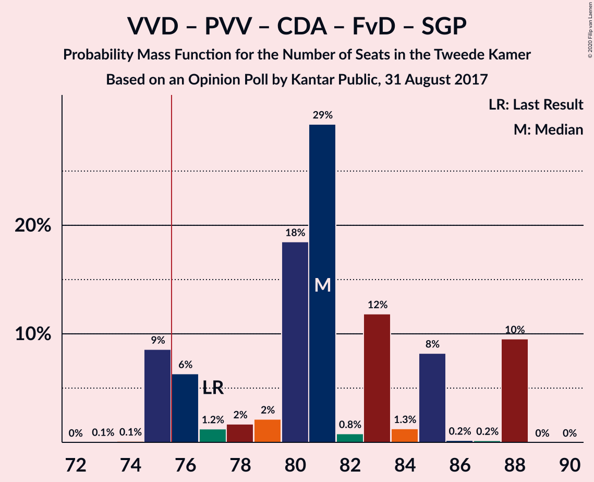

| Number of Seats | Probability | Accumulated | Special Marks |
|:---------------:|:-----------:|:-----------:|:-------------:|
| 73 | 0.1% | 100% |  |
| 74 | 0.1% | 99.9% |  |
| 75 | 9% | 99.8% |  |
| 76 | 6% | 91% | Majority |
| 77 | 1.2% | 85% | Last Result |
| 78 | 2% | 84% |  |
| 79 | 2% | 82% |  |
| 80 | 18% | 80% |  |
| 81 | 29% | 61% |  |
| 82 | 0.8% | 32% | Median |
| 83 | 12% | 31% |  |
| 84 | 1.3% | 19% |  |
| 85 | 8% | 18% |  |
| 86 | 0.2% | 10% |  |
| 87 | 0.2% | 10% |  |
| 88 | 10% | 10% |  |
| 89 | 0% | 0% |  |

### Volkspartij voor Vrijheid en Democratie – Partij voor de Vrijheid – Christen-Democratisch Appèl – Forum voor Democratie

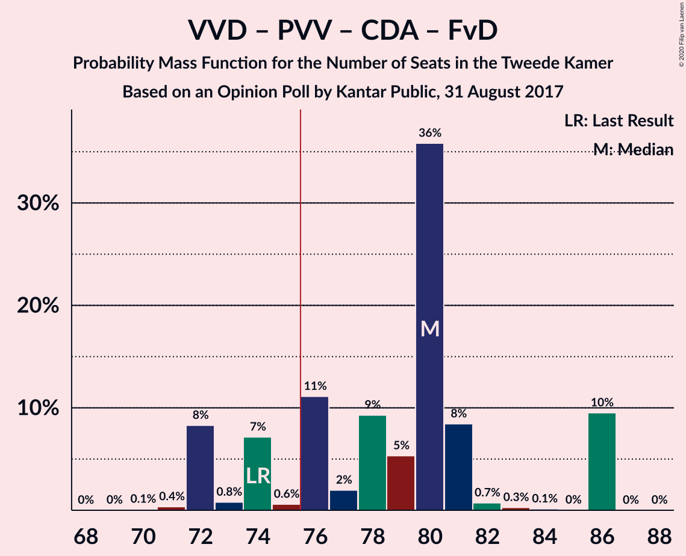

| Number of Seats | Probability | Accumulated | Special Marks |
|:---------------:|:-----------:|:-----------:|:-------------:|
| 70 | 0.1% | 100% |  |
| 71 | 0.4% | 99.9% |  |
| 72 | 8% | 99.5% |  |
| 73 | 0.8% | 91% |  |
| 74 | 7% | 90% | Last Result |
| 75 | 0.6% | 83% |  |
| 76 | 11% | 83% | Majority |
| 77 | 2% | 72% |  |
| 78 | 9% | 70% |  |
| 79 | 5% | 60% |  |
| 80 | 36% | 55% | Median |
| 81 | 8% | 19% |  |
| 82 | 0.7% | 11% |  |
| 83 | 0.3% | 10% |  |
| 84 | 0.1% | 10% |  |
| 85 | 0% | 10% |  |
| 86 | 10% | 10% |  |
| 87 | 0% | 0% |  |

### Volkspartij voor Vrijheid en Democratie – Democraten 66 – Christen-Democratisch Appèl – Partij van de Arbeid – ChristenUnie

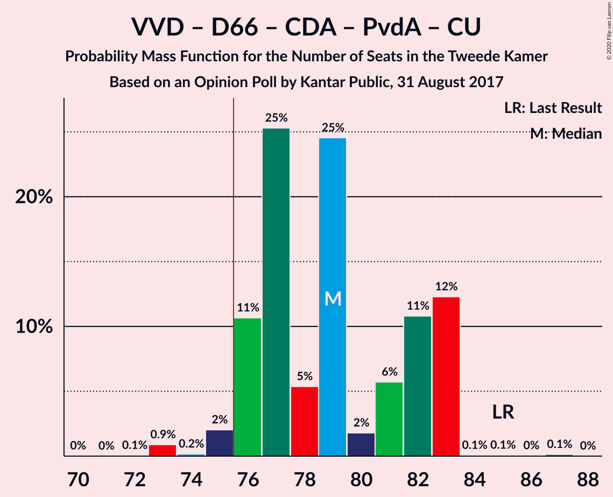

| Number of Seats | Probability | Accumulated | Special Marks |
|:---------------:|:-----------:|:-----------:|:-------------:|
| 72 | 0.1% | 100% |  |
| 73 | 0.9% | 99.9% |  |
| 74 | 0.2% | 99.0% |  |
| 75 | 2% | 98.8% |  |
| 76 | 11% | 97% | Majority |
| 77 | 25% | 86% |  |
| 78 | 5% | 61% |  |
| 79 | 25% | 55% | Median |
| 80 | 2% | 31% |  |
| 81 | 6% | 29% |  |
| 82 | 11% | 23% |  |
| 83 | 12% | 13% |  |
| 84 | 0.1% | 0.3% |  |
| 85 | 0.1% | 0.3% | Last Result |
| 86 | 0% | 0.2% |  |
| 87 | 0.1% | 0.2% |  |
| 88 | 0% | 0% |  |

### Democraten 66 – Christen-Democratisch Appèl – GroenLinks – Socialistische Partij – Partij van de Arbeid – ChristenUnie

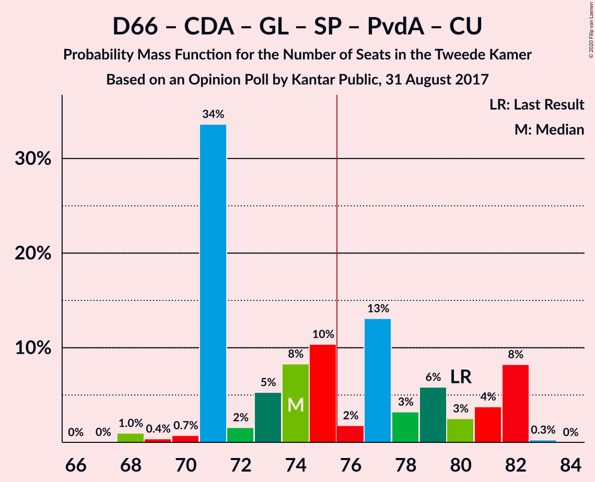

| Number of Seats | Probability | Accumulated | Special Marks |
|:---------------:|:-----------:|:-----------:|:-------------:|
| 68 | 1.0% | 100% |  |
| 69 | 0.4% | 99.0% |  |
| 70 | 0.7% | 98.6% |  |
| 71 | 34% | 98% |  |
| 72 | 2% | 64% |  |
| 73 | 5% | 63% |  |
| 74 | 8% | 57% | Median |
| 75 | 10% | 49% |  |
| 76 | 2% | 39% | Majority |
| 77 | 13% | 37% |  |
| 78 | 3% | 24% |  |
| 79 | 6% | 21% |  |
| 80 | 3% | 15% | Last Result |
| 81 | 4% | 12% |  |
| 82 | 8% | 9% |  |
| 83 | 0.3% | 0.3% |  |
| 84 | 0% | 0% |  |

### Volkspartij voor Vrijheid en Democratie – Partij voor de Vrijheid – Christen-Democratisch Appèl

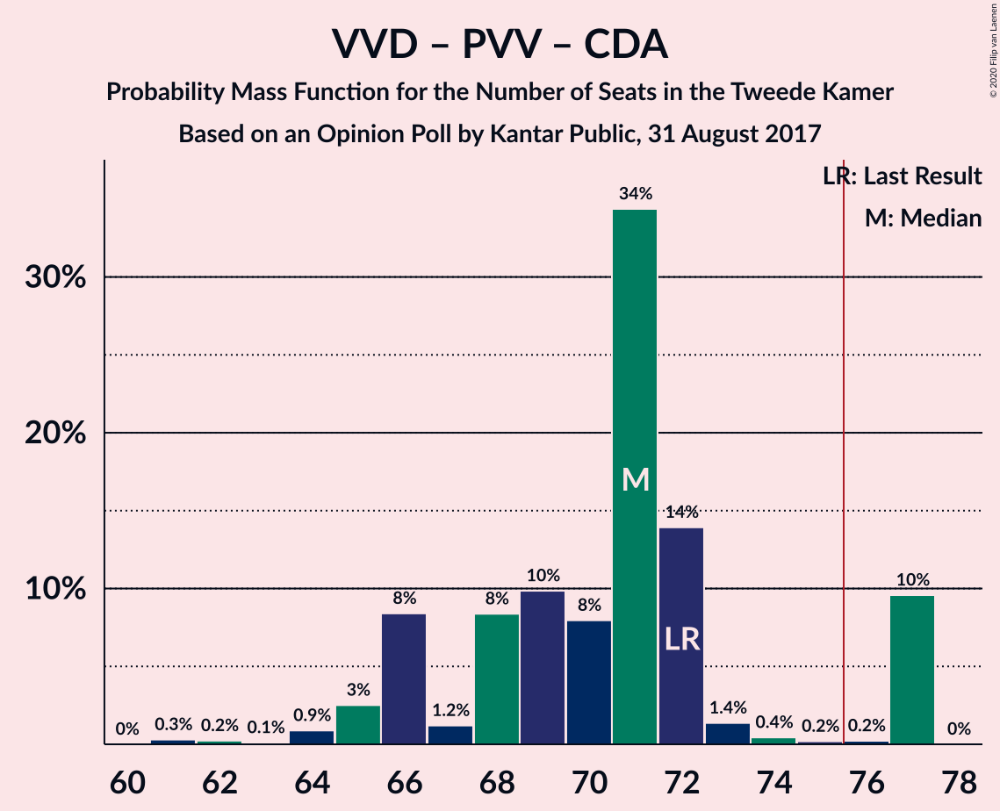

| Number of Seats | Probability | Accumulated | Special Marks |
|:---------------:|:-----------:|:-----------:|:-------------:|
| 61 | 0.3% | 100% |  |
| 62 | 0.2% | 99.7% |  |
| 63 | 0.1% | 99.5% |  |
| 64 | 0.9% | 99.3% |  |
| 65 | 3% | 98% |  |
| 66 | 8% | 96% |  |
| 67 | 1.2% | 88% |  |
| 68 | 8% | 86% |  |
| 69 | 10% | 78% |  |
| 70 | 8% | 68% |  |
| 71 | 34% | 60% | Median |
| 72 | 14% | 26% | Last Result |
| 73 | 1.4% | 12% |  |
| 74 | 0.4% | 10% |  |
| 75 | 0.2% | 10% |  |
| 76 | 0.2% | 10% | Majority |
| 77 | 10% | 10% |  |
| 78 | 0% | 0% |  |

### Volkspartij voor Vrijheid en Democratie – Democraten 66 – Christen-Democratisch Appèl – ChristenUnie

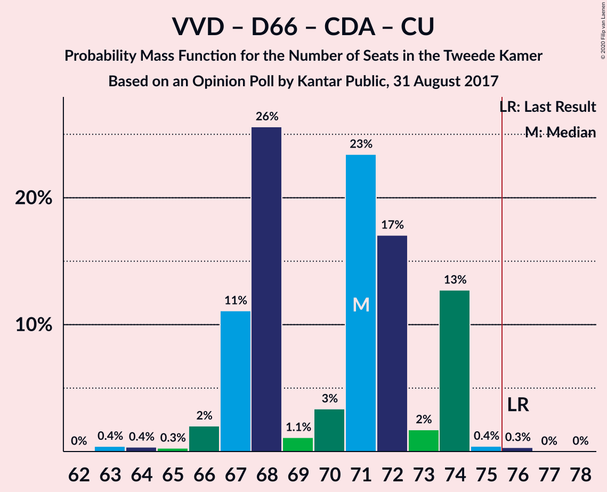

| Number of Seats | Probability | Accumulated | Special Marks |
|:---------------:|:-----------:|:-----------:|:-------------:|
| 63 | 0.4% | 100% |  |
| 64 | 0.4% | 99.6% |  |
| 65 | 0.3% | 99.2% |  |
| 66 | 2% | 98.9% |  |
| 67 | 11% | 97% |  |
| 68 | 26% | 86% |  |
| 69 | 1.1% | 60% |  |
| 70 | 3% | 59% | Median |
| 71 | 23% | 56% |  |
| 72 | 17% | 32% |  |
| 73 | 2% | 15% |  |
| 74 | 13% | 14% |  |
| 75 | 0.4% | 0.8% |  |
| 76 | 0.3% | 0.4% | Last Result, Majority |
| 77 | 0% | 0.1% |  |
| 78 | 0% | 0% |  |

### Democraten 66 – Christen-Democratisch Appèl – GroenLinks – Partij van de Arbeid – ChristenUnie

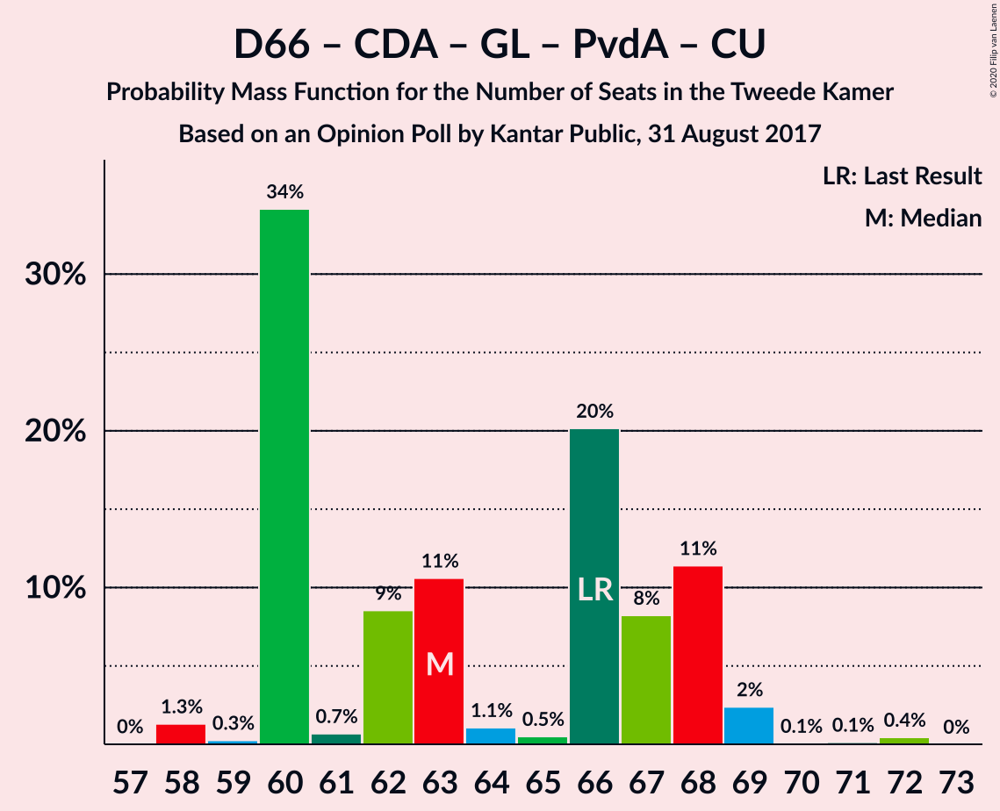

| Number of Seats | Probability | Accumulated | Special Marks |
|:---------------:|:-----------:|:-----------:|:-------------:|
| 58 | 1.3% | 100% |  |
| 59 | 0.3% | 98.6% |  |
| 60 | 34% | 98% |  |
| 61 | 0.7% | 64% |  |
| 62 | 9% | 64% |  |
| 63 | 11% | 55% | Median |
| 64 | 1.1% | 44% |  |
| 65 | 0.5% | 43% |  |
| 66 | 20% | 43% | Last Result |
| 67 | 8% | 23% |  |
| 68 | 11% | 14% |  |
| 69 | 2% | 3% |  |
| 70 | 0.1% | 0.7% |  |
| 71 | 0.1% | 0.6% |  |
| 72 | 0.4% | 0.5% |  |
| 73 | 0% | 0% |  |

### Volkspartij voor Vrijheid en Democratie – Democraten 66 – Christen-Democratisch Appèl

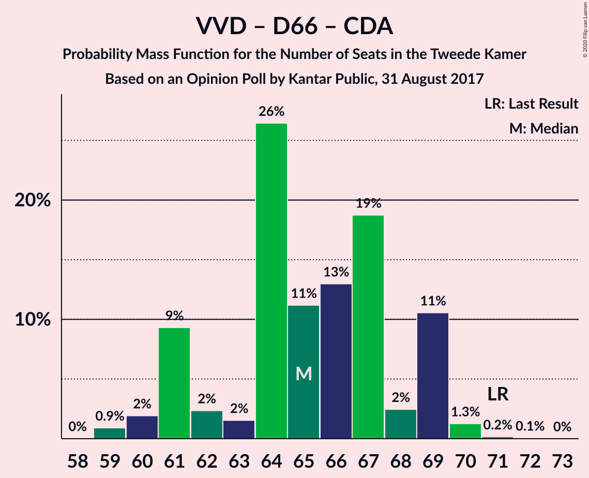

| Number of Seats | Probability | Accumulated | Special Marks |
|:---------------:|:-----------:|:-----------:|:-------------:|
| 58 | 0% | 100% |  |
| 59 | 0.9% | 99.9% |  |
| 60 | 2% | 99.0% |  |
| 61 | 9% | 97% |  |
| 62 | 2% | 88% |  |
| 63 | 2% | 85% |  |
| 64 | 26% | 84% |  |
| 65 | 11% | 57% | Median |
| 66 | 13% | 46% |  |
| 67 | 19% | 33% |  |
| 68 | 2% | 15% |  |
| 69 | 11% | 12% |  |
| 70 | 1.3% | 2% |  |
| 71 | 0.2% | 0.3% | Last Result |
| 72 | 0.1% | 0.1% |  |
| 73 | 0% | 0% |  |

### Volkspartij voor Vrijheid en Democratie – Christen-Democratisch Appèl – Forum voor Democratie – 50Plus – Staatkundig Gereformeerde Partij

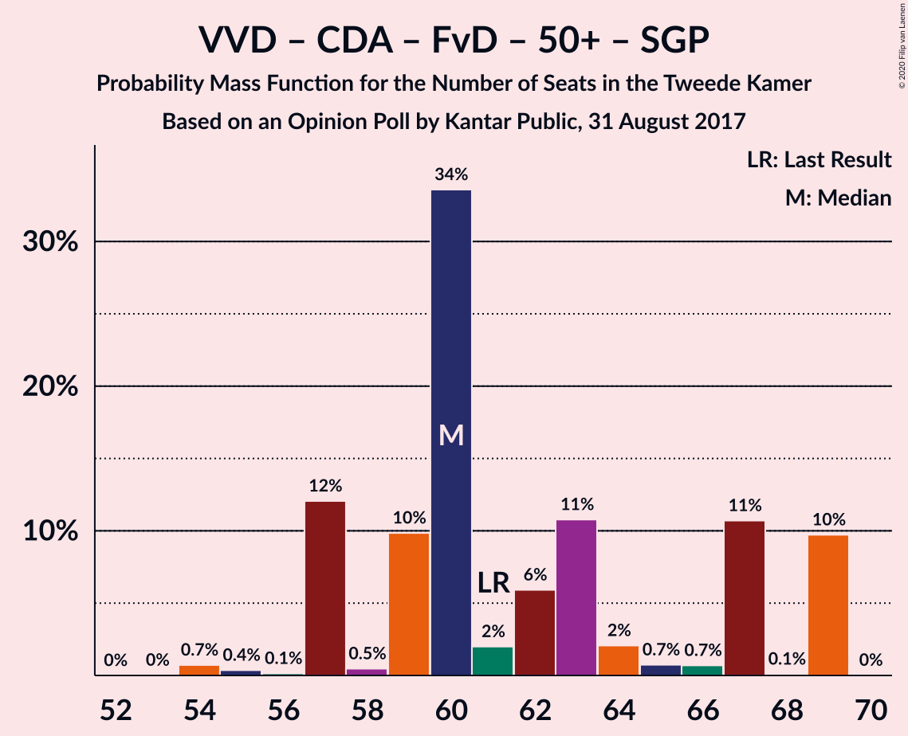

| Number of Seats | Probability | Accumulated | Special Marks |
|:---------------:|:-----------:|:-----------:|:-------------:|
| 54 | 0.7% | 100% |  |
| 55 | 0.4% | 99.3% |  |
| 56 | 0.1% | 98.9% |  |
| 57 | 12% | 98.7% |  |
| 58 | 0.5% | 87% |  |
| 59 | 10% | 86% |  |
| 60 | 34% | 76% |  |
| 61 | 2% | 43% | Last Result |
| 62 | 6% | 41% | Median |
| 63 | 11% | 35% |  |
| 64 | 2% | 24% |  |
| 65 | 0.7% | 22% |  |
| 66 | 0.7% | 21% |  |
| 67 | 11% | 21% |  |
| 68 | 0.1% | 10% |  |
| 69 | 10% | 10% |  |
| 70 | 0% | 0% |  |

### Volkspartij voor Vrijheid en Democratie – Christen-Democratisch Appèl – Forum voor Democratie – 50Plus

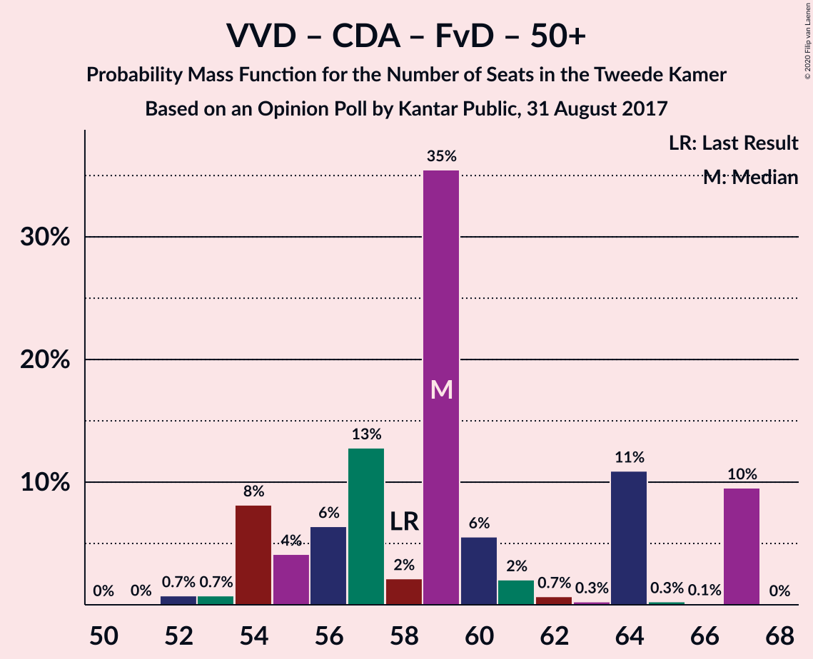

| Number of Seats | Probability | Accumulated | Special Marks |
|:---------------:|:-----------:|:-----------:|:-------------:|
| 51 | 0% | 100% |  |
| 52 | 0.7% | 99.9% |  |
| 53 | 0.7% | 99.2% |  |
| 54 | 8% | 98% |  |
| 55 | 4% | 90% |  |
| 56 | 6% | 86% |  |
| 57 | 13% | 80% |  |
| 58 | 2% | 67% | Last Result |
| 59 | 35% | 65% |  |
| 60 | 6% | 29% | Median |
| 61 | 2% | 24% |  |
| 62 | 0.7% | 22% |  |
| 63 | 0.3% | 21% |  |
| 64 | 11% | 21% |  |
| 65 | 0.3% | 10% |  |
| 66 | 0.1% | 10% |  |
| 67 | 10% | 10% |  |
| 68 | 0% | 0% |  |

### Volkspartij voor Vrijheid en Democratie – Christen-Democratisch Appèl – Forum voor Democratie – Staatkundig Gereformeerde Partij

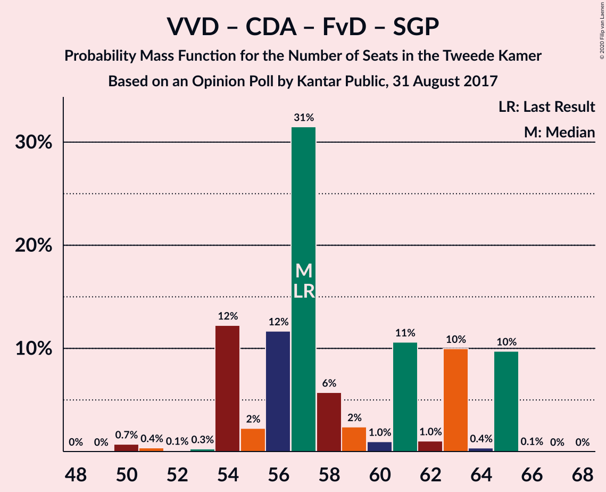

| Number of Seats | Probability | Accumulated | Special Marks |
|:---------------:|:-----------:|:-----------:|:-------------:|
| 50 | 0.7% | 100% |  |
| 51 | 0.4% | 99.3% |  |
| 52 | 0.1% | 98.9% |  |
| 53 | 0.3% | 98.8% |  |
| 54 | 12% | 98.5% |  |
| 55 | 2% | 86% |  |
| 56 | 12% | 84% |  |
| 57 | 31% | 72% | Last Result |
| 58 | 6% | 41% |  |
| 59 | 2% | 35% | Median |
| 60 | 1.0% | 33% |  |
| 61 | 11% | 32% |  |
| 62 | 1.0% | 21% |  |
| 63 | 10% | 20% |  |
| 64 | 0.4% | 10% |  |
| 65 | 10% | 10% |  |
| 66 | 0.1% | 0.1% |  |
| 67 | 0% | 0% |  |

### Volkspartij voor Vrijheid en Democratie – Democraten 66 – Partij van de Arbeid

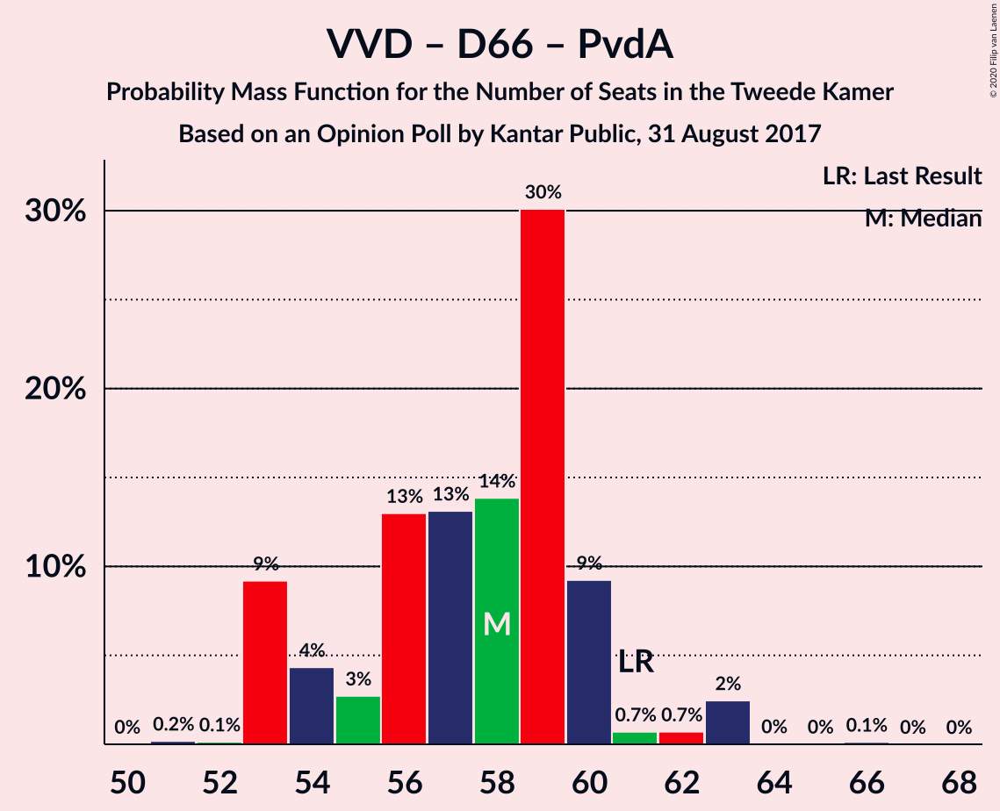

| Number of Seats | Probability | Accumulated | Special Marks |
|:---------------:|:-----------:|:-----------:|:-------------:|
| 51 | 0.2% | 100% |  |
| 52 | 0.1% | 99.8% |  |
| 53 | 9% | 99.6% |  |
| 54 | 4% | 90% |  |
| 55 | 3% | 86% |  |
| 56 | 13% | 83% |  |
| 57 | 13% | 70% |  |
| 58 | 14% | 57% | Median |
| 59 | 30% | 43% |  |
| 60 | 9% | 13% |  |
| 61 | 0.7% | 4% | Last Result |
| 62 | 0.7% | 3% |  |
| 63 | 2% | 3% |  |
| 64 | 0% | 0.2% |  |
| 65 | 0% | 0.2% |  |
| 66 | 0.1% | 0.1% |  |
| 67 | 0% | 0% |  |

### Volkspartij voor Vrijheid en Democratie – Christen-Democratisch Appèl – Forum voor Democratie

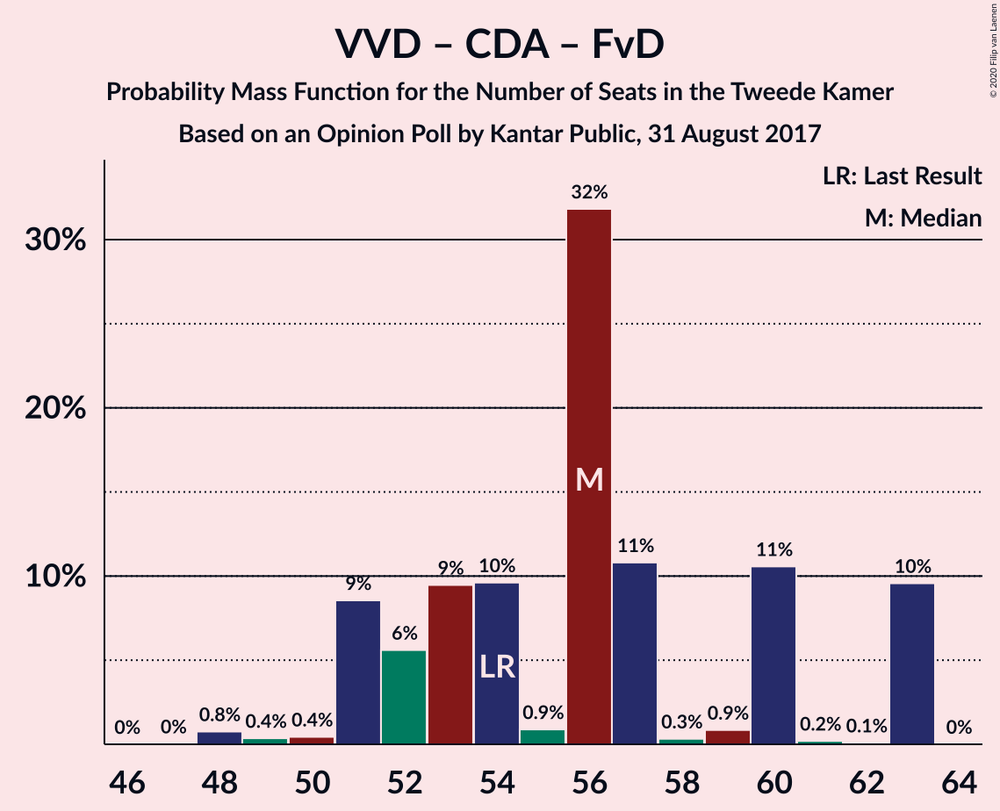

| Number of Seats | Probability | Accumulated | Special Marks |
|:---------------:|:-----------:|:-----------:|:-------------:|
| 47 | 0% | 100% |  |
| 48 | 0.8% | 99.9% |  |
| 49 | 0.4% | 99.2% |  |
| 50 | 0.4% | 98.8% |  |
| 51 | 9% | 98% |  |
| 52 | 6% | 90% |  |
| 53 | 9% | 84% |  |
| 54 | 10% | 75% | Last Result |
| 55 | 0.9% | 65% |  |
| 56 | 32% | 64% |  |
| 57 | 11% | 32% | Median |
| 58 | 0.3% | 22% |  |
| 59 | 0.9% | 21% |  |
| 60 | 11% | 20% |  |
| 61 | 0.2% | 10% |  |
| 62 | 0.1% | 10% |  |
| 63 | 10% | 10% |  |
| 64 | 0% | 0% |  |

### Volkspartij voor Vrijheid en Democratie – Christen-Democratisch Appèl – Partij van de Arbeid

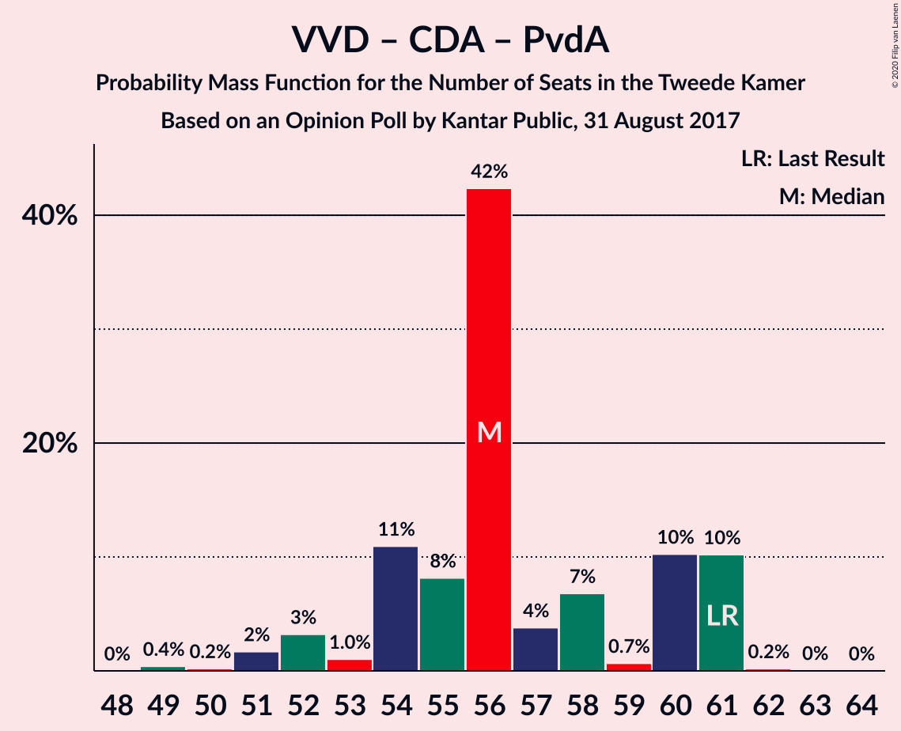

| Number of Seats | Probability | Accumulated | Special Marks |
|:---------------:|:-----------:|:-----------:|:-------------:|
| 49 | 0.4% | 100% |  |
| 50 | 0.2% | 99.6% |  |
| 51 | 2% | 99.4% |  |
| 52 | 3% | 98% |  |
| 53 | 1.0% | 94% |  |
| 54 | 11% | 93% |  |
| 55 | 8% | 82% |  |
| 56 | 42% | 74% |  |
| 57 | 4% | 32% | Median |
| 58 | 7% | 28% |  |
| 59 | 0.7% | 21% |  |
| 60 | 10% | 21% |  |
| 61 | 10% | 10% | Last Result |
| 62 | 0.2% | 0.3% |  |
| 63 | 0% | 0.1% |  |
| 64 | 0% | 0% |  |

### Volkspartij voor Vrijheid en Democratie – Christen-Democratisch Appèl

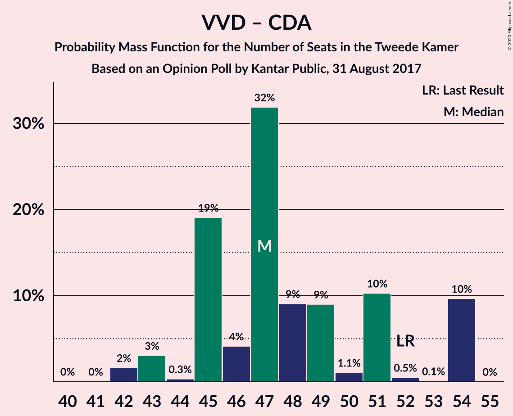

| Number of Seats | Probability | Accumulated | Special Marks |
|:---------------:|:-----------:|:-----------:|:-------------:|
| 40 | 0% | 100% |  |
| 41 | 0% | 99.9% |  |
| 42 | 2% | 99.9% |  |
| 43 | 3% | 98% |  |
| 44 | 0.3% | 95% |  |
| 45 | 19% | 95% |  |
| 46 | 4% | 76% |  |
| 47 | 32% | 72% |  |
| 48 | 9% | 40% | Median |
| 49 | 9% | 31% |  |
| 50 | 1.1% | 22% |  |
| 51 | 10% | 21% |  |
| 52 | 0.5% | 10% | Last Result |
| 53 | 0.1% | 10% |  |
| 54 | 10% | 10% |  |
| 55 | 0% | 0% |  |

### Democraten 66 – Christen-Democratisch Appèl – Partij van de Arbeid

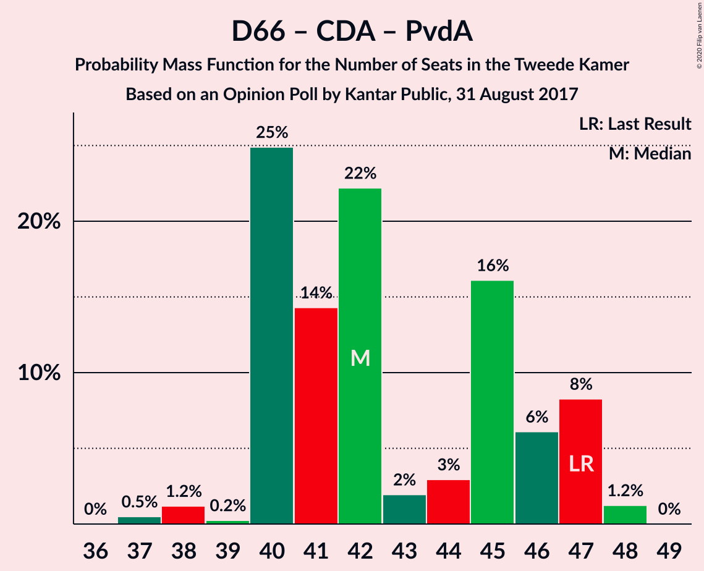

| Number of Seats | Probability | Accumulated | Special Marks |
|:---------------:|:-----------:|:-----------:|:-------------:|
| 37 | 0.5% | 100% |  |
| 38 | 1.2% | 99.5% |  |
| 39 | 0.2% | 98% |  |
| 40 | 25% | 98% |  |
| 41 | 14% | 73% |  |
| 42 | 22% | 59% | Median |
| 43 | 2% | 37% |  |
| 44 | 3% | 35% |  |
| 45 | 16% | 32% |  |
| 46 | 6% | 16% |  |
| 47 | 8% | 10% | Last Result |
| 48 | 1.2% | 1.3% |  |
| 49 | 0% | 0% |  |

### Volkspartij voor Vrijheid en Democratie – Partij van de Arbeid

| Number of Seats | Probability | Accumulated | Special Marks |
|:---------------:|:-----------:|:-----------:|:-------------:|
| 33 | 0.1% | 100% |  |
| 34 | 0.1% | 99.9% |  |
| 35 | 3% | 99.8% |  |
| 36 | 1.1% | 97% |  |
| 37 | 13% | 96% |  |
| 38 | 9% | 83% |  |
| 39 | 3% | 74% |  |
| 40 | 27% | 71% |  |
| 41 | 0.6% | 44% | Median |
| 42 | 39% | 43% | Last Result |
| 43 | 2% | 4% |  |
| 44 | 0.6% | 2% |  |
| 45 | 0.9% | 1.0% |  |
| 46 | 0% | 0.1% |  |
| 47 | 0% | 0% |  |

### Democraten 66 – Christen-Democratisch Appèl

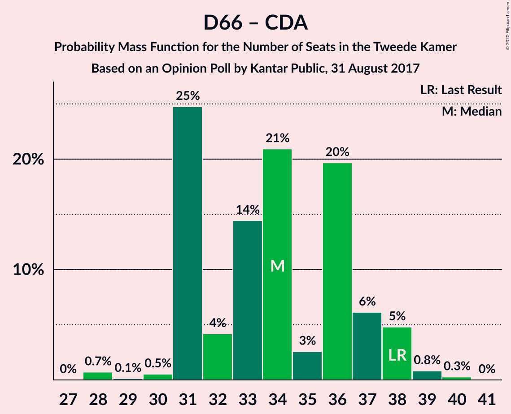

| Number of Seats | Probability | Accumulated | Special Marks |
|:---------------:|:-----------:|:-----------:|:-------------:|
| 28 | 0.7% | 100% |  |
| 29 | 0.1% | 99.3% |  |
| 30 | 0.5% | 99.1% |  |
| 31 | 25% | 98.6% |  |
| 32 | 4% | 74% |  |
| 33 | 14% | 70% | Median |
| 34 | 21% | 55% |  |
| 35 | 3% | 34% |  |
| 36 | 20% | 32% |  |
| 37 | 6% | 12% |  |
| 38 | 5% | 6% | Last Result |
| 39 | 0.8% | 1.1% |  |
| 40 | 0.3% | 0.3% |  |
| 41 | 0% | 0% |  |

### Christen-Democratisch Appèl – Partij van de Arbeid – ChristenUnie

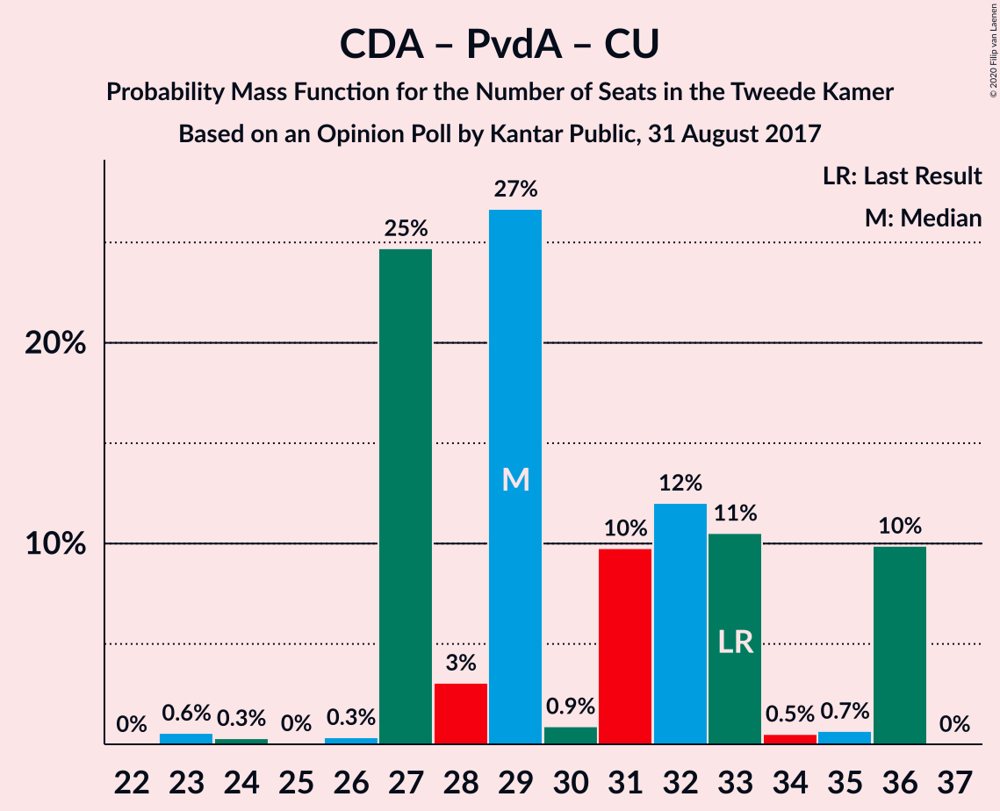

| Number of Seats | Probability | Accumulated | Special Marks |
|:---------------:|:-----------:|:-----------:|:-------------:|
| 23 | 0.6% | 100% |  |
| 24 | 0.3% | 99.4% |  |
| 25 | 0% | 99.1% |  |
| 26 | 0.3% | 99.1% |  |
| 27 | 25% | 98.7% |  |
| 28 | 3% | 74% |  |
| 29 | 27% | 71% |  |
| 30 | 0.9% | 44% | Median |
| 31 | 10% | 43% |  |
| 32 | 12% | 34% |  |
| 33 | 11% | 22% | Last Result |
| 34 | 0.5% | 11% |  |
| 35 | 0.7% | 11% |  |
| 36 | 10% | 10% |  |
| 37 | 0% | 0% |  |

### Christen-Democratisch Appèl – Partij van de Arbeid

| Number of Seats | Probability | Accumulated | Special Marks |
|:---------------:|:-----------:|:-----------:|:-------------:|
| 19 | 0.6% | 100% |  |
| 20 | 0.1% | 99.4% |  |
| 21 | 0.8% | 99.3% |  |
| 22 | 3% | 98.6% |  |
| 23 | 25% | 95% |  |
| 24 | 10% | 70% |  |
| 25 | 13% | 60% | Median |
| 26 | 22% | 47% |  |
| 27 | 13% | 25% |  |
| 28 | 0.7% | 11% | Last Result |
| 29 | 11% | 11% |  |
| 30 | 0.2% | 0.2% |  |
| 31 | 0% | 0% |  |

## Technical Information

### Opinion Poll

+ **Polling firm:** Kantar Public
+ **Commissioner(s):** —
+ **Fieldwork period:** 31 August 2017

### Calculations

+ **Sample size:** 954
+ **Simulations done:** 1,048,576
+ **Error estimate:** 2.99%

