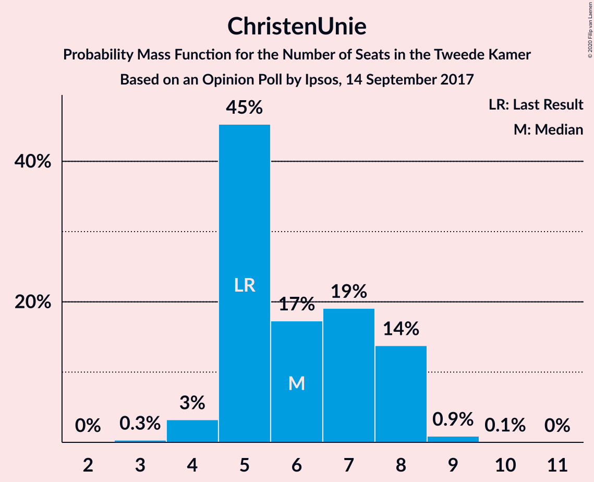
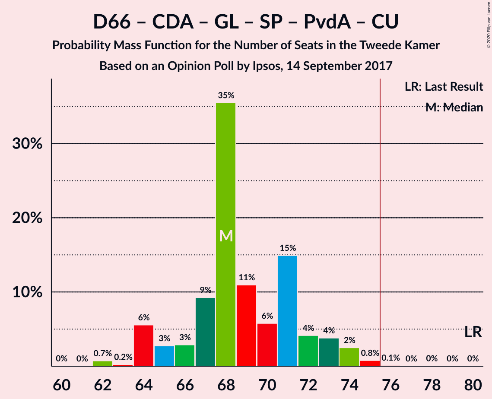

# Opinion Poll by Ipsos, 14 September 2017

<a href="#voting-intentions">Voting Intentions</a> | <a href="#seats">Seats</a> | <a href="#coalitions">Coalitions</a> | <a href="#technical-information">Technical Information</a>

## Voting Intentions

### Confidence Intervals

| Party | Last Result | Poll Result | 80% Confidence Interval | 90% Confidence Interval | 95% Confidence Interval | 99% Confidence Interval |
|:-----:|:-----------:|:-----------:|:-----------------------:|:-----------------------:|:-----------------------:|:-----------------------:|
| Volkspartij voor Vrijheid en Democratie | 21.3% | 22.7% | 21.1–24.5% |20.6–25.0% |20.2–25.4% |19.4–26.3% |
| Democraten 66 | 12.2% | 12.4% | 11.1–13.8% |10.8–14.2% |10.5–14.6% |9.9–15.3% |
| Partij voor de Vrijheid | 13.1% | 12.1% | 10.9–13.5% |10.5–13.9% |10.2–14.3% |9.6–15.0% |
| Christen-Democratisch Appèl | 12.4% | 10.3% | 9.2–11.6% |8.8–12.0% |8.6–12.3% |8.0–13.0% |
| GroenLinks | 9.1% | 8.5% | 7.5–9.7% |7.2–10.1% |6.9–10.4% |6.4–11.0% |
| Socialistische Partij | 9.1% | 5.8% | 5.0–6.9% |4.7–7.2% |4.5–7.4% |4.1–8.0% |
| Forum voor Democratie | 1.8% | 5.6% | 4.8–6.6% |4.5–7.0% |4.3–7.2% |4.0–7.7% |
| Partij van de Arbeid | 5.7% | 5.1% | 4.3–6.1% |4.1–6.4% |3.9–6.6% |3.6–7.2% |
| Partij voor de Dieren | 3.2% | 4.3% | 3.6–5.2% |3.4–5.5% |3.2–5.7% |2.9–6.2% |
| ChristenUnie | 3.4% | 4.0% | 3.3–4.9% |3.1–5.2% |2.9–5.4% |2.7–5.9% |
| 50Plus | 3.1% | 3.3% | 2.7–4.1% |2.5–4.4% |2.4–4.6% |2.1–5.0% |
| DENK | 2.1% | 2.4% | 1.9–3.2% |1.7–3.4% |1.6–3.6% |1.4–3.9% |
| Staatkundig Gereformeerde Partij | 2.1% | 2.1% | 1.6–2.8% |1.5–3.0% |1.4–3.2% |1.2–3.6% |

*Note:* The poll result column reflects the actual value used in the calculations. Published results may vary slightly, and in addition be rounded to fewer digits.

## Seats

### Confidence Intervals

| Party | Last Result | Median | 80% Confidence Interval | 90% Confidence Interval | 95% Confidence Interval | 99% Confidence Interval |
|:-----:|:-----------:|:------:|:-----------------------:|:-----------------------:|:-----------------------:|:-----------------------:|
| <a href="#volkspartij-voor-vrijheid-en-democratie">Volkspartij voor Vrijheid en Democratie</a> | 33 | 34 | 32–36 |30–37 |30–38 |30–38 |
| <a href="#democraten-66">Democraten 66</a> | 19 | 18 | 16–21 |16–22 |16–22 |14–23 |
| <a href="#partij-voor-de-vrijheid">Partij voor de Vrijheid</a> | 20 | 19 | 17–22 |16–22 |15–22 |15–22 |
| <a href="#christen-democratisch-appèl">Christen-Democratisch Appèl</a> | 19 | 16 | 14–18 |14–18 |13–18 |12–19 |
| <a href="#groenlinks">GroenLinks</a> | 14 | 12 | 11–14 |10–15 |10–16 |9–17 |
| <a href="#socialistische-partij">Socialistische Partij</a> | 14 | 8 | 7–10 |6–11 |6–11 |6–12 |
| <a href="#forum-voor-democratie">Forum voor Democratie</a> | 2 | 8 | 7–11 |6–11 |6–11 |6–12 |
| <a href="#partij-van-de-arbeid">Partij van de Arbeid</a> | 9 | 7 | 6–10 |6–10 |5–10 |5–11 |
| <a href="#partij-voor-de-dieren">Partij voor de Dieren</a> | 5 | 7 | 5–8 |5–8 |5–8 |4–9 |
| <a href="#christenunie">ChristenUnie</a> | 5 | 6 | 5–8 |5–8 |4–8 |4–9 |
| <a href="#50plus">50Plus</a> | 4 | 5 | 4–6 |4–6 |3–6 |3–7 |
| <a href="#denk">DENK</a> | 3 | 3 | 3–4 |3–4 |2–5 |1–6 |
| <a href="#staatkundig-gereformeerde-partij">Staatkundig Gereformeerde Partij</a> | 3 | 3 | 2–4 |2–4 |2–4 |1–5 |

### Volkspartij voor Vrijheid en Democratie

*For a full overview of the results for this party, see the [Volkspartij voor Vrijheid en Democratie](party-volkspartijvoorvrijheidendemocratie.html) page.*

| Number of Seats | Probability | Accumulated | Special Marks |
|:---------------:|:-----------:|:-----------:|:-------------:|
| 29 | 0.1% | 100% |  |
| 30 | 5% | 99.9% |  |
| 31 | 1.5% | 95% |  |
| 32 | 20% | 93% |  |
| 33 | 14% | 73% | Last Result |
| 34 | 22% | 59% | Median |
| 35 | 20% | 36% |  |
| 36 | 9% | 17% |  |
| 37 | 3% | 8% |  |
| 38 | 4% | 5% |  |
| 39 | 0.3% | 0.5% |  |
| 40 | 0.1% | 0.2% |  |
| 41 | 0.1% | 0.1% |  |
| 42 | 0% | 0% |  |

### Democraten 66

*For a full overview of the results for this party, see the [Democraten 66](party-democraten66.html) page.*

| Number of Seats | Probability | Accumulated | Special Marks |
|:---------------:|:-----------:|:-----------:|:-------------:|
| 14 | 0.9% | 100% |  |
| 15 | 0.6% | 99.0% |  |
| 16 | 15% | 98% |  |
| 17 | 8% | 83% |  |
| 18 | 35% | 75% | Median |
| 19 | 14% | 40% | Last Result |
| 20 | 16% | 26% |  |
| 21 | 3% | 11% |  |
| 22 | 7% | 7% |  |
| 23 | 0.4% | 0.6% |  |
| 24 | 0.2% | 0.3% |  |
| 25 | 0% | 0% |  |

### Partij voor de Vrijheid

*For a full overview of the results for this party, see the [Partij voor de Vrijheid](party-partijvoordevrijheid.html) page.*

| Number of Seats | Probability | Accumulated | Special Marks |
|:---------------:|:-----------:|:-----------:|:-------------:|
| 14 | 0.2% | 100% |  |
| 15 | 3% | 99.8% |  |
| 16 | 6% | 97% |  |
| 17 | 6% | 91% |  |
| 18 | 26% | 85% |  |
| 19 | 15% | 59% | Median |
| 20 | 21% | 44% | Last Result |
| 21 | 2% | 23% |  |
| 22 | 21% | 21% |  |
| 23 | 0.1% | 0.2% |  |
| 24 | 0% | 0.1% |  |
| 25 | 0% | 0.1% |  |
| 26 | 0.1% | 0.1% |  |
| 27 | 0% | 0% |  |

### Christen-Democratisch Appèl

*For a full overview of the results for this party, see the [Christen-Democratisch Appèl](party-christen-democratischappèl.html) page.*

| Number of Seats | Probability | Accumulated | Special Marks |
|:---------------:|:-----------:|:-----------:|:-------------:|
| 11 | 0.1% | 100% |  |
| 12 | 0.6% | 99.9% |  |
| 13 | 3% | 99.3% |  |
| 14 | 13% | 97% |  |
| 15 | 9% | 83% |  |
| 16 | 36% | 75% | Median |
| 17 | 23% | 38% |  |
| 18 | 13% | 15% |  |
| 19 | 2% | 2% | Last Result |
| 20 | 0.2% | 0.2% |  |
| 21 | 0% | 0% |  |

### GroenLinks

*For a full overview of the results for this party, see the [GroenLinks](party-groenlinks.html) page.*

| Number of Seats | Probability | Accumulated | Special Marks |
|:---------------:|:-----------:|:-----------:|:-------------:|
| 9 | 0.9% | 100% |  |
| 10 | 5% | 99.1% |  |
| 11 | 26% | 94% |  |
| 12 | 26% | 68% | Median |
| 13 | 11% | 42% |  |
| 14 | 23% | 30% | Last Result |
| 15 | 4% | 7% |  |
| 16 | 3% | 3% |  |
| 17 | 0.7% | 0.8% |  |
| 18 | 0% | 0% |  |

### Socialistische Partij

*For a full overview of the results for this party, see the [Socialistische Partij](party-socialistischepartij.html) page.*

| Number of Seats | Probability | Accumulated | Special Marks |
|:---------------:|:-----------:|:-----------:|:-------------:|
| 5 | 0.2% | 100% |  |
| 6 | 7% | 99.8% |  |
| 7 | 28% | 93% |  |
| 8 | 28% | 64% | Median |
| 9 | 16% | 36% |  |
| 10 | 12% | 20% |  |
| 11 | 6% | 8% |  |
| 12 | 2% | 2% |  |
| 13 | 0.1% | 0.1% |  |
| 14 | 0% | 0% | Last Result |

### Forum voor Democratie

*For a full overview of the results for this party, see the [Forum voor Democratie](party-forumvoordemocratie.html) page.*

| Number of Seats | Probability | Accumulated | Special Marks |
|:---------------:|:-----------:|:-----------:|:-------------:|
| 2 | 0% | 100% | Last Result |
| 3 | 0% | 100% |  |
| 4 | 0% | 100% |  |
| 5 | 0.3% | 100% |  |
| 6 | 5% | 99.7% |  |
| 7 | 15% | 94% |  |
| 8 | 38% | 80% | Median |
| 9 | 8% | 42% |  |
| 10 | 21% | 33% |  |
| 11 | 12% | 13% |  |
| 12 | 0.8% | 0.8% |  |
| 13 | 0% | 0% |  |

### Partij van de Arbeid

*For a full overview of the results for this party, see the [Partij van de Arbeid](party-partijvandearbeid.html) page.*

| Number of Seats | Probability | Accumulated | Special Marks |
|:---------------:|:-----------:|:-----------:|:-------------:|
| 5 | 4% | 100% |  |
| 6 | 13% | 96% |  |
| 7 | 40% | 83% | Median |
| 8 | 22% | 43% |  |
| 9 | 7% | 22% | Last Result |
| 10 | 14% | 14% |  |
| 11 | 0.4% | 0.5% |  |
| 12 | 0.1% | 0.1% |  |
| 13 | 0% | 0% |  |

### Partij voor de Dieren

*For a full overview of the results for this party, see the [Partij voor de Dieren](party-partijvoordedieren.html) page.*

| Number of Seats | Probability | Accumulated | Special Marks |
|:---------------:|:-----------:|:-----------:|:-------------:|
| 3 | 0.1% | 100% |  |
| 4 | 0.9% | 99.9% |  |
| 5 | 14% | 99.1% | Last Result |
| 6 | 30% | 85% |  |
| 7 | 43% | 54% | Median |
| 8 | 10% | 12% |  |
| 9 | 1.2% | 1.2% |  |
| 10 | 0.1% | 0.1% |  |
| 11 | 0% | 0% |  |

### ChristenUnie

*For a full overview of the results for this party, see the [ChristenUnie](party-christenunie.html) page.*

| Number of Seats | Probability | Accumulated | Special Marks |
|:---------------:|:-----------:|:-----------:|:-------------:|
| 3 | 0.3% | 100% |  |
| 4 | 3% | 99.7% |  |
| 5 | 45% | 96% | Last Result |
| 6 | 17% | 51% | Median |
| 7 | 19% | 34% |  |
| 8 | 14% | 15% |  |
| 9 | 0.9% | 1.0% |  |
| 10 | 0.1% | 0.1% |  |
| 11 | 0% | 0% |  |

### 50Plus

*For a full overview of the results for this party, see the [50Plus](party-50plus.html) page.*

| Number of Seats | Probability | Accumulated | Special Marks |
|:---------------:|:-----------:|:-----------:|:-------------:|
| 2 | 0.2% | 100% |  |
| 3 | 5% | 99.8% |  |
| 4 | 42% | 95% | Last Result |
| 5 | 15% | 54% | Median |
| 6 | 38% | 39% |  |
| 7 | 1.0% | 1.2% |  |
| 8 | 0.2% | 0.2% |  |
| 9 | 0% | 0% |  |

### DENK

*For a full overview of the results for this party, see the [DENK](party-denk.html) page.*

| Number of Seats | Probability | Accumulated | Special Marks |
|:---------------:|:-----------:|:-----------:|:-------------:|
| 1 | 1.5% | 100% |  |
| 2 | 3% | 98.5% |  |
| 3 | 47% | 95% | Last Result, Median |
| 4 | 45% | 49% |  |
| 5 | 3% | 4% |  |
| 6 | 0.5% | 0.6% |  |
| 7 | 0.1% | 0.1% |  |
| 8 | 0% | 0% |  |

### Staatkundig Gereformeerde Partij

*For a full overview of the results for this party, see the [Staatkundig Gereformeerde Partij](party-staatkundiggereformeerdepartij.html) page.*

| Number of Seats | Probability | Accumulated | Special Marks |
|:---------------:|:-----------:|:-----------:|:-------------:|
| 1 | 1.1% | 100% |  |
| 2 | 39% | 98.9% |  |
| 3 | 40% | 59% | Last Result, Median |
| 4 | 17% | 19% |  |
| 5 | 2% | 2% |  |
| 6 | 0.2% | 0.2% |  |
| 7 | 0% | 0% |  |

## Coalitions

### Confidence Intervals

| Coalition | Last Result | Median | Majority? | 80% Confidence Interval | 90% Confidence Interval | 95% Confidence Interval | 99% Confidence Interval |
|:---------:|:-----------:|:------:|:---------:|:-----------------------:|:-----------------------:|:-----------------------:|:-----------------------:|
| Volkspartij voor Vrijheid en Democratie – Democraten 66 – Christen-Democratisch Appèl – GroenLinks – ChristenUnie | 90 | 86 | 100% | 84–91 | 83–92 | 83–92 | 82–94 |
| Volkspartij voor Vrijheid en Democratie – Democraten 66 – Christen-Democratisch Appèl – Partij van de Arbeid – ChristenUnie | 85 | 82 | 99.9% | 79–86 | 79–86 | 78–87 | 77–89 |
| Volkspartij voor Vrijheid en Democratie – Partij voor de Vrijheid – Christen-Democratisch Appèl – Forum voor Democratie – Staatkundig Gereformeerde Partij | 77 | 81 | 95% | 77–85 | 75–86 | 75–86 | 73–87 |
| Volkspartij voor Vrijheid en Democratie – Partij voor de Vrijheid – Christen-Democratisch Appèl – Forum voor Democratie | 74 | 78 | 77% | 74–82 | 73–84 | 72–84 | 70–84 |
| Volkspartij voor Vrijheid en Democratie – Democraten 66 – Christen-Democratisch Appèl – ChristenUnie | 76 | 74 | 40% | 71–77 | 71–79 | 71–81 | 68–81 |
| Volkspartij voor Vrijheid en Democratie – Democraten 66 – Christen-Democratisch Appèl | 71 | 67 | 2% | 65–72 | 65–73 | 65–75 | 63–76 |
| Democraten 66 – Christen-Democratisch Appèl – GroenLinks – Socialistische Partij – Partij van de Arbeid – ChristenUnie | 80 | 68 | 0.2% | 66–72 | 64–73 | 64–74 | 62–75 |
| Volkspartij voor Vrijheid en Democratie – Partij voor de Vrijheid – Christen-Democratisch Appèl | 72 | 69 | 0.6% | 66–73 | 64–74 | 63–74 | 62–76 |
| Volkspartij voor Vrijheid en Democratie – Christen-Democratisch Appèl – Forum voor Democratie – 50Plus – Staatkundig Gereformeerde Partij | 61 | 66 | 0% | 64–69 | 62–71 | 62–71 | 60–72 |
| Volkspartij voor Vrijheid en Democratie – Christen-Democratisch Appèl – Forum voor Democratie – 50Plus | 58 | 63 | 0% | 61–66 | 60–68 | 58–68 | 58–69 |
| Volkspartij voor Vrijheid en Democratie – Christen-Democratisch Appèl – Forum voor Democratie – Staatkundig Gereformeerde Partij | 57 | 61 | 0% | 59–64 | 58–66 | 57–67 | 55–67 |
| Volkspartij voor Vrijheid en Democratie – Democraten 66 – Partij van de Arbeid | 61 | 59 | 0% | 57–63 | 57–65 | 57–65 | 56–67 |
| Democraten 66 – Christen-Democratisch Appèl – GroenLinks – Partij van de Arbeid – ChristenUnie | 66 | 61 | 0% | 58–64 | 56–64 | 56–64 | 54–66 |
| Volkspartij voor Vrijheid en Democratie – Christen-Democratisch Appèl – Forum voor Democratie | 54 | 58 | 0% | 56–62 | 55–63 | 54–64 | 52–64 |
| Volkspartij voor Vrijheid en Democratie – Christen-Democratisch Appèl – Partij van de Arbeid | 61 | 57 | 0% | 55–61 | 54–61 | 53–61 | 52–63 |
| Volkspartij voor Vrijheid en Democratie – Christen-Democratisch Appèl | 52 | 49 | 0% | 47–52 | 46–54 | 46–56 | 44–57 |
| Democraten 66 – Christen-Democratisch Appèl – Partij van de Arbeid | 47 | 42 | 0% | 39–45 | 39–46 | 39–46 | 36–47 |
| Volkspartij voor Vrijheid en Democratie – Partij van de Arbeid | 42 | 41 | 0% | 39–45 | 38–45 | 38–46 | 38–46 |
| Democraten 66 – Christen-Democratisch Appèl | 38 | 35 | 0% | 32–38 | 30–38 | 30–38 | 30–39 |
| Christen-Democratisch Appèl – Partij van de Arbeid – ChristenUnie | 33 | 29 | 0% | 27–32 | 27–33 | 26–33 | 24–34 |
| Christen-Democratisch Appèl – Partij van de Arbeid | 28 | 24 | 0% | 22–26 | 21–26 | 20–26 | 19–27 |

### Volkspartij voor Vrijheid en Democratie – Democraten 66 – Christen-Democratisch Appèl – GroenLinks – ChristenUnie

| Number of Seats | Probability | Accumulated | Special Marks |
|:---------------:|:-----------:|:-----------:|:-------------:|
| 80 | 0.1% | 100% |  |
| 81 | 0.3% | 99.9% |  |
| 82 | 0.6% | 99.6% |  |
| 83 | 8% | 99.0% |  |
| 84 | 4% | 92% |  |
| 85 | 12% | 88% |  |
| 86 | 31% | 75% | Median |
| 87 | 11% | 44% |  |
| 88 | 18% | 33% |  |
| 89 | 3% | 15% |  |
| 90 | 1.4% | 13% | Last Result |
| 91 | 5% | 11% |  |
| 92 | 4% | 6% |  |
| 93 | 1.3% | 2% |  |
| 94 | 0.4% | 0.5% |  |
| 95 | 0.1% | 0.2% |  |
| 96 | 0.1% | 0.1% |  |
| 97 | 0% | 0% |  |

### Volkspartij voor Vrijheid en Democratie – Democraten 66 – Christen-Democratisch Appèl – Partij van de Arbeid – ChristenUnie

| Number of Seats | Probability | Accumulated | Special Marks |
|:---------------:|:-----------:|:-----------:|:-------------:|
| 75 | 0.1% | 100% |  |
| 76 | 0.2% | 99.9% | Majority |
| 77 | 2% | 99.7% |  |
| 78 | 2% | 98% |  |
| 79 | 18% | 96% |  |
| 80 | 12% | 78% |  |
| 81 | 13% | 67% | Median |
| 82 | 15% | 54% |  |
| 83 | 14% | 39% |  |
| 84 | 9% | 25% |  |
| 85 | 4% | 16% | Last Result |
| 86 | 8% | 12% |  |
| 87 | 2% | 3% |  |
| 88 | 0.9% | 2% |  |
| 89 | 0.5% | 0.7% |  |
| 90 | 0.1% | 0.2% |  |
| 91 | 0% | 0.1% |  |
| 92 | 0% | 0.1% |  |
| 93 | 0% | 0% |  |

### Volkspartij voor Vrijheid en Democratie – Partij voor de Vrijheid – Christen-Democratisch Appèl – Forum voor Democratie – Staatkundig Gereformeerde Partij

| Number of Seats | Probability | Accumulated | Special Marks |
|:---------------:|:-----------:|:-----------:|:-------------:|
| 70 | 0.1% | 100% |  |
| 71 | 0% | 99.9% |  |
| 72 | 0.2% | 99.8% |  |
| 73 | 0.6% | 99.6% |  |
| 74 | 0.4% | 99.0% |  |
| 75 | 4% | 98.6% |  |
| 76 | 5% | 95% | Majority |
| 77 | 1.4% | 90% | Last Result |
| 78 | 4% | 89% |  |
| 79 | 20% | 85% |  |
| 80 | 7% | 64% | Median |
| 81 | 24% | 58% |  |
| 82 | 18% | 34% |  |
| 83 | 4% | 16% |  |
| 84 | 1.4% | 12% |  |
| 85 | 2% | 10% |  |
| 86 | 7% | 8% |  |
| 87 | 1.3% | 1.3% |  |
| 88 | 0% | 0% |  |

### Volkspartij voor Vrijheid en Democratie – Partij voor de Vrijheid – Christen-Democratisch Appèl – Forum voor Democratie

| Number of Seats | Probability | Accumulated | Special Marks |
|:---------------:|:-----------:|:-----------:|:-------------:|
| 68 | 0.1% | 100% |  |
| 69 | 0% | 99.9% |  |
| 70 | 0.3% | 99.8% |  |
| 71 | 0.8% | 99.5% |  |
| 72 | 2% | 98.6% |  |
| 73 | 5% | 97% |  |
| 74 | 5% | 91% | Last Result |
| 75 | 10% | 87% |  |
| 76 | 15% | 77% | Majority |
| 77 | 3% | 62% | Median |
| 78 | 10% | 59% |  |
| 79 | 24% | 49% |  |
| 80 | 14% | 25% |  |
| 81 | 0.4% | 11% |  |
| 82 | 3% | 11% |  |
| 83 | 2% | 7% |  |
| 84 | 6% | 6% |  |
| 85 | 0% | 0% |  |

### Volkspartij voor Vrijheid en Democratie – Democraten 66 – Christen-Democratisch Appèl – ChristenUnie

| Number of Seats | Probability | Accumulated | Special Marks |
|:---------------:|:-----------:|:-----------:|:-------------:|
| 67 | 0% | 100% |  |
| 68 | 0.8% | 99.9% |  |
| 69 | 0.7% | 99.1% |  |
| 70 | 0.7% | 98% |  |
| 71 | 10% | 98% |  |
| 72 | 21% | 88% |  |
| 73 | 7% | 67% |  |
| 74 | 18% | 60% | Median |
| 75 | 2% | 42% |  |
| 76 | 21% | 40% | Last Result, Majority |
| 77 | 9% | 18% |  |
| 78 | 2% | 9% |  |
| 79 | 2% | 7% |  |
| 80 | 2% | 5% |  |
| 81 | 3% | 3% |  |
| 82 | 0.1% | 0.2% |  |
| 83 | 0.1% | 0.2% |  |
| 84 | 0% | 0.1% |  |
| 85 | 0% | 0% |  |

### Volkspartij voor Vrijheid en Democratie – Democraten 66 – Christen-Democratisch Appèl

| Number of Seats | Probability | Accumulated | Special Marks |
|:---------------:|:-----------:|:-----------:|:-------------:|
| 61 | 0% | 100% |  |
| 62 | 0.3% | 99.9% |  |
| 63 | 0.2% | 99.6% |  |
| 64 | 1.0% | 99.5% |  |
| 65 | 12% | 98% |  |
| 66 | 4% | 86% |  |
| 67 | 32% | 82% |  |
| 68 | 10% | 50% | Median |
| 69 | 10% | 39% |  |
| 70 | 8% | 30% |  |
| 71 | 8% | 22% | Last Result |
| 72 | 7% | 14% |  |
| 73 | 2% | 6% |  |
| 74 | 2% | 5% |  |
| 75 | 0.5% | 3% |  |
| 76 | 2% | 2% | Majority |
| 77 | 0.1% | 0.2% |  |
| 78 | 0% | 0.1% |  |
| 79 | 0% | 0% |  |

### Democraten 66 – Christen-Democratisch Appèl – GroenLinks – Socialistische Partij – Partij van de Arbeid – ChristenUnie

| Number of Seats | Probability | Accumulated | Special Marks |
|:---------------:|:-----------:|:-----------:|:-------------:|
| 62 | 0.7% | 100% |  |
| 63 | 0.2% | 99.2% |  |
| 64 | 6% | 99.0% |  |
| 65 | 3% | 93% |  |
| 66 | 3% | 91% |  |
| 67 | 9% | 88% | Median |
| 68 | 35% | 79% |  |
| 69 | 11% | 43% |  |
| 70 | 6% | 32% |  |
| 71 | 15% | 26% |  |
| 72 | 4% | 11% |  |
| 73 | 4% | 7% |  |
| 74 | 2% | 3% |  |
| 75 | 0.8% | 1.0% |  |
| 76 | 0.1% | 0.2% | Majority |
| 77 | 0% | 0.1% |  |
| 78 | 0% | 0.1% |  |
| 79 | 0% | 0% |  |
| 80 | 0% | 0% | Last Result |

### Volkspartij voor Vrijheid en Democratie – Partij voor de Vrijheid – Christen-Democratisch Appèl

| Number of Seats | Probability | Accumulated | Special Marks |
|:---------------:|:-----------:|:-----------:|:-------------:|
| 60 | 0.1% | 100% |  |
| 61 | 0.1% | 99.9% |  |
| 62 | 0.7% | 99.8% |  |
| 63 | 3% | 99.0% |  |
| 64 | 3% | 96% |  |
| 65 | 2% | 93% |  |
| 66 | 5% | 91% |  |
| 67 | 13% | 86% |  |
| 68 | 3% | 73% |  |
| 69 | 26% | 70% | Median |
| 70 | 13% | 44% |  |
| 71 | 18% | 31% |  |
| 72 | 0.9% | 12% | Last Result |
| 73 | 2% | 12% |  |
| 74 | 8% | 9% |  |
| 75 | 0.3% | 0.9% |  |
| 76 | 0.6% | 0.6% | Majority |
| 77 | 0% | 0% |  |

### Volkspartij voor Vrijheid en Democratie – Christen-Democratisch Appèl – Forum voor Democratie – 50Plus – Staatkundig Gereformeerde Partij

| Number of Seats | Probability | Accumulated | Special Marks |
|:---------------:|:-----------:|:-----------:|:-------------:|
| 58 | 0.2% | 100% |  |
| 59 | 0.1% | 99.8% |  |
| 60 | 0.4% | 99.7% |  |
| 61 | 0.2% | 99.3% | Last Result |
| 62 | 5% | 99.2% |  |
| 63 | 2% | 95% |  |
| 64 | 10% | 92% |  |
| 65 | 25% | 83% |  |
| 66 | 16% | 58% | Median |
| 67 | 16% | 42% |  |
| 68 | 9% | 26% |  |
| 69 | 10% | 17% |  |
| 70 | 1.2% | 8% |  |
| 71 | 5% | 7% |  |
| 72 | 0.7% | 1.1% |  |
| 73 | 0.2% | 0.3% |  |
| 74 | 0% | 0.1% |  |
| 75 | 0% | 0.1% |  |
| 76 | 0% | 0% | Majority |

### Volkspartij voor Vrijheid en Democratie – Christen-Democratisch Appèl – Forum voor Democratie – 50Plus

| Number of Seats | Probability | Accumulated | Special Marks |
|:---------------:|:-----------:|:-----------:|:-------------:|
| 56 | 0.3% | 100% |  |
| 57 | 0.1% | 99.6% |  |
| 58 | 2% | 99.5% | Last Result |
| 59 | 1.2% | 97% |  |
| 60 | 5% | 96% |  |
| 61 | 9% | 91% |  |
| 62 | 9% | 82% |  |
| 63 | 29% | 73% | Median |
| 64 | 19% | 44% |  |
| 65 | 2% | 25% |  |
| 66 | 14% | 23% |  |
| 67 | 3% | 9% |  |
| 68 | 5% | 6% |  |
| 69 | 0.5% | 0.7% |  |
| 70 | 0.2% | 0.2% |  |
| 71 | 0% | 0.1% |  |
| 72 | 0% | 0.1% |  |
| 73 | 0% | 0% |  |

### Volkspartij voor Vrijheid en Democratie – Christen-Democratisch Appèl – Forum voor Democratie – Staatkundig Gereformeerde Partij

| Number of Seats | Probability | Accumulated | Special Marks |
|:---------------:|:-----------:|:-----------:|:-------------:|
| 52 | 0.2% | 100% |  |
| 53 | 0.1% | 99.8% |  |
| 54 | 0.1% | 99.7% |  |
| 55 | 0.5% | 99.6% |  |
| 56 | 0.2% | 99.2% |  |
| 57 | 2% | 99.0% | Last Result |
| 58 | 5% | 97% |  |
| 59 | 22% | 92% |  |
| 60 | 5% | 70% |  |
| 61 | 17% | 65% | Median |
| 62 | 14% | 47% |  |
| 63 | 19% | 33% |  |
| 64 | 6% | 14% |  |
| 65 | 1.2% | 8% |  |
| 66 | 3% | 7% |  |
| 67 | 4% | 5% |  |
| 68 | 0.1% | 0.2% |  |
| 69 | 0% | 0.1% |  |
| 70 | 0% | 0% |  |

### Volkspartij voor Vrijheid en Democratie – Democraten 66 – Partij van de Arbeid

| Number of Seats | Probability | Accumulated | Special Marks |
|:---------------:|:-----------:|:-----------:|:-------------:|
| 54 | 0.1% | 100% |  |
| 55 | 0.2% | 99.8% |  |
| 56 | 0.6% | 99.7% |  |
| 57 | 27% | 99.1% |  |
| 58 | 4% | 72% |  |
| 59 | 23% | 68% | Median |
| 60 | 8% | 45% |  |
| 61 | 14% | 37% | Last Result |
| 62 | 3% | 23% |  |
| 63 | 11% | 20% |  |
| 64 | 2% | 10% |  |
| 65 | 6% | 8% |  |
| 66 | 0.6% | 1.4% |  |
| 67 | 0.6% | 0.8% |  |
| 68 | 0.1% | 0.1% |  |
| 69 | 0% | 0.1% |  |
| 70 | 0% | 0% |  |

### Democraten 66 – Christen-Democratisch Appèl – GroenLinks – Partij van de Arbeid – ChristenUnie

| Number of Seats | Probability | Accumulated | Special Marks |
|:---------------:|:-----------:|:-----------:|:-------------:|
| 53 | 0% | 100% |  |
| 54 | 0.8% | 99.9% |  |
| 55 | 0.3% | 99.1% |  |
| 56 | 6% | 98.8% |  |
| 57 | 3% | 93% |  |
| 58 | 11% | 91% |  |
| 59 | 5% | 80% | Median |
| 60 | 15% | 75% |  |
| 61 | 37% | 60% |  |
| 62 | 9% | 23% |  |
| 63 | 2% | 14% |  |
| 64 | 10% | 12% |  |
| 65 | 0.4% | 2% |  |
| 66 | 1.5% | 2% | Last Result |
| 67 | 0.3% | 0.4% |  |
| 68 | 0% | 0.1% |  |
| 69 | 0.1% | 0.1% |  |
| 70 | 0% | 0% |  |

### Volkspartij voor Vrijheid en Democratie – Christen-Democratisch Appèl – Forum voor Democratie

| Number of Seats | Probability | Accumulated | Special Marks |
|:---------------:|:-----------:|:-----------:|:-------------:|
| 50 | 0.2% | 100% |  |
| 51 | 0.2% | 99.8% |  |
| 52 | 0.3% | 99.6% |  |
| 53 | 0.6% | 99.4% |  |
| 54 | 2% | 98.7% | Last Result |
| 55 | 2% | 97% |  |
| 56 | 9% | 94% |  |
| 57 | 29% | 85% |  |
| 58 | 9% | 56% | Median |
| 59 | 5% | 46% |  |
| 60 | 26% | 42% |  |
| 61 | 2% | 16% |  |
| 62 | 6% | 13% |  |
| 63 | 3% | 7% |  |
| 64 | 4% | 4% |  |
| 65 | 0.2% | 0.3% |  |
| 66 | 0% | 0.1% |  |
| 67 | 0% | 0.1% |  |
| 68 | 0% | 0% |  |

### Volkspartij voor Vrijheid en Democratie – Christen-Democratisch Appèl – Partij van de Arbeid

| Number of Seats | Probability | Accumulated | Special Marks |
|:---------------:|:-----------:|:-----------:|:-------------:|
| 50 | 0.1% | 100% |  |
| 51 | 0.2% | 99.9% |  |
| 52 | 0.6% | 99.7% |  |
| 53 | 2% | 99.1% |  |
| 54 | 5% | 97% |  |
| 55 | 3% | 92% |  |
| 56 | 25% | 89% |  |
| 57 | 22% | 64% | Median |
| 58 | 9% | 42% |  |
| 59 | 15% | 33% |  |
| 60 | 5% | 19% |  |
| 61 | 12% | 14% | Last Result |
| 62 | 0.6% | 2% |  |
| 63 | 1.0% | 1.3% |  |
| 64 | 0% | 0.3% |  |
| 65 | 0.1% | 0.2% |  |
| 66 | 0.1% | 0.1% |  |
| 67 | 0% | 0% |  |

### Volkspartij voor Vrijheid en Democratie – Christen-Democratisch Appèl

| Number of Seats | Probability | Accumulated | Special Marks |
|:---------------:|:-----------:|:-----------:|:-------------:|
| 43 | 0.3% | 100% |  |
| 44 | 0.4% | 99.7% |  |
| 45 | 1.0% | 99.3% |  |
| 46 | 6% | 98% |  |
| 47 | 5% | 93% |  |
| 48 | 2% | 88% |  |
| 49 | 40% | 86% |  |
| 50 | 11% | 46% | Median |
| 51 | 11% | 36% |  |
| 52 | 16% | 25% | Last Result |
| 53 | 1.3% | 9% |  |
| 54 | 4% | 8% |  |
| 55 | 0.9% | 4% |  |
| 56 | 2% | 3% |  |
| 57 | 0.4% | 0.5% |  |
| 58 | 0.1% | 0.1% |  |
| 59 | 0% | 0% |  |

### Democraten 66 – Christen-Democratisch Appèl – Partij van de Arbeid

| Number of Seats | Probability | Accumulated | Special Marks |
|:---------------:|:-----------:|:-----------:|:-------------:|
| 35 | 0.1% | 100% |  |
| 36 | 0.7% | 99.9% |  |
| 37 | 0.3% | 99.1% |  |
| 38 | 0.6% | 98.8% |  |
| 39 | 10% | 98% |  |
| 40 | 12% | 88% |  |
| 41 | 11% | 77% | Median |
| 42 | 34% | 66% |  |
| 43 | 12% | 32% |  |
| 44 | 3% | 20% |  |
| 45 | 7% | 17% |  |
| 46 | 8% | 10% |  |
| 47 | 1.1% | 2% | Last Result |
| 48 | 0.2% | 0.4% |  |
| 49 | 0.1% | 0.2% |  |
| 50 | 0.1% | 0.1% |  |
| 51 | 0% | 0% |  |

### Volkspartij voor Vrijheid en Democratie – Partij van de Arbeid

| Number of Seats | Probability | Accumulated | Special Marks |
|:---------------:|:-----------:|:-----------:|:-------------:|
| 35 | 0% | 100% |  |
| 36 | 0.1% | 99.9% |  |
| 37 | 0.3% | 99.9% |  |
| 38 | 6% | 99.6% |  |
| 39 | 17% | 94% |  |
| 40 | 6% | 77% |  |
| 41 | 34% | 71% | Median |
| 42 | 12% | 37% | Last Result |
| 43 | 6% | 26% |  |
| 44 | 3% | 19% |  |
| 45 | 14% | 16% |  |
| 46 | 2% | 3% |  |
| 47 | 0.3% | 0.4% |  |
| 48 | 0.1% | 0.1% |  |
| 49 | 0% | 0.1% |  |
| 50 | 0% | 0% |  |

### Democraten 66 – Christen-Democratisch Appèl

| Number of Seats | Probability | Accumulated | Special Marks |
|:---------------:|:-----------:|:-----------:|:-------------:|
| 27 | 0.1% | 100% |  |
| 28 | 0% | 99.9% |  |
| 29 | 0.2% | 99.9% |  |
| 30 | 7% | 99.7% |  |
| 31 | 0.8% | 92% |  |
| 32 | 6% | 92% |  |
| 33 | 10% | 86% |  |
| 34 | 25% | 76% | Median |
| 35 | 28% | 51% |  |
| 36 | 7% | 23% |  |
| 37 | 4% | 16% |  |
| 38 | 10% | 12% | Last Result |
| 39 | 2% | 2% |  |
| 40 | 0.3% | 0.4% |  |
| 41 | 0.1% | 0.1% |  |
| 42 | 0% | 0.1% |  |
| 43 | 0% | 0.1% |  |
| 44 | 0% | 0% |  |

### Christen-Democratisch Appèl – Partij van de Arbeid – ChristenUnie

| Number of Seats | Probability | Accumulated | Special Marks |
|:---------------:|:-----------:|:-----------:|:-------------:|
| 23 | 0.2% | 100% |  |
| 24 | 2% | 99.8% |  |
| 25 | 0.4% | 98% |  |
| 26 | 1.2% | 98% |  |
| 27 | 11% | 96% |  |
| 28 | 14% | 86% |  |
| 29 | 23% | 72% | Median |
| 30 | 10% | 49% |  |
| 31 | 21% | 39% |  |
| 32 | 9% | 18% |  |
| 33 | 8% | 9% | Last Result |
| 34 | 0.3% | 0.6% |  |
| 35 | 0.1% | 0.2% |  |
| 36 | 0.1% | 0.2% |  |
| 37 | 0.1% | 0.1% |  |
| 38 | 0% | 0% |  |

### Christen-Democratisch Appèl – Partij van de Arbeid

| Number of Seats | Probability | Accumulated | Special Marks |
|:---------------:|:-----------:|:-----------:|:-------------:|
| 17 | 0% | 100% |  |
| 18 | 0% | 99.9% |  |
| 19 | 2% | 99.9% |  |
| 20 | 2% | 98% |  |
| 21 | 3% | 96% |  |
| 22 | 14% | 93% |  |
| 23 | 11% | 79% | Median |
| 24 | 49% | 68% |  |
| 25 | 9% | 20% |  |
| 26 | 9% | 11% |  |
| 27 | 2% | 2% |  |
| 28 | 0.2% | 0.4% | Last Result |
| 29 | 0.1% | 0.1% |  |
| 30 | 0.1% | 0.1% |  |
| 31 | 0% | 0% |  |

## Technical Information

### Opinion Poll

+ **Polling firm:** Ipsos
+ **Commissioner(s):** —
+ **Fieldwork period:** 14 September 2017

### Calculations

+ **Sample size:** 1000
+ **Simulations done:** 1,048,576
+ **Error estimate:** 2.18%

