# Opinion Poll by GfK for EenVandaag, 22–25 September 2017

<a href="#voting-intentions">Voting Intentions</a> | <a href="#seats">Seats</a> | <a href="#coalitions">Coalitions</a> | <a href="#technical-information">Technical Information</a>

## Voting Intentions

### Confidence Intervals

| Party | Last Result | Poll Result | 80% Confidence Interval | 90% Confidence Interval | 95% Confidence Interval | 99% Confidence Interval |
|:-----:|:-----------:|:-----------:|:-----------------------:|:-----------------------:|:-----------------------:|:-----------------------:|
| Volkspartij voor Vrijheid en Democratie | 21.3% | 19.3% | 18.2–20.6% |17.8–20.9% |17.6–21.2% |17.0–21.8% |
| Partij voor de Vrijheid | 13.1% | 15.4% | 14.3–16.5% |14.0–16.8% |13.8–17.1% |13.3–17.6% |
| Democraten 66 | 12.2% | 11.3% | 10.4–12.3% |10.2–12.6% |10.0–12.9% |9.5–13.4% |
| Christen-Democratisch Appèl | 12.4% | 10.7% | 9.8–11.7% |9.5–11.9% |9.3–12.2% |8.9–12.7% |
| GroenLinks | 9.1% | 10.0% | 9.2–11.0% |8.9–11.2% |8.7–11.5% |8.3–11.9% |
| Socialistische Partij | 9.1% | 8.0% | 7.2–8.9% |7.0–9.1% |6.8–9.3% |6.5–9.8% |
| Partij van de Arbeid | 5.7% | 6.6% | 5.9–7.5% |5.7–7.7% |5.6–7.9% |5.3–8.3% |
| ChristenUnie | 3.4% | 4.0% | 3.4–4.6% |3.3–4.8% |3.2–5.0% |2.9–5.3% |
| Partij voor de Dieren | 3.2% | 4.0% | 3.4–4.6% |3.3–4.8% |3.2–5.0% |2.9–5.3% |
| Forum voor Democratie | 1.8% | 4.0% | 3.4–4.6% |3.3–4.8% |3.2–5.0% |2.9–5.3% |
| 50Plus | 3.1% | 3.3% | 2.8–3.9% |2.7–4.1% |2.6–4.3% |2.4–4.6% |
| Staatkundig Gereformeerde Partij | 2.1% | 2.7% | 2.2–3.2% |2.1–3.4% |2.0–3.5% |1.8–3.8% |
| DENK | 2.1% | 0.7% | 0.5–1.0% |0.4–1.1% |0.4–1.1% |0.3–1.3% |

*Note:* The poll result column reflects the actual value used in the calculations. Published results may vary slightly, and in addition be rounded to fewer digits.

## Seats

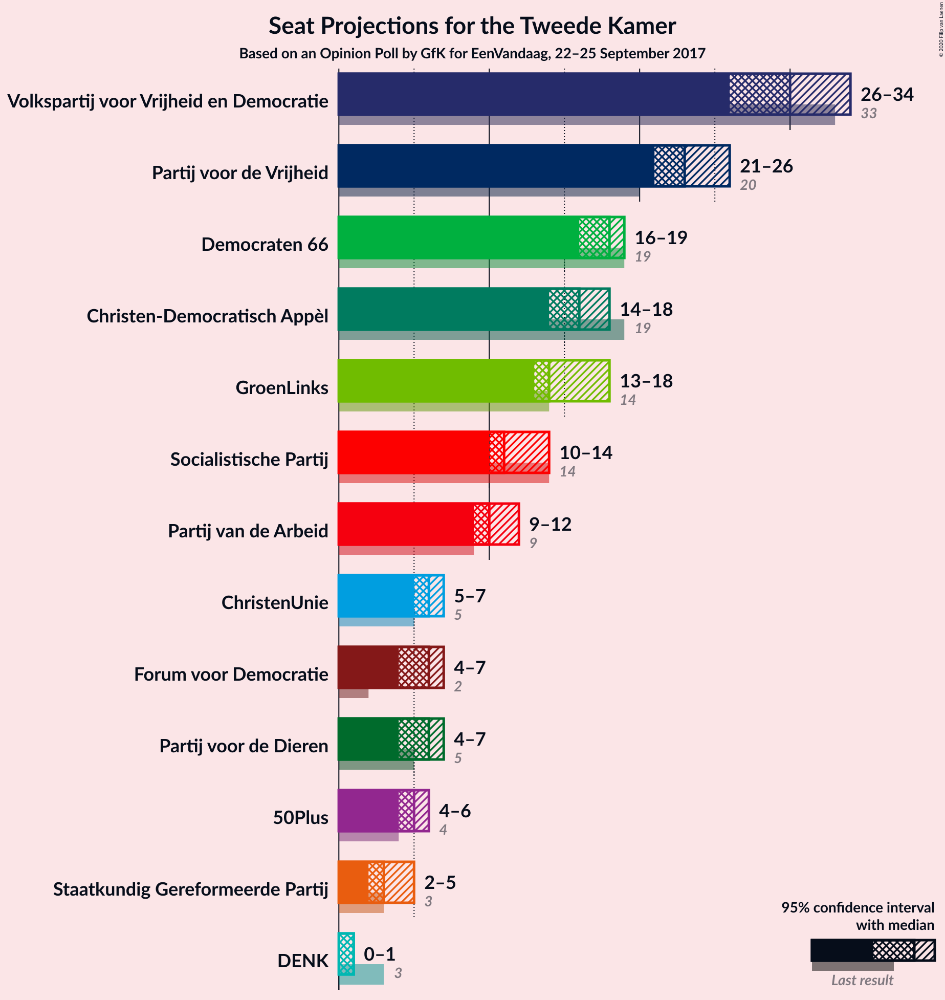

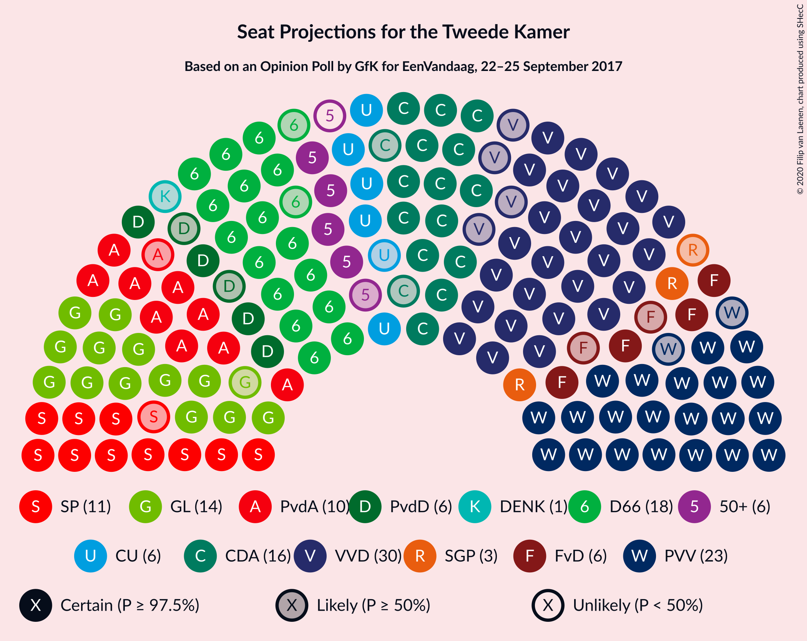

### Confidence Intervals

| Party | Last Result | Median | 80% Confidence Interval | 90% Confidence Interval | 95% Confidence Interval | 99% Confidence Interval |
|:-----:|:-----------:|:------:|:-----------------------:|:-----------------------:|:-----------------------:|:-----------------------:|
| <a href="#volkspartij-voor-vrijheid-en-democratie">Volkspartij voor Vrijheid en Democratie</a> | 33 | 30 | 29–32 |28–34 |26–34 |26–34 |
| <a href="#partij-voor-de-vrijheid">Partij voor de Vrijheid</a> | 20 | 23 | 21–25 |21–26 |21–26 |20–27 |
| <a href="#democraten-66">Democraten 66</a> | 19 | 18 | 17–19 |16–19 |16–19 |15–20 |
| <a href="#christen-democratisch-appèl">Christen-Democratisch Appèl</a> | 19 | 16 | 14–18 |14–18 |14–18 |14–20 |
| <a href="#groenlinks">GroenLinks</a> | 14 | 14 | 14–17 |14–18 |13–18 |13–18 |
| <a href="#socialistische-partij">Socialistische Partij</a> | 14 | 11 | 10–13 |10–14 |10–14 |10–15 |
| <a href="#partij-van-de-arbeid">Partij van de Arbeid</a> | 9 | 10 | 9–12 |9–12 |9–12 |8–13 |
| <a href="#christenunie">ChristenUnie</a> | 5 | 6 | 5–7 |5–7 |5–7 |4–8 |
| <a href="#partij-voor-de-dieren">Partij voor de Dieren</a> | 5 | 6 | 5–6 |5–7 |4–7 |4–7 |
| <a href="#forum-voor-democratie">Forum voor Democratie</a> | 2 | 6 | 5–7 |5–7 |4–7 |3–8 |
| <a href="#50plus">50Plus</a> | 4 | 5 | 4–6 |4–6 |4–6 |3–6 |
| <a href="#staatkundig-gereformeerde-partij">Staatkundig Gereformeerde Partij</a> | 3 | 3 | 3–4 |2–5 |2–5 |2–5 |
| <a href="#denk">DENK</a> | 3 | 1 | 0–1 |0–1 |0–1 |0–1 |

### Volkspartij voor Vrijheid en Democratie

*For a full overview of the results for this party, see the [Volkspartij voor Vrijheid en Democratie](party-volkspartijvoorvrijheidendemocratie.html) page.*

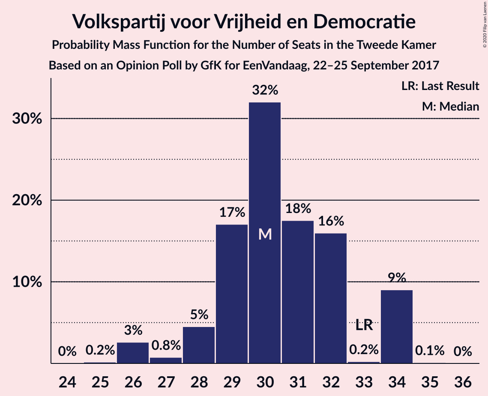

| Number of Seats | Probability | Accumulated | Special Marks |
|:---------------:|:-----------:|:-----------:|:-------------:|
| 25 | 0.2% | 100% |  |
| 26 | 3% | 99.8% |  |
| 27 | 0.8% | 97% |  |
| 28 | 5% | 96% |  |
| 29 | 17% | 92% |  |
| 30 | 32% | 75% | Median |
| 31 | 18% | 43% |  |
| 32 | 16% | 25% |  |
| 33 | 0.2% | 9% | Last Result |
| 34 | 9% | 9% |  |
| 35 | 0.1% | 0.1% |  |
| 36 | 0% | 0% |  |

### Partij voor de Vrijheid

*For a full overview of the results for this party, see the [Partij voor de Vrijheid](party-partijvoordevrijheid.html) page.*

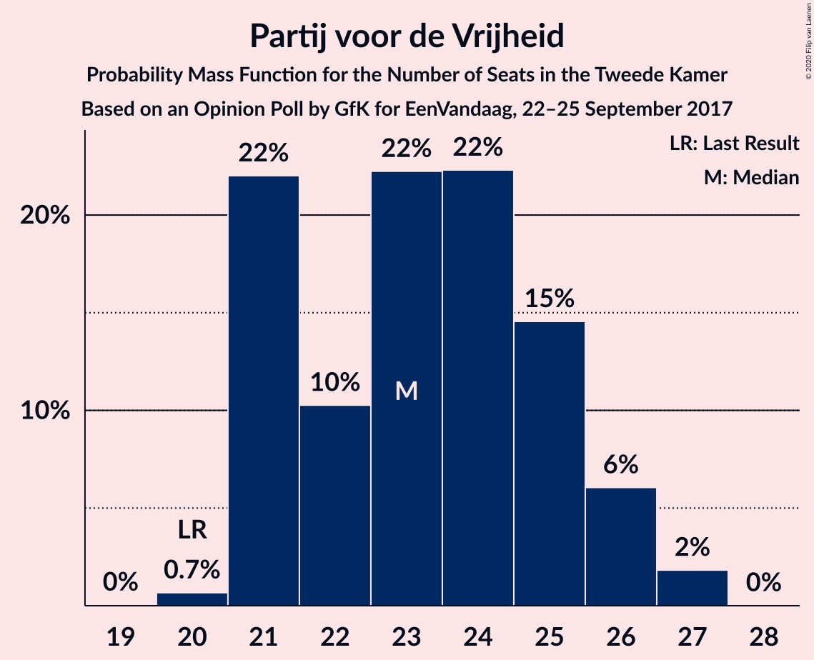

| Number of Seats | Probability | Accumulated | Special Marks |
|:---------------:|:-----------:|:-----------:|:-------------:|
| 20 | 0.7% | 100% | Last Result |
| 21 | 22% | 99.3% |  |
| 22 | 10% | 77% |  |
| 23 | 22% | 67% | Median |
| 24 | 22% | 45% |  |
| 25 | 15% | 22% |  |
| 26 | 6% | 8% |  |
| 27 | 2% | 2% |  |
| 28 | 0% | 0% |  |

### Democraten 66

*For a full overview of the results for this party, see the [Democraten 66](party-democraten66.html) page.*

| Number of Seats | Probability | Accumulated | Special Marks |
|:---------------:|:-----------:|:-----------:|:-------------:|
| 14 | 0.2% | 100% |  |
| 15 | 1.1% | 99.8% |  |
| 16 | 7% | 98.6% |  |
| 17 | 29% | 91% |  |
| 18 | 43% | 62% | Median |
| 19 | 16% | 19% | Last Result |
| 20 | 2% | 2% |  |
| 21 | 0.1% | 0.1% |  |
| 22 | 0% | 0% |  |

### Christen-Democratisch Appèl

*For a full overview of the results for this party, see the [Christen-Democratisch Appèl](party-christen-democratischappèl.html) page.*

| Number of Seats | Probability | Accumulated | Special Marks |
|:---------------:|:-----------:|:-----------:|:-------------:|
| 13 | 0.4% | 100% |  |
| 14 | 32% | 99.6% |  |
| 15 | 5% | 67% |  |
| 16 | 25% | 62% | Median |
| 17 | 26% | 37% |  |
| 18 | 9% | 11% |  |
| 19 | 0.9% | 1.4% | Last Result |
| 20 | 0.6% | 0.6% |  |
| 21 | 0% | 0% |  |

### GroenLinks

*For a full overview of the results for this party, see the [GroenLinks](party-groenlinks.html) page.*

| Number of Seats | Probability | Accumulated | Special Marks |
|:---------------:|:-----------:|:-----------:|:-------------:|
| 12 | 0.1% | 100% |  |
| 13 | 3% | 99.8% |  |
| 14 | 53% | 97% | Last Result, Median |
| 15 | 19% | 43% |  |
| 16 | 6% | 25% |  |
| 17 | 11% | 18% |  |
| 18 | 7% | 7% |  |
| 19 | 0.2% | 0.2% |  |
| 20 | 0% | 0% |  |

### Socialistische Partij

*For a full overview of the results for this party, see the [Socialistische Partij](party-socialistischepartij.html) page.*

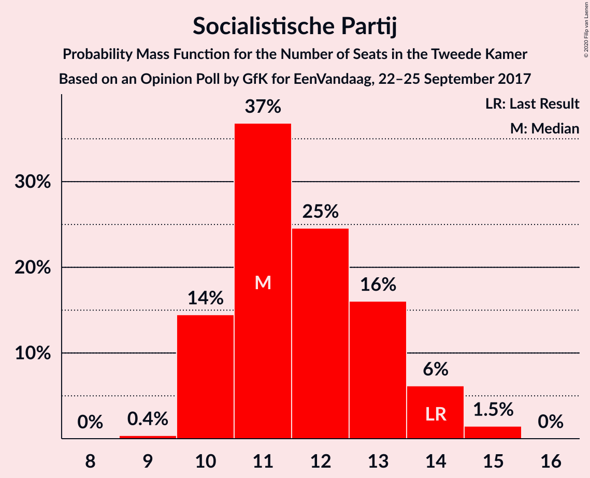

| Number of Seats | Probability | Accumulated | Special Marks |
|:---------------:|:-----------:|:-----------:|:-------------:|
| 9 | 0.4% | 100% |  |
| 10 | 14% | 99.6% |  |
| 11 | 37% | 85% | Median |
| 12 | 25% | 48% |  |
| 13 | 16% | 24% |  |
| 14 | 6% | 8% | Last Result |
| 15 | 1.5% | 2% |  |
| 16 | 0% | 0% |  |

### Partij van de Arbeid

*For a full overview of the results for this party, see the [Partij van de Arbeid](party-partijvandearbeid.html) page.*

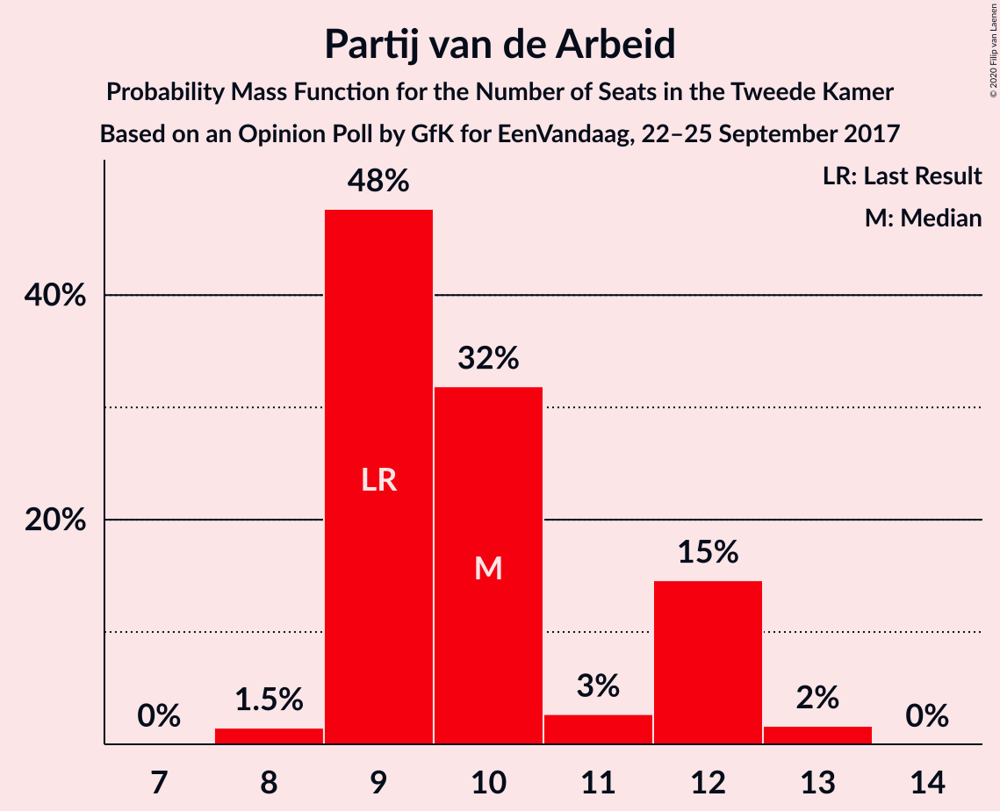

| Number of Seats | Probability | Accumulated | Special Marks |
|:---------------:|:-----------:|:-----------:|:-------------:|
| 8 | 1.5% | 100% |  |
| 9 | 48% | 98.5% | Last Result |
| 10 | 32% | 51% | Median |
| 11 | 3% | 19% |  |
| 12 | 15% | 16% |  |
| 13 | 2% | 2% |  |
| 14 | 0% | 0% |  |

### ChristenUnie

*For a full overview of the results for this party, see the [ChristenUnie](party-christenunie.html) page.*

| Number of Seats | Probability | Accumulated | Special Marks |
|:---------------:|:-----------:|:-----------:|:-------------:|
| 4 | 2% | 100% |  |
| 5 | 47% | 98% | Last Result |
| 6 | 33% | 51% | Median |
| 7 | 16% | 18% |  |
| 8 | 2% | 2% |  |
| 9 | 0% | 0% |  |

### Partij voor de Dieren

*For a full overview of the results for this party, see the [Partij voor de Dieren](party-partijvoordedieren.html) page.*

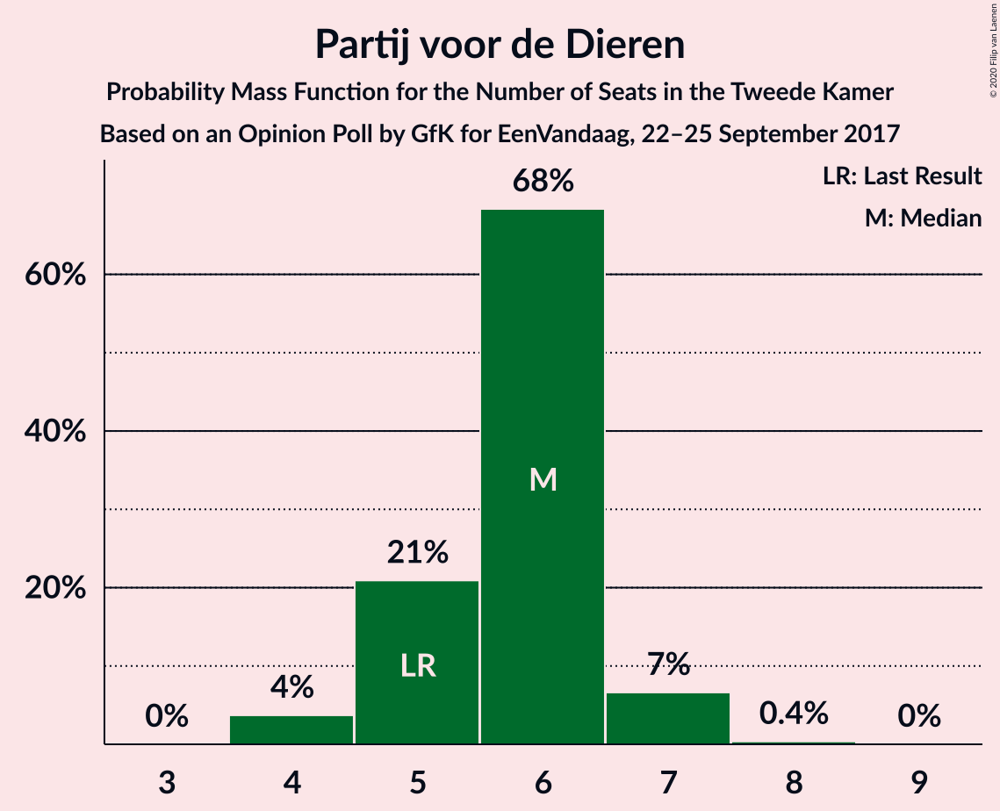

| Number of Seats | Probability | Accumulated | Special Marks |
|:---------------:|:-----------:|:-----------:|:-------------:|
| 4 | 4% | 100% |  |
| 5 | 21% | 96% | Last Result |
| 6 | 68% | 75% | Median |
| 7 | 7% | 7% |  |
| 8 | 0.4% | 0.4% |  |
| 9 | 0% | 0% |  |

### Forum voor Democratie

*For a full overview of the results for this party, see the [Forum voor Democratie](party-forumvoordemocratie.html) page.*

| Number of Seats | Probability | Accumulated | Special Marks |
|:---------------:|:-----------:|:-----------:|:-------------:|
| 2 | 0% | 100% | Last Result |
| 3 | 0.7% | 100% |  |
| 4 | 4% | 99.3% |  |
| 5 | 18% | 95% |  |
| 6 | 57% | 77% | Median |
| 7 | 20% | 21% |  |
| 8 | 0.6% | 0.7% |  |
| 9 | 0.1% | 0.1% |  |
| 10 | 0% | 0% |  |

### 50Plus

*For a full overview of the results for this party, see the [50Plus](party-50plus.html) page.*

| Number of Seats | Probability | Accumulated | Special Marks |
|:---------------:|:-----------:|:-----------:|:-------------:|
| 3 | 1.2% | 100% |  |
| 4 | 38% | 98.8% | Last Result |
| 5 | 27% | 61% | Median |
| 6 | 34% | 34% |  |
| 7 | 0.2% | 0.2% |  |
| 8 | 0% | 0% |  |

### Staatkundig Gereformeerde Partij

*For a full overview of the results for this party, see the [Staatkundig Gereformeerde Partij](party-staatkundiggereformeerdepartij.html) page.*

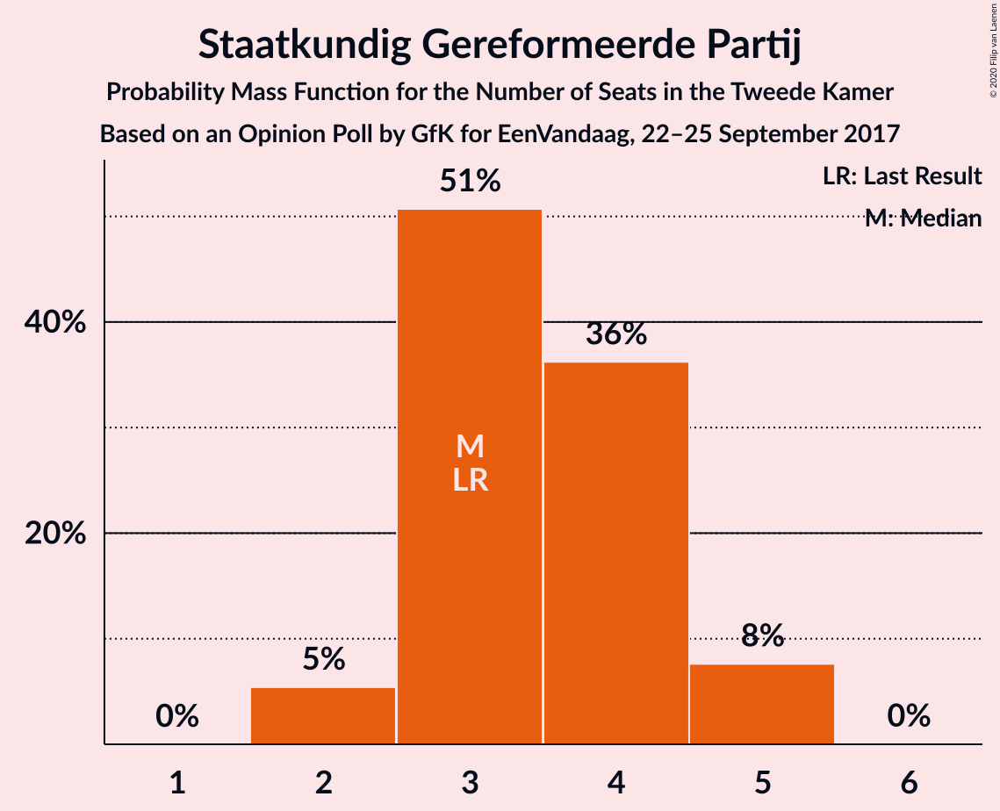

| Number of Seats | Probability | Accumulated | Special Marks |
|:---------------:|:-----------:|:-----------:|:-------------:|
| 2 | 5% | 100% |  |
| 3 | 51% | 95% | Last Result, Median |
| 4 | 36% | 44% |  |
| 5 | 8% | 8% |  |
| 6 | 0% | 0% |  |

### DENK

*For a full overview of the results for this party, see the [DENK](party-denk.html) page.*

| Number of Seats | Probability | Accumulated | Special Marks |
|:---------------:|:-----------:|:-----------:|:-------------:|
| 0 | 43% | 100% |  |
| 1 | 57% | 57% | Median |
| 2 | 0.3% | 0.3% |  |
| 3 | 0% | 0% | Last Result |

## Coalitions

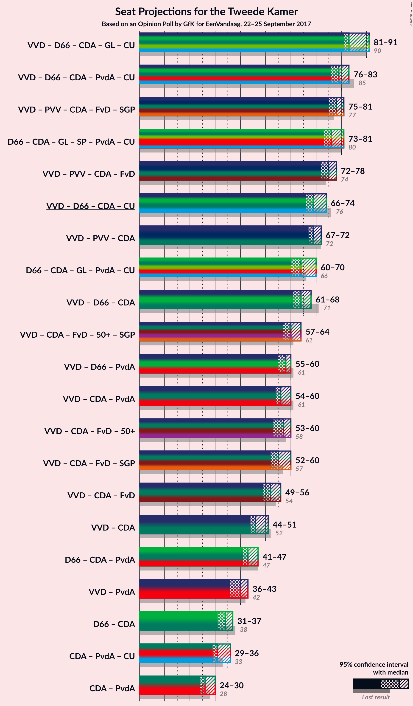

### Confidence Intervals

| Coalition | Last Result | Median | Majority? | 80% Confidence Interval | 90% Confidence Interval | 95% Confidence Interval | 99% Confidence Interval |
|:---------:|:-----------:|:------:|:---------:|:-----------------------:|:-----------------------:|:-----------------------:|:-----------------------:|
| Volkspartij voor Vrijheid en Democratie – Democraten 66 – Christen-Democratisch Appèl – GroenLinks – ChristenUnie | 90 | 83 | 100% | 81–90 | 81–91 | 81–91 | 80–91 |
| Volkspartij voor Vrijheid en Democratie – Democraten 66 – Christen-Democratisch Appèl – Partij van de Arbeid – ChristenUnie | 85 | 79 | 98.8% | 77–83 | 76–83 | 76–83 | 75–83 |
| Volkspartij voor Vrijheid en Democratie – Partij voor de Vrijheid – Christen-Democratisch Appèl – Forum voor Democratie – Staatkundig Gereformeerde Partij | 77 | 78 | 97% | 78–81 | 77–81 | 75–81 | 75–84 |
| Democraten 66 – Christen-Democratisch Appèl – GroenLinks – Socialistische Partij – Partij van de Arbeid – ChristenUnie | 80 | 76 | 55% | 73–79 | 73–81 | 73–81 | 73–82 |
| Volkspartij voor Vrijheid en Democratie – Partij voor de Vrijheid – Christen-Democratisch Appèl – Forum voor Democratie | 74 | 75 | 36% | 74–77 | 74–78 | 72–78 | 71–79 |
| Volkspartij voor Vrijheid en Democratie – Democraten 66 – Christen-Democratisch Appèl – ChristenUnie | 76 | 69 | 0% | 67–73 | 67–74 | 66–74 | 65–74 |
| Volkspartij voor Vrijheid en Democratie – Partij voor de Vrijheid – Christen-Democratisch Appèl | 72 | 69 | 0% | 67–72 | 67–72 | 67–72 | 65–73 |
| Democraten 66 – Christen-Democratisch Appèl – GroenLinks – Partij van de Arbeid – ChristenUnie | 66 | 64 | 0% | 61–67 | 60–70 | 60–70 | 60–70 |
| Volkspartij voor Vrijheid en Democratie – Democraten 66 – Christen-Democratisch Appèl | 71 | 64 | 0% | 62–67 | 62–68 | 61–68 | 60–68 |
| Volkspartij voor Vrijheid en Democratie – Christen-Democratisch Appèl – Forum voor Democratie – 50Plus – Staatkundig Gereformeerde Partij | 61 | 60 | 0% | 59–64 | 58–64 | 57–64 | 56–64 |
| Volkspartij voor Vrijheid en Democratie – Democraten 66 – Partij van de Arbeid | 61 | 58 | 0% | 55–60 | 55–60 | 55–60 | 53–61 |
| Volkspartij voor Vrijheid en Democratie – Christen-Democratisch Appèl – Partij van de Arbeid | 61 | 56 | 0% | 54–59 | 54–60 | 54–60 | 52–60 |
| Volkspartij voor Vrijheid en Democratie – Christen-Democratisch Appèl – Forum voor Democratie – 50Plus | 58 | 57 | 0% | 55–60 | 54–60 | 53–60 | 52–60 |
| Volkspartij voor Vrijheid en Democratie – Christen-Democratisch Appèl – Forum voor Democratie – Staatkundig Gereformeerde Partij | 57 | 55 | 0% | 54–59 | 53–60 | 52–60 | 51–60 |
| Volkspartij voor Vrijheid en Democratie – Christen-Democratisch Appèl – Forum voor Democratie | 54 | 52 | 0% | 51–55 | 50–56 | 49–56 | 47–56 |
| Volkspartij voor Vrijheid en Democratie – Christen-Democratisch Appèl | 52 | 46 | 0% | 44–49 | 44–51 | 44–51 | 41–51 |
| Democraten 66 – Christen-Democratisch Appèl – Partij van de Arbeid | 47 | 43 | 0% | 42–46 | 41–46 | 41–47 | 40–48 |
| Volkspartij voor Vrijheid en Democratie – Partij van de Arbeid | 42 | 40 | 0% | 38–43 | 38–43 | 36–43 | 36–43 |
| Democraten 66 – Christen-Democratisch Appèl | 38 | 34 | 0% | 31–35 | 31–36 | 31–37 | 31–37 |
| Christen-Democratisch Appèl – Partij van de Arbeid – ChristenUnie | 33 | 31 | 0% | 29–34 | 29–34 | 29–36 | 28–36 |
| Christen-Democratisch Appèl – Partij van de Arbeid | 28 | 26 | 0% | 24–28 | 24–28 | 24–30 | 23–30 |

### Volkspartij voor Vrijheid en Democratie – Democraten 66 – Christen-Democratisch Appèl – GroenLinks – ChristenUnie

| Number of Seats | Probability | Accumulated | Special Marks |
|:---------------:|:-----------:|:-----------:|:-------------:|
| 79 | 0.2% | 100% |  |
| 80 | 0.7% | 99.8% |  |
| 81 | 26% | 99.0% |  |
| 82 | 1.3% | 74% |  |
| 83 | 32% | 72% |  |
| 84 | 2% | 40% | Median |
| 85 | 2% | 39% |  |
| 86 | 7% | 36% |  |
| 87 | 0.4% | 29% |  |
| 88 | 13% | 29% |  |
| 89 | 1.4% | 16% |  |
| 90 | 5% | 14% | Last Result |
| 91 | 9% | 9% |  |
| 92 | 0% | 0% |  |

### Volkspartij voor Vrijheid en Democratie – Democraten 66 – Christen-Democratisch Appèl – Partij van de Arbeid – ChristenUnie

| Number of Seats | Probability | Accumulated | Special Marks |
|:---------------:|:-----------:|:-----------:|:-------------:|
| 73 | 0.1% | 100% |  |
| 74 | 0.3% | 99.9% |  |
| 75 | 0.7% | 99.5% |  |
| 76 | 7% | 98.8% | Majority |
| 77 | 20% | 92% |  |
| 78 | 18% | 72% |  |
| 79 | 5% | 54% |  |
| 80 | 3% | 49% | Median |
| 81 | 15% | 46% |  |
| 82 | 21% | 31% |  |
| 83 | 10% | 10% |  |
| 84 | 0.1% | 0.2% |  |
| 85 | 0.1% | 0.1% | Last Result |
| 86 | 0% | 0% |  |

### Volkspartij voor Vrijheid en Democratie – Partij voor de Vrijheid – Christen-Democratisch Appèl – Forum voor Democratie – Staatkundig Gereformeerde Partij

| Number of Seats | Probability | Accumulated | Special Marks |
|:---------------:|:-----------:|:-----------:|:-------------:|
| 73 | 0.1% | 100% |  |
| 74 | 0.3% | 99.9% |  |
| 75 | 2% | 99.6% |  |
| 76 | 1.3% | 97% | Majority |
| 77 | 2% | 96% | Last Result |
| 78 | 53% | 94% | Median |
| 79 | 9% | 41% |  |
| 80 | 13% | 32% |  |
| 81 | 17% | 19% |  |
| 82 | 0.5% | 2% |  |
| 83 | 0% | 2% |  |
| 84 | 2% | 2% |  |
| 85 | 0% | 0% |  |

### Democraten 66 – Christen-Democratisch Appèl – GroenLinks – Socialistische Partij – Partij van de Arbeid – ChristenUnie

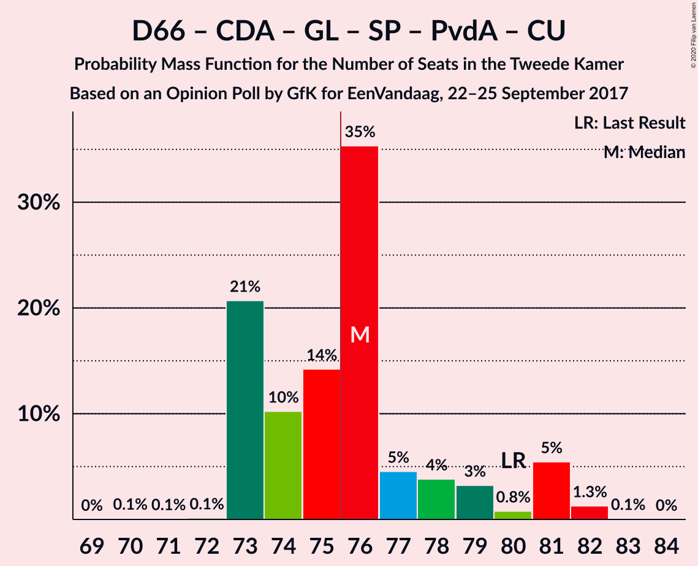

| Number of Seats | Probability | Accumulated | Special Marks |
|:---------------:|:-----------:|:-----------:|:-------------:|
| 70 | 0.1% | 100% |  |
| 71 | 0.1% | 99.9% |  |
| 72 | 0.1% | 99.8% |  |
| 73 | 21% | 99.7% |  |
| 74 | 10% | 79% |  |
| 75 | 14% | 69% | Median |
| 76 | 35% | 55% | Majority |
| 77 | 5% | 19% |  |
| 78 | 4% | 15% |  |
| 79 | 3% | 11% |  |
| 80 | 0.8% | 8% | Last Result |
| 81 | 5% | 7% |  |
| 82 | 1.3% | 1.4% |  |
| 83 | 0.1% | 0.1% |  |
| 84 | 0% | 0% |  |

### Volkspartij voor Vrijheid en Democratie – Partij voor de Vrijheid – Christen-Democratisch Appèl – Forum voor Democratie

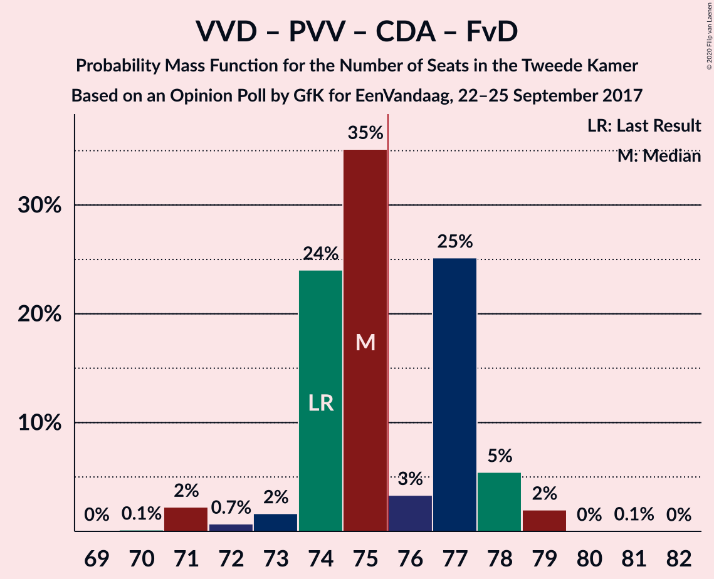

| Number of Seats | Probability | Accumulated | Special Marks |
|:---------------:|:-----------:|:-----------:|:-------------:|
| 69 | 0% | 100% |  |
| 70 | 0.1% | 99.9% |  |
| 71 | 2% | 99.8% |  |
| 72 | 0.7% | 98% |  |
| 73 | 2% | 97% |  |
| 74 | 24% | 95% | Last Result |
| 75 | 35% | 71% | Median |
| 76 | 3% | 36% | Majority |
| 77 | 25% | 33% |  |
| 78 | 5% | 8% |  |
| 79 | 2% | 2% |  |
| 80 | 0% | 0.1% |  |
| 81 | 0.1% | 0.1% |  |
| 82 | 0% | 0% |  |

### Volkspartij voor Vrijheid en Democratie – Democraten 66 – Christen-Democratisch Appèl – ChristenUnie

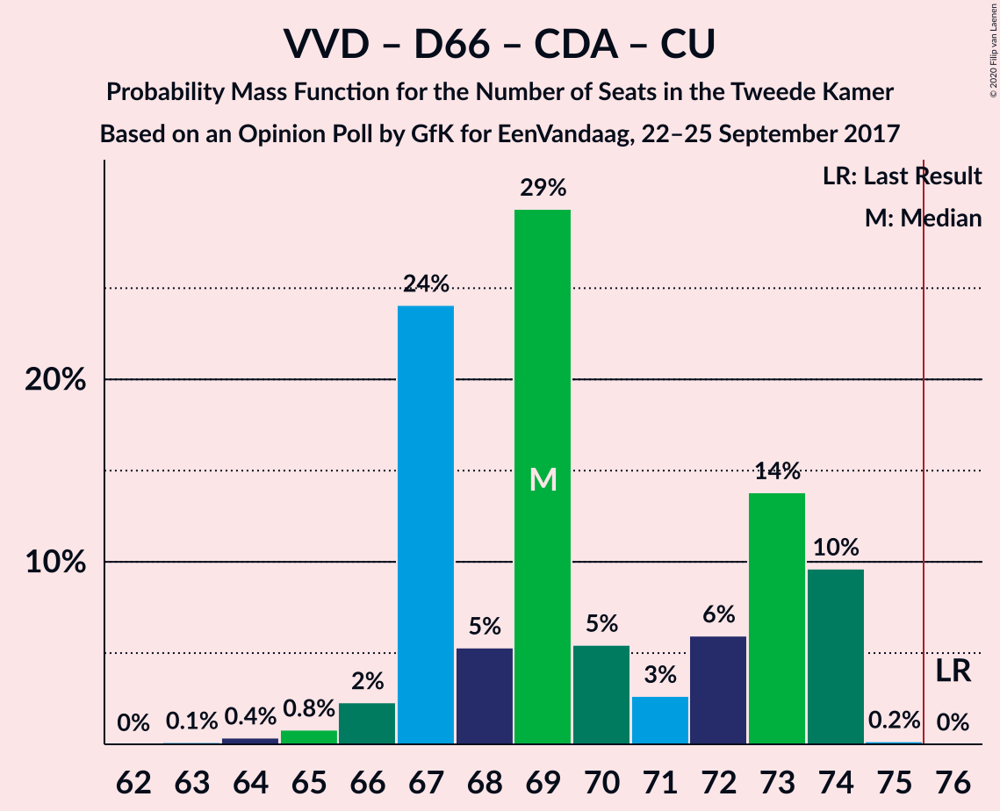

| Number of Seats | Probability | Accumulated | Special Marks |
|:---------------:|:-----------:|:-----------:|:-------------:|
| 63 | 0.1% | 100% |  |
| 64 | 0.4% | 99.9% |  |
| 65 | 0.8% | 99.5% |  |
| 66 | 2% | 98.7% |  |
| 67 | 24% | 96% |  |
| 68 | 5% | 72% |  |
| 69 | 29% | 67% |  |
| 70 | 5% | 38% | Median |
| 71 | 3% | 32% |  |
| 72 | 6% | 30% |  |
| 73 | 14% | 24% |  |
| 74 | 10% | 10% |  |
| 75 | 0.2% | 0.2% |  |
| 76 | 0% | 0% | Last Result, Majority |

### Volkspartij voor Vrijheid en Democratie – Partij voor de Vrijheid – Christen-Democratisch Appèl

| Number of Seats | Probability | Accumulated | Special Marks |
|:---------------:|:-----------:|:-----------:|:-------------:|
| 64 | 0.2% | 100% |  |
| 65 | 0.4% | 99.8% |  |
| 66 | 1.0% | 99.4% |  |
| 67 | 21% | 98% |  |
| 68 | 5% | 77% |  |
| 69 | 28% | 72% | Median |
| 70 | 9% | 44% |  |
| 71 | 18% | 35% |  |
| 72 | 15% | 17% | Last Result |
| 73 | 2% | 2% |  |
| 74 | 0% | 0.1% |  |
| 75 | 0.1% | 0.1% |  |
| 76 | 0% | 0% | Majority |

### Democraten 66 – Christen-Democratisch Appèl – GroenLinks – Partij van de Arbeid – ChristenUnie

| Number of Seats | Probability | Accumulated | Special Marks |
|:---------------:|:-----------:|:-----------:|:-------------:|
| 56 | 0.1% | 100% |  |
| 57 | 0% | 99.9% |  |
| 58 | 0% | 99.9% |  |
| 59 | 0.1% | 99.9% |  |
| 60 | 5% | 99.8% |  |
| 61 | 19% | 95% |  |
| 62 | 3% | 76% |  |
| 63 | 16% | 73% |  |
| 64 | 18% | 57% | Median |
| 65 | 15% | 39% |  |
| 66 | 10% | 24% | Last Result |
| 67 | 7% | 14% |  |
| 68 | 0.3% | 6% |  |
| 69 | 0.7% | 6% |  |
| 70 | 5% | 6% |  |
| 71 | 0% | 0% |  |

### Volkspartij voor Vrijheid en Democratie – Democraten 66 – Christen-Democratisch Appèl

| Number of Seats | Probability | Accumulated | Special Marks |
|:---------------:|:-----------:|:-----------:|:-------------:|
| 58 | 0.2% | 100% |  |
| 59 | 0.1% | 99.7% |  |
| 60 | 2% | 99.7% |  |
| 61 | 2% | 98% |  |
| 62 | 39% | 96% |  |
| 63 | 5% | 56% |  |
| 64 | 15% | 52% | Median |
| 65 | 7% | 36% |  |
| 66 | 7% | 29% |  |
| 67 | 13% | 22% |  |
| 68 | 9% | 9% |  |
| 69 | 0% | 0.1% |  |
| 70 | 0.1% | 0.1% |  |
| 71 | 0% | 0% | Last Result |

### Volkspartij voor Vrijheid en Democratie – Christen-Democratisch Appèl – Forum voor Democratie – 50Plus – Staatkundig Gereformeerde Partij

| Number of Seats | Probability | Accumulated | Special Marks |
|:---------------:|:-----------:|:-----------:|:-------------:|
| 54 | 0.2% | 100% |  |
| 55 | 0.1% | 99.8% |  |
| 56 | 1.3% | 99.7% |  |
| 57 | 2% | 98% |  |
| 58 | 2% | 97% |  |
| 59 | 35% | 95% |  |
| 60 | 12% | 60% | Median |
| 61 | 20% | 48% | Last Result |
| 62 | 4% | 28% |  |
| 63 | 13% | 24% |  |
| 64 | 10% | 10% |  |
| 65 | 0.1% | 0.2% |  |
| 66 | 0% | 0.1% |  |
| 67 | 0% | 0% |  |

### Volkspartij voor Vrijheid en Democratie – Democraten 66 – Partij van de Arbeid

| Number of Seats | Probability | Accumulated | Special Marks |
|:---------------:|:-----------:|:-----------:|:-------------:|
| 51 | 0.3% | 100% |  |
| 52 | 0.2% | 99.7% |  |
| 53 | 0.4% | 99.5% |  |
| 54 | 1.4% | 99.1% |  |
| 55 | 8% | 98% |  |
| 56 | 16% | 89% |  |
| 57 | 4% | 73% |  |
| 58 | 30% | 70% | Median |
| 59 | 3% | 40% |  |
| 60 | 35% | 36% |  |
| 61 | 2% | 2% | Last Result |
| 62 | 0.1% | 0.1% |  |
| 63 | 0% | 0% |  |

### Volkspartij voor Vrijheid en Democratie – Christen-Democratisch Appèl – Partij van de Arbeid

| Number of Seats | Probability | Accumulated | Special Marks |
|:---------------:|:-----------:|:-----------:|:-------------:|
| 51 | 0.3% | 100% |  |
| 52 | 1.4% | 99.6% |  |
| 53 | 0.7% | 98% |  |
| 54 | 23% | 98% |  |
| 55 | 21% | 75% |  |
| 56 | 5% | 54% | Median |
| 57 | 30% | 49% |  |
| 58 | 8% | 19% |  |
| 59 | 2% | 11% |  |
| 60 | 9% | 9% |  |
| 61 | 0.2% | 0.2% | Last Result |
| 62 | 0% | 0.1% |  |
| 63 | 0% | 0% |  |

### Volkspartij voor Vrijheid en Democratie – Christen-Democratisch Appèl – Forum voor Democratie – 50Plus

| Number of Seats | Probability | Accumulated | Special Marks |
|:---------------:|:-----------:|:-----------:|:-------------:|
| 51 | 0.2% | 100% |  |
| 52 | 0.9% | 99.7% |  |
| 53 | 2% | 98.9% |  |
| 54 | 3% | 97% |  |
| 55 | 5% | 94% |  |
| 56 | 32% | 90% |  |
| 57 | 29% | 58% | Median |
| 58 | 6% | 29% | Last Result |
| 59 | 0.8% | 23% |  |
| 60 | 22% | 23% |  |
| 61 | 0.2% | 0.3% |  |
| 62 | 0.1% | 0.1% |  |
| 63 | 0% | 0% |  |

### Volkspartij voor Vrijheid en Democratie – Christen-Democratisch Appèl – Forum voor Democratie – Staatkundig Gereformeerde Partij

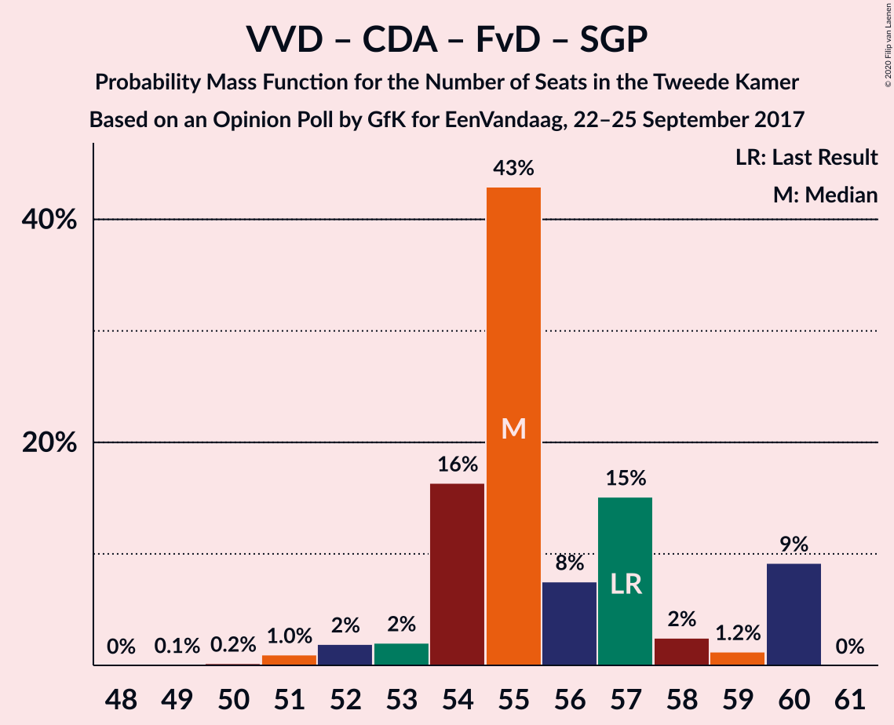

| Number of Seats | Probability | Accumulated | Special Marks |
|:---------------:|:-----------:|:-----------:|:-------------:|
| 49 | 0.1% | 100% |  |
| 50 | 0.2% | 99.9% |  |
| 51 | 1.0% | 99.7% |  |
| 52 | 2% | 98.8% |  |
| 53 | 2% | 97% |  |
| 54 | 16% | 95% |  |
| 55 | 43% | 78% | Median |
| 56 | 8% | 36% |  |
| 57 | 15% | 28% | Last Result |
| 58 | 2% | 13% |  |
| 59 | 1.2% | 10% |  |
| 60 | 9% | 9% |  |
| 61 | 0% | 0% |  |

### Volkspartij voor Vrijheid en Democratie – Christen-Democratisch Appèl – Forum voor Democratie

| Number of Seats | Probability | Accumulated | Special Marks |
|:---------------:|:-----------:|:-----------:|:-------------:|
| 46 | 0.1% | 100% |  |
| 47 | 0.9% | 99.9% |  |
| 48 | 0.6% | 98.9% |  |
| 49 | 2% | 98% |  |
| 50 | 6% | 96% |  |
| 51 | 34% | 90% |  |
| 52 | 20% | 56% | Median |
| 53 | 13% | 36% |  |
| 54 | 12% | 23% | Last Result |
| 55 | 1.2% | 10% |  |
| 56 | 9% | 9% |  |
| 57 | 0.2% | 0.2% |  |
| 58 | 0% | 0% |  |

### Volkspartij voor Vrijheid en Democratie – Christen-Democratisch Appèl

| Number of Seats | Probability | Accumulated | Special Marks |
|:---------------:|:-----------:|:-----------:|:-------------:|
| 41 | 0.5% | 100% |  |
| 42 | 0.3% | 99.5% |  |
| 43 | 1.2% | 99.2% |  |
| 44 | 23% | 98% |  |
| 45 | 17% | 75% |  |
| 46 | 22% | 58% | Median |
| 47 | 6% | 36% |  |
| 48 | 20% | 30% |  |
| 49 | 0.7% | 11% |  |
| 50 | 0.6% | 10% |  |
| 51 | 9% | 9% |  |
| 52 | 0% | 0% | Last Result |

### Democraten 66 – Christen-Democratisch Appèl – Partij van de Arbeid

| Number of Seats | Probability | Accumulated | Special Marks |
|:---------------:|:-----------:|:-----------:|:-------------:|
| 38 | 0.1% | 100% |  |
| 39 | 0.1% | 99.9% |  |
| 40 | 0.3% | 99.8% |  |
| 41 | 6% | 99.5% |  |
| 42 | 23% | 93% |  |
| 43 | 28% | 70% |  |
| 44 | 27% | 42% | Median |
| 45 | 2% | 15% |  |
| 46 | 8% | 13% |  |
| 47 | 4% | 4% | Last Result |
| 48 | 0.5% | 0.7% |  |
| 49 | 0.2% | 0.2% |  |
| 50 | 0% | 0% |  |

### Volkspartij voor Vrijheid en Democratie – Partij van de Arbeid

| Number of Seats | Probability | Accumulated | Special Marks |
|:---------------:|:-----------:|:-----------:|:-------------:|
| 35 | 0.4% | 100% |  |
| 36 | 2% | 99.6% |  |
| 37 | 2% | 97% |  |
| 38 | 14% | 95% |  |
| 39 | 10% | 81% |  |
| 40 | 29% | 70% | Median |
| 41 | 15% | 41% |  |
| 42 | 4% | 27% | Last Result |
| 43 | 22% | 22% |  |
| 44 | 0.1% | 0.2% |  |
| 45 | 0% | 0.1% |  |
| 46 | 0% | 0% |  |

### Democraten 66 – Christen-Democratisch Appèl

| Number of Seats | Probability | Accumulated | Special Marks |
|:---------------:|:-----------:|:-----------:|:-------------:|
| 29 | 0.1% | 100% |  |
| 30 | 0.3% | 99.9% |  |
| 31 | 14% | 99.6% |  |
| 32 | 26% | 85% |  |
| 33 | 3% | 59% |  |
| 34 | 21% | 57% | Median |
| 35 | 25% | 35% |  |
| 36 | 6% | 10% |  |
| 37 | 4% | 4% |  |
| 38 | 0.1% | 0.4% | Last Result |
| 39 | 0.3% | 0.3% |  |
| 40 | 0% | 0% |  |

### Christen-Democratisch Appèl – Partij van de Arbeid – ChristenUnie

| Number of Seats | Probability | Accumulated | Special Marks |
|:---------------:|:-----------:|:-----------:|:-------------:|
| 28 | 0.5% | 100% |  |
| 29 | 19% | 99.5% |  |
| 30 | 15% | 81% |  |
| 31 | 25% | 66% |  |
| 32 | 12% | 41% | Median |
| 33 | 19% | 29% | Last Result |
| 34 | 6% | 10% |  |
| 35 | 1.2% | 4% |  |
| 36 | 3% | 3% |  |
| 37 | 0.2% | 0.3% |  |
| 38 | 0% | 0% |  |

### Christen-Democratisch Appèl – Partij van de Arbeid

| Number of Seats | Probability | Accumulated | Special Marks |
|:---------------:|:-----------:|:-----------:|:-------------:|
| 22 | 0.1% | 100% |  |
| 23 | 1.3% | 99.9% |  |
| 24 | 19% | 98.6% |  |
| 25 | 27% | 79% |  |
| 26 | 37% | 52% | Median |
| 27 | 3% | 16% |  |
| 28 | 9% | 13% | Last Result |
| 29 | 1.2% | 4% |  |
| 30 | 3% | 3% |  |
| 31 | 0% | 0% |  |

## Technical Information

### Opinion Poll

+ **Polling firm:** GfK
+ **Commissioner(s):** EenVandaag
+ **Fieldwork period:** 22–25 September 2017

### Calculations

+ **Sample size:** 1837
+ **Simulations done:** 1,048,576
+ **Error estimate:** 1.92%

