# Opinion Poll by I&O Research, 11 October 2017

<a href="#voting-intentions">Voting Intentions</a> | <a href="#seats">Seats</a> | <a href="#coalitions">Coalitions</a> | <a href="#technical-information">Technical Information</a>

## Voting Intentions

### Confidence Intervals

| Party | Last Result | Poll Result | 80% Confidence Interval | 90% Confidence Interval | 95% Confidence Interval | 99% Confidence Interval |
|:-----:|:-----------:|:-----------:|:-----------------------:|:-----------------------:|:-----------------------:|:-----------------------:|
| Volkspartij voor Vrijheid en Democratie | 21.3% | 19.3% | 17.9–20.7% |17.6–21.1% |17.2–21.5% |16.6–22.2% |
| Partij voor de Vrijheid | 13.1% | 12.3% | 11.2–13.5% |10.9–13.9% |10.7–14.2% |10.2–14.8% |
| Democraten 66 | 12.2% | 12.0% | 10.9–13.2% |10.6–13.6% |10.4–13.9% |9.9–14.5% |
| GroenLinks | 9.1% | 10.5% | 9.5–11.7% |9.2–12.0% |9.0–12.3% |8.5–12.9% |
| Christen-Democratisch Appèl | 12.4% | 9.6% | 8.7–10.7% |8.4–11.1% |8.2–11.3% |7.7–11.9% |
| Socialistische Partij | 9.1% | 6.6% | 5.8–7.5% |5.5–7.8% |5.4–8.0% |5.0–8.5% |
| Forum voor Democratie | 1.8% | 6.6% | 5.8–7.5% |5.5–7.8% |5.4–8.0% |5.0–8.5% |
| Partij van de Arbeid | 5.7% | 6.4% | 5.6–7.4% |5.4–7.6% |5.2–7.9% |4.9–8.4% |
| ChristenUnie | 3.4% | 4.4% | 3.8–5.2% |3.6–5.4% |3.4–5.7% |3.1–6.1% |
| 50Plus | 3.1% | 4.1% | 3.5–4.9% |3.3–5.1% |3.2–5.3% |2.9–5.7% |
| Partij voor de Dieren | 3.2% | 3.9% | 3.3–4.6% |3.1–4.9% |3.0–5.1% |2.7–5.5% |
| Staatkundig Gereformeerde Partij | 2.1% | 2.2% | 1.7–2.8% |1.6–2.9% |1.5–3.1% |1.3–3.4% |
| DENK | 2.1% | 1.6% | 1.2–2.1% |1.1–2.3% |1.0–2.4% |0.9–2.7% |

*Note:* The poll result column reflects the actual value used in the calculations. Published results may vary slightly, and in addition be rounded to fewer digits.

## Seats

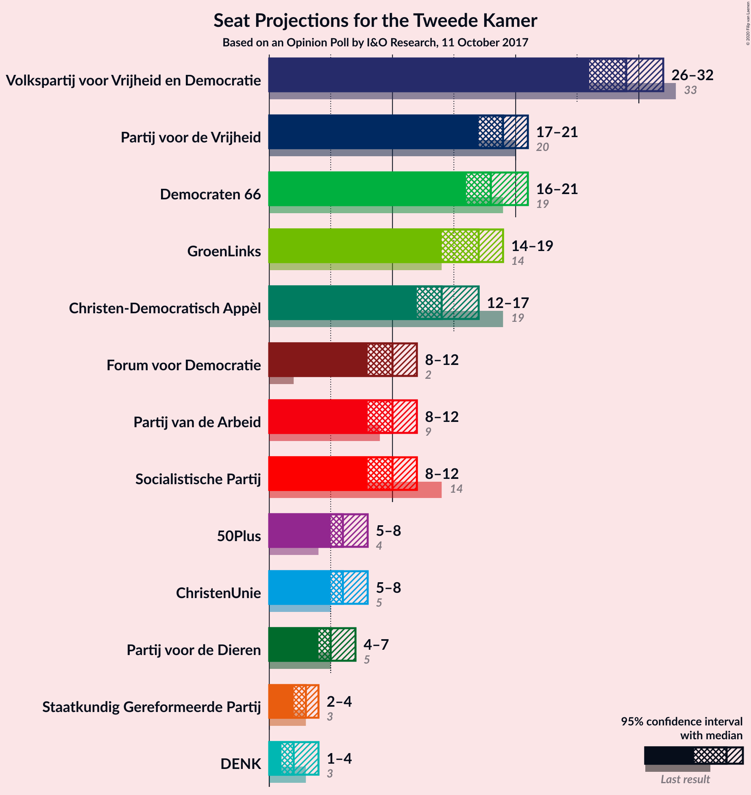

### Confidence Intervals

| Party | Last Result | Median | 80% Confidence Interval | 90% Confidence Interval | 95% Confidence Interval | 99% Confidence Interval |
|:-----:|:-----------:|:------:|:-----------------------:|:-----------------------:|:-----------------------:|:-----------------------:|
| <a href="#volkspartij-voor-vrijheid-en-democratie">Volkspartij voor Vrijheid en Democratie</a> | 33 | 29 | 27–32 |27–32 |26–32 |26–33 |
| <a href="#partij-voor-de-vrijheid">Partij voor de Vrijheid</a> | 20 | 19 | 17–20 |17–21 |17–21 |16–22 |
| <a href="#democraten-66">Democraten 66</a> | 19 | 18 | 16–20 |16–21 |16–21 |14–22 |
| <a href="#groenlinks">GroenLinks</a> | 14 | 17 | 16–18 |15–18 |14–19 |13–19 |
| <a href="#christen-democratisch-appèl">Christen-Democratisch Appèl</a> | 19 | 14 | 13–16 |12–17 |12–17 |11–17 |
| <a href="#socialistische-partij">Socialistische Partij</a> | 14 | 10 | 9–11 |9–11 |8–12 |8–13 |
| <a href="#forum-voor-democratie">Forum voor Democratie</a> | 2 | 10 | 8–12 |8–12 |8–12 |8–12 |
| <a href="#partij-van-de-arbeid">Partij van de Arbeid</a> | 9 | 10 | 8–12 |8–12 |8–12 |7–12 |
| <a href="#christenunie">ChristenUnie</a> | 5 | 6 | 5–8 |5–8 |5–8 |4–8 |
| <a href="#50plus">50Plus</a> | 4 | 6 | 5–7 |5–7 |5–8 |4–8 |
| <a href="#partij-voor-de-dieren">Partij voor de Dieren</a> | 5 | 5 | 5–7 |4–7 |4–7 |3–8 |
| <a href="#staatkundig-gereformeerde-partij">Staatkundig Gereformeerde Partij</a> | 3 | 3 | 2–4 |2–4 |2–4 |1–5 |
| <a href="#denk">DENK</a> | 3 | 2 | 1–3 |1–4 |1–4 |1–4 |

### Volkspartij voor Vrijheid en Democratie

*For a full overview of the results for this party, see the [Volkspartij voor Vrijheid en Democratie](party-volkspartijvoorvrijheidendemocratie.html) page.*

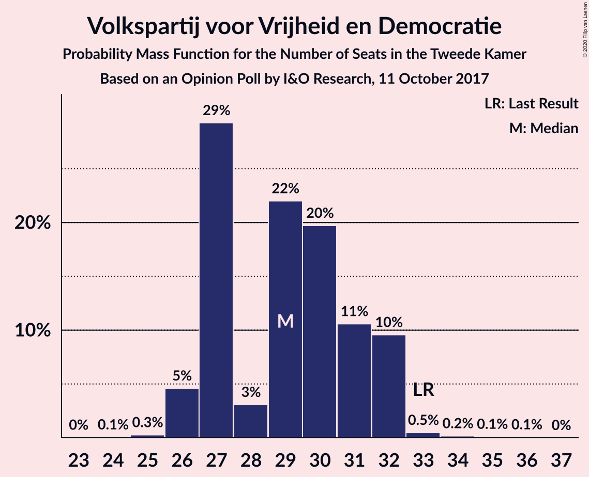

| Number of Seats | Probability | Accumulated | Special Marks |
|:---------------:|:-----------:|:-----------:|:-------------:|
| 24 | 0.1% | 100% |  |
| 25 | 0.3% | 99.9% |  |
| 26 | 5% | 99.7% |  |
| 27 | 29% | 95% |  |
| 28 | 3% | 66% |  |
| 29 | 22% | 63% | Median |
| 30 | 20% | 41% |  |
| 31 | 11% | 21% |  |
| 32 | 10% | 10% |  |
| 33 | 0.5% | 0.8% | Last Result |
| 34 | 0.2% | 0.3% |  |
| 35 | 0.1% | 0.2% |  |
| 36 | 0.1% | 0.1% |  |
| 37 | 0% | 0% |  |

### Partij voor de Vrijheid

*For a full overview of the results for this party, see the [Partij voor de Vrijheid](party-partijvoordevrijheid.html) page.*

| Number of Seats | Probability | Accumulated | Special Marks |
|:---------------:|:-----------:|:-----------:|:-------------:|
| 15 | 0.2% | 100% |  |
| 16 | 2% | 99.7% |  |
| 17 | 27% | 98% |  |
| 18 | 17% | 71% |  |
| 19 | 26% | 54% | Median |
| 20 | 20% | 28% | Last Result |
| 21 | 7% | 8% |  |
| 22 | 1.4% | 2% |  |
| 23 | 0.1% | 0.1% |  |
| 24 | 0% | 0% |  |

### Democraten 66

*For a full overview of the results for this party, see the [Democraten 66](party-democraten66.html) page.*

| Number of Seats | Probability | Accumulated | Special Marks |
|:---------------:|:-----------:|:-----------:|:-------------:|
| 14 | 0.5% | 100% |  |
| 15 | 0.8% | 99.5% |  |
| 16 | 21% | 98.6% |  |
| 17 | 15% | 78% |  |
| 18 | 15% | 63% | Median |
| 19 | 37% | 49% | Last Result |
| 20 | 5% | 12% |  |
| 21 | 5% | 7% |  |
| 22 | 1.2% | 1.2% |  |
| 23 | 0% | 0.1% |  |
| 24 | 0% | 0% |  |

### GroenLinks

*For a full overview of the results for this party, see the [GroenLinks](party-groenlinks.html) page.*

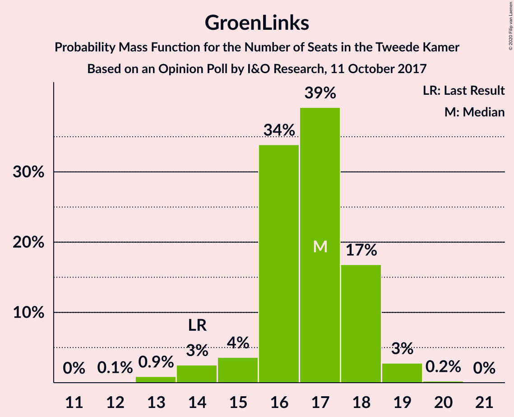

| Number of Seats | Probability | Accumulated | Special Marks |
|:---------------:|:-----------:|:-----------:|:-------------:|
| 12 | 0.1% | 100% |  |
| 13 | 0.9% | 99.9% |  |
| 14 | 3% | 99.0% | Last Result |
| 15 | 4% | 97% |  |
| 16 | 34% | 93% |  |
| 17 | 39% | 59% | Median |
| 18 | 17% | 20% |  |
| 19 | 3% | 3% |  |
| 20 | 0.2% | 0.2% |  |
| 21 | 0% | 0% |  |

### Christen-Democratisch Appèl

*For a full overview of the results for this party, see the [Christen-Democratisch Appèl](party-christen-democratischappèl.html) page.*

| Number of Seats | Probability | Accumulated | Special Marks |
|:---------------:|:-----------:|:-----------:|:-------------:|
| 11 | 0.7% | 100% |  |
| 12 | 7% | 99.3% |  |
| 13 | 4% | 92% |  |
| 14 | 52% | 88% | Median |
| 15 | 18% | 37% |  |
| 16 | 9% | 19% |  |
| 17 | 9% | 9% |  |
| 18 | 0.4% | 0.5% |  |
| 19 | 0% | 0% | Last Result |

### Socialistische Partij

*For a full overview of the results for this party, see the [Socialistische Partij](party-socialistischepartij.html) page.*

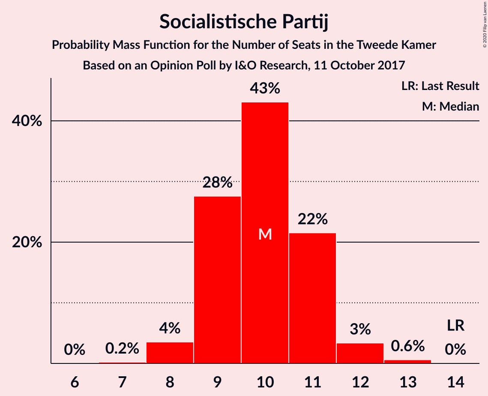

| Number of Seats | Probability | Accumulated | Special Marks |
|:---------------:|:-----------:|:-----------:|:-------------:|
| 7 | 0.2% | 100% |  |
| 8 | 4% | 99.8% |  |
| 9 | 28% | 96% |  |
| 10 | 43% | 69% | Median |
| 11 | 22% | 26% |  |
| 12 | 3% | 4% |  |
| 13 | 0.6% | 0.6% |  |
| 14 | 0% | 0% | Last Result |

### Forum voor Democratie

*For a full overview of the results for this party, see the [Forum voor Democratie](party-forumvoordemocratie.html) page.*

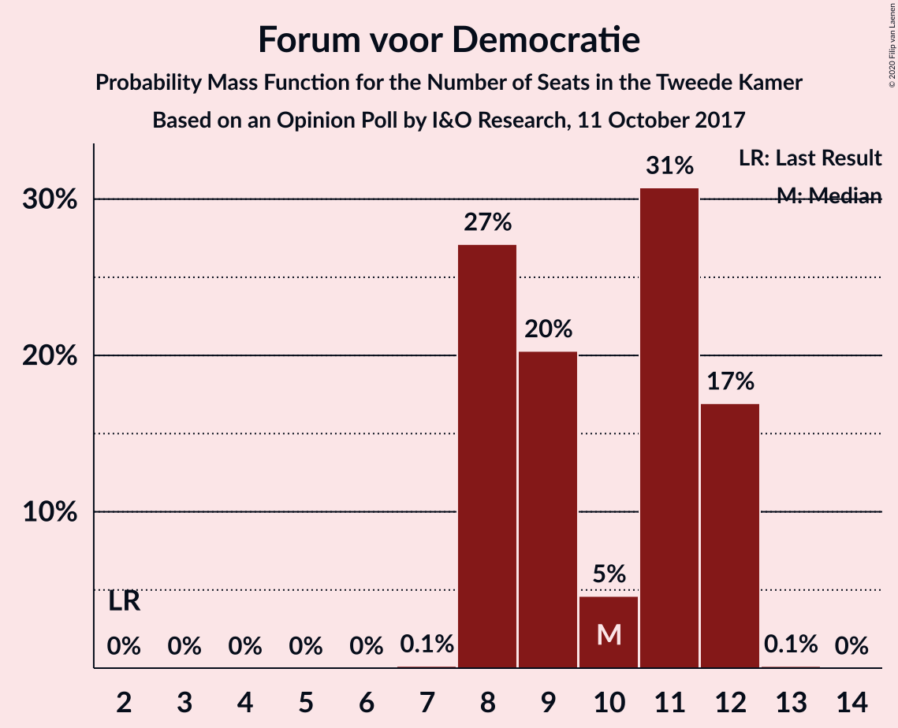

| Number of Seats | Probability | Accumulated | Special Marks |
|:---------------:|:-----------:|:-----------:|:-------------:|
| 2 | 0% | 100% | Last Result |
| 3 | 0% | 100% |  |
| 4 | 0% | 100% |  |
| 5 | 0% | 100% |  |
| 6 | 0% | 100% |  |
| 7 | 0.1% | 100% |  |
| 8 | 27% | 99.8% |  |
| 9 | 20% | 73% |  |
| 10 | 5% | 52% | Median |
| 11 | 31% | 48% |  |
| 12 | 17% | 17% |  |
| 13 | 0.1% | 0.1% |  |
| 14 | 0% | 0% |  |

### Partij van de Arbeid

*For a full overview of the results for this party, see the [Partij van de Arbeid](party-partijvandearbeid.html) page.*

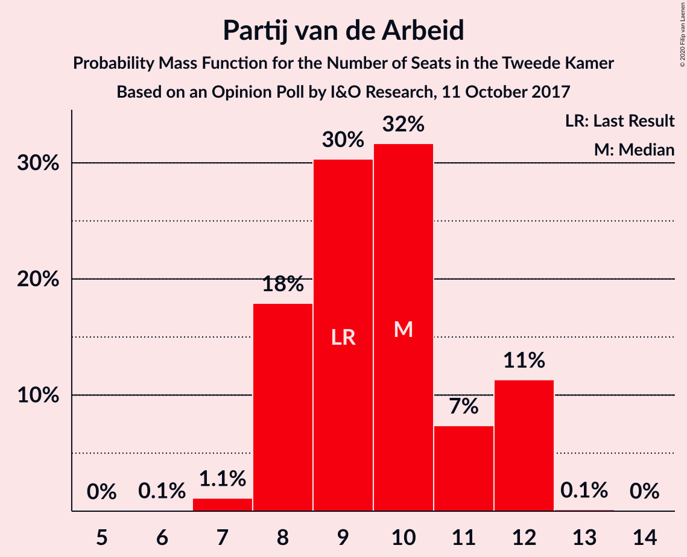

| Number of Seats | Probability | Accumulated | Special Marks |
|:---------------:|:-----------:|:-----------:|:-------------:|
| 6 | 0.1% | 100% |  |
| 7 | 1.1% | 99.9% |  |
| 8 | 18% | 98.8% |  |
| 9 | 30% | 81% | Last Result |
| 10 | 32% | 51% | Median |
| 11 | 7% | 19% |  |
| 12 | 11% | 12% |  |
| 13 | 0.1% | 0.2% |  |
| 14 | 0% | 0% |  |

### ChristenUnie

*For a full overview of the results for this party, see the [ChristenUnie](party-christenunie.html) page.*

| Number of Seats | Probability | Accumulated | Special Marks |
|:---------------:|:-----------:|:-----------:|:-------------:|
| 4 | 0.6% | 100% |  |
| 5 | 20% | 99.4% | Last Result |
| 6 | 35% | 80% | Median |
| 7 | 27% | 45% |  |
| 8 | 17% | 18% |  |
| 9 | 0.4% | 0.5% |  |
| 10 | 0.1% | 0.1% |  |
| 11 | 0% | 0% |  |

### 50Plus

*For a full overview of the results for this party, see the [50Plus](party-50plus.html) page.*

| Number of Seats | Probability | Accumulated | Special Marks |
|:---------------:|:-----------:|:-----------:|:-------------:|
| 4 | 1.4% | 100% | Last Result |
| 5 | 24% | 98.6% |  |
| 6 | 46% | 74% | Median |
| 7 | 25% | 28% |  |
| 8 | 3% | 3% |  |
| 9 | 0.1% | 0.2% |  |
| 10 | 0% | 0% |  |

### Partij voor de Dieren

*For a full overview of the results for this party, see the [Partij voor de Dieren](party-partijvoordedieren.html) page.*

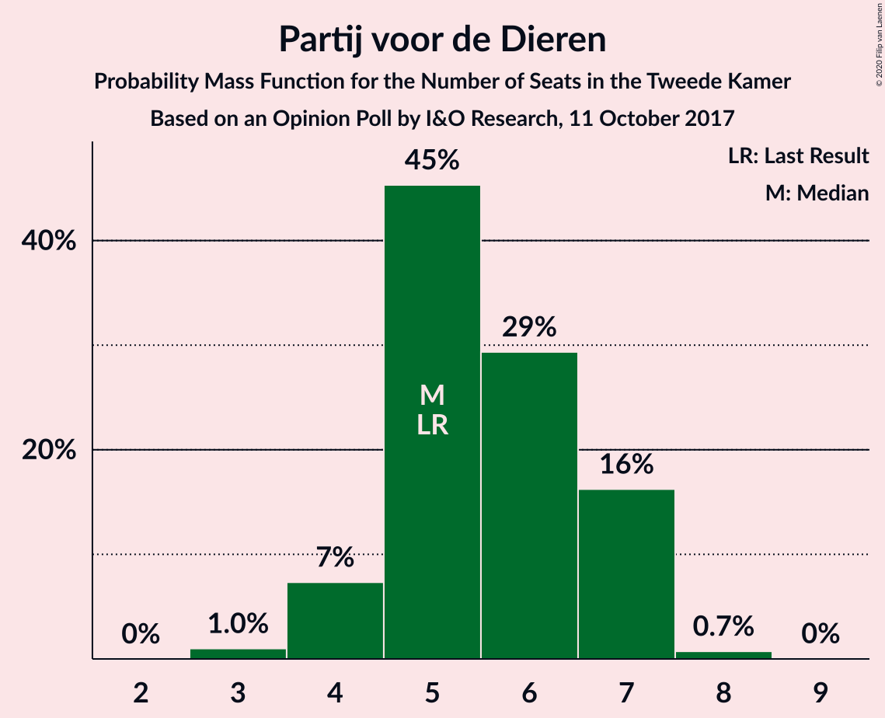

| Number of Seats | Probability | Accumulated | Special Marks |
|:---------------:|:-----------:|:-----------:|:-------------:|
| 3 | 1.0% | 100% |  |
| 4 | 7% | 99.0% |  |
| 5 | 45% | 92% | Last Result, Median |
| 6 | 29% | 46% |  |
| 7 | 16% | 17% |  |
| 8 | 0.7% | 0.8% |  |
| 9 | 0% | 0% |  |

### Staatkundig Gereformeerde Partij

*For a full overview of the results for this party, see the [Staatkundig Gereformeerde Partij](party-staatkundiggereformeerdepartij.html) page.*

| Number of Seats | Probability | Accumulated | Special Marks |
|:---------------:|:-----------:|:-----------:|:-------------:|
| 1 | 1.2% | 100% |  |
| 2 | 20% | 98.8% |  |
| 3 | 57% | 79% | Last Result, Median |
| 4 | 20% | 22% |  |
| 5 | 2% | 2% |  |
| 6 | 0% | 0% |  |

### DENK

*For a full overview of the results for this party, see the [DENK](party-denk.html) page.*

| Number of Seats | Probability | Accumulated | Special Marks |
|:---------------:|:-----------:|:-----------:|:-------------:|
| 0 | 0.1% | 100% |  |
| 1 | 10% | 99.9% |  |
| 2 | 65% | 90% | Median |
| 3 | 20% | 25% | Last Result |
| 4 | 5% | 5% |  |
| 5 | 0% | 0% |  |

## Coalitions

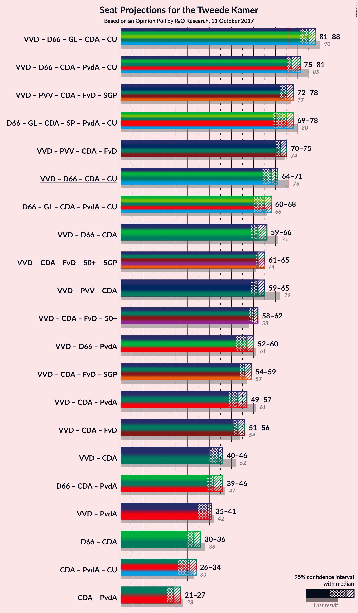

### Confidence Intervals

| Coalition | Last Result | Median | Majority? | 80% Confidence Interval | 90% Confidence Interval | 95% Confidence Interval | 99% Confidence Interval |
|:---------:|:-----------:|:------:|:---------:|:-----------------------:|:-----------------------:|:-----------------------:|:-----------------------:|
| Volkspartij voor Vrijheid en Democratie – Democraten 66 – GroenLinks – Christen-Democratisch Appèl – ChristenUnie | 90 | 85 | 100% | 82–88 | 81–88 | 81–88 | 79–89 |
| Volkspartij voor Vrijheid en Democratie – Democraten 66 – Christen-Democratisch Appèl – Partij van de Arbeid – ChristenUnie | 85 | 77 | 87% | 75–81 | 75–81 | 75–81 | 73–83 |
| Volkspartij voor Vrijheid en Democratie – Partij voor de Vrijheid – Christen-Democratisch Appèl – Forum voor Democratie – Staatkundig Gereformeerde Partij | 77 | 75 | 35% | 73–77 | 72–78 | 72–78 | 70–81 |
| Democraten 66 – GroenLinks – Christen-Democratisch Appèl – Socialistische Partij – Partij van de Arbeid – ChristenUnie | 80 | 75 | 48% | 72–78 | 69–78 | 69–78 | 69–81 |
| Volkspartij voor Vrijheid en Democratie – Partij voor de Vrijheid – Christen-Democratisch Appèl – Forum voor Democratie | 74 | 72 | 2% | 70–74 | 70–75 | 70–75 | 67–78 |
| Volkspartij voor Vrijheid en Democratie – Democraten 66 – Christen-Democratisch Appèl – ChristenUnie | 76 | 68 | 0.1% | 66–71 | 64–71 | 64–71 | 63–74 |
| Democraten 66 – GroenLinks – Christen-Democratisch Appèl – Partij van de Arbeid – ChristenUnie | 66 | 65 | 0% | 63–68 | 60–68 | 60–68 | 60–69 |
| Volkspartij voor Vrijheid en Democratie – Democraten 66 – Christen-Democratisch Appèl | 71 | 62 | 0% | 59–65 | 59–65 | 59–66 | 58–68 |
| Volkspartij voor Vrijheid en Democratie – Christen-Democratisch Appèl – Forum voor Democratie – 50Plus – Staatkundig Gereformeerde Partij | 61 | 62 | 0% | 61–65 | 61–65 | 61–65 | 58–69 |
| Volkspartij voor Vrijheid en Democratie – Partij voor de Vrijheid – Christen-Democratisch Appèl | 72 | 62 | 0% | 59–65 | 59–65 | 59–65 | 58–68 |
| Volkspartij voor Vrijheid en Democratie – Christen-Democratisch Appèl – Forum voor Democratie – 50Plus | 58 | 59 | 0% | 58–61 | 58–62 | 58–62 | 55–66 |
| Volkspartij voor Vrijheid en Democratie – Democraten 66 – Partij van de Arbeid | 61 | 57 | 0% | 54–59 | 52–59 | 52–60 | 52–62 |
| Volkspartij voor Vrijheid en Democratie – Christen-Democratisch Appèl – Forum voor Democratie – Staatkundig Gereformeerde Partij | 57 | 56 | 0% | 55–58 | 55–58 | 54–59 | 52–63 |
| Volkspartij voor Vrijheid en Democratie – Christen-Democratisch Appèl – Partij van de Arbeid | 61 | 53 | 0% | 52–55 | 49–56 | 49–57 | 48–59 |
| Volkspartij voor Vrijheid en Democratie – Christen-Democratisch Appèl – Forum voor Democratie | 54 | 53 | 0% | 52–55 | 51–55 | 51–56 | 49–59 |
| Volkspartij voor Vrijheid en Democratie – Christen-Democratisch Appèl | 52 | 44 | 0% | 41–46 | 40–46 | 40–46 | 40–49 |
| Democraten 66 – Christen-Democratisch Appèl – Partij van de Arbeid | 47 | 42 | 0% | 39–45 | 39–45 | 39–46 | 37–46 |
| Volkspartij voor Vrijheid en Democratie – Partij van de Arbeid | 42 | 39 | 0% | 36–41 | 35–41 | 35–41 | 35–44 |
| Democraten 66 – Christen-Democratisch Appèl | 38 | 33 | 0% | 30–35 | 30–35 | 30–36 | 28–38 |
| Christen-Democratisch Appèl – Partij van de Arbeid – ChristenUnie | 33 | 31 | 0% | 28–32 | 26–34 | 26–34 | 26–34 |
| Christen-Democratisch Appèl – Partij van de Arbeid | 28 | 24 | 0% | 22–26 | 21–26 | 21–27 | 20–28 |

### Volkspartij voor Vrijheid en Democratie – Democraten 66 – GroenLinks – Christen-Democratisch Appèl – ChristenUnie

| Number of Seats | Probability | Accumulated | Special Marks |
|:---------------:|:-----------:|:-----------:|:-------------:|
| 77 | 0.1% | 100% |  |
| 78 | 0.1% | 99.9% |  |
| 79 | 0.5% | 99.8% |  |
| 80 | 0.3% | 99.3% |  |
| 81 | 5% | 98.9% |  |
| 82 | 6% | 94% |  |
| 83 | 35% | 88% |  |
| 84 | 3% | 53% | Median |
| 85 | 13% | 51% |  |
| 86 | 14% | 38% |  |
| 87 | 9% | 24% |  |
| 88 | 14% | 15% |  |
| 89 | 0.7% | 1.2% |  |
| 90 | 0.4% | 0.5% | Last Result |
| 91 | 0.1% | 0.1% |  |
| 92 | 0% | 0% |  |

### Volkspartij voor Vrijheid en Democratie – Democraten 66 – Christen-Democratisch Appèl – Partij van de Arbeid – ChristenUnie

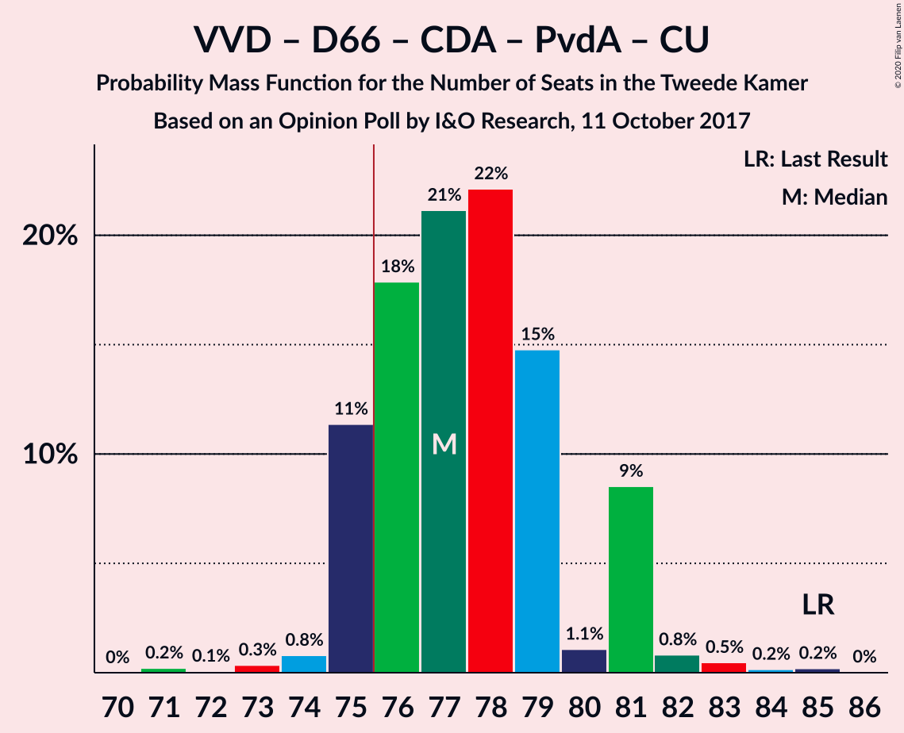

| Number of Seats | Probability | Accumulated | Special Marks |
|:---------------:|:-----------:|:-----------:|:-------------:|
| 71 | 0.2% | 100% |  |
| 72 | 0.1% | 99.8% |  |
| 73 | 0.3% | 99.7% |  |
| 74 | 0.8% | 99.4% |  |
| 75 | 11% | 98.6% |  |
| 76 | 18% | 87% | Majority |
| 77 | 21% | 69% | Median |
| 78 | 22% | 48% |  |
| 79 | 15% | 26% |  |
| 80 | 1.1% | 11% |  |
| 81 | 9% | 10% |  |
| 82 | 0.8% | 2% |  |
| 83 | 0.5% | 0.9% |  |
| 84 | 0.2% | 0.4% |  |
| 85 | 0.2% | 0.2% | Last Result |
| 86 | 0% | 0% |  |

### Volkspartij voor Vrijheid en Democratie – Partij voor de Vrijheid – Christen-Democratisch Appèl – Forum voor Democratie – Staatkundig Gereformeerde Partij

| Number of Seats | Probability | Accumulated | Special Marks |
|:---------------:|:-----------:|:-----------:|:-------------:|
| 70 | 0.9% | 100% |  |
| 71 | 0.5% | 99.1% |  |
| 72 | 6% | 98.6% |  |
| 73 | 12% | 92% |  |
| 74 | 16% | 80% |  |
| 75 | 29% | 64% | Median |
| 76 | 24% | 35% | Majority |
| 77 | 1.0% | 11% | Last Result |
| 78 | 8% | 10% |  |
| 79 | 1.0% | 2% |  |
| 80 | 0.7% | 1.2% |  |
| 81 | 0.2% | 0.6% |  |
| 82 | 0.2% | 0.3% |  |
| 83 | 0.1% | 0.1% |  |
| 84 | 0% | 0% |  |

### Democraten 66 – GroenLinks – Christen-Democratisch Appèl – Socialistische Partij – Partij van de Arbeid – ChristenUnie

| Number of Seats | Probability | Accumulated | Special Marks |
|:---------------:|:-----------:|:-----------:|:-------------:|
| 69 | 5% | 100% |  |
| 70 | 0.2% | 95% |  |
| 71 | 0.8% | 95% |  |
| 72 | 6% | 94% |  |
| 73 | 2% | 88% |  |
| 74 | 27% | 86% |  |
| 75 | 11% | 59% | Median |
| 76 | 9% | 48% | Majority |
| 77 | 23% | 38% |  |
| 78 | 15% | 16% |  |
| 79 | 0.2% | 1.4% |  |
| 80 | 0.2% | 1.2% | Last Result |
| 81 | 0.9% | 1.0% |  |
| 82 | 0% | 0% |  |

### Volkspartij voor Vrijheid en Democratie – Partij voor de Vrijheid – Christen-Democratisch Appèl – Forum voor Democratie

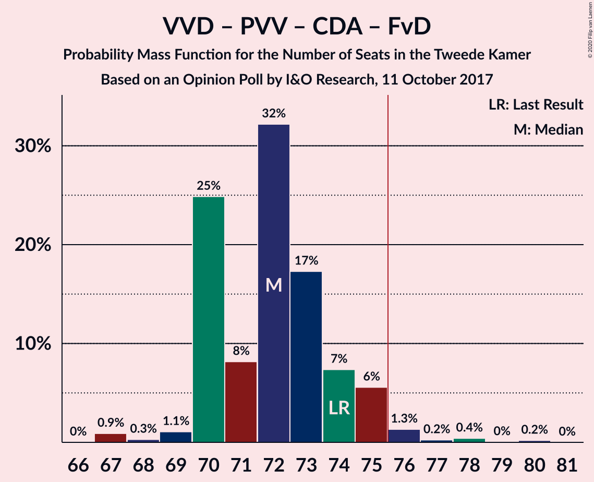

| Number of Seats | Probability | Accumulated | Special Marks |
|:---------------:|:-----------:|:-----------:|:-------------:|
| 67 | 0.9% | 100% |  |
| 68 | 0.3% | 99.1% |  |
| 69 | 1.1% | 98.8% |  |
| 70 | 25% | 98% |  |
| 71 | 8% | 73% |  |
| 72 | 32% | 65% | Median |
| 73 | 17% | 32% |  |
| 74 | 7% | 15% | Last Result |
| 75 | 6% | 8% |  |
| 76 | 1.3% | 2% | Majority |
| 77 | 0.2% | 0.9% |  |
| 78 | 0.4% | 0.7% |  |
| 79 | 0% | 0.2% |  |
| 80 | 0.2% | 0.2% |  |
| 81 | 0% | 0% |  |

### Volkspartij voor Vrijheid en Democratie – Democraten 66 – Christen-Democratisch Appèl – ChristenUnie

| Number of Seats | Probability | Accumulated | Special Marks |
|:---------------:|:-----------:|:-----------:|:-------------:|
| 62 | 0.1% | 100% |  |
| 63 | 0.5% | 99.9% |  |
| 64 | 5% | 99.4% |  |
| 65 | 1.3% | 94% |  |
| 66 | 27% | 93% |  |
| 67 | 14% | 67% | Median |
| 68 | 16% | 52% |  |
| 69 | 8% | 36% |  |
| 70 | 13% | 29% |  |
| 71 | 13% | 16% |  |
| 72 | 0.4% | 2% |  |
| 73 | 0.9% | 2% |  |
| 74 | 0.9% | 1.0% |  |
| 75 | 0.1% | 0.1% |  |
| 76 | 0% | 0.1% | Last Result, Majority |
| 77 | 0% | 0% |  |

### Democraten 66 – GroenLinks – Christen-Democratisch Appèl – Partij van de Arbeid – ChristenUnie

| Number of Seats | Probability | Accumulated | Special Marks |
|:---------------:|:-----------:|:-----------:|:-------------:|
| 58 | 0.1% | 100% |  |
| 59 | 0.4% | 99.9% |  |
| 60 | 5% | 99.6% |  |
| 61 | 1.4% | 94% |  |
| 62 | 2% | 93% |  |
| 63 | 8% | 91% |  |
| 64 | 23% | 83% |  |
| 65 | 13% | 60% | Median |
| 66 | 13% | 47% | Last Result |
| 67 | 12% | 34% |  |
| 68 | 20% | 22% |  |
| 69 | 1.1% | 2% |  |
| 70 | 0.4% | 0.5% |  |
| 71 | 0.1% | 0.1% |  |
| 72 | 0% | 0% |  |

### Volkspartij voor Vrijheid en Democratie – Democraten 66 – Christen-Democratisch Appèl

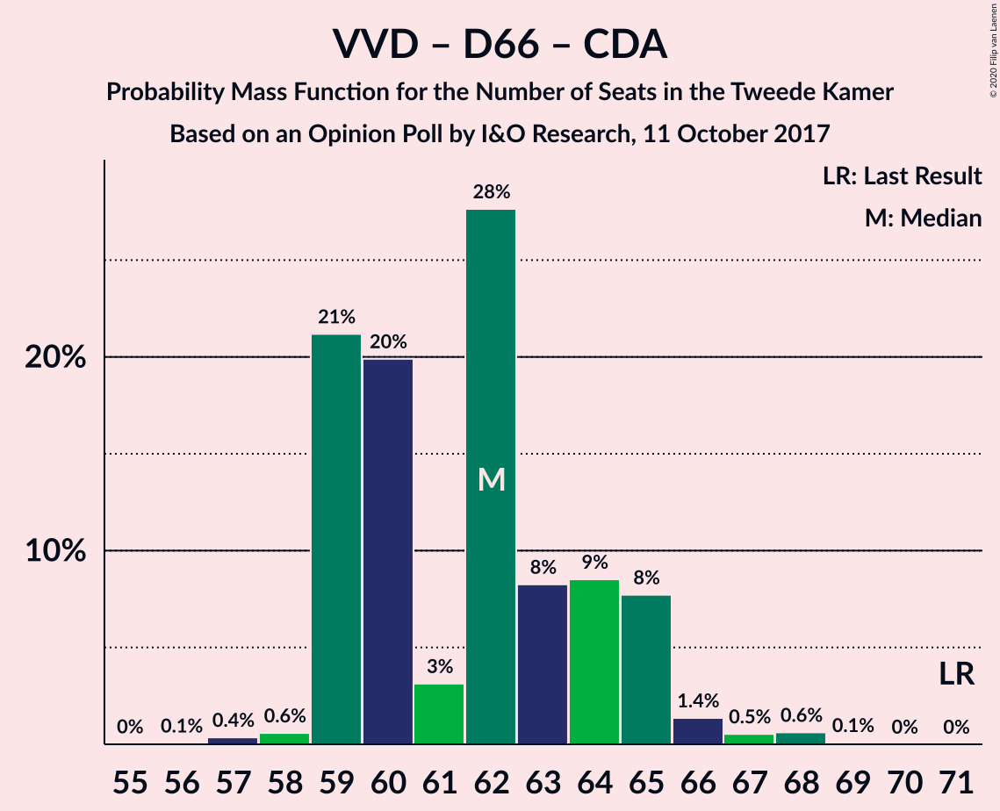

| Number of Seats | Probability | Accumulated | Special Marks |
|:---------------:|:-----------:|:-----------:|:-------------:|
| 56 | 0.1% | 100% |  |
| 57 | 0.4% | 99.9% |  |
| 58 | 0.6% | 99.6% |  |
| 59 | 21% | 99.0% |  |
| 60 | 20% | 78% |  |
| 61 | 3% | 58% | Median |
| 62 | 28% | 55% |  |
| 63 | 8% | 27% |  |
| 64 | 9% | 19% |  |
| 65 | 8% | 10% |  |
| 66 | 1.4% | 3% |  |
| 67 | 0.5% | 1.2% |  |
| 68 | 0.6% | 0.7% |  |
| 69 | 0.1% | 0.1% |  |
| 70 | 0% | 0% |  |
| 71 | 0% | 0% | Last Result |

### Volkspartij voor Vrijheid en Democratie – Christen-Democratisch Appèl – Forum voor Democratie – 50Plus – Staatkundig Gereformeerde Partij

| Number of Seats | Probability | Accumulated | Special Marks |
|:---------------:|:-----------:|:-----------:|:-------------:|
| 55 | 0.1% | 100% |  |
| 56 | 0% | 99.9% |  |
| 57 | 0.1% | 99.9% |  |
| 58 | 0.9% | 99.8% |  |
| 59 | 0.9% | 98.9% |  |
| 60 | 0.3% | 98% |  |
| 61 | 33% | 98% | Last Result |
| 62 | 18% | 65% | Median |
| 63 | 32% | 47% |  |
| 64 | 3% | 15% |  |
| 65 | 9% | 11% |  |
| 66 | 0.9% | 2% |  |
| 67 | 0.2% | 1.0% |  |
| 68 | 0.1% | 0.8% |  |
| 69 | 0.2% | 0.7% |  |
| 70 | 0.5% | 0.5% |  |
| 71 | 0% | 0% |  |

### Volkspartij voor Vrijheid en Democratie – Partij voor de Vrijheid – Christen-Democratisch Appèl

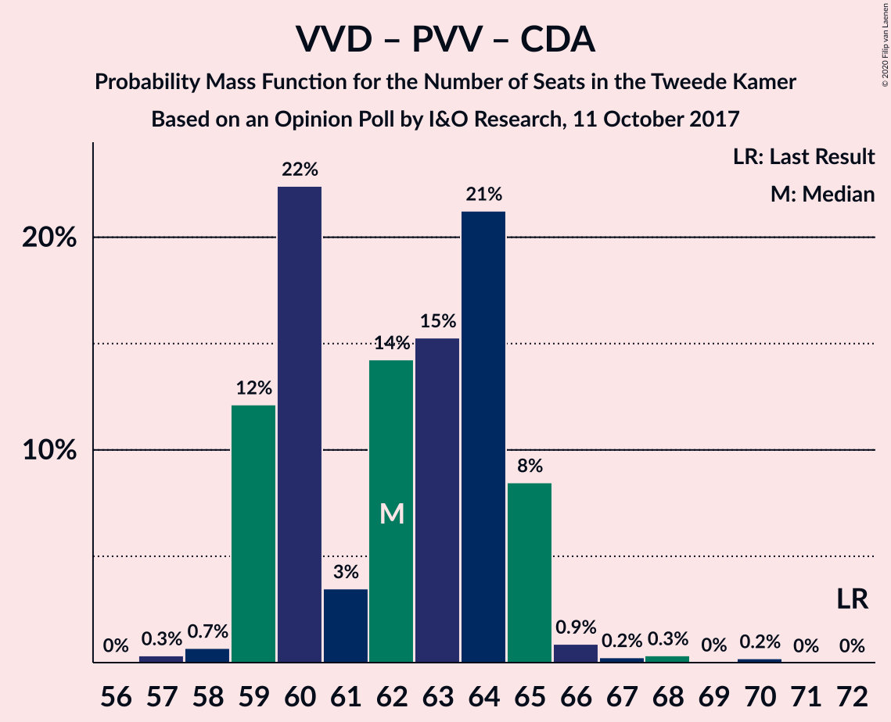

| Number of Seats | Probability | Accumulated | Special Marks |
|:---------------:|:-----------:|:-----------:|:-------------:|
| 57 | 0.3% | 100% |  |
| 58 | 0.7% | 99.6% |  |
| 59 | 12% | 99.0% |  |
| 60 | 22% | 87% |  |
| 61 | 3% | 64% |  |
| 62 | 14% | 61% | Median |
| 63 | 15% | 47% |  |
| 64 | 21% | 31% |  |
| 65 | 8% | 10% |  |
| 66 | 0.9% | 2% |  |
| 67 | 0.2% | 0.8% |  |
| 68 | 0.3% | 0.6% |  |
| 69 | 0% | 0.2% |  |
| 70 | 0.2% | 0.2% |  |
| 71 | 0% | 0% |  |
| 72 | 0% | 0% | Last Result |

### Volkspartij voor Vrijheid en Democratie – Christen-Democratisch Appèl – Forum voor Democratie – 50Plus

| Number of Seats | Probability | Accumulated | Special Marks |
|:---------------:|:-----------:|:-----------:|:-------------:|
| 53 | 0.1% | 100% |  |
| 54 | 0.1% | 99.9% |  |
| 55 | 0.9% | 99.8% |  |
| 56 | 0.6% | 98.9% |  |
| 57 | 0.4% | 98% |  |
| 58 | 28% | 98% | Last Result |
| 59 | 29% | 70% | Median |
| 60 | 23% | 40% |  |
| 61 | 8% | 17% |  |
| 62 | 7% | 9% |  |
| 63 | 0.7% | 2% |  |
| 64 | 0.2% | 1.0% |  |
| 65 | 0.1% | 0.8% |  |
| 66 | 0.4% | 0.7% |  |
| 67 | 0.3% | 0.3% |  |
| 68 | 0% | 0% |  |

### Volkspartij voor Vrijheid en Democratie – Democraten 66 – Partij van de Arbeid

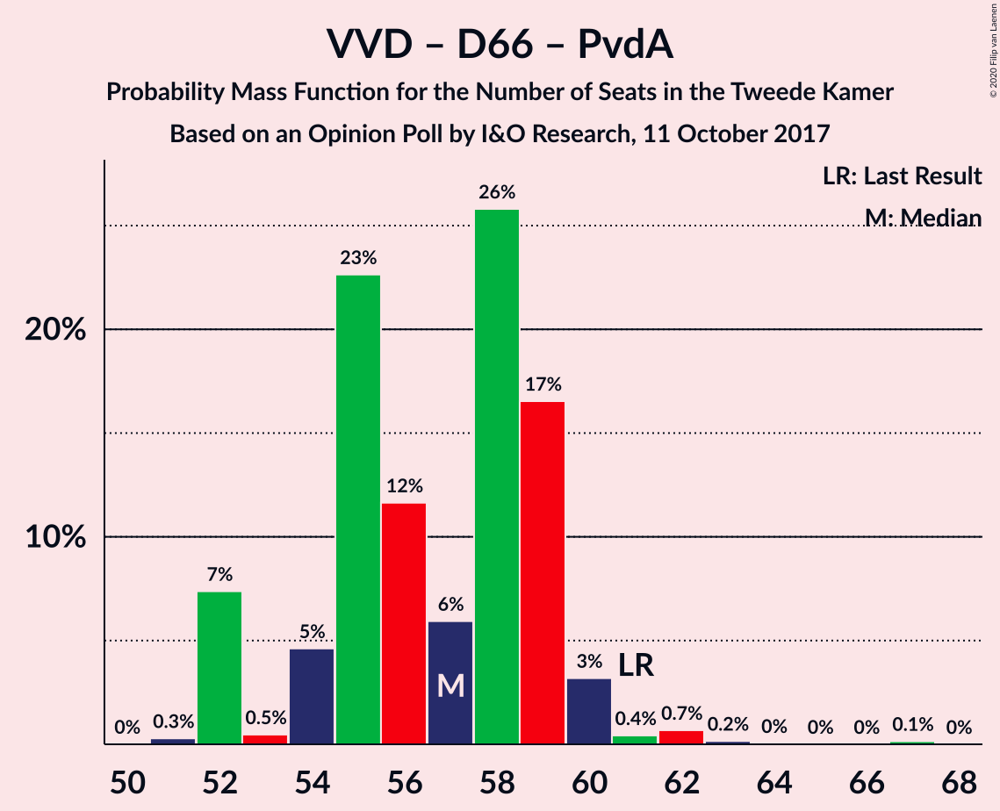

| Number of Seats | Probability | Accumulated | Special Marks |
|:---------------:|:-----------:|:-----------:|:-------------:|
| 51 | 0.3% | 100% |  |
| 52 | 7% | 99.7% |  |
| 53 | 0.5% | 92% |  |
| 54 | 5% | 92% |  |
| 55 | 23% | 87% |  |
| 56 | 12% | 65% |  |
| 57 | 6% | 53% | Median |
| 58 | 26% | 47% |  |
| 59 | 17% | 21% |  |
| 60 | 3% | 5% |  |
| 61 | 0.4% | 1.5% | Last Result |
| 62 | 0.7% | 1.0% |  |
| 63 | 0.2% | 0.4% |  |
| 64 | 0% | 0.2% |  |
| 65 | 0% | 0.2% |  |
| 66 | 0% | 0.2% |  |
| 67 | 0.1% | 0.1% |  |
| 68 | 0% | 0% |  |

### Volkspartij voor Vrijheid en Democratie – Christen-Democratisch Appèl – Forum voor Democratie – Staatkundig Gereformeerde Partij

| Number of Seats | Probability | Accumulated | Special Marks |
|:---------------:|:-----------:|:-----------:|:-------------:|
| 49 | 0.1% | 100% |  |
| 50 | 0% | 99.9% |  |
| 51 | 0% | 99.9% |  |
| 52 | 1.0% | 99.9% |  |
| 53 | 0.4% | 98.9% |  |
| 54 | 2% | 98.5% |  |
| 55 | 37% | 96% |  |
| 56 | 12% | 59% | Median |
| 57 | 22% | 47% | Last Result |
| 58 | 19% | 24% |  |
| 59 | 3% | 5% |  |
| 60 | 0.8% | 2% |  |
| 61 | 0.2% | 1.3% |  |
| 62 | 0.4% | 1.0% |  |
| 63 | 0.4% | 0.6% |  |
| 64 | 0.2% | 0.2% |  |
| 65 | 0% | 0% |  |

### Volkspartij voor Vrijheid en Democratie – Christen-Democratisch Appèl – Partij van de Arbeid

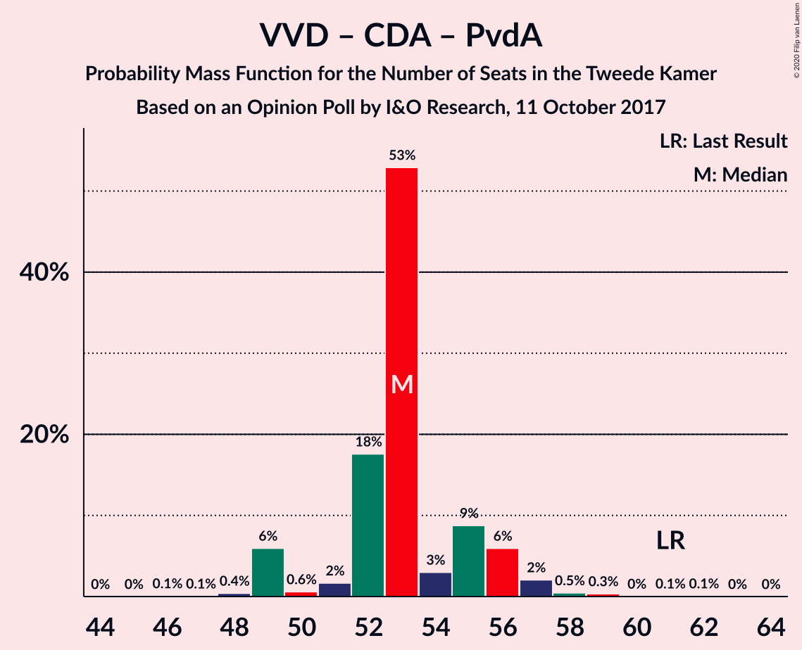

| Number of Seats | Probability | Accumulated | Special Marks |
|:---------------:|:-----------:|:-----------:|:-------------:|
| 46 | 0.1% | 100% |  |
| 47 | 0.1% | 99.9% |  |
| 48 | 0.4% | 99.9% |  |
| 49 | 6% | 99.4% |  |
| 50 | 0.6% | 93% |  |
| 51 | 2% | 93% |  |
| 52 | 18% | 91% |  |
| 53 | 53% | 74% | Median |
| 54 | 3% | 21% |  |
| 55 | 9% | 18% |  |
| 56 | 6% | 9% |  |
| 57 | 2% | 3% |  |
| 58 | 0.5% | 1.0% |  |
| 59 | 0.3% | 0.5% |  |
| 60 | 0% | 0.2% |  |
| 61 | 0.1% | 0.1% | Last Result |
| 62 | 0.1% | 0.1% |  |
| 63 | 0% | 0% |  |

### Volkspartij voor Vrijheid en Democratie – Christen-Democratisch Appèl – Forum voor Democratie

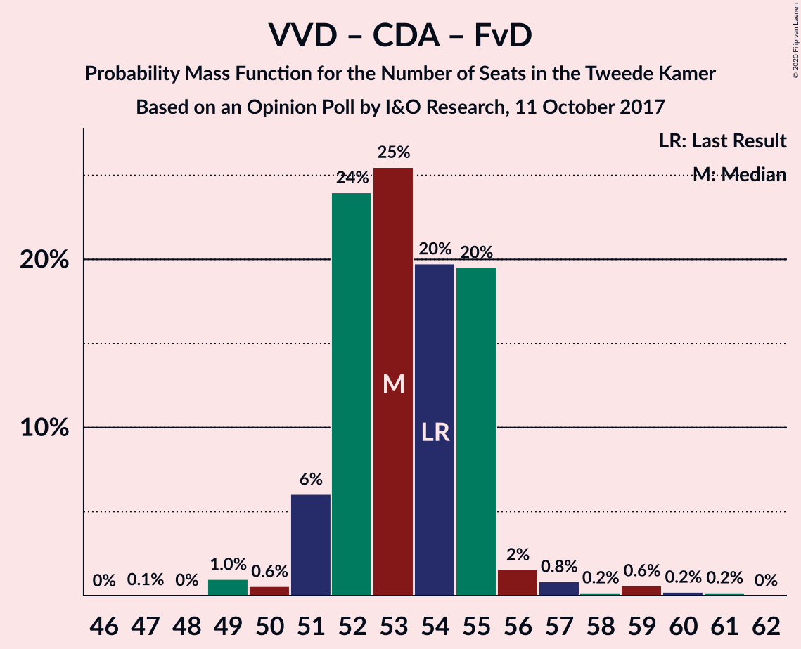

| Number of Seats | Probability | Accumulated | Special Marks |
|:---------------:|:-----------:|:-----------:|:-------------:|
| 47 | 0.1% | 100% |  |
| 48 | 0% | 99.9% |  |
| 49 | 1.0% | 99.9% |  |
| 50 | 0.6% | 98.9% |  |
| 51 | 6% | 98% |  |
| 52 | 24% | 92% |  |
| 53 | 25% | 68% | Median |
| 54 | 20% | 43% | Last Result |
| 55 | 20% | 23% |  |
| 56 | 2% | 4% |  |
| 57 | 0.8% | 2% |  |
| 58 | 0.2% | 1.2% |  |
| 59 | 0.6% | 1.0% |  |
| 60 | 0.2% | 0.4% |  |
| 61 | 0.2% | 0.2% |  |
| 62 | 0% | 0% |  |

### Volkspartij voor Vrijheid en Democratie – Christen-Democratisch Appèl

| Number of Seats | Probability | Accumulated | Special Marks |
|:---------------:|:-----------:|:-----------:|:-------------:|
| 37 | 0.1% | 100% |  |
| 38 | 0% | 99.9% |  |
| 39 | 0.2% | 99.9% |  |
| 40 | 5% | 99.7% |  |
| 41 | 14% | 95% |  |
| 42 | 6% | 81% |  |
| 43 | 24% | 75% | Median |
| 44 | 25% | 51% |  |
| 45 | 13% | 25% |  |
| 46 | 10% | 12% |  |
| 47 | 1.2% | 2% |  |
| 48 | 0.2% | 0.8% |  |
| 49 | 0.2% | 0.5% |  |
| 50 | 0.3% | 0.4% |  |
| 51 | 0.1% | 0.1% |  |
| 52 | 0% | 0% | Last Result |

### Democraten 66 – Christen-Democratisch Appèl – Partij van de Arbeid

| Number of Seats | Probability | Accumulated | Special Marks |
|:---------------:|:-----------:|:-----------:|:-------------:|
| 35 | 0.1% | 100% |  |
| 36 | 0.2% | 99.9% |  |
| 37 | 0.5% | 99.7% |  |
| 38 | 1.1% | 99.2% |  |
| 39 | 10% | 98% |  |
| 40 | 19% | 88% |  |
| 41 | 4% | 69% |  |
| 42 | 19% | 65% | Median |
| 43 | 17% | 46% |  |
| 44 | 15% | 30% |  |
| 45 | 12% | 15% |  |
| 46 | 3% | 3% |  |
| 47 | 0.2% | 0.4% | Last Result |
| 48 | 0.2% | 0.2% |  |
| 49 | 0% | 0% |  |

### Volkspartij voor Vrijheid en Democratie – Partij van de Arbeid

| Number of Seats | Probability | Accumulated | Special Marks |
|:---------------:|:-----------:|:-----------:|:-------------:|
| 33 | 0.1% | 100% |  |
| 34 | 0.2% | 99.9% |  |
| 35 | 6% | 99.7% |  |
| 36 | 13% | 94% |  |
| 37 | 3% | 81% |  |
| 38 | 18% | 78% |  |
| 39 | 34% | 60% | Median |
| 40 | 10% | 25% |  |
| 41 | 13% | 15% |  |
| 42 | 1.1% | 2% | Last Result |
| 43 | 0.8% | 1.4% |  |
| 44 | 0.2% | 0.6% |  |
| 45 | 0.3% | 0.3% |  |
| 46 | 0% | 0% |  |

### Democraten 66 – Christen-Democratisch Appèl

| Number of Seats | Probability | Accumulated | Special Marks |
|:---------------:|:-----------:|:-----------:|:-------------:|
| 27 | 0.2% | 100% |  |
| 28 | 0.3% | 99.7% |  |
| 29 | 0.9% | 99.5% |  |
| 30 | 20% | 98.5% |  |
| 31 | 6% | 79% |  |
| 32 | 18% | 73% | Median |
| 33 | 30% | 56% |  |
| 34 | 8% | 25% |  |
| 35 | 14% | 17% |  |
| 36 | 2% | 3% |  |
| 37 | 0.4% | 1.2% |  |
| 38 | 0.6% | 0.7% | Last Result |
| 39 | 0.2% | 0.2% |  |
| 40 | 0% | 0% |  |

### Christen-Democratisch Appèl – Partij van de Arbeid – ChristenUnie

| Number of Seats | Probability | Accumulated | Special Marks |
|:---------------:|:-----------:|:-----------:|:-------------:|
| 26 | 5% | 100% |  |
| 27 | 2% | 95% |  |
| 28 | 8% | 92% |  |
| 29 | 12% | 84% |  |
| 30 | 16% | 72% | Median |
| 31 | 26% | 56% |  |
| 32 | 20% | 30% |  |
| 33 | 2% | 10% | Last Result |
| 34 | 8% | 8% |  |
| 35 | 0.3% | 0.4% |  |
| 36 | 0.1% | 0.1% |  |
| 37 | 0% | 0% |  |

### Christen-Democratisch Appèl – Partij van de Arbeid

| Number of Seats | Probability | Accumulated | Special Marks |
|:---------------:|:-----------:|:-----------:|:-------------:|
| 19 | 0.2% | 100% |  |
| 20 | 0.7% | 99.8% |  |
| 21 | 7% | 99.1% |  |
| 22 | 17% | 92% |  |
| 23 | 9% | 75% |  |
| 24 | 21% | 66% | Median |
| 25 | 18% | 45% |  |
| 26 | 24% | 27% |  |
| 27 | 2% | 3% |  |
| 28 | 0.4% | 0.5% | Last Result |
| 29 | 0.2% | 0.2% |  |
| 30 | 0% | 0% |  |

## Technical Information

### Opinion Poll

+ **Polling firm:** I&O Research
+ **Commissioner(s):** —
+ **Fieldwork period:** 11 October 2017

### Calculations

+ **Sample size:** 1339
+ **Simulations done:** 1,048,576
+ **Error estimate:** 2.16%

