# Opinion Poll by Kantar Public, 11–15 October 2017

<a href="#voting-intentions">Voting Intentions</a> | <a href="#seats">Seats</a> | <a href="#coalitions">Coalitions</a> | <a href="#technical-information">Technical Information</a>

## Voting Intentions

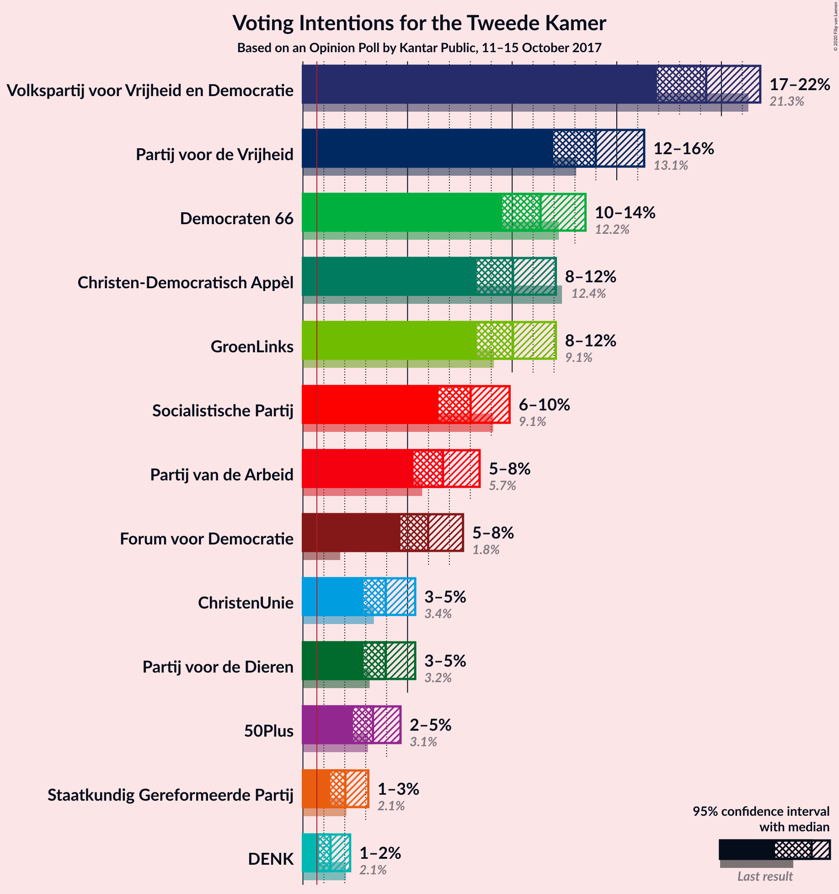

### Confidence Intervals

| Party | Last Result | Poll Result | 80% Confidence Interval | 90% Confidence Interval | 95% Confidence Interval | 99% Confidence Interval |
|:-----:|:-----------:|:-----------:|:-----------------------:|:-----------------------:|:-----------------------:|:-----------------------:|
| Volkspartij voor Vrijheid en Democratie | 21.3% | 19.3% | 17.7–21.0% |17.3–21.4% |16.9–21.9% |16.2–22.7% |
| Partij voor de Vrijheid | 13.1% | 14.0% | 12.7–15.5% |12.3–15.9% |12.0–16.3% |11.4–17.1% |
| Democraten 66 | 12.2% | 11.4% | 10.2–12.8% |9.8–13.2% |9.5–13.5% |9.0–14.2% |
| Christen-Democratisch Appèl | 12.4% | 10.0% | 8.9–11.4% |8.6–11.8% |8.3–12.1% |7.8–12.7% |
| GroenLinks | 9.1% | 10.0% | 8.9–11.4% |8.6–11.8% |8.3–12.1% |7.8–12.7% |
| Socialistische Partij | 9.1% | 8.0% | 7.0–9.2% |6.7–9.6% |6.5–9.9% |6.0–10.5% |
| Partij van de Arbeid | 5.7% | 6.7% | 5.8–7.8% |5.5–8.2% |5.3–8.4% |4.9–9.0% |
| Forum voor Democratie | 1.8% | 6.0% | 5.1–7.1% |4.9–7.4% |4.7–7.7% |4.3–8.2% |
| ChristenUnie | 3.4% | 4.0% | 3.3–4.9% |3.1–5.1% |2.9–5.4% |2.6–5.8% |
| Partij voor de Dieren | 3.2% | 4.0% | 3.3–4.9% |3.1–5.1% |2.9–5.4% |2.6–5.8% |
| 50Plus | 3.1% | 3.3% | 2.7–4.2% |2.5–4.5% |2.4–4.7% |2.1–5.1% |
| Staatkundig Gereformeerde Partij | 2.1% | 2.0% | 1.6–2.7% |1.4–2.9% |1.3–3.1% |1.1–3.5% |
| DENK | 2.1% | 1.3% | 1.0–1.9% |0.9–2.1% |0.8–2.3% |0.6–2.6% |

*Note:* The poll result column reflects the actual value used in the calculations. Published results may vary slightly, and in addition be rounded to fewer digits.

## Seats

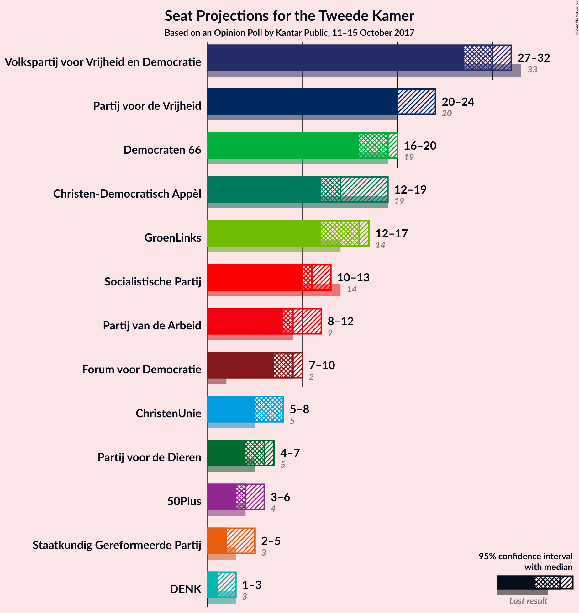

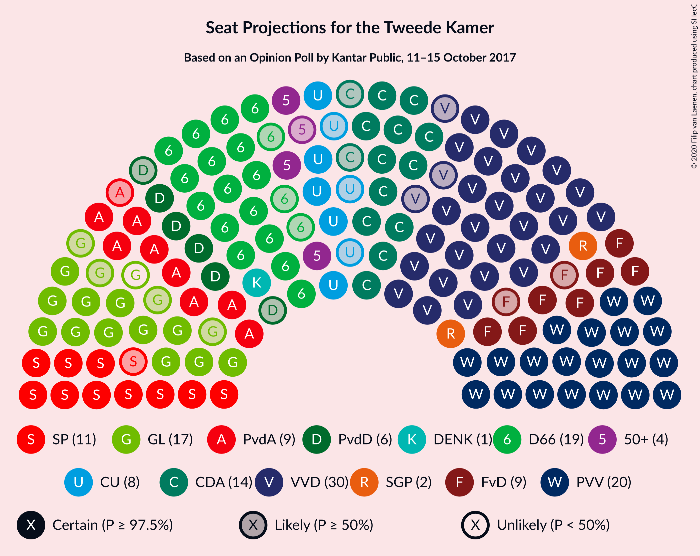

### Confidence Intervals

| Party | Last Result | Median | 80% Confidence Interval | 90% Confidence Interval | 95% Confidence Interval | 99% Confidence Interval |
|:-----:|:-----------:|:------:|:-----------------------:|:-----------------------:|:-----------------------:|:-----------------------:|
| <a href="#volkspartij-voor-vrijheid-en-democratie">Volkspartij voor Vrijheid en Democratie</a> | 33 | 30 | 27–30 |27–32 |27–32 |26–33 |
| <a href="#partij-voor-de-vrijheid">Partij voor de Vrijheid</a> | 20 | 20 | 20–23 |20–24 |20–24 |18–25 |
| <a href="#democraten-66">Democraten 66</a> | 19 | 19 | 17–19 |16–20 |16–20 |14–22 |
| <a href="#christen-democratisch-appèl">Christen-Democratisch Appèl</a> | 19 | 14 | 14–19 |12–19 |12–19 |11–19 |
| <a href="#groenlinks">GroenLinks</a> | 14 | 16 | 13–17 |12–17 |12–17 |11–18 |
| <a href="#socialistische-partij">Socialistische Partij</a> | 14 | 11 | 10–12 |10–12 |10–13 |10–17 |
| <a href="#partij-van-de-arbeid">Partij van de Arbeid</a> | 9 | 9 | 8–10 |8–10 |8–12 |8–13 |
| <a href="#forum-voor-democratie">Forum voor Democratie</a> | 2 | 9 | 7–9 |7–10 |7–10 |6–11 |
| <a href="#christenunie">ChristenUnie</a> | 5 | 8 | 5–8 |5–8 |5–8 |4–8 |
| <a href="#partij-voor-de-dieren">Partij voor de Dieren</a> | 5 | 6 | 5–6 |4–6 |4–7 |4–8 |
| <a href="#50plus">50Plus</a> | 4 | 4 | 4–5 |4–6 |3–6 |3–7 |
| <a href="#staatkundig-gereformeerde-partij">Staatkundig Gereformeerde Partij</a> | 3 | 2 | 2–5 |2–5 |2–5 |2–5 |
| <a href="#denk">DENK</a> | 3 | 1 | 1–2 |1–2 |1–3 |1–3 |

### Volkspartij voor Vrijheid en Democratie

*For a full overview of the results for this party, see the [Volkspartij voor Vrijheid en Democratie](party-volkspartijvoorvrijheidendemocratie.html) page.*

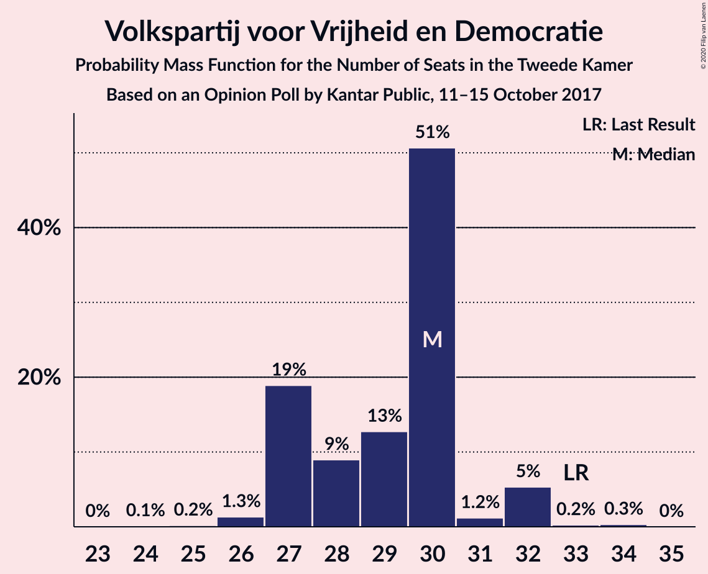

| Number of Seats | Probability | Accumulated | Special Marks |
|:---------------:|:-----------:|:-----------:|:-------------:|
| 24 | 0.1% | 100% |  |
| 25 | 0.2% | 99.9% |  |
| 26 | 1.3% | 99.7% |  |
| 27 | 19% | 98% |  |
| 28 | 9% | 79% |  |
| 29 | 13% | 71% |  |
| 30 | 51% | 58% | Median |
| 31 | 1.2% | 7% |  |
| 32 | 5% | 6% |  |
| 33 | 0.2% | 0.6% | Last Result |
| 34 | 0.3% | 0.4% |  |
| 35 | 0% | 0% |  |

### Partij voor de Vrijheid

*For a full overview of the results for this party, see the [Partij voor de Vrijheid](party-partijvoordevrijheid.html) page.*

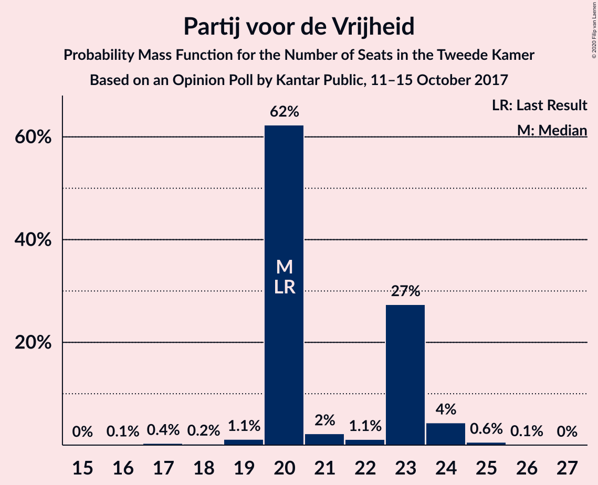

| Number of Seats | Probability | Accumulated | Special Marks |
|:---------------:|:-----------:|:-----------:|:-------------:|
| 16 | 0.1% | 100% |  |
| 17 | 0.4% | 99.9% |  |
| 18 | 0.2% | 99.6% |  |
| 19 | 1.1% | 99.3% |  |
| 20 | 62% | 98% | Last Result, Median |
| 21 | 2% | 36% |  |
| 22 | 1.1% | 34% |  |
| 23 | 27% | 32% |  |
| 24 | 4% | 5% |  |
| 25 | 0.6% | 0.8% |  |
| 26 | 0.1% | 0.2% |  |
| 27 | 0% | 0% |  |

### Democraten 66

*For a full overview of the results for this party, see the [Democraten 66](party-democraten66.html) page.*

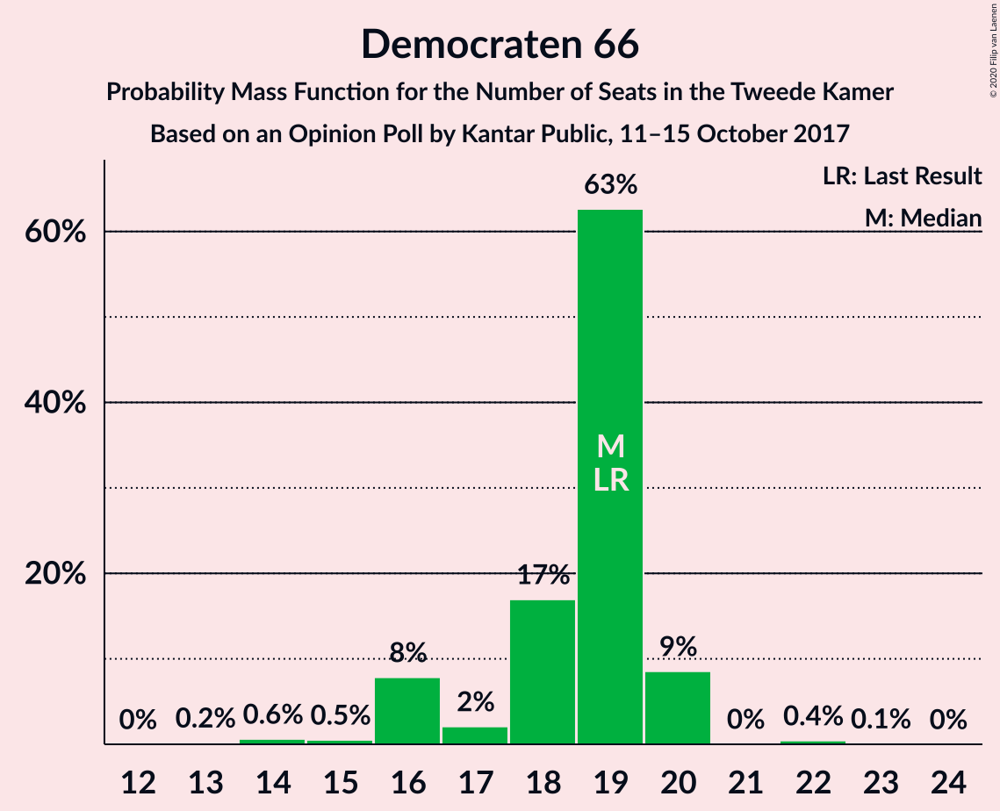

| Number of Seats | Probability | Accumulated | Special Marks |
|:---------------:|:-----------:|:-----------:|:-------------:|
| 13 | 0.2% | 100% |  |
| 14 | 0.6% | 99.8% |  |
| 15 | 0.5% | 99.2% |  |
| 16 | 8% | 98.7% |  |
| 17 | 2% | 91% |  |
| 18 | 17% | 89% |  |
| 19 | 63% | 72% | Last Result, Median |
| 20 | 9% | 9% |  |
| 21 | 0% | 0.6% |  |
| 22 | 0.4% | 0.5% |  |
| 23 | 0.1% | 0.1% |  |
| 24 | 0% | 0% |  |

### Christen-Democratisch Appèl

*For a full overview of the results for this party, see the [Christen-Democratisch Appèl](party-christen-democratischappèl.html) page.*

| Number of Seats | Probability | Accumulated | Special Marks |
|:---------------:|:-----------:|:-----------:|:-------------:|
| 11 | 0.7% | 100% |  |
| 12 | 4% | 99.2% |  |
| 13 | 1.0% | 95% |  |
| 14 | 44% | 94% | Median |
| 15 | 14% | 50% |  |
| 16 | 17% | 35% |  |
| 17 | 7% | 18% |  |
| 18 | 0.3% | 11% |  |
| 19 | 11% | 11% | Last Result |
| 20 | 0% | 0.1% |  |
| 21 | 0.1% | 0.1% |  |
| 22 | 0% | 0% |  |

### GroenLinks

*For a full overview of the results for this party, see the [GroenLinks](party-groenlinks.html) page.*

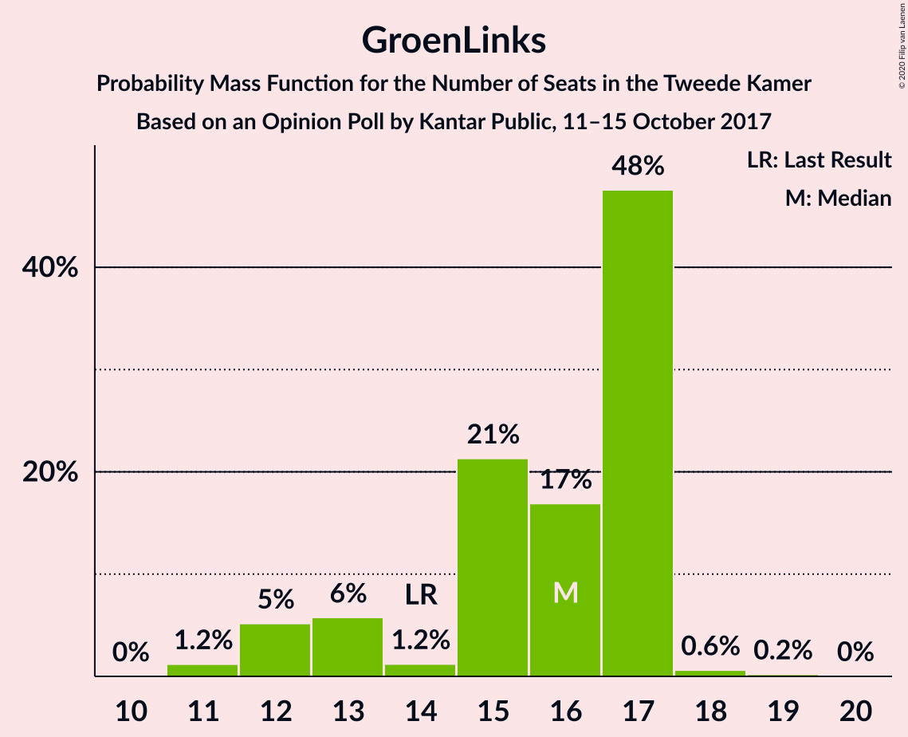

| Number of Seats | Probability | Accumulated | Special Marks |
|:---------------:|:-----------:|:-----------:|:-------------:|
| 11 | 1.2% | 100% |  |
| 12 | 5% | 98.8% |  |
| 13 | 6% | 94% |  |
| 14 | 1.2% | 88% | Last Result |
| 15 | 21% | 87% |  |
| 16 | 17% | 65% | Median |
| 17 | 48% | 48% |  |
| 18 | 0.6% | 0.9% |  |
| 19 | 0.2% | 0.2% |  |
| 20 | 0% | 0% |  |

### Socialistische Partij

*For a full overview of the results for this party, see the [Socialistische Partij](party-socialistischepartij.html) page.*

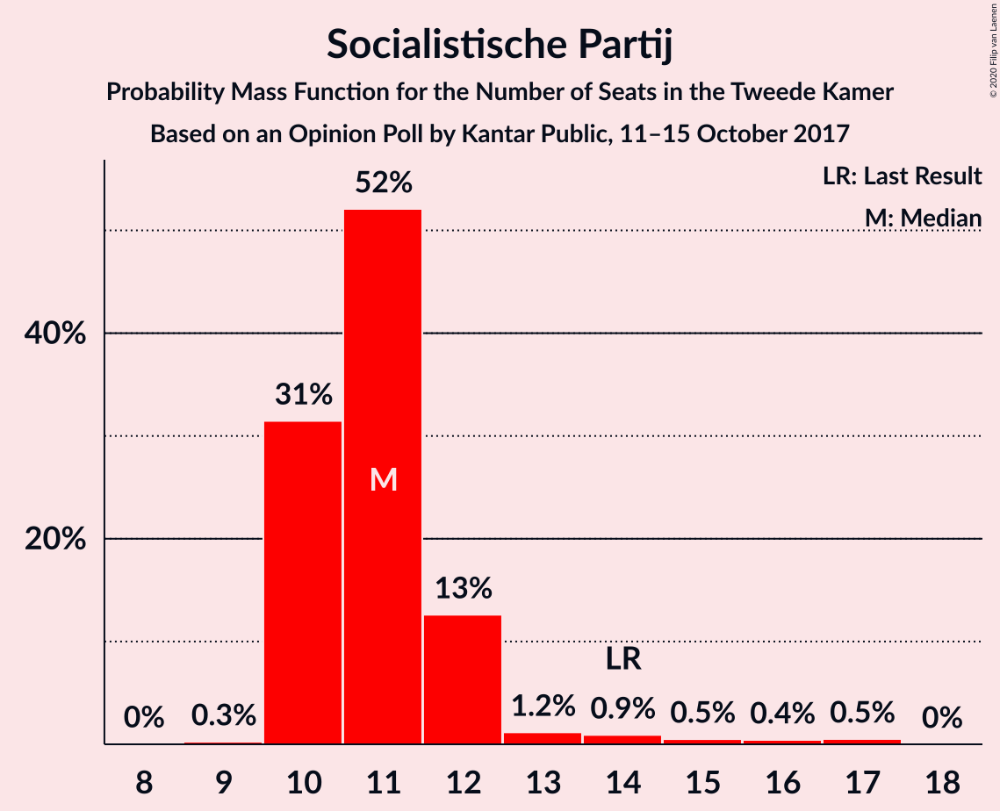

| Number of Seats | Probability | Accumulated | Special Marks |
|:---------------:|:-----------:|:-----------:|:-------------:|
| 9 | 0.3% | 100% |  |
| 10 | 31% | 99.7% |  |
| 11 | 52% | 68% | Median |
| 12 | 13% | 16% |  |
| 13 | 1.2% | 4% |  |
| 14 | 0.9% | 2% | Last Result |
| 15 | 0.5% | 1.5% |  |
| 16 | 0.4% | 0.9% |  |
| 17 | 0.5% | 0.5% |  |
| 18 | 0% | 0% |  |

### Partij van de Arbeid

*For a full overview of the results for this party, see the [Partij van de Arbeid](party-partijvandearbeid.html) page.*

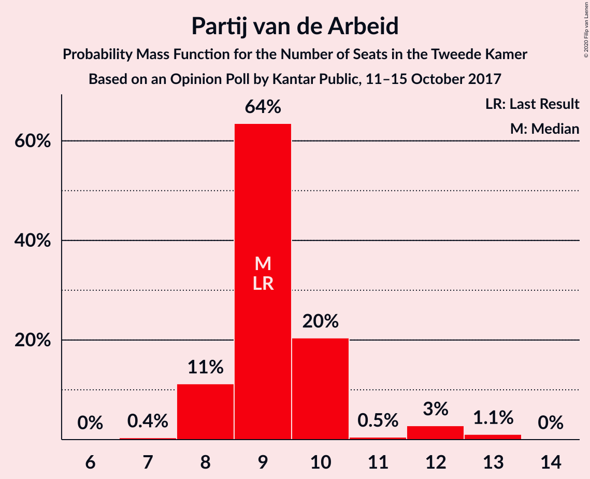

| Number of Seats | Probability | Accumulated | Special Marks |
|:---------------:|:-----------:|:-----------:|:-------------:|
| 7 | 0.4% | 100% |  |
| 8 | 11% | 99.6% |  |
| 9 | 64% | 88% | Last Result, Median |
| 10 | 20% | 25% |  |
| 11 | 0.5% | 4% |  |
| 12 | 3% | 4% |  |
| 13 | 1.1% | 1.1% |  |
| 14 | 0% | 0% |  |

### Forum voor Democratie

*For a full overview of the results for this party, see the [Forum voor Democratie](party-forumvoordemocratie.html) page.*

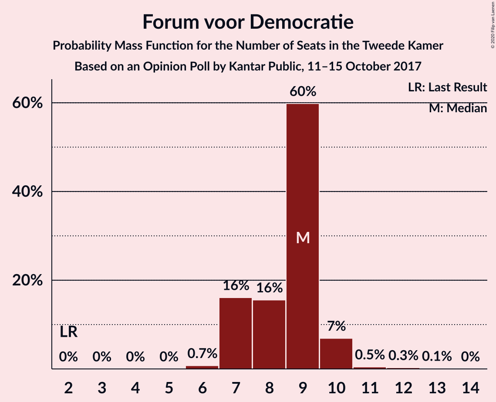

| Number of Seats | Probability | Accumulated | Special Marks |
|:---------------:|:-----------:|:-----------:|:-------------:|
| 2 | 0% | 100% | Last Result |
| 3 | 0% | 100% |  |
| 4 | 0% | 100% |  |
| 5 | 0% | 100% |  |
| 6 | 0.7% | 100% |  |
| 7 | 16% | 99.2% |  |
| 8 | 16% | 83% |  |
| 9 | 60% | 68% | Median |
| 10 | 7% | 8% |  |
| 11 | 0.5% | 0.9% |  |
| 12 | 0.3% | 0.4% |  |
| 13 | 0.1% | 0.1% |  |
| 14 | 0% | 0% |  |

### ChristenUnie

*For a full overview of the results for this party, see the [ChristenUnie](party-christenunie.html) page.*

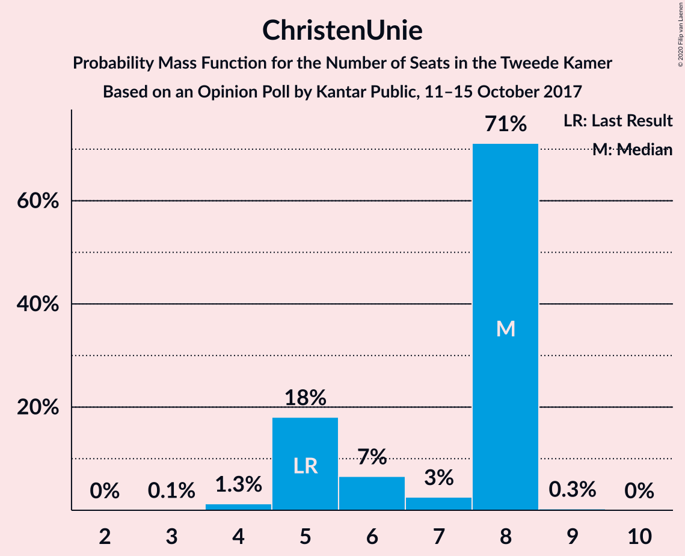

| Number of Seats | Probability | Accumulated | Special Marks |
|:---------------:|:-----------:|:-----------:|:-------------:|
| 3 | 0.1% | 100% |  |
| 4 | 1.3% | 99.9% |  |
| 5 | 18% | 98.7% | Last Result |
| 6 | 7% | 81% |  |
| 7 | 3% | 74% |  |
| 8 | 71% | 71% | Median |
| 9 | 0.3% | 0.3% |  |
| 10 | 0% | 0% |  |

### Partij voor de Dieren

*For a full overview of the results for this party, see the [Partij voor de Dieren](party-partijvoordedieren.html) page.*

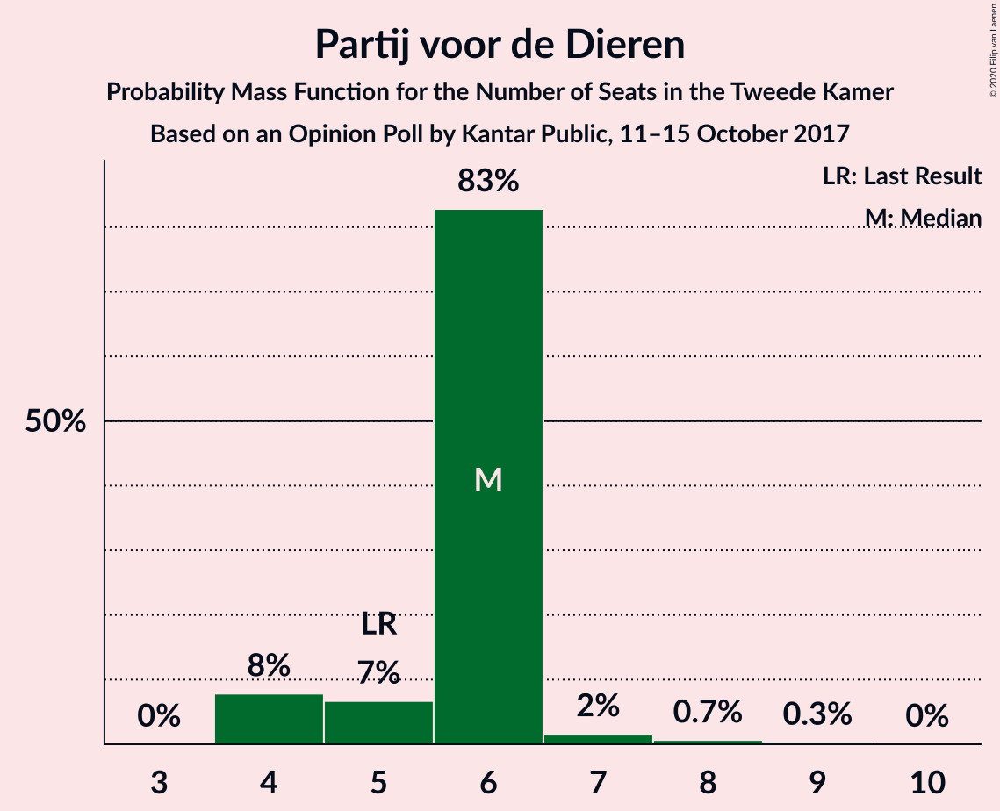

| Number of Seats | Probability | Accumulated | Special Marks |
|:---------------:|:-----------:|:-----------:|:-------------:|
| 4 | 8% | 100% |  |
| 5 | 7% | 92% | Last Result |
| 6 | 83% | 85% | Median |
| 7 | 2% | 3% |  |
| 8 | 0.7% | 1.0% |  |
| 9 | 0.3% | 0.3% |  |
| 10 | 0% | 0% |  |

### 50Plus

*For a full overview of the results for this party, see the [50Plus](party-50plus.html) page.*

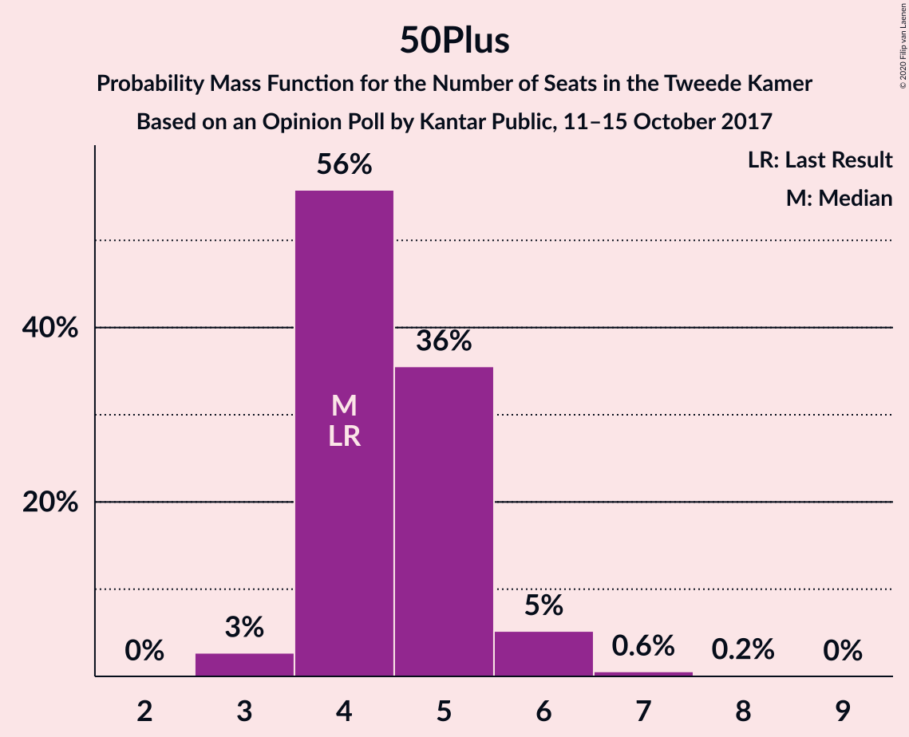

| Number of Seats | Probability | Accumulated | Special Marks |
|:---------------:|:-----------:|:-----------:|:-------------:|
| 3 | 3% | 100% |  |
| 4 | 56% | 97% | Last Result, Median |
| 5 | 36% | 41% |  |
| 6 | 5% | 6% |  |
| 7 | 0.6% | 0.7% |  |
| 8 | 0.2% | 0.2% |  |
| 9 | 0% | 0% |  |

### Staatkundig Gereformeerde Partij

*For a full overview of the results for this party, see the [Staatkundig Gereformeerde Partij](party-staatkundiggereformeerdepartij.html) page.*

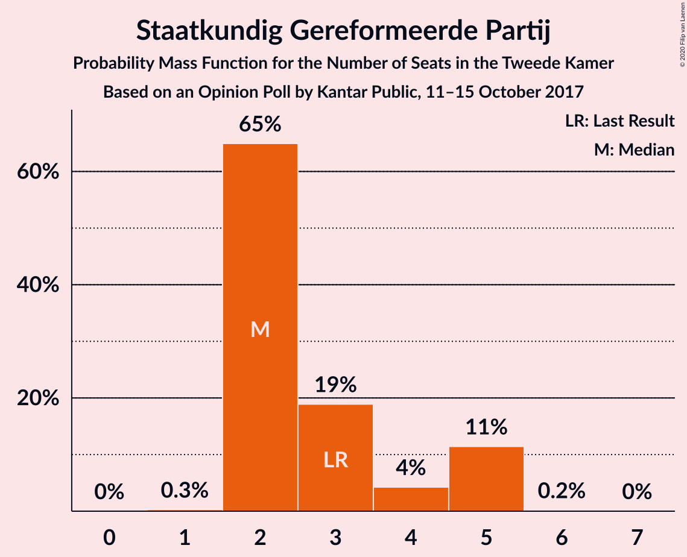

| Number of Seats | Probability | Accumulated | Special Marks |
|:---------------:|:-----------:|:-----------:|:-------------:|
| 1 | 0.3% | 100% |  |
| 2 | 65% | 99.7% | Median |
| 3 | 19% | 35% | Last Result |
| 4 | 4% | 16% |  |
| 5 | 11% | 12% |  |
| 6 | 0.2% | 0.2% |  |
| 7 | 0% | 0% |  |

### DENK

*For a full overview of the results for this party, see the [DENK](party-denk.html) page.*

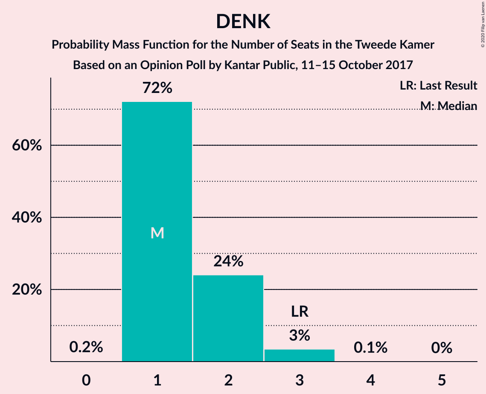

| Number of Seats | Probability | Accumulated | Special Marks |
|:---------------:|:-----------:|:-----------:|:-------------:|
| 0 | 0.2% | 100% |  |
| 1 | 72% | 99.8% | Median |
| 2 | 24% | 28% |  |
| 3 | 3% | 4% | Last Result |
| 4 | 0.1% | 0.1% |  |
| 5 | 0% | 0% |  |

## Coalitions

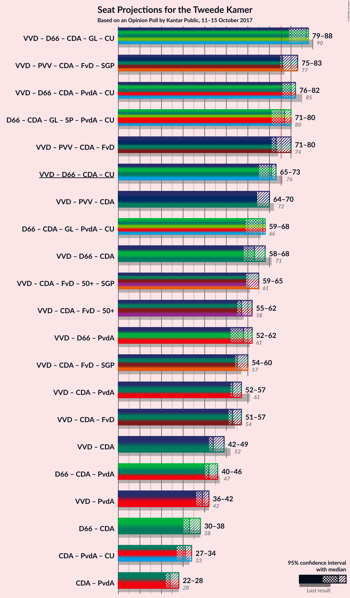

### Confidence Intervals

| Coalition | Last Result | Median | Majority? | 80% Confidence Interval | 90% Confidence Interval | 95% Confidence Interval | 99% Confidence Interval |
|:---------:|:-----------:|:------:|:---------:|:-----------------------:|:-----------------------:|:-----------------------:|:-----------------------:|
| Volkspartij voor Vrijheid en Democratie – Democraten 66 – Christen-Democratisch Appèl – GroenLinks – ChristenUnie | 90 | 87 | 99.8% | 81–88 | 80–88 | 79–88 | 77–88 |
| Volkspartij voor Vrijheid en Democratie – Partij voor de Vrijheid – Christen-Democratisch Appèl – Forum voor Democratie – Staatkundig Gereformeerde Partij | 77 | 76 | 56% | 75–80 | 75–80 | 75–83 | 73–83 |
| Volkspartij voor Vrijheid en Democratie – Democraten 66 – Christen-Democratisch Appèl – Partij van de Arbeid – ChristenUnie | 85 | 80 | 98% | 78–81 | 76–81 | 76–82 | 70–84 |
| Democraten 66 – Christen-Democratisch Appèl – GroenLinks – Socialistische Partij – Partij van de Arbeid – ChristenUnie | 80 | 77 | 85% | 74–78 | 71–78 | 71–80 | 70–81 |
| Volkspartij voor Vrijheid en Democratie – Partij voor de Vrijheid – Christen-Democratisch Appèl – Forum voor Democratie | 74 | 73 | 18% | 71–77 | 71–77 | 71–80 | 70–80 |
| Volkspartij voor Vrijheid en Democratie – Democraten 66 – Christen-Democratisch Appèl – ChristenUnie | 76 | 71 | 0.1% | 69–71 | 66–73 | 65–73 | 61–74 |
| Volkspartij voor Vrijheid en Democratie – Partij voor de Vrijheid – Christen-Democratisch Appèl | 72 | 64 | 0% | 64–69 | 64–69 | 64–70 | 62–70 |
| Democraten 66 – Christen-Democratisch Appèl – GroenLinks – Partij van de Arbeid – ChristenUnie | 66 | 67 | 0% | 62–67 | 59–68 | 59–68 | 59–69 |
| Volkspartij voor Vrijheid en Democratie – Democraten 66 – Christen-Democratisch Appèl | 71 | 63 | 0% | 61–65 | 59–68 | 58–68 | 57–68 |
| Volkspartij voor Vrijheid en Democratie – Christen-Democratisch Appèl – Forum voor Democratie – 50Plus – Staatkundig Gereformeerde Partij | 61 | 59 | 0% | 59–65 | 59–65 | 59–65 | 55–66 |
| Volkspartij voor Vrijheid en Democratie – Christen-Democratisch Appèl – Forum voor Democratie – 50Plus | 58 | 57 | 0% | 55–62 | 55–62 | 55–62 | 52–62 |
| Volkspartij voor Vrijheid en Democratie – Democraten 66 – Partij van de Arbeid | 61 | 58 | 0% | 54–58 | 53–60 | 52–62 | 51–63 |
| Volkspartij voor Vrijheid en Democratie – Christen-Democratisch Appèl – Forum voor Democratie – Staatkundig Gereformeerde Partij | 57 | 55 | 0% | 54–60 | 54–60 | 54–60 | 51–60 |
| Volkspartij voor Vrijheid en Democratie – Christen-Democratisch Appèl – Partij van de Arbeid | 61 | 53 | 0% | 52–57 | 52–57 | 52–57 | 49–58 |
| Volkspartij voor Vrijheid en Democratie – Christen-Democratisch Appèl – Forum voor Democratie | 54 | 53 | 0% | 51–57 | 51–57 | 51–57 | 47–57 |
| Volkspartij voor Vrijheid en Democratie – Christen-Democratisch Appèl | 52 | 44 | 0% | 43–47 | 43–49 | 42–49 | 40–49 |
| Democraten 66 – Christen-Democratisch Appèl – Partij van de Arbeid | 47 | 42 | 0% | 42–46 | 41–46 | 40–46 | 37–49 |
| Volkspartij voor Vrijheid en Democratie – Partij van de Arbeid | 42 | 39 | 0% | 36–40 | 36–42 | 36–42 | 35–42 |
| Democraten 66 – Christen-Democratisch Appèl | 38 | 33 | 0% | 32–37 | 31–38 | 30–38 | 28–38 |
| Christen-Democratisch Appèl – Partij van de Arbeid – ChristenUnie | 33 | 31 | 0% | 31–33 | 28–33 | 27–34 | 27–37 |
| Christen-Democratisch Appèl – Partij van de Arbeid | 28 | 24 | 0% | 23–27 | 22–27 | 22–28 | 21–31 |

### Volkspartij voor Vrijheid en Democratie – Democraten 66 – Christen-Democratisch Appèl – GroenLinks – ChristenUnie

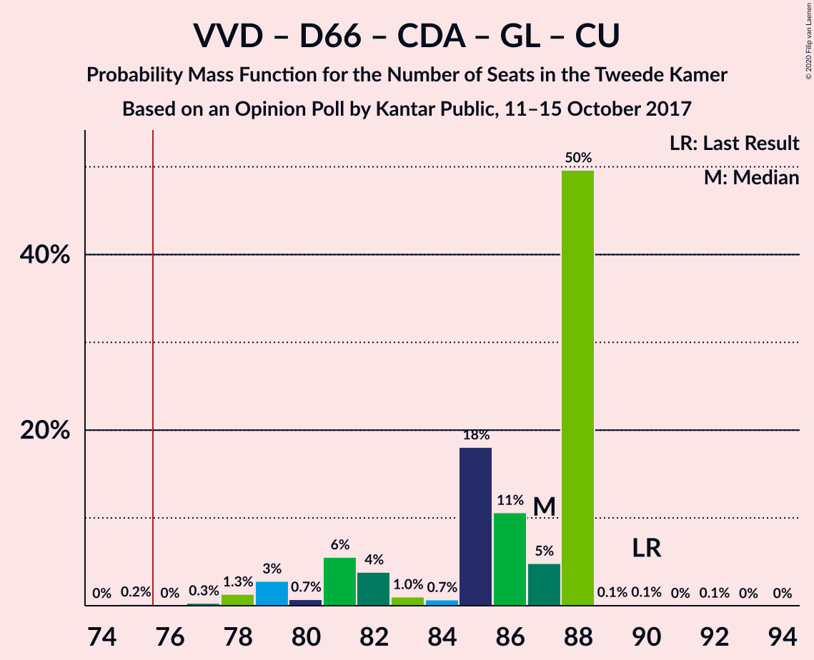

| Number of Seats | Probability | Accumulated | Special Marks |
|:---------------:|:-----------:|:-----------:|:-------------:|
| 75 | 0.2% | 100% |  |
| 76 | 0% | 99.8% | Majority |
| 77 | 0.3% | 99.8% |  |
| 78 | 1.3% | 99.5% |  |
| 79 | 3% | 98% |  |
| 80 | 0.7% | 95% |  |
| 81 | 6% | 95% |  |
| 82 | 4% | 89% |  |
| 83 | 1.0% | 85% |  |
| 84 | 0.7% | 84% |  |
| 85 | 18% | 84% |  |
| 86 | 11% | 65% |  |
| 87 | 5% | 55% | Median |
| 88 | 50% | 50% |  |
| 89 | 0.1% | 0.3% |  |
| 90 | 0.1% | 0.2% | Last Result |
| 91 | 0% | 0.1% |  |
| 92 | 0.1% | 0.1% |  |
| 93 | 0% | 0% |  |

### Volkspartij voor Vrijheid en Democratie – Partij voor de Vrijheid – Christen-Democratisch Appèl – Forum voor Democratie – Staatkundig Gereformeerde Partij

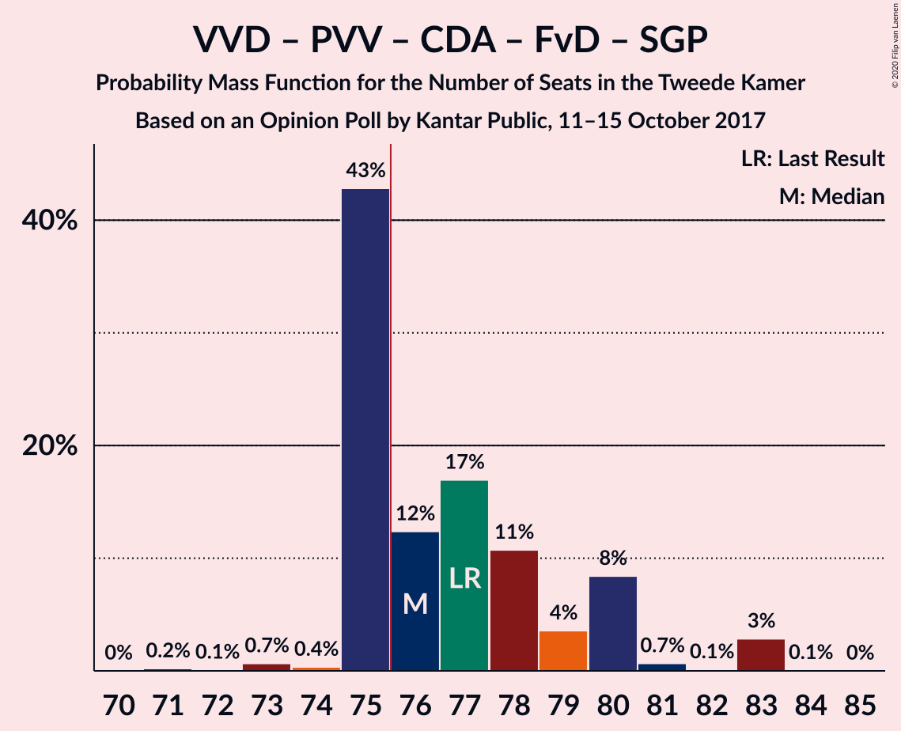

| Number of Seats | Probability | Accumulated | Special Marks |
|:---------------:|:-----------:|:-----------:|:-------------:|
| 71 | 0.2% | 100% |  |
| 72 | 0.1% | 99.7% |  |
| 73 | 0.7% | 99.6% |  |
| 74 | 0.4% | 99.0% |  |
| 75 | 43% | 98.6% | Median |
| 76 | 12% | 56% | Majority |
| 77 | 17% | 43% | Last Result |
| 78 | 11% | 26% |  |
| 79 | 4% | 16% |  |
| 80 | 8% | 12% |  |
| 81 | 0.7% | 4% |  |
| 82 | 0.1% | 3% |  |
| 83 | 3% | 3% |  |
| 84 | 0.1% | 0.1% |  |
| 85 | 0% | 0% |  |

### Volkspartij voor Vrijheid en Democratie – Democraten 66 – Christen-Democratisch Appèl – Partij van de Arbeid – ChristenUnie

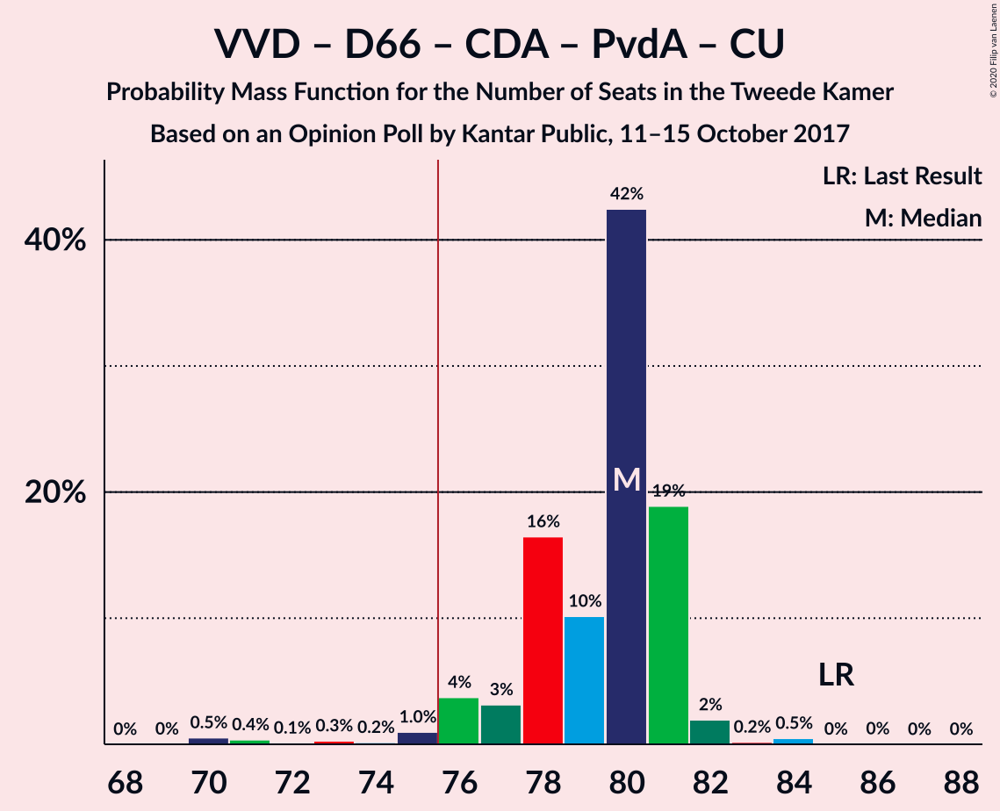

| Number of Seats | Probability | Accumulated | Special Marks |
|:---------------:|:-----------:|:-----------:|:-------------:|
| 70 | 0.5% | 100% |  |
| 71 | 0.4% | 99.4% |  |
| 72 | 0.1% | 99.1% |  |
| 73 | 0.3% | 99.0% |  |
| 74 | 0.2% | 98.7% |  |
| 75 | 1.0% | 98.5% |  |
| 76 | 4% | 98% | Majority |
| 77 | 3% | 94% |  |
| 78 | 16% | 91% |  |
| 79 | 10% | 74% |  |
| 80 | 42% | 64% | Median |
| 81 | 19% | 22% |  |
| 82 | 2% | 3% |  |
| 83 | 0.2% | 0.7% |  |
| 84 | 0.5% | 0.6% |  |
| 85 | 0% | 0.1% | Last Result |
| 86 | 0% | 0.1% |  |
| 87 | 0% | 0% |  |

### Democraten 66 – Christen-Democratisch Appèl – GroenLinks – Socialistische Partij – Partij van de Arbeid – ChristenUnie

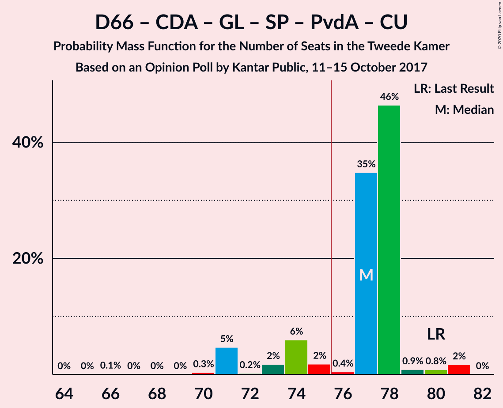

| Number of Seats | Probability | Accumulated | Special Marks |
|:---------------:|:-----------:|:-----------:|:-------------:|
| 66 | 0.1% | 100% |  |
| 67 | 0% | 99.9% |  |
| 68 | 0% | 99.9% |  |
| 69 | 0% | 99.8% |  |
| 70 | 0.3% | 99.8% |  |
| 71 | 5% | 99.5% |  |
| 72 | 0.2% | 95% |  |
| 73 | 2% | 95% |  |
| 74 | 6% | 93% |  |
| 75 | 2% | 87% |  |
| 76 | 0.4% | 85% | Majority |
| 77 | 35% | 85% | Median |
| 78 | 46% | 50% |  |
| 79 | 0.9% | 3% |  |
| 80 | 0.8% | 3% | Last Result |
| 81 | 2% | 2% |  |
| 82 | 0% | 0% |  |

### Volkspartij voor Vrijheid en Democratie – Partij voor de Vrijheid – Christen-Democratisch Appèl – Forum voor Democratie

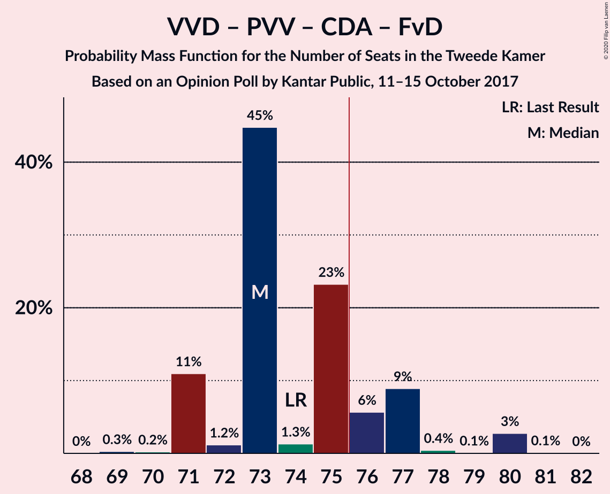

| Number of Seats | Probability | Accumulated | Special Marks |
|:---------------:|:-----------:|:-----------:|:-------------:|
| 68 | 0% | 100% |  |
| 69 | 0.3% | 99.9% |  |
| 70 | 0.2% | 99.7% |  |
| 71 | 11% | 99.5% |  |
| 72 | 1.2% | 88% |  |
| 73 | 45% | 87% | Median |
| 74 | 1.3% | 43% | Last Result |
| 75 | 23% | 41% |  |
| 76 | 6% | 18% | Majority |
| 77 | 9% | 12% |  |
| 78 | 0.4% | 3% |  |
| 79 | 0.1% | 3% |  |
| 80 | 3% | 3% |  |
| 81 | 0.1% | 0.1% |  |
| 82 | 0% | 0% |  |

### Volkspartij voor Vrijheid en Democratie – Democraten 66 – Christen-Democratisch Appèl – ChristenUnie

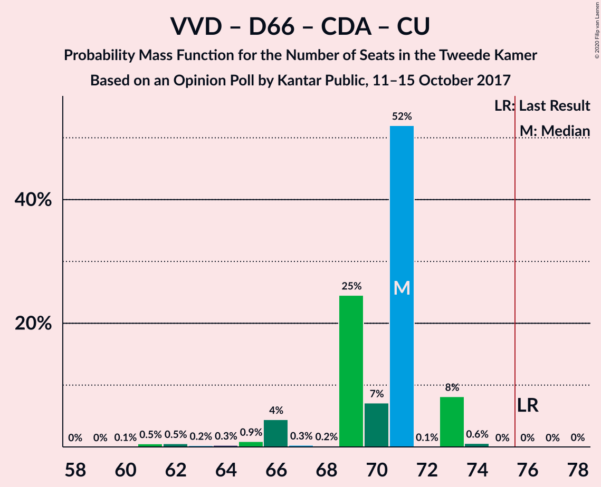

| Number of Seats | Probability | Accumulated | Special Marks |
|:---------------:|:-----------:|:-----------:|:-------------:|
| 60 | 0.1% | 100% |  |
| 61 | 0.5% | 99.9% |  |
| 62 | 0.5% | 99.4% |  |
| 63 | 0.2% | 98.9% |  |
| 64 | 0.3% | 98.6% |  |
| 65 | 0.9% | 98% |  |
| 66 | 4% | 97% |  |
| 67 | 0.3% | 93% |  |
| 68 | 0.2% | 93% |  |
| 69 | 25% | 93% |  |
| 70 | 7% | 68% |  |
| 71 | 52% | 61% | Median |
| 72 | 0.1% | 9% |  |
| 73 | 8% | 9% |  |
| 74 | 0.6% | 0.7% |  |
| 75 | 0% | 0.1% |  |
| 76 | 0% | 0.1% | Last Result, Majority |
| 77 | 0% | 0.1% |  |
| 78 | 0% | 0% |  |

### Volkspartij voor Vrijheid en Democratie – Partij voor de Vrijheid – Christen-Democratisch Appèl

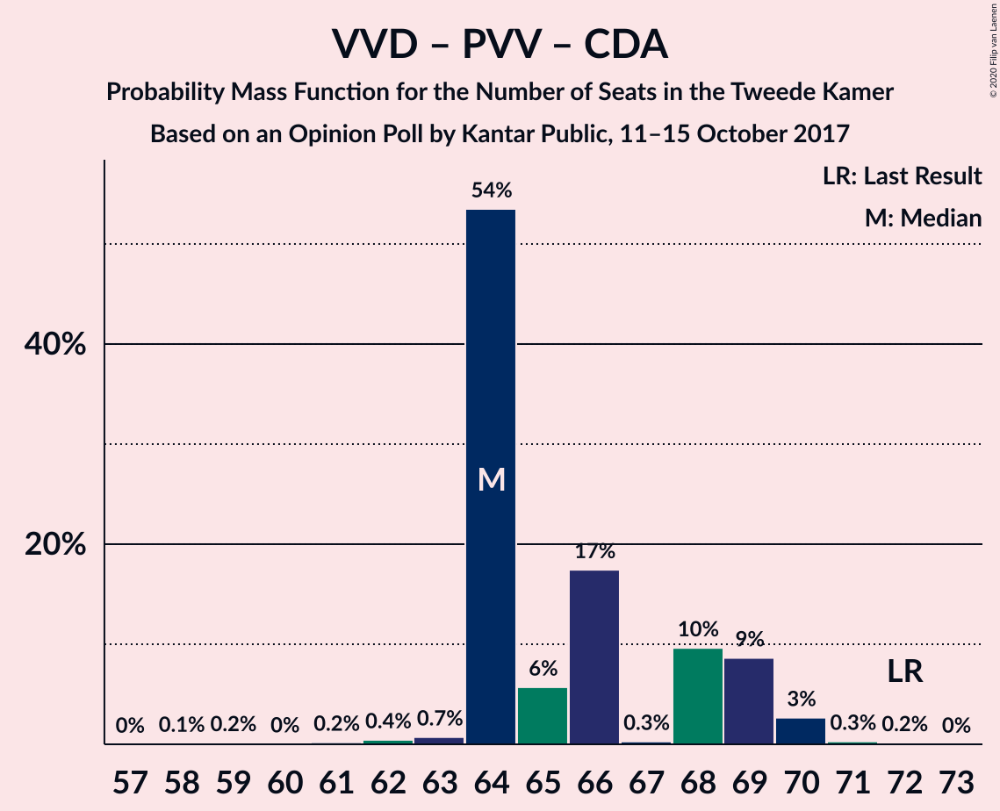

| Number of Seats | Probability | Accumulated | Special Marks |
|:---------------:|:-----------:|:-----------:|:-------------:|
| 58 | 0.1% | 100% |  |
| 59 | 0.2% | 99.9% |  |
| 60 | 0% | 99.8% |  |
| 61 | 0.2% | 99.7% |  |
| 62 | 0.4% | 99.5% |  |
| 63 | 0.7% | 99.1% |  |
| 64 | 54% | 98% | Median |
| 65 | 6% | 45% |  |
| 66 | 17% | 39% |  |
| 67 | 0.3% | 22% |  |
| 68 | 10% | 21% |  |
| 69 | 9% | 12% |  |
| 70 | 3% | 3% |  |
| 71 | 0.3% | 0.5% |  |
| 72 | 0.2% | 0.2% | Last Result |
| 73 | 0% | 0% |  |

### Democraten 66 – Christen-Democratisch Appèl – GroenLinks – Partij van de Arbeid – ChristenUnie

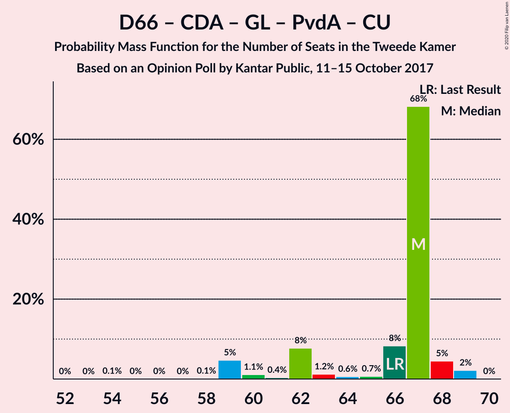

| Number of Seats | Probability | Accumulated | Special Marks |
|:---------------:|:-----------:|:-----------:|:-------------:|
| 54 | 0.1% | 100% |  |
| 55 | 0% | 99.9% |  |
| 56 | 0% | 99.9% |  |
| 57 | 0% | 99.8% |  |
| 58 | 0.1% | 99.8% |  |
| 59 | 5% | 99.7% |  |
| 60 | 1.1% | 95% |  |
| 61 | 0.4% | 94% |  |
| 62 | 8% | 93% |  |
| 63 | 1.2% | 86% |  |
| 64 | 0.6% | 85% |  |
| 65 | 0.7% | 84% |  |
| 66 | 8% | 83% | Last Result, Median |
| 67 | 68% | 75% |  |
| 68 | 5% | 7% |  |
| 69 | 2% | 2% |  |
| 70 | 0% | 0% |  |

### Volkspartij voor Vrijheid en Democratie – Democraten 66 – Christen-Democratisch Appèl

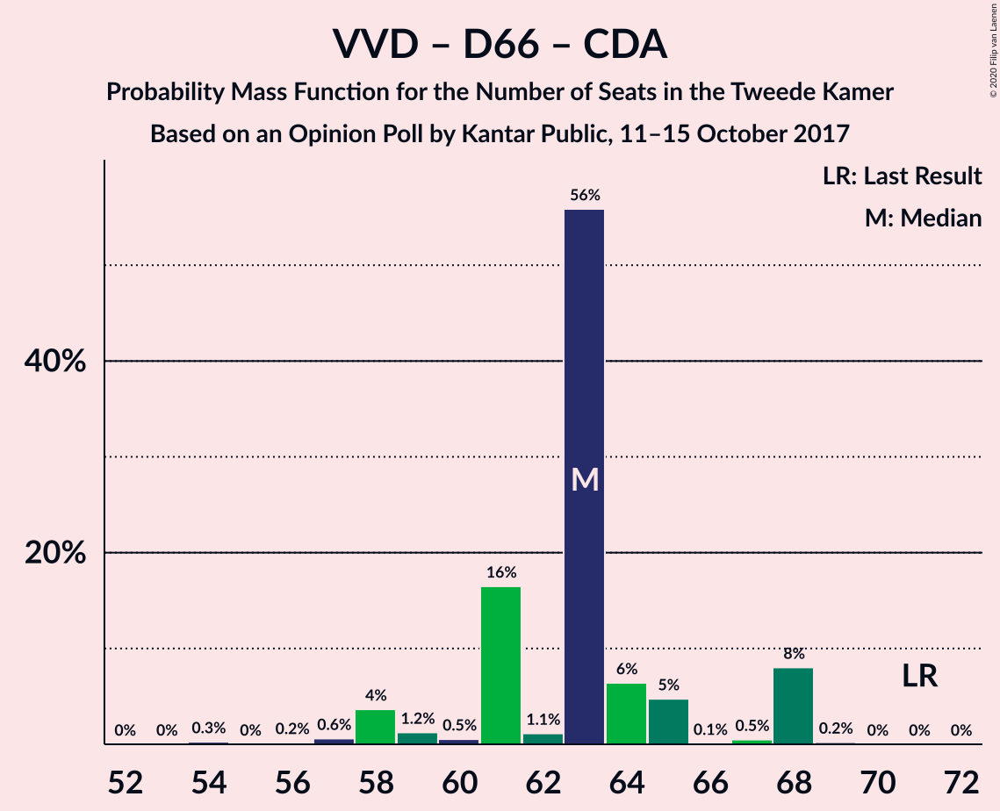

| Number of Seats | Probability | Accumulated | Special Marks |
|:---------------:|:-----------:|:-----------:|:-------------:|
| 54 | 0.3% | 100% |  |
| 55 | 0% | 99.7% |  |
| 56 | 0.2% | 99.7% |  |
| 57 | 0.6% | 99.5% |  |
| 58 | 4% | 98.9% |  |
| 59 | 1.2% | 95% |  |
| 60 | 0.5% | 94% |  |
| 61 | 16% | 94% |  |
| 62 | 1.1% | 77% |  |
| 63 | 56% | 76% | Median |
| 64 | 6% | 20% |  |
| 65 | 5% | 14% |  |
| 66 | 0.1% | 9% |  |
| 67 | 0.5% | 9% |  |
| 68 | 8% | 8% |  |
| 69 | 0.2% | 0.2% |  |
| 70 | 0% | 0% |  |
| 71 | 0% | 0% | Last Result |

### Volkspartij voor Vrijheid en Democratie – Christen-Democratisch Appèl – Forum voor Democratie – 50Plus – Staatkundig Gereformeerde Partij

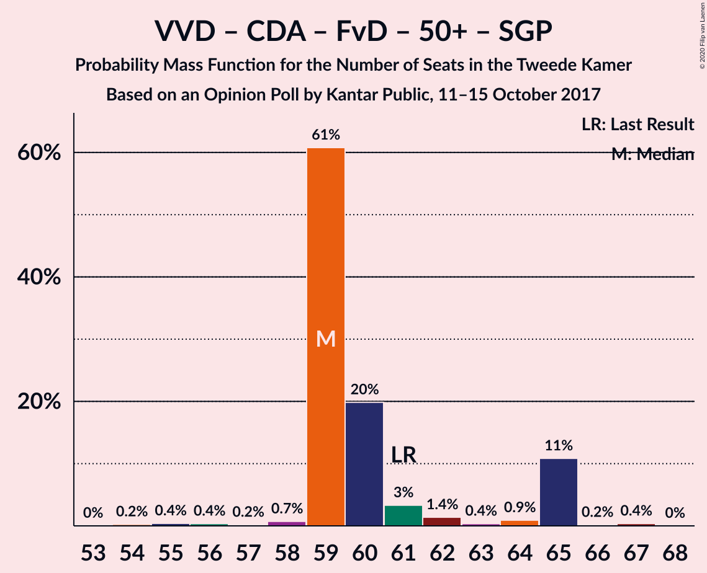

| Number of Seats | Probability | Accumulated | Special Marks |
|:---------------:|:-----------:|:-----------:|:-------------:|
| 54 | 0.2% | 100% |  |
| 55 | 0.4% | 99.7% |  |
| 56 | 0.4% | 99.3% |  |
| 57 | 0.2% | 98.9% |  |
| 58 | 0.7% | 98.8% |  |
| 59 | 61% | 98% | Median |
| 60 | 20% | 37% |  |
| 61 | 3% | 17% | Last Result |
| 62 | 1.4% | 14% |  |
| 63 | 0.4% | 13% |  |
| 64 | 0.9% | 12% |  |
| 65 | 11% | 11% |  |
| 66 | 0.2% | 0.6% |  |
| 67 | 0.4% | 0.4% |  |
| 68 | 0% | 0% |  |

### Volkspartij voor Vrijheid en Democratie – Christen-Democratisch Appèl – Forum voor Democratie – 50Plus

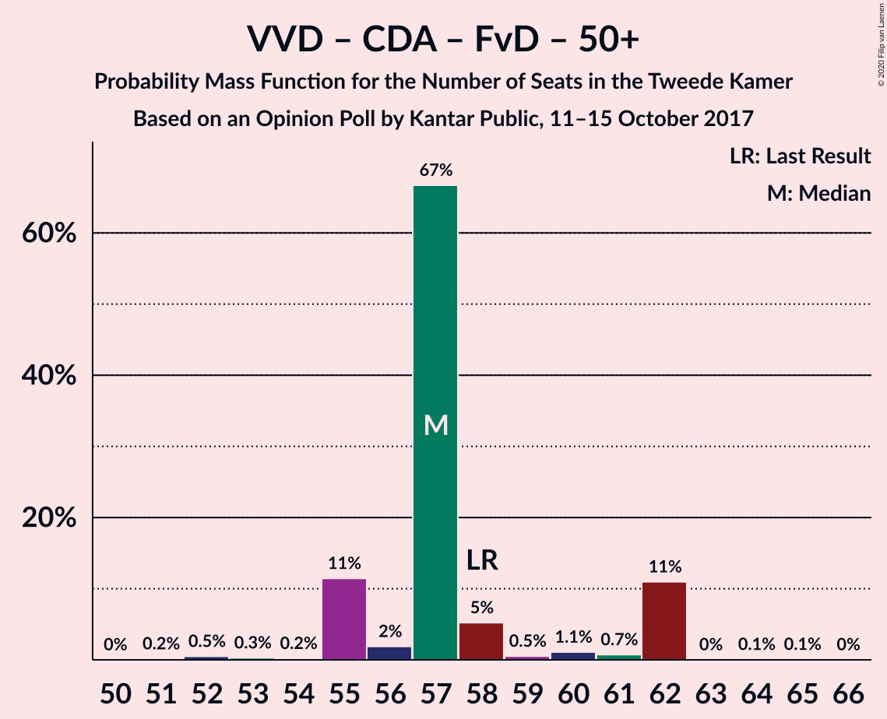

| Number of Seats | Probability | Accumulated | Special Marks |
|:---------------:|:-----------:|:-----------:|:-------------:|
| 51 | 0.2% | 100% |  |
| 52 | 0.5% | 99.8% |  |
| 53 | 0.3% | 99.3% |  |
| 54 | 0.2% | 99.0% |  |
| 55 | 11% | 98.8% |  |
| 56 | 2% | 87% |  |
| 57 | 67% | 85% | Median |
| 58 | 5% | 19% | Last Result |
| 59 | 0.5% | 14% |  |
| 60 | 1.1% | 13% |  |
| 61 | 0.7% | 12% |  |
| 62 | 11% | 11% |  |
| 63 | 0% | 0.2% |  |
| 64 | 0.1% | 0.2% |  |
| 65 | 0.1% | 0.1% |  |
| 66 | 0% | 0% |  |

### Volkspartij voor Vrijheid en Democratie – Democraten 66 – Partij van de Arbeid

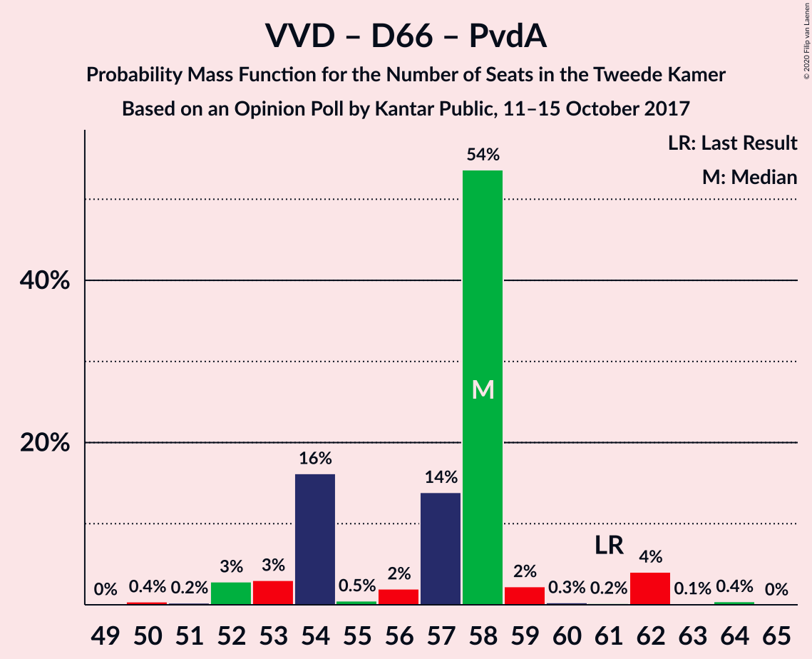

| Number of Seats | Probability | Accumulated | Special Marks |
|:---------------:|:-----------:|:-----------:|:-------------:|
| 50 | 0.4% | 100% |  |
| 51 | 0.2% | 99.6% |  |
| 52 | 3% | 99.3% |  |
| 53 | 3% | 96% |  |
| 54 | 16% | 93% |  |
| 55 | 0.5% | 77% |  |
| 56 | 2% | 77% |  |
| 57 | 14% | 75% |  |
| 58 | 54% | 61% | Median |
| 59 | 2% | 7% |  |
| 60 | 0.3% | 5% |  |
| 61 | 0.2% | 5% | Last Result |
| 62 | 4% | 5% |  |
| 63 | 0.1% | 0.5% |  |
| 64 | 0.4% | 0.4% |  |
| 65 | 0% | 0% |  |

### Volkspartij voor Vrijheid en Democratie – Christen-Democratisch Appèl – Forum voor Democratie – Staatkundig Gereformeerde Partij

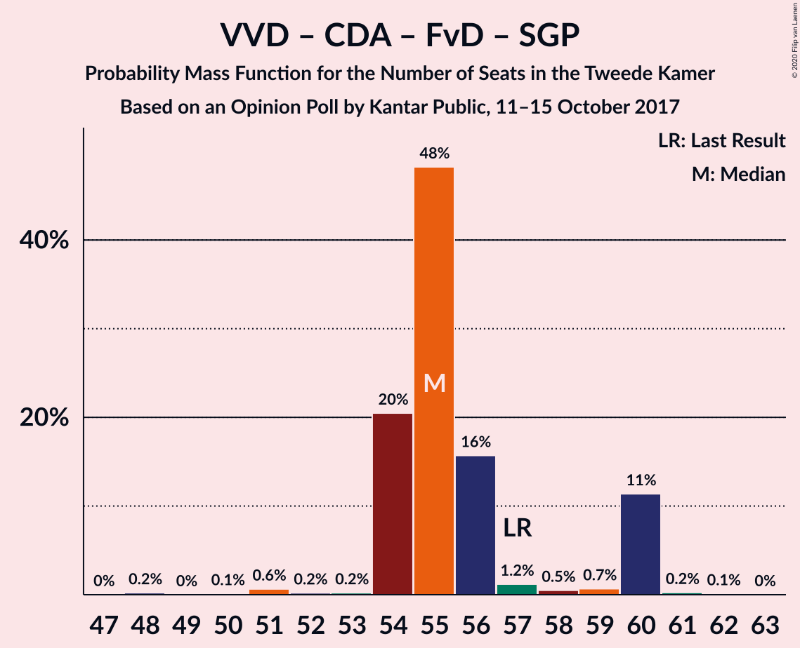

| Number of Seats | Probability | Accumulated | Special Marks |
|:---------------:|:-----------:|:-----------:|:-------------:|
| 48 | 0.2% | 100% |  |
| 49 | 0% | 99.8% |  |
| 50 | 0.1% | 99.8% |  |
| 51 | 0.6% | 99.6% |  |
| 52 | 0.2% | 99.0% |  |
| 53 | 0.2% | 98.8% |  |
| 54 | 20% | 98.6% |  |
| 55 | 48% | 78% | Median |
| 56 | 16% | 30% |  |
| 57 | 1.2% | 14% | Last Result |
| 58 | 0.5% | 13% |  |
| 59 | 0.7% | 12% |  |
| 60 | 11% | 12% |  |
| 61 | 0.2% | 0.4% |  |
| 62 | 0.1% | 0.2% |  |
| 63 | 0% | 0% |  |

### Volkspartij voor Vrijheid en Democratie – Christen-Democratisch Appèl – Partij van de Arbeid

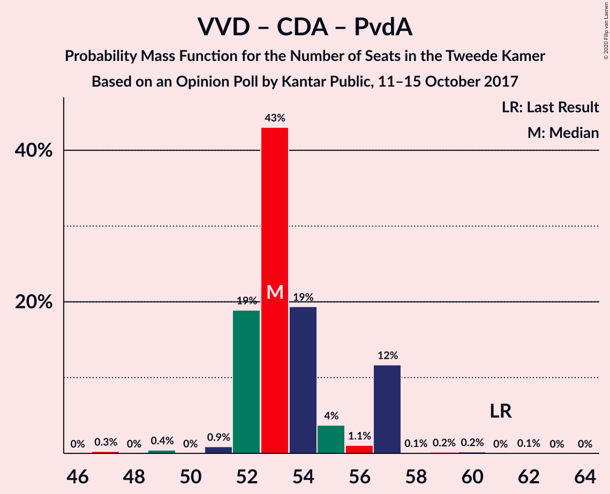

| Number of Seats | Probability | Accumulated | Special Marks |
|:---------------:|:-----------:|:-----------:|:-------------:|
| 47 | 0.3% | 100% |  |
| 48 | 0% | 99.7% |  |
| 49 | 0.4% | 99.7% |  |
| 50 | 0% | 99.3% |  |
| 51 | 0.9% | 99.3% |  |
| 52 | 19% | 98% |  |
| 53 | 43% | 79% | Median |
| 54 | 19% | 36% |  |
| 55 | 4% | 17% |  |
| 56 | 1.1% | 13% |  |
| 57 | 12% | 12% |  |
| 58 | 0.1% | 0.6% |  |
| 59 | 0.2% | 0.5% |  |
| 60 | 0.2% | 0.3% |  |
| 61 | 0% | 0.1% | Last Result |
| 62 | 0.1% | 0.1% |  |
| 63 | 0% | 0% |  |

### Volkspartij voor Vrijheid en Democratie – Christen-Democratisch Appèl – Forum voor Democratie

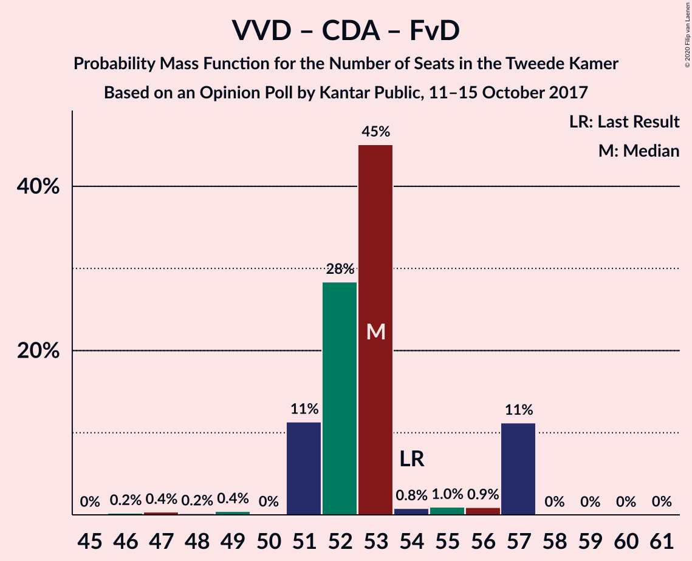

| Number of Seats | Probability | Accumulated | Special Marks |
|:---------------:|:-----------:|:-----------:|:-------------:|
| 46 | 0.2% | 100% |  |
| 47 | 0.4% | 99.8% |  |
| 48 | 0.2% | 99.4% |  |
| 49 | 0.4% | 99.2% |  |
| 50 | 0% | 98.8% |  |
| 51 | 11% | 98.7% |  |
| 52 | 28% | 87% |  |
| 53 | 45% | 59% | Median |
| 54 | 0.8% | 14% | Last Result |
| 55 | 1.0% | 13% |  |
| 56 | 0.9% | 12% |  |
| 57 | 11% | 11% |  |
| 58 | 0% | 0.1% |  |
| 59 | 0% | 0.1% |  |
| 60 | 0% | 0.1% |  |
| 61 | 0% | 0% |  |

### Volkspartij voor Vrijheid en Democratie – Christen-Democratisch Appèl

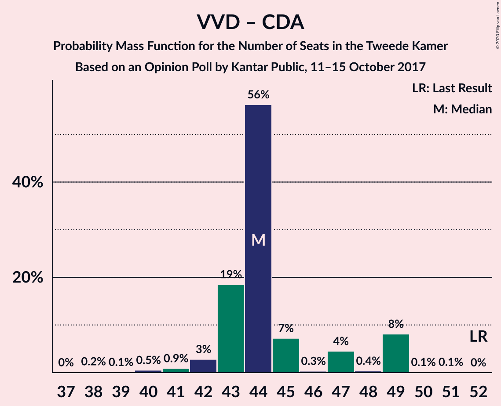

| Number of Seats | Probability | Accumulated | Special Marks |
|:---------------:|:-----------:|:-----------:|:-------------:|
| 38 | 0.2% | 100% |  |
| 39 | 0.1% | 99.8% |  |
| 40 | 0.5% | 99.7% |  |
| 41 | 0.9% | 99.1% |  |
| 42 | 3% | 98% |  |
| 43 | 19% | 95% |  |
| 44 | 56% | 77% | Median |
| 45 | 7% | 21% |  |
| 46 | 0.3% | 13% |  |
| 47 | 4% | 13% |  |
| 48 | 0.4% | 9% |  |
| 49 | 8% | 8% |  |
| 50 | 0.1% | 0.2% |  |
| 51 | 0.1% | 0.1% |  |
| 52 | 0% | 0% | Last Result |

### Democraten 66 – Christen-Democratisch Appèl – Partij van de Arbeid

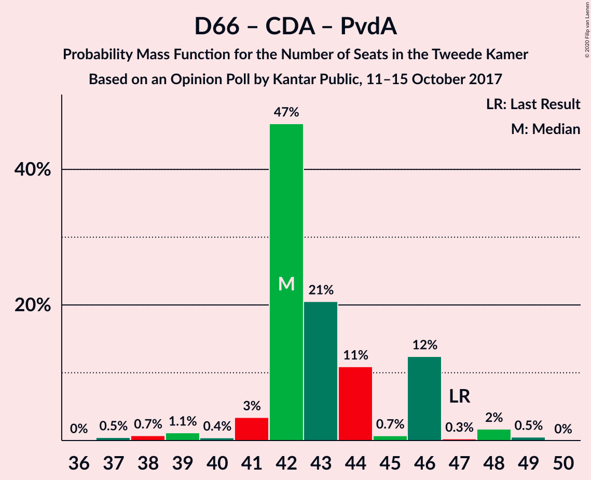

| Number of Seats | Probability | Accumulated | Special Marks |
|:---------------:|:-----------:|:-----------:|:-------------:|
| 36 | 0% | 100% |  |
| 37 | 0.5% | 99.9% |  |
| 38 | 0.7% | 99.5% |  |
| 39 | 1.1% | 98.7% |  |
| 40 | 0.4% | 98% |  |
| 41 | 3% | 97% |  |
| 42 | 47% | 94% | Median |
| 43 | 21% | 47% |  |
| 44 | 11% | 26% |  |
| 45 | 0.7% | 16% |  |
| 46 | 12% | 15% |  |
| 47 | 0.3% | 2% | Last Result |
| 48 | 2% | 2% |  |
| 49 | 0.5% | 0.5% |  |
| 50 | 0% | 0% |  |

### Volkspartij voor Vrijheid en Democratie – Partij van de Arbeid

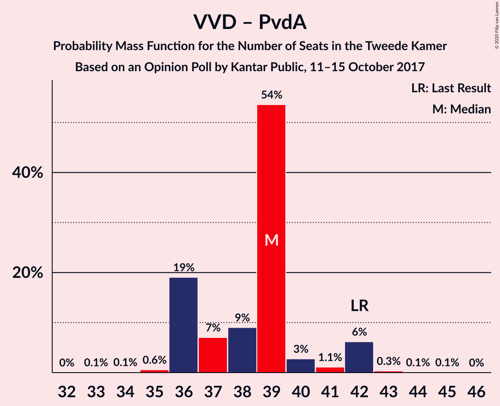

| Number of Seats | Probability | Accumulated | Special Marks |
|:---------------:|:-----------:|:-----------:|:-------------:|
| 33 | 0.1% | 100% |  |
| 34 | 0.1% | 99.9% |  |
| 35 | 0.6% | 99.8% |  |
| 36 | 19% | 99.2% |  |
| 37 | 7% | 80% |  |
| 38 | 9% | 73% |  |
| 39 | 54% | 64% | Median |
| 40 | 3% | 11% |  |
| 41 | 1.1% | 8% |  |
| 42 | 6% | 7% | Last Result |
| 43 | 0.3% | 0.5% |  |
| 44 | 0.1% | 0.2% |  |
| 45 | 0.1% | 0.1% |  |
| 46 | 0% | 0% |  |

### Democraten 66 – Christen-Democratisch Appèl

| Number of Seats | Probability | Accumulated | Special Marks |
|:---------------:|:-----------:|:-----------:|:-------------:|
| 27 | 0.3% | 100% |  |
| 28 | 0.9% | 99.7% |  |
| 29 | 0.7% | 98.8% |  |
| 30 | 1.2% | 98% |  |
| 31 | 4% | 97% |  |
| 32 | 6% | 93% |  |
| 33 | 43% | 88% | Median |
| 34 | 26% | 45% |  |
| 35 | 3% | 18% |  |
| 36 | 2% | 15% |  |
| 37 | 5% | 13% |  |
| 38 | 8% | 8% | Last Result |
| 39 | 0% | 0% |  |

### Christen-Democratisch Appèl – Partij van de Arbeid – ChristenUnie

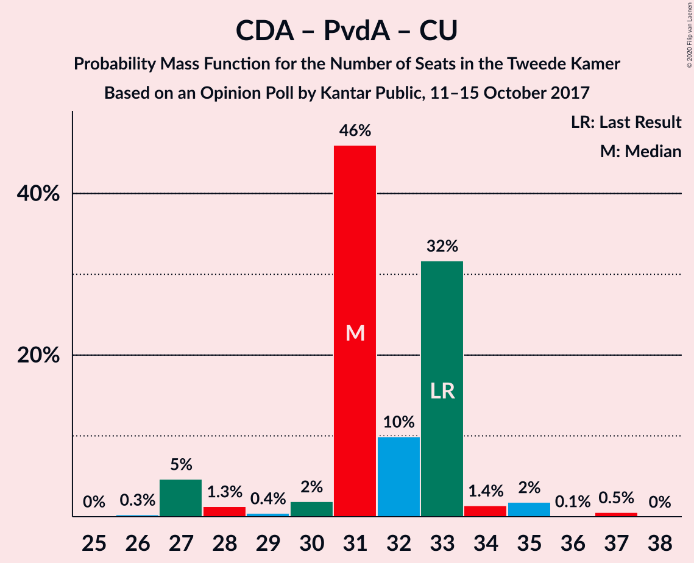

| Number of Seats | Probability | Accumulated | Special Marks |
|:---------------:|:-----------:|:-----------:|:-------------:|
| 26 | 0.3% | 100% |  |
| 27 | 5% | 99.7% |  |
| 28 | 1.3% | 95% |  |
| 29 | 0.4% | 94% |  |
| 30 | 2% | 93% |  |
| 31 | 46% | 91% | Median |
| 32 | 10% | 45% |  |
| 33 | 32% | 36% | Last Result |
| 34 | 1.4% | 4% |  |
| 35 | 2% | 2% |  |
| 36 | 0.1% | 0.6% |  |
| 37 | 0.5% | 0.6% |  |
| 38 | 0% | 0% |  |

### Christen-Democratisch Appèl – Partij van de Arbeid

| Number of Seats | Probability | Accumulated | Special Marks |
|:---------------:|:-----------:|:-----------:|:-------------:|
| 20 | 0% | 100% |  |
| 21 | 1.1% | 99.9% |  |
| 22 | 5% | 98.9% |  |
| 23 | 42% | 94% | Median |
| 24 | 2% | 52% |  |
| 25 | 29% | 50% |  |
| 26 | 6% | 21% |  |
| 27 | 12% | 15% |  |
| 28 | 0.3% | 3% | Last Result |
| 29 | 2% | 2% |  |
| 30 | 0.2% | 0.7% |  |
| 31 | 0.5% | 0.5% |  |
| 32 | 0% | 0% |  |

## Technical Information

### Opinion Poll

+ **Polling firm:** Kantar Public
+ **Commissioner(s):** —
+ **Fieldwork period:** 11–15 October 2017

### Calculations

+ **Sample size:** 986
+ **Simulations done:** 1,048,576
+ **Error estimate:** 1.74%

