# Opinion Poll by Ipsos, 2 November 2017

<a href="#voting-intentions">Voting Intentions</a> | <a href="#seats">Seats</a> | <a href="#coalitions">Coalitions</a> | <a href="#technical-information">Technical Information</a>

## Voting Intentions

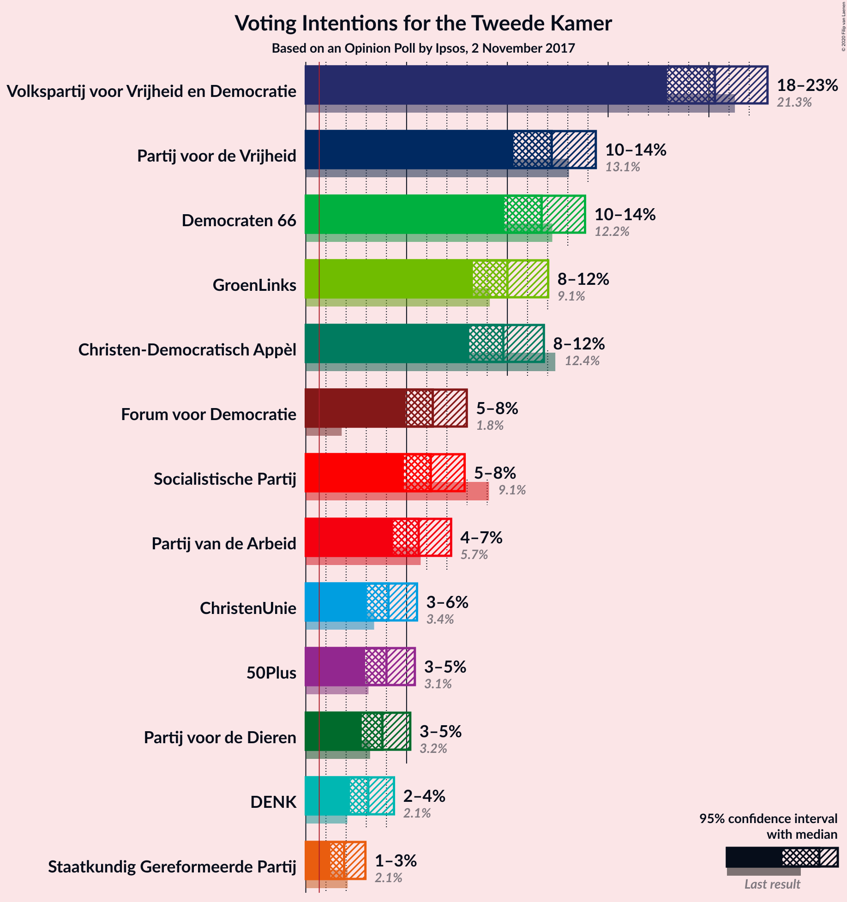

### Confidence Intervals

| Party | Last Result | Poll Result | 80% Confidence Interval | 90% Confidence Interval | 95% Confidence Interval | 99% Confidence Interval |
|:-----:|:-----------:|:-----------:|:-----------------------:|:-----------------------:|:-----------------------:|:-----------------------:|
| Volkspartij voor Vrijheid en Democratie | 21.3% | 20.3% | 18.7–22.0% |18.3–22.5% |17.9–22.9% |17.2–23.7% |
| Partij voor de Vrijheid | 13.1% | 12.2% | 11.0–13.6% |10.6–14.0% |10.3–14.4% |9.7–15.1% |
| Democraten 66 | 12.2% | 11.7% | 10.5–13.1% |10.1–13.5% |9.8–13.9% |9.3–14.5% |
| GroenLinks | 9.1% | 10.0% | 8.9–11.3% |8.6–11.7% |8.3–12.0% |7.8–12.7% |
| Christen-Democratisch Appèl | 12.4% | 9.8% | 8.7–11.1% |8.4–11.5% |8.1–11.8% |7.6–12.5% |
| Forum voor Democratie | 1.8% | 6.3% | 5.4–7.4% |5.2–7.7% |5.0–8.0% |4.6–8.6% |
| Socialistische Partij | 9.1% | 6.2% | 5.3–7.3% |5.1–7.6% |4.9–7.9% |4.5–8.4% |
| Partij van de Arbeid | 5.7% | 5.6% | 4.8–6.6% |4.5–7.0% |4.3–7.2% |4.0–7.7% |
| ChristenUnie | 3.4% | 4.1% | 3.4–5.0% |3.2–5.3% |3.0–5.5% |2.7–6.0% |
| 50Plus | 3.1% | 4.0% | 3.3–4.9% |3.1–5.2% |2.9–5.4% |2.7–5.9% |
| Partij voor de Dieren | 3.2% | 3.8% | 3.1–4.7% |2.9–5.0% |2.8–5.2% |2.5–5.6% |
| DENK | 2.1% | 3.1% | 2.5–3.9% |2.3–4.2% |2.2–4.4% |1.9–4.8% |
| Staatkundig Gereformeerde Partij | 2.1% | 1.9% | 1.4–2.6% |1.3–2.8% |1.2–3.0% |1.0–3.3% |

*Note:* The poll result column reflects the actual value used in the calculations. Published results may vary slightly, and in addition be rounded to fewer digits.

## Seats

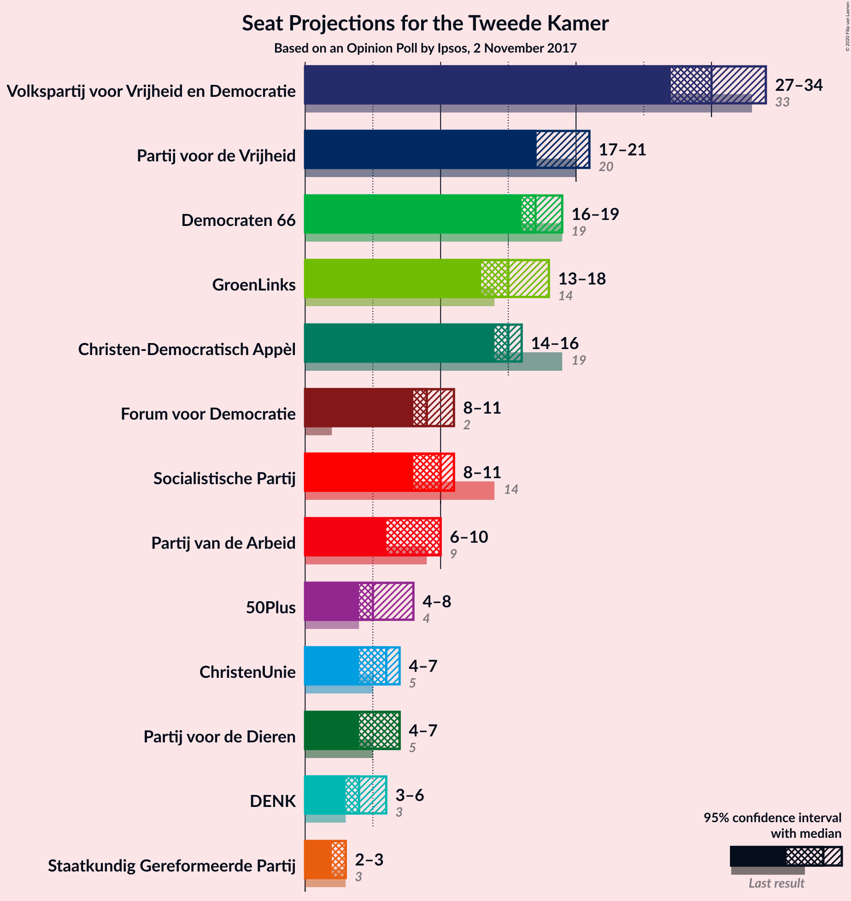

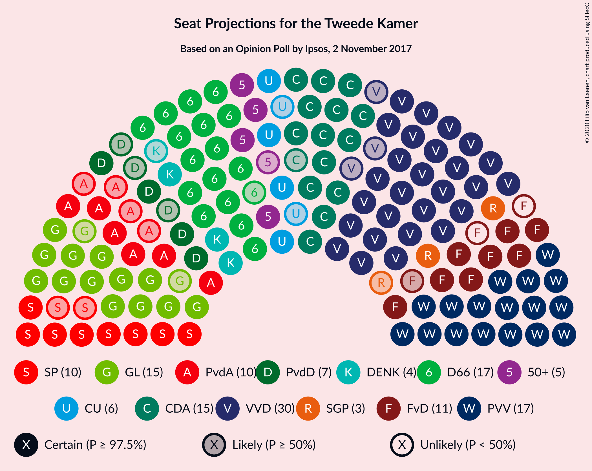

### Confidence Intervals

| Party | Last Result | Median | 80% Confidence Interval | 90% Confidence Interval | 95% Confidence Interval | 99% Confidence Interval |
|:-----:|:-----------:|:------:|:-----------------------:|:-----------------------:|:-----------------------:|:-----------------------:|
| <a href="#volkspartij-voor-vrijheid-en-democratie">Volkspartij voor Vrijheid en Democratie</a> | 33 | 30 | 30–31 |29–33 |27–34 |26–36 |
| <a href="#partij-voor-de-vrijheid">Partij voor de Vrijheid</a> | 20 | 17 | 17–21 |17–21 |17–21 |15–22 |
| <a href="#democraten-66">Democraten 66</a> | 19 | 17 | 17 |16–18 |16–19 |14–21 |
| <a href="#groenlinks">GroenLinks</a> | 14 | 15 | 13–15 |13–16 |13–18 |12–19 |
| <a href="#christen-democratisch-appèl">Christen-Democratisch Appèl</a> | 19 | 15 | 14–15 |14–16 |14–16 |12–18 |
| <a href="#forum-voor-democratie">Forum voor Democratie</a> | 2 | 9 | 9–11 |9–11 |8–11 |7–12 |
| <a href="#socialistische-partij">Socialistische Partij</a> | 14 | 10 | 9–10 |9–10 |8–11 |6–12 |
| <a href="#partij-van-de-arbeid">Partij van de Arbeid</a> | 9 | 10 | 8–10 |8–10 |6–10 |6–11 |
| <a href="#christenunie">ChristenUnie</a> | 5 | 6 | 6 |5–6 |4–7 |4–9 |
| <a href="#50plus">50Plus</a> | 4 | 5 | 4–6 |4–7 |4–8 |4–9 |
| <a href="#partij-voor-de-dieren">Partij voor de Dieren</a> | 5 | 7 | 5–7 |5–7 |4–7 |4–8 |
| <a href="#denk">DENK</a> | 3 | 4 | 4–6 |4–6 |3–6 |3–7 |
| <a href="#staatkundig-gereformeerde-partij">Staatkundig Gereformeerde Partij</a> | 3 | 3 | 2–3 |2–3 |2–3 |2–4 |

### Volkspartij voor Vrijheid en Democratie

*For a full overview of the results for this party, see the [Volkspartij voor Vrijheid en Democratie](party-volkspartijvoorvrijheidendemocratie.html) page.*

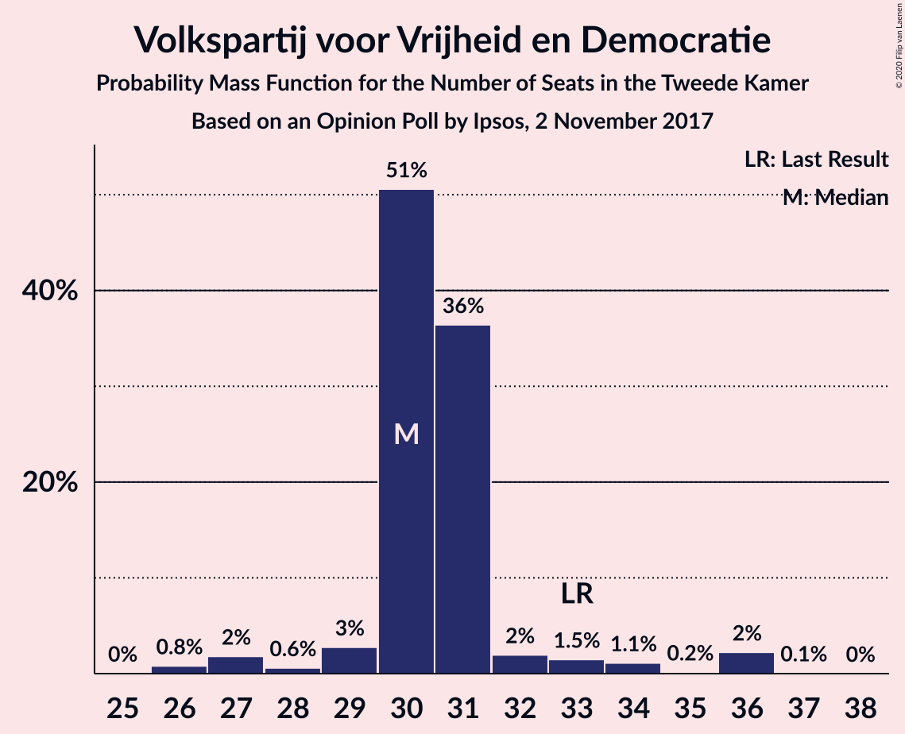

| Number of Seats | Probability | Accumulated | Special Marks |
|:---------------:|:-----------:|:-----------:|:-------------:|
| 26 | 0.8% | 100% |  |
| 27 | 2% | 99.2% |  |
| 28 | 0.6% | 97% |  |
| 29 | 3% | 97% |  |
| 30 | 51% | 94% | Median |
| 31 | 36% | 43% |  |
| 32 | 2% | 7% |  |
| 33 | 1.5% | 5% | Last Result |
| 34 | 1.1% | 4% |  |
| 35 | 0.2% | 2% |  |
| 36 | 2% | 2% |  |
| 37 | 0.1% | 0.1% |  |
| 38 | 0% | 0% |  |

### Partij voor de Vrijheid

*For a full overview of the results for this party, see the [Partij voor de Vrijheid](party-partijvoordevrijheid.html) page.*

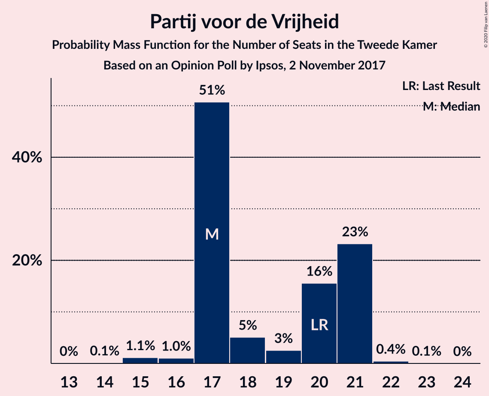

| Number of Seats | Probability | Accumulated | Special Marks |
|:---------------:|:-----------:|:-----------:|:-------------:|
| 14 | 0.1% | 100% |  |
| 15 | 1.1% | 99.8% |  |
| 16 | 1.0% | 98.7% |  |
| 17 | 51% | 98% | Median |
| 18 | 5% | 47% |  |
| 19 | 3% | 42% |  |
| 20 | 16% | 39% | Last Result |
| 21 | 23% | 24% |  |
| 22 | 0.4% | 0.5% |  |
| 23 | 0.1% | 0.1% |  |
| 24 | 0% | 0% |  |

### Democraten 66

*For a full overview of the results for this party, see the [Democraten 66](party-democraten66.html) page.*

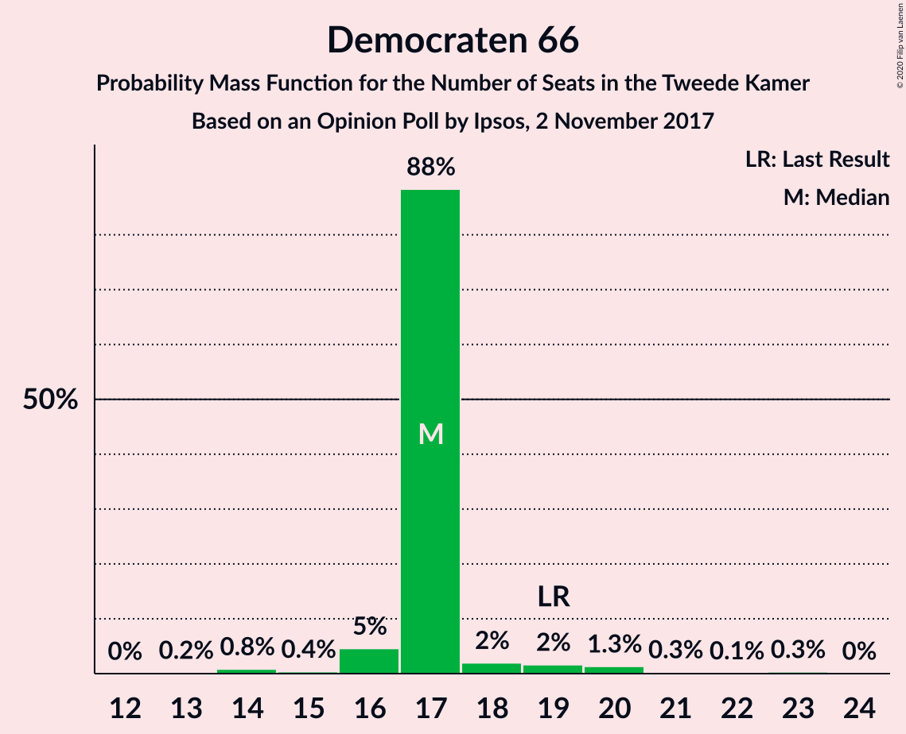

| Number of Seats | Probability | Accumulated | Special Marks |
|:---------------:|:-----------:|:-----------:|:-------------:|
| 13 | 0.2% | 100% |  |
| 14 | 0.8% | 99.8% |  |
| 15 | 0.4% | 99.0% |  |
| 16 | 5% | 98.6% |  |
| 17 | 88% | 94% | Median |
| 18 | 2% | 6% |  |
| 19 | 2% | 4% | Last Result |
| 20 | 1.3% | 2% |  |
| 21 | 0.3% | 0.7% |  |
| 22 | 0.1% | 0.4% |  |
| 23 | 0.3% | 0.4% |  |
| 24 | 0% | 0% |  |

### GroenLinks

*For a full overview of the results for this party, see the [GroenLinks](party-groenlinks.html) page.*

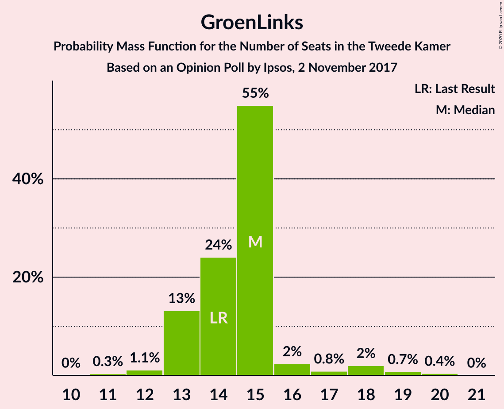

| Number of Seats | Probability | Accumulated | Special Marks |
|:---------------:|:-----------:|:-----------:|:-------------:|
| 11 | 0.3% | 100% |  |
| 12 | 1.1% | 99.7% |  |
| 13 | 13% | 98.6% |  |
| 14 | 24% | 85% | Last Result |
| 15 | 55% | 61% | Median |
| 16 | 2% | 6% |  |
| 17 | 0.8% | 4% |  |
| 18 | 2% | 3% |  |
| 19 | 0.7% | 1.2% |  |
| 20 | 0.4% | 0.4% |  |
| 21 | 0% | 0% |  |

### Christen-Democratisch Appèl

*For a full overview of the results for this party, see the [Christen-Democratisch Appèl](party-christen-democratischappèl.html) page.*

| Number of Seats | Probability | Accumulated | Special Marks |
|:---------------:|:-----------:|:-----------:|:-------------:|
| 11 | 0.3% | 100% |  |
| 12 | 0.5% | 99.7% |  |
| 13 | 2% | 99.2% |  |
| 14 | 15% | 98% |  |
| 15 | 77% | 83% | Median |
| 16 | 4% | 6% |  |
| 17 | 1.4% | 2% |  |
| 18 | 0.6% | 1.0% |  |
| 19 | 0.2% | 0.3% | Last Result |
| 20 | 0.1% | 0.1% |  |
| 21 | 0% | 0% |  |

### Forum voor Democratie

*For a full overview of the results for this party, see the [Forum voor Democratie](party-forumvoordemocratie.html) page.*

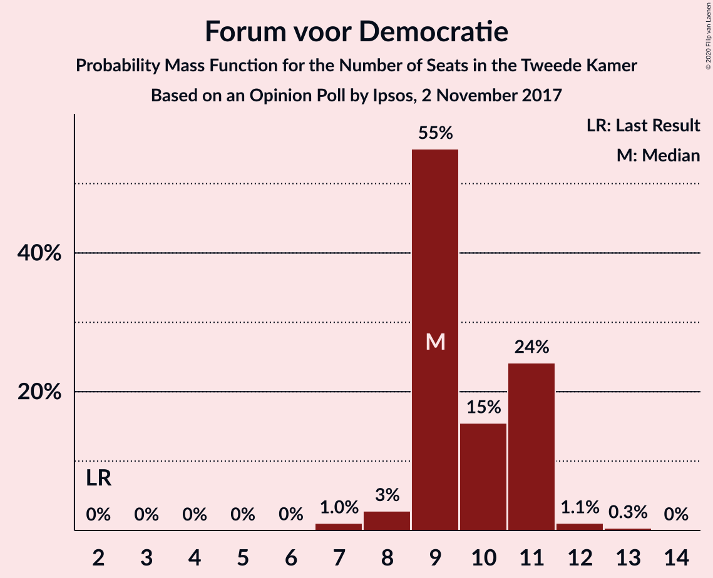

| Number of Seats | Probability | Accumulated | Special Marks |
|:---------------:|:-----------:|:-----------:|:-------------:|
| 2 | 0% | 100% | Last Result |
| 3 | 0% | 100% |  |
| 4 | 0% | 100% |  |
| 5 | 0% | 100% |  |
| 6 | 0% | 100% |  |
| 7 | 1.0% | 99.9% |  |
| 8 | 3% | 98.9% |  |
| 9 | 55% | 96% | Median |
| 10 | 15% | 41% |  |
| 11 | 24% | 26% |  |
| 12 | 1.1% | 1.4% |  |
| 13 | 0.3% | 0.4% |  |
| 14 | 0% | 0% |  |

### Socialistische Partij

*For a full overview of the results for this party, see the [Socialistische Partij](party-socialistischepartij.html) page.*

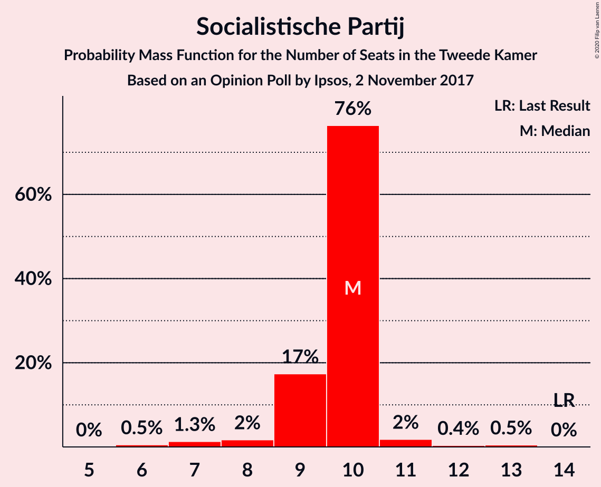

| Number of Seats | Probability | Accumulated | Special Marks |
|:---------------:|:-----------:|:-----------:|:-------------:|
| 6 | 0.5% | 100% |  |
| 7 | 1.3% | 99.5% |  |
| 8 | 2% | 98% |  |
| 9 | 17% | 96% |  |
| 10 | 76% | 79% | Median |
| 11 | 2% | 3% |  |
| 12 | 0.4% | 0.9% |  |
| 13 | 0.5% | 0.5% |  |
| 14 | 0% | 0% | Last Result |

### Partij van de Arbeid

*For a full overview of the results for this party, see the [Partij van de Arbeid](party-partijvandearbeid.html) page.*

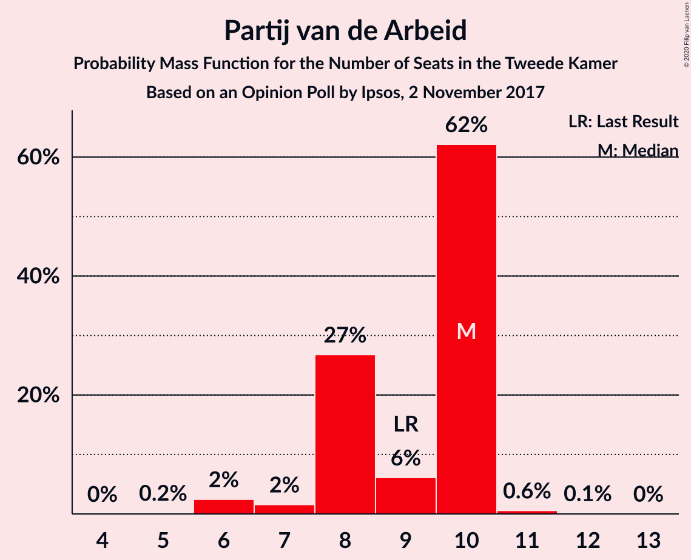

| Number of Seats | Probability | Accumulated | Special Marks |
|:---------------:|:-----------:|:-----------:|:-------------:|
| 5 | 0.2% | 100% |  |
| 6 | 2% | 99.8% |  |
| 7 | 2% | 97% |  |
| 8 | 27% | 96% |  |
| 9 | 6% | 69% | Last Result |
| 10 | 62% | 63% | Median |
| 11 | 0.6% | 0.7% |  |
| 12 | 0.1% | 0.2% |  |
| 13 | 0% | 0% |  |

### ChristenUnie

*For a full overview of the results for this party, see the [ChristenUnie](party-christenunie.html) page.*

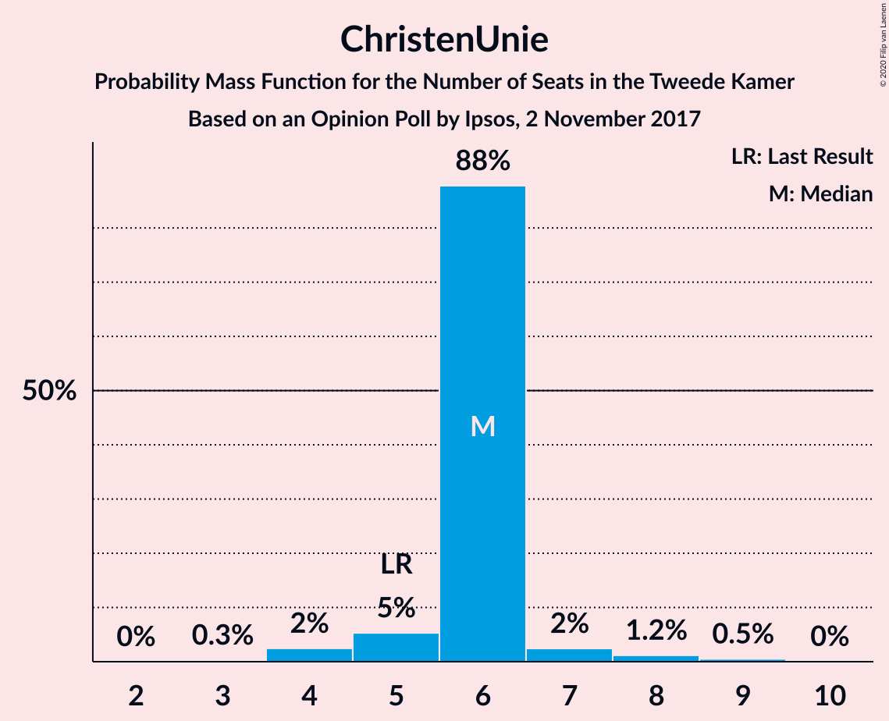

| Number of Seats | Probability | Accumulated | Special Marks |
|:---------------:|:-----------:|:-----------:|:-------------:|
| 3 | 0.3% | 100% |  |
| 4 | 2% | 99.7% |  |
| 5 | 5% | 97% | Last Result |
| 6 | 88% | 92% | Median |
| 7 | 2% | 4% |  |
| 8 | 1.2% | 2% |  |
| 9 | 0.5% | 0.5% |  |
| 10 | 0% | 0% |  |

### 50Plus

*For a full overview of the results for this party, see the [50Plus](party-50plus.html) page.*

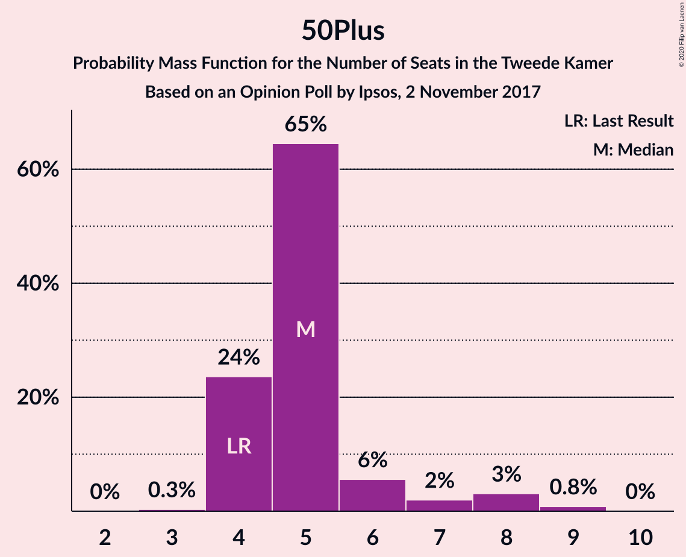

| Number of Seats | Probability | Accumulated | Special Marks |
|:---------------:|:-----------:|:-----------:|:-------------:|
| 3 | 0.3% | 100% |  |
| 4 | 24% | 99.7% | Last Result |
| 5 | 65% | 76% | Median |
| 6 | 6% | 12% |  |
| 7 | 2% | 6% |  |
| 8 | 3% | 4% |  |
| 9 | 0.8% | 0.9% |  |
| 10 | 0% | 0% |  |

### Partij voor de Dieren

*For a full overview of the results for this party, see the [Partij voor de Dieren](party-partijvoordedieren.html) page.*

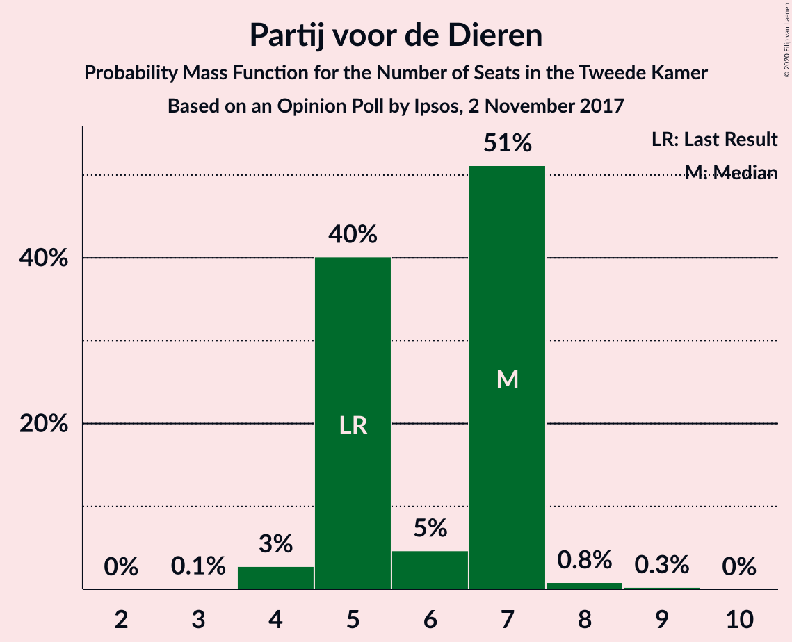

| Number of Seats | Probability | Accumulated | Special Marks |
|:---------------:|:-----------:|:-----------:|:-------------:|
| 3 | 0.1% | 100% |  |
| 4 | 3% | 99.9% |  |
| 5 | 40% | 97% | Last Result |
| 6 | 5% | 57% |  |
| 7 | 51% | 52% | Median |
| 8 | 0.8% | 1.1% |  |
| 9 | 0.3% | 0.3% |  |
| 10 | 0% | 0% |  |

### DENK

*For a full overview of the results for this party, see the [DENK](party-denk.html) page.*

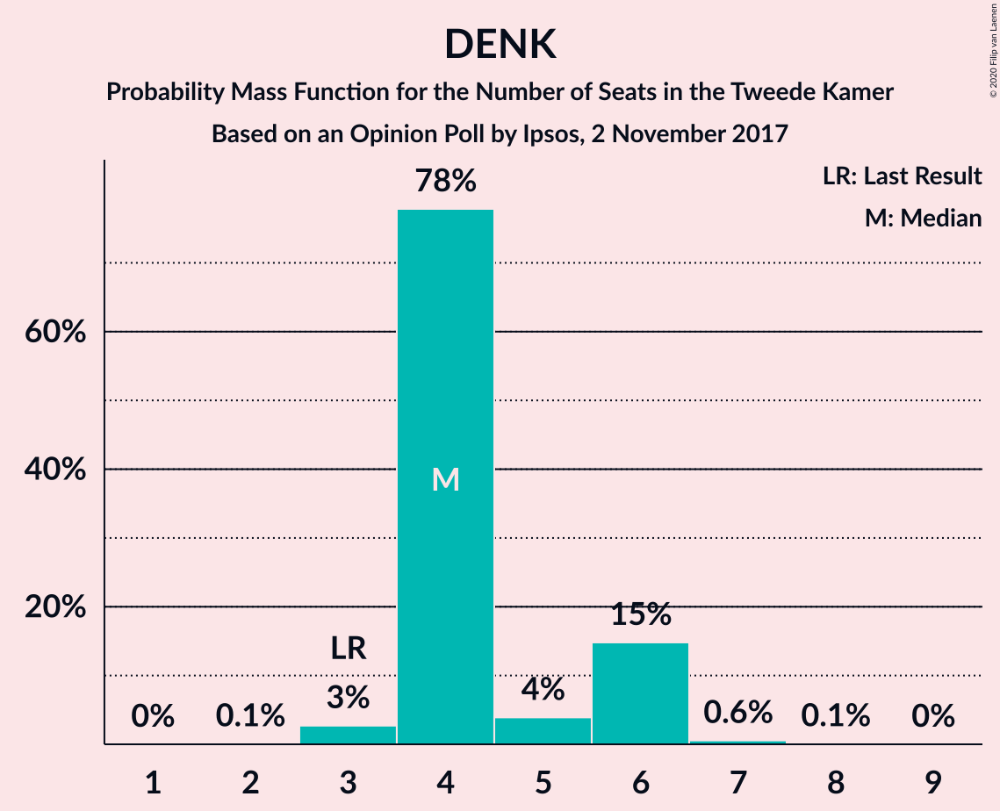

| Number of Seats | Probability | Accumulated | Special Marks |
|:---------------:|:-----------:|:-----------:|:-------------:|
| 2 | 0.1% | 100% |  |
| 3 | 3% | 99.9% | Last Result |
| 4 | 78% | 97% | Median |
| 5 | 4% | 19% |  |
| 6 | 15% | 15% |  |
| 7 | 0.6% | 0.6% |  |
| 8 | 0.1% | 0.1% |  |
| 9 | 0% | 0% |  |

### Staatkundig Gereformeerde Partij

*For a full overview of the results for this party, see the [Staatkundig Gereformeerde Partij](party-staatkundiggereformeerdepartij.html) page.*

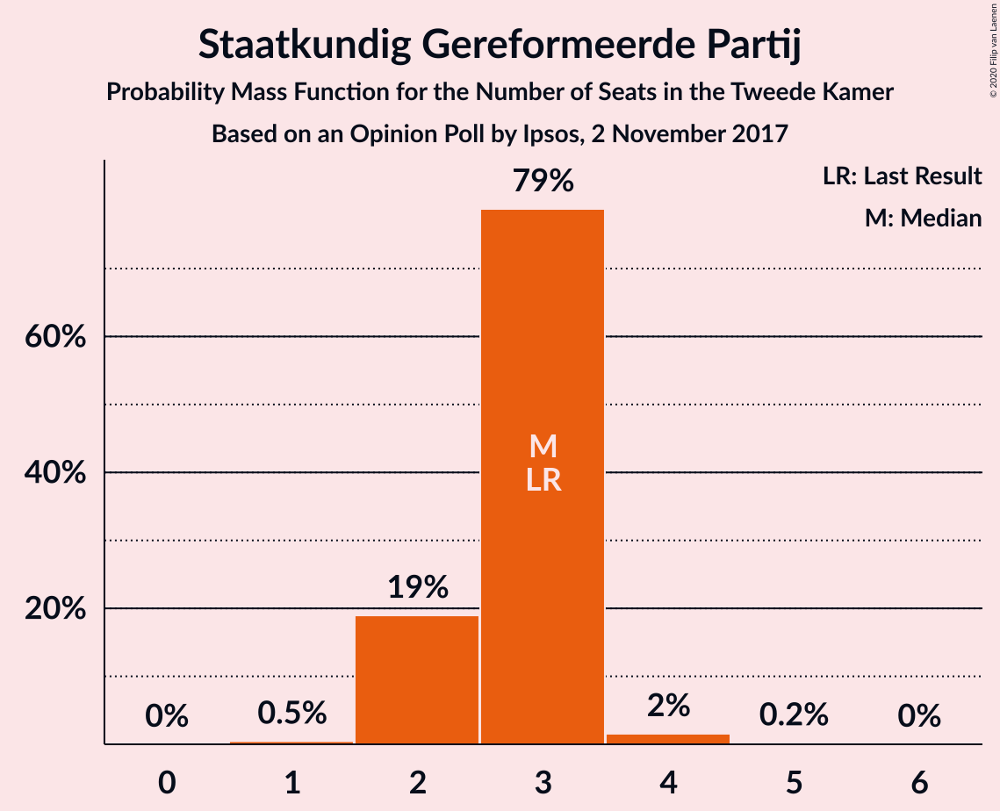

| Number of Seats | Probability | Accumulated | Special Marks |
|:---------------:|:-----------:|:-----------:|:-------------:|
| 1 | 0.5% | 100% |  |
| 2 | 19% | 99.5% |  |
| 3 | 79% | 81% | Last Result, Median |
| 4 | 2% | 2% |  |
| 5 | 0.2% | 0.2% |  |
| 6 | 0% | 0% |  |

## Coalitions

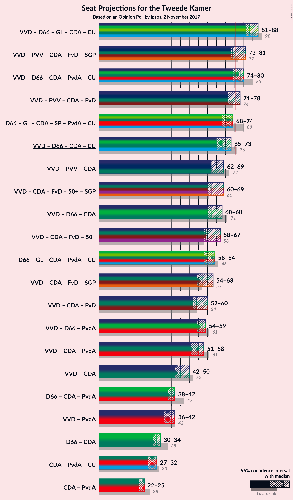

### Confidence Intervals

| Coalition | Last Result | Median | Majority? | 80% Confidence Interval | 90% Confidence Interval | 95% Confidence Interval | 99% Confidence Interval |
|:---------:|:-----------:|:------:|:---------:|:-----------------------:|:-----------------------:|:-----------------------:|:-----------------------:|
| Volkspartij voor Vrijheid en Democratie – Democraten 66 – GroenLinks – Christen-Democratisch Appèl – ChristenUnie | 90 | 83 | 100% | 81–84 | 81–87 | 81–88 | 79–89 |
| Volkspartij voor Vrijheid en Democratie – Partij voor de Vrijheid – Christen-Democratisch Appèl – Forum voor Democratie – Staatkundig Gereformeerde Partij | 77 | 74 | 44% | 74–81 | 74–81 | 73–81 | 72–82 |
| Volkspartij voor Vrijheid en Democratie – Democraten 66 – Christen-Democratisch Appèl – Partij van de Arbeid – ChristenUnie | 85 | 78 | 95% | 77–78 | 76–79 | 74–80 | 72–82 |
| Volkspartij voor Vrijheid en Democratie – Partij voor de Vrijheid – Christen-Democratisch Appèl – Forum voor Democratie | 74 | 71 | 28% | 71–78 | 71–78 | 71–78 | 69–79 |
| Democraten 66 – GroenLinks – Christen-Democratisch Appèl – Socialistische Partij – Partij van de Arbeid – ChristenUnie | 80 | 73 | 0.6% | 69–73 | 69–73 | 68–74 | 66–76 |
| Volkspartij voor Vrijheid en Democratie – Democraten 66 – Christen-Democratisch Appèl – ChristenUnie | 76 | 68 | 0.2% | 68–69 | 67–71 | 65–73 | 63–74 |
| Volkspartij voor Vrijheid en Democratie – Partij voor de Vrijheid – Christen-Democratisch Appèl | 72 | 62 | 0% | 62–67 | 62–67 | 62–69 | 59–70 |
| Volkspartij voor Vrijheid en Democratie – Christen-Democratisch Appèl – Forum voor Democratie – 50Plus – Staatkundig Gereformeerde Partij | 61 | 62 | 0% | 62–64 | 62–66 | 60–69 | 58–70 |
| Volkspartij voor Vrijheid en Democratie – Democraten 66 – Christen-Democratisch Appèl | 71 | 62 | 0% | 62–63 | 61–65 | 60–68 | 57–68 |
| Volkspartij voor Vrijheid en Democratie – Christen-Democratisch Appèl – Forum voor Democratie – 50Plus | 58 | 59 | 0% | 59–61 | 58–64 | 58–67 | 56–67 |
| Democraten 66 – GroenLinks – Christen-Democratisch Appèl – Partij van de Arbeid – ChristenUnie | 66 | 63 | 0% | 60–63 | 60–64 | 58–64 | 56–67 |
| Volkspartij voor Vrijheid en Democratie – Christen-Democratisch Appèl – Forum voor Democratie – Staatkundig Gereformeerde Partij | 57 | 57 | 0% | 57–60 | 56–60 | 54–63 | 52–64 |
| Volkspartij voor Vrijheid en Democratie – Christen-Democratisch Appèl – Forum voor Democratie | 54 | 54 | 0% | 54–57 | 53–58 | 52–60 | 50–61 |
| Volkspartij voor Vrijheid en Democratie – Democraten 66 – Partij van de Arbeid | 61 | 57 | 0% | 56–58 | 55–58 | 54–59 | 51–61 |
| Volkspartij voor Vrijheid en Democratie – Christen-Democratisch Appèl – Partij van de Arbeid | 61 | 55 | 0% | 54–55 | 52–57 | 51–58 | 49–59 |
| Volkspartij voor Vrijheid en Democratie – Christen-Democratisch Appèl | 52 | 45 | 0% | 45–46 | 44–48 | 42–50 | 41–52 |
| Democraten 66 – Christen-Democratisch Appèl – Partij van de Arbeid | 47 | 42 | 0% | 40–42 | 39–42 | 38–42 | 37–46 |
| Volkspartij voor Vrijheid en Democratie – Partij van de Arbeid | 42 | 40 | 0% | 39–41 | 38–41 | 36–42 | 35–44 |
| Democraten 66 – Christen-Democratisch Appèl | 38 | 32 | 0% | 31–32 | 31–33 | 30–34 | 29–37 |
| Christen-Democratisch Appèl – Partij van de Arbeid – ChristenUnie | 33 | 31 | 0% | 29–31 | 27–31 | 27–32 | 25–33 |
| Christen-Democratisch Appèl – Partij van de Arbeid | 28 | 25 | 0% | 23–25 | 22–25 | 22–25 | 19–27 |

### Volkspartij voor Vrijheid en Democratie – Democraten 66 – GroenLinks – Christen-Democratisch Appèl – ChristenUnie

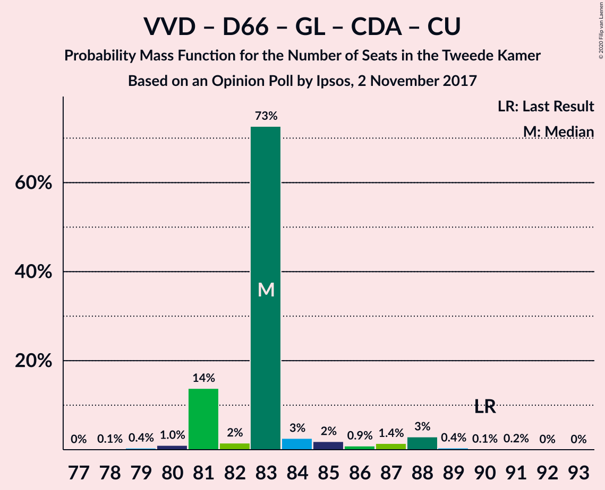

| Number of Seats | Probability | Accumulated | Special Marks |
|:---------------:|:-----------:|:-----------:|:-------------:|
| 77 | 0% | 100% |  |
| 78 | 0.1% | 99.9% |  |
| 79 | 0.4% | 99.8% |  |
| 80 | 1.0% | 99.4% |  |
| 81 | 14% | 98% |  |
| 82 | 2% | 85% |  |
| 83 | 73% | 83% | Median |
| 84 | 3% | 10% |  |
| 85 | 2% | 8% |  |
| 86 | 0.9% | 6% |  |
| 87 | 1.4% | 5% |  |
| 88 | 3% | 4% |  |
| 89 | 0.4% | 0.8% |  |
| 90 | 0.1% | 0.4% | Last Result |
| 91 | 0.2% | 0.3% |  |
| 92 | 0% | 0.1% |  |
| 93 | 0% | 0% |  |

### Volkspartij voor Vrijheid en Democratie – Partij voor de Vrijheid – Christen-Democratisch Appèl – Forum voor Democratie – Staatkundig Gereformeerde Partij

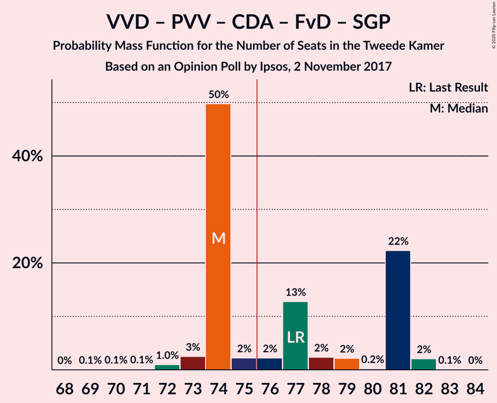

| Number of Seats | Probability | Accumulated | Special Marks |
|:---------------:|:-----------:|:-----------:|:-------------:|
| 69 | 0.1% | 100% |  |
| 70 | 0.1% | 99.9% |  |
| 71 | 0.1% | 99.8% |  |
| 72 | 1.0% | 99.7% |  |
| 73 | 3% | 98.7% |  |
| 74 | 50% | 96% | Median |
| 75 | 2% | 46% |  |
| 76 | 2% | 44% | Majority |
| 77 | 13% | 42% | Last Result |
| 78 | 2% | 29% |  |
| 79 | 2% | 27% |  |
| 80 | 0.2% | 25% |  |
| 81 | 22% | 25% |  |
| 82 | 2% | 2% |  |
| 83 | 0.1% | 0.1% |  |
| 84 | 0% | 0% |  |

### Volkspartij voor Vrijheid en Democratie – Democraten 66 – Christen-Democratisch Appèl – Partij van de Arbeid – ChristenUnie

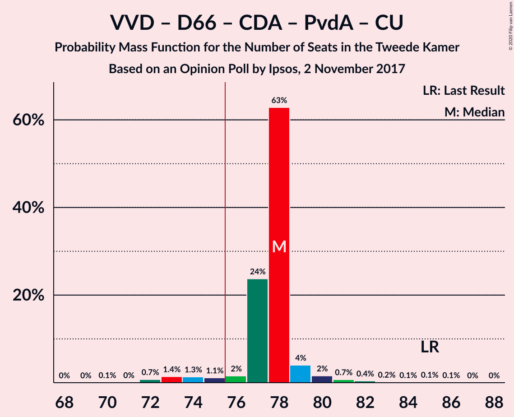

| Number of Seats | Probability | Accumulated | Special Marks |
|:---------------:|:-----------:|:-----------:|:-------------:|
| 70 | 0.1% | 100% |  |
| 71 | 0% | 99.9% |  |
| 72 | 0.7% | 99.9% |  |
| 73 | 1.4% | 99.2% |  |
| 74 | 1.3% | 98% |  |
| 75 | 1.1% | 96% |  |
| 76 | 2% | 95% | Majority |
| 77 | 24% | 94% |  |
| 78 | 63% | 70% | Median |
| 79 | 4% | 7% |  |
| 80 | 2% | 3% |  |
| 81 | 0.7% | 2% |  |
| 82 | 0.4% | 0.8% |  |
| 83 | 0.2% | 0.4% |  |
| 84 | 0.1% | 0.3% |  |
| 85 | 0.1% | 0.2% | Last Result |
| 86 | 0.1% | 0.1% |  |
| 87 | 0% | 0% |  |

### Volkspartij voor Vrijheid en Democratie – Partij voor de Vrijheid – Christen-Democratisch Appèl – Forum voor Democratie

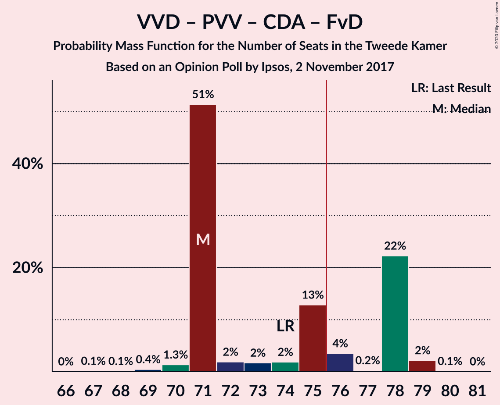

| Number of Seats | Probability | Accumulated | Special Marks |
|:---------------:|:-----------:|:-----------:|:-------------:|
| 67 | 0.1% | 100% |  |
| 68 | 0.1% | 99.8% |  |
| 69 | 0.4% | 99.7% |  |
| 70 | 1.3% | 99.3% |  |
| 71 | 51% | 98% | Median |
| 72 | 2% | 47% |  |
| 73 | 2% | 45% |  |
| 74 | 2% | 43% | Last Result |
| 75 | 13% | 41% |  |
| 76 | 4% | 28% | Majority |
| 77 | 0.2% | 25% |  |
| 78 | 22% | 25% |  |
| 79 | 2% | 2% |  |
| 80 | 0.1% | 0.1% |  |
| 81 | 0% | 0% |  |

### Democraten 66 – GroenLinks – Christen-Democratisch Appèl – Socialistische Partij – Partij van de Arbeid – ChristenUnie

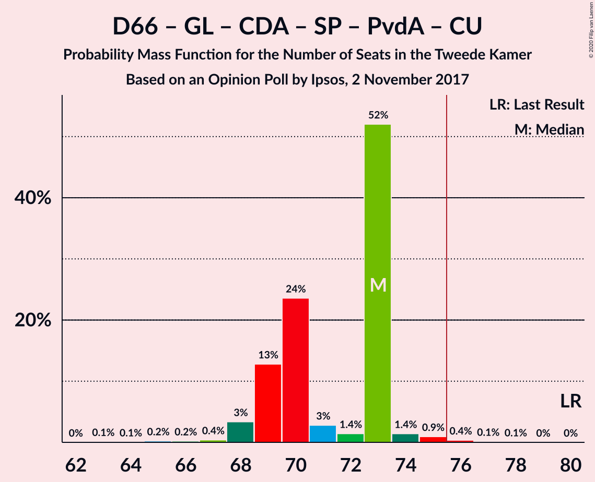

| Number of Seats | Probability | Accumulated | Special Marks |
|:---------------:|:-----------:|:-----------:|:-------------:|
| 63 | 0.1% | 100% |  |
| 64 | 0.1% | 99.9% |  |
| 65 | 0.2% | 99.8% |  |
| 66 | 0.2% | 99.6% |  |
| 67 | 0.4% | 99.4% |  |
| 68 | 3% | 99.0% |  |
| 69 | 13% | 96% |  |
| 70 | 24% | 83% |  |
| 71 | 3% | 59% |  |
| 72 | 1.4% | 56% |  |
| 73 | 52% | 55% | Median |
| 74 | 1.4% | 3% |  |
| 75 | 0.9% | 2% |  |
| 76 | 0.4% | 0.6% | Majority |
| 77 | 0.1% | 0.2% |  |
| 78 | 0.1% | 0.1% |  |
| 79 | 0% | 0% |  |
| 80 | 0% | 0% | Last Result |

### Volkspartij voor Vrijheid en Democratie – Democraten 66 – Christen-Democratisch Appèl – ChristenUnie

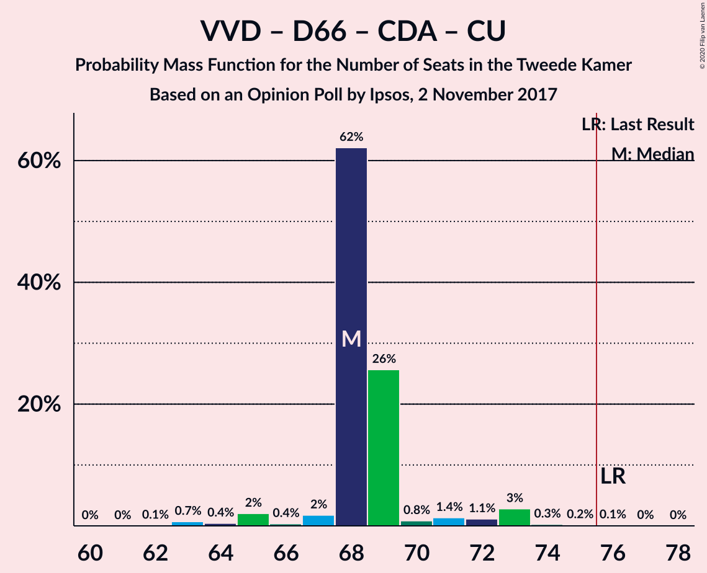

| Number of Seats | Probability | Accumulated | Special Marks |
|:---------------:|:-----------:|:-----------:|:-------------:|
| 62 | 0.1% | 100% |  |
| 63 | 0.7% | 99.9% |  |
| 64 | 0.4% | 99.2% |  |
| 65 | 2% | 98.8% |  |
| 66 | 0.4% | 97% |  |
| 67 | 2% | 96% |  |
| 68 | 62% | 95% | Median |
| 69 | 26% | 32% |  |
| 70 | 0.8% | 7% |  |
| 71 | 1.4% | 6% |  |
| 72 | 1.1% | 5% |  |
| 73 | 3% | 3% |  |
| 74 | 0.3% | 0.6% |  |
| 75 | 0.2% | 0.4% |  |
| 76 | 0.1% | 0.2% | Last Result, Majority |
| 77 | 0% | 0.1% |  |
| 78 | 0% | 0% |  |

### Volkspartij voor Vrijheid en Democratie – Partij voor de Vrijheid – Christen-Democratisch Appèl

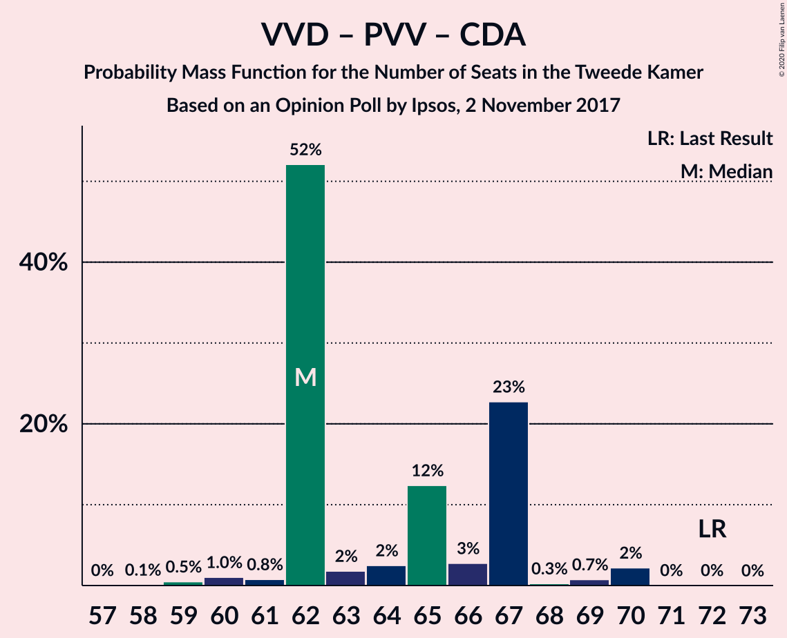

| Number of Seats | Probability | Accumulated | Special Marks |
|:---------------:|:-----------:|:-----------:|:-------------:|
| 57 | 0% | 100% |  |
| 58 | 0.1% | 99.9% |  |
| 59 | 0.5% | 99.8% |  |
| 60 | 1.0% | 99.4% |  |
| 61 | 0.8% | 98% |  |
| 62 | 52% | 98% | Median |
| 63 | 2% | 45% |  |
| 64 | 2% | 44% |  |
| 65 | 12% | 41% |  |
| 66 | 3% | 29% |  |
| 67 | 23% | 26% |  |
| 68 | 0.3% | 3% |  |
| 69 | 0.7% | 3% |  |
| 70 | 2% | 2% |  |
| 71 | 0% | 0.1% |  |
| 72 | 0% | 0.1% | Last Result |
| 73 | 0% | 0% |  |

### Volkspartij voor Vrijheid en Democratie – Christen-Democratisch Appèl – Forum voor Democratie – 50Plus – Staatkundig Gereformeerde Partij

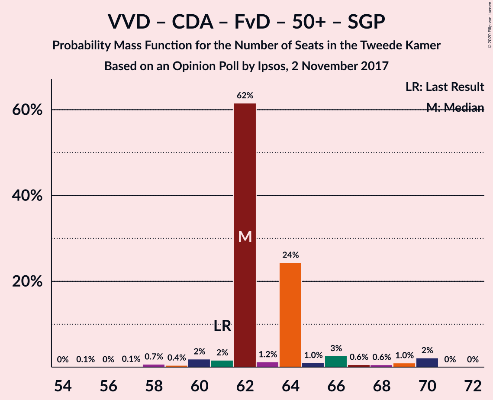

| Number of Seats | Probability | Accumulated | Special Marks |
|:---------------:|:-----------:|:-----------:|:-------------:|
| 55 | 0.1% | 100% |  |
| 56 | 0% | 99.9% |  |
| 57 | 0.1% | 99.9% |  |
| 58 | 0.7% | 99.8% |  |
| 59 | 0.4% | 99.1% |  |
| 60 | 2% | 98.7% |  |
| 61 | 2% | 97% | Last Result |
| 62 | 62% | 95% | Median |
| 63 | 1.2% | 34% |  |
| 64 | 24% | 32% |  |
| 65 | 1.0% | 8% |  |
| 66 | 3% | 7% |  |
| 67 | 0.6% | 4% |  |
| 68 | 0.6% | 4% |  |
| 69 | 1.0% | 3% |  |
| 70 | 2% | 2% |  |
| 71 | 0% | 0% |  |

### Volkspartij voor Vrijheid en Democratie – Democraten 66 – Christen-Democratisch Appèl

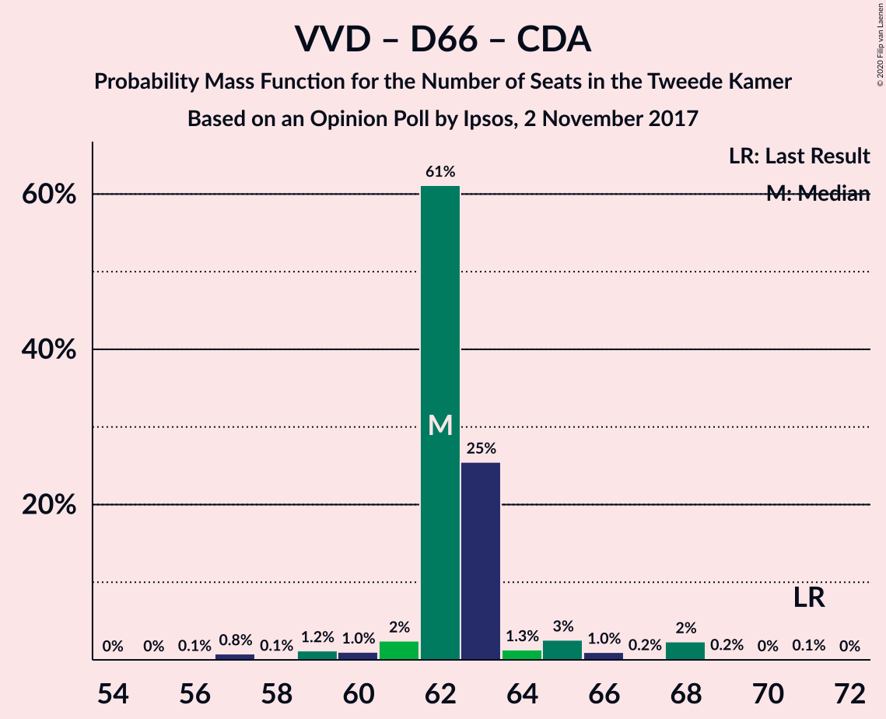

| Number of Seats | Probability | Accumulated | Special Marks |
|:---------------:|:-----------:|:-----------:|:-------------:|
| 56 | 0.1% | 100% |  |
| 57 | 0.8% | 99.9% |  |
| 58 | 0.1% | 99.1% |  |
| 59 | 1.2% | 99.0% |  |
| 60 | 1.0% | 98% |  |
| 61 | 2% | 97% |  |
| 62 | 61% | 94% | Median |
| 63 | 25% | 33% |  |
| 64 | 1.3% | 8% |  |
| 65 | 3% | 6% |  |
| 66 | 1.0% | 4% |  |
| 67 | 0.2% | 3% |  |
| 68 | 2% | 3% |  |
| 69 | 0.2% | 0.3% |  |
| 70 | 0% | 0.2% |  |
| 71 | 0.1% | 0.1% | Last Result |
| 72 | 0% | 0% |  |

### Volkspartij voor Vrijheid en Democratie – Christen-Democratisch Appèl – Forum voor Democratie – 50Plus

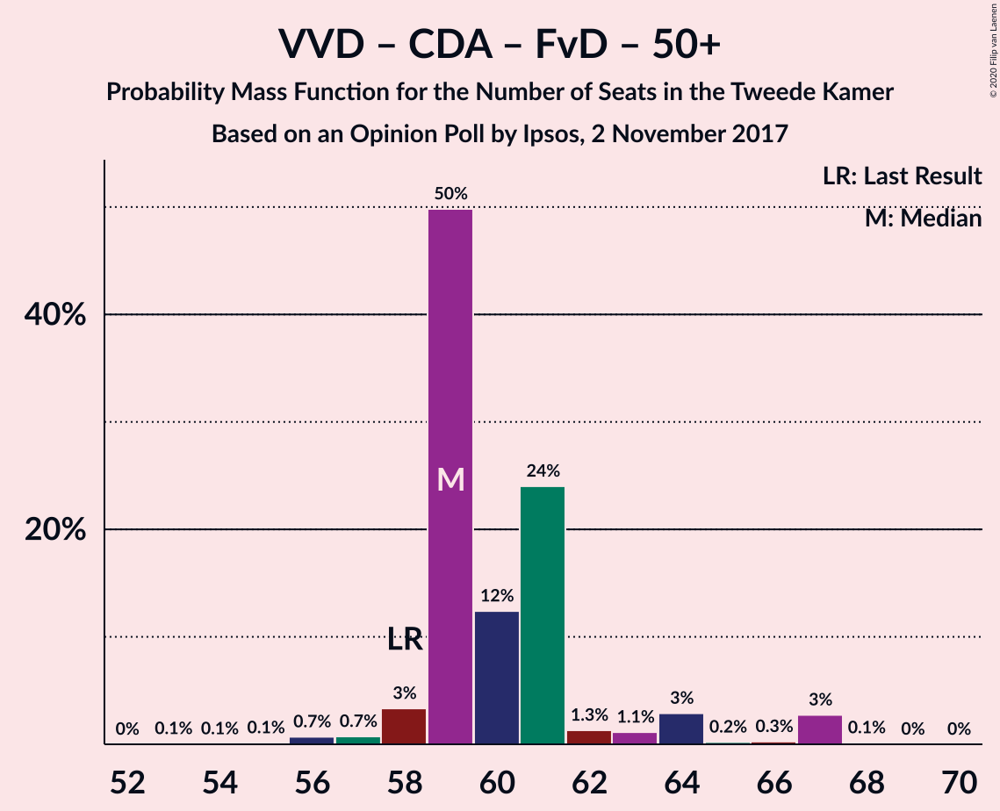

| Number of Seats | Probability | Accumulated | Special Marks |
|:---------------:|:-----------:|:-----------:|:-------------:|
| 53 | 0.1% | 100% |  |
| 54 | 0.1% | 99.9% |  |
| 55 | 0.1% | 99.9% |  |
| 56 | 0.7% | 99.7% |  |
| 57 | 0.7% | 99.0% |  |
| 58 | 3% | 98% | Last Result |
| 59 | 50% | 95% | Median |
| 60 | 12% | 45% |  |
| 61 | 24% | 33% |  |
| 62 | 1.3% | 9% |  |
| 63 | 1.1% | 7% |  |
| 64 | 3% | 6% |  |
| 65 | 0.2% | 3% |  |
| 66 | 0.3% | 3% |  |
| 67 | 3% | 3% |  |
| 68 | 0.1% | 0.2% |  |
| 69 | 0% | 0% |  |

### Democraten 66 – GroenLinks – Christen-Democratisch Appèl – Partij van de Arbeid – ChristenUnie

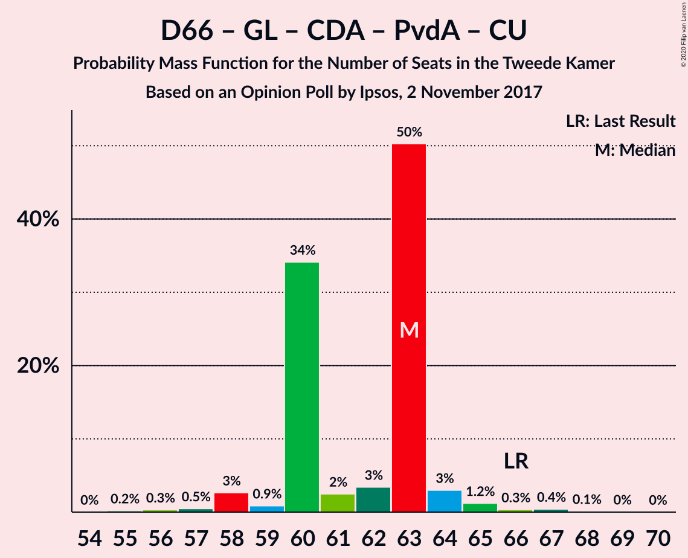

| Number of Seats | Probability | Accumulated | Special Marks |
|:---------------:|:-----------:|:-----------:|:-------------:|
| 55 | 0.2% | 100% |  |
| 56 | 0.3% | 99.8% |  |
| 57 | 0.5% | 99.5% |  |
| 58 | 3% | 99.0% |  |
| 59 | 0.9% | 96% |  |
| 60 | 34% | 95% |  |
| 61 | 2% | 61% |  |
| 62 | 3% | 59% |  |
| 63 | 50% | 55% | Median |
| 64 | 3% | 5% |  |
| 65 | 1.2% | 2% |  |
| 66 | 0.3% | 1.0% | Last Result |
| 67 | 0.4% | 0.6% |  |
| 68 | 0.1% | 0.2% |  |
| 69 | 0% | 0.1% |  |
| 70 | 0% | 0% |  |

### Volkspartij voor Vrijheid en Democratie – Christen-Democratisch Appèl – Forum voor Democratie – Staatkundig Gereformeerde Partij

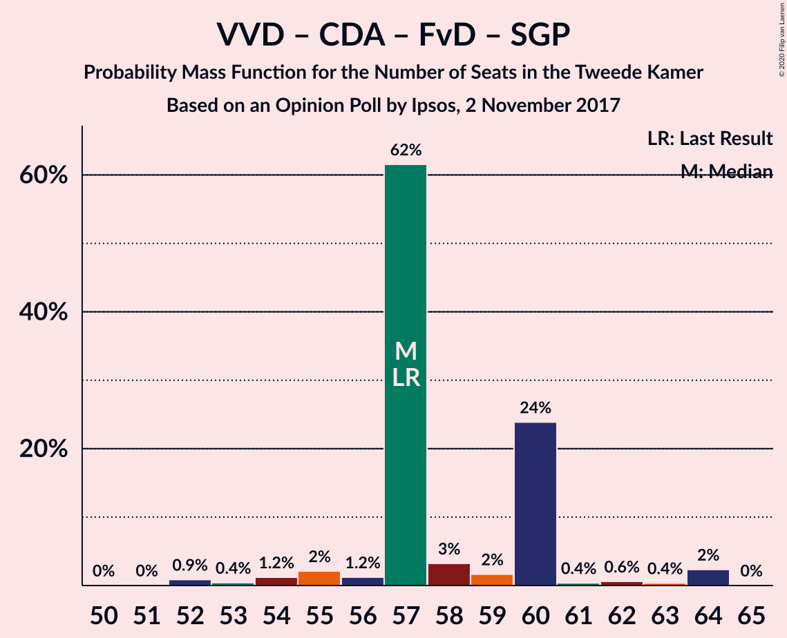

| Number of Seats | Probability | Accumulated | Special Marks |
|:---------------:|:-----------:|:-----------:|:-------------:|
| 50 | 0% | 100% |  |
| 51 | 0% | 99.9% |  |
| 52 | 0.9% | 99.9% |  |
| 53 | 0.4% | 99.0% |  |
| 54 | 1.2% | 98.6% |  |
| 55 | 2% | 97% |  |
| 56 | 1.2% | 95% |  |
| 57 | 62% | 94% | Last Result, Median |
| 58 | 3% | 32% |  |
| 59 | 2% | 29% |  |
| 60 | 24% | 28% |  |
| 61 | 0.4% | 4% |  |
| 62 | 0.6% | 3% |  |
| 63 | 0.4% | 3% |  |
| 64 | 2% | 2% |  |
| 65 | 0% | 0% |  |

### Volkspartij voor Vrijheid en Democratie – Christen-Democratisch Appèl – Forum voor Democratie

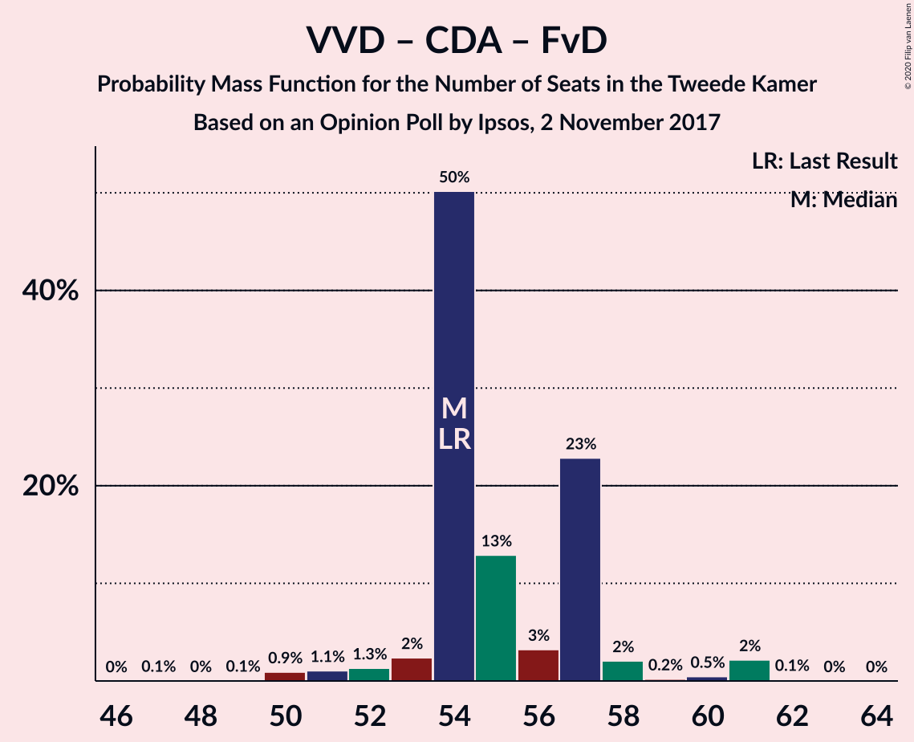

| Number of Seats | Probability | Accumulated | Special Marks |
|:---------------:|:-----------:|:-----------:|:-------------:|
| 47 | 0.1% | 100% |  |
| 48 | 0% | 99.9% |  |
| 49 | 0.1% | 99.9% |  |
| 50 | 0.9% | 99.9% |  |
| 51 | 1.1% | 98.9% |  |
| 52 | 1.3% | 98% |  |
| 53 | 2% | 97% |  |
| 54 | 50% | 94% | Last Result, Median |
| 55 | 13% | 44% |  |
| 56 | 3% | 31% |  |
| 57 | 23% | 28% |  |
| 58 | 2% | 5% |  |
| 59 | 0.2% | 3% |  |
| 60 | 0.5% | 3% |  |
| 61 | 2% | 2% |  |
| 62 | 0.1% | 0.2% |  |
| 63 | 0% | 0% |  |

### Volkspartij voor Vrijheid en Democratie – Democraten 66 – Partij van de Arbeid

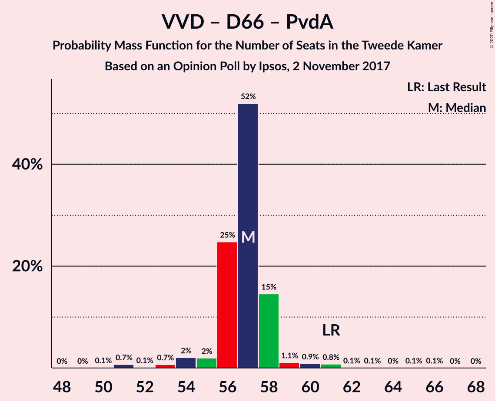

| Number of Seats | Probability | Accumulated | Special Marks |
|:---------------:|:-----------:|:-----------:|:-------------:|
| 50 | 0.1% | 100% |  |
| 51 | 0.7% | 99.9% |  |
| 52 | 0.1% | 99.2% |  |
| 53 | 0.7% | 99.0% |  |
| 54 | 2% | 98% |  |
| 55 | 2% | 96% |  |
| 56 | 25% | 94% |  |
| 57 | 52% | 70% | Median |
| 58 | 15% | 18% |  |
| 59 | 1.1% | 3% |  |
| 60 | 0.9% | 2% |  |
| 61 | 0.8% | 1.1% | Last Result |
| 62 | 0.1% | 0.3% |  |
| 63 | 0.1% | 0.2% |  |
| 64 | 0% | 0.2% |  |
| 65 | 0.1% | 0.1% |  |
| 66 | 0.1% | 0.1% |  |
| 67 | 0% | 0% |  |

### Volkspartij voor Vrijheid en Democratie – Christen-Democratisch Appèl – Partij van de Arbeid

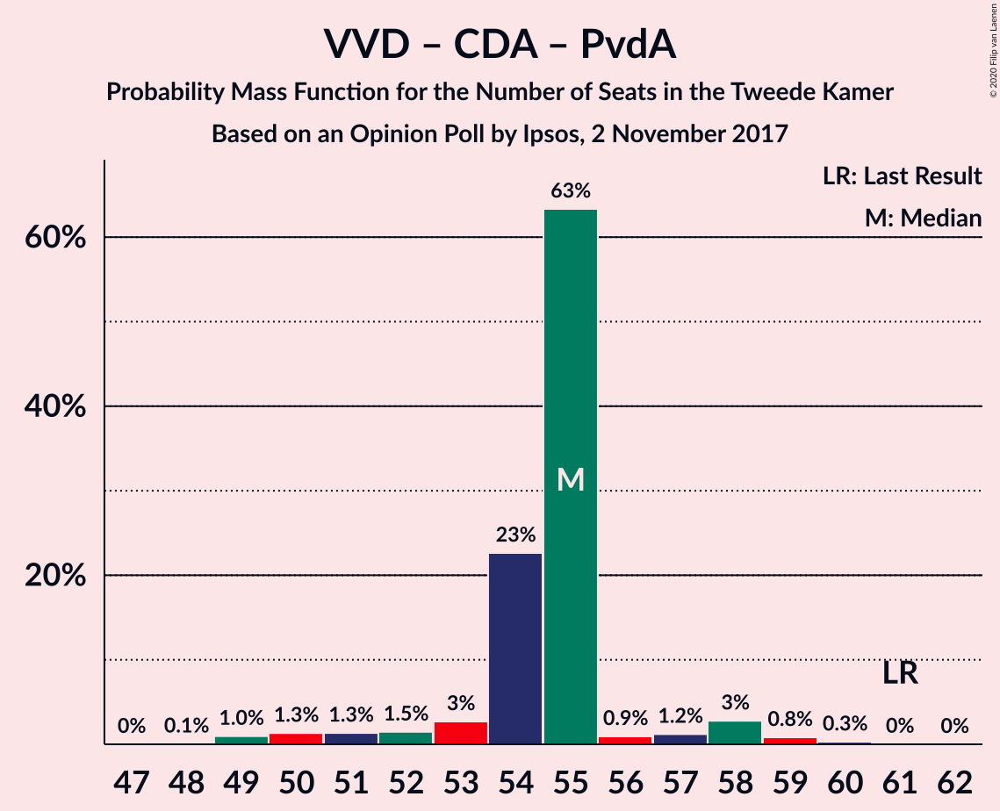

| Number of Seats | Probability | Accumulated | Special Marks |
|:---------------:|:-----------:|:-----------:|:-------------:|
| 48 | 0.1% | 100% |  |
| 49 | 1.0% | 99.9% |  |
| 50 | 1.3% | 98.9% |  |
| 51 | 1.3% | 98% |  |
| 52 | 1.5% | 96% |  |
| 53 | 3% | 95% |  |
| 54 | 23% | 92% |  |
| 55 | 63% | 69% | Median |
| 56 | 0.9% | 6% |  |
| 57 | 1.2% | 5% |  |
| 58 | 3% | 4% |  |
| 59 | 0.8% | 1.2% |  |
| 60 | 0.3% | 0.4% |  |
| 61 | 0% | 0.1% | Last Result |
| 62 | 0% | 0% |  |

### Volkspartij voor Vrijheid en Democratie – Christen-Democratisch Appèl

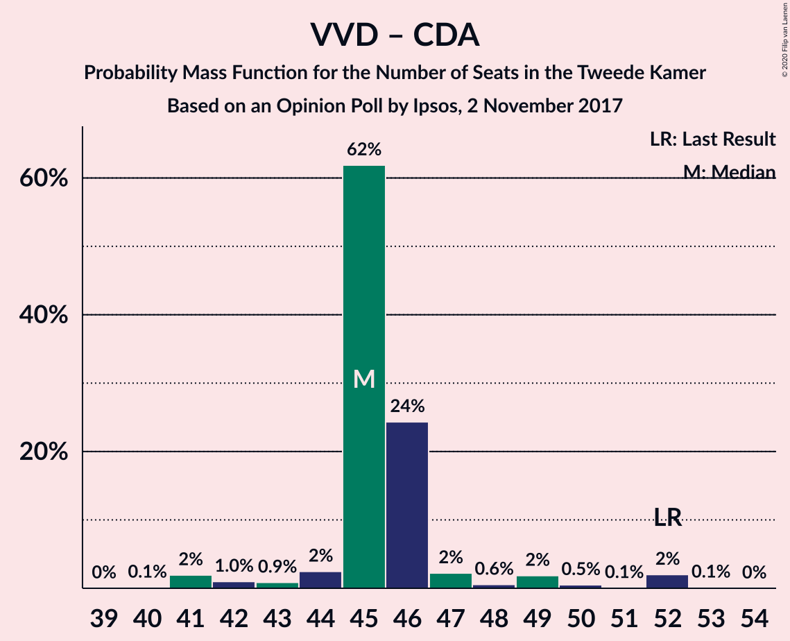

| Number of Seats | Probability | Accumulated | Special Marks |
|:---------------:|:-----------:|:-----------:|:-------------:|
| 40 | 0.1% | 100% |  |
| 41 | 2% | 99.8% |  |
| 42 | 1.0% | 98% |  |
| 43 | 0.9% | 97% |  |
| 44 | 2% | 96% |  |
| 45 | 62% | 94% | Median |
| 46 | 24% | 32% |  |
| 47 | 2% | 7% |  |
| 48 | 0.6% | 5% |  |
| 49 | 2% | 5% |  |
| 50 | 0.5% | 3% |  |
| 51 | 0.1% | 2% |  |
| 52 | 2% | 2% | Last Result |
| 53 | 0.1% | 0.1% |  |
| 54 | 0% | 0% |  |

### Democraten 66 – Christen-Democratisch Appèl – Partij van de Arbeid

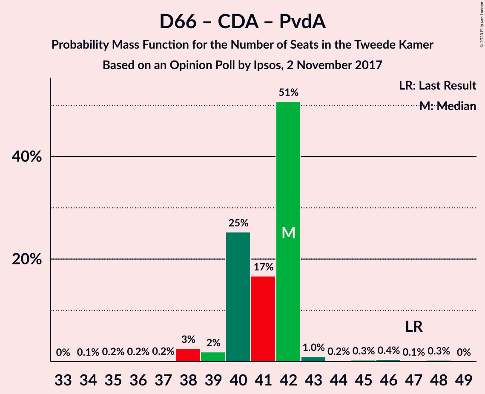

| Number of Seats | Probability | Accumulated | Special Marks |
|:---------------:|:-----------:|:-----------:|:-------------:|
| 34 | 0.1% | 100% |  |
| 35 | 0.2% | 99.9% |  |
| 36 | 0.2% | 99.8% |  |
| 37 | 0.2% | 99.6% |  |
| 38 | 3% | 99.4% |  |
| 39 | 2% | 97% |  |
| 40 | 25% | 95% |  |
| 41 | 17% | 70% |  |
| 42 | 51% | 53% | Median |
| 43 | 1.0% | 2% |  |
| 44 | 0.2% | 1.3% |  |
| 45 | 0.3% | 1.1% |  |
| 46 | 0.4% | 0.8% |  |
| 47 | 0.1% | 0.4% | Last Result |
| 48 | 0.3% | 0.3% |  |
| 49 | 0% | 0% |  |

### Volkspartij voor Vrijheid en Democratie – Partij van de Arbeid

| Number of Seats | Probability | Accumulated | Special Marks |
|:---------------:|:-----------:|:-----------:|:-------------:|
| 34 | 0.3% | 100% |  |
| 35 | 2% | 99.6% |  |
| 36 | 1.2% | 98% |  |
| 37 | 1.5% | 97% |  |
| 38 | 3% | 95% |  |
| 39 | 24% | 93% |  |
| 40 | 52% | 69% | Median |
| 41 | 12% | 17% |  |
| 42 | 3% | 5% | Last Result |
| 43 | 0.5% | 2% |  |
| 44 | 1.1% | 1.3% |  |
| 45 | 0.1% | 0.2% |  |
| 46 | 0.1% | 0.1% |  |
| 47 | 0% | 0% |  |

### Democraten 66 – Christen-Democratisch Appèl

| Number of Seats | Probability | Accumulated | Special Marks |
|:---------------:|:-----------:|:-----------:|:-------------:|
| 27 | 0% | 100% |  |
| 28 | 0.3% | 99.9% |  |
| 29 | 1.1% | 99.6% |  |
| 30 | 1.1% | 98% |  |
| 31 | 14% | 97% |  |
| 32 | 77% | 84% | Median |
| 33 | 3% | 6% |  |
| 34 | 2% | 4% |  |
| 35 | 0.5% | 2% |  |
| 36 | 0.4% | 1.2% |  |
| 37 | 0.3% | 0.8% |  |
| 38 | 0.3% | 0.5% | Last Result |
| 39 | 0.1% | 0.2% |  |
| 40 | 0% | 0% |  |

### Christen-Democratisch Appèl – Partij van de Arbeid – ChristenUnie

| Number of Seats | Probability | Accumulated | Special Marks |
|:---------------:|:-----------:|:-----------:|:-------------:|
| 23 | 0.1% | 100% |  |
| 24 | 0.2% | 99.9% |  |
| 25 | 0.7% | 99.8% |  |
| 26 | 0.4% | 99.0% |  |
| 27 | 4% | 98.6% |  |
| 28 | 2% | 94% |  |
| 29 | 23% | 92% |  |
| 30 | 15% | 69% |  |
| 31 | 51% | 54% | Median |
| 32 | 2% | 3% |  |
| 33 | 0.8% | 1.0% | Last Result |
| 34 | 0.1% | 0.2% |  |
| 35 | 0.1% | 0.1% |  |
| 36 | 0% | 0% |  |

### Christen-Democratisch Appèl – Partij van de Arbeid

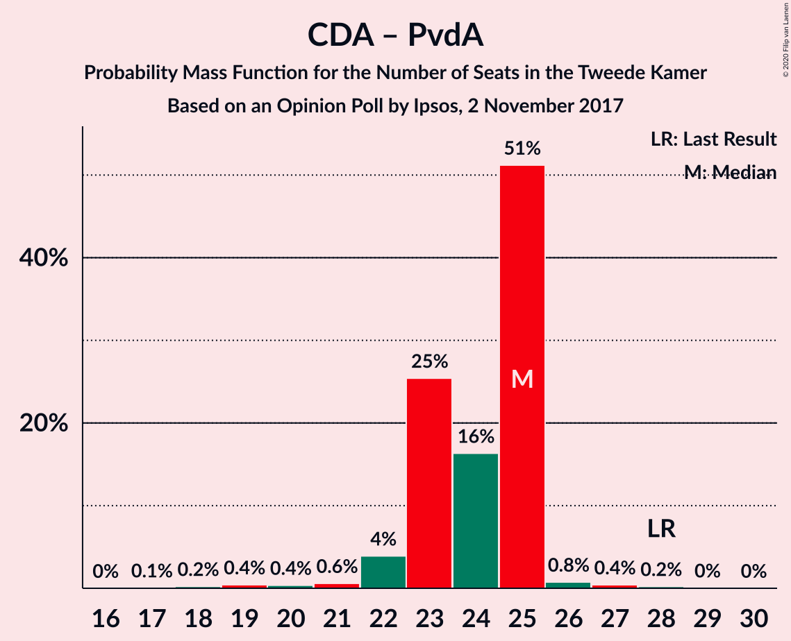

| Number of Seats | Probability | Accumulated | Special Marks |
|:---------------:|:-----------:|:-----------:|:-------------:|
| 17 | 0.1% | 100% |  |
| 18 | 0.2% | 99.9% |  |
| 19 | 0.4% | 99.7% |  |
| 20 | 0.4% | 99.3% |  |
| 21 | 0.6% | 98.9% |  |
| 22 | 4% | 98% |  |
| 23 | 25% | 94% |  |
| 24 | 16% | 69% |  |
| 25 | 51% | 53% | Median |
| 26 | 0.8% | 1.5% |  |
| 27 | 0.4% | 0.7% |  |
| 28 | 0.2% | 0.3% | Last Result |
| 29 | 0% | 0.1% |  |
| 30 | 0% | 0% |  |

## Technical Information

### Opinion Poll

+ **Polling firm:** Ipsos
+ **Commissioner(s):** —
+ **Fieldwork period:** 2 November 2017

### Calculations

+ **Sample size:** 1000
+ **Simulations done:** 1,048,576
+ **Error estimate:** 4.05%

