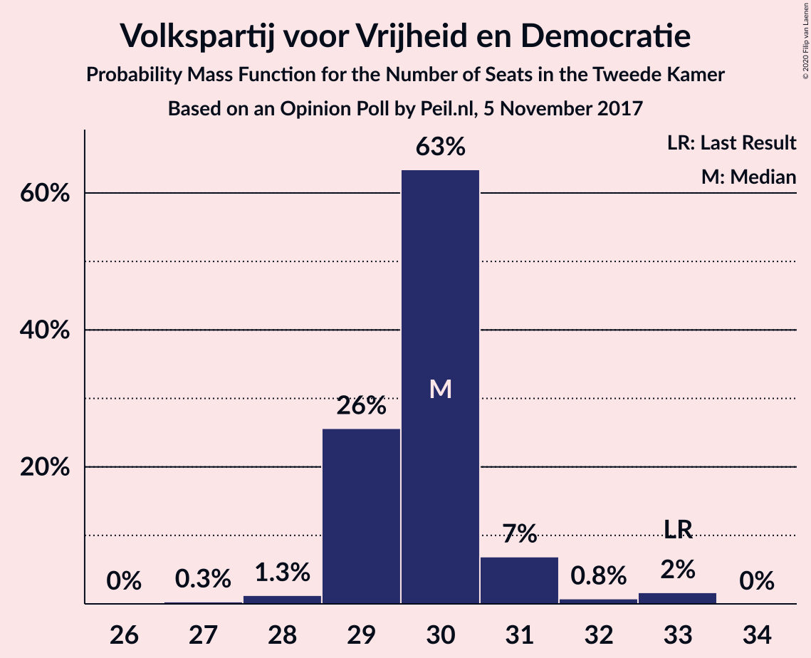
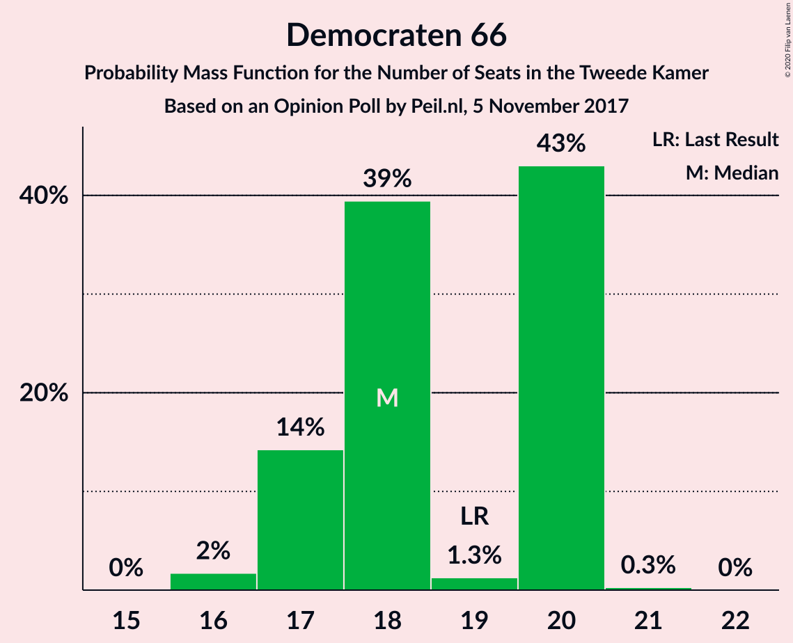
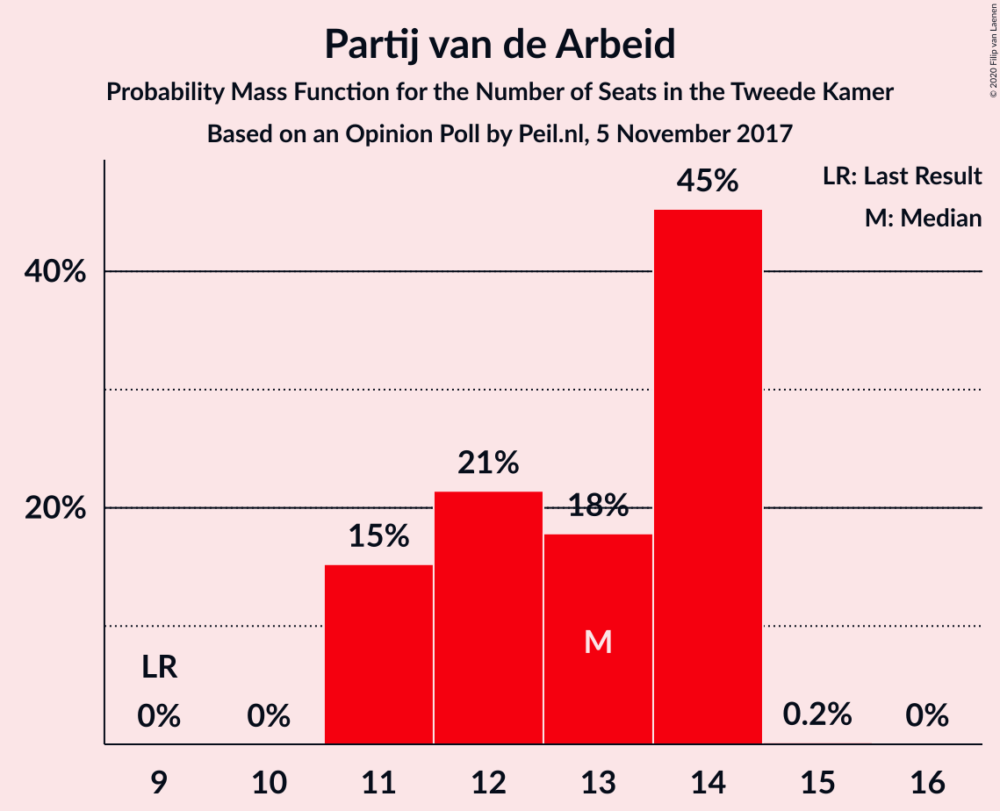
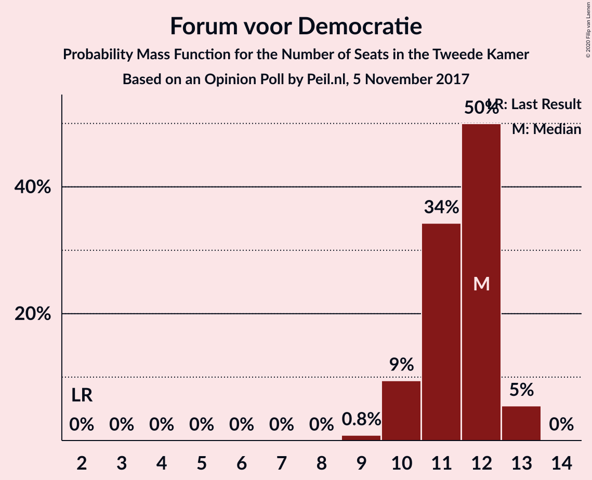
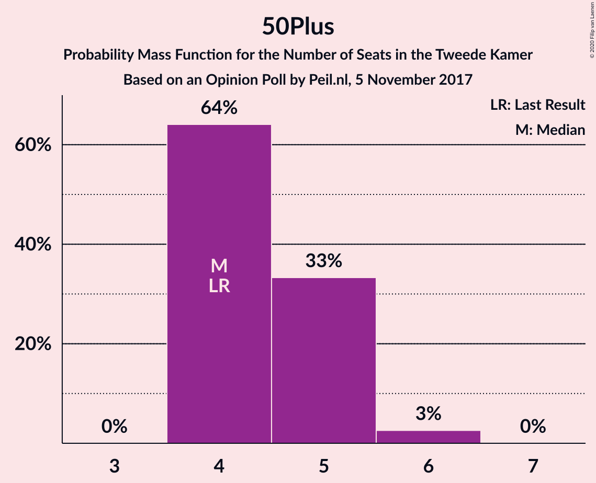
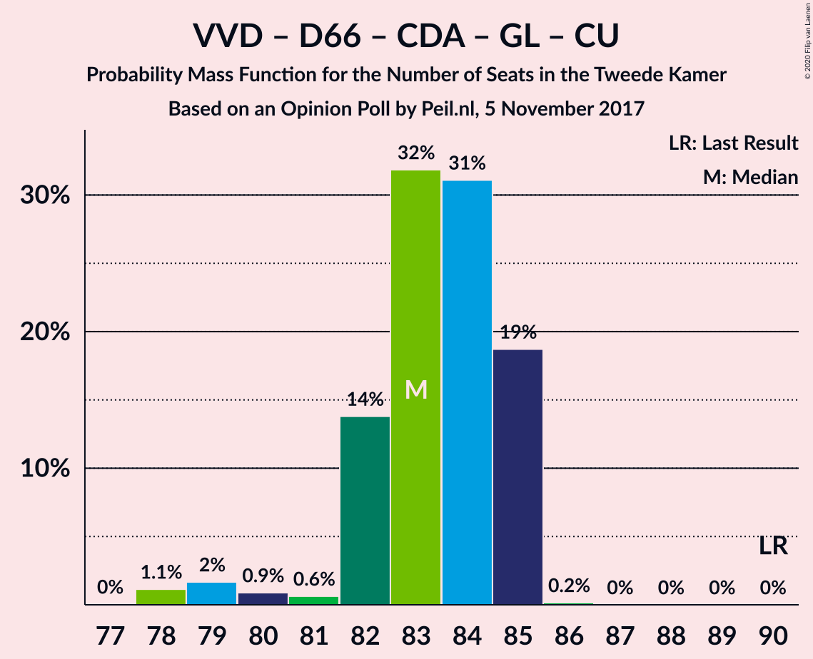
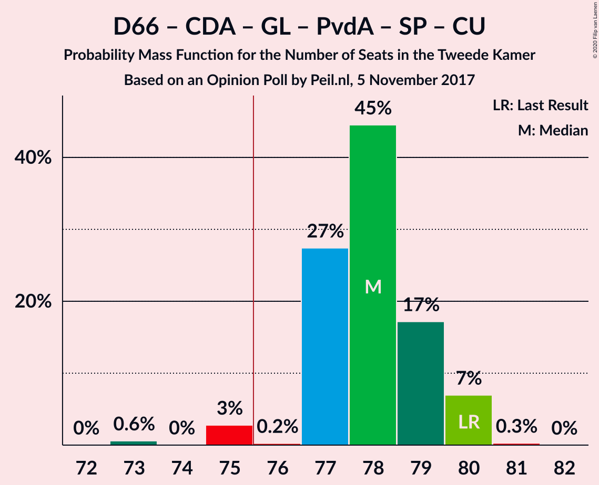
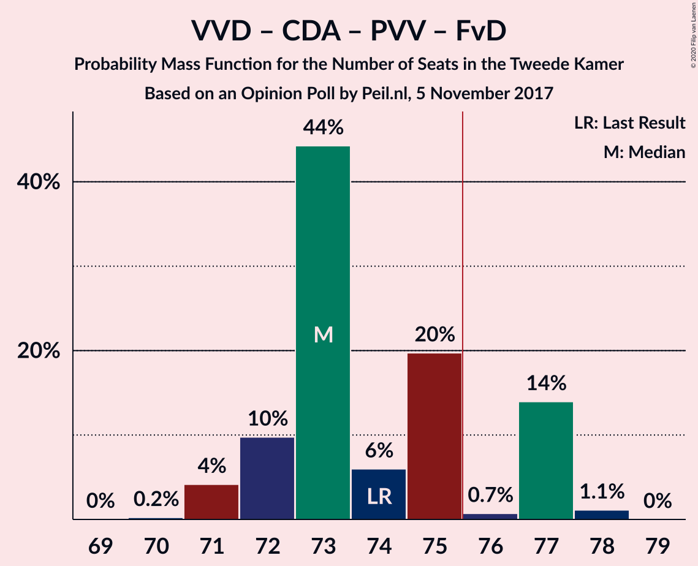
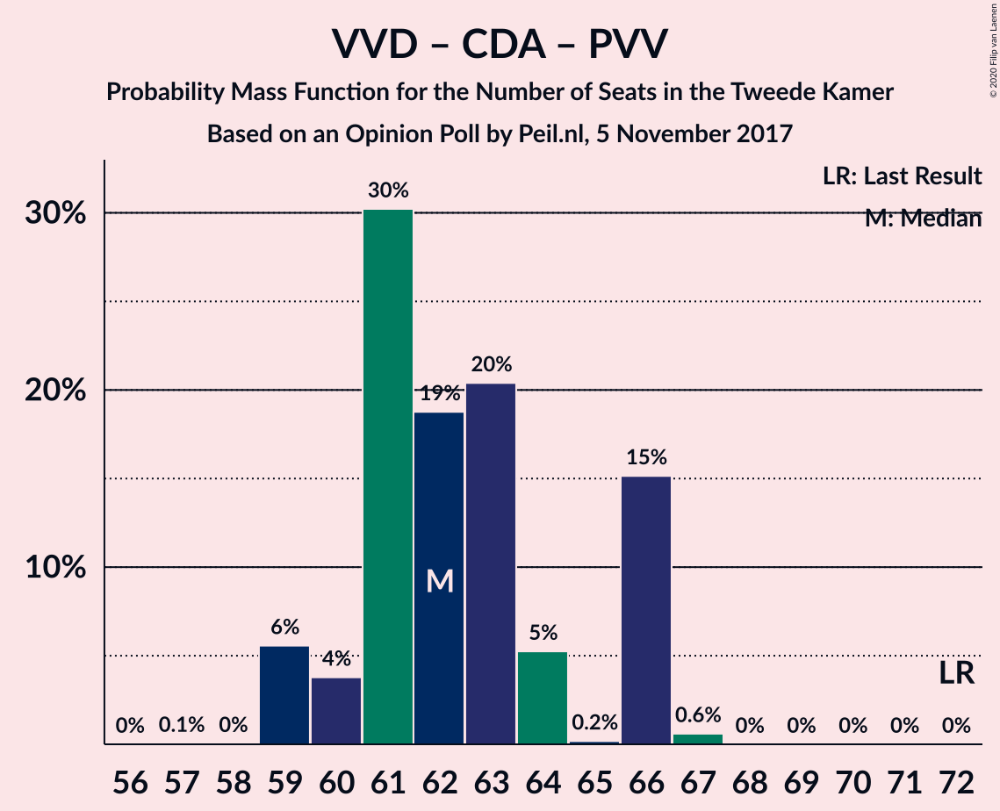

# Opinion Poll by Peil.nl, 5 November 2017

<a href="#voting-intentions">Voting Intentions</a> | <a href="#seats">Seats</a> | <a href="#coalitions">Coalitions</a> | <a href="#technical-information">Technical Information</a>

## Voting Intentions

### Confidence Intervals

| Party | Last Result | Poll Result | 80% Confidence Interval | 90% Confidence Interval | 95% Confidence Interval | 99% Confidence Interval |
|:-----:|:-----------:|:-----------:|:-----------------------:|:-----------------------:|:-----------------------:|:-----------------------:|
| Volkspartij voor Vrijheid en Democratie | 21.3% | 19.3% | 18.4–20.3% |18.2–20.6% |18.0–20.8% |17.5–21.3% |
| Democraten 66 | 12.2% | 12.0% | 11.3–12.8% |11.1–13.0% |10.9–13.2% |10.5–13.6% |
| Partij voor de Vrijheid | 13.1% | 10.7% | 10.0–11.4% |9.8–11.6% |9.6–11.8% |9.3–12.2% |
| Christen-Democratisch Appèl | 12.4% | 10.7% | 10.0–11.4% |9.8–11.6% |9.6–11.8% |9.3–12.2% |
| GroenLinks | 9.1% | 8.7% | 8.0–9.4% |7.8–9.6% |7.7–9.7% |7.4–10.1% |
| Partij van de Arbeid | 5.7% | 8.7% | 8.0–9.4% |7.8–9.6% |7.7–9.7% |7.4–10.1% |
| Socialistische Partij | 9.1% | 8.0% | 7.4–8.7% |7.2–8.9% |7.1–9.0% |6.8–9.4% |
| Forum voor Democratie | 1.8% | 7.3% | 6.8–8.0% |6.6–8.2% |6.4–8.3% |6.2–8.6% |
| Partij voor de Dieren | 3.2% | 4.0% | 3.6–4.5% |3.4–4.6% |3.4–4.8% |3.2–5.0% |
| ChristenUnie | 3.4% | 3.3% | 2.9–3.8% |2.8–3.9% |2.7–4.0% |2.6–4.3% |
| 50Plus | 3.1% | 3.3% | 2.9–3.8% |2.8–3.9% |2.7–4.0% |2.6–4.3% |
| Staatkundig Gereformeerde Partij | 2.1% | 2.0% | 1.7–2.4% |1.6–2.5% |1.6–2.6% |1.4–2.8% |
| DENK | 2.1% | 2.0% | 1.7–2.4% |1.6–2.5% |1.6–2.6% |1.4–2.8% |

*Note:* The poll result column reflects the actual value used in the calculations. Published results may vary slightly, and in addition be rounded to fewer digits.

## Seats

### Confidence Intervals

| Party | Last Result | Median | 80% Confidence Interval | 90% Confidence Interval | 95% Confidence Interval | 99% Confidence Interval |
|:-----:|:-----------:|:------:|:-----------------------:|:-----------------------:|:-----------------------:|:-----------------------:|
| <a href="#volkspartij-voor-vrijheid-en-democratie">Volkspartij voor Vrijheid en Democratie</a> | 33 | 30 | 29–30 |29–31 |29–31 |28–33 |
| <a href="#democraten-66">Democraten 66</a> | 19 | 18 | 17–20 |17–20 |17–20 |16–20 |
| <a href="#partij-voor-de-vrijheid">Partij voor de Vrijheid</a> | 20 | 16 | 15–17 |14–17 |14–17 |14–18 |
| <a href="#christen-democratisch-appèl">Christen-Democratisch Appèl</a> | 19 | 17 | 15–19 |15–19 |15–19 |14–19 |
| <a href="#groenlinks">GroenLinks</a> | 14 | 13 | 13–14 |13–15 |12–15 |11–15 |
| <a href="#partij-van-de-arbeid">Partij van de Arbeid</a> | 9 | 13 | 11–14 |11–14 |11–14 |11–14 |
| <a href="#socialistische-partij">Socialistische Partij</a> | 14 | 11 | 11–12 |11–13 |10–13 |10–14 |
| <a href="#forum-voor-democratie">Forum voor Democratie</a> | 2 | 12 | 10–12 |10–13 |10–13 |9–13 |
| <a href="#partij-voor-de-dieren">Partij voor de Dieren</a> | 5 | 5 | 5–7 |5–7 |5–7 |4–7 |
| <a href="#christenunie">ChristenUnie</a> | 5 | 5 | 4–6 |4–6 |4–6 |4–6 |
| <a href="#50plus">50Plus</a> | 4 | 4 | 4–5 |4–5 |4–6 |4–6 |
| <a href="#staatkundig-gereformeerde-partij">Staatkundig Gereformeerde Partij</a> | 3 | 2 | 2–3 |2–3 |2–4 |2–4 |
| <a href="#denk">DENK</a> | 3 | 3 | 2–3 |2–3 |2–4 |1–4 |

### Volkspartij voor Vrijheid en Democratie

*For a full overview of the results for this party, see the [Volkspartij voor Vrijheid en Democratie](party-volkspartijvoorvrijheidendemocratie.html) page.*

| Number of Seats | Probability | Accumulated | Special Marks |
|:---------------:|:-----------:|:-----------:|:-------------:|
| 27 | 0.3% | 100% |  |
| 28 | 1.3% | 99.7% |  |
| 29 | 26% | 98% |  |
| 30 | 63% | 73% | Median |
| 31 | 7% | 9% |  |
| 32 | 0.8% | 2% |  |
| 33 | 2% | 2% | Last Result |
| 34 | 0% | 0% |  |

### Democraten 66

*For a full overview of the results for this party, see the [Democraten 66](party-democraten66.html) page.*

| Number of Seats | Probability | Accumulated | Special Marks |
|:---------------:|:-----------:|:-----------:|:-------------:|
| 16 | 2% | 100% |  |
| 17 | 14% | 98% |  |
| 18 | 39% | 84% | Median |
| 19 | 1.3% | 45% | Last Result |
| 20 | 43% | 43% |  |
| 21 | 0.3% | 0.3% |  |
| 22 | 0% | 0% |  |

### Partij voor de Vrijheid

*For a full overview of the results for this party, see the [Partij voor de Vrijheid](party-partijvoordevrijheid.html) page.*

| Number of Seats | Probability | Accumulated | Special Marks |
|:---------------:|:-----------:|:-----------:|:-------------:|
| 14 | 6% | 100% |  |
| 15 | 4% | 94% |  |
| 16 | 69% | 90% | Median |
| 17 | 20% | 21% |  |
| 18 | 0.9% | 0.9% |  |
| 19 | 0% | 0% |  |
| 20 | 0% | 0% | Last Result |

### Christen-Democratisch Appèl

*For a full overview of the results for this party, see the [Christen-Democratisch Appèl](party-christen-democratischappèl.html) page.*

| Number of Seats | Probability | Accumulated | Special Marks |
|:---------------:|:-----------:|:-----------:|:-------------:|
| 14 | 2% | 100% |  |
| 15 | 31% | 98% |  |
| 16 | 13% | 67% |  |
| 17 | 40% | 55% | Median |
| 18 | 1.2% | 15% |  |
| 19 | 14% | 14% | Last Result |
| 20 | 0% | 0% |  |

### GroenLinks

*For a full overview of the results for this party, see the [GroenLinks](party-groenlinks.html) page.*

| Number of Seats | Probability | Accumulated | Special Marks |
|:---------------:|:-----------:|:-----------:|:-------------:|
| 10 | 0.1% | 100% |  |
| 11 | 1.1% | 99.9% |  |
| 12 | 2% | 98.8% |  |
| 13 | 71% | 97% | Median |
| 14 | 21% | 27% | Last Result |
| 15 | 5% | 5% |  |
| 16 | 0% | 0% |  |

### Partij van de Arbeid

*For a full overview of the results for this party, see the [Partij van de Arbeid](party-partijvandearbeid.html) page.*

| Number of Seats | Probability | Accumulated | Special Marks |
|:---------------:|:-----------:|:-----------:|:-------------:|
| 9 | 0% | 100% | Last Result |
| 10 | 0% | 100% |  |
| 11 | 15% | 100% |  |
| 12 | 21% | 85% |  |
| 13 | 18% | 63% | Median |
| 14 | 45% | 45% |  |
| 15 | 0.2% | 0.2% |  |
| 16 | 0% | 0% |  |

### Socialistische Partij

*For a full overview of the results for this party, see the [Socialistische Partij](party-socialistischepartij.html) page.*

| Number of Seats | Probability | Accumulated | Special Marks |
|:---------------:|:-----------:|:-----------:|:-------------:|
| 10 | 5% | 100% |  |
| 11 | 53% | 95% | Median |
| 12 | 36% | 42% |  |
| 13 | 5% | 6% |  |
| 14 | 0.7% | 0.7% | Last Result |
| 15 | 0% | 0% |  |

### Forum voor Democratie

*For a full overview of the results for this party, see the [Forum voor Democratie](party-forumvoordemocratie.html) page.*

| Number of Seats | Probability | Accumulated | Special Marks |
|:---------------:|:-----------:|:-----------:|:-------------:|
| 2 | 0% | 100% | Last Result |
| 3 | 0% | 100% |  |
| 4 | 0% | 100% |  |
| 5 | 0% | 100% |  |
| 6 | 0% | 100% |  |
| 7 | 0% | 100% |  |
| 8 | 0% | 100% |  |
| 9 | 0.8% | 100% |  |
| 10 | 9% | 99.2% |  |
| 11 | 34% | 90% |  |
| 12 | 50% | 55% | Median |
| 13 | 5% | 5% |  |
| 14 | 0% | 0% |  |

### Partij voor de Dieren

*For a full overview of the results for this party, see the [Partij voor de Dieren](party-partijvoordedieren.html) page.*

| Number of Seats | Probability | Accumulated | Special Marks |
|:---------------:|:-----------:|:-----------:|:-------------:|
| 4 | 1.2% | 100% |  |
| 5 | 59% | 98.8% | Last Result, Median |
| 6 | 25% | 40% |  |
| 7 | 14% | 14% |  |
| 8 | 0% | 0% |  |

### ChristenUnie

*For a full overview of the results for this party, see the [ChristenUnie](party-christenunie.html) page.*

| Number of Seats | Probability | Accumulated | Special Marks |
|:---------------:|:-----------:|:-----------:|:-------------:|
| 3 | 0.3% | 100% |  |
| 4 | 14% | 99.7% |  |
| 5 | 66% | 86% | Last Result, Median |
| 6 | 20% | 20% |  |
| 7 | 0% | 0% |  |

### 50Plus

*For a full overview of the results for this party, see the [50Plus](party-50plus.html) page.*

| Number of Seats | Probability | Accumulated | Special Marks |
|:---------------:|:-----------:|:-----------:|:-------------:|
| 4 | 64% | 100% | Last Result, Median |
| 5 | 33% | 36% |  |
| 6 | 3% | 3% |  |
| 7 | 0% | 0% |  |

### Staatkundig Gereformeerde Partij

*For a full overview of the results for this party, see the [Staatkundig Gereformeerde Partij](party-staatkundiggereformeerdepartij.html) page.*

| Number of Seats | Probability | Accumulated | Special Marks |
|:---------------:|:-----------:|:-----------:|:-------------:|
| 2 | 81% | 100% | Median |
| 3 | 15% | 19% | Last Result |
| 4 | 4% | 4% |  |
| 5 | 0% | 0% |  |

### DENK

*For a full overview of the results for this party, see the [DENK](party-denk.html) page.*

| Number of Seats | Probability | Accumulated | Special Marks |
|:---------------:|:-----------:|:-----------:|:-------------:|
| 1 | 2% | 100% |  |
| 2 | 47% | 98% |  |
| 3 | 49% | 52% | Last Result, Median |
| 4 | 3% | 3% |  |
| 5 | 0% | 0% |  |

## Coalitions

### Confidence Intervals

| Coalition | Last Result | Median | Majority? | 80% Confidence Interval | 90% Confidence Interval | 95% Confidence Interval | 99% Confidence Interval |
|:---------:|:-----------:|:------:|:---------:|:-----------------------:|:-----------------------:|:-----------------------:|:-----------------------:|
| Volkspartij voor Vrijheid en Democratie – Democraten 66 – Christen-Democratisch Appèl – Partij van de Arbeid – ChristenUnie | 85 | 83 | 100% | 82–84 | 81–84 | 80–85 | 80–85 |
| Volkspartij voor Vrijheid en Democratie – Democraten 66 – Christen-Democratisch Appèl – GroenLinks – ChristenUnie | 90 | 83 | 100% | 82–85 | 82–85 | 79–85 | 78–85 |
| Democraten 66 – Christen-Democratisch Appèl – GroenLinks – Partij van de Arbeid – Socialistische Partij – ChristenUnie | 80 | 78 | 97% | 77–79 | 77–80 | 75–80 | 73–80 |
| Volkspartij voor Vrijheid en Democratie – Christen-Democratisch Appèl – Partij voor de Vrijheid – Forum voor Democratie – Staatkundig Gereformeerde Partij | 77 | 75 | 43% | 75–79 | 75–79 | 75–79 | 73–81 |
| Volkspartij voor Vrijheid en Democratie – Christen-Democratisch Appèl – Partij voor de Vrijheid – Forum voor Democratie | 74 | 73 | 16% | 72–77 | 72–77 | 71–77 | 71–78 |
| Volkspartij voor Vrijheid en Democratie – Democraten 66 – Christen-Democratisch Appèl – ChristenUnie | 76 | 70 | 0% | 68–72 | 68–72 | 67–72 | 66–72 |
| Democraten 66 – Christen-Democratisch Appèl – GroenLinks – Partij van de Arbeid – ChristenUnie | 66 | 67 | 0% | 66–67 | 65–68 | 64–68 | 61–68 |
| Volkspartij voor Vrijheid en Democratie – Democraten 66 – Christen-Democratisch Appèl | 71 | 65 | 0% | 63–67 | 63–67 | 63–68 | 61–68 |
| Volkspartij voor Vrijheid en Democratie – Christen-Democratisch Appèl – Forum voor Democratie – 50Plus – Staatkundig Gereformeerde Partij | 61 | 65 | 0% | 63–66 | 63–66 | 62–66 | 61–70 |
| Volkspartij voor Vrijheid en Democratie – Christen-Democratisch Appèl – Partij voor de Vrijheid | 72 | 62 | 0% | 61–66 | 59–66 | 59–66 | 59–67 |
| Volkspartij voor Vrijheid en Democratie – Christen-Democratisch Appèl – Forum voor Democratie – 50Plus | 58 | 62 | 0% | 61–64 | 61–64 | 60–64 | 59–67 |
| Volkspartij voor Vrijheid en Democratie – Democraten 66 – Partij van de Arbeid | 61 | 60 | 0% | 59–64 | 59–64 | 59–64 | 59–64 |
| Volkspartij voor Vrijheid en Democratie – Christen-Democratisch Appèl – Forum voor Democratie – Staatkundig Gereformeerde Partij | 57 | 60 | 0% | 59–62 | 59–62 | 58–62 | 56–65 |
| Volkspartij voor Vrijheid en Democratie – Christen-Democratisch Appèl – Partij van de Arbeid | 61 | 59 | 0% | 58–60 | 58–61 | 58–61 | 57–63 |
| Volkspartij voor Vrijheid en Democratie – Christen-Democratisch Appèl – Forum voor Democratie | 54 | 57 | 0% | 57–60 | 56–60 | 55–60 | 54–62 |
| Democraten 66 – Christen-Democratisch Appèl – Partij van de Arbeid | 47 | 48 | 0% | 47–49 | 47–49 | 46–50 | 44–50 |
| Volkspartij voor Vrijheid en Democratie – Christen-Democratisch Appèl | 52 | 46 | 0% | 45–49 | 45–49 | 45–49 | 44–50 |
| Volkspartij voor Vrijheid en Democratie – Partij van de Arbeid | 42 | 43 | 0% | 41–44 | 41–44 | 41–45 | 40–46 |
| Democraten 66 – Christen-Democratisch Appèl | 38 | 35 | 0% | 34–37 | 34–37 | 32–37 | 31–38 |
| Christen-Democratisch Appèl – Partij van de Arbeid – ChristenUnie | 33 | 35 | 0% | 34–36 | 33–36 | 32–36 | 30–36 |
| Christen-Democratisch Appèl – Partij van de Arbeid | 28 | 29 | 0% | 29–31 | 29–31 | 27–31 | 26–31 |

### Volkspartij voor Vrijheid en Democratie – Democraten 66 – Christen-Democratisch Appèl – Partij van de Arbeid – ChristenUnie

| Number of Seats | Probability | Accumulated | Special Marks |
|:---------------:|:-----------:|:-----------:|:-------------:|
| 78 | 0% | 100% |  |
| 79 | 0.2% | 99.9% |  |
| 80 | 3% | 99.8% |  |
| 81 | 4% | 97% |  |
| 82 | 19% | 94% |  |
| 83 | 40% | 74% | Median |
| 84 | 30% | 35% |  |
| 85 | 5% | 5% | Last Result |
| 86 | 0.1% | 0.1% |  |
| 87 | 0% | 0% |  |

### Volkspartij voor Vrijheid en Democratie – Democraten 66 – Christen-Democratisch Appèl – GroenLinks – ChristenUnie

| Number of Seats | Probability | Accumulated | Special Marks |
|:---------------:|:-----------:|:-----------:|:-------------:|
| 78 | 1.1% | 100% |  |
| 79 | 2% | 98.8% |  |
| 80 | 0.9% | 97% |  |
| 81 | 0.6% | 96% |  |
| 82 | 14% | 96% |  |
| 83 | 32% | 82% | Median |
| 84 | 31% | 50% |  |
| 85 | 19% | 19% |  |
| 86 | 0.2% | 0.2% |  |
| 87 | 0% | 0% |  |
| 88 | 0% | 0% |  |
| 89 | 0% | 0% |  |
| 90 | 0% | 0% | Last Result |

### Democraten 66 – Christen-Democratisch Appèl – GroenLinks – Partij van de Arbeid – Socialistische Partij – ChristenUnie

| Number of Seats | Probability | Accumulated | Special Marks |
|:---------------:|:-----------:|:-----------:|:-------------:|
| 73 | 0.6% | 100% |  |
| 74 | 0% | 99.4% |  |
| 75 | 3% | 99.4% |  |
| 76 | 0.2% | 97% | Majority |
| 77 | 27% | 96% | Median |
| 78 | 45% | 69% |  |
| 79 | 17% | 24% |  |
| 80 | 7% | 7% | Last Result |
| 81 | 0.3% | 0.3% |  |
| 82 | 0% | 0% |  |

### Volkspartij voor Vrijheid en Democratie – Christen-Democratisch Appèl – Partij voor de Vrijheid – Forum voor Democratie – Staatkundig Gereformeerde Partij

| Number of Seats | Probability | Accumulated | Special Marks |
|:---------------:|:-----------:|:-----------:|:-------------:|
| 71 | 0.1% | 100% |  |
| 72 | 0.2% | 99.9% |  |
| 73 | 0.3% | 99.7% |  |
| 74 | 0.4% | 99.4% |  |
| 75 | 56% | 99.0% |  |
| 76 | 6% | 43% | Majority |
| 77 | 21% | 37% | Last Result, Median |
| 78 | 0.1% | 16% |  |
| 79 | 15% | 16% |  |
| 80 | 0% | 1.1% |  |
| 81 | 1.1% | 1.1% |  |
| 82 | 0% | 0% |  |

### Volkspartij voor Vrijheid en Democratie – Christen-Democratisch Appèl – Partij voor de Vrijheid – Forum voor Democratie

| Number of Seats | Probability | Accumulated | Special Marks |
|:---------------:|:-----------:|:-----------:|:-------------:|
| 69 | 0% | 100% |  |
| 70 | 0.2% | 99.9% |  |
| 71 | 4% | 99.7% |  |
| 72 | 10% | 96% |  |
| 73 | 44% | 86% |  |
| 74 | 6% | 42% | Last Result |
| 75 | 20% | 36% | Median |
| 76 | 0.7% | 16% | Majority |
| 77 | 14% | 15% |  |
| 78 | 1.1% | 1.1% |  |
| 79 | 0% | 0% |  |

### Volkspartij voor Vrijheid en Democratie – Democraten 66 – Christen-Democratisch Appèl – ChristenUnie

| Number of Seats | Probability | Accumulated | Special Marks |
|:---------------:|:-----------:|:-----------:|:-------------:|
| 64 | 0.1% | 100% |  |
| 65 | 0% | 99.9% |  |
| 66 | 2% | 99.8% |  |
| 67 | 1.2% | 98% |  |
| 68 | 14% | 97% |  |
| 69 | 9% | 83% |  |
| 70 | 36% | 75% | Median |
| 71 | 20% | 39% |  |
| 72 | 19% | 19% |  |
| 73 | 0.1% | 0.1% |  |
| 74 | 0% | 0% |  |
| 75 | 0% | 0% |  |
| 76 | 0% | 0% | Last Result, Majority |

### Democraten 66 – Christen-Democratisch Appèl – GroenLinks – Partij van de Arbeid – ChristenUnie

| Number of Seats | Probability | Accumulated | Special Marks |
|:---------------:|:-----------:|:-----------:|:-------------:|
| 60 | 0% | 100% |  |
| 61 | 1.2% | 99.9% |  |
| 62 | 0.8% | 98.7% |  |
| 63 | 0.2% | 98% |  |
| 64 | 3% | 98% |  |
| 65 | 1.5% | 95% |  |
| 66 | 38% | 94% | Last Result, Median |
| 67 | 47% | 56% |  |
| 68 | 9% | 9% |  |
| 69 | 0.2% | 0.2% |  |
| 70 | 0% | 0% |  |

### Volkspartij voor Vrijheid en Democratie – Democraten 66 – Christen-Democratisch Appèl

| Number of Seats | Probability | Accumulated | Special Marks |
|:---------------:|:-----------:|:-----------:|:-------------:|
| 60 | 0.2% | 100% |  |
| 61 | 2% | 99.8% |  |
| 62 | 0.2% | 98% |  |
| 63 | 14% | 98% |  |
| 64 | 4% | 84% |  |
| 65 | 60% | 80% | Median |
| 66 | 0.9% | 20% |  |
| 67 | 15% | 19% |  |
| 68 | 5% | 5% |  |
| 69 | 0.1% | 0.1% |  |
| 70 | 0% | 0% |  |
| 71 | 0% | 0% | Last Result |

### Volkspartij voor Vrijheid en Democratie – Christen-Democratisch Appèl – Forum voor Democratie – 50Plus – Staatkundig Gereformeerde Partij

| Number of Seats | Probability | Accumulated | Special Marks |
|:---------------:|:-----------:|:-----------:|:-------------:|
| 59 | 0.1% | 100% |  |
| 60 | 0.1% | 99.9% |  |
| 61 | 0.4% | 99.8% | Last Result |
| 62 | 2% | 99.4% |  |
| 63 | 41% | 97% |  |
| 64 | 4% | 56% |  |
| 65 | 16% | 52% | Median |
| 66 | 34% | 36% |  |
| 67 | 0.4% | 2% |  |
| 68 | 0.1% | 1.2% |  |
| 69 | 0% | 1.1% |  |
| 70 | 1.1% | 1.1% |  |
| 71 | 0% | 0% |  |

### Volkspartij voor Vrijheid en Democratie – Christen-Democratisch Appèl – Partij voor de Vrijheid

| Number of Seats | Probability | Accumulated | Special Marks |
|:---------------:|:-----------:|:-----------:|:-------------:|
| 57 | 0.1% | 100% |  |
| 58 | 0% | 99.9% |  |
| 59 | 6% | 99.9% |  |
| 60 | 4% | 94% |  |
| 61 | 30% | 91% |  |
| 62 | 19% | 60% |  |
| 63 | 20% | 42% | Median |
| 64 | 5% | 21% |  |
| 65 | 0.2% | 16% |  |
| 66 | 15% | 16% |  |
| 67 | 0.6% | 0.6% |  |
| 68 | 0% | 0% |  |
| 69 | 0% | 0% |  |
| 70 | 0% | 0% |  |
| 71 | 0% | 0% |  |
| 72 | 0% | 0% | Last Result |

### Volkspartij voor Vrijheid en Democratie – Christen-Democratisch Appèl – Forum voor Democratie – 50Plus

| Number of Seats | Probability | Accumulated | Special Marks |
|:---------------:|:-----------:|:-----------:|:-------------:|
| 57 | 0.1% | 100% |  |
| 58 | 0.2% | 99.9% | Last Result |
| 59 | 2% | 99.7% |  |
| 60 | 0.4% | 98% |  |
| 61 | 47% | 97% |  |
| 62 | 10% | 50% |  |
| 63 | 5% | 40% | Median |
| 64 | 33% | 35% |  |
| 65 | 0.1% | 1.2% |  |
| 66 | 0% | 1.1% |  |
| 67 | 1.1% | 1.1% |  |
| 68 | 0% | 0% |  |

### Volkspartij voor Vrijheid en Democratie – Democraten 66 – Partij van de Arbeid

| Number of Seats | Probability | Accumulated | Special Marks |
|:---------------:|:-----------:|:-----------:|:-------------:|
| 58 | 0.3% | 100% |  |
| 59 | 17% | 99.7% |  |
| 60 | 34% | 82% |  |
| 61 | 2% | 49% | Last Result, Median |
| 62 | 9% | 47% |  |
| 63 | 5% | 38% |  |
| 64 | 33% | 33% |  |
| 65 | 0% | 0% |  |

### Volkspartij voor Vrijheid en Democratie – Christen-Democratisch Appèl – Forum voor Democratie – Staatkundig Gereformeerde Partij

| Number of Seats | Probability | Accumulated | Special Marks |
|:---------------:|:-----------:|:-----------:|:-------------:|
| 55 | 0.2% | 100% |  |
| 56 | 0.3% | 99.8% |  |
| 57 | 0.1% | 99.5% | Last Result |
| 58 | 4% | 99.3% |  |
| 59 | 43% | 95% |  |
| 60 | 12% | 53% |  |
| 61 | 25% | 41% | Median |
| 62 | 14% | 16% |  |
| 63 | 0.4% | 2% |  |
| 64 | 0% | 1.1% |  |
| 65 | 1.1% | 1.1% |  |
| 66 | 0% | 0% |  |

### Volkspartij voor Vrijheid en Democratie – Christen-Democratisch Appèl – Partij van de Arbeid

| Number of Seats | Probability | Accumulated | Special Marks |
|:---------------:|:-----------:|:-----------:|:-------------:|
| 55 | 0.2% | 100% |  |
| 56 | 0.1% | 99.8% |  |
| 57 | 1.4% | 99.7% |  |
| 58 | 13% | 98% |  |
| 59 | 51% | 86% |  |
| 60 | 27% | 35% | Median |
| 61 | 5% | 7% | Last Result |
| 62 | 0.7% | 2% |  |
| 63 | 1.1% | 1.1% |  |
| 64 | 0% | 0% |  |

### Volkspartij voor Vrijheid en Democratie – Christen-Democratisch Appèl – Forum voor Democratie

| Number of Seats | Probability | Accumulated | Special Marks |
|:---------------:|:-----------:|:-----------:|:-------------:|
| 53 | 0.2% | 100% |  |
| 54 | 0.4% | 99.8% | Last Result |
| 55 | 2% | 99.3% |  |
| 56 | 7% | 97% |  |
| 57 | 45% | 90% |  |
| 58 | 10% | 45% |  |
| 59 | 20% | 35% | Median |
| 60 | 14% | 15% |  |
| 61 | 0% | 1.1% |  |
| 62 | 1.1% | 1.1% |  |
| 63 | 0% | 0% |  |

### Democraten 66 – Christen-Democratisch Appèl – Partij van de Arbeid

| Number of Seats | Probability | Accumulated | Special Marks |
|:---------------:|:-----------:|:-----------:|:-------------:|
| 44 | 0.6% | 100% |  |
| 45 | 2% | 99.4% |  |
| 46 | 2% | 98% |  |
| 47 | 22% | 96% | Last Result |
| 48 | 32% | 74% | Median |
| 49 | 38% | 42% |  |
| 50 | 4% | 4% |  |
| 51 | 0.2% | 0.2% |  |
| 52 | 0% | 0% |  |

### Volkspartij voor Vrijheid en Democratie – Christen-Democratisch Appèl

| Number of Seats | Probability | Accumulated | Special Marks |
|:---------------:|:-----------:|:-----------:|:-------------:|
| 42 | 0% | 100% |  |
| 43 | 0.4% | 99.9% |  |
| 44 | 0.4% | 99.6% |  |
| 45 | 41% | 99.1% |  |
| 46 | 16% | 58% |  |
| 47 | 22% | 41% | Median |
| 48 | 4% | 19% |  |
| 49 | 15% | 16% |  |
| 50 | 1.1% | 1.1% |  |
| 51 | 0% | 0% |  |
| 52 | 0% | 0% | Last Result |

### Volkspartij voor Vrijheid en Democratie – Partij van de Arbeid

| Number of Seats | Probability | Accumulated | Special Marks |
|:---------------:|:-----------:|:-----------:|:-------------:|
| 39 | 0.2% | 100% |  |
| 40 | 0.6% | 99.8% |  |
| 41 | 16% | 99.2% |  |
| 42 | 30% | 84% | Last Result |
| 43 | 17% | 53% | Median |
| 44 | 32% | 36% |  |
| 45 | 2% | 4% |  |
| 46 | 2% | 2% |  |
| 47 | 0% | 0% |  |

### Democraten 66 – Christen-Democratisch Appèl

| Number of Seats | Probability | Accumulated | Special Marks |
|:---------------:|:-----------:|:-----------:|:-------------:|
| 31 | 0.6% | 100% |  |
| 32 | 2% | 99.4% |  |
| 33 | 0.2% | 97% |  |
| 34 | 16% | 97% |  |
| 35 | 54% | 81% | Median |
| 36 | 9% | 27% |  |
| 37 | 18% | 18% |  |
| 38 | 0.6% | 0.6% | Last Result |
| 39 | 0% | 0% |  |

### Christen-Democratisch Appèl – Partij van de Arbeid – ChristenUnie

| Number of Seats | Probability | Accumulated | Special Marks |
|:---------------:|:-----------:|:-----------:|:-------------:|
| 30 | 0.8% | 100% |  |
| 31 | 0.8% | 99.2% |  |
| 32 | 2% | 98% |  |
| 33 | 5% | 96% | Last Result |
| 34 | 40% | 91% |  |
| 35 | 38% | 51% | Median |
| 36 | 13% | 13% |  |
| 37 | 0% | 0% |  |

### Christen-Democratisch Appèl – Partij van de Arbeid

| Number of Seats | Probability | Accumulated | Special Marks |
|:---------------:|:-----------:|:-----------:|:-------------:|
| 26 | 0.9% | 100% |  |
| 27 | 2% | 99.1% |  |
| 28 | 2% | 97% | Last Result |
| 29 | 58% | 95% |  |
| 30 | 23% | 37% | Median |
| 31 | 14% | 14% |  |
| 32 | 0.1% | 0.1% |  |
| 33 | 0% | 0% |  |

## Technical Information

### Opinion Poll

+ **Polling firm:** Peil.nl
+ **Commissioner(s):** —
+ **Fieldwork period:** 5 November 2017

### Calculations

+ **Sample size:** 3000
+ **Simulations done:** 1,048,576
+ **Error estimate:** 1.16%

