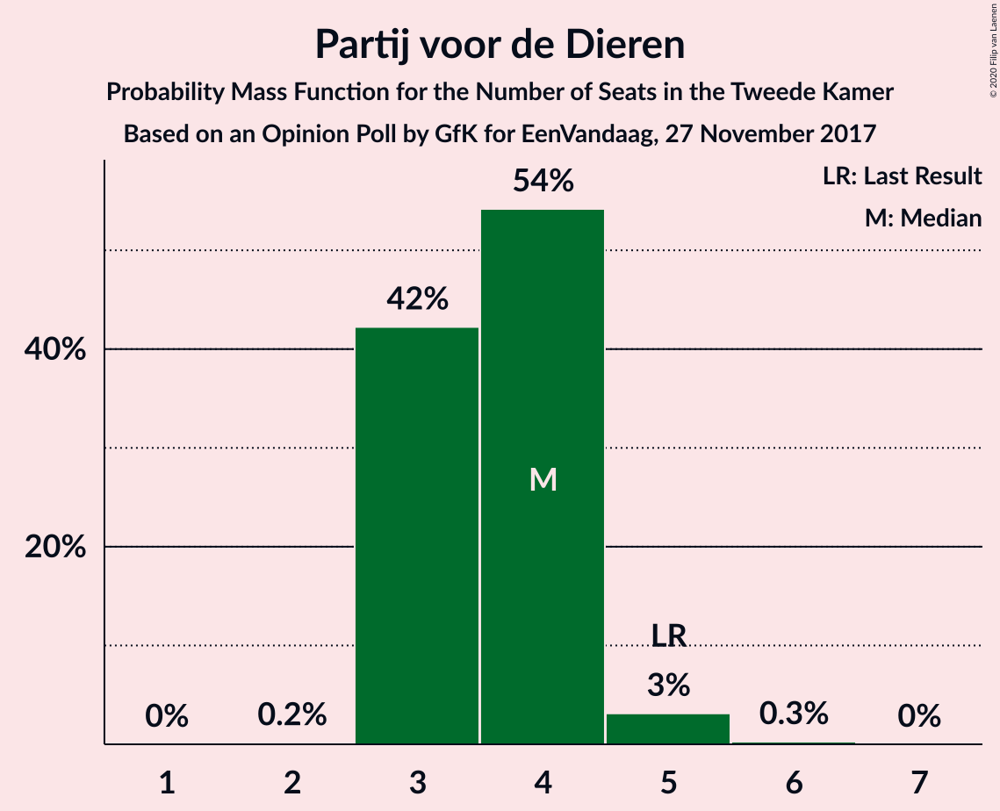

# Opinion Poll by GfK for EenVandaag, 27 November 2017

<a href="#voting-intentions">Voting Intentions</a> | <a href="#seats">Seats</a> | <a href="#coalitions">Coalitions</a> | <a href="#technical-information">Technical Information</a>

## Voting Intentions

### Confidence Intervals

| Party | Last Result | Poll Result | 80% Confidence Interval | 90% Confidence Interval | 95% Confidence Interval | 99% Confidence Interval |
|:-----:|:-----------:|:-----------:|:-----------------------:|:-----------------------:|:-----------------------:|:-----------------------:|
| Volkspartij voor Vrijheid en Democratie | 21.3% | 18.6% | 17.5–19.8% |17.2–20.1% |17.0–20.4% |16.4–21.0% |
| Partij voor de Vrijheid | 13.1% | 15.3% | 14.3–16.4% |14.0–16.7% |13.8–17.0% |13.3–17.5% |
| Democraten 66 | 12.2% | 12.0% | 11.1–13.0% |10.9–13.3% |10.6–13.5% |10.2–14.0% |
| Christen-Democratisch Appèl | 12.4% | 9.3% | 8.5–10.2% |8.3–10.5% |8.1–10.7% |7.8–11.2% |
| GroenLinks | 9.1% | 8.7% | 7.9–9.6% |7.7–9.8% |7.5–10.0% |7.1–10.5% |
| Socialistische Partij | 9.1% | 8.7% | 7.9–9.6% |7.7–9.8% |7.5–10.0% |7.1–10.5% |
| Partij van de Arbeid | 5.7% | 7.3% | 6.6–8.2% |6.4–8.4% |6.3–8.6% |5.9–9.0% |
| Forum voor Democratie | 1.8% | 6.0% | 5.4–6.8% |5.2–7.0% |5.0–7.2% |4.7–7.5% |
| 50Plus | 3.1% | 4.7% | 4.1–5.3% |3.9–5.5% |3.8–5.7% |3.6–6.1% |
| ChristenUnie | 3.4% | 4.0% | 3.5–4.6% |3.3–4.8% |3.2–5.0% |3.0–5.3% |
| Partij voor de Dieren | 3.2% | 2.7% | 2.3–3.2% |2.1–3.4% |2.0–3.5% |1.9–3.8% |
| Staatkundig Gereformeerde Partij | 2.1% | 2.0% | 1.6–2.5% |1.5–2.6% |1.5–2.7% |1.3–3.0% |
| DENK | 2.1% | 0.7% | 0.5–1.0% |0.4–1.1% |0.4–1.1% |0.3–1.3% |

*Note:* The poll result column reflects the actual value used in the calculations. Published results may vary slightly, and in addition be rounded to fewer digits.

## Seats

### Confidence Intervals

| Party | Last Result | Median | 80% Confidence Interval | 90% Confidence Interval | 95% Confidence Interval | 99% Confidence Interval |
|:-----:|:-----------:|:------:|:-----------------------:|:-----------------------:|:-----------------------:|:-----------------------:|
| <a href="#volkspartij-voor-vrijheid-en-democratie">Volkspartij voor Vrijheid en Democratie</a> | 33 | 28 | 27–32 |25–32 |25–32 |25–32 |
| <a href="#partij-voor-de-vrijheid">Partij voor de Vrijheid</a> | 20 | 23 | 22–24 |22–24 |22–25 |20–27 |
| <a href="#democraten-66">Democraten 66</a> | 19 | 18 | 17–19 |17–19 |16–20 |15–20 |
| <a href="#christen-democratisch-appèl">Christen-Democratisch Appèl</a> | 19 | 13 | 12–14 |12–14 |12–14 |11–15 |
| <a href="#groenlinks">GroenLinks</a> | 14 | 14 | 12–15 |11–15 |11–15 |10–15 |
| <a href="#socialistische-partij">Socialistische Partij</a> | 14 | 15 | 11–15 |11–15 |11–15 |11–15 |
| <a href="#partij-van-de-arbeid">Partij van de Arbeid</a> | 9 | 10 | 10–13 |10–13 |10–13 |9–14 |
| <a href="#forum-voor-democratie">Forum voor Democratie</a> | 2 | 8 | 8–10 |8–10 |8–10 |6–11 |
| <a href="#50plus">50Plus</a> | 4 | 7 | 6–7 |6–7 |5–8 |5–9 |
| <a href="#christenunie">ChristenUnie</a> | 5 | 6 | 6–7 |5–8 |5–8 |4–8 |
| <a href="#partij-voor-de-dieren">Partij voor de Dieren</a> | 5 | 4 | 3–4 |3–4 |3–5 |3–5 |
| <a href="#staatkundig-gereformeerde-partij">Staatkundig Gereformeerde Partij</a> | 3 | 3 | 2–3 |2–3 |2–3 |2–4 |
| <a href="#denk">DENK</a> | 3 | 1 | 0–1 |0–1 |0–1 |0–2 |

### Volkspartij voor Vrijheid en Democratie

*For a full overview of the results for this party, see the [Volkspartij voor Vrijheid en Democratie](party-volkspartijvoorvrijheidendemocratie.html) page.*

| Number of Seats | Probability | Accumulated | Special Marks |
|:---------------:|:-----------:|:-----------:|:-------------:|
| 25 | 10% | 100% |  |
| 26 | 0.4% | 90% |  |
| 27 | 2% | 90% |  |
| 28 | 42% | 88% | Median |
| 29 | 34% | 46% |  |
| 30 | 1.3% | 13% |  |
| 31 | 1.3% | 11% |  |
| 32 | 10% | 10% |  |
| 33 | 0.1% | 0.2% | Last Result |
| 34 | 0.1% | 0.1% |  |
| 35 | 0% | 0% |  |

### Partij voor de Vrijheid

*For a full overview of the results for this party, see the [Partij voor de Vrijheid](party-partijvoordevrijheid.html) page.*

| Number of Seats | Probability | Accumulated | Special Marks |
|:---------------:|:-----------:|:-----------:|:-------------:|
| 20 | 0.7% | 100% | Last Result |
| 21 | 0.5% | 99.3% |  |
| 22 | 12% | 98.8% |  |
| 23 | 72% | 87% | Median |
| 24 | 11% | 15% |  |
| 25 | 2% | 4% |  |
| 26 | 1.2% | 2% |  |
| 27 | 0.5% | 0.6% |  |
| 28 | 0.1% | 0.1% |  |
| 29 | 0% | 0% |  |

### Democraten 66

*For a full overview of the results for this party, see the [Democraten 66](party-democraten66.html) page.*

| Number of Seats | Probability | Accumulated | Special Marks |
|:---------------:|:-----------:|:-----------:|:-------------:|
| 15 | 1.0% | 100% |  |
| 16 | 2% | 99.0% |  |
| 17 | 12% | 97% |  |
| 18 | 42% | 85% | Median |
| 19 | 40% | 43% | Last Result |
| 20 | 3% | 3% |  |
| 21 | 0.2% | 0.2% |  |
| 22 | 0% | 0% |  |

### Christen-Democratisch Appèl

*For a full overview of the results for this party, see the [Christen-Democratisch Appèl](party-christen-democratischappèl.html) page.*

| Number of Seats | Probability | Accumulated | Special Marks |
|:---------------:|:-----------:|:-----------:|:-------------:|
| 11 | 2% | 100% |  |
| 12 | 40% | 98% |  |
| 13 | 9% | 59% | Median |
| 14 | 47% | 49% |  |
| 15 | 2% | 2% |  |
| 16 | 0.4% | 0.5% |  |
| 17 | 0.1% | 0.1% |  |
| 18 | 0% | 0% |  |
| 19 | 0% | 0% | Last Result |

### GroenLinks

*For a full overview of the results for this party, see the [GroenLinks](party-groenlinks.html) page.*

| Number of Seats | Probability | Accumulated | Special Marks |
|:---------------:|:-----------:|:-----------:|:-------------:|
| 10 | 0.5% | 100% |  |
| 11 | 6% | 99.5% |  |
| 12 | 4% | 94% |  |
| 13 | 30% | 90% |  |
| 14 | 11% | 60% | Last Result, Median |
| 15 | 48% | 48% |  |
| 16 | 0.1% | 0.2% |  |
| 17 | 0.1% | 0.1% |  |
| 18 | 0% | 0% |  |

### Socialistische Partij

*For a full overview of the results for this party, see the [Socialistische Partij](party-socialistischepartij.html) page.*

| Number of Seats | Probability | Accumulated | Special Marks |
|:---------------:|:-----------:|:-----------:|:-------------:|
| 10 | 0.1% | 100% |  |
| 11 | 11% | 99.9% |  |
| 12 | 2% | 89% |  |
| 13 | 28% | 87% |  |
| 14 | 9% | 59% | Last Result |
| 15 | 51% | 51% | Median |
| 16 | 0.1% | 0.1% |  |
| 17 | 0% | 0% |  |

### Partij van de Arbeid

*For a full overview of the results for this party, see the [Partij van de Arbeid](party-partijvandearbeid.html) page.*

| Number of Seats | Probability | Accumulated | Special Marks |
|:---------------:|:-----------:|:-----------:|:-------------:|
| 8 | 0.1% | 100% |  |
| 9 | 2% | 99.9% | Last Result |
| 10 | 54% | 98% | Median |
| 11 | 2% | 45% |  |
| 12 | 10% | 42% |  |
| 13 | 31% | 32% |  |
| 14 | 1.0% | 1.0% |  |
| 15 | 0% | 0% |  |

### Forum voor Democratie

*For a full overview of the results for this party, see the [Forum voor Democratie](party-forumvoordemocratie.html) page.*

| Number of Seats | Probability | Accumulated | Special Marks |
|:---------------:|:-----------:|:-----------:|:-------------:|
| 2 | 0% | 100% | Last Result |
| 3 | 0% | 100% |  |
| 4 | 0% | 100% |  |
| 5 | 0% | 100% |  |
| 6 | 0.6% | 100% |  |
| 7 | 0.1% | 99.4% |  |
| 8 | 82% | 99.3% | Median |
| 9 | 3% | 17% |  |
| 10 | 12% | 14% |  |
| 11 | 2% | 2% |  |
| 12 | 0.1% | 0.1% |  |
| 13 | 0% | 0% |  |

### 50Plus

*For a full overview of the results for this party, see the [50Plus](party-50plus.html) page.*

| Number of Seats | Probability | Accumulated | Special Marks |
|:---------------:|:-----------:|:-----------:|:-------------:|
| 4 | 0% | 100% | Last Result |
| 5 | 3% | 100% |  |
| 6 | 34% | 97% |  |
| 7 | 60% | 63% | Median |
| 8 | 3% | 4% |  |
| 9 | 0.8% | 0.8% |  |
| 10 | 0% | 0% |  |

### ChristenUnie

*For a full overview of the results for this party, see the [ChristenUnie](party-christenunie.html) page.*

| Number of Seats | Probability | Accumulated | Special Marks |
|:---------------:|:-----------:|:-----------:|:-------------:|
| 4 | 0.6% | 100% |  |
| 5 | 7% | 99.4% | Last Result |
| 6 | 54% | 92% | Median |
| 7 | 34% | 39% |  |
| 8 | 5% | 5% |  |
| 9 | 0% | 0% |  |

### Partij voor de Dieren

*For a full overview of the results for this party, see the [Partij voor de Dieren](party-partijvoordedieren.html) page.*

| Number of Seats | Probability | Accumulated | Special Marks |
|:---------------:|:-----------:|:-----------:|:-------------:|
| 2 | 0.2% | 100% |  |
| 3 | 42% | 99.8% |  |
| 4 | 54% | 58% | Median |
| 5 | 3% | 3% | Last Result |
| 6 | 0.3% | 0.3% |  |
| 7 | 0% | 0% |  |

### Staatkundig Gereformeerde Partij

*For a full overview of the results for this party, see the [Staatkundig Gereformeerde Partij](party-staatkundiggereformeerdepartij.html) page.*

| Number of Seats | Probability | Accumulated | Special Marks |
|:---------------:|:-----------:|:-----------:|:-------------:|
| 1 | 0.5% | 100% |  |
| 2 | 34% | 99.5% |  |
| 3 | 65% | 65% | Last Result, Median |
| 4 | 0.7% | 0.7% |  |
| 5 | 0% | 0% |  |

### DENK

*For a full overview of the results for this party, see the [DENK](party-denk.html) page.*

| Number of Seats | Probability | Accumulated | Special Marks |
|:---------------:|:-----------:|:-----------:|:-------------:|
| 0 | 48% | 100% |  |
| 1 | 51% | 52% | Median |
| 2 | 0.6% | 0.6% |  |
| 3 | 0% | 0% | Last Result |

## Coalitions

### Confidence Intervals

| Coalition | Last Result | Median | Majority? | 80% Confidence Interval | 90% Confidence Interval | 95% Confidence Interval | 99% Confidence Interval |
|:---------:|:-----------:|:------:|:---------:|:-----------------------:|:-----------------------:|:-----------------------:|:-----------------------:|
| Volkspartij voor Vrijheid en Democratie – Democraten 66 – Christen-Democratisch Appèl – GroenLinks – ChristenUnie | 90 | 80 | 94% | 77–82 | 75–85 | 75–85 | 75–85 |
| Volkspartij voor Vrijheid en Democratie – Democraten 66 – Christen-Democratisch Appèl – Partij van de Arbeid – ChristenUnie | 85 | 75 | 49% | 75–81 | 74–81 | 74–81 | 72–82 |
| Volkspartij voor Vrijheid en Democratie – Partij voor de Vrijheid – Christen-Democratisch Appèl – Forum voor Democratie – Staatkundig Gereformeerde Partij | 77 | 75 | 49% | 74–79 | 74–79 | 74–79 | 73–81 |
| Democraten 66 – Christen-Democratisch Appèl – GroenLinks – Socialistische Partij – Partij van de Arbeid – ChristenUnie | 80 | 77 | 78% | 74–78 | 74–78 | 72–78 | 71–78 |
| Volkspartij voor Vrijheid en Democratie – Partij voor de Vrijheid – Christen-Democratisch Appèl – Forum voor Democratie | 74 | 73 | 14% | 71–76 | 71–76 | 71–77 | 71–79 |
| Volkspartij voor Vrijheid en Democratie – Democraten 66 – Christen-Democratisch Appèl – ChristenUnie | 76 | 65 | 0% | 63–70 | 61–70 | 61–70 | 61–70 |
| Volkspartij voor Vrijheid en Democratie – Partij voor de Vrijheid – Christen-Democratisch Appèl | 72 | 63 | 0% | 63–68 | 62–68 | 62–68 | 62–71 |
| Democraten 66 – Christen-Democratisch Appèl – GroenLinks – Partij van de Arbeid – ChristenUnie | 66 | 62 | 0% | 61–65 | 60–65 | 59–65 | 57–65 |
| Volkspartij voor Vrijheid en Democratie – Christen-Democratisch Appèl – Forum voor Democratie – 50Plus – Staatkundig Gereformeerde Partij | 61 | 58 | 0% | 58–64 | 58–64 | 58–64 | 57–64 |
| Volkspartij voor Vrijheid en Democratie – Democraten 66 – Christen-Democratisch Appèl | 71 | 59 | 0% | 57–64 | 56–64 | 56–64 | 56–65 |
| Volkspartij voor Vrijheid en Democratie – Christen-Democratisch Appèl – Forum voor Democratie – 50Plus | 58 | 56 | 0% | 55–61 | 55–61 | 55–61 | 55–62 |
| Volkspartij voor Vrijheid en Democratie – Democraten 66 – Partij van de Arbeid | 61 | 57 | 0% | 55–60 | 54–60 | 54–61 | 52–63 |
| Volkspartij voor Vrijheid en Democratie – Christen-Democratisch Appèl – Forum voor Democratie – Staatkundig Gereformeerde Partij | 57 | 52 | 0% | 51–57 | 51–57 | 51–57 | 51–57 |
| Volkspartij voor Vrijheid en Democratie – Christen-Democratisch Appèl – Partij van de Arbeid | 61 | 52 | 0% | 50–56 | 50–56 | 50–56 | 50–57 |
| Volkspartij voor Vrijheid en Democratie – Christen-Democratisch Appèl – Forum voor Democratie | 54 | 50 | 0% | 48–54 | 48–54 | 48–54 | 48–54 |
| Volkspartij voor Vrijheid en Democratie – Christen-Democratisch Appèl | 52 | 40 | 0% | 40–45 | 39–46 | 39–46 | 39–46 |
| Democraten 66 – Christen-Democratisch Appèl – Partij van de Arbeid | 47 | 42 | 0% | 41–45 | 41–45 | 41–45 | 38–47 |
| Volkspartij voor Vrijheid en Democratie – Partij van de Arbeid | 42 | 38 | 0% | 38–42 | 37–42 | 37–42 | 37–43 |
| Christen-Democratisch Appèl – Partij van de Arbeid – ChristenUnie | 33 | 30 | 0% | 28–34 | 28–34 | 28–34 | 28–34 |
| Democraten 66 – Christen-Democratisch Appèl | 38 | 31 | 0% | 31–32 | 31–32 | 30–32 | 29–35 |
| Christen-Democratisch Appèl – Partij van de Arbeid | 28 | 24 | 0% | 22–27 | 22–27 | 22–27 | 22–27 |

### Volkspartij voor Vrijheid en Democratie – Democraten 66 – Christen-Democratisch Appèl – GroenLinks – ChristenUnie

| Number of Seats | Probability | Accumulated | Special Marks |
|:---------------:|:-----------:|:-----------:|:-------------:|
| 74 | 0.2% | 100% |  |
| 75 | 5% | 99.8% |  |
| 76 | 1.5% | 94% | Majority |
| 77 | 6% | 93% |  |
| 78 | 2% | 87% |  |
| 79 | 6% | 85% | Median |
| 80 | 41% | 79% |  |
| 81 | 27% | 38% |  |
| 82 | 1.1% | 11% |  |
| 83 | 0.2% | 9% |  |
| 84 | 0.1% | 9% |  |
| 85 | 9% | 9% |  |
| 86 | 0% | 0% |  |
| 87 | 0% | 0% |  |
| 88 | 0% | 0% |  |
| 89 | 0% | 0% |  |
| 90 | 0% | 0% | Last Result |

### Volkspartij voor Vrijheid en Democratie – Democraten 66 – Christen-Democratisch Appèl – Partij van de Arbeid – ChristenUnie

| Number of Seats | Probability | Accumulated | Special Marks |
|:---------------:|:-----------:|:-----------:|:-------------:|
| 71 | 0.1% | 100% |  |
| 72 | 0.8% | 99.9% |  |
| 73 | 0.2% | 99.0% |  |
| 74 | 6% | 98.9% |  |
| 75 | 44% | 93% | Median |
| 76 | 2% | 49% | Majority |
| 77 | 0.7% | 47% |  |
| 78 | 6% | 47% |  |
| 79 | 3% | 41% |  |
| 80 | 10% | 38% |  |
| 81 | 28% | 28% |  |
| 82 | 0.7% | 0.7% |  |
| 83 | 0% | 0.1% |  |
| 84 | 0% | 0% |  |
| 85 | 0% | 0% | Last Result |

### Volkspartij voor Vrijheid en Democratie – Partij voor de Vrijheid – Christen-Democratisch Appèl – Forum voor Democratie – Staatkundig Gereformeerde Partij

| Number of Seats | Probability | Accumulated | Special Marks |
|:---------------:|:-----------:|:-----------:|:-------------:|
| 73 | 0.8% | 100% |  |
| 74 | 39% | 99.2% |  |
| 75 | 11% | 60% | Median |
| 76 | 28% | 49% | Majority |
| 77 | 7% | 22% | Last Result |
| 78 | 0.7% | 14% |  |
| 79 | 11% | 14% |  |
| 80 | 0.9% | 2% |  |
| 81 | 0.9% | 1.2% |  |
| 82 | 0.1% | 0.3% |  |
| 83 | 0.2% | 0.3% |  |
| 84 | 0% | 0% |  |

### Democraten 66 – Christen-Democratisch Appèl – GroenLinks – Socialistische Partij – Partij van de Arbeid – ChristenUnie

| Number of Seats | Probability | Accumulated | Special Marks |
|:---------------:|:-----------:|:-----------:|:-------------:|
| 69 | 0.2% | 100% |  |
| 70 | 0.3% | 99.8% |  |
| 71 | 1.2% | 99.5% |  |
| 72 | 1.3% | 98% |  |
| 73 | 2% | 97% |  |
| 74 | 10% | 95% |  |
| 75 | 7% | 86% |  |
| 76 | 1.0% | 78% | Median, Majority |
| 77 | 41% | 77% |  |
| 78 | 37% | 37% |  |
| 79 | 0.1% | 0.3% |  |
| 80 | 0% | 0.2% | Last Result |
| 81 | 0.2% | 0.2% |  |
| 82 | 0% | 0% |  |

### Volkspartij voor Vrijheid en Democratie – Partij voor de Vrijheid – Christen-Democratisch Appèl – Forum voor Democratie

| Number of Seats | Probability | Accumulated | Special Marks |
|:---------------:|:-----------:|:-----------:|:-------------:|
| 71 | 39% | 100% |  |
| 72 | 7% | 61% | Median |
| 73 | 7% | 54% |  |
| 74 | 32% | 47% | Last Result |
| 75 | 2% | 15% |  |
| 76 | 11% | 14% | Majority |
| 77 | 1.3% | 3% |  |
| 78 | 0.7% | 2% |  |
| 79 | 0.7% | 0.9% |  |
| 80 | 0.1% | 0.2% |  |
| 81 | 0% | 0% |  |

### Volkspartij voor Vrijheid en Democratie – Democraten 66 – Christen-Democratisch Appèl – ChristenUnie

| Number of Seats | Probability | Accumulated | Special Marks |
|:---------------:|:-----------:|:-----------:|:-------------:|
| 61 | 5% | 100% |  |
| 62 | 0.2% | 95% |  |
| 63 | 6% | 95% |  |
| 64 | 1.5% | 89% |  |
| 65 | 40% | 87% | Median |
| 66 | 2% | 47% |  |
| 67 | 3% | 45% |  |
| 68 | 31% | 42% |  |
| 69 | 1.1% | 11% |  |
| 70 | 10% | 10% |  |
| 71 | 0.5% | 0.5% |  |
| 72 | 0% | 0% |  |
| 73 | 0% | 0% |  |
| 74 | 0% | 0% |  |
| 75 | 0% | 0% |  |
| 76 | 0% | 0% | Last Result, Majority |

### Volkspartij voor Vrijheid en Democratie – Partij voor de Vrijheid – Christen-Democratisch Appèl

| Number of Seats | Probability | Accumulated | Special Marks |
|:---------------:|:-----------:|:-----------:|:-------------:|
| 61 | 0.1% | 100% |  |
| 62 | 6% | 99.9% |  |
| 63 | 44% | 93% |  |
| 64 | 2% | 49% | Median |
| 65 | 2% | 48% |  |
| 66 | 31% | 45% |  |
| 67 | 3% | 14% |  |
| 68 | 10% | 11% |  |
| 69 | 0.7% | 2% |  |
| 70 | 0.1% | 0.9% |  |
| 71 | 0.7% | 0.8% |  |
| 72 | 0.1% | 0.1% | Last Result |
| 73 | 0% | 0% |  |

### Democraten 66 – Christen-Democratisch Appèl – GroenLinks – Partij van de Arbeid – ChristenUnie

| Number of Seats | Probability | Accumulated | Special Marks |
|:---------------:|:-----------:|:-----------:|:-------------:|
| 56 | 0.1% | 100% |  |
| 57 | 1.5% | 99.9% |  |
| 58 | 0.7% | 98% |  |
| 59 | 2% | 98% |  |
| 60 | 5% | 96% |  |
| 61 | 1.4% | 91% | Median |
| 62 | 40% | 90% |  |
| 63 | 17% | 49% |  |
| 64 | 6% | 33% |  |
| 65 | 27% | 27% |  |
| 66 | 0.3% | 0.3% | Last Result |
| 67 | 0% | 0% |  |

### Volkspartij voor Vrijheid en Democratie – Christen-Democratisch Appèl – Forum voor Democratie – 50Plus – Staatkundig Gereformeerde Partij

| Number of Seats | Probability | Accumulated | Special Marks |
|:---------------:|:-----------:|:-----------:|:-------------:|
| 55 | 0.1% | 100% |  |
| 56 | 0% | 99.9% |  |
| 57 | 0.5% | 99.8% |  |
| 58 | 50% | 99.3% |  |
| 59 | 28% | 49% | Median |
| 60 | 7% | 22% |  |
| 61 | 1.2% | 15% | Last Result |
| 62 | 1.0% | 14% |  |
| 63 | 2% | 12% |  |
| 64 | 10% | 10% |  |
| 65 | 0.3% | 0.4% |  |
| 66 | 0% | 0.1% |  |
| 67 | 0% | 0% |  |

### Volkspartij voor Vrijheid en Democratie – Democraten 66 – Christen-Democratisch Appèl

| Number of Seats | Probability | Accumulated | Special Marks |
|:---------------:|:-----------:|:-----------:|:-------------:|
| 56 | 10% | 100% |  |
| 57 | 2% | 90% |  |
| 58 | 1.1% | 89% |  |
| 59 | 41% | 87% | Median |
| 60 | 8% | 47% |  |
| 61 | 27% | 39% |  |
| 62 | 0.7% | 12% |  |
| 63 | 1.0% | 12% |  |
| 64 | 10% | 11% |  |
| 65 | 0.5% | 0.6% |  |
| 66 | 0% | 0% |  |
| 67 | 0% | 0% |  |
| 68 | 0% | 0% |  |
| 69 | 0% | 0% |  |
| 70 | 0% | 0% |  |
| 71 | 0% | 0% | Last Result |

### Volkspartij voor Vrijheid en Democratie – Christen-Democratisch Appèl – Forum voor Democratie – 50Plus

| Number of Seats | Probability | Accumulated | Special Marks |
|:---------------:|:-----------:|:-----------:|:-------------:|
| 53 | 0.1% | 100% |  |
| 54 | 0% | 99.8% |  |
| 55 | 45% | 99.8% |  |
| 56 | 7% | 55% | Median |
| 57 | 33% | 48% |  |
| 58 | 0.9% | 15% | Last Result |
| 59 | 2% | 14% |  |
| 60 | 2% | 12% |  |
| 61 | 10% | 11% |  |
| 62 | 0.6% | 0.6% |  |
| 63 | 0.1% | 0.1% |  |
| 64 | 0% | 0% |  |

### Volkspartij voor Vrijheid en Democratie – Democraten 66 – Partij van de Arbeid

| Number of Seats | Probability | Accumulated | Special Marks |
|:---------------:|:-----------:|:-----------:|:-------------:|
| 51 | 0.1% | 100% |  |
| 52 | 0.8% | 99.9% |  |
| 53 | 0.1% | 99.2% |  |
| 54 | 5% | 99.1% |  |
| 55 | 6% | 94% |  |
| 56 | 3% | 89% | Median |
| 57 | 43% | 85% |  |
| 58 | 1.1% | 42% |  |
| 59 | 1.3% | 41% |  |
| 60 | 35% | 40% |  |
| 61 | 3% | 5% | Last Result |
| 62 | 1.3% | 2% |  |
| 63 | 0.5% | 0.5% |  |
| 64 | 0% | 0% |  |

### Volkspartij voor Vrijheid en Democratie – Christen-Democratisch Appèl – Forum voor Democratie – Staatkundig Gereformeerde Partij

| Number of Seats | Probability | Accumulated | Special Marks |
|:---------------:|:-----------:|:-----------:|:-------------:|
| 49 | 0.1% | 100% |  |
| 50 | 0.2% | 99.9% |  |
| 51 | 45% | 99.7% |  |
| 52 | 5% | 55% | Median |
| 53 | 33% | 50% |  |
| 54 | 4% | 17% |  |
| 55 | 1.0% | 13% |  |
| 56 | 2% | 12% |  |
| 57 | 10% | 10% | Last Result |
| 58 | 0.1% | 0.3% |  |
| 59 | 0.2% | 0.2% |  |
| 60 | 0% | 0% |  |

### Volkspartij voor Vrijheid en Democratie – Christen-Democratisch Appèl – Partij van de Arbeid

| Number of Seats | Probability | Accumulated | Special Marks |
|:---------------:|:-----------:|:-----------:|:-------------:|
| 48 | 0.1% | 100% |  |
| 49 | 0.2% | 99.9% |  |
| 50 | 39% | 99.7% |  |
| 51 | 7% | 61% | Median |
| 52 | 12% | 54% |  |
| 53 | 0.8% | 42% |  |
| 54 | 2% | 41% |  |
| 55 | 1.2% | 39% |  |
| 56 | 37% | 38% |  |
| 57 | 0.8% | 0.9% |  |
| 58 | 0.1% | 0.1% |  |
| 59 | 0.1% | 0.1% |  |
| 60 | 0% | 0% |  |
| 61 | 0% | 0% | Last Result |

### Volkspartij voor Vrijheid en Democratie – Christen-Democratisch Appèl – Forum voor Democratie

| Number of Seats | Probability | Accumulated | Special Marks |
|:---------------:|:-----------:|:-----------:|:-------------:|
| 47 | 0.1% | 100% |  |
| 48 | 39% | 99.8% |  |
| 49 | 11% | 61% | Median |
| 50 | 7% | 50% |  |
| 51 | 30% | 43% |  |
| 52 | 1.5% | 13% |  |
| 53 | 1.1% | 12% |  |
| 54 | 10% | 11% | Last Result |
| 55 | 0.4% | 0.5% |  |
| 56 | 0.1% | 0.1% |  |
| 57 | 0% | 0% |  |

### Volkspartij voor Vrijheid en Democratie – Christen-Democratisch Appèl

| Number of Seats | Probability | Accumulated | Special Marks |
|:---------------:|:-----------:|:-----------:|:-------------:|
| 38 | 0.2% | 100% |  |
| 39 | 10% | 99.8% |  |
| 40 | 41% | 90% |  |
| 41 | 1.3% | 49% | Median |
| 42 | 8% | 48% |  |
| 43 | 27% | 39% |  |
| 44 | 2% | 12% |  |
| 45 | 1.0% | 11% |  |
| 46 | 10% | 10% |  |
| 47 | 0.2% | 0.2% |  |
| 48 | 0% | 0% |  |
| 49 | 0% | 0% |  |
| 50 | 0% | 0% |  |
| 51 | 0% | 0% |  |
| 52 | 0% | 0% | Last Result |

### Democraten 66 – Christen-Democratisch Appèl – Partij van de Arbeid

| Number of Seats | Probability | Accumulated | Special Marks |
|:---------------:|:-----------:|:-----------:|:-------------:|
| 38 | 0.8% | 100% |  |
| 39 | 0.2% | 99.2% |  |
| 40 | 1.4% | 98.9% |  |
| 41 | 45% | 98% | Median |
| 42 | 11% | 52% |  |
| 43 | 7% | 42% |  |
| 44 | 7% | 35% |  |
| 45 | 27% | 28% |  |
| 46 | 0.9% | 2% |  |
| 47 | 0.9% | 1.0% | Last Result |
| 48 | 0.1% | 0.1% |  |
| 49 | 0% | 0% |  |

### Volkspartij voor Vrijheid en Democratie – Partij van de Arbeid

| Number of Seats | Probability | Accumulated | Special Marks |
|:---------------:|:-----------:|:-----------:|:-------------:|
| 35 | 0.1% | 100% |  |
| 36 | 0.3% | 99.9% |  |
| 37 | 6% | 99.6% |  |
| 38 | 45% | 94% | Median |
| 39 | 6% | 49% |  |
| 40 | 2% | 43% |  |
| 41 | 3% | 41% |  |
| 42 | 36% | 38% | Last Result |
| 43 | 2% | 2% |  |
| 44 | 0.4% | 0.5% |  |
| 45 | 0.1% | 0.1% |  |
| 46 | 0% | 0% |  |

### Christen-Democratisch Appèl – Partij van de Arbeid – ChristenUnie

| Number of Seats | Probability | Accumulated | Special Marks |
|:---------------:|:-----------:|:-----------:|:-------------:|
| 26 | 0.1% | 100% |  |
| 27 | 0.1% | 99.9% |  |
| 28 | 39% | 99.7% |  |
| 29 | 2% | 60% | Median |
| 30 | 12% | 58% |  |
| 31 | 7% | 46% |  |
| 32 | 6% | 39% |  |
| 33 | 6% | 33% | Last Result |
| 34 | 27% | 27% |  |
| 35 | 0.2% | 0.2% |  |
| 36 | 0% | 0% |  |

### Democraten 66 – Christen-Democratisch Appèl

| Number of Seats | Probability | Accumulated | Special Marks |
|:---------------:|:-----------:|:-----------:|:-------------:|
| 29 | 2% | 100% |  |
| 30 | 2% | 98% |  |
| 31 | 56% | 96% | Median |
| 32 | 37% | 40% |  |
| 33 | 0.9% | 2% |  |
| 34 | 0.7% | 1.4% |  |
| 35 | 0.5% | 0.7% |  |
| 36 | 0.1% | 0.2% |  |
| 37 | 0.1% | 0.1% |  |
| 38 | 0% | 0% | Last Result |

### Christen-Democratisch Appèl – Partij van de Arbeid

| Number of Seats | Probability | Accumulated | Special Marks |
|:---------------:|:-----------:|:-----------:|:-------------:|
| 20 | 0.1% | 100% |  |
| 21 | 0.1% | 99.9% |  |
| 22 | 39% | 99.8% |  |
| 23 | 8% | 61% | Median |
| 24 | 11% | 53% |  |
| 25 | 3% | 42% |  |
| 26 | 5% | 39% |  |
| 27 | 33% | 33% |  |
| 28 | 0.1% | 0.3% | Last Result |
| 29 | 0.2% | 0.2% |  |
| 30 | 0% | 0% |  |

## Technical Information

### Opinion Poll

+ **Polling firm:** GfK
+ **Commissioner(s):** EenVandaag
+ **Fieldwork period:** 27 November 2017

### Calculations

+ **Sample size:** 1948
+ **Simulations done:** 1,048,576
+ **Error estimate:** 2.04%

