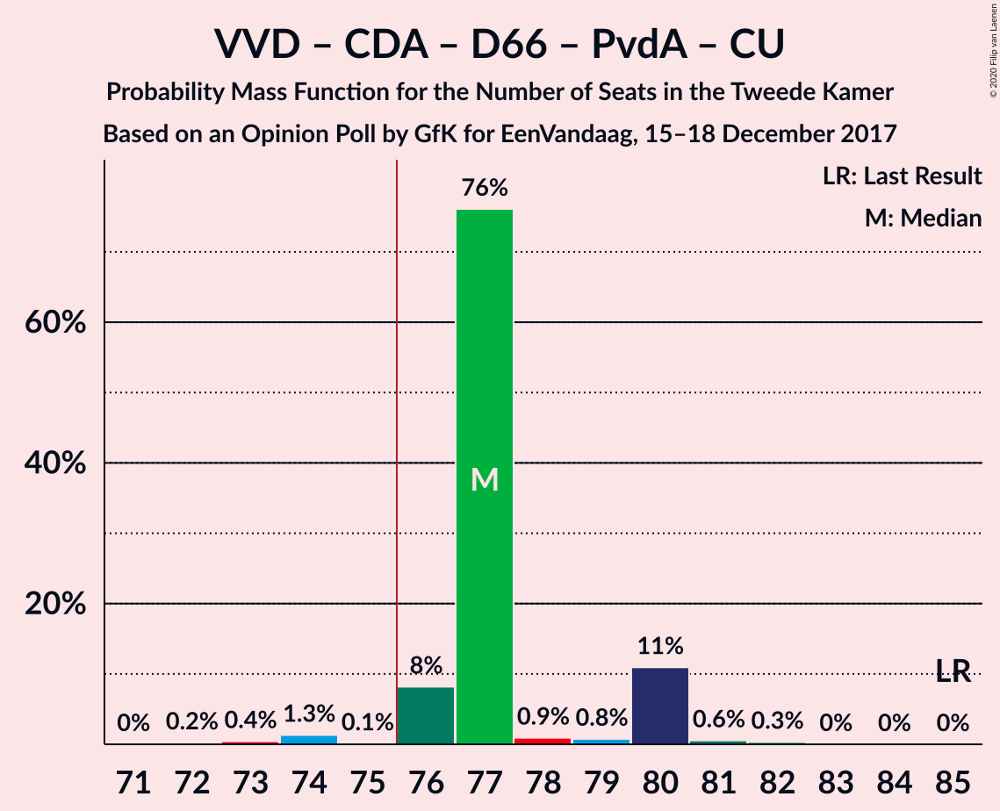
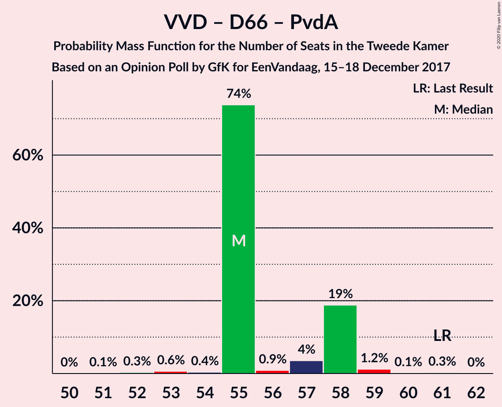

# Opinion Poll by GfK for EenVandaag, 15–18 December 2017

<a href="#voting-intentions">Voting Intentions</a> | <a href="#seats">Seats</a> | <a href="#coalitions">Coalitions</a> | <a href="#technical-information">Technical Information</a>

## Voting Intentions

### Confidence Intervals

| Party | Last Result | Poll Result | 80% Confidence Interval | 90% Confidence Interval | 95% Confidence Interval | 99% Confidence Interval |
|:-----:|:-----------:|:-----------:|:-----------------------:|:-----------------------:|:-----------------------:|:-----------------------:|
| Volkspartij voor Vrijheid en Democratie | 21.3% | 19.3% | 18.2–20.5% |17.8–20.8% |17.6–21.1% |17.1–21.7% |
| Partij voor de Vrijheid | 13.1% | 14.0% | 13.0–15.1% |12.7–15.4% |12.5–15.6% |12.1–16.2% |
| Christen-Democratisch Appèl | 12.4% | 10.0% | 9.2–11.0% |8.9–11.2% |8.7–11.4% |8.4–11.9% |
| Democraten 66 | 12.2% | 10.0% | 9.2–11.0% |8.9–11.2% |8.7–11.4% |8.4–11.9% |
| Socialistische Partij | 9.1% | 10.0% | 9.2–11.0% |8.9–11.2% |8.7–11.4% |8.4–11.9% |
| GroenLinks | 9.1% | 8.7% | 7.9–9.5% |7.7–9.8% |7.5–10.0% |7.1–10.4% |
| Partij van de Arbeid | 5.7% | 7.3% | 6.6–8.2% |6.4–8.4% |6.2–8.6% |5.9–9.0% |
| Forum voor Democratie | 1.8% | 6.7% | 6.0–7.5% |5.8–7.7% |5.6–7.9% |5.3–8.3% |
| ChristenUnie | 3.4% | 4.0% | 3.5–4.6% |3.3–4.8% |3.2–5.0% |3.0–5.3% |
| Partij voor de Dieren | 3.2% | 3.4% | 2.9–3.9% |2.7–4.1% |2.6–4.3% |2.4–4.6% |
| 50Plus | 3.1% | 3.4% | 2.9–3.9% |2.7–4.1% |2.6–4.3% |2.4–4.6% |
| Staatkundig Gereformeerde Partij | 2.1% | 2.0% | 1.6–2.5% |1.5–2.6% |1.4–2.7% |1.3–3.0% |
| DENK | 2.1% | 1.3% | 1.0–1.7% |0.9–1.8% |0.9–1.9% |0.8–2.1% |

*Note:* The poll result column reflects the actual value used in the calculations. Published results may vary slightly, and in addition be rounded to fewer digits.

## Seats

### Confidence Intervals

| Party | Last Result | Median | 80% Confidence Interval | 90% Confidence Interval | 95% Confidence Interval | 99% Confidence Interval |
|:-----:|:-----------:|:------:|:-----------------------:|:-----------------------:|:-----------------------:|:-----------------------:|
| <a href="#volkspartij-voor-vrijheid-en-democratie">Volkspartij voor Vrijheid en Democratie</a> | 33 | 30 | 30–31 |30–31 |30–31 |27–32 |
| <a href="#partij-voor-de-vrijheid">Partij voor de Vrijheid</a> | 20 | 21 | 19–22 |19–22 |19–22 |18–24 |
| <a href="#christen-democratisch-appèl">Christen-Democratisch Appèl</a> | 19 | 16 | 14–16 |13–16 |13–16 |13–18 |
| <a href="#democraten-66">Democraten 66</a> | 19 | 16 | 16–18 |16–18 |15–18 |13–19 |
| <a href="#socialistische-partij">Socialistische Partij</a> | 14 | 16 | 15–16 |15–16 |14–16 |13–17 |
| <a href="#groenlinks">GroenLinks</a> | 14 | 13 | 13 |13 |13 |11–15 |
| <a href="#partij-van-de-arbeid">Partij van de Arbeid</a> | 9 | 9 | 9–11 |9–11 |9–12 |8–13 |
| <a href="#forum-voor-democratie">Forum voor Democratie</a> | 2 | 10 | 9–10 |9–10 |8–10 |8–11 |
| <a href="#christenunie">ChristenUnie</a> | 5 | 6 | 5–6 |5–6 |5–6 |4–7 |
| <a href="#partij-voor-de-dieren">Partij voor de Dieren</a> | 5 | 6 | 4–6 |4–6 |4–6 |4–6 |
| <a href="#50plus">50Plus</a> | 4 | 4 | 4–6 |4–6 |4–6 |4–6 |
| <a href="#staatkundig-gereformeerde-partij">Staatkundig Gereformeerde Partij</a> | 3 | 2 | 2–3 |2–3 |2–3 |2–4 |
| <a href="#denk">DENK</a> | 3 | 1 | 1 |1 |1–2 |1–2 |

### Volkspartij voor Vrijheid en Democratie

*For a full overview of the results for this party, see the [Volkspartij voor Vrijheid en Democratie](party-volkspartijvoorvrijheidendemocratie.html) page.*

| Number of Seats | Probability | Accumulated | Special Marks |
|:---------------:|:-----------:|:-----------:|:-------------:|
| 26 | 0% | 100% |  |
| 27 | 0.4% | 99.9% |  |
| 28 | 0.7% | 99.5% |  |
| 29 | 0.8% | 98.8% |  |
| 30 | 87% | 98% | Median |
| 31 | 11% | 11% |  |
| 32 | 0.2% | 0.6% |  |
| 33 | 0.1% | 0.4% | Last Result |
| 34 | 0.1% | 0.3% |  |
| 35 | 0.2% | 0.2% |  |
| 36 | 0% | 0% |  |

### Partij voor de Vrijheid

*For a full overview of the results for this party, see the [Partij voor de Vrijheid](party-partijvoordevrijheid.html) page.*

| Number of Seats | Probability | Accumulated | Special Marks |
|:---------------:|:-----------:|:-----------:|:-------------:|
| 18 | 0.6% | 100% |  |
| 19 | 11% | 99.4% |  |
| 20 | 1.4% | 89% | Last Result |
| 21 | 74% | 87% | Median |
| 22 | 11% | 14% |  |
| 23 | 0.9% | 2% |  |
| 24 | 1.2% | 1.3% |  |
| 25 | 0% | 0.1% |  |
| 26 | 0.1% | 0.1% |  |
| 27 | 0% | 0% |  |

### Christen-Democratisch Appèl

*For a full overview of the results for this party, see the [Christen-Democratisch Appèl](party-christen-democratischappèl.html) page.*

| Number of Seats | Probability | Accumulated | Special Marks |
|:---------------:|:-----------:|:-----------:|:-------------:|
| 12 | 0.2% | 100% |  |
| 13 | 8% | 99.8% |  |
| 14 | 4% | 92% |  |
| 15 | 3% | 88% |  |
| 16 | 84% | 85% | Median |
| 17 | 0.8% | 2% |  |
| 18 | 0.6% | 0.7% |  |
| 19 | 0.1% | 0.1% | Last Result |
| 20 | 0% | 0% |  |

### Democraten 66

*For a full overview of the results for this party, see the [Democraten 66](party-democraten66.html) page.*

| Number of Seats | Probability | Accumulated | Special Marks |
|:---------------:|:-----------:|:-----------:|:-------------:|
| 12 | 0.4% | 100% |  |
| 13 | 0.4% | 99.6% |  |
| 14 | 2% | 99.2% |  |
| 15 | 2% | 98% |  |
| 16 | 83% | 96% | Median |
| 17 | 1.3% | 13% |  |
| 18 | 11% | 11% |  |
| 19 | 0.5% | 0.5% | Last Result |
| 20 | 0% | 0% |  |

### Socialistische Partij

*For a full overview of the results for this party, see the [Socialistische Partij](party-socialistischepartij.html) page.*

| Number of Seats | Probability | Accumulated | Special Marks |
|:---------------:|:-----------:|:-----------:|:-------------:|
| 12 | 0.2% | 100% |  |
| 13 | 1.0% | 99.8% |  |
| 14 | 2% | 98.8% | Last Result |
| 15 | 9% | 97% |  |
| 16 | 86% | 88% | Median |
| 17 | 2% | 2% |  |
| 18 | 0.2% | 0.2% |  |
| 19 | 0% | 0% |  |

### GroenLinks

*For a full overview of the results for this party, see the [GroenLinks](party-groenlinks.html) page.*

| Number of Seats | Probability | Accumulated | Special Marks |
|:---------------:|:-----------:|:-----------:|:-------------:|
| 10 | 0.1% | 100% |  |
| 11 | 1.0% | 99.9% |  |
| 12 | 0.8% | 99.0% |  |
| 13 | 96% | 98% | Median |
| 14 | 0.7% | 2% | Last Result |
| 15 | 1.1% | 2% |  |
| 16 | 0.4% | 0.4% |  |
| 17 | 0% | 0% |  |

### Partij van de Arbeid

*For a full overview of the results for this party, see the [Partij van de Arbeid](party-partijvandearbeid.html) page.*

| Number of Seats | Probability | Accumulated | Special Marks |
|:---------------:|:-----------:|:-----------:|:-------------:|
| 8 | 0.6% | 100% |  |
| 9 | 76% | 99.4% | Last Result, Median |
| 10 | 9% | 24% |  |
| 11 | 12% | 15% |  |
| 12 | 2% | 3% |  |
| 13 | 0.4% | 0.6% |  |
| 14 | 0.2% | 0.2% |  |
| 15 | 0% | 0% |  |

### Forum voor Democratie

*For a full overview of the results for this party, see the [Forum voor Democratie](party-forumvoordemocratie.html) page.*

| Number of Seats | Probability | Accumulated | Special Marks |
|:---------------:|:-----------:|:-----------:|:-------------:|
| 2 | 0% | 100% | Last Result |
| 3 | 0% | 100% |  |
| 4 | 0% | 100% |  |
| 5 | 0% | 100% |  |
| 6 | 0% | 100% |  |
| 7 | 0.1% | 100% |  |
| 8 | 4% | 99.9% |  |
| 9 | 20% | 96% |  |
| 10 | 74% | 76% | Median |
| 11 | 1.2% | 1.4% |  |
| 12 | 0.1% | 0.2% |  |
| 13 | 0% | 0% |  |

### ChristenUnie

*For a full overview of the results for this party, see the [ChristenUnie](party-christenunie.html) page.*

| Number of Seats | Probability | Accumulated | Special Marks |
|:---------------:|:-----------:|:-----------:|:-------------:|
| 4 | 1.2% | 100% |  |
| 5 | 10% | 98.8% | Last Result |
| 6 | 88% | 89% | Median |
| 7 | 1.1% | 1.2% |  |
| 8 | 0.1% | 0.1% |  |
| 9 | 0% | 0% |  |

### Partij voor de Dieren

*For a full overview of the results for this party, see the [Partij voor de Dieren](party-partijvoordedieren.html) page.*

| Number of Seats | Probability | Accumulated | Special Marks |
|:---------------:|:-----------:|:-----------:|:-------------:|
| 3 | 0.3% | 100% |  |
| 4 | 14% | 99.7% |  |
| 5 | 3% | 85% | Last Result |
| 6 | 82% | 82% | Median |
| 7 | 0.3% | 0.3% |  |
| 8 | 0% | 0% |  |

### 50Plus

*For a full overview of the results for this party, see the [50Plus](party-50plus.html) page.*

| Number of Seats | Probability | Accumulated | Special Marks |
|:---------------:|:-----------:|:-----------:|:-------------:|
| 3 | 0.3% | 100% |  |
| 4 | 74% | 99.7% | Last Result, Median |
| 5 | 12% | 26% |  |
| 6 | 13% | 14% |  |
| 7 | 0.1% | 0.2% |  |
| 8 | 0% | 0% |  |

### Staatkundig Gereformeerde Partij

*For a full overview of the results for this party, see the [Staatkundig Gereformeerde Partij](party-staatkundiggereformeerdepartij.html) page.*

| Number of Seats | Probability | Accumulated | Special Marks |
|:---------------:|:-----------:|:-----------:|:-------------:|
| 1 | 0.4% | 100% |  |
| 2 | 89% | 99.6% | Median |
| 3 | 10% | 11% | Last Result |
| 4 | 0.5% | 0.5% |  |
| 5 | 0% | 0% |  |

### DENK

*For a full overview of the results for this party, see the [DENK](party-denk.html) page.*

| Number of Seats | Probability | Accumulated | Special Marks |
|:---------------:|:-----------:|:-----------:|:-------------:|
| 1 | 95% | 100% | Median |
| 2 | 4% | 5% |  |
| 3 | 0.4% | 0.5% | Last Result |
| 4 | 0.1% | 0.1% |  |
| 5 | 0% | 0% |  |

## Coalitions

### Confidence Intervals

| Coalition | Last Result | Median | Majority? | 80% Confidence Interval | 90% Confidence Interval | 95% Confidence Interval | 99% Confidence Interval |
|:---------:|:-----------:|:------:|:---------:|:-----------------------:|:-----------------------:|:-----------------------:|:-----------------------:|
| Volkspartij voor Vrijheid en Democratie – Christen-Democratisch Appèl – Democraten 66 – GroenLinks – ChristenUnie | 90 | 81 | 99.7% | 79–82 | 79–82 | 78–82 | 76–82 |
| Volkspartij voor Vrijheid en Democratie – Christen-Democratisch Appèl – Democraten 66 – Partij van de Arbeid – ChristenUnie | 85 | 77 | 98% | 76–80 | 76–80 | 76–80 | 73–81 |
| Volkspartij voor Vrijheid en Democratie – Partij voor de Vrijheid – Christen-Democratisch Appèl – Forum voor Democratie – Staatkundig Gereformeerde Partij | 77 | 79 | 98.7% | 77–79 | 77–79 | 76–80 | 74–82 |
| Christen-Democratisch Appèl – Democraten 66 – Socialistische Partij – GroenLinks – Partij van de Arbeid – ChristenUnie | 80 | 76 | 89% | 74–78 | 74–78 | 74–78 | 72–80 |
| Volkspartij voor Vrijheid en Democratie – Partij voor de Vrijheid – Christen-Democratisch Appèl – Forum voor Democratie | 74 | 77 | 77% | 74–77 | 74–77 | 74–77 | 72–79 |
| Volkspartij voor Vrijheid en Democratie – Christen-Democratisch Appèl – Democraten 66 – ChristenUnie | 76 | 68 | 0% | 66–69 | 66–69 | 65–69 | 62–69 |
| Volkspartij voor Vrijheid en Democratie – Partij voor de Vrijheid – Christen-Democratisch Appèl | 72 | 67 | 0% | 65–67 | 65–67 | 65–68 | 62–70 |
| Volkspartij voor Vrijheid en Democratie – Christen-Democratisch Appèl – Forum voor Democratie – 50Plus – Staatkundig Gereformeerde Partij | 61 | 62 | 0% | 60–64 | 60–64 | 60–64 | 59–65 |
| Volkspartij voor Vrijheid en Democratie – Christen-Democratisch Appèl – Democraten 66 | 71 | 62 | 0% | 61–63 | 61–63 | 60–63 | 57–63 |
| Christen-Democratisch Appèl – Democraten 66 – GroenLinks – Partij van de Arbeid – ChristenUnie | 66 | 60 | 0% | 59–62 | 59–62 | 59–62 | 58–64 |
| Volkspartij voor Vrijheid en Democratie – Christen-Democratisch Appèl – Forum voor Democratie – 50Plus | 58 | 60 | 0% | 58–62 | 57–62 | 57–62 | 57–62 |
| Volkspartij voor Vrijheid en Democratie – Democraten 66 – Partij van de Arbeid | 61 | 55 | 0% | 55–58 | 55–58 | 55–58 | 53–59 |
| Volkspartij voor Vrijheid en Democratie – Christen-Democratisch Appèl – Forum voor Democratie – Staatkundig Gereformeerde Partij | 57 | 58 | 0% | 55–58 | 55–58 | 54–58 | 54–60 |
| Volkspartij voor Vrijheid en Democratie – Christen-Democratisch Appèl – Partij van de Arbeid | 61 | 55 | 0% | 53–58 | 53–58 | 53–58 | 53–60 |
| Volkspartij voor Vrijheid en Democratie – Christen-Democratisch Appèl – Forum voor Democratie | 54 | 56 | 0% | 52–56 | 52–56 | 52–56 | 52–57 |
| Volkspartij voor Vrijheid en Democratie – Christen-Democratisch Appèl | 52 | 46 | 0% | 44–47 | 43–47 | 43–47 | 43–48 |
| Christen-Democratisch Appèl – Democraten 66 – Partij van de Arbeid | 47 | 41 | 0% | 41–43 | 41–43 | 40–43 | 38–46 |
| Volkspartij voor Vrijheid en Democratie – Partij van de Arbeid | 42 | 39 | 0% | 39–42 | 39–42 | 39–42 | 38–44 |
| Christen-Democratisch Appèl – Partij van de Arbeid – ChristenUnie | 33 | 31 | 0% | 29–33 | 28–33 | 28–33 | 28–36 |
| Christen-Democratisch Appèl – Democraten 66 | 38 | 32 | 0% | 31–32 | 31–32 | 30–32 | 27–34 |
| Christen-Democratisch Appèl – Partij van de Arbeid | 28 | 25 | 0% | 23–27 | 23–27 | 23–27 | 23–30 |

### Volkspartij voor Vrijheid en Democratie – Christen-Democratisch Appèl – Democraten 66 – GroenLinks – ChristenUnie

| Number of Seats | Probability | Accumulated | Special Marks |
|:---------------:|:-----------:|:-----------:|:-------------:|
| 73 | 0.1% | 100% |  |
| 74 | 0.1% | 99.9% |  |
| 75 | 0.1% | 99.8% |  |
| 76 | 0.8% | 99.7% | Majority |
| 77 | 0.3% | 98.9% |  |
| 78 | 2% | 98.7% |  |
| 79 | 8% | 97% |  |
| 80 | 1.0% | 89% |  |
| 81 | 76% | 88% | Median |
| 82 | 11% | 11% |  |
| 83 | 0.1% | 0.4% |  |
| 84 | 0% | 0.3% |  |
| 85 | 0.2% | 0.3% |  |
| 86 | 0.1% | 0.1% |  |
| 87 | 0% | 0% |  |
| 88 | 0% | 0% |  |
| 89 | 0% | 0% |  |
| 90 | 0% | 0% | Last Result |

### Volkspartij voor Vrijheid en Democratie – Christen-Democratisch Appèl – Democraten 66 – Partij van de Arbeid – ChristenUnie

| Number of Seats | Probability | Accumulated | Special Marks |
|:---------------:|:-----------:|:-----------:|:-------------:|
| 71 | 0% | 100% |  |
| 72 | 0.2% | 99.9% |  |
| 73 | 0.4% | 99.7% |  |
| 74 | 1.3% | 99.3% |  |
| 75 | 0.1% | 98% |  |
| 76 | 8% | 98% | Majority |
| 77 | 76% | 90% | Median |
| 78 | 0.9% | 14% |  |
| 79 | 0.8% | 13% |  |
| 80 | 11% | 12% |  |
| 81 | 0.6% | 0.9% |  |
| 82 | 0.3% | 0.4% |  |
| 83 | 0% | 0% |  |
| 84 | 0% | 0% |  |
| 85 | 0% | 0% | Last Result |

### Volkspartij voor Vrijheid en Democratie – Partij voor de Vrijheid – Christen-Democratisch Appèl – Forum voor Democratie – Staatkundig Gereformeerde Partij

| Number of Seats | Probability | Accumulated | Special Marks |
|:---------------:|:-----------:|:-----------:|:-------------:|
| 73 | 0.3% | 100% |  |
| 74 | 0.4% | 99.7% |  |
| 75 | 0.6% | 99.3% |  |
| 76 | 3% | 98.7% | Majority |
| 77 | 18% | 95% | Last Result |
| 78 | 0.6% | 77% |  |
| 79 | 73% | 76% | Median |
| 80 | 0.7% | 3% |  |
| 81 | 1.5% | 2% |  |
| 82 | 0.7% | 0.9% |  |
| 83 | 0.1% | 0.1% |  |
| 84 | 0% | 0% |  |

### Christen-Democratisch Appèl – Democraten 66 – Socialistische Partij – GroenLinks – Partij van de Arbeid – ChristenUnie

| Number of Seats | Probability | Accumulated | Special Marks |
|:---------------:|:-----------:|:-----------:|:-------------:|
| 71 | 0.1% | 100% |  |
| 72 | 0.5% | 99.8% |  |
| 73 | 1.2% | 99.3% |  |
| 74 | 9% | 98% |  |
| 75 | 0.6% | 89% |  |
| 76 | 77% | 89% | Median, Majority |
| 77 | 0.6% | 12% |  |
| 78 | 11% | 12% |  |
| 79 | 0.6% | 1.2% |  |
| 80 | 0.6% | 0.6% | Last Result |
| 81 | 0% | 0% |  |

### Volkspartij voor Vrijheid en Democratie – Partij voor de Vrijheid – Christen-Democratisch Appèl – Forum voor Democratie

| Number of Seats | Probability | Accumulated | Special Marks |
|:---------------:|:-----------:|:-----------:|:-------------:|
| 71 | 0.3% | 100% |  |
| 72 | 0.5% | 99.7% |  |
| 73 | 0.4% | 99.2% |  |
| 74 | 12% | 98.8% | Last Result |
| 75 | 10% | 87% |  |
| 76 | 0.8% | 77% | Majority |
| 77 | 74% | 76% | Median |
| 78 | 0.6% | 2% |  |
| 79 | 1.3% | 2% |  |
| 80 | 0.3% | 0.4% |  |
| 81 | 0.1% | 0.1% |  |
| 82 | 0% | 0% |  |

### Volkspartij voor Vrijheid en Democratie – Christen-Democratisch Appèl – Democraten 66 – ChristenUnie

| Number of Seats | Probability | Accumulated | Special Marks |
|:---------------:|:-----------:|:-----------:|:-------------:|
| 60 | 0.2% | 100% |  |
| 61 | 0.1% | 99.8% |  |
| 62 | 0.6% | 99.7% |  |
| 63 | 1.0% | 99.1% |  |
| 64 | 0.4% | 98% |  |
| 65 | 0.4% | 98% |  |
| 66 | 8% | 97% |  |
| 67 | 1.1% | 89% |  |
| 68 | 76% | 88% | Median |
| 69 | 11% | 12% |  |
| 70 | 0.2% | 0.5% |  |
| 71 | 0.2% | 0.3% |  |
| 72 | 0% | 0% |  |
| 73 | 0% | 0% |  |
| 74 | 0% | 0% |  |
| 75 | 0% | 0% |  |
| 76 | 0% | 0% | Last Result, Majority |

### Volkspartij voor Vrijheid en Democratie – Partij voor de Vrijheid – Christen-Democratisch Appèl

| Number of Seats | Probability | Accumulated | Special Marks |
|:---------------:|:-----------:|:-----------:|:-------------:|
| 61 | 0.3% | 100% |  |
| 62 | 0.2% | 99.7% |  |
| 63 | 0.3% | 99.5% |  |
| 64 | 0.9% | 99.2% |  |
| 65 | 8% | 98% |  |
| 66 | 14% | 90% |  |
| 67 | 73% | 76% | Median |
| 68 | 0.4% | 3% |  |
| 69 | 2% | 2% |  |
| 70 | 0.2% | 0.5% |  |
| 71 | 0.3% | 0.4% |  |
| 72 | 0% | 0% | Last Result |

### Volkspartij voor Vrijheid en Democratie – Christen-Democratisch Appèl – Forum voor Democratie – 50Plus – Staatkundig Gereformeerde Partij

| Number of Seats | Probability | Accumulated | Special Marks |
|:---------------:|:-----------:|:-----------:|:-------------:|
| 57 | 0% | 100% |  |
| 58 | 0.2% | 99.9% |  |
| 59 | 0.5% | 99.7% |  |
| 60 | 11% | 99.3% |  |
| 61 | 1.1% | 88% | Last Result |
| 62 | 74% | 87% | Median |
| 63 | 0.7% | 13% |  |
| 64 | 11% | 12% |  |
| 65 | 0.3% | 0.6% |  |
| 66 | 0.2% | 0.3% |  |
| 67 | 0.1% | 0.1% |  |
| 68 | 0% | 0% |  |

### Volkspartij voor Vrijheid en Democratie – Christen-Democratisch Appèl – Democraten 66

| Number of Seats | Probability | Accumulated | Special Marks |
|:---------------:|:-----------:|:-----------:|:-------------:|
| 55 | 0% | 100% |  |
| 56 | 0.3% | 99.9% |  |
| 57 | 0.5% | 99.6% |  |
| 58 | 0.6% | 99.2% |  |
| 59 | 1.0% | 98.5% |  |
| 60 | 0.4% | 98% |  |
| 61 | 8% | 97% |  |
| 62 | 77% | 89% | Median |
| 63 | 11% | 12% |  |
| 64 | 0.3% | 0.4% |  |
| 65 | 0.1% | 0.1% |  |
| 66 | 0% | 0% |  |
| 67 | 0% | 0% |  |
| 68 | 0% | 0% |  |
| 69 | 0% | 0% |  |
| 70 | 0% | 0% |  |
| 71 | 0% | 0% | Last Result |

### Christen-Democratisch Appèl – Democraten 66 – GroenLinks – Partij van de Arbeid – ChristenUnie

| Number of Seats | Probability | Accumulated | Special Marks |
|:---------------:|:-----------:|:-----------:|:-------------:|
| 56 | 0.1% | 100% |  |
| 57 | 0.4% | 99.9% |  |
| 58 | 0.5% | 99.5% |  |
| 59 | 10% | 99.0% |  |
| 60 | 76% | 90% | Median |
| 61 | 1.1% | 13% |  |
| 62 | 11% | 12% |  |
| 63 | 0.6% | 1.3% |  |
| 64 | 0.5% | 0.7% |  |
| 65 | 0.2% | 0.2% |  |
| 66 | 0% | 0% | Last Result |

### Volkspartij voor Vrijheid en Democratie – Christen-Democratisch Appèl – Forum voor Democratie – 50Plus

| Number of Seats | Probability | Accumulated | Special Marks |
|:---------------:|:-----------:|:-----------:|:-------------:|
| 55 | 0.2% | 100% |  |
| 56 | 0.1% | 99.7% |  |
| 57 | 8% | 99.7% |  |
| 58 | 4% | 91% | Last Result |
| 59 | 2% | 88% |  |
| 60 | 74% | 86% | Median |
| 61 | 1.1% | 12% |  |
| 62 | 11% | 11% |  |
| 63 | 0.1% | 0.1% |  |
| 64 | 0.1% | 0.1% |  |
| 65 | 0% | 0% |  |

### Volkspartij voor Vrijheid en Democratie – Democraten 66 – Partij van de Arbeid

| Number of Seats | Probability | Accumulated | Special Marks |
|:---------------:|:-----------:|:-----------:|:-------------:|
| 51 | 0.1% | 100% |  |
| 52 | 0.3% | 99.9% |  |
| 53 | 0.6% | 99.6% |  |
| 54 | 0.4% | 99.0% |  |
| 55 | 74% | 98.6% | Median |
| 56 | 0.9% | 25% |  |
| 57 | 4% | 24% |  |
| 58 | 19% | 20% |  |
| 59 | 1.2% | 2% |  |
| 60 | 0.1% | 0.4% |  |
| 61 | 0.3% | 0.3% | Last Result |
| 62 | 0% | 0% |  |

### Volkspartij voor Vrijheid en Democratie – Christen-Democratisch Appèl – Forum voor Democratie – Staatkundig Gereformeerde Partij

| Number of Seats | Probability | Accumulated | Special Marks |
|:---------------:|:-----------:|:-----------:|:-------------:|
| 53 | 0% | 100% |  |
| 54 | 3% | 99.9% |  |
| 55 | 8% | 96% |  |
| 56 | 1.3% | 88% |  |
| 57 | 2% | 87% | Last Result |
| 58 | 83% | 85% | Median |
| 59 | 0.8% | 2% |  |
| 60 | 0.5% | 0.9% |  |
| 61 | 0.3% | 0.4% |  |
| 62 | 0.1% | 0.1% |  |
| 63 | 0% | 0% |  |

### Volkspartij voor Vrijheid en Democratie – Christen-Democratisch Appèl – Partij van de Arbeid

| Number of Seats | Probability | Accumulated | Special Marks |
|:---------------:|:-----------:|:-----------:|:-------------:|
| 51 | 0% | 100% |  |
| 52 | 0.1% | 99.9% |  |
| 53 | 11% | 99.8% |  |
| 54 | 1.0% | 89% |  |
| 55 | 74% | 88% | Median |
| 56 | 2% | 14% |  |
| 57 | 1.1% | 13% |  |
| 58 | 11% | 12% |  |
| 59 | 0.3% | 1.0% |  |
| 60 | 0.7% | 0.8% |  |
| 61 | 0% | 0% | Last Result |

### Volkspartij voor Vrijheid en Democratie – Christen-Democratisch Appèl – Forum voor Democratie

| Number of Seats | Probability | Accumulated | Special Marks |
|:---------------:|:-----------:|:-----------:|:-------------:|
| 50 | 0% | 100% |  |
| 51 | 0.2% | 99.9% |  |
| 52 | 11% | 99.7% |  |
| 53 | 0.9% | 89% |  |
| 54 | 2% | 88% | Last Result |
| 55 | 1.2% | 86% |  |
| 56 | 84% | 85% | Median |
| 57 | 0.7% | 1.0% |  |
| 58 | 0.3% | 0.4% |  |
| 59 | 0.1% | 0.1% |  |
| 60 | 0% | 0% |  |

### Volkspartij voor Vrijheid en Democratie – Christen-Democratisch Appèl

| Number of Seats | Probability | Accumulated | Special Marks |
|:---------------:|:-----------:|:-----------:|:-------------:|
| 40 | 0.1% | 100% |  |
| 41 | 0.1% | 99.9% |  |
| 42 | 0.2% | 99.8% |  |
| 43 | 8% | 99.6% |  |
| 44 | 4% | 91% |  |
| 45 | 2% | 87% |  |
| 46 | 73% | 85% | Median |
| 47 | 11% | 12% |  |
| 48 | 0.5% | 0.8% |  |
| 49 | 0.2% | 0.3% |  |
| 50 | 0% | 0% |  |
| 51 | 0% | 0% |  |
| 52 | 0% | 0% | Last Result |

### Christen-Democratisch Appèl – Democraten 66 – Partij van de Arbeid

| Number of Seats | Probability | Accumulated | Special Marks |
|:---------------:|:-----------:|:-----------:|:-------------:|
| 36 | 0.1% | 100% |  |
| 37 | 0% | 99.9% |  |
| 38 | 0.6% | 99.9% |  |
| 39 | 0.2% | 99.3% |  |
| 40 | 2% | 99.1% |  |
| 41 | 84% | 97% | Median |
| 42 | 0.6% | 13% |  |
| 43 | 11% | 13% |  |
| 44 | 0.6% | 2% |  |
| 45 | 0.7% | 1.3% |  |
| 46 | 0.2% | 0.6% |  |
| 47 | 0.2% | 0.4% | Last Result |
| 48 | 0.2% | 0.2% |  |
| 49 | 0% | 0% |  |

### Volkspartij voor Vrijheid en Democratie – Partij van de Arbeid

| Number of Seats | Probability | Accumulated | Special Marks |
|:---------------:|:-----------:|:-----------:|:-------------:|
| 37 | 0.3% | 100% |  |
| 38 | 0.4% | 99.7% |  |
| 39 | 76% | 99.2% | Median |
| 40 | 9% | 23% |  |
| 41 | 2% | 14% |  |
| 42 | 12% | 13% | Last Result |
| 43 | 0.2% | 0.8% |  |
| 44 | 0.2% | 0.5% |  |
| 45 | 0.1% | 0.3% |  |
| 46 | 0.2% | 0.2% |  |
| 47 | 0% | 0% |  |

### Christen-Democratisch Appèl – Partij van de Arbeid – ChristenUnie

| Number of Seats | Probability | Accumulated | Special Marks |
|:---------------:|:-----------:|:-----------:|:-------------:|
| 28 | 8% | 100% |  |
| 29 | 3% | 92% |  |
| 30 | 1.1% | 88% |  |
| 31 | 74% | 87% | Median |
| 32 | 1.0% | 14% |  |
| 33 | 11% | 13% | Last Result |
| 34 | 0.1% | 2% |  |
| 35 | 0.7% | 1.4% |  |
| 36 | 0.4% | 0.7% |  |
| 37 | 0.2% | 0.2% |  |
| 38 | 0% | 0% |  |

### Christen-Democratisch Appèl – Democraten 66

| Number of Seats | Probability | Accumulated | Special Marks |
|:---------------:|:-----------:|:-----------:|:-------------:|
| 26 | 0.3% | 100% |  |
| 27 | 0.4% | 99.7% |  |
| 28 | 0.4% | 99.4% |  |
| 29 | 1.4% | 98.9% |  |
| 30 | 0.5% | 98% |  |
| 31 | 8% | 97% |  |
| 32 | 87% | 89% | Median |
| 33 | 1.0% | 2% |  |
| 34 | 0.4% | 0.7% |  |
| 35 | 0.2% | 0.3% |  |
| 36 | 0% | 0% |  |
| 37 | 0% | 0% |  |
| 38 | 0% | 0% | Last Result |

### Christen-Democratisch Appèl – Partij van de Arbeid

| Number of Seats | Probability | Accumulated | Special Marks |
|:---------------:|:-----------:|:-----------:|:-------------:|
| 23 | 11% | 100% |  |
| 24 | 0.7% | 89% |  |
| 25 | 73% | 88% | Median |
| 26 | 2% | 15% |  |
| 27 | 11% | 13% |  |
| 28 | 0.7% | 2% | Last Result |
| 29 | 0.3% | 1.1% |  |
| 30 | 0.7% | 0.9% |  |
| 31 | 0.2% | 0.2% |  |
| 32 | 0% | 0% |  |

## Technical Information

### Opinion Poll

+ **Polling firm:** GfK
+ **Commissioner(s):** EenVandaag
+ **Fieldwork period:** 15–18 December 2017

### Calculations

+ **Sample size:** 1907
+ **Simulations done:** 1,048,576
+ **Error estimate:** 1.49%

