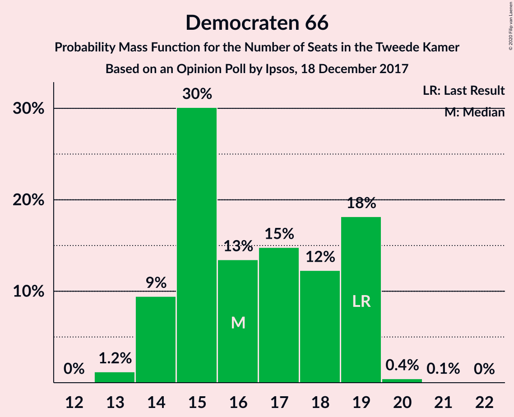
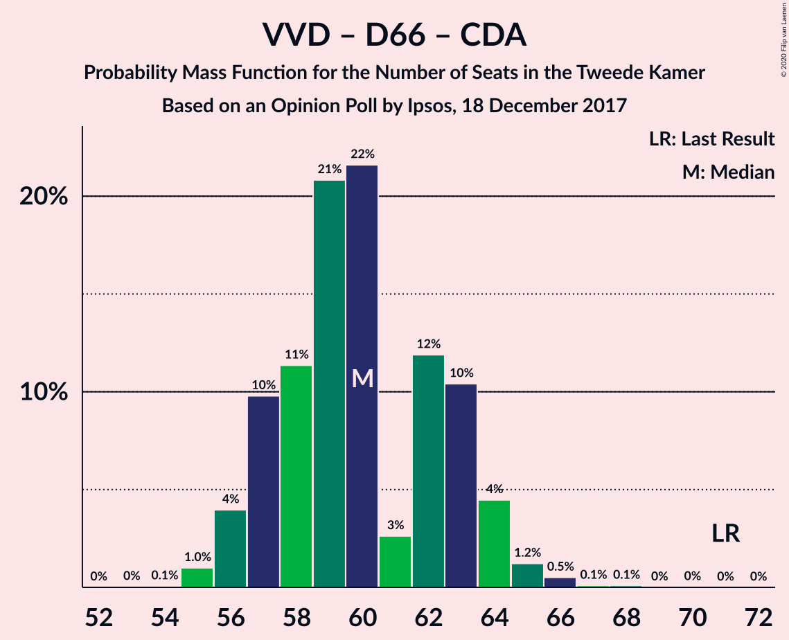

# Opinion Poll by Ipsos, 18 December 2017

<a href="#voting-intentions">Voting Intentions</a> | <a href="#seats">Seats</a> | <a href="#coalitions">Coalitions</a> | <a href="#technical-information">Technical Information</a>

## Voting Intentions

### Confidence Intervals

| Party | Last Result | Poll Result | 80% Confidence Interval | 90% Confidence Interval | 95% Confidence Interval | 99% Confidence Interval |
|:-----:|:-----------:|:-----------:|:-----------------------:|:-----------------------:|:-----------------------:|:-----------------------:|
| Volkspartij voor Vrijheid en Democratie | 21.3% | 19.8% | 18.2–21.5% |17.8–22.0% |17.4–22.4% |16.7–23.2% |
| Partij voor de Vrijheid | 13.1% | 11.8% | 10.6–13.2% |10.2–13.6% |9.9–14.0% |9.4–14.7% |
| Democraten 66 | 12.2% | 10.7% | 9.5–12.1% |9.2–12.4% |8.9–12.8% |8.4–13.5% |
| Christen-Democratisch Appèl | 12.4% | 9.4% | 8.3–10.7% |8.0–11.1% |7.7–11.4% |7.2–12.0% |
| GroenLinks | 9.1% | 8.7% | 7.7–10.0% |7.3–10.3% |7.1–10.6% |6.6–11.2% |
| Socialistische Partij | 9.1% | 8.0% | 7.0–9.2% |6.7–9.6% |6.5–9.9% |6.0–10.5% |
| Forum voor Democratie | 1.8% | 7.8% | 6.8–9.0% |6.5–9.3% |6.3–9.6% |5.8–10.2% |
| Partij van de Arbeid | 5.7% | 6.6% | 5.7–7.7% |5.4–8.0% |5.2–8.3% |4.8–8.9% |
| Partij voor de Dieren | 3.2% | 4.4% | 3.7–5.3% |3.5–5.6% |3.3–5.9% |3.0–6.4% |
| ChristenUnie | 3.4% | 3.9% | 3.2–4.8% |3.0–5.1% |2.9–5.3% |2.6–5.8% |
| 50Plus | 3.1% | 3.2% | 2.6–4.0% |2.4–4.3% |2.3–4.5% |2.0–4.9% |
| DENK | 2.1% | 2.6% | 2.1–3.4% |1.9–3.6% |1.8–3.8% |1.6–4.2% |
| Staatkundig Gereformeerde Partij | 2.1% | 2.5% | 2.0–3.3% |1.8–3.5% |1.7–3.7% |1.5–4.1% |

*Note:* The poll result column reflects the actual value used in the calculations. Published results may vary slightly, and in addition be rounded to fewer digits.

## Seats

### Confidence Intervals

| Party | Last Result | Median | 80% Confidence Interval | 90% Confidence Interval | 95% Confidence Interval | 99% Confidence Interval |
|:-----:|:-----------:|:------:|:-----------------------:|:-----------------------:|:-----------------------:|:-----------------------:|
| <a href="#volkspartij-voor-vrijheid-en-democratie">Volkspartij voor Vrijheid en Democratie</a> | 33 | 31 | 28–33 |27–35 |26–35 |26–37 |
| <a href="#partij-voor-de-vrijheid">Partij voor de Vrijheid</a> | 20 | 17 | 15–19 |15–21 |15–21 |14–21 |
| <a href="#democraten-66">Democraten 66</a> | 19 | 16 | 14–19 |14–19 |14–19 |13–20 |
| <a href="#christen-democratisch-appèl">Christen-Democratisch Appèl</a> | 19 | 13 | 11–16 |11–16 |11–17 |11–18 |
| <a href="#groenlinks">GroenLinks</a> | 14 | 13 | 12–15 |12–15 |11–15 |10–16 |
| <a href="#socialistische-partij">Socialistische Partij</a> | 14 | 12 | 10–14 |10–14 |10–15 |9–16 |
| <a href="#forum-voor-democratie">Forum voor Democratie</a> | 2 | 11 | 10–13 |9–14 |9–14 |8–16 |
| <a href="#partij-van-de-arbeid">Partij van de Arbeid</a> | 9 | 10 | 7–12 |7–14 |7–14 |6–14 |
| <a href="#partij-voor-de-dieren">Partij voor de Dieren</a> | 5 | 6 | 5–8 |5–9 |5–9 |4–9 |
| <a href="#christenunie">ChristenUnie</a> | 5 | 7 | 5–7 |5–8 |4–8 |4–8 |
| <a href="#50plus">50Plus</a> | 4 | 5 | 4–6 |4–6 |3–7 |3–7 |
| <a href="#denk">DENK</a> | 3 | 3 | 3–5 |3–5 |2–5 |2–6 |
| <a href="#staatkundig-gereformeerde-partij">Staatkundig Gereformeerde Partij</a> | 3 | 4 | 2–4 |2–5 |2–5 |2–6 |

### Volkspartij voor Vrijheid en Democratie

*For a full overview of the results for this party, see the [Volkspartij voor Vrijheid en Democratie](party-volkspartijvoorvrijheidendemocratie.html) page.*

| Number of Seats | Probability | Accumulated | Special Marks |
|:---------------:|:-----------:|:-----------:|:-------------:|
| 23 | 0.1% | 100% |  |
| 24 | 0% | 99.9% |  |
| 25 | 0.1% | 99.9% |  |
| 26 | 5% | 99.8% |  |
| 27 | 2% | 95% |  |
| 28 | 30% | 93% |  |
| 29 | 12% | 63% |  |
| 30 | 1.1% | 52% |  |
| 31 | 36% | 50% | Median |
| 32 | 2% | 15% |  |
| 33 | 6% | 13% | Last Result |
| 34 | 0.5% | 7% |  |
| 35 | 6% | 6% |  |
| 36 | 0% | 0.6% |  |
| 37 | 0.5% | 0.5% |  |
| 38 | 0% | 0% |  |

### Partij voor de Vrijheid

*For a full overview of the results for this party, see the [Partij voor de Vrijheid](party-partijvoordevrijheid.html) page.*

| Number of Seats | Probability | Accumulated | Special Marks |
|:---------------:|:-----------:|:-----------:|:-------------:|
| 13 | 0.2% | 100% |  |
| 14 | 0.5% | 99.8% |  |
| 15 | 10% | 99.3% |  |
| 16 | 2% | 89% |  |
| 17 | 44% | 87% | Median |
| 18 | 27% | 43% |  |
| 19 | 6% | 16% |  |
| 20 | 3% | 10% | Last Result |
| 21 | 7% | 7% |  |
| 22 | 0.1% | 0.2% |  |
| 23 | 0.1% | 0.1% |  |
| 24 | 0% | 0% |  |

### Democraten 66

*For a full overview of the results for this party, see the [Democraten 66](party-democraten66.html) page.*

| Number of Seats | Probability | Accumulated | Special Marks |
|:---------------:|:-----------:|:-----------:|:-------------:|
| 12 | 0% | 100% |  |
| 13 | 1.2% | 99.9% |  |
| 14 | 9% | 98.8% |  |
| 15 | 30% | 89% |  |
| 16 | 13% | 59% | Median |
| 17 | 15% | 46% |  |
| 18 | 12% | 31% |  |
| 19 | 18% | 19% | Last Result |
| 20 | 0.4% | 0.5% |  |
| 21 | 0.1% | 0.1% |  |
| 22 | 0% | 0% |  |

### Christen-Democratisch Appèl

*For a full overview of the results for this party, see the [Christen-Democratisch Appèl](party-christen-democratischappèl.html) page.*

| Number of Seats | Probability | Accumulated | Special Marks |
|:---------------:|:-----------:|:-----------:|:-------------:|
| 10 | 0.3% | 100% |  |
| 11 | 11% | 99.7% |  |
| 12 | 10% | 88% |  |
| 13 | 37% | 79% | Median |
| 14 | 12% | 42% |  |
| 15 | 18% | 29% |  |
| 16 | 9% | 12% |  |
| 17 | 2% | 3% |  |
| 18 | 0.3% | 0.7% |  |
| 19 | 0.4% | 0.4% | Last Result |
| 20 | 0% | 0% |  |

### GroenLinks

*For a full overview of the results for this party, see the [GroenLinks](party-groenlinks.html) page.*

| Number of Seats | Probability | Accumulated | Special Marks |
|:---------------:|:-----------:|:-----------:|:-------------:|
| 9 | 0.2% | 100% |  |
| 10 | 0.5% | 99.8% |  |
| 11 | 3% | 99.3% |  |
| 12 | 10% | 96% |  |
| 13 | 40% | 86% | Median |
| 14 | 32% | 46% | Last Result |
| 15 | 13% | 14% |  |
| 16 | 1.0% | 1.4% |  |
| 17 | 0.3% | 0.4% |  |
| 18 | 0% | 0% |  |

### Socialistische Partij

*For a full overview of the results for this party, see the [Socialistische Partij](party-socialistischepartij.html) page.*

| Number of Seats | Probability | Accumulated | Special Marks |
|:---------------:|:-----------:|:-----------:|:-------------:|
| 8 | 0.2% | 100% |  |
| 9 | 2% | 99.8% |  |
| 10 | 11% | 98% |  |
| 11 | 12% | 88% |  |
| 12 | 40% | 76% | Median |
| 13 | 15% | 35% |  |
| 14 | 17% | 20% | Last Result |
| 15 | 2% | 3% |  |
| 16 | 0.4% | 0.8% |  |
| 17 | 0.4% | 0.4% |  |
| 18 | 0% | 0% |  |

### Forum voor Democratie

*For a full overview of the results for this party, see the [Forum voor Democratie](party-forumvoordemocratie.html) page.*

| Number of Seats | Probability | Accumulated | Special Marks |
|:---------------:|:-----------:|:-----------:|:-------------:|
| 2 | 0% | 100% | Last Result |
| 3 | 0% | 100% |  |
| 4 | 0% | 100% |  |
| 5 | 0% | 100% |  |
| 6 | 0% | 100% |  |
| 7 | 0% | 100% |  |
| 8 | 0.8% | 100% |  |
| 9 | 8% | 99.2% |  |
| 10 | 9% | 91% |  |
| 11 | 36% | 82% | Median |
| 12 | 23% | 46% |  |
| 13 | 17% | 23% |  |
| 14 | 4% | 6% |  |
| 15 | 1.3% | 2% |  |
| 16 | 0.5% | 0.6% |  |
| 17 | 0% | 0% |  |

### Partij van de Arbeid

*For a full overview of the results for this party, see the [Partij van de Arbeid](party-partijvandearbeid.html) page.*

| Number of Seats | Probability | Accumulated | Special Marks |
|:---------------:|:-----------:|:-----------:|:-------------:|
| 6 | 0.6% | 100% |  |
| 7 | 10% | 99.4% |  |
| 8 | 3% | 89% |  |
| 9 | 28% | 87% | Last Result |
| 10 | 15% | 59% | Median |
| 11 | 29% | 43% |  |
| 12 | 5% | 14% |  |
| 13 | 1.5% | 9% |  |
| 14 | 8% | 8% |  |
| 15 | 0% | 0% |  |

### Partij voor de Dieren

*For a full overview of the results for this party, see the [Partij voor de Dieren](party-partijvoordedieren.html) page.*

| Number of Seats | Probability | Accumulated | Special Marks |
|:---------------:|:-----------:|:-----------:|:-------------:|
| 4 | 0.8% | 100% |  |
| 5 | 9% | 99.2% | Last Result |
| 6 | 53% | 90% | Median |
| 7 | 24% | 37% |  |
| 8 | 8% | 13% |  |
| 9 | 6% | 6% |  |
| 10 | 0% | 0.1% |  |
| 11 | 0% | 0% |  |

### ChristenUnie

*For a full overview of the results for this party, see the [ChristenUnie](party-christenunie.html) page.*

| Number of Seats | Probability | Accumulated | Special Marks |
|:---------------:|:-----------:|:-----------:|:-------------:|
| 3 | 0.2% | 100% |  |
| 4 | 2% | 99.7% |  |
| 5 | 17% | 97% | Last Result |
| 6 | 29% | 80% |  |
| 7 | 46% | 52% | Median |
| 8 | 6% | 6% |  |
| 9 | 0.1% | 0.1% |  |
| 10 | 0% | 0% |  |

### 50Plus

*For a full overview of the results for this party, see the [50Plus](party-50plus.html) page.*

| Number of Seats | Probability | Accumulated | Special Marks |
|:---------------:|:-----------:|:-----------:|:-------------:|
| 2 | 0.1% | 100% |  |
| 3 | 5% | 99.9% |  |
| 4 | 36% | 95% | Last Result |
| 5 | 39% | 60% | Median |
| 6 | 18% | 21% |  |
| 7 | 3% | 3% |  |
| 8 | 0.1% | 0.1% |  |
| 9 | 0% | 0% |  |

### DENK

*For a full overview of the results for this party, see the [DENK](party-denk.html) page.*

| Number of Seats | Probability | Accumulated | Special Marks |
|:---------------:|:-----------:|:-----------:|:-------------:|
| 2 | 4% | 100% |  |
| 3 | 61% | 96% | Last Result, Median |
| 4 | 21% | 35% |  |
| 5 | 12% | 14% |  |
| 6 | 1.4% | 2% |  |
| 7 | 0.3% | 0.3% |  |
| 8 | 0% | 0% |  |

### Staatkundig Gereformeerde Partij

*For a full overview of the results for this party, see the [Staatkundig Gereformeerde Partij](party-staatkundiggereformeerdepartij.html) page.*

| Number of Seats | Probability | Accumulated | Special Marks |
|:---------------:|:-----------:|:-----------:|:-------------:|
| 2 | 22% | 100% |  |
| 3 | 28% | 78% | Last Result |
| 4 | 41% | 50% | Median |
| 5 | 9% | 10% |  |
| 6 | 0.7% | 1.0% |  |
| 7 | 0.2% | 0.2% |  |
| 8 | 0% | 0% |  |

## Coalitions

### Confidence Intervals

| Coalition | Last Result | Median | Majority? | 80% Confidence Interval | 90% Confidence Interval | 95% Confidence Interval | 99% Confidence Interval |
|:---------:|:-----------:|:------:|:---------:|:-----------------------:|:-----------------------:|:-----------------------:|:-----------------------:|
| Volkspartij voor Vrijheid en Democratie – Democraten 66 – Christen-Democratisch Appèl – GroenLinks – ChristenUnie | 90 | 80 | 95% | 77–83 | 76–83 | 75–83 | 73–85 |
| Volkspartij voor Vrijheid en Democratie – Partij voor de Vrijheid – Christen-Democratisch Appèl – Forum voor Democratie – Staatkundig Gereformeerde Partij | 77 | 76 | 54% | 73–81 | 72–81 | 71–82 | 71–85 |
| Volkspartij voor Vrijheid en Democratie – Democraten 66 – Christen-Democratisch Appèl – Partij van de Arbeid – ChristenUnie | 85 | 76 | 70% | 74–78 | 73–81 | 72–81 | 71–82 |
| Democraten 66 – Christen-Democratisch Appèl – GroenLinks – Socialistische Partij – Partij van de Arbeid – ChristenUnie | 80 | 72 | 14% | 68–76 | 68–76 | 67–78 | 65–78 |
| Volkspartij voor Vrijheid en Democratie – Partij voor de Vrijheid – Christen-Democratisch Appèl – Forum voor Democratie | 74 | 72 | 24% | 69–77 | 69–77 | 68–77 | 68–82 |
| Volkspartij voor Vrijheid en Democratie – Democraten 66 – Christen-Democratisch Appèl – ChristenUnie | 76 | 67 | 0% | 64–68 | 62–70 | 62–70 | 61–71 |
| Volkspartij voor Vrijheid en Democratie – Christen-Democratisch Appèl – Forum voor Democratie – 50Plus – Staatkundig Gereformeerde Partij | 61 | 63 | 0% | 59–69 | 59–70 | 58–70 | 58–71 |
| Volkspartij voor Vrijheid en Democratie – Partij voor de Vrijheid – Christen-Democratisch Appèl | 72 | 61 | 0% | 59–64 | 58–65 | 56–66 | 56–68 |
| Volkspartij voor Vrijheid en Democratie – Christen-Democratisch Appèl – Forum voor Democratie – Staatkundig Gereformeerde Partij | 57 | 58 | 0% | 55–63 | 54–66 | 54–66 | 54–67 |
| Democraten 66 – Christen-Democratisch Appèl – GroenLinks – Partij van de Arbeid – ChristenUnie | 66 | 60 | 0% | 57–64 | 55–64 | 55–65 | 53–65 |
| Volkspartij voor Vrijheid en Democratie – Christen-Democratisch Appèl – Forum voor Democratie – 50Plus | 58 | 60 | 0% | 56–65 | 56–65 | 54–65 | 54–68 |
| Volkspartij voor Vrijheid en Democratie – Democraten 66 – Christen-Democratisch Appèl | 71 | 60 | 0% | 57–63 | 56–64 | 56–64 | 55–66 |
| Volkspartij voor Vrijheid en Democratie – Christen-Democratisch Appèl – Forum voor Democratie | 54 | 54 | 0% | 52–59 | 51–61 | 50–61 | 50–63 |
| Volkspartij voor Vrijheid en Democratie – Democraten 66 – Partij van de Arbeid | 61 | 57 | 0% | 54–59 | 53–59 | 52–59 | 51–62 |
| Volkspartij voor Vrijheid en Democratie – Christen-Democratisch Appèl – Partij van de Arbeid | 61 | 54 | 0% | 50–56 | 50–58 | 49–58 | 49–61 |
| Volkspartij voor Vrijheid en Democratie – Christen-Democratisch Appèl | 52 | 44 | 0% | 40–47 | 39–48 | 39–48 | 39–51 |
| Democraten 66 – Christen-Democratisch Appèl – Partij van de Arbeid | 47 | 39 | 0% | 38–44 | 36–44 | 36–46 | 35–46 |
| Volkspartij voor Vrijheid en Democratie – Partij van de Arbeid | 42 | 40 | 0% | 37–43 | 37–44 | 36–44 | 34–46 |
| Democraten 66 – Christen-Democratisch Appèl | 38 | 30 | 0% | 28–32 | 27–34 | 27–35 | 26–35 |
| Christen-Democratisch Appèl – Partij van de Arbeid – ChristenUnie | 33 | 30 | 0% | 27–34 | 26–34 | 26–34 | 25–35 |
| Christen-Democratisch Appèl – Partij van de Arbeid | 28 | 24 | 0% | 21–27 | 20–28 | 20–28 | 20–28 |

### Volkspartij voor Vrijheid en Democratie – Democraten 66 – Christen-Democratisch Appèl – GroenLinks – ChristenUnie

| Number of Seats | Probability | Accumulated | Special Marks |
|:---------------:|:-----------:|:-----------:|:-------------:|
| 72 | 0% | 100% |  |
| 73 | 0.7% | 99.9% |  |
| 74 | 0.9% | 99.2% |  |
| 75 | 3% | 98% |  |
| 76 | 4% | 95% | Majority |
| 77 | 4% | 91% |  |
| 78 | 12% | 87% |  |
| 79 | 23% | 75% |  |
| 80 | 20% | 52% | Median |
| 81 | 8% | 32% |  |
| 82 | 12% | 24% |  |
| 83 | 10% | 12% |  |
| 84 | 0.8% | 2% |  |
| 85 | 0.8% | 1.1% |  |
| 86 | 0.1% | 0.3% |  |
| 87 | 0.2% | 0.2% |  |
| 88 | 0% | 0% |  |
| 89 | 0% | 0% |  |
| 90 | 0% | 0% | Last Result |

### Volkspartij voor Vrijheid en Democratie – Partij voor de Vrijheid – Christen-Democratisch Appèl – Forum voor Democratie – Staatkundig Gereformeerde Partij

| Number of Seats | Probability | Accumulated | Special Marks |
|:---------------:|:-----------:|:-----------:|:-------------:|
| 71 | 4% | 100% |  |
| 72 | 4% | 96% |  |
| 73 | 29% | 92% |  |
| 74 | 3% | 63% |  |
| 75 | 5% | 60% |  |
| 76 | 20% | 54% | Median, Majority |
| 77 | 6% | 34% | Last Result |
| 78 | 7% | 29% |  |
| 79 | 4% | 21% |  |
| 80 | 0.7% | 18% |  |
| 81 | 14% | 17% |  |
| 82 | 1.4% | 3% |  |
| 83 | 0.7% | 1.3% |  |
| 84 | 0.1% | 0.6% |  |
| 85 | 0.1% | 0.6% |  |
| 86 | 0.5% | 0.5% |  |
| 87 | 0% | 0% |  |

### Volkspartij voor Vrijheid en Democratie – Democraten 66 – Christen-Democratisch Appèl – Partij van de Arbeid – ChristenUnie

| Number of Seats | Probability | Accumulated | Special Marks |
|:---------------:|:-----------:|:-----------:|:-------------:|
| 68 | 0.1% | 100% |  |
| 69 | 0.1% | 99.9% |  |
| 70 | 0.1% | 99.9% |  |
| 71 | 2% | 99.8% |  |
| 72 | 1.4% | 98% |  |
| 73 | 4% | 97% |  |
| 74 | 7% | 93% |  |
| 75 | 16% | 86% |  |
| 76 | 22% | 70% | Majority |
| 77 | 26% | 48% | Median |
| 78 | 14% | 22% |  |
| 79 | 0.5% | 8% |  |
| 80 | 2% | 7% |  |
| 81 | 5% | 6% |  |
| 82 | 0.2% | 0.6% |  |
| 83 | 0.3% | 0.3% |  |
| 84 | 0% | 0% |  |
| 85 | 0% | 0% | Last Result |

### Democraten 66 – Christen-Democratisch Appèl – GroenLinks – Socialistische Partij – Partij van de Arbeid – ChristenUnie

| Number of Seats | Probability | Accumulated | Special Marks |
|:---------------:|:-----------:|:-----------:|:-------------:|
| 63 | 0.1% | 100% |  |
| 64 | 0.3% | 99.9% |  |
| 65 | 0.1% | 99.6% |  |
| 66 | 0.3% | 99.4% |  |
| 67 | 2% | 99.1% |  |
| 68 | 19% | 97% |  |
| 69 | 4% | 78% |  |
| 70 | 2% | 74% |  |
| 71 | 20% | 72% | Median |
| 72 | 9% | 52% |  |
| 73 | 8% | 43% |  |
| 74 | 2% | 35% |  |
| 75 | 19% | 33% |  |
| 76 | 10% | 14% | Majority |
| 77 | 0.1% | 4% |  |
| 78 | 4% | 4% |  |
| 79 | 0% | 0.2% |  |
| 80 | 0% | 0.2% | Last Result |
| 81 | 0.2% | 0.2% |  |
| 82 | 0% | 0% |  |

### Volkspartij voor Vrijheid en Democratie – Partij voor de Vrijheid – Christen-Democratisch Appèl – Forum voor Democratie

| Number of Seats | Probability | Accumulated | Special Marks |
|:---------------:|:-----------:|:-----------:|:-------------:|
| 67 | 0.1% | 100% |  |
| 68 | 4% | 99.9% |  |
| 69 | 13% | 96% |  |
| 70 | 14% | 83% |  |
| 71 | 10% | 69% |  |
| 72 | 19% | 59% | Median |
| 73 | 7% | 41% |  |
| 74 | 5% | 34% | Last Result |
| 75 | 5% | 29% |  |
| 76 | 12% | 24% | Majority |
| 77 | 10% | 12% |  |
| 78 | 1.3% | 2% |  |
| 79 | 0.2% | 0.8% |  |
| 80 | 0.1% | 0.6% |  |
| 81 | 0% | 0.6% |  |
| 82 | 0.5% | 0.5% |  |
| 83 | 0.1% | 0.1% |  |
| 84 | 0% | 0% |  |

### Volkspartij voor Vrijheid en Democratie – Democraten 66 – Christen-Democratisch Appèl – ChristenUnie

| Number of Seats | Probability | Accumulated | Special Marks |
|:---------------:|:-----------:|:-----------:|:-------------:|
| 59 | 0% | 100% |  |
| 60 | 0.1% | 99.9% |  |
| 61 | 2% | 99.8% |  |
| 62 | 4% | 98% |  |
| 63 | 2% | 94% |  |
| 64 | 19% | 92% |  |
| 65 | 0.8% | 73% |  |
| 66 | 21% | 72% |  |
| 67 | 22% | 51% | Median |
| 68 | 20% | 29% |  |
| 69 | 2% | 9% |  |
| 70 | 5% | 7% |  |
| 71 | 2% | 2% |  |
| 72 | 0.3% | 0.4% |  |
| 73 | 0.1% | 0.1% |  |
| 74 | 0% | 0.1% |  |
| 75 | 0% | 0% |  |
| 76 | 0% | 0% | Last Result, Majority |

### Volkspartij voor Vrijheid en Democratie – Christen-Democratisch Appèl – Forum voor Democratie – 50Plus – Staatkundig Gereformeerde Partij

| Number of Seats | Probability | Accumulated | Special Marks |
|:---------------:|:-----------:|:-----------:|:-------------:|
| 57 | 0.1% | 100% |  |
| 58 | 3% | 99.9% |  |
| 59 | 18% | 97% |  |
| 60 | 10% | 79% |  |
| 61 | 10% | 69% | Last Result |
| 62 | 2% | 59% |  |
| 63 | 9% | 57% |  |
| 64 | 20% | 48% | Median |
| 65 | 4% | 28% |  |
| 66 | 6% | 24% |  |
| 67 | 0.6% | 17% |  |
| 68 | 0.9% | 17% |  |
| 69 | 9% | 16% |  |
| 70 | 5% | 6% |  |
| 71 | 0.5% | 1.0% |  |
| 72 | 0% | 0.5% |  |
| 73 | 0% | 0.5% |  |
| 74 | 0.5% | 0.5% |  |
| 75 | 0% | 0% |  |

### Volkspartij voor Vrijheid en Democratie – Partij voor de Vrijheid – Christen-Democratisch Appèl

| Number of Seats | Probability | Accumulated | Special Marks |
|:---------------:|:-----------:|:-----------:|:-------------:|
| 54 | 0.1% | 100% |  |
| 55 | 0% | 99.9% |  |
| 56 | 4% | 99.9% |  |
| 57 | 0.4% | 96% |  |
| 58 | 5% | 96% |  |
| 59 | 29% | 91% |  |
| 60 | 6% | 62% |  |
| 61 | 22% | 56% | Median |
| 62 | 4% | 34% |  |
| 63 | 8% | 30% |  |
| 64 | 15% | 22% |  |
| 65 | 2% | 7% |  |
| 66 | 3% | 5% |  |
| 67 | 0.9% | 2% |  |
| 68 | 0.7% | 0.9% |  |
| 69 | 0.1% | 0.2% |  |
| 70 | 0.1% | 0.1% |  |
| 71 | 0% | 0% |  |
| 72 | 0% | 0% | Last Result |

### Volkspartij voor Vrijheid en Democratie – Christen-Democratisch Appèl – Forum voor Democratie – Staatkundig Gereformeerde Partij

| Number of Seats | Probability | Accumulated | Special Marks |
|:---------------:|:-----------:|:-----------:|:-------------:|
| 52 | 0.1% | 100% |  |
| 53 | 0% | 99.9% |  |
| 54 | 9% | 99.8% |  |
| 55 | 15% | 90% |  |
| 56 | 17% | 75% |  |
| 57 | 6% | 58% | Last Result |
| 58 | 4% | 52% |  |
| 59 | 19% | 49% | Median |
| 60 | 3% | 29% |  |
| 61 | 8% | 27% |  |
| 62 | 2% | 18% |  |
| 63 | 9% | 17% |  |
| 64 | 0.7% | 7% |  |
| 65 | 0.4% | 7% |  |
| 66 | 6% | 6% |  |
| 67 | 0% | 0.5% |  |
| 68 | 0% | 0.5% |  |
| 69 | 0.1% | 0.5% |  |
| 70 | 0.4% | 0.4% |  |
| 71 | 0% | 0% |  |

### Democraten 66 – Christen-Democratisch Appèl – GroenLinks – Partij van de Arbeid – ChristenUnie

| Number of Seats | Probability | Accumulated | Special Marks |
|:---------------:|:-----------:|:-----------:|:-------------:|
| 50 | 0.1% | 100% |  |
| 51 | 0% | 99.9% |  |
| 52 | 0.3% | 99.9% |  |
| 53 | 0.1% | 99.6% |  |
| 54 | 0.7% | 99.4% |  |
| 55 | 7% | 98.7% |  |
| 56 | 1.3% | 92% |  |
| 57 | 9% | 91% |  |
| 58 | 12% | 82% |  |
| 59 | 19% | 70% | Median |
| 60 | 7% | 51% |  |
| 61 | 23% | 44% |  |
| 62 | 2% | 21% |  |
| 63 | 6% | 19% |  |
| 64 | 8% | 13% |  |
| 65 | 4% | 4% |  |
| 66 | 0.1% | 0.3% | Last Result |
| 67 | 0.1% | 0.2% |  |
| 68 | 0% | 0.2% |  |
| 69 | 0.1% | 0.1% |  |
| 70 | 0% | 0% |  |

### Volkspartij voor Vrijheid en Democratie – Christen-Democratisch Appèl – Forum voor Democratie – 50Plus

| Number of Seats | Probability | Accumulated | Special Marks |
|:---------------:|:-----------:|:-----------:|:-------------:|
| 54 | 3% | 100% |  |
| 55 | 0.2% | 97% |  |
| 56 | 23% | 97% |  |
| 57 | 2% | 74% |  |
| 58 | 7% | 73% | Last Result |
| 59 | 12% | 65% |  |
| 60 | 24% | 53% | Median |
| 61 | 6% | 30% |  |
| 62 | 2% | 24% |  |
| 63 | 0.8% | 22% |  |
| 64 | 6% | 22% |  |
| 65 | 14% | 16% |  |
| 66 | 0.6% | 1.3% |  |
| 67 | 0.2% | 0.7% |  |
| 68 | 0% | 0.5% |  |
| 69 | 0% | 0.5% |  |
| 70 | 0.5% | 0.5% |  |
| 71 | 0% | 0% |  |

### Volkspartij voor Vrijheid en Democratie – Democraten 66 – Christen-Democratisch Appèl

| Number of Seats | Probability | Accumulated | Special Marks |
|:---------------:|:-----------:|:-----------:|:-------------:|
| 54 | 0.1% | 100% |  |
| 55 | 1.0% | 99.9% |  |
| 56 | 4% | 98.9% |  |
| 57 | 10% | 95% |  |
| 58 | 11% | 85% |  |
| 59 | 21% | 74% |  |
| 60 | 22% | 53% | Median |
| 61 | 3% | 31% |  |
| 62 | 12% | 29% |  |
| 63 | 10% | 17% |  |
| 64 | 4% | 6% |  |
| 65 | 1.2% | 2% |  |
| 66 | 0.5% | 0.7% |  |
| 67 | 0.1% | 0.2% |  |
| 68 | 0.1% | 0.1% |  |
| 69 | 0% | 0% |  |
| 70 | 0% | 0% |  |
| 71 | 0% | 0% | Last Result |

### Volkspartij voor Vrijheid en Democratie – Christen-Democratisch Appèl – Forum voor Democratie

| Number of Seats | Probability | Accumulated | Special Marks |
|:---------------:|:-----------:|:-----------:|:-------------:|
| 49 | 0.1% | 100% |  |
| 50 | 3% | 99.9% |  |
| 51 | 4% | 97% |  |
| 52 | 23% | 93% |  |
| 53 | 3% | 70% |  |
| 54 | 17% | 67% | Last Result |
| 55 | 18% | 50% | Median |
| 56 | 4% | 32% |  |
| 57 | 3% | 28% |  |
| 58 | 3% | 24% |  |
| 59 | 14% | 22% |  |
| 60 | 0.3% | 7% |  |
| 61 | 6% | 7% |  |
| 62 | 0.2% | 0.7% |  |
| 63 | 0% | 0.5% |  |
| 64 | 0% | 0.5% |  |
| 65 | 0.1% | 0.5% |  |
| 66 | 0.4% | 0.4% |  |
| 67 | 0% | 0% |  |

### Volkspartij voor Vrijheid en Democratie – Democraten 66 – Partij van de Arbeid

| Number of Seats | Probability | Accumulated | Special Marks |
|:---------------:|:-----------:|:-----------:|:-------------:|
| 50 | 0.1% | 100% |  |
| 51 | 2% | 99.9% |  |
| 52 | 2% | 98% |  |
| 53 | 2% | 96% |  |
| 54 | 10% | 94% |  |
| 55 | 11% | 84% |  |
| 56 | 18% | 74% |  |
| 57 | 29% | 56% | Median |
| 58 | 14% | 27% |  |
| 59 | 12% | 13% |  |
| 60 | 0.3% | 2% |  |
| 61 | 0.8% | 1.3% | Last Result |
| 62 | 0.4% | 0.6% |  |
| 63 | 0.1% | 0.2% |  |
| 64 | 0.1% | 0.1% |  |
| 65 | 0% | 0% |  |

### Volkspartij voor Vrijheid en Democratie – Christen-Democratisch Appèl – Partij van de Arbeid

| Number of Seats | Probability | Accumulated | Special Marks |
|:---------------:|:-----------:|:-----------:|:-------------:|
| 47 | 0.1% | 100% |  |
| 48 | 0.3% | 99.9% |  |
| 49 | 4% | 99.6% |  |
| 50 | 18% | 96% |  |
| 51 | 7% | 78% |  |
| 52 | 6% | 70% |  |
| 53 | 10% | 64% |  |
| 54 | 5% | 54% | Median |
| 55 | 21% | 49% |  |
| 56 | 18% | 28% |  |
| 57 | 2% | 10% |  |
| 58 | 7% | 8% |  |
| 59 | 0.1% | 0.9% |  |
| 60 | 0.3% | 0.8% |  |
| 61 | 0.4% | 0.5% | Last Result |
| 62 | 0.1% | 0.1% |  |
| 63 | 0% | 0% |  |

### Volkspartij voor Vrijheid en Democratie – Christen-Democratisch Appèl

| Number of Seats | Probability | Accumulated | Special Marks |
|:---------------:|:-----------:|:-----------:|:-------------:|
| 38 | 0.2% | 100% |  |
| 39 | 6% | 99.8% |  |
| 40 | 5% | 93% |  |
| 41 | 15% | 88% |  |
| 42 | 16% | 73% |  |
| 43 | 4% | 58% |  |
| 44 | 20% | 54% | Median |
| 45 | 10% | 34% |  |
| 46 | 10% | 24% |  |
| 47 | 6% | 13% |  |
| 48 | 6% | 8% |  |
| 49 | 0.4% | 2% |  |
| 50 | 0.6% | 1.3% |  |
| 51 | 0.6% | 0.6% |  |
| 52 | 0% | 0% | Last Result |

### Democraten 66 – Christen-Democratisch Appèl – Partij van de Arbeid

| Number of Seats | Probability | Accumulated | Special Marks |
|:---------------:|:-----------:|:-----------:|:-------------:|
| 32 | 0.1% | 100% |  |
| 33 | 0% | 99.9% |  |
| 34 | 0.1% | 99.9% |  |
| 35 | 0.6% | 99.8% |  |
| 36 | 6% | 99.2% |  |
| 37 | 2% | 93% |  |
| 38 | 9% | 91% |  |
| 39 | 35% | 82% | Median |
| 40 | 8% | 47% |  |
| 41 | 21% | 39% |  |
| 42 | 2% | 18% |  |
| 43 | 3% | 16% |  |
| 44 | 8% | 12% |  |
| 45 | 0.3% | 4% |  |
| 46 | 4% | 4% |  |
| 47 | 0.2% | 0.2% | Last Result |
| 48 | 0% | 0% |  |

### Volkspartij voor Vrijheid en Democratie – Partij van de Arbeid

| Number of Seats | Probability | Accumulated | Special Marks |
|:---------------:|:-----------:|:-----------:|:-------------:|
| 33 | 0.1% | 100% |  |
| 34 | 0.6% | 99.9% |  |
| 35 | 1.2% | 99.3% |  |
| 36 | 3% | 98% |  |
| 37 | 17% | 95% |  |
| 38 | 10% | 78% |  |
| 39 | 9% | 69% |  |
| 40 | 18% | 59% |  |
| 41 | 3% | 42% | Median |
| 42 | 25% | 39% | Last Result |
| 43 | 7% | 14% |  |
| 44 | 6% | 7% |  |
| 45 | 0.3% | 0.9% |  |
| 46 | 0.3% | 0.6% |  |
| 47 | 0.1% | 0.3% |  |
| 48 | 0.2% | 0.2% |  |
| 49 | 0% | 0% |  |

### Democraten 66 – Christen-Democratisch Appèl

| Number of Seats | Probability | Accumulated | Special Marks |
|:---------------:|:-----------:|:-----------:|:-------------:|
| 24 | 0.1% | 100% |  |
| 25 | 0.1% | 99.9% |  |
| 26 | 1.4% | 99.8% |  |
| 27 | 6% | 98% |  |
| 28 | 24% | 92% |  |
| 29 | 16% | 68% | Median |
| 30 | 14% | 52% |  |
| 31 | 7% | 38% |  |
| 32 | 24% | 31% |  |
| 33 | 2% | 7% |  |
| 34 | 1.2% | 6% |  |
| 35 | 4% | 4% |  |
| 36 | 0.2% | 0.3% |  |
| 37 | 0% | 0.1% |  |
| 38 | 0% | 0% | Last Result |

### Christen-Democratisch Appèl – Partij van de Arbeid – ChristenUnie

| Number of Seats | Probability | Accumulated | Special Marks |
|:---------------:|:-----------:|:-----------:|:-------------:|
| 24 | 0.3% | 100% |  |
| 25 | 0.9% | 99.7% |  |
| 26 | 7% | 98.8% |  |
| 27 | 11% | 92% |  |
| 28 | 7% | 81% |  |
| 29 | 20% | 74% |  |
| 30 | 9% | 54% | Median |
| 31 | 24% | 45% |  |
| 32 | 2% | 21% |  |
| 33 | 8% | 19% | Last Result |
| 34 | 11% | 11% |  |
| 35 | 0.2% | 0.6% |  |
| 36 | 0.3% | 0.4% |  |
| 37 | 0% | 0.1% |  |
| 38 | 0% | 0% |  |

### Christen-Democratisch Appèl – Partij van de Arbeid

| Number of Seats | Probability | Accumulated | Special Marks |
|:---------------:|:-----------:|:-----------:|:-------------:|
| 17 | 0.1% | 100% |  |
| 18 | 0.1% | 99.9% |  |
| 19 | 0.3% | 99.8% |  |
| 20 | 6% | 99.5% |  |
| 21 | 8% | 93% |  |
| 22 | 28% | 86% |  |
| 23 | 7% | 57% | Median |
| 24 | 22% | 51% |  |
| 25 | 8% | 29% |  |
| 26 | 6% | 21% |  |
| 27 | 5% | 15% |  |
| 28 | 9% | 10% | Last Result |
| 29 | 0.2% | 0.4% |  |
| 30 | 0.1% | 0.2% |  |
| 31 | 0% | 0% |  |

## Technical Information

### Opinion Poll

+ **Polling firm:** Ipsos
+ **Commissioner(s):** —
+ **Fieldwork period:** 18 December 2017

### Calculations

+ **Sample size:** 1000
+ **Simulations done:** 1,048,576
+ **Error estimate:** 2.23%

