# Opinion Poll by Kantar Public, 25–28 January 2018

<a href="#voting-intentions">Voting Intentions</a> | <a href="#seats">Seats</a> | <a href="#coalitions">Coalitions</a> | <a href="#technical-information">Technical Information</a>

## Voting Intentions

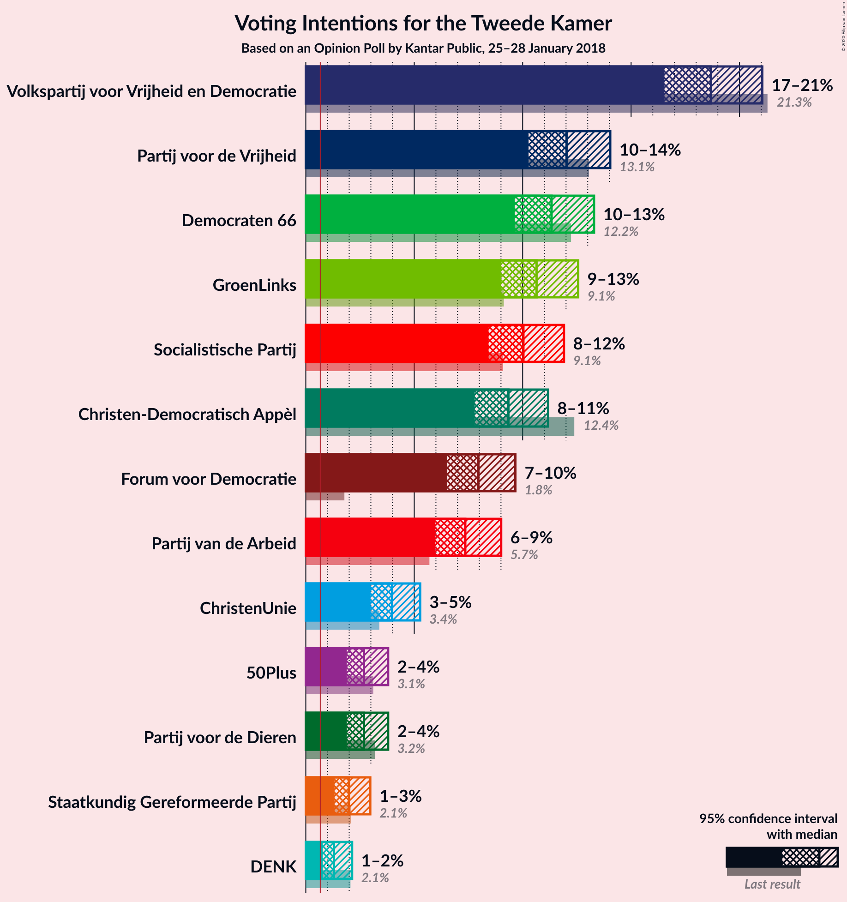

### Confidence Intervals

| Party | Last Result | Poll Result | 80% Confidence Interval | 90% Confidence Interval | 95% Confidence Interval | 99% Confidence Interval |
|:-----:|:-----------:|:-----------:|:-----------------------:|:-----------------------:|:-----------------------:|:-----------------------:|
| Volkspartij voor Vrijheid en Democratie | 21.3% | 18.7% | 17.3–20.2% |16.9–20.7% |16.5–21.0% |15.9–21.8% |
| Partij voor de Vrijheid | 13.1% | 12.0% | 10.9–13.3% |10.5–13.7% |10.3–14.0% |9.7–14.7% |
| Democraten 66 | 12.2% | 11.3% | 10.2–12.6% |9.9–13.0% |9.6–13.3% |9.1–13.9% |
| GroenLinks | 9.1% | 10.6% | 9.6–11.9% |9.3–12.3% |9.0–12.6% |8.5–13.2% |
| Socialistische Partij | 9.1% | 10.0% | 9.0–11.3% |8.7–11.6% |8.4–11.9% |7.9–12.5% |
| Christen-Democratisch Appèl | 12.4% | 9.3% | 8.3–10.5% |8.0–10.9% |7.8–11.2% |7.3–11.8% |
| Forum voor Democratie | 1.8% | 8.0% | 7.0–9.1% |6.8–9.4% |6.5–9.7% |6.1–10.2% |
| Partij van de Arbeid | 5.7% | 7.4% | 6.4–8.4% |6.2–8.7% |6.0–9.0% |5.6–9.6% |
| ChristenUnie | 3.4% | 4.0% | 3.3–4.8% |3.1–5.1% |3.0–5.3% |2.7–5.7% |
| Partij voor de Dieren | 3.2% | 2.7% | 2.2–3.4% |2.0–3.6% |1.9–3.8% |1.7–4.2% |
| 50Plus | 3.1% | 2.7% | 2.2–3.4% |2.0–3.6% |1.9–3.8% |1.7–4.2% |
| Staatkundig Gereformeerde Partij | 2.1% | 2.0% | 1.6–2.6% |1.4–2.8% |1.3–3.0% |1.1–3.3% |
| DENK | 2.1% | 1.3% | 1.0–1.8% |0.9–2.0% |0.8–2.1% |0.7–2.4% |

*Note:* The poll result column reflects the actual value used in the calculations. Published results may vary slightly, and in addition be rounded to fewer digits.

## Seats

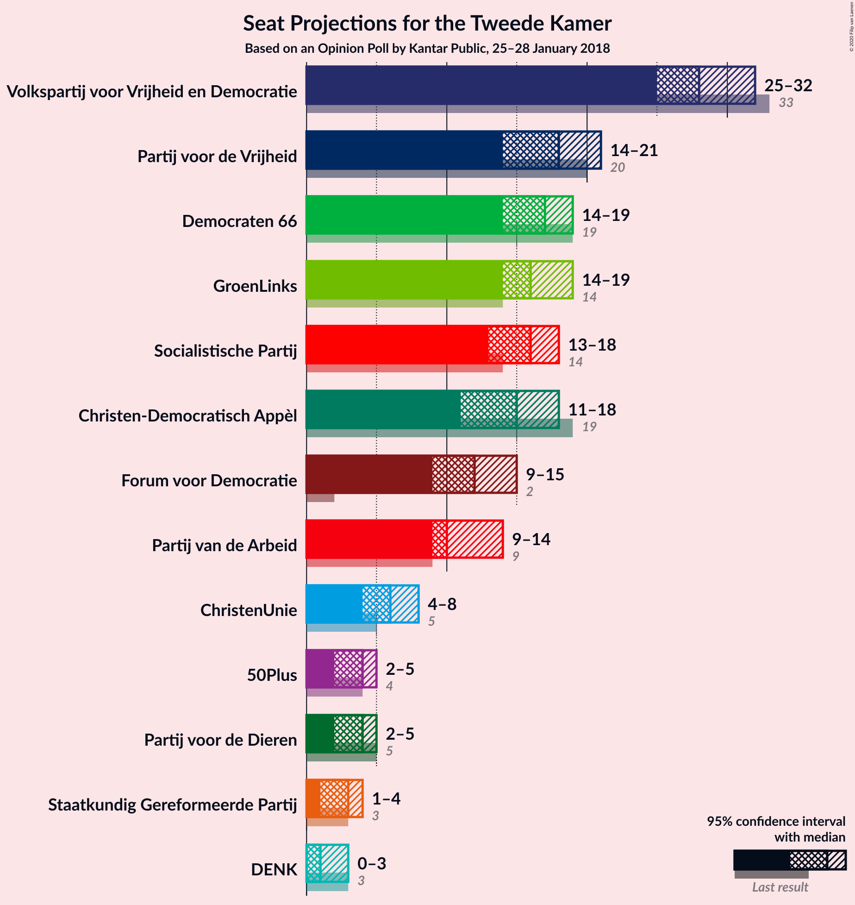

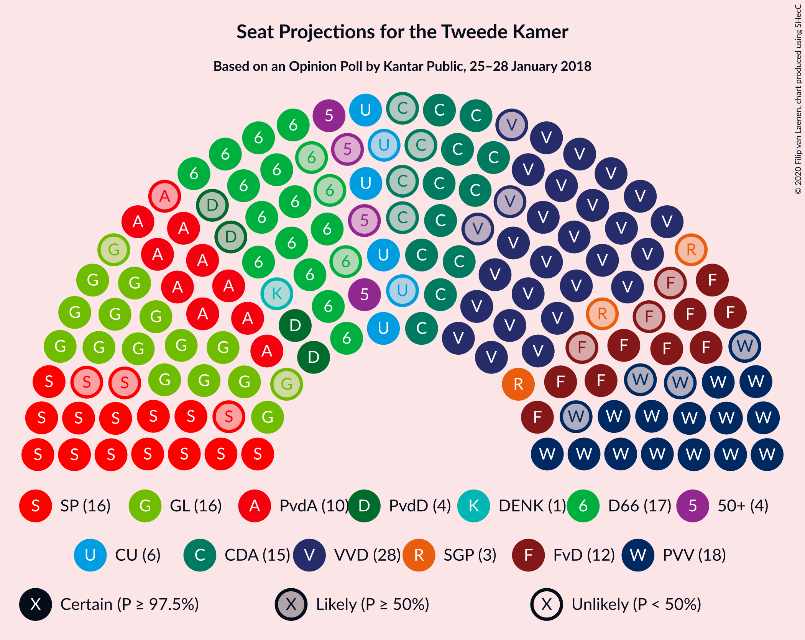

### Confidence Intervals

| Party | Last Result | Median | 80% Confidence Interval | 90% Confidence Interval | 95% Confidence Interval | 99% Confidence Interval |
|:-----:|:-----------:|:------:|:-----------------------:|:-----------------------:|:-----------------------:|:-----------------------:|
| <a href="#volkspartij-voor-vrijheid-en-democratie">Volkspartij voor Vrijheid en Democratie</a> | 33 | 28 | 27–32 |27–32 |25–32 |23–33 |
| <a href="#partij-voor-de-vrijheid">Partij voor de Vrijheid</a> | 20 | 18 | 15–21 |14–21 |14–21 |14–22 |
| <a href="#democraten-66">Democraten 66</a> | 19 | 17 | 14–18 |14–18 |14–19 |13–21 |
| <a href="#groenlinks">GroenLinks</a> | 14 | 16 | 15–18 |15–19 |14–19 |13–19 |
| <a href="#socialistische-partij">Socialistische Partij</a> | 14 | 16 | 13–17 |13–17 |13–18 |12–18 |
| <a href="#christen-democratisch-appèl">Christen-Democratisch Appèl</a> | 19 | 15 | 13–16 |11–18 |11–18 |10–20 |
| <a href="#forum-voor-democratie">Forum voor Democratie</a> | 2 | 12 | 11–14 |10–14 |9–15 |8–15 |
| <a href="#partij-van-de-arbeid">Partij van de Arbeid</a> | 9 | 10 | 9–13 |9–14 |9–14 |8–14 |
| <a href="#christenunie">ChristenUnie</a> | 5 | 6 | 5–7 |4–7 |4–8 |4–9 |
| <a href="#partij-voor-de-dieren">Partij voor de Dieren</a> | 5 | 4 | 2–5 |2–5 |2–5 |2–6 |
| <a href="#50plus">50Plus</a> | 4 | 4 | 3–5 |3–5 |2–5 |2–6 |
| <a href="#staatkundig-gereformeerde-partij">Staatkundig Gereformeerde Partij</a> | 3 | 3 | 1–4 |1–4 |1–4 |1–5 |
| <a href="#denk">DENK</a> | 3 | 1 | 1–3 |1–3 |0–3 |0–3 |

### Volkspartij voor Vrijheid en Democratie

*For a full overview of the results for this party, see the [Volkspartij voor Vrijheid en Democratie](party-volkspartijvoorvrijheidendemocratie.html) page.*

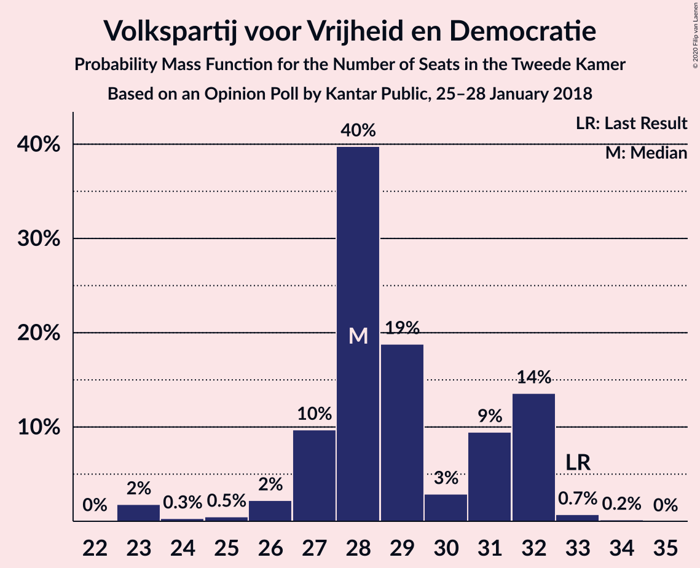

| Number of Seats | Probability | Accumulated | Special Marks |
|:---------------:|:-----------:|:-----------:|:-------------:|
| 23 | 2% | 100% |  |
| 24 | 0.3% | 98% |  |
| 25 | 0.5% | 98% |  |
| 26 | 2% | 97% |  |
| 27 | 10% | 95% |  |
| 28 | 40% | 85% | Median |
| 29 | 19% | 46% |  |
| 30 | 3% | 27% |  |
| 31 | 9% | 24% |  |
| 32 | 14% | 15% |  |
| 33 | 0.7% | 0.9% | Last Result |
| 34 | 0.2% | 0.2% |  |
| 35 | 0% | 0% |  |

### Partij voor de Vrijheid

*For a full overview of the results for this party, see the [Partij voor de Vrijheid](party-partijvoordevrijheid.html) page.*

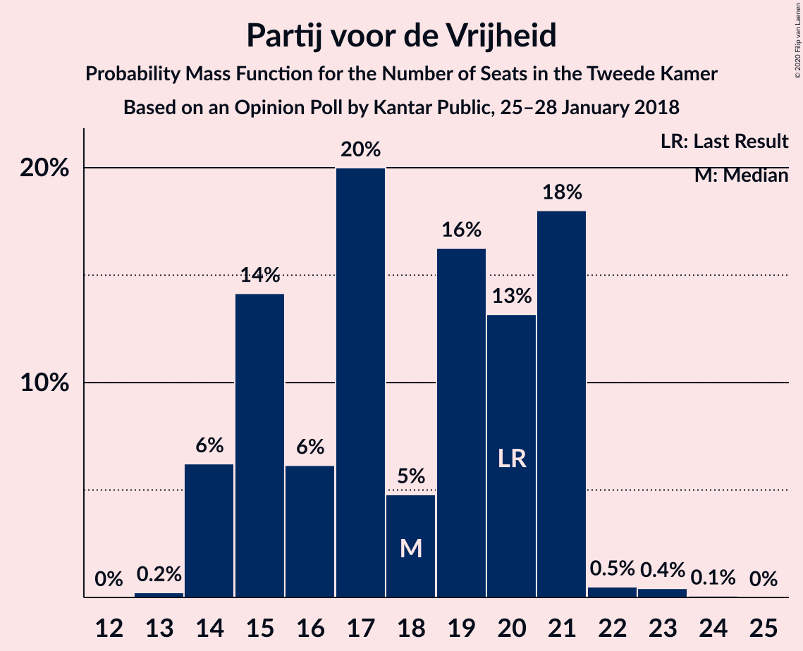

| Number of Seats | Probability | Accumulated | Special Marks |
|:---------------:|:-----------:|:-----------:|:-------------:|
| 13 | 0.2% | 100% |  |
| 14 | 6% | 99.8% |  |
| 15 | 14% | 94% |  |
| 16 | 6% | 79% |  |
| 17 | 20% | 73% |  |
| 18 | 5% | 53% | Median |
| 19 | 16% | 48% |  |
| 20 | 13% | 32% | Last Result |
| 21 | 18% | 19% |  |
| 22 | 0.5% | 1.0% |  |
| 23 | 0.4% | 0.5% |  |
| 24 | 0.1% | 0.1% |  |
| 25 | 0% | 0% |  |

### Democraten 66

*For a full overview of the results for this party, see the [Democraten 66](party-democraten66.html) page.*

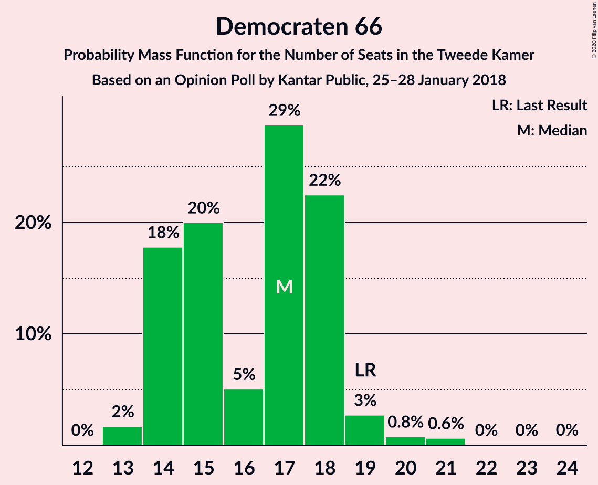

| Number of Seats | Probability | Accumulated | Special Marks |
|:---------------:|:-----------:|:-----------:|:-------------:|
| 13 | 2% | 100% |  |
| 14 | 18% | 98% |  |
| 15 | 20% | 80% |  |
| 16 | 5% | 60% |  |
| 17 | 29% | 55% | Median |
| 18 | 22% | 27% |  |
| 19 | 3% | 4% | Last Result |
| 20 | 0.8% | 1.5% |  |
| 21 | 0.6% | 0.7% |  |
| 22 | 0% | 0.1% |  |
| 23 | 0% | 0.1% |  |
| 24 | 0% | 0% |  |

### GroenLinks

*For a full overview of the results for this party, see the [GroenLinks](party-groenlinks.html) page.*

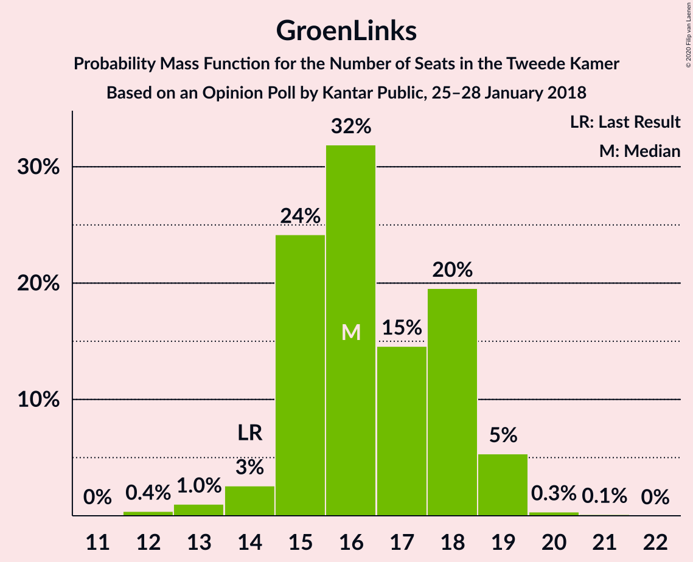

| Number of Seats | Probability | Accumulated | Special Marks |
|:---------------:|:-----------:|:-----------:|:-------------:|
| 12 | 0.4% | 100% |  |
| 13 | 1.0% | 99.6% |  |
| 14 | 3% | 98.6% | Last Result |
| 15 | 24% | 96% |  |
| 16 | 32% | 72% | Median |
| 17 | 15% | 40% |  |
| 18 | 20% | 25% |  |
| 19 | 5% | 6% |  |
| 20 | 0.3% | 0.5% |  |
| 21 | 0.1% | 0.1% |  |
| 22 | 0% | 0% |  |

### Socialistische Partij

*For a full overview of the results for this party, see the [Socialistische Partij](party-socialistischepartij.html) page.*

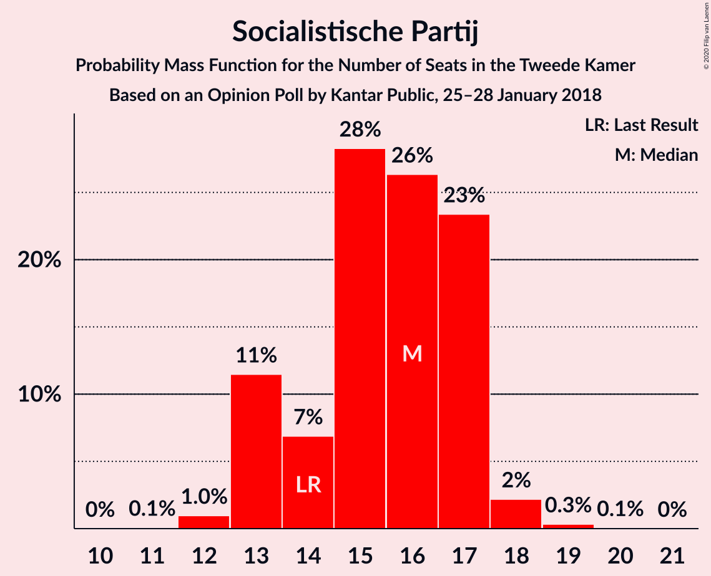

| Number of Seats | Probability | Accumulated | Special Marks |
|:---------------:|:-----------:|:-----------:|:-------------:|
| 11 | 0.1% | 100% |  |
| 12 | 1.0% | 99.9% |  |
| 13 | 11% | 98.9% |  |
| 14 | 7% | 87% | Last Result |
| 15 | 28% | 81% |  |
| 16 | 26% | 52% | Median |
| 17 | 23% | 26% |  |
| 18 | 2% | 3% |  |
| 19 | 0.3% | 0.4% |  |
| 20 | 0.1% | 0.1% |  |
| 21 | 0% | 0% |  |

### Christen-Democratisch Appèl

*For a full overview of the results for this party, see the [Christen-Democratisch Appèl](party-christen-democratischappèl.html) page.*

| Number of Seats | Probability | Accumulated | Special Marks |
|:---------------:|:-----------:|:-----------:|:-------------:|
| 10 | 2% | 100% |  |
| 11 | 3% | 98% |  |
| 12 | 0.5% | 95% |  |
| 13 | 30% | 94% |  |
| 14 | 8% | 64% |  |
| 15 | 23% | 56% | Median |
| 16 | 26% | 33% |  |
| 17 | 0.1% | 7% |  |
| 18 | 6% | 7% |  |
| 19 | 0.1% | 1.1% | Last Result |
| 20 | 1.0% | 1.0% |  |
| 21 | 0% | 0% |  |

### Forum voor Democratie

*For a full overview of the results for this party, see the [Forum voor Democratie](party-forumvoordemocratie.html) page.*

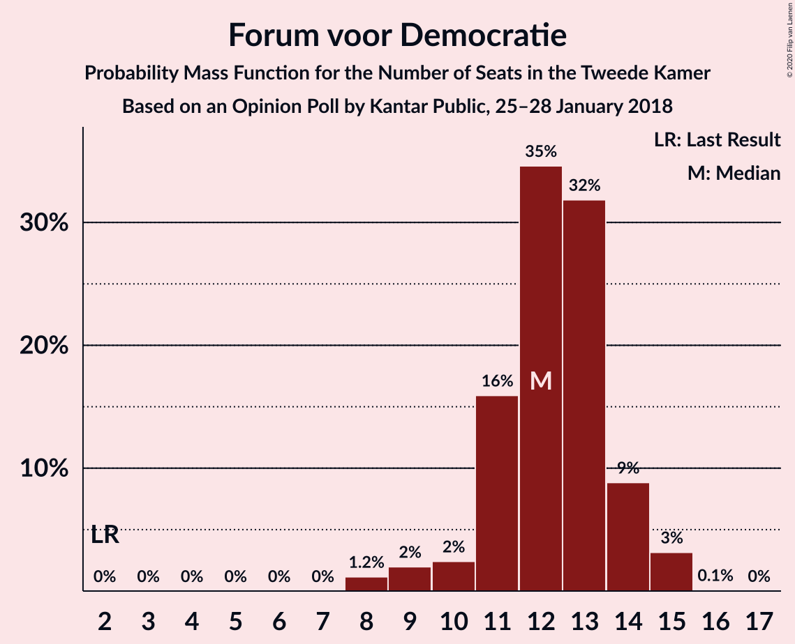

| Number of Seats | Probability | Accumulated | Special Marks |
|:---------------:|:-----------:|:-----------:|:-------------:|
| 2 | 0% | 100% | Last Result |
| 3 | 0% | 100% |  |
| 4 | 0% | 100% |  |
| 5 | 0% | 100% |  |
| 6 | 0% | 100% |  |
| 7 | 0% | 100% |  |
| 8 | 1.2% | 100% |  |
| 9 | 2% | 98.8% |  |
| 10 | 2% | 97% |  |
| 11 | 16% | 94% |  |
| 12 | 35% | 79% | Median |
| 13 | 32% | 44% |  |
| 14 | 9% | 12% |  |
| 15 | 3% | 3% |  |
| 16 | 0.1% | 0.1% |  |
| 17 | 0% | 0% |  |

### Partij van de Arbeid

*For a full overview of the results for this party, see the [Partij van de Arbeid](party-partijvandearbeid.html) page.*

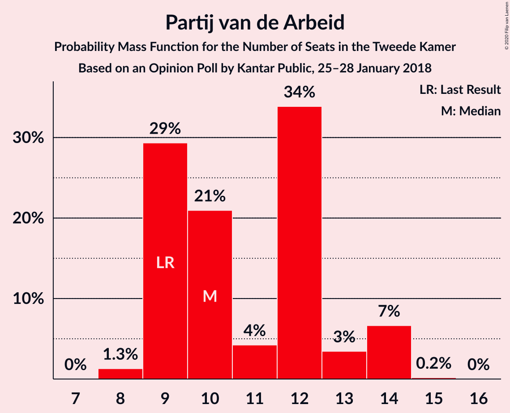

| Number of Seats | Probability | Accumulated | Special Marks |
|:---------------:|:-----------:|:-----------:|:-------------:|
| 8 | 1.3% | 100% |  |
| 9 | 29% | 98.7% | Last Result |
| 10 | 21% | 69% | Median |
| 11 | 4% | 48% |  |
| 12 | 34% | 44% |  |
| 13 | 3% | 10% |  |
| 14 | 7% | 7% |  |
| 15 | 0.2% | 0.2% |  |
| 16 | 0% | 0% |  |

### ChristenUnie

*For a full overview of the results for this party, see the [ChristenUnie](party-christenunie.html) page.*

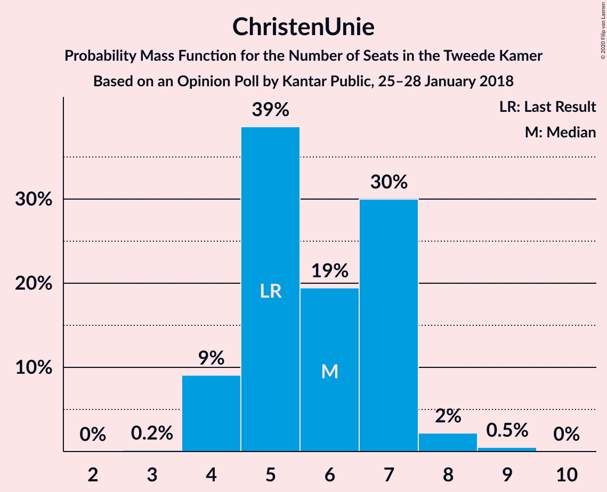

| Number of Seats | Probability | Accumulated | Special Marks |
|:---------------:|:-----------:|:-----------:|:-------------:|
| 3 | 0.2% | 100% |  |
| 4 | 9% | 99.8% |  |
| 5 | 39% | 91% | Last Result |
| 6 | 19% | 52% | Median |
| 7 | 30% | 33% |  |
| 8 | 2% | 3% |  |
| 9 | 0.5% | 0.5% |  |
| 10 | 0% | 0% |  |

### Partij voor de Dieren

*For a full overview of the results for this party, see the [Partij voor de Dieren](party-partijvoordedieren.html) page.*

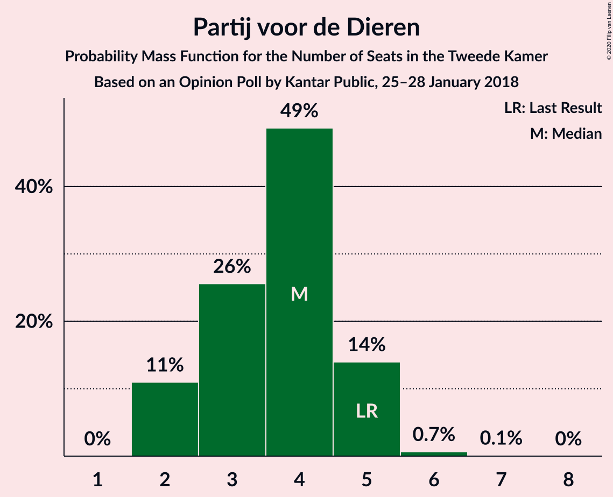

| Number of Seats | Probability | Accumulated | Special Marks |
|:---------------:|:-----------:|:-----------:|:-------------:|
| 2 | 11% | 100% |  |
| 3 | 26% | 89% |  |
| 4 | 49% | 63% | Median |
| 5 | 14% | 15% | Last Result |
| 6 | 0.7% | 0.8% |  |
| 7 | 0.1% | 0.1% |  |
| 8 | 0% | 0% |  |

### 50Plus

*For a full overview of the results for this party, see the [50Plus](party-50plus.html) page.*

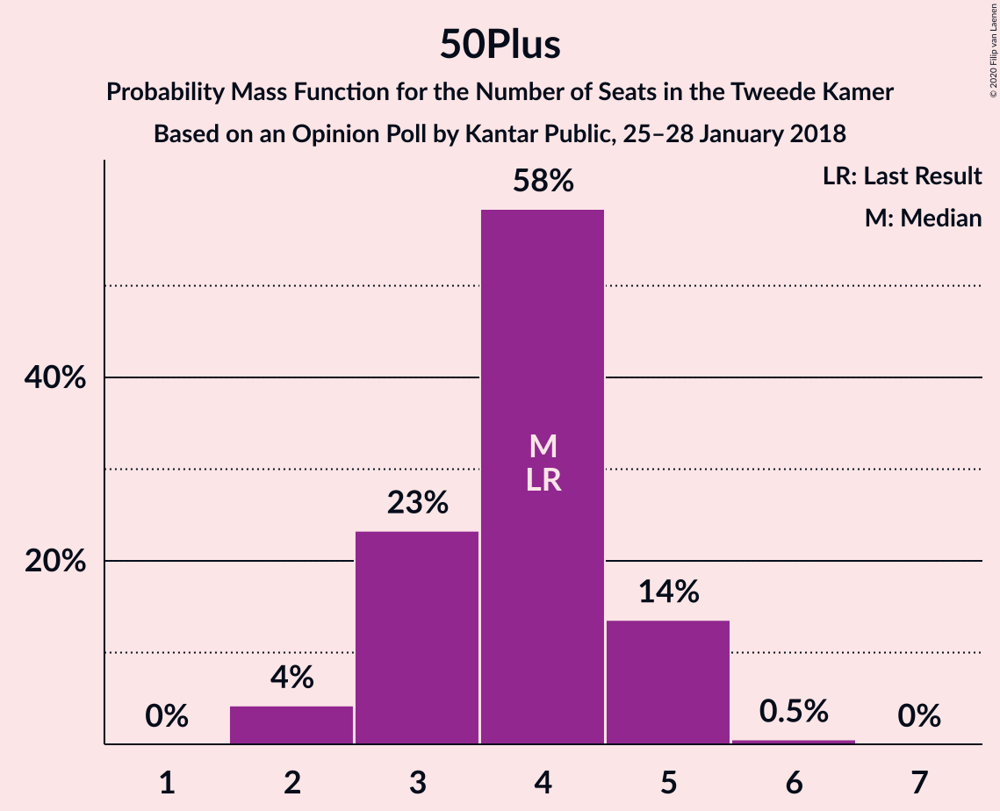

| Number of Seats | Probability | Accumulated | Special Marks |
|:---------------:|:-----------:|:-----------:|:-------------:|
| 2 | 4% | 100% |  |
| 3 | 23% | 96% |  |
| 4 | 58% | 72% | Last Result, Median |
| 5 | 14% | 14% |  |
| 6 | 0.5% | 0.5% |  |
| 7 | 0% | 0% |  |

### Staatkundig Gereformeerde Partij

*For a full overview of the results for this party, see the [Staatkundig Gereformeerde Partij](party-staatkundiggereformeerdepartij.html) page.*

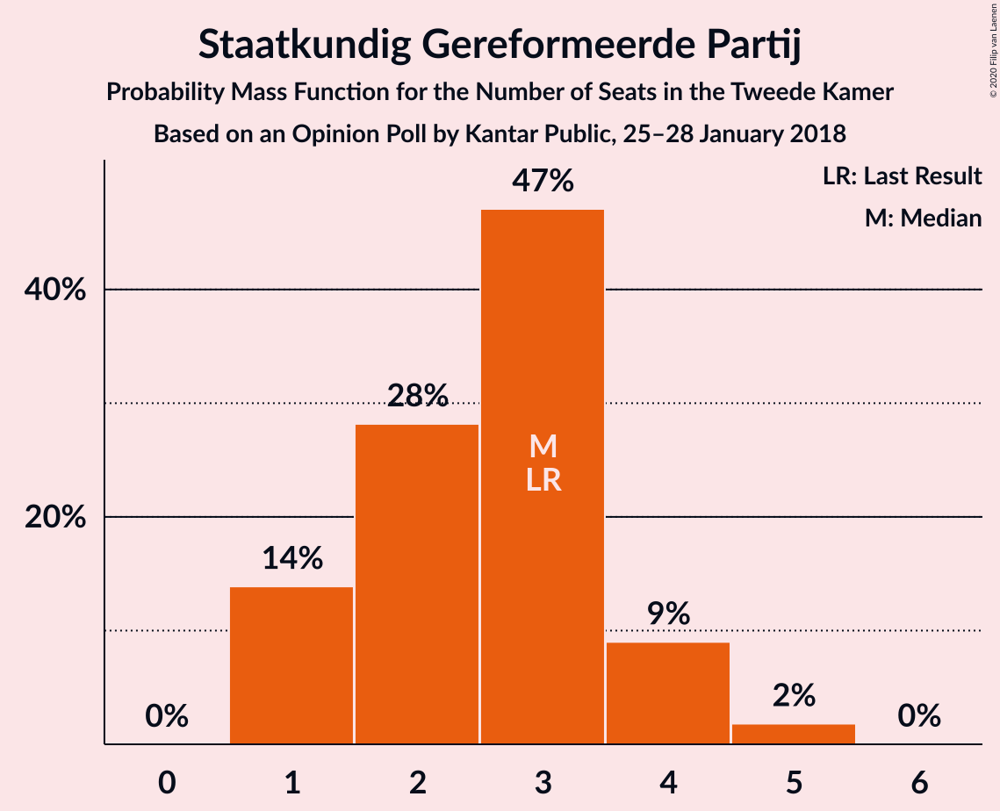

| Number of Seats | Probability | Accumulated | Special Marks |
|:---------------:|:-----------:|:-----------:|:-------------:|
| 1 | 14% | 100% |  |
| 2 | 28% | 86% |  |
| 3 | 47% | 58% | Last Result, Median |
| 4 | 9% | 11% |  |
| 5 | 2% | 2% |  |
| 6 | 0% | 0% |  |

### DENK

*For a full overview of the results for this party, see the [DENK](party-denk.html) page.*

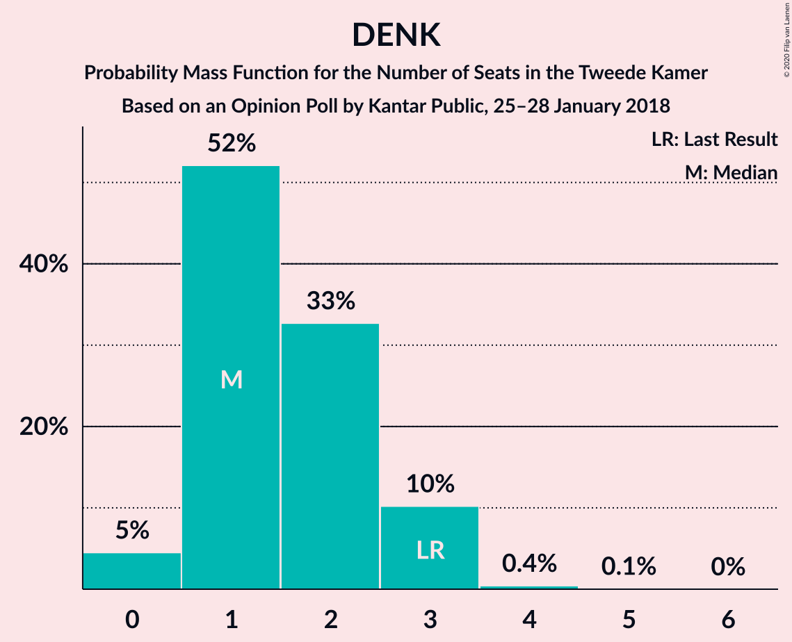

| Number of Seats | Probability | Accumulated | Special Marks |
|:---------------:|:-----------:|:-----------:|:-------------:|
| 0 | 5% | 100% |  |
| 1 | 52% | 95% | Median |
| 2 | 33% | 43% |  |
| 3 | 10% | 11% | Last Result |
| 4 | 0.4% | 0.5% |  |
| 5 | 0.1% | 0.1% |  |
| 6 | 0% | 0% |  |

## Coalitions

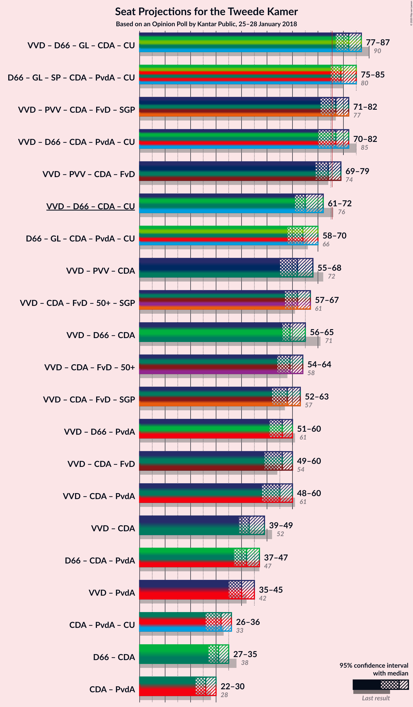

### Confidence Intervals

| Coalition | Last Result | Median | Majority? | 80% Confidence Interval | 90% Confidence Interval | 95% Confidence Interval | 99% Confidence Interval |
|:---------:|:-----------:|:------:|:---------:|:-----------------------:|:-----------------------:|:-----------------------:|:-----------------------:|
| Volkspartij voor Vrijheid en Democratie – Democraten 66 – GroenLinks – Christen-Democratisch Appèl – ChristenUnie | 90 | 82 | 99.8% | 77–87 | 77–87 | 77–87 | 77–87 |
| Democraten 66 – GroenLinks – Socialistische Partij – Christen-Democratisch Appèl – Partij van de Arbeid – ChristenUnie | 80 | 79 | 78% | 75–85 | 75–85 | 75–85 | 74–86 |
| Volkspartij voor Vrijheid en Democratie – Partij voor de Vrijheid – Christen-Democratisch Appèl – Forum voor Democratie – Staatkundig Gereformeerde Partij | 77 | 77 | 63% | 72–80 | 72–82 | 71–82 | 70–82 |
| Volkspartij voor Vrijheid en Democratie – Democraten 66 – Christen-Democratisch Appèl – Partij van de Arbeid – ChristenUnie | 85 | 77 | 56% | 70–82 | 70–82 | 70–82 | 69–85 |
| Volkspartij voor Vrijheid en Democratie – Partij voor de Vrijheid – Christen-Democratisch Appèl – Forum voor Democratie | 74 | 74 | 33% | 70–77 | 70–79 | 69–79 | 67–79 |
| Volkspartij voor Vrijheid en Democratie – Democraten 66 – Christen-Democratisch Appèl – ChristenUnie | 76 | 65 | 0% | 61–72 | 61–72 | 61–72 | 59–72 |
| Democraten 66 – GroenLinks – Christen-Democratisch Appèl – Partij van de Arbeid – ChristenUnie | 66 | 64 | 0% | 58–70 | 58–70 | 58–70 | 58–70 |
| Volkspartij voor Vrijheid en Democratie – Partij voor de Vrijheid – Christen-Democratisch Appèl | 72 | 62 | 0% | 57–65 | 56–68 | 55–68 | 55–68 |
| Volkspartij voor Vrijheid en Democratie – Christen-Democratisch Appèl – Forum voor Democratie – 50Plus – Staatkundig Gereformeerde Partij | 61 | 62 | 0% | 58–65 | 57–67 | 57–67 | 56–67 |
| Volkspartij voor Vrijheid en Democratie – Democraten 66 – Christen-Democratisch Appèl | 71 | 59 | 0% | 56–65 | 56–65 | 56–65 | 55–66 |
| Volkspartij voor Vrijheid en Democratie – Christen-Democratisch Appèl – Forum voor Democratie – 50Plus | 58 | 59 | 0% | 56–64 | 54–64 | 54–64 | 53–65 |
| Volkspartij voor Vrijheid en Democratie – Christen-Democratisch Appèl – Forum voor Democratie – Staatkundig Gereformeerde Partij | 57 | 58 | 0% | 55–61 | 54–63 | 52–63 | 51–63 |
| Volkspartij voor Vrijheid en Democratie – Democraten 66 – Partij van de Arbeid | 61 | 56 | 0% | 52–59 | 51–60 | 51–60 | 50–64 |
| Volkspartij voor Vrijheid en Democratie – Christen-Democratisch Appèl – Forum voor Democratie | 54 | 56 | 0% | 53–60 | 51–60 | 49–60 | 48–60 |
| Volkspartij voor Vrijheid en Democratie – Christen-Democratisch Appèl – Partij van de Arbeid | 61 | 55 | 0% | 50–59 | 50–59 | 48–60 | 47–62 |
| Volkspartij voor Vrijheid en Democratie – Christen-Democratisch Appèl | 52 | 43 | 0% | 40–48 | 39–49 | 39–49 | 38–49 |
| Democraten 66 – Christen-Democratisch Appèl – Partij van de Arbeid | 47 | 42 | 0% | 37–46 | 37–46 | 37–47 | 36–48 |
| Volkspartij voor Vrijheid en Democratie – Partij van de Arbeid | 42 | 40 | 0% | 37–43 | 36–44 | 35–45 | 32–46 |
| Christen-Democratisch Appèl – Partij van de Arbeid – ChristenUnie | 33 | 32 | 0% | 27–35 | 26–35 | 26–36 | 26–36 |
| Democraten 66 – Christen-Democratisch Appèl | 38 | 31 | 0% | 28–34 | 28–34 | 27–35 | 26–38 |
| Christen-Democratisch Appèl – Partij van de Arbeid | 28 | 26 | 0% | 22–28 | 22–30 | 22–30 | 21–30 |

### Volkspartij voor Vrijheid en Democratie – Democraten 66 – GroenLinks – Christen-Democratisch Appèl – ChristenUnie

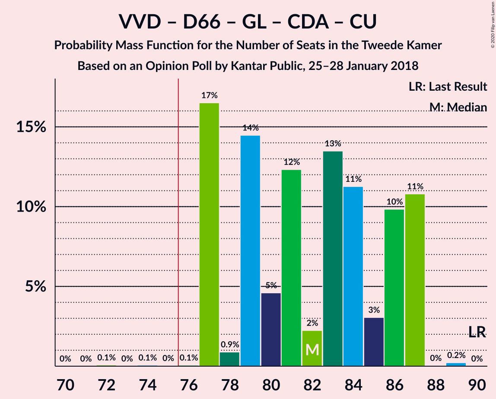

| Number of Seats | Probability | Accumulated | Special Marks |
|:---------------:|:-----------:|:-----------:|:-------------:|
| 72 | 0.1% | 100% |  |
| 73 | 0% | 99.9% |  |
| 74 | 0.1% | 99.9% |  |
| 75 | 0% | 99.9% |  |
| 76 | 0.1% | 99.8% | Majority |
| 77 | 17% | 99.8% |  |
| 78 | 0.9% | 83% |  |
| 79 | 14% | 82% |  |
| 80 | 5% | 68% |  |
| 81 | 12% | 63% |  |
| 82 | 2% | 51% | Median |
| 83 | 13% | 49% |  |
| 84 | 11% | 35% |  |
| 85 | 3% | 24% |  |
| 86 | 10% | 21% |  |
| 87 | 11% | 11% |  |
| 88 | 0% | 0.3% |  |
| 89 | 0.2% | 0.2% |  |
| 90 | 0% | 0% | Last Result |

### Democraten 66 – GroenLinks – Socialistische Partij – Christen-Democratisch Appèl – Partij van de Arbeid – ChristenUnie

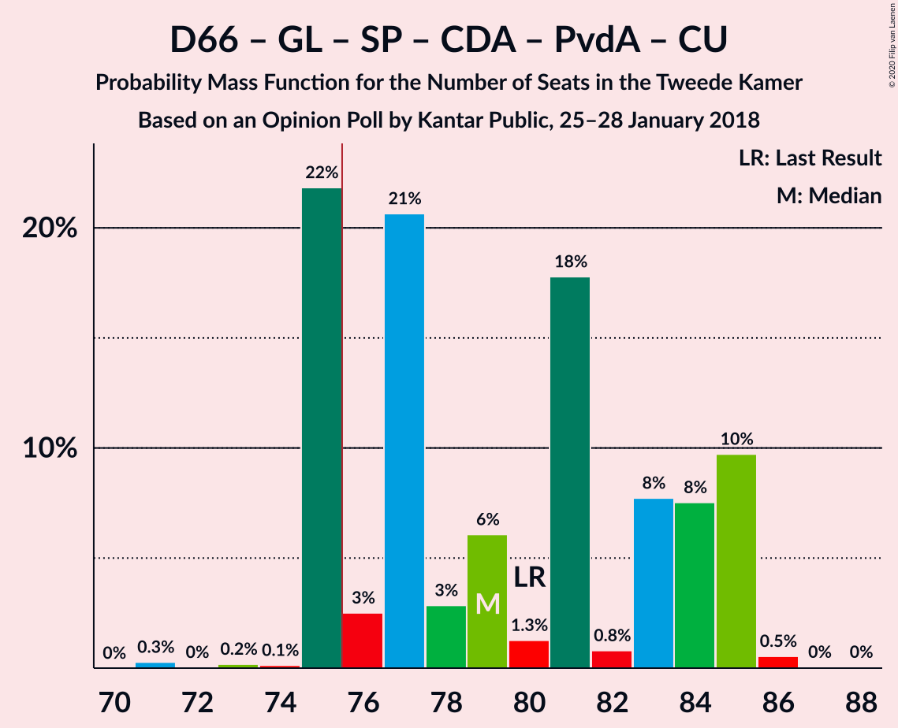

| Number of Seats | Probability | Accumulated | Special Marks |
|:---------------:|:-----------:|:-----------:|:-------------:|
| 71 | 0.3% | 100% |  |
| 72 | 0% | 99.7% |  |
| 73 | 0.2% | 99.7% |  |
| 74 | 0.1% | 99.5% |  |
| 75 | 22% | 99.4% |  |
| 76 | 3% | 78% | Majority |
| 77 | 21% | 75% |  |
| 78 | 3% | 54% |  |
| 79 | 6% | 52% |  |
| 80 | 1.3% | 45% | Last Result, Median |
| 81 | 18% | 44% |  |
| 82 | 0.8% | 26% |  |
| 83 | 8% | 26% |  |
| 84 | 8% | 18% |  |
| 85 | 10% | 10% |  |
| 86 | 0.5% | 0.6% |  |
| 87 | 0% | 0.1% |  |
| 88 | 0% | 0% |  |

### Volkspartij voor Vrijheid en Democratie – Partij voor de Vrijheid – Christen-Democratisch Appèl – Forum voor Democratie – Staatkundig Gereformeerde Partij

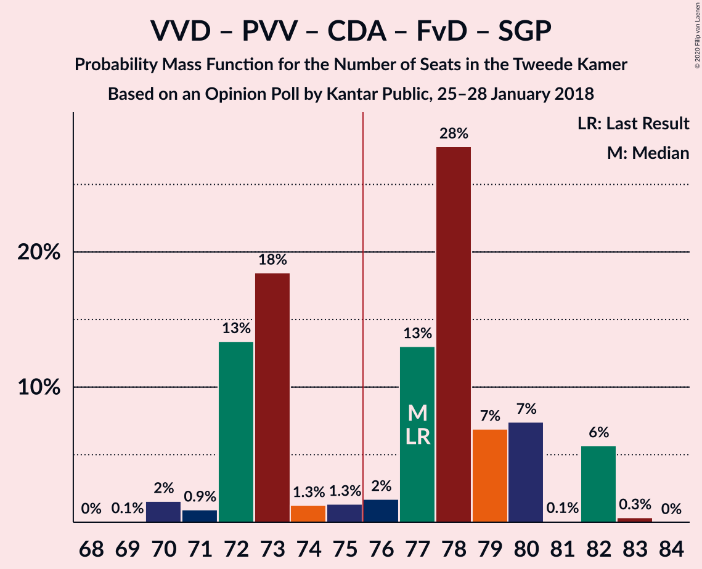

| Number of Seats | Probability | Accumulated | Special Marks |
|:---------------:|:-----------:|:-----------:|:-------------:|
| 69 | 0.1% | 100% |  |
| 70 | 2% | 99.9% |  |
| 71 | 0.9% | 98% |  |
| 72 | 13% | 97% |  |
| 73 | 18% | 84% |  |
| 74 | 1.3% | 66% |  |
| 75 | 1.3% | 64% |  |
| 76 | 2% | 63% | Median, Majority |
| 77 | 13% | 61% | Last Result |
| 78 | 28% | 48% |  |
| 79 | 7% | 20% |  |
| 80 | 7% | 14% |  |
| 81 | 0.1% | 6% |  |
| 82 | 6% | 6% |  |
| 83 | 0.3% | 0.3% |  |
| 84 | 0% | 0% |  |

### Volkspartij voor Vrijheid en Democratie – Democraten 66 – Christen-Democratisch Appèl – Partij van de Arbeid – ChristenUnie

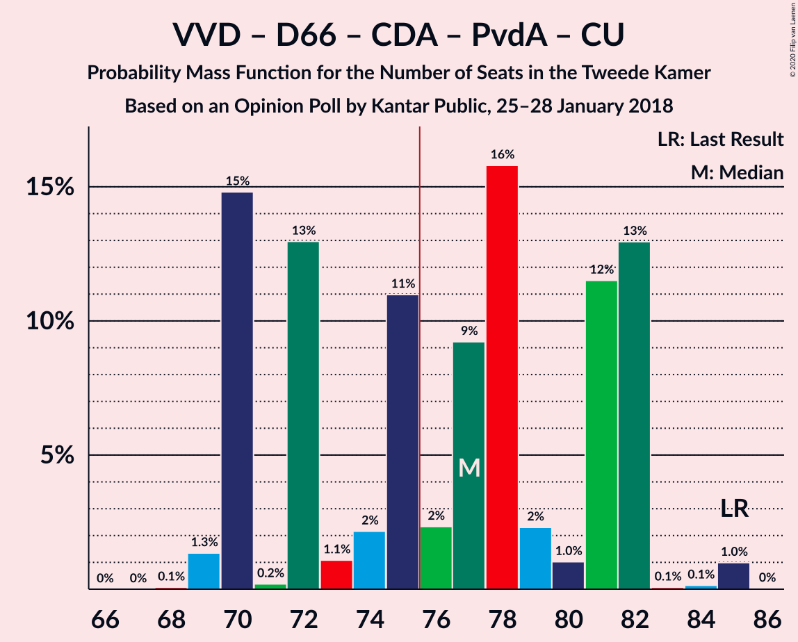

| Number of Seats | Probability | Accumulated | Special Marks |
|:---------------:|:-----------:|:-----------:|:-------------:|
| 68 | 0.1% | 100% |  |
| 69 | 1.3% | 99.9% |  |
| 70 | 15% | 98.6% |  |
| 71 | 0.2% | 84% |  |
| 72 | 13% | 84% |  |
| 73 | 1.1% | 71% |  |
| 74 | 2% | 70% |  |
| 75 | 11% | 67% |  |
| 76 | 2% | 56% | Median, Majority |
| 77 | 9% | 54% |  |
| 78 | 16% | 45% |  |
| 79 | 2% | 29% |  |
| 80 | 1.0% | 27% |  |
| 81 | 12% | 26% |  |
| 82 | 13% | 14% |  |
| 83 | 0.1% | 1.2% |  |
| 84 | 0.1% | 1.2% |  |
| 85 | 1.0% | 1.0% | Last Result |
| 86 | 0% | 0% |  |

### Volkspartij voor Vrijheid en Democratie – Partij voor de Vrijheid – Christen-Democratisch Appèl – Forum voor Democratie

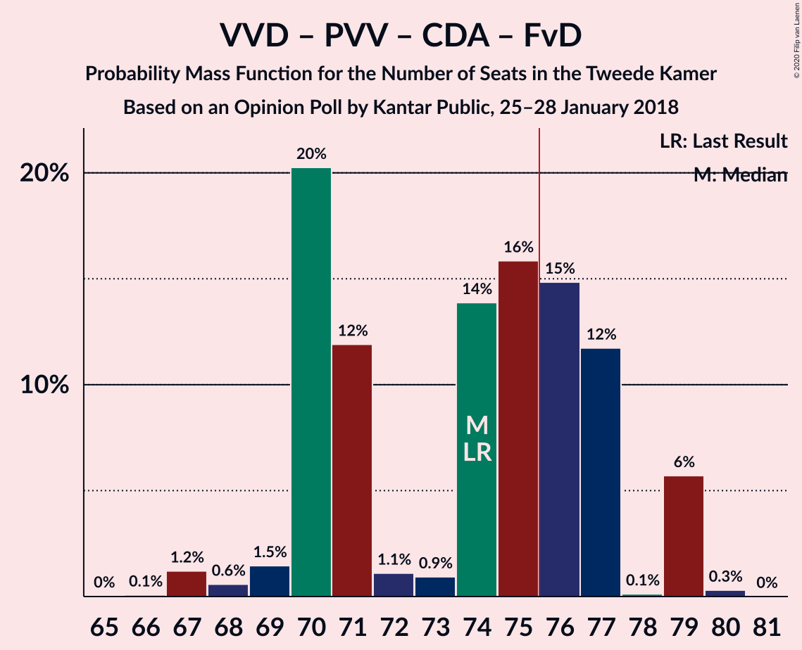

| Number of Seats | Probability | Accumulated | Special Marks |
|:---------------:|:-----------:|:-----------:|:-------------:|
| 66 | 0.1% | 100% |  |
| 67 | 1.2% | 99.9% |  |
| 68 | 0.6% | 98.7% |  |
| 69 | 1.5% | 98% |  |
| 70 | 20% | 97% |  |
| 71 | 12% | 76% |  |
| 72 | 1.1% | 64% |  |
| 73 | 0.9% | 63% | Median |
| 74 | 14% | 62% | Last Result |
| 75 | 16% | 49% |  |
| 76 | 15% | 33% | Majority |
| 77 | 12% | 18% |  |
| 78 | 0.1% | 6% |  |
| 79 | 6% | 6% |  |
| 80 | 0.3% | 0.3% |  |
| 81 | 0% | 0% |  |

### Volkspartij voor Vrijheid en Democratie – Democraten 66 – Christen-Democratisch Appèl – ChristenUnie

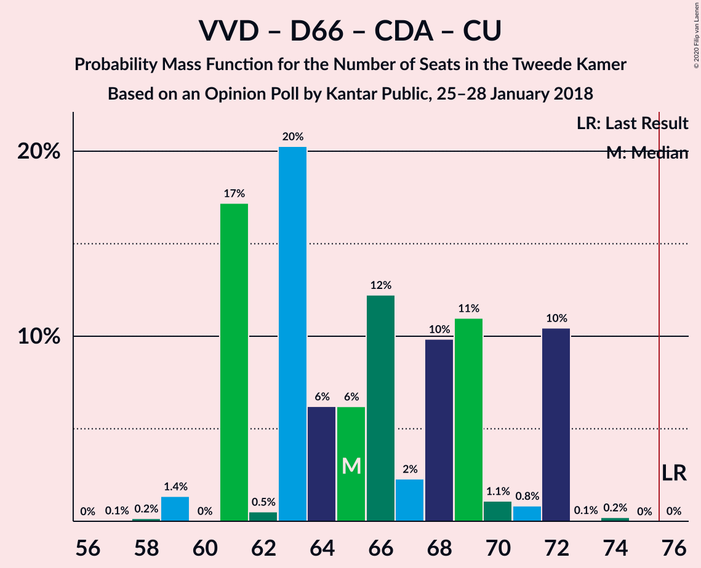

| Number of Seats | Probability | Accumulated | Special Marks |
|:---------------:|:-----------:|:-----------:|:-------------:|
| 57 | 0.1% | 100% |  |
| 58 | 0.2% | 99.9% |  |
| 59 | 1.4% | 99.8% |  |
| 60 | 0% | 98% |  |
| 61 | 17% | 98% |  |
| 62 | 0.5% | 81% |  |
| 63 | 20% | 81% |  |
| 64 | 6% | 60% |  |
| 65 | 6% | 54% |  |
| 66 | 12% | 48% | Median |
| 67 | 2% | 36% |  |
| 68 | 10% | 34% |  |
| 69 | 11% | 24% |  |
| 70 | 1.1% | 13% |  |
| 71 | 0.8% | 12% |  |
| 72 | 10% | 11% |  |
| 73 | 0.1% | 0.3% |  |
| 74 | 0.2% | 0.2% |  |
| 75 | 0% | 0% |  |
| 76 | 0% | 0% | Last Result, Majority |

### Democraten 66 – GroenLinks – Christen-Democratisch Appèl – Partij van de Arbeid – ChristenUnie

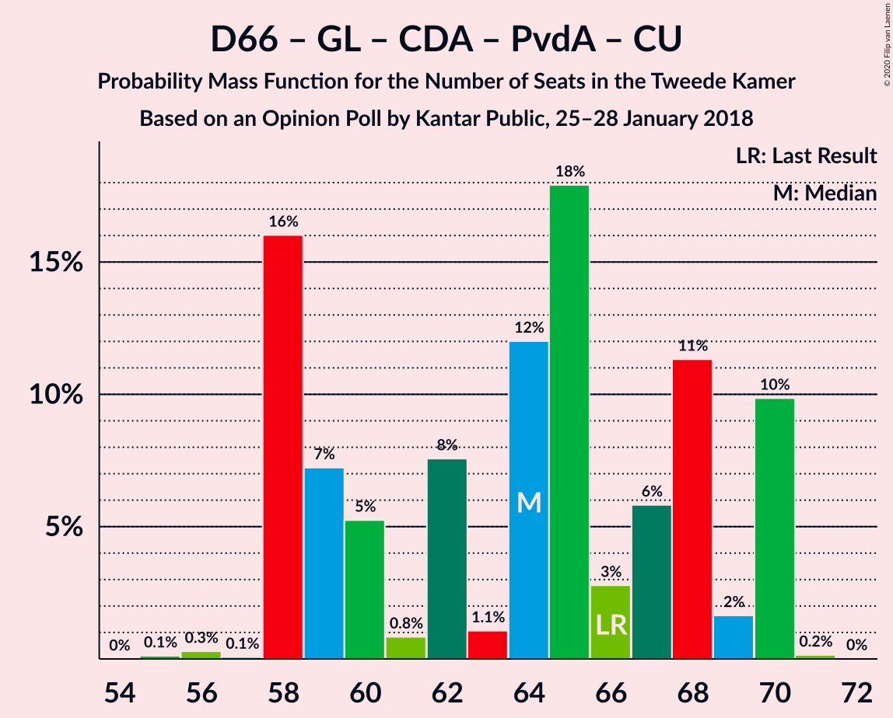

| Number of Seats | Probability | Accumulated | Special Marks |
|:---------------:|:-----------:|:-----------:|:-------------:|
| 55 | 0.1% | 100% |  |
| 56 | 0.3% | 99.9% |  |
| 57 | 0.1% | 99.6% |  |
| 58 | 16% | 99.5% |  |
| 59 | 7% | 84% |  |
| 60 | 5% | 76% |  |
| 61 | 0.8% | 71% |  |
| 62 | 8% | 70% |  |
| 63 | 1.1% | 63% |  |
| 64 | 12% | 62% | Median |
| 65 | 18% | 50% |  |
| 66 | 3% | 32% | Last Result |
| 67 | 6% | 29% |  |
| 68 | 11% | 23% |  |
| 69 | 2% | 12% |  |
| 70 | 10% | 10% |  |
| 71 | 0.2% | 0.2% |  |
| 72 | 0% | 0% |  |

### Volkspartij voor Vrijheid en Democratie – Partij voor de Vrijheid – Christen-Democratisch Appèl

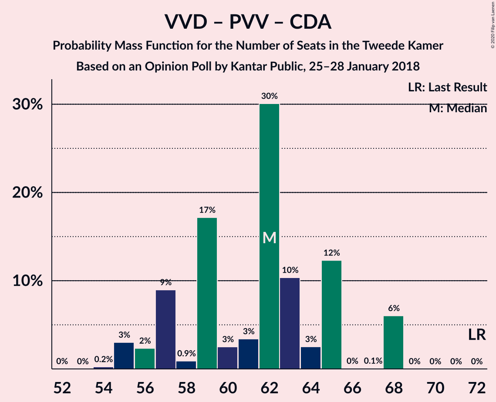

| Number of Seats | Probability | Accumulated | Special Marks |
|:---------------:|:-----------:|:-----------:|:-------------:|
| 54 | 0.2% | 100% |  |
| 55 | 3% | 99.7% |  |
| 56 | 2% | 97% |  |
| 57 | 9% | 94% |  |
| 58 | 0.9% | 85% |  |
| 59 | 17% | 85% |  |
| 60 | 3% | 67% |  |
| 61 | 3% | 65% | Median |
| 62 | 30% | 61% |  |
| 63 | 10% | 31% |  |
| 64 | 3% | 21% |  |
| 65 | 12% | 18% |  |
| 66 | 0% | 6% |  |
| 67 | 0.1% | 6% |  |
| 68 | 6% | 6% |  |
| 69 | 0% | 0% |  |
| 70 | 0% | 0% |  |
| 71 | 0% | 0% |  |
| 72 | 0% | 0% | Last Result |

### Volkspartij voor Vrijheid en Democratie – Christen-Democratisch Appèl – Forum voor Democratie – 50Plus – Staatkundig Gereformeerde Partij

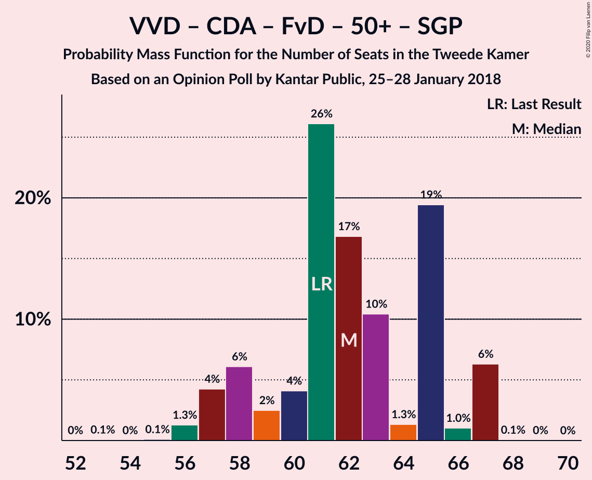

| Number of Seats | Probability | Accumulated | Special Marks |
|:---------------:|:-----------:|:-----------:|:-------------:|
| 53 | 0.1% | 100% |  |
| 54 | 0% | 99.9% |  |
| 55 | 0.1% | 99.9% |  |
| 56 | 1.3% | 99.8% |  |
| 57 | 4% | 98.5% |  |
| 58 | 6% | 94% |  |
| 59 | 2% | 88% |  |
| 60 | 4% | 86% |  |
| 61 | 26% | 82% | Last Result |
| 62 | 17% | 55% | Median |
| 63 | 10% | 39% |  |
| 64 | 1.3% | 28% |  |
| 65 | 19% | 27% |  |
| 66 | 1.0% | 7% |  |
| 67 | 6% | 6% |  |
| 68 | 0.1% | 0.1% |  |
| 69 | 0% | 0% |  |

### Volkspartij voor Vrijheid en Democratie – Democraten 66 – Christen-Democratisch Appèl

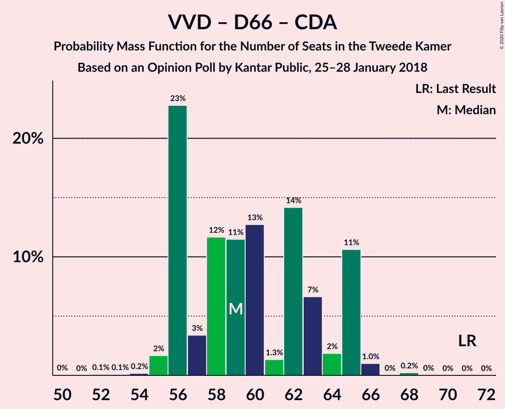

| Number of Seats | Probability | Accumulated | Special Marks |
|:---------------:|:-----------:|:-----------:|:-------------:|
| 51 | 0% | 100% |  |
| 52 | 0.1% | 99.9% |  |
| 53 | 0.1% | 99.9% |  |
| 54 | 0.2% | 99.8% |  |
| 55 | 2% | 99.6% |  |
| 56 | 23% | 98% |  |
| 57 | 3% | 75% |  |
| 58 | 12% | 72% |  |
| 59 | 11% | 60% |  |
| 60 | 13% | 49% | Median |
| 61 | 1.3% | 36% |  |
| 62 | 14% | 35% |  |
| 63 | 7% | 20% |  |
| 64 | 2% | 14% |  |
| 65 | 11% | 12% |  |
| 66 | 1.0% | 1.3% |  |
| 67 | 0% | 0.3% |  |
| 68 | 0.2% | 0.2% |  |
| 69 | 0% | 0% |  |
| 70 | 0% | 0% |  |
| 71 | 0% | 0% | Last Result |

### Volkspartij voor Vrijheid en Democratie – Christen-Democratisch Appèl – Forum voor Democratie – 50Plus

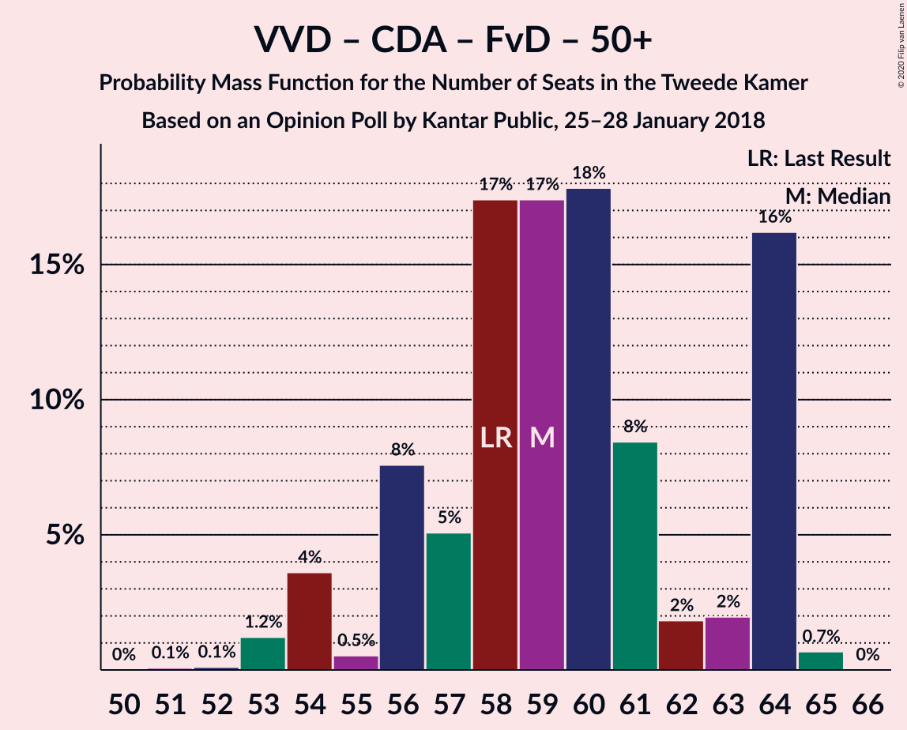

| Number of Seats | Probability | Accumulated | Special Marks |
|:---------------:|:-----------:|:-----------:|:-------------:|
| 51 | 0.1% | 100% |  |
| 52 | 0.1% | 99.9% |  |
| 53 | 1.2% | 99.8% |  |
| 54 | 4% | 98.6% |  |
| 55 | 0.5% | 95% |  |
| 56 | 8% | 94% |  |
| 57 | 5% | 87% |  |
| 58 | 17% | 82% | Last Result |
| 59 | 17% | 64% | Median |
| 60 | 18% | 47% |  |
| 61 | 8% | 29% |  |
| 62 | 2% | 21% |  |
| 63 | 2% | 19% |  |
| 64 | 16% | 17% |  |
| 65 | 0.7% | 0.7% |  |
| 66 | 0% | 0% |  |

### Volkspartij voor Vrijheid en Democratie – Christen-Democratisch Appèl – Forum voor Democratie – Staatkundig Gereformeerde Partij

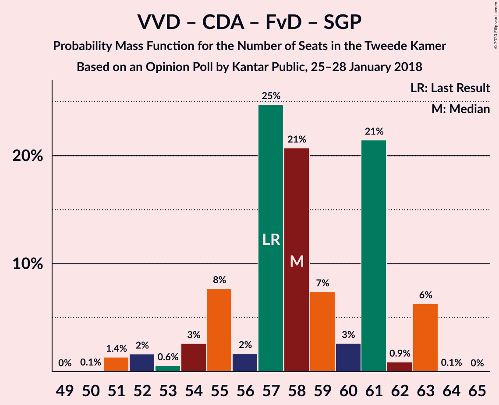

| Number of Seats | Probability | Accumulated | Special Marks |
|:---------------:|:-----------:|:-----------:|:-------------:|
| 50 | 0.1% | 100% |  |
| 51 | 1.4% | 99.9% |  |
| 52 | 2% | 98.5% |  |
| 53 | 0.6% | 97% |  |
| 54 | 3% | 96% |  |
| 55 | 8% | 94% |  |
| 56 | 2% | 86% |  |
| 57 | 25% | 84% | Last Result |
| 58 | 21% | 60% | Median |
| 59 | 7% | 39% |  |
| 60 | 3% | 31% |  |
| 61 | 21% | 29% |  |
| 62 | 0.9% | 7% |  |
| 63 | 6% | 6% |  |
| 64 | 0.1% | 0.1% |  |
| 65 | 0% | 0% |  |

### Volkspartij voor Vrijheid en Democratie – Democraten 66 – Partij van de Arbeid

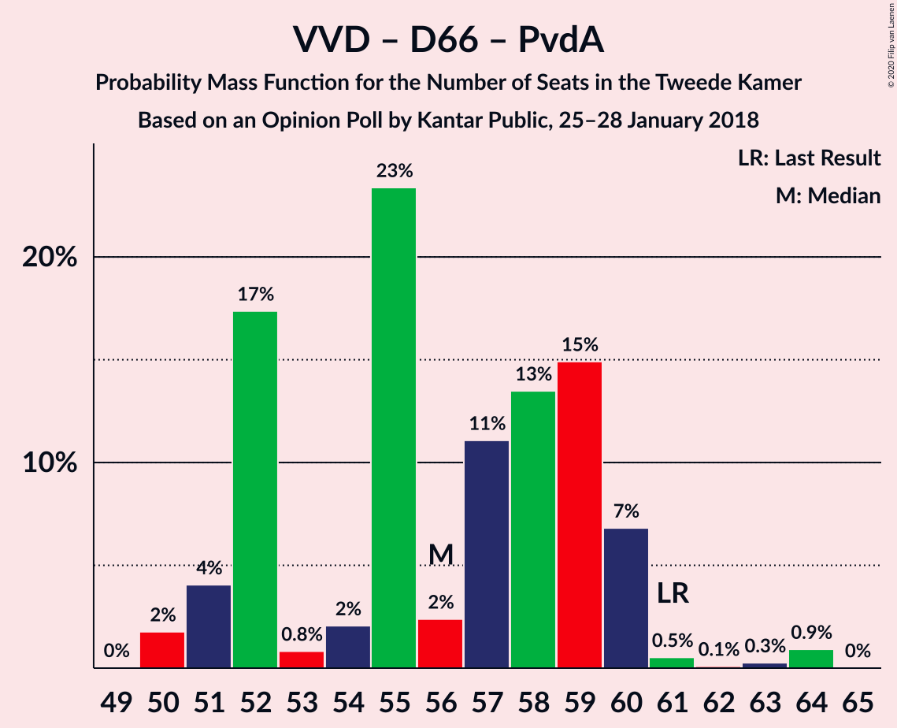

| Number of Seats | Probability | Accumulated | Special Marks |
|:---------------:|:-----------:|:-----------:|:-------------:|
| 50 | 2% | 100% |  |
| 51 | 4% | 98% |  |
| 52 | 17% | 94% |  |
| 53 | 0.8% | 77% |  |
| 54 | 2% | 76% |  |
| 55 | 23% | 74% | Median |
| 56 | 2% | 51% |  |
| 57 | 11% | 48% |  |
| 58 | 13% | 37% |  |
| 59 | 15% | 24% |  |
| 60 | 7% | 9% |  |
| 61 | 0.5% | 2% | Last Result |
| 62 | 0.1% | 1.3% |  |
| 63 | 0.3% | 1.2% |  |
| 64 | 0.9% | 0.9% |  |
| 65 | 0% | 0% |  |

### Volkspartij voor Vrijheid en Democratie – Christen-Democratisch Appèl – Forum voor Democratie

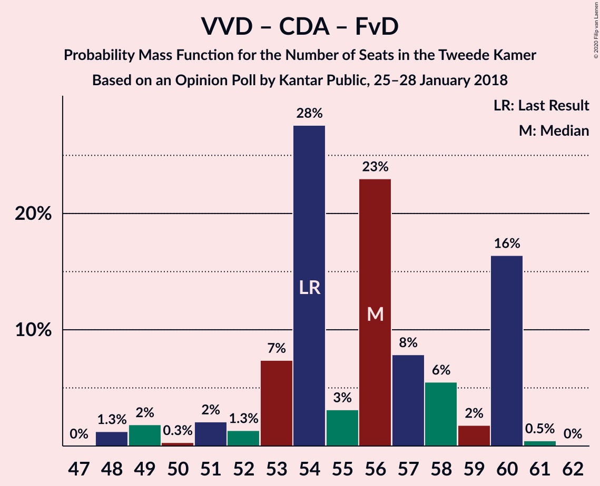

| Number of Seats | Probability | Accumulated | Special Marks |
|:---------------:|:-----------:|:-----------:|:-------------:|
| 48 | 1.3% | 100% |  |
| 49 | 2% | 98.7% |  |
| 50 | 0.3% | 97% |  |
| 51 | 2% | 97% |  |
| 52 | 1.3% | 94% |  |
| 53 | 7% | 93% |  |
| 54 | 28% | 86% | Last Result |
| 55 | 3% | 58% | Median |
| 56 | 23% | 55% |  |
| 57 | 8% | 32% |  |
| 58 | 6% | 24% |  |
| 59 | 2% | 19% |  |
| 60 | 16% | 17% |  |
| 61 | 0.5% | 0.5% |  |
| 62 | 0% | 0% |  |

### Volkspartij voor Vrijheid en Democratie – Christen-Democratisch Appèl – Partij van de Arbeid

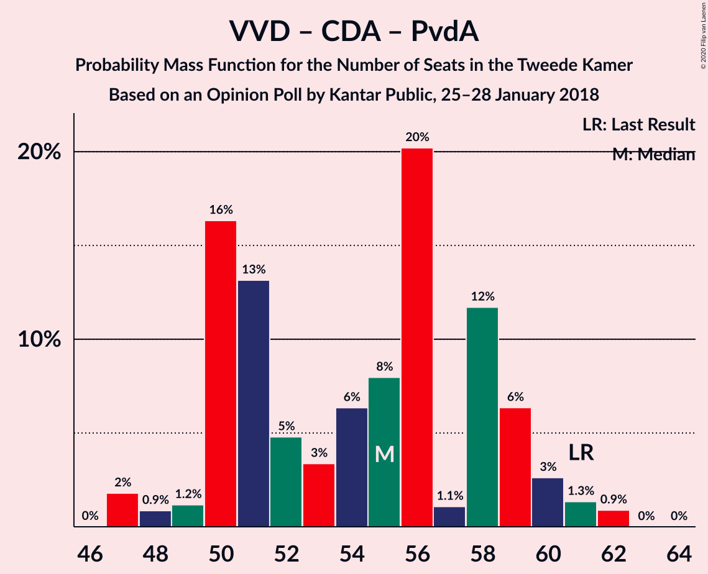

| Number of Seats | Probability | Accumulated | Special Marks |
|:---------------:|:-----------:|:-----------:|:-------------:|
| 47 | 2% | 100% |  |
| 48 | 0.9% | 98% |  |
| 49 | 1.2% | 97% |  |
| 50 | 16% | 96% |  |
| 51 | 13% | 80% |  |
| 52 | 5% | 67% |  |
| 53 | 3% | 62% | Median |
| 54 | 6% | 59% |  |
| 55 | 8% | 52% |  |
| 56 | 20% | 44% |  |
| 57 | 1.1% | 24% |  |
| 58 | 12% | 23% |  |
| 59 | 6% | 11% |  |
| 60 | 3% | 5% |  |
| 61 | 1.3% | 2% | Last Result |
| 62 | 0.9% | 0.9% |  |
| 63 | 0% | 0% |  |

### Volkspartij voor Vrijheid en Democratie – Christen-Democratisch Appèl

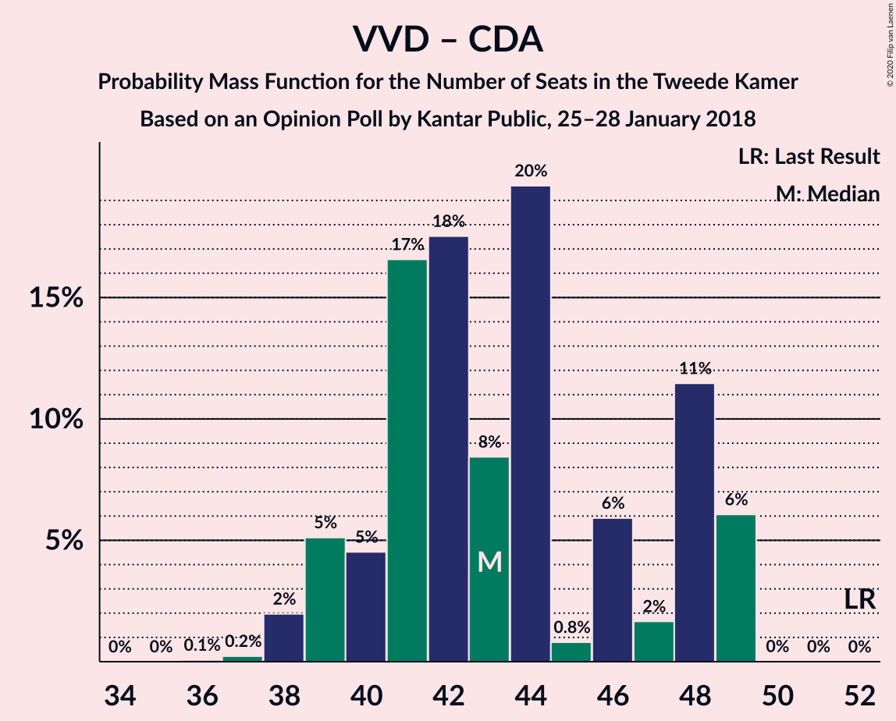

| Number of Seats | Probability | Accumulated | Special Marks |
|:---------------:|:-----------:|:-----------:|:-------------:|
| 36 | 0.1% | 100% |  |
| 37 | 0.2% | 99.9% |  |
| 38 | 2% | 99.7% |  |
| 39 | 5% | 98% |  |
| 40 | 5% | 93% |  |
| 41 | 17% | 88% |  |
| 42 | 18% | 72% |  |
| 43 | 8% | 54% | Median |
| 44 | 20% | 46% |  |
| 45 | 0.8% | 26% |  |
| 46 | 6% | 25% |  |
| 47 | 2% | 19% |  |
| 48 | 11% | 18% |  |
| 49 | 6% | 6% |  |
| 50 | 0% | 0% |  |
| 51 | 0% | 0% |  |
| 52 | 0% | 0% | Last Result |

### Democraten 66 – Christen-Democratisch Appèl – Partij van de Arbeid

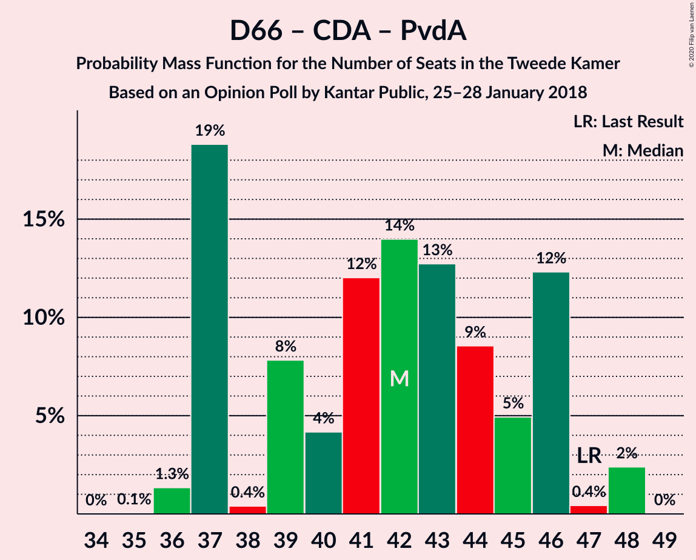

| Number of Seats | Probability | Accumulated | Special Marks |
|:---------------:|:-----------:|:-----------:|:-------------:|
| 35 | 0.1% | 100% |  |
| 36 | 1.3% | 99.9% |  |
| 37 | 19% | 98.6% |  |
| 38 | 0.4% | 80% |  |
| 39 | 8% | 79% |  |
| 40 | 4% | 72% |  |
| 41 | 12% | 67% |  |
| 42 | 14% | 55% | Median |
| 43 | 13% | 41% |  |
| 44 | 9% | 29% |  |
| 45 | 5% | 20% |  |
| 46 | 12% | 15% |  |
| 47 | 0.4% | 3% | Last Result |
| 48 | 2% | 2% |  |
| 49 | 0% | 0% |  |

### Volkspartij voor Vrijheid en Democratie – Partij van de Arbeid

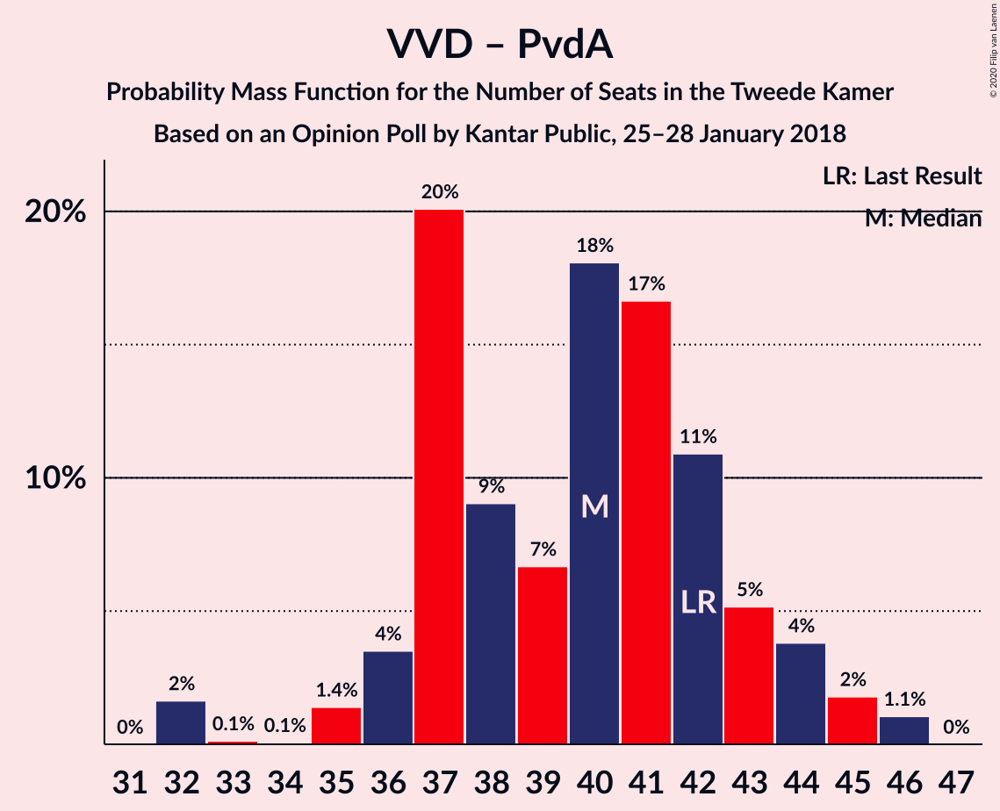

| Number of Seats | Probability | Accumulated | Special Marks |
|:---------------:|:-----------:|:-----------:|:-------------:|
| 32 | 2% | 100% |  |
| 33 | 0.1% | 98% |  |
| 34 | 0.1% | 98% |  |
| 35 | 1.4% | 98% |  |
| 36 | 4% | 97% |  |
| 37 | 20% | 93% |  |
| 38 | 9% | 73% | Median |
| 39 | 7% | 64% |  |
| 40 | 18% | 57% |  |
| 41 | 17% | 39% |  |
| 42 | 11% | 23% | Last Result |
| 43 | 5% | 12% |  |
| 44 | 4% | 7% |  |
| 45 | 2% | 3% |  |
| 46 | 1.1% | 1.1% |  |
| 47 | 0% | 0% |  |

### Christen-Democratisch Appèl – Partij van de Arbeid – ChristenUnie

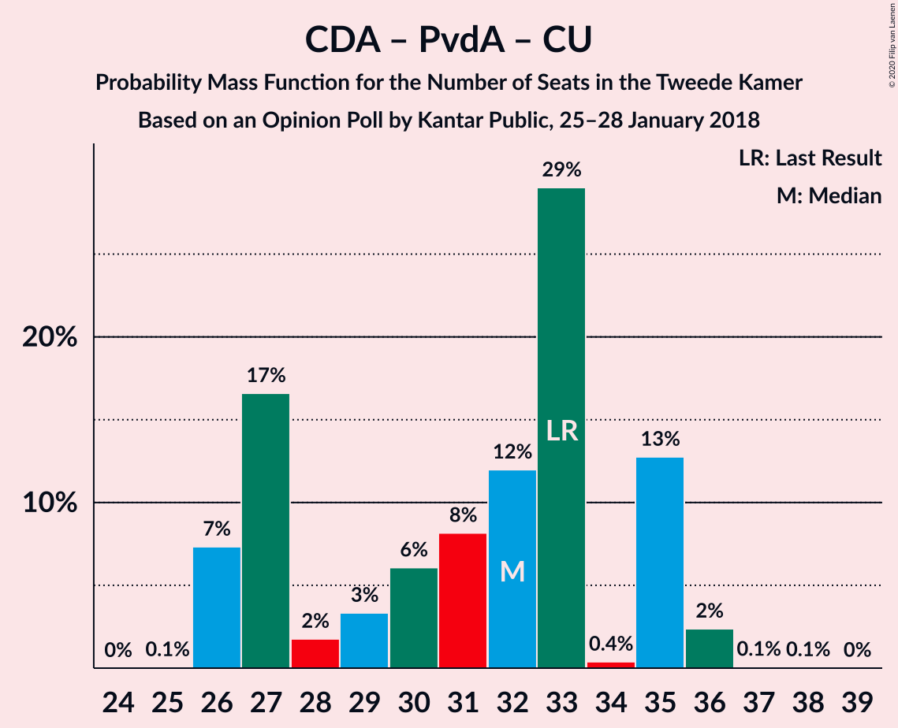

| Number of Seats | Probability | Accumulated | Special Marks |
|:---------------:|:-----------:|:-----------:|:-------------:|
| 25 | 0.1% | 100% |  |
| 26 | 7% | 99.9% |  |
| 27 | 17% | 93% |  |
| 28 | 2% | 76% |  |
| 29 | 3% | 74% |  |
| 30 | 6% | 71% |  |
| 31 | 8% | 65% | Median |
| 32 | 12% | 57% |  |
| 33 | 29% | 45% | Last Result |
| 34 | 0.4% | 16% |  |
| 35 | 13% | 15% |  |
| 36 | 2% | 3% |  |
| 37 | 0.1% | 0.1% |  |
| 38 | 0.1% | 0.1% |  |
| 39 | 0% | 0% |  |

### Democraten 66 – Christen-Democratisch Appèl

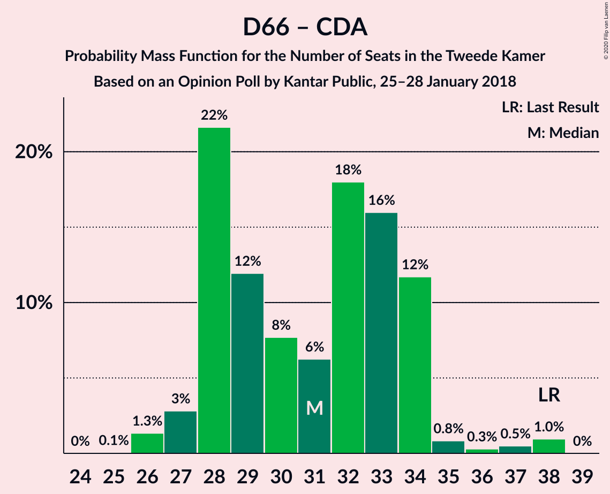

| Number of Seats | Probability | Accumulated | Special Marks |
|:---------------:|:-----------:|:-----------:|:-------------:|
| 25 | 0.1% | 100% |  |
| 26 | 1.3% | 99.9% |  |
| 27 | 3% | 98.6% |  |
| 28 | 22% | 96% |  |
| 29 | 12% | 74% |  |
| 30 | 8% | 62% |  |
| 31 | 6% | 55% |  |
| 32 | 18% | 48% | Median |
| 33 | 16% | 30% |  |
| 34 | 12% | 14% |  |
| 35 | 0.8% | 3% |  |
| 36 | 0.3% | 2% |  |
| 37 | 0.5% | 1.5% |  |
| 38 | 1.0% | 1.0% | Last Result |
| 39 | 0% | 0% |  |

### Christen-Democratisch Appèl – Partij van de Arbeid

| Number of Seats | Probability | Accumulated | Special Marks |
|:---------------:|:-----------:|:-----------:|:-------------:|
| 20 | 0.1% | 100% |  |
| 21 | 0.8% | 99.9% |  |
| 22 | 23% | 99.1% |  |
| 23 | 6% | 76% |  |
| 24 | 9% | 70% |  |
| 25 | 5% | 60% | Median |
| 26 | 13% | 55% |  |
| 27 | 21% | 42% |  |
| 28 | 15% | 21% | Last Result |
| 29 | 0.3% | 6% |  |
| 30 | 5% | 6% |  |
| 31 | 0% | 0.1% |  |
| 32 | 0% | 0% |  |

## Technical Information

### Opinion Poll

+ **Polling firm:** Kantar Public
+ **Commissioner(s):** —
+ **Fieldwork period:** 25–28 January 2018

### Calculations

+ **Sample size:** 1156
+ **Simulations done:** 1,048,576
+ **Error estimate:** 3.86%

