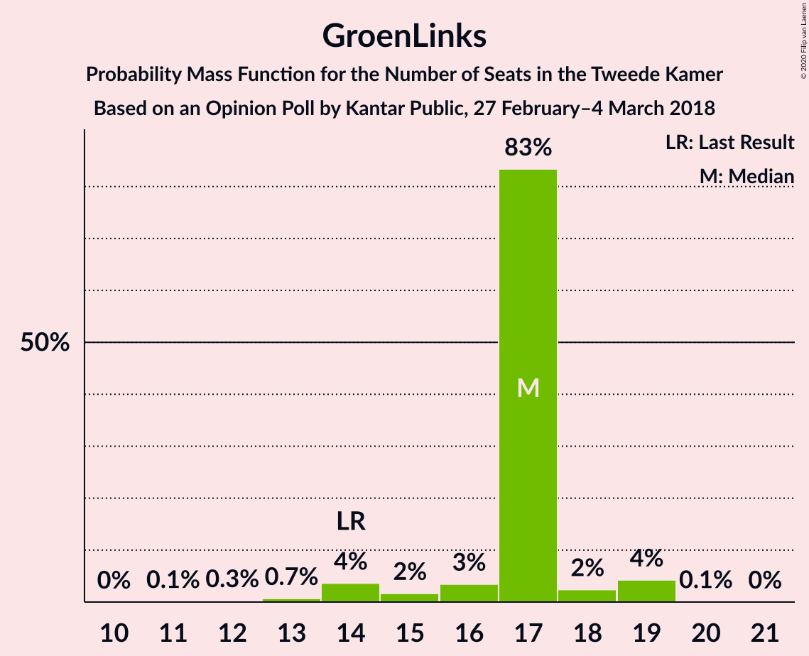

# Opinion Poll by Kantar Public, 27 February–4 March 2018

<a href="#voting-intentions">Voting Intentions</a> | <a href="#seats">Seats</a> | <a href="#coalitions">Coalitions</a> | <a href="#technical-information">Technical Information</a>

## Voting Intentions

### Confidence Intervals

| Party | Last Result | Poll Result | 80% Confidence Interval | 90% Confidence Interval | 95% Confidence Interval | 99% Confidence Interval |
|:-----:|:-----------:|:-----------:|:-----------------------:|:-----------------------:|:-----------------------:|:-----------------------:|
| Volkspartij voor Vrijheid en Democratie | 21.3% | 20.0% | 18.5–21.6% |18.0–22.1% |17.7–22.5% |17.0–23.3% |
| Partij voor de Vrijheid | 13.1% | 10.6% | 9.5–11.9% |9.2–12.3% |8.9–12.6% |8.4–13.3% |
| GroenLinks | 9.1% | 10.6% | 9.5–11.9% |9.2–12.3% |8.9–12.6% |8.4–13.3% |
| Socialistische Partij | 9.1% | 10.6% | 9.5–11.9% |9.2–12.3% |8.9–12.6% |8.4–13.3% |
| Christen-Democratisch Appèl | 12.4% | 10.0% | 8.9–11.3% |8.6–11.7% |8.4–12.0% |7.8–12.7% |
| Democraten 66 | 12.2% | 10.0% | 8.9–11.3% |8.6–11.7% |8.4–12.0% |7.8–12.7% |
| Partij van de Arbeid | 5.7% | 6.0% | 5.2–7.1% |4.9–7.4% |4.7–7.6% |4.4–8.2% |
| Forum voor Democratie | 1.8% | 6.0% | 5.2–7.1% |4.9–7.4% |4.7–7.6% |4.4–8.2% |
| ChristenUnie | 3.4% | 4.0% | 3.3–4.9% |3.1–5.2% |3.0–5.4% |2.7–5.9% |
| Partij voor de Dieren | 3.2% | 4.0% | 3.3–4.9% |3.1–5.2% |3.0–5.4% |2.7–5.9% |
| 50Plus | 3.1% | 4.0% | 3.3–4.9% |3.1–5.2% |3.0–5.4% |2.7–5.9% |
| Staatkundig Gereformeerde Partij | 2.1% | 2.0% | 1.6–2.7% |1.4–2.9% |1.3–3.1% |1.1–3.4% |
| DENK | 2.1% | 2.0% | 1.6–2.7% |1.4–2.9% |1.3–3.1% |1.1–3.4% |

*Note:* The poll result column reflects the actual value used in the calculations. Published results may vary slightly, and in addition be rounded to fewer digits.

## Seats

### Confidence Intervals

| Party | Last Result | Median | 80% Confidence Interval | 90% Confidence Interval | 95% Confidence Interval | 99% Confidence Interval |
|:-----:|:-----------:|:------:|:-----------------------:|:-----------------------:|:-----------------------:|:-----------------------:|
| <a href="#volkspartij-voor-vrijheid-en-democratie">Volkspartij voor Vrijheid en Democratie</a> | 33 | 32 | 30–32 |28–32 |27–33 |27–35 |
| <a href="#partij-voor-de-vrijheid">Partij voor de Vrijheid</a> | 20 | 17 | 16–19 |14–19 |14–19 |13–19 |
| <a href="#groenlinks">GroenLinks</a> | 14 | 17 | 17 |15–18 |14–19 |13–19 |
| <a href="#socialistische-partij">Socialistische Partij</a> | 14 | 16 | 16–17 |15–17 |14–18 |13–20 |
| <a href="#christen-democratisch-appèl">Christen-Democratisch Appèl</a> | 19 | 14 | 14–18 |14–18 |13–18 |12–19 |
| <a href="#democraten-66">Democraten 66</a> | 19 | 18 | 15–18 |14–18 |13–18 |12–19 |
| <a href="#partij-van-de-arbeid">Partij van de Arbeid</a> | 9 | 7 | 7–9 |7–10 |7–11 |7–12 |
| <a href="#forum-voor-democratie">Forum voor Democratie</a> | 2 | 8 | 7–9 |7–10 |7–11 |7–12 |
| <a href="#christenunie">ChristenUnie</a> | 5 | 5 | 5–6 |4–7 |4–7 |3–8 |
| <a href="#partij-voor-de-dieren">Partij voor de Dieren</a> | 5 | 6 | 4–6 |4–7 |4–7 |4–8 |
| <a href="#50plus">50Plus</a> | 4 | 6 | 5–6 |5–7 |4–7 |4–9 |
| <a href="#staatkundig-gereformeerde-partij">Staatkundig Gereformeerde Partij</a> | 3 | 2 | 2 |2–3 |2–4 |1–5 |
| <a href="#denk">DENK</a> | 3 | 2 | 2–3 |2–3 |2–4 |2–5 |

### Volkspartij voor Vrijheid en Democratie

*For a full overview of the results for this party, see the [Volkspartij voor Vrijheid en Democratie](party-volkspartijvoorvrijheidendemocratie.html) page.*

| Number of Seats | Probability | Accumulated | Special Marks |
|:---------------:|:-----------:|:-----------:|:-------------:|
| 25 | 0% | 100% |  |
| 26 | 0.2% | 99.9% |  |
| 27 | 4% | 99.8% |  |
| 28 | 2% | 96% |  |
| 29 | 3% | 94% |  |
| 30 | 19% | 91% |  |
| 31 | 2% | 72% |  |
| 32 | 65% | 70% | Median |
| 33 | 3% | 5% | Last Result |
| 34 | 1.1% | 2% |  |
| 35 | 0.1% | 0.6% |  |
| 36 | 0.5% | 0.5% |  |
| 37 | 0% | 0% |  |

### Partij voor de Vrijheid

*For a full overview of the results for this party, see the [Partij voor de Vrijheid](party-partijvoordevrijheid.html) page.*

| Number of Seats | Probability | Accumulated | Special Marks |
|:---------------:|:-----------:|:-----------:|:-------------:|
| 12 | 0.4% | 100% |  |
| 13 | 0.6% | 99.6% |  |
| 14 | 4% | 99.0% |  |
| 15 | 2% | 95% |  |
| 16 | 3% | 93% |  |
| 17 | 69% | 90% | Median |
| 18 | 1.2% | 21% |  |
| 19 | 19% | 20% |  |
| 20 | 0.4% | 0.4% | Last Result |
| 21 | 0% | 0% |  |

### GroenLinks

*For a full overview of the results for this party, see the [GroenLinks](party-groenlinks.html) page.*

| Number of Seats | Probability | Accumulated | Special Marks |
|:---------------:|:-----------:|:-----------:|:-------------:|
| 11 | 0.1% | 100% |  |
| 12 | 0.3% | 99.9% |  |
| 13 | 0.7% | 99.6% |  |
| 14 | 4% | 98.9% | Last Result |
| 15 | 2% | 95% |  |
| 16 | 3% | 94% |  |
| 17 | 83% | 90% | Median |
| 18 | 2% | 7% |  |
| 19 | 4% | 4% |  |
| 20 | 0.1% | 0.1% |  |
| 21 | 0% | 0% |  |

### Socialistische Partij

*For a full overview of the results for this party, see the [Socialistische Partij](party-socialistischepartij.html) page.*

| Number of Seats | Probability | Accumulated | Special Marks |
|:---------------:|:-----------:|:-----------:|:-------------:|
| 12 | 0.2% | 100% |  |
| 13 | 0.6% | 99.7% |  |
| 14 | 3% | 99.1% | Last Result |
| 15 | 3% | 96% |  |
| 16 | 68% | 93% | Median |
| 17 | 22% | 26% |  |
| 18 | 3% | 4% |  |
| 19 | 0.4% | 1.3% |  |
| 20 | 0.9% | 0.9% |  |
| 21 | 0% | 0% |  |

### Christen-Democratisch Appèl

*For a full overview of the results for this party, see the [Christen-Democratisch Appèl](party-christen-democratischappèl.html) page.*

| Number of Seats | Probability | Accumulated | Special Marks |
|:---------------:|:-----------:|:-----------:|:-------------:|
| 11 | 0.1% | 100% |  |
| 12 | 0.8% | 99.8% |  |
| 13 | 3% | 99.0% |  |
| 14 | 66% | 96% | Median |
| 15 | 6% | 31% |  |
| 16 | 3% | 24% |  |
| 17 | 2% | 21% |  |
| 18 | 19% | 20% |  |
| 19 | 0.6% | 0.7% | Last Result |
| 20 | 0% | 0% |  |

### Democraten 66

*For a full overview of the results for this party, see the [Democraten 66](party-democraten66.html) page.*

| Number of Seats | Probability | Accumulated | Special Marks |
|:---------------:|:-----------:|:-----------:|:-------------:|
| 12 | 0.5% | 100% |  |
| 13 | 3% | 99.5% |  |
| 14 | 3% | 96% |  |
| 15 | 23% | 94% |  |
| 16 | 3% | 71% |  |
| 17 | 0.5% | 68% |  |
| 18 | 67% | 68% | Median |
| 19 | 0.5% | 0.6% | Last Result |
| 20 | 0% | 0% |  |

### Partij van de Arbeid

*For a full overview of the results for this party, see the [Partij van de Arbeid](party-partijvandearbeid.html) page.*

| Number of Seats | Probability | Accumulated | Special Marks |
|:---------------:|:-----------:|:-----------:|:-------------:|
| 6 | 0.2% | 100% |  |
| 7 | 66% | 99.7% | Median |
| 8 | 21% | 34% |  |
| 9 | 6% | 12% | Last Result |
| 10 | 3% | 6% |  |
| 11 | 1.0% | 3% |  |
| 12 | 1.4% | 2% |  |
| 13 | 0% | 0.1% |  |
| 14 | 0.1% | 0.1% |  |
| 15 | 0% | 0% |  |

### Forum voor Democratie

*For a full overview of the results for this party, see the [Forum voor Democratie](party-forumvoordemocratie.html) page.*

| Number of Seats | Probability | Accumulated | Special Marks |
|:---------------:|:-----------:|:-----------:|:-------------:|
| 2 | 0% | 100% | Last Result |
| 3 | 0% | 100% |  |
| 4 | 0% | 100% |  |
| 5 | 0% | 100% |  |
| 6 | 0.2% | 100% |  |
| 7 | 21% | 99.8% |  |
| 8 | 69% | 79% | Median |
| 9 | 3% | 10% |  |
| 10 | 4% | 8% |  |
| 11 | 2% | 3% |  |
| 12 | 0.7% | 1.0% |  |
| 13 | 0.2% | 0.2% |  |
| 14 | 0% | 0% |  |

### ChristenUnie

*For a full overview of the results for this party, see the [ChristenUnie](party-christenunie.html) page.*

| Number of Seats | Probability | Accumulated | Special Marks |
|:---------------:|:-----------:|:-----------:|:-------------:|
| 3 | 2% | 100% |  |
| 4 | 3% | 98% |  |
| 5 | 85% | 95% | Last Result, Median |
| 6 | 3% | 10% |  |
| 7 | 7% | 8% |  |
| 8 | 0.4% | 0.5% |  |
| 9 | 0.2% | 0.2% |  |
| 10 | 0% | 0% |  |

### Partij voor de Dieren

*For a full overview of the results for this party, see the [Partij voor de Dieren](party-partijvoordedieren.html) page.*

| Number of Seats | Probability | Accumulated | Special Marks |
|:---------------:|:-----------:|:-----------:|:-------------:|
| 4 | 18% | 100% |  |
| 5 | 4% | 82% | Last Result |
| 6 | 73% | 78% | Median |
| 7 | 4% | 5% |  |
| 8 | 1.1% | 1.3% |  |
| 9 | 0.2% | 0.2% |  |
| 10 | 0% | 0% |  |

### 50Plus

*For a full overview of the results for this party, see the [50Plus](party-50plus.html) page.*

| Number of Seats | Probability | Accumulated | Special Marks |
|:---------------:|:-----------:|:-----------:|:-------------:|
| 3 | 0.2% | 100% |  |
| 4 | 4% | 99.8% | Last Result |
| 5 | 6% | 96% |  |
| 6 | 84% | 90% | Median |
| 7 | 4% | 6% |  |
| 8 | 0.4% | 1.2% |  |
| 9 | 0.8% | 0.8% |  |
| 10 | 0% | 0% |  |

### Staatkundig Gereformeerde Partij

*For a full overview of the results for this party, see the [Staatkundig Gereformeerde Partij](party-staatkundiggereformeerdepartij.html) page.*

| Number of Seats | Probability | Accumulated | Special Marks |
|:---------------:|:-----------:|:-----------:|:-------------:|
| 1 | 0.7% | 100% |  |
| 2 | 93% | 99.3% | Median |
| 3 | 2% | 7% | Last Result |
| 4 | 4% | 4% |  |
| 5 | 0.5% | 0.5% |  |
| 6 | 0% | 0% |  |

### DENK

*For a full overview of the results for this party, see the [DENK](party-denk.html) page.*

| Number of Seats | Probability | Accumulated | Special Marks |
|:---------------:|:-----------:|:-----------:|:-------------:|
| 1 | 0.5% | 100% |  |
| 2 | 86% | 99.5% | Median |
| 3 | 11% | 13% | Last Result |
| 4 | 2% | 3% |  |
| 5 | 1.1% | 1.1% |  |
| 6 | 0.1% | 0.1% |  |
| 7 | 0% | 0% |  |

## Coalitions

### Confidence Intervals

| Coalition | Last Result | Median | Majority? | 80% Confidence Interval | 90% Confidence Interval | 95% Confidence Interval | 99% Confidence Interval |
|:---------:|:-----------:|:------:|:---------:|:-----------------------:|:-----------------------:|:-----------------------:|:-----------------------:|
| Volkspartij voor Vrijheid en Democratie – GroenLinks – Christen-Democratisch Appèl – Democraten 66 – ChristenUnie | 90 | 86 | 100% | 82–86 | 80–86 | 77–89 | 77–89 |
| GroenLinks – Socialistische Partij – Christen-Democratisch Appèl – Democraten 66 – Partij van de Arbeid – ChristenUnie | 80 | 77 | 96% | 77–80 | 77–80 | 74–81 | 71–81 |
| Volkspartij voor Vrijheid en Democratie – Christen-Democratisch Appèl – Democraten 66 – Partij van de Arbeid – ChristenUnie | 85 | 76 | 89% | 75–76 | 73–78 | 72–79 | 70–80 |
| Volkspartij voor Vrijheid en Democratie – Partij voor de Vrijheid – Christen-Democratisch Appèl – Forum voor Democratie – Staatkundig Gereformeerde Partij | 77 | 73 | 19% | 73–76 | 71–76 | 70–76 | 69–78 |
| Volkspartij voor Vrijheid en Democratie – Partij voor de Vrijheid – Christen-Democratisch Appèl – Forum voor Democratie | 74 | 71 | 0.4% | 70–74 | 69–74 | 68–74 | 66–74 |
| Volkspartij voor Vrijheid en Democratie – Christen-Democratisch Appèl – Democraten 66 – ChristenUnie | 76 | 69 | 0% | 66–69 | 64–69 | 63–70 | 62–72 |
| Volkspartij voor Vrijheid en Democratie – Partij voor de Vrijheid – Christen-Democratisch Appèl | 72 | 63 | 0% | 62–67 | 60–67 | 59–67 | 58–67 |
| Volkspartij voor Vrijheid en Democratie – Christen-Democratisch Appèl – Forum voor Democratie – 50Plus – Staatkundig Gereformeerde Partij | 61 | 62 | 0% | 62–63 | 61–64 | 61–65 | 59–68 |
| GroenLinks – Christen-Democratisch Appèl – Democraten 66 – Partij van de Arbeid – ChristenUnie | 66 | 61 | 0% | 61–63 | 59–64 | 58–64 | 56–65 |
| Volkspartij voor Vrijheid en Democratie – Christen-Democratisch Appèl – Democraten 66 | 71 | 64 | 0% | 61–64 | 59–64 | 56–64 | 55–66 |
| Volkspartij voor Vrijheid en Democratie – Christen-Democratisch Appèl – Forum voor Democratie – 50Plus | 58 | 60 | 0% | 59–61 | 59–61 | 58–62 | 55–66 |
| Volkspartij voor Vrijheid en Democratie – Christen-Democratisch Appèl – Forum voor Democratie – Staatkundig Gereformeerde Partij | 57 | 56 | 0% | 56–57 | 55–58 | 54–60 | 53–62 |
| Volkspartij voor Vrijheid en Democratie – Christen-Democratisch Appèl – Partij van de Arbeid | 61 | 53 | 0% | 53–56 | 52–56 | 51–59 | 50–60 |
| Volkspartij voor Vrijheid en Democratie – Democraten 66 – Partij van de Arbeid | 61 | 57 | 0% | 53–57 | 53–57 | 49–58 | 49–61 |
| Volkspartij voor Vrijheid en Democratie – Christen-Democratisch Appèl – Forum voor Democratie | 54 | 54 | 0% | 54–55 | 52–56 | 52–57 | 50–60 |
| Volkspartij voor Vrijheid en Democratie – Christen-Democratisch Appèl | 52 | 46 | 0% | 46–48 | 43–48 | 42–48 | 41–50 |
| Christen-Democratisch Appèl – Democraten 66 – Partij van de Arbeid | 47 | 39 | 0% | 39–41 | 38–42 | 36–43 | 35–44 |
| Volkspartij voor Vrijheid en Democratie – Partij van de Arbeid | 42 | 39 | 0% | 38–39 | 36–41 | 36–42 | 35–44 |
| Christen-Democratisch Appèl – Democraten 66 | 38 | 32 | 0% | 30–33 | 29–33 | 28–33 | 27–34 |
| Christen-Democratisch Appèl – Partij van de Arbeid – ChristenUnie | 33 | 26 | 0% | 26–31 | 26–32 | 26–33 | 26–34 |
| Christen-Democratisch Appèl – Partij van de Arbeid | 28 | 21 | 0% | 21–26 | 21–26 | 21–27 | 21–29 |

### Volkspartij voor Vrijheid en Democratie – GroenLinks – Christen-Democratisch Appèl – Democraten 66 – ChristenUnie

| Number of Seats | Probability | Accumulated | Special Marks |
|:---------------:|:-----------:|:-----------:|:-------------:|
| 76 | 0% | 100% | Majority |
| 77 | 3% | 99.9% |  |
| 78 | 0.1% | 97% |  |
| 79 | 2% | 97% |  |
| 80 | 1.0% | 95% |  |
| 81 | 2% | 94% |  |
| 82 | 3% | 93% |  |
| 83 | 2% | 90% |  |
| 84 | 0.7% | 87% |  |
| 85 | 19% | 87% |  |
| 86 | 65% | 68% | Median |
| 87 | 0.1% | 3% |  |
| 88 | 0.4% | 3% |  |
| 89 | 3% | 3% |  |
| 90 | 0% | 0% | Last Result |

### GroenLinks – Socialistische Partij – Christen-Democratisch Appèl – Democraten 66 – Partij van de Arbeid – ChristenUnie

| Number of Seats | Probability | Accumulated | Special Marks |
|:---------------:|:-----------:|:-----------:|:-------------:|
| 69 | 0.2% | 100% |  |
| 70 | 0% | 99.8% |  |
| 71 | 0.3% | 99.7% |  |
| 72 | 0.5% | 99.4% |  |
| 73 | 1.1% | 98.9% |  |
| 74 | 0.8% | 98% |  |
| 75 | 0.6% | 97% |  |
| 76 | 0.6% | 96% | Majority |
| 77 | 67% | 96% | Median |
| 78 | 5% | 29% |  |
| 79 | 0.5% | 24% |  |
| 80 | 20% | 23% | Last Result |
| 81 | 3% | 3% |  |
| 82 | 0.2% | 0.4% |  |
| 83 | 0.1% | 0.2% |  |
| 84 | 0% | 0.1% |  |
| 85 | 0.1% | 0.1% |  |
| 86 | 0% | 0% |  |

### Volkspartij voor Vrijheid en Democratie – Christen-Democratisch Appèl – Democraten 66 – Partij van de Arbeid – ChristenUnie

| Number of Seats | Probability | Accumulated | Special Marks |
|:---------------:|:-----------:|:-----------:|:-------------:|
| 69 | 0.1% | 100% |  |
| 70 | 1.1% | 99.9% |  |
| 71 | 0.2% | 98.8% |  |
| 72 | 3% | 98.7% |  |
| 73 | 3% | 96% |  |
| 74 | 1.2% | 93% |  |
| 75 | 2% | 92% |  |
| 76 | 82% | 89% | Median, Majority |
| 77 | 1.3% | 7% |  |
| 78 | 3% | 6% |  |
| 79 | 2% | 3% |  |
| 80 | 0.5% | 0.8% |  |
| 81 | 0.1% | 0.3% |  |
| 82 | 0.1% | 0.2% |  |
| 83 | 0.1% | 0.1% |  |
| 84 | 0% | 0% |  |
| 85 | 0% | 0% | Last Result |

### Volkspartij voor Vrijheid en Democratie – Partij voor de Vrijheid – Christen-Democratisch Appèl – Forum voor Democratie – Staatkundig Gereformeerde Partij

| Number of Seats | Probability | Accumulated | Special Marks |
|:---------------:|:-----------:|:-----------:|:-------------:|
| 66 | 0.1% | 100% |  |
| 67 | 0% | 99.8% |  |
| 68 | 0.3% | 99.8% |  |
| 69 | 0.6% | 99.5% |  |
| 70 | 1.5% | 98.9% |  |
| 71 | 4% | 97% |  |
| 72 | 1.1% | 93% |  |
| 73 | 67% | 92% | Median |
| 74 | 3% | 25% |  |
| 75 | 3% | 22% |  |
| 76 | 18% | 19% | Majority |
| 77 | 0.6% | 1.3% | Last Result |
| 78 | 0.3% | 0.7% |  |
| 79 | 0.2% | 0.4% |  |
| 80 | 0.1% | 0.1% |  |
| 81 | 0% | 0.1% |  |
| 82 | 0% | 0% |  |

### Volkspartij voor Vrijheid en Democratie – Partij voor de Vrijheid – Christen-Democratisch Appèl – Forum voor Democratie

| Number of Seats | Probability | Accumulated | Special Marks |
|:---------------:|:-----------:|:-----------:|:-------------:|
| 64 | 0.1% | 100% |  |
| 65 | 0.1% | 99.8% |  |
| 66 | 1.0% | 99.7% |  |
| 67 | 0.5% | 98.7% |  |
| 68 | 0.8% | 98% |  |
| 69 | 6% | 97% |  |
| 70 | 3% | 92% |  |
| 71 | 65% | 89% | Median |
| 72 | 1.4% | 24% |  |
| 73 | 4% | 22% |  |
| 74 | 17% | 18% | Last Result |
| 75 | 0.1% | 0.4% |  |
| 76 | 0.1% | 0.4% | Majority |
| 77 | 0.2% | 0.3% |  |
| 78 | 0.1% | 0.1% |  |
| 79 | 0% | 0% |  |

### Volkspartij voor Vrijheid en Democratie – Christen-Democratisch Appèl – Democraten 66 – ChristenUnie

| Number of Seats | Probability | Accumulated | Special Marks |
|:---------------:|:-----------:|:-----------:|:-------------:|
| 60 | 0.1% | 100% |  |
| 61 | 0.1% | 99.9% |  |
| 62 | 0.5% | 99.8% |  |
| 63 | 4% | 99.3% |  |
| 64 | 3% | 95% |  |
| 65 | 1.2% | 92% |  |
| 66 | 2% | 91% |  |
| 67 | 2% | 89% |  |
| 68 | 18% | 87% |  |
| 69 | 65% | 69% | Median |
| 70 | 3% | 4% |  |
| 71 | 0.1% | 0.8% |  |
| 72 | 0.5% | 0.7% |  |
| 73 | 0.1% | 0.2% |  |
| 74 | 0% | 0.1% |  |
| 75 | 0% | 0% |  |
| 76 | 0% | 0% | Last Result, Majority |

### Volkspartij voor Vrijheid en Democratie – Partij voor de Vrijheid – Christen-Democratisch Appèl

| Number of Seats | Probability | Accumulated | Special Marks |
|:---------------:|:-----------:|:-----------:|:-------------:|
| 54 | 0.1% | 100% |  |
| 55 | 0.2% | 99.9% |  |
| 56 | 0.1% | 99.7% |  |
| 57 | 0.1% | 99.6% |  |
| 58 | 2% | 99.5% |  |
| 59 | 2% | 98% |  |
| 60 | 2% | 95% |  |
| 61 | 2% | 93% |  |
| 62 | 5% | 91% |  |
| 63 | 65% | 86% | Median |
| 64 | 1.3% | 21% |  |
| 65 | 2% | 20% |  |
| 66 | 0.3% | 18% |  |
| 67 | 17% | 17% |  |
| 68 | 0.1% | 0.1% |  |
| 69 | 0% | 0.1% |  |
| 70 | 0% | 0% |  |
| 71 | 0% | 0% |  |
| 72 | 0% | 0% | Last Result |

### Volkspartij voor Vrijheid en Democratie – Christen-Democratisch Appèl – Forum voor Democratie – 50Plus – Staatkundig Gereformeerde Partij

| Number of Seats | Probability | Accumulated | Special Marks |
|:---------------:|:-----------:|:-----------:|:-------------:|
| 56 | 0% | 100% |  |
| 57 | 0.1% | 99.9% |  |
| 58 | 0% | 99.8% |  |
| 59 | 1.1% | 99.8% |  |
| 60 | 1.1% | 98.7% |  |
| 61 | 7% | 98% | Last Result |
| 62 | 65% | 91% | Median |
| 63 | 20% | 25% |  |
| 64 | 2% | 6% |  |
| 65 | 2% | 4% |  |
| 66 | 0.3% | 2% |  |
| 67 | 0.3% | 1.5% |  |
| 68 | 0.9% | 1.2% |  |
| 69 | 0.1% | 0.3% |  |
| 70 | 0% | 0.1% |  |
| 71 | 0.1% | 0.1% |  |
| 72 | 0% | 0% |  |

### GroenLinks – Christen-Democratisch Appèl – Democraten 66 – Partij van de Arbeid – ChristenUnie

| Number of Seats | Probability | Accumulated | Special Marks |
|:---------------:|:-----------:|:-----------:|:-------------:|
| 53 | 0.1% | 100% |  |
| 54 | 0% | 99.9% |  |
| 55 | 0.2% | 99.8% |  |
| 56 | 0.4% | 99.7% |  |
| 57 | 0.5% | 99.3% |  |
| 58 | 1.3% | 98.8% |  |
| 59 | 4% | 97% |  |
| 60 | 0.5% | 93% |  |
| 61 | 66% | 93% | Median |
| 62 | 1.0% | 27% |  |
| 63 | 18% | 26% |  |
| 64 | 6% | 8% |  |
| 65 | 1.5% | 2% |  |
| 66 | 0.1% | 0.4% | Last Result |
| 67 | 0.1% | 0.3% |  |
| 68 | 0% | 0.2% |  |
| 69 | 0.1% | 0.2% |  |
| 70 | 0% | 0% |  |

### Volkspartij voor Vrijheid en Democratie – Christen-Democratisch Appèl – Democraten 66

| Number of Seats | Probability | Accumulated | Special Marks |
|:---------------:|:-----------:|:-----------:|:-------------:|
| 54 | 0% | 100% |  |
| 55 | 0.4% | 99.9% |  |
| 56 | 2% | 99.5% |  |
| 57 | 2% | 97% |  |
| 58 | 0.1% | 95% |  |
| 59 | 0.9% | 95% |  |
| 60 | 4% | 94% |  |
| 61 | 1.3% | 90% |  |
| 62 | 0.6% | 89% |  |
| 63 | 22% | 89% |  |
| 64 | 65% | 66% | Median |
| 65 | 0.5% | 1.1% |  |
| 66 | 0.4% | 0.6% |  |
| 67 | 0.1% | 0.2% |  |
| 68 | 0% | 0.1% |  |
| 69 | 0% | 0% |  |
| 70 | 0% | 0% |  |
| 71 | 0% | 0% | Last Result |

### Volkspartij voor Vrijheid en Democratie – Christen-Democratisch Appèl – Forum voor Democratie – 50Plus

| Number of Seats | Probability | Accumulated | Special Marks |
|:---------------:|:-----------:|:-----------:|:-------------:|
| 54 | 0% | 100% |  |
| 55 | 1.0% | 99.9% |  |
| 56 | 0.8% | 98.9% |  |
| 57 | 0.4% | 98% |  |
| 58 | 0.3% | 98% | Last Result |
| 59 | 8% | 97% |  |
| 60 | 65% | 90% | Median |
| 61 | 22% | 25% |  |
| 62 | 0.9% | 3% |  |
| 63 | 0.6% | 2% |  |
| 64 | 0.9% | 2% |  |
| 65 | 0.2% | 0.8% |  |
| 66 | 0.4% | 0.6% |  |
| 67 | 0.1% | 0.2% |  |
| 68 | 0.1% | 0.1% |  |
| 69 | 0% | 0% |  |

### Volkspartij voor Vrijheid en Democratie – Christen-Democratisch Appèl – Forum voor Democratie – Staatkundig Gereformeerde Partij

| Number of Seats | Probability | Accumulated | Special Marks |
|:---------------:|:-----------:|:-----------:|:-------------:|
| 51 | 0% | 100% |  |
| 52 | 0.2% | 99.9% |  |
| 53 | 0.3% | 99.7% |  |
| 54 | 4% | 99.4% |  |
| 55 | 1.3% | 95% |  |
| 56 | 67% | 94% | Median |
| 57 | 21% | 27% | Last Result |
| 58 | 2% | 7% |  |
| 59 | 2% | 5% |  |
| 60 | 1.5% | 3% |  |
| 61 | 0.4% | 1.5% |  |
| 62 | 0.9% | 1.1% |  |
| 63 | 0.1% | 0.2% |  |
| 64 | 0% | 0.1% |  |
| 65 | 0% | 0.1% |  |
| 66 | 0% | 0% |  |

### Volkspartij voor Vrijheid en Democratie – Christen-Democratisch Appèl – Partij van de Arbeid

| Number of Seats | Probability | Accumulated | Special Marks |
|:---------------:|:-----------:|:-----------:|:-------------:|
| 48 | 0.1% | 100% |  |
| 49 | 0.2% | 99.9% |  |
| 50 | 1.2% | 99.7% |  |
| 51 | 2% | 98.6% |  |
| 52 | 4% | 96% |  |
| 53 | 65% | 93% | Median |
| 54 | 2% | 28% |  |
| 55 | 0.9% | 26% |  |
| 56 | 22% | 25% |  |
| 57 | 0.4% | 3% |  |
| 58 | 0.4% | 3% |  |
| 59 | 0.9% | 3% |  |
| 60 | 2% | 2% |  |
| 61 | 0.1% | 0.1% | Last Result |
| 62 | 0% | 0% |  |

### Volkspartij voor Vrijheid en Democratie – Democraten 66 – Partij van de Arbeid

| Number of Seats | Probability | Accumulated | Special Marks |
|:---------------:|:-----------:|:-----------:|:-------------:|
| 47 | 0.1% | 100% |  |
| 48 | 0.3% | 99.9% |  |
| 49 | 3% | 99.7% |  |
| 50 | 0.2% | 97% |  |
| 51 | 0.4% | 97% |  |
| 52 | 0.7% | 96% |  |
| 53 | 18% | 96% |  |
| 54 | 4% | 78% |  |
| 55 | 0.9% | 73% |  |
| 56 | 5% | 73% |  |
| 57 | 65% | 68% | Median |
| 58 | 2% | 3% |  |
| 59 | 0.5% | 1.2% |  |
| 60 | 0.1% | 0.6% |  |
| 61 | 0.5% | 0.5% | Last Result |
| 62 | 0% | 0% |  |

### Volkspartij voor Vrijheid en Democratie – Christen-Democratisch Appèl – Forum voor Democratie

| Number of Seats | Probability | Accumulated | Special Marks |
|:---------------:|:-----------:|:-----------:|:-------------:|
| 48 | 0% | 100% |  |
| 49 | 0.1% | 99.9% |  |
| 50 | 0.9% | 99.9% |  |
| 51 | 1.2% | 98.9% |  |
| 52 | 3% | 98% |  |
| 53 | 0.8% | 94% |  |
| 54 | 67% | 94% | Last Result, Median |
| 55 | 20% | 26% |  |
| 56 | 3% | 6% |  |
| 57 | 2% | 3% |  |
| 58 | 0.5% | 1.2% |  |
| 59 | 0.1% | 0.7% |  |
| 60 | 0.5% | 0.6% |  |
| 61 | 0% | 0.1% |  |
| 62 | 0.1% | 0.1% |  |
| 63 | 0% | 0% |  |

### Volkspartij voor Vrijheid en Democratie – Christen-Democratisch Appèl

| Number of Seats | Probability | Accumulated | Special Marks |
|:---------------:|:-----------:|:-----------:|:-------------:|
| 39 | 0% | 100% |  |
| 40 | 0.1% | 99.9% |  |
| 41 | 0.6% | 99.8% |  |
| 42 | 3% | 99.2% |  |
| 43 | 4% | 96% |  |
| 44 | 2% | 93% |  |
| 45 | 0.7% | 91% |  |
| 46 | 65% | 90% | Median |
| 47 | 2% | 25% |  |
| 48 | 22% | 23% |  |
| 49 | 0.8% | 2% |  |
| 50 | 0.6% | 1.0% |  |
| 51 | 0.1% | 0.4% |  |
| 52 | 0.3% | 0.3% | Last Result |
| 53 | 0% | 0% |  |

### Christen-Democratisch Appèl – Democraten 66 – Partij van de Arbeid

| Number of Seats | Probability | Accumulated | Special Marks |
|:---------------:|:-----------:|:-----------:|:-------------:|
| 33 | 0% | 100% |  |
| 34 | 0.1% | 99.9% |  |
| 35 | 0.4% | 99.8% |  |
| 36 | 2% | 99.4% |  |
| 37 | 1.3% | 97% |  |
| 38 | 5% | 96% |  |
| 39 | 65% | 91% | Median |
| 40 | 2% | 26% |  |
| 41 | 18% | 24% |  |
| 42 | 3% | 6% |  |
| 43 | 1.4% | 3% |  |
| 44 | 1.4% | 2% |  |
| 45 | 0.1% | 0.2% |  |
| 46 | 0.1% | 0.1% |  |
| 47 | 0% | 0% | Last Result |

### Volkspartij voor Vrijheid en Democratie – Partij van de Arbeid

| Number of Seats | Probability | Accumulated | Special Marks |
|:---------------:|:-----------:|:-----------:|:-------------:|
| 32 | 0.1% | 100% |  |
| 33 | 0.1% | 99.9% |  |
| 34 | 0.1% | 99.9% |  |
| 35 | 1.1% | 99.7% |  |
| 36 | 4% | 98.7% |  |
| 37 | 0.5% | 95% |  |
| 38 | 19% | 94% |  |
| 39 | 65% | 75% | Median |
| 40 | 3% | 9% |  |
| 41 | 4% | 7% |  |
| 42 | 1.0% | 3% | Last Result |
| 43 | 2% | 2% |  |
| 44 | 0.1% | 0.6% |  |
| 45 | 0.1% | 0.4% |  |
| 46 | 0% | 0.3% |  |
| 47 | 0.3% | 0.3% |  |
| 48 | 0% | 0% |  |

### Christen-Democratisch Appèl – Democraten 66

| Number of Seats | Probability | Accumulated | Special Marks |
|:---------------:|:-----------:|:-----------:|:-------------:|
| 25 | 0.4% | 100% |  |
| 26 | 0.1% | 99.6% |  |
| 27 | 1.3% | 99.5% |  |
| 28 | 1.3% | 98% |  |
| 29 | 3% | 97% |  |
| 30 | 5% | 94% |  |
| 31 | 1.4% | 89% |  |
| 32 | 66% | 88% | Median |
| 33 | 20% | 21% |  |
| 34 | 1.3% | 2% |  |
| 35 | 0.2% | 0.4% |  |
| 36 | 0.2% | 0.2% |  |
| 37 | 0% | 0% |  |
| 38 | 0% | 0% | Last Result |

### Christen-Democratisch Appèl – Partij van de Arbeid – ChristenUnie

| Number of Seats | Probability | Accumulated | Special Marks |
|:---------------:|:-----------:|:-----------:|:-------------:|
| 23 | 0.1% | 100% |  |
| 24 | 0.1% | 99.9% |  |
| 25 | 0.1% | 99.8% |  |
| 26 | 65% | 99.7% | Median |
| 27 | 1.0% | 35% |  |
| 28 | 3% | 34% |  |
| 29 | 3% | 30% |  |
| 30 | 5% | 28% |  |
| 31 | 18% | 23% |  |
| 32 | 2% | 5% |  |
| 33 | 2% | 3% | Last Result |
| 34 | 0.9% | 1.1% |  |
| 35 | 0.2% | 0.2% |  |
| 36 | 0% | 0.1% |  |
| 37 | 0.1% | 0.1% |  |
| 38 | 0% | 0% |  |

### Christen-Democratisch Appèl – Partij van de Arbeid

| Number of Seats | Probability | Accumulated | Special Marks |
|:---------------:|:-----------:|:-----------:|:-------------:|
| 19 | 0.2% | 100% |  |
| 20 | 0.2% | 99.8% |  |
| 21 | 65% | 99.6% | Median |
| 22 | 2% | 34% |  |
| 23 | 4% | 32% |  |
| 24 | 4% | 28% |  |
| 25 | 3% | 25% |  |
| 26 | 18% | 22% |  |
| 27 | 2% | 4% |  |
| 28 | 0.8% | 2% | Last Result |
| 29 | 1.3% | 1.3% |  |
| 30 | 0% | 0% |  |

## Technical Information

### Opinion Poll

+ **Polling firm:** Kantar Public
+ **Commissioner(s):** —
+ **Fieldwork period:** 27 February–4 March 2018

### Calculations

+ **Sample size:** 1046
+ **Simulations done:** 1,048,576
+ **Error estimate:** 2.39%

