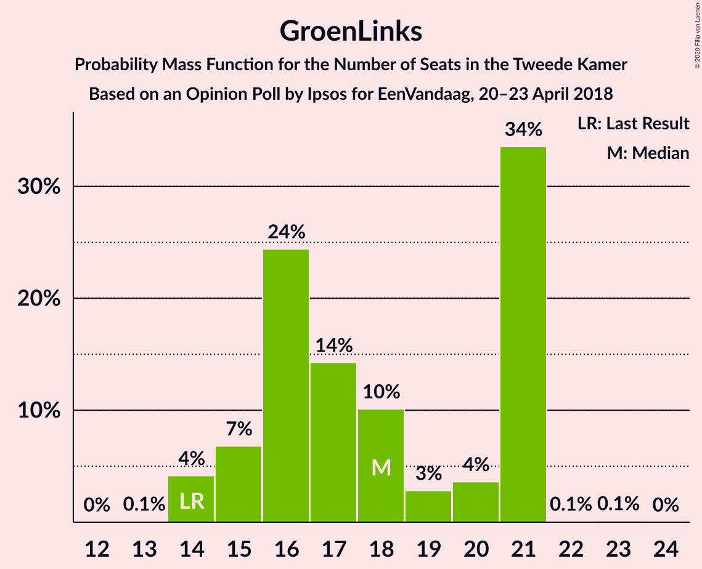

# Opinion Poll by Ipsos for EenVandaag, 20–23 April 2018

<a href="#voting-intentions">Voting Intentions</a> | <a href="#seats">Seats</a> | <a href="#coalitions">Coalitions</a> | <a href="#technical-information">Technical Information</a>

## Voting Intentions

### Confidence Intervals

| Party | Last Result | Poll Result | 80% Confidence Interval | 90% Confidence Interval | 95% Confidence Interval | 99% Confidence Interval |
|:-----:|:-----------:|:-----------:|:-----------------------:|:-----------------------:|:-----------------------:|:-----------------------:|
| Volkspartij voor Vrijheid en Democratie | 21.3% | 21.7% | 20.2–23.3% |19.8–23.8% |19.4–24.2% |18.8–25.0% |
| GroenLinks | 9.1% | 11.6% | 10.5–12.9% |10.2–13.3% |9.9–13.6% |9.4–14.3% |
| Christen-Democratisch Appèl | 12.4% | 9.8% | 8.7–11.0% |8.4–11.3% |8.2–11.6% |7.7–12.2% |
| Partij voor de Vrijheid | 13.1% | 9.4% | 8.4–10.6% |8.1–10.9% |7.9–11.2% |7.4–11.8% |
| Democraten 66 | 12.2% | 9.4% | 8.4–10.6% |8.1–10.9% |7.9–11.2% |7.4–11.8% |
| Socialistische Partij | 9.1% | 8.2% | 7.3–9.3% |7.0–9.6% |6.8–9.9% |6.3–10.5% |
| Forum voor Democratie | 1.8% | 6.4% | 5.6–7.4% |5.3–7.7% |5.2–8.0% |4.8–8.5% |
| Partij van de Arbeid | 5.7% | 5.2% | 4.5–6.2% |4.3–6.4% |4.1–6.7% |3.7–7.1% |
| ChristenUnie | 3.4% | 4.7% | 4.0–5.6% |3.8–5.9% |3.6–6.1% |3.3–6.5% |
| Partij voor de Dieren | 3.2% | 4.5% | 3.8–5.4% |3.6–5.7% |3.5–5.9% |3.2–6.3% |
| 50Plus | 3.1% | 4.1% | 3.4–5.0% |3.3–5.2% |3.1–5.4% |2.8–5.8% |
| DENK | 2.1% | 2.5% | 2.0–3.2% |1.8–3.4% |1.7–3.6% |1.5–3.9% |
| Staatkundig Gereformeerde Partij | 2.1% | 2.0% | 1.5–2.6% |1.4–2.8% |1.3–2.9% |1.1–3.3% |

*Note:* The poll result column reflects the actual value used in the calculations. Published results may vary slightly, and in addition be rounded to fewer digits.

## Seats

### Confidence Intervals

| Party | Last Result | Median | 80% Confidence Interval | 90% Confidence Interval | 95% Confidence Interval | 99% Confidence Interval |
|:-----:|:-----------:|:------:|:-----------------------:|:-----------------------:|:-----------------------:|:-----------------------:|
| <a href="#volkspartij-voor-vrijheid-en-democratie">Volkspartij voor Vrijheid en Democratie</a> | 33 | 33 | 30–36 |29–36 |29–37 |28–39 |
| <a href="#groenlinks">GroenLinks</a> | 14 | 18 | 15–21 |15–21 |14–21 |14–21 |
| <a href="#christen-democratisch-appèl">Christen-Democratisch Appèl</a> | 19 | 14 | 14–16 |13–18 |13–18 |12–18 |
| <a href="#partij-voor-de-vrijheid">Partij voor de Vrijheid</a> | 20 | 14 | 13–16 |12–17 |11–17 |11–18 |
| <a href="#democraten-66">Democraten 66</a> | 19 | 15 | 12–16 |12–16 |11–17 |11–17 |
| <a href="#socialistische-partij">Socialistische Partij</a> | 14 | 12 | 10–14 |10–14 |10–14 |10–15 |
| <a href="#forum-voor-democratie">Forum voor Democratie</a> | 2 | 9 | 8–10 |8–11 |7–11 |7–12 |
| <a href="#partij-van-de-arbeid">Partij van de Arbeid</a> | 9 | 9 | 6–10 |6–10 |6–10 |5–10 |
| <a href="#christenunie">ChristenUnie</a> | 5 | 7 | 6–8 |6–9 |5–10 |5–10 |
| <a href="#partij-voor-de-dieren">Partij voor de Dieren</a> | 5 | 7 | 5–8 |5–8 |5–9 |4–9 |
| <a href="#50plus">50Plus</a> | 4 | 6 | 4–7 |4–8 |4–8 |4–8 |
| <a href="#denk">DENK</a> | 3 | 3 | 2–4 |2–4 |2–5 |2–5 |
| <a href="#staatkundig-gereformeerde-partij">Staatkundig Gereformeerde Partij</a> | 3 | 3 | 2–3 |2–4 |2–5 |1–5 |

### Volkspartij voor Vrijheid en Democratie

*For a full overview of the results for this party, see the [Volkspartij voor Vrijheid en Democratie](party-volkspartijvoorvrijheidendemocratie.html) page.*

| Number of Seats | Probability | Accumulated | Special Marks |
|:---------------:|:-----------:|:-----------:|:-------------:|
| 27 | 0.1% | 100% |  |
| 28 | 0.8% | 99.8% |  |
| 29 | 6% | 99.0% |  |
| 30 | 4% | 93% |  |
| 31 | 3% | 89% |  |
| 32 | 5% | 85% |  |
| 33 | 32% | 80% | Last Result, Median |
| 34 | 4% | 48% |  |
| 35 | 32% | 44% |  |
| 36 | 9% | 12% |  |
| 37 | 2% | 3% |  |
| 38 | 0.5% | 1.1% |  |
| 39 | 0.2% | 0.6% |  |
| 40 | 0.4% | 0.4% |  |
| 41 | 0% | 0% |  |

### GroenLinks

*For a full overview of the results for this party, see the [GroenLinks](party-groenlinks.html) page.*

| Number of Seats | Probability | Accumulated | Special Marks |
|:---------------:|:-----------:|:-----------:|:-------------:|
| 13 | 0.1% | 100% |  |
| 14 | 4% | 99.9% | Last Result |
| 15 | 7% | 96% |  |
| 16 | 24% | 89% |  |
| 17 | 14% | 65% |  |
| 18 | 10% | 50% | Median |
| 19 | 3% | 40% |  |
| 20 | 4% | 37% |  |
| 21 | 34% | 34% |  |
| 22 | 0.1% | 0.2% |  |
| 23 | 0.1% | 0.1% |  |
| 24 | 0% | 0% |  |

### Christen-Democratisch Appèl

*For a full overview of the results for this party, see the [Christen-Democratisch Appèl](party-christen-democratischappèl.html) page.*

| Number of Seats | Probability | Accumulated | Special Marks |
|:---------------:|:-----------:|:-----------:|:-------------:|
| 11 | 0.3% | 100% |  |
| 12 | 2% | 99.7% |  |
| 13 | 4% | 98% |  |
| 14 | 48% | 94% | Median |
| 15 | 22% | 46% |  |
| 16 | 14% | 24% |  |
| 17 | 5% | 10% |  |
| 18 | 5% | 5% |  |
| 19 | 0.2% | 0.3% | Last Result |
| 20 | 0% | 0.1% |  |
| 21 | 0% | 0% |  |

### Partij voor de Vrijheid

*For a full overview of the results for this party, see the [Partij voor de Vrijheid](party-partijvoordevrijheid.html) page.*

| Number of Seats | Probability | Accumulated | Special Marks |
|:---------------:|:-----------:|:-----------:|:-------------:|
| 9 | 0.1% | 100% |  |
| 10 | 0.3% | 99.9% |  |
| 11 | 4% | 99.6% |  |
| 12 | 3% | 95% |  |
| 13 | 35% | 92% |  |
| 14 | 19% | 57% | Median |
| 15 | 11% | 38% |  |
| 16 | 22% | 27% |  |
| 17 | 4% | 6% |  |
| 18 | 1.3% | 1.5% |  |
| 19 | 0.1% | 0.1% |  |
| 20 | 0% | 0.1% | Last Result |
| 21 | 0% | 0% |  |

### Democraten 66

*For a full overview of the results for this party, see the [Democraten 66](party-democraten66.html) page.*

| Number of Seats | Probability | Accumulated | Special Marks |
|:---------------:|:-----------:|:-----------:|:-------------:|
| 10 | 0.3% | 100% |  |
| 11 | 3% | 99.7% |  |
| 12 | 25% | 97% |  |
| 13 | 3% | 73% |  |
| 14 | 15% | 70% |  |
| 15 | 42% | 55% | Median |
| 16 | 8% | 13% |  |
| 17 | 4% | 4% |  |
| 18 | 0.3% | 0.5% |  |
| 19 | 0.1% | 0.1% | Last Result |
| 20 | 0% | 0% |  |

### Socialistische Partij

*For a full overview of the results for this party, see the [Socialistische Partij](party-socialistischepartij.html) page.*

| Number of Seats | Probability | Accumulated | Special Marks |
|:---------------:|:-----------:|:-----------:|:-------------:|
| 9 | 0.3% | 100% |  |
| 10 | 29% | 99.7% |  |
| 11 | 13% | 71% |  |
| 12 | 25% | 58% | Median |
| 13 | 22% | 32% |  |
| 14 | 8% | 10% | Last Result |
| 15 | 2% | 2% |  |
| 16 | 0.3% | 0.5% |  |
| 17 | 0.2% | 0.2% |  |
| 18 | 0% | 0% |  |

### Forum voor Democratie

*For a full overview of the results for this party, see the [Forum voor Democratie](party-forumvoordemocratie.html) page.*

| Number of Seats | Probability | Accumulated | Special Marks |
|:---------------:|:-----------:|:-----------:|:-------------:|
| 2 | 0% | 100% | Last Result |
| 3 | 0% | 100% |  |
| 4 | 0% | 100% |  |
| 5 | 0% | 100% |  |
| 6 | 0.2% | 100% |  |
| 7 | 3% | 99.8% |  |
| 8 | 16% | 97% |  |
| 9 | 52% | 81% | Median |
| 10 | 22% | 29% |  |
| 11 | 5% | 7% |  |
| 12 | 2% | 2% |  |
| 13 | 0.3% | 0.3% |  |
| 14 | 0.1% | 0.1% |  |
| 15 | 0% | 0% |  |

### Partij van de Arbeid

*For a full overview of the results for this party, see the [Partij van de Arbeid](party-partijvandearbeid.html) page.*

| Number of Seats | Probability | Accumulated | Special Marks |
|:---------------:|:-----------:|:-----------:|:-------------:|
| 5 | 2% | 100% |  |
| 6 | 12% | 98% |  |
| 7 | 17% | 86% |  |
| 8 | 18% | 70% |  |
| 9 | 32% | 52% | Last Result, Median |
| 10 | 19% | 19% |  |
| 11 | 0.4% | 0.5% |  |
| 12 | 0.1% | 0.1% |  |
| 13 | 0% | 0% |  |

### ChristenUnie

*For a full overview of the results for this party, see the [ChristenUnie](party-christenunie.html) page.*

| Number of Seats | Probability | Accumulated | Special Marks |
|:---------------:|:-----------:|:-----------:|:-------------:|
| 4 | 0.4% | 100% |  |
| 5 | 3% | 99.6% | Last Result |
| 6 | 12% | 97% |  |
| 7 | 64% | 85% | Median |
| 8 | 12% | 21% |  |
| 9 | 6% | 9% |  |
| 10 | 3% | 3% |  |
| 11 | 0.1% | 0.1% |  |
| 12 | 0% | 0% |  |

### Partij voor de Dieren

*For a full overview of the results for this party, see the [Partij voor de Dieren](party-partijvoordedieren.html) page.*

| Number of Seats | Probability | Accumulated | Special Marks |
|:---------------:|:-----------:|:-----------:|:-------------:|
| 4 | 0.9% | 100% |  |
| 5 | 12% | 99.1% | Last Result |
| 6 | 9% | 87% |  |
| 7 | 60% | 78% | Median |
| 8 | 14% | 18% |  |
| 9 | 4% | 4% |  |
| 10 | 0.1% | 0.2% |  |
| 11 | 0.1% | 0.1% |  |
| 12 | 0% | 0% |  |

### 50Plus

*For a full overview of the results for this party, see the [50Plus](party-50plus.html) page.*

| Number of Seats | Probability | Accumulated | Special Marks |
|:---------------:|:-----------:|:-----------:|:-------------:|
| 3 | 0.1% | 100% |  |
| 4 | 10% | 99.9% | Last Result |
| 5 | 34% | 90% |  |
| 6 | 18% | 56% | Median |
| 7 | 31% | 38% |  |
| 8 | 6% | 6% |  |
| 9 | 0.2% | 0.2% |  |
| 10 | 0% | 0.1% |  |
| 11 | 0% | 0% |  |

### DENK

*For a full overview of the results for this party, see the [DENK](party-denk.html) page.*

| Number of Seats | Probability | Accumulated | Special Marks |
|:---------------:|:-----------:|:-----------:|:-------------:|
| 2 | 16% | 100% |  |
| 3 | 40% | 84% | Last Result, Median |
| 4 | 41% | 45% |  |
| 5 | 3% | 3% |  |
| 6 | 0.4% | 0.4% |  |
| 7 | 0% | 0% |  |

### Staatkundig Gereformeerde Partij

*For a full overview of the results for this party, see the [Staatkundig Gereformeerde Partij](party-staatkundiggereformeerdepartij.html) page.*

| Number of Seats | Probability | Accumulated | Special Marks |
|:---------------:|:-----------:|:-----------:|:-------------:|
| 1 | 2% | 100% |  |
| 2 | 39% | 98% |  |
| 3 | 50% | 59% | Last Result, Median |
| 4 | 7% | 9% |  |
| 5 | 3% | 3% |  |
| 6 | 0% | 0% |  |

## Coalitions

### Confidence Intervals

| Coalition | Last Result | Median | Majority? | 80% Confidence Interval | 90% Confidence Interval | 95% Confidence Interval | 99% Confidence Interval |
|:---------:|:-----------:|:------:|:---------:|:-----------------------:|:-----------------------:|:-----------------------:|:-----------------------:|
| Volkspartij voor Vrijheid en Democratie – GroenLinks – Christen-Democratisch Appèl – Democraten 66 – ChristenUnie | 90 | 88 | 100% | 84–92 | 81–94 | 81–94 | 80–94 |
| Volkspartij voor Vrijheid en Democratie – Christen-Democratisch Appèl – Democraten 66 – Partij van de Arbeid – ChristenUnie | 85 | 78 | 87% | 74–81 | 72–81 | 72–82 | 71–85 |
| Volkspartij voor Vrijheid en Democratie – Christen-Democratisch Appèl – Partij voor de Vrijheid – Forum voor Democratie – Staatkundig Gereformeerde Partij | 77 | 74 | 40% | 71–78 | 70–78 | 70–80 | 68–81 |
| GroenLinks – Christen-Democratisch Appèl – Democraten 66 – Socialistische Partij – Partij van de Arbeid – ChristenUnie | 80 | 75 | 47% | 71–77 | 71–78 | 69–78 | 67–79 |
| Volkspartij voor Vrijheid en Democratie – Christen-Democratisch Appèl – Partij voor de Vrijheid – Forum voor Democratie | 74 | 72 | 3% | 69–75 | 68–75 | 67–76 | 65–79 |
| Volkspartij voor Vrijheid en Democratie – Christen-Democratisch Appèl – Democraten 66 – ChristenUnie | 76 | 69 | 2% | 66–73 | 63–73 | 63–74 | 63–77 |
| Volkspartij voor Vrijheid en Democratie – Christen-Democratisch Appèl – Forum voor Democratie – 50Plus – Staatkundig Gereformeerde Partij | 61 | 66 | 0% | 64–69 | 63–70 | 62–70 | 60–72 |
| Volkspartij voor Vrijheid en Democratie – Christen-Democratisch Appèl – Forum voor Democratie – 50Plus | 58 | 64 | 0% | 61–66 | 60–66 | 59–68 | 57–69 |
| GroenLinks – Christen-Democratisch Appèl – Democraten 66 – Partij van de Arbeid – ChristenUnie | 66 | 62 | 0% | 59–66 | 58–67 | 57–67 | 54–67 |
| Volkspartij voor Vrijheid en Democratie – Christen-Democratisch Appèl – Partij voor de Vrijheid | 72 | 64 | 0% | 59–65 | 58–65 | 57–67 | 56–69 |
| Volkspartij voor Vrijheid en Democratie – Christen-Democratisch Appèl – Democraten 66 | 71 | 62 | 0% | 59–66 | 57–66 | 56–67 | 56–69 |
| Volkspartij voor Vrijheid en Democratie – Christen-Democratisch Appèl – Forum voor Democratie – Staatkundig Gereformeerde Partij | 57 | 60 | 0% | 57–65 | 57–65 | 56–65 | 54–65 |
| Volkspartij voor Vrijheid en Democratie – Christen-Democratisch Appèl – Forum voor Democratie | 54 | 58 | 0% | 54–62 | 54–62 | 53–62 | 52–63 |
| Volkspartij voor Vrijheid en Democratie – Christen-Democratisch Appèl – Partij van de Arbeid | 61 | 56 | 0% | 53–59 | 53–59 | 51–60 | 50–62 |
| Volkspartij voor Vrijheid en Democratie – Democraten 66 – Partij van de Arbeid | 61 | 57 | 0% | 52–58 | 50–58 | 50–59 | 49–61 |
| Volkspartij voor Vrijheid en Democratie – Christen-Democratisch Appèl | 52 | 49 | 0% | 46–52 | 44–52 | 44–52 | 43–54 |
| Volkspartij voor Vrijheid en Democratie – Partij van de Arbeid | 42 | 42 | 0% | 38–45 | 37–45 | 36–45 | 36–46 |
| Christen-Democratisch Appèl – Democraten 66 – Partij van de Arbeid | 47 | 38 | 0% | 35–39 | 34–41 | 32–42 | 31–42 |
| Christen-Democratisch Appèl – Democraten 66 | 38 | 29 | 0% | 26–31 | 26–33 | 26–34 | 25–34 |
| Christen-Democratisch Appèl – Partij van de Arbeid – ChristenUnie | 33 | 30 | 0% | 28–32 | 28–32 | 27–33 | 25–34 |
| Christen-Democratisch Appèl – Partij van de Arbeid | 28 | 23 | 0% | 21–24 | 20–25 | 19–26 | 19–27 |

### Volkspartij voor Vrijheid en Democratie – GroenLinks – Christen-Democratisch Appèl – Democraten 66 – ChristenUnie

| Number of Seats | Probability | Accumulated | Special Marks |
|:---------------:|:-----------:|:-----------:|:-------------:|
| 78 | 0.1% | 100% |  |
| 79 | 0.2% | 99.9% |  |
| 80 | 0.9% | 99.7% |  |
| 81 | 5% | 98.9% |  |
| 82 | 0.1% | 94% |  |
| 83 | 1.1% | 94% |  |
| 84 | 21% | 93% |  |
| 85 | 5% | 71% |  |
| 86 | 8% | 66% |  |
| 87 | 4% | 58% | Median |
| 88 | 5% | 54% |  |
| 89 | 2% | 50% |  |
| 90 | 35% | 48% | Last Result |
| 91 | 1.1% | 12% |  |
| 92 | 1.4% | 11% |  |
| 93 | 1.0% | 10% |  |
| 94 | 9% | 9% |  |
| 95 | 0% | 0% |  |

### Volkspartij voor Vrijheid en Democratie – Christen-Democratisch Appèl – Democraten 66 – Partij van de Arbeid – ChristenUnie

| Number of Seats | Probability | Accumulated | Special Marks |
|:---------------:|:-----------:|:-----------:|:-------------:|
| 69 | 0.2% | 100% |  |
| 70 | 0.1% | 99.7% |  |
| 71 | 1.4% | 99.6% |  |
| 72 | 5% | 98% |  |
| 73 | 2% | 93% |  |
| 74 | 1.3% | 91% |  |
| 75 | 3% | 90% |  |
| 76 | 5% | 87% | Majority |
| 77 | 6% | 82% |  |
| 78 | 48% | 76% | Median |
| 79 | 10% | 29% |  |
| 80 | 6% | 18% |  |
| 81 | 9% | 12% |  |
| 82 | 0.5% | 3% |  |
| 83 | 1.3% | 2% |  |
| 84 | 0.4% | 1.1% |  |
| 85 | 0.6% | 0.7% | Last Result |
| 86 | 0.1% | 0.1% |  |
| 87 | 0% | 0% |  |

### Volkspartij voor Vrijheid en Democratie – Christen-Democratisch Appèl – Partij voor de Vrijheid – Forum voor Democratie – Staatkundig Gereformeerde Partij

| Number of Seats | Probability | Accumulated | Special Marks |
|:---------------:|:-----------:|:-----------:|:-------------:|
| 67 | 0.4% | 100% |  |
| 68 | 0.3% | 99.6% |  |
| 69 | 2% | 99.2% |  |
| 70 | 3% | 98% |  |
| 71 | 6% | 95% |  |
| 72 | 26% | 89% |  |
| 73 | 4% | 63% | Median |
| 74 | 12% | 59% |  |
| 75 | 8% | 48% |  |
| 76 | 20% | 40% | Majority |
| 77 | 6% | 19% | Last Result |
| 78 | 9% | 13% |  |
| 79 | 0.4% | 5% |  |
| 80 | 3% | 5% |  |
| 81 | 1.1% | 1.2% |  |
| 82 | 0% | 0.1% |  |
| 83 | 0% | 0% |  |

### GroenLinks – Christen-Democratisch Appèl – Democraten 66 – Socialistische Partij – Partij van de Arbeid – ChristenUnie

| Number of Seats | Probability | Accumulated | Special Marks |
|:---------------:|:-----------:|:-----------:|:-------------:|
| 65 | 0.1% | 100% |  |
| 66 | 0% | 99.9% |  |
| 67 | 0.8% | 99.9% |  |
| 68 | 0.5% | 99.1% |  |
| 69 | 2% | 98.6% |  |
| 70 | 0.6% | 97% |  |
| 71 | 22% | 96% |  |
| 72 | 5% | 74% |  |
| 73 | 11% | 69% |  |
| 74 | 8% | 58% |  |
| 75 | 3% | 50% | Median |
| 76 | 33% | 47% | Majority |
| 77 | 4% | 13% |  |
| 78 | 9% | 10% |  |
| 79 | 0.6% | 0.7% |  |
| 80 | 0.1% | 0.1% | Last Result |
| 81 | 0% | 0% |  |

### Volkspartij voor Vrijheid en Democratie – Christen-Democratisch Appèl – Partij voor de Vrijheid – Forum voor Democratie

| Number of Seats | Probability | Accumulated | Special Marks |
|:---------------:|:-----------:|:-----------:|:-------------:|
| 63 | 0.1% | 100% |  |
| 64 | 0.3% | 99.9% |  |
| 65 | 1.3% | 99.7% |  |
| 66 | 0.6% | 98% |  |
| 67 | 1.4% | 98% |  |
| 68 | 6% | 96% |  |
| 69 | 28% | 90% |  |
| 70 | 1.0% | 62% | Median |
| 71 | 3% | 61% |  |
| 72 | 13% | 57% |  |
| 73 | 9% | 44% |  |
| 74 | 19% | 35% | Last Result |
| 75 | 13% | 15% |  |
| 76 | 0.4% | 3% | Majority |
| 77 | 0.9% | 2% |  |
| 78 | 0.2% | 1.3% |  |
| 79 | 1.1% | 1.1% |  |
| 80 | 0% | 0% |  |

### Volkspartij voor Vrijheid en Democratie – Christen-Democratisch Appèl – Democraten 66 – ChristenUnie

| Number of Seats | Probability | Accumulated | Special Marks |
|:---------------:|:-----------:|:-----------:|:-------------:|
| 60 | 0.1% | 100% |  |
| 61 | 0% | 99.9% |  |
| 62 | 0.2% | 99.8% |  |
| 63 | 5% | 99.6% |  |
| 64 | 0.4% | 95% |  |
| 65 | 1.4% | 94% |  |
| 66 | 3% | 93% |  |
| 67 | 2% | 90% |  |
| 68 | 21% | 88% |  |
| 69 | 29% | 67% | Median |
| 70 | 4% | 38% |  |
| 71 | 6% | 34% |  |
| 72 | 4% | 28% |  |
| 73 | 20% | 24% |  |
| 74 | 1.3% | 4% |  |
| 75 | 0.6% | 2% |  |
| 76 | 0.8% | 2% | Last Result, Majority |
| 77 | 1.0% | 1.0% |  |
| 78 | 0% | 0% |  |

### Volkspartij voor Vrijheid en Democratie – Christen-Democratisch Appèl – Forum voor Democratie – 50Plus – Staatkundig Gereformeerde Partij

| Number of Seats | Probability | Accumulated | Special Marks |
|:---------------:|:-----------:|:-----------:|:-------------:|
| 59 | 0.4% | 100% |  |
| 60 | 0.3% | 99.6% |  |
| 61 | 0.4% | 99.3% | Last Result |
| 62 | 2% | 99.0% |  |
| 63 | 3% | 97% |  |
| 64 | 31% | 94% |  |
| 65 | 3% | 63% | Median |
| 66 | 13% | 60% |  |
| 67 | 25% | 47% |  |
| 68 | 5% | 22% |  |
| 69 | 12% | 17% |  |
| 70 | 4% | 6% |  |
| 71 | 0.6% | 2% |  |
| 72 | 0.9% | 1.1% |  |
| 73 | 0.1% | 0.2% |  |
| 74 | 0.1% | 0.1% |  |
| 75 | 0% | 0% |  |

### Volkspartij voor Vrijheid en Democratie – Christen-Democratisch Appèl – Forum voor Democratie – 50Plus

| Number of Seats | Probability | Accumulated | Special Marks |
|:---------------:|:-----------:|:-----------:|:-------------:|
| 56 | 0.5% | 100% |  |
| 57 | 0.1% | 99.5% |  |
| 58 | 0.4% | 99.4% | Last Result |
| 59 | 2% | 99.0% |  |
| 60 | 3% | 97% |  |
| 61 | 30% | 94% |  |
| 62 | 4% | 64% | Median |
| 63 | 6% | 60% |  |
| 64 | 13% | 55% |  |
| 65 | 24% | 42% |  |
| 66 | 13% | 18% |  |
| 67 | 2% | 5% |  |
| 68 | 1.4% | 3% |  |
| 69 | 1.3% | 1.5% |  |
| 70 | 0.1% | 0.2% |  |
| 71 | 0% | 0.1% |  |
| 72 | 0% | 0% |  |

### GroenLinks – Christen-Democratisch Appèl – Democraten 66 – Partij van de Arbeid – ChristenUnie

| Number of Seats | Probability | Accumulated | Special Marks |
|:---------------:|:-----------:|:-----------:|:-------------:|
| 54 | 0.9% | 100% |  |
| 55 | 0.3% | 99.1% |  |
| 56 | 0.1% | 98.8% |  |
| 57 | 3% | 98.7% |  |
| 58 | 4% | 96% |  |
| 59 | 19% | 92% |  |
| 60 | 11% | 73% |  |
| 61 | 8% | 62% |  |
| 62 | 9% | 53% |  |
| 63 | 4% | 45% | Median |
| 64 | 5% | 41% |  |
| 65 | 2% | 36% |  |
| 66 | 25% | 34% | Last Result |
| 67 | 9% | 9% |  |
| 68 | 0.1% | 0.2% |  |
| 69 | 0.1% | 0.1% |  |
| 70 | 0% | 0% |  |

### Volkspartij voor Vrijheid en Democratie – Christen-Democratisch Appèl – Partij voor de Vrijheid

| Number of Seats | Probability | Accumulated | Special Marks |
|:---------------:|:-----------:|:-----------:|:-------------:|
| 54 | 0.1% | 100% |  |
| 55 | 0.3% | 99.9% |  |
| 56 | 0.7% | 99.7% |  |
| 57 | 1.5% | 99.0% |  |
| 58 | 6% | 97% |  |
| 59 | 3% | 91% |  |
| 60 | 27% | 89% |  |
| 61 | 3% | 61% | Median |
| 62 | 2% | 59% |  |
| 63 | 6% | 56% |  |
| 64 | 16% | 51% |  |
| 65 | 30% | 35% |  |
| 66 | 2% | 5% |  |
| 67 | 1.0% | 3% |  |
| 68 | 0.5% | 2% |  |
| 69 | 1.2% | 1.2% |  |
| 70 | 0% | 0% |  |
| 71 | 0% | 0% |  |
| 72 | 0% | 0% | Last Result |

### Volkspartij voor Vrijheid en Democratie – Christen-Democratisch Appèl – Democraten 66

| Number of Seats | Probability | Accumulated | Special Marks |
|:---------------:|:-----------:|:-----------:|:-------------:|
| 53 | 0.1% | 100% |  |
| 54 | 0.1% | 99.9% |  |
| 55 | 0.2% | 99.8% |  |
| 56 | 4% | 99.6% |  |
| 57 | 1.1% | 96% |  |
| 58 | 3% | 95% |  |
| 59 | 2% | 92% |  |
| 60 | 2% | 90% |  |
| 61 | 21% | 87% |  |
| 62 | 28% | 66% | Median |
| 63 | 5% | 39% |  |
| 64 | 9% | 34% |  |
| 65 | 10% | 25% |  |
| 66 | 11% | 15% |  |
| 67 | 2% | 4% |  |
| 68 | 1.2% | 2% |  |
| 69 | 0.4% | 0.6% |  |
| 70 | 0.2% | 0.2% |  |
| 71 | 0% | 0% | Last Result |

### Volkspartij voor Vrijheid en Democratie – Christen-Democratisch Appèl – Forum voor Democratie – Staatkundig Gereformeerde Partij

| Number of Seats | Probability | Accumulated | Special Marks |
|:---------------:|:-----------:|:-----------:|:-------------:|
| 54 | 0.6% | 100% |  |
| 55 | 2% | 99.4% |  |
| 56 | 1.3% | 98% |  |
| 57 | 7% | 96% | Last Result |
| 58 | 4% | 90% |  |
| 59 | 29% | 86% | Median |
| 60 | 29% | 57% |  |
| 61 | 7% | 28% |  |
| 62 | 4% | 21% |  |
| 63 | 4% | 17% |  |
| 64 | 0.7% | 13% |  |
| 65 | 12% | 12% |  |
| 66 | 0.1% | 0.4% |  |
| 67 | 0.2% | 0.3% |  |
| 68 | 0.1% | 0.1% |  |
| 69 | 0% | 0% |  |

### Volkspartij voor Vrijheid en Democratie – Christen-Democratisch Appèl – Forum voor Democratie

| Number of Seats | Probability | Accumulated | Special Marks |
|:---------------:|:-----------:|:-----------:|:-------------:|
| 50 | 0.2% | 100% |  |
| 51 | 0.2% | 99.8% |  |
| 52 | 2% | 99.5% |  |
| 53 | 0.7% | 98% |  |
| 54 | 8% | 97% | Last Result |
| 55 | 1.4% | 89% |  |
| 56 | 29% | 88% | Median |
| 57 | 7% | 59% |  |
| 58 | 30% | 52% |  |
| 59 | 5% | 22% |  |
| 60 | 4% | 18% |  |
| 61 | 3% | 13% |  |
| 62 | 9% | 10% |  |
| 63 | 0.9% | 1.2% |  |
| 64 | 0.2% | 0.3% |  |
| 65 | 0.1% | 0.1% |  |
| 66 | 0% | 0% |  |

### Volkspartij voor Vrijheid en Democratie – Christen-Democratisch Appèl – Partij van de Arbeid

| Number of Seats | Probability | Accumulated | Special Marks |
|:---------------:|:-----------:|:-----------:|:-------------:|
| 49 | 0.3% | 100% |  |
| 50 | 0.3% | 99.7% |  |
| 51 | 2% | 99.3% |  |
| 52 | 2% | 97% |  |
| 53 | 9% | 96% |  |
| 54 | 4% | 86% |  |
| 55 | 4% | 82% |  |
| 56 | 28% | 78% | Median |
| 57 | 6% | 49% |  |
| 58 | 20% | 43% |  |
| 59 | 20% | 23% |  |
| 60 | 0.5% | 3% |  |
| 61 | 1.1% | 2% | Last Result |
| 62 | 0.7% | 0.9% |  |
| 63 | 0.2% | 0.2% |  |
| 64 | 0% | 0% |  |

### Volkspartij voor Vrijheid en Democratie – Democraten 66 – Partij van de Arbeid

| Number of Seats | Probability | Accumulated | Special Marks |
|:---------------:|:-----------:|:-----------:|:-------------:|
| 48 | 0.1% | 100% |  |
| 49 | 2% | 99.8% |  |
| 50 | 6% | 98% |  |
| 51 | 0.5% | 92% |  |
| 52 | 2% | 91% |  |
| 53 | 3% | 89% |  |
| 54 | 3% | 86% |  |
| 55 | 8% | 83% |  |
| 56 | 17% | 75% |  |
| 57 | 45% | 59% | Median |
| 58 | 11% | 13% |  |
| 59 | 1.1% | 3% |  |
| 60 | 1.0% | 2% |  |
| 61 | 0.4% | 0.6% | Last Result |
| 62 | 0.1% | 0.2% |  |
| 63 | 0% | 0.1% |  |
| 64 | 0.1% | 0.1% |  |
| 65 | 0% | 0% |  |

### Volkspartij voor Vrijheid en Democratie – Christen-Democratisch Appèl

| Number of Seats | Probability | Accumulated | Special Marks |
|:---------------:|:-----------:|:-----------:|:-------------:|
| 40 | 0.1% | 100% |  |
| 41 | 0.1% | 99.9% |  |
| 42 | 0.2% | 99.8% |  |
| 43 | 1.2% | 99.6% |  |
| 44 | 5% | 98% |  |
| 45 | 3% | 94% |  |
| 46 | 6% | 90% |  |
| 47 | 29% | 84% | Median |
| 48 | 3% | 55% |  |
| 49 | 21% | 52% |  |
| 50 | 17% | 31% |  |
| 51 | 3% | 14% |  |
| 52 | 9% | 11% | Last Result |
| 53 | 2% | 2% |  |
| 54 | 0.4% | 0.7% |  |
| 55 | 0.2% | 0.3% |  |
| 56 | 0% | 0% |  |

### Volkspartij voor Vrijheid en Democratie – Partij van de Arbeid

| Number of Seats | Probability | Accumulated | Special Marks |
|:---------------:|:-----------:|:-----------:|:-------------:|
| 35 | 0.1% | 100% |  |
| 36 | 3% | 99.9% |  |
| 37 | 2% | 97% |  |
| 38 | 9% | 95% |  |
| 39 | 2% | 86% |  |
| 40 | 10% | 84% |  |
| 41 | 4% | 74% |  |
| 42 | 37% | 70% | Last Result, Median |
| 43 | 11% | 33% |  |
| 44 | 3% | 22% |  |
| 45 | 18% | 19% |  |
| 46 | 0.7% | 1.0% |  |
| 47 | 0.2% | 0.3% |  |
| 48 | 0.2% | 0.2% |  |
| 49 | 0% | 0% |  |

### Christen-Democratisch Appèl – Democraten 66 – Partij van de Arbeid

| Number of Seats | Probability | Accumulated | Special Marks |
|:---------------:|:-----------:|:-----------:|:-------------:|
| 31 | 0.5% | 100% |  |
| 32 | 2% | 99.4% |  |
| 33 | 0.4% | 97% |  |
| 34 | 3% | 97% |  |
| 35 | 4% | 94% |  |
| 36 | 34% | 90% |  |
| 37 | 4% | 56% |  |
| 38 | 40% | 52% | Median |
| 39 | 3% | 12% |  |
| 40 | 3% | 9% |  |
| 41 | 2% | 5% |  |
| 42 | 3% | 3% |  |
| 43 | 0.1% | 0.1% |  |
| 44 | 0% | 0% |  |
| 45 | 0% | 0% |  |
| 46 | 0% | 0% |  |
| 47 | 0% | 0% | Last Result |

### Christen-Democratisch Appèl – Democraten 66

| Number of Seats | Probability | Accumulated | Special Marks |
|:---------------:|:-----------:|:-----------:|:-------------:|
| 23 | 0.1% | 100% |  |
| 24 | 0.3% | 99.9% |  |
| 25 | 2% | 99.6% |  |
| 26 | 19% | 98% |  |
| 27 | 8% | 79% |  |
| 28 | 3% | 71% |  |
| 29 | 31% | 68% | Median |
| 30 | 21% | 37% |  |
| 31 | 7% | 16% |  |
| 32 | 3% | 9% |  |
| 33 | 1.4% | 6% |  |
| 34 | 4% | 4% |  |
| 35 | 0.2% | 0.2% |  |
| 36 | 0% | 0% |  |
| 37 | 0% | 0% |  |
| 38 | 0% | 0% | Last Result |

### Christen-Democratisch Appèl – Partij van de Arbeid – ChristenUnie

| Number of Seats | Probability | Accumulated | Special Marks |
|:---------------:|:-----------:|:-----------:|:-------------:|
| 23 | 0.1% | 100% |  |
| 24 | 0.2% | 99.9% |  |
| 25 | 0.4% | 99.8% |  |
| 26 | 1.1% | 99.4% |  |
| 27 | 2% | 98% |  |
| 28 | 6% | 96% |  |
| 29 | 16% | 90% |  |
| 30 | 31% | 74% | Median |
| 31 | 33% | 43% |  |
| 32 | 7% | 11% |  |
| 33 | 2% | 4% | Last Result |
| 34 | 0.9% | 1.2% |  |
| 35 | 0.2% | 0.3% |  |
| 36 | 0.1% | 0.1% |  |
| 37 | 0% | 0% |  |

### Christen-Democratisch Appèl – Partij van de Arbeid

| Number of Seats | Probability | Accumulated | Special Marks |
|:---------------:|:-----------:|:-----------:|:-------------:|
| 17 | 0.1% | 100% |  |
| 18 | 0.3% | 99.9% |  |
| 19 | 3% | 99.6% |  |
| 20 | 2% | 97% |  |
| 21 | 6% | 94% |  |
| 22 | 15% | 89% |  |
| 23 | 39% | 74% | Median |
| 24 | 27% | 35% |  |
| 25 | 3% | 8% |  |
| 26 | 4% | 5% |  |
| 27 | 0.8% | 1.0% |  |
| 28 | 0.2% | 0.2% | Last Result |
| 29 | 0% | 0% |  |

## Technical Information

### Opinion Poll

+ **Polling firm:** Ipsos
+ **Commissioner(s):** EenVandaag
+ **Fieldwork period:** 20–23 April 2018

### Calculations

+ **Sample size:** 1169
+ **Simulations done:** 1,048,576
+ **Error estimate:** 3.17%

