# Opinion Poll by Ipsos for EenVandaag, 25–28 May 2018

<a href="#voting-intentions">Voting Intentions</a> | <a href="#seats">Seats</a> | <a href="#coalitions">Coalitions</a> | <a href="#technical-information">Technical Information</a>

## Voting Intentions

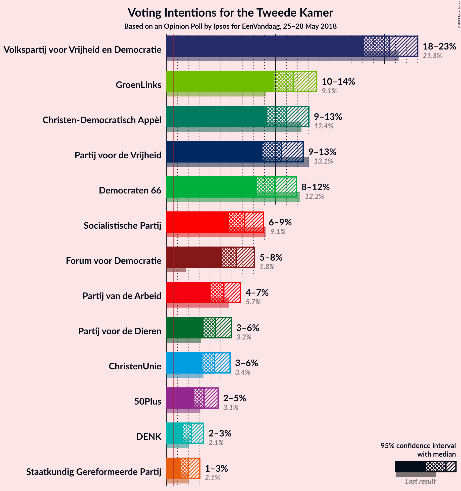

### Confidence Intervals

| Party | Last Result | Poll Result | 80% Confidence Interval | 90% Confidence Interval | 95% Confidence Interval | 99% Confidence Interval |
|:-----:|:-----------:|:-----------:|:-----------------------:|:-----------------------:|:-----------------------:|:-----------------------:|
| Volkspartij voor Vrijheid en Democratie | 21.3% | 20.5% | 18.9–22.2% |18.5–22.6% |18.1–23.0% |17.4–23.9% |
| GroenLinks | 9.1% | 11.7% | 10.5–13.0% |10.2–13.4% |9.9–13.8% |9.3–14.4% |
| Christen-Democratisch Appèl | 12.4% | 11.0% | 9.8–12.3% |9.5–12.7% |9.2–13.1% |8.7–13.7% |
| Partij voor de Vrijheid | 13.1% | 10.5% | 9.4–11.8% |9.1–12.2% |8.8–12.5% |8.3–13.2% |
| Democraten 66 | 12.2% | 10.0% | 8.9–11.2% |8.5–11.6% |8.3–11.9% |7.8–12.6% |
| Socialistische Partij | 9.1% | 7.2% | 6.2–8.3% |6.0–8.6% |5.8–8.9% |5.3–9.5% |
| Forum voor Democratie | 1.8% | 6.4% | 5.5–7.5% |5.3–7.8% |5.1–8.1% |4.7–8.6% |
| Partij van de Arbeid | 5.7% | 5.3% | 4.5–6.3% |4.3–6.5% |4.1–6.8% |3.7–7.3% |
| Partij voor de Dieren | 3.2% | 4.5% | 3.8–5.4% |3.6–5.7% |3.4–5.9% |3.1–6.4% |
| ChristenUnie | 3.4% | 4.4% | 3.7–5.3% |3.5–5.6% |3.3–5.8% |3.0–6.3% |
| 50Plus | 3.1% | 3.4% | 2.8–4.3% |2.6–4.5% |2.5–4.7% |2.2–5.2% |
| DENK | 2.1% | 2.3% | 1.8–3.0% |1.7–3.2% |1.5–3.4% |1.3–3.8% |
| Staatkundig Gereformeerde Partij | 2.1% | 2.0% | 1.6–2.7% |1.4–2.9% |1.3–3.1% |1.1–3.4% |

*Note:* The poll result column reflects the actual value used in the calculations. Published results may vary slightly, and in addition be rounded to fewer digits.

## Seats

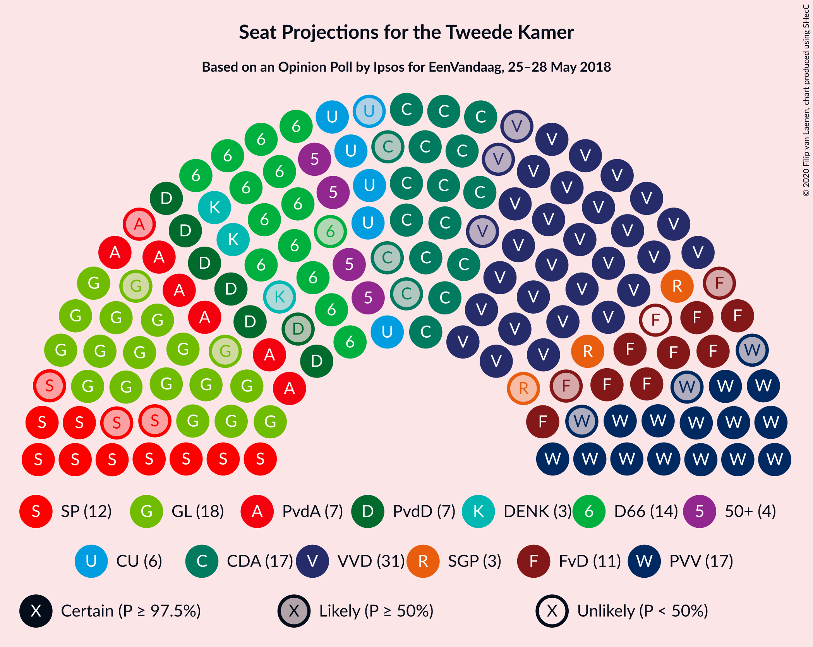

### Confidence Intervals

| Party | Last Result | Median | 80% Confidence Interval | 90% Confidence Interval | 95% Confidence Interval | 99% Confidence Interval |
|:-----:|:-----------:|:------:|:-----------------------:|:-----------------------:|:-----------------------:|:-----------------------:|
| <a href="#volkspartij-voor-vrijheid-en-democratie">Volkspartij voor Vrijheid en Democratie</a> | 33 | 31 | 29–33 |29–34 |28–34 |27–37 |
| <a href="#groenlinks">GroenLinks</a> | 14 | 18 | 16–20 |16–20 |16–20 |15–22 |
| <a href="#christen-democratisch-appèl">Christen-Democratisch Appèl</a> | 19 | 17 | 15–20 |14–20 |14–20 |12–20 |
| <a href="#partij-voor-de-vrijheid">Partij voor de Vrijheid</a> | 20 | 17 | 15–17 |15–18 |14–20 |13–20 |
| <a href="#democraten-66">Democraten 66</a> | 19 | 14 | 14–15 |13–16 |13–16 |12–18 |
| <a href="#socialistische-partij">Socialistische Partij</a> | 14 | 12 | 10–13 |10–13 |9–13 |8–14 |
| <a href="#forum-voor-democratie">Forum voor Democratie</a> | 2 | 10 | 9–11 |8–11 |8–11 |7–13 |
| <a href="#partij-van-de-arbeid">Partij van de Arbeid</a> | 9 | 7 | 7–9 |6–10 |6–10 |5–10 |
| <a href="#partij-voor-de-dieren">Partij voor de Dieren</a> | 5 | 7 | 6–7 |6–7 |6–8 |5–9 |
| <a href="#christenunie">ChristenUnie</a> | 5 | 6 | 6–7 |6–7 |5–8 |4–9 |
| <a href="#50plus">50Plus</a> | 4 | 4 | 4–6 |4–7 |4–7 |3–7 |
| <a href="#denk">DENK</a> | 3 | 3 | 2–3 |2–4 |2–4 |2–5 |
| <a href="#staatkundig-gereformeerde-partij">Staatkundig Gereformeerde Partij</a> | 3 | 3 | 2–3 |2–3 |2–4 |2–5 |

### Volkspartij voor Vrijheid en Democratie

*For a full overview of the results for this party, see the [Volkspartij voor Vrijheid en Democratie](party-volkspartijvoorvrijheidendemocratie.html) page.*

| Number of Seats | Probability | Accumulated | Special Marks |
|:---------------:|:-----------:|:-----------:|:-------------:|
| 26 | 0.1% | 100% |  |
| 27 | 0.8% | 99.9% |  |
| 28 | 3% | 99.1% |  |
| 29 | 36% | 97% |  |
| 30 | 6% | 60% |  |
| 31 | 36% | 54% | Median |
| 32 | 7% | 18% |  |
| 33 | 1.0% | 11% | Last Result |
| 34 | 7% | 10% |  |
| 35 | 0.6% | 2% |  |
| 36 | 1.2% | 2% |  |
| 37 | 0.5% | 0.6% |  |
| 38 | 0.1% | 0.2% |  |
| 39 | 0% | 0% |  |

### GroenLinks

*For a full overview of the results for this party, see the [GroenLinks](party-groenlinks.html) page.*

| Number of Seats | Probability | Accumulated | Special Marks |
|:---------------:|:-----------:|:-----------:|:-------------:|
| 13 | 0.1% | 100% |  |
| 14 | 0.3% | 99.9% | Last Result |
| 15 | 2% | 99.6% |  |
| 16 | 31% | 98% |  |
| 17 | 10% | 67% |  |
| 18 | 11% | 57% | Median |
| 19 | 2% | 46% |  |
| 20 | 42% | 44% |  |
| 21 | 0.2% | 2% |  |
| 22 | 2% | 2% |  |
| 23 | 0.1% | 0.1% |  |
| 24 | 0% | 0% |  |

### Christen-Democratisch Appèl

*For a full overview of the results for this party, see the [Christen-Democratisch Appèl](party-christen-democratischappèl.html) page.*

| Number of Seats | Probability | Accumulated | Special Marks |
|:---------------:|:-----------:|:-----------:|:-------------:|
| 12 | 0.8% | 100% |  |
| 13 | 1.0% | 99.2% |  |
| 14 | 8% | 98% |  |
| 15 | 8% | 91% |  |
| 16 | 10% | 83% |  |
| 17 | 38% | 73% | Median |
| 18 | 4% | 35% |  |
| 19 | 3% | 31% | Last Result |
| 20 | 28% | 28% |  |
| 21 | 0.2% | 0.2% |  |
| 22 | 0% | 0% |  |

### Partij voor de Vrijheid

*For a full overview of the results for this party, see the [Partij voor de Vrijheid](party-partijvoordevrijheid.html) page.*

| Number of Seats | Probability | Accumulated | Special Marks |
|:---------------:|:-----------:|:-----------:|:-------------:|
| 12 | 0.2% | 100% |  |
| 13 | 1.2% | 99.8% |  |
| 14 | 3% | 98.6% |  |
| 15 | 12% | 96% |  |
| 16 | 3% | 84% |  |
| 17 | 76% | 81% | Median |
| 18 | 1.2% | 5% |  |
| 19 | 0.7% | 4% |  |
| 20 | 3% | 3% | Last Result |
| 21 | 0.1% | 0.1% |  |
| 22 | 0% | 0% |  |

### Democraten 66

*For a full overview of the results for this party, see the [Democraten 66](party-democraten66.html) page.*

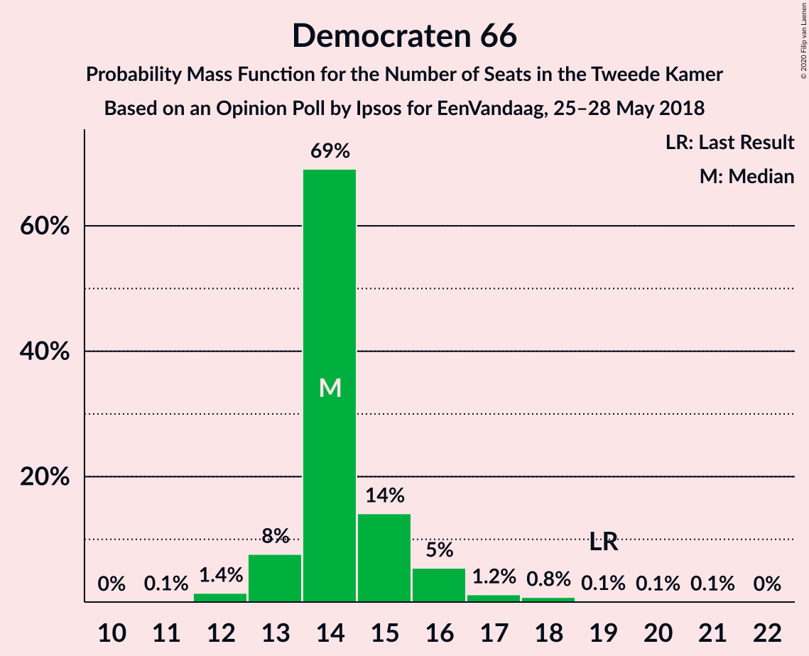

| Number of Seats | Probability | Accumulated | Special Marks |
|:---------------:|:-----------:|:-----------:|:-------------:|
| 11 | 0.1% | 100% |  |
| 12 | 1.4% | 99.9% |  |
| 13 | 8% | 98% |  |
| 14 | 69% | 91% | Median |
| 15 | 14% | 22% |  |
| 16 | 5% | 8% |  |
| 17 | 1.2% | 2% |  |
| 18 | 0.8% | 1.0% |  |
| 19 | 0.1% | 0.2% | Last Result |
| 20 | 0.1% | 0.1% |  |
| 21 | 0.1% | 0.1% |  |
| 22 | 0% | 0% |  |

### Socialistische Partij

*For a full overview of the results for this party, see the [Socialistische Partij](party-socialistischepartij.html) page.*

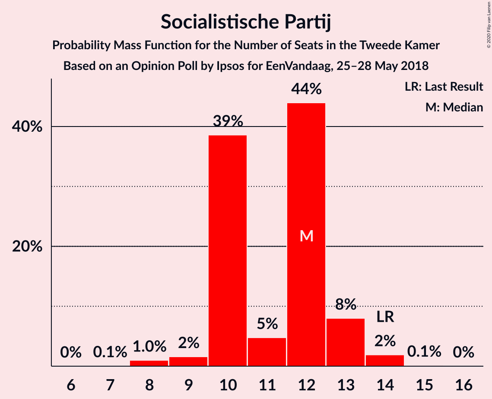

| Number of Seats | Probability | Accumulated | Special Marks |
|:---------------:|:-----------:|:-----------:|:-------------:|
| 7 | 0.1% | 100% |  |
| 8 | 1.0% | 99.9% |  |
| 9 | 2% | 99.0% |  |
| 10 | 39% | 97% |  |
| 11 | 5% | 59% |  |
| 12 | 44% | 54% | Median |
| 13 | 8% | 10% |  |
| 14 | 2% | 2% | Last Result |
| 15 | 0.1% | 0.2% |  |
| 16 | 0% | 0% |  |

### Forum voor Democratie

*For a full overview of the results for this party, see the [Forum voor Democratie](party-forumvoordemocratie.html) page.*

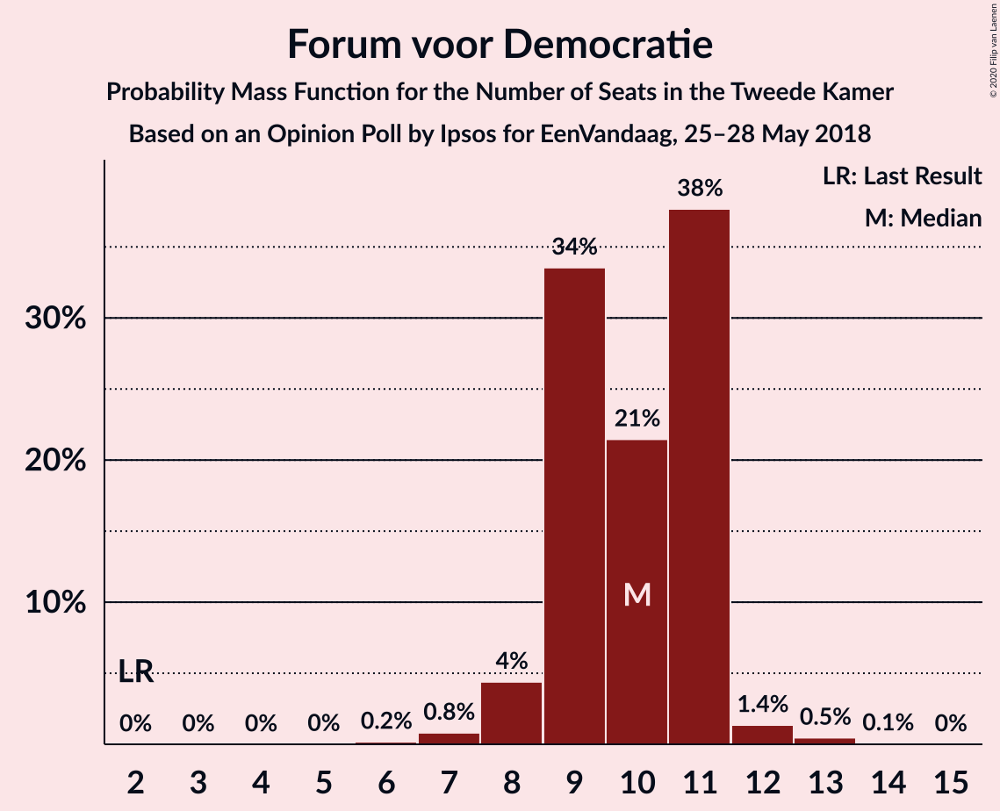

| Number of Seats | Probability | Accumulated | Special Marks |
|:---------------:|:-----------:|:-----------:|:-------------:|
| 2 | 0% | 100% | Last Result |
| 3 | 0% | 100% |  |
| 4 | 0% | 100% |  |
| 5 | 0% | 100% |  |
| 6 | 0.2% | 100% |  |
| 7 | 0.8% | 99.8% |  |
| 8 | 4% | 99.0% |  |
| 9 | 34% | 95% |  |
| 10 | 21% | 61% | Median |
| 11 | 38% | 40% |  |
| 12 | 1.4% | 2% |  |
| 13 | 0.5% | 0.5% |  |
| 14 | 0.1% | 0.1% |  |
| 15 | 0% | 0% |  |

### Partij van de Arbeid

*For a full overview of the results for this party, see the [Partij van de Arbeid](party-partijvandearbeid.html) page.*

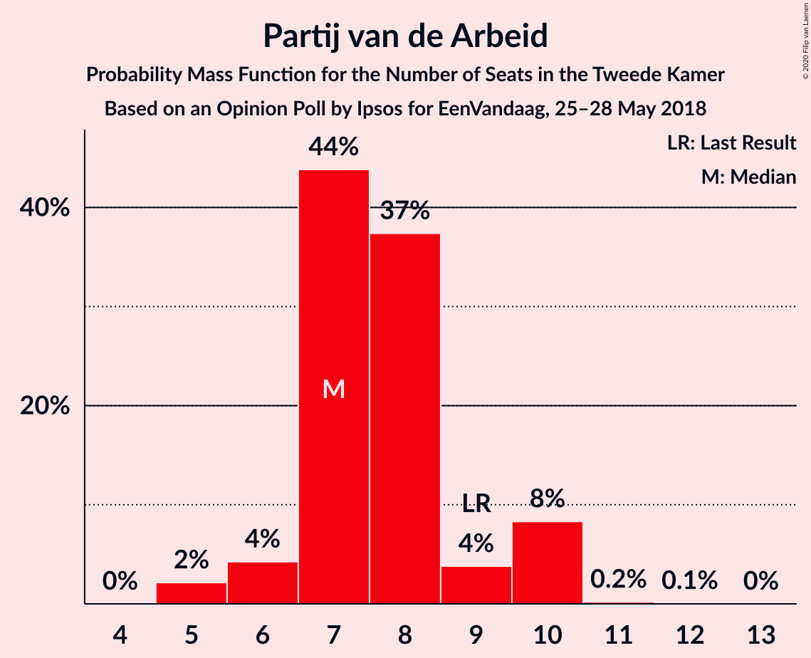

| Number of Seats | Probability | Accumulated | Special Marks |
|:---------------:|:-----------:|:-----------:|:-------------:|
| 5 | 2% | 100% |  |
| 6 | 4% | 98% |  |
| 7 | 44% | 94% | Median |
| 8 | 37% | 50% |  |
| 9 | 4% | 12% | Last Result |
| 10 | 8% | 9% |  |
| 11 | 0.2% | 0.3% |  |
| 12 | 0.1% | 0.1% |  |
| 13 | 0% | 0% |  |

### Partij voor de Dieren

*For a full overview of the results for this party, see the [Partij voor de Dieren](party-partijvoordedieren.html) page.*

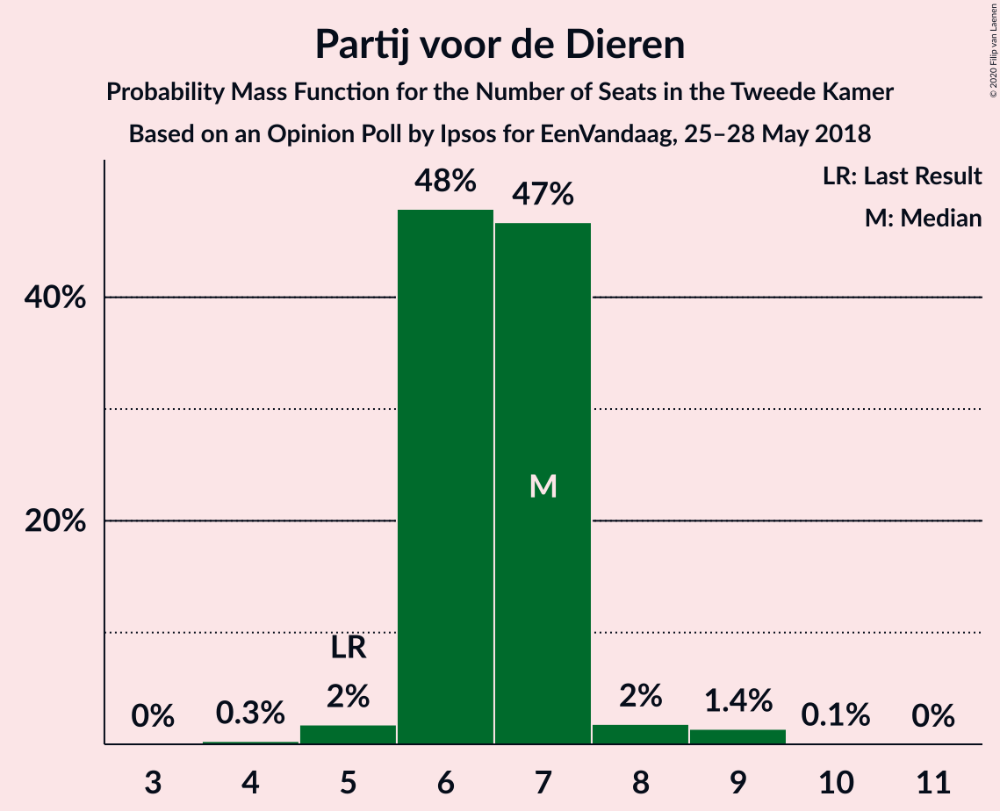

| Number of Seats | Probability | Accumulated | Special Marks |
|:---------------:|:-----------:|:-----------:|:-------------:|
| 4 | 0.3% | 100% |  |
| 5 | 2% | 99.7% | Last Result |
| 6 | 48% | 98% |  |
| 7 | 47% | 50% | Median |
| 8 | 2% | 3% |  |
| 9 | 1.4% | 1.5% |  |
| 10 | 0.1% | 0.1% |  |
| 11 | 0% | 0% |  |

### ChristenUnie

*For a full overview of the results for this party, see the [ChristenUnie](party-christenunie.html) page.*

| Number of Seats | Probability | Accumulated | Special Marks |
|:---------------:|:-----------:|:-----------:|:-------------:|
| 4 | 0.8% | 100% |  |
| 5 | 2% | 99.2% | Last Result |
| 6 | 53% | 97% | Median |
| 7 | 40% | 44% |  |
| 8 | 3% | 4% |  |
| 9 | 1.5% | 2% |  |
| 10 | 0.1% | 0.1% |  |
| 11 | 0% | 0% |  |

### 50Plus

*For a full overview of the results for this party, see the [50Plus](party-50plus.html) page.*

| Number of Seats | Probability | Accumulated | Special Marks |
|:---------------:|:-----------:|:-----------:|:-------------:|
| 3 | 0.8% | 100% |  |
| 4 | 53% | 99.2% | Last Result, Median |
| 5 | 8% | 47% |  |
| 6 | 31% | 39% |  |
| 7 | 7% | 8% |  |
| 8 | 0.3% | 0.3% |  |
| 9 | 0% | 0% |  |

### DENK

*For a full overview of the results for this party, see the [DENK](party-denk.html) page.*

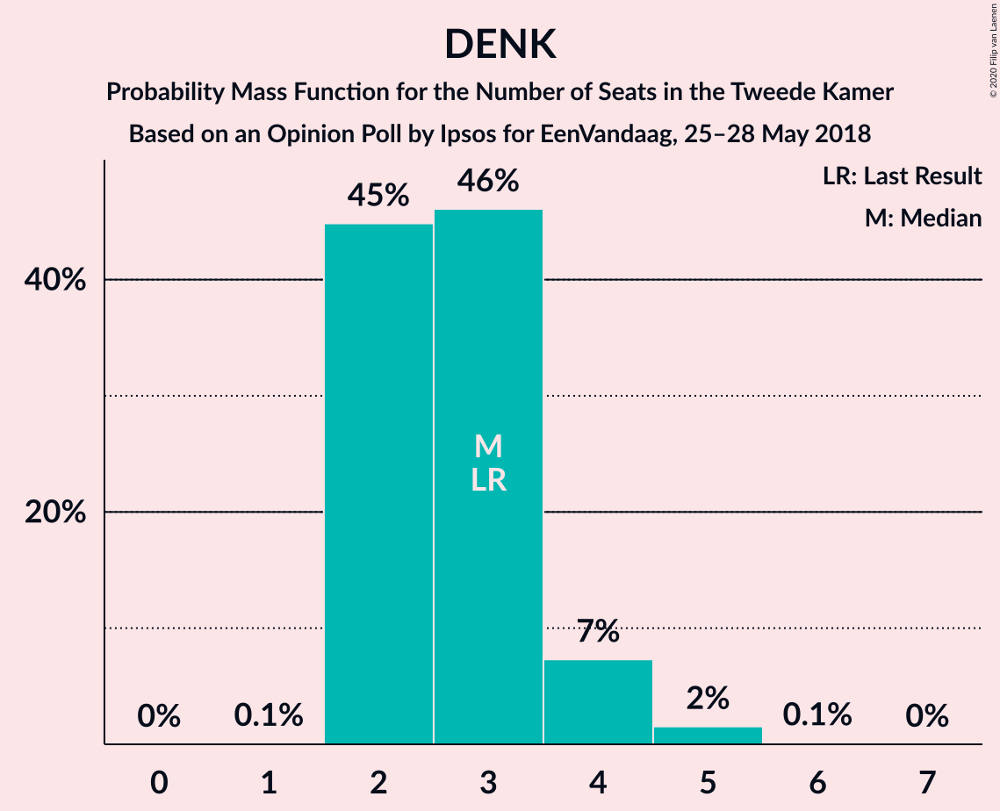

| Number of Seats | Probability | Accumulated | Special Marks |
|:---------------:|:-----------:|:-----------:|:-------------:|
| 1 | 0.1% | 100% |  |
| 2 | 45% | 99.9% |  |
| 3 | 46% | 55% | Last Result, Median |
| 4 | 7% | 9% |  |
| 5 | 2% | 2% |  |
| 6 | 0.1% | 0.1% |  |
| 7 | 0% | 0% |  |

### Staatkundig Gereformeerde Partij

*For a full overview of the results for this party, see the [Staatkundig Gereformeerde Partij](party-staatkundiggereformeerdepartij.html) page.*

| Number of Seats | Probability | Accumulated | Special Marks |
|:---------------:|:-----------:|:-----------:|:-------------:|
| 1 | 0.4% | 100% |  |
| 2 | 47% | 99.6% |  |
| 3 | 49% | 53% | Last Result, Median |
| 4 | 3% | 3% |  |
| 5 | 0.5% | 0.5% |  |
| 6 | 0% | 0% |  |

## Coalitions

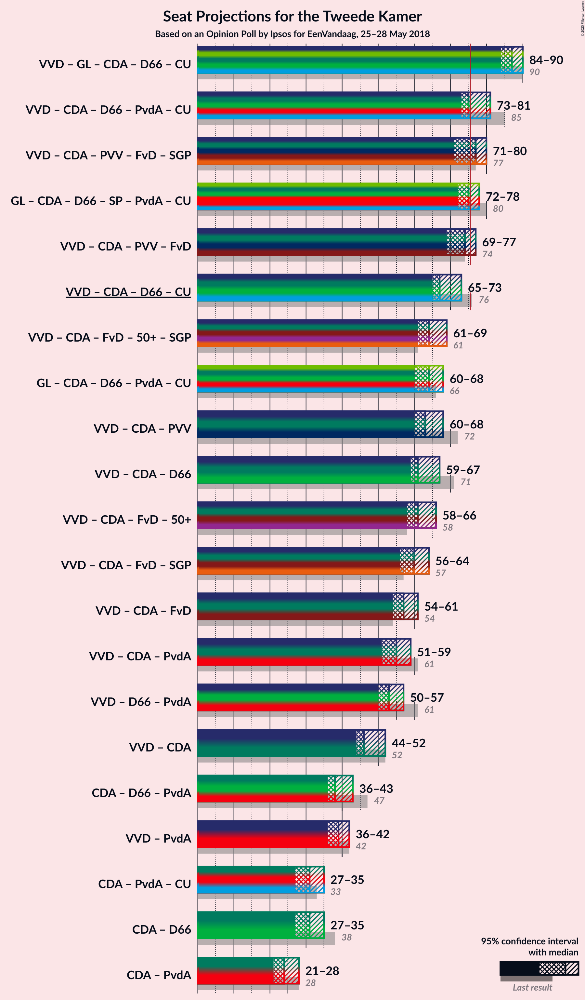

### Confidence Intervals

| Coalition | Last Result | Median | Majority? | 80% Confidence Interval | 90% Confidence Interval | 95% Confidence Interval | 99% Confidence Interval |
|:---------:|:-----------:|:------:|:---------:|:-----------------------:|:-----------------------:|:-----------------------:|:-----------------------:|
| Volkspartij voor Vrijheid en Democratie – GroenLinks – Christen-Democratisch Appèl – Democraten 66 – ChristenUnie | 90 | 87 | 100% | 85–87 | 85–89 | 84–90 | 81–93 |
| Volkspartij voor Vrijheid en Democratie – Christen-Democratisch Appèl – Democraten 66 – Partij van de Arbeid – ChristenUnie | 85 | 75 | 46% | 74–79 | 74–79 | 73–81 | 72–84 |
| Volkspartij voor Vrijheid en Democratie – Christen-Democratisch Appèl – Partij voor de Vrijheid – Forum voor Democratie – Staatkundig Gereformeerde Partij | 77 | 77 | 86% | 75–79 | 73–79 | 71–80 | 71–82 |
| GroenLinks – Christen-Democratisch Appèl – Democraten 66 – Socialistische Partij – Partij van de Arbeid – ChristenUnie | 80 | 75 | 42% | 72–77 | 72–77 | 72–78 | 70–82 |
| Volkspartij voor Vrijheid en Democratie – Christen-Democratisch Appèl – Partij voor de Vrijheid – Forum voor Democratie | 74 | 74 | 32% | 73–77 | 71–77 | 69–77 | 68–78 |
| Volkspartij voor Vrijheid en Democratie – Christen-Democratisch Appèl – Democraten 66 – ChristenUnie | 76 | 67 | 0.4% | 67–71 | 65–71 | 65–73 | 63–75 |
| Volkspartij voor Vrijheid en Democratie – Christen-Democratisch Appèl – Forum voor Democratie – 50Plus – Staatkundig Gereformeerde Partij | 61 | 64 | 0% | 62–68 | 62–68 | 61–69 | 60–72 |
| GroenLinks – Christen-Democratisch Appèl – Democraten 66 – Partij van de Arbeid – ChristenUnie | 66 | 64 | 0% | 61–65 | 60–65 | 60–68 | 59–72 |
| Volkspartij voor Vrijheid en Democratie – Christen-Democratisch Appèl – Partij voor de Vrijheid | 72 | 63 | 0% | 63–68 | 61–68 | 60–68 | 59–70 |
| Volkspartij voor Vrijheid en Democratie – Christen-Democratisch Appèl – Democraten 66 | 71 | 61 | 0% | 60–65 | 59–65 | 59–67 | 57–68 |
| Volkspartij voor Vrijheid en Democratie – Christen-Democratisch Appèl – Forum voor Democratie – 50Plus | 58 | 61 | 0% | 60–66 | 60–66 | 58–66 | 57–68 |
| Volkspartij voor Vrijheid en Democratie – Christen-Democratisch Appèl – Forum voor Democratie – Staatkundig Gereformeerde Partij | 57 | 60 | 0% | 58–62 | 57–62 | 56–64 | 54–67 |
| Volkspartij voor Vrijheid en Democratie – Christen-Democratisch Appèl – Forum voor Democratie | 54 | 57 | 0% | 56–60 | 54–60 | 54–61 | 52–64 |
| Volkspartij voor Vrijheid en Democratie – Christen-Democratisch Appèl – Partij van de Arbeid | 61 | 55 | 0% | 53–59 | 52–59 | 51–59 | 50–61 |
| Volkspartij voor Vrijheid en Democratie – Democraten 66 – Partij van de Arbeid | 61 | 53 | 0% | 50–56 | 50–56 | 50–57 | 49–61 |
| Volkspartij voor Vrijheid en Democratie – Christen-Democratisch Appèl | 52 | 46 | 0% | 46–51 | 46–51 | 44–52 | 43–53 |
| Christen-Democratisch Appèl – Democraten 66 – Partij van de Arbeid | 47 | 38 | 0% | 37–42 | 37–42 | 36–43 | 35–44 |
| Volkspartij voor Vrijheid en Democratie – Partij van de Arbeid | 42 | 39 | 0% | 36–41 | 36–42 | 36–42 | 35–45 |
| Christen-Democratisch Appèl – Partij van de Arbeid – ChristenUnie | 33 | 31 | 0% | 28–34 | 28–34 | 27–35 | 26–36 |
| Christen-Democratisch Appèl – Democraten 66 | 38 | 31 | 0% | 30–34 | 27–34 | 27–35 | 27–35 |
| Christen-Democratisch Appèl – Partij van de Arbeid | 28 | 24 | 0% | 22–28 | 22–28 | 21–28 | 20–28 |

### Volkspartij voor Vrijheid en Democratie – GroenLinks – Christen-Democratisch Appèl – Democraten 66 – ChristenUnie

| Number of Seats | Probability | Accumulated | Special Marks |
|:---------------:|:-----------:|:-----------:|:-------------:|
| 78 | 0.2% | 100% |  |
| 79 | 0% | 99.7% |  |
| 80 | 0% | 99.7% |  |
| 81 | 0.3% | 99.7% |  |
| 82 | 0.2% | 99.4% |  |
| 83 | 1.4% | 99.2% |  |
| 84 | 1.3% | 98% |  |
| 85 | 16% | 96% |  |
| 86 | 1.3% | 81% | Median |
| 87 | 71% | 79% |  |
| 88 | 1.1% | 8% |  |
| 89 | 3% | 7% |  |
| 90 | 2% | 4% | Last Result |
| 91 | 1.0% | 2% |  |
| 92 | 0.5% | 1.1% |  |
| 93 | 0.3% | 0.6% |  |
| 94 | 0.1% | 0.3% |  |
| 95 | 0% | 0.2% |  |
| 96 | 0.2% | 0.2% |  |
| 97 | 0% | 0% |  |

### Volkspartij voor Vrijheid en Democratie – Christen-Democratisch Appèl – Democraten 66 – Partij van de Arbeid – ChristenUnie

| Number of Seats | Probability | Accumulated | Special Marks |
|:---------------:|:-----------:|:-----------:|:-------------:|
| 70 | 0.1% | 100% |  |
| 71 | 0.3% | 99.9% |  |
| 72 | 0.4% | 99.6% |  |
| 73 | 3% | 99.2% |  |
| 74 | 37% | 96% |  |
| 75 | 13% | 59% | Median |
| 76 | 1.3% | 46% | Majority |
| 77 | 8% | 44% |  |
| 78 | 3% | 36% |  |
| 79 | 29% | 33% |  |
| 80 | 1.0% | 4% |  |
| 81 | 1.2% | 3% |  |
| 82 | 1.3% | 2% |  |
| 83 | 0.2% | 0.7% |  |
| 84 | 0.5% | 0.5% |  |
| 85 | 0% | 0.1% | Last Result |
| 86 | 0% | 0% |  |

### Volkspartij voor Vrijheid en Democratie – Christen-Democratisch Appèl – Partij voor de Vrijheid – Forum voor Democratie – Staatkundig Gereformeerde Partij

| Number of Seats | Probability | Accumulated | Special Marks |
|:---------------:|:-----------:|:-----------:|:-------------:|
| 69 | 0.2% | 100% |  |
| 70 | 0.1% | 99.7% |  |
| 71 | 2% | 99.6% |  |
| 72 | 1.1% | 97% |  |
| 73 | 2% | 96% |  |
| 74 | 2% | 94% |  |
| 75 | 7% | 93% |  |
| 76 | 7% | 86% | Majority |
| 77 | 43% | 79% | Last Result |
| 78 | 4% | 36% | Median |
| 79 | 29% | 31% |  |
| 80 | 2% | 3% |  |
| 81 | 0.4% | 1.1% |  |
| 82 | 0.5% | 0.8% |  |
| 83 | 0.2% | 0.3% |  |
| 84 | 0% | 0% |  |

### GroenLinks – Christen-Democratisch Appèl – Democraten 66 – Socialistische Partij – Partij van de Arbeid – ChristenUnie

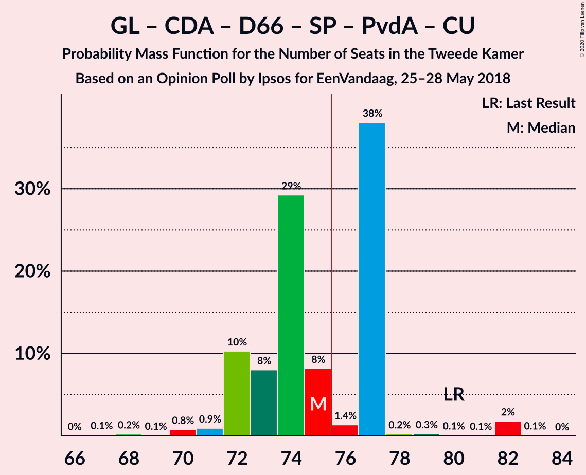

| Number of Seats | Probability | Accumulated | Special Marks |
|:---------------:|:-----------:|:-----------:|:-------------:|
| 67 | 0.1% | 100% |  |
| 68 | 0.2% | 99.8% |  |
| 69 | 0.1% | 99.6% |  |
| 70 | 0.8% | 99.5% |  |
| 71 | 0.9% | 98.7% |  |
| 72 | 10% | 98% |  |
| 73 | 8% | 87% |  |
| 74 | 29% | 79% | Median |
| 75 | 8% | 50% |  |
| 76 | 1.4% | 42% | Majority |
| 77 | 38% | 41% |  |
| 78 | 0.2% | 3% |  |
| 79 | 0.3% | 2% |  |
| 80 | 0.1% | 2% | Last Result |
| 81 | 0.1% | 2% |  |
| 82 | 2% | 2% |  |
| 83 | 0.1% | 0.1% |  |
| 84 | 0% | 0% |  |

### Volkspartij voor Vrijheid en Democratie – Christen-Democratisch Appèl – Partij voor de Vrijheid – Forum voor Democratie

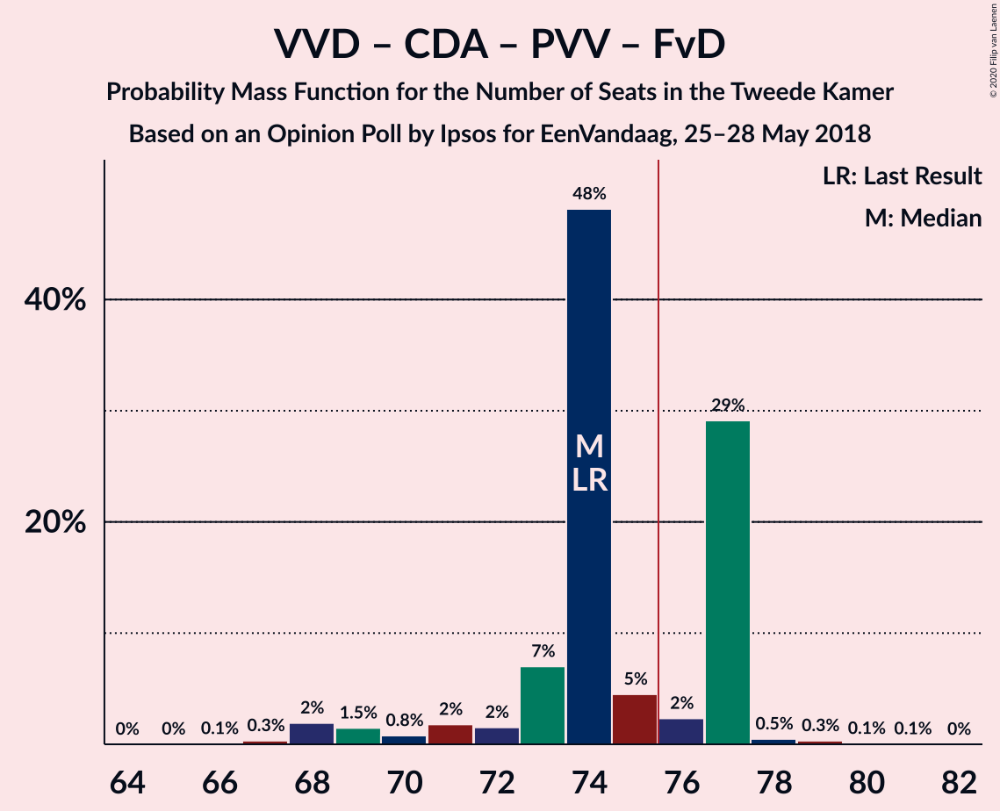

| Number of Seats | Probability | Accumulated | Special Marks |
|:---------------:|:-----------:|:-----------:|:-------------:|
| 66 | 0.1% | 100% |  |
| 67 | 0.3% | 99.9% |  |
| 68 | 2% | 99.6% |  |
| 69 | 1.5% | 98% |  |
| 70 | 0.8% | 96% |  |
| 71 | 2% | 95% |  |
| 72 | 2% | 94% |  |
| 73 | 7% | 92% |  |
| 74 | 48% | 85% | Last Result |
| 75 | 5% | 37% | Median |
| 76 | 2% | 32% | Majority |
| 77 | 29% | 30% |  |
| 78 | 0.5% | 0.9% |  |
| 79 | 0.3% | 0.5% |  |
| 80 | 0.1% | 0.1% |  |
| 81 | 0.1% | 0.1% |  |
| 82 | 0% | 0% |  |

### Volkspartij voor Vrijheid en Democratie – Christen-Democratisch Appèl – Democraten 66 – ChristenUnie

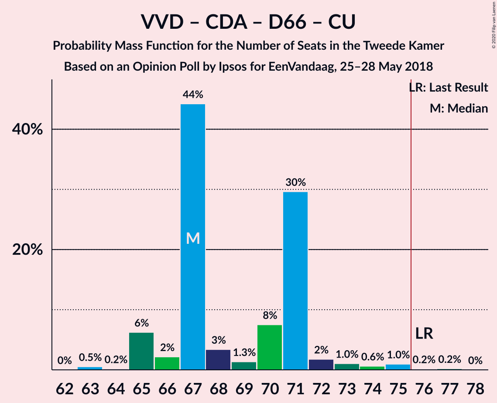

| Number of Seats | Probability | Accumulated | Special Marks |
|:---------------:|:-----------:|:-----------:|:-------------:|
| 63 | 0.5% | 100% |  |
| 64 | 0.2% | 99.4% |  |
| 65 | 6% | 99.3% |  |
| 66 | 2% | 93% |  |
| 67 | 44% | 91% |  |
| 68 | 3% | 47% | Median |
| 69 | 1.3% | 43% |  |
| 70 | 8% | 42% |  |
| 71 | 30% | 34% |  |
| 72 | 2% | 5% |  |
| 73 | 1.0% | 3% |  |
| 74 | 0.6% | 2% |  |
| 75 | 1.0% | 1.3% |  |
| 76 | 0.2% | 0.4% | Last Result, Majority |
| 77 | 0.2% | 0.2% |  |
| 78 | 0% | 0% |  |

### Volkspartij voor Vrijheid en Democratie – Christen-Democratisch Appèl – Forum voor Democratie – 50Plus – Staatkundig Gereformeerde Partij

| Number of Seats | Probability | Accumulated | Special Marks |
|:---------------:|:-----------:|:-----------:|:-------------:|
| 58 | 0% | 100% |  |
| 59 | 0.2% | 99.9% |  |
| 60 | 0.9% | 99.7% |  |
| 61 | 2% | 98.8% | Last Result |
| 62 | 7% | 96% |  |
| 63 | 4% | 90% |  |
| 64 | 37% | 85% |  |
| 65 | 7% | 49% | Median |
| 66 | 4% | 42% |  |
| 67 | 6% | 38% |  |
| 68 | 29% | 32% |  |
| 69 | 1.0% | 3% |  |
| 70 | 1.2% | 2% |  |
| 71 | 0.5% | 1.1% |  |
| 72 | 0.4% | 0.7% |  |
| 73 | 0.2% | 0.2% |  |
| 74 | 0.1% | 0.1% |  |
| 75 | 0% | 0% |  |

### GroenLinks – Christen-Democratisch Appèl – Democraten 66 – Partij van de Arbeid – ChristenUnie

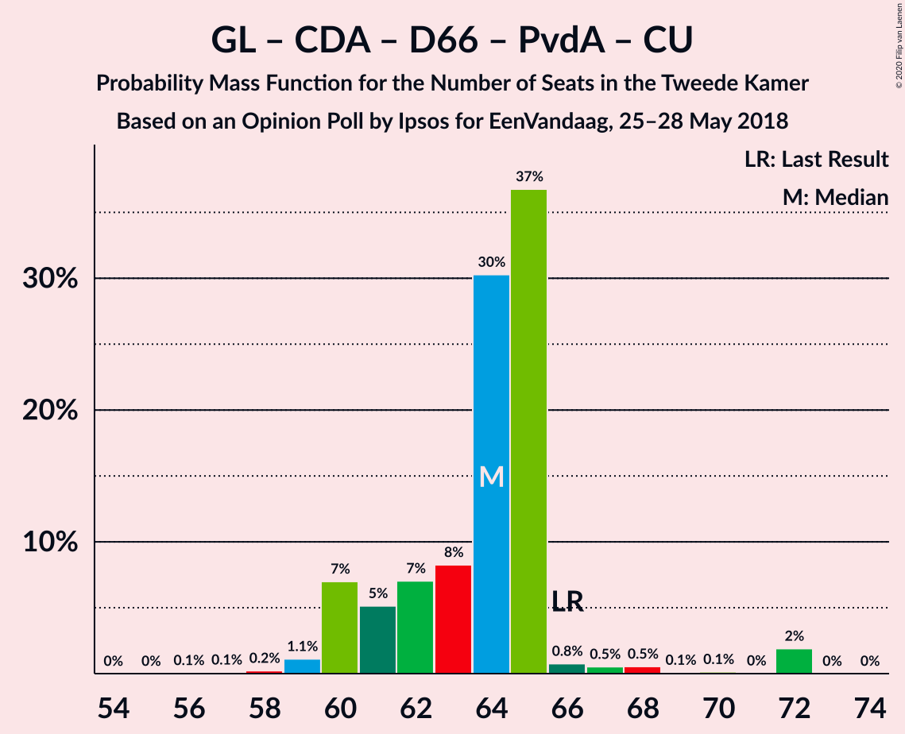

| Number of Seats | Probability | Accumulated | Special Marks |
|:---------------:|:-----------:|:-----------:|:-------------:|
| 56 | 0.1% | 100% |  |
| 57 | 0.1% | 99.9% |  |
| 58 | 0.2% | 99.8% |  |
| 59 | 1.1% | 99.6% |  |
| 60 | 7% | 98% |  |
| 61 | 5% | 91% |  |
| 62 | 7% | 86% | Median |
| 63 | 8% | 79% |  |
| 64 | 30% | 71% |  |
| 65 | 37% | 41% |  |
| 66 | 0.8% | 4% | Last Result |
| 67 | 0.5% | 3% |  |
| 68 | 0.5% | 3% |  |
| 69 | 0.1% | 2% |  |
| 70 | 0.1% | 2% |  |
| 71 | 0% | 2% |  |
| 72 | 2% | 2% |  |
| 73 | 0% | 0% |  |

### Volkspartij voor Vrijheid en Democratie – Christen-Democratisch Appèl – Partij voor de Vrijheid

| Number of Seats | Probability | Accumulated | Special Marks |
|:---------------:|:-----------:|:-----------:|:-------------:|
| 57 | 0.2% | 100% |  |
| 58 | 0.1% | 99.7% |  |
| 59 | 1.0% | 99.6% |  |
| 60 | 2% | 98.5% |  |
| 61 | 3% | 96% |  |
| 62 | 0.6% | 93% |  |
| 63 | 43% | 93% |  |
| 64 | 13% | 50% |  |
| 65 | 3% | 37% | Median |
| 66 | 3% | 34% |  |
| 67 | 2% | 31% |  |
| 68 | 28% | 29% |  |
| 69 | 0.3% | 0.9% |  |
| 70 | 0.4% | 0.6% |  |
| 71 | 0.1% | 0.2% |  |
| 72 | 0% | 0% | Last Result |

### Volkspartij voor Vrijheid en Democratie – Christen-Democratisch Appèl – Democraten 66

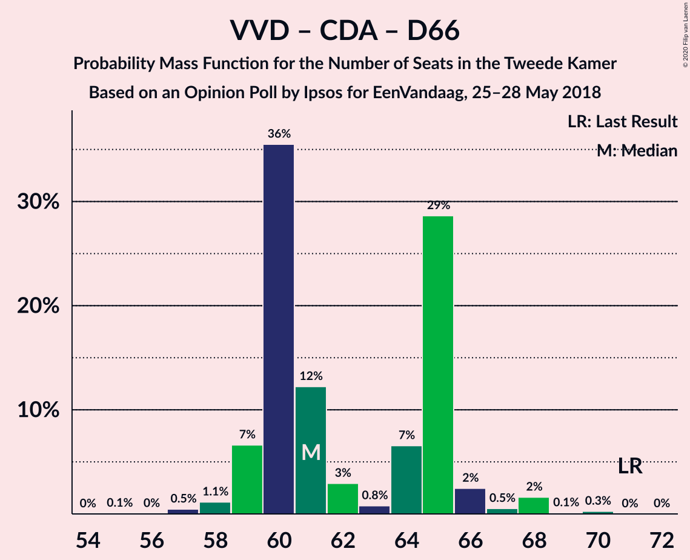

| Number of Seats | Probability | Accumulated | Special Marks |
|:---------------:|:-----------:|:-----------:|:-------------:|
| 55 | 0.1% | 100% |  |
| 56 | 0% | 99.9% |  |
| 57 | 0.5% | 99.9% |  |
| 58 | 1.1% | 99.4% |  |
| 59 | 7% | 98% |  |
| 60 | 36% | 92% |  |
| 61 | 12% | 56% |  |
| 62 | 3% | 44% | Median |
| 63 | 0.8% | 41% |  |
| 64 | 7% | 40% |  |
| 65 | 29% | 34% |  |
| 66 | 2% | 5% |  |
| 67 | 0.5% | 3% |  |
| 68 | 2% | 2% |  |
| 69 | 0.1% | 0.4% |  |
| 70 | 0.3% | 0.3% |  |
| 71 | 0% | 0% | Last Result |

### Volkspartij voor Vrijheid en Democratie – Christen-Democratisch Appèl – Forum voor Democratie – 50Plus

| Number of Seats | Probability | Accumulated | Special Marks |
|:---------------:|:-----------:|:-----------:|:-------------:|
| 55 | 0% | 100% |  |
| 56 | 0.1% | 99.9% |  |
| 57 | 0.4% | 99.8% |  |
| 58 | 2% | 99.4% | Last Result |
| 59 | 0.9% | 97% |  |
| 60 | 11% | 96% |  |
| 61 | 36% | 85% |  |
| 62 | 2% | 50% | Median |
| 63 | 8% | 48% |  |
| 64 | 8% | 40% |  |
| 65 | 0.6% | 32% |  |
| 66 | 30% | 31% |  |
| 67 | 0.6% | 1.4% |  |
| 68 | 0.3% | 0.8% |  |
| 69 | 0.2% | 0.4% |  |
| 70 | 0% | 0.2% |  |
| 71 | 0.2% | 0.2% |  |
| 72 | 0% | 0% |  |

### Volkspartij voor Vrijheid en Democratie – Christen-Democratisch Appèl – Forum voor Democratie – Staatkundig Gereformeerde Partij

| Number of Seats | Probability | Accumulated | Special Marks |
|:---------------:|:-----------:|:-----------:|:-------------:|
| 53 | 0% | 100% |  |
| 54 | 0.8% | 99.9% |  |
| 55 | 0.5% | 99.2% |  |
| 56 | 2% | 98.7% |  |
| 57 | 3% | 97% | Last Result |
| 58 | 9% | 94% |  |
| 59 | 1.4% | 85% |  |
| 60 | 41% | 83% |  |
| 61 | 8% | 42% | Median |
| 62 | 31% | 35% |  |
| 63 | 1.2% | 4% |  |
| 64 | 0.5% | 3% |  |
| 65 | 1.0% | 2% |  |
| 66 | 0.4% | 1.1% |  |
| 67 | 0.5% | 0.7% |  |
| 68 | 0.2% | 0.2% |  |
| 69 | 0% | 0% |  |

### Volkspartij voor Vrijheid en Democratie – Christen-Democratisch Appèl – Forum voor Democratie

| Number of Seats | Probability | Accumulated | Special Marks |
|:---------------:|:-----------:|:-----------:|:-------------:|
| 50 | 0% | 100% |  |
| 51 | 0.1% | 99.9% |  |
| 52 | 1.0% | 99.9% |  |
| 53 | 1.2% | 98.9% |  |
| 54 | 3% | 98% | Last Result |
| 55 | 4% | 95% |  |
| 56 | 7% | 91% |  |
| 57 | 42% | 84% |  |
| 58 | 1.5% | 42% | Median |
| 59 | 7% | 41% |  |
| 60 | 30% | 33% |  |
| 61 | 2% | 3% |  |
| 62 | 0.8% | 1.5% |  |
| 63 | 0.1% | 0.6% |  |
| 64 | 0.3% | 0.5% |  |
| 65 | 0.2% | 0.2% |  |
| 66 | 0% | 0% |  |

### Volkspartij voor Vrijheid en Democratie – Christen-Democratisch Appèl – Partij van de Arbeid

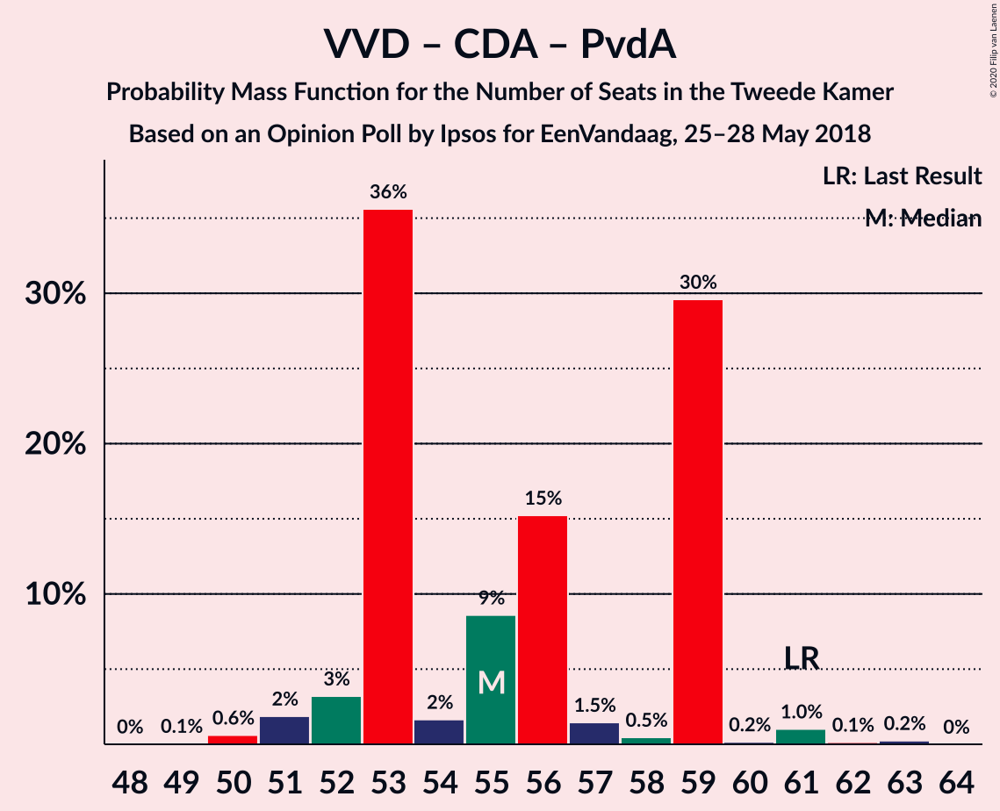

| Number of Seats | Probability | Accumulated | Special Marks |
|:---------------:|:-----------:|:-----------:|:-------------:|
| 49 | 0.1% | 100% |  |
| 50 | 0.6% | 99.9% |  |
| 51 | 2% | 99.3% |  |
| 52 | 3% | 97% |  |
| 53 | 36% | 94% |  |
| 54 | 2% | 59% |  |
| 55 | 9% | 57% | Median |
| 56 | 15% | 48% |  |
| 57 | 1.5% | 33% |  |
| 58 | 0.5% | 32% |  |
| 59 | 30% | 31% |  |
| 60 | 0.2% | 2% |  |
| 61 | 1.0% | 1.4% | Last Result |
| 62 | 0.1% | 0.4% |  |
| 63 | 0.2% | 0.3% |  |
| 64 | 0% | 0% |  |

### Volkspartij voor Vrijheid en Democratie – Democraten 66 – Partij van de Arbeid

| Number of Seats | Probability | Accumulated | Special Marks |
|:---------------:|:-----------:|:-----------:|:-------------:|
| 47 | 0.1% | 100% |  |
| 48 | 0.3% | 99.9% |  |
| 49 | 0.7% | 99.6% |  |
| 50 | 35% | 98.9% |  |
| 51 | 4% | 64% |  |
| 52 | 2% | 59% | Median |
| 53 | 37% | 57% |  |
| 54 | 1.3% | 20% |  |
| 55 | 7% | 18% |  |
| 56 | 7% | 12% |  |
| 57 | 2% | 5% |  |
| 58 | 1.0% | 2% |  |
| 59 | 0.1% | 1.4% |  |
| 60 | 0.2% | 1.3% |  |
| 61 | 1.1% | 1.1% | Last Result |
| 62 | 0% | 0% |  |

### Volkspartij voor Vrijheid en Democratie – Christen-Democratisch Appèl

| Number of Seats | Probability | Accumulated | Special Marks |
|:---------------:|:-----------:|:-----------:|:-------------:|
| 42 | 0.3% | 100% |  |
| 43 | 1.3% | 99.7% |  |
| 44 | 1.0% | 98% |  |
| 45 | 0.5% | 97% |  |
| 46 | 48% | 97% |  |
| 47 | 7% | 49% |  |
| 48 | 1.2% | 42% | Median |
| 49 | 8% | 41% |  |
| 50 | 2% | 33% |  |
| 51 | 28% | 31% |  |
| 52 | 2% | 3% | Last Result |
| 53 | 0.6% | 1.0% |  |
| 54 | 0.3% | 0.4% |  |
| 55 | 0.1% | 0.2% |  |
| 56 | 0% | 0% |  |

### Christen-Democratisch Appèl – Democraten 66 – Partij van de Arbeid

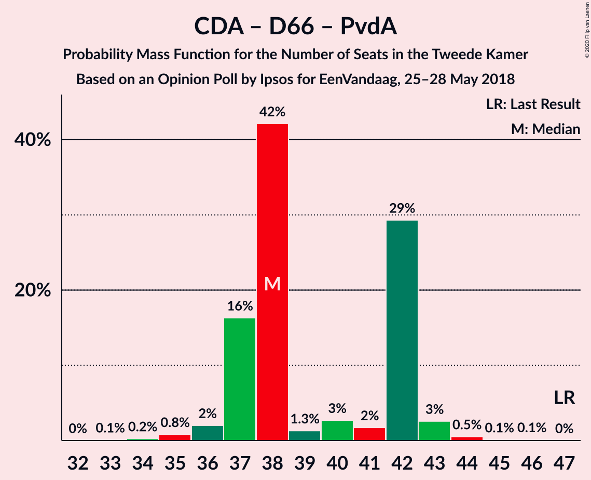

| Number of Seats | Probability | Accumulated | Special Marks |
|:---------------:|:-----------:|:-----------:|:-------------:|
| 33 | 0.1% | 100% |  |
| 34 | 0.2% | 99.9% |  |
| 35 | 0.8% | 99.6% |  |
| 36 | 2% | 98.8% |  |
| 37 | 16% | 97% |  |
| 38 | 42% | 81% | Median |
| 39 | 1.3% | 38% |  |
| 40 | 3% | 37% |  |
| 41 | 2% | 34% |  |
| 42 | 29% | 33% |  |
| 43 | 3% | 3% |  |
| 44 | 0.5% | 0.8% |  |
| 45 | 0.1% | 0.3% |  |
| 46 | 0.1% | 0.2% |  |
| 47 | 0% | 0% | Last Result |

### Volkspartij voor Vrijheid en Democratie – Partij van de Arbeid

| Number of Seats | Probability | Accumulated | Special Marks |
|:---------------:|:-----------:|:-----------:|:-------------:|
| 33 | 0.1% | 100% |  |
| 34 | 0.1% | 99.9% |  |
| 35 | 0.9% | 99.8% |  |
| 36 | 40% | 98.9% |  |
| 37 | 1.3% | 58% |  |
| 38 | 5% | 57% | Median |
| 39 | 34% | 53% |  |
| 40 | 1.5% | 18% |  |
| 41 | 7% | 17% |  |
| 42 | 7% | 10% | Last Result |
| 43 | 0.5% | 2% |  |
| 44 | 0.2% | 2% |  |
| 45 | 1.3% | 1.4% |  |
| 46 | 0% | 0.1% |  |
| 47 | 0% | 0.1% |  |
| 48 | 0% | 0% |  |

### Christen-Democratisch Appèl – Partij van de Arbeid – ChristenUnie

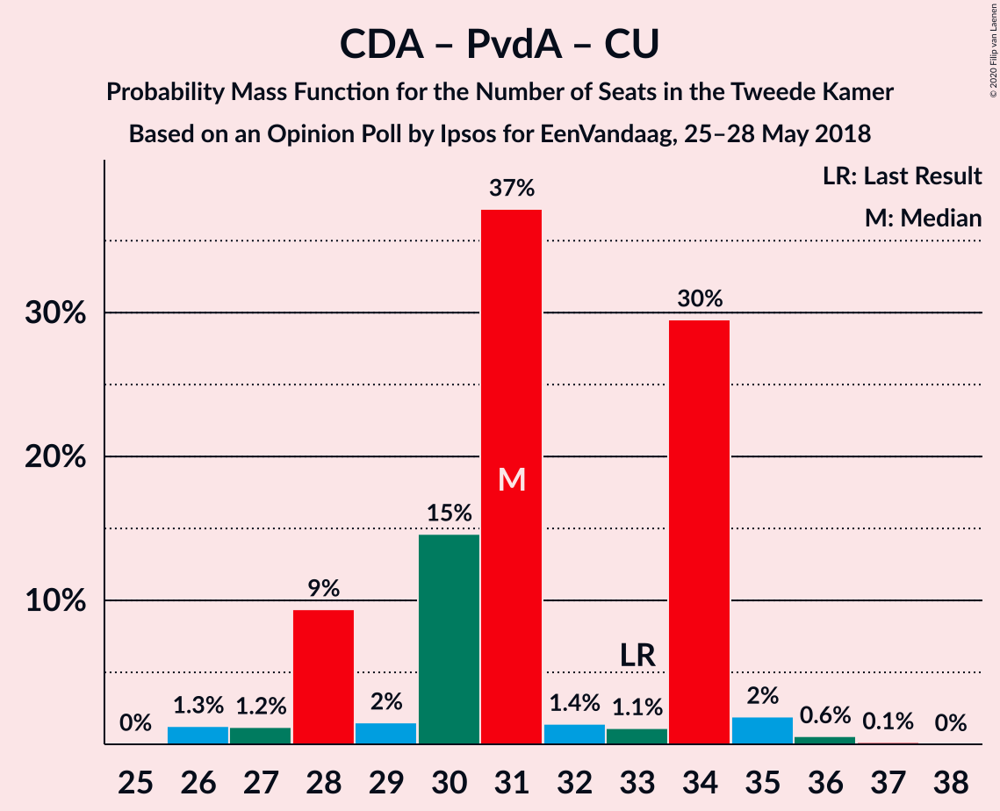

| Number of Seats | Probability | Accumulated | Special Marks |
|:---------------:|:-----------:|:-----------:|:-------------:|
| 25 | 0% | 100% |  |
| 26 | 1.3% | 99.9% |  |
| 27 | 1.2% | 98.7% |  |
| 28 | 9% | 97% |  |
| 29 | 2% | 88% |  |
| 30 | 15% | 87% | Median |
| 31 | 37% | 72% |  |
| 32 | 1.4% | 35% |  |
| 33 | 1.1% | 33% | Last Result |
| 34 | 30% | 32% |  |
| 35 | 2% | 3% |  |
| 36 | 0.6% | 0.7% |  |
| 37 | 0.1% | 0.2% |  |
| 38 | 0% | 0% |  |

### Christen-Democratisch Appèl – Democraten 66

| Number of Seats | Probability | Accumulated | Special Marks |
|:---------------:|:-----------:|:-----------:|:-------------:|
| 26 | 0.2% | 100% |  |
| 27 | 7% | 99.8% |  |
| 28 | 2% | 93% |  |
| 29 | 0.4% | 91% |  |
| 30 | 13% | 91% |  |
| 31 | 41% | 78% | Median |
| 32 | 3% | 37% |  |
| 33 | 3% | 35% |  |
| 34 | 29% | 32% |  |
| 35 | 2% | 3% |  |
| 36 | 0.3% | 0.5% |  |
| 37 | 0.2% | 0.2% |  |
| 38 | 0% | 0% | Last Result |

### Christen-Democratisch Appèl – Partij van de Arbeid

| Number of Seats | Probability | Accumulated | Special Marks |
|:---------------:|:-----------:|:-----------:|:-------------:|
| 19 | 0.1% | 100% |  |
| 20 | 2% | 99.9% |  |
| 21 | 1.4% | 98% |  |
| 22 | 10% | 97% |  |
| 23 | 1.4% | 87% |  |
| 24 | 49% | 86% | Median |
| 25 | 3% | 37% |  |
| 26 | 3% | 34% |  |
| 27 | 1.1% | 31% |  |
| 28 | 30% | 30% | Last Result |
| 29 | 0.1% | 0.3% |  |
| 30 | 0.1% | 0.1% |  |
| 31 | 0% | 0% |  |

## Technical Information

### Opinion Poll

+ **Polling firm:** Ipsos
+ **Commissioner(s):** EenVandaag
+ **Fieldwork period:** 25–28 May 2018

### Calculations

+ **Sample size:** 1045
+ **Simulations done:** 1,048,576
+ **Error estimate:** 3.60%

